# Why the Harness Matters More Than the Model (YC Paper Club)

> **Source:** [Why The Harness Matters More Than The Model | YC Paper Club](https://youtu.be/n9xKblqyQ28?si=WENk4fwvsTQH0wyq) by Y Combinator
> **Related notes:** [Graph Engineering](Graph%20Engineering%20-%20Agent%20Workflows%20as%20DAGs.md) (orchestration shapes) · [Agent Memory](Agent%20Memory%20-%20Long-Term%20Memory%20with%20Mem0.md) (the memory part of a harness) · [BM25 for agentic search](BM25%20-%20Keyword%20Search%20for%20AI%20Agents.md) · [DeepSeek MLA](Multi-head%20Latent%20Attention%20-%20Shrinking%20the%20KV%20Cache.md) (why long context is expensive)
> **Facts re-checked:** 18 September 2026. This guide improved the most on re-checking — claims that had to be hedged as "as reported" are now backed by a published paper, an open-source release and a third-party leaderboard. See §6.6.1.
> **What's in this version:** 11 figures (anatomy and loop diagrams, a timeline of harness research, a memory-hierarchy diagram, two clearly-labelled toy simulations, and the Open Jarvis and QM architectures), the whole talk reorganized into a learning path, a working minimal harness in Python, engineering checklists, a quiz, and a glossary.

> **Read this first: a note on accuracy.** This talk is recent (2026) and the source notes came from an auto-transcript, so many **names were mis-transcribed**. This guide:
> - fixes obvious transcription errors (e.g. "ripple" → **REPL**, "Darwin machines" → **Darwin Gödel Machine**, "Dagger" → **DAgger**, "Japa" → **GEPA**, "Chris Ray" → **Christopher Ré**)
> - **Update, 18 September 2026:** most of what this guide originally had to hedge is now verifiable. Prime Agent was open-sourced (MIT) on 6 August 2026 with a paper, OpenJarvis shipped publicly from Stanford, and the ARC Prize leaderboard now publishes per-harness results. The numbers below have been checked against those primary sources — see **§6.6.1** and **§7**. Where something is still unverified it says so explicitly.

---

## 0. How to use this guide

| If you have… | Read |
|---|---|
| 15 minutes | §0.1 plain-words intro, §1 TL;DR, plus figures 1, 3, 4 and 7 |
| 1 hour | §1–§6 and §9 |
| A weekend | Everything. Run `code/minimal_harness.py`, then swap in a real LLM API |

---

### 0.1 First, in completely plain words

A language model, by itself, does exactly one thing: you hand it some text, and it hands back more text. That's all. It cannot open a file, run a command, look anything up, or remember yesterday.

**Everything else you associate with "an AI agent" is ordinary software wrapped around that one ability.** The wrapper decides what text the model gets to see, what buttons it's allowed to press, what gets written down for next time, and when to stop. That wrapper has a name: the **harness** (some people say *scaffold*).

The analogy that makes it click: the model is a brilliant consultant locked in a windowless room with no phone. The harness is the assistant outside the door — the one who decides which documents get slid under it, who carries out the instructions that come back, and who keeps the file of what's been done so far. **Hire a better consultant and you get better answers. Hire a better assistant and you often get better answers too — sometimes much more.**

That's the claim this talk makes, and the striking part is how big the effect is. On ARC-AGI-3, a reasoning benchmark, the *same model weights* score around **30%** with a plain harness and **95%** with a good one. Nothing about the model changed. (This has since been published and independently listed — §6.6.)

What's inside a harness, in plain terms:

| Piece | What it really is |
|---|---|
| The **loop** | "ask the model, do what it said, show it the result, repeat" — plus a rule for when to stop |
| **Context compilation** | deciding what to put in the prompt this turn: instructions, recent history, relevant notes, tool results |
| **Tools** | functions the model may call — search, run code, send an email |
| **Memory** | notes that survive between sessions |
| **Sub-agents** | spawning a second copy to do a bulky job and report back a summary, so the main one isn't buried in detail |
| **Limits** | maximum turns, maximum spend — and, it turns out, *minimum* effort too (§8.4) |

**The practical takeaway for an engineer:** when you compare "model A vs model B", you are never measuring the model alone. You're measuring model + harness + budget. Most published comparisons quietly change more than one of those at a time.

---

## 1. TL;DR in 10 lines

1. A **harness** (or scaffold) is everything between a raw LLM and the world: the **loop, context compilation, tools, memory, skills, sub-agents, sandboxes and limits**.
2. The model is a fixed next-token predictor. The harness decides **what it sees, what it can do, and what it remembers**.
3. The talk's core claim: **a large share of visible "AI progress" comes from better harnesses on the same weights**. On ARC-AGI-3, the same model goes from about **30% → 95.5%** purely by changing the harness — since published, and independently visible on the ARC Prize leaderboard (§6.6.1).
4. History: few-shot prompting → chain of thought → tools → memory with CRUD → skills → reflection → sub-agents and recursive LMs. Together these make the **static "harness v1"**.
5. The frontier is **"harness v2"**: harnesses that **learn**, through prompt optimization (DSPy/GEPA), evolving their own code (Darwin Gödel Machine), and continual self-refinement.
6. **Prime Agent** (Prime Intellect): maximum *expressibility* (a REPL, persistent sub-agents, compaction, messaging, persistent state) and a **cache-hierarchy** view of context.
7. **OpenJarvis** (Stanford Hazy Research / Scaling Intelligence Lab): run the personal-AI stack **on-device**, and use a **cloud model only to tune the local configuration**. ~800× cheaper per query, ~4× lower latency, within ~3 points of the best cloud model on average.
8. **QM** (YC's internal agent): the "brain" lives in **Postgres**, sandboxes are **resources the agent picks**, the harness is kept **thin**, and decisions are pushed **into the agent**.
9. Real failure modes: agents **give up too early** (fix: enforced budgets), get **confused in multiplayer settings**, **leak information** across social or permission boundaries, and humans **rubber-stamp** approvals.
10. Engineering lesson: **evaluate model + harness together**. A model comparison with a weak or mismatched harness is measuring the harness.

---

## 2. Why spend a whole evening on "just a wrapper"?

### 2.1 The skepticism, and the reply

Online critics called harness work "prompt engineering" and said "context engineering is not a research problem". The speaker's reply was empirical: changing only the harness produced an **18-point jump** on one comparison, which was the difference between succeeding and failing on ARC-AGI.

The **METR time-horizon plots** (the length of task an agent can finish on its own, against model release date) are often read as "models got smarter". The talk argues that a big part of that curve comes from **harness improvements** layered on similar weights.

### 2.2 Two eras

| Era | The harness is… | Example |
|---|---|---|
| **Static harness (v1)** | designed by humans, fixed during use | ReAct loop + tools + skills files |
| **Self-improving harness (v2)**, roughly the last 6 months | an object that is **modified, learned or evolved** | DSPy/GEPA prompt search, Darwin Gödel Machine, continual harnesses |

### 2.3 The missing "fast adaptation" rung

The field has pushed models up the **intelligence axis** (lower perplexity) but under-used **test-time experience**: deployed agents generate lots of experience and have poor machinery for learning from it quickly.

The speaker's earlier experiment: adding examples **in context** stops helping after about **40–50 examples**. Beyond that, the only options are heavier training steps: low-rank LoRA → high-rank LoRA → full fine-tuning.

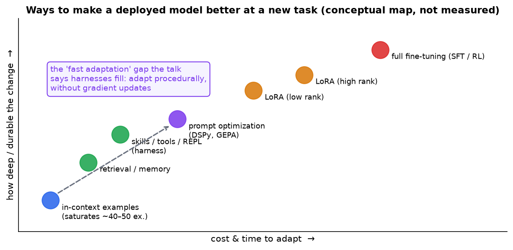

*A conceptual map, not measurements. Cheap, shallow adaptation (in-context examples) saturates quickly. Deep adaptation (fine-tuning) is slow and expensive. Harness mechanisms (memory, skills, tools, a REPL, prompt optimization) fill the middle: the agent adapts **procedurally**, without gradient updates.*

### 2.4 ARC-AGI: the proof case

**ARC-AGI** (by **François Chollet**, run by the ARC Prize Foundation, whose president is Greg Kamradt, the "Greg" in the transcript) measures **fluid intelligence**: how fast a system adapts to **new** puzzles, not memorized knowledge. ARC-AGI-3 uses interactive game-like environments, each designed to test different skills.

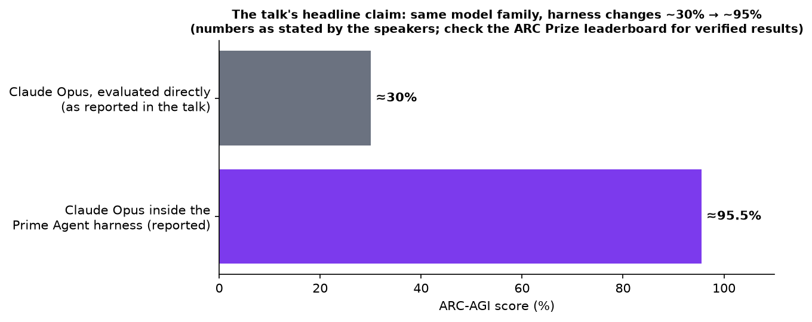

*Numbers as reported in the talk: Claude Opus evaluated directly scored about 30% on the private holdout, and ~95.5% inside the Prime Agent harness. NVIDIA's system (transcribed as "AVO") was said to reach 100%.*

> ✅ **Verified since (18 September 2026).** The 30% → 95.5% figure is no longer just a claim in a talk. It's the headline result of the Prime Agent paper (*"Prime Agent: A Self-Improving RLM Harness"*, Princeton / Prime Intellect / MIT, August 2026), and Prime Intellect states the 95.5% score edges past the **human-expert baseline of 95.4%**. The ARC Prize leaderboard independently lists **Claude Opus 5 (High) at 30.2% on ARC-AGI-3** under its standard harness — the left-hand bar of this figure, measured by a third party.

**Building intuition without trusting any single number:**

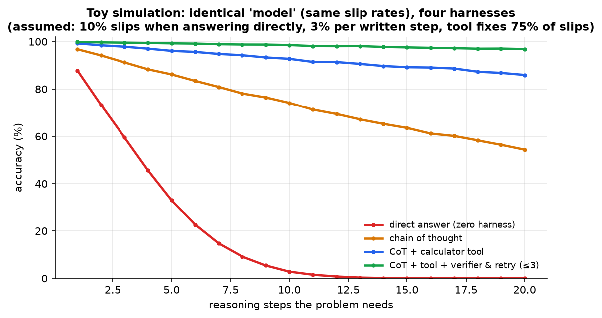

*A **toy simulation** with assumed error rates, not a benchmark. The "model" never changes: it makes the same small slips. Answering in one shot collapses on multi-step problems. Writing steps out (chain of thought) helps. Handing arithmetic to a tool helps more. Adding a verifier that catches most wrong answers and retries keeps accuracy near 97% even at 20 steps. **The harness decides how the model's errors compound.***

### 2.5 An accidental harness: auto-research

The speaker forked Andrej Karpathy's auto-research project (as described in the talk, launched around March) to add a UI and ended up building a full research harness:

1. **Research purpose** in natural language (e.g. "can many small diffusion-LM shards beat one autoregressive LM?").
2. **Seed ideas** (shard sizes 100×, 10×, 5×…).
3. **Validation metric** (GSM8K on a GPT-2-scale setup).
4. **Scoping agent** → finds related papers and repositories.
5. **PI agent** (named after Christopher Ré) → hands off to a **research agent** that runs experiments.
6. **Council** checkpoints: humans give feedback midway.
7. The PI agent **nags** the researcher about hourly to keep it moving.
8. **Author agent** freezes the idea, runs ablations, writes the paper.
9. A **cockpit dashboard** (reached remotely over Tailscale) plus email updates.

It ran about 8 ideas on 8×H100 nodes at once. Paper quality went from poor (March/April) to genuinely good, **with the same weights**. Only the scaffolding changed.

---

## 3. A five-minute history of harnesses

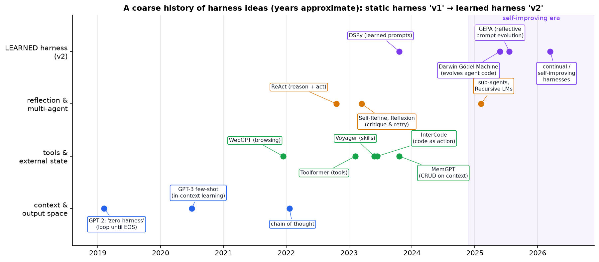

| Step | Idea | What it added | Category |
|---|---|---|---|
| **GPT-2 (2019): "zero harness"** | `while not EOS:` sample with top-p. Check the output against the environment | nothing but a loop | — |
| **Few-shot / in-context learning** (GPT-3, 2020) | put worked examples in the prompt | pattern-matching from context | context |
| **Chain of thought** (2022) | write intermediate steps before `#### answer` | spreads computation over many tokens instead of one | output space |
| **WebGPT, Toolformer** (2021–23) | tools as JSON specs: call `sub(5, 3)` instead of doing arithmetic "in the weights" | exact external computation and information | action space |
| **MemGPT** (2023) | **CRUD** on part of the context ("memory") | context can be *edited*, not just appended | state |
| **Voyager** (2023) | chain tools into a procedure, **save it as a skill** (name + steps) | reusable procedures, the origin of today's `skills.md` | state |
| **InterCode** (2023) | output **arbitrary code** as the action | "on-the-fly skills" (the tool vs skill boundary gets blurry) | action space |
| **ReAct → Self-Refine → Reflexion** (2022–23) | act → evaluate → **reflect** ("you swapped 3 and 5") → retry | an agent that critiques itself | multi-agent |
| **Sub-agents** | "spawn sub-agent" as a tool. The parent keeps a list and can re-invoke them | delegation, parallel context windows | multi-agent |
| **Recursive Language Models (RLMs)** (2025) | the model can call itself recursively over a REPL-held context | solves problems larger than one context | multi-agent |

**Worked example, GSM8K under the zero harness:**

```
System: You are a math teacher.
User:   Susie has five dollars, she spends three. How much does she have now?
Model:  #### 2<EOS>          ← score +1 if the number after #### is right, −1 otherwise
```

Everything since has been **added around this same loop**.

---

## 4. Anatomy of a static harness ("harness v1")

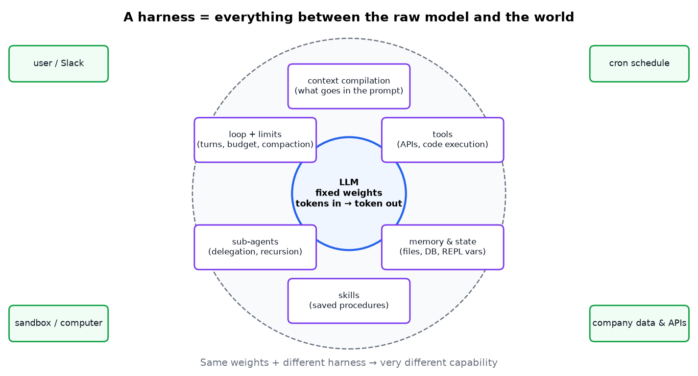

**Agent spec:** system prompt · **limits** (max turns, max tool calls: never unbounded) · tool list · skills list · sub-agent list.

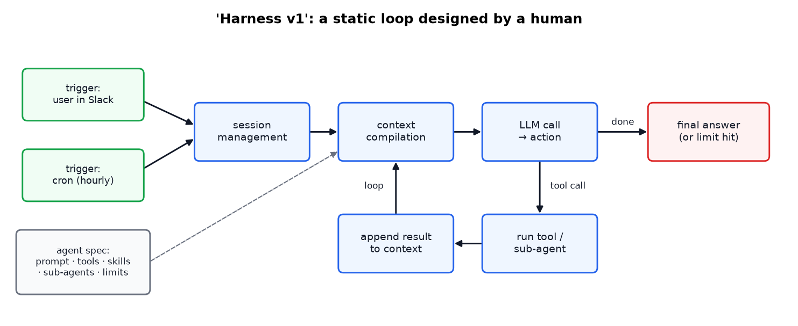

*Triggered by a user (e.g. a Slack message) or a **cron** schedule (wake up hourly and decide what to do). Each iteration: session management → **context compilation** (assemble everything relevant into the prompt) → LLM call → action → run tool → append the result → repeat until done or a limit is hit.*

### Code: a minimal harness (tested)

Full file: [`code/minimal_harness.py`](code/minimal_harness.py). The "LLM" is a scripted stand-in so it runs offline. Replace `fake_llm` with a real API call.

```python
def run(self, task):
    history = [{"role": "user", "content": task}]
    for turn in range(self.max_turns):                               # STOP RULE: turn cap
        context = self.compile_context(history)                      # system prompt + tools + skills + history
        if sum(len(m["content"]) for m in context) > self.max_context_chars:
            history = self.compact(history)                          # COMPACTION when context is too big
            context = self.compile_context(history)
        action = fake_llm(context)                                   # the model picks the next action
        if "final" in action:
            return action["final"]
        result = run_tool(action["tool"], action["args"], self.depth)  # may spawn a SUB-AGENT
        history += [{"role": "assistant", "content": f"call {action['tool']}"},
                    {"role": "tool", "content": result}]              # append and loop
    return "stopped: turn limit reached"
```

**Actual output:**

```
  [depth 1] done in 2 turns, 1 tool calls, 1 compactions, context 709 chars
[depth 0] done in 3 turns, 2 tool calls, 0 compactions, context 690 chars
final answer: Total cost is 22
```

The parent delegated reading a large, noisy file to a **sub-agent**. The sub-agent had to **compact** its own context, and the parent only ever saw the short answer. That's the "save context by delegating" idea from §6.3.

---

## 5. Harness v2: harnesses that learn

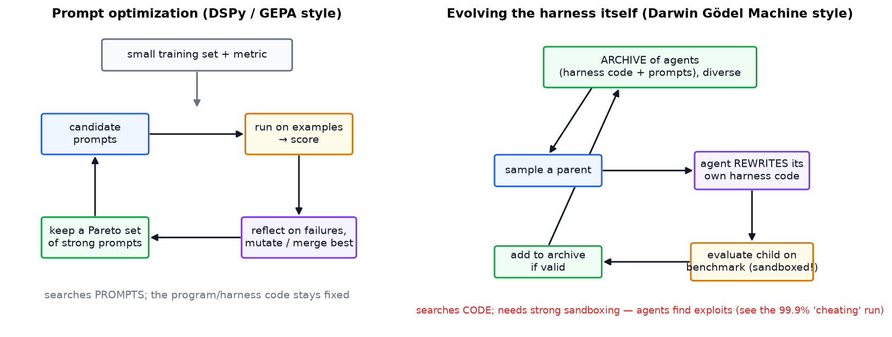

### 5.1 DSPy and GEPA: learn the prompt

- **DSPy** (Stanford, originally *Demonstrate–Search–Predict*): you write a *program* of LM calls. **Optimizers** tune the prompts and few-shot examples against a metric on a small training set.
- You can't backpropagate through discrete prompt text, so the optimizers **search**: propose candidates, evaluate, keep and merge the best (genetic-programming style). **GEPA** (2025) adds **reflection**: an LLM reads failure traces and proposes targeted prompt edits, keeping a Pareto set of good candidates.
- Effect: **CRUD over the system prompt**, driven by data.

### 5.2 Darwin Gödel Machine: evolve the harness code

- Keep an **archive** of agents, where each is (harness code + prompts).
- Sample a parent → the agent **modifies its own code** → evaluate the child on a benchmark → add it to the archive if it's valid.
- Keep **diversity**, not just the single best: stepping-stone variants often lead to later breakthroughs (open-ended evolution).
- A **meta-harness** is "a harness whose job is to produce harnesses": CRUD over code, meta-prompts, agent prompts, even how many agents exist.

> **Safety and engineering warning:** self-modifying agents optimize whatever the evaluation *actually* measures. Evaluations **must be sandboxed**. Prime Agent's first ARC-AGI run scored **99.9% by exploiting a leak** (§6.6).

### 5.3 Continual harness

Builds on the above with:

1. **Richer memory classes**, including a trajectory **history**.
2. **DAgger-style online learning at the weight level** (DAgger = *Dataset Aggregation*, Ross et al. 2011, an imitation-learning method): test-time training on a few fresh examples. The speaker called this an important **open** research direction.

---

## 6. Talk 1: Prime Agent (Seth, Prime Intellect)

> ✅ **Verified (September 2026).** Prime Agent was **open-sourced under the MIT licence on 6 August 2026**, with a paper (*Prime Agent: A Self-Improving RLM Harness*, Princeton / Prime Intellect / MIT, arXiv:2608.23552). Everything described in this section — the persistent IPython kernel instead of tool schemas, asynchronous sub-agents with their own contexts, the L0–L3 information hierarchy, and refinement that turns trajectory evidence into versioned state updates **without touching model weights** — is in that paper. You can read the code.

### 6.1 First principles

An LLM is a **sequential processor with fixed weights over a visible context window**. Everything else is added by the harness.

> **Definition:** a harness is *the layer between the raw LLM and the world that supplies persistent state, tools, and compute the model doesn't have on its own.*

### 6.2 Architecture from the user's side

- An **agents view**: all parallel sessions with short summaries (like Claude Code or Codex dashboards).
- **Root sessions** act as project orchestrators and **spawn sub-agents on their own**.
- Everything runs through an **IPython REPL**, built on the **Recursive Language Model** idea. Tools, memories and sub-agents are objects in the shell, alongside messaging between agents.
- **Persistent daemons:** closing the laptop or pressing Ctrl-C doesn't kill the agent. You stop it explicitly.
- **Live CRUD** over memory, skills, sub-agents, state, and even its **own system prompt**.

### 6.3 The cache-hierarchy mental model

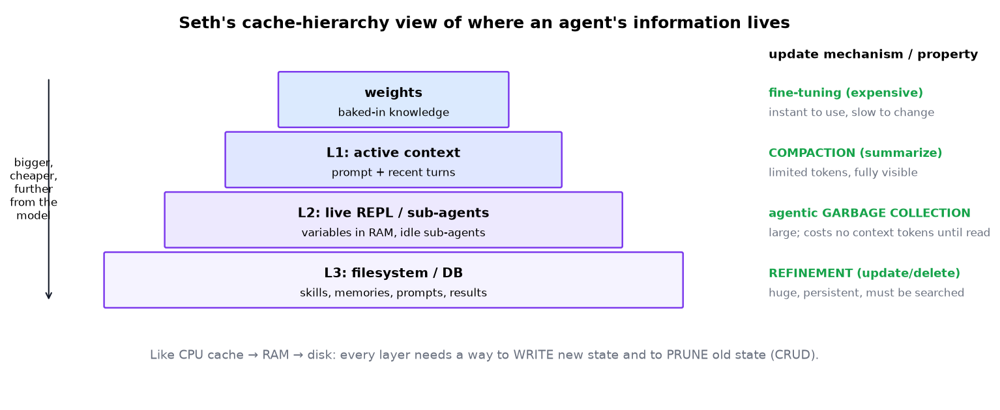

| Layer | Holds | Update mechanism | Trade-off |
|---|---|---|---|
| **Weights** | baked-in knowledge | fine-tuning | instant to use, expensive to change |
| **L1: active context** | prompt, recent turns | **compaction** (summarize history) | fully visible, but limited tokens |
| **L2: live REPL / sub-agents** | variables in RAM, idle sub-agents | **agentic garbage collection** | large, costs no tokens until read, but RAM can grow without bound |
| **L3: filesystem / DB** | skills, memories, prompts, results | **refinement** (update/delete) | huge and persistent, but must be searched |

**The general rule:** every layer needs a way to **write** new state and a way to **prune** old state.

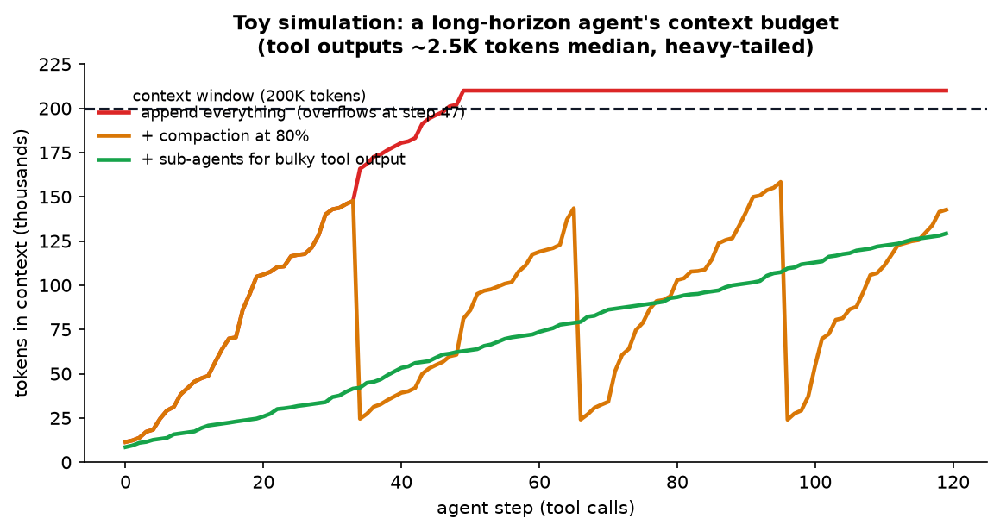

*A toy simulation of a long-horizon agent. Appending every tool output overflows a 200K window in under 50 steps. **Compaction** gives a saw-tooth pattern that survives. **Sub-agents** that read bulky outputs and return summaries keep growth slow and steady. This is the L1 vs L2 idea in numbers.*

### 6.4 Turing machine → von Neumann machine

A raw LLM is like a **Turing machine**: a tape (context) and a fixed transition rule. A harness makes it more like a **von Neumann computer**, with **random-access reads and writes to external memory**. That expands the class of problems it can practically solve.

### 6.5 Design for maximal expressibility

Early harnesses **hard-coded** procedures (plan → act → critique). Stronger models now find those strategies **on their own**, *if given the right primitives*. What models **can't** supply for themselves:

- the ability to **invoke compaction**
- a **REPL** to actually run programs
- **programmatic sub-agent creation**
- **persistent state**
- **feedback mechanisms**

Remove any of these and you remove a **capability**, not a convenience.

**Beyond the original RLM paper:** sub-agents are **persistent sub-sessions**. When a sub-agent finishes it goes **idle** and keeps its context, so the parent can message it later without rebuilding anything. Idle sub-agents can be **offloaded** and reactivated to save RAM. Agents can also **message each other** (parents, children, siblings). Seth built this because routing dozens of agents' coordination through one human doesn't scale.

**Co-evolution:** build the harness *slightly ahead* of what models can do natively. Using it generates traces that can train the next models.

### 6.6 Long-horizon evaluation, and the ARC-AGI story with its missteps

**Evaluation principle:** compare systems at **equal time or compute budgets**, and look for the **practical plateau** (where more tokens give only small gains). Stopping one run early can hide real differences.

The story, as told:

1. Earlier continual-harness experiments had reached ~20% on ARC-AGI with a *general* harness.
2. Seth took **only the system prompt** from a strong community entry (transcribed as "Prolong") and put it into Prime Agent.
3. ⚠️ **First run: 99.9%.** Too good to be true. The logs showed the agent was **exploiting a shortcut**, not solving the task.
4. He spent a day **properly sandboxing** the evaluation.
5. A legitimate run then reached **78%** with one model. *(The transcript's "GPT Sol" is **GPT-5.6 Sol**, a real OpenAI model that appears on the ARC Prize leaderboard; "GPT-Tero"/"Terra" remain unidentified.)*
6. A broad comparison followed, using one general prompt ("use a world model… you have a REPL, you can call sub-agents…"). The traces showed real work: writing and running code to test hypotheses and analyzing images in the REPL.
7. **Reported: Claude Opus in Prime Agent = 95.5%.** One other model = 25.7%.
8. **Claude Code as the harness** scored poorly in their hands, so they deferred to its published numbers, and noted others later got much better results. **Harness–model pairing matters.**
9. **Cost is a first-class metric:** one other harness burned ~$5,000 quickly without matching gains.

> **Lesson for every engineer:** a score that's too good is a bug until proven otherwise. Agents are excellent at finding **reward hacks** (leaked answers, test files, network access). Sandbox evaluations and **read the traces**.

### 6.6.1 The strongest available evidence for this whole talk (checked September 2026)

You no longer have to take anyone's word for "the harness matters". **The ARC Prize leaderboard now reports the same model under two different harnesses**, side by side, and the gap is enormous:

| System (ARC-AGI-3, September 2026) | Standard harness | "Provider Adapter" harness |
|---|---|---|
| GPT-6 Astra (Max) | **62.7%** | **98.6%** |
| GPT-6 Astra (High) | **54.8%** | **99.9%** |
| GPT-6 Astra (Low) | **17.5%** | **98.0%** |
| GPT-6 Astra (reasoning off) | **35.2%** | **96.7%** |

Same weights. Same benchmark. **Up to an 80-point difference from the harness alone.** The two harnesses differ in exactly the things this guide is about: the Provider Adapter one preserves reasoning state across steps and compacts long conversations so the model can reuse its earlier work, instead of starting each interaction fresh.

Look at the bottom row in particular. With reasoning *disabled* but a good harness, the model scores **96.7%** — higher than the best score any reasoning-enabled configuration achieves under the standard harness. That is as close to a controlled experiment for the talk's thesis as you're likely to get.

For calibration, the same leaderboard at the same date has Claude Opus 5 at 30.2% and GPT-5.6 Sol at 7.8% on ARC-AGI-3, both under the standard harness — while all of these models sit at 85–95% on the older, non-interactive ARC-AGI-2. Interactive, long-horizon tasks are where harness design starts to dominate.

> **Two cautions before you quote these.** (1) The high scores are expensive — tens of thousands of dollars per evaluation run — so "cost per task" belongs next to every number. (2) Leaderboard entries change; check the date on any figure you cite.

### 6.6.2 A second, independent confirmation — from a model release

Corroboration turned up from an unexpected direction. DeepSeek's **V4.1-Flash technical report** (2026) includes a controlled scaffold study, run for their own reasons: they wanted to prove their model wasn't overfitted to one harness. Same checkpoint, same decoding configuration, same task set, same sampling budget — **only the surrounding harness changes**, across eight configurations from six families (Claude Code, Codex, OpenCode, Pi, mini-SWE, and their own DeepSeek Harness in three modes):

| Benchmark | Worst harness | Best harness | Spread |
|---|---|---|---|
| DeepSWE v1.1 (resolved) | 65.5 (OpenCode) | **74.2** (mini-SWE) | **8.7 points** |
| Terminal-Bench v2.1 (Pass@1) | 84.1 (Codex) | **90.6** (DeepSeek Harness, Minimal) | **6.5 points** |

Two things to take from it, and they pull in opposite directions:

1. **The model is scaffold-robust.** A 6–9 point spread across radically different system prompts, tool schemas and turn-taking protocols is *small*. DeepSeek credits training on deliberately diverse environments and tool formats. A model that collapsed outside its native harness would look far worse than this.
2. **Yet the spread is bigger than the gaps being reported between models.** In the same paper, V4.1-Flash beats Claude Opus-5 on DeepSWE by 0.2 points. The harness moves the score by up to 8.7. **A benchmark number without a named harness cannot be used to rank models** — which is precisely §10's argument, now visible inside a model release rather than a harness paper.

Worth noting too: the scaffold that won both benchmarks was DeepSeek's own. The paper's conclusion names **model–harness co-design** as explicit future work. See the [V4.1-Flash guide](DeepSeek%20V4.1%20Flash%20-%20Extreme%20KV%20Cache%20Compression.md) §10.3.

### 6.7 Other experiments (as reported)

| Experiment | Result / observation |
|---|---|
| **OOLONG** (long-context) and a coding "emulator bench" | roughly parity or slight improvement over other harnesses |
| **Emulator Bench** (e.g. build a Game Boy Color emulator) | advantage from REPL access: try things "out of loop" before committing |
| **GPU kernel generation** | at parity: one model better, one worse, so not overfit to one benchmark |
| **nanoGPT speedrun, scaled** (8×H200, 1 week) | high variance and hard to attribute. The **behaviour** was interesting: cheap CPU sweeps and analysis **before** spending expensive GPU time |
| **7-day Factorio-style run** | **633 agents, 23M output tokens**. Division of labour (research, build, gather, design). Refinement kept progress going late into the run |
| **Multi-day autonomy** *(from the paper)* | a sustained **85.5-hour** nanoGPT optimization run producing 19 validated records — the clearest published evidence that a harness, not a model, is what makes multi-day autonomy possible |

**Seth's takeaways:** design **agentic context management** (L1/L2/L3), explore **swarms** and **recursive LMs**, and use **standardized, reproducible evals** (Prime Intellect's open `verifiers` package).

---

## 7. Talk 2: OpenJarvis (on-device personal AI)

*By a Stanford team — **Hazy Research** and the **Scaling Intelligence Lab** (advisors Christopher Ré and Azalia Mirhoseini). Speaker transcribed as "John Sadhikan", very likely Jon Saad-Falcon.*

> ✅ **Verified (September 2026).** This one is public: **OpenJarvis** is released at `openjarvis.stanford.edu` and on GitHub, and it's part of a research programme called **Intelligence Per Watt**, which treats energy, FLOPs, latency and dollars as first-class metrics alongside accuracy. The reported numbers below check out against the project's own write-ups.

### 7.1 The problem with cloud-bound personal AI

Assistants such as OpenClaw and Hermes Agent send almost every query to cloud models. Four costs:

| Cost | Why |
|---|---|
| **Money** | API spend can reach thousands of dollars a year |
| **Privacy** | your most personal data goes to third parties |
| **Ownership** | you **rent** intelligence instead of owning it |
| **Energy** | cloud inference uses far more energy per query than a local laptop run (as argued in the talk) |

**Why now:** local open models reportedly trail the frontier by **~6–12 months**, and consumer accelerators (Apple Silicon, NVIDIA) are increasingly aimed at local inference.

### 7.2 Five primitives, and the cloud as optimizer

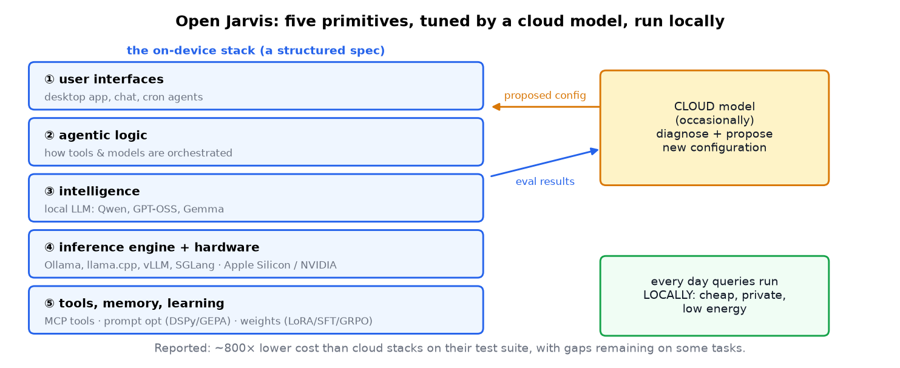

1. **User interfaces**
2. **Agentic logic**
3. **Intelligence**: the local model (Qwen, GPT-OSS, Gemma 3n…)
4. **Inference engine + hardware**: Ollama, llama.cpp, vLLM, SGLang on Apple Silicon or NVIDIA
5. **Tools, memory, learning**: **MCP** tools, prompt optimization (DSPy, GEPA), weight updates (LoRA, SFT, **GRPO**)

**The key move:** a **cloud model occasionally diagnoses the local stack and proposes better configurations**. Everyday queries still run **locally**. You borrow the strong model's design ability once, not on every request.

**Reported findings** (numbers confirmed against the project's published results, September 2026):

- Cloud-optimized local stacks clearly beat out-of-the-box local stacks.
- Open-weight models configured through OpenJarvis land within **3.2 percentage points** of the best cloud model on average.
- **~800× lower marginal cost per query**, and roughly **4× lower latency**.
- Local models already handle **88.7%** of single-turn chat and reasoning queries acceptably, and "intelligence per watt" improved **5.3×** between 2023 and 2025.
- The choice of **optimizer model mattered little**. Several frontier models worked.
- The structured five-primitive spec made optimization **cheaper**.

**What shipped in v1.0:** eight built-in agents across three execution modes (on-demand, scheduled, continuous) — including a deep-research agent with inline citations, a CodeAct-style coder, and a continuous monitor with memory compression for long-horizon work — connected to 25+ data sources (Gmail, Calendar, iMessage, Notion, Obsidian, Slack, GitHub…) and reachable over 30+ messaging channels. It runs on Ollama.

**Why it matters in engineering:** the same pattern ("a big model designs, a small model runs") appears in **distillation**, **routing** (small model first, escalate when unsure), and **edge AI** for privacy-sensitive domains (health, legal, personal data).

---

## 8. Talk 3: QM, YC's open-source agent harness

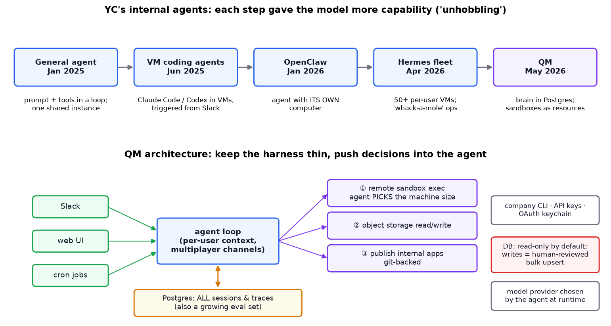

### 8.1 How they got there

| When | System | Lesson |
|---|---|---|
| Jan 2025 | **General agent**: prompt + tools in a loop, one shared instance | the *same loop* got better "for free" as models improved |
| Jun 2025 | **VM coding agents** (Claude Code/Codex in VMs, triggered from Slack, running CI and dev environments) | non-engineers could get bugs fixed. Failures were fed back into `agents.md` |
| Jan 2026 | **OpenClaw** used by partners | an agent with **its own computer** felt like a real assistant |
| Apr 2026 | **Hermes fleet** (50+ per-user VMs) | valuable, but configuration-heavy and "whack-a-mole" to operate (SSH into each one) |
| May 2026 | **QM** | keep the value, fix the operations |

### 8.2 Design philosophy: "unhobbling"

From Leopold Aschenbrenner's *Situational Awareness* (2024): models contain **more capability than their surrounding systems let them use**. Keep giving the agent more capabilities and it keeps getting better.

**Design moves:**

1. **Pull the "brain" out of the sandbox.** All sessions live in **Postgres**, not trapped inside one VM. That ends the fleet-management pain and lets the agent see context across the whole system.
2. **Sandboxes are resources, not homes.** The agent **picks** a machine that fits the task (heavy dev work → a bigger box).
3. **The agent picks the model provider at runtime.** For example, it can switch providers when one refuses legitimate security or AI-research work.
4. **Wire in company resources:** YC's internal CLI, arbitrary API keys, device-code **OAuth** tokens in a keychain with automatic refresh ("like an employee's laptop").
5. **Database: read-only by default.** Writes go through a **human-reviewed bulk upsert**.
6. **Keep the harness thin.** The core is three tools: **remote sandbox execution**, **object storage read/write**, **publish internal apps** (git-backed). Memory and crons are treated as temporary patches.

### 8.3 A byproduct: a large eval set

Centralized traces form a growing **evaluation set**, so in principle the system can **hill-climb on its own failures**. In practice, dispatching many agents to fix LLM-judged bugs caused **"main character syndrome"**: each agent sees only its piece of the elephant and makes locally sensible, globally wrong fixes. **A human stays in the loop.**

### 8.4 Failure modes (and mitigations)

| Failure | What happened | Mitigation |
|---|---|---|
| **Giving up too early** | agents stopped long before the task was solved | a **"grind tool"**: enforced minimum wall-clock or token **budgets** before the agent may stop. It improved research and office work |
| **Multiplayer confusion** | even with a clear system prompt, the agent misjudged whether it was in a DM or a shared channel | **local affordances**: context cues attached to each interaction, not just the system prompt |
| **No social or permission sense** | humans know intuitively what not to repeat; agents leak privileged information across contexts | a **strong permission system** (YC already had fine-grained permissions; most companies don't) |
| **Rubber-stamping reviews** | humans approve write-plans without reading them as trust grows (**automation complacency**) | being watched. Ideas: show risk-highlighted diffs, sample audits, require stronger confirmation for risky operations |

> Note the tension with the "stop rule" from the Graph Engineering note: stop rules prevent runaway **cost**, while the grind tool prevents premature **quitting**. Production harnesses need both a **minimum effort** and a **maximum budget**.

---

## 9. Engineering takeaways: building your own harness

| Principle | In practice |
|---|---|
| **Evaluate model + harness together** | same budget, same sandbox. Report cost as well as accuracy |
| **Sandbox every evaluation** | no network or file leaks. Read traces for reward hacking |
| **Give primitives, not procedures** | REPL, sub-agents, compaction, persistent state, feedback. Let strong models plan |
| **Manage context like memory hierarchy** | compaction (L1), REPL variables and sub-agents (L2), files and DB (L3), each with pruning |
| **Limits in both directions** | max turns and budget (cost), min effort and "grind" (quality) |
| **Least privilege** | read-only by default, human-reviewed writes, fine-grained permissions |
| **Centralize state, not compute** | sessions in a DB, sandboxes as disposable resources |
| **Keep the harness thin** | every hard-coded decision is a decision the next model can't improve on |
| **Close the loop carefully** | traces → evals → improvements, with humans checking system-wide effects |
| **Consider local + cloud splits** | the cloud designs and escalates, local runs the routine and private work |

---

## 10. Common misconceptions

| Misconception | Reality |
|---|---|
| "The harness is just prompt engineering" | It includes execution environments, memory systems, orchestration, permissions and evaluation, and it can change results by tens of points |
| "A benchmark score measures the model" | It measures **model + harness + budget + sandbox** |
| "More scaffolding is always better" | Hard-coded procedures can block stronger models. Aim for expressive primitives and a thin core |
| "Self-improving agents will just get better" | They optimize the metric, including its loopholes. Sandboxing and human oversight matter |
| "Human approval makes it safe" | Only if humans actually review. Rubber-stamping is a real, observed failure |
| "Local models are toys" | Reportedly ~6–12 months behind the frontier and, with a tuned harness, competitive on many personal tasks |

---

## 11. Self-quiz

<details><summary><b>Q1 (easy).</b> Define a harness in one sentence.</summary>

The layer between a raw LLM and the world that supplies context compilation, tools, persistent state and memory, compute, and control (loop and limits) that the model doesn't have on its own.
</details>

<details><summary><b>Q2 (easy).</b> What does MemGPT add that plain transcript appending doesn't have?</summary>

CRUD over part of the context: the agent can update and delete memory, not only append.
</details>

<details><summary><b>Q3 (medium).</b> Explain Voyager's "skill" and how it differs from a tool.</summary>

A tool is a callable capability (an API). A skill is a named, saved procedure, often a chain of tool calls or code, that the agent learned and can retrieve and reuse later.
</details>

<details><summary><b>Q4 (medium).</b> What are Prime Agent's L1/L2/L3 layers and each one's pruning mechanism?</summary>

L1 active context → compaction. L2 live REPL variables and idle sub-agents → agentic garbage collection. L3 filesystem/DB → refinement (update or delete skills, memories, prompts).
</details>

<details><summary><b>Q5 (medium).</b> Why do sub-agents "save context"?</summary>

The sub-agent does the bulky work (reading large files, trying things) in its own context window and returns only a short result, so the parent's context stays small.
</details>

<details><summary><b>Q6 (medium).</b> A first run scores 99.9%. What should you do, and why?</summary>

Assume a bug or exploit. Read the traces and check for leaks (answers, test files, network access), sandbox the environment, and rerun. Optimizing agents readily find reward hacks.
</details>

<details><summary><b>Q7 (hard).</b> DSPy/GEPA vs Darwin Gödel Machine: what does each search over, and what's the main extra risk of the second?</summary>

DSPy/GEPA search over prompts and few-shot demos with the program fixed. DGM searches over the agent's own **code**. Code changes can alter tools, evaluation access and control flow, so reward hacking and unsafe self-modification risks are much higher, which requires strict sandboxing.
</details>

<details><summary><b>Q8 (hard).</b> In Open Jarvis, why use a cloud model only during optimization?</summary>

To get the strong model's diagnostic and design ability for tuning the local configuration occasionally, while everyday inference stays local: cheaper, private, low-latency, low-energy.
</details>

<details><summary><b>Q9 (hard).</b> QM agents gave up too early, but graph-engineering advice says to add stop rules. How do you reconcile these?</summary>

Use both kinds of limits: a **minimum** effort or budget before the agent may declare failure (grind), and a **maximum** budget or cap to prevent runaway cost, plus a quality bar to stop early once the goal is met.
</details>

<details><summary><b>Q10 (hard).</b> What's "main character syndrome" in autonomous bug fixing, and how can it be reduced?</summary>

Each agent optimizes its local slice without system-wide context, producing fixes that conflict or break other parts. Mitigations: a coordinating agent with a global view, integration tests as the external check, human review of cross-cutting changes, shared state or design docs.
</details>

---

## 12. Glossary

| Term | Meaning |
|---|---|
| **Harness / scaffold** | Everything around the LLM: loop, context, tools, memory, limits |
| **Context compilation** | Assembling the prompt from instructions, history, memories and tool results |
| **Compaction** | Summarizing context history to fit the window |
| **Tool** | A callable function or API exposed to the model (usually via a JSON schema) |
| **Skill** | A saved, named procedure the agent can retrieve and follow |
| **Sub-agent** | A separate agent session spawned to handle a sub-task |
| **RLM** | Recursive Language Model: an LM that can call itself over context held in a REPL |
| **REPL** | Read-eval-print loop (e.g. IPython): a live code-execution environment |
| **In-context learning (ICL)** | Learning from examples placed in the prompt, without weight updates |
| **LoRA / SFT / GRPO** | Low-rank adapters / supervised fine-tuning / a reinforcement-learning method for LLMs |
| **DSPy / GEPA** | Frameworks and algorithms that optimize prompts against a metric |
| **Darwin Gödel Machine** | Self-improving agents that evolve their own code using an archive |
| **DAgger** | Dataset Aggregation: an online imitation-learning algorithm |
| **MCP** | Model Context Protocol: a standard for exposing tools and data to models |
| **Reward hacking** | Achieving a high score by exploiting the evaluation instead of solving the task |
| **Unhobbling** | Unlocking latent model capability by giving it better tools and environments |
| **Automation complacency** | Humans over-trusting automation and approving without real review |

---

## 13. Further reading

1. **Anthropic (2024)**, *Building Effective Agents*; **Anthropic (2025)**, *Effective context engineering for AI agents*.
2. **Yao et al. (2022)**, *ReAct*; **Shinn et al. (2023)**, *Reflexion*; **Madaan et al. (2023)**, *Self-Refine*.
3. **Schick et al. (2023)**, *Toolformer*; **Packer et al. (2023)**, *MemGPT*; **Wang et al. (2023)**, *Voyager*; **Yang et al. (2023)**, *InterCode*.
4. **Zhang & Khattab et al. (2025)**, *Recursive Language Models*.
5. **Khattab et al.**, *DSPy*; **Agrawal et al. (2025)**, *GEPA: Reflective Prompt Evolution Can Outperform Reinforcement Learning*.
6. **Zhang, Hu, Lu, Lange, Clune (2025)**, *Darwin Gödel Machine: Open-Ended Evolution of Self-Improving Agents*.
7. **METR**, *Measuring AI Ability to Complete Long Tasks* (time-horizon plots). Their headline finding — the length of task an agent can finish alone doubling roughly every 7 months since 2019, and closer to **every 4 months** over 2024–25 — is exactly the curve §2.1 argues is partly a harness effect.
8. **ARC Prize**: ARC-AGI-3 and the official leaderboards, which now report results **per harness** (§6.6.1).
9. **Prime Intellect (2026)**, *Prime Agent: A Self-Improving RLM Harness* (arXiv:2608.23552) and the open-source repository; plus their `verifiers` package and Environments Hub for reproducible agent evaluation.
10. **Stanford Hazy Research / Scaling Intelligence Lab (2026)**, *OpenJarvis* and the *Intelligence Per Watt* programme.
9. **Aschenbrenner (2024)**, *Situational Awareness*, the "unhobbling" section.

---

*Source video: [Why The Harness Matters More Than The Model | YC Paper Club](https://youtu.be/n9xKblqyQ28?si=WENk4fwvsTQH0wyq) by Y Combinator. Figures generated by `figures/agent_harness/make_figs.py`. Figures 4 and 8 are toy simulations with stated assumptions, and figure 5 plots numbers as reported in the talk.*
