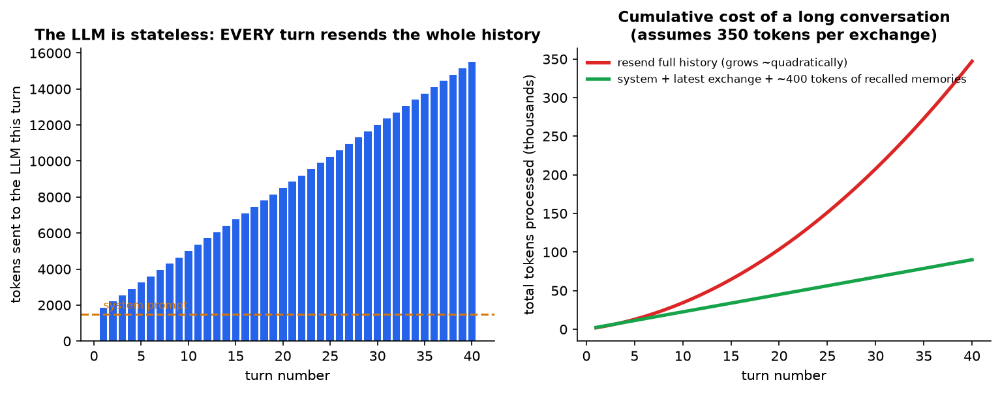
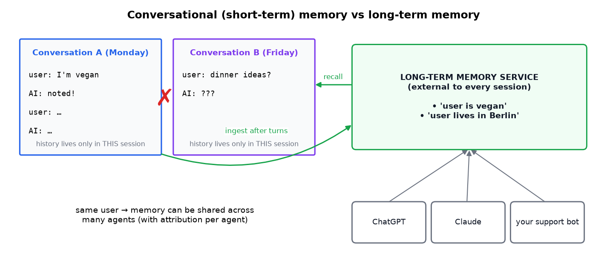
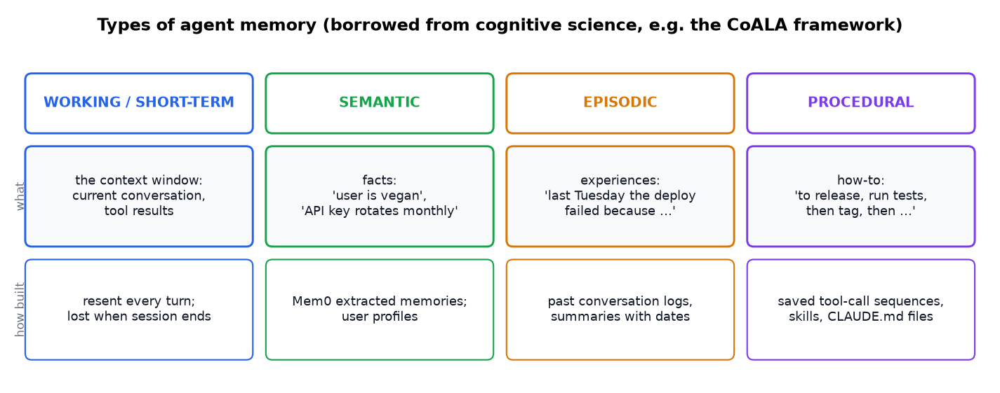
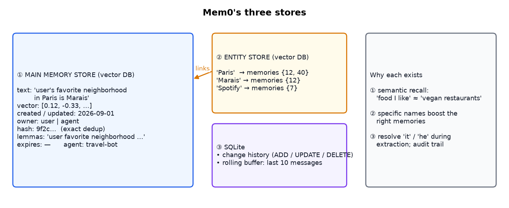
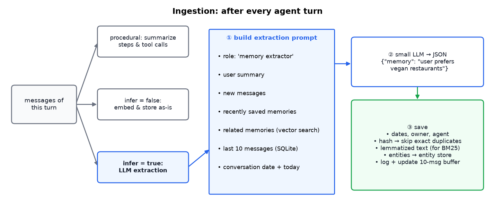
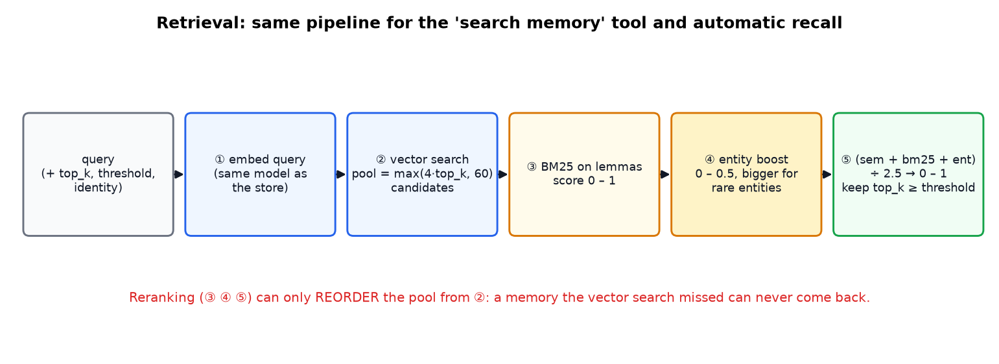
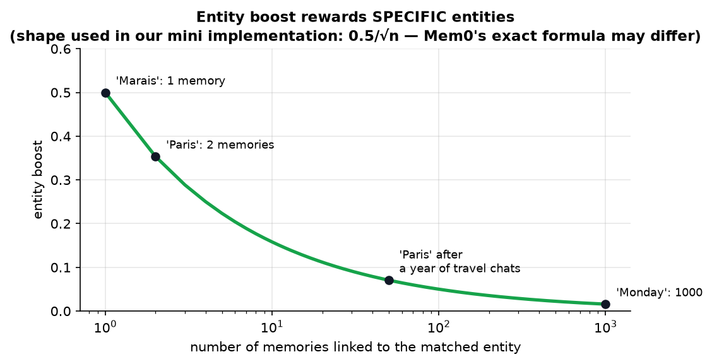
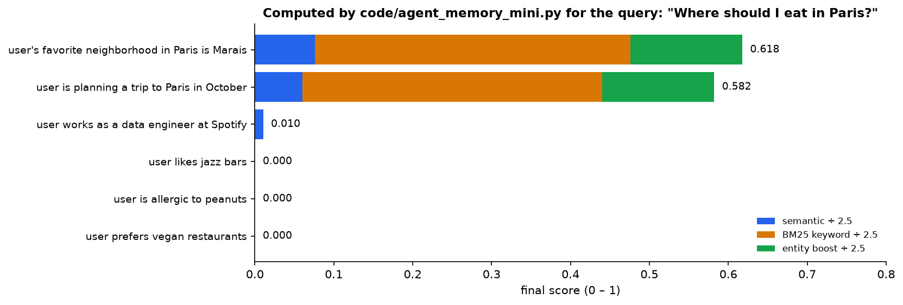

# Agent Memory Explained: The Complete Architecture (Mem0 Case Study)

> **Source:** [Agent Memory EXPLAINED - Complete Architecture](https://youtu.be/aYfZN8t6AQs?si=bPe1Ajxv2XXRtMYF) by Hugging Face
> **Related notes:** [BM25 for agentic search](BM25%20-%20Keyword%20Search%20for%20AI%20Agents.md) (the keyword scorer used in retrieval) · [Why the Harness Matters](Agent%20Harnesses%20-%20Why%20the%20Scaffold%20Beats%20the%20Model.md) (memory is part of the harness)
> **What's in this version:** 8 figures (a cost plot, architecture and pipeline diagrams, and a scoring breakdown computed by real code), the four kinds of agent memory, a full worked retrieval example, the failure modes to design for (stale facts, privacy, bad dedup), a runnable ~120-line memory system, a quiz, and a glossary.

> **Version note:** the pipeline details (pool size, score ranges, dedup method) describe Mem0 as presented in the video. Open-source projects change quickly, so check the current Mem0 source before relying on exact constants.
> **Facts re-checked:** 18 September 2026. The architecture described here still matches Mem0's current ("v3") memory algorithm — single-pass extraction plus multi-signal hybrid retrieval. See §4.4 for what's been confirmed and what to watch.

---

## 0. How to use this guide

| If you have… | Read |
|---|---|
| 10 minutes | §0.1 plain-words intro, §1 TL;DR, plus figures 2, 5 and 6 |
| 1 hour | §1–§8 |
| A weekend | Everything. Run `code/agent_memory_mini.py` and add your own memories |

---

### 0.1 First, in completely plain words

Here is the fact that surprises almost everyone: **a language model has no memory whatsoever.** Not a short one, not a fading one — none. Every time you send a message, the model is a brand-new stranger who has never seen you before.

So how does a chatbot remember what you said two messages ago? It cheats. The software around the model quietly **re-sends the entire conversation** every single time. The model isn't remembering; it's re-reading. That's why:

- a **new chat** knows nothing about you — it's a fresh transcript,
- **long conversations get expensive** — you're paying to re-send the whole history every turn,
- eventually the transcript **doesn't fit** at all.

Real memory has to be built as a **separate thing that lives outside the conversation**. That's what this guide is about. The design has two halves, and they're both simple once named:

| Half | What it does | The everyday version |
|---|---|---|
| **Writing** (ingestion) | after each exchange, a small model reads what was said and writes down the few durable facts — *"prefers vegan restaurants"*, not the whole chat | taking notes after a meeting |
| **Reading** (retrieval) | before answering, search those notes for the handful relevant to this question, and paste them into the prompt | checking your notes before the next meeting |

Everything else — vector databases, entity stores, BM25 scores, dedup — is engineering detail in service of those two steps. The system studied here is **Mem0**, an open-source implementation you can read.

Two terms you'll meet immediately: an **embedding** is a list of numbers representing a piece of text, arranged so that texts with similar meanings get similar numbers — which is what lets you search by meaning instead of by exact words. A **vector database** is just a database built to find the closest such lists quickly.

---

## 1. TL;DR in 8 lines

1. LLMs are **stateless**. They remember nothing between API calls.
2. **Conversational memory** is a trick in the harness: resend the **entire** chat history every turn. It dies when the session ends, and its cost grows with every turn.
3. **Long-term memory** is a separate **external service** that stores facts across **all** conversations, and can be shared by many agents.
4. Mem0 uses **three stores**: a vector DB of memories (with metadata), a vector DB of **entities** linked to those memories, and SQLite for history plus the last 10 messages.
5. **Ingestion** (after each turn): a small LLM **extracts** memories as JSON, using rich context (recent messages, related memories, dates). Exact duplicates are skipped by hash.
6. **Retrieval**: vector search gives a **candidate pool** (max(4·k, 60)), which is **reranked** with BM25 keyword score + entity boost. Final score = sum ÷ 2.5.
7. The entity boost is bigger for **specific** entities (linked to few memories).
8. The whole thing can run **locally**: a 1–12B extraction model plus an open embedding model, ideally fine-tuned.

---

## 2. Why agents need memory at all

### 2.1 The LLM is stateless

Every API call is independent. The model has **no idea** you talked yesterday, or even one message ago, unless that text is **in the prompt**.

### 2.2 Conversational (short-term) memory: resend everything

The harness keeps a list of messages. Each turn it appends your message and the reply, then **sends the whole list again**.



*Left: tokens sent per turn grow steadily, because the entire history is resent. Right: the total tokens you pay for grow roughly **quadratically** over a long chat. Recalling a few hundred tokens of relevant memories instead keeps growth linear. (Prompt caching reduces the price of resent tokens but doesn't remove the growth or the context limit.)*

**Two limits:**

- **Scope:** a new conversation starts empty.
- **Size:** eventually the history no longer fits in the context window, and quality drops well before that point (see the "floppy disk" idea in the BM25 note).

### 2.3 Long-term memory: a separate service



*Conversation B on Friday can't see what you said on Monday. A long-term memory service stores the durable facts **outside** any session and recalls them when they're relevant. Because it's keyed to the **user**, several different agents can share it.*

**Architecture principles:**

1. **External** to the session store, so memories survive after a session is deleted.
2. **User-centric**, so it can be shared across agents (each memory records which agent wrote it).
3. **Two access modes:** the agent explicitly calls a *memory tool*, and/or memories are ingested and retrieved **automatically** on every turn.

### 2.4 The four kinds of agent memory



| Type | Human analogy | Agent example | Where it lives |
|---|---|---|---|
| **Working** | what you're thinking about right now | the current context window | the prompt |
| **Semantic** | facts you know | "user is vegan", "prod DB is Postgres 16" | Mem0 memories, user profiles |
| **Episodic** | things that happened to you | "the deploy on 3 Sept failed because of a missing env var" | dated logs and summaries |
| **Procedural** | skills and habits | "to release: run tests → bump version → tag" | saved procedures, skills, `CLAUDE.md` / `AGENTS.md` files |

Mem0 focuses on **semantic** memory, with an optional **procedural** mode.

---

## 3. Mem0's storage: three stores



### 3.1 Main memory store (vector DB)

Each memory is a short sentence plus metadata:

| Field | Purpose |
|---|---|
| text + embedding vector | the memory itself, searchable by meaning |
| created / updated date | recency, and resolving conflicts ("moved to Berlin" vs "lives in Paris") |
| **owner**: user or agent | facts about the user vs things the agent learned (procedures, world facts) |
| **hash** | exact-duplicate detection |
| **lemmatized text** | keyword (BM25) search. "restaurants" → "restaurant" |
| expiration date | forgetting temporary facts ("in London this week") |
| **attribution** (agent id) | which agent wrote it, when several share the store |

### 3.2 Entity store (a second vector DB)

Named entities (people, places, products) are extracted from each memory. Each entity points to **all memories that mention it**.

*Example:* "my favorite neighborhood in Paris is Marais" → entities **Paris** and **Marais**. A later question about Paris can find this memory through the **entity link**, even if the wording is completely different.

### 3.3 SQLite

- **History log:** every ADD / UPDATE / DELETE, for auditing and debugging.
- **Rolling buffer of the last 10 messages:** the extractor needs this to resolve references. "**It** is great" or "**he**'s really good at this" mean nothing without the previous messages.

---

## 4. Ingestion: how memories are created



Ingestion runs **after every agent turn**. There are three modes:

| Mode | What happens | When to use |
|---|---|---|
| **Procedural** | summarize the *steps* and tool calls the agent took | reproducing workflows (the speaker says it's less used now, since you can extract from transcripts directly) |
| `infer = false` | embed the raw messages and store them as-is | cheap. Good for logs and exact recall |
| `infer = true` | **LLM extraction pipeline** (below) | the main mode |

### 4.1 The extraction pipeline (`infer = true`)

**Step 1: build a rich prompt.** Extraction quality depends on context:

- a **role**: "you are a memory extractor"
- a **user summary**: who this person is
- the **new messages**
- **recently saved memories**, to avoid saving the same thing again
- **related existing memories**, found by embedding the new messages and running a vector search
- the **last 10 messages** from SQLite, to resolve pronouns
- the **conversation date and today's date**, to turn "next Friday" into a real date

**Step 2: a small LLM outputs JSON**, for example `{"memory": "user prefers vegan restaurants"}`.

**Step 3: save** with dates, owner, a hash (exact duplicates are skipped), lemmas and entity links, then update the SQLite log and buffer.

### 4.2 The weak point: hash deduplication

A hash only catches **identical** text:

| New memory | Caught by hash? |
|---|---|
| "The user prefers vegan restaurants" (identical) | ✅ yes |
| "User likes restaurants that are vegan" | ❌ no, stored twice |
| "The user is vegan" | ❌ no |
| "The user no longer eats vegan" (a **contradiction**) | ❌ no, and now there are conflicting memories |

**Better approaches used in production:**

- **Semantic dedup:** if a new memory's embedding is very close to an existing one, merge them.
- **LLM-decided operations:** give the LLM the new fact plus similar existing memories and let it choose **ADD / UPDATE / DELETE / NOOP**. Earlier Mem0 versions and several other memory systems use this approach.
- **Temporal validity:** keep both facts but record *when* each was true (for example Zep/Graphiti's temporal knowledge graph).

### 4.3 Model choice

Extraction is a **simple, structured** task, so a **small model** works (the video mentions GPT-5 mini as Mem0's default). It runs after **every turn**, so cost and latency matter a lot. That makes it a good job for a cheap or local model.

### 4.4 Does this still describe Mem0? (checked September 2026)

Yes — with one design decision worth calling out explicitly, because it explains the weakness in §4.2.

| Detail in this guide | Status |
|---|---|
| Extraction is **one LLM call per turn**, and it only **ADDs** — it never rewrites or deletes existing memories | ✅ Confirmed: this is exactly the "single-pass ADD-only" design of Mem0's current memory algorithm. Older versions of Mem0 *did* ask the LLM to choose ADD/UPDATE/DELETE/NOOP; that was removed for speed and predictability |
| Retrieval fuses **semantic + BM25 keyword + entity** signals | ✅ Confirmed as the current multi-signal hybrid search, with entities extracted, embedded and linked automatically |
| Exact constants (pool = `max(4·top_k, 60)`, ÷ 2.5) | ⚠️ Treat as illustrative. Read the source if you depend on them |
| Embedding model | The practical default in Mem0's current production stack is **BGE-M3**, an open multilingual model — which supports this guide's point that you don't need a proprietary embedder |

> **Why the ADD-only choice matters to you.** Going single-pass makes ingestion fast and cheap, but it means **nothing ever corrects an old memory**. "Lives in Paris" and "moved to Berlin" simply coexist. If your application cares about which fact is *current*, that resolution has to happen either at retrieval time (prefer the newest, pass both to the model and let it judge) or in a layer you add yourself. Systems built on a temporal knowledge graph, such as Zep/Graphiti, take the opposite approach and record *when* each fact was true.

---

## 5. Retrieval: how relevant memories are found

Two triggers use the **same** pipeline:

1. **Explicit:** the agent calls a `search_memory(query)` tool.
2. **Automatic:** every turn, memories relevant to the incoming message are found and added to the context before the LLM answers.

### 5.1 Inputs

| Input | Meaning |
|---|---|
| **query** | usually the user's message. A good place for **query rewriting** (Mem0 doesn't do this by default; add it in your harness) |
| **top_k** | how many memories to return |
| **threshold** | minimum final score |
| **identity** | whose memories: user, agent, or a specific run |

### 5.2 The pipeline



1. **Embed the query** with the **same** embedding model used for storage. Vectors from different models aren't comparable.
2. **Vector search for a candidate pool** of `max(4 × top_k, 60)`. With top_k = 10 that's 60 candidates. Reranking works better with more candidates, **but it can only reorder this pool**.
3. **BM25 keyword score** on lemmatized text, normalized to 0–1.
4. **Entity boost** (0–0.5): entities in the query are matched in the entity store, and **linked memories that are already in the pool** get a boost.
5. **Combine:** $\text{final} = \dfrac{\text{semantic} + \text{keyword} + \text{entity}}{2.5}$, rank, apply the threshold, return top_k.

**Why divide by 2.5?** Purely to keep the final number between 0 and 1 so a single threshold is meaningful. The three parts can reach at most 1 + 1 + 0.5 = 2.5, so dividing by 2.5 turns the sum into a fraction of the best possible score. It carries no deeper meaning — and note what it implies: semantic and keyword matches are weighted equally, and entities can add at most a 20% nudge.

### 5.3 Why the entity boost rewards specificity



*If "Paris" links to 1,000 memories, matching it tells you almost nothing. If it links to 2, those 2 are very likely what the user means. This is the same idea as **IDF** in BM25: rare signals are informative. (The curve is the shape used in our mini implementation. Mem0's exact formula may differ.)*

### 5.4 A worked example (computed)



*Real output of `code/agent_memory_mini.py` for **"Where should I eat in Paris?"**. The two Paris memories win on keyword match plus the entity boost. But look at the bottom row: **"user prefers vegan restaurants" scores 0**, even though it's clearly relevant to *where to eat*.*

That failure is the most useful lesson in the example:

- Our stand-in "embedding" (character trigrams) doesn't know that *eat* ≈ *restaurant*. **A real embedding model would give that memory a high semantic score.** This is why the semantic stage exists.
- **Query rewriting** would also help: a small LLM could expand the query to "restaurants, food preferences, dietary restrictions in Paris".
- A pool that's too small, or weak embeddings, **permanently** lose memories, because reranking can't bring back anything the vector search missed.

---

## 6. Building it yourself, locally

| Component | Recommendation from the talk | Notes |
|---|---|---|
| **Extraction LLM** | 1B–12B parameters. Don't go below ~1B unless fine-tuned. **Qwen3-8B** is a good balance. Llama models also work | needs reliable JSON output. Use structured-output / grammar-constrained decoding |
| **Embedding model** | search Hugging Face for "feature extraction" models. Compare on the **MTEB** leaderboard, including by language or domain (e.g. medical) | pick one and stick with it. Changing models means re-embedding everything |
| **Vector DB** | any (Qdrant, Chroma, pgvector, …) | needs metadata filtering (user id, owner, expiry) |
| **Fine-tuning** | for serious deployments, fine-tune both the extractor and the embedder on your memory task | small fine-tuned models often beat big general ones here |

---

## 7. Engineering concerns the video doesn't cover (but production does)

| Concern | Why it matters | Mitigation |
|---|---|---|
| **Stale or contradictory facts** | "lives in Paris" (2024) vs "moved to Berlin" (2026) | UPDATE/DELETE decisions, timestamps, prefer the newest |
| **Privacy & consent** | memories are personal data (GDPR/CCPA "right to be forgotten") | per-user isolation, let users view and delete memories, don't store sensitive categories by default |
| **Memory poisoning / prompt injection** | a malicious web page or message plants "user wants all emails forwarded to X" | only extract from trusted turns, mark where each memory came from, never treat memories as instructions |
| **Over-personalization** | recalling irrelevant memories annoys users ("since you're vegan…" on every answer) | a threshold, relevance checks, fewer but better memories |
| **Cross-agent leakage** | agent A's private context shows up in agent B | access-control rules by agent and scope |
| **Evaluation** | "does memory help?" is hard to measure | benchmarks such as **LoCoMo** and **LongMemEval**, plus task-level A/B tests |
| **Latency & cost** | extraction after every turn, plus retrieval before every turn | small models, asynchronous ingestion, caching |

**Where you meet this today:** ChatGPT's and Claude's memory features, customer-support bots that remember past tickets, coding agents with project memory files (`CLAUDE.md`), personal assistants, and companion or tutoring apps.

---

## 8. Code: a mini Mem0 you can run (tested)

Full file: [`code/agent_memory_mini.py`](code/agent_memory_mini.py). The retrieval core:

```python
def search(self, query, top_k=3, threshold=0.0):
    qv = embed(query)
    sims = sorted(((cosine(qv, m["vec"]), m["id"]) for m in self.memories), reverse=True)
    pool = [mid for _, mid in sims[:max(top_k * 4, 60)]]      # candidate pool for reranking
    sem = {mid: s for s, mid in sims}
    kw  = self._bm25(lemmatize(query), pool)                 # keyword score, normalized 0..1
    ent = self._entity_boost(query, pool)                    # 0..0.5, bigger for rare entities
    rows = [((sem[m] + kw[m] + ent[m]) / 2.5, m) for m in pool]
    return sorted([r for r in rows if r[0] >= threshold], reverse=True)[:top_k]
```

**Actual output:**

```
history: ['ADD', 'ADD', 'ADD', 'ADD', 'ADD', 'ADD', 'SKIP_DUPLICATE', 'ADD']
         (exact duplicate skipped; the paraphrase "User likes restaurants that are vegan" was NOT caught)

query: Where should I eat in Paris?
  total 0.617 = (sem 0.19 + bm25 1.00 + entity 0.35) / 2.5   The user's favorite neighborhood in Paris is Marais
  total 0.582 = (sem 0.15 + bm25 0.95 + entity 0.35) / 2.5   The user is planning a trip to Paris in October
```

**Try this:** (1) swap `embed()` for a real sentence-transformer and watch the vegan memory rise. (2) Add semantic dedup: skip a new memory if cosine > 0.9 with an existing one. (3) Add an `update()` that replaces a contradicting memory.

---

## 9. Common misconceptions

| Misconception | Reality |
|---|---|
| "The model remembers our chat" | The **harness** resends the history. The model itself is stateless |
| "Bigger context windows make memory unnecessary" | Cost grows, quality drops in long contexts, and nothing carries across sessions |
| "Memory = a vector database" | It's a pipeline: extraction, dedup, updates, hybrid retrieval, forgetting |
| "Store everything, retrieve later" | Noisy memories hurt retrieval. Extraction is a filter |
| "Reranking fixes poor recall" | It can only reorder the candidate pool |
| "Memories are trustworthy context" | They can be stale, wrong, or injected. Treat them as data, not instructions |

---

## 10. Self-quiz

<details><summary><b>Q1 (easy).</b> Why does a brand-new conversation "forget" everything, even in the same app?</summary>

Conversational memory is just the message list of *that* session being resent. A new session has a new, empty list. Only an external long-term memory service carries facts across sessions.
</details>

<details><summary><b>Q2 (easy).</b> What are Mem0's three stores and what is each for?</summary>

(1) Main vector store: memories plus metadata. (2) Entity vector store: entities linked to memories. (3) SQLite: change history plus a rolling buffer of the last 10 messages.
</details>

<details><summary><b>Q3 (medium).</b> Why does the extraction prompt include the last 10 messages?</summary>

To resolve references like "it" or "he" in the new messages, so the extracted memory is self-contained ("user loves the new Pixel phone", not "it is great").
</details>

<details><summary><b>Q4 (medium).</b> With top_k = 5, how big is the candidate pool? With top_k = 30?</summary>

max(20, 60) = **60**. max(120, 60) = **120**.
</details>

<details><summary><b>Q5 (medium).</b> A memory has semantic 0.8, keyword 0.5 and entity boost 0.2. What's its final score?</summary>

(0.8 + 0.5 + 0.2) / 2.5 = **0.60**.
</details>

<details><summary><b>Q6 (medium).</b> Why is hash deduplication weak? Give a better alternative.</summary>

It only catches byte-identical text, so paraphrases and contradictions slip through. Alternatives: embedding-similarity dedup, or letting an LLM choose ADD/UPDATE/DELETE/NOOP by comparing against similar existing memories.
</details>

<details><summary><b>Q7 (hard).</b> A relevant memory isn't in the top-60 vector results. Can the BM25 score or entity boost rescue it? What would you change?</summary>

No: reranking only reorders the pool. Fixes: a bigger pool, a better embedding model, query rewriting, or running keyword/entity search as **separate candidate generators** and merging them (e.g. with RRF) instead of only reranking.
</details>

<details><summary><b>Q8 (hard).</b> Why should the entity boost be smaller for entities linked to many memories? Which BM25 concept is this analogous to?</summary>

A common entity doesn't narrow down which memory is meant, so it carries little information. This is the same reasoning as IDF (inverse document frequency).
</details>

<details><summary><b>Q9 (hard).</b> Name two security or privacy risks specific to long-term memory, with a mitigation each.</summary>

Memory poisoning via prompt injection → only extract from trusted content, track provenance, never execute memories as instructions. Retaining personal data → per-user isolation, user-visible deletion, expiry dates, avoiding sensitive categories.
</details>

---

## 11. Glossary

| Term | Meaning |
|---|---|
| **Stateless** | Keeps no information between calls |
| **Harness / scaffold** | The code around the LLM: prompts, tools, history, memory |
| **Conversational memory** | Resending the session's message history each turn |
| **Long-term memory** | An external store of facts persisting across sessions |
| **Semantic / episodic / procedural memory** | Facts / experiences / how-to knowledge |
| **Embedding** | A vector representation of text used for similarity search |
| **Vector DB** | A database optimized for nearest-neighbor search over embeddings |
| **Entity** | A named thing: person, place, organization, product |
| **Lemmatization** | Reducing words to their base form ("running" → "run") |
| **Candidate pool** | The initial vector-search results that are then reranked |
| **Reranking** | Rescoring a candidate set with additional signals |
| **Deduplication** | Avoiding storing the same memory twice |
| **Query rewriting** | Using an LLM to reformulate a query for better retrieval |
| **MTEB** | Massive Text Embedding Benchmark, a leaderboard for embedding models |

---

## 12. Further reading

1. **Mem0 paper (Chhikara et al., 2025)**, *Mem0: Building Production-Ready AI Agents with Scalable Long-Term Memory*, plus the Mem0 GitHub repository.
2. **Sumers et al. (2023)**, *Cognitive Architectures for Language Agents (CoALA)*. The memory taxonomy.
3. **Packer et al. (2023)**, *MemGPT: Towards LLMs as Operating Systems* (now Letta). Memory as virtual context paging.
4. **Rasmussen et al. (2025)**, *Zep: A Temporal Knowledge Graph Architecture for Agent Memory*.
5. **Maharana et al. (2024)**, *LoCoMo*, and **Wu et al. (2024)**, *LongMemEval*: memory benchmarks.
6. **Hugging Face MTEB leaderboard**: choosing embedding models.

---

*Source video: [Agent Memory EXPLAINED - Complete Architecture](https://youtu.be/aYfZN8t6AQs?si=bPe1Ajxv2XXRtMYF) by Hugging Face. Figures generated by `figures/agent_memory/make_figs.py`. Figure 6 is computed by `code/agent_memory_mini.py`.*
