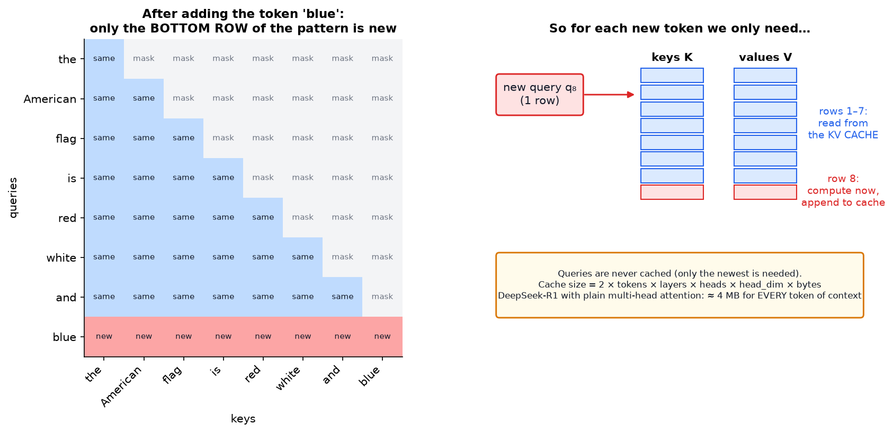
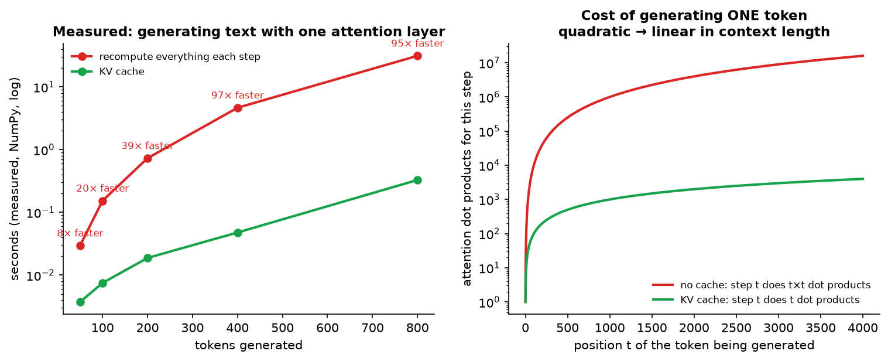
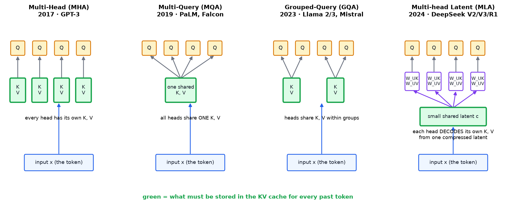
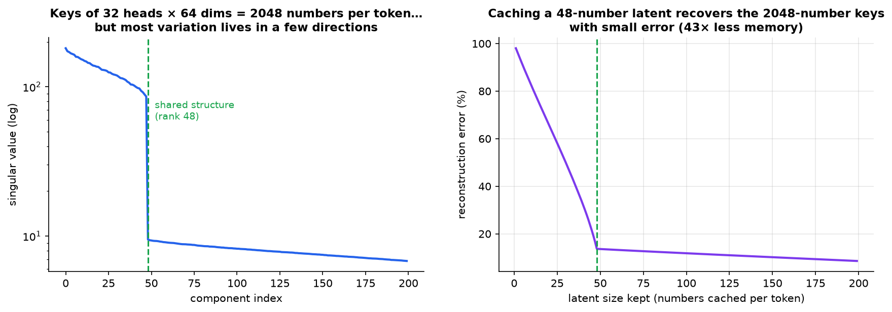
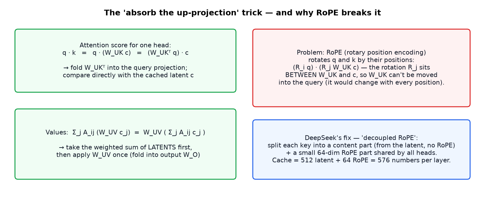
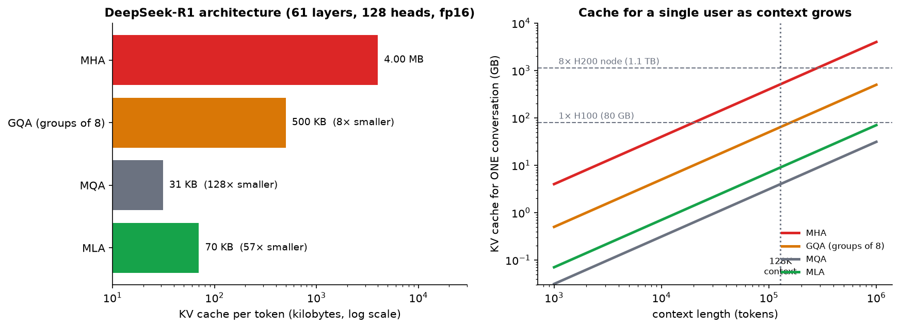
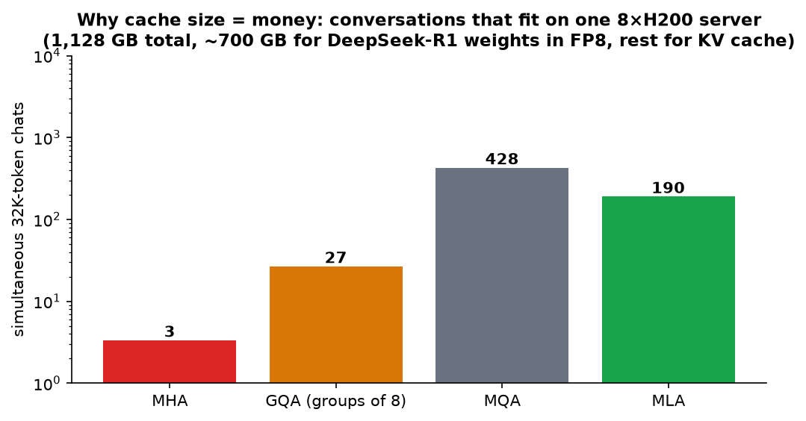

# How DeepSeek Rewrote the Transformer: Multi-head Latent Attention (MLA)

> **Source:** [How DeepSeek Rewrote the Transformer [MLA]](https://youtu.be/0VLAoVGf_74?si=rv4YR-nPW7dnGsE4) by Welch Labs
> **Read first (recommended):** [Attention in transformers](Attention%20in%20Transformers%20-%20Queries%20Keys%20and%20Values.md). This note assumes you know what Q, K, V and attention patterns are.
> **What's in this version:** 7 figures (a measured KV-cache speed-up, cache sizes computed from DeepSeek's real config, and a low-rank compression simulation), the business impact in "users per server", the RoPE catch that the video skips, tested code proving the MLA math, a quiz, and corrections to a few details in the first version of these notes.
> **Facts re-checked:** 18 September 2026. This is the guide where the most has changed since the video. MLA is still in production, but DeepSeek itself has moved past it — see **§7.5**, and read that section before quoting any "DeepSeek uses X" claim.

---

## 0. How to use this guide

| If you have… | Read |
|---|---|
| 10 minutes | §0.1, §1 TL;DR plus figures 3, 4 and 6 |
| 1 hour | §1–§8 (and §7.5 for what's changed since) |
| A weekend | Everything. Run `code/mla_numpy.py` and change the latent size |

---

### 0.1 First, in completely plain words

When a chatbot writes an answer, it produces **one word at a time**, and before each new word it re-reads everything that came before. Re-reading from scratch every time would be absurdly slow, so the model keeps a **notebook**: for every word so far, it stores two summaries it will need again. That notebook is called the **KV cache**.

The problem is that the notebook is enormous. For a model the size of DeepSeek-R1, every single word of the conversation adds about **4 megabytes** of notes. A long conversation needs hundreds of gigabytes — more memory than a whole server has. And the model must **re-read the entire notebook to produce every single word**, so a fat notebook doesn't just cost memory, it makes answers slower.

There are three ways to shrink the notebook:

| Approach | The analogy | Name |
|---|---|---|
| Everyone takes their own full notes | 128 people each keeping a complete notebook | **MHA** — the original, and the most expensive |
| Everyone shares one set of notes | one photocopy passed around; cheap, but nobody gets the details *they* needed | **MQA / GQA** — cheaper, slightly worse answers |
| Everyone shares one **compressed** file, and each person unpacks it their own way | a zip file, plus 128 different unzipping tools | **MLA** — DeepSeek's idea |

MLA is the third one, and the headline result is that it makes the notebook **~57× smaller than the first approach without making answers worse**. That's the whole guide in one paragraph. The rest is *how* you compress it, why decompressing doesn't cost you the savings back (§6.3), and the one awkward detail about word order that nearly breaks the trick (§6.4).

**Why an engineer should care:** fewer gigabytes per conversation means more people served per GPU, which means lower prices per token. This is an architecture change that shows up directly on a pricing page.

---

## 1. TL;DR in 8 lines

1. LLMs generate **one token at a time**. Each new token has to attend to **all previous tokens**.
2. Recomputing everything each step is wasteful. The **KV cache** stores past keys and values, so each step only computes one new row.
3. The cache is huge: DeepSeek-R1's shape with standard attention would need **~4 MB per token**, so **400 GB** for a 100K-token chat.
4. When generating text, the bottleneck is **memory size and memory speed**, not raw compute. A big cache means fewer users per GPU and slower tokens.
5. **MQA / GQA** shrink the cache by making heads **share** keys and values, at some cost in quality.
6. **MLA** instead caches a **small learned latent vector** (576 numbers per layer), and each head **decodes its own** keys and values from it.
7. Result: **~57× smaller cache than MHA** (70 KB/token). In DeepSeek's experiments quality is **equal or better**.
8. Catch: rotary position encoding (RoPE) doesn't mix with the compression, so DeepSeek adds a small, separate **decoupled RoPE key**.

---

## 2. Background: why DeepSeek mattered

| Date | Release | Why it mattered |
|---|---|---|
| May 2024 | **DeepSeek-V2** paper: introduces **MLA** (plus DeepSeekMoE) | KV cache cut by 93% vs their earlier 67B model, and up to 5.76× higher generation throughput |
| Dec 2024 | **DeepSeek-V3** (671B total parameters, 37B active per token) | frontier-level quality, reported final training run of ~2.8M H800 GPU-hours (~$5.6M) |
| Jan 2025 | **DeepSeek-R1** (reasoning model built on V3) | matched leading reasoning models with **open weights**. Briefly knocked ~$600B off Nvidia's market value in one day |
| Feb 2025 | DeepSeek open-sources **FlashMLA** and other kernels | optimized GPU code for MLA inference |
| Sep 2025 | **DeepSeek-V3.2** adds **DSA** (DeepSeek Sparse Attention) *on top of* MLA | a "lightning indexer" picks the ~2,048 most relevant past tokens instead of all of them — cuts long-context cost again |
| Apr 2026 | **DeepSeek-V4** (1.6T params, 1M-token context) **replaces MLA** with a hybrid of Compressed + Heavily Compressed Attention | see §7.5 — the compression idea survives, the specific mechanism doesn't |
| 2026 | **DeepSeek-V4.1-Flash** (552B, 890 bytes/token of KV cache) adds cross-layer reuse — a *third* compression dimension | [its own guide](DeepSeek%20V4.1%20Flash%20-%20Extreme%20KV%20Cache%20Compression.md) |

> **Precision notes on the first version of these notes:**
> - The "fraction of the compute" claim refers to V3's *final training run*. It excludes research, failed runs and hardware.
> - "Six times faster" comes from the V2 paper's **5.76× maximum generation throughput** vs DeepSeek 67B. That gain comes from MLA **plus** the MoE design and other inference optimizations, not MLA alone.

Most DeepSeek tricks are engineering around the model. **MLA changes the transformer's attention block itself.**

---

## 3. Quick recap: attention (with two corrections)

- GPT-2 Small: 12 layers × 12 heads = **144 attention patterns** per input. DeepSeek-R1: 61 layers × 128 heads = **7,808 patterns**.
- For "the American flag is red white and" (9 tokens) each pattern is **9 × 9**.
- Example heads in GPT-2: layer 3 links "American" → "flag". Layer 11 gathers "flag", "red", "white" into "and" to predict **"blue"**.

**Steps for one head:** $Q = XW_Q$, $K = XW_K$, $V = XW_V$ → scores $QK^\top$ → mask → divide → softmax → $A \cdot V$ → combine heads with $W_O$.

> **Corrections:**
> 1. The masked entries aren't "zeroed". They're set to **−∞ before the softmax**, which makes them exactly 0 afterwards while each row still sums to 1.
> 2. The scores are divided by $\sqrt{d_{\text{head}}}$ (the key/query dimension, e.g. 64 in GPT-2), **not** by the square root of the embedding dimension (768).

---

## 4. The KV cache: an essential shortcut

### 4.1 Why it works

Generation is **autoregressive**: produce "blue", append it, run the model again to get the next token.



*When "blue" is appended, the old rows of Q, K, V don't change, because each row depends only on its own token (thanks to the causal mask). The top-left block of the pattern is unchanged, the upper-right is masked, so **only the bottom row** is new. That row needs **one** new query plus **all** keys and values. So keys and values get cached. Queries don't.*

### 4.2 How much it saves (measured)



*Left: a real NumPy decoding loop. Generating 800 tokens is 115× faster with a KV cache, and the gap keeps growing. Right: without the cache, step t redoes a t×t pattern. With it, step t computes one row of t numbers.*

So per generated token, attention compute goes from **quadratic to linear** in context length. (Over a whole generated text, total work goes from roughly cubic to quadratic.)

> **Engineering vocabulary:** processing the prompt is called **prefill** (compute-heavy, parallel). Generating tokens is **decode** (one token at a time, memory-heavy). The KV cache is created in prefill and grows during decode.

### 4.3 The price: memory

$$\text{KV cache} = 2 \times n_{\text{tokens}} \times L_{\text{layers}} \times N_{\text{heads}} \times D_{\text{head}} \times \text{bytes}$$

For DeepSeek-R1's shape with standard MHA: $2 \times 61 \times 128 \times 128 \times 2 \text{ bytes} \approx$ **4.0 MB per token**. At 100K tokens that's **400 GB for one conversation**.

**Why this hurts even when it fits:** to generate each token the GPU has to **read** the whole cache (and the active weights) from memory. GPU memory bandwidth is limited, so a bigger cache means **fewer tokens per second**. Decoding is *memory-bound*, not compute-bound.

---

## 5. Earlier fixes: share keys and values between heads



*Green boxes are what has to be cached for every past token. MHA caches K and V per head. MQA caches one shared K, V. GQA caches one per group. MLA caches one small latent that every head decodes differently.*

| Method | Idea | Cache reduction (R1 shape) | Downside |
|---|---|---|---|
| **MHA** (2017) | every head has its own K, V | 1× (4 MB/token) | huge cache |
| **MQA** (Shazeer, 2019) | **all** heads share one K, V | 128× (31 KB) | noticeable quality loss, heads can't specialize their keys |
| **GQA** (Ainslie et al., 2023) | heads share K, V **within groups** (e.g. 8 heads per group) | 8× (500 KB) | milder quality loss. Used by **Llama 2/3, Mistral, Qwen** |
| **MLA** (DeepSeek, 2024) | cache a **learned compressed latent**, decode per head | **57× (70 KB)** | more complex, needs decoupled RoPE |

---

## 6. MLA: learn to compress instead of forcing sharing

### 6.1 The key insight: keys across heads are redundant

MQA and GQA **hand-design** the sharing. DeepSeek asked a different question: *what if the model **learns** a compressed representation that all heads can decode from?* That's a **latent space**, the same idea behind autoencoders, and behind LoRA's low-rank matrices.



*A simulation: 32 heads × 64 dimensions = 2,048 key numbers per token, but generated from shared structure. The singular values (left) drop off a cliff after 48 components. Keeping a 48-number latent (right) reconstructs all 2,048 key numbers with small error, using 43× less memory. MLA doesn't compress after the fact like this. It **trains** the model to use a small latent from the start, so the model learns to make it work.*

### 6.2 The architecture

For each token $x$ in each layer:

$$\underbrace{c = W_{DKV}\,x}_{\text{shared down-projection (cached)}} \qquad k^{(h)} = W_{UK}^{(h)}\,c \qquad v^{(h)} = W_{UV}^{(h)}\,c$$

- $c$ is small: **512** numbers in DeepSeek-V3/R1, versus $128 \times 128 \times 2 = 32{,}768$ for full K, V.
- $W_{UK}^{(h)}, W_{UV}^{(h)}$ are **different for every head**. That's the difference from MQA: heads share the *compressed information*, but each decodes it **its own way**.
- Only $c$ goes in the cache.

**Analogy:** MQA gives every student the **same photocopy** of the notes. MLA gives everyone the same **compact zip file**, and each student unzips it with their own tool to get the version they need.

### 6.3 The worry: doesn't decompression add compute?

Decompressing K and V for every cached token at every step sounds like it would undo the savings. The video describes a linear-algebra trick: since the up-projections are fixed after training, **absorb** them.



- **Keys:** $q \cdot (W_{UK} c) = (W_{UK}^\top q) \cdot c$. Move $W_{UK}^\top$ into the query side and dot directly with the cached latent.
- **Values:** $\sum_j A_{ij}\,W_{UV} c_j = W_{UV}\big(\sum_j A_{ij} c_j\big)$. Average the latents first, then apply $W_{UV}$ once.

**In plain words:** you never actually have to unzip the file. For the keys, instead of unzipping a thousand old notes and comparing your question against each one, you *pre-translate your question into the zipped format once* and compare it against the zipped notes directly — same answer, a thousand times less work. For the values, instead of unzipping a thousand notes and then averaging them, you *average the zipped notes first and unzip the average once*. Both work because unzipping here is a fixed linear operation, and averaging-then-transforming gives the same result as transforming-then-averaging.

The code in §10 checks this identity numerically: the absorbed and naive versions give **identical outputs**.

### 6.4 The catch the video skips: RoPE

Modern LLMs encode position with **RoPE** (rotary position embedding), which *rotates* each query and key by an angle that depends on its position: $(R_i\,q)\cdot(R_j\,k)$. Now the key is $R_j W_{UK} c$, and the rotation $R_j$ sits **between** $W_{UK}$ and $c$. It changes with every position, so $W_{UK}$ can no longer be folded into a fixed query matrix.

**DeepSeek's fix, decoupled RoPE:** split each head's query and key into

1. a **content part**, from the latent, with **no** RoPE (compressible), and
2. a small **positional part** (64 dims) with RoPE, where the key's positional part is **shared across heads** and cached directly.

**Cache per layer = 512 (latent) + 64 (RoPE key) = 576 numbers**, which is the 576 quoted in the video. Real inference engines (vLLM, SGLang, DeepSeek's FlashMLA) use specialized GPU kernels for this. The memory saving is what matters most, because decode is memory-bound.

### 6.5 The result: cache size no longer depends on the number of heads



*Left: per-token cache for DeepSeek-R1's shape. MHA 4.0 MB → GQA 500 KB → MLA 70 KB (**57× smaller than MHA**). Only MQA is smaller, and it costs quality. Right: a single 128K-token conversation needs ~510 GB with MHA (more than six 80 GB GPUs) but only ~9 GB with MLA.*

| Attention type | KV cache per token | 100K-token chat |
|---|---|---|
| Standard MHA | 4.0 MB | 400 GB |
| GQA (groups of 8) | 500 KB | 50 GB |
| **MLA** | **70 KB** | **7 GB** |

And quality: in the DeepSeek-V2 paper's ablations, MLA models **scored better than MHA** models of the same size, while MQA and GQA scored worse. You get the smaller cache without losing quality.

---

## 7. Real-world impact: why cache size = money



*Rough capacity estimate for one 8×H200 server (1,128 GB of GPU memory) with ~700 GB used by R1's weights. With MHA only ~3 users with 32K contexts fit at once. With MLA, ~190 fit. MQA fits more still, but loses quality. (Real servers also need room for activations and other overhead, so actual numbers are lower. The **ratio** is what counts.)*

What a smaller cache buys:

| Benefit | Why |
|---|---|
| **Cheaper API prices** | more concurrent users per GPU means lower cost per token. DeepSeek's API launched at a fraction of competitors' prices |
| **Faster generation** | less memory to read per token |
| **Longer contexts** | 128K tokens becomes affordable |
| **Bigger batches** | GPUs run more efficiently when serving many requests together |
| **Prefix / prompt caching** | cached prefixes (system prompts, documents) are cheaper to store on GPU, CPU or SSD. DeepSeek offers a disk-based context cache at reduced prices |
| **Reasoning models** | R1-style "thinking" generates thousands of tokens per answer, so a cheap cache makes long chains of thought affordable |

**Adoption:** MLA is used in DeepSeek V2/V3/V3.2/R1 and in models built on that architecture (Moonshot's **Kimi K2**, Zhipu's **GLM-5.x**). Research such as *TransMLA* (2025) converts existing GQA models to MLA. Inference engines (vLLM, SGLang, TensorRT-LLM) ship MLA kernels.

### Where MLA sits among other inference optimizations

| Technique | What it shrinks |
|---|---|
| KV cache | recomputation |
| MQA / GQA / **MLA** | cache size, by sharing or compressing across heads |
| **KV cache quantization** (FP8, INT4) | bytes per cached number |
| **PagedAttention** (vLLM) | wasted memory from fragmentation, like virtual memory pages |
| **Sliding-window attention** | number of cached tokens |
| **Speculative decoding** | number of expensive decode steps |
| **Mixture of Experts** (DeepSeekMoE) | active weights read per token |

These **stack**: DeepSeek-V3 combines MLA + MoE + FP8 training + multi-token prediction.

---

## 7.5 What changed after the video (checked September 2026)

**Read this before repeating "DeepSeek uses MLA" as a present-tense fact.** It was true when the video was made. It is now true of *some* DeepSeek models and not the newest one.

### The two steps that happened since

**Step 1 — September 2025: DeepSeek-V3.2 keeps MLA and adds sparsity on top.**

MLA shrank the cache **per token**. It did nothing about the fact that every new token still has to look at *every* past token. V3.2 attacks that second problem with **DSA (DeepSeek Sparse Attention)**: a small, cheap "lightning indexer" scores how relevant each past token is, and full attention is then computed against only the **top-k** of them (k = 2,048 in the released model). The compressed latent from MLA is still what gets cached.

> The mental shift: MLA compresses **how much you store per token**; DSA reduces **how many tokens you bother reading**. They are orthogonal, which is why V3.2 uses both.

**Step 2 — April 2026: DeepSeek-V4 replaces MLA entirely.**

V4 (1.6T total / ~49B active parameters for the Pro tier, 284B/~13B for Flash, **1M-token context**) drops MLA for a **hybrid attention stack** with two layer types interleaved:

| Layer type | What it does | Compression |
|---|---|---|
| **CSA** — Compressed Sparse Attention | compresses *along the sequence* into blocks, then an FP4 lightning indexer picks the top-k blocks to attend to | ~4× |
| **HCA** — Heavily Compressed Attention | compresses the whole sequence far harder, then does ordinary dense attention over the short result — no selection step needed | ~128× |

V4 Pro interleaves them roughly **3 CSA : 1 HCA**, with the heavy-compression layers concentrated deeper in the network. At a 1M-token context, DeepSeek reports V4 Pro needing roughly **27% of the per-token inference FLOPs and ~10% of the KV cache of V3.2**.

### So was this guide wasted?

No — and it's worth being precise about why.

| The video's claim | Status in September 2026 |
|---|---|
| "The KV cache is the bottleneck for generation, and decode is memory-bound" | ✅ **More true than ever.** This is the premise behind every change since |
| "Don't hand-design the sharing (MQA/GQA) — **learn** a compressed representation" | ✅ **Won completely.** Every subsequent design is a learned compression of something |
| "Cache a small latent and let each head decode its own K and V" (MLA specifically) | ⚠️ Still in production (DeepSeek ≤ V3.2, Kimi K2, GLM-5.x), but **superseded inside DeepSeek** by compressing the *sequence* and *layer* dimensions too |
| "57× smaller cache than MHA" | ✅ Correct for the R1 configuration this guide computes. V4 goes considerably further |
| "GQA is the mainstream alternative" | ✅ Still true — roughly two-thirds of recent open-weight models use GQA, because it is a one-line change with a large payoff |

**Step 3 — 2026: DeepSeek-V4.1-Flash, and the third axis.**

V4.1-Flash (552B parameters, 1M context) went further again, and its paper states the organising principle better than anything else in this literature. There are **three independent, multiplicative dimensions** along which a KV cache can be compressed:

| Dimension | The question it answers | Techniques |
|---|---|---|
| **1. Entry size** | how many numbers per cached entry? | MHA → GQA → **MLA** → FP8 → FP4 |
| **2. Sequence** | how many entries per token? | compress every *c* tokens into one (CSA, HCA) |
| **3. Layer** | how many layers store anything at all? | cross-layer reuse (CSA2's Full / Reindex / Reuse modes) |

**MLA — the subject of this whole guide — is a move on dimension 1.** V4 added dimension 2. V4.1 added dimension 3, and in its shipped configuration **only 4 of 38 attention layers keep a KV cache of their own**, which gets the global cache down to **890 bytes per token**.

There's a fourth question that's separate from all three, because it's about *reading* rather than *storing*: **how many stored entries do you actually look at?** That's what sparse attention (DSA, and V4.1's hierarchical indexer) answers.

Learn those four questions and you can place any future attention variant within about thirty seconds of reading its abstract. Almost every paper moves exactly one of them.

👉 **[The full V4.1-Flash story has its own guide](DeepSeek%20V4.1%20Flash%20-%20Extreme%20KV%20Cache%20Compression.md)**, worked through from the technical report — including how half the model skips reading the prompt entirely, and why deleting short-term memory and recomputing it turned out to be faster than storing it.

---

## 8. Common misconceptions

| Misconception | Reality |
|---|---|
| "MLA reduces the O(n²) attention compute" | Not directly. It shrinks the **cache per token**. The cache still grows linearly with context |
| "The KV cache makes attention free" | It makes each decode step linear in n, but memory and bandwidth become the bottleneck |
| "Queries need caching too" | Only the newest query is ever used |
| "Smaller cache must mean worse quality" | MQA/GQA trade quality away. Learned compression (MLA) didn't lose quality in DeepSeek's tests |
| "MLA is just GQA with extra steps" | GQA's heads use **identical** K, V within a group. MLA's heads decode **different** K, V from the shared latent |
| "The 6× speed-up is from MLA alone" | It's MLA **plus** MoE and other optimizations vs a dense 67B model |
| "DeepSeek uses MLA" (present tense, 2026) | True through V3.2. **DeepSeek-V4 replaced it** with compressed + sparse attention (§7.5). MLA lives on in Kimi K2 and GLM-5.x |

---

## 9. Self-quiz

<details><summary><b>Q1 (easy).</b> Why don't queries need to be cached?</summary>

To extend the attention pattern you only need the newest token's query (the bottom row). Old queries are never used again.
</details>

<details><summary><b>Q2 (easy).</b> What exactly does MLA put in the cache?</summary>

Per token, per layer: a compressed latent vector $c$ (512 numbers) plus a small decoupled RoPE key (64 numbers).
</details>

<details><summary><b>Q3 (medium).</b> Compute the MHA KV cache per token for a model with 32 layers, 32 heads, head dim 128, in fp16.</summary>

2 × 32 × 32 × 128 × 2 bytes = **524,288 bytes ≈ 0.5 MB** per token. (That's Llama-2-7B, which uses plain MHA.)
</details>

<details><summary><b>Q4 (medium).</b> How does GQA with 8 KV groups change the answer to Q3?</summary>

32 heads ÷ 8 groups = 4 KV heads, so 2 × 32 × 4 × 128 × 2 = 65,536 bytes ≈ **64 KB** (8× smaller).
</details>

<details><summary><b>Q5 (medium).</b> Why is token generation called "memory-bound"?</summary>

Each step does little arithmetic for one token but has to read the active weights and the whole KV cache from GPU memory. Memory bandwidth, not compute, limits speed.
</details>

<details><summary><b>Q6 (hard).</b> Show why the key up-projection can be absorbed into the query.</summary>

$q^\top (W_{UK} c) = (W_{UK}^\top q)^\top c$. The dot product with the decompressed key equals a dot product of a *transformed query* with the latent, so we can precompute $W_{UK}^\top W_Q$ as one matrix.
</details>

<details><summary><b>Q7 (hard).</b> Why does RoPE break that trick, and how does DeepSeek work around it?</summary>

RoPE inserts a position-dependent rotation: $q^\top R_i^\top R_j W_{UK} c$. $R_j$ sits between $W_{UK}$ and $c$ and differs per position, so there's no single fixed matrix to absorb. DeepSeek uses decoupled RoPE: content keys come from the latent without RoPE, and a separate small RoPE key (shared across heads) is cached alongside it.
</details>

<details><summary><b>Q8 (hard).</b> A server has 400 GB free for KV cache. How many 32K-token conversations fit with MHA (4 MB/token) vs MLA (70 KB/token)?</summary>

MHA: 400 GB ÷ (4 MB × 32,000 = 128 GB) ≈ **3**. MLA: 400 GB ÷ (70 KB × 32,000 = 2.24 GB) ≈ **178**.
</details>

---

## 10. Code: MLA in NumPy (tested)

Full file: [`code/mla_numpy.py`](code/mla_numpy.py). The core of the generation loop:

```python
latent_cache = []
for t in range(n_tokens):
    x = X[t]
    latent_cache.append(W_DKV @ x)                 # cache ONLY the small latent
    C = np.stack(latent_cache)                     # (t+1, d_latent)
    for h in range(n_heads):
        q = W_Q[h] @ x
        # (a) naive: decompress per-head keys/values, then attend
        K = C @ W_UK[h].T; V = C @ W_UV[h].T
        out_naive = softmax(K @ q / np.sqrt(d_head)) @ V
        # (b) absorbed: q·(W_UK c) = (W_UKᵀ q)·c   and   Σ a_j W_UV c_j = W_UV (Σ a_j c_j)
        a = softmax(C @ (W_UK[h].T @ q) / np.sqrt(d_head))
        out_absorbed = W_UV[h] @ (a @ C)
```

**Actual output:**

```
absorbed version identical to naive version: True
numbers cached per token  MHA=512  GQA(4)=128  MQA=64  MLA=48
DeepSeek-R1: MHA 4.00 MB/token, MLA 70.3 KB/token, ratio 56.9x
100K-token context: MHA 400 GB, MLA 7.0 GB
```

---

## 11. Glossary

| Term | Meaning |
|---|---|
| **Autoregressive** | Generating one token at a time, each conditioned on all previous ones |
| **KV cache** | Stored keys and values of past tokens, reused at every decode step |
| **Prefill / decode** | Processing the prompt in parallel / generating tokens one by one |
| **Memory-bound** | Speed limited by how fast data can be read from memory |
| **MHA / MQA / GQA** | Multi-head / multi-query / grouped-query attention |
| **MLA** | Multi-head latent attention: cache a compressed latent that each head decodes |
| **Latent space** | A smaller learned representation that captures the essential information |
| **Low-rank** | A matrix that factors through a smaller dimension |
| **Down/up-projection** | Matrices mapping into / out of the latent space |
| **RoPE** | Rotary position embedding, which rotates Q and K by position |
| **Decoupled RoPE** | DeepSeek's separate small positional key that makes MLA work with RoPE |
| **MoE** | Mixture of Experts: only some weights are active for each token |
| **PagedAttention** | Storing the KV cache in fixed-size pages to avoid wasted memory |

---

## 12. Further reading

1. **Welch Labs**, *How DeepSeek Rewrote the Transformer* (the source video).
2. **DeepSeek-AI (2024)**, *DeepSeek-V2: A Strong, Economical, and Efficient Mixture-of-Experts Language Model*. MLA is introduced in §2.1, and the appendix has the MHA/GQA/MQA comparisons.
3. **DeepSeek-AI (2024)**, *DeepSeek-V3 Technical Report*.
4. **Shazeer (2019)**, *Fast Transformer Decoding: One Write-Head is All You Need* (MQA).
5. **Ainslie et al. (2023)**, *GQA*.
6. **Su et al. (2021)**, *RoFormer: Enhanced Transformer with Rotary Position Embedding*.
7. **Kwon et al. (2023)**, *Efficient Memory Management for LLM Serving with PagedAttention* (vLLM).
8. **Meng et al. (2025)**, *TransMLA: Multi-head Latent Attention Is All You Need*.
9. **DeepSeek-AI (2025)**, *DeepSeek-V3.2* — introduces DSA and the lightning indexer.
10. **DeepSeek-AI (2026)**, *DeepSeek-V4 Technical Report* — the CSA + HCA hybrid that replaced MLA.
11. **Sebastian Raschka**, *A Technical Tour of the DeepSeek Models from V3 to V3.2* — the clearest walk-through of the MLA → DSA transition.

---

*Source video: [How DeepSeek Rewrote the Transformer [MLA]](https://youtu.be/0VLAoVGf_74?si=rv4YR-nPW7dnGsE4) by Welch Labs. Figures generated by `figures/deepseek_mla/make_figs.py`. Cache sizes use DeepSeek-V3/R1's published configuration, and timings were measured.*
