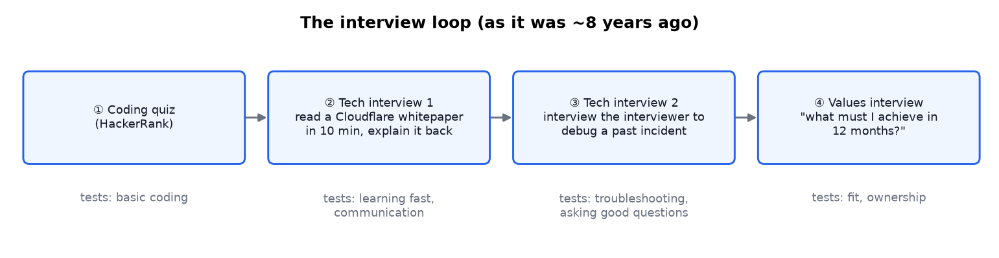
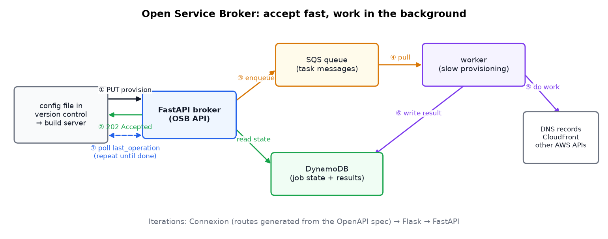
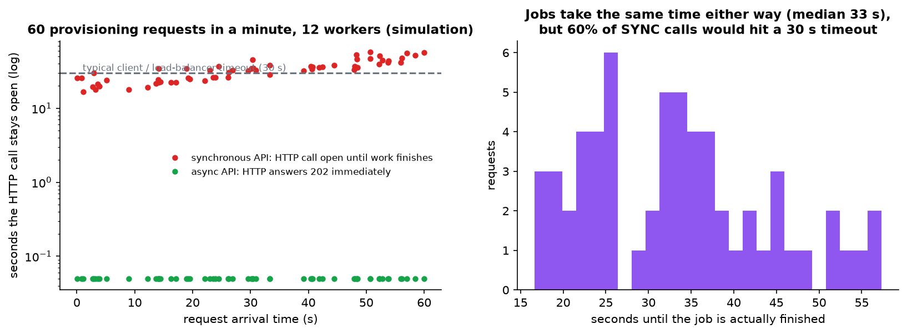
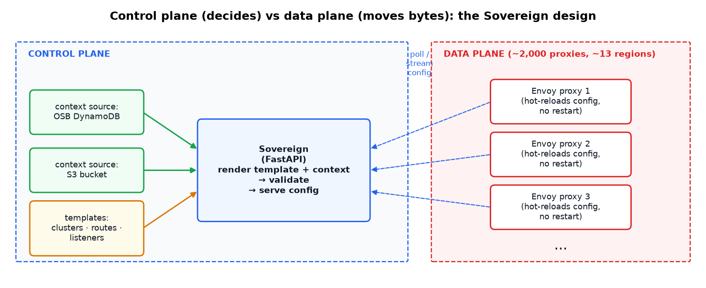
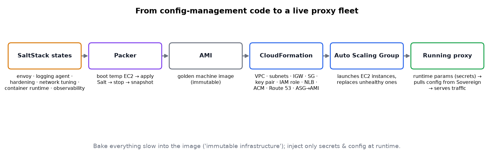
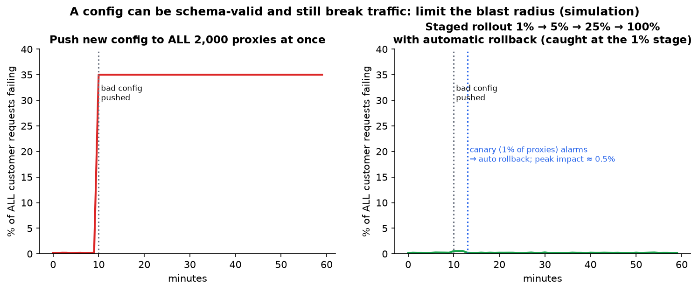
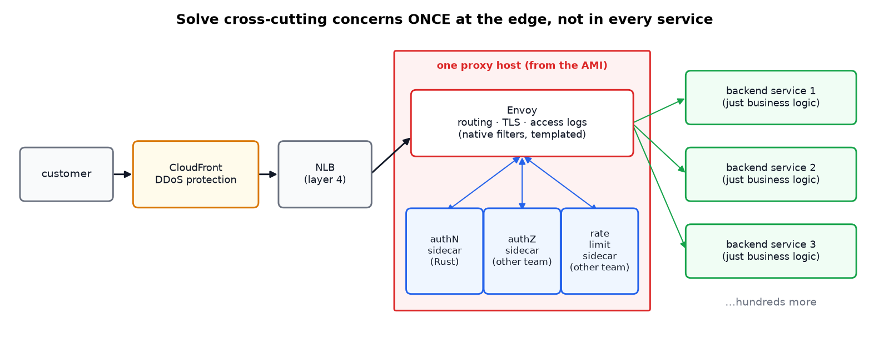
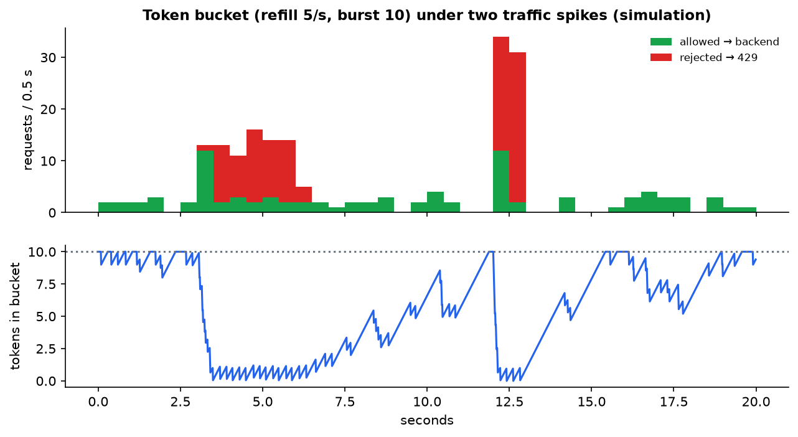
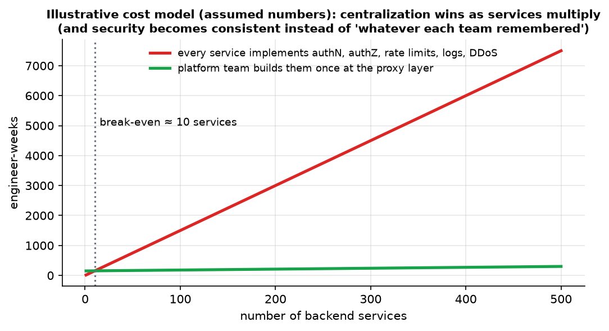

# "I Was Laid Off by Atlassian": Platform Engineering Lessons from 8 Years

> **Source:** [I was laid off by Atlassian](https://youtu.be/55pTFVoclvE?si=KMmeZ_0K8pEoHUae) by Vasilios Syrakis
> **Related notes:** [System Design Explained](System%20Design%20-%20APIs%20Databases%20Caching%20CDNs%20and%20Scaling.md) (load balancers, CDNs) · [8 API Laws](REST%20API%20Design%20-%20The%208%20Laws.md) (async 202 APIs, rate limiting) · [1M Requests per Second](Scaling%20to%201%20Million%20Requests%20per%20Second.md)
> **What's in this version:** 9 figures (architecture diagrams plus simulations of sync vs async APIs, token-bucket rate limiting and canary config rollouts), explanations of every technology named (OSB, Envoy, xDS, control plane vs data plane, Packer, SaltStack, CloudFormation, sidecars), the general patterns behind them, one factual correction, tested code for three patterns, interview and career takeaways, and a quiz.
> **Facts re-checked:** 18 September 2026. All the named technologies are still current and in production use. One note on the Open Service Broker API in §3.1, which is now a legacy-leaning choice rather than the obvious one.

---

## 0. How to use this guide

| If you have… | Read |
|---|---|
| 10 minutes | §0.1 plain-words intro, §1 TL;DR, plus figures 2, 4 and 6 |
| 1 hour | §1–§9 |
| Preparing for platform / SRE interviews | everything, especially §10 (patterns) and the quiz |

---

### 0.1 First, in completely plain words

This one is a career retrospective, not a lecture, so it's full of product names that mean nothing until someone unpacks them. Here's the whole eight years in ordinary language first.

**The problem he was hired to solve.** A big company has hundreds of internal teams, and every one of them needs their service reachable from the internet. Historically that meant **filing a ticket** and waiting for a specialist to configure an expensive piece of networking equipment. Slow for the teams, tedious for the specialists, and expensive in licence fees.

**What he built instead: a vending machine.** A developer writes a few lines in a config file, commits it, and a few minutes later their service is live on the internet with a certificate, a DNS name, logging, authentication and rate limiting already attached. No ticket, no human.

The guide is really about the three parts of that vending machine, and each has a plain-English version:

| The jargon | What it actually is |
|---|---|
| **Open Service Broker (OSB)** | an agreed, standard way to say "please give me one of those" to a platform — the order form. The important design choice: it says *"got it, I'm working on it"* immediately rather than making you wait on the phone while it works |
| **Envoy + a control plane** | the actual traffic cops (about 2,000 of them worldwide) that direct incoming requests, plus a central brain that tells them the current rules. Crucially, the cops keep working with their last set of instructions if the brain goes down |
| **Immutable infrastructure** | when you need to change a server, you don't fix it — you build a fresh one from a known-good template and throw the old one away. Like replacing a light bulb instead of rewiring it |

**And the two lessons that outlive all the technology:**

1. **A config file can be perfectly valid and still destroy everything.** The syntax checker will pass a rule that quietly sends one company's traffic to another company's servers. So you never ship a change everywhere at once — you ship it to 1% first and watch. Most of the team's real effort went into this, not into the fun architecture.
2. **Building the system took two years. Keeping it changeable took the other six.** People leave, newcomers rewrite things, every change adds a little tangle. He's blunt that this — not the design work — is the actual job.

---

## 1. TL;DR in 8 lines

1. The speaker spent ~8 years at Atlassian building a **self-service load-balancing platform** for internal developers (think "AWS ALB, but internal").
2. **Open Service Broker (OSB):** a standard API for provisioning. It accepts requests **fast (async)**, a queue plus worker does the slow work, and clients **poll**.
3. **Envoy + a custom control plane (Sovereign):** proxies **hot-reload** config rendered from **templates + live data**. There are ~2,000 proxies across ~13 regions.
4. **Infrastructure as code:** SaltStack → Packer bakes an **AMI** → CloudFormation → Auto Scaling Group → running proxies.
5. **Migration:** onboard big products (Jira, Confluence, Bitbucket…) and force every microservice to **explicitly opt in** to being public, which closed accidental exposure.
6. **Centralize cross-cutting concerns at the edge:** DDoS (CloudFront), access logs (Envoy), and authN / authZ / rate limiting (sidecars, one written in Rust). Backend teams write business logic only.
7. The hardest engineering work was **templating and validation**: a config can be *valid* and still *destroy traffic*.
8. **Building is easy; keeping a system changeable is hard.** Watch code **churn**, invest in onboarding and teaching, and learn diplomacy.

---

## 2. The interview process (and what it was testing)



| Stage | What happened | Skill really tested |
|---|---|---|
| ① Coding quiz (HackerRank) | full marks | baseline coding |
| ② Tech interview 1 | 10 minutes to read Cloudflare's paper on custom domains, then explain it. Questions on microservices and containers | **learning fast and explaining clearly**, which is the core of platform work |
| ③ Tech interview 2 | **interview the interviewer** to diagnose a real past incident (an app bug causing a denial of service), plus "how does latency-based DNS routing work?" | structured troubleshooting, asking the right questions, reasoning from first principles |
| ④ Values interview | the candidate asked: *"12 months from now, what must I have achieved for this hire to be a success?"* | ownership. The answer literally became the first project |

> **Correction on latency-based routing.** The original notes said this "typically relies on a geolocation database rather than real-time latency measurement". For **AWS Route 53** specifically, that's not quite right either. Route 53's *latency-based* routing uses **latency measurements that AWS collects over time** between networks (by IP range) and AWS regions. It doesn't measure *your* request live, and it isn't a pure geo lookup. **Geolocation routing** is a *separate* Route 53 policy. The candidate's first-principles answer, and the idea of "a geo database", were both partly right.

**Takeaway for your own interviews:** ask what success looks like at 12 months. It shows ownership, and it tells you what you're really being hired to do.

---

## 3. Project 1: the Open Service Broker (OSB)

### 3.1 What an OSB is

The **Open Service Broker API** (originally from Cloud Foundry, later used with Kubernetes' Service Catalog) is a **standard REST contract for provisioning resources on a platform**:

| Endpoint | Purpose |
|---|---|
| `GET /v2/catalog` | list available services and plans, e.g. "public HTTPS load balancer, plan: standard" |
| `PUT /v2/service_instances/{id}` | provision an instance |
| `PATCH …/{id}` / `DELETE …/{id}` | update / deprovision |
| `PUT …/{id}/service_bindings/{bid}` | **bind** the resource to a consumer (pod, app) and hand back credentials or endpoints |
| `GET …/{id}/last_operation` | **poll** the status of async work |

The abstraction is the point: a developer asks for *"a SQL-compatible database"* or *"a public load balancer"*, not for the specific product underneath. At Atlassian, requests came **from config files in version control**, which a **build server** turned into broker calls (GitOps-style self-service).

> **Would you still pick OSB today? (checked September 2026)** Probably not as your starting point, and it's worth knowing why — the *pattern* is what matters, not the spec.
>
> The Open Service Broker API came from Cloud Foundry, and its Kubernetes home, **Service Catalog, has been retired** (its repository now sits under `kubernetes-retired`, and OpenShift deprecated it years ago). The ecosystem converged on two alternatives instead:
> - **Operators** (the Operator Framework / Operator Lifecycle Manager) — a controller inside the cluster that watches for a custom resource and reconciles reality toward it.
> - **Crossplane** — the same idea extended to cloud resources outside the cluster, so a developer declares "I want a Postgres" as a Kubernetes object and a controller provisions it in AWS.
>
> **But look at what didn't change.** All three are the same design: *declare what you want → something accepts the request immediately → a worker reconciles reality in the background → you poll or watch for status.* OSB called it `last_operation`; Kubernetes calls it the status subresource. Learn the pattern in §3.2 and every one of these is a variation on it.

**Implementation history:** Connexion (routes generated from the OpenAPI spec) → Flask → **FastAPI**.

### 3.2 The async architecture



*The API never does slow work itself. It records the job, drops a message on **SQS**, and returns **202 Accepted** at once. A **worker** does the slow provisioning (DNS records, CloudFront distributions, AWS API calls) and writes the result to **DynamoDB**. The client **polls** until the state is `succeeded` or `failed`.*

### 3.3 Why async matters (simulated)



*Simulation: 60 provisioning jobs of about 20 s each, 12 workers. In a synchronous design the HTTP call stays open until the work finishes, and **60%** of calls would exceed a typical 30 s client or load-balancer timeout. The client then retries, which adds even more load. In the async design every HTTP call returns in milliseconds, and the work finishes just as fast.*

**This pattern is everywhere:** AWS CloudFormation stacks, video transcoding, report generation, ML training jobs, payment settlement, and Kubernetes itself (you `apply`, and controllers reconcile in the background).

---

## 4. Project 2: replacing enterprise load balancers with Envoy

### 4.1 Why

- Enterprise load balancers came with **licensing costs** and a **ticket-driven** workflow.
- The goal: an open-source, cloud-native, "commodity" proxy that **developers configure themselves**.

**Envoy** (created at Lyft, now a CNCF graduated project) is a high-performance L4/L7 proxy, similar in role to Nginx or HAProxy. Its superpower is a **dynamic configuration API** (**xDS**: LDS, RDS, CDS, EDS for listeners, routes, clusters and endpoints). Config changes are applied **live, without restarting** the proxy. Envoy is also the data plane in **Istio**, AWS App Mesh, Gloo and Contour.

### 4.2 Control plane vs data plane



| | Control plane | Data plane |
|---|---|---|
| Job | **decide** what the config should be | **move traffic** according to it |
| Here | **Sovereign** (FastAPI, later open-sourced on Bitbucket) | ~2,000 Envoy proxies |
| Speed | seconds are fine | microseconds per request |
| If it fails | proxies keep their **last good config** | customers are affected immediately |

**How Sovereign works:**

1. Load **templates**, one per Envoy resource type (clusters, routes, listeners…).
2. Load **context** from *live* sources: the OSB's DynamoDB, S3 buckets, and others.
3. When a proxy asks for config, **render template + context**, then **validate** and serve it.
4. When the underlying data changes, the config re-renders and the proxies update.

### 4.3 The full self-service flow

1. A developer commits a config → the build server calls the **broker**.
2. The **worker** provisions and writes to **DynamoDB**.
3. **Sovereign** sees the new data and renders new Envoy config.
4. **Envoy** proxies fetch it and start routing the new service. No tickets, no restarts.

---

## 5. Project 3: provisioning the proxy fleet (infrastructure as code)



| Tool | Role | Alternatives |
|---|---|---|
| **SaltStack** | configuration management: declare packages, files and services, in order (Envoy, logging agent, hardening, network tuning, container runtime, observability agent, sidecars) | Ansible, Puppet, Chef |
| **HashiCorp Packer** | boots a temporary EC2 instance, applies Salt, stops it, **snapshots an AMI** | EC2 Image Builder |
| **AWS CloudFormation** | creates the infrastructure: VPC, subnets, internet gateway, security group, key pair, IAM role, **NLB** (layer 4), ACM certificates, Route 53 records, **Auto Scaling Group** pointing at the AMI | Terraform, Pulumi, AWS CDK |
| **Auto Scaling Group** | launches EC2 instances, replaces unhealthy ones | Kubernetes Deployments |
| **Runtime parameters** | secrets and keys injected at boot, not baked in | SSM Parameter Store, Secrets Manager, Vault |

**Pattern: immutable infrastructure ("golden images").** Bake everything slow and stable into the image. At boot, inject only secrets and environment config, then pull live routing config from the control plane. To change software, **build a new AMI and roll the fleet**. Don't patch running servers. This makes servers identical, reproducible and quick to replace.

This whole foundation (broker, control plane, provisioning pipeline) took about **the first two years**.

---

## 6. The migration phase

1. **Onboarding large products** (Jira, Confluence, Bitbucket, Statuspage…). Each needed special features, while the platform had to stay **generic and multi-tenant**.
2. **Forced migration of all microservices**. This was easier, because the platform could mandate it. Before, every service got basic load balancing by default and could become **public by accident**. After, the old path couldn't expose services publicly: teams had to **explicitly declare** a service public through the new platform.

> **Security principle: secure by default, explicit opt-in to exposure.** It's the same idea as S3's "Block Public Access" and Kubernetes network policies with a default deny.

---

## 7. Centralizing cross-cutting concerns at the edge

### 7.1 Why Envoy config is dangerous at scale

- **Virtual hosts** choose which domains to accept.
- **Routes** match requests and forward, redirect, respond directly, or add/remove headers, and a route can send traffic to **any cluster** on the proxy.
- With ~1,000 services on a shared fleet, one bad route could send service A's traffic to service B, or swallow it entirely.

So much of the team's effort went into **templating + validation**: developers submit a small JSON document, and the platform **guarantees** it becomes safe, valid Envoy config. The code in §11 shows a mini version.

### 7.2 "Valid but traffic-destroying" configs: limit the blast radius



*Simulation. A config passes schema validation but fails 35% of requests. Pushed to all proxies at once, it's a global outage. Rolled out in stages (1% → 5% → 25% → 100%) with automatic health checks and rollback, the problem is caught on the 1% canary and peak impact is ~0.5%. This is how large platforms ship config: Google SRE practices, AWS's staged deployments, and Cloudflare's gradual rollouts after its 2019 WAF-regex outage.*

### 7.3 One proxy layer, many concerns



| Concern | Implementation |
|---|---|
| **DDoS protection** | **CloudFront** in front (built by a colleague) |
| **Access logging** | **native Envoy** access-log config in the HTTP Connection Manager, generated from a small JSON request |
| **Authentication** | a **sidecar** process on the proxy host, written by the speaker **in Rust** |
| **Authorization** | a sidecar from another team |
| **Rate limiting** | a sidecar from another team |

Sidecars are separate processes on the same host that Envoy calls locally (Envoy's **ext_authz** and **ext_proc** filters, plus rate-limit service hooks). They're installed via the same Salt/Packer AMI pipeline and **receive their own dynamic config** too, so the whole host is programmable at several layers.

### 7.4 The rate limiter, simulated



*The token-bucket algorithm used by most rate limiters (including Envoy's local rate limit). Tokens refill at 5/s up to a burst of 10. Each request spends one. Short bursts are absorbed, and sustained floods get `429 Too Many Requests`, protecting every backend behind the proxy.*

### 7.5 Why centralize? The economics



*An illustrative model with **assumed** costs. If every service team builds and maintains five concerns itself, cost grows with the number of services. A platform team building them once has a fixed cost plus small onboarding, and wins after about 10 services. The bigger win is **consistency**: security becomes the default, not whatever each team remembered.*

**This is a well-known industry pattern:**

| Name | Where you'll see it |
|---|---|
| **API gateway** | Kong, Apigee, AWS API Gateway |
| **Service mesh** (per-service sidecars) | Istio, Linkerd, Consul |
| **Edge platform** | Cloudflare, Fastly, CloudFront + WAF |
| **Platform engineering / internal developer platform** | "paved roads" at Netflix, Spotify's Backstage |

**The trade-off:** a central layer is a **shared failure point** and can become an organizational bottleneck. That's why validation, staged rollout, and self-service (instead of tickets) are essential.

---

## 8. Later work: compliance

After the build-out, the team spent time proving the systems met **compliance standards** (think SOC 2, ISO 27001, FedRAMP-style controls: access reviews, logging, encryption, change management). The speaker found this "boring checklist ticking".

> **A second view:** compliance is often what lets enterprise customers buy the product at all. Platform teams that bake controls in from the start (central logging, auth at the edge, infrastructure as code with change history) make audits much cheaper. The edge-centralization design in §7 is itself a big compliance asset.

---

## 9. Non-technical lessons from eight years

### 9.1 Maintenance is the real job

**At the start** (first burst): onboarding contributors, docs, training people to debug and operate the system, and on-call readiness. What logs matter? What metrics mean what? Failure scenarios the speaker had to think through:

| Failure scenario | Question to answer in advance |
|---|---|
| AWS outage makes DynamoDB unreachable | Do proxies keep serving with the last good config? |
| SQS is down | Provisioning stalls. Who's waiting, and how will they know? |
| A config is valid but breaks traffic | How is it **detected**, and how fast is the rollback? |

**Over the long run:**

- People join and leave, so **onboarding never ends**.
- Each newcomer brings opinions, which causes **churn** (repeated rewrites).
- **Where churn concentrates is a smell**: that part of the code will keep growing in size and complexity and needs a structural fix.
- Every change tends to add **coupling**, and someone eventually has to "detangle" it.

> **A tool you can use:** "code hotspot" analysis. Combine `git log` change frequency with file complexity, as in Adam Tornhill's *Your Code as a Crime Scene*. Files that change often **and** are complex are where bugs and maintenance cost concentrate.

**On AI-generated ("vibe-coded") software:** the maintenance cost appears only *after* many changes pile up, so it's too early to judge. LLMs may also help with the detangling, but the speaker is cautiously optimistic, not certain.

### 9.2 Conflict and diplomacy

Working under many managers and alongside many colleagues brings friction, even with people you respect. What helped: **self-awareness, awareness of the other person, and some psychology**, so friction is anticipated before it escalates. It did affect the speaker's performance, and working on it deliberately was worth it.

### 9.3 Teaching vs mentoring

| | Teaching / training | Mentoring (an intern) |
|---|---|---|
| Skill | turning complex systems into simple mental models | deciding **how much** to help |
| The speaker's experience | a strength, and the main activity in the later years | hard: don't hand over answers, but don't let them stay stuck until they're frustrated |
| Result | known as always available and clear | the intern got the top rating and a return offer (with help from others, and mostly through the intern's own work) |

A useful frame for mentoring is the **zone of proximal development**: give help just past what the learner can do alone. Hints before answers, questions before hints. The speaker also noted never having been mentored, so there was no model of what good mentoring feels like from the other side.

---

## 10. Reusable patterns from this story

| Pattern | One-liner | Where else it applies |
|---|---|---|
| **Async request + queue + worker + polling** | accept fast, work later | any slow job API |
| **Control plane / data plane split** | the brain decides, the muscle moves bytes | Kubernetes, SDN, service meshes, CDNs |
| **Templates + context → config** | declarative inputs, generated outputs | Helm, Kustomize, Terraform modules |
| **Validate before shipping config** | "valid" isn't the same as "safe" | policy-as-code (OPA), CI config tests |
| **Staged rollout + auto rollback** | limit blast radius | feature flags, canary deploys |
| **Immutable infrastructure** | bake images, replace instead of patch | containers, AMIs |
| **Centralize cross-cutting concerns** | solve auth, rate limits and logs once | gateways, meshes, edge platforms |
| **Secure by default, explicit exposure** | nothing is public unless declared | cloud IAM, network policy |
| **Sidecars** | add features next to a process without changing it | service mesh, log shippers |

---

## 11. Code: three platform patterns (tested)

Full file: [`code/platform_patterns.py`](code/platform_patterns.py). Excerpt, validating rendered proxy config:

```python
def render_route(context):
    config = json.loads(ROUTE_TEMPLATE.substitute(context))
    errors = []
    route = config["virtual_hosts"][0]["routes"][0]
    if route["route"]["cluster"] not in KNOWN_CLUSTERS:
        errors.append(f"cluster '{route['route']['cluster']}' does not exist (would black-hole traffic)")
    if not route["match"]["prefix"].startswith("/"):
        errors.append("prefix must start with '/'")
    if config["virtual_hosts"][0]["domains"][0] in {"*", ""}:
        errors.append("wildcard domain would steal traffic from every other service")
    return config, errors
```

**Actual output:**

```
[broker] POST answered in 0.0 ms -> 202 9b6a9907
[broker] after 4 polls: succeeded -> {'hostname': 'billing.example.net'}
[control plane] billing  -> SHIP to proxies
[control plane] search   -> REJECT: cluster 'serch-backend' does not exist (would black-hole traffic);
                            prefix must start with '/'; wildcard domain would steal traffic from every other service
[rate limit] burst: 14/30 allowed, then steady: 12/12 allowed
```

---

## 12. Self-quiz

<details><summary><b>Q1 (easy).</b> Why does the broker return 202 instead of doing the provisioning inside the HTTP request?</summary>

Provisioning is slow (DNS, CloudFront, AWS APIs). Holding the HTTP request open ties up server threads and hits client and load-balancer timeouts, which cause retries and more load. Async accepts instantly and lets workers process at their own pace.
</details>

<details><summary><b>Q2 (easy).</b> What's the difference between a control plane and a data plane?</summary>

The control plane decides configuration (Sovereign). The data plane handles live traffic using that configuration (Envoy). The data plane should keep working with its last good config if the control plane fails.
</details>

<details><summary><b>Q3 (medium).</b> Why bake software into an AMI with Packer instead of installing it when each instance boots?</summary>

Faster, more reliable scale-out (nothing to download at boot), identical instances, a tested image you can roll back to, and fewer runtime dependencies on package repositories. Only secrets and live config are added at runtime.
</details>

<details><summary><b>Q4 (medium).</b> Give an example of a config that's schema-valid but traffic-destroying, and two defenses.</summary>

A route with a wildcard domain, or one pointing at the wrong (existing) cluster, sends another service's traffic to the wrong place. Defenses: semantic validation (ownership checks on domains and clusters) and a staged rollout with health-based automatic rollback.
</details>

<details><summary><b>Q5 (medium).</b> Why implement authN, authZ and rate limiting as sidecars rather than native Envoy config?</summary>

The logic is too complex for static filter config (token validation, policy lookups, distributed counters). Sidecars can be written in any language (Rust here), owned by different teams, and receive their own dynamic config, while Envoy calls them through standard hooks.
</details>

<details><summary><b>Q6 (medium).</b> A token bucket refills at 5 tokens/s with burst 10 and starts full. 30 requests arrive evenly within 1 second. About how many are allowed?</summary>

About 10 (the full bucket) + ~5 (refilled during the second) ≈ **14–15**. The code output shows 14.
</details>

<details><summary><b>Q7 (hard).</b> What's the main risk of centralizing everything in one proxy layer, and how was it mitigated?</summary>

A shared failure point: one bad change affects every service, and the platform team can become an organizational bottleneck. Mitigations: self-service with strong templating and validation, staged rollouts, proxies keeping their last good config, multiple regions, and an Auto Scaling Group replacing unhealthy instances.
</details>

<details><summary><b>Q8 (hard).</b> How does Route 53 latency-based routing decide where to send a user?</summary>

It uses latency data AWS gathers over time between client networks (by the resolver's or client's IP range) and AWS regions, and answers with the record for the lowest-latency region. It's not a live per-request measurement, and it's different from geolocation routing.
</details>

---

## 13. Glossary

| Term | Meaning |
|---|---|
| **Open Service Broker (OSB)** | Standard API for provisioning and binding platform services |
| **SQS / DynamoDB** | AWS managed message queue / NoSQL database |
| **Envoy** | Open-source L4/L7 proxy with a dynamic config API |
| **xDS** | Envoy's discovery APIs (listeners, routes, clusters, endpoints) |
| **Control plane / data plane** | Decides configuration / handles live traffic |
| **Cluster (Envoy)** | A group of upstream hosts that a route can send traffic to |
| **Virtual host / route** | Domain matching / request matching and action rules |
| **HTTP Connection Manager** | Envoy's main HTTP network filter |
| **Sidecar** | A helper process deployed next to a main process |
| **NLB** | AWS Network Load Balancer (layer 4) |
| **AMI** | Amazon Machine Image (a VM template) |
| **Packer / SaltStack / CloudFormation** | Image builder / configuration management / AWS infrastructure as code |
| **ASG** | Auto Scaling Group, which keeps N healthy instances running |
| **Immutable infrastructure** | Replace servers with new images instead of modifying them |
| **Canary / staged rollout** | Release to a small fraction first, widen if healthy |
| **Token bucket** | A rate-limiting algorithm allowing bursts up to a capacity |
| **Churn** | Code that is repeatedly changed or rewritten |

---

## 14. Further reading

1. **Open Service Broker API specification** (GitHub: openservicebrokerapi) — and, for the modern equivalents, the **Operator Framework / OLM** docs and **Crossplane** (§3.1).
2. **Envoy documentation**: *xDS protocol*, *HTTP Connection Manager*, *External Authorization*.
3. **Matt Klein**, *Service mesh data plane vs. control plane* (Envoy blog).
4. **Google SRE Book**, chapters on *Release Engineering* and *Addressing Cascading Failures*.
5. **AWS Route 53 docs**: *Choosing a routing policy* (latency vs geolocation).
6. **Adam Tornhill**, *Your Code as a Crime Scene* (hotspot and churn analysis).
7. **Team Topologies** (Skelton & Pais): platform teams and self-service.

---

*Source video: [I was laid off by Atlassian](https://youtu.be/55pTFVoclvE?si=KMmeZ_0K8pEoHUae) by Vasilios Syrakis. Figures generated by `figures/platform_engineering/make_figs.py`. Figures 3, 7 and 8 are simulations, and figure 9 is an illustrative model with stated assumptions.*
