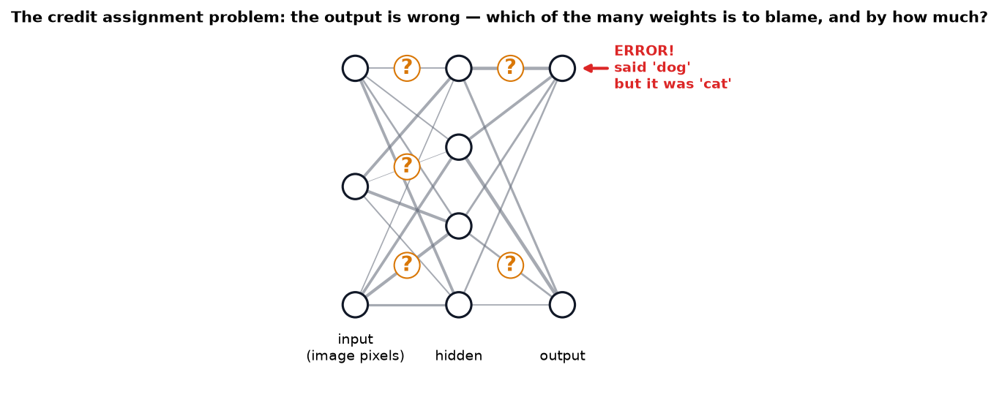
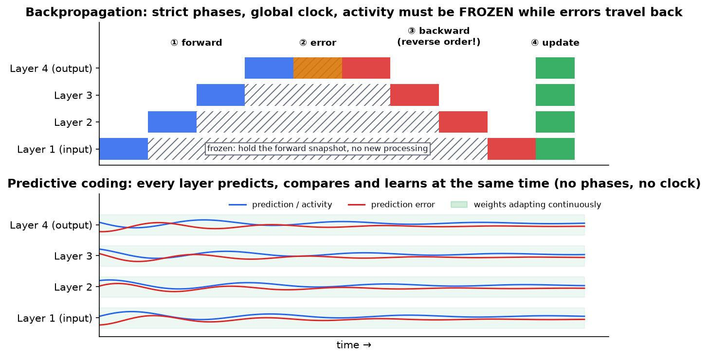
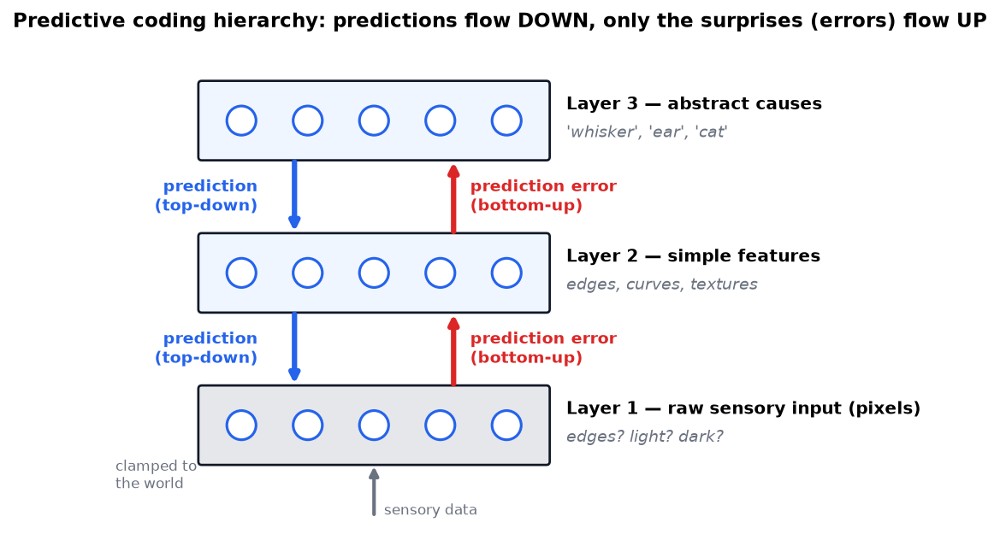
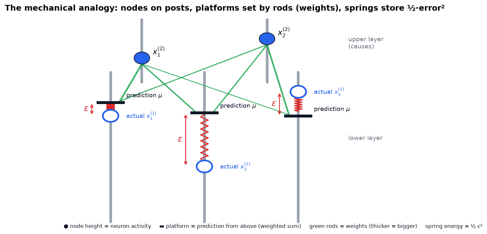
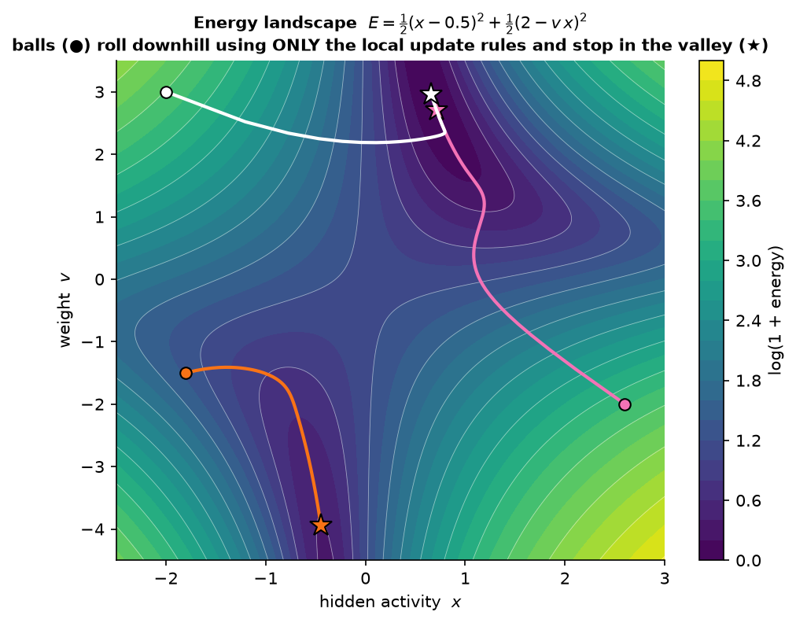
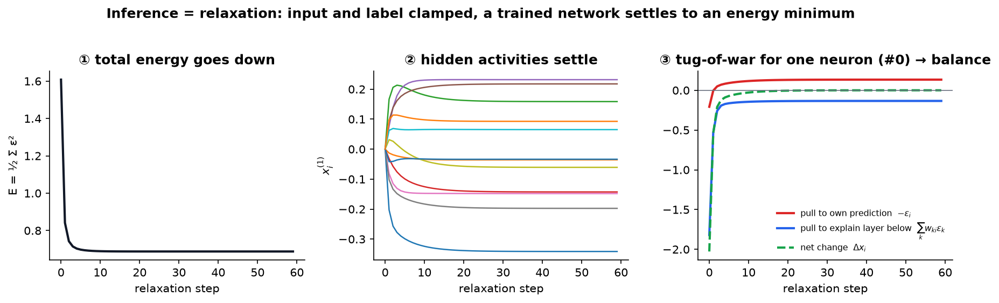
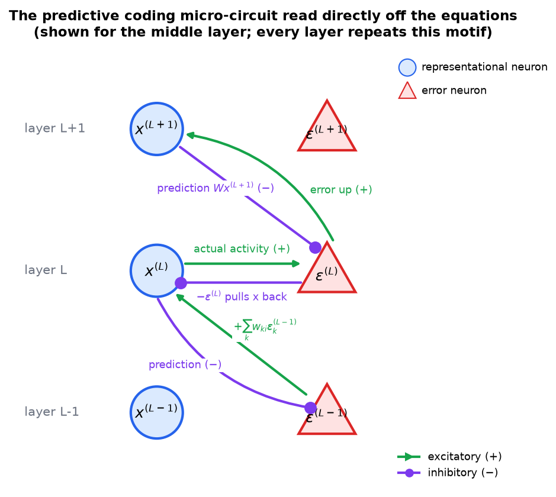
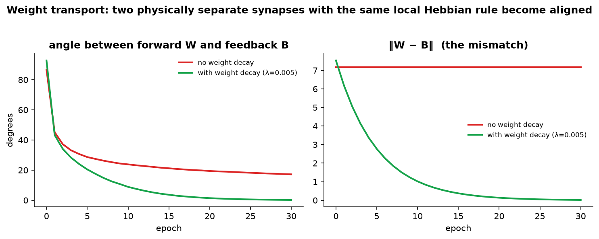
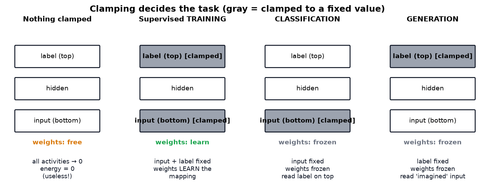
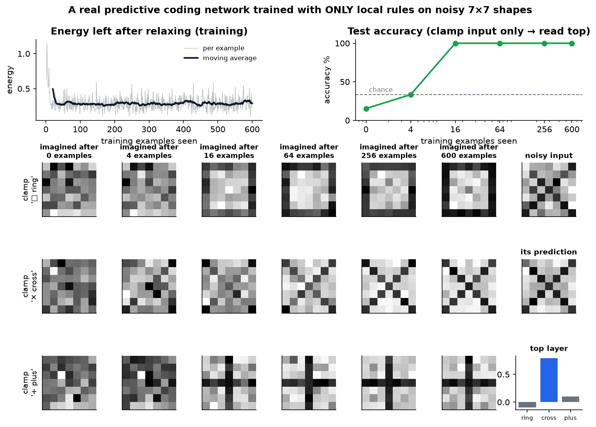

# The Brain's Learning Algorithm Isn't Backpropagation: A Study Guide

> **Read first:** [Backpropagation from scratch](Backpropagation%20-%20How%20Neural%20Networks%20Learn.md) — this guide is the sequel, and assumes you know what a gradient is.
> **Source:** [The Brain's Learning Algorithm Isn't Backpropagation](https://youtu.be/l-OLgbdZ3kk?si=6WUzHzVATB4muhFi) by Artem Kirsanov
> **What's new in this version:** 10 figures and plots (all made from real simulations of the equations below), a full worked example with numbers, the missing math steps, fixes for a few errors in the first notes, a small runnable code example, a self-quiz, and further reading.
> **Facts re-checked:** 18 September 2026. One claim in the video is now out of date — predictive coding is no longer stuck at shallow networks. See §11.5.

---

## 0. How to use this guide

| If you have… | Read |
|---|---|
| 10 minutes | §0.1 plain-words intro, §1 TL;DR, then every figure and its caption |
| 1 hour | Everything except §11 (extensions) |
| A weekend | Everything, run the code in §10, do the quiz in §13 |

**What you need to know first:** what a derivative is, the chain rule, and what $\sum$ means. That's all. ($\sum$ is just "add up all of these".)

**You are not expected to get this in one pass.** Read §0.1 below, then the figures and their captions, then come back for the derivations in §6 and §8.

---

### 0.1 First, in completely plain words

Your brain is guessing what happens next, all the time. When the guess is right, nothing much happens. When the guess is wrong, that mismatch is what gets passed along and what changes your wiring.

That's the whole theory. It's called **predictive coding**, and the guide turns it into three concrete claims:

1. **Each layer of the brain sends a guess *downwards*** about what the layer beneath it should be seeing.
2. **Only the mismatch travels *upwards*** — the surprise, not the raw data. (You stop hearing your fridge hum. You notice instantly when it stops.)
3. **Every cell only needs to look at its own neighbours** to do its part. There's no conductor, no "now everybody run backwards" phase.

Why anyone cares: the algorithm that trains AI (backpropagation) needs exactly that conductor and that backwards phase, which real neurons don't seem to have. Predictive coding gets similar results using only local, simultaneous, neighbour-to-neighbour rules — which is both a theory of the brain *and* a blueprint for chips that don't work like GPUs.

One piece of vocabulary before you start: an **energy** here is not physics energy. It's just a single number that measures "how much total mismatch is in the network right now". The network's only rule is *make that number smaller*. Everything in §6 and §8 is worked out from that one rule.

---

## 1. TL;DR: the whole story in 8 lines

1. **Credit assignment:** a learning system has to figure out *which* weights caused an error.
2. **Backprop** solves this exactly, but it needs **separate phases** (forward, then backward) and a **global controller**. Brains don't seem to have either.
3. **Predictive coding (PC):** each brain layer tries to **predict the layer below it**. Only the **errors** (the surprises) get sent upward.
4. Define an **energy**: $E = \tfrac12 \sum (\text{prediction errors})^2$. The network just rolls downhill on $E$.
5. Rolling downhill for a **neuron** gives: *match your own prediction* **and** *help explain the layer below*.
6. Rolling downhill for a **weight** gives a Hebbian rule: $\Delta w = \varepsilon_{\text{post}} \cdot x_{\text{pre}}$.
7. Every rule uses only **local** information, so everything can run **at the same time, everywhere**.
8. **Clamping** some layers (input, label) chooses the task: training, classification or generation.

---

## 2. The core problem: credit assignment



Any system with adjustable parameters faces the same question: **given an error at the output, which of the millions of weights should change, and by how much?**

**Analogy:** a football team loses 0–3. Who's to blame? The striker who missed? The defender who was out of position three passes earlier? Assigning blame fairly across a long chain of cause and effect is the credit assignment problem.

### How artificial networks solve it: backprop plus gradient descent

A neural network is one big composed function. For a loss $\mathcal{L}$ and a weight $w$ deep in the network, the **chain rule** gives the exact answer:

$$\frac{\partial \mathcal{L}}{\partial w} = \frac{\partial \mathcal{L}}{\partial \hat y}\cdot\frac{\partial \hat y}{\partial h_n}\cdots\frac{\partial h_{k+1}}{\partial h_k}\cdot\frac{\partial h_k}{\partial w}$$

Then **gradient descent** nudges every weight downhill: $w \leftarrow w - \eta\,\partial\mathcal{L}/\partial w$.

This works very well, so it's natural to ask whether the brain does the same thing. The problem is the *structure* of that chain-rule product: to compute the factors for early layers, you need the factors from all the later layers first.

---

## 3. Why backpropagation doesn't fit the brain



### 3.1 Discontinuous processing (the top panel above)

Backprop runs in strict phases:

1. **Forward pass:** input flows up to produce an output.
2. **Error:** compare the output with the target.
3. **Backward pass:** the error flows back down, layer by layer.
4. **Update:** change all the weights, then start over.

The hatched region is the problem. **Each neuron has to hold its forward activity frozen** (the $h_k$ values in the chain rule) until the backward signal reaches it. Neurons signal slowly (milliseconds per synapse), so a real brain doing this would need to **pause processing for hundreds of milliseconds every time it learns**. We don't see that. Neurons fire and adapt continuously.

### 3.2 Lack of local autonomy

Look at the red blocks: the backward pass must run **in reverse order**. Layer 2 can't compute its error until layer 3 is done, and layer 3 has to wait for layer 4. That needs:

- a **global switch** between "forward mode" and "backward mode", and
- **cell-by-cell timing precision** across the whole network.

The brain does have global signals (theta and gamma rhythms, dopamine, attention). They're far too coarse in space and time to sequence millions of individual neurons. Real neurons behave like **autonomous agents** that react only to the signals physically reaching them.

> **Other known problems with backprop in the brain** (not all covered in the video):
> - **Weight transport:** the backward pass reuses the *same* weights as the forward pass (see §8.1).
> - **Signed errors:** backprop errors can be positive or negative, but firing rates can't go below zero.
> - **Non-local information:** a synapse would need to know about errors many layers away.

---

## 4. Predictive coding: the alternative framework

### 4.1 Why prediction?

- **Survival:** predicting a predator's next move is better than reacting to it.
- **Energy efficiency:** spikes are metabolically expensive. If you can predict most of the input, you only need to send **what you didn't predict**.

**Everyday example:** you stop noticing the hum of your fridge, but you notice straight away when it *stops*. The hum was predicted, so it produced no error. The silence broke the prediction and produced a large error.

**The same trick in engineering:** video compression (H.264, for example) sends a keyframe, then mostly sends the *difference* from the predicted next frame. Predictive coding started out as a signal-compression idea (Elias, 1955), was applied to the retina (Srinivasan et al., 1982), and became a model of cortex with **Rao & Ballard (1999)**. The philosophical root goes back further, to Helmholtz's "unconscious inference" (1860s).

### 4.2 The hierarchy



- The **bottom layer** is sensory input (pixels) and is *clamped* to the world.
- **Higher layers** hold more abstract causes. An abstraction is useful exactly *because* it predicts the layer below well.
- **Top-down (blue):** predictions.
- **Bottom-up (red):** prediction errors, meaning actual minus predicted.

> **The key reversal.** In a standard feedforward network, *data* flows up. In predictive coding, *predictions* flow down and only the *errors* flow up. When the prediction is perfect, almost nothing is sent upward.

---

## 5. Building PC as an energy-based model

### 5.1 The idea of energy

Give every configuration of the network (all activities and weights) a single number, the **energy** $E$. Then let the system move **downhill**, the way:

- a ball rolls to the bottom of a valley (gravitational energy), or
- a protein folds into its lowest-energy shape.

### 5.2 The mechanical analogy: springs and posts



| Physical part | Meaning in the network |
|---|---|
| Node sliding on a post | neuron activity $x_i$ (free to move) |
| Platform on the same post | **prediction** $\mu_i$ for that neuron |
| Rods from the upper nodes to the platform (tilt means strength) | **weights** $w$ (the platform height is a weighted sum) |
| Spring between node and platform | **prediction error** $\varepsilon_i = x_i - \mu_i$ |
| Energy stored in the spring | $\tfrac12\varepsilon_i^2$ |

Notice the middle post in the figure: its spring is stretched a lot, so it stores the most energy and creates the strongest force. It pulls the node **up** toward the platform, and it also pulls the **platform down**, which means tugging on the upper nodes and rods. That second pull is the whole secret of how errors reach higher layers.

### 5.3 The math: notation

Layers are numbered from the bottom: $\ell = 0$ is the input, and higher $\ell$ is more abstract.

| Symbol | Meaning |
|---|---|
| $x^{(\ell)}_i$ | activity of neuron $i$ in layer $\ell$ |
| $w_{ki}$ | weight from neuron $i$ (layer $\ell$) to neuron $k$ (layer $\ell-1$) |
| $\mu^{(\ell-1)}_k = \sum_i w_{ki}\,x^{(\ell)}_i$ | prediction for neuron $k$ in the layer below |
| $\varepsilon^{(\ell)}_i = x^{(\ell)}_i - \mu^{(\ell)}_i$ | prediction error |
| $E = \tfrac12\sum_\ell\sum_i \big(\varepsilon^{(\ell)}_i\big)^2$ | total energy (the sum of all the spring energies) |

In matrix form: $\;\boldsymbol\mu^{(\ell-1)} = W^{(\ell)}\mathbf x^{(\ell)},\;\;\boldsymbol\varepsilon^{(\ell)} = \mathbf x^{(\ell)} - \boldsymbol\mu^{(\ell)},\;\; E = \tfrac12\sum_\ell \lVert\boldsymbol\varepsilon^{(\ell)}\rVert^2$

**How to read those three, out loud, in order:** *"Each layer's guess about the layer below is that layer's activity passed through the weights."* → *"The error is what actually happened minus what was predicted."* → *"The energy is every error squared, all added up and halved."*

Two notational conventions that trip people up, and neither is deep:
- The **superscript in brackets** $^{(\ell)}$ is a layer label, not a power. $x^{(2)}$ is "the activity in layer 2", not "x squared".
- The **½ in front of the energy** is a convenience, not a claim. Squaring then differentiating produces a factor of 2, and the ½ cancels it so the final rules come out clean. Drop it and every update just gets twice as big.

(The top layer has nothing above it, so it has no prediction and no error term.)

---

## 6. Deriving the activity update rule



*The figure above is the real energy of the tiny network from §6.3, with one hidden activity $x$ and one weight $v$ both free. Each colored ball follows only the local rules derived below and rolls into a valley. Different starting points can reach different minima; energy landscapes don't have to be simple bowls.*

### 6.1 Step by step

We want $\Delta x_i^{(\ell)} \propto -\dfrac{\partial E}{\partial x_i^{(\ell)}}$, which means moving downhill. $E$ is a sum of springs, so we differentiate each spring and ask which of them actually depend on $x_i^{(\ell)}$:

| Spring | Depends on $x_i^{(\ell)}$? | Derivative |
|---|---|---|
| Layers above $\ell$ | ❌ no | $0$ |
| Neuron $i$'s own spring: $\tfrac12(x_i - \mu_i)^2$ | ✅ yes, through $x_i$ | $+\varepsilon^{(\ell)}_i$ |
| Other springs in layer $\ell$ | ❌ no | $0$ |
| Springs in layer $\ell-1$: $\tfrac12\big(x_k - \sum_j w_{kj}x_j\big)^2$ | ✅ yes, through the prediction | $\varepsilon^{(\ell-1)}_k\cdot(-w_{ki})$ |

Chain rule for the last row: $\dfrac{\partial}{\partial x_i}\tfrac12\varepsilon_k^2 = \varepsilon_k\,\dfrac{\partial \varepsilon_k}{\partial x_i} = \varepsilon_k\,(-w_{ki})$.

Adding them up:

$$\frac{\partial E}{\partial x^{(\ell)}_i} = \varepsilon^{(\ell)}_i - \sum_k w_{ki}\,\varepsilon^{(\ell-1)}_k$$

$$\boxed{\;\Delta x^{(\ell)}_i \;\propto\; \underbrace{-\,\varepsilon^{(\ell)}_i}_{\text{match my own prediction}} \;+\; \underbrace{\sum_k w_{ki}\,\varepsilon^{(\ell-1)}_k}_{\text{explain the layer below better}}\;}$$

In matrix form: $\;\Delta\mathbf x^{(\ell)} \propto -\boldsymbol\varepsilon^{(\ell)} + W^{(\ell)\top}\boldsymbol\varepsilon^{(\ell-1)}$

**In plain words, this is a neuron being pulled in two directions at once:** *"Move towards what the layer above expected of me, and simultaneously move in whatever direction would make my predictions about the layer below less wrong."* It settles wherever those two pulls cancel — which is the compromise you'll see computed in §6.3. ($\propto$ means "proportional to": the direction is what matters, the step size is a separate choice.)

### 6.2 Intuition for the signs

- **First term.** If $\varepsilon_i > 0$ (I'm *above* my prediction), the spring pulls me **down**. If I'm below it, the spring pushes me **up**.
- **Second term.** If the neuron below is *under-predicted* ($\varepsilon_k > 0$) and my weight to it is positive, then **raising** my activity raises its prediction and relaxes that spring.

### 6.3 A worked example with real numbers

A 3-layer chain with one neuron per layer:

```
top     x2 = 1      (clamped)
          │  w2 = 0.5
hidden  x1 = ?      (free)
          │  w1 = 1
input   x0 = 2      (clamped, "the world")
```

**Start** at $x_1 = 0.5$:

| Quantity | Value |
|---|---|
| prediction for hidden: $\mu_1 = w_2 x_2$ | $0.5$ |
| hidden error: $\varepsilon_1 = x_1 - \mu_1$ | $0$ |
| prediction for input: $\mu_0 = w_1 x_1$ | $0.5$ |
| input error: $\varepsilon_0 = 2 - 0.5$ | $1.5$ |
| energy $E = \tfrac12(1.5^2 + 0^2)$ | **1.125** |
| $\Delta x_1 = -\varepsilon_1 + w_1\varepsilon_0 = 0 + 1.5$ | $+1.5$ |

**One step** (step size 0.1): $x_1 = 0.65 \Rightarrow \varepsilon_1 = 0.15,\ \varepsilon_0 = 1.35,\ E = \mathbf{0.9225}$. The energy went down ✅.

**Equilibrium:** set $\Delta x_1 = 0$: $\;-(x_1 - 0.5) + (2 - x_1) = 0 \Rightarrow x_1 = 1.25$

| At equilibrium | Value |
|---|---|
| $\varepsilon_1 = 1.25 - 0.5$ | $0.75$ |
| $\varepsilon_0 = 2 - 1.25$ | $0.75$ |
| $E$ | $0.5625$ |

> **Takeaway:** the hidden neuron settles at a **compromise**. It doesn't fully obey the top layer (0.5) or fully explain the input (2). It splits the difference so both springs share the tension equally. Neither error can reach zero, and **the leftover errors are exactly the learning signals** for the weights (§8). (All of these numbers were checked in code.)

### 6.4 Watching it happen in a bigger network



This is a real 49 → 12 → 3 network (details in §9). With the input and label clamped:

1. The energy drops quickly and then flattens.
2. All 12 hidden activities settle to fixed values.
3. For one neuron, the **red pull** (its own prediction) and the **blue pull** (explaining the layer below) end up **equal and opposite**, so the **net change (green) goes to 0**. That is what equilibrium means.

---

## 7. From springs to neurons: error neurons

The subtraction $x_i - \mu_i$ can't happen "in the math". Some **physical cell** has to compute it and hold the result. So each layer needs **two populations of neurons**:

- **Representational neurons** $x$: their activity is the belief, and it's sent down as a prediction.
- **Error neurons** $\varepsilon$: they compare the actual activity with the prediction. The model is named "predictive coding" because part of the neural code represents errors.



**Reading the wiring straight off the equations:**

| Equation term | Connection | Type |
|---|---|---|
| $\varepsilon^{(\ell)} = \mathbf{x^{(\ell)}} - \dots$ | $x^{(\ell)} \to \varepsilon^{(\ell)}$ | **excitatory** (+) |
| $\varepsilon^{(\ell)} = \dots - \mathbf{W x^{(\ell+1)}}$ | $x^{(\ell+1)} \to \varepsilon^{(\ell)}$ | **inhibitory** (−) |
| $\Delta x^{(\ell)} \propto \mathbf{-\varepsilon^{(\ell)}} + \dots$ | $\varepsilon^{(\ell)} \to x^{(\ell)}$ | **inhibitory** (−) |
| $\Delta x^{(\ell)} \propto \dots + \mathbf{W^\top\varepsilon^{(\ell-1)}}$ | $\varepsilon^{(\ell-1)} \to x^{(\ell)}$ | **excitatory** (+) |

Every neuron uses only its own inputs, so there's **no controller and no phases**. The circuit simply settles.

> **Does the brain have error neurons?** There is suggestive evidence. Neurons in mouse visual cortex (layer 2/3) respond strongly when visual flow *mismatches* running speed (Keller & Mrsic-Flogel, 2018). EEG "mismatch negativity" shows up for unexpected sounds. And responses to repeated, predictable stimuli get weaker (repetition suppression). The evidence is still debated, so PC is a leading hypothesis, not a settled fact.

---

## 8. Learning the weights

Now let the weights move downhill on the same energy. The weight $w_{ki}$ appears in **only one spring**, the one belonging to neuron $k$ in the layer below:

$$\frac{\partial E}{\partial w_{ki}} = \varepsilon^{(\ell-1)}_k\cdot\frac{\partial\varepsilon^{(\ell-1)}_k}{\partial w_{ki}} = \varepsilon^{(\ell-1)}_k\cdot(-x^{(\ell)}_i)$$

$$\boxed{\;\Delta w_{ki} \;\propto\; -\frac{\partial E}{\partial w_{ki}} \;=\; +\,\varepsilon^{(\ell-1)}_k\; x^{(\ell)}_i\;}\qquad\text{matrix form: }\Delta W^{(\ell)} \propto \boldsymbol\varepsilon^{(\ell-1)}\mathbf x^{(\ell)\top}$$

> ⚠️ **Correction to the first version of these notes:** they said the change is "proportional to the *negative* of the postsynaptic error times presynaptic activity". That describes the **gradient** $\partial E/\partial w$. The actual **update** goes the opposite way, so it has a **plus** sign: $\Delta w = +\varepsilon_{\text{post}}\,x_{\text{pre}}$.

**Worked example continued (§6.3):** at equilibrium, $\Delta w_1 \propto \varepsilon_0 x_1 = 0.75 \times 1.25 = 0.94$ and $\Delta w_2 \propto \varepsilon_1 x_2 = 0.75 \times 1 = 0.75$. Both weights **grow**, so next time the top layer predicts a larger hidden value and the hidden layer predicts a larger input. The errors shrink.

**Why this is Hebbian:** "neurons that fire together wire together". The change is a **product of two signals present at the same synapse**: the presynaptic activity and the postsynaptic error. There's no global signal involved.

### 8.1 The weight transport problem

In the activity rule, errors travel **up** through $W^\top$, the *same* numbers as the downward prediction weights $W$. But the upward and downward synapses are **physically different synapses**. How would they stay identical?

Let the feedback weights be a separate matrix $B$, used in $\Delta\mathbf x \propto -\boldsymbol\varepsilon + B^\top\boldsymbol\varepsilon_{\text{below}}$, and give it the same kind of local rule. Then:

$$\Delta W = \eta\,\boldsymbol\varepsilon\,\mathbf x^\top - \lambda W,\qquad \Delta B = \eta\,\boldsymbol\varepsilon\,\mathbf x^\top - \lambda B$$

Subtracting the two gives something important that the first notes missed:

$$\Delta(W - B) = -\lambda\,(W - B)$$

- With **no weight decay** ($\lambda = 0$), the mismatch $W - B$ **never changes**. Both matrices grow in the same direction, so the *angle* between them shrinks, but the difference stays exactly the same.
- With **weight decay** ($\lambda > 0$), the mismatch **decays exponentially to zero**. This is the Kolen–Pollack mechanism (1994).



The simulation confirms both cases exactly. **Red:** the angle drops (86° → 17°) but $\lVert W-B\rVert$ stays flat at 7.16. **Green:** with a little decay, the mismatch goes to 0.02 and the angle to 0.2°. In both cases the network still reaches 100% accuracy, because **approximate alignment is enough**. That matches research on feedback alignment (Lillicrap et al., 2016).

> **Caveat:** this neat symmetry holds for the **linear** model. With a nonlinearity $f$ the two rules differ slightly, but research shows approximate symmetry still emerges and works well.

---

## 9. Putting it all together: clamping and relaxation



**Why clamp anything?** If everything is free, the trivial answer is "all activities and weights equal 0", which gives $E = 0$ and no computation. Clamping forces the network to find a **non-trivial compromise**.

| Task | Clamp | Weights | Read out |
|---|---|---|---|
| **Supervised training** | input (bottom) + label (top) | learn | nothing; the knowledge is stored in $W$ |
| **Classification** | input only | frozen | top layer after relaxation |
| **Generation / imagination** | label (top) only | frozen | bottom (sensory) layer after relaxation |
| **Denoising / completion** | noisy or partial input | frozen | the prediction $W\mathbf x$ of the input |

> **Clarification:** the first notes said to "unclamp the output (bottom) layer" for generation. In this convention the **bottom is the sensory layer**. For generation you release the bottom layer so it can be *filled in by predictions*, and usually clamp the top to the concept you want to imagine.

**Procedure for one training example:**

```
clamp input x0 ← image, clamp top x_L ← one-hot label
repeat T steps:                                   # relaxation
    ε(ℓ)  = x(ℓ) − W(ℓ+1) x(ℓ+1)                  # error neurons
    x(ℓ) += α ( −ε(ℓ) + W(ℓ)ᵀ ε(ℓ−1) )            # free layers only
    W(ℓ) += η ( ε(ℓ−1) x(ℓ)ᵀ − λ W(ℓ) )           # can run at the same time
```

### 9.1 A real experiment



A linear PC network (49 pixels → 12 hidden → 3 labels) was trained **one example at a time with only the local rules above**, on noisy 7×7 images of a ring, a cross and a plus.

- **Top left:** the equilibrium energy drops quickly and then levels off. Some energy always remains, because the inputs are noisy.
- **Top right:** test accuracy goes from 15% (below chance) to **100% after only 16 examples**. (This is an easy task; the point is that local rules work, not that PC beats anything.)
- **Grid:** clamp only a label and let the input layer "imagine". At first the network produces random noise, but after about 64 examples it draws clean prototypes of each shape. The **same network** classifies *and* generates.
- **Right column:** a noisy cross comes in, the network's prediction of it is much cleaner, and the top layer says "cross".

---

## 10. Minimal code you can run

This is a complete predictive coding network in about 30 lines of NumPy. The full script that made every figure in this guide is [`figures/predictive_coding/make_figs.py`](figures/predictive_coding/make_figs.py) (run it with `python figures/predictive_coding/make_figs.py figures/predictive_coding`).

```python
import numpy as np
rng = np.random.default_rng(0)

n0, n1, n2 = 49, 12, 3                     # input, hidden, label
W1 = 0.1 * rng.standard_normal((n0, n1))   # hidden -> input predictions
W2 = 0.1 * rng.standard_normal((n1, n2))   # label  -> hidden predictions

def relax(x0, x2=None, T=40, alpha=0.1, eta=0.0, lam=0.005):
    global W1, W2
    x1 = np.zeros(n1)
    free_top = x2 is None
    if free_top: x2 = np.zeros(n2)
    alpha = min(alpha, 1 / (1 + np.linalg.norm(W1, 2)**2 + np.linalg.norm(W2, 2)**2))  # stability
    for _ in range(T):
        e0 = x0 - W1 @ x1                  # error neurons, layer 0
        e1 = x1 - W2 @ x2                  # error neurons, layer 1
        x1 += alpha * (-e1 + W1.T @ e0)    # activity rule
        if free_top: x2 += alpha * (W2.T @ e1)
        if eta:                            # Hebbian weight rule, same time
            W1 += eta * (np.outer(e0, x1) - lam * W1)
            W2 += eta * (np.outer(e1, x2) - lam * W2)
    return x1, x2

# train:    relax(image, one_hot_label, eta=0.01)
# classify: np.argmax(relax(image)[1])
```

**Practical lesson learned while building this:** relaxation is gradient descent, so the step size $\alpha$ has to stay below about $2/\text{curvature}$. As the weights grow, the curvature grows too, and a fixed step size made the first version of the simulation blow up to NaN. That's why the code scales $\alpha$ by $1/(1+\lVert W\rVert^2)$. In a brain, this corresponds to the neurons' **time constants**.

---

## 11. What the first notes were missing: extensions

### 11.1 Adding nonlinearity

Real models use $\mu^{(\ell-1)} = W\,f(\mathbf x^{(\ell)})$ with $f$ being tanh, ReLU and so on. The rules become:

$$\Delta\mathbf x^{(\ell)} \propto -\boldsymbol\varepsilon^{(\ell)} + f'(\mathbf x^{(\ell)})\odot W^\top\boldsymbol\varepsilon^{(\ell-1)},\qquad \Delta W \propto \boldsymbol\varepsilon^{(\ell-1)}\,f(\mathbf x^{(\ell)})^\top$$

Both are still local: $f'(x)$ is the neuron's own gain.

### 11.2 The probabilistic view: energy is surprise

If each layer assumes Gaussian noise, $x^{(\ell)} \sim \mathcal N(\mu^{(\ell)}, \sigma^2)$, then

$$-\log p(\mathbf x) = \sum_\ell \frac{\lVert\boldsymbol\varepsilon^{(\ell)}\rVert^2}{2\sigma_\ell^2} + \text{const}$$

So **minimizing the energy is the same as finding the most probable explanation of the input**. This is the link to Bayesian brain theories and to Friston's **free-energy principle**. The $1/\sigma^2$ terms are called **precisions**. They weight how much each error "counts", and they're often proposed as the mechanism behind **attention**.

### 11.3 How PC relates to backprop

This isn't a pure rivalry:

- **Whittington & Bogacz (2017)** and **Millidge, Tschantz & Buckley (2022)** showed that in the limit of small errors, the PC weight updates at equilibrium **approximate backprop's gradients**. So PC can be read as a local, parallel way to *compute* something close to backprop.
- **Song et al. (2024, *Nature Neuroscience*)** argue that PC-style networks do something *different* and possibly better, which they call **"prospective configuration"**: activities first move toward what they *should* be, and weights then consolidate that. This reduces interference between memories.

### 11.4 An honest comparison

| | Backpropagation | Predictive coding |
|---|---|---|
| Information used by each update | global (the chain from the output) | **local** (own error + neighbors) |
| Phases / controller | forward, then backward; needs a clock | **none**; runs continuously |
| Parallelism | layer-sequential | **fully parallel** in principle |
| Cost on GPUs today | ✅ one forward + one backward pass | ❌ needs T relaxation steps (often 5–20× slower) |
| Suits neuromorphic / analog hardware | poorly | **well** |
| Catastrophic forgetting | prone to it | *some* evidence of less interference (prospective configuration), still being researched |
| Biological plausibility | low | higher, though still debated |
| Proven at the scale of modern AI | ✅ yes | ❌ not yet (but see §11.5) |

> **About "better solutions" and forgetting:** the first notes stated this strongly. More accurately, there are theoretical arguments and small-scale results suggesting PC interferes less with old knowledge. It hasn't been shown for large models, and PC is not currently a replacement for backprop in practice.

### 11.5 What changed between 2024 and 2026 (checked September 2026)

When this video was made, the honest summary of predictive coding was "elegant, local, and stuck at a handful of layers". **That specific objection has largely been answered.** The depth barrier turned out to be a badly-scaled-parameterization problem, not a fundamental one:

| Work | What it showed |
|---|---|
| **µPC** (Innocenti et al., NeurIPS 2025), *"Scaling Predictive Coding to 100+ Layer Networks"* | Borrowing the Depth-µP parameterization from standard deep learning makes PC training stable in networks up to **128 layers**, with competitive accuracy on simple classification tasks |
| **PC-ALM** (Sakana AI, 2026), *"Augmented Lagrangian Predictive Coding"* | Gives each layer a feedback control system to distribute credit; trains residual MLPs up to **1,000 layers**, nearly matching backprop, using **only layer-local dynamics** |
| Infinite width/depth analyses (2026) | Identified the specific pathologies (exploding relaxation dynamics, ill-conditioned energy landscapes) that made deep PCNs unstable |

**What this does and doesn't change for you:**

- ✅ "PC can't go deep" is now **outdated**. Depth is no longer the blocker.
- ✅ The intuition in this guide (springs, energy, local rules) is exactly the intuition those papers build on — nothing here is obsolete.
- ❌ It is **still not** how anyone trains a frontier language model. The remaining blockers are wall-clock cost on GPUs (many relaxation steps per example) and the absence of large-scale results on real tasks, not depth.
- 🔎 The **biology** question is unchanged: PC remains a well-supported hypothesis about cortex, not a settled fact.

---

## 12. Common misconceptions

| ❌ Misconception | ✅ Reality |
|---|---|
| "PC means the brain only sends errors." | Each layer has *both* representational and error neurons. Predictions go down and errors go up. |
| "Relaxation is just another forward pass." | It's an iterative settling process in which *all* layers change at once, influenced from above *and* below. |
| "Identical update rules mean $W$ and $B$ become equal." | Only with weight decay (§8.1). Without it, the difference stays constant. |
| "Energy should go to zero during training." | Not with noisy data or clamped labels. The leftover error is normal and is what drives learning. |
| "PC has been proven to be how the brain learns." | It's a leading, well-motivated hypothesis with partial experimental support. |

---

## 13. Self-quiz

<details><summary><b>Q1.</b> Name the two biggest reasons backprop is implausible in the brain.</summary>

**Discontinuous processing:** it needs separate forward and backward phases, with activities frozen in between. **Lack of local autonomy:** it needs a global controller and a strict reverse ordering of the error computations.
</details>

<details><summary><b>Q2.</b> Write the energy of a PC network.</summary>

$E = \tfrac12\sum_\ell\sum_i(\varepsilon^{(\ell)}_i)^2$, with $\varepsilon^{(\ell)} = x^{(\ell)} - W^{(\ell+1)}x^{(\ell+1)}$.
</details>

<details><summary><b>Q3.</b> Derive the activity update. What do the two terms mean?</summary>

$\Delta x^{(\ell)}_i \propto -\varepsilon^{(\ell)}_i + \sum_k w_{ki}\varepsilon^{(\ell-1)}_k$. The first term means "match your own top-down prediction". The second means "change so that you predict the layer below better".
</details>

<details><summary><b>Q4.</b> In the worked example, why doesn't the hidden neuron go all the way to 2?</summary>

Moving to 2 would stretch its *own* spring (its prediction from above is 0.5). The two springs have equal stiffness, so it balances halfway at 1.25, where both errors are 0.75.
</details>

<details><summary><b>Q5.</b> What is the weight update, and why is it "Hebbian"?</summary>

$\Delta w_{ki} \propto +\varepsilon_k x_i$. It's the product of a presynaptic signal and a postsynaptic signal, both physically present at that synapse.
</details>

<details><summary><b>Q6.</b> Circuit: does an error neuron excite or inhibit its own representational neuron?</summary>

It **inhibits** it (the $-\varepsilon$ term). It **excites** the representational neurons in the layer *above* (the $+W^\top\varepsilon$ term).
</details>

<details><summary><b>Q7.</b> What happens if nothing is clamped?</summary>

The system can collapse to the trivial solution with all activities at zero and $E = 0$, so it computes nothing.
</details>

<details><summary><b>Q8.</b> How do you classify a new image with a trained PC network?</summary>

Freeze the weights, clamp the input, leave the top free, relax to equilibrium, and read the top layer (argmax).
</details>

<details><summary><b>Q9 (hard).</b> Separate feedforward weights W and feedback weights B follow the same Hebbian rule. Do they converge?</summary>

$\Delta(W-B) = -\lambda(W-B)$. They converge only if $\lambda > 0$ (weight decay). With $\lambda = 0$ the gap stays constant, although the angle between them can still shrink as both grow.
</details>

<details><summary><b>Q10 (hard).</b> Give one practical disadvantage of PC compared with backprop.</summary>

On today's digital hardware it's slower: every example needs many relaxation steps instead of a single backward pass. It also has extra hyperparameters (step size, number of steps) and can become unstable if the step size is too large.
</details>

---

## 14. Glossary

| Term | Meaning |
|---|---|
| **Credit assignment** | Working out which parameters are responsible for an error |
| **Backpropagation** | Exact gradient computation through the chain rule, run backward through the network |
| **Energy-based model** | A system defined by a scalar energy that it minimizes |
| **Prediction error** $\varepsilon$ | Actual activity minus predicted activity |
| **Representational neuron** | Holds a belief or feature; sends predictions down |
| **Error neuron** | Computes and sends the mismatch |
| **Relaxation / inference** | Iteratively settling the activities to an energy minimum |
| **Clamping** | Fixing some neurons to given values |
| **Hebbian learning** | A weight change based on the product of pre- and postsynaptic signals |
| **Weight transport problem** | Forward and backward pathways needing identical weights on physically separate synapses |
| **Precision** | Inverse variance; how strongly an error is weighted |
| **Catastrophic forgetting** | Losing old knowledge when learning something new |

---

## 15. Further reading (easiest first)

1. **Bogacz, R. (2017).** *A tutorial on the free-energy framework for modelling perception and learning.* J. Math. Psychology. The best step-by-step derivation, with exercises.
2. **Rao, R. & Ballard, D. (1999).** *Predictive coding in the visual cortex.* Nature Neuroscience. The classic paper.
3. **Whittington, J. & Bogacz, R. (2017).** *An approximation of the error backpropagation algorithm in a predictive coding network with local Hebbian synaptic plasticity.* Neural Computation.
4. **Keller, G. & Mrsic-Flogel, T. (2018).** *Predictive processing: a canonical cortical computation.* Neuron. The biological evidence.
5. **Lillicrap, T. et al. (2020).** *Backpropagation and the brain.* Nature Reviews Neuroscience.
6. **Millidge, B., Seth, A. & Buckley, C. (2021).** *Predictive coding: a theoretical and experimental review.* arXiv:2107.12979.
7. **Song, Y. et al. (2024).** *Inferring neural activity before plasticity as a foundation for learning beyond backpropagation.* Nature Neuroscience.
8. **Innocenti, L. et al. (2025).** *µPC: Scaling Predictive Coding to 100+ Layer Networks* (NeurIPS 2025) — the paper that removed the depth limit.
9. **Sakana AI (2026).** *Augmented Lagrangian Predictive Coding: training 1000-layer networks without backpropagation.*

---

*Source video: [The Brain's Learning Algorithm Isn't Backpropagation](https://youtu.be/l-OLgbdZ3kk?si=6WUzHzVATB4muhFi) by Artem Kirsanov. All figures were generated for this guide by `figures/predictive_coding/make_figs.py`, and every data plot comes from an actual simulation of the equations above.*
