# System Design Explained: APIs, Databases, Caching, CDNs, Load Balancing & Production Infra

> **Source:** [System Design Explained](https://youtu.be/oYxTTirKY8M?si=-LRByScCPEBB1Y4T) by Hayk Simonyan
> **Related notes:** [8 API Laws](REST%20API%20Design%20-%20The%208%20Laws.md) · [1 Million Requests per Second](Scaling%20to%201%20Million%20Requests%20per%20Second.md) · [Atlassian platform engineering](Platform%20Engineering%20-%20Lessons%20from%208%20Years%20at%20Atlassian.md)
> **Facts re-checked:** 18 September 2026. Two things to know: the security priorities were revised — **OWASP Top 10:2025** is the current edition (§12.1) — and PostgreSQL 18's arrival changes a couple of the database defaults (§3.3). The architecture material is long-lived and unchanged.
> **What's in this version:** 16 figures, many of them **computed** (a load-balancer queueing simulation, consistent-hashing measurements, availability math, LRU cache simulation, CDN latency from physics, rate-limiter burst simulation); the **caching and CDN chapters that the title promises but the notes never covered**; database replication and sharding; a few corrections (CORS is not a CSRF defence, gRPC-in-the-browser, JWT trade-offs); runnable demo code; an interview playbook; a quiz and a glossary.

---

## 0. How to use this guide

| If you have… | Read |
|---|---|
| 20 minutes | §0.1 plain-words intro, §1 TL;DR, then figures 1, 4, 10 and 11 |
| An evening | §2–§8 (foundations, APIs, protocols, data, caching) |
| Interview prep | everything, plus §13 (the interview playbook) and the quiz |

**This guide is long on purpose — it's a reference, not a novel.** Read §0.1, then §1, then jump to whichever part you need. Nothing later depends on you having memorized anything earlier.

---

### 0.1 First, in completely plain words

Every large system you've ever used started as **one computer running one program talking to one database**. Everything in this guide is the story of what you do when that one computer can't keep up — and each fix creates the next problem.

It goes like this, and it's worth reading slowly because it's the spine of the whole subject:

1. **One server.** Works fine. Then more people show up.
2. **Buy a bigger server.** Easiest fix. But there's a biggest server, and you'll reach it — and if it dies, everything is down.
3. **Buy more servers instead.** Now something has to decide which server each visitor goes to. That something is a **load balancer**.
4. **Now the database is the bottleneck**, because all those servers hit the same one. So you make read-only **copies** of it, and you put a **cache** in front — a small, fast store holding the answers people ask for most.
5. **Now your users in Australia are still slow**, and no amount of servers fixes that, because the problem is the speed of light through a cable. So you put copies of your files in data centres near them: a **CDN**.
6. **Now you have many moving parts**, so you ask: what happens when each one dies? Anything without a backup is a **single point of failure**.

That's the architecture half. The rest of the guide covers the three other things every system needs: how programs talk to each other (**APIs and protocols**), how you know who someone is and what they're allowed to do (**authentication and authorization**), and how you stop people abusing it (**security**).

**One number to carry with you:** a round trip from Sydney to Virginia takes about 200 milliseconds, and nothing you write in code can make it faster. Most of system design is arranging for data to already be close to whoever wants it.

---

## 1. TL;DR: the whole course in 12 lines

1. Every system starts as **one server**. Scaling is the story of splitting it apart and removing bottlenecks one at a time.
2. **Vertical scaling** (a bigger machine) is simplest but has a ceiling and no redundancy. **Horizontal scaling** (more machines) needs a **load balancer**.
3. Load-balancing algorithms matter mostly for the **tail**: load-aware ones (least connections, weighted) beat blind ones (round robin, random) when servers or requests differ.
4. Any component with no backup is a **single point of failure**. Availability of parts in series **multiplies**; redundancy in parallel **compounds the good**.
5. **SQL** for relationships, transactions and strong consistency. **NoSQL** for flexible shapes, huge volume, low latency.
6. Read load is fixed with **replicas** and **caching**; write and data-size load is fixed with **sharding** (and sharding is where the pain begins).
7. A **cache** works because traffic is skewed: a cache holding 1% of items can serve half the requests.
8. A **CDN** fixes the one thing you can't optimize away: **the speed of light**.
9. **APIs are contracts**: REST (resources over HTTP), GraphQL (one endpoint, client picks the fields), gRPC (fast service-to-service).
10. Protocols: **HTTP** request/response, **WebSocket** real-time push, **AMQP** queued async work, **gRPC** over HTTP/2. Underneath: **TCP** (reliable) vs **UDP** (fast).
11. **Authentication** = who you are (sessions, JWT, OAuth+OIDC, SSO). **Authorization** = what you may do (RBAC, ABAC, ACL).
12. Protect APIs with **rate limiting, input validation/parameterized queries, output escaping, CSRF tokens + SameSite, CORS, WAF/VPN, TLS everywhere**.

---

# Part I — Foundations

## 2. From one server to a scalable architecture

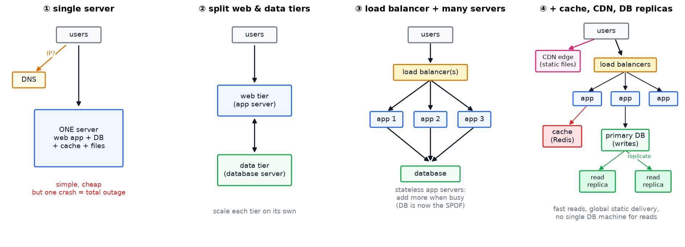

*Each step removes the bottleneck the previous step created. This is the spine of almost every system-design interview answer.*

### 2.1 What actually happens when a user opens your app

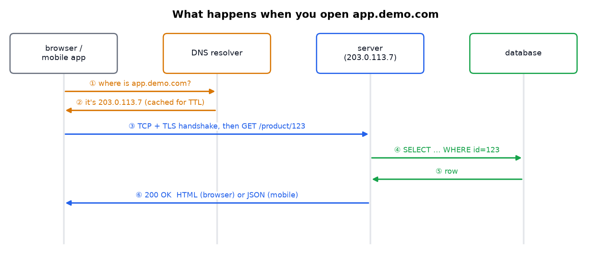

*DNS turns a name into an IP (and caches it for the record's TTL). The client opens a TCP connection, does a TLS handshake, and sends an HTTP request. Browsers usually get HTML, mobile apps usually get JSON.*

```
GET /product/123            →   { "id": "123", "name": "Product Name", "price": 19.99 }
```

> **Why JSON for mobile:** it's small, human-readable, and every platform can parse it. The server sends data; the app decides how to draw it.

**Why this diagram matters in interviews:** most "design X" answers start by walking this path and asking where it breaks: DNS? TLS? app CPU? database? network distance?

### 2.2 Splitting the tiers

The first real change is separating the **web tier** (application servers) from the **data tier** (database), so each can scale on its own. Keeping application servers **stateless** (no user session kept in local memory) is what later lets you add and remove them freely.

---

## 3. Choosing a database

### 3.1 Relational (SQL)

Tables with rows and columns, queried with SQL: **PostgreSQL, MySQL, Oracle, SQLite**.

- **Joins** combine tables: `customers` + `orders` + `products`.
- **Transactions** give **ACID** guarantees:

| Property | Meaning | Bank-transfer example |
|---|---|---|
| **Atomicity** | all or nothing | money never leaves one account without arriving in the other |
| **Consistency** | valid state → valid state | constraints (e.g. balance ≥ 0) still hold afterwards |
| **Isolation** | concurrent transactions don't see each other's half-finished work | two simultaneous transfers can't both spend the same $100 |
| **Durability** | committed data survives a crash | the transfer is still there after a power failure |

### 3.2 Non-relational (NoSQL)

| Type | Examples | Good for |
|---|---|---|
| **Document** | MongoDB, DynamoDB | nested objects, flexible fields |
| **Wide-column** | Cassandra, ScyllaDB, HBase | massive write throughput, time-series |
| **Graph** | Neo4j, Neptune | relationships as first-class data (recommendations, social graphs, fraud rings) |
| **Key-value** | Redis, Memcached | caching, sessions, counters, rate limits (RAM-speed) |

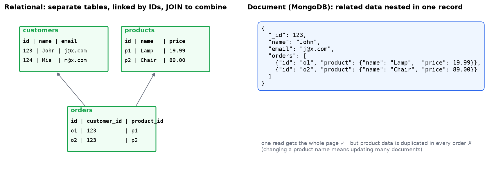

*The same data in two shapes. The document version reads in one operation. The relational version avoids duplicating product data and can answer questions the document model can't ("which customers bought this product?") without scanning everything.*

### 3.3 When to use which

| Use SQL when | Use NoSQL when |
|---|---|
| data has clear relationships (orders, invoices, users) | the shape varies or evolves quickly |
| you need transactions and strong consistency (money, inventory) | you need very low latency at massive scale |
| you'll ask unpredictable analytical questions | access patterns are known and simple (get by key) |

> **Modern reality (checked September 2026):** the line has blurred. PostgreSQL has excellent JSON support and can act as a document store; DynamoDB and MongoDB support transactions. Most companies start with Postgres and add specialized stores (Redis, Elasticsearch, a queue) as needs appear.
>
> Worth knowing if you're choosing today: **PostgreSQL 18** (September 2025; 18.6 is current, 19 is in beta) added an asynchronous I/O subsystem reporting up to **3× faster reads from storage**, "skip scan" on multi-column indexes, virtual generated columns, built-in **OAuth 2.0 authentication**, and a native **`uuidv7()`** function — which matters more than it sounds, because it gives you globally unique ids that are *also* time-ordered, so they don't wreck index locality (see the [1M requests/s note](Scaling%20to%201%20Million%20Requests%20per%20Second.md) §6.5). "Just use Postgres" has become a stronger default, not a weaker one.

### 3.4 Scaling the data tier *(expanded: the video's SPOF section defers this)*

| Technique | What it does | Cost |
|---|---|---|
| **Read replicas** | copies that serve reads; writes go to the primary | **replication lag**: a user may not immediately see their own write |
| **Failover** | promote a replica when the primary dies | needs automation and careful fencing to avoid two primaries |
| **Partitioning / sharding** | split rows across databases by a shard key (e.g. `user_id % N`, or by hash range) | cross-shard joins and transactions become hard; **choose the shard key carefully** |
| **Connection pooling** (PgBouncer) | databases handle far fewer connections than app servers create | one more component |
| **CQRS / denormalization** | separate read-optimized copies of the data | more storage, eventual consistency |

**Hot-shard warning:** sharding by something skewed (e.g. `country`) puts half the traffic on one shard. Use a high-cardinality key, hash it, and consider **consistent hashing** (§4.3) so adding shards doesn't reshuffle everything.

---

## 4. Scaling the web tier and load balancing

### 4.1 Vertical vs horizontal

| | Vertical (bigger machine) | Horizontal (more machines) |
|---|---|---|
| Effort | trivial (resize) | needs statelessness + a load balancer |
| Ceiling | the biggest instance available | effectively none |
| Redundancy | **none**: it's still one machine | built in |
| Cost curve | grows faster than linearly at the top end | roughly linear |

### 4.2 The algorithms

| # | Algorithm | How it picks | Best for |
|---|---|---|---|
| 1 | **Round robin** | in turn | identical servers, similar requests |
| 2 | **Least connections** | fewest active connections | varying request durations |
| 3 | **Least response time** | fastest server, factoring in load | mixed hardware |
| 4 | **IP hash** | `hash(client IP)` | sticky sessions (server holds client state) |
| 5 | **Weighted** variants | proportional to capacity | mixed hardware (16 / 32 / 64 GB) |
| 6 | **Geographic** | closest region | global services (usually DNS or anycast level) |
| 7 | **Consistent hashing** | position on a hash ring | caches and sharded stores (§4.3) |

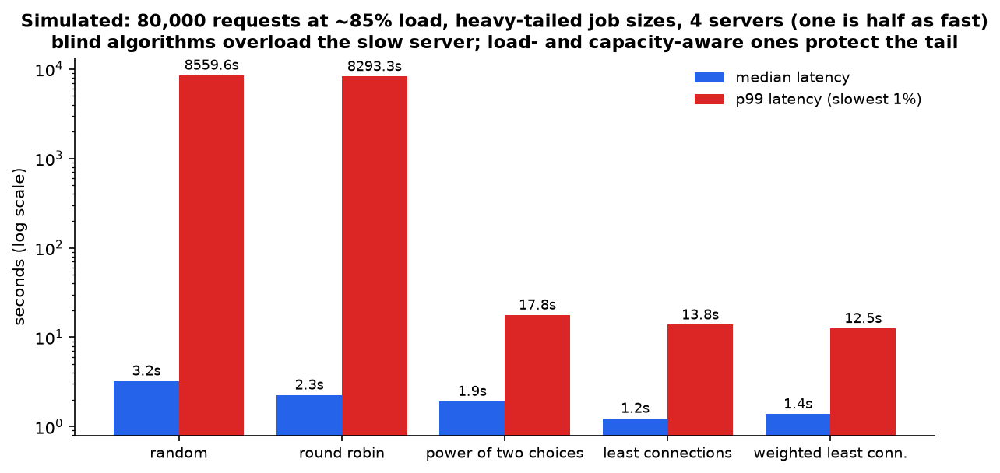

*A real queueing simulation: 80,000 requests, heavy-tailed sizes, ~85% utilization, four servers where one is half as fast. **Random** and **round robin** keep sending it a quarter of the traffic, its queue grows without bound, and p99 explodes into the thousands of seconds. **Power of two choices**, **least connections** and **weighted least connections** stay around 12–18 s at p99. Medians barely differ, which is why you must watch the tail.*

> **Power of two choices** is a beautiful result: pick two servers at random and use the less busy one. It gets most of the benefit of "least connections" without tracking global state, which is why big systems love it.

**Health checks:** the load balancer probes each server (`GET /health`) and removes failures from rotation until they recover. Good health endpoints check dependencies (DB reachable?) but shouldn't be so strict that one slow dependency takes the whole fleet out.

**Where load balancers come from:** software (**Nginx**, **HAProxy**, **Envoy**), hardware (**F5**, **Citrix**), cloud (**AWS ELB/ALB/NLB**, **Azure Load Balancer**, **Google Cloud Load Balancing**). Layer 4 balances TCP connections; layer 7 understands HTTP and can route by path or header.

### 4.3 Consistent hashing: the one that needs a picture

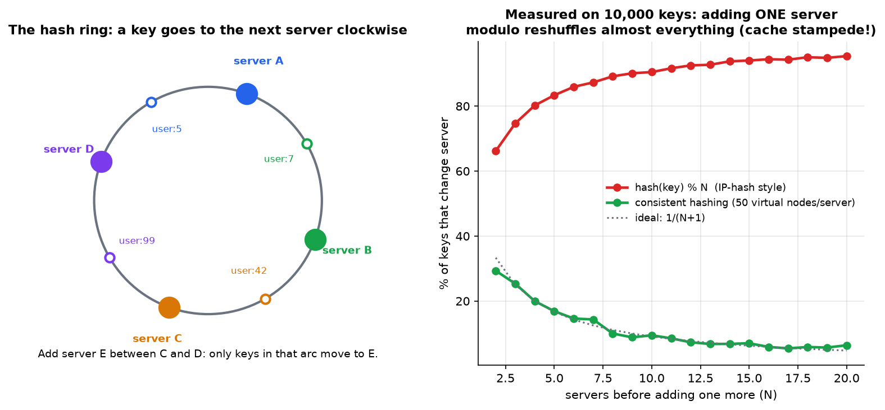

*Left: servers and keys are hashed onto a ring; a key belongs to the next server clockwise. Right: measured on 10,000 keys. With `hash(key) % N`, adding one server to a pool of 10 moves **~91%** of keys, which means a cache stampede onto your database. With consistent hashing it's **~9%**, matching the ideal 1/(N+1).*

**Virtual nodes:** each server is placed at many points on the ring (50–200) so load spreads evenly and removing a server distributes its load across all the others. This is how Cassandra, DynamoDB, Redis Cluster and CDNs assign keys.

---

## 5. Single points of failure and availability math

A **SPOF** is any component whose failure takes the whole system down: one database behind many app servers, one load balancer, one region, one DNS provider.

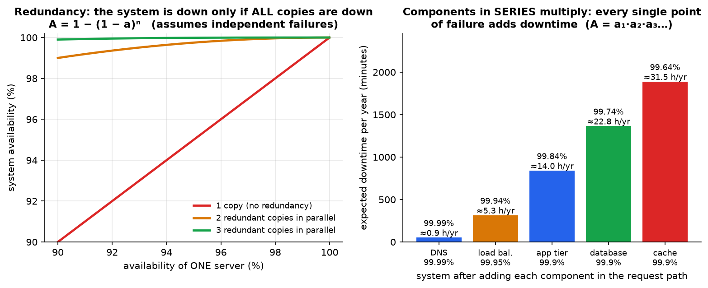

*Left: with redundancy, the system fails only if **all** copies fail: 99% each → 99.99% with two (if failures are independent, which shared power, shared network or a bad deploy can break). Right: components in series **multiply**. Five hops at 99.9%–99.99% give ~99.64%, about 31 hours of downtime a year.*

| "Nines" | Downtime per year |
|---|---|
| 99% | 3.7 days |
| 99.9% | 8.8 hours |
| 99.99% | 53 minutes |
| 99.999% | 5 minutes |

**Removing SPOFs:** redundant load balancers (active-active, or active-passive with a floating IP), multi-AZ database with automatic failover, multiple regions, multiple DNS providers, **graceful degradation** (serve stale cache when the DB is down), and regular **failure drills**.

---

# Part II — APIs

## 6. API styles and design

An **API is a contract**: which requests are allowed, and what responses look like. It provides **abstraction** (hide implementation) and **service boundaries** (split responsibilities).

| | **REST** | **GraphQL** | **gRPC** |
|---|---|---|---|
| Shape | resources + HTTP methods | one endpoint, typed schema | service methods in `.proto` |
| Transport | HTTP | HTTP | HTTP/2 |
| Client picks fields | no | **yes** | no |
| Caching | standard **HTTP caching** | app-level (or persisted queries over GET) | app-level |
| Streaming | SSE/WebSocket alongside | subscriptions | **built in, bidirectional** |
| Versioning | URL or header | evolve the schema, deprecate fields | proto field numbers |
| Best for | public APIs, CRUD | complex UIs with nested data | internal microservices |

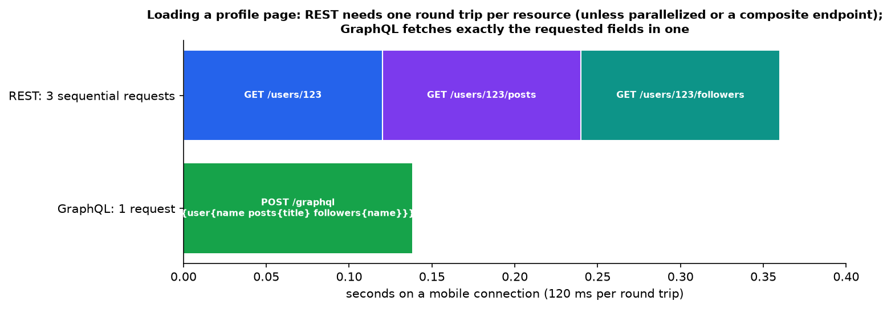

*A profile page needing user + posts + followers: three sequential REST round trips at 120 ms each, versus one GraphQL request. (REST can also parallelize those calls or offer a composite endpoint; GraphQL's real win is that the client chooses the fields.)*

> **Correction to the original notes:** browsers *do* support HTTP/2. The reason you rarely call gRPC directly from a browser is that browser APIs don't expose HTTP/2 framing and trailers to JavaScript, so you need **gRPC-Web** plus a proxy (Envoy) to translate.

> **GraphQL costs:** a single endpoint makes HTTP caching, rate limiting and per-endpoint metrics harder. Deeply nested queries can trigger **N+1** database queries (fix: DataLoader batching) and can be used as a denial-of-service vector (fix: **depth and complexity limits**, persisted queries).

> **GraphQL errors:** the notes say every response is HTTP 200. That's the classic behaviour, and **partial data plus an `errors` array** is genuinely GraphQL's model. But the newer GraphQL-over-HTTP specification does use 4xx/5xx for *request* errors (malformed query, auth failures) with the `application/graphql-response+json` media type. Field-level failures still come back as 200 with `errors`.

### Four design principles

1. **Consistency** — one naming convention everywhere.
2. **Simplicity** — an endpoint does what its name implies, with no surprise side effects.
3. **Security** — authentication, authorization, input validation, rate limits.
4. **Performance** — caching, pagination, small payloads, fewer round trips.

### The design process

- **Requirements**: use cases, scope, performance targets, security constraints.
- **Approach**: top-down (from requirements), bottom-up (from existing models), or **contract-first** (write the OpenAPI/proto schema first — best for teams).
- **Lifecycle**: design → build → deploy & monitor → maintain → **deprecate and retire** (with a sunset timeline).

*(For resource modelling, status codes, idempotency and versioning in depth, see the [8 API Laws](REST%20API%20Design%20-%20The%208%20Laws.md) note, which covers the same ground with worked examples.)*

---

## 7. Protocols

### 7.1 The stack

```
application   HTTP / HTTPS · WebSocket · AMQP · gRPC      ← what your API speaks
transport     TCP (reliable, ordered) · UDP (fast, lossy) ← how bytes get there
network       IP  ·  link  ·  physical
```

### 7.2 HTTP essentials

**Request:** method, URL, version, `Host`, headers (`Authorization`, `Accept`, `Content-Type`, `User-Agent`).
**Response:** status code, headers (`Content-Type`, `Cache-Control`, `ETag`), body.

| Class | Meaning |
|---|---|
| **2xx** | success (200 OK, 201 Created, 204 No Content) |
| **3xx** | redirection (301 moved permanently, 304 **not modified** — the caching one) |
| **4xx** | client error (400, 401, 403, 404, 409, 422, 429) |
| **5xx** | server error (500, 502, 503, 504) |

**HTTPS** = HTTP inside TLS: encryption in transit, integrity, and server authentication via certificates. It's now the default everywhere (and required for HTTP/2, service workers and many browser APIs).

> **Versions worth knowing:** HTTP/1.1 (one request at a time per connection), **HTTP/2** (multiplexed streams over one TCP connection, header compression), **HTTP/3** (the same ideas over **QUIC/UDP**, removing TCP head-of-line blocking and making connections survive network changes).

### 7.3 WebSockets: when polling isn't good enough

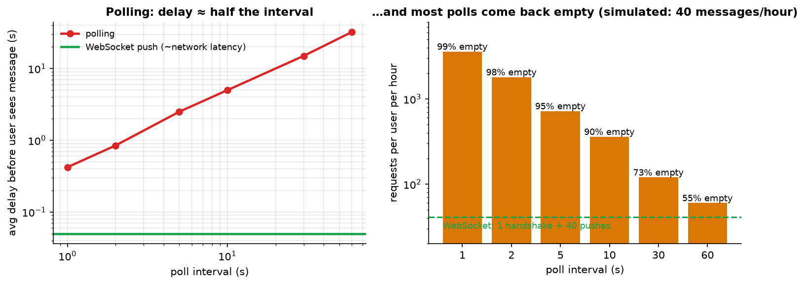

*Simulated chat with 40 messages an hour. Polling every 5 s means an average 2.5 s delay and ~94% empty responses. A WebSocket does one handshake, then the server **pushes** the moment a message exists.*

| Option | Direction | Good for |
|---|---|---|
| Polling | client asks repeatedly | simple, rare updates |
| Long polling | request held open until data | fallback when WebSockets are blocked |
| **Server-Sent Events (SSE)** | server → client, over plain HTTP | notifications, live feeds, token streaming from LLM APIs |
| **WebSocket** | full duplex | chat, multiplayer, collaborative editing, trading |

> **Operational cost:** WebSockets are **stateful** connections. Load balancers must support sticky/upgrade handling, and each open connection consumes memory. Plan for reconnects, heartbeats and backpressure.

### 7.4 AMQP and message queues

**Producer → broker (queue) → consumer.** The producer doesn't wait; the consumer works at its own pace. Exchange types: **direct** (one-to-one), **fan-out** (broadcast), **topic** (pattern routing).

**Why queues matter in system design:** they smooth traffic spikes, decouple services, enable retries and dead-letter queues, and let slow work (emails, video encoding, provisioning) happen outside the request. See the Atlassian note for a production example (SQS + workers). Common tools: **RabbitMQ** (AMQP), **Kafka** (log-structured streams), **SQS**, **NATS**.

### 7.5 TCP vs UDP

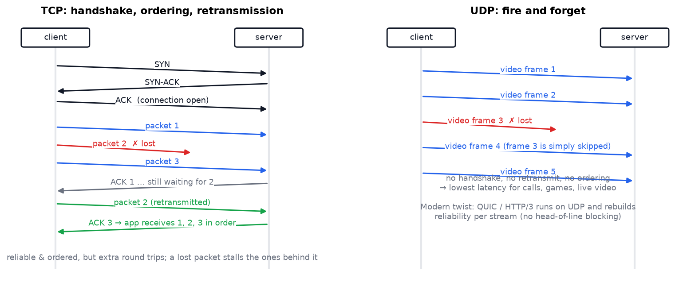

| | TCP | UDP |
|---|---|---|
| Connection | 3-way handshake (SYN, SYN-ACK, ACK) | none |
| Guarantees | delivery, order, flow & congestion control | none |
| Cost | extra round trips, head-of-line blocking | possible loss and reordering |
| Used by | HTTP/1.1 & 2, payments, email, databases | video calls, games, live streaming, DNS, **QUIC/HTTP3** |

> **Nuance worth having in an interview:** "UDP is unreliable" doesn't mean "unusable". **QUIC** (used by HTTP/3) is built on UDP and re-implements reliability **per stream**, so one lost packet doesn't stall unrelated streams. It also cuts handshake round trips.

---

# Part III — Performance *(this part is missing from the original notes even though the title promises it)*

## 8. Caching

**Why caches work:** traffic is **skewed**. A few items are requested constantly.

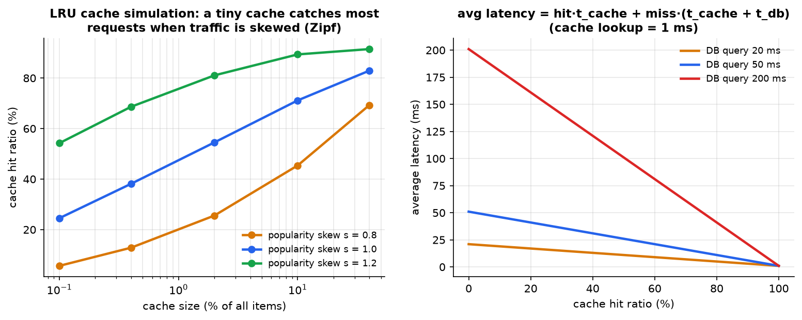

*Left: LRU simulation over 150,000 requests. With realistic skew, a cache holding **1% of items** serves 40–70% of requests. Right: what a hit ratio is worth: with a 50 ms database query, going from 0% to 80% hits takes average latency from 51 ms to ~11 ms.*

### 8.1 Where caches live

| Layer | Example | Notes |
|---|---|---|
| Browser | `Cache-Control`, `ETag` | free, but you can't invalidate it |
| **CDN / edge** | CloudFront, Cloudflare | static files, and increasingly APIs |
| **Application** | Redis, Memcached | the classic shared cache |
| Database | query and buffer caches | automatic |
| In-process | a dict in the app | fastest, but per-instance and inconsistent |

### 8.2 Patterns

| Pattern | Flow | Notes |
|---|---|---|
| **Cache-aside** (lazy) | app checks cache → miss → read DB → write cache | most common; stale data possible |
| **Read-through** | cache library fetches on miss | simpler app code |
| **Write-through** | write to cache and DB together | consistent, slower writes |
| **Write-behind** | write cache now, DB later | fast, risks data loss |

### 8.3 The hard parts

| Problem | What happens | Fix |
|---|---|---|
| **Invalidation** | stale data served after an update | short TTLs, delete-on-write, version keys |
| **Thundering herd / stampede** | a popular key expires and 1,000 requests hit the DB at once | request coalescing (single flight), locks, staggered TTLs |
| **Hot key** | one key saturates one cache node | replicate the key, add a local cache layer |
| **Cold start** | empty cache after deploy → DB overload | warm-up, gradual rollout |
| **Eviction policy** | LRU, LFU, TTL | match your access pattern |

> **The two hard things in computer science are cache invalidation and naming things.** Decide *up front* how each cached item gets invalidated.

## 9. CDNs and the speed of light

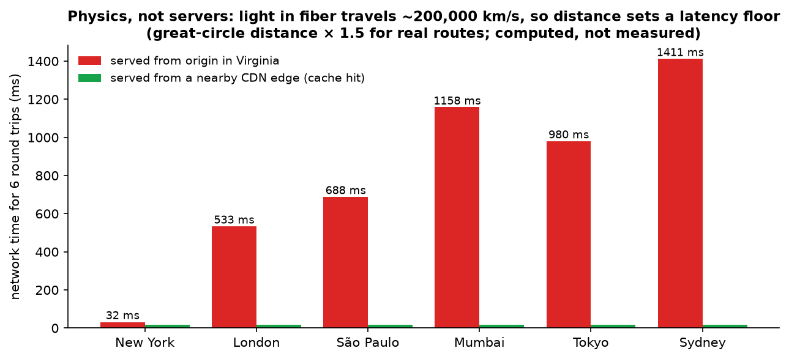

*Computed from geography: light in fibre travels ~200,000 km/s, and real routes are ~1.5× the straight-line distance. From a Virginia origin, six round trips cost ~1.4 s for a user in Sydney. From a nearby edge cache, it's ~15 ms. **No amount of server optimization fixes distance.***

**What a CDN does:** caches static assets (images, JS, CSS, video) at hundreds of edge locations, terminates TLS near the user, absorbs DDoS traffic, and (with edge compute) runs small bits of logic near users.

**Key settings:** `Cache-Control: max-age` and `s-maxage`, cache keys (which query parameters matter), **purge/invalidate** on deploy, and **content hashing in filenames** (`app.8f3a2c.js`) so files can be cached forever and changed by name.

---

# Part IV — Security and identity

## 10. Authentication (who are you?)

**Terms people mix up, straightened out:**

| Term | What it actually is |
|---|---|
| **JWT** | a **token format** (signed JSON), not an auth method |
| **Bearer** | a **pattern**: whoever holds the token gets access |
| **OAuth 2** | an **authorization framework** for delegated access |
| **OIDC** | an **authentication layer on top of OAuth 2** |
| **SSO** | a **user experience**: log in once, use many services |

| Method | How | Verdict |
|---|---|---|
| **Basic** | `Authorization: Basic base64(user:pass)` | Base64 is **not encryption**. Only over HTTPS, and really only for internal tools |
| **Digest** | hashed credentials with a server nonce | outdated (MD5) |
| **API key** | a random string per client, looked up server-side | fine for service-to-service; no expiry unless you add it; leaks are total. (A missing key is usually **401**, not 400) |
| **Session** | server stores session, client holds a cookie | easy revocation; needs shared session storage (Redis) |
| **JWT bearer** | signed claims, verified locally | no lookup per request; harder to revoke |

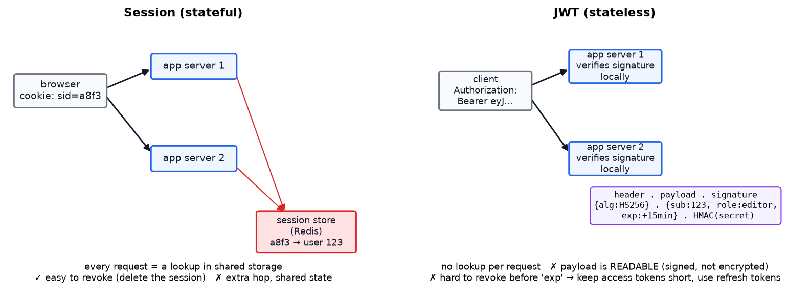

> **JWT truths people miss:**
> - A JWT is **signed, not encrypted**. Anyone can read the payload (run the demo in §14). Never put secrets in it.
> - It's valid until `exp`. **You can't easily revoke it** — hence short-lived access tokens (15 min–1 h) plus a long-lived **refresh token**.
> - Store refresh tokens in **HttpOnly, Secure, SameSite cookies** (not `localStorage`, which JavaScript — and therefore XSS — can read). Cookies then need CSRF protection.
> - Check `alg`, and never accept `alg: none`. Validate `iss`, `aud` and `exp`.

### OAuth 2 + OpenID Connect

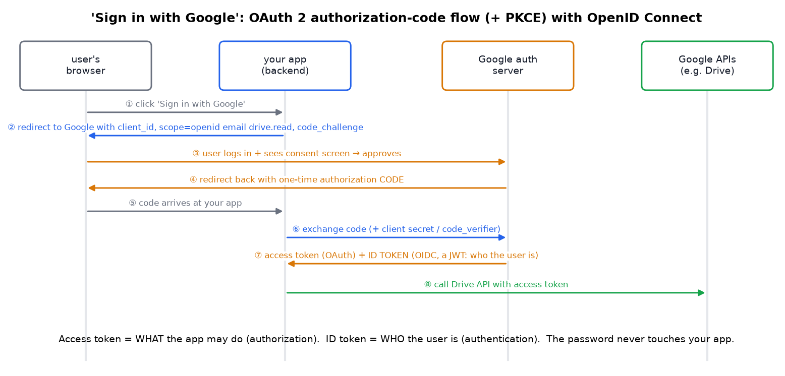

*The authorization-code flow. Your app never sees the password. The **access token** says what the app may do (authorization); the **ID token** (a JWT, from OIDC) says who the user is (authentication). **PKCE** — the `code_challenge`/`code_verifier` pair — stops an intercepted code from being redeemed by an attacker, and is now recommended for all clients.*

### Single sign-on

You authenticate once with the identity provider, which creates a **global session** and sets an **SSO cookie**. Each new service checks that session silently. Underneath sit two protocols:

| | **SAML** | **OpenID Connect** |
|---|---|---|
| Format | XML assertion | JWT ID token |
| Era / ecosystem | enterprise, legacy (Salesforce, corporate dashboards) | modern web and mobile |
| Transport | browser POST bindings | OAuth 2 flows |

## 11. Authorization (what may you do?)

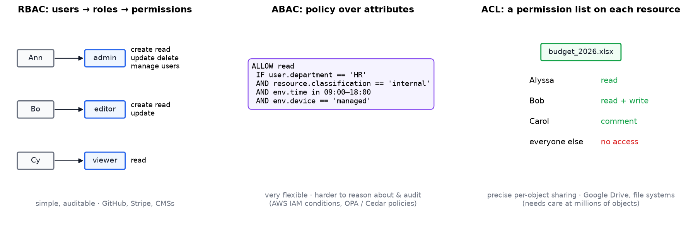

| Model | Rule | Strength | Weakness |
|---|---|---|---|
| **RBAC** | user → role → permissions | simple, auditable | "role explosion" when exceptions pile up |
| **ABAC** | policy over user, resource and environment attributes | very expressive (time, location, device, classification) | harder to reason about and test |
| **ACL** | permission list attached to each object | precise sharing (Google Drive) | many entries to manage at scale |

Real systems **combine** them: RBAC for coarse roles, ABAC conditions for context, ACLs for per-object sharing. **OAuth scopes and JWT claims carry** the decision; the model **defines** it. Modern practice pushes policy into a dedicated engine (**OPA/Rego**, **Cedar**) or a relationship-based service (Google Zanzibar-style, e.g. SpiceDB) so rules aren't scattered through the code.

## 12. Seven techniques for protecting APIs

*(The original notes list seven and cover six. The missing one is added here.)*

### 1. Rate limiting

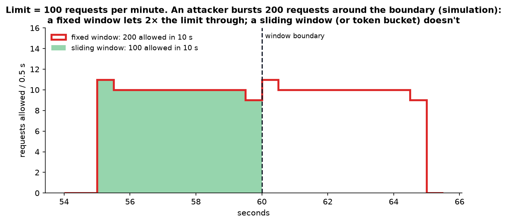

*Limit: 100 requests/minute. An attacker bursting around a **fixed window** boundary gets 200 through in 10 seconds. A **sliding window** (or **token bucket**, see the Atlassian note) enforces the real rate.*

Apply per **endpoint**, per **user/API key**, per **IP**, and a **global** limit as DDoS backstop. Return **429** with `Retry-After` and rate-limit headers so well-behaved clients back off.

### 2. CORS — with a correction

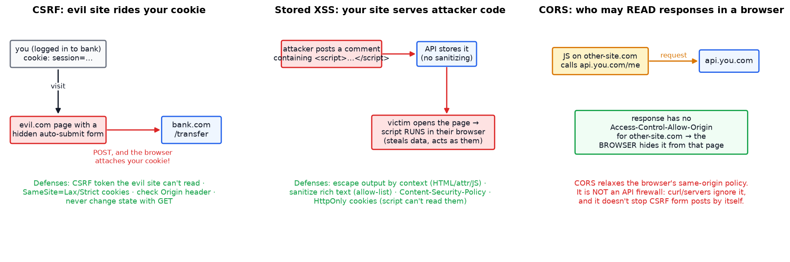

**CORS is a browser mechanism that *relaxes* the same-origin policy.** It controls whether JavaScript on another origin may **read** your responses.

> **Correction:** the original notes say that without proper CORS "a malicious website could trick a browser into making unauthorized requests". That's **CSRF**, and CORS is not its defence. For simple requests the browser **sends** the request anyway (with cookies) and merely hides the *response*. And non-browser clients (curl, servers, scripts) ignore CORS entirely. **CORS is not an API firewall.** Use CSRF tokens + `SameSite` cookies for state-changing requests, and real authentication/authorization for everything.

### 3. Injection protection

Never build queries by string concatenation. Use **parameterized queries** or an ORM. The same applies to NoSQL (`{"$ne": null}` style injection), OS commands and LDAP. See the live demo in §14.

### 4. Firewalls and VPNs

A **WAF** (e.g. AWS WAF, Cloudflare) blocks known attack patterns before they reach your app. Internal APIs shouldn't be on the public internet at all: put them behind a **VPN**, private network or zero-trust proxy.

### 5. CSRF protection

Anti-CSRF tokens the attacker's site can't read, plus `SameSite=Lax/Strict` cookies, checking `Origin`/`Referer`, and never changing state on GET.

### 6. XSS protection

**Escape on output, per context** (HTML body, attribute, JavaScript, URL), sanitize rich text with an allow-list, set a **Content-Security-Policy**, and keep session cookies `HttpOnly` so scripts can't read them.

### 7. Encryption everywhere and secret hygiene *(the missing seventh)*

**TLS for all traffic** (including internal service-to-service, ideally mTLS), encryption at rest for databases and backups, passwords hashed with **bcrypt/scrypt/Argon2** (never MD5/SHA-1), secrets in a manager (Vault, AWS Secrets Manager) with rotation, and **least-privilege** credentials. Add security headers: `Strict-Transport-Security`, `X-Content-Type-Options`, `Content-Security-Policy`.

> Also essential in production: **logging and monitoring** (you can't respond to what you can't see), dependency scanning, and a documented incident process.

### 12.1 What the security list looks like in 2026

The seven techniques above are the mechanics. For *priorities* — what actually goes wrong most often — the reference everyone uses is the **OWASP Top 10**, and it was revised for the first time since 2021. The **OWASP Top 10:2025** was published in November 2025 (finalized January 2026), built from analysis of 175,000+ CVEs. Three changes matter for how you'd answer an interview question today:

| Change | What it means for your design |
|---|---|
| **Broken access control is still #1** | The most common serious bug is not exotic. It's "the server never checked whether *this* user is allowed to touch *that* record." Check authorization on every request, per object — see §11 |
| **New: A03 Software Supply Chain Failures** | Your dependencies are now treated as a first-class attack surface. Pin versions, generate an SBOM, scan continuously, and control what your build pipeline is allowed to pull in. This is broader than the old "vulnerable components" entry, which only covered known-bad libraries |
| **New: A10 Mishandling of Exceptional Conditions** | Failing badly is its own vulnerability: error paths that leak stack traces, fall open instead of closed, or skip a check when a dependency times out. Ties directly to §5 — decide what **graceful degradation** means *before* the outage |
| **SSRF folded into Broken Access Control** | Server-Side Request Forgery is no longer its own category; it's understood as an access-control failure (your server can reach an internal address the caller shouldn't be able to) |

Everything in §12 above still applies — the 2025 revision reorganized categories around root causes rather than adding new mechanics.

---

## 13. The interview playbook

| Step | What to do | Time |
|---|---|---|
| 1. **Clarify requirements** | functional (what it does) and non-functional (users, QPS, latency target, read/write ratio, consistency needs) | 5 min |
| 2. **Estimate** | back-of-envelope: daily users × actions ÷ 86,400 = QPS; storage per item × items; bandwidth | 5 min |
| 3. **High-level design** | draw the boxes: clients → CDN → LB → services → cache → DB → queue → workers | 10 min |
| 4. **Deep dive** | pick the interesting part: the data model, the hot path, the sharding key, the cache strategy | 15 min |
| 5. **Bottlenecks & failure** | what breaks at 10×? Where are the SPOFs? What's the degradation story? | 10 min |

**Numbers worth memorizing:**

| Operation | Rough latency |
|---|---|
| L1 cache reference | ~1 ns |
| Main memory | ~100 ns |
| SSD random read | ~100 µs |
| Redis GET (same datacentre) | ~0.5–1 ms |
| Database query (indexed) | ~1–10 ms |
| Same-datacentre round trip | ~0.5 ms |
| Cross-continent round trip | ~100–150 ms |

**Say the trade-off out loud.** "I'd add a cache here, accepting up to 60 seconds of staleness on product prices, because read volume is 100× write volume" beats naming technologies.

---

## 14. Code: four demos you can run (tested)

Full file: [`code/system_design_demos.py`](code/system_design_demos.py). **Actual output:**

```
[injection] unsafe query: SELECT name FROM users WHERE name = 'admin' --' AND password = 'anything'
[injection] unsafe result  -> [('admin',)] (logged in as admin without the password!)
[injection] parameterized -> [] (input treated as data, not SQL)

[jwt] anyone can READ the payload (it is only base64): {'sub': 'user_123', 'role': 'editor',
      'scope': 'posts:write', 'iss': 'auth.example.com', 'exp': 1789667170}
[jwt] verify original -> ok
[jwt] verify after changing role to admin -> invalid signature

[hashing] add a 5th server: modulo moves 80% of keys, consistent hashing moves 20% (ideal = 1/5 = 20%)

[cache] LRU size    100 (0.1% of items): hit ratio 29%, avg latency 36.6 ms (cache 1 ms, DB 50 ms)
[cache] LRU size   1000 (1.0% of items): hit ratio 51%, avg latency 25.7 ms
[cache] LRU size  10000 (10.0% of items): hit ratio 72%, avg latency 14.8 ms
```

Four lessons in ten lines of output: `--` comments out the password check; a JWT payload is readable but not forgeable; modulo hashing reshuffles your whole cache; and 1% of items covers half your traffic.

---

## 15. Self-quiz

<details><summary><b>Q1 (easy).</b> Why can't you scale a stateful web server horizontally without care?</summary>

If a user's session lives in one server's memory, a later request routed elsewhere loses it. Fix: keep servers stateless and store sessions in shared storage (Redis) or a signed cookie/JWT (or use sticky sessions, which hurt balance and failover).
</details>

<details><summary><b>Q2 (easy).</b> Availability of one server is 99%. Two independent copies?</summary>

1 − (0.01)² = **99.99%** — if the failures really are independent.
</details>

<details><summary><b>Q3 (medium).</b> A cache node is added to a 10-node pool using hash % N. What happens, and what's the fix?</summary>

About 90% of keys map to a different node, so almost every request misses and hits the database at once (a stampede). Fix: consistent hashing with virtual nodes — only about 1/11 of keys move.
</details>

<details><summary><b>Q4 (medium).</b> Your service does 10,000 reads/s and 100 writes/s, and the DB is saturated. What do you try, in order?</summary>

1) Indexes and query tuning. 2) A cache for hot reads. 3) Read replicas. 4) Denormalize or precompute expensive views. 5) Shard only if data size or write volume demands it.
</details>

<details><summary><b>Q5 (medium).</b> Give a case where round robin is clearly wrong.</summary>

Heterogeneous servers or highly variable request durations: the slow or unlucky server queues up while others idle. The simulation in §4.2 shows p99 exploding. Use least connections, weighted variants, or power of two choices.
</details>

<details><summary><b>Q6 (medium).</b> When should an API use WebSockets instead of polling, and what does that cost?</summary>

When updates are frequent or latency matters (chat, presence, trading). Costs: persistent stateful connections, memory per connection, load-balancer support, and reconnect/backpressure handling. For one-way streams, SSE is simpler.
</details>

<details><summary><b>Q7 (hard).</b> Why is a JWT hard to revoke, and how do real systems deal with it?</summary>

It's self-contained: servers validate the signature without asking anyone, so there's nothing to delete. Mitigations: short expiry plus refresh tokens, a denylist of token IDs for emergencies, token versions tied to the user record, or going back to opaque tokens with server-side introspection.
</details>

<details><summary><b>Q8 (hard).</b> Does CORS protect your API from a malicious website? Explain.</summary>

No. CORS is enforced by browsers and mainly controls whether another origin's JavaScript can **read** your response. Simple requests (including form posts) are still **sent**, with cookies. Non-browser clients ignore CORS. Use CSRF tokens, SameSite cookies, and proper auth.
</details>

<details><summary><b>Q9 (hard).</b> A user in Sydney complains your app is slow; servers show 20 ms response times. What's going on?</summary>

Network distance. A Sydney ↔ Virginia round trip is ~200 ms, and a page needs several (DNS, TCP, TLS, then requests). Fix: a CDN for static assets, TLS termination at the edge, fewer round trips (HTTP/2 or 3, bundling), and eventually a regional deployment for dynamic traffic.
</details>

<details><summary><b>Q10 (hard).</b> Design rate limiting for a public API used by both browsers and servers. What do you limit on, and which algorithm?</summary>

Limit per API key or user first (IP is shared by NAT and proxies), with an IP limit for unauthenticated endpoints and a global cap as a DDoS backstop. Use a token bucket or sliding window in Redis (atomic increments with TTL). Return 429 with Retry-After plus limit/remaining/reset headers, and apply stricter limits on expensive endpoints (login, search, writes).
</details>

---

## 16. Glossary

| Term | Meaning |
|---|---|
| **DNS** | Maps domain names to IP addresses |
| **Web / data tier** | Application servers / database servers |
| **Vertical / horizontal scaling** | Bigger machine / more machines |
| **Load balancer** | Distributes requests across servers (L4 or L7) |
| **Health check** | Probe that decides whether a server gets traffic |
| **SPOF** | Single point of failure |
| **ACID** | Atomicity, Consistency, Isolation, Durability |
| **Replica / sharding** | Copy of data for reads / splitting data across machines |
| **Consistent hashing** | Ring-based key assignment that minimizes movement |
| **Cache-aside** | App checks cache, falls back to DB, then fills the cache |
| **TTL** | Time to live before cached data expires |
| **CDN** | Edge servers that cache content near users |
| **REST / GraphQL / gRPC** | Resource API / query API / RPC framework |
| **WebSocket / SSE** | Two-way persistent connection / one-way server push |
| **AMQP / broker / queue** | Messaging protocol / message server / buffer of work |
| **TCP / UDP / QUIC** | Reliable transport / lossy transport / reliable-over-UDP |
| **TLS / HTTPS** | Encryption layer / HTTP over TLS |
| **Session / JWT** | Server-stored login state / signed self-contained token |
| **OAuth 2 / OIDC / SAML** | Delegated authorization / identity on top of OAuth / XML SSO |
| **RBAC / ABAC / ACL** | Role-based / attribute-based / per-object permissions |
| **CSRF / XSS / CORS** | Forged requests / injected scripts / cross-origin read policy |
| **WAF** | Web application firewall |
| **p50 / p99** | Median / 99th-percentile latency (the tail users complain about) |

---

## 17. Further reading

1. **Alex Xu**, *System Design Interview* vol. 1–2 (this course follows a similar arc).
2. **Martin Kleppmann**, *Designing Data-Intensive Applications*: the definitive book on storage, replication and consistency.
3. **Google SRE Book** (free online): availability, load balancing, cascading failures.
4. **AWS Well-Architected Framework** and the **Architecture Blog**.
5. **Karger et al. (1997)**, *Consistent Hashing and Random Trees*; **Mitzenmacher**, *The Power of Two Choices*.
6. **DeCandia et al. (2007)**, *Dynamo*; **Lakshman & Malik (2010)**, *Cassandra*.
7. **OWASP Top 10:2025** (the current edition — §12.1) and the **OWASP Cheat Sheet Series** (XSS, CSRF, JWT, auth).
8. **High Scalability** (blog) for real architecture write-ups.

---

*Source video: [System Design Explained](https://youtu.be/oYxTTirKY8M?si=-LRByScCPEBB1Y4T) by Hayk Simonyan. Figures generated by `figures/system_design/make_figs.py`; the load-balancer, consistent-hashing, cache, polling, rate-limit, availability and CDN figures are all computed rather than drawn by hand. Sections marked as additions (caching, CDNs, database scaling, the seventh security technique) were not in the original notes.*
