# Attention in Transformers, Step by Step

> **Source:** [Attention in transformers, step-by-step | Deep Learning Chapter 6](https://youtu.be/eMlx5fFNoYc?si=K4rmmpydkNhrEvX_) by 3Blue1Brown
> **Related notes:** [Backpropagation](Backpropagation%20-%20How%20Neural%20Networks%20Learn.md) (how W_Q, W_K, W_V get learned) · [DeepSeek MLA](Multi-head%20Latent%20Attention%20-%20Shrinking%20the%20KV%20Cache.md) (how modern models shrink attention's memory)
> **What's in this version:** 11 figures (the attention heatmaps are computed by a real attention head, not drawn by hand), a step-by-step numeric walkthrough, why √d_k is needed (with a simulation), the real cost of long context, how attention is used in industry today, tested NumPy code, a quiz, and a glossary. It also fixes a counting slip in the first version of these notes.
> **Facts re-checked:** 18 September 2026. The mechanism in §3 is unchanged and is still exactly what runs in every transformer. What moved is the efficiency layer around it — §9 has been updated with FlashAttention-4 and the learned-sparse-attention family that arrived in 2025–26.

---

## 0. How to use this guide

| If you have… | Read |
|---|---|
| 10 minutes | §0.1 plain-words intro, §1 TL;DR, plus figures 2, 3 and 9 |
| 1 hour | §1–§9 |
| A weekend | Everything. Run and modify the code in §12 |

**What you need first:** vectors, the dot product (it measures how aligned two vectors are), and matrix × vector. Read the backprop note if you want to know how the matrices get learned.

**Expect to read §3 twice.** That's normal — it's the section where four new ideas arrive at once. §0.1 gives you the shape of the answer before any of them do.

---

### 0.1 First, in completely plain words

A language model turns every word into a long list of numbers. At the start, that list depends **only on the word itself** — so "bank" in *river bank* and "bank" in *bank account* start out completely identical. Something has to fix that. That something is **attention**.

Here's how, using an image that maps onto the real machinery almost perfectly:

> Everyone in a room writes three sticky notes about themselves.
> - A **question** note: *"what am I missing? what do I need to know?"*
> - A **label** note: *"here's what I am"* — held up so everyone can see it.
> - A **contents** note: *"here's what I'd tell you, if you decide I'm relevant"* — kept face down.
>
> Everyone compares their own question against everybody else's label and scores the match. High score means "you're relevant to me". Those scores are turned into percentages that add up to 100%. Then everyone collects a blend of the face-down contents notes, in proportion to those percentages, and adds it to their own understanding.

The jargon names for the three notes are **query**, **key** and **value**. That's it — the rest of the maths is just doing this for every word, in both directions, many times over.

Two more things worth knowing before you start:

- **Nobody replaces their original meaning; they add to it.** "creature" doesn't become "blue" — it becomes "creature, and by the way, blue". That "add rather than replace" detail turns out to matter enormously (§3.6).
- **Words can only look backwards**, never forwards, because the model is being trained to predict what comes next and peeking would be cheating (§3.5).

If you remember only one sentence from this guide: *attention is how words in a sentence look at each other and update what they mean.*

---

## 1. TL;DR in 8 lines

1. Text → **tokens** → each token looks up an **embedding** vector. At that point it knows *only its own word*, not its context.
2. **Attention lets tokens exchange information**, so "mole" can become *chemistry-mole* or *animal-mole* depending on its neighbours.
3. Each token makes a **query** ("what am I looking for?"), a **key** ("what do I contain?") and a **value** ("what I'd hand over if you find me relevant").
4. **Relevance = query · key** (a dot product), divided by $\sqrt{d_k}$ and turned into weights that sum to 1 with **softmax**.
5. Each token's update is the **weighted sum of values**: $E_{\text{new}} = E + \Delta E$.
6. A **causal mask** (−∞ before softmax) stops words from looking at future words, so one sentence can train on every position at once.
7. **Many heads** run in parallel, each learning a different relationship. They're stacked across **many layers** alongside MLP blocks.
8. Attention costs **O(n²)** in context length, which is the main reason long context is expensive. But it runs in **parallel on GPUs**, which is why transformers won.

---

## 2. The problem attention solves

### 2.1 Same word, different meaning

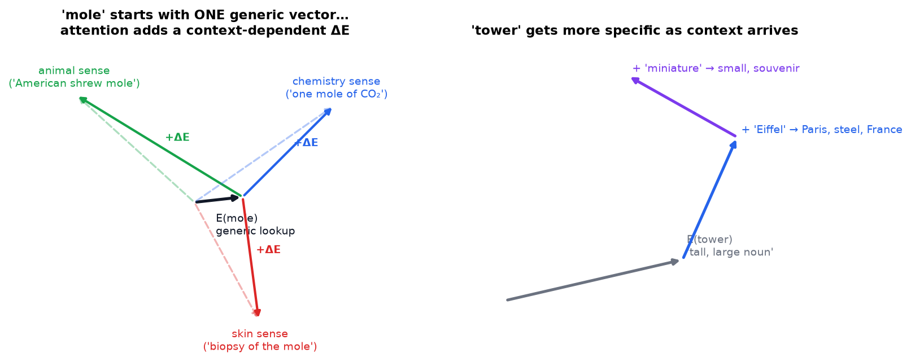

*Left: the embedding table gives "mole" **one** vector, whatever the sentence. Attention computes a context-dependent $\Delta E$ that pushes it toward the right sense. Right: "tower" picks up meaning step by step. "Eiffel" pulls it toward Paris and steel, and "miniature" pulls it away from "large".*

| Phrase | Meaning of "mole" |
|---|---|
| "American shrew **mole**" | an animal |
| "one **mole** of carbon dioxide" | a chemistry unit (6.02 × 10²³) |
| "take a biopsy of the **mole**" | a skin growth |

Right after the embedding lookup, all three "mole" vectors are **identical**. The lookup table has no idea what's around the word. Something has to move information *between* token positions. That something is attention.

### 2.2 Directions in embedding space carry meaning

In a trained model, **directions mean things**. The classic example is that $E(\text{queen}) - E(\text{king}) \approx E(\text{woman}) - E(\text{man})$: there's a "gender direction". So "update the meaning" literally means **add a vector** that moves the embedding toward the right direction.

### 2.3 The extreme case: a whole novel in one vector

Feed in a mystery novel that ends with *"Therefore the murderer was ___"*. The next word is predicted **only from the final vector** (the one sitting on "was"). For the prediction to be right, that vector must have absorbed every relevant clue from hundreds of pages. Attention is the only mechanism in the model that moves information between positions, so it has to do all of that transport.

---

## 3. One attention head, step by step

Running example: **"a fluffy blue creature roamed the verdant forest"**. For intuition, pretend this head has one job: *adjectives update their nouns*. (Real heads learn whatever reduces the loss, and are usually much harder to interpret.)

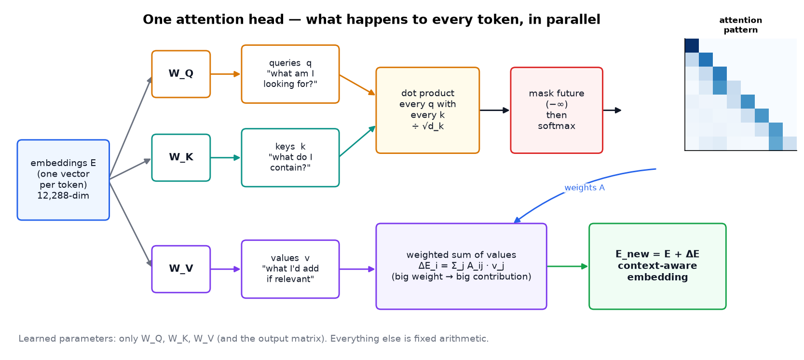

*Every token goes through the same pipeline at the same time. The only learned parts are the matrices. The dot products, softmax and weighted sum are fixed arithmetic.*

### 3.1 Queries: "what am I looking for?"

$$\vec q_i = W_Q \, \vec E_i$$

"creature" (a noun) produces a query that roughly means *"are there adjectives before me?"*. The query lives in a **smaller space** than the embedding: in GPT-3, $d_k = 128$ versus 12,288 embedding dimensions.

### 3.2 Keys: "what do I contain?"

$$\vec k_j = W_K \, \vec E_j$$

"fluffy" and "blue" produce keys that roughly mean *"I'm an adjective"*, pointing in a direction that **aligns** with the noun's query.

**Analogy: a search engine.** Your search text is the query. Each web page's title and tags are its key. The page content is its value. The search engine scores query-vs-key matches and returns a mix of contents weighted by those scores. Attention is a **soft, differentiable search** that every token runs over every earlier token.

### 3.3 Match every query with every key → the attention pattern

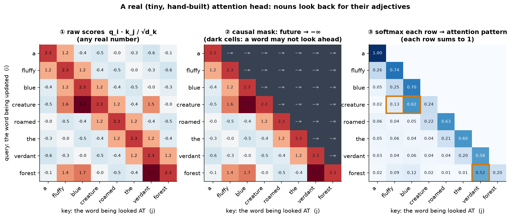

*A real computation with a tiny hand-built head. ① Raw scores $q_i \cdot k_j / \sqrt{d_k}$ can be any number. ② The causal mask sets future positions to −∞. ③ A row-wise softmax turns each row into weights that sum to 1. The orange boxes show "creature" putting 62% of its attention on "blue" and 13% on "fluffy", and "forest" putting 52% on "verdant". The head found the adjective-noun pairs.*

In compact form, from *Attention Is All You Need* (Vaswani et al., 2017):

$$\boxed{\text{Attention}(Q,K,V) = \text{softmax}\!\left(\frac{QK^{\top}}{\sqrt{d_k}} + M\right)V}$$

**How to read that out loud, left to right:** "match every question against every label ($QK^\top$), shrink the scores so they don't blow up ($\div\sqrt{d_k}$), cross out the ones you're not allowed to look at ($+M$), turn what's left into percentages (softmax), and use those percentages to blend the contents ($V$)." Every symbol in the box is one step of the sticky-note story in §0.1.

| Piece | Meaning |
|---|---|
| $QK^\top$ | an $n \times n$ grid holding every query·key dot product |
| $\sqrt{d_k}$ | keeps the scores at a sensible scale (§3.4) |
| $M$ | the mask: 0 where looking is allowed, −∞ where it isn't |
| softmax | turns each row into non-negative weights that sum to 1 |
| $\cdot V$ | takes the weighted sum of value vectors |

> **Rows or columns?** The video draws queries across the **top** and normalizes **columns**. Most papers and all major code libraries (PyTorch, JAX) put queries on the **rows** and apply softmax over the **last axis** (each row). It's the same math, just transposed. This guide uses rows, so the code matches the figures.

**What is softmax?** $\text{softmax}(s)_j = e^{s_j} / \sum_m e^{s_m}$. The exponential makes everything positive and **amplifies differences**: a score 2 higher gets $e^2 \approx 7.4\times$ more weight.

### 3.4 Why divide by √d_k?

The original notes just said "for numerical stability". Here's what that actually means:

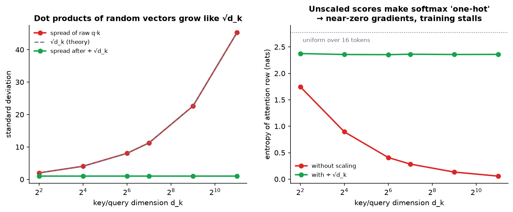

*Left: dot products of random vectors have a spread that grows like $\sqrt{d_k}$ (measured). Right: without scaling, larger $d_k$ makes softmax almost **one-hot** (entropy near 0): one token gets ~100% of the weight. A saturated softmax has near-zero gradients, so the head **stops learning**. Dividing by $\sqrt{d_k}$ keeps the spread at ~1 for any dimension.*

### 3.5 Masking: no peeking at the future

**Why it exists:** a single training sentence gives $n$ training examples at once. The model predicts the word after "a", after "a fluffy", after "a fluffy blue", and so on, all in one pass. If "fluffy" could see "blue", that prediction would be cheating.

**How it works:** set future scores to **−∞ before softmax**. Since $e^{-\infty} = 0$, they get exactly zero weight **and** the row still sums to 1.

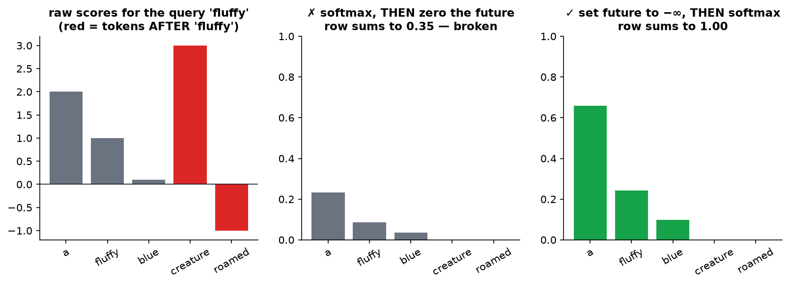

*Zeroing entries after softmax leaves rows that no longer sum to 1 (0.35 here). Setting −∞ before softmax fixes that automatically.*

> **Does inference need the mask?** The video suggests masking is mainly a training-efficiency thing. It is also required at inference in GPT-style models. The model was *trained* never to see the future, so it has to run the same way. That's also what makes the **KV cache** possible: earlier tokens' keys and values never change when new tokens arrive, so they can be stored and reused (see the MLA note).

### 3.6 Values: actually moving the information

The pattern says *who is relevant*. Now we need *what to add*:

$$\vec v_j = W_V \, \vec E_j \qquad\qquad \Delta \vec E_i = \sum_j A_{ij}\, \vec v_j \qquad\qquad \vec E_i' = \vec E_i + \Delta \vec E_i$$

For "creature": $\Delta E \approx 0.62\,v_{\text{blue}} + 0.13\,v_{\text{fluffy}} + \text{(small bits of others)}$. If $v_{\text{blue}}$ means "add blueness" and $v_{\text{fluffy}}$ means "add fluffiness", the updated "creature" vector now encodes *a fluffy blue creature*.

**Why *add* instead of replace?** The original meaning is kept and refined. This is a **residual connection**. As the backprop note explains, the "+" also gives gradients a direct path back through 96 layers, which is essential for training deep models.

### 3.7 A tiny numeric example you can do by hand

Two earlier tokens, 2-dimensional vectors, $d_k = 2$:

| | key $k$ | value $v$ |
|---|---|---|
| "fluffy" | (1, 0) | (0, 2) |
| "the" | (0, 1) | (5, 0) |

The query for "creature" is $q = (2, 0)$.

1. Scores: $q\cdot k_{\text{fluffy}} = 2$ and $q \cdot k_{\text{the}} = 0$. Divide by $\sqrt 2$: **1.41, 0**.
2. Softmax: $e^{1.41} = 4.1$ and $e^0 = 1$, so the weights are **0.80, 0.20**.
3. $\Delta E = 0.80\,(0,2) + 0.20\,(5,0) = \mathbf{(1.0,\ 1.6)}$.

"creature" mostly receives "fluffy"'s value, as intended.

---

## 4. Parameter counting (GPT-3) and the value-matrix trick

A naive $W_V$ would map 12,288 → 12,288 dimensions, which is **151 million** numbers for every head. Instead it's **factored into two low-rank pieces**:

- **value-down**: 12,288 → 128
- **value-up**: 128 → 12,288

The combined map is still embedding-to-embedding, but it has **rank ≤ 128**. This is a *low-rank factorization*: the same idea as **LoRA**, the most popular way to fine-tune LLMs cheaply.

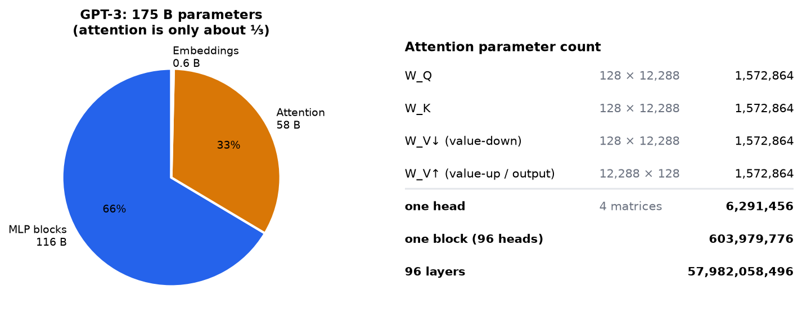

*The exact counts. Four 128 × 12,288 matrices = 6.29 M per head. × 96 heads = 604 M per block. × 96 layers = **58.0 B** for attention, about a third of GPT-3's 175 B. The MLP blocks hold about two thirds.*

> **Correction:** the first version of these notes said "roughly 58 million per block… wait". The right numbers are **~604 million per block** and **~58 billion total**.

**Naming in real code:** papers and libraries call the value-down matrix the "value matrix" $W_V$. All heads' value-up matrices are joined into one big **output matrix** $W_O$. You'll see `q_proj, k_proj, v_proj, o_proj` in Hugging Face model code.

---

## 5. Multi-head attention: many relationships at once

One head learns one kind of relationship. Language has many:

- "They crashed the **car**": the verb changes the car's implied state.
- "**Harry**" near "wizard" means Harry Potter. Near "Queen", "Sussex" or "William" it means Prince Harry.
- Pronouns ("it", "she") need to find what they refer to.

So each block runs **many heads in parallel** (96 in GPT-3). Each has its own $W_Q, W_K, W_V$, and their $\Delta E$s are added together.

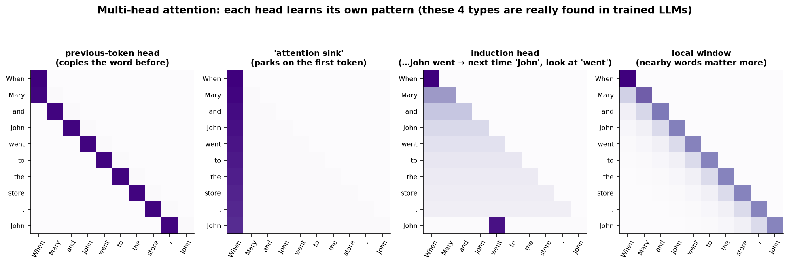

*Four head types that interpretability research has really found in trained models (the patterns here are illustrative). **Previous-token heads** look one step back. **Attention sinks** park unused attention on the first token. **Induction heads** find the previous occurrence of the current token and look at what came next, which is a key mechanism behind in-context learning and copying. **Local heads** focus on nearby words.*

**Implementation trick:** the heads aren't looped over. All heads' matrices are stacked into one big matrix, the result is reshaped into (heads, tokens, d_k), and everything is computed as one tensor operation (see the code in §12).

---

## 6. Self-attention vs cross-attention

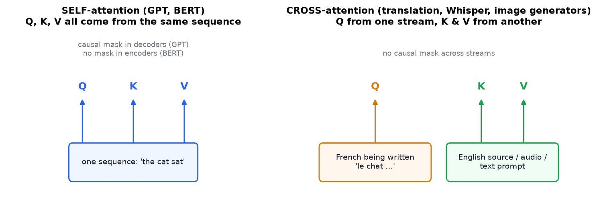

| | Self-attention | Cross-attention |
|---|---|---|
| Q from | the sequence itself | stream A (e.g. text being generated) |
| K, V from | the same sequence | stream B (e.g. source sentence, audio, prompt) |
| Mask | causal in decoders (GPT), none in encoders (BERT) | usually none |
| Used in | GPT, Claude, Llama, BERT | translation, **Whisper** (audio → text), **Stable Diffusion** (image attends to text prompt), multimodal models |

---

## 7. Attention inside the full transformer

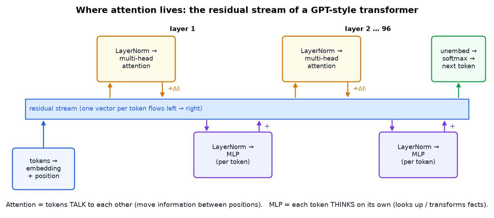

*The **residual stream** is a running vector for each token. Each layer **reads** from it and **adds** to it. Attention moves information **between** tokens ("talking"). The MLP processes each token **on its own** ("thinking"), and research suggests it stores much of the model's factual knowledge. GPT-3 repeats this 96 times.*

Deeper layers build more abstract features: grammar → meaning → sentiment, tone, genre, facts, plans.

---

## 8. Why attention won: parallelism

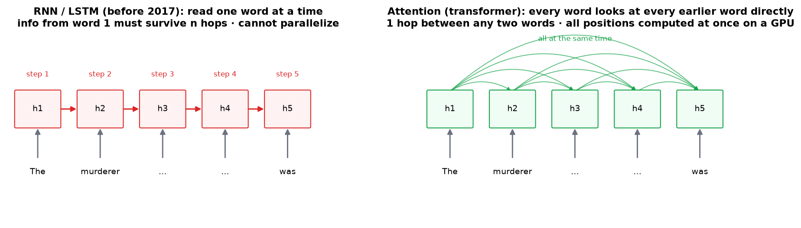

| | RNN / LSTM (pre-2017) | Transformer attention |
|---|---|---|
| Processing | one token at a time (step *t* needs step *t−1*) | all tokens at once |
| Path between word 1 and word n | n steps (information fades) | **1 step** |
| GPU use | poor (sequential) | excellent (big matrix multiplies) |
| Cost per layer | O(n·d²) | O(n²·d + n·d²) |

The deep learning lesson of the last decade is that **scale wins**. An architecture that turns GPUs into efficient matrix-multiply machines can be scaled to trillions of tokens. That's the main reason transformers replaced RNNs.

---

## 9. The engineering bottleneck: quadratic cost

The attention pattern has **n × n** entries. Double the context and you quadruple that part of the work.

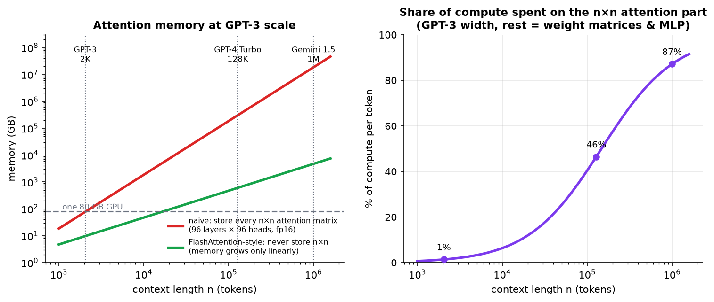

*Left: storing every attention matrix of a GPT-3-sized model in fp16. At 2K tokens that's already ~77 GB, and at 1M tokens it's tens of millions of GB. **FlashAttention** never stores the full matrix, which makes memory linear. Right: the share of per-token compute spent on the n×n part grows from ~1% at 2K context to most of the compute at 1M (rough estimate).*

### How the industry deals with it

| Technique | Idea | Used in (as of September 2026) |
|---|---|---|
| **FlashAttention** (2022–26) | compute attention in GPU-memory-friendly blocks without storing the n×n matrix. Exact, and much faster | nearly every modern LLM. **FlashAttention-4** (Dao et al., March 2026) is the current version, rewritten for NVIDIA Blackwell GPUs |
| **KV cache** | during generation, store past keys and values instead of recomputing them | every chatbot |
| **Multi-Query / Grouped-Query Attention (MQA/GQA)** | heads share K and V, so the KV cache is much smaller | the default in open models: Llama 3/4, Qwen 2.5/3, Mistral, Gemma 3, GPT-OSS. Roughly two-thirds of recent open-weight models |
| **Multi-head Latent Attention (MLA)** | compress K and V into a small learned latent vector | DeepSeek V2/V3/V3.2, and models built on that architecture such as GLM-5.x and Kimi K2 (see the MLA note) |
| **Sliding-window attention** | each token only sees the last *w* tokens | Mistral, Gemma 2/3 |
| **Learned sparse attention** | a cheap "indexer" picks which past tokens are worth attending to, then attends only to those | **DeepSeek Sparse Attention** (V3.2, 2025) and **Compressed Sparse Attention** (V4, 2026) — now the main direction for million-token contexts |
| **Linear attention / state-space models** | avoid O(n²) altogether | Mamba, Gated DeltaNet, and hybrid stacks that mix a few full-attention layers with many cheap ones |
| **RoPE / ALiBi** position encodings | better handling of position and length extrapolation | Llama, most modern LLMs |

**Real-world impact:** the "context window" on an LLM pricing page is ultimately limited by this quadratic term plus KV-cache memory. That's also why the window has grown the way it has: the jump from ~200K to **1M-token** context in 2026 models came from *changing the attention algorithm* (sparse and compressed variants), not from buying more memory. Long-context requests still cost more and respond more slowly, for exactly this reason.

---

## 10. Real-world applications

| Domain | How attention is used |
|---|---|
| **Chatbots & coding assistants** | causal self-attention over the whole conversation or codebase |
| **Search & RAG** | BERT-style encoders turn documents into embeddings. Cross-encoders re-rank results with query-document attention |
| **Machine translation** | encoder-decoder with cross-attention (Google Translate, DeepL) |
| **Speech** | Whisper: text decoder cross-attends to audio features |
| **Vision** | Vision Transformers (ViT) treat image patches as tokens |
| **Image generation** | Stable Diffusion: image features cross-attend to the text prompt, which is how "a *blue* cat" gets its colour |
| **Biology** | AlphaFold's Evoformer attends over amino-acid pairs. Protein language models (ESM) |
| **Recommendation** | attention over a user's click history (e.g. BERT4Rec, Transformers4Rec) |
| **Time series & robotics** | attention over sensor histories and action sequences (RT-2, decision transformers) |

---

## 11. Common misconceptions

| Misconception | Reality |
|---|---|
| "Attention weights explain the model's reasoning" | They show where information *came from* in one head, not *why*. Useful clues, not explanations |
| "Most parameters are in attention" | Only ~⅓ in GPT-3. The MLPs hold ~⅔ |
| "Each head has a human-readable job" | A few do. Most are distributed and hard to interpret |
| "The mask is only a training trick" | GPT-style models need it at inference too, and it's what makes the KV cache valid |
| "√d_k is a minor detail" | Without it, softmax saturates and gradients vanish as $d_k$ grows |
| "Long context is just more memory" | It's also quadratically more attention compute (unless you use approximations) |

---

## 12. Code: multi-head causal self-attention in NumPy (tested)

Saved as [`code/attention_numpy.py`](../code/attention_numpy.py).

```python
import numpy as np

def softmax(x, axis=-1):
    x = x - x.max(axis=axis, keepdims=True)          # numerical stability
    e = np.exp(x)
    return e / e.sum(axis=axis, keepdims=True)

class MultiHeadSelfAttention:
    def __init__(self, d_model, n_heads, seed=0):
        assert d_model % n_heads == 0
        rng = np.random.default_rng(seed)
        self.h, self.d_k = n_heads, d_model // n_heads
        s = 1 / np.sqrt(d_model)
        self.W_Q = rng.normal(0, s, (d_model, d_model))  # all heads' W_Q stacked together
        self.W_K = rng.normal(0, s, (d_model, d_model))
        self.W_V = rng.normal(0, s, (d_model, d_model))  # all heads' "value-down"
        self.W_O = rng.normal(0, s, (d_model, d_model))  # "value-up" of all heads = output matrix

    def split(self, x):                                   # (n, d_model) -> (heads, n, d_k)
        n = x.shape[0]
        return x.reshape(n, self.h, self.d_k).transpose(1, 0, 2)

    def __call__(self, E):
        n = E.shape[0]
        Q, K, V = self.split(E @ self.W_Q.T), self.split(E @ self.W_K.T), self.split(E @ self.W_V.T)
        scores = Q @ K.transpose(0, 2, 1) / np.sqrt(self.d_k)       # (heads, n, n)
        future = np.triu(np.ones((n, n), dtype=bool), k=1)          # True above the diagonal
        scores = np.where(future, -1e9, scores)                     # mask BEFORE softmax
        A = softmax(scores, axis=-1)                                # each row sums to 1
        out = A @ V                                                 # weighted sum of values
        out = out.transpose(1, 0, 2).reshape(n, -1)                 # concatenate heads
        delta_E = out @ self.W_O.T                                  # project back up
        return E + delta_E, A                                       # residual: E + ΔE
```

The test at the bottom of the file checks the properties described above. **Actual output:**

```
output shape: (6, 64)   attention shape: (8, 6, 6)
rows sum to 1: True
no looking ahead (upper triangle ~0): True
earlier tokens unaffected by a future change: True
```

**In PyTorch** the core is one line: `torch.nn.functional.scaled_dot_product_attention(q, k, v, is_causal=True)`, which uses FlashAttention automatically when it can.

**Try this:** (1) remove the `/ np.sqrt(self.d_k)` with `d_model=1024` and look at how peaked the attention rows become. (2) Remove the mask and watch the causality check fail.

---

## 13. Self-quiz

<details><summary><b>Q1 (easy).</b> Why is the "mole" vector identical in all three sentences right after the embedding step?</summary>

The embedding is a lookup table indexed by token ID. It has no access to the surrounding words. Only attention layers can mix in context.
</details>

<details><summary><b>Q2 (easy).</b> What does each of Q, K, V represent, in one phrase each?</summary>

Q: what I'm looking for. K: what I offer or contain, to be matched against. V: the information I pass on if I'm selected.
</details>

<details><summary><b>Q3 (medium).</b> Scores for one row are [2, 0, −∞]. What are the attention weights?</summary>

$e^2 = 7.39$, $e^0 = 1$, $e^{-\infty} = 0$. Weights = [7.39/8.39, 1/8.39, 0] ≈ **[0.88, 0.12, 0]**.
</details>

<details><summary><b>Q4 (medium).</b> Why set masked entries to −∞ before softmax instead of 0 after?</summary>

Zeroing after softmax breaks normalization, because the row no longer sums to 1. With −∞ before softmax those entries get weight exactly 0 and the remaining weights still sum to 1.
</details>

<details><summary><b>Q5 (medium).</b> What happens without the √d_k scaling for large d_k?</summary>

Dot products grow like √d_k, softmax becomes nearly one-hot, gradients through it become tiny, and the head learns very slowly or not at all.
</details>

<details><summary><b>Q6 (medium).</b> A model's context goes from 8K to 32K tokens. By roughly what factor does the n×n attention matrix grow?</summary>

(32/8)² = **16×**.
</details>

<details><summary><b>Q7 (hard).</b> Verify GPT-3's attention parameter count: d = 12,288, d_k = 128, 96 heads, 96 layers.</summary>

Per head: 4 × 128 × 12,288 = 6,291,456. Per block: × 96 = 603,979,776. All layers: × 96 = 57,982,058,496 ≈ **58 B**.
</details>

<details><summary><b>Q8 (hard).</b> Why does factoring W_V into "down" (d→128) and "up" (128→d) save parameters, and what's the limitation?</summary>

2 × 128 × 12,288 ≈ 3.1 M instead of 12,288² ≈ 151 M. The limitation is that the map has rank ≤ 128, so each head can only write into a 128-dimensional subspace. Many heads together cover much more.
</details>

<details><summary><b>Q9 (hard).</b> Why is a KV cache possible only because of causal masking?</summary>

With a causal mask, a token's keys and values depend only on itself and earlier tokens. Adding new tokens later never changes them, so they can be computed once and cached. Without the mask, every new token would change all earlier representations.
</details>

<details><summary><b>Q10 (hard).</b> In Stable Diffusion, which stream supplies the queries and which supplies the keys and values in cross-attention?</summary>

Queries come from the image features being denoised. Keys and values come from the text-prompt embeddings. Each image region "asks" which words describe it.
</details>

---

## 14. Glossary

| Term | Meaning |
|---|---|
| **Token** | A piece of text (word or sub-word) the model processes |
| **Embedding** | The vector representing a token |
| **Query / Key / Value** | Per-token vectors for asking, matching and providing information |
| **Attention pattern** | The n×n matrix of weights (who attends to whom) |
| **Softmax** | Turns scores into positive weights that sum to 1 |
| **d_k** | Dimension of the query and key vectors |
| **Causal mask** | Blocks attention to future tokens |
| **Head** | One set of W_Q, W_K, W_V with its own pattern |
| **Multi-head attention** | Many heads in parallel whose outputs are summed |
| **Output matrix W_O** | All heads' value-up maps combined |
| **Residual stream** | The running per-token vector that layers read from and add to |
| **Self- / cross-attention** | Q, K, V from the same sequence / Q from a different stream than K, V |
| **KV cache** | Stored keys and values of past tokens, used during generation |
| **FlashAttention** | An exact, memory-efficient attention algorithm |
| **Low-rank** | A map that squeezes through a small intermediate dimension |

---

## 15. Further reading (easiest first)

1. **3Blue1Brown**, *Deep Learning* chapters 5–7 (YouTube). Transformers, attention and MLPs.
2. **Jay Alammar**, *The Illustrated Transformer* (blog).
3. **Vaswani et al. (2017)**, *Attention Is All You Need*. The original paper.
4. **Andrej Karpathy**, *Let's build GPT: from scratch, in code, spelled out* (YouTube).
5. **Anthropic (Elhage et al., 2021)**, *A Mathematical Framework for Transformer Circuits*. Residual stream, induction heads.
6. **Dao et al. (2022)**, *FlashAttention* — and **FlashAttention-4** (2026, arXiv:2603.05451) for the current Blackwell-era kernel design.
7. **Ainslie et al. (2023)**, *GQA: Training Generalized Multi-Query Transformer Models*.
8. **Sebastian Raschka**, *The Big LLM Architecture Comparison* (updated through 2026) — a side-by-side of which attention variant each open model actually uses.

---

*Source video: [Attention in transformers, step-by-step](https://youtu.be/eMlx5fFNoYc?si=K4rmmpydkNhrEvX_) by 3Blue1Brown. Figures generated by `figures/attention/make_figs.py`. Heatmaps in figure 3 come from an actual attention computation.*
