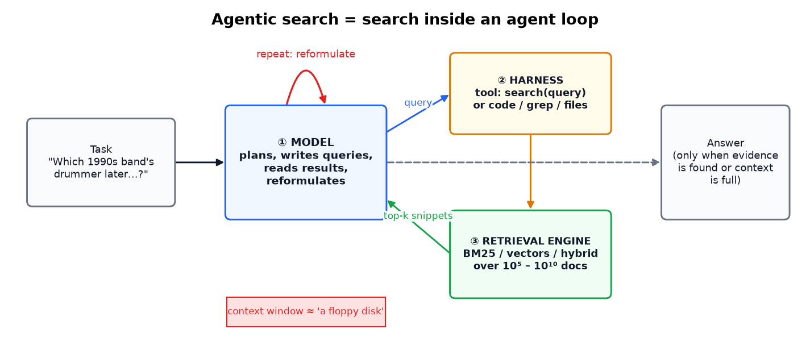
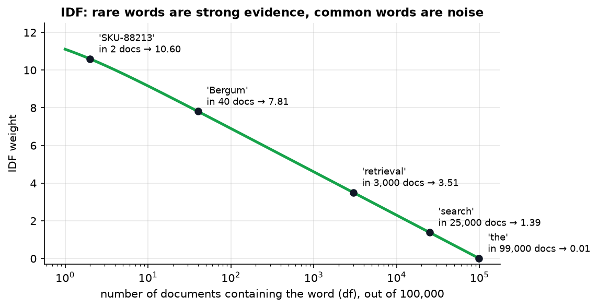
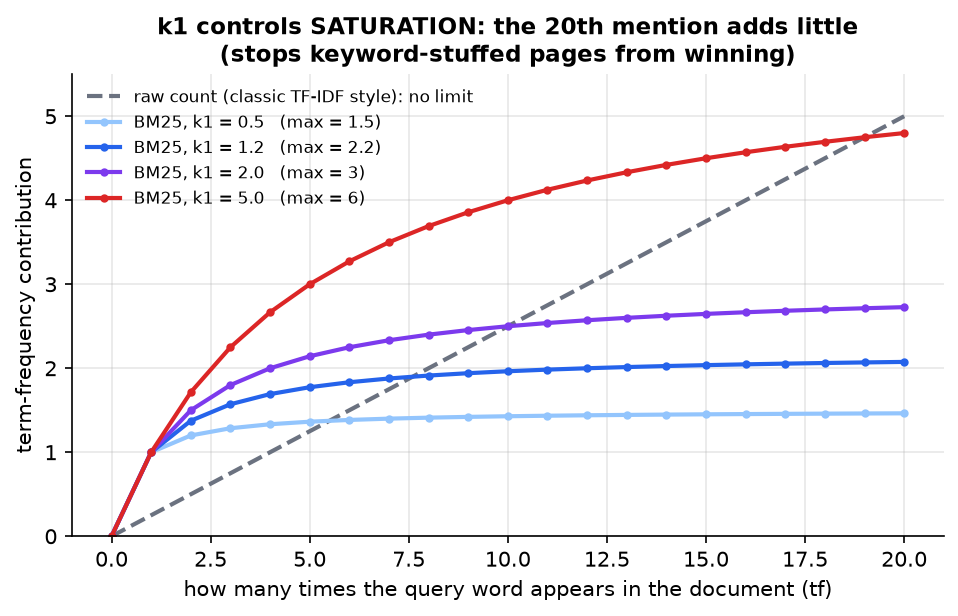
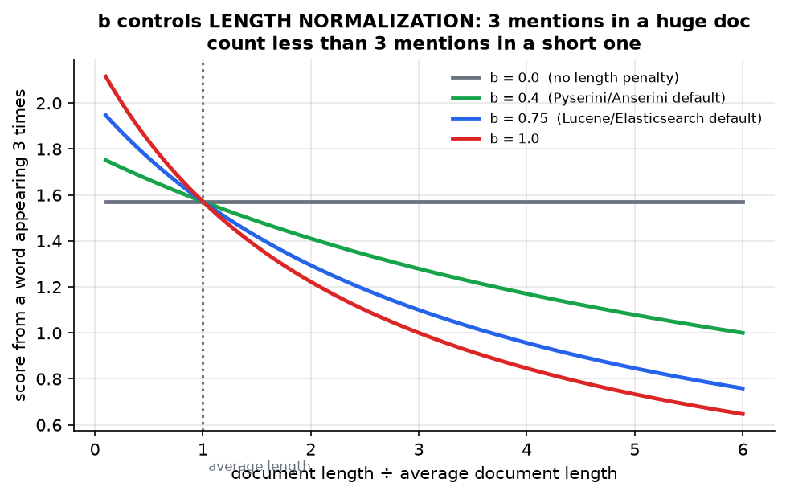
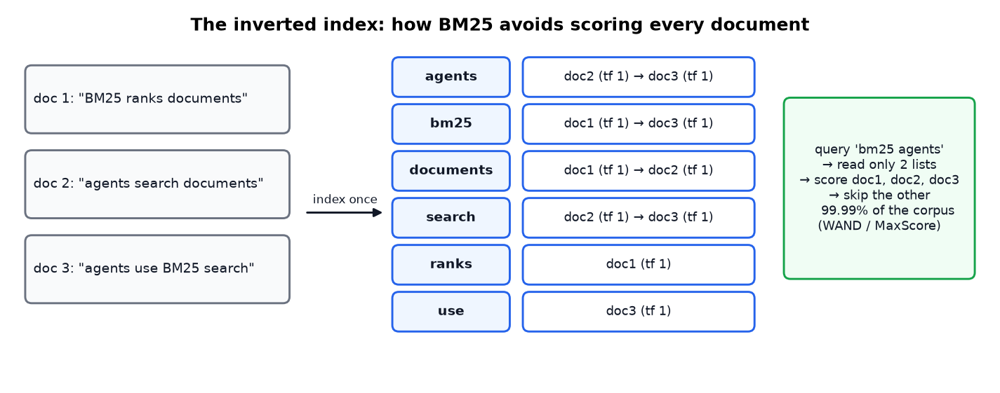
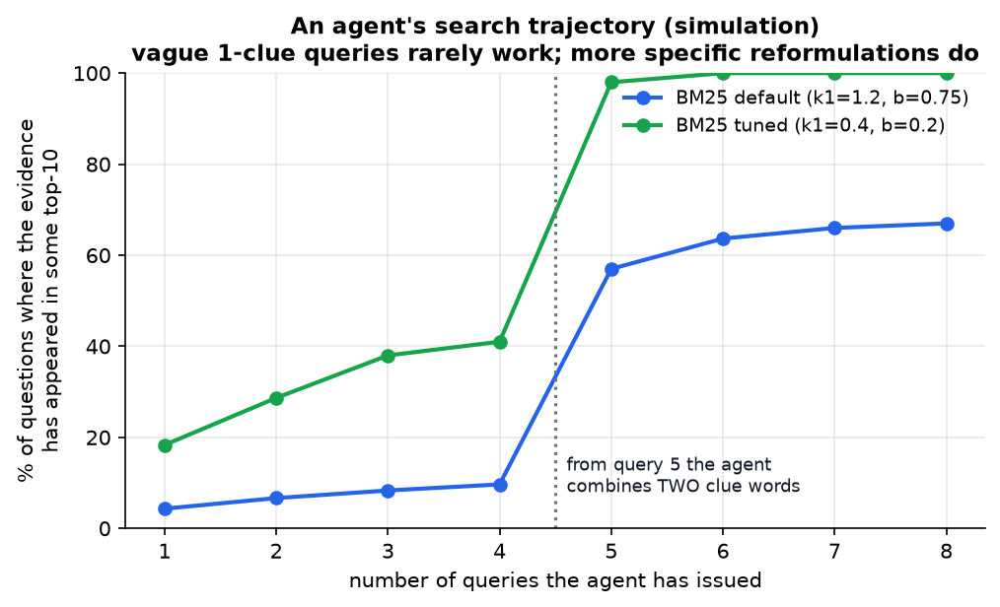
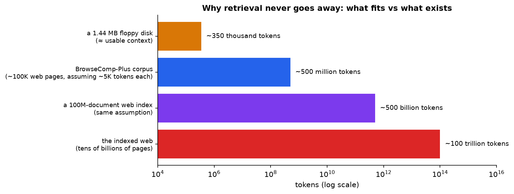
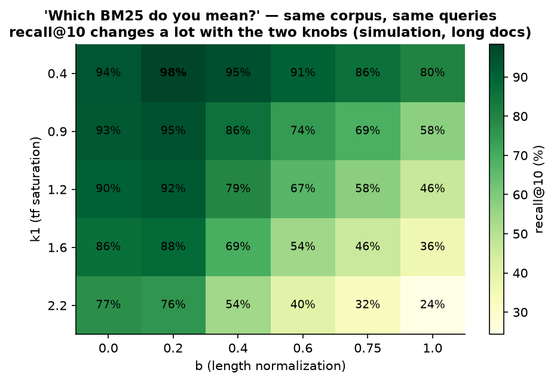
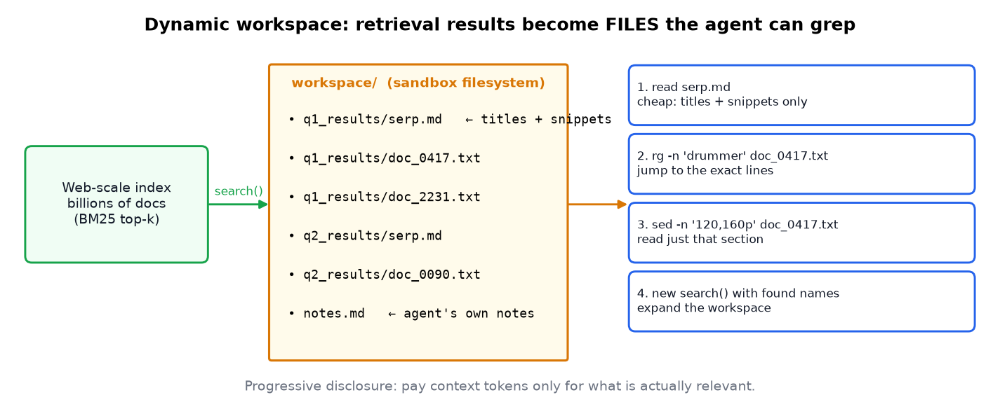

# The Unreasonable Effectiveness of BM25 for Agentic Search

> **Source:** [The unreasonable effectiveness of BM25 for agentic search](https://youtu.be/fZH97QHHYjY?si=3euDuUZAzRYEq6eJ) by Jo Kristian Bergum (Hornet.dev), AI Engineer conference
> **Related notes:** [Agent Memory](Agent%20Memory%20-%20Long-Term%20Memory%20with%20Mem0.md) (also uses keyword + vector retrieval) · [Why the Harness Matters](Agent%20Harnesses%20-%20Why%20the%20Scaffold%20Beats%20the%20Model.md)
> **What's in this version:** the BM25 formula explained piece by piece, with plots and a hand-worked example; two experiments that actually run BM25 (parameter tuning, and an agent reformulating its queries); inverted indexes; hybrid search with RRF; how this applies to coding agents and RAG; tested code; and a quiz.
> **Facts re-checked:** 18 September 2026. The talk's main claim has since been tested in a peer-reviewed follow-up and held up — see the update box in **§5.3**, which also gives the tuned parameter values.

---

## 0. How to use this guide

| If you have… | Read |
|---|---|
| 10 minutes | §0.1 plain-words intro, §1 TL;DR, plus figures 1, 6 and 7 |
| 1 hour | §1–§8 |
| A weekend | Everything. Run `code/bm25_search.py` on your own documents |

---

### 0.1 First, in completely plain words

**BM25 is a formula for deciding which documents best match a search query, using nothing but word counts.** No AI, no neural network, no GPU. It was finished in the mid-1990s and it is still the default inside Elasticsearch, Lucene and most search bars you've ever used.

It works on three common-sense rules:

1. **Rare words count for more.** If you search "quantum Marais", the word "Marais" tells the engine far more than "quantum" does, and "the" tells it nothing at all.
2. **Repetition helps, but only up to a point.** A page that says "espresso" 5 times is more about espresso than one that says it once. A page that says it 500 times is not 100× better — it's probably spam.
3. **Long documents shouldn't win just for being long.** A 50-page document mentions everything once by accident, so its matches are worth less per mention.

That's the whole formula. Everything in §3 is those three rules written in maths.

**Now the surprising part, which is what the talk is really about.** For about a decade, the interesting question was "can AI embeddings beat BM25?" — and usually they could. Then the *user* changed. Search used to be a human typing two vague words and giving up after one page. Now it's often a language model that knows the exact product code, writes a long precise query, reads every result in a second, notices what went wrong, and tries again forty more times.

Give the same 30-year-old formula a user like that and it suddenly performs brilliantly. **The algorithm didn't improve. The person asking did.**

One term you'll see throughout: **agentic search** just means "search that happens inside an AI agent's loop" — the model searches, reads, rethinks, and searches again, without a human in between.

---

## 1. TL;DR in 8 lines

1. **Agentic search** is search inside an agent loop: the model writes queries, reads results, reformulates, and repeats.
2. **BM25** is a ~30-year-old keyword-scoring formula. It scores documents by **shared words**, weighting **rare** words more, with **saturation** and **length normalization**.
3. For years BM25 was just a baseline that neural methods beat. **It hasn't improved. The user has.** LLMs know entity names, write long precise queries, and issue dozens of them without getting tired.
4. **Retrieval never goes away:** a context window is like a *floppy disk* next to a web-sized corpus.
5. **"Which BM25 do you mean?"** Its two knobs (`k1`, `b`) and the implementation details can swing results enormously. Badly tuned baselines made BM25 look worse than it is.
6. BM25 suits agents because it's **exact** (IDs, names, codes), **cheap** (no GPU), and **explainable** (the agent can see *why* a result matched and fix its next query).
7. The new pattern: put search results in a **filesystem workspace** and let the agent use **grep / ripgrep / sed**. This rides the coding-agent skills that labs are already training hard.
8. Evaluate the **end task** (did the agent answer correctly?), not a single ranked list.

---

## 2. What is agentic search?



*Search is no longer "a human types two words and scans 10 blue links". A model runs a loop, and search is one tool inside it.*

The three parts you need:

| Component | Role | Examples |
|---|---|---|
| **① Capable model** | uses tools, writes and reformulates good queries | any current frontier model (the GPT, Claude, Gemini and Grok families; open-weight models such as DeepSeek and Qwen) |
| **② Harness** | how search is exposed to the model | a `search(query)` tool, "code mode" (the model writes code that calls retrieval), filesystem + grep |
| **③ Retrieval engine** | does top-k search quickly over huge corpora | BM25 engines (Lucene/Elasticsearch/OpenSearch, Vespa, Tantivy, Hornet), vector DBs, hybrids |

**Where you already use it:** Claude Code or Cursor grepping your repository, deep-research features that run dozens of web searches, and customer-support agents searching a knowledge base.

---

## 3. BM25, explained piece by piece

**BM25 = "Best Matching 25"**, the 25th weighting scheme in a series tried by Stephen Robertson, Steve Walker and colleagues for the Okapi system at City University London (TREC, ~1994). It's a **scoring function**: (query, document) → a number used as a proxy for relevance.

$$\text{score}(D, Q) = \sum_{t \in Q} \underbrace{\text{IDF}(t)}_{\text{how rare}} \cdot \underbrace{\frac{f(t,D)\,(k_1+1)}{f(t,D) + k_1\left(1 - b + b\,\frac{|D|}{\text{avgdl}}\right)}}_{\text{how often, saturated and length-normalized}}$$

| Symbol | Meaning |
|---|---|
| $f(t, D)$ | how many times term $t$ appears in document $D$ (term frequency) |
| $\lvert D\rvert$, avgdl | this document's length, and the average length across the corpus |
| $k_1$ | saturation knob (typically 0.9–1.2) |
| $b$ | length-normalization knob (typically 0.4–0.75) |
| IDF | inverse document frequency: $\ln\!\left(1 + \frac{N - n_t + 0.5}{n_t + 0.5}\right)$, where $n_t$ is the number of docs containing $t$ |

**How to read the formula out loud:** "For each word in the query, work out a score, then add those scores up. A word's score is *how rare it is* (the IDF part) multiplied by *how much this document uses it* — where 'uses it' is counted in a way that stops rewarding repetition after a while, and is discounted if the document is longer than average."

The scary-looking fraction is doing only one job: it starts near zero when the word is absent, rises quickly for the first few mentions, and then flattens out. The $\frac{|D|}{\text{avgdl}}$ bit inside it is simply "how long is this document compared to a typical one".

It rests on three ideas.

### 3.1 Idea 1: rare words are strong evidence (IDF)



*In a 100,000-document corpus, a product code found in only 2 docs weighs 10.6. "the", found in almost every doc, weighs ~0. Matching a rare word tells you much more.*

### 3.2 Idea 2: repetition helps, but saturates (k1)



*The first mention of a word matters most. By the 20th mention there's almost no extra credit. The contribution can never exceed $k_1 + 1$. This stops keyword-stuffed spam pages from winning, which was a real problem for early search engines.*

### 3.3 Idea 3: long documents shouldn't win just by being long (b)



*A 50-page document mentions everything a few times by chance. With $b = 0.75$ (the Lucene/Elasticsearch default), 3 mentions in a document 6× longer than average count for a lot less. With $b = 0$ length is ignored. Anserini/Pyserini, which IR researchers use, default to $b = 0.4$.*

### 3.4 Worked example by hand

Corpus of $N = 1{,}000$ docs. The query term appears in $n_t = 10$ docs. Use $k_1 = 1.2$.

1. **IDF** $= \ln(1 + 990.5/10.5) = \ln(95.33) = \mathbf{4.557}$
2. **Normal-length doc**, tf = 3, $|D| = \text{avgdl}$: TF part $= \frac{3 \times 2.2}{3 + 1.2 \times 1} = 1.571$ → score **7.16**
3. **4× longer doc**, tf = 3, $b = 0.75$: normalizer $= 0.25 + 0.75 \times 4 = 3.25$ → TF part $= \frac{6.6}{3 + 3.9} = 0.957$ → score **4.36**
4. **Same long doc with $b = 0.4$**: normalizer $= 0.6 + 1.6 = 2.2$ → TF part $= \frac{6.6}{5.64} = 1.170$ → score **5.33**

Lowering $b$ cut the length penalty on the long document by about half. That matters when the relevant documents are long web pages, which is exactly the BrowseComp-Plus situation (§5).

### 3.5 Why it's fast: the inverted index



*"Score every document" is only the naive picture. Real engines keep, for every word, a list of the documents containing it (a **posting list**). A query only reads the lists for its own words. Algorithms such as **WAND**, **Block-Max WAND** and **MaxScore** also skip documents that can't reach the top-k. Forty years of IR engineering sped up top-k retrieval without changing the formula.*

---

## 4. Why BM25 is back: a new, more powerful user

| | Human searcher (e.g. the AOL query log) | LLM agent (e.g. GPT-5 trajectories) |
|---|---|---|
| Query length | typically 2–3 words | long, detailed, full of entities |
| Knowledge | limited to the person | broad world knowledge: names, dates, companies, jargon |
| Operators | rarely used | `site:`, `"exact phrases"`, boolean-style constructs learned from the web |
| Persistence | gives up after a page or two | dozens of queries, systematic reformulation |
| Reads results | slowly | thousands of tokens per second |
| Evaluated by | a human scanning 10 blue links | whether the **final task** succeeds |

> The AOL query log (2006) was a set of ~20 million real search queries that AOL released by accident. It became infamous as a privacy disaster when journalists re-identified users from their queries. Researchers still cite it for how humans search.

**Key idea:** a scoring function is only as good as the queries you give it. BM25 is limited mainly by **vocabulary mismatch** (the query says "timeout", the document says "times out"). A knowledgeable agent that **reformulates** can fix that itself.



*A simulation on a synthetic corpus with real BM25 scoring. The agent knows several clue words about the answer. Early vague queries (one clue plus generic words) rarely surface the evidence. When it reformulates with **two** specific clues, success jumps. With tuned parameters the agent finds the evidence in 98% of questions after 5 queries. The retrieval engine didn't change: **the querier got smarter.***

---

## 5. BrowseComp-Plus: the benchmark behind the argument

| Property | Value |
|---|---|
| Questions | ~830 riddle-like "pub quiz" questions |
| Corpus | ~100K curated web documents (fixed, so results are reproducible) |
| Harness | deliberately simple: one tool, `search(query)` → snippets |
| Scoring | end-to-end accuracy against a gold answer |

### 5.1 Reasoning isn't the bottleneck, retrieval is

- **Give the model the correct evidence documents directly** → accuracy is very high.
- **Make it find them with a search tool** → accuracy drops a lot, and now depends on query-writing skill **and** retriever quality.

### 5.2 The floppy-disk argument



*A 1.44 MB floppy disk holds roughly 350K tokens of text (at ~4 characters per token). That's about where Bergum estimates quality starts to degrade in current long-context models. Even a small benchmark corpus is ~1,000× bigger, and the web is ~100 million times bigger. **Even a perfect AGI has to decide what goes on the floppy disk.** That decision is retrieval.*

### 5.3 "Which BM25 do you mean?"

The original BrowseComp-Plus paper's BM25 baseline did badly against embedding models — recall@1000 of about 14% for finding evidence documents, well behind 8B-parameter embedding models. Later work showed its **parameters were a poor fit for the long documents in the corpus**. Once tuned, BM25 became far more competitive.

> **Update, checked September 2026 — the talk's central claim has now been tested properly and it held up.** Jimmy Lin's group at Waterloo published *"Rethinking Agentic Search with Pi-Serini: Is Lexical Retrieval Sufficient?"* (Hsu, Yang & Lin, May 2026). Running plain BM25 with tuned parameters and enough retrieval depth, paired with a strong model:
>
> | Result | Number |
> |---|---|
> | Answer accuracy on BrowseComp-Plus (BM25 + GPT-5.5) | **83.1%** |
> | Surfaced-evidence recall | **94.7%** |
> | Gain from **tuning k₁ and b alone** | +18.0% answer accuracy, +11.1% evidence recall |
> | Further gain from increasing retrieval depth | +25.3% surfaced-evidence recall |
>
> That beat published search agents built on dense (embedding) retrievers. The tuned settings that work on this corpus are dramatically different from the defaults — roughly **k₁ ≈ 16 and b = 1.0**, against Anserini's default k₁ = 0.9, b = 0.4. A k₁ that high means "keep rewarding repeated mentions for much longer before saturating", which makes sense when the evidence is one passage buried in a long web page.
>
> The headline for you: *"we tried BM25 and it was bad"* is very often a statement about two numbers someone never tuned. BrowseComp-Plus itself was accepted to **ACL 2026**.



*Same corpus, same queries, only `k1` and `b` changed (synthetic corpus where the evidence is buried in long pages and short distractor pages repeat single clue words). Recall@10 ranges from **24% to 98%**. The common defaults (k1 = 1.2, b = 0.75) score 58%. A result labelled just "BM25" in a paper tells you little until you know these settings.*

**Other implementation details that change results:**

| Detail | Options |
|---|---|
| Tokenizer | whitespace, word-piece, how "E-4012" or "C++" are split |
| Stemming | "running" → "run"? (helps recall, hurts exactness) |
| Stop-words | remove "the", "of"? |
| IDF variant | Lucene's `+1` inside the log vs the classic version (which can go negative) |
| Fields | title weighted separately from body (BM25F) |
| Document chunking | index whole pages vs passages (strongly interacts with `b`) |
| Phrase / proximity scoring | reward query words that appear close together |

---

## 6. Why BM25 fits agents so well

1. **Exact matching.** Agents know precise strings: error codes, SKUs, zip codes, function names, people's names. Embedding models squeeze a text into one fixed-size vector and can blur "E-4011" with "E-4012". BM25 treats them as different tokens.
2. **It's cheap.** No GPU and no embedding model (some top embedding models have ~8B parameters and need their own inference cluster). Updating the index is instant: no re-embedding when content changes.
3. **Mature and explainable.** Lucene has 25 years of tooling behind it. Most importantly, **the agent can see why a document matched** (shared words), so it knows how to reformulate. A cosine similarity of 0.73 tells it nothing actionable.

### BM25 vs embeddings vs hybrid

| | BM25 (lexical) | Embeddings (semantic) | Hybrid |
|---|---|---|---|
| Exact IDs / names / code | ✅ excellent | ⚠️ often fuzzy | ✅ |
| Synonyms, paraphrase ("car" ↔ "automobile") | ❌ weak | ✅ strong | ✅ |
| Cost | CPU, cheap | GPU inference plus a vector index | both |
| Index updates | instant | re-embed | both |
| Explainable to the agent | ✅ | ❌ | partly |
| Benefits from a smart query writer | a lot | somewhat | a lot |

**In practice** production systems (RAG, enterprise search, e-commerce) often run **both** and merge the results with **reciprocal rank fusion (RRF)**:

$$\text{RRF}(d) = \sum_{\text{rankers}} \frac{1}{k + \text{rank}(d)}, \quad k = 60$$

*Example:* a document ranked 1st by BM25 and 3rd by embeddings gets $\frac{1}{61} + \frac{1}{63} = 0.0323$. One ranked 2nd by both gets $\frac{2}{62} = 0.0323$. RRF uses only **ranks**, so the two very different score scales never need to be calibrated against each other.

---

## 7. BM25 + grep: the dynamic workspace pattern

This comes from Jimmy Lin's group (University of Waterloo), *"Scaling Direct Corpus Interaction via Dynamic Workspace Expansion"*.



*Retrieval narrows billions of documents to a handful, which are written into a sandbox **filesystem**. The agent first sees cheap titles and snippets, then uses `rg`, `sed` and `cat` to read exactly the lines it needs, and runs new searches that add to the workspace.*

**Why this works:**

- **Progressive disclosure:** spend context tokens only on relevant text. It's the same idea as agent *skills*, where short descriptions come first and details load on demand.
- **Rides the capability curve:** every frontier lab is training models hard on coding, bash and file navigation. A search system built on files + grep **gets better every time the models do**, at no cost to you.
- **Grep is BM25's natural partner:** both are literal matching, so the agent reasons about them the same way.
- **Combines two infrastructures:** sandbox / virtual filesystems and retrieval engines.

**You've already seen this:** coding agents like Claude Code rely heavily on `grep`/`ripgrep` and file reads to find code, often instead of a vector index over the repository.

---

## 8. Evaluation is changing

| Classic IR evaluation | Agentic evaluation |
|---|---|
| one query → one ranked list | a trajectory of many queries |
| metrics: NDCG@10, MRR, recall@k | **end-task accuracy** (right answer? tests pass?) |
| human relevance judgments per document | a gold answer or automatic check |
| compares rankers in isolation | compares **model + harness + retriever** as a whole |
| cost ignored | cost matters: tokens used, number of searches, latency |

> **NDCG** (normalized discounted cumulative gain) rewards putting relevant documents near the top of *one* list. It stays useful for debugging a retriever, but an agent that can reformulate cares more about **recall across the trajectory** and **how clear the results are** than about the perfect order of a single list.

---

## 9. Hornet's bet and the infrastructure economics

Hornet is building a BM25-first retrieval engine for agents. In the talk, Bergum showed a single-node benchmark over **100M web documents** where Hornet had **lower latency at the same throughput** than several anonymized engines. (He corrected his axis label mid-talk: the y-axis was latency, not QPS.)

**Why efficiency matters much more for agents:** a human issues a few queries per session. An agent issues **dozens per task**, and thousands of agents run in parallel. Query volume per user goes up 10–100×, so retrieval cost per query directly sets whether agentic products are profitable.

---

## 10. Where this applies in engineering today

| Use case | How BM25 / lexical search helps |
|---|---|
| **Coding agents** | grep/ripgrep for symbols, error strings and config keys |
| **RAG over company docs** | hybrid BM25 + vectors. BM25 catches product names, ticket IDs, acronyms |
| **Log and observability search** | exact error codes, trace IDs (Elasticsearch/OpenSearch, Loki) |
| **E-commerce** | SKUs, brand names, model numbers |
| **Legal, patents, medical** | precise terms and citations. Explainability matters |
| **Deep-research agents** | many fast, cheap web queries |
| **Agent memory** | keyword search over stored memories alongside vectors (see the Agent Memory note) |

---

## 11. Code: BM25 from scratch plus hybrid fusion (tested)

Full file: [`code/bm25_search.py`](../code/bm25_search.py). The core scoring:

```python
def search(self, query, k=3):
    scores = defaultdict(float)
    for term in tokenize(query):
        postings = self.index.get(term)            # inverted index: term -> {doc_id: tf}
        if not postings:
            continue                               # only docs containing a query term are touched
        idf = self.idf(term)
        for doc_id, tf in postings.items():
            norm = 1 - self.b + self.b * self.doc_len[doc_id] / self.avgdl
            scores[doc_id] += idf * tf * (self.k1 + 1) / (tf + self.k1 * norm)
    return sorted(scores.items(), key=lambda x: -x[1])[:k]
```

**Actual output (abridged),** which also demonstrates vocabulary mismatch and how an agent fixes it:

```
query: 'E-4012'
  doc 0  score  1.469   e-4012(tf=1, idf=1.20) +1.47          <- exact ID match; E-4011 is NOT confused

query: 'payment gateway timeout'
  doc 1  score  1.030   payment(...) +0.58; gateway(...) +0.45   <- right doc (0) ranks LAST:
  doc 3  score  1.029   ...                                         the doc says "times out", not "timeout"
  doc 0  score  0.870   ...

query: 'payment gateway times out'                                 <- agent reformulates after reading
  doc 0  score  3.808   ...; times(...) +1.47; out(...) +1.47     <- now clearly first
```

The `explain` output (which words contributed what) is exactly the kind of feedback that helps an agent write its next query.

---

## 12. Common misconceptions

| Misconception | Reality |
|---|---|
| "BM25 is obsolete, embeddings replaced it" | Hybrids dominate in production, and with agent queriers BM25 alone is often competitive |
| "BM25 is one fixed algorithm" | Tokenization, stemming, `k1`, `b`, fields and chunking all change results a lot |
| "Bigger context windows remove the need for retrieval" | Context is a floppy disk. Corpora are warehouses |
| "Good retrieval means a good ranked list" | For agents, good retrieval means the **task succeeds** within its token and time budget |
| "Embeddings understand meaning, so they're always better" | They blur exact identifiers and cost GPU inference |

---

## 13. Self-quiz

<details><summary><b>Q1 (easy).</b> What are the three components of an agentic search system?</summary>

A capable model, a harness (how retrieval tools are exposed), and a retrieval engine.
</details>

<details><summary><b>Q2 (easy).</b> Why does the word "the" contribute almost nothing to a BM25 score?</summary>

It appears in nearly every document, so its IDF is ≈ 0.
</details>

<details><summary><b>Q3 (medium).</b> What does k1 control? What happens with k1 = 0?</summary>

Term-frequency saturation. With k1 = 0 the TF part becomes $\frac{f \cdot 1}{f} = 1$ for any f > 0, so only presence or absence matters (binary matching weighted by IDF).
</details>

<details><summary><b>Q4 (medium).</b> A corpus consists of long web pages and the relevant evidence is buried in them. Should you raise or lower b?</summary>

Lower it (e.g. 0.75 → 0.3–0.4). A high b penalizes long documents, pushing the relevant long pages below short distractors.
</details>

<details><summary><b>Q5 (medium).</b> Compute RRF (k = 60) for a doc ranked 1st by BM25 and absent from the vector results.</summary>

1/61 ≈ 0.0164 (it gets no contribution from a ranker that didn't return it).
</details>

<details><summary><b>Q6 (medium).</b> Give two reasons BM25's explainability matters specifically for agents.</summary>

(1) The agent can see which words matched and adjust its query (add a missing entity, try a synonym). (2) It can judge whether a result is a real match or a coincidental keyword hit before spending tokens reading it.
</details>

<details><summary><b>Q7 (hard).</b> In BrowseComp-Plus, giving the model the gold evidence gives high accuracy, but search gives much lower accuracy. What does this tell you about where to invest?</summary>

Reasoning isn't the bottleneck, finding evidence is. Invest in retrieval quality (tuning, hybrid search), query-writing ability, and harness design (workspace, grep), not only in a bigger model.
</details>

<details><summary><b>Q8 (hard).</b> Why does building search on files + grep "ride the capability curve"?</summary>

Frontier labs are heavily training models for coding and bash/filesystem tool use. A harness that uses those same primitives automatically benefits from every model improvement, without extra work from you.
</details>

---

## 14. Glossary

| Term | Meaning |
|---|---|
| **Lexical search** | Matching on literal words or tokens |
| **Semantic / dense retrieval** | Matching via embedding-vector similarity |
| **BM25** | Probabilistic keyword scoring with IDF, TF saturation and length normalization |
| **TF / IDF** | Term frequency in a doc / inverse document frequency across the corpus |
| **k1, b** | BM25's saturation and length-normalization parameters |
| **Inverted index / posting list** | Term → list of documents (and frequencies) containing it |
| **WAND / MaxScore** | Algorithms that skip documents that can't make the top-k |
| **Vocabulary mismatch** | Relevant text uses different words than the query |
| **Hybrid search** | Combining lexical and semantic retrievers |
| **RRF** | Reciprocal rank fusion, which merges ranked lists using ranks only |
| **SERP** | Search engine results page |
| **Progressive disclosure** | Show summaries first, load details only when needed |
| **NDCG / recall@k** | Ranked-list quality metrics |
| **Search trajectory** | The sequence of queries and results an agent goes through for one task |

---

## 15. Further reading

1. **Robertson & Zaragoza (2009)**, *The Probabilistic Relevance Framework: BM25 and Beyond*. The definitive explanation.
2. **Manning, Raghavan & Schütze**, *Introduction to Information Retrieval*, chapters 6 and 11 (free online).
3. **BrowseComp-Plus** paper and leaderboard (2025, ACL 2026): the fixed-corpus deep-research benchmark.
4. **Hsu, Yang & Lin (2026)**, *Rethinking Agentic Search with Pi-Serini: Is Lexical Retrieval Sufficient?* — the follow-up that tuned BM25 properly and got 83.1% on BrowseComp-Plus (§5.3).
5. **hornet.dev blog**: analysis of frontier-model search trajectories.
6. **Lin et al.**, *Pyserini / Anserini*: reproducible BM25 baselines.
7. **Cormack, Clarke & Büttcher (2009)**, *Reciprocal Rank Fusion outperforms Condorcet and individual rank learning methods*.
8. **Waterloo (Jimmy Lin's group)**, *Scaling Direct Corpus Interaction via Dynamic Workspace Expansion*.

---

*Source talk: [The unreasonable effectiveness of BM25 for agentic search](https://youtu.be/fZH97QHHYjY?si=3euDuUZAzRYEq6eJ) by Jo Kristian Bergum. Figures generated by `figures/bm25/make_figs.py`. Figures 6 and 7 come from running BM25 on a synthetic corpus: they illustrate the effects, and the numbers aren't benchmark results.*
