# Backpropagation: Building the Algorithm from Scratch

> **Source:** [The Most Important Algorithm in Machine Learning](https://youtu.be/SmZmBKc7Lrs?si=ktQHq8JMCmJ1AAFH) by Artem Kirsanov
> **Follow-up:** [the predictive coding guide](Predictive%20Coding%20-%20How%20the%20Brain%20May%20Learn%20Instead.md) covers the next video in the series, which explains why the brain probably *doesn't* use backprop.
> **What's in this version:** 12 figures (every plot comes from actually running the algorithm), a fully worked numeric example, the matrix form used in real networks, the engineering problems backprop causes in practice and how they're fixed, a tested 60-line autograd engine you can run, a self-quiz, and further reading.
> **Facts re-checked:** 18 September 2026. Backprop itself hasn't changed — it's a 1970 algorithm and it still works exactly the same way. What has changed is scale and tooling; see §10.6.

---

## 0. How to use this guide

| If you have… | Read |
|---|---|
| 10 minutes | §0.1 plain-words intro, §1 TL;DR, then every figure and its caption |
| 1 hour | §1–§8 and §11 |
| A weekend | Everything. Run the code in §12 and change things in it, then do the quiz in §14 |

**What you need to know first:** what a function is, and roughly what a slope is. Everything else is built up here.

**Reading it once is not the plan.** Section 1 is dense on purpose — it's a summary, not an introduction. Read §0.1 below first, then skim §1, then read §3 onward properly. Anything that doesn't land the first time is defined again in the glossary (§15).

---

### 0.1 First, in completely plain words

Imagine a machine with a million dials on it. Turning the dials changes how well the machine does its job. You have one gauge that shows a single number: **how wrong the machine currently is**. Your job is to get that number as close to zero as you can.

You could turn a dial a little, look at the gauge, and keep the change if the number went down. That works, but with a million dials it would take forever — and you'd have to test each dial separately.

**Backpropagation is a trick that tells you, for every dial at once, which way to turn it and how hard — without testing them one at a time.** It does this by working backwards from the gauge through the machine's internals, and it costs about as much as running the machine two or three extra times. Not a million times. Two or three. That difference is the entire reason modern AI exists.

Three words you'll meet constantly, in plain English:

| Word | Plain meaning |
|---|---|
| **parameter** (or weight) | one dial |
| **loss** | the number on the gauge — how wrong we are |
| **gradient** | the full set of instructions: "turn dial 1 left a lot, dial 2 right a bit, …" |

That's the whole idea. The rest of this guide is *how* the trick works and *why* it's cheap.

---

## 1. TL;DR: the whole story in 8 lines

1. **Training a model = turning knobs** (parameters) to make a single number, the **loss**, as small as possible.
2. The **derivative** of the loss with respect to a knob tells you, *before you turn it*, which way is downhill and how steep it is.
3. Put all those derivatives into one vector, the **gradient**. Stepping against it is **gradient descent**.
4. Any model is built from tiny operations (`+`, `×`, `x²`, `tanh`...), and each one has an easy **local** derivative.
5. The **chain rule** says the derivative through a chain of operations is the **product of the local derivatives**.
6. **Backpropagation** applies the chain rule from the loss **backward** through the computation graph, reusing work, so it gets **every** gradient in about the cost of **one extra forward pass**.
7. That efficiency is what makes it practical to train billions of parameters: one gradient costs ~3 forward passes, not billions (§9).
8. The training loop is always the same: **forward → loss → backward → nudge → repeat**. GPT, Stable Diffusion and AlphaFold are all trained this way.

---

## 2. Why backpropagation matters

GPT-style language models, Midjourney and Stable Diffusion image generators, AlphaFold (protein structure), self-driving perception stacks, speech recognition and recommender systems have almost nothing in common in architecture or data. **All of them are trained with backpropagation.** It's the engine under essentially all of modern machine learning.

### A short history

| Year | Event | Why it mattered |
|---|---|---|
| 1676 | Leibniz writes down the chain rule | The mathematical core |
| 1970 | **Seppo Linnainmaa**'s master's thesis describes *reverse-mode automatic differentiation* | The modern algorithm, not yet applied to neural nets |
| 1974 | Paul Werbos suggests using it to train neural networks (PhD thesis) | Largely unnoticed at the time |
| 1986 | **Rumelhart, Hinton & Williams**, *"Learning representations by back-propagating errors"* (Nature) | Showed that hidden layers learn **meaningful internal features**, which made multi-layer networks useful |
| 2012 | AlexNet wins ImageNet by a huge margin (backprop on GPUs) | Start of the deep learning boom |
| 2015–16 | TensorFlow and PyTorch make autograd automatic | Engineers stop writing derivatives by hand |
| 2017→ | Transformers, then LLMs with 10⁹–10¹² parameters | Same algorithm, enormous scale |

The architectures changed a lot. The training principle didn't.

---

## 3. The problem: curve fitting

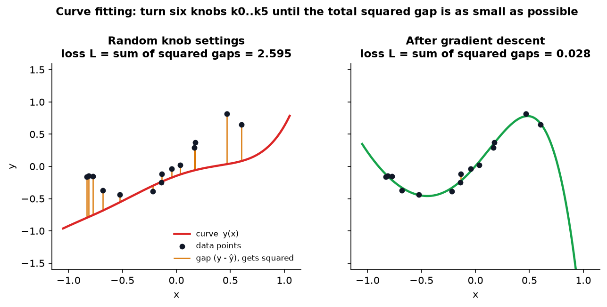

*Left: random coefficients give a bad curve. The orange lines are the gaps between the data and the curve, and the loss is the sum of their squares. Right: after gradient descent the loss dropped from 2.6 to 0.03. (Outside the data, at x > 0.7, the curve does whatever it likes. That's a preview of **overfitting**.)*

We have points $(x, y)$ and want a curve that describes them. Infinitely many curves could work, so we **make an assumption**: the curve is a degree-5 polynomial.

$$y(x) = k_0 + k_1 x + k_2 x^2 + k_3 x^3 + k_4 x^4 + k_5 x^5$$

Fitting now means finding the six numbers $k_0 \dots k_5$. Picking the *form* of the model before learning its numbers is exactly what we do with neural networks too. Choosing "a transformer with 12 layers" is the same kind of assumption as "a degree-5 polynomial".

### 3.1 Measuring "best fit": the loss

"Looks good" isn't something a computer can optimize. We need **one number**:

$$L(k_0,\dots,k_5) = \sum_{i=1}^{N} \big(y_i - \hat y_i\big)^2, \qquad \hat y_i = y(x_i)$$

Keep these two functions apart. People mix them up all the time:

| | Input | Output | Question it answers |
|---|---|---|---|
| **Model** $y(x)$ | one $x$ | one prediction $\hat y$ | "What do I predict here?" |
| **Loss** $L(k)$ | all 6 knobs | one number | "How bad are these knob settings?" |

**Why squared?** Squares are always positive, so errors above and below the curve can't cancel out. Squares punish big misses much more than small ones. And a square has a simple derivative ($2 \times$ the error). In engineering you'll also see *absolute error* (robust to outliers), *cross-entropy* (for classification and for LLMs predicting the next token), and many others. They all play the same role.

### 3.2 The "Curve Fitter 6000"

Picture a machine with **six knobs** and a display showing the loss.

**Naive strategy (random perturbation):** wiggle one knob, check whether the loss went down, keep or undo the change, and repeat forever. It works, but you're *wandering in the dark*: you only find out afterwards whether a move helped.

**What we want:** a small screen next to every knob that says, **before you touch it**, *"turn me left, a lot"* or *"turn me right, a little"*. That sounds like seeing the future. It's just calculus.

---

## 4. Derivatives: seeing which way is downhill

### 4.1 One knob at a time

Freeze five knobs and leave only $k_1$ free. Now the loss is an ordinary curve $L(k_1)$. The catch is that **you can't see the whole curve**. You can only evaluate it at the point you're currently at. What you'd really like to know is: *is it going up or down right here?*

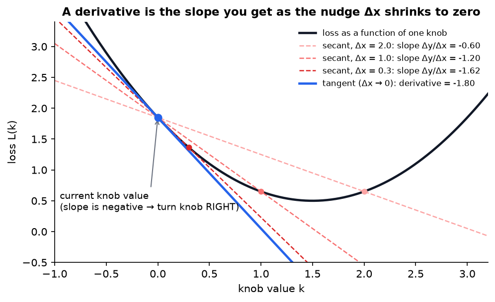

*Nudge the knob by $\Delta x$ and measure how much the loss changes, $\Delta y$. The ratio $\Delta y/\Delta x$ is the slope of a **secant** line (dashed). As $\Delta x$ shrinks (2.0 → 1.0 → 0.3), the secant slope (−0.60 → −1.20 → −1.62) approaches the slope of the **tangent** line (−1.80). That limit is the derivative.*

$$\frac{dL}{dk} = \lim_{\Delta k \to 0} \frac{L(k+\Delta k) - L(k)}{\Delta k}$$

**How to read that out loud:** "nudge the knob by a tiny amount $\Delta k$, see how much the loss changed, and divide one by the other — then imagine the nudge getting smaller and smaller." The answer that ratio settles on is the derivative. $\lim$ just means "the value it settles on".

- **Derivative < 0**: the loss goes *down* if you increase $k$, so turn the knob **right**.
- **Derivative > 0**: the loss goes *up* if you increase $k$, so turn it **left**.
- **Derivative = 0**: flat tangent, so you're at a bottom (or a top, or a flat plateau).
- **Its size** tells you how steep the slope is, which is a hint about how far you are from the bottom.

The derivative is itself a *function*: every point has its own steepness. (It doesn't exist at sharp corners. That's why ReLU's kink at 0 needs a convention in practice, and frameworks simply pick 0.)

### 4.2 Gradient descent in one dimension

1. Start somewhere random.
2. Compute the derivative at that point.
3. Step **against** it: $k \leftarrow k - \eta \cdot \dfrac{dL}{dk}$.
4. Repeat until the slope is (almost) zero.

**How to read that out loud:** "the new knob value is the old one, minus a small fraction of the slope." The arrow ← means "replace with". The minus sign is what makes it go *downhill* instead of up.

$\eta$ (eta, a Greek letter used the way you'd use a variable name) is the **learning rate**. It's the single most important setting in all of deep learning.

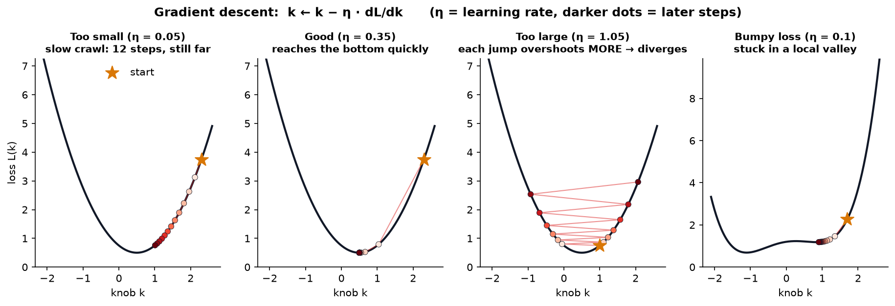

*The same algorithm with four settings. **Too small:** safe but painfully slow. **Good:** fast. **Too large:** every step overshoots the bottom by more than the last, and training **diverges** (in real life the loss becomes `NaN`). **Bumpy loss:** gradient descent only sees the local slope, so it settles into the nearest valley, which might not be the deepest one.*

> **Engineering reality.** When a training run "blows up" and the loss turns into NaN, the learning rate being too high is the first suspect. That's why LLM training uses a **warm-up** (start with a tiny η and ramp up) followed by a **decay** schedule.

### 4.3 Many knobs: partial derivatives and the gradient

With two free knobs the loss is a **surface**, like a landscape. A **partial derivative** $\partial L/\partial k_1$ is the slope when you walk parallel to the $k_1$ axis and hold $k_2$ fixed.

Stack all the partial derivatives into one vector and you get the **gradient**:

$$\nabla L = \left(\frac{\partial L}{\partial k_0}, \frac{\partial L}{\partial k_1}, \dots, \frac{\partial L}{\partial k_5}\right)$$

**The key fact:** the gradient points in the direction of **steepest ascent**. So $-\nabla L$ is steepest descent.

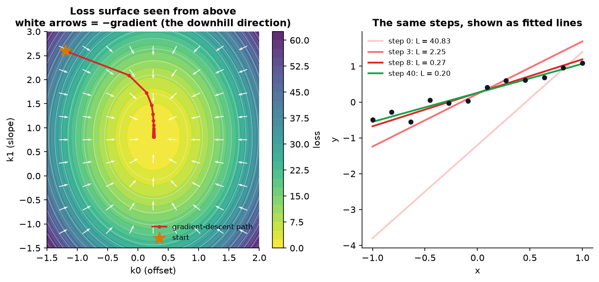

*Left: a real loss surface for fitting a line (knobs: offset and slope), seen from above like a contour map. The white arrows show $-\nabla L$ at many points, and they all point downhill, perpendicular to the contour lines. The red path is gradient descent. Right: the same steps drawn as lines. The loss drops from 40.8 to 0.20 in 40 steps.*

With 6 knobs you can't draw the surface (it lives in 7 dimensions), but **the math is identical**. A 70-billion-parameter LLM has a gradient with 70 billion components, and the update rule is still just

$$\boxed{\;k \leftarrow k - \eta \, \nabla L(k)\;}$$

**Back to the knob machine:** the "screens next to each knob" are simply the components of the gradient.

So the real question becomes: **how do we compute the gradient efficiently?** That's what backpropagation does.

---

## 5. The chain rule: how derivatives flow through a chain

### 5.1 Building blocks

A few simple functions have derivatives you can look up:

| Function | Derivative | Used in ML as |
|---|---|---|
| $a \cdot x + b$ | $a$ | linear layers |
| $x^n$ | $n x^{n-1}$ | squared error |
| $e^x$ | $e^x$ | softmax |
| $\ln x$ | $1/x$ | cross-entropy loss |
| $\tanh x$ | $1 - \tanh^2 x$ | activation |
| $\max(0,x)$ (ReLU) | $1$ if $x>0$, else $0$ | the most common activation |

And rules for combining them:

- **Sum rule:** $(f+g)' = f' + g'$.
- **Product rule:** $(f\cdot g)' = f' g + f g'$. For example, $\frac{d}{dx}\big(x^2 e^x\big) = 2x\,e^x + x^2 e^x$. *(The first version of these notes used $3x^2 - e^x$ as the example, but that's a difference, which is handled by the sum rule, not the product rule.)*
- **Chain rule:** the important one, below.

### 5.2 The chain rule

Feed $x$ into machine $j$, then feed its output into machine $f$. How does a nudge to $x$ affect the final output?

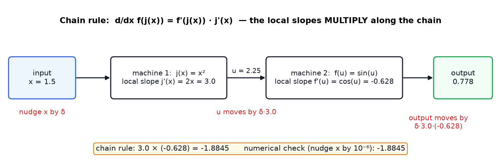

*Nudge $x$ by a tiny $\delta$. Machine 1 scales the nudge by its local slope ($j'(1.5) = 3$). That scaled nudge is the input to machine 2, which scales it again by **its** local slope evaluated at **its** input ($\cos 2.25 = -0.628$). Total effect: $3 \times (-0.628) = -1.8845$. The numerical check gives the same value.*

$$\frac{d}{dx} f\big(j(x)\big) = f'\big(j(x)\big) \cdot j'(x)$$

**Picture it as gears:** turn the first gear and the middle gear turns $j'$ times as much. The middle gear turns the last one $f'$ times as much. The ratios **multiply**.

This scales to any length: for $f_n(\dots f_2(f_1(x)))$ the derivative is the **product of all the local slopes along the chain**. A 100-layer network is a chain of 100 such machines.

---

## 6. Computational graphs: backprop, one node at a time

### 6.1 The forward pass

Break the loss calculation into atomic steps and draw them as a graph: each node does one simple operation, and values flow left to right. This is the **forward pass**.

### 6.2 Three local rules are all you need

Going **backward**, each node receives $\partial L/\partial(\text{its output})$ from the right and must pass $\partial L/\partial(\text{each input})$ to the left. It only needs its own inputs and that one incoming number. **Everything is local.**

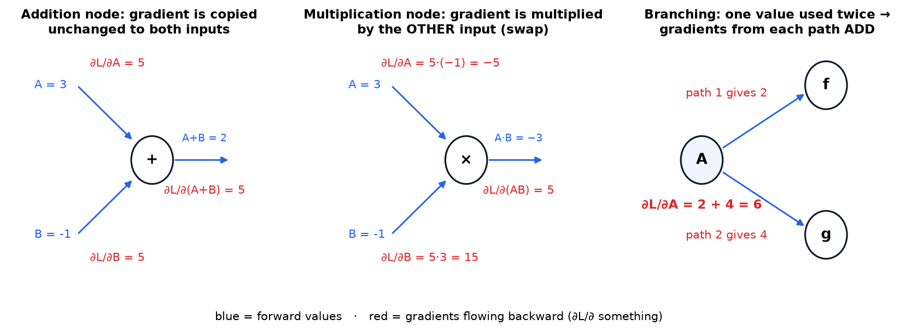

| Node | Forward | Backward rule | Intuition |
|---|---|---|---|
| **Add** $A+B$ | sum | both inputs get $\frac{\partial L}{\partial (A+B)}$ **unchanged** | nudge $A$ by 1 and the sum moves by exactly 1 |
| **Multiply** $A\cdot B$ | product | $A$ gets gradient $\times B$, and $B$ gets gradient $\times A$ (**swap**) | nudge $A$ by 1 and the product moves by $B$ |
| **Branch** (value used twice) | copy | gradients from every use **add up** | $A$ affects the loss through several paths at once |

Rules for `x²`, `exp`, `tanh` and the others follow the same way from the table in §5.1.

### 6.3 A fully worked example

One data point $(x=2, y=3)$, a line $\hat y = k_0 + k_1 x$ with $k_0=1$ and $k_1=0.5$, and loss $L = (y-\hat y)^2$.

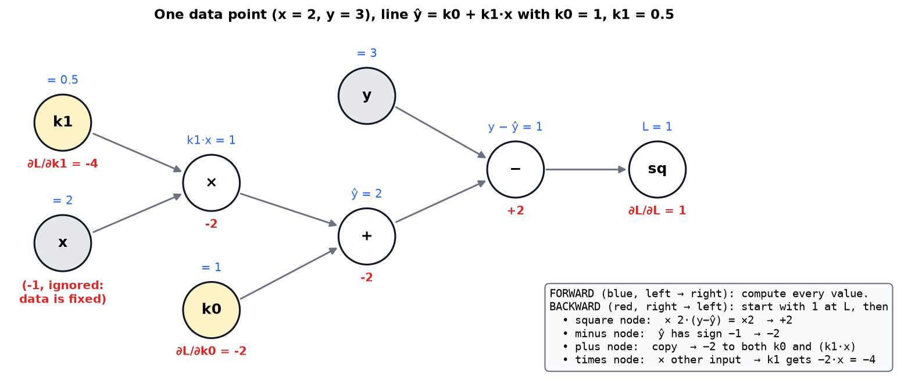

**Forward (blue):** $k_1 x = 1$, $\;\hat y = 2$, $\;y-\hat y = 1$, $\;L = 1$.

**Backward (red), right to left:**

| Step | Node | Rule | Gradient |
|---|---|---|---|
| 1 | $L$ | start | $\partial L/\partial L = 1$ |
| 2 | square | power rule: $2(y-\hat y)$ | $1 \times 2 \times 1 = +2$ |
| 3 | minus | $\hat y$ enters with sign $-1$ | $\partial L/\partial \hat y = -2$ |
| 4 | plus | copy to both inputs | $\partial L/\partial k_0 = -2$, $\;\partial L/\partial(k_1x) = -2$ |
| 5 | times | multiply by the *other* input | $\partial L/\partial k_1 = -2 \times x = \mathbf{-4}$ |

**Reading the result:** both gradients are negative, so *increasing* $k_0$ and $k_1$ lowers the loss. That makes sense: we predicted 2 but the answer is 3, so the line should go up. $k_1$ gets twice the push of $k_0$ because it's multiplied by $x = 2$: changing the slope has twice the effect at this point.

**Check by hand:** $L = (3 - k_0 - 2k_1)^2$, so $\partial L/\partial k_1 = 2(3-k_0-2k_1)(-2) = 2(1)(-2) = -4$. ✓

The **data nodes** ($x$, $y$) get gradients too, but we ignore them because data isn't adjustable. (In **adversarial attacks**, people do the opposite: they freeze the weights and use the gradient with respect to the *input image* to find tiny pixel changes that fool a classifier.)

---

## 7. The training loop

$$\text{forward (compute } L\text{)} \;\rightarrow\; \text{backward (compute } \nabla L\text{)} \;\rightarrow\; k \leftarrow k - \eta \nabla L \;\rightarrow\; \text{repeat}$$

Once the knobs move, the old gradients are **stale**, because they described a place you've left. So you recompute everything every step.

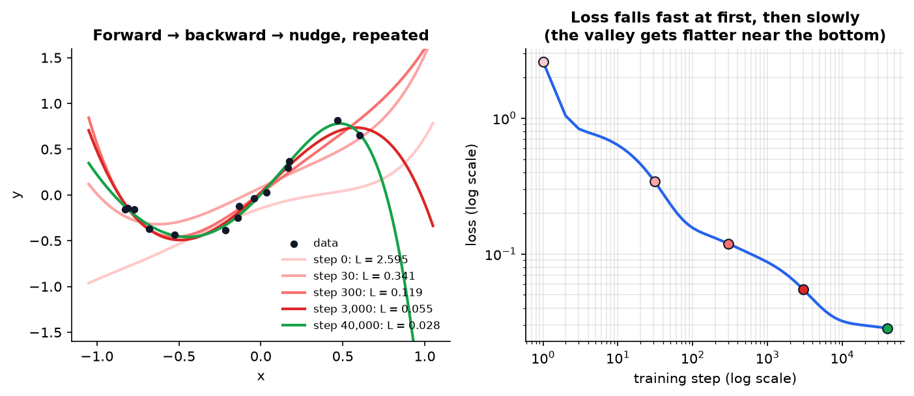

*The real run of the polynomial fit from §3. Left: the curve after 0, 30, 300, 3,000 and 40,000 steps. Right: the loss on log-log axes. Most of the improvement happens early. Near the bottom the valley is almost flat, the gradients are tiny, and progress crawls. That's why real training uses smarter optimizers such as momentum and Adam.*

In real ML the loop has one more ingredient: **mini-batches**. Instead of computing the loss over *all* the data each step, you use a random handful (say 1,024 examples). The gradient is noisy but ~1000× cheaper. This is **stochastic gradient descent (SGD)**, and the noise even helps it escape poor valleys.

---

## 8. From curve fitting to neural networks

A neural network is **the same kind of graph**, just bigger. Each layer computes

$$\mathbf{z} = W\mathbf{h}_{\text{prev}} + \mathbf{b}, \qquad \mathbf{h} = \sigma(\mathbf{z})$$

which is multiplications and additions (matrix $W$), followed by a nonlinearity $\sigma$ (tanh, ReLU...).

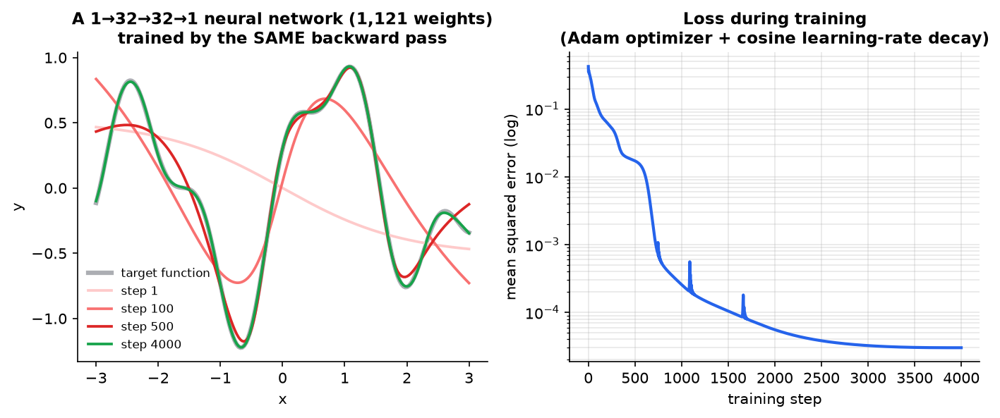

*A network with two hidden layers of 32 units (1,121 parameters), trained with the exact backward pass described above, fitting a wiggly function. The polynomial couldn't do this. The network can, because stacked nonlinear layers can approximate essentially any function (the **universal approximation theorem**).*

### 8.1 Backprop in matrix form (what PyTorch actually does)

Write $\boldsymbol{\delta} = \partial L/\partial \mathbf{z}$ for a layer. Applying the three node rules to whole matrices gives:

$$\frac{\partial L}{\partial W} = \boldsymbol{\delta}\,\mathbf{h}_{\text{prev}}^{\top} \qquad \frac{\partial L}{\partial \mathbf{b}} = \boldsymbol{\delta} \qquad \frac{\partial L}{\partial \mathbf{h}_{\text{prev}}} = W^{\top}\boldsymbol{\delta} \qquad \boldsymbol{\delta}_{\text{prev}} = \big(W^{\top}\boldsymbol{\delta}\big) \odot \sigma'(\mathbf{z}_{\text{prev}})$$

**Don't be put off by the symbols.** $\boldsymbol\delta$ ("delta") is just a name for "the error signal that arrived at this layer". $W^\top$ means the weight table flipped on its side (rows become columns), which is how you send a signal *backwards* through the same connections. $\odot$ means "multiply the two lists position by position" (first with first, second with second). $\sigma'$ is the local slope of the activation function.

What each one means:

- **Weight gradient** = (error arriving at this layer) × (input to this layer). That's the multiply rule, done for every connection at once.
- **Error sent backward** = the error pushed back through the **transpose** of the same weights, then scaled by each unit's local slope $\sigma'$ (the chain rule).
- $\odot$ means element-wise multiplication.

Notice the backward pass reuses $W$ **and** the stored forward values $\mathbf{h}$, $\mathbf{z}$. Both facts have big consequences: see §10.1 (memory) and [the predictive coding guide](Predictive%20Coding%20-%20How%20the%20Brain%20May%20Learn%20Instead.md) §8.1 (why brains can't do this).

---

## 9. Why backprop is so efficient (and why that changed the world)

Here's the naive alternative: to get $\partial L/\partial k_i$, nudge **each knob separately** and re-run the model. This is called **finite differences**. With $N$ parameters that's $N+1$ forward passes **per gradient**.

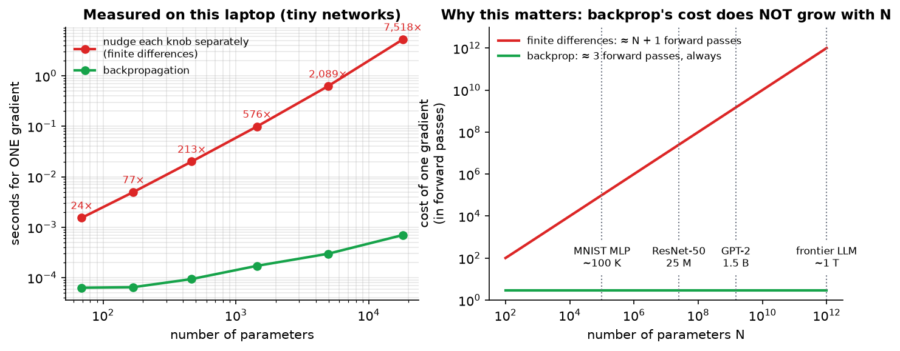

*Left: measured on real (tiny) networks. With 18,000 parameters, backprop is already about 6,500× faster, and the gap grows linearly. Right: the same comparison for real models. For GPT-2 (1.5 B parameters), finite differences would need 1.5 billion forward passes for **one** training step. Backprop needs the equivalent of about 3, whatever the model size.*

**Why it's so cheap:** every parameter's gradient shares the same downstream path back to the loss. Backprop computes that shared part **once** and hands it back layer by layer. The general technique is called **reverse-mode automatic differentiation**.

| Method | Cost of one full gradient | Exact? | Used for |
|---|---|---|---|
| Finite differences | $N+1$ forward passes | approximate | **checking** gradients (§10.4) |
| Symbolic differentiation (Mathematica-style) | expressions blow up in size | exact | math software |
| Forward-mode autodiff | $N$ passes (one per input) | exact | few inputs, many outputs (physics sims) |
| **Reverse-mode autodiff = backprop** | **≈ 2–3 forward passes** | exact | **one output (the loss), many inputs (the weights)** |

**The impact:** without this constant-cost property, training anything beyond a few thousand parameters would be impossible. Every model with millions to trillions of parameters depends on it.

---

## 10. Backprop in real engineering: problems and fixes

### 10.1 Memory: you have to store the forward pass

The backward pass needs the forward values ($\mathbf{h}$, $\mathbf{z}$) of **every layer**, so they must be kept in memory until the backward pass reaches them. For large models these **activations** often take **more GPU memory than the weights**.

| Fix | Idea | Trade-off |
|---|---|---|
| **Activation (gradient) checkpointing** | keep only some layers' activations and recompute the rest during the backward pass | ~30% more compute for much less memory |
| **Mixed precision (FP16/BF16)** | store numbers in 16 bits instead of 32 | about half the memory, needs care with tiny gradients |
| **Smaller micro-batches + gradient accumulation** | add up the gradients of several small batches before one update | slower wall-clock |

### 10.2 Vanishing and exploding gradients

The chain rule **multiplies** local slopes. Multiply 20 numbers that are each ≤ 0.25 (the sigmoid's maximum slope) and the result is essentially zero.

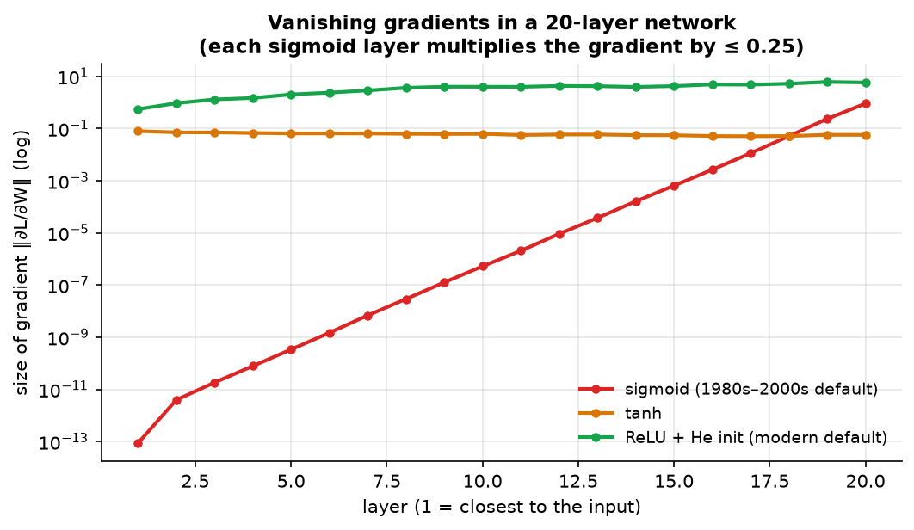

*A real 20-layer network. With sigmoid, the gradient reaching layer 1 is about **10¹³× smaller** than at the top, so the early layers basically never learn. That's why deep networks were considered untrainable before about 2010. ReLU with proper initialization keeps the gradient size roughly constant.*

If the local factors are > 1, the opposite happens: gradients **explode** and training blows up.

| Fix | Year | How it helps |
|---|---|---|
| **ReLU** activation | 2010–12 | slope is exactly 1 for active units, so there's no shrinking |
| **Careful initialization** (Xavier/Glorot, He) | 2010, 2015 | scales weights so signals keep the same size across layers |
| **Residual connections** (ResNet) | 2015 | $\mathbf{h}_{l+1} = \mathbf{h}_l + F(\mathbf{h}_l)$: the "+" node copies gradients straight through, giving them a highway. Every transformer uses this |
| **Normalization** (BatchNorm, LayerNorm) | 2015–16 | keeps activations in a healthy range |
| **LSTM / gated units** | 1997 | the same highway idea, applied through time in recurrent networks |
| **Gradient clipping** | — | if $\lVert\nabla L\rVert$ is too big, scale it down. Standard in LLM training |

Look at residual connections: the "add node copies the gradient unchanged" rule from §6.2 is the whole reason they work. The humble addition rule underpins every modern deep architecture.

### 10.3 Autograd: nobody writes the backward pass by hand anymore

PyTorch, JAX and TensorFlow record every operation during the forward pass (building the graph on the fly), then walk it backward:

```python
import torch
k = torch.randn(6, requires_grad=True)       # knobs that need gradients
loss = ((y - sum(k[p] * x**p for p in range(6)))**2).sum()   # forward: graph recorded
loss.backward()                              # backward: every k.grad filled in
with torch.no_grad():
    k -= 0.01 * k.grad                       # the nudge
    k.grad.zero_()                           # reset, or gradients accumulate (the += from the branch rule!)
```

That `.zero_()` exists because of the **branch rule**: gradients *add up*, so if you forget to reset them, gradients from the previous step leak into this one. It's a classic beginner bug.

### 10.4 Gradient checking

If you implement a custom operation, compare backprop against finite differences on a tiny example:

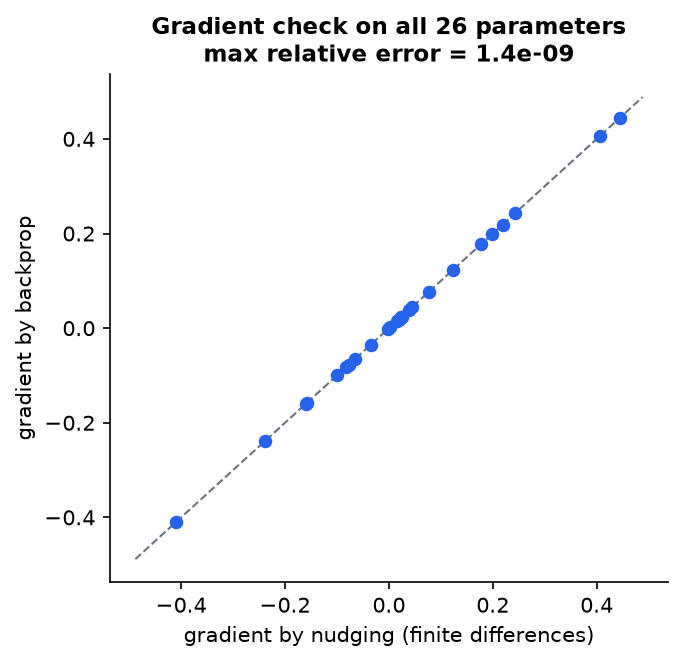

*Backprop gradients vs finite-difference gradients for all 26 parameters of a small network. They agree to about 1 part in a billion. A relative error above ~10⁻⁴ usually means a bug.*

### 10.5 Scaling out: backprop on thousands of GPUs

Gradients from different mini-batches simply **add up** (the branch rule again). So large training runs split the batch across many GPUs, run forward and backward on each in parallel, then **average the gradients** (an operation called *all-reduce*) before the shared update. This is **data parallelism**. Models too big for one GPU also split the *layers* across GPUs (**pipeline and tensor parallelism**), passing activations forward and gradients backward between machines.

### 10.6 Is any of this out of date? (checked September 2026)

Backpropagation is one of the few things in machine learning you can learn once and keep. The core — chain rule, reverse-mode, three node rules, ~2–3× the cost of a forward pass — is unchanged since 1970 and unchanged in every framework today. What moves around it:

| Still exactly true | What has moved since 2024 |
|---|---|
| One gradient ≈ 2–3 forward passes, whatever the model size | Model sizes: frontier models are now mixtures-of-experts in the hundreds of billions to trillions of parameters, where only a few percent of weights are active per token — so the *active* cost per step is much smaller than the parameter count suggests |
| Activations dominate training memory | Checkpointing is now automatic in most frameworks, and **FP8** training (used for DeepSeek-V3 onward) has joined FP16/BF16 as a standard memory saver |
| Residual connections + normalization keep gradients healthy | Still the universal recipe. No replacement has displaced it |
| Gradient clipping and warm-up are standard in LLM training | Learning-rate practice has shifted toward **µP-style width-scaling rules**, so a schedule tuned on a small model transfers to a big one |
| Backprop is the only method proven at frontier scale | Local, biologically-plausible alternatives have made real progress on *depth* — see [the predictive coding guide](Predictive%20Coding%20-%20How%20the%20Brain%20May%20Learn%20Instead.md) §11.4 — but none trains a frontier model yet |

So: if you learn this chapter properly, none of it expires.

---

## 11. Real-world applications and impact

| Area | What gets backpropagated | Example |
|---|---|---|
| **Large language models** | cross-entropy loss on next-token prediction, through ~100 transformer layers | GPT, Claude, Llama, DeepSeek |
| **Image generation** | denoising loss through a U-Net or transformer | Stable Diffusion, Midjourney |
| **Science** | structure loss through a protein network | AlphaFold (2024 Nobel Prize in Chemistry) |
| **Autonomous driving** | detection and segmentation losses through vision networks | Tesla, Waymo perception |
| **Recommendations** | click-prediction loss through huge embedding tables | YouTube, TikTok, Amazon |
| **Speech** | CTC / sequence losses | Whisper, voice assistants |
| **Robotics / RL** | policy-gradient losses | robot control, AlphaGo's networks |
| **Differentiable physics & engineering design** | loss through a *simulator* | optimizing airfoil shapes, lens design, chip placement |
| **Adversarial robustness** | gradient with respect to the **input** | crafting and defending against adversarial examples |
| **Interpretability** | gradient of an output with respect to input pixels or tokens | saliency maps ("which pixels mattered?") |

**The big idea for an engineer:** if you can write something as a program built from differentiable pieces, you can **optimize it with gradients**. That includes neural nets, but also rendering (differentiable rendering), physics, and control systems. This way of thinking is sometimes called *differentiable programming*.

---

## 12. Code: build your own autograd engine (60 lines, tested)

Saved as [`code/backprop_micrograd.py`](../code/backprop_micrograd.py). It's in the spirit of Andrej Karpathy's *micrograd*. Every rule from §6.2 is marked in the code.

```python
import math, random

class Value:
    """A number that remembers how it was computed, so it can backpropagate."""
    def __init__(self, data, parents=(), op=""):
        self.data, self.grad = data, 0.0
        self._parents, self._op = parents, op
        self._backward = lambda: None

    def __add__(self, other):
        other = other if isinstance(other, Value) else Value(other)
        out = Value(self.data + other.data, (self, other), "+")
        def _backward():                 # ADD rule: copy the gradient
            self.grad += out.grad
            other.grad += out.grad       # += handles branching (gradients add up)
        out._backward = _backward
        return out

    def __mul__(self, other):
        other = other if isinstance(other, Value) else Value(other)
        out = Value(self.data * other.data, (self, other), "*")
        def _backward():                 # MULTIPLY rule: swap the inputs
            self.grad += other.data * out.grad
            other.grad += self.data * out.grad
        out._backward = _backward
        return out

    def __pow__(self, n):                # n is a plain number
        out = Value(self.data ** n, (self,), f"**{n}")
        def _backward():                 # power rule
            self.grad += n * self.data ** (n - 1) * out.grad
        out._backward = _backward
        return out

    def __neg__(self): return self * -1
    def __sub__(self, other): return self + (-other)
    def __rsub__(self, other): return (-self) + other
    __radd__, __rmul__ = __add__, __mul__

    def backward(self):
        order, seen = [], set()
        def visit(v):                    # topological sort: children before parents
            if v not in seen:
                seen.add(v)
                for p in v._parents: visit(p)
                order.append(v)
        visit(self)
        self.grad = 1.0                  # dL/dL = 1
        for v in reversed(order):        # walk the graph backward
            v._backward()

# --- 1. Reproduce the worked example of section 6.3: x=2, y=3, k0=1, k1=0.5
k0, k1 = Value(1.0), Value(0.5)
L = (3.0 - (k0 + k1 * 2.0)) ** 2
L.backward()
print(f"L = {L.data},  dL/dk0 = {k0.grad},  dL/dk1 = {k1.grad}")   # 1.0, -2.0, -4.0

# --- 2. Fit a degree-5 polynomial with gradient descent
random.seed(0)
xs = [i / 10 - 1 for i in range(21)]
ys = [0.6 * math.sin(3.2 * x) + 0.3 * x * x for x in xs]
k = [Value(random.uniform(-0.5, 0.5)) for _ in range(6)]

for step in range(3001):
    loss = sum(((sum(k[p] * x ** p for p in range(6)) - y) ** 2 for x, y in zip(xs, ys)), Value(0.0))
    for kp in k: kp.grad = 0.0           # 1. reset old gradients
    loss.backward()                      # 2. backward pass
    for kp in k: kp.data -= 0.01 * kp.grad   # 3. nudge every knob downhill
    if step % 1000 == 0:
        print(f"step {step:4d}   loss {loss.data:.4f}")
```

**Actual output:**

```
L = 1.0,  dL/dk0 = -2.0,  dL/dk1 = -4.0
step    0   loss 3.7434
step 1000   loss 0.0863
step 2000   loss 0.0436
step 3000   loss 0.0221
```

**Try this:** (1) change the learning rate to `0.05` and watch it diverge. (2) Delete the `kp.grad = 0.0` line and see what happens. (3) Add a `tanh` method with the backward rule $1-\tanh^2$ and build a neuron.

---

## 13. Common misconceptions

| Misconception | Reality |
|---|---|
| "Backprop is the learning algorithm" | Backprop only **computes gradients**. The *optimizer* (SGD, Adam) uses them to update the weights |
| "Gradient descent finds the best solution" | It finds a **nearby valley**. In huge networks most valleys turn out to be good enough, which is an empirical surprise |
| "Backprop needs a neural network" | It works on **any** differentiable program |
| "The gradient tells you how far to go" | It tells you the direction and *local* steepness. The step size is your choice (η) |
| "Backward is much more expensive than forward" | It's roughly **2× a forward pass**. The real cost is *memory* for the stored activations |
| "Gradients with respect to the data are useless" | They power adversarial attacks, saliency maps and style transfer |

---

## 14. Self-quiz

<details><summary><b>Q1 (easy).</b> What's the difference between the model y(x) and the loss L(k)?</summary>

The model maps one input $x$ to one prediction, with the knobs fixed. The loss maps a whole *set of knob values* to one number measuring how badly the model fits all the data. We minimize the loss *over the knobs*.
</details>

<details><summary><b>Q2 (easy).</b> At some point, ∂L/∂k₃ = +5. Which way should k₃ move?</summary>

Down (decrease it). A positive derivative means increasing $k_3$ increases the loss.
</details>

<details><summary><b>Q3 (medium).</b> An add node receives gradient 7 from above. What do its two inputs receive? What if it's a multiply node with inputs 2 and −3?</summary>

Add: both get 7. Multiply: the input that was 2 gets $7 \times (-3) = -21$, and the input that was −3 gets $7 \times 2 = 14$.
</details>

<details><summary><b>Q4 (medium).</b> Redo the worked example with y = 5 instead of 3. What are ∂L/∂k₀ and ∂L/∂k₁?</summary>

$\hat y = 2$, error $= 3$, $L = 9$. Square node: $2 \times 3 = 6$. Minus: $-6$. Plus: $\partial L/\partial k_0 = -6$. Times: $\partial L/\partial k_1 = -6 \times 2 = -12$. A bigger error means bigger gradients.
</details>

<details><summary><b>Q5 (medium).</b> Why must gradients be reset to zero before each backward pass in PyTorch?</summary>

Because of the branch rule, `.grad` *accumulates* (`+=`). Without a reset, the new gradient gets added to the old one from the previous step.
</details>

<details><summary><b>Q6 (medium).</b> A model has 10 million parameters. Roughly how many forward passes does one gradient cost with finite differences, and with backprop?</summary>

Finite differences: about 10,000,001. Backprop: about 2–3 forward-pass equivalents.
</details>

<details><summary><b>Q7 (hard).</b> Why do sigmoid networks with 20 layers barely learn in their early layers? Name two fixes.</summary>

The chain rule multiplies one local slope per layer, and the sigmoid's slope is at most 0.25, so after 20 layers the gradient shrinks by up to $0.25^{20} \approx 10^{-12}$. Fixes: ReLU, residual connections, normalization, and proper initialization.
</details>

<details><summary><b>Q8 (hard).</b> Why do residual connections (h + F(h)) help gradients flow?</summary>

The "+" node passes its incoming gradient **unchanged** to its input $h$. So there's always a direct path back to earlier layers that isn't multiplied by possibly tiny local slopes.
</details>

<details><summary><b>Q9 (hard).</b> What uses the most GPU memory during training besides the weights, and why does backprop need it?</summary>

The stored activations from the forward pass. The backward rules need them, because the multiply rule uses "the other input", which is a forward value. Activation checkpointing trades extra compute for less of this memory.
</details>

<details><summary><b>Q10 (hard).</b> Where is the gradient with respect to the INPUT (not the weights) useful?</summary>

Adversarial examples (find the smallest change to an image that flips the prediction), saliency maps (which pixels or tokens mattered most), and style transfer or DeepDream (optimize the image itself).
</details>

---

## 15. Glossary

| Term | Meaning |
|---|---|
| **Parameter / weight / knob** | A number the model learns |
| **Loss** | One number measuring how wrong the model is |
| **Derivative** | Local slope: how much the output changes per unit of input change |
| **Partial derivative** | Slope with respect to one input while holding the others fixed |
| **Gradient** $\nabla L$ | Vector of all partial derivatives; points uphill |
| **Gradient descent** | Repeatedly step against the gradient |
| **Learning rate** η | Step size multiplier |
| **Chain rule** | Derivative of a composition = product of the local derivatives |
| **Computational graph** | The calculation drawn as nodes (operations) and edges (values) |
| **Forward pass** | Compute the values from inputs to the loss |
| **Backward pass** | Compute the gradients from the loss back to the inputs |
| **Backpropagation** | Reverse-mode automatic differentiation applied to a model |
| **Autograd** | A framework feature that builds the graph and runs backprop automatically |
| **SGD / mini-batch** | Gradient descent using a random subset of the data each step |
| **Adam** | A popular optimizer that adapts the step size for each parameter |
| **Vanishing / exploding gradients** | Gradients shrinking to 0, or growing huge, through many layers |
| **Residual connection** | $h + F(h)$; gives gradients a direct path |
| **Activation checkpointing** | Recompute activations in the backward pass to save memory |
| **Finite differences** | Approximating a derivative by actually nudging the input |

---

## 16. Further reading (easiest first)

1. **3Blue1Brown**, *Neural Networks* series, chapters 3–4 (YouTube). Visual intuition for backprop.
2. **Andrej Karpathy**, *The spelled-out intro to neural networks and backpropagation: building micrograd* (YouTube). Builds §12 step by step.
3. **Michael Nielsen**, *Neural Networks and Deep Learning*, chapter 2 (free online). The four backprop equations derived carefully.
4. **Christopher Olah**, *Calculus on Computational Graphs: Backpropagation* (colah.github.io). Forward vs reverse mode explained visually.
5. **Rumelhart, Hinton & Williams (1986)**, *Learning representations by back-propagating errors*, Nature 323. The classic.
6. **Baydin et al. (2018)**, *Automatic differentiation in machine learning: a survey*, JMLR.
7. **He et al. (2015)**, *Deep Residual Learning for Image Recognition*. Why residual connections fixed deep training.

---

*Source video: [The Most Important Algorithm in Machine Learning](https://youtu.be/SmZmBKc7Lrs?si=ktQHq8JMCmJ1AAFH) by Artem Kirsanov. All figures were generated for this guide by `figures/backprop/make_figs.py`; every data plot comes from actually running the algorithms described.*
