# Cellular Networks: Architecture, Frequency Reuse, Handoff, and GSM — Learning Guide

> **Syllabus & Course Reference:** Strictly derived from [`academics/mpc/celluler_network.pdf`](file:///c:/PROJECTS/Learnmat/academics/mpc/celluler_network.pdf) (Mobile and Pervasive Computing). 
> This guide covers 100% of the theory, network architectures, mathematical formulations, call flows, and engineering trade-offs presented in the course slides, structured for intuitive understanding and conceptual clarity with zero information loss.

---

## Contents

1. [The Cellular Concept & Foundational Motivation](#1-the-cellular-concept--foundational-motivation)
2. [Network Architecture & System Terminology](#2-network-architecture--system-terminology)
3. [Call Procedures: Origination, Paging & In-Call Management](#3-call-procedures-origination-paging--in-call-management)
4. [Cell Geometry: Why Hexagonal Footprints?](#4-cell-geometry-why-hexagonal-footprints)
5. [Frequency Reuse & Co-Channel Cell Geometry](#5-frequency-reuse--co-channel-cell-geometry)
6. [Cell Design & Total System Capacity](#6-cell-design--total-system-capacity)
7. [Co-Channel Interference & Co-Channel Reuse Ratio ($Q$)](#7-co-channel-interference--co-channel-reuse-ratio-q)
8. [Handoff Strategies & Signal Threshold Margins](#8-handoff-strategies--signal-threshold-margins)
9. [Signal Monitoring & Generational Handoff Evolution (1G vs. 2G MAHO)](#9-signal-monitoring--generational-handoff-evolution-1g-vs-2g-maho)
10. [Roaming & Handoff Prioritization Strategies](#10-roaming--handoff-prioritization-strategies)
11. [Practical Handoff Constraints: Umbrella Cells & Cell Dragging](#11-practical-handoff-constraints-umbrella-cells--cell-dragging)
12. [GSM Architecture, Services & Subsystems (BSS, NSS, OSS)](#12-gsm-architecture-services--subsystems-bss-nss-oss)
13. [GPRS (General Packet Radio Service)](#13-gprs-general-packet-radio-service)

---

## 1. The Cellular Concept & Foundational Motivation

### 1.1 The Spectral Bottleneck
Mobile communication relies on radio frequencies, which are strictly finite natural resources governed by government regulatory agencies (such as the FCC or ITU). As public demand for mobile telephony skyrocketed, regulatory bodies **could not simply allocate new spectrum in proportion to demand**.

Traditional mobile telephone networks suffered from a fundamental engineering bottleneck:
- They relied on a **single high-power transmitter** mounted on a very tall central tower to cover an entire city (a single cell with a radius of $50\text{ km}$ or more).
- Because a high-power signal blankets the entire metropolitan region, those frequencies cannot be reused anywhere nearby without causing destructive interference.
- As a result, the entire city could only support **a few dozen simultaneous conversations** across the entire allocated band.

Restructuring the mobile telephone system became an imperative to achieve three simultaneous objectives:
1. **High system capacity** (supporting tens of thousands of concurrent users).
2. **Limited radio spectrum** (operating inside narrow, fixed regulatory bands).
3. **Large coverage area** (blanketing entire metropolitan areas and highway networks).

---

### 1.2 The Breakthrough: Low-Power Distributed Cells
The **cellular concept** solved both spectral congestion and user capacity limitations through a simple paradigm shift:

$$\text{Replace } \mathbf{1} \text{ high-power transmitter (large cell)} \longrightarrow \text{Deploy } \mathbf{\text{many}} \text{ low-power transmitters (small cells).}$$

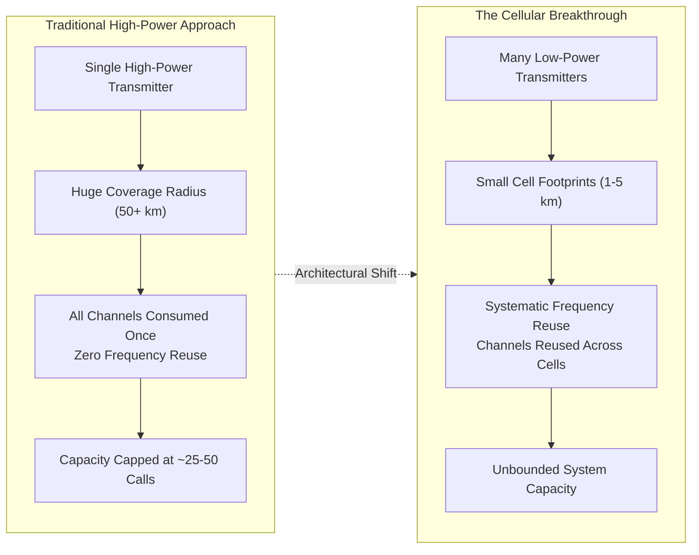

**How It Works:**
- Each base station transmitter transmits at low power, providing coverage to only a **small portion of the total service area** (a cell).
- Because low-power signals attenuate rapidly over distance due to natural propagation path loss, the same set of radio frequencies can be safely assigned to other cells located a sufficient distance away.
- **The Key Insight:** To increase capacity in a cellular network, you do not need more spectrum from the government. You simply divide large cells into smaller cells and reuse the same frequencies more times across the geographical area!

---

## 2. Network Architecture & System Terminology

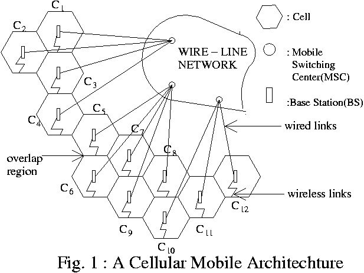
*Figure 1: Cellular mobile network architecture showing hexagonal cells ($C_1\text{--}C_{12}$), Base Stations (BS), wired backbone links to Mobile Switching Centers (MSC), overlap coverage regions, and wireless air interfaces to Mobile Stations.*

### 2.1 Core Network Entities

1. **Base Station (BS):**
   - A fixed ground station in a mobile radio system dedicated to direct radio communication with Mobile Stations.
   - Located either at the **centre** of a cell (using omni-directional antennas) or along the **edges/corners** (using directional sector antennas).
   - Internal hardware consists of:
     - Radio channels (RF transmitter/receiver channel modules)
     - Transmitter units
     - Receiver units
     - Antennas
2. **Mobile Switching Centre (MSC):**
   - Also known as the **Mobile Telephone Switching Office (MTSO)**.
   - Acts as the central brain and routing coordinator for calls across a large service area.
   - Interfaces the wireless base station infrastructure with the fixed landline network (**PSTN** - Public Switched Telephone Network).
   - **Industrial Operational Scale:**
     - Manages up to **$100,000$ cellular subscribers**.
     - Handles up to **$5,000$ simultaneous conversations** at a time.
     - Automates subscriber billing records and executes continuous system diagnostics and maintenance.
3. **Mobile Station (MS):**
   - The subscriber unit containing a transceiver, antenna, and control circuitry.
   - Can be mounted permanently inside a vehicle or operated as a portable, handheld unit.
4. **Transceiver:**
   - A unified hardware device capable of simultaneously transmitting and receiving radio signals (enabling full-duplex voice communication).

---

### 2.2 Channel Classification: Voice vs. Control Channels
Channels in a cellular network are categorized by their direction (Forward vs. Reverse) and their function (Voice vs. Control):

| Channel Name | Direction | Primary Function |
|:---|:---:|:---|
| **Forward Voice Channel (FVC)** | $\text{BS} \to \text{MS}$ | Carries downlink voice transmission from the base station to the mobile subscriber. |
| **Reverse Voice Channel (RVC)** | $\text{MS} \to \text{BS}$ | Carries uplink voice transmission from the mobile subscriber to the base station. |
| **Forward Control Channel (FCC)** | $\text{BS} \to \text{MS}$ | Downlink beacon channel. Continuously broadcasts system parameters, cell identity, and incoming call traffic requests (pages) to all idle mobiles. |
| **Reverse Control Channel (RCC)** | $\text{MS} \to \text{BS}$ | Uplink signaling channel. Used by mobile stations to initiate calls or acknowledge incoming paging messages. |

**The 5% Setup Rule:**
- Control channels (FCC and RCC) are often referred to as **setup channels** because they handle call setup, signaling, and channel assignment before an active conversation begins.
- In a typical cellular deployment, **approximately $5\%$ of all available radio channels** are dedicated as control/setup channels, while the remaining $95\%$ carry actual user voice traffic (FVC/RVC).

---

## 3. Call Procedures: Origination, Paging & In-Call Management

### 3.1 Initial Power-On & Beacon Acquisition
When a mobile handset is first turned on:
1. It immediately scans the pre-allocated group of **Forward Control Channels (FCC)** to identify the channel delivering the strongest RF signal.
2. The MS locks onto and continuously monitors this strongest FCC beacon.
3. It stays tuned to this channel until the signal drops below a usable threshold (indicating the subscriber has moved toward an adjacent cell), at which point it initiates a new scan for a stronger beacon.

---

### 3.2 Mobile-Initiated Call Setup Procedure
When a mobile subscriber dials a telephone number and presses "Send":

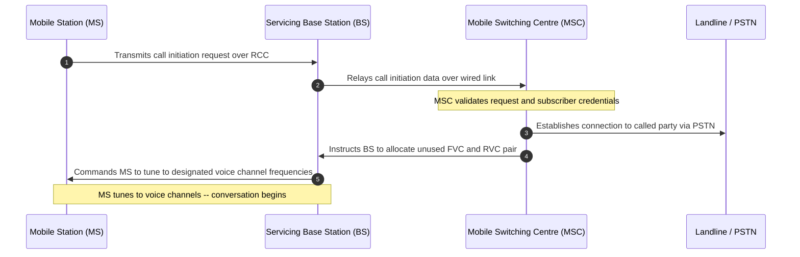

1. **Call Initiation Request:** The MS transmits a call request packet over the **Reverse Control Channel (RCC)** containing its identity (MIN - Mobile Identification Number, ESN) and the dialed digits.
2. **BS Relay:** The servicing Base Station detects the transmission and relays the data to the MSC via the wired backhaul link.
3. **Validation & PSTN Routing:** The MSC validates subscriber authorization, checks billing status, and sets up a connection to the called party through the PSTN.
4. **Voice Channel Reassignment:** The MSC selects an unused voice channel pair and instructs the BS and MS to switch from the control channels to dedicated **Forward Voice (FVC)** and **Reverse Voice (RVC)** channels for conversation.

---

### 3.3 Landline-Initiated Call (Paging Procedure)
When a landline phone dials a mobile subscriber's number:

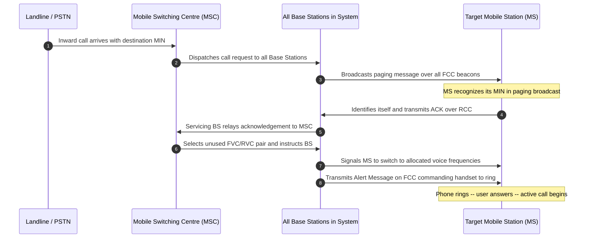

1. **Paging Dispatch:** The incoming call reaches the MSC via the PSTN. Because the MSC does not know the exact cell the mobile is in, it dispatches the request to **all Base Stations** in the service area.
2. **FCC Paging Broadcast:** Every Base Station broadcasts a paging message containing the mobile's **Mobile Identification Number (MIN)** across its Forward Control Channel (FCC).
3. **RCC Identification Response:** The target MS hears its MIN in the broadcast, identifies itself, and responds with an acknowledgement packet over the **Reverse Control Channel (RCC)**.
4. **Voice Channel Assignment:** The servicing BS that picks up the MS response informs the MSC. The MSC allocates an unused FVC/RVC pair and instructs the BS.
5. **Frequency Switching & Ringing:** The BS commands the MS to tune to the allocated voice frequencies, and an **Alert Message** is transmitted over the FCC causing the mobile phone to ring.

---

### 3.4 Role of the MSC During an Active Call
The MSC's responsibility continues throughout the conversation. During an active call, the MSC:
1. **Applies Supervisory Control Signals:** Regulates MS operation via control signals exchanged through the BS.
2. **Performs Dynamic Power Control:** Monitors uplink signal levels and adjusts the transmitter power of the MS. Lowering power when a mobile is near the BS conserves battery, prevents receiver saturation, and minimizes co-channel interference to other cells.
3. **Maintains Voice Quality:** If the active channel degrades due to interference or subscriber movement, the MSC reassigns the call to a cleaner channel (in-cell channel reallocation or inter-cell handoff).

---

## 4. Cell Geometry: Why Hexagonal Footprints?

### 4.1 Physical Reality vs. Geometric Models
- The actual radio coverage of a base station is called its **footprint**. It is mapped out using empirical field signal measurements and propagation models.
- In reality, radio footprints are **amorphous and irregular** because radio waves reflect, diffract, and scatter off hills, buildings, and foliage.
- However, designing a cellular network with amorphous shapes makes frequency planning and capacity analysis impossible. A **regular geometric shape** is required for systematic design and orderly future growth.

---

### 4.2 Geometric Shape Selection
An ideal omni-directional base station antenna radiates uniformly in all directions, producing a **circular** coverage pattern. However, **circles cannot tessellate a 2D plane**:
- If circular cells touch edge-to-edge, huge uncovered gaps (dead zones) are left between them.
- If circles overlap to eliminate gaps, large overlapping regions are created, wasting spectrum.

To cover an area completely without gaps or overlaps (tessellation), only three regular polygons can be used:
1. **Equilateral Triangle**
2. **Square**
3. **Regular Hexagon**

```
     Triangle              Square                Hexagon
      ▲                   ┌──────┐               /‾‾‾\
     / \                  │      │              |     |
    /   \                 │      │               \___/
   /_____\                └──────┘
 Area: 1.30 R²          Area: 2.00 R²          Area: 2.60 R²
```

### 4.3 Why the Hexagon is the Optimal Choice
For a given circumradius $R$ (the distance from the polygon's centre to its farthest vertex):

| Geometric Shape | Area Formula in terms of Radius $R$ | Relative Area Efficiency |
|:---|:---|:---:|
| **Equilateral Triangle** | $A = \frac{3\sqrt{3}}{4} R^2 \approx 1.299 R^2$ | $50.0\%$ |
| **Square** | $A = 2 R^2 = 2.000 R^2$ | $77.0\%$ |
| **Regular Hexagon** | $A = \frac{3\sqrt{3}}{2} R^2 \approx 2.598 R^2$ | **$100.0\%$ (Maximum)** |

**Two Decisive Advantages of the Hexagon:**
1. **Largest Area per Given Radius:** Among all polygons that tessellate a plane, the regular hexagon encloses the largest coverage area for a specified reach $R$. Consequently, **fewer base stations are required** to cover a given region, drastically lowering capital infrastructure costs.
2. **Closest Approximation of a Circle:** The hexagon most closely approximates the circular radiation pattern of an omni-directional base station antenna under isotropic free-space propagation.

---

## 5. Frequency Reuse & Co-Channel Cell Geometry

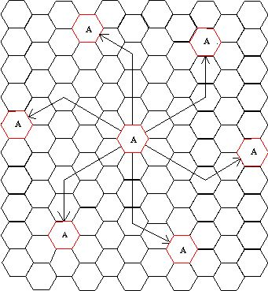
*Figure 2: Geometric calculation and location of nearest co-channel cells using shift parameters $i=3$ and $j=2$ ($N=19$), showing the 6 equidistant co-channel neighbors oriented at $60^\circ$ increments.*

### 5.1 The Frequency Reuse Concept
- The total allocated radio channels are partitioned into distinct, non-overlapping channel groups.
- Each cell in a cluster receives a unique channel group.
- These channel groups are **reused systematically across the coverage zone** in other cells, as long as the physical separation between co-channel cells is large enough to keep mutual interference below an acceptable level.

---

### 5.2 Locating Nearest Co-Channel Neighbors
Cells that use the same group of channels are called **co-channel cells** (e.g., all cells labeled 'A' in Figure 2).

To locate the nearest co-channel cells on a hexagonal grid:
1. Move $i$ cells along any chain of contiguous hexagons.
2. Turn **$60^\circ$ counter-clockwise**.
3. Move $j$ cells along the new hexagonal chain.

Because of the 6-fold rotational symmetry of regular hexagons, every cell has exactly **$6$ equidistant nearest co-channel neighbors** in its first tier.

---

### 5.3 Cluster Size Formula ($N$)
The number of cells per repeating cluster (compact pattern), denoted by $N$, must satisfy the hexagonal tessellation equation:

$$N = i^2 + i \cdot j + j^2 \quad \text{where } i, j \in \{0, 1, 2, 3, \dots\}$$

**Worked Calculation from Slide 14:**
For shift parameters $i = 3$ and $j = 2$:
$$N = 3^2 + (3)(2) + 2^2 = 9 + 6 + 4 = 19\text{ cells per cluster}$$

Other valid cluster sizes that tessellate a hexagonal lattice without distortion include $N = 1, 3, 4, 7, 9, 12, 13, 19, \dots$

### 5.4 Co-Channel Interference
Interference resulting from signals transmitted by other cells operating on the exact same channel frequencies is termed **co-channel interference**. Unlike noise, co-channel interference cannot be solved by simply increasing base station power, because increasing power increases interference across all co-channel cells proportionally!

---

## 6. Cell Design & Total System Capacity

### 6.1 Capacity Formulation & Formulas
Let:
- $S$ = total number of duplex channels allocated to the entire cellular system.
- $K$ = number of duplex channels allocated to each individual cell.
- $N$ = number of cells in a repeating cluster (cluster size).
- $M$ = number of times the cluster is replicated over the total service area.

Because the total channels $S$ are divided equally among the $N$ cells in a cluster:
$$S = K \cdot N \implies K = \frac{S}{N}$$

If the cluster is replicated $M$ times over the service area, the **total system capacity $C$** is:
$$C = M \cdot K \cdot N = M \cdot \left(\frac{S}{N}\right) \cdot N = M \cdot S$$

$$\text{Capacity } C \text{ is directly proportional to } M \text{ (the cluster replication factor).}$$

---

### 6.2 Impact of Cluster Size ($N$) on Capacity vs. Interference

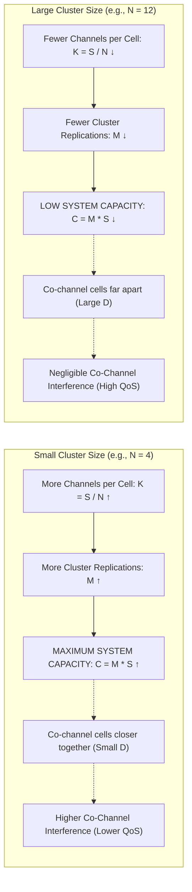

**The Fundamental Trade-off:**
- **Large Cluster Size ($N$):** Co-channel cells are spaced far apart ($D/R$ is large). Interference is minimal, delivering pristine voice quality. However, channels per cell $K$ and replications $M$ are low, resulting in **low capacity**.
- **Small Cluster Size ($N$):** Co-channel cells are located close together. Capacity is maximized, but **co-channel interference is significant**.

**Design Optimization Dilemma:**
- To **maximize capacity**: Use the smallest possible value of $N$.
- To **eliminate interference**: Use the biggest possible value of $N$.
- Modern system design requires balancing this fundamental trade-off between capacity and quality of service (QoS).

---

## 7. Co-Channel Interference & Co-Channel Reuse Ratio ($Q$)

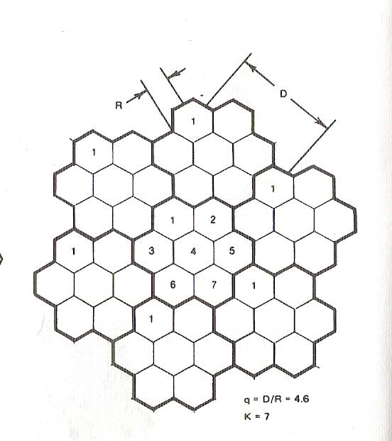
*Figure 3: Geometric relationship between cell radius $R$ and co-channel distance $D$ for a 7-cell reuse cluster ($K=7$ / $N=7$), showing the reuse ratio $q = D/R = 4.6$.*

### 7.1 The Co-Channel Reuse Ratio Formula ($Q$)
To keep co-channel interference below acceptable levels, co-channel cells must be separated by a minimum physical distance $D$.

The **co-channel reuse ratio $Q$** (or $q$) is defined as the ratio of the distance between centers of nearest co-channel cells ($D$) to the cell radius ($R$):

$$Q = \frac{D}{R} = \sqrt{3N}$$

**Mathematical Audit of Figure 3 (Slide 20):**
The slide diagram illustrates a 7-cell cluster ($K = 7$, where $K$ represents cluster size $N = 7$):
$$Q = \sqrt{3 \times 7} = \sqrt{21} \approx 4.5826$$
The slide prints $q = D/R = 4.6$, which is $4.5826$ rounded to one decimal place.

---

### 7.2 Operational Trade-Off of $Q$
- **$Q$ is Too Large ($D \gg R$):** Co-channel cells are located far apart. Transmission quality improves due to high propagation path isolation, but cluster size $N$ must be large, reducing spectral capacity.
- **$Q$ is Too Small ($D$ approaches $R$):** Cluster size $N$ is small, providing high capacity, but co-channel interference degrades voice quality.
- **Strategy to Reduce Interference:**
  1. Separate co-channel cells by a minimum distance $D$.
  2. Rely on natural RF propagation path loss ($P_r \propto d^{-n}$, where path loss exponent $n \approx 3\text{--}4$) to attenuate interfering signals.

---

## 8. Handoff Strategies & Signal Threshold Margins

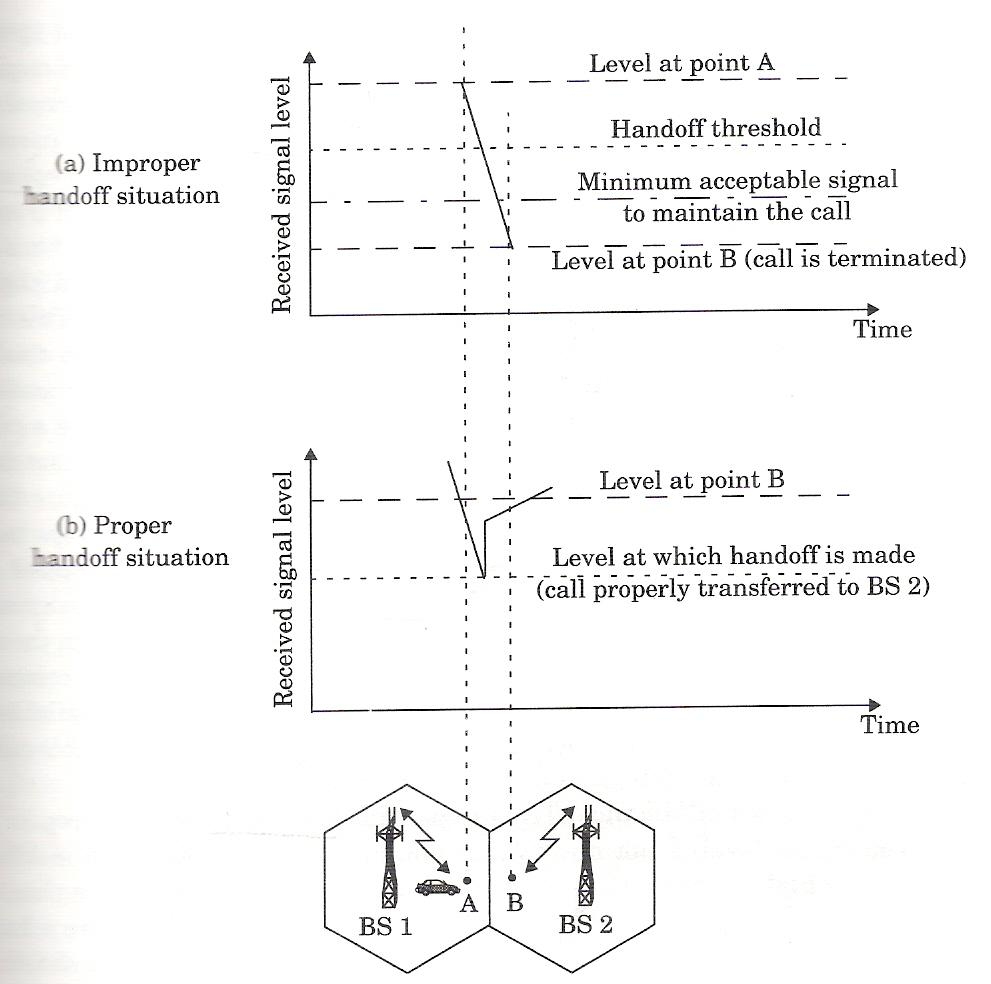
*Figure 4: Illustration of handoff dynamics at a cell boundary. (a) Improper handoff: delayed execution drops the signal below the minimum acceptable threshold, terminating the call. (b) Proper handoff: handoff executes at threshold $P_{r,\text{handoff}}$, successfully transferring the call to Base Station 2.*

### 8.1 Definition & Requirements
**Handoff (Hand Off):** The operational process of transferring an active call from one radio channel or base station to another as a mobile subscriber travels across cell boundaries.
- **Core Process:**
  1. Identify a candidate new Base Station.
  2. Allocate voice and control channels associated with the new Base Station.
- **Three Core Requirements:** A handoff must be performed:
  1. **Successfully** (the ongoing call must not be dropped).
  2. **As infrequently as possible** (to avoid overloading network switches with signaling).
  3. **Imperceptibly to users** (seamlessly, without audible clicks or interruptions).

---

### 8.2 Signal Thresholds & The Handoff Margin ($\Delta$)
To meet these requirements, network designers establish two signal thresholds at the base station receiver:
1. $P_{r,\text{minimum usable}}$: The absolute minimum acceptable received signal level required to sustain intelligible voice quality.
2. $P_{r,\text{handoff}}$: A slightly stronger threshold chosen to initiate the handoff process while signal quality is still good.

The safety margin $\Delta$ is defined as:

$$\Delta = P_{r,\text{handoff}} - P_{r,\text{minimum usable}}$$

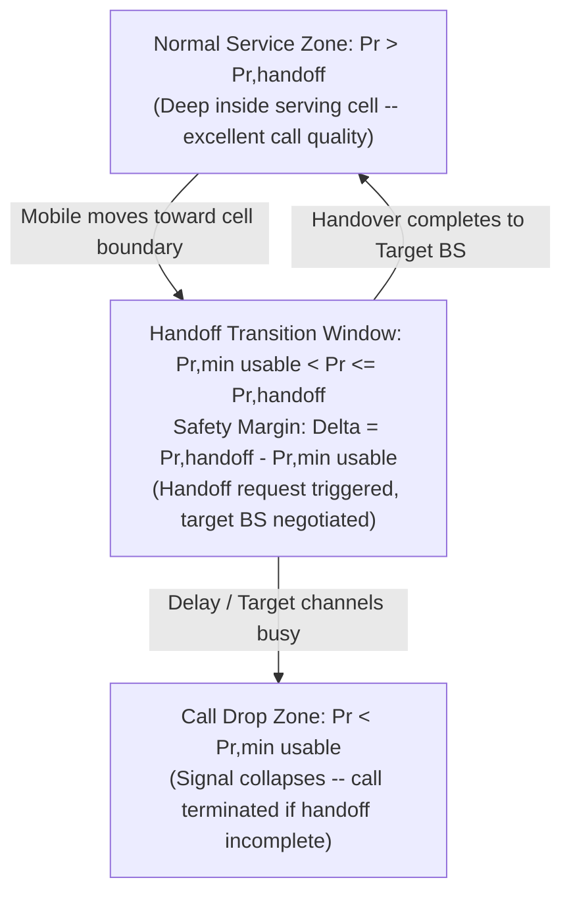

### 8.3 Margin Optimization Trade-Off
- **$\Delta$ is Too Large:** Handoff is triggered when the mobile is still well inside the serving cell. This results in **unnecessary handoffs**, generating excessive computational loading on the MSC and wasting channel switching resources.
- **$\Delta$ is Too Small:** There is **insufficient time** to complete the handoff before the signal drops below $P_{r,\text{minimum usable}}$, causing the call to be lost.

### 8.4 Causes of Dropped Calls During High Traffic
During heavy traffic conditions, calls may be dropped due to:
1. **Computational Loading at the MSC:** Processing queues at the central switch cause excessive delays.
2. **Channel Starvation at Target BSs:** No voice channels are free on any nearby base stations, forcing the MSC to wait. If the signal collapses below $P_{r,\text{minimum usable}}$ during this wait, the call is dropped.

---

## 9. Signal Monitoring & Generational Handoff Evolution (1G vs. 2G MAHO)

### 9.1 Verification Rules Before Initiating Handoff
In a mobile radio environment, signal strength fluctuates rapidly due to momentary multipath fading. Before initiating an expensive handoff, the system must verify:
1. The drop in signal level is **not due to momentary fading**.
2. The MS is **actually physically moving away** from the serving Base Station.

**Implementation:**
- The Base Station monitors the signal level over a **sliding time-averaging window** before triggering a handoff.
- The averaging duration depends on the velocity of the MS: if the **slope of the short-term average received signal level is steep**, the mobile is moving away rapidly and the handoff must be made quickly.

---

### 9.2 1st Generation (1G) Handoff: Network-Controlled
- The Base Station constantly measures the signal strength (SS) of the uplink **Reverse Voice Channels (RVC)**.
- The **MSC supervises and controls** all handoffs.
- The MSC polls surrounding BSs to measure the MS's signal and determine its relative location.
- **Drawback:** Slow execution ($5\text{--}10\text{ seconds}$) and creates an intense computational bottleneck at the central MSC.

---

### 9.3 2nd Generation (2G) Handoff: Mobile-Assisted Handoff (MAHO)
In 2G digital networks, handoff decisions are **Mobile-Assisted (MAHO)**:
- The Mobile Station measures the received power from neighboring Base Station beacons during idle TDMA timeslots.
- The MS continually reports these measurements back to its serving Base Station.
- **Trigger Rule:** A handoff is initiated when:
  $$\text{Power from neighbor BS} > \text{Power from serving BS by a specified threshold/duration}$$

| Feature | 1st Generation (1G) Handoff | 2nd Generation (2G) MAHO |
|:---|:---|:---|
| **Measurement Entity** | Base Station (uplink RVC measurement) | Mobile Station (downlink beacon measurement) |
| **Supervision & Control** | Centralized MSC supervises all handoffs | Distributed (MS reports, BS/BSC executes) |
| **Handover Speed** | Slow ($5\text{--}10\text{ seconds}$) | Much faster (tens of milliseconds) |
| **MSC Processor Load** | Heavy (MSC must constantly monitor SS) | Relieved (MSC no longer monitors SS) |
| **Cell Size Capability** | Large macrocells only | Microcells and picocells |

---

## 10. Roaming & Handoff Prioritization Strategies

### 10.1 Roaming & Intersystem Handoff
**Roaming** is the operational mechanism by which an **intersystem handoff** takes place when a subscriber travels outside their service provider's network territory.

- **Trigger Conditions for Roaming:**
  1. Received signal strength at the MS becomes weak.
  2. The serving MSC searches its system and **cannot find another cell within its own network** to transfer control of the MS.
- **Engineering Issues & Constraints in Roaming:**
  - The MS leaves its registered home system and enters a visited system.
  - A local call converts dynamically into an intersystem long-distance call with different billing tariffs.
  - **Compatibility** between the two MSCs (signaling protocols, authentication, cryptographic keys) must be determined before implementing the intersystem handoff.

---

### 10.2 Prioritizing Handoff Requests
From a subscriber satisfaction perspective:
> **A call abruptly terminated in the middle of an active conversation is far more annoying to a user than being blocked occasionally on a new call attempt.**

Therefore, cellular systems prioritize ongoing handoffs over new call attempts using two techniques:

1. **The Guard Channel Concept:**
   - A dedicated fraction of total channels in each cell is reserved exclusively for incoming handoff requests.
   - New call attempts can only use the remaining general channel pool.
   - If all regular channels are busy, new calls are blocked, but handoffs can still access reserved guard channels.
2. **Queuing of Handoff Requests:**
   - Takes advantage of the time window between $P_{r,\text{handoff}}$ and $P_{r,\text{minimum usable}}$.
   - If no channel is immediately available at the target BS, the handoff request is queued.
   - As soon as a channel is freed by an exiting or terminated user, it is assigned to the queued handoff before the mobile drops below $P_{r,\text{minimum usable}}$.

---

## 11. Practical Handoff Constraints: Umbrella Cells & Cell Dragging

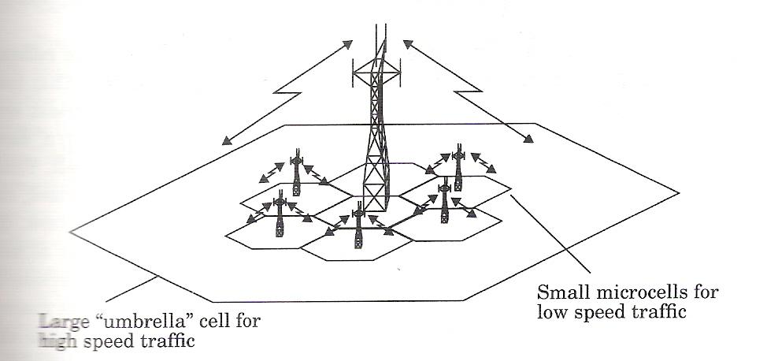
*Figure 5: The umbrella cell approach, showing a tall-tower large "umbrella" cell covering high-speed vehicular traffic co-located with multiple low-antenna microcells serving low-speed pedestrian traffic.*

### 11.1 Problem 1: Accommodating Wide Velocity Diversity
- **The Challenge:** Cellular networks must simultaneously serve slow pedestrians ($3\text{ km/h}$) and high-speed highway motorists ($100\text{ km/h}$).
- **Failure Mode:** If fast vehicles move through small microcells ($R = 500\text{ m}$), they cross cell boundaries every few seconds, causing continuous handoffs ("handoff storms") that overload the MSC switching fabric and increase dropped calls.

#### The Solution: Umbrella Cell Approach
By deploying **different antenna heights and transmitter power levels**, engineers co-locate "large" and "small" cells over the exact same area:
- **Large Umbrella Cell (Macrocell):** Transmits from tall towers at high power, providing broad coverage for **high-speed vehicular traffic** (minimizing handoff frequency).
- **Small Microcells:** Transmit from low antenna heights at low power, providing localized capacity for **low-speed pedestrian traffic** (maximizing spatial capacity).

---

### 11.2 Problem 2: Cell Dragging
- **Definition:** An anomaly where a handoff is **not made even when it is essential**.
- **Physical Cause:** Occurs in dense urban environments where pedestrian users maintain an unobstructed **Line-of-Sight (LOS)** radio path to their original base station down street canyons.
- **Consequence:**
  - Because of the strong LOS path, the received signal strength remains artificially strong at the receiver, so the handoff threshold is not triggered.
  - The pedestrian moves deep into the coverage territory of a neighboring cell while still transmitting to the original BS.
  - This "drags" the signal into the adjacent cell, creating severe, destructive **co-channel interference** for subscribers legitimately operating in that neighbor cell.

---

## 12. GSM Architecture, Services & Subsystems (BSS, NSS, OSS)

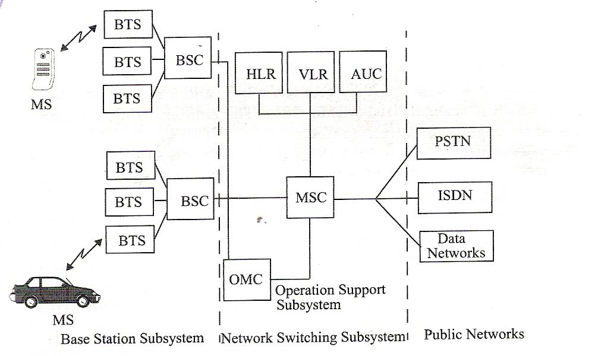
*Figure 6: Complete GSM system architecture showing the three interconnected subsystems: Base Station Subsystem (BSS: BTS, BSC), Network and Switching Subsystem (NSS: MSC, HLR, VLR, AUC), Operation Support Subsystem (OSS: OMC), and interfaces to external Public Networks (PSTN, ISDN, Data).*

### 12.1 Background & Features
- **GSM (Global System for Mobile Communications):** A 2nd generation (2G) digital cellular standard.
- **Historical Significance:** World's first cellular system to specify **digital modulation** and complete standardized network-level architectures and services.
- **The Problem It Solved:** Before GSM, European nations used incompatible analog standards (e.g., TACS in the UK, NMT in Scandinavia), making it impossible for a customer to use a single phone throughout Europe. GSM created a unified continental standard.

### 12.2 GSM Services & Features
GSM services are classified into two major categories:
1. **Teleservices:**
   - Standard Voice Calling (digital telephony)
   - Facsimile (Fax transmission)
2. **Data Services:**
   - Circuit-switched data rates ranging from **$300\text{ bps}$ to $9.6\text{ kbps}$**.
   - **SMS (Short Message Service):** Alphanumeric messaging carried over signaling channels simultaneously while carrying normal voice traffic.

### 12.3 The SIM (Subscriber Identity Module)
The SIM card is a smart memory chip that revolutionized mobile hardware by **decoupling the subscriber's identity from the physical terminal**:
- **Stores:**
  - Subscriber identification module (IMSI)
  - Authorized networks
  - Country code
  - Privacy and authentication keys ($K_i$)
  - User-specific information (phonebook, stored SMS)
- **Modularity:** Without a SIM installed, all GSM mobile handsets are completely identical and non-operational (except for emergency calls). A subscriber can plug their SIM into any suitable GSM terminal and immediately receive their calls.

---

### 12.4 The Three Interconnected GSM Subsystems

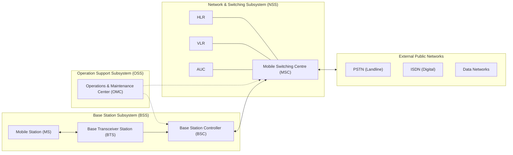

1. **Base Station Subsystem (BSS):**
   - Provides radio transmission paths between Mobile Stations and the MSC.
   - Manages the radio interface between Mobile Stations and all other subsystems of GSM.
   - **Base Transceiver Station (BTS):** Contains radio transceivers and antennas for an individual cell.
   - **Base Station Controller (BSC):** Controls multiple BTSs and connects them to the NSS via the MSC.
   - ⭐️ **Critical Architectural Rule (Slide 41):**
     > **Mobile handoffs between two BTSs under the control of the same BSC are handled directly by the BSC, and not the MSC.**
2. **Network and Switching Subsystem (NSS):**
   - Manages the core switching functions of the network.
   - Connects MSCs to external public networks: **PSTN** (landlines), **ISDN** (digital networks), and **Data Networks**.
   - Houses critical mobility and security database registers:
     - **HLR (Home Location Register):** Central permanent database storing subscriber profiles, service entitlements, and current location tracking records.
     - **VLR (Visitor Location Register):** Dynamic temporary database associated with an MSC that caches subscriber data for visiting roaming subscribers.
     - **AUC (Authentication Center):** Security vault managing authentication algorithms and secret keys.
3. **Operation Support Subsystem (OSS):**
   - Supports operation and maintenance of the GSM system via the **OMC (Operations and Maintenance Center)**.
   - Allows network engineers to monitor traffic, run diagnostics, and troubleshoot all aspects of the GSM network.
   - Accessible solely to the technical staff of the GSM operating company.

---

## 13. GPRS (General Packet Radio Service)

### 13.1 Overview & Technology
- **GPRS:** An enhanced 2nd generation (**2.5G**) cellular standard.
- **Multicast Packet-Switched Technology:** Overlays packet data capabilities directly onto the existing circuit-switched GSM radio infrastructure.
- **Bursty Traffic Optimization:** Particularly suited for sending and receiving small bursts of data (e.g., email and web browsing), where traffic is discontinuous.

### 13.2 Data Transmission Speeds
- Operates at speeds **up to $115\text{ kbps}$**, compared with standard GSM's $9.6\text{ kbps}$.
- Typically supports user data transmission at **$20\text{ to } 30\text{ kbps}$** (with an operational maximum of $50\text{ kbps}$).
- Has a **theoretical maximum throughput of up to $171.2\text{ kbps}$** (achieved by aggregating multiple TDMA timeslots).

### 13.3 Volume-Based Billing Innovation
- In traditional circuit-switched GSM, users are billed for the **duration** of the connection, paying for time even during idle silence periods.
- GPRS introduced **volume-based billing**: subscribers **pay only for the amount of information downloaded/uploaded**, rather than the duration of the connection. This enabled continuous ("always-on") data connectivity.
