# DeepSeek-V4.1-Flash: Pushing the Limits of KV Cache Compression

> **Source:** [Deepseek just did the impossible](https://youtu.be/MImgH4KMtj8?si=be0iHHzOhsQO2Pbr) by AI Search
> **Primary source:** the *DeepSeek-V4.1-Flash* technical report (`_originals/DeepSeek_V41_Tech_Report.pdf`). **Every architectural number in this guide comes from that paper, not from the video.** Where the two disagree, §12 says so.
> **Read first (recommended):** [How DeepSeek rewrote the transformer (MLA)](Multi-head%20Latent%20Attention%20-%20Shrinking%20the%20KV%20Cache.md) — this note is the direct sequel and assumes you know what a KV cache is.
> **Related notes:** [Attention in transformers](Attention%20in%20Transformers%20-%20Queries%20Keys%20and%20Values.md) · [Why the harness matters](Agent%20Harnesses%20-%20Why%20the%20Scaffold%20Beats%20the%20Model.md) (§10.3 here is a published harness experiment) · [1 Million Requests per Second](Scaling%20to%201%20Million%20Requests%20per%20Second.md) (the same memory-vs-compute trade, in backend form)
> **What's in this version:** 13 figures (the layer map, cost curves and cache budgets are computed from the paper's published configuration; the benchmark charts plot its published tables), the architecture explained one mechanism at a time, runnable code that reproduces the arithmetic, the paper's own admitted limitations, seven corrections to the video, a quiz and a glossary.
> **Facts re-checked:** 18 September 2026, against the technical report itself.

---

## 0. How to use this guide

| If you have… | Read |
|---|---|
| 10 minutes | §0.1 plain-words intro, §1 TL;DR, plus figures 1, 3 and 9 |
| 1 hour | §1–§10 |
| A weekend | Everything. Run `code/deepseek_v41_kv.py`, then change `layer_map()` and see what the cache budget does |

**What you need first:** what a KV cache is and why generation is memory-bound. If those are new, read §4 of the [MLA note](Multi-head%20Latent%20Attention%20-%20Shrinking%20the%20KV%20Cache.md) first — it's fifteen minutes and this guide picks up exactly where it stops.

---

### 0.1 First, in completely plain words

A chatbot writing an answer is like a student answering questions about a lecture they attended. Rather than replaying the whole lecture in their head for every question, the student flips through their **notes**. In a language model those notes are the **KV cache**, and the model rebuilds nothing — it re-reads the notes before producing every single word.

The trouble is that agents have made the lectures enormous. A model working through a codebase or a hundred documents isn't taking notes on one lecture; it's taking notes on a term's worth. And notes have to live somewhere:

- **On the desk** (the GPU's own memory, called HBM) — instant to reach, but only a couple of hundred gigabytes, and extremely expensive.
- **In a filing cabinet down the hall** (SSD) — effectively unlimited, but every trip down the hall is a thousand times slower, and the GPU sits idle for the whole walk.

So the game is simple to state: **make the notes small enough to stay on the desk.**

DeepSeek-V4.1-Flash gets them down to **890 bytes per token** — about 4× smaller than their own previous model and **437× smaller than their first one**. There is no single trick behind it. There are four, and they stack:

| Idea | In one sentence |
|---|---|
| **Split the model in half** (CED) | Junior analysts read all the documents and write a summary; senior staff only read the summary. Halves the cost of reading. |
| **Stop every layer keeping its own notes** (CSA2) | Out of 38 layers, only **4** write notes. The other 34 read someone else's — some of them with their own index into it. |
| **Narrow the search before you start** (hierarchical indexer) | Out of a million positions, the first decoding layer shortlists ~16,000, and every later layer searches only the shortlist. |
| **Don't file the short-term notes at all** (SWA bounded replay) | Re-deriving the last 128 tokens on the GPU is cheaper than walking down the hall to fetch them. Delete and recompute. |

Plus two supporting pieces: **Engram**, 196 billion parameters of pure factual lookup that lives in ordinary server RAM instead of on the GPU, and **DSpark**, which drafts several tokens at once instead of one.

**Why anyone outside DeepSeek should care.** This is the clearest published example of a lab with worse hardware beating the problem with architecture instead of money — and the result is a model you can download, that matches frontier models on most agent benchmarks, at a fraction of the serving cost. The specific mechanisms will date. The *way of thinking* — find the resource that's actually scarce, then attack it along every independent axis at once — will not.

---

## 1. TL;DR in 10 lines

1. Modern AI workloads are **input-heavy**: agents read far more than they write. Reading is *prefill*; writing is *decode*.
2. Sparse attention already fixed the *compute* cost of long context. That made **storage and data movement** the new bottleneck — which is exactly the problem this paper attacks.
3. **DeepSeek-V4.1-Flash** is a multimodal MoE model: **552B backbone parameters**, **1M-token context**, **8B active per token during prefill** and **16B during decode**.
4. **CED (Causal Encoder-Decoder):** the bottom 20 layers read the prompt; the top 20 layers *inherit* their global KV cache from the encoder's final hidden state instead of computing it. Prefill cost drops by ~half.
5. **CSA2** compresses the cache along **three multiplicative dimensions at once** — entry size, sequence, and **layer** — and its layer-dimension trick is the new part: layers are statically assigned **Full**, **Reindex** or **Reuse** mode.
6. In the shipped configuration only **4 of 38** CSA2 layers build a KV cache of their own. **30 are pure Reuse** — no cache, no index.
7. A **Hierarchical Sparse Indexer** in the decoder shortlists **16,384 candidate positions**; later layers search only those, making their cost constant rather than linear in context length.
8. **FP4** main KV cache (E2M1 with an E4M3 scale per 16 channels) halves the bytes again versus V4's FP8.
9. **SWA Bounded Replay:** stop persisting short-window state to SSD; on a miss, replay just the last **128 tokens** instead of the exact 5,120 (L × win). Persistent cache drops to ~**1/8** of V4-Flash.
10. Result: **890 bytes/token** of global cache, decode FLOPs nearly **flat from 4K to 1M context**, and agent-benchmark scores that match or beat Claude Opus-5 and GPT-5.6 Sol — with an honest, explicitly-stated gap remaining on the hardest science tasks.

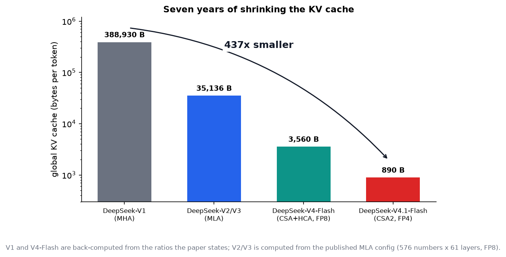

*Seven years of the same obsession. V1 used ordinary multi-head attention and needed ~390 KB of cache per token. V2/V3 introduced MLA. V4-Flash added sequence-dimension compression and FP8. V4.1-Flash adds the layer dimension and FP4. The paper's stated 437× is end-to-end from V1.*

---

## 2. The problem: why the KV cache became *the* bottleneck

### 2.1 Prefill and decode do completely different work

| Phase | What happens | What it's limited by |
|---|---|---|
| **Prefill** | the model reads the prompt — all documents, all tool output, the whole conversation so far — and writes out a KV cache entry for every token | **compute**: it's a big parallel matrix workload |
| **Decode** | the model writes the answer one token at a time, re-reading the entire cache before each one | **memory**: bandwidth and capacity, not arithmetic |

Both matter, but the paper's opening argument is that **agents shifted the balance towards prefill**. A chat turn is a short prompt and a long answer. An agent turn is often a 50,000-token prompt (the codebase, the tool result, the plan so far) and a 200-token answer. Every tool call is a *new prefill*. That is why halving prefill cost — §4 — is worth a whole architectural change.

### 2.2 Where the notes physically live

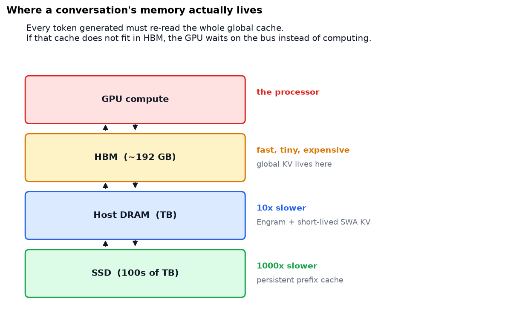

*The global KV cache **must** stay in HBM, because it is read in full for every generated token. Anything that doesn't fit spills to host DRAM or SSD, and then the GPU spends its time waiting on a bus instead of computing. This is the entire motivation for the paper.*

The paper is precise about which cache goes where, and the distinction matters for the rest of the guide:

| Cache | Lives where | Size driver |
|---|---|---|
| **Global KV** (main KV + indexer K) | **always in HBM** | grows with context length — the thing being compressed to 890 B/token |
| **SWA KV** (local sliding-window state) | host DRAM in V4.1 (SSD in V4) | bounded by window size, *not* sequence length — but multiplied by layers and turns |
| **Persistent KV** (cached prefixes for reuse across requests) | SSD / host memory | grows with how many conversations you keep warm |

> **The detail almost every summary gets wrong:** SWA KV is *already* bounded — a fixed window means fixed storage per layer regardless of how long the conversation is. Its cost problem isn't sequence length, it's that you were **persisting it to SSD across turns**, and in V4 that accounted for nearly half the persistent cache. §7 is about deleting it, not shrinking it.

---

## 3. The framework worth keeping: three multiplicative dimensions

This is the most transferable idea in the paper, and it's stated explicitly in §2.3. There are exactly three independent ways to make a KV cache smaller, and they **multiply**.

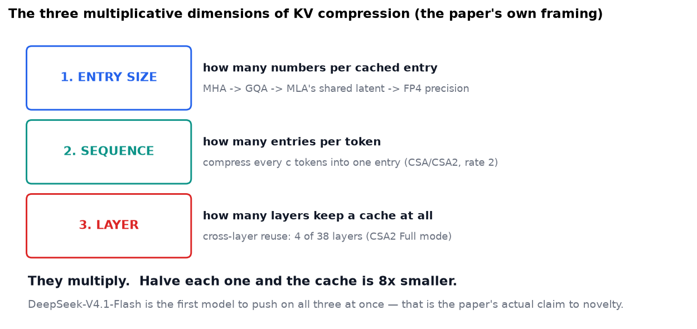

| Dimension | The question | Prior art | V4.1's move |
|---|---|---|---|
| **1. Entry size** | how many numbers per cached entry? | GQA shares K/V across heads; **MLA** shares one small latent | FP4 precision on top of the latent |
| **2. Sequence** | how many entries per token? | CSA and HCA in V4 compress every *c* tokens into one entry | compression rate 2 in the encoder |
| **3. Layer** | how many layers store anything at all? | IndexCache reuses indices; YOIO shares routing; HySparse reuses dense layers' caches | **CSA2** — the first to combine cache sharing *and* decoupled index reuse |

The paper's claim to novelty is not any single one of these. It's that **no prior method covered all three at once**, and that index reuse alone (IndexCache) saves no *storage*, while network-wide routing sharing (YOIO) costs quality.

> **Use this as a reading tool.** When the next efficient-attention paper appears, ask which of the three axes it moves. Almost every one of them moves exactly one, and the abstract will tell you within a sentence.

---

## 4. CED: let half the model skip the reading

### 4.1 The idea

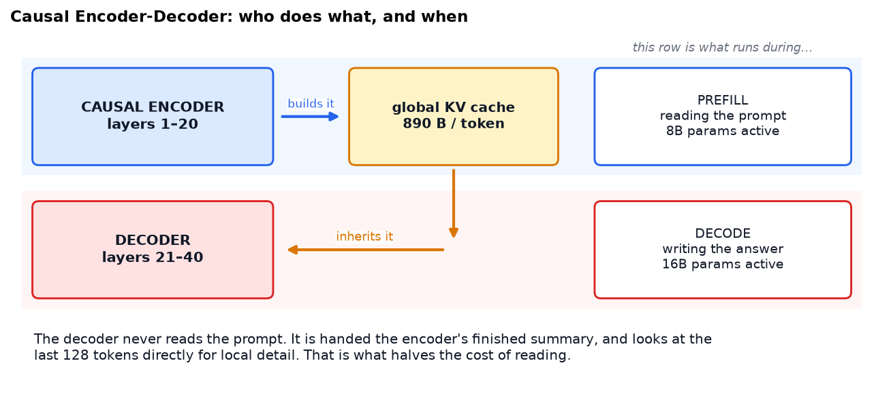

A standard transformer is a uniform stack: all 40 layers read the prompt, all 40 build their own KV cache, all 40 participate in writing the answer. CED breaks that symmetry.

- The **bottom 20 layers** are the *causal encoder*. They read the prompt and produce the global KV cache.
- The **top 20 layers** are the *decoder*. Their global KV entries are **not** computed from their own hidden states. They're projected directly from the encoder's final hidden state, with per-layer projection weights:

$$K^{(\ell)} = W_K^{(\ell)}\,h_{L/2}, \qquad V^{(\ell)} = W_V^{(\ell)}\,h_{L/2}, \qquad \ell > L/2$$

**How to read that out loud:** "every decoder layer gets its own keys and values by applying its own little transformation to *one shared summary vector* — the one the encoder finished with — instead of doing its own reading."

The idea is borrowed from **YoCo** (Sun et al., 2024) and extended; CED adds structural changes that increase both the cache capacity and the computational depth that goes into producing it.

### 4.2 The obvious objection, and the answer

*If half the model never reads the prompt, doesn't it lose the plot?*

It would, if the decoder had nothing local to look at. But CED keeps **sliding-window attention layer-by-layer in all 40 layers**. So each decoder layer computes its own local keys and values from its own hidden state, over a 128-token window.

The division of labour, in the paper's own terms:

| | Global context | Local context |
|---|---|---|
| **What it is** | the entire prompt: every document, every tool result | the immediate neighbourhood of the token being written |
| **Who computes it** | the encoder, once | every layer, for itself |
| **Mechanism** | compressed sparse attention over the shared cache | sliding-window attention, window = 128 |

The analogy that actually holds: junior analysts read ten thousand pages and produce a summary; the executives work from the summary, but put their reading glasses on for the one paragraph they're signing off. Direction comes from the global summary, precision from the local text.

### 4.3 What it costs and saves

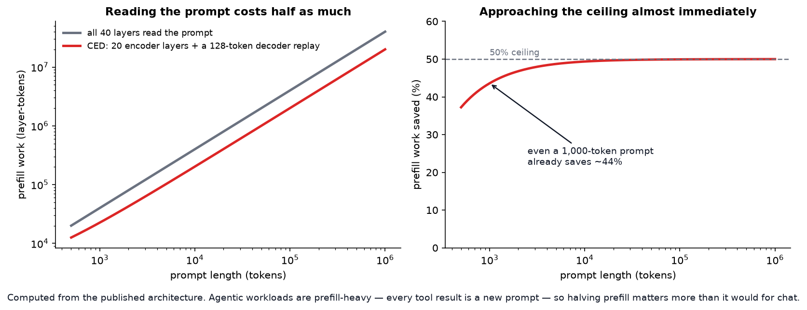

*Computed from the published architecture. The decoder still has to build its sliding-window state, which naively means running it over the last `win × L/2` = 2,560 tokens. Bounded replay (§7) cuts that to the last 128, so decoder prefill work becomes a constant. Complexity drops from O(Ln) to O(Ln/2 + win·L/2) ≈ **O(Ln/2)** — almost exactly half.*

---

## 5. CSA2: only four layers keep notes

### 5.1 The redundancy being exploited

In an ordinary transformer every layer computes and stores its own KV cache. Different layers do attend to different things — but the *keys and values themselves* turn out to be highly redundant across layers. CSA2 pushes on that hard.

Each CSA2 layer is **statically assigned** one of three modes — decided once at design time, not chosen at runtime:

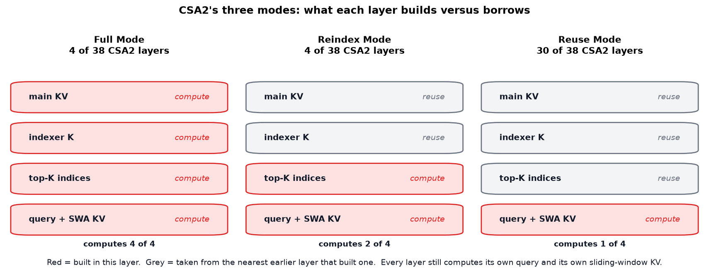

| Mode | Main KV | Indexer K | Top-K indices | Intuition |
|---|---|---|---|---|
| **Full** | computes | computes | computes | writes the notes *and* the table of contents |
| **Reindex** | reuses | reuses | **computes** | same notes, **a different index into them** — chronological versus thematic |
| **Reuse** | reuses | reuses | reuses | reads someone else's notes through someone else's index; builds nothing |

The decoupling is the clever part: **cache sharing and index reuse are separate decisions.** Reindex mode keeps the storage saving while still letting each layer look at a *different* part of the shared notes. That's what stops the whole network collapsing into one fixed view of the context, which is the failure mode of methods that share routing globally.

In all three modes, every layer still computes its **own query** and its **own sliding-window KV**. Nothing is shared there.

### 5.2 The actual assignment, rebuilt from the paper

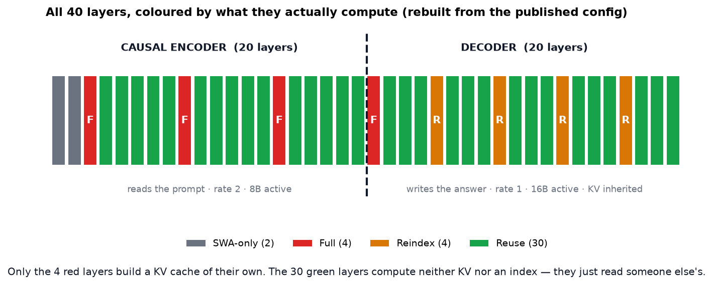

*Rebuilt directly from the configuration in §4.2.1 of the paper. Encoder: 2 SWA-only layers, then 18 CSA2 layers (compression rate 2) in three groups of six, each `[Full, Reuse×5]`. Decoder: 20 CSA2 layers (rate 1) in five groups of four — the first `[Full, Reuse×3]`, the rest `[Reindex, Reuse×3]`.*

The consequence, which `code/deepseek_v41_kv.py` prints:

```
   SWA-only     2 layers
   Full         4 layers
   Reindex      4 layers
   Reuse       30 layers
   -> of 38 CSA2 layers, only 4 compute their own main KV (11%); 79% are pure Reuse
   -> a plain transformer would store 38 layers of KV, V4.1 stores 4: 9.5x fewer
```

**Four layers.** That is the whole global memory of a model with a million-token context.

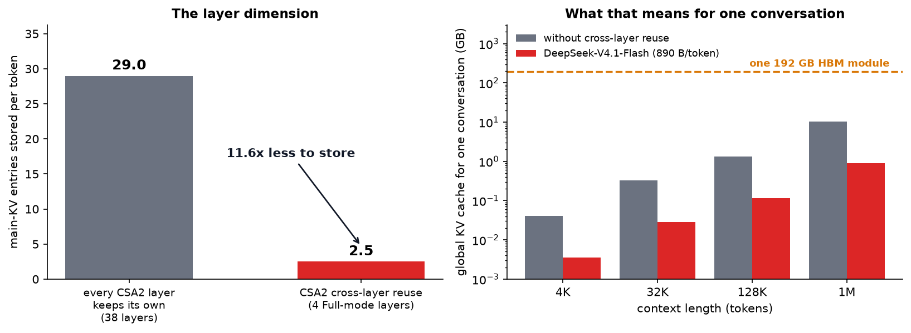

*Left: main-KV entries stored per token, counting the encoder's 2× sequence compression. Cross-layer reuse alone is an 11.6× reduction. Right: what that means for one conversation — and why 890 bytes/token is the difference between a 1M-token context costing 0.9 GB and costing 10 GB.*

### 5.3 The Hierarchical Sparse Indexer

Cross-layer reuse cuts *storage*. It doesn't cut the cost of **searching** — every layer that still runs an indexer has to score the whole visible context to pick its top-512 entries. At a million tokens that's the dominant cost again.

The fix exploits a simple observation: in the decoder, a shallow layer's judgement about what's relevant is good enough to **narrow the search space for the deeper ones**.

1. The decoder's **first Full-mode layer** scores every causally visible position and picks its own top-512.
2. It also does **blockwise selection**: each block gets the maximum score among its positions, and the best **2,048 blocks × 8 positions = 16,384 candidate positions** become a shared **candidate pool**.
3. Every later **Reindex** layer scores *only* those 16,384 positions and picks its own top-512 from them.
4. **Reuse** layers score nothing at all.

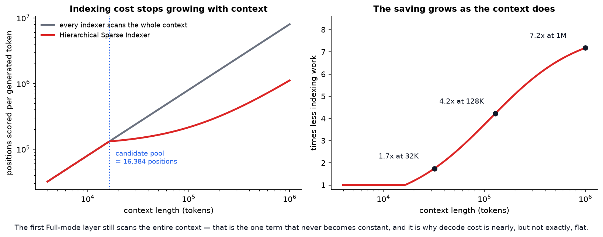

*Computed from the published configuration. For a fixed pool size, the deeper indexers' cost becomes **constant in context length**. Note the residual term the video omits entirely: the first Full-mode layer still scans the whole range, which is precisely why decode cost is nearly — but not exactly — flat.*

> **The safety question, and the honest answer.** Throwing away 98% of a million-token context before you've really looked at it sounds like a recipe for confident hallucination. The paper's answer is that the restriction is **training-aware**: the candidate pool is applied identically during post-training and at inference, so the deeper indexers are optimized under exactly the search domain they'll face. That's a real answer, not hand-waving. But see §11 — the paper itself flags "potential selection errors in CSA2" as an uncharacterized robustness boundary.

---

## 6. FP4: halving the bytes one more time

The cheapest dimension to move, and the one with the least conceptual content: store each cached number in **4 bits** instead of 8.

- Format: **E2M1** (2 exponent bits, 1 mantissa bit) with **one E4M3 scale per 16 channels**, following NVIDIA's NVFP4 but dropping its second-level global scale.
- Why dropping the global scale is safe, in the paper's own argument: the largest trained RMSNorm weight is ≈ 1, so after normalization the 512-channel KV latent has L2 norm ≤ ~√512 ≈ 22.6, and RoPE preserves norms. The observed maximum during training is around 10 — far inside the format's ~2,688 range.
- Applied via **quantization-aware training** during post-training, and quantized **after** RoPE (before RoPE gave only marginal accuracy gain for extra decode cost).
- **SWA KV stays at FP8** — it turned out to be more sensitive to quantization.

**The engineering lesson worth stealing:** they chose a *less* accurate format on purpose, because dequantizing before attention means you never need hardware that can multiply in that format natively. Portability across GPU vendors beat the last fraction of a percent.

---

## 7. SWA Bounded Replay: stop filing the short-term notes

### 7.1 The problem V4 had

Sliding-window state is small per layer, but in a multi-turn session you were saving it to SSD at the end of every prompt and every output so the next turn could resume. In V4's deployment that accounted for **nearly half the persistent KV cache**.

The paper's diagnosis is sharper than "it's big": **the access pattern doesn't match the storage**. Global KV has long-tail reuse — someone might return to this conversation in a day, so a 72-hour retention makes sense. SWA KV is dead the moment the turn ends. You were paying for 72-hour storage for something with a useful life of minutes.

### 7.2 The fix, in two parts

**Part one — move it, don't persist it.** SWA KV now lives in a distributed memory pool carved from **10% of each machine's host DRAM**, with a TTL of minutes. Far less aggregate capacity, but the turnover is so high it serves almost all concurrent active sessions anyway.

**Part two — make the misses cheap.** When SWA state *is* missing, rebuild it — but approximately.

Exact reconstruction is expensive because sliding-window dependencies **compound across layers**: layer 2's window depends on layer 1's, and so on, so rebuilding L layers exactly needs `L × win` = **5,120 tokens** replayed. Bounded replay instead replays only the most recent **`win` = 128 tokens** and truncates the window to the replay segment. For a replay starting at position *s*, a query at position *i* attends to keys in `[max(s, i − win + 1), i]`.

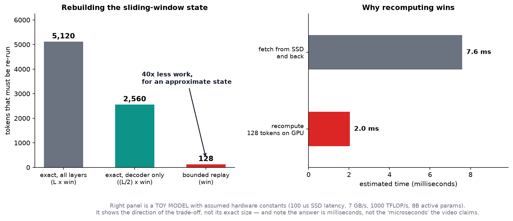

*Left, computed: 40× less recomputation, at the price of a state that is **not** mathematically identical to a full forward pass. Right: an explicitly-labelled toy model of why it's still worth it — moving bytes across a motherboard costs more than re-deriving them on a GPU.*

The justification for the approximation is empirical and comes from prior work: the *effective* receptive field of stacked sliding-window attention is much smaller than the theoretical `win × L/2`. The paper reports "negligible" quality impact, and additionally **simulates the same replay during post-training** so the model adapts to it.

> **This is the intellectually interesting move in the whole paper.** Every other mechanism here reduces recomputation. This one deliberately *adds* recomputation to buy back storage and bandwidth. The paper calls it "a new storage-computation trade-off", and that framing is more useful than any specific number: when the bus is the bottleneck, recomputing is a legitimate optimization, not a failure.

---

## 8. The supporting cast

### 8.1 Single-Pass mHC — plumbing, not intelligence

V4 introduced **mHC**, which maintains several residual streams between blocks rather than one. Implementing it took three sequential kernels because of a data dependency: the input-mixing step needs coefficients computed from the residual, so it can't start until a full reduction finishes. That doubled activation memory traffic against the theoretical minimum.

**Single-Pass mHC** removes the dependency with a one-line conceptual change: each block uses the mixing coefficients produced by the **previous** block. Nothing waits for anything. Fused into one **Mega-mHC** kernel, this **halves activation memory traffic** and the paper reports negligible quality cost.

The payoff is stated bluntly in §3.2: the vast majority of layers — the Reuse-mode ones — execute in **15 kernels during prefill and 11 during decode**. For an architecture this conceptually baroque, that is the real achievement.

### 8.2 Engram — 196B parameters that don't live on the GPU

| Property | Value |
|---|---|
| Size | **196B parameters**, separate from the 552B backbone |
| Where it lives | **host memory**, prefetched over background RDMA |
| Structure | 2 modules at layers 1 and 14; n-gram orders {2, 3, 4}; 8 hash heads; ~16M entries per head (sizes chosen as distinct primes); embedding dim 2048 per order; FP8 |
| Job | **conditional memory** — decouple *memorization* from *computation* |

The design intent: facts — dates, capitals, names — don't need a GPU. They need a lookup table. Keeping them out of HBM leaves the expensive memory for the work that actually requires reasoning. Because the addressing is deterministic, the embeddings can be prefetched in the background, overlapping the first transformer block's computation.

The lawyer analogy from the video is a good one: the senior lawyer reasons about the case; the assistant beside them produces the exact date on request. Note the proportion — Engram is **26% of the model's total parameters** and none of it competes for GPU memory.

### 8.3 DSpark — drafting several tokens at once

Speculative decoding, introduced as a **separate training stage after** pre-training (unlike V3's MTP, which trained jointly throughout):

- A drafter of **three transformer blocks** with a 128-token attention window.
- One forward pass produces base logits for **five draft positions in parallel**; a lightweight **Markov head** models dependencies between the drafts.
- A **confidence head** predicts per-position acceptance probabilities, which estimate how much of the draft prefix will survive verification.
- A scheduler combines those estimates with profiled throughput curves to pick the verification length **per request**, maximizing system-wide throughput under current load.

During post-training DSpark keeps training alongside the backbone but **without propagating gradients into it**, so it stays aligned with the evolving policy without distorting it.

---

## 9. Does any of it work? What the paper actually measured

### 9.1 The headline efficiency numbers

| Metric | DeepSeek-V4-Flash | DeepSeek-V4.1-Flash |
|---|---|---|
| Global KV cache (always in HBM) | ~3,560 B/token | **890 B/token** (~1/4) |
| Persistent KV cache (SSD / host) | baseline | **~1/8** |
| Backbone parameters | smaller | 552B (**larger**) |
| Active per token | — | **8B prefill / 16B decode** |
| Context | — | 1M tokens |
| Pre-training corpus | — | 45T multimodal tokens |

Read that table twice. The model is **bigger** than its predecessor and uses **a quarter** of the runtime cache — while scoring higher.

And the claim the video leads with, which the paper backs in Figure 2: **extending context 256-fold, from 4K to 1M, increases single-token decode FLOPs by only about 1/4.** Not 256×. Not 16×. About 25% more.

> **Why "nearly flat" and not "flat":** the first Full-mode indexer still scans the whole context (§5.3), and the cache itself still grows linearly with context — it's the *per-token decode work* that's nearly constant. If someone tells you V4.1 made long context free, that's the distinction they've lost.

### 9.2 Benchmarks

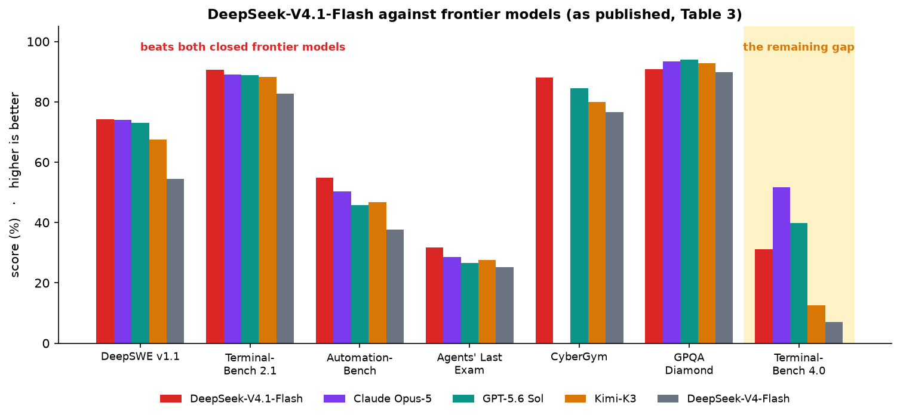

*Plotted from Table 3 of the technical report. All at Max reasoning effort.*

Where it leads:

| Benchmark | V4.1-Flash | Best closed model shown |
|---|---|---|
| **DeepSWE v1.1** (software engineering) | **74.2** | Opus-5: 74.0 · GPT-5.6 Sol: 73.0 |
| **Terminal-Bench 2.1** | **90.6** | Opus-5: 89.1 |
| **Automation-Bench** | **54.8** | Opus-5: 50.3 |
| **Agents' Last Exam** | **31.8** | Opus-5: 28.6 |
| **CyberGym** (security) | **88.1** | GPT-5.6 Sol: 84.5 — state of the art among open models |
| **Codeforces** (rating) | **3471** | vs V4-Pro 3348, V4-Flash 3289 |
| **MathArena Apex** | **65.6** | ties Kimi-K3's 65.6 |

Where it doesn't:

| Benchmark | V4.1-Flash | Opus-5 |
|---|---|---|
| **Terminal-Bench 4.0** (expert science tasks) | 31.2 | **51.8** |
| **Terminal-Bench 3.0** | 30.0 | **43.3** |
| **GPQA Diamond** | 90.9 | **93.4** (GPT-5.6 Sol: 94.1) |
| **ExploitGym** | 15.3 | 22.1 (GPT-5.6 Sol: 33.7) |

The paper states this gap plainly rather than burying it: *"a gap with giant models remains on science-oriented agentic tasks… that require expert-level domain knowledge."*

### 9.3 Buying accuracy with tokens

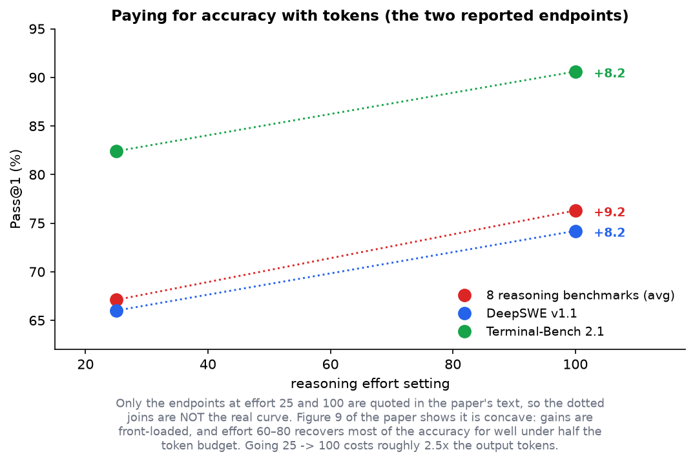

The model exposes a **reasoning-effort** dial from 25 to 100 (the public API maps low/high/max to 50/75/100). Turning it from 25 to 100 buys roughly +9 points averaged over eight reasoning benchmarks, at about **2.5× the output tokens** — and the paper notes the gains are front-loaded, with effort 60–80 capturing most of the benefit. The final step to 100 lengthens agent trajectories by 1.6–1.8× for marginal gain.

Notably, effort control learned on **single-response reasoning transferred to long-horizon agent trajectories**, where it governs how much the agent explores and verifies across turns. That's a genuinely useful finding for anyone building agents on a budget.

---

## 10. Real-world impact

### 10.1 What the compression actually buys

| Consequence | Why it follows |
|---|---|
| **More concurrent users per GPU** | the global cache must sit in HBM; 4× smaller means ~4× more simultaneous long conversations on the same hardware |
| **Cheaper long-context serving** | fewer bytes to move per generated token, and prefill costs half |
| **Agents become affordable** | an agent burning 50K-token prompts on every tool call was previously priced out; this is the paper's stated motivation |
| **Prefix caching stays cheap** | the persistent cache is 8× smaller, so more conversations stay warm on the same SSD |
| **Open weights** | the checkpoint is published on Hugging Face, so the savings are available to anyone who can serve it |

### 10.2 Where these ideas generalize beyond LLMs

The three-dimensions framework and the storage-vs-compute inversion aren't AI-specific:

- **Databases** have made the identical trade for decades: materialize a view (store) versus recompute on read. Column stores compress along the "entry size" dimension; partitioning along the "sequence" dimension.
- **CDNs and caches** face the same question the SWA replay answers — see the [system design note](System%20Design%20-%20APIs%20Databases%20Caching%20CDNs%20and%20Scaling.md) §8.3. "Recompute instead of fetch" is the same instinct as "don't cache what's cheap to derive".
- **The 1M req/s note** hit this wall from the other side: there, buffering in RAM beat writing to disk. Here, recomputing on the GPU beats reading from SSD. Both are the same observation — **moving data across a physical boundary is often the most expensive thing in the system.**

### 10.3 A published, controlled harness experiment

Table 4 of the paper is a gift to anyone who read the [harness note](Agent%20Harnesses%20-%20Why%20the%20Scaffold%20Beats%20the%20Model.md): the same checkpoint, same decoding config, same tasks, run under **eight different agent scaffolds**, changing only the system prompt, tool schema and turn-taking logic.

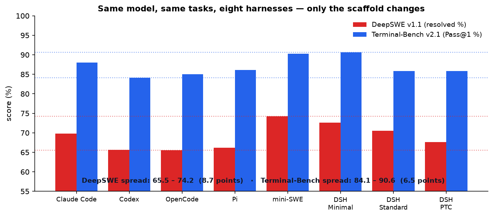

*An **8.7-point** spread on DeepSWE v1.1 and **6.5 points** on Terminal-Bench, from the harness alone. The paper frames this as evidence of *robustness* — the model doesn't collapse outside its native scaffold, which it credits to training on diverse tool schemas and interaction formats.*

Both readings are true and worth holding at once. A 6–9 point spread is small enough to call the model scaffold-robust, and large enough that **quoting a benchmark number without naming the harness is meaningless**. Note too that DeepSeek's own harness tops both benchmarks — model-harness co-design, which the paper's conclusion explicitly names as future work.

---

## 11. What the paper admits it doesn't know

Unusually for a release document, the limitations section is specific rather than ceremonial. It deserves reading in full, but three points matter most:

| Admitted limitation | Why you should care |
|---|---|
| **New architecture, uncharacterized robustness boundaries** | "no finite test suite can cover every extreme input and deployment condition" — the internal evaluations found no systematic degradation, but the surface is new |
| **Two named failure candidates** | **potential selection errors in CSA2** (the sparse indexer picks the wrong 512 entries) and **approximate state reconstruction in SWA Bounded Replay**. Both are approximations that the benchmarks happen not to stress |
| **Benchmark parity ≠ capability parity** | "this parity does not imply that the model matches the frontier capabilities of leading closed-source systems on complex, high-difficulty reasoning and edge cases". Saturated benchmarks compress real differences |

They name the specific things they'll stress-test next: **sparse retrieval over long contexts**, and **SWA state reconstruction at cache-resumption boundaries** — precisely the two approximations above.

> **If you deploy this model**, those two sentences are your test plan. Adversarial needle-in-a-haystack retrieval at 1M context, and multi-turn conversations that resume after a cache eviction, are where the architecture is most likely to behave differently from what the benchmarks predict.

---

## 12. Corrections to the video

The video is a good explainer and gets the architecture broadly right. Seven things to fix before you repeat them:

| # | The video says | The paper says |
|---|---|---|
| 1 | Engram has **168 billion** parameters | **196 billion**, split evenly across two modules at layers 1 and 14 |
| 2 | "DeepSeek **V1.1** scores 74.2 on the referenced benchmark" | The benchmark is **DeepSWE v1.1**, and 74.2 is V4.1-Flash's score on it — not a model called "V1.1" |
| 3 | Beats "GPT-6 Astro Max" on Automation Bench; roughly matches "GPT-6 Astra" | The paper's comparison set is **Claude Opus-5, GPT-5.6 Sol, Kimi-K3, GLM-5.3**. GPT-6 appears only in the conclusion, as a model V4.1 "closely approaches" |
| 4 | "Cyberjim" | **CyberGym** |
| 5 | The model is **open-sourced** and matches frontier models | True and stated — but the paper is explicit that benchmark parity is **not** capability parity (§11), and quantifies the remaining gap on Terminal-Bench 3.0/4.0 |
| 6 | Recomputing 128 tokens is "a **microsecond**-scale operation" | Order-of-magnitude estimate puts it in the **milliseconds**. The trade-off still favours recomputation, but by ~3–4×, not by orders of magnitude |
| 7 | Short-term memory is **deleted after each turn** | It's **not persisted to SSD**; it moves to a host-DRAM pool with a minutes-long TTL. Deletion is eviction, and bounded replay makes the resulting misses cheap |

Two more points of emphasis rather than error:

- **"Half the model skips reading entirely"** undersells it. Every decoder layer still computes sliding-window attention over its own hidden states. What it skips is building the *global* cache.
- **Compute and storage aren't the same problem.** The video blends them. The paper is careful: sparse attention had already solved long-context *compute*; this release is about *storage and bandwidth*, which is why it's a deployment paper as much as an architecture one.

---

## 13. Code: the arithmetic, runnable

Full file: [`code/deepseek_v41_kv.py`](../code/deepseek_v41_kv.py). Standard library only. It rebuilds the layer map from the published config and derives every budget from it.

```python
def layer_map():
    """Rebuild the per-layer CSA2 mode assignment described in Section 4.2.1."""
    layers = []
    for _ in range(SWA_ONLY):                           # first two: SWA only
        layers.append(("encoder", "SWA-only", 0))
    for g in range(3):                                  # encoder: 3 groups of 6
        layers.append(("encoder", "Full", 2))
        layers += [("encoder", "Reuse", 2)] * 5
    for g in range(5):                                  # decoder: 5 groups of 4
        layers.append(("decoder", "Full" if g == 0 else "Reindex", 1))
        layers += [("decoder", "Reuse", 1)] * 3
    assert len(layers) == LAYERS
    return layers
```

**Actual output (abridged):**

```
1. LAYER MAP: who actually stores a KV cache?
   SWA-only     2 layers
   Full         4 layers
   Reindex      4 layers
   Reuse       30 layers
   -> of 38 CSA2 layers, only 4 compute their own main KV (11%); 79% are pure Reuse

3. WHAT 890 BYTES/TOKEN BUYS YOU AT 1M TOKENS
   DeepSeek-V1               388.9 GB   =  202.6% of a 192 GB HBM module   ->    0.5 such contexts fit
   DeepSeek-V4-Flash           3.6 GB   =    1.9% of a 192 GB HBM module   ->   53.9 such contexts fit
   DeepSeek-V4.1-Flash         0.9 GB   =    0.5% of a 192 GB HBM module   ->  215.7 such contexts fit

5. HIERARCHICAL SPARSE INDEXER: positions scored per query
        context   flat indexer   hierarchical    saving
          4,000         32,000         32,000      1.0x
      1,000,000      8,000,000      1,114,688      7.2x

6. SWA BOUNDED REPLAY: replay cost vs exact reconstruction
   exact reconstruction needs L x win  = 5,120 tokens replayed
   bounded replay needs        win     =   128 tokens replayed

8. PREFILL SAVING FROM THE ENCODER/DECODER SPLIT
       prompt   all 40 layers   CED (20 + replay)    saving
        1,000          40,000              22,560     43.6%
    1,000,000      40,000,000          20,002,560     50.0%
```

**Try this:** (1) change the decoder groups in `layer_map()` from 5 groups of 4 to 10 groups of 2 and watch the Full-mode count — and the cache budget — double. (2) Change `CAND_POOL` and see how far you can shrink the candidate pool before the indexer saving stops mattering. (3) Change the SSD constants in section 7 to a fast local NVMe and find the point where fetching beats recomputing.

---

## 14. Common misconceptions

| Misconception | Reality |
|---|---|
| "V4.1 made long context free" | Per-token *decode* work is nearly flat. The cache itself still grows linearly, and prefill still scales with prompt length |
| "The decoder doesn't read the prompt at all" | It doesn't build *global* KV from it. It still runs sliding-window attention over its own hidden states in every layer |
| "Reuse-mode layers do nothing" | They compute their own query and their own SWA KV, and run attention. They just don't build a cache or an index |
| "The hierarchical indexer discards 98% of the context" | It restricts *later* indexers to a pool the first Full-mode layer selected. That first layer still scans everything |
| "Deleting the SWA cache is risky" | The risk is in the *approximate replay*, not the deletion. The paper flags exactly this as an uncharacterized boundary |
| "FP4 means the model is 4-bit" | Only the **main KV cache** is FP4. SWA KV is FP8; weights and activations are their own story |
| "A smaller cache must cost quality" | Bigger model + smaller cache + better scores, all at once. The compression is learned and trained-for, not applied after the fact |
| "This is the same as MLA" | MLA moved one dimension (entry size). CSA2 moves three, and the layer dimension is the new one |

---

## 15. Self-quiz

<details><summary><b>Q1 (easy).</b> Why does the KV cache have to live in HBM rather than on an SSD?</summary>

Because it's re-read **in full for every generated token**. Anything on the other side of a slow bus turns decoding into a waiting game — the GPU sits idle while data crosses the motherboard. Only the *persistent* prefix cache, which is read once at the start of a request, can tolerate living on SSD.
</details>

<details><summary><b>Q2 (easy).</b> What are the three CSA2 modes, and what does each one compute?</summary>

**Full:** its own main KV, indexer K, and top-K indices — everything. **Reindex:** reuses main KV and indexer K, but computes fresh top-K indices (a new index into shared notes). **Reuse:** reuses all three. All three still compute their own query and their own sliding-window KV.
</details>

<details><summary><b>Q3 (medium).</b> In the shipped model, how many of the 38 CSA2 layers actually store a main KV cache, and why does that matter more than it sounds?</summary>

**Four** — three in the encoder, one in the decoder. It matters because KV storage is what has to stay in HBM and is re-read per token, so cutting the number of layers that store anything cuts both capacity *and* the bandwidth burned per generated token.
</details>

<details><summary><b>Q4 (medium).</b> Name the three multiplicative dimensions of KV compression, with one technique for each.</summary>

**Entry size** (GQA, MLA's shared latent, FP4 precision) · **Sequence** (compress every *c* tokens into one entry — CSA, CSA2's rate-2 encoder) · **Layer** (cross-layer reuse — CSA2's Full/Reindex/Reuse). They multiply, which is why attacking all three at once is the paper's central claim.
</details>

<details><summary><b>Q5 (medium).</b> Exact SWA reconstruction needs 5,120 tokens replayed but bounded replay uses 128. Where does the factor of 40 come from, and what is given up?</summary>

From the number of layers: sliding-window dependencies compound, so rebuilding L layers exactly needs `L × win` = 40 × 128 = 5,120. Bounded replay replays only `win` = 128 and truncates the window to the replay segment. What's given up is exactness — the reconstructed state is **not** mathematically identical to a full forward pass. The paper reports negligible quality impact and simulates the replay during post-training so the model adapts to it.
</details>

<details><summary><b>Q6 (medium).</b> Why is it worth recomputing state on the GPU instead of fetching it from SSD, when every other mechanism in the paper reduces recomputation?</summary>

Because the bottleneck moved. Once sparse attention had cut long-context *compute*, the scarce resources became storage capacity and bus bandwidth. Recomputation spends the resource you now have spare (GPU FLOPs) to save the one you don't (I/O). The paper calls this "a new storage-computation trade-off" — the right answer depends on which side is scarce, and that changes over time.
</details>

<details><summary><b>Q7 (hard).</b> The decoder's global KV is projected from the encoder's final hidden state. Why doesn't this destroy the decoder's understanding of the prompt?</summary>

Two reasons. First, the projections are **layer-dependent** — each decoder layer applies its own learned transformation to the shared summary, so they don't all see the same thing. Second, CED keeps **layer-wise sliding-window attention in all 40 layers**, so the decoder retains full-resolution access to the local context; only the *global* pathway is inherited. The model is trained this way from the start, so the encoder learns to produce a summary the decoder can actually use.
</details>

<details><summary><b>Q8 (hard).</b> Why is decode cost "nearly" flat from 4K to 1M rather than exactly flat?</summary>

Two residual terms. The first Full-mode indexer in the decoder still **scans the entire causally visible range** to build the candidate pool — that term is linear in context. And the cache itself still grows linearly, so there's more to read even if fewer positions are scored. The paper reports a 256× context increase costing about 1/4 more decode FLOPs, not zero.
</details>

<details><summary><b>Q9 (hard).</b> Engram holds 196B parameters in host RAM. Why doesn't the RDMA round-trip destroy the latency benefit?</summary>

Because the addressing is **deterministic** — it's hash-based n-gram lookup, not something that depends on a computed attention score. So the required embeddings are known before they're needed and can be **prefetched in the background**, with the first module's transfer overlapping the first transformer block's computation. Contrast with the KV cache, where what you need depends on the current query, so prefetching is not possible and the data must already be resident.
</details>

<details><summary><b>Q10 (hard).</b> The same checkpoint scores 65.5 to 74.2 on DeepSWE across eight harnesses. Give one argument that this shows robustness and one that shows fragility.</summary>

**Robustness:** a 9-point spread across radically different system prompts, tool schemas and turn-taking protocols means the model's agentic behaviour isn't tied to one scaffold's conventions — it generalizes, which the paper credits to diverse training environments. **Fragility of the *measurement*:** 9 points is larger than the gap between V4.1-Flash and the closed frontier models it's being compared against, so a benchmark number without a named harness cannot be used to rank models. Both are true; they're claims about different things.
</details>

---

## 16. Glossary

| Term | Meaning |
|---|---|
| **Prefill / decode** | Reading the prompt (parallel, compute-bound) / writing the answer one token at a time (sequential, memory-bound) |
| **HBM** | High Bandwidth Memory: the GPU's own fast, small, expensive memory |
| **Global KV** | The cache spanning the full context: main KV plus indexer keys. Must stay in HBM |
| **SWA KV** | Sliding-window (local) keys and values; bounded by window size, not sequence length |
| **Persistent KV cache** | Cached prefixes kept on SSD or host memory so later requests can reuse them |
| **CED** | Causal Encoder-Decoder: the bottom half builds the global KV, the top half inherits it |
| **CSA2** | Compressed Sparse Attention 2: compression across entry size, sequence and layer dimensions |
| **Full / Reindex / Reuse** | CSA2's three statically-assigned layer modes |
| **Main KV / indexer K** | The cached values attention reads / the keys the lightweight indexer scores to pick them |
| **Top-K selection** | Choosing the 512 most relevant cached entries per query instead of attending to all |
| **Hierarchical Sparse Indexer** | A first-layer shortlist (16,384 positions) that bounds every later indexer's search |
| **Candidate pool** | That shortlist |
| **SWA Bounded Replay** | Rebuilding sliding-window state by replaying `win` tokens instead of `L × win`, accepting approximation |
| **FP4 / E2M1** | 4-bit float format used for the main KV cache, with an 8-bit scale per 16 channels |
| **QAT** | Quantization-aware training: training with the low-precision format in the loop |
| **mHC** | Multiple residual streams between blocks; **Single-Pass mHC** removes a data dependency to allow kernel fusion |
| **Engram** | A conditional memory module of hash-addressed n-gram embeddings, held in host RAM |
| **DSpark** | Speculative decoding: semi-autoregressive drafting with confidence-scheduled verification |
| **MoE** | Mixture of Experts: only a few experts run per token, so active parameters ≪ total |
| **Scaffold / harness** | The software around the model: prompts, tools, turn-taking (see the harness note) |

---

## 17. Further reading

1. **DeepSeek-AI (2026)**, *DeepSeek-V4.1-Flash: Pushing the Limits of KV Cache Compression* — the primary source for this guide. Sections 2.2–2.4 are the architecture; 3.2 is the deployment story; 6 is the honest limitations section.
2. **DeepSeek-AI (2024)**, *DeepSeek-V2* — where MLA was introduced, and the direct ancestor of all of this. Covered in [the MLA note](Multi-head%20Latent%20Attention%20-%20Shrinking%20the%20KV%20Cache.md).
3. **DeepSeek-AI (2025/2026)**, *DeepSeek-V3.2* (sparse attention, the lightning indexer) and the *V4* report (the CSA + HCA hybrid this one simplifies).
4. **Sun et al. (2024)**, *YoCo: You Only Cache Once* — the cache-sharing idea CED builds on.
5. **Brandon et al. (2024)**, *Reducing Transformer Key-Value Cache Size with Cross-Layer Attention* — the layer dimension, before CSA2.
6. **Bai et al. (2026)**, *IndexCache*; **Sun et al. (2026)**, *YOIO*; **Gao et al. (2026)**, *HySparse* — the three prior approaches §2.3 of the paper positions against.
7. **Ainslie et al. (2023)**, *GQA* — the entry-size dimension, and still the default in most open models.
8. **Rouhani et al. (2023)**, *Microscaling (MX) formats*, and NVIDIA's **NVFP4** — the 4-bit formats §6 discusses.

---

*Source video: [Deepseek just did the impossible](https://youtu.be/MImgH4KMtj8?si=be0iHHzOhsQO2Pbr) by AI Search; primary source the DeepSeek-V4.1-Flash technical report. Figures generated by `figures/deepseek_v41/make_figs.py`: the layer map, cache budgets, prefill and indexer curves are computed from the paper's published configuration; the benchmark and scaffold charts plot its published tables; figure 8's right-hand panel is a labelled toy model with assumed hardware constants.*
