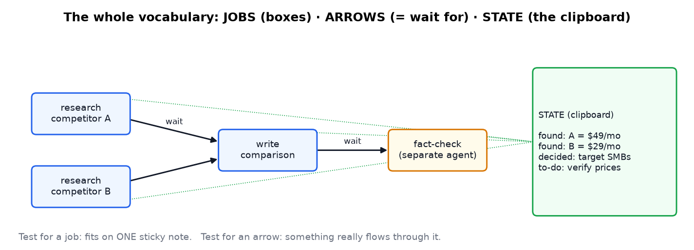
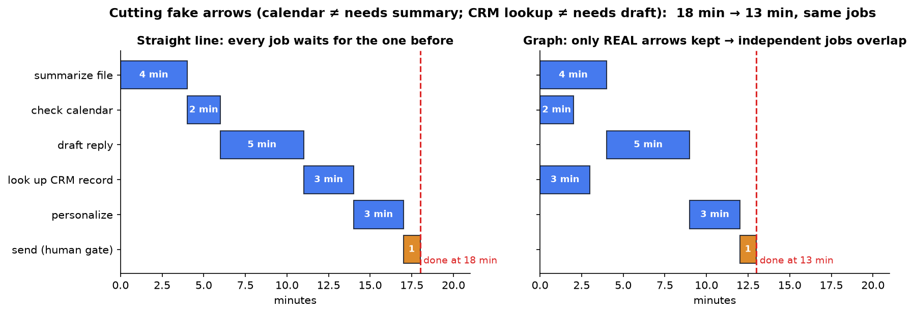
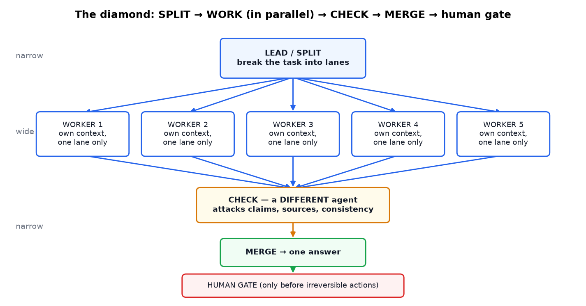
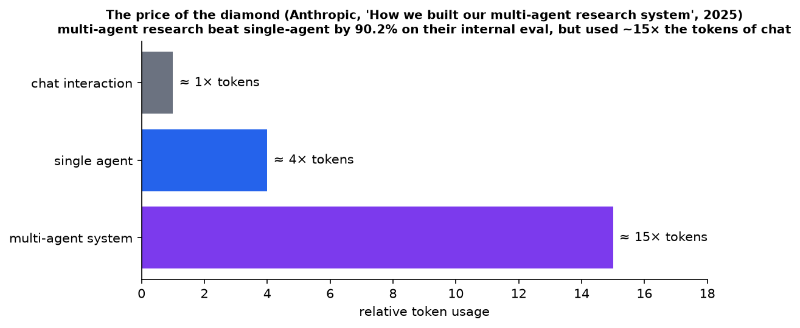
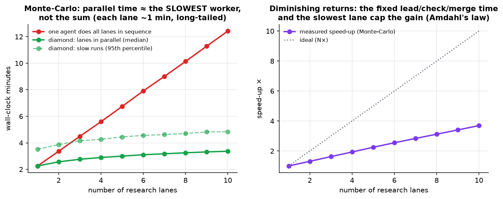
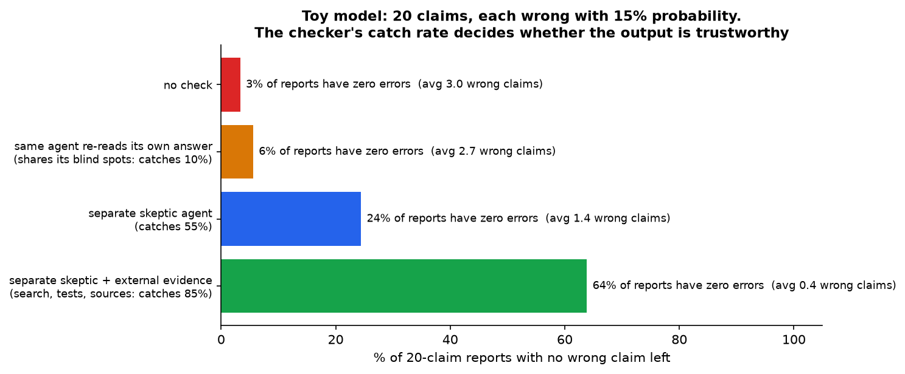
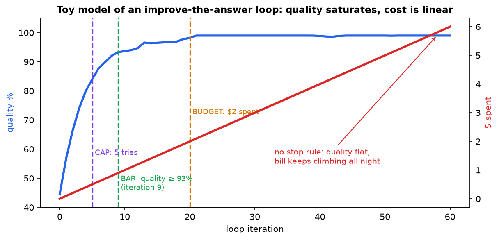
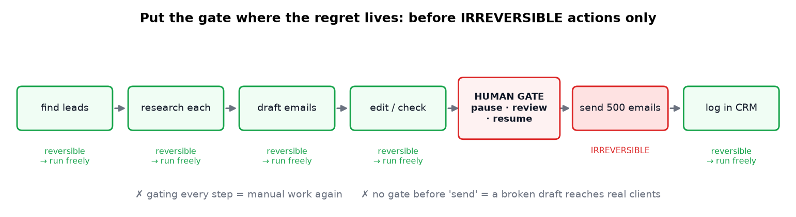
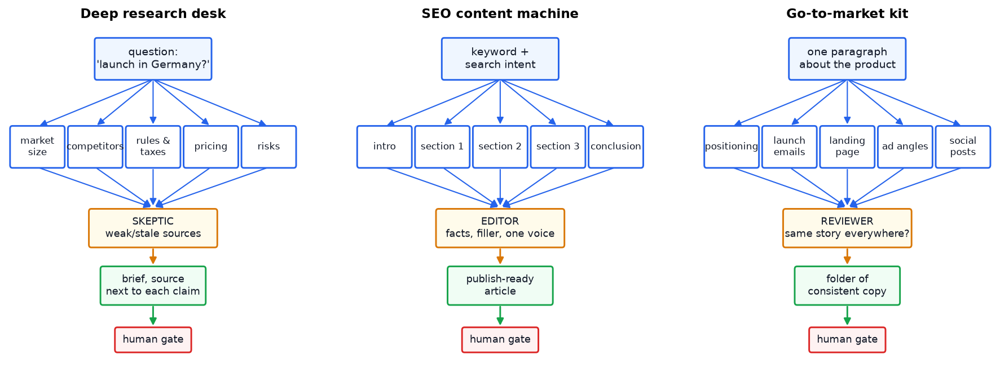

# How to Master Graph Engineering (Agent Workflows as Graphs)

> **Source:** [How to Master Graph Engineering (Full Course 25 minutes)](https://youtu.be/-90E2Pke9BQ?si=mta-DPqL5bQbZfgn) by Cloud AI
> **Related notes:** [Why the Harness Matters](Agent%20Harnesses%20-%20Why%20the%20Scaffold%20Beats%20the%20Model.md) (graphs are one kind of harness) · [BM25 for agentic search](BM25%20-%20Keyword%20Search%20for%20AI%20Agents.md)
> **What's in this version:** 9 figures (critical-path Gantt charts, Monte-Carlo latency, cost and quality models, all the architecture diagrams), the computer-science ideas behind "graphs" (DAGs, topological order, Amdahl's law), corrections and nuance on the cited Anthropic and DeepMind results, a working graph runner with parallel jobs, a checker, stop rules and a human gate, a quiz, and a glossary.
> **Facts re-checked:** 18 September 2026. The design principles here are decades-old and haven't moved. One thing has shifted in practice since the video — see §9.1 on how much orchestration you should hard-code now that models plan well on their own.

---

## 0. How to use this guide

| If you have… | Read |
|---|---|
| 10 minutes | §0.1 plain-words intro, §1 TL;DR, plus figures 2, 3 and 7 |
| 1 hour | §1–§9 |
| A weekend | Everything. Run `code/graph_runner.py` and turn one of your own workflows into a graph |

---

### 0.1 First, in completely plain words

Forget AI for a second and think about cooking a roast dinner.

You don't do it as a straight list of steps, one after the other, because that would take four hours. You work out what actually **has to wait for what**. The potatoes can't go in the oven until it's hot. The gravy can't be made until the meat is cooked. But peeling the carrots doesn't depend on any of that — so you do it while other things are in the oven. **Anything that doesn't genuinely depend on something else can happen at the same time.**

That's the whole subject. Written down, a plan like that is a **graph**: boxes for jobs, arrows for "this one has to wait for that one". Three words carry the entire thing:

| Word | Plain meaning |
|---|---|
| **Job** | one task you could hand to one person and walk away |
| **Arrow** | "you can't start this until that one gives you its result" |
| **State** | the shared notepad everyone reads and adds to |

The four practical lessons follow from that picture, and none of them need any maths:

1. **Most arrows people draw are fake.** They wrote "and then" out of habit, not because anything actually flows through. Delete those and the work runs in parallel.
2. **The useful shape is a diamond:** split the work up → do the pieces at the same time → have *someone else* check them → merge. That "someone else" matters, because models are bad at marking their own homework.
3. **Every loop needs a stop rule, decided in advance.** Otherwise "keep improving this" runs all night and costs real money for no improvement.
4. **Ask a human only before the things you can't undo** — sending, publishing, paying, deleting. Everything reversible should run at full speed without asking.

This isn't new. Build systems have worked this way since 1976 and data pipelines since the 2000s. What's new is that the workers are now AI agents — and that changes the economics but not the design skill.

---

## 1. TL;DR in 8 lines

1. A **graph** is a drawn plan of AI work: **jobs** (boxes), **arrows** (= "wait for this result"), and **state** (a shared clipboard).
2. Every arrow adds waiting. **Cut fake arrows** (steps that don't really need each other's output) so independent jobs **run in parallel**.
3. The pattern worth mastering is the **diamond**: **split → work in parallel → check → merge**.
4. The **check** must be a **different agent** (ideally one with **external evidence**). Models are bad at grading their own work.
5. Parallelism has a price: multi-agent systems use **far more tokens** (Anthropic reports ~15× a chat). Use a diamond only when the task is worth it.
6. Every loop needs a **stop rule** *before* it runs: a **cap** (max tries), a **budget** (max $ or calls), and/or a **bar** (a quality threshold).
7. Put a **human gate** only before **irreversible** actions (send, publish, pay). Everything reversible runs freely.
8. It's an old idea (build systems, schedulers, workflow engines) with new, easier tooling. That's exactly why it's reliable.

---

## 2. "A decades-old idea in a new hoodie": and that's good

Engineers have been running work as **dependency graphs** for decades:

| Era | Graph-based system | What the boxes are |
|---|---|---|
| 1976 | **Make** (build systems) | compile steps |
| 1990s–2000s | business-process & workflow engines (BPMN), bank batch jobs, airline scheduling | business tasks |
| 2004–2014 | MapReduce, **Apache Spark**, **Airflow** (DAG schedulers) | data-processing steps |
| 2015+ | TensorFlow / PyTorch computation graphs | math operations (see the backprop note) |
| 2023+ | **LangGraph**, CrewAI, n8n, Temporal, OpenAI Agents SDK, visual agent builders | LLM calls, tools, human approvals |

**What's new:** drag-and-drop tools that generate the wiring, and "workers" that are LLM agents. The *design skill* (what depends on what) is the same as it always was.

> **Context from the video:** Boris Cherny (who built Claude Code) described writing **loops that prompt the AI for him** and running many agents overnight. Graphs are the natural next step: structure those loops so they're fast, checked and bounded.

---

## 3. Lesson 1: jobs, arrows, state



| Word | Definition | Test |
|---|---|---|
| **Job** | one task you'd hand to one assistant and walk away | fits on **one sticky note** (needs three? It's three jobs) |
| **Arrow** | "this job can't start until that job hands over its result" | **something actually flows through it** |
| **State** | running notes shared along the way: found, decided, still to do | every job can read and add to it |

**Why state matters:** a checklist lists steps. With state, the work **carries memory**, so a job halfway down can use something discovered at the very top, without workers talking to each other directly.

> **In CS terms:** a graph with arrows that never loop back is a **DAG** (directed acyclic graph). The order jobs can run in is a **topological order**. The longest chain of waits (the **critical path**) sets the total time, no matter how many workers you have.

### 3.1 Hunting fake arrows

Find every hidden **"and then"** in your system and ask: *does the next job actually need the previous job's result?*



*The same six jobs scheduled two ways (computed from the dependencies). As a straight line: **18 min**. After removing fake arrows ("check calendar" never needed the summary, and "look up CRM record" never needed the draft), independent jobs overlap: **13 min**. Only the real chain summarize → draft → personalize → send sets the finish time.*

**A straight line is the slowest possible design:** one stuck job freezes everything behind it, like one stalled car causing a mile of brake lights.

---

## 4. Lesson 2: the diamond



**Four moves: split, work, check, merge.** Narrow at the top (one plan), wide in the middle (parallel lanes), narrow at the bottom (one checked answer).

**A napkin example:** three workers research the same company (website, customer reviews, news), then a fourth reads all three and writes an honest summary.

### 4.1 In production: Claude's Research feature

Anthropic's engineering post *"How we built our multi-agent research system"* (June 2025) describes this shape:

- A **lead agent** (Claude Opus 4) plans the angles and spawns **3–5 subagents** (Claude Sonnet 4) in parallel.
- Each subagent works in its **own context window**, independently. They don't chat with each other.
- The lead combines the results, and a separate step adds citations.

**Published results, with the nuance the video skips:**

| Claim | What Anthropic reported | Nuance |
|---|---|---|
| "90% better" | the multi-agent system beat single-agent Claude Opus 4 by **90.2%** on their internal research eval | this used a **bigger lead model plus many more tokens**, not "just the shape" |
| "up to 90% faster" | parallel subagents plus parallel tool calls cut research time **by up to 90% for complex queries** | for simple queries the overhead isn't worth it |
| why it works | **token usage alone explained ~80% of the performance variance** on BrowseComp | more parallel context windows = more total thinking |

### 4.2 The price of the diamond



*Anthropic's numbers: agents use ~4× the tokens of a chat, and multi-agent systems ~15×. The diamond buys speed and breadth **with money**. It pays off for high-value, parallelizable tasks, not for "rename this variable".*

### 4.3 Parallelism has limits (Amdahl's law)



*Monte-Carlo simulation (20,000 runs). Left: running lanes in sequence grows linearly. In parallel, total time ≈ lead + **the slowest** lane + check + merge. Right: 10 lanes give only ~3.7× speed-up, not 10×. The fixed lead/check/merge time and the long tail of slow lanes cap the gain. This is **Amdahl's law**, the same limit that applies to CPUs and distributed systems.*

**Engineering tips:** set **timeouts per lane** (so one stuck lane doesn't stall the whole diamond), and consider a **"good enough quorum"** (merge when 4 of 5 lanes are done).

### 4.4 The check step is non-negotiable

**The research:** Huang et al. (Google DeepMind, ICLR 2024), *"Large Language Models Cannot Self-Correct Reasoning Yet"*. When models were asked to review and fix their own answers **with no external feedback**, accuracy didn't improve, and it often **got worse**, because they changed correct answers into wrong ones.



*A toy model to build intuition (the catch rates are illustrative assumptions, not measurements). A 20-claim report where each claim is wrong 15% of the time is almost never fully correct. A checker that shares the writer's blind spots barely helps. An independent skeptic helps, and a skeptic with **external evidence** (search results, running the code, checking sources) helps most.*

**The rule:** never let the writer grade its own homework. Better checkers, from weak to strong:

1. same model, same context, "please double-check" (weak)
2. a **separate agent** with a critical role ("find the weakest claim and try to break it")
3. a different model, or a different prompt and context
4. **external ground truth**: tests that must pass, sources that must be fetched, schemas that must validate (strongest)

**Anthropic's own caveat:** *start with the simplest thing that works.* A single call beats a diamond for small tasks.

---

## 5. Lesson 3: the stop rule

A **loop** repeats until something stops it. Forget the stop condition and it keeps calling the model and spending money, often getting slightly **worse** each round.



*A toy model of an "improve the answer" loop. Quality climbs quickly, then flattens. Cost rises in a straight line forever. Each stop rule cuts the bill at a different point: the **cap** stops early and safely, the **bar** stops when the answer is good enough, the **budget** stops at a spending limit. With no rule, the bill keeps growing overnight while quality stays flat.*

| Stop rule | Example | Strength | Weakness |
|---|---|---|---|
| **Cap** | "at most 5 tries, then give me what you have" | guarantees it ends | blunt: may stop before good or long after |
| **Budget** | "at most $2 or 50 calls" | turns cost into a fixed line item | needs cost tracking |
| **Bar** | "stop as soon as tests pass / the checker scores ≥ 0.9" | stops at *good enough* | the bar might never be met, so **combine it with a cap** |

**Starter setting from the video:** 3 tries and a $2 cap. Watch one real run, then loosen.

**Production extras:** detect **no-progress** (the same answer twice → stop), set wall-clock timeouts, and alert on spend.

---

## 6. Lesson 4: the human gate

A deliberate pause: **pause → review → resume** (approve, or send it back with a note like "too aggressive, soften it").



*Gate only the steps you can't undo. Reversible steps (research, drafting, editing) run at full speed. The gate goes right before "send 500 emails".*

| Gate these (irreversible or external) | Don't gate these (reversible or internal) |
|---|---|
| sending emails or messages | searching, reading |
| publishing posts or pages | drafting, rewriting |
| payments, refunds, purchases | internal notes, summaries |
| deleting data, deploying to production | running tests in a sandbox |
| signing up or granting permissions | creating a draft PR |

**Two failure modes:**

- **No gate:** a broken draft goes out to a real client list.
- **Too many gates:** the "automation" becomes manual clicking, one nervous approval at a time.

> **Engineering note:** real gates need **durable state**. The run has to survive hours of waiting for a human. Workflow engines (Temporal, LangGraph checkpoints) save the graph's state so it can resume exactly where it paused.

---

## 7. Three complete builds



### 7.1 Deep research desk

**Input:** a fuzzy, high-stakes question: *"Should we launch in Germany next quarter?"*

| Stage | Job | Prompt idea |
|---|---|---|
| Lead | split into 5 sharp sub-questions: market size, competitors, rules & taxes, price tolerance, risks | "Split my question into five distinct research angles and nothing more." |
| 5 workers | each answers **one** angle with real, cited sources | "Answer only your angle, cite every source, don't guess. If you can't find something solid, say so." |
| Skeptic | tries to kill weak sources, stale numbers, unsupported claims | "Attack every claim, flag anything thin or outdated, keep only what holds up." |
| Merge | one brief, **each source next to the claim it supports** | |
| Human gate | you read and approve before it counts | |

**Effect:** two days of analyst work becomes minutes of running plus a ~20-minute review.

### 7.2 SEO content machine

**Input:** a keyword **plus search intent**. "best CRM for small teams" means the reader wants an honest comparison with a recommendation, not a definition.

Lead writes the outline and assigns sections → writers draft sections in parallel → a **separate editor** fact-checks, cuts filler and unifies the voice → merge → human gate (it carries *your* name).

### 7.3 Go-to-market kit

**Input:** one paragraph about the product.

Parallel lanes: positioning, launch emails, landing page, ad angles, social posts → **reviewer checks cross-piece consistency** (does every piece promise the same thing in the same voice?) → one folder → human gate.

> **A dependency to notice (a *real* arrow):** positioning is "the core promise everything else must hang from". Strictly, the emails, page and ads **depend on it**, so a better graph runs positioning **first**, then the other four in parallel. Running all five at once saves time but is exactly why the reviewer so often has to fix drift.

---

## 8. Common beginner mistakes

| Mistake | Consequence | Fix |
|---|---|---|
| writer checks its own work "to save a node" | confident errors pass through | a separate checker, ideally with external evidence |
| no stop rule, run overnight | the graph works perfectly… thousands of times | cap + budget before the first run |
| gating every step | manual work with extra steps | gate only irreversible actions |
| diamond for a tiny task | 15× the tokens for no benefit | start with a single call |
| keeping a fake arrow "just in case" | pays the delay on every run | ask what actually flows through it |
| cutting a *real* arrow | lanes contradict each other | keep dependencies where information truly flows |
| shared state as an unstructured blob | workers overwrite each other | a typed state schema, append-only notes |

---

## 9. Where this is used in real engineering

| Domain | Graph shape |
|---|---|
| **Coding agents** | plan → parallel sub-agents per file or module → run tests (the external check) → PR → human review gate |
| **Customer support** | classify → retrieve policy + order data in parallel → draft → policy check → human gate for refunds |
| **Data pipelines** | Airflow/Dagster DAGs with LLM steps (extraction, classification) |
| **Due diligence / research** | the research-desk diamond with citations |
| **Content ops / marketing** | the SEO and GTM builds |
| **Security triage** | parallel enrichment of an alert (logs, threat intel, asset DB) → analyst gate before containment |
| **CI/CD** | a build graph with parallel tests and a manual approval before production deploy (the original human gate) |

### 9.1 One thing that has shifted since the video (checked September 2026)

Everything above is still sound. But there's a live tension worth knowing about before you go and draw fifty boxes.

**The question:** should *you* design the graph, or should the agent?

When these tools appeared, models couldn't plan reliably, so people hard-coded the shape: plan node → research nodes → critic node → merge node. Current frontier models will discover that structure themselves if you simply give them the ability to spawn parallel sub-tasks. The [harness note](Agent%20Harnesses%20-%20Why%20the%20Scaffold%20Beats%20the%20Model.md) makes the stronger version of this argument: *give primitives, not procedures*, because every hard-coded step is a decision the next, better model isn't allowed to improve on.

A reasonable rule of thumb as of 2026:

| Hard-code the graph when… | Let the agent decide when… |
|---|---|
| The steps are **known and stable** (a nightly report, an onboarding flow) | The task is **open-ended** (research, debugging, "figure out why this is slow") |
| You need **auditability** — someone must be able to see exactly what ran | Exploration matters more than reproducibility |
| There are **compliance or safety gates** that must fire every time | You're prepared to pay for extra tokens in exchange for better strategies |
| Cost must be **predictable per run** | You have good stop rules and budgets to contain it |

What does *not* change either way: the stop rules (§5), the human gates (§6), and the rule that the checker must be someone other than the writer (§4.4). Those are properties of the system you're building, not of the model you're using — and they're the parts that fail expensively when skipped.

---

## 10. Code: a tiny graph runner (tested)

Full file: [`code/graph_runner.py`](../code/graph_runner.py). It runs jobs as soon as their arrows are satisfied, shares a `state` dict, uses an independent skeptic loop with **cap + bar**, stops everything with a **budget**, and pauses at a **human gate**.

```python
async def run(self, state, parallel=True):
    done, running = set(), {}
    while len(done) < len(self.jobs):
        # a job is READY when every arrow into it is satisfied
        ready = [j for j in self.jobs if j not in done and j not in running and self.deps[j] <= done]
        for j in ready:
            running[j] = asyncio.create_task(self.jobs[j](state))      # start all ready jobs at once
        finished, _ = await asyncio.wait(running.values(), return_when=asyncio.FIRST_COMPLETED)
        for j in [k for k, t in running.items() if t in finished]:
            running.pop(j).result()      # re-raises "STOP RULE (budget)" if money ran out
            done.add(j)
```

**Actual output** (LLM calls simulated):

```
straight line   : 1.88s  spent $0.20  check={'rounds': 3, 'quality': 0.95}  approved=True
graph (parallel): 0.77s  spent $0.18  check={'rounds': 2, 'quality': 0.93}  approved=True
loop stopped after 5 paid calls (budget $0.10) -> STOP RULE (budget): out of money
```

The graph finished **~2.4× faster** with the same jobs. The skeptic stopped at 2 rounds when it reached the quality bar, and the runaway loop was stopped by its budget.

---

## 11. Self-quiz

<details><summary><b>Q1 (easy).</b> What are the three vocabulary words, and what does an arrow mean?</summary>

Jobs, arrows, state. An arrow means **wait**: the job can't start until the other one hands over its result.
</details>

<details><summary><b>Q2 (easy).</b> "Summarize this file and then check my calendar." Real or fake arrow?</summary>

Fake. The calendar check doesn't use the summary, so the two jobs can run in parallel.
</details>

<details><summary><b>Q3 (medium).</b> Jobs A(3 min) → C(4 min), B(5 min) → C, and D(2 min) independent. Sequential time vs graph time?</summary>

Sequential: 3+5+4+2 = **14 min**. Graph: C starts after max(A, B) = 5, finishes at 9. D runs in parallel. Total **9 min** (the critical path is B→C).
</details>

<details><summary><b>Q4 (medium).</b> Why can't 10 parallel lanes give a 10× speed-up?</summary>

Fixed sequential steps (lead, check, merge) still take the same time, and parallel time is set by the **slowest** lane (tail latency). This is Amdahl's law.
</details>

<details><summary><b>Q5 (medium).</b> Why is a separate checker better than self-review, and what makes a checker strongest?</summary>

A model reviewing its own output shares its blind spots and tends to confirm (or wrongly "fix") its own answer. A separate adversarial agent is better. Checks grounded in **external evidence** (tests, fetched sources, validators) are strongest.
</details>

<details><summary><b>Q6 (medium).</b> Design stop rules for a "fix the failing tests" loop.</summary>

Bar: all tests pass → stop. Cap: max 6 attempts. Budget: max $3. Plus no-progress detection: the same failing test output twice → stop and report.
</details>

<details><summary><b>Q7 (hard).</b> Anthropic's multi-agent system beat single-agent by 90%. Why is "the shape alone did it" an oversimplification?</summary>

It used a stronger lead model (Opus 4) with Sonnet 4 subagents, and ~15× more tokens than chat. Token usage explained ~80% of performance variance. The shape is valuable *because* it lets you spend more tokens in parallel, separate contexts.
</details>

<details><summary><b>Q8 (hard).</b> In the GTM kit, what dependency does running all five lanes in parallel ignore, and what's the trade-off?</summary>

Emails, landing page, ads and social posts depend on the positioning. Running positioning first then the rest in parallel improves consistency and costs a few minutes. Running everything at once is faster but relies on the reviewer to fix drift.
</details>

<details><summary><b>Q9 (hard).</b> Where would you put human gates in an agent that manages cloud infrastructure?</summary>

Before deleting resources, changing production or security settings, scaling that increases spend beyond a threshold, and rotating credentials. Not before read-only inspection, cost reports or drafting a change plan.
</details>

---

## 12. Glossary

| Term | Meaning |
|---|---|
| **Graph** | Jobs (nodes) connected by dependencies (edges) |
| **DAG** | Directed acyclic graph: arrows never loop back |
| **Topological order** | An order where every job comes after everything it depends on |
| **Critical path** | The longest dependency chain, which sets total duration |
| **Fake arrow** | A dependency where nothing actually flows |
| **State** | Shared, running notes available to every job |
| **Diamond / fan-out–fan-in** | Split → parallel work → check → merge |
| **Orchestrator–worker** | A lead agent that delegates to sub-agents |
| **Self-correction** | A model reviewing and revising its own output |
| **Stop rule** | Cap, budget or bar that ends a loop |
| **Human gate / human-in-the-loop** | A pause for human approval before continuing |
| **Amdahl's law** | Speed-up is limited by the parts that can't be parallelized |
| **Checkpointing** | Saving workflow state so it can resume after a pause or crash |

---

## 13. Further reading

1. **Anthropic (2024)**, *Building Effective Agents*: workflows vs agents, prompt chaining, parallelization, orchestrator-workers, evaluator-optimizer.
2. **Anthropic (2025)**, *How we built our multi-agent research system*.
3. **Huang et al. (2024, ICLR)**, *Large Language Models Cannot Self-Correct Reasoning Yet*.
4. **LangGraph documentation**: state graphs, checkpoints, human-in-the-loop interrupts.
5. **Temporal.io docs**: durable workflows (long waits, retries, human signals).
6. **Madaan et al. (2023)**, *Self-Refine*, and **Shinn et al. (2023)**, *Reflexion*: when iterative refinement *does* help (with feedback).

---

*Source video: [How to Master Graph Engineering](https://youtu.be/-90E2Pke9BQ?si=mta-DPqL5bQbZfgn) by Cloud AI. Figures generated by `figures/graph_engineering/make_figs.py`. Figures 2 and 4 are computed, 5 and 6 are labelled toy models, and 9 uses Anthropic's published numbers.*
