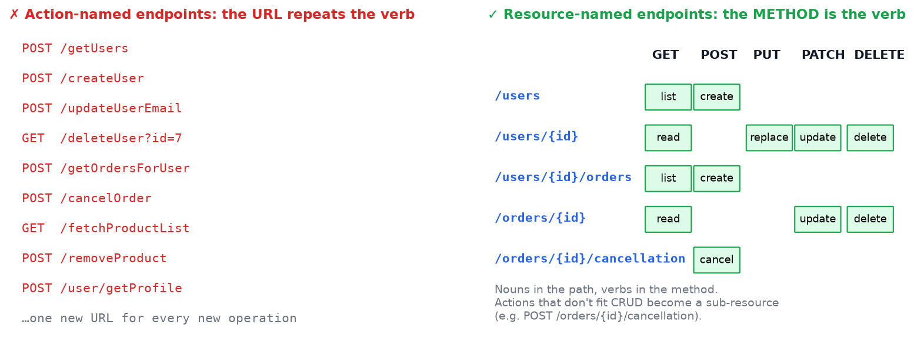
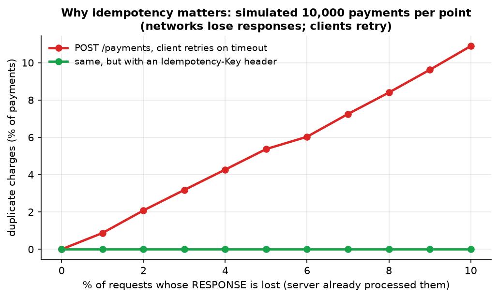
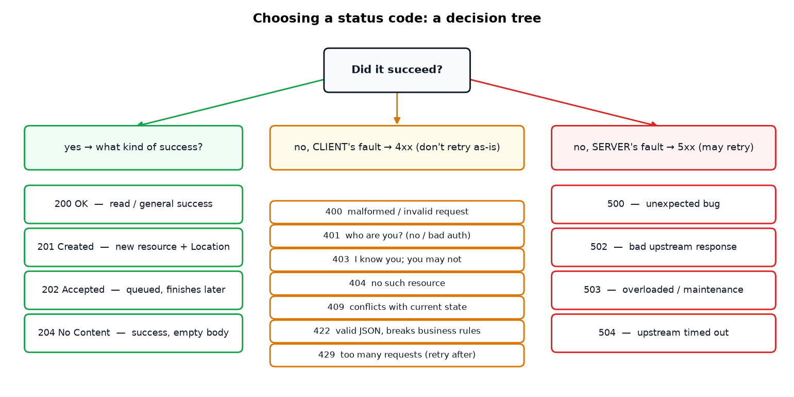
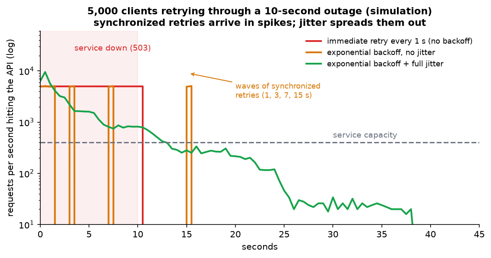
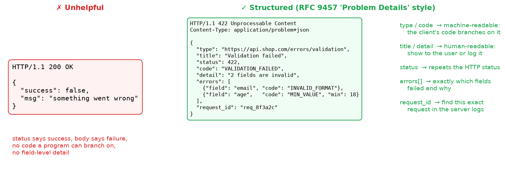
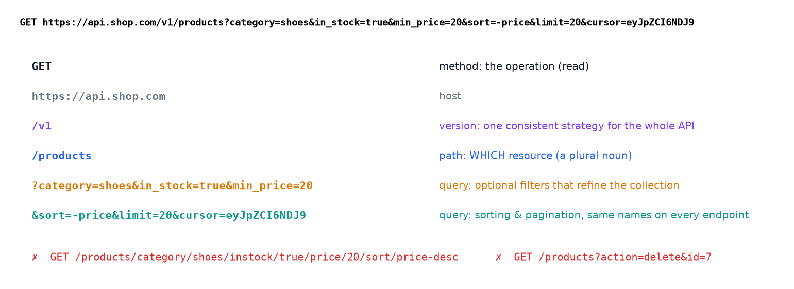
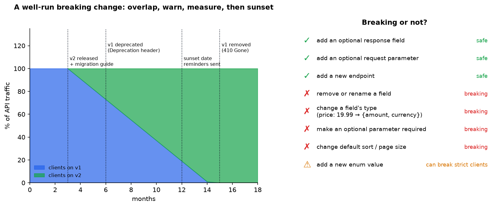

# 8 API Laws of Senior Backend Developers

> **Source:** [8 API Laws of Senior Backend Developer](https://youtu.be/-40xErgJIBg?si=nxSdS1lhc_PbHyLD) by Cloud X Berry
> **Related notes:** [System Design Explained](System%20Design%20-%20APIs%20Databases%20Caching%20CDNs%20and%20Scaling.md) · [1 Million Requests per Second](Scaling%20to%201%20Million%20Requests%20per%20Second.md)
> **What's in this version:** 8 figures (including simulations of retries and duplicate payments, and pagination speed measured on a 1M-row database), how real companies (Stripe, GitHub, Google) apply each law, the method-semantics table, a status-code decision tree, a working API written in pure Python that follows all 8 laws, a design checklist, and a quiz.
> **Facts re-checked:** 18 September 2026. Two standards-status updates since the first version: the `Deprecation` header is now **RFC 9745** (§8), and the `Idempotency-Key` header is **still not an RFC** despite being universal in practice (§4.3). Everything else — RFC 9110 method semantics, RFC 9457 problem details — is unchanged.

---

## 0. How to use this guide

| If you have… | Read |
|---|---|
| 10 minutes | §0.1 plain-words intro, §1 TL;DR, then the §11 checklist |
| 1 hour | §1–§10 |
| A weekend | Everything. Run `code/rest_api_server.py` and extend it with PATCH |

---

### 0.1 First, in completely plain words

An **API** is the set of doors you leave open on your server so other people's programs can come in and get things done. If you're building a web app, your own front-end is one of those "other programs".

Designing an API well is mostly about **not surprising people**. Someone using your API is reading your documentation on a second monitor at 6pm. Every time they have to stop and look something up, you've cost them time; every time they can *guess* correctly, you've saved it. That's the actual goal — not "being RESTful".

The eight laws are eight kinds of guessability. The single idea underneath all of them:

> **The address says *which thing*. The verb says *what to do with it*. Everything else stays out of the address.**

So `/orders/42` names a thing, and `GET`, `DELETE` or `PUT` says what you want done to it. You never need `/getOrder`, `/deleteOrder`, `/updateOrderStatus` — the verb is already built into HTTP, and repeating it in the URL is how APIs end up with four hundred endpoints nobody can remember.

Two pieces of vocabulary you'll meet in Law 3 and will need later:

| Term | Plain meaning | Why it matters |
|---|---|---|
| **Safe** | the call only *reads*; it changes nothing | browsers, caches and crawlers will happily call these on their own — which is why `GET /deleteUser?id=7` is a genuine disaster waiting to happen |
| **Idempotent** | calling it five times leaves things exactly as calling it once | networks drop responses all the time. If a call is idempotent, a client can safely retry. If it isn't, retrying might charge someone twice |

Most of the real engineering pain in this guide traces back to that second row.

---

## 1. TL;DR: the 8 laws in one table

| # | Law | One-line rule | What goes wrong if you break it |
|---|---|---|---|
| 1 | **Resources, not actions** | nouns in the path, verbs in the HTTP method | URL sprawl: one new endpoint per operation |
| 2 | **Predictable URLs** | one naming pattern: `/users`, `/users/{id}` | developers memorize every corner of your API |
| 3 | **Methods mean what they say** | GET reads, POST creates, PUT replaces, PATCH updates, DELETE removes | retries create duplicates, caches serve wrong data |
| 4 | **Useful status codes** | the status alone says what category of result happened | `200 OK` with `"error"` in the body; clients parse two places |
| 5 | **Consistent errors** | one structured error shape everywhere, with field-level details | clients can't react programmatically |
| 6 | **Path ≠ everything** | path = which resource, query = filters, method = operation | unmaintainable URLs, `GET ?action=delete` |
| 7 | **Careful changes** | additive changes are safe; breaking ones need versioning and a migration path | existing clients break overnight |
| 8 | **Consistent formats** | one naming convention, date format, pagination and error shape | every endpoint needs its own docs |

**The meta-law:** decide the **patterns first** (naming, errors, pagination, versioning), then build endpoints. A good API makes the *correct way to use it* obvious.

---

## 2. Law 1: design around resources, not actions



*Left: action names put the verb in the URL, so every new operation means a new URL. Right: a few resource URLs combined with the standard HTTP methods cover the same operations with a predictable grid.*

**Why:** HTTP already has a verb (the method). Writing `POST /createUser` says "create" twice. With resources:

- The **URL** answers *what* (`/orders/42`).
- The **method** answers *what to do* (`GET`, `PUT`, `DELETE`).

**Operations that aren't CRUD** (cancel, refund, publish) come up constantly in real systems. Common patterns:

| Pattern | Example | Used by |
|---|---|---|
| **Sub-resource** (create a "cancellation") | `POST /orders/42/cancellation` | many REST APIs |
| **Custom method** | `POST /orders/42:cancel` | Google API Design Guide (AIP-136) |
| **State change via PATCH** | `PATCH /orders/42 {"status": "cancelled"}` | when the state machine is simple |
| **Action sub-path** | `POST /charges/ch_123/refunds` (refund is a resource!) | Stripe |

---

## 3. Law 2: make URLs predictable

| ✗ Inconsistent | ✓ Consistent |
|---|---|
| `/user`, `/customers`, `/customer_profiles` | `/users`, `/customers`, `/customer-profiles` |
| `/getOrder?id=5`, `/orders/5/details` | `/orders/5` |
| `/Products`, `/product-list` | `/products` |

**Rules of thumb:**

- **Plural nouns** for collections: `/products`. One item: `/products/{id}`.
- **Nesting** for real ownership, at most 1–2 levels deep: `/users/{id}/orders`.
- **Pick one case style** for multi-word names (kebab-case is common in paths) and use it everywhere.
- **Stable, opaque ids** (`ord_8f3a…`, UUIDs) rather than database row numbers, which reveal how many rows you have and can be guessed.

**The test:** could a new developer *guess* the URL for a resource they haven't seen yet? If so, you've cut how much documentation they need to keep in their head.

---

## 4. Law 3: use HTTP methods for their real purpose

### 4.1 The semantics table (from RFC 9110)

| Method | Purpose | **Safe** (no state change) | **Idempotent** (repeat = same effect) | Typical success |
|---|---|---|---|---|
| **GET** | read | ✅ | ✅ | 200 |
| **HEAD** | read headers only | ✅ | ✅ | 200 |
| **POST** | create / process | ❌ | ❌ | 201 / 202 |
| **PUT** | replace **the whole** resource | ❌ | ✅ | 200 / 204 |
| **PATCH** | partial update | ❌ | ❌ (not guaranteed) | 200 |
| **DELETE** | remove | ❌ | ✅ | 204 |

### 4.2 PUT vs PATCH, concretely

Current resource: `{"name": "Ann", "email": "a@x.com", "phone": "123"}`

| Request | Result |
|---|---|
| `PUT {"name": "Ann", "email": "new@x.com"}` | **replaced**: `phone` is gone (you sent the full representation without it) |
| `PATCH {"email": "new@x.com"}` | **merged**: name and phone kept, email updated |

### 4.3 Why idempotency matters: networks lose responses

The dangerous case: the **server processed** the request, but the **response was lost** (timeout, dropped connection, mobile network). The client can't tell whether the request went through, so it **retries**.



*Simulated 10,000 payments per point. If just 5% of responses are lost and clients retry, ~5% of payments get **charged twice**. With an **Idempotency-Key**, the server recognizes the retry and returns the stored result: zero duplicates.*

- `GET`, `PUT`, `DELETE` are **naturally idempotent**, so they're safe to retry.
- `POST` isn't. The industry-standard fix is the **Idempotency-Key header** (made popular by Stripe): the client sends a unique key, and the server stores `key → response` and replays it on retries.

> **Status correction, checked September 2026.** An earlier version of this guide said the Idempotency-Key header was "being standardized by the IETF". Be precise about this: there *is* an IETF draft (`draft-ietf-httpapi-idempotency-key-header`, in the HTTPAPI working group, latest revision April 2026), but it has **not been published as an RFC** and the current revision has lapsed. So the header is a **de-facto industry convention with a stalled draft behind it**, not a standard. Practically this changes nothing — Stripe, Adyen, PayPal, Square and most payment APIs implement it the same way — but it does mean you should document your own semantics explicitly: how long keys are retained, what happens if the same key arrives with a *different* body (return 422 or 409), and whether keys are scoped per user.

**Also:** proxies, browsers and CDNs **cache and pre-fetch GET requests**. A `GET /deleteUser?id=7` can literally be triggered by a link-preview bot or a browser pre-fetch.

---

## 5. Law 4: make status codes useful



*First decide **whose fault** it is. 2xx = it worked. 4xx = the client must change something (retrying the same request won't help, except 429). 5xx = a server problem (retrying later may help).*

### 5.1 The confusing pairs

| Pair | Difference | Example |
|---|---|---|
| **401 vs 403** | 401 = "who are you?" (not authenticated). 403 = "I know who you are, and you're not allowed" | no token → 401. Valid token for a normal user calling an admin endpoint → 403 |
| **400 vs 422** | 400 = can't parse the request. 422 = parsed fine, but fails business rules | broken JSON → 400. `age: -3` → 422 (many APIs use 400 for both, which is fine **if consistent**) |
| **404 vs 403** | hiding that something exists | GitHub returns **404** for private repos you can't access, so it doesn't reveal they exist |
| **409 vs 422** | 409 = conflicts with the resource's **current state** | "email already taken", "order already shipped", version mismatch on update |
| **502 vs 503 vs 504** | bad reply from upstream / overloaded / upstream too slow | load balancer errors (see the System Design note) |

### 5.2 Why the category matters to machines: retries

Client libraries, API gateways and service meshes decide **whether to retry** based on the status code. Send `200` with an error body and none of that works. Send `500` for validation errors and clients will pointlessly hammer you with retries.



*5,000 clients hitting a 10-second outage (simulation, log scale). Fixed 1-second retries hammer the service with ~5,000 req/s the whole time. Exponential backoff without jitter sends **synchronized waves** (at 1, 3, 7 and 15 s), and the wave at 15 s hits the just-recovered service. **Backoff with random jitter** spreads retries into a smooth, decaying curve. That's why APIs return `429`/`503` with a `Retry-After` header, and why AWS recommends full jitter.*

---

## 6. Law 5: keep errors consistent



*There's a standard for this: **RFC 9457 "Problem Details for HTTP APIs"** (`application/problem+json`). You don't have to use it exactly, but **one** structure across the whole API is essential.*

A good error gives:

| Field | For whom | Why |
|---|---|---|
| HTTP **status** | HTTP tooling, retries | the category of result |
| stable **code** (`VALIDATION_FAILED`, `CARD_DECLINED`) | client code | `if error.code == "CARD_DECLINED": ask for another card` |
| **message / title / detail** | humans | show in the UI or logs. **Never** make programs parse this text |
| **field errors** | forms | highlight exactly which input is wrong |
| **request_id** | support & debugging | "send us this id" → find the exact log line |

**Security note:** never leak stack traces, SQL errors or internal hostnames in error bodies. Log them server-side under the `request_id` instead.

---

## 7. Law 6: don't put everything into the URL path



| Responsibility | Where it goes |
|---|---|
| **which** resource | path: `/v1/products/42` |
| **refine / filter / sort / paginate** | query: `?category=shoes&sort=-price&limit=20` |
| **what to do** | method: `GET`, `DELETE` |
| **metadata** (auth, idempotency, content type) | headers |

**Conventions to pick once and reuse everywhere:**

- Filtering: `?status=active&created_after=2026-01-01`
- Sorting: `?sort=-price,name` (the `-` means descending)
- Sparse fields: `?fields=id,name,price`
- Pagination: `?limit=20&cursor=…`

### 7.1 Pagination deserves its own warning


*Measured on SQLite with 1M rows. `OFFSET 990000` makes the database walk past 990,000 rows (10 ms here, far worse on big tables with joins). A cursor (`WHERE id > last_seen`) uses the index and stays flat. Offset pages also **skip or duplicate items** when rows are inserted while the user is paging.*

| | Offset (`?page=5`) | Cursor (`?cursor=abc`) |
|---|---|---|
| Jump to page 500 | ✅ | ❌ |
| Speed on deep pages | slow (O(offset)) | fast (O(limit)) |
| Stable when data changes | ❌ skips/duplicates | ✅ |
| Used by | admin tables, small data | Stripe, Slack, Twitter/X, GitHub GraphQL, feeds |

---

## 8. Law 7: treat API changes carefully



*Left: a well-run migration. Release v2, keep v1 running, mark v1 deprecated (the standard `Deprecation` and `Sunset` headers), **measure** who still calls v1, remind them, and only then remove it. Right: which changes break clients.*

> **Now genuinely standardized (checked September 2026).** Both headers are real IETF standards, which is worth knowing because it means tooling can rely on them:
> - **`Deprecation`** — **RFC 9745** (Standards Track, March 2025). A date saying when the resource became, or will become, deprecated. Pair it with a `Link` header using `rel="deprecation"` pointing at your migration notes.
> - **`Sunset`** — **RFC 8594**. The date the resource will actually stop working.
>
> Example response headers on a v1 endpoint:
> ```
> Deprecation: @1735689600
> Sunset: Wed, 30 Sep 2026 23:59:59 GMT
> Link: <https://api.example.com/docs/v2-migration>; rel="deprecation"; type="text/html"
> ```
> Announce with headers, **measure** who's still calling, then remove. Never skip the measuring step.

### 8.1 The `price` example from the video

```jsonc
// v1
{ "id": 42, "price": 19.99 }
// ✗ breaking: same field, different type
{ "id": 42, "price": { "amount": 1999, "currency": "EUR" } }
// ✓ additive alternative: keep the old field, add a new one
{ "id": 42, "price": 19.99, "price_details": { "amount": 1999, "currency": "EUR" } }
```

*(Tip from payments APIs like Stripe: represent money as **integer minor units** (1999 cents) plus a currency code, never as a float.)*

### 8.2 Versioning strategies

| Strategy | Example | Pros | Cons | Used by |
|---|---|---|---|---|
| URL path | `/v1/products` | obvious, easy to route and cache | URLs change | many public APIs |
| Header | `Api-Version: 2` | clean URLs | invisible in browser and logs | Microsoft (as a query or header) |
| Media type | `Accept: application/vnd.github+json` | very "REST" | harder to use | GitHub (alongside a date header) |
| **Date-based** | `Stripe-Version: 2024-06-20` | each account is pinned to a version, upgrades are gradual | complex server-side translation layers | **Stripe** |

**The law:** the mechanism matters less than being **obvious, consistent**, and giving clients a **migration path**.

**Robustness principle for clients:** ignore fields you don't recognize. This is what makes additive changes safe.

---

## 9. Law 8: keep request and response formats consistent

| Thing | Pick once. For example: |
|---|---|
| property naming | `snake_case` (Stripe, GitHub) **or** `camelCase` (Google, Microsoft). Never mixed |
| timestamps | ISO 8601 UTC: `"2026-09-17T12:00:00Z"` (not `1726574400`, not `"17/09/26"`) |
| ids | always strings (JavaScript can't exactly represent integers above 2⁵³) |
| money | integer minor units + currency |
| booleans | `true`/`false`, not `"yes"`, `1`, `"Y"` |
| empty values | pick one: omit the field or send `null` |
| collection envelope | `{"data": [...], "pagination": {...}}` on **every** list endpoint |
| errors | the one structure from Law 5 |

**Enforce it with tooling, not willpower:** write an **OpenAPI** spec first ("contract-first"), lint it with **Spectral** rules, generate client SDKs, and run contract tests in CI.

---

## 10. The closing point: REST compliance isn't the goal

A "perfectly RESTful" API can still be painful. The real goal is an API **clients can use correctly without constantly reading the docs**.

### REST isn't the only option

| Style | Best for | Trade-off |
|---|---|---|
| **REST / HTTP+JSON** | public APIs, CRUD-heavy services, cacheable reads | chatty for complex screens (many round-trips) |
| **GraphQL** | frontends needing flexible nested data (GitHub v4, Shopify) | caching and rate-limiting are harder, N+1 query risk |
| **gRPC** | internal service-to-service calls, low latency, streaming | not browser-native, binary payloads |
| **Webhooks / events** | notifying clients of changes (Stripe, GitHub) | delivery retries, signature verification, ordering |

The **same laws apply to all of them**: consistency, clear errors, safe retries, and careful evolution.

---

## 11. Design checklist (use before writing endpoint #1)

- [ ] Resource names: plural nouns, one case style, max 2 nesting levels
- [ ] Method mapping table, including how non-CRUD actions work
- [ ] Status code policy (400 vs 422? 404 for hidden resources?)
- [ ] One error format (RFC 9457 style), with stable codes and a `request_id`
- [ ] Filtering, sorting, sparse-field and **cursor pagination** conventions
- [ ] Idempotency keys for POST operations that create or charge anything
- [ ] Naming, date, money and id formats
- [ ] Versioning strategy plus deprecation policy (`Deprecation`/`Sunset` headers, timeline)
- [ ] Auth (401/403), rate limits (`429` + `Retry-After` + rate-limit headers)
- [ ] OpenAPI spec written **first**, linted in CI

---

## 12. Code: an API that follows all 8 laws (standard library only, tested)

Full file: [`code/rest_api_server.py`](../code/rest_api_server.py). Run `python code/rest_api_server.py`: it starts the server, runs a test client against it, and exits.

The idempotent create, the most important engineering pattern here:

```python
def do_POST(self):
    key = self.headers.get("Idempotency-Key")
    with LOCK:
        if key and key in IDEMPOTENCY:                     # retry of an already-processed request
            status, body = IDEMPOTENCY[key]
            return self.send(status, body, {"Idempotent-Replayed": "true"})
        ...validate → 422 with field errors if invalid...
        PRODUCTS[new_id] = {...}
        result = (201, PRODUCTS[new_id])
        if key:
            IDEMPOTENCY[key] = result                      # remember the outcome for this key
    self.send(*result, {"Location": f"/v1/products/{new_id}"})
```

**Actual output of the self-test:**

```
1. filter + paginate: 200 [1, 3, 5] next_cursor = 5
   next page:         200 [7, 9, 11]
2. missing item:      404 PRODUCT_NOT_FOUND
3. validation:        422 VALIDATION_FAILED ['name', 'price.amount']
4. create + retry:    201 id 26 Location /v1/products/26 | retry: 201 id 26 replayed = true | total products: 26
5. delete twice:      204 then 404 PRODUCT_NOT_FOUND
```

Line 4 shows a retried POST did **not** create a second product. Line 5 shows DELETE is idempotent in **effect** (the product stays gone) even though the second call's **status** differs.

---

## 13. Self-quiz

<details><summary><b>Q1 (easy).</b> Rewrite <code>POST /updateUserEmail</code> the resource way.</summary>

`PATCH /users/{id}` with body `{"email": "new@x.com"}`.
</details>

<details><summary><b>Q2 (easy).</b> Which methods are idempotent?</summary>

GET, HEAD, PUT, DELETE (plus OPTIONS). POST isn't, and PATCH isn't guaranteed to be.
</details>

<details><summary><b>Q3 (medium).</b> A user with a valid token requests another company's invoice. 401, 403 or 404?</summary>

Not 401 (they're authenticated). 403 is accurate, but **404** is often preferred for tenant-isolated data, so it doesn't confirm the invoice exists. Whichever you pick, use it consistently.
</details>

<details><summary><b>Q4 (medium).</b> Why is DELETE considered idempotent if the second call returns 404?</summary>

Idempotency is about the **effect on server state**, not an identical response. After one or many DELETEs, the resource is gone.
</details>

<details><summary><b>Q5 (medium).</b> A mobile app's "Pay" request times out. What should the app do, and what must the API support?</summary>

Retry with the **same Idempotency-Key** (with backoff). The API must store the result per key and replay it, so the customer isn't charged twice.
</details>

<details><summary><b>Q6 (medium).</b> Is adding a new optional field to a response a breaking change? And adding a new enum value?</summary>

The optional field isn't breaking (as long as clients ignore unknown fields). A new enum value **can** break clients whose `switch` statements treat unknown values as errors. Document that enums may grow.
</details>

<details><summary><b>Q7 (hard).</b> Why do deep offset pages get slow, and why can they show duplicates?</summary>

The database has to scan and discard all rows before the offset (O(offset)). If new rows are inserted before your position while you page, everything shifts by one, so you see an item twice (or deletions make you skip one). A cursor anchors to the last seen key instead.
</details>

<details><summary><b>Q8 (hard).</b> Why should retries use exponential backoff WITH jitter?</summary>

Backoff reduces load on a struggling service. Jitter de-synchronizes clients so their retries don't arrive in waves that knock the service over again the moment it recovers (the thundering herd).
</details>

---

## 14. Glossary

| Term | Meaning |
|---|---|
| **Resource** | A thing the API exposes (user, order), identified by a URL |
| **Collection** | A list of resources (`/orders`) |
| **Safe method** | Doesn't change server state (GET, HEAD) |
| **Idempotent** | Repeating the request has the same effect as doing it once |
| **Idempotency-Key** | A client-generated key that lets servers deduplicate retried requests |
| **Status code classes** | 2xx success, 3xx redirect, 4xx client error, 5xx server error |
| **RFC 9457** | The Problem Details standard for error responses |
| **RFC 9745 / RFC 8594** | The standards defining the `Deprecation` and `Sunset` response headers |
| **Query parameter** | `?key=value` refinements after the path |
| **Cursor pagination** | Paging by "after this item" instead of by page number |
| **Breaking change** | A change that makes existing correct clients fail |
| **Deprecation / Sunset** | Announcing, then removing, an old version (there are standard HTTP headers for both) |
| **OpenAPI** | A machine-readable specification format for HTTP APIs |
| **Backoff with jitter** | Waiting exponentially longer, plus randomness, between retries |

---

## 15. Further reading

1. **Google API Design Guide / AIPs** (aip.dev): resource-oriented design, custom methods, pagination.
2. **Microsoft REST API Guidelines** (GitHub).
3. **Stripe API reference and blog**: *Designing robust and predictable APIs with idempotency*, plus their date-based versioning posts.
4. **RFC 9110** (HTTP semantics), **RFC 9457** (Problem Details), **RFC 9745** (Deprecation header) and **RFC 8594** (Sunset header).
5. **Zalando RESTful API Guidelines**: a very practical and complete rulebook.
6. **AWS Architecture Blog**, *Exponential Backoff and Jitter*.
7. **Arnaud Lauret**, *The Design of Web APIs* (book).

---

*Source video: [8 API Laws of Senior Backend Developer](https://youtu.be/-40xErgJIBg?si=nxSdS1lhc_PbHyLD) by Cloud X Berry. Figures generated by `figures/api_design/make_figs.py`. Figures 2 and 4 are simulations, and figure 8 is a real SQLite measurement.*
