# Handling 1 Million Requests per Second

> **Source:** [Let's Handle 1 Million Requests per Second, It's Scarier Than You Think!](https://youtu.be/W4EwfEU8CGA?si=wK15t9A7NYiBW5aB) by Cododev
> **Related notes:** [System Design Explained](System%20Design%20-%20APIs%20Databases%20Caching%20CDNs%20and%20Scaling.md) · [8 API Laws](REST%20API%20Design%20-%20The%208%20Laws.md) · [Atlassian platform engineering](Platform%20Engineering%20-%20Lessons%20from%208%20Years%20at%20Atlassian.md)
> **What's in this version:** 11 figures, most of them **computed from the underlying arithmetic** (the bandwidth wall, Little's Law, CPU budget per request, a measured O(n)-vs-index benchmark, the birthday paradox, RAM burn-down, rare-event frequency); the four laws that decide every result in the video; runnable code that reproduces the maths; a unit correction (the video's notes mix **bits and bytes**); a quiz and a glossary.

> **One correction up front.** The original notes describe the "beast" machine as having **600 GB/s** of network. That's **600 Gbit/s** (= 75 GB/s). The same bit/byte confusion appears in a few other places ("the earlier machine capped around 50 GB/s" should be 50 Gbit/s ≈ 6.25 GB/s). This distinction is the single most important unit in the whole video, so this guide states bits and bytes explicitly everywhere.
> **Facts re-checked:** 18 September 2026. The arithmetic here is physics and doesn't expire. One practical update: PostgreSQL 18 now has a native `uuidv7()`, which changes the recommendation in §6.5.

---

## 0. How to use this guide

| If you have… | Read |
|---|---|
| 15 minutes | §0.1 plain-words intro, §1 TL;DR, then figures 2, 4 and 10 |
| An evening | §1–§9 |
| A weekend | Everything, and run `code/million_rps_math.py` with your own payload sizes |

---

### 0.1 First, in completely plain words

Someone tried to make a single server answer **one million web requests every second**, and filmed what broke. This guide is what he learned, plus the arithmetic that predicts it all in advance.

The reason this is worth your time even though you will never need a million requests a second: **at that scale, every vague guess becomes a visible number.** Things that are invisible at normal scale — a slightly wasteful query, one extra kilobyte in a response — turn into thousands of dollars a month and show up on a graph. It's the best available way to learn where the actual limits of a computer are.

There turn out to be exactly **four walls**, and every failure in the video hits one of them:

| Wall | The question it asks | The everyday version |
|---|---|---|
| **1. Bandwidth** | can the network cable physically carry this many bytes per second? | a motorway has a maximum number of cars per hour, no matter how good the drivers are |
| **2. CPU time** | how many microseconds of thinking can you afford per request? | with 128 workers and a million jobs a second, each job gets 128 millionths of a second of attention |
| **3. Concurrency** | how many requests are "in the air" at once, and can you hold them all? | how many meals a restaurant has part-cooked at any moment |
| **4. Memory** | you're writing data into RAM faster than you're draining it — when does it fill? | a bucket with the tap running and a small hole in the bottom |

The single most important finding, and the one that transfers to your job: **the biggest wins came from changing the code, not from buying bigger machines.** Making the response smaller took the same machine from 100,000 to 3 million requests per second. Rewriting one database query made it about 50,000 times faster. No hardware upgrade in the video came close to either.

**One unit warning, because it's the most common mistake in this whole topic:** networks are measured in **bits** per second, files in **bytes**. There are 8 bits in a byte, so a "600 Gbit/s" network card moves 75 GB/s, not 600. Mixing these up gives you an 8× error, and the original notes did exactly that.

---

## 1. TL;DR in 10 lines

1. The goal: sustain **1,000,000 HTTP requests per second** on real hardware. (For scale, AWS's WAF reportedly handled 400M+ req/s globally a few years ago.)
2. At this scale, **"it works, ship it" becomes a financial event**. An O(n) query instead of an index lookup can cost tens of thousands of dollars a month.
3. **Four hard limits decide everything:** network bandwidth, CPU time per request, concurrency (Little's Law) and memory.
4. **Payload size is the boss.** 1M req/s × 30 KB = **246 Gbit/s**. No language or framework beats that arithmetic. Shrinking the response from 32 KB to ~1 KB took the same machine from 100K to 3M req/s.
5. **One thread uses one core.** Node needs a process per core (PM2 cluster); "100% CPU" on a 12-core box can mean 11 cores idle.
6. **Disk-backed Postgres was the wrong tool for the hot path:** ~66K writes/s and ~400K reads/s at $15–33K/month. Redis (RAM) did better for a fraction of the price.
7. **One Redis instance is single-threaded** (~100K ops/s here). **Redis Cluster** (15 masters + 15 replicas) reached **1M writes/s**.
8. **Random UUIDs beat a shared counter** because a counter is a coordination bottleneck. The birthday-paradox maths says a collision needs ~86,000 years at 1M/s.
9. **Node.js couldn't reach 1M req/s with a 30 KB payload; C++ (Drogon + RapidJSON) did**, using ~70% of CPU instead of 100%. Managed runtimes lose when the work is genuinely CPU-bound.
10. **Real companies don't do this on one box.** 100 ordinary servers doing 10K req/s each is cheaper, faster for users, and survives failure. The single-machine stunt is how you learn where the walls are.

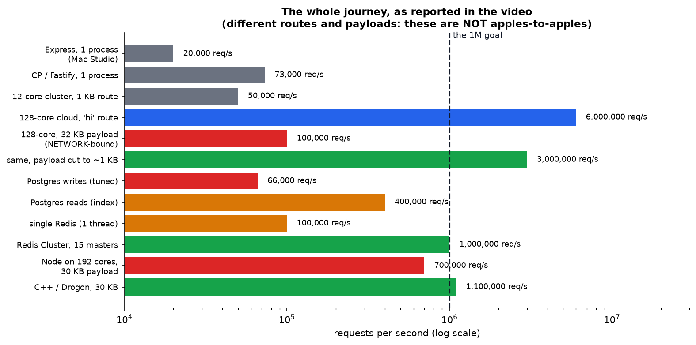

*Every milestone from the video, on a log scale. Note the two big jumps come from **changing the payload** and **changing the data store**, not from buying a bigger machine.*

---

## 2. Why the usual rules break

| Normal scale | 1M req/s |
|---|---|
| "The database is always the bottleneck" | You **must not let it be**: scaling it there costs more than the rest of the system |
| A rare bug is acceptable | A **1-in-a-million** event happens **once a second** |
| Micro-optimization is premature | 1 µs of extra CPU per request = **one whole core** |
| Costs are a rounding error | A wrong instance choice is $20,000/month |

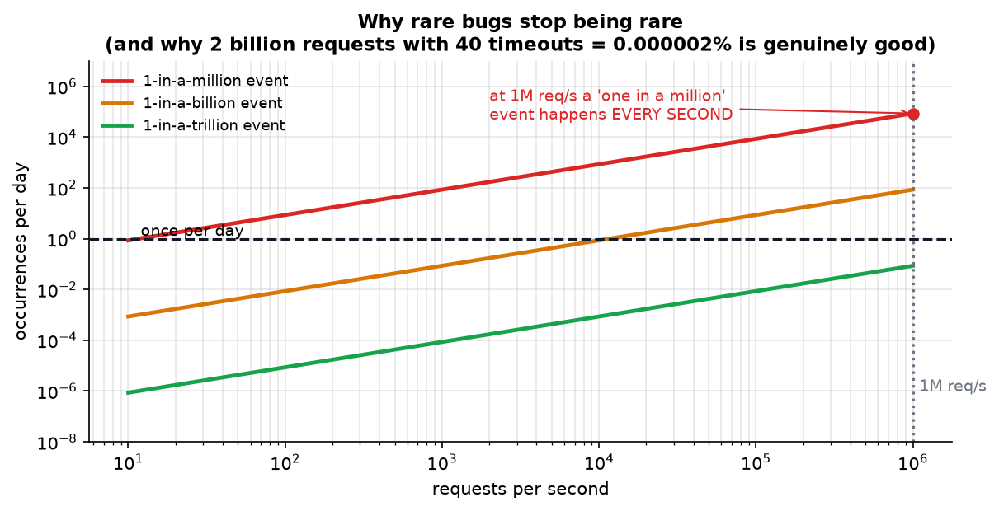

*Computed. At 1M req/s, a one-in-a-million event occurs **86,400 times a day**. That's why the final result (2 billion requests, **40** timeouts) is genuinely excellent: a 0.000002% failure rate.*

> **Cost warning from the video (worth repeating):** the cloud part of this experiment ran at roughly **$30–40/hour**. Total spend for the month was about **$2,000**. Watch, don't reproduce, unless you are fluent in cloud cost control.

---

## 3. Law 1 — the bandwidth wall

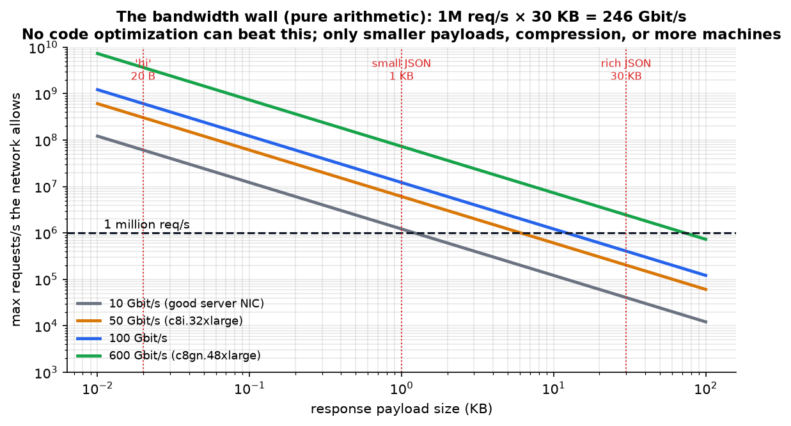

*Pure arithmetic: `requests/s × payload = bits/s`. The dotted red lines mark the payloads used in the video.*

| Payload | Bandwidth needed at 1M req/s | Verdict |
|---|---|---|
| 20 B (`{"message":"hi"}`) | 0.16 Gbit/s | trivial |
| 1 KB | 8.2 Gbit/s | fits a normal NIC |
| 30 KB | **246 Gbit/s** | needs a network-optimized instance |

**This is exactly what the video discovered the hard way.** With the 32 KB PATCH route, CPU sat at 50% and the tester was 80% idle, yet throughput stalled at 100K req/s. The clue was in the data volume: 120 GB moved in 20 s = **6 GB/s = 50 Gbit/s**, exactly the instance's rated bandwidth.

**How you find this bottleneck yourself:** if CPU isn't saturated but throughput won't rise, **divide bytes transferred by seconds** and compare with your NIC's rating.

**The ways out** (in order of cost-effectiveness): shrink the payload (pagination, sparse fields, binary formats like protobuf), **compress** (gzip/brotli — the video disabled it only to keep the benchmark honest), cache at the **CDN edge**, and only then buy more bandwidth or more machines.

---

## 4. Law 2 — CPU time per request

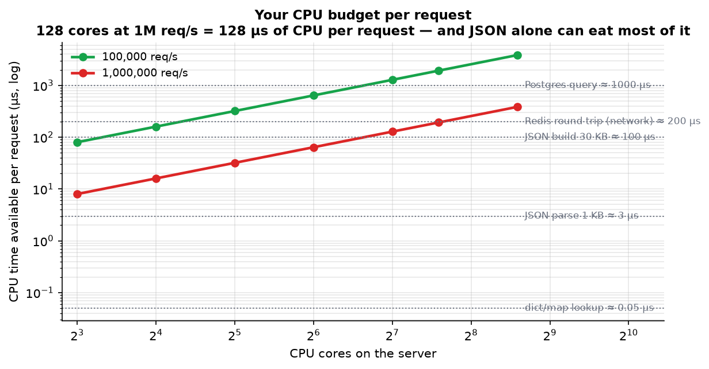

*Computed: `cores × 1 second ÷ requests per second`. On 128 cores at 1M req/s you get **128 µs of CPU per request** — and building 30 KB of JSON can consume most of that.*

### 4.1 One thread = one core

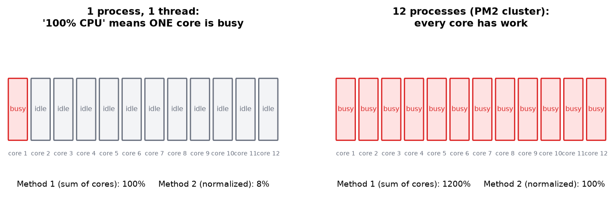

$$\text{Core utilization} = \frac{\text{total time} - \text{idle time}}{\text{total time}} \times 100$$

Two reporting conventions cause endless confusion: **Method 1** sums cores (12 busy cores = 1200%); **Method 2** normalizes (= 100%). Know which one your tool uses.

**Node's answer:** run one process per core with **PM2 cluster mode**, which load-balances across workers with no code change. On the Mac Studio this took the heavy route from 8K to ~50K req/s.

### 4.2 Framework overhead is real

| Framework | req/s on `/simple` (as reported) |
|---|---|
| Express | ~20,000 |
| Fastify | ~66,000 |
| "CP" (custom, zero-dependency, ~500 lines) | ~73,000 |

At 1M req/s, 10 µs of framework overhead per request costs **10 cores**.

### 4.3 When the runtime itself is the wall

On 192 cores with a 30 KB payload, **Node couldn't reach 1M req/s** even at full CPU. Two reasons: per-request CPU cost (JSON building, validation) and the **fan-out through one parent process** distributing connections.

**C++ with Drogon + RapidJSON** hit ~1M–1.2M req/s at ~70% CPU, ~38 GB/s (≈300 Gbit/s), moving ~2 TB per minute.

> **The nuance that matters for your job:** this is a **CPU-bound** route (string work, JSON generation). If your route is **I/O-bound** (waiting on Postgres or Redis), the runtime matters far less, because you're waiting on the network anyway. That's why a polyglot setup is normal: Node/Python for I/O-bound business logic, C++/Rust/Go for the hot CPU-bound paths.
>
> Also note Drogon's **default JSON parser was ~4× slower than V8** until it was swapped for RapidJSON. "Rewrite in C++" is not automatically faster — the libraries decide.

---

## 5. Law 3 — concurrency (Little's Law)

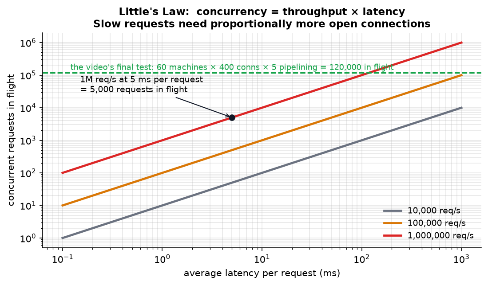

$$\text{concurrency} = \text{throughput} \times \text{latency}$$

At 1M req/s with 5 ms latency you need **5,000 requests in flight**. If latency rises to 50 ms, you need **50,000**, along with the sockets, file descriptors and memory to hold them.

**Load-generator mechanics (autocannon):**

| Flag | Meaning |
|---|---|
| `-c` | concurrent connections |
| `-p` | pipelining: requests sent back-to-back per connection |
| `-w` | worker threads on the **client** |
| `-d` | duration |

**In-flight requests ≈ c × p.** With 60 machines × 400 connections × 5 pipelining = **120,000 concurrent requests**, and 24,000 open TCP connections.

> **Inconsistency in the original notes:** the final test is described as "800 connections per machine", but the concurrency maths uses 400. The formula shown (60 × 400 × 5 = 120,000) is the one that matches the stated result.

**The most transferable lesson of the whole video:** the *tester* is part of the system. One giant load generator couldn't open enough connections to saturate the server; **60 small machines** could. If your benchmark plateaus, prove the load generator isn't the limit before you blame the server.

---

## 6. Law 4 — memory, and what to do with writes

### 6.1 Why the database fell over

| Route | Result (as reported) | Root cause |
|---|---|---|
| Postgres writes, 5,000 connections | errors and timeouts | connection overload: each connection costs the DB memory and a process |
| Postgres writes, 300 connections | 35,000/s | disk commit rate |
| after raising IOPS 3,000 → 12,000 | 66,000/s (+$1,000/month) | now CPU-limited |
| Postgres reads (index lookup) | ~400,000/s | DB CPU |
| projected 1M reads + writes | **$20,000–33,000/month** | brute force |

> **Connection maths:** 128 app processes × 10 pool connections = **1,280 connections**. Postgres allocates memory per connection, so real systems put **PgBouncer** in front rather than raising `max_connections`.

### 6.2 The algorithmic lesson, measured

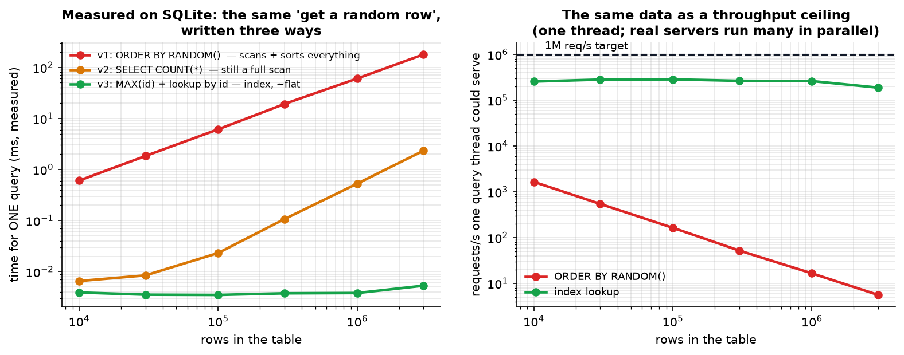

*Measured on SQLite with the same three implementations the video used on Postgres.*

| Version | Query | At 3M rows (measured) |
|---|---|---|
| v1 | `SELECT … ORDER BY RANDOM() LIMIT 1` | **291 ms** — scans and sorts the whole table |
| v2 | `SELECT COUNT(*)` then a random id | **2.7 ms** — still a full scan (Postgres can't shortcut COUNT because of MVCC) |
| v3 | `SELECT MAX(id)` then lookup by id | **0.005 ms** — index only, **flat as the table grows** |

That's a **54,000× difference** from a query rewrite, on identical hardware. In the video, v1 took 43 seconds and effectively took the database down.

> **Caveat the video glosses over:** `MAX(id)` plus a random id in range assumes **dense, gapless ids**. Deleted rows create gaps, so some lookups return nothing. Real fixes: retry on miss, keep a separate dense index table, or use `TABLESAMPLE`.

### 6.3 RAM instead of disk

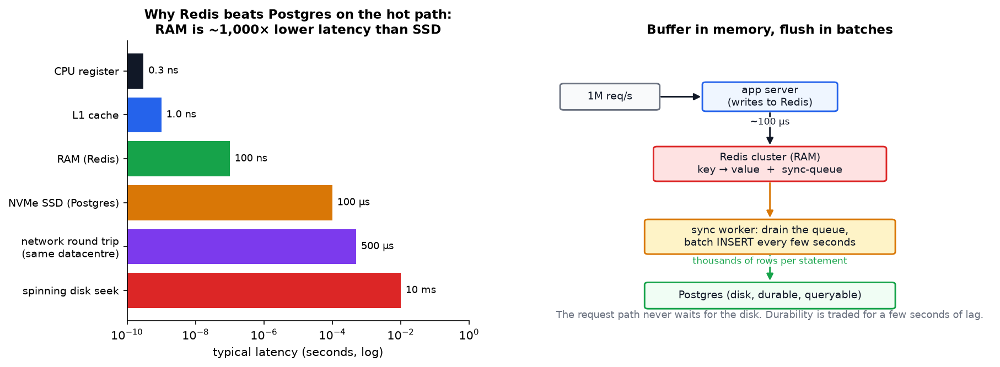

*Left: RAM is ~1,000× lower latency than an SSD. Right: the pattern that actually wins — **write to memory now, batch to disk later**.*

The `code-fast` route writes to a Redis **queue**, and a separate `sync` worker drains it into Postgres in batches. The request path never waits for the disk. **This is how real systems handle telemetry**: an Uber-style app does not `INSERT` every driver GPS ping synchronously.

**The trade-offs you must accept:** a few seconds of data at risk if Redis dies (mitigate with AOF/replicas), no SQL queries on the buffered data until it lands, and back-pressure handling when the sync worker falls behind.

**Redis limits:** a single instance is **single-threaded** (~100K ops/s here; more with pipelining and multi-key commands, but one core is the ceiling). **Redis Cluster** shards by hashing keys into **16,384 hash slots** spread across masters. The video ran **15 masters + 15 replicas** and reached **1M writes/s**.

### 6.4 Memory is a bucket you must keep draining

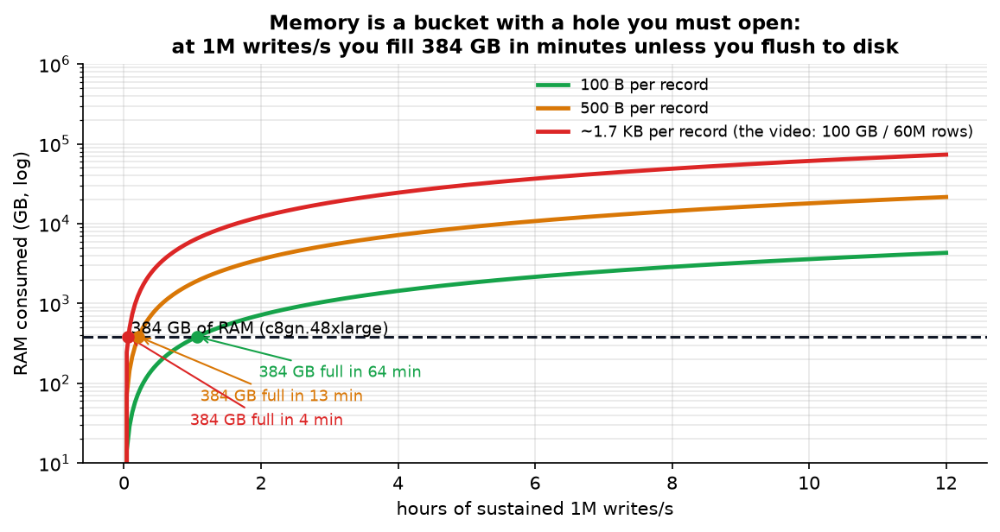

*Computed. At 1M writes/s of ~1.7 KB records (the video's 100 GB / 60M rows), **384 GB of RAM fills in about 4 minutes**. Sustained in-memory writes are only viable with continuous flushing and eviction.*

### 6.5 Random IDs remove a bottleneck

Sequential IDs need a **shared counter** — a serialization point every writer must touch, plus an extra "is this ID used?" write. Random **UUIDv4** (122 random bits) removes both.

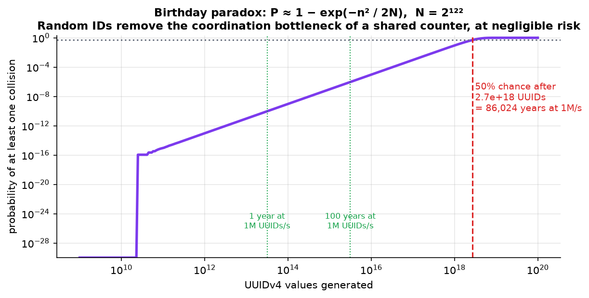

$$P(\text{collision}) \approx 1 - e^{-n^2 / 2N}, \qquad N = 2^{122}$$

**How to read that:** $n$ is how many ids you've generated and $N$ is how many *possible* ids exist. The formula answers "what are the chances any two of them came out the same?" The counter-intuitive part — the "birthday paradox" — is that collisions become likely at around **√N** draws, not N, because every new id can clash with *every* earlier one, and the number of pairs grows as the square. (Same reason 23 people in a room give a 50% chance of a shared birthday, despite there being 365 days.) With 122 random bits, √N is still astronomically large, which is the point.

*Verified in `code/million_rps_math.py`: a 50% chance of a single collision needs 2.7 × 10¹⁸ UUIDs — **86,031 years** at 1M/s. The video's "86,000 years" is right.*

> **The engineering trade-off:** random IDs hurt database **locality**. An index is kept in sorted order, so inserting keys in random positions scatters writes all over the disk and dirties many more pages than appending in order does. That's why **UUIDv7** and ULIDs exist: they put a **timestamp at the front**, so new ids sort near each other and inserts stay sequential — while the random tail still makes them collision-free with no coordination.
>
> **Update (checked September 2026):** this is no longer something you have to bolt on. UUIDv7 was standardized in **RFC 9562** (May 2024), and **PostgreSQL 18** ships a built-in **`uuidv7()`** function, so `id uuid DEFAULT uuidv7()` gives you the coordination-free *and* index-friendly option out of the box. If you're choosing a primary key type today and you want no shared counter, this is the default to reach for.

---

## 7. What 1M req/s costs

| Approach | Cost (as reported) |
|---|---|
| c8i.32xlarge (128 cores, 50 Gbit/s) | ~$6/hour ≈ $5,000/month |
| c8gn.48xlarge "beast" (192 cores, 600 Gbit/s) | ~$11/hour ≈ $8,000/month |
| Postgres tuned for this load | $15,000–33,000/month |
| 60 small tester machines | ~$20,000/month |
| **Commercial APIs at 1M req/s sustained** | **$1M–$3.9 billion/month** depending on the provider |

(There are ~2.6M seconds in a month, which is what makes per-request pricing explode at this rate.)

**The conclusion the video draws:** past a certain volume, running your own servers beats per-request pricing — and **optimizing the code beats buying capacity**. The v1 → v3 query rewrite saved more than any instance upgrade.

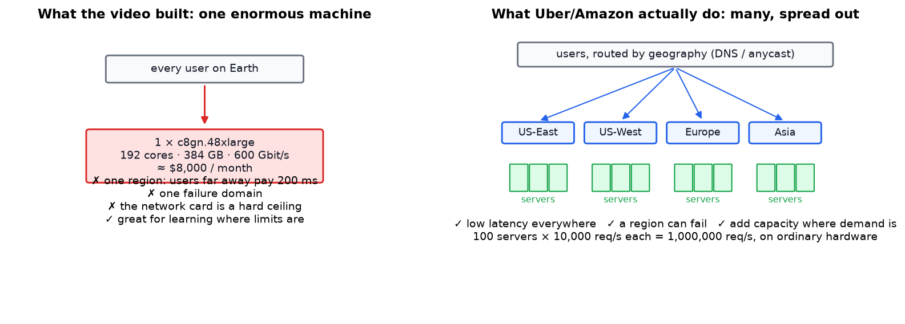

*Why nobody actually does this on one machine: geography (a user 15,000 km away pays 200 ms no matter how fast your server is), failure domains, and elasticity. 100 ordinary servers at 10K req/s each cost less and serve everyone better.*

---

## 8. The operational lessons (the parts you'll actually reuse)

| Lesson | Detail |
|---|---|
| **Instrument before you theorize** | CPU idle %, bytes/second, and error counts told the whole story. `mpstat 1`, `top`, and the benchmark's own data column |
| **Suspect your tester** | one big tester couldn't saturate the server; 60 small ones could |
| **Start the fleet simultaneously** | AWS SSM dispatches to only 50 targets at a time by default. `MaxConcurrency: 100%` fixed staggered starts |
| **Collect results centrally** | each instance wrote `results.txt` → S3 → `aws s3 sync` → `find … -exec cat` → one file; CloudWatch for live tailing |
| **Verify completeness** | `grep read results.txt \| wc -l` returned exactly 60 |
| **Load balancers need reserved capacity** | an NLB **throttled** throughput (down to ~5 GB/s) until capacity units (LCUs) were pre-reserved with AWS support |
| **Benchmarks lie by default** | compression was disabled so the 30 KB payload wasn't silently shrunk to ~1 KB. In production, turn it on |
| **Measure the whole minute** | "1 million requests handled" over a 20-second test is 50K req/s, not 1M req/s |

---

## 9. Code: the arithmetic, runnable (tested)

Full file: [`code/million_rps_math.py`](../code/million_rps_math.py). **Actual output (abridged):**

```
1. BANDWIDTH
   1M req/s x    30 KB =    245.8 Gbit/s (  30.7 GB/s)  -> needs a 400+ Gbit-class NIC
   a  50 Gbit/s card at 1M req/s allows a payload of at most    6.1 KB

2. LITTLE'S LAW
   at 1,000,000 req/s and     5 ms per request ->      5,000 requests in flight

3. CPU BUDGET
    128 cores at 1M req/s ->  128.0 us of CPU per request

4. MEASURED: ORDER BY RANDOM() vs INDEX LOOKUP
   rows        ORDER BY RANDOM()    MAX(id)+lookup     slowdown
   1,000,000          69.56 ms         0.0100 ms        6,956x

5. UUID COLLISIONS
   50% chance of ONE collision after 2.715e+18 UUIDs
   generating 1,000,000 per second, that takes 86,031 years

6. RARE EVENTS AT SCALE
   a 1-in-1e+06 event happens    86,400.00 times per day (once every        1.0 s)
```

**Try this:** change the payload size in `bandwidth()` to your own API's response size and see which network card you'd need at your target rate.

---

## 10. Self-quiz

<details><summary><b>Q1 (easy).</b> Your server shows "100% CPU" on a 16-core machine while throughput is low. What's the likely cause?</summary>

A single-threaded process saturating one core, while 15 sit idle. Check whether the tool reports per-core (Method 1) or normalized (Method 2) usage, then run one process per core (cluster mode) or use real threads.
</details>

<details><summary><b>Q2 (easy).</b> How much bandwidth does 500,000 req/s of 8 KB responses need?</summary>

500,000 × 8 KB = 4 GB/s = **32 Gbit/s**. A 10 Gbit NIC can't do it; a 50 Gbit one can.
</details>

<details><summary><b>Q3 (medium).</b> CPU is at 40%, the load generator is 70% idle, and throughput won't rise. What do you check?</summary>

Bytes/second versus the NIC rating (bandwidth wall), then connection limits, then the client's own limits (ephemeral ports, file descriptors), then the OS network stack and any load balancer capacity limits.
</details>

<details><summary><b>Q4 (medium).</b> Why did raising database IOPS improve writes but not reads?</summary>

Writes were disk-commit-bound, so more IOPS helped. Reads were already served largely from the buffer cache and were limited by **database CPU**, which more IOPS doesn't change.
</details>

<details><summary><b>Q5 (medium).</b> Why is ORDER BY RANDOM() so catastrophic, and what's the fix plus its caveat?</summary>

It assigns a random value to **every row** and sorts them, so it's O(n log n) per request. Fix: compute a random id and fetch it via the primary-key index. Caveat: gaps from deleted rows cause misses, so retry or maintain a dense mapping.
</details>

<details><summary><b>Q6 (medium).</b> Redis is "in-memory and fast", so why did one instance cap around 100K ops/s?</summary>

Command execution is **single-threaded**: one instance uses one core no matter the machine. Scale with pipelining, and with **Redis Cluster** sharding keys across many instances.
</details>

<details><summary><b>Q7 (hard).</b> Why do random UUIDs remove a bottleneck, and what do they cost?</summary>

They remove a shared counter (a serialization point every writer must contend on) and the extra uniqueness check. Cost: 16 bytes per key, worse index locality on B-tree inserts, and unsorted ids. UUIDv7/ULID fix locality by making the prefix time-ordered.
</details>

<details><summary><b>Q8 (hard).</b> You sustain 1M writes/s of 200-byte records into RAM. How long until 256 GB is full, and what's the fix?</summary>

200 MB/s → 256 GB in about **21 minutes**. Fix: continuously drain to durable storage in batches, set TTLs/eviction, keep only hot data in memory, and shard across nodes.
</details>

<details><summary><b>Q9 (hard).</b> When is rewriting in C++/Rust actually worth it, and when is it a waste?</summary>

Worth it when the route is CPU-bound (serialization, parsing, compute) and you've already fixed algorithms and payload sizes. A waste when the route is I/O-bound waiting on a database or network, where the runtime contributes little to total latency.
</details>

<details><summary><b>Q10 (hard).</b> Why did adding a Network Load Balancer in front of two servers make things worse?</summary>

NLB capacity is allocated in capacity units; beyond the provisioned level, it throttles. Sustained ~300 Gbit/s needs capacity reserved in advance with AWS. The lesson: managed infrastructure has quotas that don't scale instantly to extreme loads.
</details>

---

## 11. Glossary

| Term | Meaning |
|---|---|
| **req/s (RPS)** | Requests per second, the throughput measure |
| **Gbit/s vs GB/s** | Bits vs bytes: 1 GB/s = 8 Gbit/s (the video's notes mix these) |
| **Pipelining** | Sending several requests on one connection without waiting for replies |
| **Little's Law** | concurrency = throughput × latency |
| **Core utilization** | (total − idle) ÷ total; reported summed or normalized |
| **Cluster mode (PM2)** | One process per CPU core, load-balanced by a parent |
| **IOPS** | Storage input/output operations per second |
| **Connection pool** | Reused database connections shared by app workers |
| **Hash slot** | One of Redis Cluster's 16,384 key buckets assigned to masters |
| **Master / replica** | The node that takes writes / its live copy |
| **Batch flush** | Writing buffered records to durable storage in large groups |
| **UUIDv4 / UUIDv7** | 122 random bits / time-ordered variant with better locality |
| **Birthday paradox** | Why collisions appear at ≈√N draws, not N |
| **AMI / placement group** | Machine image / co-located instances for low latency |
| **SSM** | AWS Systems Manager, for running commands across a fleet |
| **LCU** | Load Balancer Capacity Unit, the reserved-capacity metric for AWS load balancers |
| **Tail latency (p99)** | The slow 1% of requests, which dominate user complaints |

---

## 12. Further reading

1. **Martin Kleppmann**, *Designing Data-Intensive Applications*: batching, buffering, replication.
2. **Brendan Gregg**, *Systems Performance* and the **USE method** (Utilization, Saturation, Errors) for finding bottlenecks.
3. **Dan Kegel**, *The C10K problem*, and the modern C10M discussion: OS-level connection scaling.
4. **Redis documentation**: cluster specification, hash slots, pipelining, persistence trade-offs.
5. **TechEmpower Framework Benchmarks**: cross-language and cross-framework throughput data.
6. **AWS docs**: EC2 network performance, ENA tuning, NLB capacity units.
7. **PostgreSQL wiki**: performance tuning, `max_connections` and PgBouncer.

---

*Source video: [Let's Handle 1 Million Requests per Second](https://youtu.be/W4EwfEU8CGA?si=wK15t9A7NYiBW5aB) by Cododev. Figures generated by `figures/million_rps/make_figs.py`. The bandwidth, Little's-Law, CPU-budget, query-complexity, birthday-paradox, RAM and rare-event figures are computed or measured; the journey chart plots numbers as reported in the video.*
