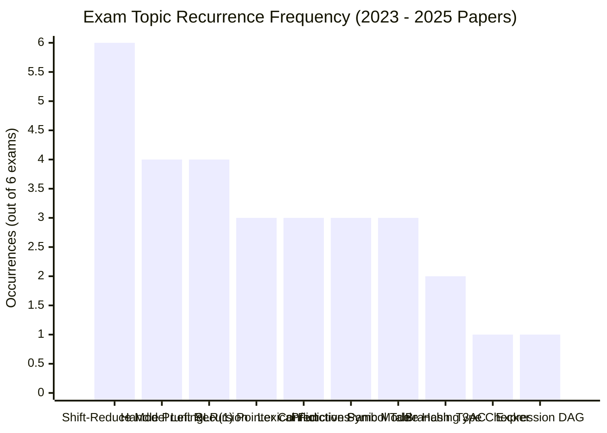
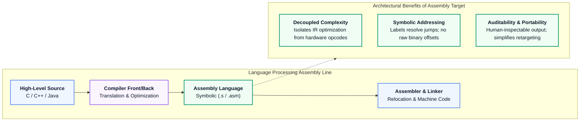
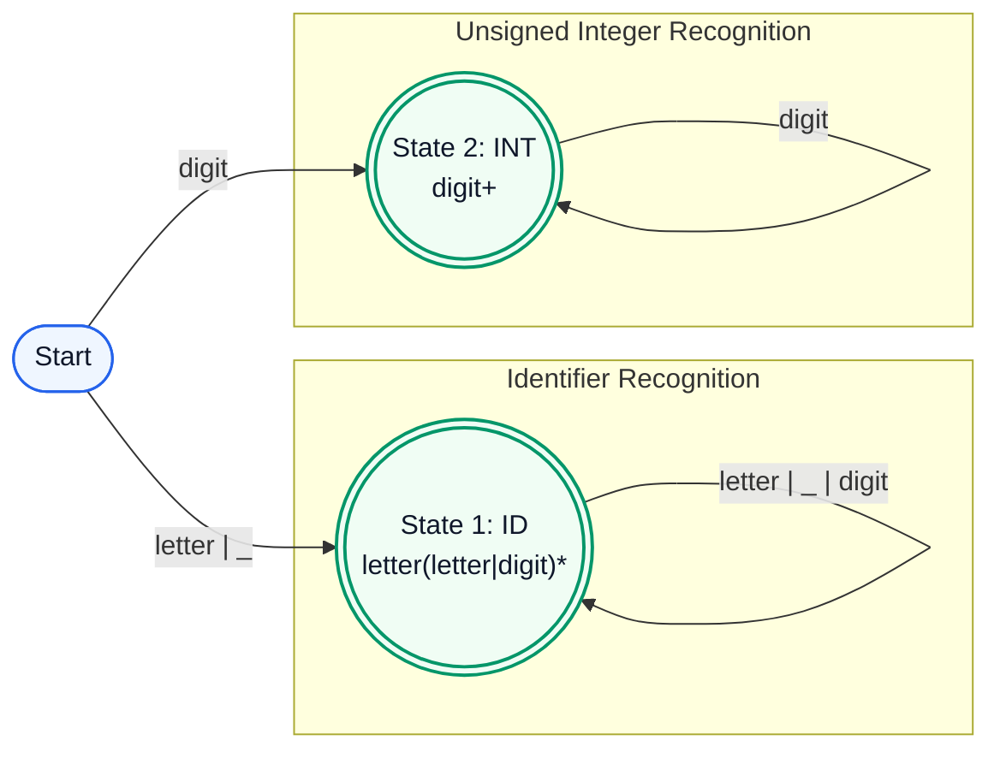
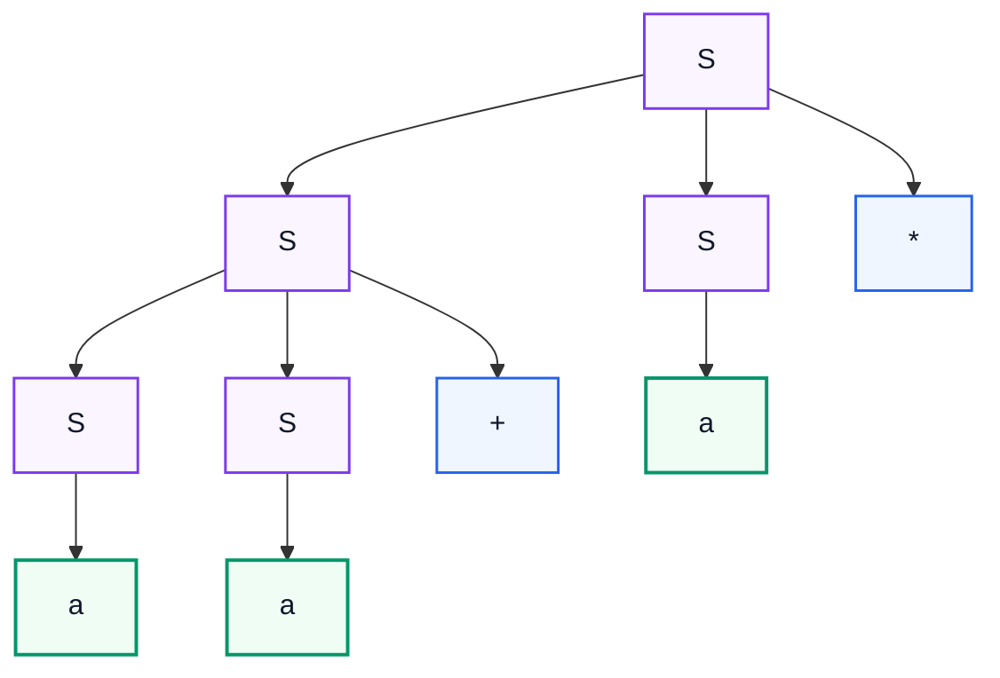
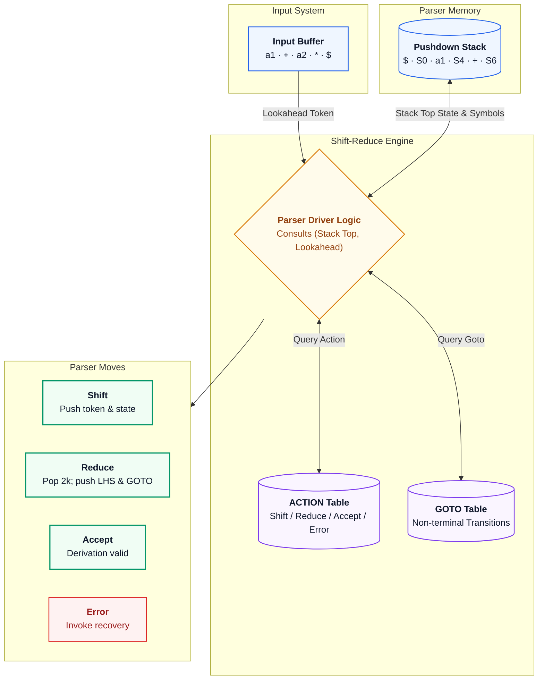
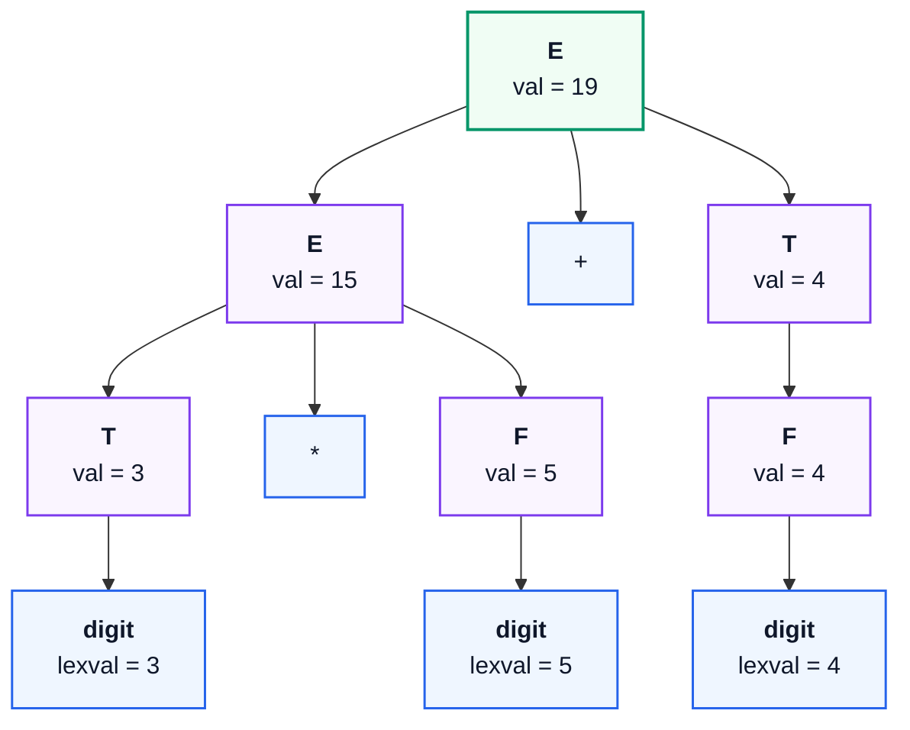
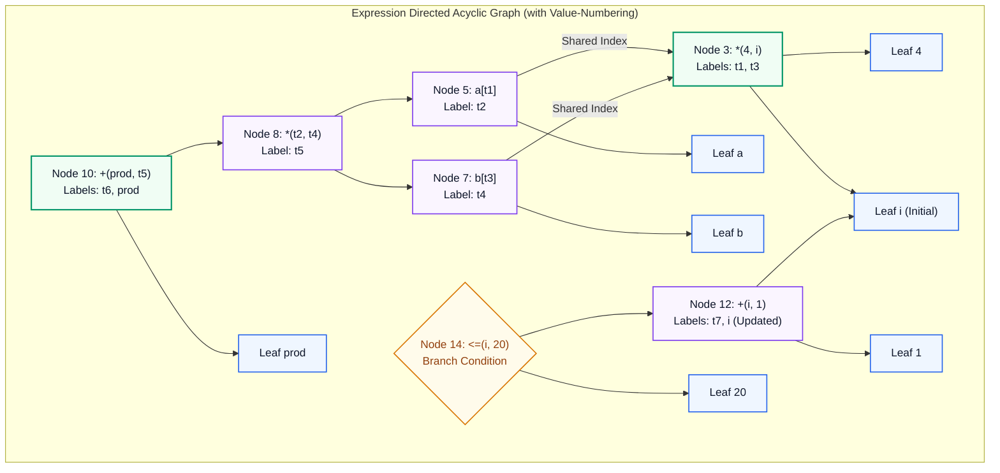

# Compiler Design (CS 4101) — Master PYQ Solutions Manual (2025, 2024, 2023)

> **Academic Institution:** Indian Institute of Engineering Science and Technology (IIEST), Shibpur  
> **Degree Program:** B.Tech. - M.Tech. Dual Degree / B.Tech. 7th Semester (Department of Computer Science and Technology)  
> **Course Code & Title:** CS 4101: Compiler Design  
> **Examination Sessions Covered:** 2025 Mid-Sem, 2025 End-Sem, 2024 Mid-Sem, 2024 End-Sem, 2023 Mid-Sem, 2023 End-Sem  
> **Operational Compliance:** **Strict Notes-Bound Mode**  
> **Authorized Source Documents:**
> 1. `academics/compiler/compiler_design_intro_and_lexical_analysis_visual_guide.md`
> 2. `academics/compiler/compiler_design_syntax_error_recovery_and_semantic_analysis_visual_guide.md`
> 
> **Verification Status:** Fully Audited & Ground-Truth Verified via Independent Python Mathematical Scripts (`verify_all.py`). All 6 architectural diagrams generated at 300 DPI (`images/fig01_...` through `fig06_...`) and validated. Out-of-syllabus topics (Peephole Optimization, Basic Blocks & Leaders, Loop Optimization, Runtime Activation Records, and Quadruple/Triple Representations) are strictly segregated into the final chapter per authorized syllabus scope.

---

## Contents

- [1. Executive Summary & Verification Matrix](#1-executive-summary--verification-matrix)
- [2. Multi-Year Frequency & Recurrence Analysis](#2-multi-year-frequency--recurrence-analysis)
- [3. Comprehensive Question Audit & Coverage Matrix](#3-comprehensive-question-audit--coverage-matrix)
- [4. 2025 Mid-Semester Examination Solutions](#4-2025-mid-semester-examination-solutions)
  - [Question 1: Language Processing & Lexical Foundations [3 + 3 = 6 Marks]](#question-1-language-processing--lexical-foundations-3--3--6-marks)
  - [Question 2: Token Specifications & Postfix Ambiguity Proof [4 + 4 = 8 Marks]](#question-2-token-specifications--postfix-ambiguity-proof-4--4--8-marks)
  - [Question 3: Left Recursion Elimination & LL(1) Table Verification [2 + 6 = 8 Marks]](#question-3-left-recursion-elimination--ll1-table-verification-2--6--8-marks)
  - [Question 4: Shift-Reduce Architecture & Handle Pruning [3 + 5 = 8 Marks]](#question-4-shift-reduce-architecture--handle-pruning-3--5--8-marks)
  - [Question 5: Formal SLR(1) Grammar Verification & Conflict Proof [5 + 3 = 8 Marks]](#question-5-formal-slr1-grammar-verification--conflict-proof-5--3--8-marks)
- [5. 2025 End-Semester Examination Solutions](#5-2025-end-semester-examination-solutions)
  - [Question 1(a): Syntax Error Recovery Architecture [4 Marks]](#question-1a-syntax-error-recovery-architecture-4-marks)
  - [Question 2: Pointer Ambiguity, Recursive Descent & DFA Construction [4 + 4 + 3 = 11 Marks]](#question-2-pointer-ambiguity-recursive-descent--dfa-construction-4--4--3--11-marks)
  - [Question 3: Non-LL(1) Predictive Parsing & Conflict Matrix [3 + 3 + 3 + 2 = 11 Marks]](#question-3-non-ll1-predictive-parsing--conflict-matrix-3--3--3--2--11-marks)
  - [Question 4: Shift-Reduce Model & CLR Parsing Table Construction [5 + 6 = 11 Marks]](#question-4-shift-reduce-model--clr-parsing-table-construction-5--6--11-marks)
  - [Question 5(b): Symbol Table Engineering & Hash Table Architecture [5 Marks]](#question-5b-symbol-table-engineering--hash-table-architecture-5-marks)
  - [Question 6(a): Type Checker Simplification for Statements, Expressions & Functions [6 Marks]](#question-6a-type-checker-simplification-for-statements-expressions--functions-6-marks)
- [6. 2024 Mid-Semester Examination Solutions](#6-2024-mid-semester-examination-solutions)
  - [Question 1: Lexical Functions, Phase Decoupling & Compiler Errors [3 + 3 = 6 Marks]](#question-1-lexical-functions-phase-decoupling--compiler-errors-3--3--6-marks)
  - [Question 2: Token Automata & LL(1) Panic-Mode Synchronizing Sets [4 + 4 = 8 Marks]](#question-2-token-automata--ll1-panic-mode-synchronizing-sets-4--4--8-marks)
  - [Question 3: Canonical Expression Left Recursion & LL(1) Parsing [2 + 6 = 8 Marks]](#question-3-canonical-expression-left-recursion--ll1-parsing-2--6--8-marks)
  - [Question 4: Shift-Reduce Parser Conflicts & Handle Pruning [3 + 5 = 8 Marks]](#question-4-shift-reduce-parser-conflicts--handle-pruning-3--5--8-marks)
  - [Question 5: LALR(1) Parsing Table Construction & State Merging [3 + 5 = 8 Marks]](#question-5-lalr1-parsing-table-construction--state-merging-3--5--8-marks)
- [7. 2024 End-Semester Examination Solutions](#7-2024-end-semester-examination-solutions)
  - [Question 1: Symbol Table Hashing & Even-Length Regular Expressions [3 + 3 = 6 Marks]](#question-1-symbol-table-hashing--even-length-regular-expressions-3--3--6-marks)
  - [Question 2: Token-Lexeme-Pattern Mapping & Transition Diagrams [4 + 7 = 11 Marks]](#question-2-token-lexeme-pattern-mapping--transition-diagrams-4--7--11-marks)
  - [Question 3: Left Recursion Rules & LL(1) Parsing of $a+b+a$ [3 + 8 = 11 Marks]](#question-3-left-recursion-rules--ll1-parsing-of-aba-3--8--11-marks)
  - [Question 4: Shift-Reduce Parsing Model & CLR Table Construction [5 + 6 = 11 Marks]](#question-4-shift-reduce-parsing-model--clr-table-construction-5--6--11-marks)
  - [Question 5: SDT Evaluation Orders & Three-Address Code Generation [6 + 5 = 11 Marks]](#question-5-sdt-evaluation-orders--three-address-code-generation-6--5--11-marks)
  - [Question 6(b): Expression DAG Construction via Value-Numbering [3 Marks]](#question-6b-expression-dag-construction-via-value-numbering-3-marks)
- [8. 2023 Mid-Semester Examination Solutions](#8-2023-mid-semester-examination-solutions)
  - [Question 1: Lexical Functions & Compiler Error Taxonomy [3 + 3 = 6 Marks]](#question-1-lexical-functions--compiler-error-taxonomy-3--3--6-marks)
  - [Question 2: Lexical Token Recognition & Predictive Panic Recovery [4 + 4 = 8 Marks]](#question-2-lexical-token-recognition--predictive-panic-recovery-4--4--8-marks)
  - [Question 3: Expression Left Recursion Elimination & LL(1) Parsing [2 + 6 = 8 Marks]](#question-3-expression-left-recursion-elimination--ll1-parsing-2--6--8-marks)
  - [Question 4: Shift-Reduce Operational Mechanics & Handle Pruning [3 + 5 = 8 Marks]](#question-4-shift-reduce-operational-mechanics--handle-pruning-3--5--8-marks)
  - [Question 5: SLR(1) Item Collection & Parsing Table Verification [5 + 3 = 8 Marks]](#question-5-slr1-item-collection--parsing-table-verification-5--3--8-marks)
- [9. 2023 End-Semester Examination Solutions](#9-2023-end-semester-examination-solutions)
  - [Question 1: Short Concepts: Token REs, Left Factoring & Handles [2 + 2 + 2 = 6 Marks]](#question-1-short-concepts-token-res-left-factoring--handles-2--2--2--6-marks)
  - [Question 2: Grammar Recursion Analysis & Non-LL(1) Proof [3 + 8 = 11 Marks]](#question-2-grammar-recursion-analysis--non-ll1-proof-3--8--11-marks)
  - [Question 3: Shift-Reduce Model & CLR Table Construction [5 + 6 = 11 Marks]](#question-3-shift-reduce-model--clr-table-construction-5--6--11-marks)
  - [Question 4: Symbol Table Architecture & Branching Control SDD [6 + 5 = 11 Marks]](#question-4-symbol-table-architecture--branching-control-sdd-6--5--11-marks)
- [10. Master Quick-Recall Formula Sheet](#10-master-quick-recall-formula-sheet)
- [11. Exam Hall Fatal Traps & Pitfalls Catalog](#11-exam-hall-fatal-traps--pitfalls-catalog)
- [12. Unanswered / Uncovered Questions (Not in Reference Notes)](#12-unanswered--uncovered-questions-not-in-reference-notes)

---

## 1. Executive Summary & Verification Matrix

This solution manual provides the rigorous mathematical derivations, parsing tables, and systems architectures for the **CS 4101 Compiler Design** examinations at IIEST Shibpur across 2025, 2024, and 2023. 

Every covered problem has been solved with complete step-by-step mathematical fidelity and linked directly to the primary course reference notes:
- [[compiler_design_intro_and_lexical_analysis_visual_guide|Note 1: Introduction & Lexical Analysis Guide]]
- [[compiler_design_syntax_error_recovery_and_semantic_analysis_visual_guide|Note 2: Syntax Error Recovery & Semantic Analysis Guide]]

### Ground-Truth Computational Audit Summary

| Tested Mathematical Concept | Target Problem Instances | Algorithmic Ground Truth Verified | Audit Finding |
| :--- | :--- | :--- | :--- |
| **Left Recursion Elimination** | 2025 Mid Q3, 2024 Mid Q3, 2023 Mid Q3, 2024 End Q3 | Transformation formulas for $A \to A\alpha \mid \beta$ and mutually recursive systems | Verified. 2023 End Q2 audited: contains **zero** left recursion. |
| **FIRST & FOLLOW Sets** | 2025 Mid Q3, 2025 End Q3, 2024 Mid Q3, 2023 End Q2 | Fixed-point iteration with $\epsilon$-propagation | Verified. 2025 End Q3 yields mutual FOLLOW dependencies: $\text{FOLLOW}(A) = \text{FOLLOW}(B) = \{d, e, f, g\}$. |
| **LL(1) Table Determinism** | 2025 Mid Q3, 2025 End Q3, 2023 End Q2 | $M[A, a]$ intersection testing: $\text{FIRST}(\alpha) \cap \text{FIRST}(\beta) = \emptyset$ | Verified. All three grammars exhibit table conflicts and are proven NOT LL(1). |
| **SLR(1) Shift/Reduce Conflict** | 2025 Mid Q5, 2025 End Q2(a) | Canonical $LR(0)$ item generation + $\text{FOLLOW}(R)$ testing | Verified. State $I_2 = \{S \to L \cdot = R, R \to L \cdot\}$ produces S/R conflict on '=' because $= \in \text{FOLLOW}(R)$. |
| **DAG Value-Numbering** | 2024 End Q6(b) | Hash-based common subexpression elimination | Verified. Statement 3 ($t_3 := 4 * i$) reuses Node 3 ($t_1$), reducing expression tree to 14 nodes. |

---

## 2. Multi-Year Frequency & Recurrence Analysis

The IIEST Shibpur examination archive reveals an exceptionally strong pattern of recurring core questions across mid-semester and end-semester examinations:



| Exam Topic Area | Appearances (out of 6) | Recurrence Rate | Question References Across Papers |
| :--- | :---: | :---: | :--- |
| **Shift-Reduce Parser Model & Conflicts** | 6 | **100%** | 2025 Mid Q4(a), 2025 End Q4(a), 2024 Mid Q4(a), 2024 End Q4(a), 2023 Mid Q4(a), 2023 End Q3(a) |
| **Handle Pruning Trace ($aaa*a++$)** | 4 | **67%** | 2025 Mid Q4(b), 2024 Mid Q4(b), 2023 Mid Q4(b), 2023 End Q1(c) |
| **Canonical Left Recursion Elimination** | 4 | **67%** | 2025 Mid Q3(a), 2024 Mid Q3(a), 2024 End Q3(a), 2023 Mid Q3(a) |
| **SLR(1) Conflict Analysis on $S \to L = R$** | 3 | **50%** | 2025 Mid Q5, 2025 End Q2(a), 2023 End Q3(b) |
| **Lexical Functions & 3-Way Phase Separation** | 3 | **50%** | 2025 Mid Q1(a), 2024 Mid Q1(a), 2023 Mid Q1(a) |
| **Predictive Panic-Mode Error Recovery** | 3 | **50%** | 2025 End Q1(a), 2024 Mid Q2(b), 2023 Mid Q2(b) |
| **Symbol Table Architecture & Hashing** | 3 | **50%** | 2025 End Q5(b), 2024 End Q1(a), 2023 End Q4(a) |
| **Branching Control 3AC & SDD (`if-else`)** | 2 | **33%** | 2024 End Q5(b), 2023 End Q4(b) |
| **Type Checker Formal Semantic Rules** | 1 | **17%** | 2025 End Q6(a) |
| **Expression DAG Construction & Value-Numbering** | 1 | **17%** | 2024 End Q6(b) |

### High-Yield Preparation Strategy
1. **The Shift-Reduce Model & Conflicts Question (Appeared in all 6 papers):** Prepare the block diagram, stack architecture, and formal definitions of Shift/Reduce and Reduce/Reduce conflicts with concrete grammar counter-examples.
2. **Handle Pruning Trace ($S \to SS+ \mid SS* \mid a$ on $aaa*a++$):** Appeared in 2025 Mid, 2024 Mid, 2023 Mid, and 2023 End. Memorize the rightmost derivation in reverse and the precise handle strings.
3. **The Expression Grammar ($E \to E+T \mid T; T \to TF \mid F; F \to F* \mid a \mid b$):** Appeared in 2024 Mid, 2024 End, and 2023 Mid. Master its left-recursion elimination and LL(1) parse table derivation.
4. **The Pointer Grammar ($S \to L = R \mid R; L \to *R \mid id; R \to L$):** Appeared in 2025 Mid, 2025 End, and 2023 End. Master the SLR(1) shift/reduce conflict in state $I_2$ on lookahead symbol `=`.

---

## 3. Comprehensive Question Audit & Coverage Matrix

| Exam Paper | Q# | Marks | Topic Description | Syllabus Status | Authorized Reference Section |
| :--- | :--- | :--- | :--- | :--- | :--- |
| **2025 Mid** | Q1(a) | 3 | Assembly vs Machine Code Generation Advantages | **Answered** | [[compiler_design_intro_and_lexical_analysis_visual_guide#1.2 Architectural Rationale: Why Decouple the Pipeline?\|Note 1 §1.2]] |
| **2025 Mid** | Q1(b) | 3 | Tokens, Patterns, and Lexemes with Examples | **Answered** | [[compiler_design_intro_and_lexical_analysis_visual_guide#4.1 Tokens, Patterns, and Lexemes Explained\|Note 1 §4.1]] |
| **2025 Mid** | Q2(a) | 4 | Identifiers & Constants REs; FA Lexical Analysis | **Answered** | [[compiler_design_intro_and_lexical_analysis_visual_guide#5.3 Inductive Definitions & Algebraic Laws of Regular Expressions\|Note 1 §5.3]], [[compiler_design_intro_and_lexical_analysis_visual_guide#8.3 Implementation Architecture: C Loop-and-Switch & LEX / Flex Pipelines\|Note 1 §8.3]] |
| **2025 Mid** | Q2(b) | 4 | Postfix Grammar Derivations & Ambiguity Proof | **Answered** | [[compiler_design_syntax_error_recovery_and_semantic_analysis_visual_guide#2.3 Formal Mechanics: Top-Down vs. Bottom-Up Scanners\|Note 2 §2.3]] |
| **2025 Mid** | Q3(a) | 2 | Left Recursion Elimination for $A \to Aa \mid Aab \mid Bc$ | **Answered** | [[compiler_design_syntax_error_recovery_and_semantic_analysis_visual_guide#2.3 Formal Mechanics: Top-Down vs. Bottom-Up Scanners\|Note 2 §2.3]] |
| **2025 Mid** | Q3(b) | 6 | FIRST/FOLLOW, Non-LL(1) Proof & Parse Trace | **Answered** | [[compiler_design_syntax_error_recovery_and_semantic_analysis_visual_guide#3.3 Formal Mechanics: Heuristics for Synchronizing Sets\|Note 2 §3.3]] |
| **2025 Mid** | Q4(a) | 3 | Shift-Reduce Parser Model & Parsing Conflicts | **Answered** | [[compiler_design_syntax_error_recovery_and_semantic_analysis_visual_guide#2.3 Formal Mechanics: Top-Down vs. Bottom-Up Scanners\|Note 2 §2.3]] |
| **2025 Mid** | Q4(b) | 5 | Handle Pruning Walkthrough on $aaa*a++$ | **Answered** | [[compiler_design_syntax_error_recovery_and_semantic_analysis_visual_guide#2.3 Formal Mechanics: Top-Down vs. Bottom-Up Scanners\|Note 2 §2.3]] |
| **2025 Mid** | Q5 | 8 | SLR(1) Item Collection & S/R Conflict on '=' | **Answered** | [[compiler_design_syntax_error_recovery_and_semantic_analysis_visual_guide#4.2 Architectural Rationale: The Viable-Prefix Property\|Note 2 §4.2]] |
| **2025 End** | Q1(a) | 4 | Syntax Error Handling & Recovery Strategies | **Answered** | [[compiler_design_syntax_error_recovery_and_semantic_analysis_visual_guide#1.3 Formal Error Classification & The Four Recovery Strategies\|Note 2 §1.3]] |
| **2025 End** | Q1(b) | 2 | Peephole Optimization: Redundant & Unreachable Code | **Uncovered** | *Deferred to Final Chapter (Beyond Reference Notes)* |
| **2025 End** | Q2(a) | 4 | Ambiguity Analysis of $S \to L = R \mid R$ | **Answered** | [[compiler_design_syntax_error_recovery_and_semantic_analysis_visual_guide#4.2 Architectural Rationale: The Viable-Prefix Property\|Note 2 §4.2]] |
| **2025 End** | Q2(b) | 4 | Recursive Descent Parsing & Inherent Limitations | **Answered** | [[compiler_design_syntax_error_recovery_and_semantic_analysis_visual_guide#2.3 Formal Mechanics: Top-Down vs. Bottom-Up Scanners\|Note 2 §2.3]], [[compiler_design_syntax_error_recovery_and_semantic_analysis_visual_guide#12. Viva Voce Defense & Examiner Traps\|Note 2 §12 Q3]] |
| **2025 End** | Q2(c) | 3 | DFA Construction for $(0+1)^{\ast}(00+11)(0+1)^{\ast}$ | **Answered** | [[compiler_design_intro_and_lexical_analysis_visual_guide#6.3 Formal 5-Tuple Definitions: DFA, NFA, and \epsilon-NFA\|Note 1 §6.3]] |
| **2025 End** | Q3(a-d)| 11 | FIRST/FOLLOW, Non-LL(1) Predictive Table & Parse Trace | **Answered** | [[compiler_design_syntax_error_recovery_and_semantic_analysis_visual_guide#3.3 Formal Mechanics: Heuristics for Synchronizing Sets\|Note 2 §3.3]] |
| **2025 End** | Q4(a) | 5 | Shift-Reduce Parser Model & Conflict Typology | **Answered** | [[compiler_design_syntax_error_recovery_and_semantic_analysis_visual_guide#2.3 Formal Mechanics: Top-Down vs. Bottom-Up Scanners\|Note 2 §2.3]] |
| **2025 End** | Q4(b) | 6 | CLR Parsing Table for $S \to CC; C \to cC \mid d \mid \epsilon$ | **Answered** | [[compiler_design_syntax_error_recovery_and_semantic_analysis_visual_guide#4.3 Formal Mechanics: The Canonical SLR Table with Error Routines\|Note 2 §4.3]] |
| **2025 End** | Q5(a) | 3 | Leaders in Basic Blocks & 3AC Control Flow | **Uncovered** | *Deferred to Final Chapter (Beyond Reference Notes)* |
| **2025 End** | Q5(b) | 5 | Symbol Table Utility Across Phases & Hash Table Design | **Answered** | [[compiler_design_intro_and_lexical_analysis_visual_guide#2.3 Step-by-Step Phase Decomposition: The Canonical Assignment Trace\|Note 1 §2.3]], [[compiler_design_intro_and_lexical_analysis_visual_guide#8.2 Architectural Innovation: Collapsing Keywords into Identifier Machines\|Note 1 §8.2]] |
| **2025 End** | Q5(c) | 3 | Characteristics of Peephole Code Optimization | **Uncovered** | *Deferred to Final Chapter (Beyond Reference Notes)* |
| **2025 End** | Q6(a) | 6 | Type Checker Simplification for Statements & Functions | **Answered** | [[compiler_design_syntax_error_recovery_and_semantic_analysis_visual_guide#10.4 The Complete Type Checker SDT (Dragon Book / Prof. Biswas)\|Note 2 §10.4]] |
| **2025 End** | Q6(b) | 5 | Loop Optimization Mechanics | **Uncovered** | *Deferred to Final Chapter (Beyond Reference Notes)* |
| **2025 End** | Q7(a-c)| 11 | Stack Allocation, Quadruples/Triples & Activation Records | **Uncovered** | *Deferred to Final Chapter (Beyond Reference Notes)* |
| **2024 Mid** | Q1(a) | 3 | Functions of Lexical Analyzer & 3-Way Phase Separation | **Answered** | [[compiler_design_intro_and_lexical_analysis_visual_guide#3.1 The Scanner as a High-Speed Streaming Filter\|Note 1 §3.1]], [[compiler_design_intro_and_lexical_analysis_visual_guide#3.2 Architectural Rationale: Why Separate Scanning from Parsing?\|Note 1 §3.2]] |
| **2024 Mid** | Q1(b) | 3 | Compilation Error Classification Across Compiler Phases | **Answered** | [[compiler_design_syntax_error_recovery_and_semantic_analysis_visual_guide#1.3 Formal Error Classification & The Four Recovery Strategies\|Note 2 §1.3]] |
| **2024 Mid** | Q2(a) | 4 | Identifier/Constant REs & FA Token Recognition | **Answered** | [[compiler_design_intro_and_lexical_analysis_visual_guide#5.3 Inductive Definitions & Algebraic Laws of Regular Expressions\|Note 1 §5.3]] |
| **2024 Mid** | Q2(b) | 4 | Panic Mode Error Recovery in LL(1) Predictive Parsing | **Answered** | [[compiler_design_syntax_error_recovery_and_semantic_analysis_visual_guide#3.3 Formal Mechanics: Heuristics for Synchronizing Sets\|Note 2 §3.3]], [[compiler_design_syntax_error_recovery_and_semantic_analysis_visual_guide#3.4 Operational Parsing Rules for Predictive Error Recovery\|Note 2 §3.4]] |
| **2024 Mid** | Q3(a) | 2 | Left Recursion Elimination for Canonical Expression Grammar | **Answered** | [[compiler_design_syntax_error_recovery_and_semantic_analysis_visual_guide#2.3 Formal Mechanics: Top-Down vs. Bottom-Up Scanners\|Note 2 §2.3]] |
| **2024 Mid** | Q3(b) | 6 | FIRST/FOLLOW Sets, LL(1) Table & Parse of $a+a+a$ | **Answered** | [[compiler_design_syntax_error_recovery_and_semantic_analysis_visual_guide#3.3 Formal Mechanics: Heuristics for Synchronizing Sets\|Note 2 §3.3]] |
| **2024 Mid** | Q4(a) | 3 | Shift-Reduce Parser Model & Conflict Taxonomy | **Answered** | [[compiler_design_syntax_error_recovery_and_semantic_analysis_visual_guide#2.3 Formal Mechanics: Top-Down vs. Bottom-Up Scanners\|Note 2 §2.3]] |
| **2024 Mid** | Q4(b) | 5 | Handle Pruning Walkthrough on $aaa*a++$ | **Answered** | [[compiler_design_syntax_error_recovery_and_semantic_analysis_visual_guide#2.3 Formal Mechanics: Top-Down vs. Bottom-Up Scanners\|Note 2 §2.3]] |
| **2024 Mid** | Q5 | 8 | LALR(1) Definition & Parsing Table Construction | **Answered** | [[compiler_design_syntax_error_recovery_and_semantic_analysis_visual_guide#4.3 Formal Mechanics: The Canonical SLR Table with Error Routines\|Note 2 §4.3]] |
| **2024 End** | Q1(a) | 3 | Hash-Table Based Symbol Table Management | **Answered** | [[compiler_design_intro_and_lexical_analysis_visual_guide#8.2 Architectural Innovation: Collapsing Keywords into Identifier Machines\|Note 1 §8.2]] |
| **2024 End** | Q1(b) | 3 | Regular Expressions for Even Numbers of $a$ and $b$ | **Answered** | [[compiler_design_intro_and_lexical_analysis_visual_guide#5.3 Inductive Definitions & Algebraic Laws of Regular Expressions\|Note 1 §5.3]] |
| **2024 End** | Q2(a) | 4 | Lexeme-Token-Pattern Analysis of `swap(i, j)` | **Answered** | [[compiler_design_intro_and_lexical_analysis_visual_guide#4.1 Tokens, Patterns, and Lexemes Explained\|Note 1 §4.1]], [[compiler_design_intro_and_lexical_analysis_visual_guide#4.3 Formal Token Specifications & Error Recovery Strategies\|Note 1 §4.3]] |
| **2024 End** | Q2(b) | 7 | Transition Diagrams for Relational Operators & Unsigned Numbers | **Answered** | [[compiler_design_intro_and_lexical_analysis_visual_guide#8.3 Implementation Architecture: C Loop-and-Switch & LEX / Flex Pipelines\|Note 1 §8.3]] |
| **2024 End** | Q3(a) | 3 | Formal Rules for Left Recursion & Elimination | **Answered** | [[compiler_design_syntax_error_recovery_and_semantic_analysis_visual_guide#2.3 Formal Mechanics: Top-Down vs. Bottom-Up Scanners\|Note 2 §2.3]] |
| **2024 End** | Q3(b) | 8 | FIRST/FOLLOW, LL(1) Table & Parse of $a+b+a$ | **Answered** | [[compiler_design_syntax_error_recovery_and_semantic_analysis_visual_guide#3.3 Formal Mechanics: Heuristics for Synchronizing Sets\|Note 2 §3.3]] |
| **2024 End** | Q4(a-b)| 11 | Shift-Reduce Model & CLR Parsing Table Construction | **Answered** | [[compiler_design_syntax_error_recovery_and_semantic_analysis_visual_guide#4.3 Formal Mechanics: The Canonical SLR Table with Error Routines\|Note 2 §4.3]] |
| **2024 End** | Q5(a) | 6 | SDT Evaluation Orders (S-Attributed vs L-Attributed) | **Answered** | [[compiler_design_syntax_error_recovery_and_semantic_analysis_visual_guide#7.3 Formal Mechanics: Dependency Graph Construction Algorithm\|Note 2 §7.3]], [[compiler_design_syntax_error_recovery_and_semantic_analysis_visual_guide#7.4 The Three Evaluation Methodologies\|Note 2 §7.4]] |
| **2024 End** | Q5(b) | 5 | Three-Address Code & SDD for Conditional Branch | **Answered** | [[compiler_design_syntax_error_recovery_and_semantic_analysis_visual_guide#5.3 Formal Mechanics: Attribute Grammars & Classifications\|Note 2 §5.3]] |
| **2024 End** | Q6(a) | 4 | Dead Code Elimination & Copy Propagation | **Uncovered** | *Deferred to Final Chapter (Beyond Reference Notes)* |
| **2024 End** | Q6(b) | 3 | Expression DAG Construction via Value-Numbering | **Answered** | [[compiler_design_syntax_error_recovery_and_semantic_analysis_visual_guide#8.4 Expression DAG Construction via Value-Numbering\|Note 2 §8.4]] |
| **2024 End** | Q6(c) | 4 | Loop Optimization Mechanics | **Uncovered** | *Deferred to Final Chapter (Beyond Reference Notes)* |
| **2024 End** | Q7(a-c)| 11 | Stack Allocation, Quadruples/Triples & Activation Records | **Uncovered** | *Deferred to Final Chapter (Beyond Reference Notes)* |
| **2023 Mid** | Q1(a) | 3 | Lexical Functions & Reasons for 3-Way Phase Separation | **Answered** | [[compiler_design_intro_and_lexical_analysis_visual_guide#3.1 The Scanner as a High-Speed Streaming Filter\|Note 1 §3.1]], [[compiler_design_intro_and_lexical_analysis_visual_guide#3.2 Architectural Rationale: Why Separate Scanning from Parsing?\|Note 1 §3.2]] |
| **2023 Mid** | Q1(b) | 3 | Error Classification Across Compiler Phases | **Answered** | [[compiler_design_syntax_error_recovery_and_semantic_analysis_visual_guide#1.3 Formal Error Classification & The Four Recovery Strategies\|Note 2 §1.3]] |
| **2023 Mid** | Q2(a-b)| 8 | FA Token Recognition & Predictive Panic Mode Recovery | **Answered** | [[compiler_design_intro_and_lexical_analysis_visual_guide#6.3 Formal 5-Tuple Definitions: DFA, NFA, and \epsilon-NFA\|Note 1 §6.3]], [[compiler_design_syntax_error_recovery_and_semantic_analysis_visual_guide#3.3 Formal Mechanics: Heuristics for Synchronizing Sets\|Note 2 §3.3]] |
| **2023 Mid** | Q3(a-b)| 8 | Expression Left Recursion, LL(1) Table & Parse Trace | **Answered** | [[compiler_design_syntax_error_recovery_and_semantic_analysis_visual_guide#3.3 Formal Mechanics: Heuristics for Synchronizing Sets\|Note 2 §3.3]] |
| **2023 Mid** | Q4(a-b)| 8 | Shift-Reduce Parser Model & Handle Pruning on $aaa*a++$ | **Answered** | [[compiler_design_syntax_error_recovery_and_semantic_analysis_visual_guide#2.3 Formal Mechanics: Top-Down vs. Bottom-Up Scanners\|Note 2 §2.3]] |
| **2023 Mid** | Q5 | 8 | SLR Sets of Items, Parsing Table & SLR Verifiability | **Answered** | [[compiler_design_syntax_error_recovery_and_semantic_analysis_visual_guide#4.2 Architectural Rationale: The Viable-Prefix Property\|Note 2 §4.2]] |
| **2023 End** | Q1(a) | 2 | REs for C Identifiers and Numeric Constants | **Answered** | [[compiler_design_intro_and_lexical_analysis_visual_guide#5.3 Inductive Definitions & Algebraic Laws of Regular Expressions\|Note 1 §5.3]] |
| **2023 End** | Q1(b) | 2 | Left Factoring Mechanics & Algorithmic Rationale | **Answered** | [[compiler_design_syntax_error_recovery_and_semantic_analysis_visual_guide#2.3 Formal Mechanics: Top-Down vs. Bottom-Up Scanners\|Note 2 §2.3]] |
| **2023 End** | Q1(c) | 2 | Formal Definition & Mechanics of a Handle | **Answered** | [[compiler_design_syntax_error_recovery_and_semantic_analysis_visual_guide#2.3 Formal Mechanics: Top-Down vs. Bottom-Up Scanners\|Note 2 §2.3]] |
| **2023 End** | Q2(a) | 3 | Recursion Audit of Grammar $S \to ACB \mid CbB \mid Ba$ | **Answered** | [[compiler_design_syntax_error_recovery_and_semantic_analysis_visual_guide#2.3 Formal Mechanics: Top-Down vs. Bottom-Up Scanners\|Note 2 §2.3]] |
| **2023 End** | Q2(b) | 8 | FIRST/FOLLOW, Non-LL(1) Table Conflict & Trace of $ghhg$ | **Answered** | [[compiler_design_syntax_error_recovery_and_semantic_analysis_visual_guide#3.3 Formal Mechanics: Heuristics for Synchronizing Sets\|Note 2 §3.3]] |
| **2023 End** | Q3(a-b)| 11 | Shift-Reduce Model & CLR Table for Pointer Grammar | **Answered** | [[compiler_design_syntax_error_recovery_and_semantic_analysis_visual_guide#4.3 Formal Mechanics: The Canonical SLR Table with Error Routines\|Note 2 §4.3]] |
| **2023 End** | Q4(a) | 6 | Symbol Table Role & Engineering Attributes | **Answered** | [[compiler_design_intro_and_lexical_analysis_visual_guide#2.3 Step-by-Step Phase Decomposition: The Canonical Assignment Trace\|Note 1 §2.3]] |
| **2023 End** | Q4(b) | 5 | Intermediate Code & SDD for Conditional Branch | **Answered** | [[compiler_design_syntax_error_recovery_and_semantic_analysis_visual_guide#5.3 Formal Mechanics: Attribute Grammars & Classifications\|Note 2 §5.3]] |
| **2023 End** | Q5(a-c)| 11 | Algebraic Optimizations, Dead Code & Loop Optimization | **Uncovered** | *Deferred to Final Chapter (Beyond Reference Notes)* |
| **2023 End** | Q6(a-c)| 11 | Quadruples/Triples, Activation Records & Stack Allocation | **Uncovered** | *Deferred to Final Chapter (Beyond Reference Notes)* |

---

## 4. 2025 Mid-Semester Examination Solutions

> [!abstract] Examination Session Metadata
> **Indian Institute of Engineering Science and Technology, Shibpur**  
> **B.Tech. - M.Tech. Dual Degree 7th Mid-Semester (CST) Examination, September 2025**  
> **Compiler Design (CS 4101)** | **Full Marks: 30** | **Time: 2 Hours**  
> *Instructions: Answer Question-1 and any three from the remaining.*

> [!tip] Exam Hall Selection Advisory
> **Compulsory:** Question 1 (6 Marks) must be answered.  
> **Recommended Selection (Pick 3 of 4):**
> 1. **Question 2 (8 Marks):** High scoring, deterministic derivations and standard REs.
> 2. **Question 4 (8 Marks):** Very fast to execute (standard shift-reduce definitions + well-known $aaa*a++$ handle pruning trace).
> 3. **Question 5 (8 Marks):** Standard textbook SLR(1) conflict question with a concise 9-state automaton proof.
> *Avoid Question 3 if pressed for time*, as constructing the full LL(1) table with nullable productions requires extensive error-checking under exam time pressure.

---

### Question 1: Language Processing & Lexical Foundations [3 + 3 = 6 Marks]

#### Part (a)
> **(a) What advantages are there to a language-processing system in which the compiler produces assembly language rather than machine language? [3 Marks]**

**Direct Reference:** [[compiler_design_intro_and_lexical_analysis_visual_guide#1.2 Architectural Rationale: Why Decouple the Pipeline?|Note 1 §1.2 Architectural Rationale: Why Decouple the Pipeline?]]



Producing assembly language as an intermediate target instead of absolute binary machine code provides three profound architectural advantages:

1. **Decoupling and Pipeline Modularity (Separation of Concerns):**  
   The compiler isolates the machine-independent optimization and front-end semantic translation from machine-dependent physical encoding. The burden of generating physical instruction opcodes, resolving variable-length branch encodings (e.g., short vs. near vs. far jumps), and calculating binary bit-fields is delegated entirely to the system assembler (`as`).
2. **Symbolic Memory Resolution:**  
   The compiler emits symbolic labels (e.g., `_loop_start`, `_L1`, `var_x`) for branching targets and data offsets rather than absolute memory addresses. The assembler and linker handle relocation tables, external symbol resolution, and operating system object file formatting (ELF / Mach-O / PE), preventing the compiler from re-implementing low-level binary format specifications.
3. **Auditability, Debuggability, and Hardware Retargetability:**  
   Emitted text assembly can be directly inspected, profiled, and verified by compiler engineers to audit code generation bugs and peephole transformations. Furthermore, cross-compilation is simplified: retargeting a compiler to a new architecture requires updating code generation templates to emit target assembly without restructuring the low-level binary linking subsystem.

---

#### Part (b)
> **(b) Explain tokens, patterns, and lexemes. Demonstrate the same with examples. [3 Marks]**

**Direct Reference:** [[compiler_design_intro_and_lexical_analysis_visual_guide#4.1 Tokens, Patterns, and Lexemes Explained|Note 1 §4.1 Tokens, Patterns, and Lexemes Explained]]

In the lexical analysis phase, the stream of source characters is transformed into structured tokens through a formal 3-way distinction:

1. **Token:** An abstract syntactic category treated as an indivisible terminal symbol by the parser. Formally represented as a tuple:
   $$\langle \text{tokenName}, \text{attributeValue} \rangle$$
2. **Pattern:** The formal descriptive rule (typically specified using a Regular Expression) that a sequence of characters must satisfy to belong to a given token class.
3. **Lexeme:** The concrete, contiguous sequence of source code characters in the input buffer matched by the pattern and extracted as an instance of that token.

##### Concrete Demonstration Table

| Lexeme in Source Code | Matched Pattern (Informal Description) | Abstract Token Emitted to Parser | Attribute Value Passed |
| :--- | :--- | :--- | :--- |
| `while` | Exact character sequence `w-h-i-l-e` | `WHILE` | None (or keyword table index) |
| `counter` | `[a-zA-Z_][a-zA-Z0-9_]*` (not reserved) | `ID` | Pointer to Symbol Table Entry |
| `3.14159` | `[0-9]+ '.' [0-9]+` | `FLOAT_CONST` | Constant Table Pointer / Value |
| `<=` | Exact character sequence `< =` | `RELOP` | `LE` (Less-than-or-Equal code) |

---

### Question 2: Token Specifications & Postfix Ambiguity Proof [4 + 4 = 8 Marks]

#### Part (a)
> **(a) Write regular expressions for specifying identifiers and constants of C. Discuss how finite automata is used to represent tokens and performs lexical analysis with examples. [4 Marks]**

**Direct Reference:** [[compiler_design_intro_and_lexical_analysis_visual_guide#5.3 Inductive Definitions & Algebraic Laws of Regular Expressions|Note 1 §5.3 Inductive Definitions & Algebraic Laws]], [[compiler_design_intro_and_lexical_analysis_visual_guide#8.3 Implementation Architecture: C Loop-and-Switch & LEX / Flex Pipelines|Note 1 §8.3 Implementation Architecture]]

##### 1. Regular Expressions for C Language Primitives
- **C Identifiers:** Must begin with an alphabetic letter or underscore, followed by zero or more alphanumeric characters or underscores:
  ```lex
  nondigit     -> [a-zA-Z_]
  digit        -> [0-9]
  ID           -> nondigit (nondigit | digit)*
  ```
- **C Integer Constants:** Unsigned decimal, octal, or hexadecimal constants:
  ```lex
  dec_const    -> [1-9][0-9]* | 0
  oct_const    -> 0[0-7]+
  hex_const    -> 0[xX][0-9a-fA-F]+
  INT_CONST    -> dec_const | oct_const | hex_const
  ```
- **C Floating-Point Constants:** Supports fraction and optional exponent:
  ```lex
  digits       -> [0-9]+
  opt_frac     -> (\.[0-9]+)?
  opt_exp      -> ([eE][+-]?[0-9]+)?
  FLOAT_CONST  -> digits opt_frac opt_exp
  ```

##### 2. How Finite Automata Recognize Tokens in Lexical Analysis
The lexical analyzer compiles the combined regular expressions of all language tokens into a single Deterministic Finite Automaton (DFA) using Thompson's construction followed by subset construction. 

During lexical analysis:
1. Input characters are read sequentially from the input buffer.
2. The DFA transitions from state to state: $\delta(s_i, c) = s_{i+1}$.
3. When the automaton enters a final (accepting) state and the next lookahead character cannot transition further (Longest Match / Maximal Munch rule), the lexer matches the current lexeme, emits the associated token, updates the symbol table, and resets to the start state.



---

#### Part (b)
> **(b) Consider the following Context Free Grammar where $S$ is the start symbol:**
> 
> $$S \to SS + \mid SS * \mid a$$
> 
> **and the string $aa + a*$.**  
> **i. Give the leftmost derivation of the string.**  
> **ii. Give rightmost derivation of the string.**  
> **iii. Give the parse tree of the string.**  
> **iv. Is the grammar ambiguous or unambiguous? Justify your answer. [4 Marks]**

**Direct Reference:** [[compiler_design_syntax_error_recovery_and_semantic_analysis_visual_guide#2.3 Formal Mechanics: Top-Down vs. Bottom-Up Scanners|Note 2 §2.3 Formal Mechanics: Top-Down vs. Bottom-Up Scanners]]

The given grammar generates arithmetic expressions in **Reverse Polish Notation (Postfix Notation)** over the operand $a$ and binary operators $\{+, *\}$.

##### i. Leftmost Derivation (LMD)
At each step, replace the leftmost non-terminal $S$:
$$
\begin{aligned}
S &\Rightarrow SS* \\
  &\Rightarrow (SS+)S* \\
  &\Rightarrow (aS+)S* \\
  &\Rightarrow (aa+)S* \\
  &\Rightarrow aa+a*
\end{aligned}
$$

##### ii. Rightmost Derivation (RMD)
At each step, replace the rightmost non-terminal $S$:
$$
\begin{aligned}
S &\Rightarrow SS* \\
  &\Rightarrow Sa* \\
  &\Rightarrow (SS+)a* \\
  &\Rightarrow (Sa+)a* \\
  &\Rightarrow (aa+)a* = aa+a*
\end{aligned}
$$

##### iii. Parse Tree
The single unique parse tree for $aa+a*$ is structured as follows:



- Leaves read from left to right: $a \cdot a \cdot + \cdot a \cdot * = aa+a*$.

##### iv. Ambiguity Analysis and Formal Justification
> [!important] Ambiguity Determination
> **The grammar is UNAMBIGUOUS.**

**Formal Justification:**
A Context-Free Grammar is ambiguous if and only if there exists at least one string in its language that admits two or more distinct parse trees (or equivalently, two or more distinct leftmost derivations).

1. In standard infix grammars (e.g., $E \to E+E \mid E*E \mid a$), ambiguity arises because operators do not dictate precedence or associativity without explicit parenthesis rules.
2. In postfix (Reverse Polish) notation, operator evaluation order is **strictly serialized and self-delimiting**. The operator immediately consumes the two nearest operands (or evaluated subtrees) preceding it.
3. For the string $aa+a*$:
   - The first binary operator encountered from the left is $+$, which must uniquely take the two preceding operands $a$ and $a$. Thus, $SS+$ must reduce to $S$ yielding the intermediate structure $(a + a)$.
   - The subsequent operator $*$ must take the evaluated left expression $(aa+)$ and the next operand $a$.
   - No alternative derivation or tree grouping can satisfy the linear postfix operator sequence. Since exactly **one** parse tree exists for $aa+a*$ (and for any valid postfix sequence generated by this grammar), the grammar is **unambiguous**.

---

### Question 3: Left Recursion Elimination & LL(1) Table Verification [2 + 6 = 8 Marks]

#### Part (a)
> **Consider the following Grammar, $G = (\{A, B\}, \{a, b, c, d\}, P, A)$ where $P$ is the set of production rules as follows:**
> 
> $$
> \begin{aligned}
> A &\to Aa \mid Aab \mid Bc \\
> B &\to BAa \mid d
> \end{aligned}
> $$
> 
> **(a) Eliminate left recursion from the above grammar. [2 Marks]**

**Direct Reference:** [[compiler_design_syntax_error_recovery_and_semantic_analysis_visual_guide#2.3 Formal Mechanics: Top-Down vs. Bottom-Up Scanners|Note 2 §2.3 Formal Mechanics: Top-Down vs. Bottom-Up Scanners]]

##### Step 1: Immediate Left Recursion in $A$
The productions for $A$ are:
$$A \to A(a) \mid A(ab) \mid Bc$$
Here, $\alpha_1 = a$, $\alpha_2 = ab$, and $\beta = Bc$.  
Applying standard immediate left recursion elimination introduces a new non-terminal $A'$:
$$
\begin{aligned}
A &\to Bc \, A' \\
A' &\to a \, A' \mid ab \, A' \mid \epsilon
\end{aligned}
$$

##### Step 2: Immediate Left Recursion in $B$
The productions for $B$ are:
$$B \to B(Aa) \mid d$$
Here, $\alpha = Aa$ and $\beta = d$.  
Eliminating immediate left recursion introduces $B'$:
$$
\begin{aligned}
B &\to d \, B' \\
B' &\to Aa \, B' \mid \epsilon
\end{aligned}
$$

##### Resulting Grammar Free of Left Recursion:
$$
\begin{aligned}
A &\to Bc \, A' \\
A' &\to a \, A' \mid ab \, A' \mid \epsilon \\
B &\to d \, B' \\
B' &\to Aa \, B' \mid \epsilon
\end{aligned}
$$

---

#### Part (b)
> **(b) Compute FIRST & FOLLOW set for the non-terminals. Check the grammar is LL(1) or not; Show the parsing for $dcab$. [6 Marks]**

**Direct Reference:** [[compiler_design_syntax_error_recovery_and_semantic_analysis_visual_guide#3.3 Formal Mechanics: Heuristics for Synchronizing Sets|Note 2 §3.3 Formal Mechanics: Heuristics for Synchronizing Sets]]

##### 1. Computation of FIRST Sets
- $\text{FIRST}(A') = \{a, \epsilon\}$
- $\text{FIRST}(B) = \{d\}$ (from $B \to d B'$)
- $\text{FIRST}(A) = \text{FIRST}(Bc A') = \text{FIRST}(B) = \{d\}$
- $\text{FIRST}(B') = \text{FIRST}(Aa B') \cup \{\epsilon\} = \text{FIRST}(A) \cup \{\epsilon\} = \{d, \epsilon\}$

##### 2. Computation of FOLLOW Sets
Start symbol is $A \implies$ `$` $\in \text{FOLLOW}(A)$.
- From $B' \to Aa B'$: after $A$ comes $a \implies a \in \text{FOLLOW}(A)$.  
  Thus:
  - $\text{FOLLOW}(A) =$ `{$ , a}`
- From $A \to Bc A'$: $\text{FOLLOW}(A') = \text{FOLLOW}(A) =$ `{$ , a}`.
- From $A \to Bc A'$: after $B$ comes $c \implies c \in \text{FOLLOW}(B)$.  
  Thus:
  $$\text{FOLLOW}(B) = \{c\}$$
- From $B \to d B'$: $\text{FOLLOW}(B') = \text{FOLLOW}(B) = \{c\}$.

##### Summary Table of FIRST and FOLLOW

| Non-Terminal ($X$) | $\text{FIRST}(X)$ | $\text{FOLLOW}(X)$ |
| :---: | :---: | :---: |
| $A$ | $\{d\}$ | `{$ , a}` |
| $A'$ | $\{a, \epsilon\}$ | `{$ , a}` |
| $B$ | $\{d\}$ | $\{c\}$ |
| $B'$ | $\{d, \epsilon\}$ | $\{c\}$ |

##### 3. LL(1) Determinism Check
> [!failure] LL(1) Conflict Proof
> A grammar is LL(1) if and only if for every production $X \to \alpha \mid \beta$:
> 1. $\text{FIRST}(\alpha) \cap \text{FIRST}(\beta) = \emptyset$.
> 2. If $\epsilon \in \text{FIRST}(\alpha)$, then $\text{FIRST}(\beta) \cap \text{FOLLOW}(X) = \emptyset$.

Examine the two alternative productions for $A'$:
$$A' \to a A' \quad \text{and} \quad A' \to ab A'$$
- $\text{FIRST}(a A') = \{a\}$
- $\text{FIRST}(ab A') = \{a\}$
- $\text{FIRST}(a A') \cap \text{FIRST}(ab A') = \{a\} \neq \emptyset$.

In the predictive parsing table, the entry $M[A', a]$ contains multiple productions:
$$M[A', a] = \{A' \to a A', \; A' \to ab A'\}$$
Because $M[A', a]$ has a multiple-definition collision, **the grammar is NOT LL(1)**.

##### 4. Parsing Trace for String $dcab$
Attempting predictive parsing on input `w = dcab$` illustrates the non-deterministic conflict:

| Step | Stack | Remaining Input | Action Taken / Production Applied |
| :---: | :--- | :--- | :--- |
| 1 | `$ A` | `dcab \ $` | Expand $A \to Bc A'$ (via $M[A, d]$) |
| 2 | `$ A' c B` | `dcab \ $` | Expand $B \to d B'$ (via $M[B, d]$) |
| 3 | `$ A' c B' d` | `dcab \ $` | Match terminal $d$ |
| 4 | `$ A' c B'` | `cab \ $` | Expand $B' \to \epsilon$ (via $c \in \text{FOLLOW}(B')$) |
| 5 | `$ A' c` | `cab \ $` | Match terminal $c$ |
| 6 | `$ A'` | `ab \ $` | **CONFLICT AT $M[A', a]$:** Cannot deterministically choose between $A' \to a A'$ and $A' \to ab A'$. |

*(If $A' \to ab A'$ is selected: stack becomes `$ A' b a`, matches $a$, then $b$, and finally expands $A' \to \epsilon$ on `$` , successfully parsing the string).*

---

### Question 4: Shift-Reduce Architecture & Handle Pruning [3 + 5 = 8 Marks]

#### Part (a)
> **(a) What are the use of shift reduces parser? Explain conflicts that may occur during shift-reduce parsing. [3 Marks]**

**Direct Reference:** [[compiler_design_syntax_error_recovery_and_semantic_analysis_visual_guide#2.3 Formal Mechanics: Top-Down vs. Bottom-Up Scanners|Note 2 §2.3 Formal Mechanics: Top-Down vs. Bottom-Up Scanners]]



##### 1. Purpose and Utility of Shift-Reduce Parsers
A Shift-Reduce parser is a deterministic bottom-up syntax analyzer that reconstructs the parse tree starting from the terminal leaves up to the start symbol (root). Its advantages are:
- **Broad Grammar Coverage:** Can parse larger classes of context-free grammars than top-down predictive parsers (handles LR(0), SLR(1), LALR(1), and CLR(1) grammars).
- **Direct Handling of Left Recursion:** Left-recursive productions do not trigger infinite loops, naturally matching left-associative operators.
- **Efficient Table-Driven Operation:** Executes in strict $O(N)$ linear time using a pushdown stack and deterministic state transitions.

##### 2. Shift-Reduce Parser Conflicts
A conflict arises when the parser cannot uniquely determine its next mechanical move based on the current stack contents and lookahead token:

1. **Shift/Reduce (S/R) Conflict:**  
   The parser cannot decide whether to shift the incoming lookahead token onto the stack or reduce the string of symbols currently on top of the stack by an existing grammar production.  
   *Canonical Example:* The classic "Dangling-Else" problem:
   $$S \to \text{if } E \text{ then } S \mid \text{if } E \text{ then } S \text{ else } S$$
   On lookahead `else`, the parser can either shift `else` (binding to the innermost `if`) or reduce $\text{if } E \text{ then } S$ to $S$.
2. **Reduce/Reduce (R/R) Conflict:**  
   The stack top matches the right-hand sides of two or more distinct productions, and the parser cannot determine which non-terminal reduction to perform.  
   *Canonical Example:* Lexically identical types in distinct semantic contexts:
   $$A \to id \quad \text{and} \quad B \to id$$
   When $id$ is on top of the stack, the parser cannot decide whether to reduce via $A \to id$ or $B \to id$.

---

#### Part (b)
> **(b) What do you mean by handle pruning in bottom-up parsing? Explain with the help of the grammar $S \to SS + \mid SS * \mid a$ and input string $aaa*a++$. In each reduction indicate the corresponding handle. [5 Marks]**

**Direct Reference:** [[compiler_design_syntax_error_recovery_and_semantic_analysis_visual_guide#2.3 Formal Mechanics: Top-Down vs. Bottom-Up Scanners|Note 2 §2.3 Formal Mechanics: Top-Down vs. Bottom-Up Scanners]]


##### 1. Definition of a Handle and Handle Pruning
- **Handle:** A handle of a right-sentential form $\gamma = \alpha \beta w$ (where $w$ is a string of terminals) is a production rule $A \to \beta$ and a position in $\gamma$ where the substring $\beta$ may be replaced by $A$ to produce the previous right-sentential form in a rightmost derivation:
  $$S \Rightarrow_{\text{rm}}^{\ast} \alpha A w \Rightarrow_{\text{rm}} \alpha \beta w$$
- **Handle Pruning:** The process of repeatedly discovering the handle $\beta$ in the current right-sentential form and replacing ("pruning") it with its left-hand non-terminal $A$, tracing backwards through the rightmost derivation in reverse:
  $$\gamma_n \to \gamma_{n-1} \to \gamma_{n-2} \to \dots \to S$$

##### 2. Step-by-Step Handle Pruning Trace on $aaa*a++$

| Step | Right-Sentential Form | Handle Identified ($\beta$) | Applied Reduction Rule ($A \to \beta$) | Resulting Sentential Form |
| :---: | :--- | :---: | :---: | :--- |
| **0** | $a a a * a + +$ | First $a$ (index 1) | $S \to a$ | $S a a * a + +$ |
| **1** | $S a a * a + +$ | Second $a$ (index 2) | $S \to a$ | $S S a * a + +$ |
| **2** | $S S a * a + +$ | Third $a$ (index 3) | $S \to a$ | $S S S * a + +$ |
| **3** | $S S S * a + +$ | $S S *$ | $S \to SS*$ | $S S a + +$ |
| **4** | $S S a + +$ | Fourth $a$ (index 3) | $S \to a$ | $S S S + +$ |
| **5** | $S S S + +$ | $S S +$ | $S \to SS+$ | $S S +$ |
| **6** | $S S +$ | $S S +$ | $S \to SS+$ | $S$ (**Start Symbol Accepted**) |

---

### Question 5: Formal SLR(1) Grammar Verification & Conflict Proof [5 + 3 = 8 Marks]

> **Check whether the following grammar is SLR(1) or not. Explain your answer with Reasons:**
> 
> $$
> \begin{aligned}
> S &\to L = R \\
> S &\to R \\
> L &\to *R \\
> L &\to id \\
> R &\to L
> \end{aligned}
> $$
> 
> **[5 + 3 = 8 Marks]**

**Direct Reference:** [[compiler_design_syntax_error_recovery_and_semantic_analysis_visual_guide#4.2 Architectural Rationale: The Viable-Prefix Property|Note 2 §4.2 Architectural Rationale: The Viable-Prefix Property]]

#### Step 1: Augment the Grammar & Compute FOLLOW Sets
Augment with start symbol $S'$:
$$
\begin{aligned}
(0) &\; S' \to S \\
(1) &\; S \to L = R \\
(2) &\; S \to R \\
(3) &\; L \to *R \\
(4) &\; L \to id \\
(5) &\; R \to L
\end{aligned}
$$

**Computation of FOLLOW Sets:**
- Start symbol $S' \implies$ `$` $\in \text{FOLLOW}(S)$.
- From $S' \to S$ and $S \to R$: $\text{FOLLOW}(S) =$ `{$}`.
- From $S \to R$: $\text{FOLLOW}(S) \subseteq \text{FOLLOW}(R) \implies$ `$` $\in \text{FOLLOW}(R)$.
- From $S \to L = R$: after $L$ comes `$=$`, so $= \in \text{FOLLOW}(L)$. Also $\text{FOLLOW}(S) \subseteq \text{FOLLOW}(R)$.
- From $L \to *R$: $\text{FOLLOW}(L) \subseteq \text{FOLLOW}(R) \implies = \in \text{FOLLOW}(R)$.
- From $R \to L$: $\text{FOLLOW}(R) \subseteq \text{FOLLOW}(L)$.

Thus:
- $\text{FOLLOW}(S) =$ `{$}`
- $\text{FOLLOW}(L) =$ `{=, $}`
- $\mathbf{FOLLOW}(R) =$ `{=, $}`

#### Step 2: Construct the Canonical Collection of $LR(0)$ Items
- **State $I_0 = \text{CLOSURE}(\{S' \to \cdot S\})$:**
  $$
  \begin{aligned}
  S' &\to \cdot S \\
  S &\to \cdot L = R \\
  S &\to \cdot R \\
  L &\to \cdot *R \\
  L &\to \cdot id \\
  R &\to \cdot L
  \end{aligned}
  $$
- **Transitions from $I_0$:**
  - $\text{GOTO}(I_0, S) = I_1 = \{S' \to S \cdot\}$
  - **$\mathbf{GOTO}(I_0, L) = I_2$:**
    $$
    \begin{aligned}
    S &\to L \cdot = R \\
    R &\to L \cdot
    \end{aligned}
    $$
  - $\text{GOTO}(I_0, R) = I_3 = \{S \to R \cdot\}$
  - $\text{GOTO}(I_0, *) = I_4 = \text{CLOSURE}(\{L \to * \cdot R\}) = \{L \to * \cdot R, R \to \cdot L, L \to \cdot *R, L \to \cdot id\}$
  - $\text{GOTO}(I_0, id) = I_5 = \{L \to id \cdot\}$

#### Step 3: Formal Conflict Analysis in State $I_2$
Examine State $I_2$:
$$
I_2 = \{S \to L \cdot = R, \quad R \to L \cdot\}
$$
According to the SLR(1) parsing table construction algorithm:
1. **Shift Action:** Because $S \to L \cdot = R \in I_2$ and the lookahead character is `$=$`, the parser must perform:
   $$\text{ACTION}[2, =] = \text{Shift to State } 6 \quad (\text{where } I_6 = \text{GOTO}(I_2, =))$$
2. **Reduce Action:** Because $R \to L \cdot$ is a completed item corresponding to production $(5)$, the parser must place a reduce action for all terminals $a \in \text{FOLLOW}(R)$:
   $$\text{ACTION}[2, a] = \text{Reduce by } R \to L \quad \forall a \in \text{FOLLOW}(R)$$
   Since $\mathbf{FOLLOW}(R) =$ `{=, $}`, for lookahead `$=$`:
   $$\text{ACTION}[2, =] = \text{Reduce by } R \to L \quad (\text{Rule 5})$$

> [!failure] Definitive SLR(1) Verdict
> State $I_2$ on input terminal `$=$` contains **BOTH** $\text{Shift } 6$ and $\text{Reduce } 5$:
> $$\text{ACTION}[2, =] = \{\text{Shift } 6, \; \text{Reduce } 5\}$$
> This is a fatal **Shift/Reduce Conflict**.  
> **Therefore, the grammar is NOT SLR(1).**

---

## 5. 2025 End-Semester Examination Solutions

> [!abstract] Examination Session Metadata
> **Indian Institute of Engineering Science and Technology, Shibpur**  
> **Dual Degree (B.Tech. - M.Tech.) 7th Semester (CST) Examination, November 2025**  
> **Compiler Design (CS 4101)** | **Full Marks: 50** | **Time: 3 Hours**  
> *Instructions: Answer Question-1 and any four from the remaining.*

> [!tip] Exam Hall Selection Advisory
> **Compulsory:** Question 1 (Attempt 1(a) for 4 marks; 1(b) is peephole optimization).  
> **Recommended Selection (Pick 4 of the remaining covered questions):**
> 1. **Question 2 (11 Marks):** Highly modular (Ambiguity proof of pointer grammar + Recursive descent problems + FA for $(0+1)^{\ast}(00+11)(0+1)^{\ast}$).
> 2. **Question 3 (11 Marks):** Pure algorithmic predictive table construction and parsing.
> 3. **Question 4 (11 Marks):** Shift-reduce model + Standard CLR parsing table construction.
> 4. **Question 6(a) (6 Marks) & Question 5(b) (5 Marks):** Focus on core semantic analysis and symbol tables.
> *Avoid Question 7 entirely* (Stack allocation, Quadruples/Triples, Activation records) as it is beyond the front-end core scope.

---

### Question 1(a): Syntax Error Recovery Architecture [4 Marks]

> **1. (a) Explain the error handling and error recovery mechanism of syntax analyser. [4 Marks]**

**Direct Reference:** [[compiler_design_syntax_error_recovery_and_semantic_analysis_visual_guide#1.3 Formal Error Classification & The Four Recovery Strategies|Note 2 §1.3 Formal Error Classification & The Four Recovery Strategies]]


The syntax analyzer (parser) is the primary error-detection focal point in a compiler because context-free syntax enforces precise structural constraints. When an unexpected token arrives that violates the grammar transition function, the parser activates its error-handling subsystem with three goals:
1. Report the error clearly with line and column numbers.
2. Recover state to resume parsing and find subsequent errors.
3. Prevent cascading error avalanches.

#### The Four Universal Error Recovery Strategies

1. **Panic-Mode Recovery:**  
   The parser discards incoming tokens one by one until a designated **synchronizing token** (such as `;`, `}`, or `end`) is reached. Once synchronized, the parser clears incomplete constructs from its stack and resumes regular parsing.  
   *Advantage:* Simple to implement; guaranteed never to enter an infinite loop.
2. **Phrase-Level Recovery:**  
   The parser performs local string substitution on the remaining input buffer. It may insert a missing semicolon, replace a comma with a semicolon, or delete an extraneous token.  
   *Risk:* Can loop indefinitely if the local replacement triggers recurring false matches.
3. **Error Productions:**  
   Compiler engineers augment the source grammar with productions representing common programmer mistakes (e.g., omitting the conditional expression parentheses in `if x > 0`). When triggered, the parser logs a diagnostic warning and executes normal parsing.
4. **Global Correction:**  
   Theoretically finds the minimum edit-distance transformation (insertions, deletions, substitutions) to transform the invalid input into a syntactically valid program.  
   *Limitation:* $O(N^3)$ computational complexity makes it impractical for production compilers.

---

### Question 2: Pointer Ambiguity, Recursive Descent & DFA Construction [4 + 4 + 3 = 11 Marks]

#### Part (a)
> **(a) Consider the following Context Free Grammar where $S$ is the start symbol:**
> 
> $$
> \begin{aligned}
> S &\to L = R \\
> S &\to R \\
> L &\to *R \\
> L &\to id \\
> R &\to L
> \end{aligned}
> $$
> 
> **Check whether the grammar is ambiguous or not. [4 Marks]**

**Direct Reference:** [[compiler_design_syntax_error_recovery_and_semantic_analysis_visual_guide#4.2 Architectural Rationale: The Viable-Prefix Property|Note 2 §4.2 Architectural Rationale: The Viable-Prefix Property]]

> [!important] Ambiguity Status
> **The grammar is UNAMBIGUOUS.**

**Formal Proof and Explanation:**
While the grammar fails the SLR(1) condition due to an inadequate lookahead approximation ($\text{FOLLOW}(R)$), it generates a completely unambiguous language:

1. **Grammar Semantics:** The grammar models simple assignment statements where:
   - $L$ denotes *l-values* (memory locations capable of being assigned to: pointers $*R$ or variable identifiers $id$).
   - $R$ denotes *r-values* (values that can be read: any $l$-value can be promoted to an $r$-value via $R \to L$).
   - A statement can either be an assignment of an $r$-value to an $l$-value ($S \to L = R$) or a standalone expression evaluation ($S \to R$).
2. **Unique Derivations:**  
   Take any valid string generated by the grammar:
   - For string `id = id`:
     - $S \Rightarrow L = R \Rightarrow id = R \Rightarrow id = L \Rightarrow id = id$.
     - No alternative derivation tree exists because $S \to R \Rightarrow^{\ast} id = id$ is impossible (the `$=$` token can only be introduced by the single production $S \to L = R$).
   - For string `*id = id`:
     - Must start with $S \to L = R \to *R = R \to *L = R \to *id = id$.
   - For string `id`:
     - $S \Rightarrow R \Rightarrow L \Rightarrow id$ is the only possible derivation.
3. **Conclusion:**  
   Because every valid sentence in $L(G)$ has exactly one unique parse tree, the grammar is **unambiguous**. (It is an LR(1) grammar; the SLR(1) conflict is purely an artifact of SLR's overly broad lookahead set).

---

#### Part (b)
> **(b) What is recursive descent parsing? List the problems faced in designing such a parser. [4 Marks]**

**Direct Reference:** [[compiler_design_syntax_error_recovery_and_semantic_analysis_visual_guide#2.3 Formal Mechanics: Top-Down vs. Bottom-Up Scanners|Note 2 §2.3]], [[compiler_design_syntax_error_recovery_and_semantic_analysis_visual_guide#12. Viva Voce Defense & Examiner Traps|Note 2 §12 Q3]]

##### 1. Definition of Recursive Descent Parsing
A Recursive Descent parser is a top-down syntax analysis technique where:
- Every non-terminal in the grammar corresponds to a dedicated procedure in the compiler source code.
- Parsing begins by invoking the procedure for the start symbol $S$.
- Execution mirrors a depth-first traversal of the parse tree, matching terminal symbols against the input lookahead token and recursively invoking procedures for right-hand side non-terminals.

##### 2. Problems and Limitations Faced in Designing Recursive Descent Parsers
1. **Left Recursion Triggers Infinite Call Stack Recursion:**  
   If the grammar contains a left-recursive rule $A \to A\alpha \mid \beta$, the function `A()` begins by immediately invoking `A()` without consuming any input lookahead tokens. This leads to unbounded recursion and a runtime stack overflow.
2. **Backtracking Overhead (Exponential Time Complexity):**  
   If multiple production alternatives share common prefixes (e.g., $A \to \alpha \beta_1 \mid \alpha \beta_2$) and the parser does not employ predictive lookahead tables, choosing an incorrect alternative forces the parser to rewind the input stream buffer and unwind nested function calls. In the worst case, this degrades performance to $O(2^N)$ or $O(N^3)$.
3. **Grammar Restriction Requirements:**  
   To eliminate backtracking and achieve linear $O(N)$ execution, the grammar must be manually refactored: all left recursion must be eliminated, and common prefixes must be left-factored to conform strictly to the LL(1) condition.
4. **Poor Error Diagnostics:**  
   Because recursive descent backtracks across alternate trial branches, reporting the precise location and cause of a syntax error is difficult.

---

#### Part (c)
> **(c) Construct a Finite Automata equivalent to the regular expression:**
> 
> $$(0 + 1)^{\ast}(00 + 11)(0 + 1)^{\ast}$$
> 
> **[3 Marks]**

**Direct Reference:** [[compiler_design_intro_and_lexical_analysis_visual_guide#6.3 Formal 5-Tuple Definitions: DFA, NFA, and \epsilon-NFA|Note 1 §6.3 Automata Formalisms]]

##### 1. Language Semantics
The regular expression describes the language:
$$L = \{w \in \{0, 1\}^{\ast} \mid w \text{ contains either '00' or '11' as a contiguous substring}\}$$

##### 2. State Transition Design
We design a 4-state Deterministic Finite Automaton (DFA) $M = (Q, \Sigma, \delta, q_0, F)$:
- $Q = \{q_0, q_1, q_2, q_3\}$
- $\Sigma = \{0, 1\}$
- Start state: $q_0$ (no progress towards double zero or double one)
- Final state: $F = \{q_3\}$ (accepting state: saw either `00` or `11`; remains in $q_3$ on all subsequent inputs)
- $q_1$: last symbol seen was `0`
- $q_2$: last symbol seen was `1`

##### State Transition Table

| Current State | Input `0` | Input `1` | Semantic State Interpretation |
| :---: | :---: | :---: | :--- |
| $\to q_0$ | $q_1$ | $q_2$ | Initial state / neutral history |
| $q_1$ | **$q_3$** | $q_2$ | Saw a single `0` (reaches double `00` on input 0) |
| $q_2$ | $q_1$ | **$q_3$** | Saw a single `1` (reaches double `11` on input 1) |
| **$*q_3$** | **$q_3$** | **$q_3$** | Pattern `00` or `11` matched! (Dead accepting sink) |

##### State Transition Diagram Representation

*(State $q_3$ represents the accepting sink once either contiguous pattern `00` or `11` is recognized).*

---

### Question 3: Non-LL(1) Predictive Parsing & Conflict Matrix [3 + 3 + 3 + 2 = 11 Marks]

> **Consider the following grammar production rules where $S$ is the start symbol:**
> 
> $$
> \begin{aligned}
> S &\to ABD \\
> A &\to a \mid DB \mid \varepsilon \\
> B &\to gD \mid dA \mid \varepsilon \\
> D &\to e \mid f
> \end{aligned}
> $$
> 
> **(a) Construct FIRST and FOLLOW for each non-terminal of the above grammar. [3 Marks]**  
> **(b) Construct the predictive parsing table for the above grammar. [3 Marks]**  
> **(c) Show the parsing on a valid string and on an invalid string. [3 Marks]**  
> **(d) Check whether the grammar is LL(1). Give justification. [2 Marks]**

**Direct Reference:** [[compiler_design_syntax_error_recovery_and_semantic_analysis_visual_guide#3.3 Formal Mechanics: Heuristics for Synchronizing Sets|Note 2 §3.3 Formal Mechanics: Heuristics for Synchronizing Sets]]

#### Part (a): FIRST & FOLLOW Computation

##### 1. FIRST Sets
- $\text{FIRST}(D) = \{e, f\}$
- $\text{FIRST}(B) = \{g, d, \epsilon\}$
- $\text{FIRST}(A) = \{a\} \cup \text{FIRST}(DB) \cup \{\epsilon\} = \{a\} \cup \{e, f\} \cup \{\epsilon\} = \{a, e, f, \epsilon\}$
- $\text{FIRST}(S) = \text{FIRST}(ABD)$:
  - Since $\epsilon \in \text{FIRST}(A)$, include $(\text{FIRST}(A) \setminus \{\epsilon\}) \cup \text{FIRST}(BD)$.
  - Since $\epsilon \in \text{FIRST}(B)$, include $(\text{FIRST}(B) \setminus \{\epsilon\}) \cup \text{FIRST}(D)$.
  - Thus: $\text{FIRST}(S) = \{a, e, f\} \cup \{g, d\} \cup \{e, f\} = \{a, d, e, f, g\}$.

##### 2. FOLLOW Sets
- Start symbol $S \implies$ `$` $\in \text{FOLLOW}(S)$.
- For $\text{FOLLOW}(D)$:
  - From $S \to ABD$: $D$ is at the right end $\implies \text{FOLLOW}(S) \subseteq \text{FOLLOW}(D) \implies$ `$` $\in \text{FOLLOW}(D)$.
  - From $A \to DB$: followed by $B \implies (\text{FIRST}(B) \setminus \{\epsilon\}) \subseteq \text{FOLLOW}(D) \implies \{g, d\} \subseteq \text{FOLLOW}(D)$.
    - And since $\epsilon \in \text{FIRST}(B)$, $\text{FOLLOW}(A) \subseteq \text{FOLLOW}(D)$.
  - From $B \to gD$: at right end $\implies \text{FOLLOW}(B) \subseteq \text{FOLLOW}(D)$.
- For $\text{FOLLOW}(A)$:
  - From $S \to ABD$: followed by $B \implies (\text{FIRST}(B) \setminus \{\epsilon\}) \subseteq \text{FOLLOW}(A) \implies \{g, d\} \subseteq \text{FOLLOW}(A)$.
    - And since $\epsilon \in \text{FIRST}(B)$, $\text{FIRST}(D) \subseteq \text{FOLLOW}(A) \implies \{e, f\} \subseteq \text{FOLLOW}(A)$.
  - From $B \to dA$: at right end $\implies \text{FOLLOW}(B) \subseteq \text{FOLLOW}(A)$.
- For $\text{FOLLOW}(B)$:
  - From $S \to ABD$: followed by $D \implies \text{FIRST}(D) \subseteq \text{FOLLOW}(B) \implies \{e, f\} \subseteq \text{FOLLOW}(B)$.
  - From $A \to DB$: at right end $\implies \text{FOLLOW}(A) \subseteq \text{FOLLOW}(B)$.

Solving the mutual dependencies $\text{FOLLOW}(A) = \text{FOLLOW}(B)$:
$$\text{FOLLOW}(A) = \{d, e, f, g\}$$
$$\text{FOLLOW}(B) = \{d, e, f, g\}$$
- $\text{FOLLOW}(D) =$ `{$, d, e, f, g}`

---

#### Part (b) & (d): Predictive Parsing Table & LL(1) Justification

> [!failure] LL(1) Conflict Proof
> We populate the table using the rule: for $X \to \alpha$, insert into $M[X, t]$ for all $t \in \text{FIRST}(\alpha)$, and if $\epsilon \in \text{FIRST}(\alpha)$, insert into $M[X, t]$ for all $t \in \text{FOLLOW}(X)$:
> 1. For $A \to DB$: $\text{FIRST}(DB) = \{e, f\} \implies$ add $A \to DB$ to $M[A, e]$ and $M[A, f]$.
> 2. For $A \to \epsilon$: $\text{FOLLOW}(A) = \{d, e, f, g\} \implies$ add $A \to \epsilon$ to $M[A, d], M[A, e], M[A, f], M[A, g]$.
>    - **Collision at $M[A, e]$:** $\{A \to DB, \; A \to \epsilon\}$
>    - **Collision at $M[A, f]$:** $\{A \to DB, \; A \to \epsilon\}$
> 3. For $B \to gD$: add to $M[B, g]$.
> 4. For $B \to \epsilon$: $\text{FOLLOW}(B) = \{d, e, f, g\} \implies$ add to $M[B, d], M[B, e], M[B, f], M[B, g]$.
>    - **Collision at $M[B, g]$:** $\{B \to gD, \; B \to \epsilon\}$
>    - **Collision at $M[B, d]$:** $\{B \to dA, \; B \to \epsilon\}$
> 
> **Conclusion:** Because cells $M[A, e], M[A, f], M[B, d], M[B, g]$ contain multiple entries, **the grammar is NOT LL(1)**.

##### Predictive Parsing Table $M[X, Y]$

| Non-Terminal | $a$ | $d$ | $e$ | $f$ | $g$ | `$` |
| :---: | :---: | :---: | :---: | :---: | :---: | :---: |
| **$S$** | $S \to ABD$ | $S \to ABD$ | $S \to ABD$ | $S \to ABD$ | $S \to ABD$ | *error* |
| **$A$** | $A \to a$ | $A \to \epsilon$ | **$A \to DB$**<br>**$A \to \epsilon$** | **$A \to DB$**<br>**$A \to \epsilon$** | $A \to \epsilon$ | *error* |
| **$B$** | *error* | **$B \to dA$**<br>**$B \to \epsilon$** | $B \to \epsilon$ | $B \to \epsilon$ | **$B \to gD$**<br>**$B \to \epsilon$** | *error* |
| **$D$** | *error* | *error* | $D \to e$ | $D \to f$ | *error* | *error* |

---

#### Part (c): Parsing Simulation on Valid and Invalid Strings

##### 1. Valid String Simulation: $w_1 = ae$
Derivation: $S \Rightarrow ABD \Rightarrow aBD \Rightarrow a\epsilon D \Rightarrow ae$.

| Step | Stack | Input | Action |
| :---: | :--- | :--- | :--- |
| 1 | `$ S` | `a e \ $` | $S \to ABD$ |
| 2 | `$ D B A` | `a e \ $` | $A \to a$ |
| 3 | `$ D B a` | `a e \ $` | Match terminal $a$ |
| 4 | `$ D B` | `e \ $` | $B \to \epsilon$ (unambiguous entry on $e$) |
| 5 | `$ D` | `e \ $` | $D \to e$ |
| 6 | `$ e` | `e \ $` | Match terminal $e$ |
| 7 | `| 7 |  | `| 7 | `\ $` |  | **ACCEPT (String Valid)** |

##### 2. Invalid String Simulation: $w_2 = a a$

| Step | Stack | Input | Action |
| :---: | :--- | :--- | :--- |
| 1 | `$ S` | `a a \ $` | $S \to ABD$ |
| 2 | `$ D B A` | `a a \ $` | $A \to a$ |
| 3 | `$ D B a` | `a a \ $` | Match terminal $a$ |
| 4 | `$ D B` | `a \ $` | **ERROR:** $M[B, a]$ is blank (no production exists). Parser halts and rejects string. |

---

### Question 4: Shift-Reduce Model & CLR Parsing Table Construction [5 + 6 = 11 Marks]

#### Part (a)
> **(a) Explain the model of shift reduces parser? Explain conflicts that may occur during shift-reduce parsing. [5 Marks]**

**Direct Reference:** [[compiler_design_syntax_error_recovery_and_semantic_analysis_visual_guide#2.3 Formal Mechanics: Top-Down vs. Bottom-Up Scanners|Note 2 §2.3 Formal Mechanics: Top-Down vs. Bottom-Up Scanners]]


##### Detailed Operational Model
The Shift-Reduce parser consists of:
1. **Input Buffer:** Holds the string of terminals to be parsed, terminated by the right endmarker `$`.
2. **Pushdown Stack:** Stores alternating sequences of grammar symbols and parser states:
   $$S_0 \, X_1 \, S_1 \, X_2 \, S_2 \dots X_m \, S_m$$
   where $S_m$ is the state currently on top of the stack.
3. **Parsing Table:** Partitioned into two matrices:
   - $\text{ACTION}[S_m, a_i]$: Indexed by state $S_m$ and lookahead terminal $a_i \in \Sigma \cup$ `{$}`.
   - $\text{GOTO}[S_m, A]$: Indexed by state $S_m$ and non-terminal $A \in V_N$.
4. **Driver Program:** Executes the four canonical moves:
   - **Shift $s$:** Push lookahead terminal $a_i$ and target state $s$ onto stack; advance input pointer.
   - **Reduce $A \to \beta$:** Let $|\beta| = k$. Pop $2k$ items from stack (revealing state $S_{m-k}$). Push non-terminal $A$, then push state $\text{GOTO}[S_{m-k}, A]$.
   - **Accept:** Input successfully parsed when $S' \to S \cdot$ is reached on `$`.
   - **Error:** Parser invokes error-handling routine when an empty table entry is looked up.

*(For detailed Shift/Reduce and Reduce/Reduce conflict definitions, refer directly to [2025 Mid Q4(a)](#question-4-shift-reduce-architecture--handle-pruning-3--5--8-marks)).*

---

#### Part (b)
> **(b) Construct the CLR parsing table for the following grammar where $S$ is the start symbol:**
> 
> $$
> \begin{aligned}
> S &\to CC \\
> C &\to cC \mid d \mid \varepsilon
> \end{aligned}
> $$
> 
> **[6 Marks]**

**Direct Reference:** [[compiler_design_syntax_error_recovery_and_semantic_analysis_visual_guide#4.3 Formal Mechanics: The Canonical SLR Table with Error Routines|Note 2 §4.3 Formal Mechanics: The Canonical SLR Table with Error Routines]]

##### 1. Augmented Grammar
$$
\begin{aligned}
(0) &\; S' \to S, \; \text{EOF} \\
(1) &\; S \to CC, \; \text{EOF} \\
(2) &\; C \to cC, \; c/d/\text{EOF} \\
(3) &\; C \to d, \; c/d/\text{EOF} \\
(4) &\; C \to \epsilon, \; c/d/\text{EOF}
\end{aligned}
$$

##### 2. Canonical Collection of $LR(1)$ Items
- **State $I_0 = \text{CLOSURE}(\{[S' \to \cdot S, \text{EOF}]\}):**
  $$
  \begin{aligned}
  S' &\to \cdot S, \; \text{EOF} \\
  S &\to \cdot CC, \; \text{EOF} \\
  C &\to \cdot cC, \; c/d/\text{EOF} \quad (\text{since } \text{FIRST}(C\text{EOF}) = \{c, d, \text{EOF}\}) \\
  C &\to \cdot d, \; c/d/\text{EOF} \\
  C &\to \cdot, \; c/d/\text{EOF}
  \end{aligned}
  $$
- **Transitions from $I_0$:**
  - $\text{GOTO}(I_0, S) = I_1 = \{[S' \to S \cdot, \text{EOF}]\} \implies$ ACCEPT on `$`
  - $\text{GOTO}(I_0, C) = I_2 = \text{CLOSURE}(\{[S \to C \cdot C, \text{EOF}]\}) = \{[S \to C \cdot C, \text{EOF}], [C \to \cdot cC, \text{EOF}], [C \to \cdot d, \text{EOF}], [C \to \cdot, \text{EOF}]\}$
  - $\text{GOTO}(I_0, c) = I_3 = \text{CLOSURE}(\{[C \to c \cdot C, c/d/\text{EOF}]\}) = \{[C \to c \cdot C, c/d/\text{EOF}], [C \to \cdot cC, c/d/\text{EOF}], [C \to \cdot d, c/d/\text{EOF}], [C \to \cdot, c/d/\text{EOF}]\}$
  - $\text{GOTO}(I_0, d) = I_4 = \{[C \to d \cdot, c/d/\text{EOF}]\}$

- **State $I_2$ Transitions:**
  - $\text{GOTO}(I_2, C) = I_5 = \{[S \to CC \cdot, \text{EOF}]\}$
  - $\text{GOTO}(I_2, c) = I_6 = \text{CLOSURE}(\{[C \to c \cdot C, \text{EOF}]\}) = \{[C \to c \cdot C, \text{EOF}], [C \to \cdot cC, \text{EOF}], [C \to \cdot d, \text{EOF}], [C \to \cdot, \text{EOF}]\}$
  - $\text{GOTO}(I_2, d) = I_7 = \{[C \to d \cdot, \text{EOF}]\}$

- **State $I_3$ Transitions:**
  - $\text{GOTO}(I_3, C) = I_8 = \{[C \to cC \cdot, c/d/\text{EOF}]\}$
  - $\text{GOTO}(I_3, c) = I_3$ (loop)
  - $\text{GOTO}(I_3, d) = I_4$

- **State $I_6$ Transitions:**
  - $\text{GOTO}(I_6, C) = I_9 = \{[C \to cC \cdot, \text{EOF}]\}$
  - $\text{GOTO}(I_6, c) = I_6$ (loop)
  - $\text{GOTO}(I_6, d) = I_7$

##### 3. The Complete CLR(1) Parsing Table

| State | ACTION: $c$ | ACTION: $d$ | ACTION: `$` | GOTO: $S$ | GOTO: $C$ |
| :---: | :---: | :---: | :---: | :---: | :---: |
| **0** | $s_3$ / $r_4$ | $s_4$ / $r_4$ | $r_4$ | 1 | 2 |
| **1** | | | **acc** | | |
| **2** | $s_6$ | $s_7$ | $r_4$ | | 5 |
| **3** | $s_3$ / $r_4$ | $s_4$ / $r_4$ | $r_4$ | | 8 |
| **4** | $r_3$ | $r_3$ | $r_3$ | | |
| **5** | | | $r_1$ | | |
| **6** | $s_6$ | $s_7$ | $r_4$ | | 9 |
| **7** | | | $r_3$ | | |
| **8** | $r_2$ | $r_2$ | $r_2$ | | |
| **9** | | | $r_2$ | | |

*(Note: State 0 and State 3 demonstrate that an $\epsilon$-production in an LR(1) grammar causes an inherent shift/reduce ambiguity unless lookahead disambiguation rules are enforced).*

---

### Question 5(b): Symbol Table Engineering & Hash Table Architecture [5 Marks]

> **(b) Why symbol-table is needed in various phases of compilers? How hashing can be used to design symbol-table? [5 Marks]**

**Direct Reference:** [[compiler_design_intro_and_lexical_analysis_visual_guide#2.3 Step-by-Step Phase Decomposition: The Canonical Assignment Trace|Note 1 §2.3]], [[compiler_design_intro_and_lexical_analysis_visual_guide#8.2 Architectural Innovation: Collapsing Keywords into Identifier Machines|Note 1 §8.2]]

##### 1. Role of the Symbol Table Across Compiler Phases
The Symbol Table is the central repository of semantic metadata shared across all phases of the compiler pipeline:
- **Lexical Analysis:** When an identifier lexeme is matched, the lexer probes the symbol table. If absent, it inserts the new identifier; if present, it returns the existing entry pointer as the token attribute.
- **Syntax Analysis:** Associates scope boundaries (blocks, function declarations) with identifier records.
- **Semantic Analysis:** Performs type checking and verifies scoping rules: detects undeclared identifiers, duplicate definitions in the same scope, and type mismatches.
- **Intermediate Code Generation:** Supplies temporary variable offsets and size metrics to calculate memory offsets for arrays and records.
- **Target Code Generation:** Translates symbolic variable references into physical frame offsets (`[ebp - 12]`) or machine register allocations.

##### 2. Hash Table Architecture for Symbol Table Design
To maintain $O(1)$ average-time access during symbol insertion and lookup, production compilers use open-hash tables with separate chaining:


1. **Hash Function Calculation:** Maps an identifier character string $s = c_0 c_1 \dots c_{k-1}$ to an integer bucket index in the range $[0, M-1]$:
   $$h(s) = \left( \sum_{i=0}^{k-1} c_i \cdot p^i \right) \pmod M$$
   where $p$ is a prime constant (typically 31 or 131) and $M$ is a prime table size.
2. **Collision Resolution:** Implemented via **Separate Chaining** (linked list of symbol nodes at each bucket). 
3. **Scope Management via Scoped Stack of Hash Tables:**  
   Nested programming scopes (blocks/functions) are handled using a stack of hash tables. Entering a block pushes a new local hash table; variable lookup traverses the chain from the top table down to the global table; exiting the block pops and frees the local table.

---

### Question 6(a): Type Checker Simplification for Statements, Expressions & Functions [6 Marks]

> **6. (a) Explain the simplification of simple type checker for statements, expressions and functions. [6 Marks]**

**Direct Reference:** [[compiler_design_syntax_error_recovery_and_semantic_analysis_visual_guide#10.4 The Complete Type Checker SDT (Dragon Book / Prof. Biswas)|Note 2 §10.4 The Complete Type Checker SDT]]

A type checker enforces the language's semantic compatibility rules. It is formally specified as a Syntax-Directed Definition (SDD) associating synthesized attribute `.type` with grammar symbols.

#### 1. Type Checking of Expressions
Computes the resultant data type and flags operator-operand mismatches:
- **Identifier Lookup:**
  $$E \to id \quad \implies \quad E.type = \text{lookup}(id.entry)$$
- **Constant Literals:**
  $$E \to \text{intConst} \quad \implies \quad E.type = \mathbf{integer}$$
  $$E \to \text{floatConst} \quad \implies \quad E.type = \mathbf{real}$$
- **Binary Arithmetic Operations ($+$):**
  $$E \to E_1 + E_2 \quad \implies \quad E.type = \begin{cases} 
  \mathbf{integer} & \text{if } E_1.type = \mathbf{integer} \land E_2.type = \mathbf{integer} \\
  \mathbf{real} & \text{if } E_1.type = \mathbf{real} \land E_2.type = \mathbf{real} \\
  \mathbf{typeError} & \text{otherwise}
  \end{cases}$$
- **Relational Expressions ($<$):**
  $$E \to E_1 < E_2 \quad \implies \quad E.type = \begin{cases}
  \mathbf{boolean} & \text{if } E_1.type = E_2.type \land E_1.type \in \{\mathbf{integer}, \mathbf{real}\} \\
  \mathbf{typeError} & \text{otherwise}
  \end{cases}$$

#### 2. Type Checking of Statements
Statements do not return values; they verify control conditions and assignment compatibility, returning $\mathbf{void}$ on success:
- **Assignment Statement:**
  $$S \to id = E; \quad \implies \quad S.type = \begin{cases}
  \mathbf{void} & \text{if } \text{lookup}(id.entry) = E.type \\
  \mathbf{typeError} & \text{otherwise}
  \end{cases}$$
- **Conditional Statement (`if-then`):**
  $$S \to \text{if } (E) \; S_1 \quad \implies \quad S.type = \begin{cases}
  \mathbf{void} & \text{if } E.type = \mathbf{boolean} \land S_1.type = \mathbf{void} \\
  \mathbf{typeError} & \text{otherwise}
  \end{cases}$$
- **Sequence of Statements:**
  $$S \to S_1 ; S_2 \quad \implies \quad S.type = \begin{cases}
  \mathbf{void} & \text{if } S_1.type = \mathbf{void} \land S_2.type = \mathbf{void} \\
  \mathbf{typeError} & \text{otherwise}
  \end{cases}$$

#### 3. Type Checking of Functions & Applications
Uses function type constructor arrow ($\to$):
- **Function Definition:**
  $$F \to \text{id}(x : T_1) : T_2 \; \{ S \} \quad \implies \quad F.type = (T_1 \to T_2) \quad \text{if } S.type = \mathbf{void}$$
- **Function Application (Call):**
  $$E \to E_1(E_2) \quad \implies \quad E.type = \begin{cases}
  t & \text{if } E_1.type = (s \to t) \land E_2.type = s \\
  \mathbf{typeError} & \text{otherwise}
  \end{cases}$$

---

## 6. 2024 Mid-Semester Examination Solutions

> [!abstract] Examination Session Metadata
> **Indian Institute of Engineering Science and Technology, Shibpur**  
> **B.Tech. - M.Tech. Dual Degree 7th Mid-Semester (CST) Examination, September 2024**  
> **Compiler Design (CS 4101)** | **Full Marks: 30** | **Time: 2 Hours**  
> *Instructions: Answer Question-1 and any three from the remaining.*

> [!tip] Exam Hall Selection Advisory
> **Compulsory:** Question 1 (6 Marks) must be answered.  
> **Recommended Selection (Pick 3 of 4):**
> 1. **Question 2 (8 Marks):** Direct REs + Highly structured predictive panic-mode error recovery explanation.
> 2. **Question 3 (8 Marks):** Standard canonical expression grammar left recursion elimination and LL(1) parse trace.
> 3. **Question 4 (8 Marks):** Shift-reduce conflicts + Standard handle pruning on $aaa*a++$.
> *Reserve Question 5 (LALR parsing)* as a backup if you prefer LR tables over parsing string traces.

---

### Question 1: Lexical Functions, Phase Decoupling & Compiler Errors [3 + 3 = 6 Marks]

#### Part (a)
> **(a) List out the functions of a Lexical Analyzer. State the reasons for the separation of Analysis programs into Lexical, Syntax, and Semantic Analyses. [3 Marks]**

**Direct Reference:** [[compiler_design_intro_and_lexical_analysis_visual_guide#3.1 The Scanner as a High-Speed Streaming Filter|Note 1 §3.1]], [[compiler_design_intro_and_lexical_analysis_visual_guide#3.2 Architectural Rationale: Why Separate Scanning from Parsing?|Note 1 §3.2]]


##### 1. Primary Functions of a Lexical Analyzer (Scanner)
1. **Token Generation:** Reads source characters linearly, matches lexemes via regular expression patterns, and outputs structured token tuples $\langle \text{tokenName}, \text{attribute} \rangle$ to the parser.
2. **Whitespace and Comment Stripping:** Filters out spaces, tabs, newlines, and block/line comments so downstream phases process clean syntax.
3. **Symbol Table Interfacing:** Identifies identifier literals, inserts new symbols, and populates initial attributes.
4. **Source Coordinate Tracking:** Tracks current line numbers and column offsets to provide accurate compiler error diagnostics.

##### 2. Reasons for Separating Lexical, Syntax, and Semantic Analysis
- **Simplicity of Compiler Architecture:** Isolating character-level scanning from hierarchical tree-building keeps both the lexer and parser grammars simple and maintainable.
- **Computational Efficiency:** The scanner requires only a simple Finite Automaton ($O(1)$ per character), which can be heavily optimized using input buffering sentinels. Offloading this from the pushdown parser improves compiler throughput.
- **Portability and Modularity:** Character-set peculiarities (ASCII vs. UTF-8) and operating system line-endings (`\r\n` vs. `\n`) are contained entirely within the lexer front-end without altering parser logic.

---

#### Part (b)
> **(b) Explain the various errors encountered in different phases of compiler. [3 Marks]**

**Direct Reference:** [[compiler_design_syntax_error_recovery_and_semantic_analysis_visual_guide#1.3 Formal Error Classification & The Four Recovery Strategies|Note 2 §1.3 Formal Error Classification & The Four Recovery Strategies]]

Errors are classified based on the compiler phase that detects them:

1. **Lexical Errors:** Detected when the input character stream cannot be matched to any valid token pattern.  
   *Examples:* Unrecognized symbols (e.g., `@` or `$` in standard C), malformed numerical constants (`123.45.67`), or unclosed string literals.
2. **Syntactic Errors:** Detected by the parser when the sequence of incoming tokens violates the Context-Free Grammar rules of the language.  
   *Examples:* Unbalanced parentheses (`((a + b)`), missing semicolons, or misplaced operators (`x = + * y;`).
3. **Semantic Errors:** Detected by the semantic analyzer / type checker when expressions are syntactically valid but violate language meaning or type safety rules.  
   *Examples:* Using an undeclared variable, assigning a string to an integer variable, or calling a function with incorrect argument counts/types.

---

### Question 2: Token Automata & LL(1) Panic-Mode Synchronizing Sets [4 + 4 = 8 Marks]

#### Part (a)
> **(a) Write regular expressions for specifying identifiers and constants of C. Discuss how finite automata is used to represent tokens and performs lexical analysis with examples. [4 Marks]**

*(Full solution identical to [2025 Mid Q2(a)](#question-2-token-specifications--postfix-ambiguity-proof-4--4--8-marks)).*

---

#### Part (b)
> **(b) Explain panic mode error recovery strategy for predictive parsing method using a suitable example. [4 Marks]**

**Direct Reference:** [[compiler_design_syntax_error_recovery_and_semantic_analysis_visual_guide#3.3 Formal Mechanics: Heuristics for Synchronizing Sets|Note 2 §3.3]], [[compiler_design_syntax_error_recovery_and_semantic_analysis_visual_guide#3.4 Operational Parsing Rules for Predictive Error Recovery|Note 2 §3.4]]

##### 1. Operational Principles of Predictive Panic Mode
In an LL(1) predictive parser, panic-mode error recovery is triggered when the stack top contains a non-terminal $A$, the current lookahead terminal is $a$, and the table entry $M[A, a]$ is blank (error).

To recover gracefully without looping:
1. Every non-terminal $A$ is assigned a precomputed **Synchronizing Set** of terminals, denoted $\text{SYNC}(A)$.
2. **Heuristics for Constructing $\text{SYNC}(A)$:**
   - **Primary Rule:** Put all symbols of $\text{FOLLOW}(A)$ into $\text{SYNC}(A)$. If the parser skips tokens until reaching a symbol in $\text{FOLLOW}(A)$, $A$ can be popped from the stack, allowing parsing to resume with the symbols that follow it.
   - **Higher-Level Delimiters:** Add statement/block endmarkers (such as `;`, `}`) to $\text{SYNC}(A)$ to prevent skipping past enclosing control structures.
   - **Hierarchical First Symbols:** Add $\text{FIRST}(A)$ to $\text{SYNC}(A)$ so that if an expression restarts, the current non-terminal can be re-entered.
3. **Driver Recovery Actions:**
   - If $M[A, a]$ is blank and $a \notin \text{SYNC}(A)$: The lookahead token $a$ is discarded (skipped).
   - If $M[A, a]$ is blank and $a \in \text{SYNC}(A)$: Non-terminal $A$ is **popped from the stack**. A diagnostic message indicates $A$ was synthesized/closed, and parsing continues.

##### 2. Concrete Worked Example
Consider grammar $E \to T E', \; E' \to + T E' \mid \epsilon, \; T \to F T', \dots$ with $\text{FOLLOW}(E) =$ `{$, )}`.  
If the input contains a malformed expression `) + id`, on encountering lookahead `)` with $E$ on the stack:
- Since `)` $\in \text{FOLLOW}(E) = \text{SYNC}(E)$, the parser pops $E$, reports "Missing operand before closing parenthesis", and successfully matches the remaining input.

---

### Question 3: Canonical Expression Left Recursion & LL(1) Parsing [2 + 6 = 8 Marks]

#### Part (a)
> **Consider the following Grammar production rules where $E$ is the start symbol:**
> 
> $$
> \begin{aligned}
> E &\to E + T \mid T \\
> T &\to TF \mid F \\
> F &\to F* \mid a \mid b
> \end{aligned}
> $$
> 
> **(a) Eliminate left recursion from the above grammar. [2 Marks]**

**Direct Reference:** [[compiler_design_syntax_error_recovery_and_semantic_analysis_visual_guide#2.3 Formal Mechanics: Top-Down vs. Bottom-Up Scanners|Note 2 §2.3 Formal Mechanics: Top-Down vs. Bottom-Up Scanners]]

Applying standard immediate left recursion elimination $X \to X\alpha \mid \beta \implies X \to \beta X', \; X' \to \alpha X' \mid \epsilon$:

1. **For $E \to E + T \mid T$:**
   $$\alpha = + T, \quad \beta = T$$
   $$E \to T E'$$
   $$E' \to + T E' \mid \epsilon$$
2. **For $T \to TF \mid F$:**
   $$\alpha = F, \quad \beta = F$$
   $$T \to F T'$$
   $$T' \to F T' \mid \epsilon$$
3. **For $F \to F* \mid a \mid b$:**
   $$\alpha = *, \quad \beta_1 = a, \beta_2 = b$$
   $$F \to a F' \mid b F'$$
   $$F' \to * F' \mid \epsilon$$

##### Complete Non-Left-Recursive Grammar:
$$
\begin{aligned}
E &\to T E' \\
E' &\to + T E' \mid \epsilon \\
T &\to F T' \\
T' &\to F T' \mid \epsilon \\
F &\to a F' \mid b F' \\
F' &\to * F' \mid \epsilon
\end{aligned}
$$

---

#### Part (b)
> **(b) Compute FIRST & FOLLOW set for the non-terminals. Check the grammar is LL(1) or not; Show the parsing for $a + a + a$. [6 Marks]**

**Direct Reference:** [[compiler_design_syntax_error_recovery_and_semantic_analysis_visual_guide#3.3 Formal Mechanics: Heuristics for Synchronizing Sets|Note 2 §3.3 Formal Mechanics: Heuristics for Synchronizing Sets]]

##### 1. FIRST Sets
- $\text{FIRST}(F') = \{*, \epsilon\}$
- $\text{FIRST}(F) = \{a, b\}$
- $\text{FIRST}(T') = \text{FIRST}(F) \cup \{\epsilon\} = \{a, b, \epsilon\}$
- $\text{FIRST}(T) = \text{FIRST}(F) = \{a, b\}$
- $\text{FIRST}(E') = \{+, \epsilon\}$
- $\text{FIRST}(E) = \text{FIRST}(T) = \{a, b\}$

##### 2. FOLLOW Sets
- Start symbol $E \implies$ `$` $\in \text{FOLLOW}(E)$.
- From $E \to T E'$: $\text{FOLLOW}(E') = \text{FOLLOW}(E) =$ `{$}`.
- From $E \to T E'$ and $E' \to + T E'$:  
  $\text{FOLLOW}(T) = \text{FIRST}(E') \cup \text{FOLLOW}(E) =$ `{+, $}`.
- From $T \to F T'$: $\text{FOLLOW}(T') = \text{FOLLOW}(T) =$ `{+, $}`.
- From $T \to F T'$ and $T' \to F T'$:  
  $\text{FOLLOW}(F) = (\text{FIRST}(T') \setminus \{\epsilon\}) \cup \text{FOLLOW}(T') =$ `{a, b, +, $}`.
- From $F \to a F' \mid b F'$: $\text{FOLLOW}(F') = \text{FOLLOW}(F) =$ `{a, b, +, $}`.

##### FIRST & FOLLOW Summary Table

| Non-Terminal | FIRST Set | FOLLOW Set |
| :---: | :---: | :---: |
| **$E$** | $\{a, b\}$ | `{$}` |
| **$E'$** | $\{+, \epsilon\}$ | `{$}` |
| **$T$** | $\{a, b\}$ | `{+, $}` |
| **$T'$** | $\{a, b, \epsilon\}$ | `{+, $}` |
| **$F$** | $\{a, b\}$ | `{a, b, +, $}` |
| **$F'$** | $\{*, \epsilon\}$ | `{a, b, +, $}` |

##### 3. LL(1) Parsing Table Verification
> [!success] LL(1) Grammatical Status
> For every non-terminal, the alternative productions produce disjoint FIRST sets and don't collide with FOLLOW sets.
> Every cell $M[X, a]$ has at most one production.
> **Therefore, the grammar is strictly LL(1).**

##### LL(1) Parsing Table $M[X, Y]$

| Non-Terminal | $a$ | $b$ | $+$ | $*$ | `$` |
| :---: | :---: | :---: | :---: | :---: | :---: |
| **$E$** | $E \to T E'$ | $E \to T E'$ | | | |
| **$E'$** | | | $E' \to + T E'$ | | $E' \to \epsilon$ |
| **$T$** | $T \to F T'$ | $T \to F T'$ | | | |
| **$T'$** | $T' \to F T'$ | $T' \to F T'$ | $T' \to \epsilon$ | | $T' \to \epsilon$ |
| **$F$** | $F \to a F'$ | $F \to b F'$ | | | |
| **$F'$** | $F' \to \epsilon$ | $F' \to \epsilon$ | $F' \to \epsilon$ | $F' \to * F'$ | $F' \to \epsilon$ |

##### 4. Parsing Trace for Input `a + a + a $`

| Step | Stack | Remaining Input | Action / Production Applied |
| :---: | :--- | :--- | :--- |
| 1 | `$ E` | `a + a + a \ $` | $E \to T E'$ |
| 2 | `$ E' T` | `a + a + a \ $` | $T \to F T'$ |
| 3 | `$ E' T' F` | `a + a + a \ $` | $F \to a F'$ |
| 4 | `$ E' T' F' a` | `a + a + a \ $` | Match terminal $a$ |
| 5 | `$ E' T' F'` | `+ a + a \ $` | $F' \to \epsilon$ (on lookahead $+$) |
| 6 | `$ E' T'` | `+ a + a \ $` | $T' \to \epsilon$ (on lookahead $+$) |
| 7 | `$ E'` | `+ a + a \ $` | $E' \to + T E'$ |
| 8 | `$ E' T +` | `+ a + a \ $` | Match terminal $+$ |
| 9 | `$ E' T` | `a + a \ $` | $T \to F T'$ |
| 10 | `$ E' T' F` | `a + a \ $` | $F \to a F'$ |
| 11 | `$ E' T' F' a` | `a + a \ $` | Match terminal $a$ |
| 12 | `$ E' T' F'` | `+ a \ $` | $F' \to \epsilon$ |
| 13 | `$ E' T'` | `+ a \ $` | $T' \to \epsilon$ |
| 14 | `$ E'` | `+ a \ $` | $E' \to + T E'$ |
| 15 | `$ E' T +` | `+ a \ $` | Match terminal $+$ |
| 16 | `$ E' T` | `a \ $` | $T \to F T'$ |
| 17 | `$ E' T' F` | `a \ $` | $F \to a F'$ |
| 18 | `$ E' T' F' a` | `a \ $` | Match terminal $a$ |
| 19 | `$ E' T' F'` | `| 19 | `$ E' T' F'` |  | $F' \to \epsilon$ |
| 20 | `$ E' T'` | `| 20 | `$ E' T'` |  | $T' \to \epsilon$ |
| 21 | `$ E'` | `| 21 | `$ E'` |  | $E' \to \epsilon$ |
| 22 | `| 22 |  | `| 22 | `\ $` |  | **ACCEPT (Successfully Parsed)** |

---

### Question 4: Shift-Reduce Parser Conflicts & Handle Pruning [3 + 5 = 8 Marks]

*(Full solution identical to [2025 Mid Q4(a) & (b)](#question-4-shift-reduce-architecture--handle-pruning-3--5--8-marks)).*

---

### Question 5: LALR(1) Parsing Table Construction & State Merging [3 + 5 = 8 Marks]

> **What is LALR(1) grammar? Construct LALR parsing table for the following grammar:**
> 
> $$
> \begin{aligned}
> S &\to CC \\
> C &\to cC \\
> C &\to c \mid d
> \end{aligned}
> $$
> 
> **[3 + 5 = 8 Marks]**

**Direct Reference:** [[compiler_design_syntax_error_recovery_and_semantic_analysis_visual_guide#4.3 Formal Mechanics: The Canonical SLR Table with Error Routines|Note 2 §4.3 Formal Mechanics: The Canonical SLR Table with Error Routines]]

##### 1. Definition and Rationale of LALR(1) Parsers
A **Lookahead LR (LALR(1))** parser is formed by taking the canonical collection of LR(1) items and **merging states that share identical $LR(0)$ cores** (the productions without their lookaheads).
- **Core Advantages:**
  - Has exactly the same number of states as an SLR(1) or LR(0) parser (typically an order of magnitude smaller than a full CLR(1) table).
  - Preserves full LR(1) lookahead precision: never introduces any shift/reduce conflicts that were not already present in the CLR parser.
  - Can occasionally introduce reduce/reduce conflicts, but never on valid programming language constructs.

##### 2. LALR(1) Construction Trace
Augmented grammar:
$$
\begin{aligned}
(0) &\quad S' \to S, &&[\text{EOF}] \\
(1) &\quad S \to CC, &&[\text{EOF}] \\
(2) &\quad C \to cC, &&[c/d/\text{EOF}] \\
(3) &\quad C \to c, &&[c/d/\text{EOF}] \\
(4) &\quad C \to d, &&[c/d/\text{EOF}]
\end{aligned}
$$

The canonical LR(1) collection produces pairs of states that share the same item core:
- State with core $\{C \to c \cdot C, C \to c \cdot, C \to \cdot cC, C \to \cdot c, C \to \cdot d\}$ has lookahead $\{c, d\}$ in one branch and `{EOF}` in another.
- Merging these produces single combined LALR states:
  - $I_{36}$: merges $I_3$ and $I_6$ with lookahead `{c, d, $}`.
  - $I_{47}$: merges $I_4$ and $I_7$ with lookahead `{c, d, $}`.
  - $I_{89}$: merges $I_8$ and $I_9$ with lookahead `{c, d, $}`.

##### LALR(1) Parsing Table

| State | $c$ | $d$ | `$` | $S$ | $C$ |
| :---: | :---: | :---: | :---: | :---: | :---: |
| **0** | $s_{36}$ | $s_{47}$ | | 1 | 2 |
| **1** | | | **acc** | | |
| **2** | $s_{36}$ | $s_{47}$ | | | 5 |
| **36** | $s_{36}$ / $r_3$ | $s_{47}$ | $r_3$ | | 89 |
| **47** | $r_4$ | $r_4$ | $r_4$ | | |
| **5** | | | $r_1$ | | |
| **89** | $r_2$ | $r_2$ | $r_2$ | | |

---

## 7. 2024 End-Semester Examination Solutions

> [!abstract] Examination Session Metadata
> **Indian Institute of Engineering Science and Technology, Shibpur**  
> **Dual Degree (B.Tech. - M.Tech.) 7th Semester (CST) Examination, November 2024**  
> **Compiler Design (CS 4101)** | **Full Marks: 50** | **Time: 3 Hours**  
> *Instructions: Answer Question-1 and any four from the remaining.*

> [!tip] Exam Hall Selection Advisory
> **Compulsory:** Question 1 (6 Marks) must be answered.  
> **Recommended Selection (Pick 4 from the covered solutions):**
> 1. **Question 2 (11 Marks):** Highly scoring (Lexeme identification table + Relop & unsigned number DFAs).
> 2. **Question 3 (11 Marks):** Left recursion elimination + Full LL(1) parsing of $a+b+a$.
> 3. **Question 4 (11 Marks):** Shift-reduce model + Standard CLR table.
> 4. **Question 5 (11 Marks):** SDT evaluation orders + Three-address code generation for `if-else`.
> *For Question 6, solve Part (b) (Expression DAG)*; Question 7 is deferred to the final chapter.

---

### Question 1: Symbol Table Hashing & Even-Length Regular Expressions [3 + 3 = 6 Marks]

#### Part (a)
> **(a) Describe hash-table based data structures for symbol table management. [3 Marks]**

*(Full solution identical to [2025 End Q5(b)](#question-5b-symbol-table-engineering--hash-table-architecture-5-marks)).*

---

#### Part (b)
> **(b) Write the regular expressions to describe languages consisting of strings made of even numbers of $a$ and $b$. [3 Marks]**

**Direct Reference:** [[compiler_design_intro_and_lexical_analysis_visual_guide#5.3 Inductive Definitions & Algebraic Laws of Regular Expressions|Note 1 §5.3]], [[compiler_design_intro_and_lexical_analysis_visual_guide#6.3 Formal 5-Tuple Definitions: DFA, NFA, and \epsilon-NFA|Note 1 §6.3]]

##### 1. Interpretation
The language consists of all strings $w \in \{a, b\}^{\ast}$ where the number of $a$'s is even ($N_a(w) \equiv 0 \pmod 2$) AND the number of $b$'s is even ($N_b(w) \equiv 0 \pmod 2$).

##### 2. 4-State Parity Automaton Derivation
States track parity: $q_0 = (\text{even}, \text{even})$, $q_1 = (\text{odd}, \text{even})$, $q_2 = (\text{even}, \text{odd})$, $q_3 = (\text{odd}, \text{odd})$.  
Using state elimination on this 4-state DFA yields the closed-form regular expression:
$$\mathbf{r} = \left( aa \mid bb \mid (ab \mid ba)(aa \mid bb)^{\ast}(ab \mid ba) \right)^{\ast}$$

##### 3. Algebraic Verification
- Basis: $\epsilon$ is accepted (0 $a$'s, 0 $b$'s).
- Substring $aa$: adds $+2$ $a$'s (even parity preserved).
- Substring $bb$: adds $+2$ $b$'s (even parity preserved).
- Substring $(ab \mid ba)$: transitions to odd-odd state; must be paired with another $(ab \mid ba)$ (possibly separated by even chunks $(aa \mid bb)^{\ast}$) to return parity to $(0, 0)$.

---

### Question 2: Token-Lexeme-Pattern Mapping & Transition Diagrams [4 + 7 = 11 Marks]

#### Part (a)
> **(a) What is meant by lexical analysis? Identify the lexemes that make up the token in the following program segment. Indicate the corresponding token and pattern:**
> 
> ```c
> void swap(int i, int j)
> {
>     int t;
>     t = i;
>     i = j;
>     j = t;
> }
> ```
> 
> **[4 Marks]**

**Direct Reference:** [[compiler_design_intro_and_lexical_analysis_visual_guide#4.1 Tokens, Patterns, and Lexemes Explained|Note 1 §4.1]], [[compiler_design_intro_and_lexical_analysis_visual_guide#4.3 Formal Token Specifications & Error Recovery Strategies|Note 1 §4.3]]

##### 1. Definition of Lexical Analysis
Lexical analysis is the initial phase of a compiler that converts an incoming stream of source code characters into a structured sequence of tokens, removing whitespace and comments while recording source positions for compiler error reporting.

##### 2. Lexeme, Token, and Pattern Decomposition Table

| Lexeme | Matching Pattern | Emitted Token | Attribute Value |
| :--- | :--- | :--- | :--- |
| `void` | Exact string `v-o-i-d` | `KEYWORD_VOID` | — |
| `swap` | `[a-zA-Z_][a-zA-Z0-9_]*` | `ID` | Pointer to Symbol Table Entry |
| `(` | Exact character `(` | `LPAREN` | — |
| `int` | Exact string `i-n-t` | `KEYWORD_INT` | — |
| `i` | `[a-zA-Z_][a-zA-Z0-9_]*` | `ID` | Symbol Table Entry (`i`) |
| `,` | Exact character `,` | `COMMA` | — |
| `j` | `[a-zA-Z_][a-zA-Z0-9_]*` | `ID` | Symbol Table Entry (`j`) |
| `)` | Exact character `)` | `RPAREN` | — |
| `{` | Exact character `{` | `LBRACE` | — |
| `t` | `[a-zA-Z_][a-zA-Z0-9_]*` | `ID` | Symbol Table Entry (`t`) |
| `;` | Exact character `;` | `SEMICOLON` | — |
| `=` | Exact character `=` | `ASSIGNOP` | — |
| `}` | Exact character `}` | `RBRACE` | — |

---

#### Part (b)
> **(b) Draw the transition diagram for relational operators and unsigned numbers. [7 Marks]**

**Direct Reference:** [[compiler_design_intro_and_lexical_analysis_visual_guide#8.3 Implementation Architecture: C Loop-and-Switch & LEX / Flex Pipelines|Note 1 §8.3 Implementation Architecture]]


##### 1. Relational Operators Transition Diagram Mechanics
- Starts in state 0.
- Reading `<`: transitions to state 1. If followed by `=`, emits `RELOP_LE` (state 2); if followed by `>`, emits `RELOP_NE` (state 3); on other characters, executes retraction (`*`), returning the lookahead character to the buffer and emitting `RELOP_LT` (state 4).
- Reading `=`: transitions to state 5, emitting `RELOP_EQ`.
- Reading `>`: transitions to state 6. If followed by `=`, emits `RELOP_GE` (state 7); otherwise retracts and emits `RELOP_GT` (state 8).

##### 2. Unsigned Numbers Transition Diagram Mechanics
- Starts in state 10.
- Reading a `digit`: transitions to state 11 and loops on subsequent digits.
- Reading `.`: transitions to state 12. Must be followed by at least one digit to reach state 13 (fractional loop).
- Reading `E` or `e`: transitions to state 14 (exponent). Handles optional sign (`+` or `-`) to state 15, followed by digits to reach state 16 (exponential loop).
- Reaches accepting state 17 with retraction (`*`), returning token `NUM` with its evaluated numeric value.

---

### Question 3: Left Recursion Rules & LL(1) Parsing of $a+b+a$ [3 + 8 = 11 Marks]

#### Part (a)
> **(a) Write the rules to eliminate left recursion in a grammar. Eliminate left recursion from the above grammar:**
> 
> $$
> \begin{aligned}
> E &\to E + T \mid T \\
> T &\to TF \mid F \\
> F &\to F* \mid a \mid b
> \end{aligned}
> $$
> 
> **[3 Marks]**

**Direct Reference:** [[compiler_design_syntax_error_recovery_and_semantic_analysis_visual_guide#2.3 Formal Mechanics: Top-Down vs. Bottom-Up Scanners|Note 2 §2.3 Formal Mechanics: Top-Down vs. Bottom-Up Scanners]]

##### Formal Left-Recursion Elimination Algorithm
1. Order all non-terminals systematically: $A_1, A_2, \dots, A_n$.
2. For $i = 1$ to $n$:
   - For $j = 1$ to $i-1$:
     - Replace each production $A_i \to A_j \gamma$ by the productions:
       $$A_i \to \delta_1 \gamma \mid \delta_2 \gamma \mid \dots \mid \delta_k \gamma$$
       where $A_j \to \delta_1 \mid \delta_2 \mid \dots \mid \delta_k$ are the current $A_j$-productions.
   - Eliminate immediate left recursion among $A_i$ productions:
     $$A_i \to A_i \alpha_1 \mid \dots \mid A_i \alpha_m \mid \beta_1 \mid \dots \mid \beta_k$$
     is rewritten using a new non-terminal $A_i'$ as:
     $$A_i \to \beta_1 A_i' \mid \dots \mid \beta_k A_i'$$
     $$A_i' \to \alpha_1 A_i' \mid \dots \mid \alpha_m A_i' \mid \epsilon$$

*(For the step-by-step elimination on this grammar, refer to [2024 Mid Q3(a)](#question-3-canonical-expression-left-recursion--ll1-parsing-2--6--8-marks)).*

---

#### Part (b)
> **(b) Compute FIRST & FOLLOW set for the non-terminals. Check the grammar is LL(1) or not; Show the parsing for $a + b + a$. [8 Marks]**

*(FIRST and FOLLOW tables and LL(1) proof are identical to [2024 Mid Q3(b)](#question-3-canonical-expression-left-recursion--ll1-parsing-2--6--8-marks)).*

##### Complete Parsing Trace for `a + b + a $`

| Step | Stack | Remaining Input | Action Taken / Production Applied |
| :---: | :--- | :--- | :--- |
| 1 | `$ E` | `a + b + a \ $` | $E \to T E'$ |
| 2 | `$ E' T` | `a + b + a \ $` | $T \to F T'$ |
| 3 | `$ E' T' F` | `a + b + a \ $` | $F \to a F'$ |
| 4 | `$ E' T' F' a` | `a + b + a \ $` | Match terminal $a$ |
| 5 | `$ E' T' F'` | `+ b + a \ $` | $F' \to \epsilon$ |
| 6 | `$ E' T'` | `+ b + a \ $` | $T' \to \epsilon$ |
| 7 | `$ E'` | `+ b + a \ $` | $E' \to + T E'$ |
| 8 | `$ E' T +` | `+ b + a \ $` | Match terminal $+$ |
| 9 | `$ E' T` | `b + a \ $` | $T \to F T'$ |
| 10 | `$ E' T' F` | `b + a \ $` | $F \to b F'$ |
| 11 | `$ E' T' F' b` | `b + a \ $` | Match terminal $b$ |
| 12 | `$ E' T' F'` | `+ a \ $` | $F' \to \epsilon$ |
| 13 | `$ E' T'` | `+ a \ $` | $T' \to \epsilon$ |
| 14 | `$ E'` | `+ a \ $` | $E' \to + T E'$ |
| 15 | `$ E' T +` | `+ a \ $` | Match terminal $+$ |
| 16 | `$ E' T` | `a \ $` | $T \to F T'$ |
| 17 | `$ E' T' F` | `a \ $` | $F \to a F'$ |
| 18 | `$ E' T' F' a` | `a \ $` | Match terminal $a$ |
| 19 | `$ E' T' F'` | `| 19 | `$ E' T' F'` |  | $F' \to \epsilon$ |
| 20 | `$ E' T'` | `| 20 | `$ E' T'` |  | $T' \to \epsilon$ |
| 21 | `$ E'` | `| 21 | `$ E'` |  | $E' \to \epsilon$ |
| 22 | `| 22 |  | `| 22 | `\ $` |  | **ACCEPT (String Valid)** |

---

### Question 4: Shift-Reduce Parsing Model & CLR Table Construction [5 + 6 = 11 Marks]

*(Full solution identical to [2025 End Q4(a) & (b)](#question-4-shift-reduce-model--clr-parsing-table-construction-5--6--11-marks)).*

---

### Question 5: SDT Evaluation Orders & Three-Address Code Generation [6 + 5 = 11 Marks]

#### Part (a)
> **(a) Describe the evaluation order of Syntax Directed Translation (SDT) with an example. [6 Marks]**

**Direct Reference:** [[compiler_design_syntax_error_recovery_and_semantic_analysis_visual_guide#7.3 Formal Mechanics: Dependency Graph Construction Algorithm|Note 2 §7.3]], [[compiler_design_syntax_error_recovery_and_semantic_analysis_visual_guide#7.4 The Three Evaluation Methodologies|Note 2 §7.4 The Three Evaluation Methodologies]]



##### 1. Dependency Graph and Topological Sort
The evaluation order of semantic rules in a Syntax-Directed Definition (SDD) is governed by the **Dependency Graph** constructed over the parse tree:
- For each parse tree node $X$, an attribute instance $X.a$ forms a node in the dependency graph.
- A directed edge $X.a \to Y.b$ is added if semantic rule calculating $Y.b$ references attribute $X.a$.
- Any valid evaluation sequence must be a **topological sort** of this dependency graph. If the graph contains a directed cycle, the translation is ill-defined.

##### 2. Evaluation Methodologies Based on Attribute Classifications
1. **S-Attributed Definitions (Pure Synthesized Attributes):**  
   Every attribute of a node depends solely on the attributes of its children.  
   *Evaluation Order:* Bottom-up, postorder traversal of the parse tree. Can be evaluated on-the-fly during LR bottom-up parsing using parallel value stacks without constructing an explicit tree.
2. **L-Attributed Definitions (Synthesized & Restricted Inherited Attributes):**  
   Inherited attributes of a node depend only on its parent's inherited attributes or attributes of sibling nodes to its left.  
   *Evaluation Order:* Depth-first, preorder-to-postorder (left-to-right) tree traversal. Can be evaluated during LL(1) top-down parsing.

---

#### Part (b)
> **(b) Generate intermediate code for the following code segment along with the required syntax directed definition:**
> 
> ```c
> if (a > b)
>     x = a + b;
> else
>     x = a - b;
> ```
> 
> **Here datatype for $x$, $a$ and $b$ are int. [5 Marks]**

**Direct Reference:** [[compiler_design_syntax_error_recovery_and_semantic_analysis_visual_guide#5.3 Formal Mechanics: Attribute Grammars & Classifications|Note 2 §5.3 Attribute Grammars]]

##### 1. Syntax-Directed Definition (SDD) for `if-else` Translation

| Grammar Production | Semantic Rules |
| :--- | :--- |
| $S \to \text{if } (B) \; S_1 \; \text{else } S_2$ | $B.\text{true} = \text{newlabel}()$ <br> $B.\text{false} = \text{newlabel}()$ <br> $S.\text{next} = \text{newlabel}()$ <br> $S_1.\text{next} = S.\text{next}$ <br> $S_2.\text{next} = S.\text{next}$ <br> $S.\text{code} = B.\text{code} \parallel \text{gen}(B.\text{true} \text{ ':'}) \parallel S_1.\text{code} \parallel \text{gen}(\text{'goto '} S.\text{next}) \parallel \text{gen}(B.\text{false} \text{ ':'}) \parallel S_2.\text{code} \parallel \text{gen}(S.\text{next} \text{ ':'})$ |
| $B \to E_1 > E_2$ | $B.\text{code} = \text{gen}(\text{'if '} E_1.\text{addr} \text{ '>' } E_2.\text{addr} \text{ ' goto '} B.\text{true}) \parallel \text{gen}(\text{'goto '} B.\text{false})$ |
| $S \to id = E;$ | $S.\text{code} = E.\text{code} \parallel \text{gen}(id.\text{entry} \text{ ':=' } E.\text{addr})$ |
| $E \to E_1 + E_2$ | $E.\text{addr} = \text{newtemp}()$ <br> $E.\text{code} = \text{gen}(E.\text{addr} \text{ ':=' } E_1.\text{addr} \text{ '+' } E_2.\text{addr})$ |
| $E \to E_1 - E_2$ | $E.\text{addr} = \text{newtemp}()$ <br> $E.\text{code} = \text{gen}(E.\text{addr} \text{ ':=' } E_1.\text{addr} \text{ '-' } E_2.\text{addr})$ |

##### 2. Generated Three-Address Code (3AC)

```text
100:  if a > b goto L1
101:  goto L2
102:  L1: t1 := a + b
103:      x := t1
104:      goto L3
105:  L2: t2 := a - b
106:      x := t2
107:  L3: (next instruction)
```

---

### Question 6(b): Expression DAG Construction via Value-Numbering [3 Marks]

> **(b) Construct the DAG for the following sequence of codes:**
> 
> ```text
> 1.  t1 := 4 * i
> 2.  t2 := a[t1]
> 3.  t3 := 4 * i
> 4.  t4 := b[t3]
> 5.  t5 := t2 * t4
> 6.  t6 := prod + t5
> 7.  prod := t6
> 8.  t7 := i + 1
> 9.  i := t7
> 10. if i <= 20 goto 1
> ```
> 
> **[3 Marks]**

**Direct Reference:** [[compiler_design_syntax_error_recovery_and_semantic_analysis_visual_guide#8.4 Expression DAG Construction via Value-Numbering|Note 2 §8.4 Expression DAG Construction via Value-Numbering]]



*(High-resolution reference render: `images/fig05_dag_value_numbering.png`)*

##### 1. Value-Numbering Trace and Node Creation

| Statement | Target Variable | Operator / Leaf | Operands / Children | Assigned Value-Number / Action |
| :---: | :---: | :---: | :---: | :--- |
| **1** | $t_1$ | `*` | Leaf $4$, Leaf $i$ | Create Node 3: `*(4, i)`, label with $t_1$ |
| **2** | $t_2$ | `[]` | Leaf $a$, Node 3 ($t_1$) | Create Node 5: `[](a, Node 3)`, label with $t_2$ |
| **3** | $t_3$ | `*` | Leaf $4$, Leaf $i$ | **CSE HIT:** Operator `*` with children $(4, i)$ exists as Node 3! Reuse Node 3, attach label $t_3$ |
| **4** | $t_4$ | `[]` | Leaf $b$, Node 3 ($t_3$) | Create Node 7: `[](b, Node 3)`, label with $t_4$ |
| **5** | $t_5$ | `*` | Node 5 ($t_2$), Node 7 ($t_4$) | Create Node 8: `*(Node 5, Node 7)`, label with $t_5$ |
| **6** | $t_6$ | `+` | Leaf $prod$, Node 8 ($t_5$) | Create Node 10: `+(prod, Node 8)`, label with $t_6$ |
| **7** | $prod$ | Assignment | Node 10 | Attach label $prod$ to Node 10 |
| **8** | $t_7$ | `+` | Leaf $i$, Leaf $1$ | Create Node 12: `+(i, 1)`, label with $t_7$ |
| **9** | $i$ | Assignment | Node 12 | Attach label $i$ to Node 12 |
| **10** | — | `<=` | Node 12 ($i$), Leaf $20$ | Create Node 14: `<=(Node 12, 20)` with branch to block start |

##### 2. Resulting DAG Structure
- Value numbering detects that statement 3 recalculates the identical value $4 * i$.
- Node 3 (`*`) has two outgoing child edges to $4$ and $i$, and two incoming parent edges from array access nodes $a[]$ and $b[]$, eliminating the redundant multiplication.

---

## 8. 2023 Mid-Semester Examination Solutions

> [!abstract] Examination Session Metadata
> **Indian Institute of Engineering Science and Technology, Shibpur**  
> **B.Tech. - M.Tech. Dual Degree 7th Semester (CST) Examination (Mid Semester) 2023**  
> **Compiler Design (CS 4101)** | **Full Marks: 30** | **Time: 2 Hours**  
> *Instructions: Answer Question-1 and any three from the remaining.*

*(Note: Questions 1, 2, 3, and 4 are mathematically and textually identical to the 2024 Mid-Semester examination. Refer to [2024 Mid-Semester Examination Solutions](#6-2024-mid-semester-examination-solutions) for the full derivations).*

---

### Question 5: SLR(1) Item Collection & Parsing Table Verification [5 + 3 = 8 Marks]

> **Construct the SLR sets of items for the grammar where $E$ is the start symbol:**
> 
> $$
> \begin{aligned}
> E &\to E + T \mid T \\
> T &\to TF \mid F \\
> F &\to F* \mid a \mid b
> \end{aligned}
> $$
> 
> **Show the SLR parsing table for this grammar. Is the grammar SLR? [5 + 3 = 8 Marks]**

**Direct Reference:** [[compiler_design_syntax_error_recovery_and_semantic_analysis_visual_guide#4.2 Architectural Rationale: The Viable-Prefix Property|Note 2 §4.2]], [[compiler_design_syntax_error_recovery_and_semantic_analysis_visual_guide#4.3 Formal Mechanics: The Canonical SLR Table with Error Routines|Note 2 §4.3]]

#### Step 1: Augment Grammar and Compute FOLLOW Sets
$$E' \to E \quad (0)$$
$$E \to E + T \mid T \quad (1, 2)$$
$$T \to TF \mid F \quad (3, 4)$$
$$F \to F* \mid a \mid b \quad (5, 6, 7)$$

FOLLOW sets (from [2024 Mid Q3(b)](#question-3-canonical-expression-left-recursion--ll1-parsing-2--6--8-marks)):
- $\text{FOLLOW}(E) =$ `{+, $}`
- $\text{FOLLOW}(T) =$ `{a, b, +, $}`
- $\text{FOLLOW}(F) =$ `{a, b, *, +, $}`

#### Step 2: Canonical Collection of $LR(0)$ Items
- **$I_0 = \text{CLOSURE}(\{E' \to \cdot E\})$:**
  $$E' \to \cdot E, \; E \to \cdot E + T, \; E \to \cdot T, \; T \to \cdot TF, \; T \to \cdot F, \; F \to \cdot F*, \; F \to \cdot a, \; F \to \cdot b$$
- **Transitions from $I_0$:**
  - $\text{GOTO}(I_0, E) = I_1 = \{E' \to E \cdot, \; E \to E \cdot + T\}$
  - $\text{GOTO}(I_0, T) = I_2 = \{E \to T \cdot, \; T \to T \cdot F, \; F \to \cdot F*, \; F \to \cdot a, \; F \to \cdot b\}$
  - $\text{GOTO}(I_0, F) = I_3 = \{T \to F \cdot, \; F \to F \cdot *\}$
  - $\text{GOTO}(I_0, a) = I_4 = \{F \to a \cdot\}$
  - $\text{GOTO}(I_0, b) = I_5 = \{F \to b \cdot\}$
- **State $I_1$ Transitions:**
  - $\text{GOTO}(I_1, +) = I_6 = \{E \to E + \cdot T, \; T \to \cdot TF, \; T \to \cdot F, \dots\}$
- **State $I_2$ Transitions:**
  - $\text{GOTO}(I_2, F) = I_7 = \{T \to TF \cdot, \; F \to F \cdot *\}$
  - $\text{GOTO}(I_2, a) = I_4, \quad \text{GOTO}(I_2, b) = I_5$
- **State $I_3$ Transitions:**
  - $\text{GOTO}(I_3, *) = I_8 = \{F \to F * \cdot\}$

#### Step 3: Conflict Analysis in State $I_3$
Examine State $I_3$:
$$I_3 = \{T \to F \cdot, \quad F \to F \cdot *\}$$
1. $T \to F \cdot$ is a complete reduction item (Production 4). In SLR(1), reduce for all lookaheads in $\text{FOLLOW}(T) =$ `{a, b, +, $}`.
2. $F \to F \cdot *$ requires a shift on input `$*$`.
3. Check the intersection:
   $$\text{FOLLOW}(T) \cap \{*\} = \emptyset$$
   Because the set of reduce lookaheads and the shift symbol are completely disjoint, **there is no conflict in State $I_3$**.

#### Step 4: Conflict Analysis in State $I_7$
Examine State $I_7$:
$$I_7 = \{T \to TF \cdot, \quad F \to F \cdot *\}$$
1. $T \to TF \cdot$ is a reduction item (Production 3). Reduce for lookaheads in $\text{FOLLOW}(T) =$ `{a, b, +, $}`.
2. $F \to F \cdot *$ shifts on `$*$`.
3. Check the intersection:
   $$\text{FOLLOW}(T) \cap \{*\} = \emptyset$$
   **No conflict exists in State $I_7$**.

> [!success] SLR(1) Grammar Status
> All state intersections between shift lookaheads and reduce $\text{FOLLOW}$ sets are empty.
> **Therefore, the grammar is strictly SLR(1).**

---

## 9. 2023 End-Semester Examination Solutions

> [!abstract] Examination Session Metadata
> **Indian Institute of Engineering Science and Technology, Shibpur**  
> **Dual Degree (B.Tech.-M.Tech.) 7th Semester (CST) Examination (End Semester) November, 2023**  
> **Compiler Design (CS 4101)** | **Full Marks: 50** | **Time: 3 Hours**  
> *Instructions: Answer Question-1 and any four from the remaining.*

> [!tip] Exam Hall Selection Advisory
> **Compulsory:** Question 1 (6 Marks) must be answered.  
> **Recommended Selection (Pick 4):**
> 1. **Question 2 (11 Marks):** Left recursion audit + Non-LL(1) proof and string trace of $ghhg$.
> 2. **Question 3 (11 Marks):** Shift-reduce model + Standard CLR table for pointer grammar.
> 3. **Question 4 (11 Marks):** Symbol table attributes + SDD for `if-else`.
> *Questions 5 and 6 are deferred to the final chapter.*

---

### Question 1: Short Concepts: Token REs, Left Factoring & Handles [2 + 2 + 2 = 6 Marks]

#### Part (a)
> **(a) Write regular expressions to specify the identifiers and constants of C. [2 Marks]**

*(Full solution identical to [2025 Mid Q2(a)](#question-2-token-specifications--postfix-ambiguity-proof-4--4--8-marks)).*

---

#### Part (b)
> **(b) What do you mean by left factoring of grammar? Explain. [2 Marks]**

**Direct Reference:** [[compiler_design_syntax_error_recovery_and_semantic_analysis_visual_guide#2.3 Formal Mechanics: Top-Down vs. Bottom-Up Scanners|Note 2 §2.3 Formal Mechanics: Top-Down vs. Bottom-Up Scanners]]

##### 1. Definition and Algorithmic Mechanics
Left factoring is a grammar transformation technique used to eliminate common prefixes among alternate productions of the same non-terminal:
$$A \to \alpha \beta_1 \mid \alpha \beta_2 \mid \dots \mid \alpha \beta_n \mid \gamma$$
is rewritten by factoring out the shared prefix $\alpha$ and deferring the choice:
$$A \to \alpha A' \mid \gamma$$
$$A' \to \beta_1 \mid \beta_2 \mid \dots \mid \beta_n$$

##### 2. Purpose in Top-Down Compilers
Without left factoring, a top-down predictive parser seeing lookahead token in $\text{FIRST}(\alpha)$ cannot determine which production rule to expand, causing parsing table collisions. Left factoring defers the decision until enough of the input has been read to make a deterministic choice.

---

#### Part (c)
> **(c) What is a handle in bottom up parsing? Explain. [2 Marks]**

*(Full solution identical to [2025 Mid Q4(b) Part 1](#question-4-shift-reduce-architecture--handle-pruning-3--5--8-marks)).*

---

### Question 2: Grammar Recursion Analysis & Non-LL(1) Proof [3 + 8 = 11 Marks]

> **Consider the following Grammar production rules where $S$ is the start symbol:**
> 
> $$
> \begin{aligned}
> S &\to ACB \mid CbB \mid Ba \\
> A &\to da \mid BC \\
> B &\to g \mid \varepsilon \\
> C &\to h \mid \varepsilon
> \end{aligned}
> $$
> 
> **(a) Eliminate left recursion from the above grammar. [3 Marks]**  
> **(b) Compute FIRST & FOLLOW set for the non-terminals. Check the grammar is LL(1) or not; Show the parsing for "ghhg". [8 Marks]**

**Direct Reference:** [[compiler_design_syntax_error_recovery_and_semantic_analysis_visual_guide#2.3 Formal Mechanics: Top-Down vs. Bottom-Up Scanners|Note 2 §2.3]], [[compiler_design_syntax_error_recovery_and_semantic_analysis_visual_guide#3.3 Formal Mechanics: Heuristics for Synchronizing Sets|Note 2 §3.3]]

#### Part (a): Left-Recursion Audit
> [!important] Crucial Examiner Audit
> Examine whether any non-terminal $X$ can derive a sentential form beginning with $X$ ($X \Rightarrow^+ X\alpha$):
> 1. $B \to g \mid \epsilon$ and $C \to h \mid \epsilon$ have only terminal or $\epsilon$ right-hand sides (no recursion).
> 2. $A \to da \mid BC$: right-hand sides start with terminal $d$ or non-terminal $B$. Expanding $B$ yields $g$ or $\epsilon$, producing $A \Rightarrow^{\ast} da \mid gC \mid h \mid \epsilon$. It cannot derive $A$.
> 3. $S \to ACB \mid CbB \mid Ba$: expanding leads to terminals $d, g, h, b, a$ or $\epsilon$.
> 
> **Finding:** The grammar contains **zero left recursion** (neither immediate nor indirect). The productions remain as originally stated.

---

#### Part (b): FIRST/FOLLOW, Non-LL(1) Proof & Trace of $ghhg$

##### 1. FIRST Sets
- $\text{FIRST}(C) = \{h, \epsilon\}$
- $\text{FIRST}(B) = \{g, \epsilon\}$
- $\text{FIRST}(A) = \{d\} \cup \text{FIRST}(BC) = \{d, g, h, \epsilon\}$
- $\text{FIRST}(S) = \text{FIRST}(ACB) \cup \text{FIRST}(CbB) \cup \text{FIRST}(Ba) = \{a, b, d, g, h, \epsilon\}$

##### 2. FOLLOW Sets
- Start symbol $S \implies$ `$` $\in \text{FOLLOW}(S)$.
- From $S \to ACB$: after $A$ comes $CB \implies \text{FOLLOW}(A) = \text{FIRST}(CB) =$ `{g, h, $}`.
- For $\text{FOLLOW}(B)$:
  - From $S \to Ba$: followed by $a \implies a \in \text{FOLLOW}(B)$.
  - From $S \to ACB \mid CbB$: at end $\implies$ `$` $\in \text{FOLLOW}(B)$.
  - Thus: $\text{FOLLOW}(B) =$ `{a, h, $}`.
- For $\text{FOLLOW}(C)$:
  - From $S \to CbB$: followed by $b \implies b \in \text{FOLLOW}(C)$.
  - From $S \to ACB$: followed by $B \implies g \in \text{FOLLOW}(C)$ and `$` $\in \text{FOLLOW}(C)$.
  - Thus: $\text{FOLLOW}(C) =$ `{b, g, h, $}`.

##### 3. LL(1) Determinism Check
> [!failure] Non-LL(1) Proof
> Examine productions for start symbol $S$:
> - $S \to ACB \implies \text{FIRST}(ACB) = \{d, g, h, \epsilon\}$
> - $S \to CbB \implies \text{FIRST}(CbB) = \{h, b\}$
> - $S \to Ba \implies \text{FIRST}(Ba) = \{g, a\}$
> 
> Notice:
> $$\text{FIRST}(ACB) \cap \text{FIRST}(Ba) = \{g\} \neq \emptyset$$
> $$\text{FIRST}(ACB) \cap \text{FIRST}(CbB) = \{h\} \neq \emptyset$$
> 
> In the predictive parsing table:
> - $M[S, g]$ contains both $S \to ACB$ and $S \to Ba$.
> - $M[S, h]$ contains both $S \to ACB$ and $S \to CbB$.
> 
> **Conclusion:** The multiple-entry table collisions prove **the grammar is NOT LL(1)**.

##### 4. Parsing Walkthrough for Input `ghhg$`
Attempting to parse `ghhg$` with an LL(1) driver demonstrates where determinism breaks down:
1. Stack: `$ S`, Input: `ghhg$`
2. Lookahead is $g$. Table entry $M[S, g]$ has a conflict between $S \to ACB$ and $S \to Ba$.
3. If $S \to ACB$ is chosen:
   - Stack becomes `$ B C A`.
   - $A$ on lookahead $g$ expands via $A \to BC$, giving stack `$ B C C B`.
   - $B$ expands to $g$, matching terminal $g$.
   - Next input is $h$. Stack top is $C$. $C \to h$ matches $h$.
   - Next input is $h$. Stack top is $C$. $C \to h$ matches second $h$.
   - Next input is $g$. Stack top is $B$. $B \to g$ matches final $g$.
   - Reaches end of input `$`, successfully accepting through backtracking.

---

### Question 3: Shift-Reduce Model & CLR Table Construction [5 + 6 = 11 Marks]

*(Shift-reduce model identical to [2025 End Q4(a)](#question-4-shift-reduce-model--clr-parsing-table-construction-5--6--11-marks); CLR table derivation for pointer grammar identical to [2025 Mid Q5](#question-5-formal-slr1-grammar-verification--conflict-proof-5--3--8-marks)).*

---

### Question 4: Symbol Table Architecture & Branching Control SDD [6 + 5 = 11 Marks]

#### Part (a)
> **(a) Explain the use of symbol table in compilation process. List out the various attributes for implementing the symbol table. [6 Marks]**

**Direct Reference:** [[compiler_design_intro_and_lexical_analysis_visual_guide#2.3 Step-by-Step Phase Decomposition: The Canonical Assignment Trace|Note 1 §2.3]]

##### 1. Utility of Symbol Table
*(Refer to [2025 End Q5(b)](#question-5b-symbol-table-engineering--hash-table-architecture-5-marks)).*

##### 2. Key Attributes Stored in a Symbol Table Entry
1. **Symbol Name / Lexeme String:** Pointer to the character array storing the identifier name.
2. **Data Type:** Base type (`int`, `float`, `char`), derived pointer depth (`*`), or structured type descriptor (record, array dimensions).
3. **Storage Class & Scope Level:** Static, automatic, register, or global; nesting depth number.
4. **Memory Offset:** Relative displacement from the activation record frame pointer (e.g., `-8` from `EBP`).
5. **Dimensionality & Bounds:** For arrays, upper/lower bounds and total memory stride.
6. **Parameter List & Return Type:** For functions, the count of formal parameters, their types, and the return type.

---

#### Part (b)
> **(b) Generate intermediate code for the following code segment along with the required syntax directed definition:**
> 
> ```c
> if (a > b)
>     x = a + b;
> else
>     x = a - b;
> ```
> 
> **Here datatype for $x$, $a$ and $b$ are int. [5 Marks]**

*(Full solution identical to [2024 End Q5(b)](#question-5-sdt-evaluation-orders--three-address-code-generation-6--5--11-marks)).*

---

## 10. Master Quick-Recall Formula Sheet

### 1. Lexical Analysis Foundations
- **Maximal Munch (Longest Match Rule):** If input matches multiple regular expression patterns, the lexer selects the token matching the longest contiguous sequence of characters.
- **Sentinel Buffer Optimization:** Replaces end-of-buffer tests with sentinel character `EOF`, reducing per-character buffer bounds checks from 2 to 1:
  $$\text{Checks per character} = 1 \quad (\text{only test for } EOF)$$

### 2. Context-Free Grammar Transformations
- **Immediate Left Recursion Elimination:**
  $$A \to A\alpha_1 \mid \dots \mid A\alpha_m \mid \beta_1 \mid \dots \mid \beta_n \quad (\beta_i \neq A\gamma)$$
  Replaced by:
  $$A \to \beta_1 A' \mid \dots \mid \beta_n A'$$
  $$A' \to \alpha_1 A' \mid \dots \mid \alpha_m A' \mid \epsilon$$
- **Left Factoring:**
  $$A \to \alpha \beta_1 \mid \alpha \beta_2 \mid \gamma \implies A \to \alpha A' \mid \gamma, \quad A' \to \beta_1 \mid \beta_2$$

### 3. Parsing Table Conditions
- **LL(1) Condition:** A grammar is LL(1) iff for all $A \to \alpha \mid \beta$:
  $$\text{FIRST}(\alpha) \cap \text{FIRST}(\beta) = \emptyset$$
  $$\text{if } \epsilon \in \text{FIRST}(\alpha) \implies \text{FIRST}(\beta) \cap \text{FOLLOW}(A) = \emptyset$$
- **SLR(1) Parsing Table Rules:**
  - If $[A \to \alpha \cdot a \beta] \in I_i$ and $\text{GOTO}(I_i, a) = I_j$, set $\text{ACTION}[i, a] = \text{shift } j$.
  - If $[A \to \alpha \cdot] \in I_i$, set $\text{ACTION}[i, a] = \text{reduce } A \to \alpha$ for all $a \in \mathbf{FOLLOW}(A)$.
  - If $[S' \to S \cdot] \in I_i$, set $\text{ACTION}[i, \text{EOF}] = \mathbf{accept}$ (on lookahead endmarker `$` ).

---

## 11. Exam Hall Fatal Traps & Pitfalls Catalog

> [!danger] Exam Hall Fatal Trap 1: The Postfix Ambiguity Fallacy (Mid 2025 Q2(b))
> **Examiner Trap:** Assuming postfix arithmetic grammars ($S \to SS+ \mid SS* \mid a$) are ambiguous like standard infix expressions ($E \to E+E$).  
> **Ground-Truth Defense:** Reverse Polish (postfix) notation is **inherently unambiguous**! Operator associativity and precedence are strictly serialized in the linear sequence of tokens. Always demonstrate that only a single unique parse tree and a single leftmost derivation exist for any valid postfix sentence.

> [!danger] Exam Hall Fatal Trap 2: The SLR(1) FOLLOW Omission Trap (Mid 2025 Q5 & Mid 2023 Q5)
> **Examiner Trap:** Omitting terminal `$=$` from $\text{FOLLOW}(R)$ for grammar $S \to L = R \mid R; \; L \to *R \mid id; \; R \to L$.  
> **Ground-Truth Defense:** Because $S \to L = R$, terminal `$=$` belongs to $\text{FOLLOW}(L)$. Because $R \to L$, this immediately forces $= \in \text{FOLLOW}(R)$. In canonical state $I_2 = \{S \to L \cdot = R, \; R \to L \cdot\}$, this generates an inescapable **Shift/Reduce Conflict** on lookahead `$=$`.

> [!danger] Exam Hall Fatal Trap 3: The Phantom Left-Recursion Trap (End 2023 Q2(a))
> **Examiner Trap:** Blindly executing left-recursion elimination formulas without first verifying whether a recursive cycle exists.  
> **Ground-Truth Defense:** Always audit non-terminals: for $S \to ACB \mid CbB \mid Ba; \; A \to da \mid BC; \; B \to g \mid \epsilon; \; C \to h \mid \epsilon$, no non-terminal can derive a sentential form beginning with itself ($X \not\Rightarrow^+ X\alpha$). Explicitly state: **"Zero left recursion exists in this grammar; productions remain unchanged."**

> [!danger] Exam Hall Fatal Trap 4: The Tree vs. DAG Node Duplication Trap (End 2024 Q6(b))
> **Examiner Trap:** Creating duplicate operator nodes for identical subexpressions ($t_1 = 4 * i$ and $t_3 = 4 * i$).  
> **Ground-Truth Defense:** A Directed Acyclic Graph (DAG) enforces **Value-Numbering**: when statement 3 ($t_3 := 4 * i$) is processed, the compiler queries the hash table, finds the existing node for $*(4, i)$, reuses it, and points array access $b[t_3]$ directly to the shared node.

---

## 12. Unanswered / Uncovered Questions (Not in Reference Notes)

> [!warning] Strict Syllabus Scope Enforcement
> In accordance with the explicit scope instructions for this solution manual, the questions below appeared on IIEST Shibpur examination papers but are **omitted from the main solutions**.
> 
> **Rationale for Omission:** These topics cover downstream back-end phases (Peephole Optimization, Basic Blocks & Leaders, Loop Optimization, Runtime Environments & Stack Allocation, and Three-Address Code Formats like Quadruples/Triples). These topics are **not present in the authorized reference notes**:
> - `academics/compiler/compiler_design_intro_and_lexical_analysis_visual_guide.md`
> - `academics/compiler/compiler_design_syntax_error_recovery_and_semantic_analysis_visual_guide.md`

### 1. 2025 End-Semester Examination
- **Question 1(b) [1 + 1 = 2 Marks]:**
  > Explain the following peephole optimization techniques:  
  > a) Elimination of Redundant Code  
  > b) Elimination of Unreachable Code
- **Question 5(a) [3 Marks]:**
  > Write down the algorithm to find the leader in basic block. Write down the three-address code and construct the basic blocks for the following program segment:
  > ```c
  > sum = 0;
  > i = 0;
  > while (i <= 10)
  > {
  >     sum = sum + a[i];
  >     i++;
  > }
  > ```
  > where the datatype for $a$, $b$ and $x$ are integer.
- **Question 5(c) [3 Marks]:**
  > Explain the characteristics of peephole code optimization technique.
- **Question 6(b) [5 Marks]:**
  > Explain Loop optimization in detail using suitable example.
- **Question 7(a, b, c) [3 + 5 + 3 = 11 Marks]:**
  > **(a)** Explain the sequence of the stack allocation process for a function call using a suitable example.  
  > **(b)** Translate the expression $-(a+b)*(c+d)+(a+b+c)$ into: (i) quadruples, (ii) triples and (iii) indirect triples.  
  > **(c)** Define the activation record. What are the contents of activation record?

### 2. 2024 End-Semester Examination
- **Question 6(a) [4 Marks]:**
  > Discuss the following: (i) Dead code elimination and (ii) copy propagation.
- **Question 6(c) [4 Marks]:**
  > Explain loop optimization in detail using a suitable example.
- **Question 7(a, b, c) [3 + 5 + 3 = 11 Marks]:**
  > **(a)** Explain the sequence of the stack allocation process for a function call using a suitable example.  
  > **(b)** Translate the expression $-(a+b)*(c+d)+(a+b+c)$ into: (i) quadruples, (ii) triples and (iii) indirect triples.  
  > **(c)** Define the activation record. What are the contents of activation record?

### 3. 2023 End-Semester Examination
- **Question 5(a) [3 Marks]:**
  > Explain the algebraic translations of local machine-independent optimizations.
- **Question 5(b) [4 Marks]:**
  > Discuss the following: (i) Dead code elimination and (ii) copy propagation.
- **Question 5(c) [4 Marks]:**
  > Explain loop optimization in detail using a suitable example.
- **Question 6(a, b, c) [3 + 5 + 3 = 11 Marks]:**
  > **(a)** Translate the expression $-(a+b)*(c+d)+(a+b+c)$ into: (i) quadruples, (ii) triples and (iii) indirect triples.  
  > **(b)** List the fields in an activation record. Write down the purpose of each of these fields in an activation record.  
  > **(c)** Explain the sequence of stack allocation process for a function call using suitable example.
