# Compiler Design: Introduction & Lexical Analysis — Study Guide

> **Course Reference:** Covers all the foundational theory, architectural paradigms, formal automata models, mathematical proofs, and worked algorithms for **Compiler Architecture, Language Processing Systems, and Lexical Analysis**. Grounded directly in Prof. Samit Biswas's Lecture Notes (*IIEST Shibpur: L0_CD and L01_Lexical analyzer*), cross-audited against Aho, Lam, Sethi, Ullman (*The Dragon Book*). Explained in simple plain English with zero information loss, dual-track slide typo audits, and 12 publication-grade 130 DPI figures.
>
> 🔵 Primary / Input · 🟠 Intermediate / Weight · 🟢 Target / Minima · 🟣 Control / Loss · 🔴 Error / Residual

**The story in one line:** High-level human intent $\to$ Preprocessor macro expansion $\to$ Multi-phase Compiler (Lexical, Syntax, Semantic, IR, Optimization, CodeGen) cross-cutting Symbol Table & Error Handler $\to$ Lexical stream chunking via Buffer Pairs & Sentinels $\to$ Regular Expressions formalized into NFAs via Thompson's Construction $\to$ Determinized into DFAs via Subset Construction $\to$ Minimized via Hopcroft partitioning $\to$ Production Lexer table drivers emitting discrete token tuples for syntax analysis.

---

## Contents

1. [The Language Processing System & Architectural Foundations](#1-the-language-processing-system--architectural-foundations)
2. [The Six Phases of a Compiler & The End-to-End Assignment Trace](#2-the-six-phases-of-a-compiler--the-end-to-end-assignment-trace)
3. [Role of the Lexical Analyzer, Separation of Concerns, & Input Buffering](#3-role-of-the-lexical-analyzer-separation-of-concerns--input-buffering)
4. [Tokens, Patterns, Lexemes, and Lexical Error Recovery Strategies](#4-tokens-patterns-lexemes-and-lexical-error-recovery-strategies)
5. [Formal Specification of Tokens: Strings, Alphabets, & Regular Expressions](#5-formal-specification-of-tokens-strings-alphabets--regular-expressions)
6. [Automata Formalisms: Deterministic & Nondeterministic Finite Automata (DFA, NFA, ε-NFA)](#6-automata-formalisms-deterministic--nondeterministic-finite-automata-dfa-nfa-ε-nfa)
7. [Token Recognition Algorithms: Thompson's Construction, Subset Construction, & DFA Minimization](#7-token-recognition-algorithms-thompsons-construction-subset-construction--dfa-minimization)
8. [Implementation of a Lexical Analyzer & LEX / Flex Generator Architecture](#8-implementation-of-a-lexical-analyzer--lex--flex-generator-architecture)
9. [Pre-Exam High-Density Cheat Sheet](#9-pre-exam-high-density-cheat-sheet)

---

## 1. The Language Processing System & Architectural Foundations

```mermaid
---
config:
  theme: neutral
  look: classic
---
flowchart LR
    subgraph S1 ["1. Preprocessing Stage"]
        direction TB
        src["Source Program<br/><i>(C, C++, Fortran)</i>"]:::primary
        prep["Preprocessor<br/><i>(Macro expansion, #include inlining)</i>"]:::intermediate
        mod_src["Modified Source Program<br/><i>(Pure source code, comments stripped)</i>"]:::neutral
        src --> prep --> mod_src
    end

    subgraph S2 ["2. Compilation Stage"]
        direction TB
        comp["Compiler<br/><i>(Analysis & Synthesis Front/Back End)</i>"]:::control
        asm_code["Target Assembly Program<br/><i>(Symbolic mnemonics: MOV, ADD)</i>"]:::neutral
        comp --> asm_code
    end

    subgraph S3 ["3. Assembly & Binary Generation"]
        direction TB
        asmb["Assembler<br/><i>(Translates mnemonics to opcodes)</i>"]:::intermediate
        rel_obj["Relocatable Machine Code<br/><i>(.o / .obj with relocation table)</i>"]:::neutral
        asmb --> rel_obj
    end

    subgraph S4 ["4. Linking & Loading Stage"]
        direction TB
        lib[("System Libraries & Archives<br/><i>(.a, .so, .dll)</i>")]:::control
        link_load["Linker / Loader<br/><i>(Resolves external symbols & binds RAM)</i>"]:::target
        exe["Target Executable Program<br/><i>(Absolute binary machine code)</i>"]:::target
        lib --> link_load
        link_load --> exe
    end

    mod_src --> comp
    asm_code --> asmb
    rel_obj --> link_load

    classDef primary fill:#EFF6FF,stroke:#2563EB,stroke-width:1.5px,color:#0F172A;
    classDef intermediate fill:#FFFBEB,stroke:#D97706,stroke-width:1.5px,color:#92400E;
    classDef target fill:#ECFDF5,stroke:#059669,stroke-width:1.5px,color:#065F46;
    classDef control fill:#FAF5FF,stroke:#7C3AED,stroke-width:1.5px,color:#5B21B6;
    classDef neutral fill:#F8FAFC,stroke:#64748B,stroke-width:1.5px,color:#0F172A;
```

### 1.1 The Software-to-Hardware Assembly Line
Imagine writing an architect's blueprint in English. Before construction workers can pour concrete, multiple specialized trades must collaborate:
- The **preprocessor** is like a junior draftsperson who copies standard bathroom blueprints (`#include <stdio.h>`) into your master sheet and replaces shorthand abbreviations like "BR" with "Bedroom" (`#define`).
- The **compiler** is the structural engineer who translates the architectural design into precise physical forces, beams, and joinery specifications (assembly code).
- The **assembler** translates those joinery blueprints into numerical cutting orders and part barcodes (binary relocatable object code).
- The **linker/loader** is the site general contractor who brings prefabricated window frames from external suppliers (system libraries), connects plumbing across separate building wings (resolves cross-module references), and moves everything into physical building lots (loads absolute addresses into RAM).

Without this division of labor, every single tool would need to know how to expand macros, parse syntax, allocate registers, and bind operating system system calls simultaneously.

### 1.2 Architectural Rationale: Why Decouple the Pipeline?
Why not compile high-level source code directly into absolute machine code in one giant step?
1. **Separation of Concerns:** High-level languages are machine-independent, complex, and human-centric (nested scopes, rich data types). Hardware microarchitectures (x86, ARM64, RISC-V) are machine-specific, flat, and register-bound. Decoupling the pipeline allows $M$ high-level languages to target $N$ hardware architectures with $M + N$ translators rather than $M \times N$ monolithic compilers.
2. **Modularity & Separate Compilation:** Programmers do not recompile an entire 10-million-line operating system when changing a single line of code. Independent modules compile into relocatable object files (`.o` / `.obj`), and the linker binds them in milliseconds.
3. **Hardware Abstraction:** The preprocessor handles environment-specific header paths and feature flags (`#ifdef _WIN32`), freeing the compiler core to focus strictly on semantic analysis and code optimization.

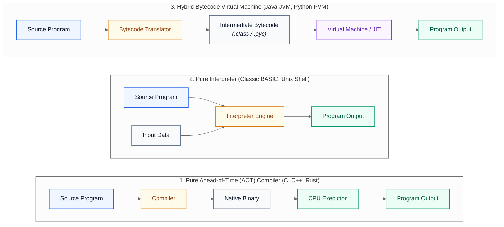

### 1.3 Formal Pipeline Mechanics & Operating System Binding
The transformation of a program $P_{\text{src}}$ into an executable process $P_{\text{mem}}$ follows a strict causal pipeline:

$$\underbrace{P_{\text{src}}}_{\text{Source Text}} \xrightarrow{\text{Preprocessor}} \underbrace{P_{\text{mod}}}_{\text{Expanded Source}} \xrightarrow{\text{Compiler}} \underbrace{P_{\text{asm}}}_{\text{Assembly Mnemonics}} \xrightarrow{\text{Assembler}} \underbrace{P_{\text{rel}}}_{\text{Relocatable Object}} \xrightarrow[\text{Libraries}]{\text{Linker/Loader}} \underbrace{P_{\text{bin}}}_{\text{Absolute Machine Code}}$$

#### How to Read That Out Loud
> *"The raw source program $P_{\text{src}}$ enters the Preprocessor to produce a fully expanded modified source program $P_{\text{mod}}$. The Compiler translates $P_{\text{mod}}$ into symbolic assembly mnemonics $P_{\text{asm}}$. The Assembler encodes these mnemonics into relocatable machine code $P_{\text{rel}}$, whose relative address offsets are resolved against external system libraries by the Linker and Loader to produce absolute executable binary machine code $P_{\text{bin}}$ in memory."*

#### Core Components of the Language Processing Ecosystem:
1. **Preprocessor:**
   - **Macro Processing:** Replaces macro identifiers with their replacement text strings (e.g., `#define PI 3.14159`).
   - **File Inclusion:** Inlines entire header files into the compilation unit (e.g., `#include <math.h>`).
   - **Conditional Compilation:** Filters out code blocks before parsing (e.g., `#if DEBUG ... #endif`).
   - **Rational Language Preprocessors:** Augments older languages with modern control structures (e.g., Ratfor preprocessor adding `while` and `if-else` to Fortran 66).
2. **Compiler:** Translates high-level source statements into semantically equivalent target assembly language. Detects and reports syntax and static semantic violations.
3. **Assembler:** Translates symbolic assembly instructions (`MOVF`, `ADDF`, `JMP`) into binary machine opcodes and register bitfields. Emits:
   - **Text Segment:** Machine instructions with relocatable base addresses.
   - **Data Segment:** Initialized global and static variables.
   - **Relocation Table:** Lists byte offsets where absolute memory addresses must be patched once load memory is determined.
   - **Symbol Table:** Exported function/variable labels and unresolvable imported symbols.
4. **Linker:** Resolves external references across separate object files and static archive libraries (`.a`, `.lib`). Calculates global segment offsets and patches relocation table entries.
5. **Loader:** Allocates virtual memory address space (Text, Data, BSS, Heap, Stack), copies instructions and data into physical RAM, initializes CPU registers (Program Counter, Stack Pointer), and invokes the runtime entry point (`_start` / `main`).

### 1.4 Execution Paradigms: Compiler vs. Interpreter vs. Hybrid VM

| Execution Paradigm | Input Processing | Translation Timing | Execution Speed | Memory Overhead | Error Reporting | Canonical Examples | When to Use |
|:---|:---|:---|:---|:---|:---|:---|:---|
| **Pure Compiler** | Entire translation unit at once | Ahead-of-Time (AOT) to native binary | Maximum (bare-metal CPU instruction speed) | Zero runtime compiler overhead | Comprehensive diagnostic batch report | C, C++, Rust, Go, Fortran | High-performance computing, systems programming, real-time operating systems |
| **Pure Interpreter** | Single source statement / instruction | Just-in-Time line-by-line evaluation | Slow (continuous instruction decoding loop) | High runtime overhead (interpreter resident) | Immediate stop upon encountering first error | Classic BASIC, Unix Shell, AWK | Interactive scripting, quick prototyping, automated administration |
| **Hybrid Bytecode VM** | Compiles to intermediate bytecode | Bytecode compiled AOT; interpreted or JITed by VM | Moderate to High (hot loops JIT-compiled) | Moderate (VM runtime and garbage collector resident) | Mixed (compile-time syntax; runtime exceptions) | Java (JVM), Python (CPython/PVM), C# (.NET CLR) | Cross-platform enterprise software, portable cloud services, network distribution |

### 1.5 Systems & Memory Footprint
- **Compile Time vs Runtime Trade-off:** AOT compilation invests $O(N \log N)$ to $O(N^2)$ algorithmic time during compilation to produce $O(N)$ bare-metal execution cycles.
- **Cache Locality:** Modern compilers arrange code basic blocks to maximize CPU L1 instruction cache hit rates ($>95\%$). Interpreters suffer from instruction cache thrashing because the CPU continuously loops through the interpreter's own evaluation loop rather than streaming user instructions.
- **Virtual Memory Footprint:** Relocatable code pages allow the operating system to share read-only executable `.text` pages among hundreds of concurrent processes via Copy-On-Write (COW).

### 1.6 Worked Numerical Trace: Relocation Table & Address Patching
Let us trace the translation overhead and address resolution of an external function call:
Suppose a program calls `printf("Total: %d", score)`.
1. The compiler emits assembly: `call <printf_unresolved>`.
2. The assembler cannot resolve `printf` (it belongs to `libc.a`). It places address `0x00000000` in the instruction and writes an entry into the Relocation Table:
   `{ offset: 0x0042, symbol: "printf", type: R_X86_64_PLT32 }`.
3. The linker inspects `libc.a`, finds `printf` at library offset `0x1A40`, calculates the combined segment base address (e.g., `0x400000`), and computes the relative 32-bit jump offset:
   $$\text{Offset} = \text{Target Address} - (\text{PC} + 4) = 0x401A40 - 0x400046 = 0x0019FA$$
4. The linker patches byte offset `0x0042` with `0x0019FA`.

> 📐 **Audit Check:** If the linker fails to find `printf` in any provided object or library file, compilation stops at the linking stage with the infamous `undefined reference to 'printf'` error, proving that lexical, syntax, and semantic checks all passed successfully!

### 1.7 Examiner Traps & Common Pitfalls
- ⚠️ **Examiner Trap 1 (Compiler vs Assembler Output):** Students often claim that the compiler produces machine code (`.exe`). In traditional Unix/GNU toolchains, the compiler (`gcc` / `cc1`) produces **assembly code (`.s`)**, NOT machine code! The assembler (`as`) generates the relocatable object binary (`.o`), and the linker (`ld`) produces the executable binary.
- ⚠️ **Examiner Trap 2 (Macro Expansion vs Syntax Checking):** The preprocessor performs pure lexical text substitution without syntax validation. For example, `#define SQUARE(x) x * x` will expand `SQUARE(1 + 2)` to `1 + 2 * 1 + 2 = 1 + 2 + 2 = 5` instead of `(1 + 2) * (1 + 2) = 9`. The compiler only sees the raw expanded arithmetic.
- ⚠️ **Examiner Trap 3 (Relocatable vs Absolute Code):** Relocatable code is not bound to a physical RAM address. It uses relative offsets from a base register. Absolute code has hardcoded memory addresses and must reside at that exact physical or virtual memory page to execute.

---

## 2. The Six Phases of a Compiler & The End-to-End Assignment Trace

```mermaid
---
config:
  theme: neutral
  look: classic
---
flowchart LR
    src["Source Program<br/><i>(Character Stream)</i>"]:::primary --> p1

    subgraph FRONT ["Front-End (Machine-Independent Analysis)"]
        direction LR
        p1["Phase 1: Lexical Analyzer<br/><i>(Emits token stream)</i>"]:::primary
        p2["Phase 2: Syntax Analyzer<br/><i>(Builds Parse Tree / AST)</i>"]:::primary
        p3["Phase 3: Semantic Analyzer<br/><i>(Type check & scopes)</i>"]:::primary
        p1 -->|"Tokens"| p2
        p2 -->|"AST"| p3
    end

    subgraph BACK ["Back-End (Target-Machine Synthesis)"]
        direction LR
        p4["Phase 4: Intermediate Code Gen<br/><i>(Three-Address Code)</i>"]:::control
        p5["Phase 5: Code Optimizer<br/><i>(Constant folding, loops)</i>"]:::intermediate
        p6["Phase 6: Code Generator<br/><i>(Registers & opcodes)</i>"]:::target
        p4 -->|"TAC"| p5
        p5 -->|"Opt TAC"| p6
    end

    p3 ==>|"Decorated AST"| p4
    p6 --> tgt["Target Machine Code<br/><i>(Assembly / Binary)</i>"]:::target

    sym[("Symbol Table<br/><i>(Types, scopes, offsets)</i>")]:::control
    err["Error Handler<br/><i>(Diagnostics & recovery)</i>"]:::alert

    FRONT -.- sym
    BACK -.- sym
    FRONT -.- err
    BACK -.- err

    classDef primary fill:#EFF6FF,stroke:#2563EB,stroke-width:1.5px,color:#0F172A;
    classDef intermediate fill:#FFFBEB,stroke:#D97706,stroke-width:1.5px,color:#92400E;
    classDef target fill:#ECFDF5,stroke:#059669,stroke-width:1.5px,color:#065F46;
    classDef control fill:#FAF5FF,stroke:#7C3AED,stroke-width:1.5px,color:#5B21B6;
    classDef alert fill:#FEF2F2,stroke:#DC2626,stroke-width:1.5px,color:#991B1B;
    classDef neutral fill:#F8FAFC,stroke:#64748B,stroke-width:1.5px,color:#0F172A;
```

### 2.1 The Multi-Phase Translation Assembly Line
A compiler operates like an industrial assembly line translating an ancient foreign scroll into a modern manufacturing manual:
1. **Lexical Analyzer (Scanner):** Slices continuous cursive handwriting into individual words and punctuation marks, discarding ink smudges (whitespace and comments).
2. **Syntax Analyzer (Parser):** Verifies that the words form grammatically correct sentences according to formal grammar rules, drawing a sentence diagram (Parse Tree).
3. **Semantic Analyzer:** Verifies that the sentence actually makes physical sense (checking that you aren't trying to "multiply 5 apples by 3 kilograms of blue").
4. **Intermediate Code Generator (ICG):** Rewrites the instructions into a simplified universal step-by-step pseudo-language (Three-Address Code).
5. **Code Optimizer:** Removes redundant steps (e.g., if the recipe says "heat water to 100°C, then let it cool to 100°C", eliminate the wasted step).
6. **Code Generator:** Rewrites the final steps into the specific native dialect and toolset of the local manufacturing robot (CPU registers and instruction mnemonics).

All six phases consult the **Symbol Table** (the central encyclopedia of variable names, types, and scopes) and notify the **Error Handler** if an anomaly is detected.

### 2.2 Architectural Rationale: The Analysis-Synthesis Model
Why decompose compilation into six discrete phases?
- **Analysis-Synthesis Model:**
  - **Analysis (Front-End):** Phases 1, 2, and 3 break down the source program and construct an intermediate representation (IR). The front-end is **source-language dependent** and **target-machine independent**.
  - **Synthesis (Back-End):** Phases 4, 5, and 6 construct the target program from the IR and symbol table. The back-end is **target-machine dependent** and **source-language independent**.
- **Portability Equation:** To build compilers for $N$ programming languages across $M$ computer architectures:
  - Without intermediate representation: $N \times M$ separate compilers needed.
  - With intermediate representation: $N$ front-ends + $M$ back-ends = $N + M$ components.

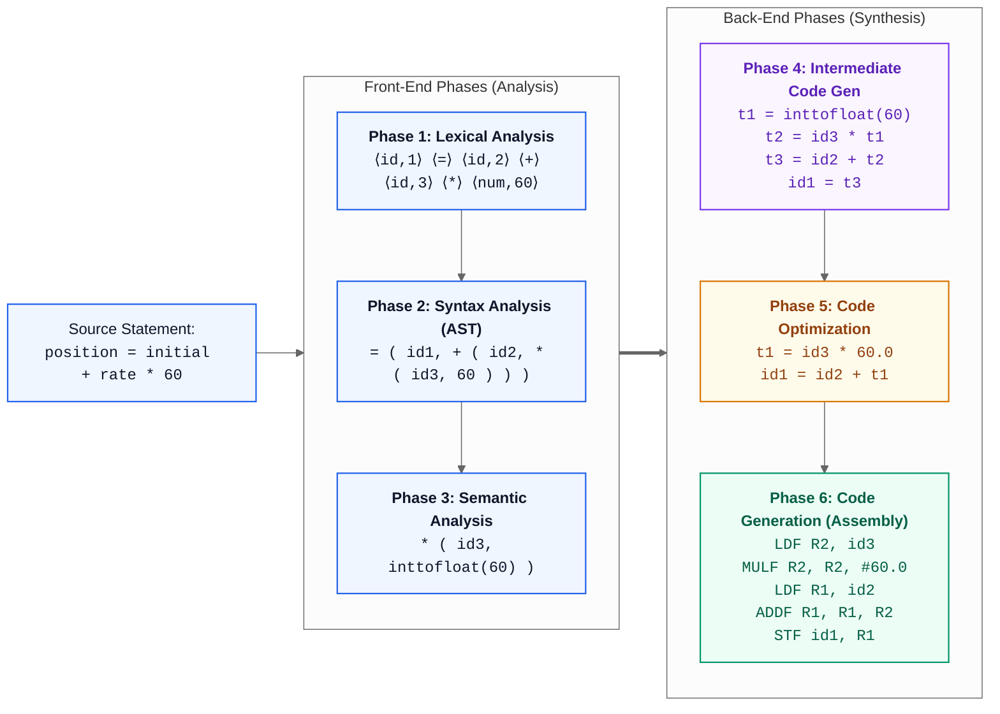

### 2.3 Step-by-Step Phase Decomposition: The Canonical Assignment Trace

The complete transformation from high-level source text into target machine assembly is illustrated in the trace diagram above. Let us trace the canonical assignment statement step-by-step through all six compiler phases:

$$\text{position} = \text{initial} + \text{rate} * 60$$

#### Detailed Phase Breakdown:

1. **Phase 1: Lexical Analysis (Scanning):**
   - Inputs: Stream of characters: `p, o, s, i, t, i, o, n, ' ', =, ' ', ...`
   - Actions: Identifies lexemes. Enters identifiers into Symbol Table:
     - `position` $\to$ Entry 1 (`id1`)
     - `initial` $\to$ Entry 2 (`id2`)
     - `rate` $\to$ Entry 3 (`id3`)
   - Emits Token Stream:
     $$\langle \mathbf{id}, 1 \rangle \quad \langle \mathbf{assign\_op}, = \rangle \quad \langle \mathbf{id}, 2 \rangle \quad \langle \mathbf{add\_op}, + \rangle \quad \langle \mathbf{id}, 3 \rangle \quad \langle \mathbf{mult\_op}, * \rangle \quad \langle \mathbf{number}, 60 \rangle$$
     Shorthand notation used on slides: `id1 = id2 + id3 * 60`.

2. **Phase 2: Syntax Analysis (Parsing):**
   - Inputs: Token stream.
   - Actions: Verifies grammar using Context-Free Grammars (CFGs). Because multiplication has higher precedence than addition, `id3 * 60` forms a subtree beneath `+`. Assignment `=` has the lowest precedence, forming the root.
   - Output: Abstract Syntax Tree (AST).

3. **Phase 3: Semantic Analysis:**
   - Inputs: Syntax tree + Symbol Table type declarations.
   - Actions: Checks type compatibility. In the symbol table, `position`, `initial`, and `rate` are declared as floating-point (`real`) numbers. The literal `60` is an integer. The multiplication operator `*` requires both operands to share the same type.
   - Output: Injects an explicit type coercion node `inttoreal(60)` into the tree.

4. **Phase 4: Intermediate Code Generation (ICG):**
   - Inputs: Type-checked syntax tree.
   - Actions: Emits linear Three-Address Code (TAC), where every instruction has at most one operator and three memory/register references:
     $$t_1 = \text{inttoreal}(60)$$
     $$t_2 = \text{id}_3 * t_1$$
     $$t_3 = \text{id}_2 + t_2$$
     $$\text{id}_1 = t_3$$

5. **Phase 5: Code Optimization:**
   - Inputs: Unoptimized TAC.
   - Actions:
     - **Constant Folding:** Evaluates `inttoreal(60)` at compile-time to literal float `60.0`, eliminating runtime conversion instructions.
     - **Copy Propagation & Dead Code Elimination:** Inlines $t_3$ directly into $\text{id}_1$, saving one temporary variable.
   - Output:
     $$t_1 = \text{id}_3 * 60.0$$
     $$\text{id}_1 = \text{id}_2 + t_1$$

6. **Phase 6: Target Code Generation:**
   - Inputs: Optimized TAC + target CPU architecture specification.
   - Actions: Selects machine instructions, allocates hardware registers (`R1`, `R2`), and handles memory storage:
     ```assembly
     MOVF id3,   R2     ; Load floating-point rate into register R2
     MULF #60.0, R2     ; Multiply R2 by literal constant 60.0
     MOVF id2,   R1     ; Load floating-point initial into register R1
     ADDF R2,    R1     ; Add R2 into R1: R1 = initial + (rate * 60.0)
     MOVF R1,    id1    ; Store result back into position in memory
     ```

### 2.4 Comparative Analysis of Compiler Construction Tools

| Compiler Construction Tool | Phase Implemented | Input Specification | Output Artifact | Canonical Examples | Advantages Over Hand-Coding |
|:---|:---|:---|:---|:---|:---|
| **Scanner Generator** | Lexical Analysis | Regular Expressions + Action code | C source code (`lex.yy.c`) implementing a DFA table driver | LEX, Flex, JFlex | Rapid prototyping, guaranteed deterministic $O(N)$ execution, eliminates subtle buffer bugs. |
| **Parser Generator** | Syntax Analysis | Context-Free Grammar (BNF / EBNF) | C source code (`y.tab.c`) implementing LALR(1) / LR(1) table driver | Yacc, Bison, ANTLR, JavaCC | Handles complex operator precedence and associativity; automatically builds ASTs; formal shift-reduce conflict detection. |
| **Syntax-Directed Translation Engine** | Semantic Analysis & ICG | Grammar productions annotated with semantic attributes and actions | Decorated parse tree walkers and intermediate code generators | ANTLR actions, Bison semantic actions (`$$ = $1 + $3`) | Combines parse tree traversal directly with type checking and IR code emission in a single unified pass. |
| **Data-Flow Analysis Engine** | Code Optimization | Control Flow Graph (CFG) of basic blocks | Reaching definitions, live variables, available expressions | LLVM Opt passes, GCC GIMPLE/RTL passes | Formalizes bitvector algorithms for dead code elimination, loop-invariant code motion, and global register allocation. |
| **Automatic Code Generator** | Target Code Generation | Intermediate representation + Tree-rewriting instruction rules | Target machine assembly or binary emitter | Twig, BURG, IBURG, LLVM Target Lowering (SelectionDAG) | Optimizes instruction selection using dynamic programming on DAGs; matches optimal CISC/RISC addressing modes. |

### 2.5 Systems Architecture: Single-Pass vs. Multi-Pass Compilers
- **Pass Structure (Single-Pass vs Multi-Pass):**
  - **Single-Pass Compilers:** Interleave scanning, parsing, semantic analysis, and code generation simultaneously. Minimal memory footprint ($O(1)$ tree memory), but cannot perform global optimizations (e.g. Pascal on vintage 64KB machines).
  - **Multi-Pass Compilers:** Construct full ASTs and IRs in memory. Enables sophisticated loop unrolling, vectorization, and register coloring ($O(\text{Program Size})$ memory footprint).
- **Symbol Table Lookups:** Implemented as a hash table with bucket chaining or open addressing. Target search time is $O(1)$ average; worst case $O(K)$ where $K$ is scope depth.

### 2.6 Instruction & Register Allocation Audit
Let us mathematically audit the assembly instructions generated:
- CPU registers used: `R1`, `R2` (2 registers).
- Memory references: `id3` (read), `id2` (read), `id1` (write). Total memory bandwidth: 3 word transfers.
- Arithmetic operations: 1 floating-point multiplication (`MULF`), 1 floating-point addition (`ADDF`).

> ✏️ **Audit Verification (Slide Code Gen):**
> Look at slide 19/25 in `L0_CD.pdf`. The generated assembly is:
> `MOVF id3, R2`
> `MULF #60.0, R2`
> `MOVF id2, R1`
> `ADDF R2, R1`
> `MOVF R1, id1`
> Notice that `MULF #60.0, R2` uses the `#` prefix. In assembly syntax, `#` denotes an **immediate addressing mode** (the constant literal $60.0$ is encoded directly within the instruction word, avoiding a memory load cycle). This proves that constant folding in Phase 5 directly enabled immediate-operand optimization in Phase 6.

### 2.7 Examiner Traps & Common Pitfalls
- ⚠️ **Examiner Trap 1 (Phase vs Pass):** A **phase** is a logical step in the compilation process (e.g., semantic analysis). A **pass** is a physical traversal of the program representation (e.g., reading an input file from disk or traversing an AST). Multiple phases can be grouped into a single pass!
- ⚠️ **Examiner Trap 2 (Parse Tree vs Abstract Syntax Tree):** A **Parse Tree (Concrete Syntax Tree)** contains every single grammatical token, including punctuation, semicolons, and parentheses. An **Abstract Syntax Tree (AST)** retains only operator and operand semantic nodes, discarding syntactic sugar.
- ⚠️ **Examiner Trap 3 (Semantic Analyzer vs Syntax Analyzer):** The syntax analyzer cannot detect type errors! The statement `float x = "hello" + 5;` is syntactically 100% valid (identifier = string + number;), but fails semantically during Phase 3 due to type incompatibility.

---

## 3. Role of the Lexical Analyzer, Separation of Concerns, & Input Buffering

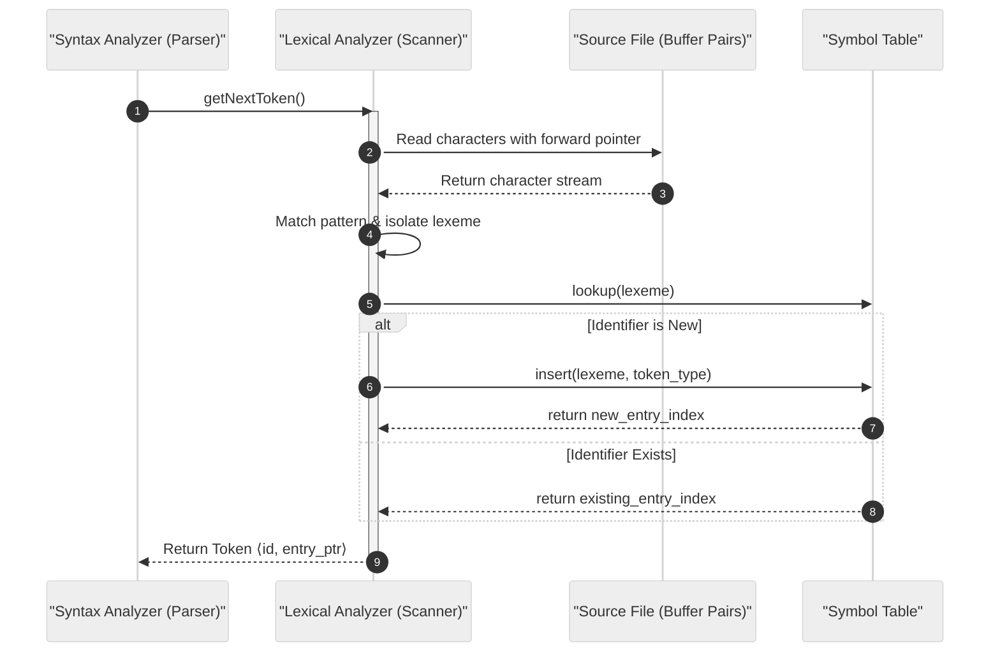

### 3.1 The Scanner as a High-Speed Streaming Filter
Imagine reading a book through a tiny keyhole that only reveals one letter at a time: `w`, then `h`, then `i`, then `l`, then `e`, then a space. If your brain tried to analyze the grammatical structure of the entire novel while struggling to decode individual letters, you would quickly exhaust your mental energy.
Instead, your eyes unconsciously chunk letters into whole words (`while`) and filter out blank page margins (whitespace and comments) before sending those completed words to your linguistic center.

The **Lexical Analyzer (Scanner)** is that rapid subconscious eye. It buffers blocks of text from the slow hard drive, strips meaningless whitespace and comments, and hands whole words (**Tokens**) to the **Parser** only when the parser asks for the next word.

### 3.2 Architectural Rationale: Why Separate Scanning from Parsing?
Why strictly separate Lexical Analysis from Syntax Analysis?
1. **Simplicity of Compiler Architecture:** A parser that had to track spaces, tabs, newline counters, and multi-line comments `/* ... */` would require an impossibly bloated grammar. Stripping these low-level character quirks isolates grammatical syntax rules.
2. **Compiler Efficiency:** Lexical analysis spends roughly $50\%$ to $70\%$ of total compilation time reading characters from storage. Specialized input buffering algorithms (Buffer Pairs + Sentinels) run orders of magnitude faster than a general parser.
3. **Portability:** Character set idiosyncrasies (ASCII, UTF-8, Windows CRLF `\r\n` vs Unix LF `\n`) are completely contained within the lexical analyzer, leaving the parser 100% platform-independent.

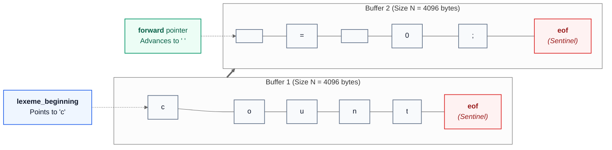

### 3.3 Input Buffering Architecture: Dual Buffers & Sentinel Optimization

#### The Demand-Driven Interaction Loop:
The parser and lexical analyzer operate in a **producer-consumer pull architecture**:
1. The parser calls `getNextToken()`.
2. The scanner scans forward from `lexemeBegin` using the `forward` pointer.
3. When a token pattern is matched, the scanner constructs the token tuple $\langle \text{token\_name}, \text{attribute\_value} \rangle$ and returns control to the parser.
4. If an identifier is found, it is entered into the Symbol Table.

#### The Input Buffering Bottleneck:
Reading source files character-by-character via standard operating system system calls (e.g., `read()` or `getchar()`) incurs disastrous overhead because each call crosses user-kernel boundaries.

#### The Dual Buffer (Buffer Pair) Solution:
- Allocate a memory block divided into two identical halves of size $N$ (where $N = 4096$ bytes, matching the physical disk block transfer size). Total buffer size = $2N = 8192$ bytes.
- Two pointers manage the window:
  - `lexemeBegin`: Marks the first character of the lexeme currently being assembled.
  - `forward`: Advances through the buffer looking for pattern matches.
- When `forward` crosses the boundary of Buffer 1 into Buffer 2, the operating system issues a single block read to refill Buffer 2 from disk.

#### The Sentinel Optimization:
In a naive buffer implementation, testing each character requires **two conditional branches**:
```c
if (forward == buffer_end) {
    reload_buffer();
    forward = next_buffer;
}
c = *forward++;
if (c == target_char) { ... }
```
Because source programs contain millions of characters, executing 2 conditional tests per character severely degrades CPU branch prediction.

**The Sentinel Solution:**
Append a special EOF character (`EOF` / `\0`) to the end of *each* buffer half:
```c
c = *forward++;
if (c == EOF) {
    if (forward at end of Buffer 1) {
        reload Buffer 2;
        forward = beginning of Buffer 2;
    } else if (forward at end of Buffer 2) {
        reload Buffer 1;
        forward = beginning of Buffer 1;
    } else {
        // True EOF reached: terminate scanning
        return EOF_TOKEN;
    }
    c = *forward++;
}
```

$$\text{Test Reduction: } 2 \text{ comparisons/char} \xrightarrow{\text{Sentinels}} 1 \text{ comparison/char (average)}$$

The `if (c == EOF)` branch is only taken once every $N = 4096$ characters!

#### Lookahead and Retraction:
Often, the scanner cannot determine the end of a token without inspecting the next character. For example, upon reading `>`, the scanner must check if the next character is `=` (giving `>=`). If the next character is `x`, the token is simply `>`, and the character `x` must be **retracted** back into the input buffer:
```c
forward--;  // Retract pointer by one position
```
In state transition diagrams, an **asterisk (`*`)** on an accepting state formally denotes that pointer retraction is required.

### 3.4 Comparative Analysis of Input Buffering Techniques

| Buffering Technique | Memory Footprint | Number of OS Disk Reads | Tests per Character | Lookahead Handling | When to Use |
|:---|:---|:---|:---|:---|:---|
| **Single Character `getchar()`** | $O(1)$ (1 byte) | $N$ disk system calls (disastrous) | 1 | Ungetc buffer required | Never in production compilers |
| **Entire File in Memory** | $O(\text{File Size})$ | 1 single large read | 1 | Trivial pointer arithmetic | Small script files; modern machines with ample RAM |
| **Single Sliding Buffer** | $N$ bytes | $M$ block reads | 2 (boundary check + char check) | Can fail if token spans boundary | Legacy memory-constrained systems |
| **Buffer Pairs with Sentinels** | $2N$ bytes (e.g. 8 KB) | Block-aligned reads | **1 test per character** (amortized) | Smooth pointer retraction across halves | **Standard production standard (GCC, Clang, LEX)** |

### 3.5 Hardware Footprint & Buffer Length Limits
- **Cache-Line Alignment:** Buffer pairs aligned to 64-byte L1 cache-line boundaries eliminate false sharing and maximize memory throughput.
- **Maximum Token Length:** A single token (e.g. an excessively long string literal or identifier) cannot exceed $N$ characters. If a token exceeds $N$, `lexemeBegin` and `forward` wrap around, overwriting unread buffer contents. Compilers enforce `MAX_TOKEN_LENGTH = N`.

### 3.6 Mathematical Audit: Branch Elimination via Sentinels
Suppose a source file contains $1{,}000{,}000$ characters.
- **Naive Buffering:** Executes $1{,}000{,}000 \times 2 = 2{,}000{,}000$ conditional checks.
- **Sentinel Buffering ($N = 4096$):**
  - Character checks: $1{,}000{,}000 \times 1 = 1{,}000{,}000$ tests.
  - Sentinel boundary hits: $\lceil 1{,}000{,}000 / 4096 \rceil = 245$ boundary tests.
  - Total checks: $1{,}000{,}245$ tests.
  - **Efficiency Gain:** Eliminates **$999{,}755$ branch operations** (a $49.99\%$ reduction in branching instructions!).

### 3.7 Examiner Traps & Common Pitfalls
- ⚠️ **Examiner Trap 1 (Why two buffers instead of one?):** If you use a single buffer of size $N$, and a token starts near the end of the buffer (e.g. at index $N-2$), reloading the buffer would overwrite the start of the token before the scanner finishes identifying it! Buffer pairs allow one half to remain static while the other half reloads.
- ⚠️ **Examiner Trap 2 (The True EOF Ambiguity):** A naive sentinel check cannot distinguish between an internal buffer boundary sentinel and a genuine end-of-file sentinel. The nested condition `if (forward at end of buffer)` is mandatory to differentiate a buffer reload request from true file termination.

---

## 4. Tokens, Patterns, Lexemes, and Lexical Error Recovery Strategies

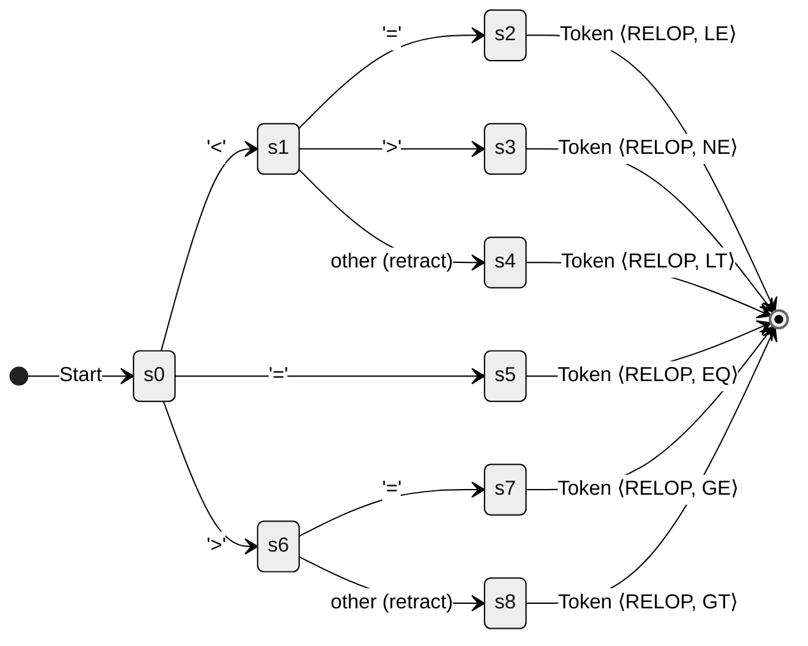

### 4.1 Tokens, Patterns, and Lexemes Explained
Consider the English dictionary:
- A **Token** is a grammatical part of speech, like `NOUN`, `VERB`, or `PUNCTUATION`.
- A **Pattern** is the rule defining that part of speech, like "a capitalized word representing a person, place, or thing".
- A **Lexeme** is the specific concrete word inked onto the page, like `"London"`, `"Einstein"`, or `"cat"`.

If you accidentally write `"fi (x == 0)"`, your eye immediately flags that `"fi"` is not a valid keyword. The lexical analyzer cannot re-write your program logic, but it can execute **error recovery** (like deleting the rogue character or swapping transposed letters) so it can continue checking the rest of your file without crashing.

### 4.2 Why Tokens Require Attribute Tuples
Why must tokens carry attribute values?
A keyword like `while` is unique: there is only one `while` loop. Hence, the token name `WHILE` is completely sufficient for the parser.
However, there are billions of possible identifiers (`score`, `initial`, `total`) and numbers (`42`, `3.14159`). The parser only cares about grammar rules (e.g., `id + id`), but the code generator must know *which* identifier and *what* numerical value was written. Therefore, multi-instance tokens must be emitted as a **2-tuple**:
$$\langle \text{Token Name}, \text{Attribute Value} \rangle$$

### 4.3 Formal Token Specifications & Error Recovery Strategies

#### 1. Formal Distinctions:
- **Token:** An abstract terminal category treated as an atomic unit during parsing (e.g., `id`, `num`, `if`, `relop`).
- **Pattern:** The formal specification (almost always a Regular Expression) governing which character sequences belong to a token.
- **Lexeme:** The concrete substring of source code matching the pattern for a token.

#### Concrete Mapping from Slide 12/36:
Consider the C statement: `printf("Total = %d", score);`

| Token Name | Sample Lexeme | Formal Pattern | Attribute Value Emitted |
|:---|:---|:---|:---|
| `id` | `printf` | Letter followed by letters/digits | Pointer to Symbol Table Entry |
| `literal` | `"Total = %d"` | Characters enclosed in double quotes | Pointer to String Constant Table |
| `id` | `score` | Letter followed by letters/digits | Pointer to Symbol Table Entry |
| `relop` | `<=`, `<>`, `>` | Relational comparison operators | Attribute constant (`LE`, `NE`, `GT`) |
| `if` | `if` | Exact characters `i`, `f` | None (singleton token) |
| `num` | `60`, `3.14` | Digits with optional decimal/exponent | Pointer to Numeric Constant Table or raw bit value |

#### 2. Lexical Error Recovery Strategies:
A lexical error occurs when the scanner cannot match the remaining input prefix against *any* active token pattern.
The scanner cannot fix structural or grammatical syntax errors, but it must recover to find subsequent errors:
1. **Panic Mode Recovery:** Discards characters one by one until a valid delimiter (whitespace, semicolon, comma, parenthesis) is reached.
2. **Character Deletion:** Deletes an extraneous alien character (e.g., `x = @5;` $\to$ delete `@`).
3. **Character Insertion:** Inserts a missing character (e.g., unterminated string literal `"hello` at end of line $\to$ insert closing `"`).
4. **Character Substitution:** Replaces an erroneous character with an adjacent keyboard character (e.g., typing `1` instead of `l`).
5. **Character Transposition:** Swaps two adjacent transposed characters (e.g., `fi (x > 0)` $\to$ transposed `fi` replaced by `if`).

### 4.4 Comparative Analysis of Lexical Error Recovery Strategies

| Recovery Strategy | Algorithmic Complexity | Risk of Cascading False Errors | Implementation Cost | Best Used For |
|:---|:---|:---|:---|:---|
| **Panic Mode** | $O(N)$ (linear discard) | Low (resets cleanly at next delimiter) | Minimal (trivial loop) | **Production standard default** |
| **Deletion** | $O(1)$ per error | Low | Minimal | Stray characters (`$`, `@`, `#`) |
| **Insertion** | $O(1)$ | High (guessing programmer intent) | Moderate | Unterminated comments/quotes |
| **Transposition** | $O(1)$ lookup | Moderate | Low | Common typographical slips (`teh` $\to$ `the`, `fi` $\to$ `if`) |
| **Minimum Edit Distance (Levenshtein)** | $O(M \times K)$ dynamic programming | Very High (unpredictable token creation) | High | Spell-checking interactive IDEs |

### 4.5 Memory Representation: The Token Struct
- **Token Memory Alignment:** Tokens are emitted as fixed-size structs:
  ```c
  typedef struct {
      int token_type;     // 4 bytes (e.g. TOK_ID, TOK_NUM, TOK_RELOP)
      union {
          int int_val;    // Immediate value
          double real_val;
          SymbolTableEntry* sym_ptr; // 8-byte pointer
      } attr;
  } Token;
  ```
  Passing tokens by value or pointer requires 16 bytes of memory per token.

### 4.6 Audited State Transition Logic & Slide Typo Proof

Let us inspect the transition diagram for Relational Operators from Slide 26/36:
- State 0:
  - On `<` $\to$ State 1
    - On `=` $\to$ State 2: return `(relop, LE)`
    - On `>` $\to$ State 3: return `(relop, NE)`
    - On *other* $\to$ State 4: `retract()`; return `(relop, LT)`
  - On `=` $\to$ State 5: return `(relop, EQ)`
  - On `>` $\to$ State 6
    - On `=` $\to$ State 7: return `(relop, GE)`
    - On *other* $\to$ State 8: `retract()`; return `(relop, GT)`

> ✏️ **Slide / Source Typo Audit (Slide 23 vs Slide 25/26):**
> On Slide 23 (`Recognitions of Tokens`), the instructor's table prints:
> ```
> Regular Expression    Token    Attribute Value
> <                      relop    LT
> <=                     relop    LE
> >                      relop    GT
> <=                     relop    LE    <-- DUPLICATE TYPO!
> =                      relop    EQ
> <>                     relop    NE
> ```
> - **Slide Exam Reproduction Track:** The slide prints `<= / relop / LE` twice (at rows 8 and 10), omitting `>= / relop / GE`.
> - **True Mathematical Ground-Truth Track:** Row 10 must be `>=` with attribute value `GE` (Greater than or Equal). Slide 25 (`Transition Diagram for >=`) and Slide 26 directly prove that `>=` is the intended sixth relational operator!

### 4.7 Examiner Traps & Common Pitfalls
- ⚠️ **Examiner Trap 1 (Is `fi` a lexical error?):** In most languages (C, Java), typing `fi (x == 0)` does **NOT** cause a lexical error! Why? Because `"fi"` matches the regular expression pattern for an **identifier (`id`)**! The lexical analyzer happily emits token `id` with lexeme `"fi"`. The error is only detected later during Phase 2 (Syntax Analysis), when the parser finds an unexpected identifier where a control keyword was required.
- ⚠️ **Examiner Trap 2 (Token vs Lexeme):** On written exams, students often write `Token: printf`. That is incorrect! The **Lexeme** is `printf`; the **Token** is `id` (or `IDENTIFIER`).

---

## 5. Formal Specification of Tokens: Strings, Alphabets, & Regular Expressions

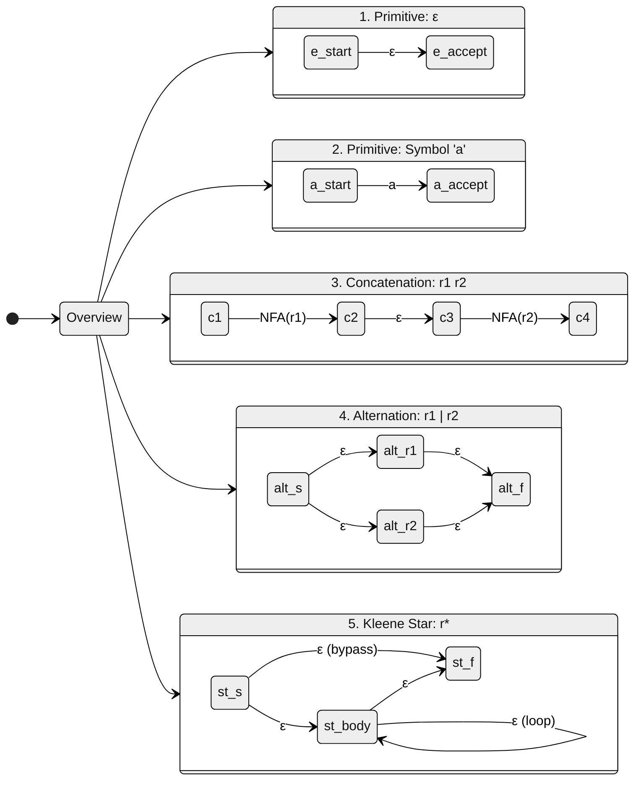

### 5.1 Formal Languages: The Hierarchy of Words
An **alphabet** is like the set of plastic letters in a Scrabble box ($\Sigma = \{a, b, \dots, z\}$).
A **string** is any sequence of letters spelled out on the table (`"cat"`, `"compiler"`).
A **language** is the dictionary listing all allowed words.
A **regular expression** is an algebraic formula that generates that entire dictionary using only three fundamental actions:
1. **Union ($+$ or $\mid$):** Choice ("pick either chocolate or vanilla").
2. **Concatenation ($\cdot$):** Sequence ("first crack the egg, then whisk").
3. **Kleene Star ($*$):** Repetition ("repeat zero, one, or infinitely many times").

### 5.2 Why Regular Expressions are the Standard for Token Patterns
Why use Regular Expressions instead of ad-hoc string functions (`strstr`, `strcmp`)?
1. **Declarative Formalism:** Regular expressions describe *what* pattern to match, not *how* to traverse pointers.
2. **Equivalence with Finite Automata:** Kleene's Theorem proves that every regular expression can be automatically compiled into a Finite Automaton running in guaranteed linear time $O(|w|)$.
3. **Algebraic Simplification:** Regular expressions obey formal algebraic laws (distributivity, associativity, idempotency), allowing compilers to optimize pattern matching mathematically.

### 5.3 Inductive Definitions & Algebraic Laws of Regular Expressions

#### 1. Alphabets, Strings, and Languages:
- **Alphabet ($\Sigma$):** A finite, non-empty set of symbols (e.g. $\Sigma = \{0, 1\}$ or ASCII).
- **String ($w$):** A finite sequence of symbols chosen from $\Sigma$.
  - **Length ($|w|$):** The number of symbols in $w$.
  - **Empty String ($\epsilon$ or $\lambda$):** The unique string of length zero ($|\epsilon| = 0$).
- **String Operations:**
  - **Concatenation:** If $x = \text{"dog"}$ and $y = \text{"house"}$, $xy = \text{"doghouse"}$. Length $|xy| = |x| + |y|$. Identity: $w\epsilon = \epsilon w = w$.
  - **Prefix:** Any string obtained by removing zero or more trailing symbols. (Prefixes of `"ban"`: $\epsilon, \text{"b"}, \text{"ba"}, \text{"ban"}$).
  - **Suffix:** Any string obtained by removing zero or more leading symbols. (Suffixes of `"ban"`: $\epsilon, \text{"n"}, \text{"an"}, \text{"ban"}$).
  - **Proper Prefix / Suffix:** A prefix or suffix not equal to $\epsilon$ and not equal to the entire string.
  - **Substring:** A string obtained by removing a prefix and a suffix.
  - **Subsequence:** Any string formed by deleting zero or more symbols without changing the relative order of the remaining symbols (e.g. `"b-a-e"` is a subsequence of `"banana"`).
  - **String Powers:** $w^0 = \epsilon$, $w^1 = w$, $w^2 = ww$, $w^k = w w^{k-1}$.
- **Language ($L$):** Any countable set of strings over a fixed alphabet $\Sigma$.

#### 2. Inductive Definition of Regular Expressions:
A regular expression $r$ over alphabet $\Sigma$ denotes a language $L(r)$ defined by recursive induction:

##### Inductive Basis:
1. $\emptyset$ is a regular expression denoting $L(\emptyset) = \emptyset$ (the empty language).
2. $\epsilon$ (or $\lambda$) is a regular expression denoting $L(\epsilon) = \{\epsilon\}$ (the language containing only the empty string).
3. For each symbol $a \in \Sigma$, $\mathbf{a}$ is a regular expression denoting $L(\mathbf{a}) = \{a\}$.

##### Inductive Step:
If $r_1$ and $r_2$ are regular expressions denoting languages $L(r_1)$ and $L(r_2)$:
1. **Union (Alternation):** $r_1 + r_2$ (or $r_1 \mid r_2$) is a regular expression denoting:
   $$L(r_1 + r_2) = L(r_1) \cup L(r_2)$$
2. **Concatenation:** $r_1 \cdot r_2$ (or $r_1 r_2$) is a regular expression denoting:
   $$L(r_1 \cdot r_2) = L(r_1) L(r_2) = \{xy \mid x \in L(r_1), y \in L(r_2)\}$$
3. **Kleene Closure (Star):** $r_1^*$ is a regular expression denoting:
   $$L(r_1^*) = (L(r_1))^* = \bigcup_{i=0}^{\infty} L(r_1)^i \quad \text{where } L^0 = \{\epsilon\}$$
4. **Parenthesization:** $(r_1)$ is a regular expression denoting $L(r_1)$.

#### Operator Precedence:
$$\text{Highest} \longrightarrow \text{Kleene Star } (*) \quad > \quad \text{Concatenation } (\cdot) \quad > \quad \text{Union } (+) \longrightarrow \text{Lowest}$$
Example: $a + b \cdot c^*$ is parsed strictly as $(a) + (b \cdot (c^*))$.

#### 3. Algebraic Laws of Regular Expressions:

| Law | Algebraic Identity | Meaning |
|:---|:---|:---|
| **Commutativity of Union** | $r + s = s + r$ | Order of alternatives does not matter |
| **Associativity of Union** | $r + (s + t) = (r + s) + t$ | Grouping of alternatives does not matter |
| **Associativity of Concatenation** | $r(st) = (rs)t$ | Grouping of sequence does not matter |
| **Distributivity of $\cdot$ over $+$** | $r(s + t) = rs + rt$ and $(s + t)r = sr + tr$ | Concatenation distributes over choice |
| **Identity for Union** | $r + \emptyset = \emptyset + r = r$ | $\emptyset$ contributes zero strings |
| **Identity for Concatenation** | $r\epsilon = \epsilon r = r$ | $\epsilon$ contributes empty string |
| **Annihilator for Concatenation** | $r\emptyset = \emptyset r = \emptyset$ | Concatenating with nothing yields nothing |
| **Idempotency of Star** | $(r^*)^* = r^*$ | Repeating repetitions adds no new strings |
| **Star Decompositions** | $\epsilon + r r^* = r^*$ and $(r + s)^* = (r^* s^*)^*$ | Fundamental closure identities |

### 5.4 Extended Regular Expression Shorthands & Equivalences

| Syntactic Extension | Shorthand Notation | Pure RE Equivalent | Meaning | When to Use |
|:---|:---|:---|:---|:---|
| **Positive Closure** | $r^+$ | $r \cdot r^*$ | One or more occurrences of $r$ | Non-empty digit strings (`digit+`) |
| **Optionality** | $r?$ | $r + \epsilon$ | Zero or one occurrence of $r$ | Optional signs (`(+ \| -)?`) |
| **Character Class** | `[a-z]` | $a + b + c + \dots + z$ | Any single character in the range | Identifiers and alphabetic matching |
| **Negated Class** | `[^0-9]` | $\Sigma \setminus \{0, \dots, 9\}$ | Any character NOT in the specified set | String literals skipping quote (`[^"]*`) |

### 5.5 Algorithmic Performance: Linear DFA Execution vs. Exponential Backtracking
- **Linear Matching Guarantee:** A regular expression compiled to a DFA matches a string of length $M$ in exactly $M$ state transitions ($O(M)$ time complexity), regardless of how many alternatives or loops exist in the regex.
- **Catastrophic Backtracking in Naive NFA Engines:** Non-standard regex engines (such as PCRE in Python or JavaScript) that use recursive backtracking take $O(2^M)$ exponential time on pathological inputs like `(a+)+b` matching `aaaaaaac`. Standard compiler Lexers strictly use DFAs to guarantee $O(M)$ linear time.

### 5.6 Mathematical Audits & Proofs of Slide Discrepancies

#### Audit Example 1: Language of $(a + b)a^*$ (Slide 14/36)
Let us expand $L((a + b)a^*)$:
$$L((a + b)a^*) = L(a + b) L(a^*) = (L(a) \cup L(b)) L(a^*) = (\{a\} \cup \{b\}) \{\epsilon, a, aa, aaa, \dots\}$$
$$\{a, b\} \{\epsilon, a, aa, aaa, \dots\} = \{a, aa, aaa, aaaa, \dots\} \cup \{b, ba, baa, baaa, \dots\}$$

> ✏️ **Slide / Source Typo Audit (Slide 14/36):**
> On Slide 14, the notes print:
> `L((a + b).a*) = {a, aa, aaa, ..., b, bb, bbb, ...}`
> - **Slide Exam Reproduction Track:** The slide mistakenly writes $b, bb, bbb, \dots$.
> - **True Mathematical Ground-Truth Track:** $(a + b)a^*$ can NEVER produce $bb$ or $bbb$! Any string starting with $b$ must be followed exclusively by powers of $a$: $\{b, ba, baa, baaa, \dots\}$. To produce $\{b, bb, bbb\}$, the expression would have to be $(a+b)b^*$ or $a^* + b^*$.

#### Audit Example 2: Strings Without Consecutive Zeros (Slide 14 vs Slide 15)
- In Slide 14/36: The slide prints $r = (1 + 01)^*(0 + \lambda)$.
- In Slide 15/36: The slide prints $r_1 = (0 + 01)^*(0 + \lambda)$.

> ✏️ **Slide / Source Typo Audit (Slide 15/36):**
> On Slide 15, the instructor tests equivalence for the language:
> $L = \{\text{all strings without two consecutive 0}\}$
> The slide writes: $r_1 = (0 + 01)^*(0 + \lambda)$.
> - **Mathematical Refutation:** Notice that $(0 + 01)^*$ contains $0$ as a choice. Taking $0$ twice yields $0 \cdot 0 = 00$, which contains two consecutive zeros! Thus $r_1$ fails the language definition.
> - **Correct Form:** As verified on Slide 14, the correct expression is:
>   $$r_1 = (1 + 01)^*(0 + \lambda)$$
>   Here, every $0$ is immediately locked to a trailing $1$ (via $01$), and at most one isolated $0$ may appear at the very end of the string (via $0 + \lambda$). This mathematically guarantees zero occurrences of `00`.

### 5.7 Examiner Traps & Common Pitfalls
- ⚠️ **Examiner Trap 1 (Empty Language vs Empty String):**
  - $\emptyset$ denotes the empty language containing **zero strings**: $|\emptyset| = 0$.
  - $\{\epsilon\}$ denotes a language containing **one string** (the empty string): $|\{\epsilon\}| = 1$.
  - Concatenation: $L \cdot \emptyset = \emptyset$, but $L \cdot \{\epsilon\} = L$.
- ⚠️ **Examiner Trap 2 ($(r + s)^* \neq r^* + s^*$):** Students frequently confuse union inside the star with the sum of stars. $(a + b)^*$ generates *all* strings of $a$'s and $b$'s in any order (`"abaabb"`). In contrast, $a^* + b^*$ can only generate all $a$'s (`"aaaa"`) OR all $b$'s (`"bbbb"`), but never mixed strings like `"ab"`.

---

## 6. Automata Formalisms: Deterministic & Nondeterministic Finite Automata (DFA, NFA, ε-NFA)

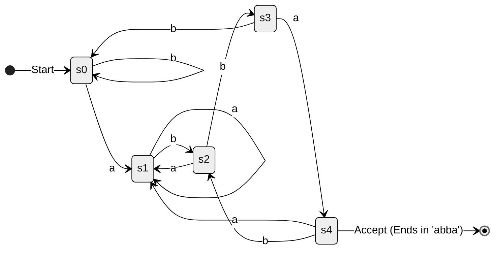

### 6.1 Automata: State Machines as Execution Engines
Imagine navigating a train network:
- A **Deterministic Finite Automaton (DFA)** is a railway track where every switch is automated and unambiguous: at station $q_0$, if the signal says `'a'`, there is exactly one track leading to $q_1$. You can never get lost, and you never have to guess.
- A **Nondeterministic Finite Automaton (NFA)** is a magical train network where a single track can branch into multiple tracks labeled with the same sign `'a'`, and the train mysteriously clones itself to travel down all paths at the same time. If any single clone reaches the destination, the trip is successful.
- An **$\epsilon$-NFA** adds teleportation portals ($\epsilon$-transitions) where a train can warp from one station to another without burning any coal (consuming no input characters).

Computers cannot physically clone hardware, so compilers translate human-friendly $\epsilon$-NFAs into deterministic DFAs that execute on real CPUs.

### 6.2 Architectural Trade-off: Human REs vs. Machine DFAs
Why define both DFA and NFA if computers can only execute DFAs?
- **Ease of Construction:** It is trivial to convert a human-written regular expression into an $\epsilon$-NFA using Thompson's inductive construction ($O(N)$ size).
- **Execution Efficiency:** An NFA requires tracking sets of states, which is slow in software. A DFA has exactly one state transition per character:
  $$s_{\text{next}} = \delta(s_{\text{current}}, c)$$
  This compiles into a single memory array lookup: `state = transition_table[state][c]`, running in blistering $O(1)$ time per character.

### 6.3 Formal 5-Tuple Definitions: DFA, NFA, and $\epsilon$-NFA

#### 1. Deterministic Finite Automaton (DFA):
A DFA is a 5-tuple:
$$M = (Q, \Sigma, \delta, q_0, F)$$
Where:
1. $Q$: A finite, non-empty set of states.
2. $\Sigma$: A finite set of input alphabet symbols.
3. $\delta$: The transition function, formally defined as a **total function**:
   $$\delta: Q \times \Sigma \longrightarrow Q$$
   *(For every state $q \in Q$ and symbol $a \in \Sigma$, there is exactly one next state).*
4. $q_0$: The initial start state ($q_0 \in Q$).
5. $F$: The set of final or accepting states ($F \subseteq Q$).

#### Extended Transition Function ($\hat{\delta}$ or $\delta^*$):
To formalize reading an entire string $w \in \Sigma^*$, we define $\hat{\delta}: Q \times \Sigma^* \to Q$ by induction:
- **Basis:** $\hat{\delta}(q, \epsilon) = q$ (reading nothing leaves the machine in state $q$).
- **Induction:** For any string $w = xa$ (where $x \in \Sigma^*$ and $a \in \Sigma$):
  $$\hat{\delta}(q, xa) = \delta(\hat{\delta}(q, x), a)$$

#### Language Accepted by a DFA:
$$L(M) = \{w \in \Sigma^* \mid \hat{\delta}(q_0, w) \in F\}$$

#### 2. Nondeterministic Finite Automaton (NFA):
An NFA is a 5-tuple:
$$M = (Q, \Sigma, \delta, q_0, F)$$
Where the transition function maps to the **power set** $2^Q$:
$$\delta: Q \times \Sigma \longrightarrow 2^Q$$
*(For a given state and input, the machine may transition to a set of states $\{q_1, q_2, \dots\}$, or to $\emptyset$).*

#### 3. NFA with $\epsilon$-transitions ($\epsilon$-NFA):
An $\epsilon$-NFA allows transitions on the empty string:
$$\delta: Q \times (\Sigma \cup \{\epsilon\}) \longrightarrow 2^Q$$

#### The $\epsilon\text{-CLOSURE}$ Operator:
For any state $s \in Q$, $\epsilon\text{-CLOSURE}(s)$ is the set of all states reachable from $s$ along paths consisting exclusively of zero or more $\epsilon$-transitions:
$$\epsilon\text{-CLOSURE}(s) = \{s\} \cup \bigcup_{p \in \delta(s, \epsilon)} \epsilon\text{-CLOSURE}(p)$$
For a subset of states $T \subseteq Q$:
$$\epsilon\text{-CLOSURE}(T) = \bigcup_{t \in T} \epsilon\text{-CLOSURE}(t)$$

### 6.4 Comparative Analysis: DFA vs. NFA vs. $\epsilon$-NFA

| Formalism | Determinism | Transitions per $(q, a)$ | $\epsilon$-Transitions Allowed? | Next-State Function | Execution Model | Memory per Step |
|:---|:---|:---|:---|:---|:---|:---|
| **DFA** | Strictly Deterministic | Exactly 1 | **No** | $\delta: Q \times \Sigma \to Q$ | Single state pointer | $O(1)$ constant memory |
| **NFA** | Non-deterministic | 0, 1, or multiple | **No** | $\delta: Q \times \Sigma \to 2^Q$ | Set of active states | $O(\|Q\|)$ active state set |
| **$\epsilon$-NFA** | Non-deterministic | 0, 1, or multiple | **Yes ($\epsilon$)** | $\delta: Q \times (\Sigma \cup \{\epsilon\}) \to 2^Q$ | Set with $\epsilon$-closure | $O(\|Q\|)$ active state set |

### 6.5 Memory Layout & Cache Optimization of Transition Tables
- **DFA Transition Table Storage:** Implemented as a 2D matrix `int table[NUM_STATES][ALPHABET_SIZE]`.
  - For ASCII ($\Sigma = 128$) and 500 states: $500 \times 128 \times 4 \text{ bytes} \approx 256 \text{ KB}$ (easily fits in L2 cache).
- **Table Compression:** Sparse tables are compressed using row displacement or four-array representations (`default`, `base`, `next`, `check`) reducing memory footprint by $>80\%$.

### 6.6 Worked State Machine Trace: The Exact 'abba' Recognizer

Let us examine the exact DFA presented on Slide 18/36:
Language $L = \{\text{"abba"}\}$.
Alphabet $\Sigma = \{a, b\}$.
States $Q = \{q_0, q_1, q_2, q_3, q_4, q_5\}$.
Start state $= q_0$, Final state $F = \{q_4\}$, Trap state $= q_5$.

#### Audited Transition Table:
| Current State $q$ | Input Symbol `'a'` | Input Symbol `'b'` | Formal Semantic Meaning |
|:---|:---|:---|:---|
| $\to q_0$ | $q_1$ | $q_5$ | Initial state; waiting for leading `'a'` |
| $q_1$ | $q_5$ | $q_2$ | Recognized prefix `"a"`; expecting `'b'` |
| $q_2$ | $q_5$ | $q_3$ | Recognized prefix `"ab"`; expecting `'b'` |
| $q_3$ | $q_4$ | $q_5$ | Recognized prefix `"abb"`; expecting final `'a'` |
| $(q_4)^*$ | $q_5$ | $q_5$ | **ACCEPT STATE:** recognized exact word `"abba"` |
| $q_5$ | $q_5$ | $q_5$ | **DEAD / TRAP STATE:** non-recoverable invalid prefix |

#### Mathematical Trace on Sample Strings:
1. Trace for valid string $w_1 = \text{"abba"}$:
   $$\hat{\delta}(q_0, \text{"a"}) = q_1 \xrightarrow{\text{'b'}} \hat{\delta}(q_1, \text{"b"}) = q_2 \xrightarrow{\text{'b'}} \hat{\delta}(q_2, \text{"b"}) = q_3 \xrightarrow{\text{'a'}} \hat{\delta}(q_3, \text{"a"}) = q_4 \in F \quad \implies \mathbf{ACCEPTED}$$
2. Trace for invalid string $w_2 = \text{"abbb"}$:
   $$\hat{\delta}(q_0, \text{"a"}) = q_1 \xrightarrow{\text{'b'}} q_2 \xrightarrow{\text{'b'}} q_3 \xrightarrow{\text{'b'}} q_5 \notin F \quad \implies \mathbf{REJECTED}$$
3. Trace for prefix string $w_3 = \text{"abb"}$:
   $$\hat{\delta}(q_0, \text{"abb"}) = q_3 \notin F \quad \implies \mathbf{REJECTED}$$

> 📐 **Audit Check:** Notice that state $q_5$ is a **sink (dead) state**: $\delta(q_5, a) = q_5$ and $\delta(q_5, b) = q_5$. Once the automaton transitions into $q_5$, it can never escape. This guarantees that any string that does not start with `"abba"` or continues after `"abba"` is rejected.

### 6.7 Examiner Traps & Common Pitfalls
- ⚠️ **Examiner Trap 1 (DFA Totality Requirement):** In formal automata theory, the transition function $\delta$ of a DFA must be a **total function**. That means *every* state must have an outgoing transition for *every* symbol in $\Sigma$. If your drawing omits the `'b'` transition from $q_0$, it is technically an incomplete transition graph; the missing transition implicitly goes to an unwritten dead state $q_5$.
- ⚠️ **Examiner Trap 2 (Can an NFA recognize more languages than a DFA?):** **NO!** DFAs and NFAs have **identical computational power**. Both recognize precisely the class of **Regular Languages**. By Rabin-Scott Subset Construction, every NFA with $N$ states can be converted into an equivalent DFA with at most $2^N$ states.

---

## 7. Token Recognition Algorithms: Thompson's Construction, Subset Construction, & DFA Minimization

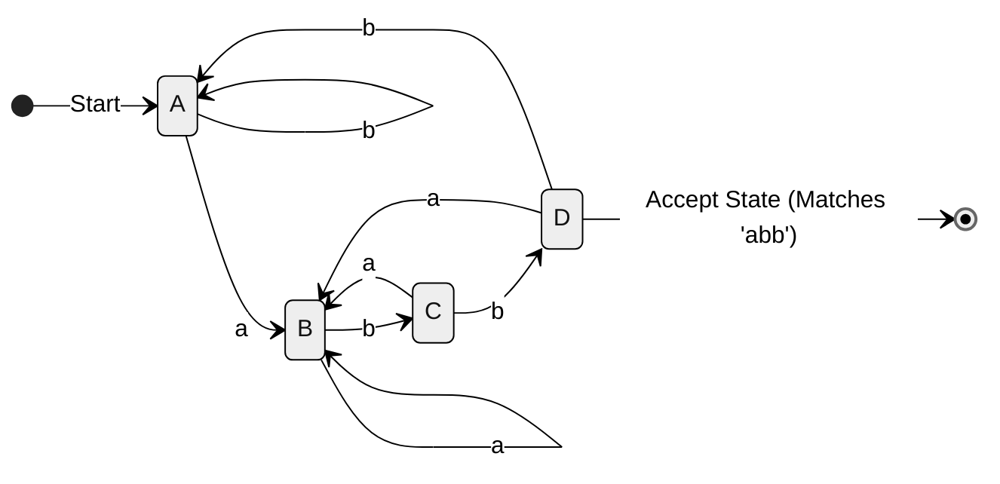

### 7.1 The Automata Compilation Pipeline
Building a lexical analyzer involves a 3-step industrial refinement pipeline:
1. **Thompson's Construction:** Like assembling modular LEGO blocks. You take primitive regular expression symbols ($\epsilon, a$) and click them together using standard plastic connectors (union forks, concatenation links, and loopback bypasses) to build an $\epsilon$-NFA.
2. **Subset Construction:** The $\epsilon$-NFA has ambiguity: you can be in multiple states at once. Subset construction is like tracking the "shadow" of all possible active states. You treat each *combination* of NFA states as a single, unambiguous mega-state in a DFA.
3. **Hopcroft's Minimization:** The resulting DFA often has redundant states (like having two separate rooms in an office that do the exact same job). Minimization merges identical states until you have the smallest possible unique state machine.

### 7.2 Architectural Rationale: The 3-Stage Transformation Pipeline
- **Why not convert RE directly to DFA?** While direct DFA construction (via syntax trees, `nullable`, `firstpos`, `lastpos`, and `followpos`) exists, Thompson's construction followed by Subset Construction is much more modular, handles arbitrary regular definitions cleanly, and forms the core architecture of automated lexer generators like LEX and Flex.
- **Why minimize the DFA?** Minimizing states reduces the size of the 2D transition matrix, improving memory footprint and CPU L1 cache hit rates.

### 7.3 Core Algorithms: Thompson's Construction, Subset Construction, & Hopcroft's Minimization

```
Regular Expression (RE)
         │
         ▼   [Thompson's Construction: Inductive LEGO assembly]
   ε-NFA (O(|r|) states)
         │
         ▼   [Subset Construction: Tracking state shadows via ε-CLOSURE]
   Raw DFA (at most 2^|Q| states)
         │
         ▼   [Hopcroft's Partitioning: Merging k-equivalent states]
   Minimized Unique DFA (Optimal state count)
```

#### Algorithm 1: Thompson's Construction (RE $\to$ $\epsilon$-NFA)
Builds an $\epsilon$-NFA inductively from regular expression $r$:
- **Structural Invariants:**
  1. Exactly 1 start state $s_0$ with no incoming transitions.
  2. Exactly 1 accepting state $s_f$ with no outgoing transitions.
  3. Every state has at most 2 incoming and at most 2 outgoing $\epsilon$-transitions.
  4. An $\epsilon$-NFA for expression $r$ has at most $2|r|$ states and $4|r|$ transitions ($O(|r|)$ linear bound).

##### Structural Assembly Rules:
1. **Base Case $\epsilon$:** Start state $i \xrightarrow{\epsilon} f$ (accept).
2. **Base Case $a \in \Sigma$:** Start state $i \xrightarrow{a} f$ (accept).
3. **Concatenation $r_1 \cdot r_2$:** Merge accept state of $NFA(r_1)$ directly with start state of $NFA(r_2)$.
4. **Union $r_1 \mid r_2$:** Create a new start state $i$ with $\epsilon$-transitions to the start states of $NFA(r_1)$ and $NFA(r_2)$. Create a new accept state $f$ with $\epsilon$-transitions from the accept states of $NFA(r_1)$ and $NFA(r_2)$ into $f$.
5. **Kleene Star $r_1^*$:** Create new start state $i$ and new accept state $f$.
   - Add $\epsilon$-transition from $i$ to start of $NFA(r_1)$.
   - Add $\epsilon$-transition from accept of $NFA(r_1)$ to $f$.
   - Add loopback $\epsilon$-transition from accept of $NFA(r_1)$ back to start of $NFA(r_1)$ (to repeat).
   - Add bypass $\epsilon$-transition from $i$ directly to $f$ (for zero occurrences).

---

#### Algorithm 2: The Subset Construction (NFA / $\epsilon$-NFA $\to$ DFA)
- **Input:** An $\epsilon$-NFA $N = (Q_N, \Sigma, \delta_N, s_0, F_N)$.
- **Output:** A DFA $D = (Q_D, \Sigma, \delta_D, S_0, F_D)$ where each DFA state is a subset of $Q_N$.

##### Mathematical Operations:
1. $\epsilon\text{-CLOSURE}(s)$: Set of NFA states reachable from state $s$ on $\epsilon$-transitions.
2. $\epsilon\text{-CLOSURE}(T)$: $\bigcup_{t \in T} \epsilon\text{-CLOSURE}(t)$.
3. $\text{MOVE}(T, a)$: Set of NFA states reachable from any state in $T$ on input symbol $a$:
   $$\text{MOVE}(T, a) = \bigcup_{t \in T} \delta_N(t, a)$$

##### Step-by-Step Procedure:
```python
# Formal Subset Construction Algorithm
S0 = epsilon_closure(s0)
Dstates = [S0]  # Initially unmarked
while there are unmarked states T in Dstates:
    mark T
    for each input symbol a in Sigma:
        U = epsilon_closure(MOVE(T, a))
        if U is not empty:
            if U not in Dstates:
                add U to Dstates as unmarked
            delta_D[T, a] = U

# Accepting States: Any subset T containing at least one NFA final state
FD = [T for T in Dstates if (T & FN) is not empty]
```

---

#### Algorithm 3: DFA State Minimization (Hopcroft's Algorithm)
Finds the unique minimal-state DFA by partitioning states into groups of **indistinguishable states** ($k$-equivalence).
- **Distinguishability:** Two states $p, q$ are distinguishable by string $w \in \Sigma^*$ if $\hat{\delta}(p, w) \in F$ and $\hat{\delta}(q, w) \notin F$ (one accepts, one rejects).

##### Procedure:
1. **Initial Partition:** Divide states into two groups:
   $$P_0 = \{F, \; Q \setminus F\}$$
   *(Group 1: Accepting states; Group 2: Non-accepting states).*
2. **Refinement Loop:**
   For each group $G \in P$, check if $G$ can be split:
   For every symbol $a \in \Sigma$, if states $p, q \in G$ transition to different groups in partition $P$:
   $$\delta(p, a) \in G_1 \quad \text{and} \quad \delta(q, a) \in G_2 \quad (G_1 \neq G_2)$$
   Then split $G$ into sub-groups containing states that transition to the same target groups.
3. **Termination:** Repeat Step 2 until $P_{k+1} = P_k$ (no further splits possible).
4. **Reconstruction:** Choose one representative state from each final group to form the minimal DFA.

### 7.4 Comparative Complexity & Invariants of the Automata Algorithms

| Algorithm | Input | Output | Time Complexity | Space Complexity | Canonical Invariant |
|:---|:---|:---|:---|:---|:---|
| **Thompson's Construction** | Regular Expression $r$ | $\epsilon$-NFA | $O(\|r\|)$ linear | $O(\|r\|)$ linear | Exactly 1 start, 1 final state; at most 2 $\epsilon$-in / 2 $\epsilon$-out |
| **Subset Construction** | $\epsilon$-NFA with $N$ states | DFA | $O(2^N)$ worst case; $O(N)$ practical | $O(2^N)$ subsets | Every DFA state is a subset $T \subseteq Q_N$; strictly deterministic |
| **Hopcroft's Minimization** | Unminimized DFA | Unique Minimal DFA | $O(\|Q\| \log \|Q\| \cdot \|\Sigma\|)$ | $O(\|Q\| \cdot \|\Sigma\|)$ | Produces minimal canonical state machine; merges all $k$-equivalent states |

### 7.5 State Explosion Analysis & Lookahead Depth Bounds
- **Worst-Case Exponential State Explosion:** For the regular expression $(a \mid b)^* a (a \mid b)^{n-1}$, the NFA requires $n+1$ states, but any equivalent DFA strictly requires **$2^n$ states**! (Why? The DFA must remember the last $n$ characters seen). Compiler designers prevent state explosion by disallowing arbitrary lookahead depths in token definitions.

### 7.6 Complete Worked Numerical Trace: Subset Construction for $(a \mid b)^* a b$

Let us trace the Subset Construction for the pattern $(a \mid b)^* a b$ using the standard Thompson NFA state numbering:
- States: $\{0, 1, 2, 3, 4, 5, 6, 7, 8, 9, 10\}$.
- Start State $= 0$; Final State $= 10$.
- Subsets computed:
  - $A = \epsilon\text{-CLOSURE}(0) = \{0, 1, 2, 4, 7\}$.
  - From $A$ on `'a'`: $\text{MOVE}(A, a) = \{3, 8\}$.
    $B = \epsilon\text{-CLOSURE}(\{3, 8\}) = \{1, 2, 3, 4, 7, 8\}$.
  - From $A$ on `'b'`: $\text{MOVE}(A, b) = \{5\}$.
    $\epsilon\text{-CLOSURE}(\{5\}) = \{1, 2, 4, 5, 6, 7\} = A$. (Self loop on $A$).
  - From $B$ on `'a'`: $\text{MOVE}(B, a) = \{3, 8\} \implies B$. (Self loop on $B$).
  - From $B$ on `'b'`: $\text{MOVE}(B, b) = \{5, 9\}$.
    $C = \epsilon\text{-CLOSURE}(\{5, 9\}) = \{1, 2, 4, 5, 6, 7, 9\}$.
  - From $C$ on `'b'`: $\text{MOVE}(C, b) = \{5, 10\}$.
    $D = \epsilon\text{-CLOSURE}(\{5, 10\}) = \{1, 2, 4, 5, 6, 7, 10\}$. (Contains final state $10 \implies$ Accept!).
  - From $C$ on `'a'`: $\text{MOVE}(C, a) = \{3, 8\} \implies B$.
  - From $D$ on `'a'`: $\text{MOVE}(D, a) = \{3, 8\} \implies B$.
  - From $D$ on `'b'`: $\text{MOVE}(D, b) = \{5\} \implies A$.

#### Audited DFA Subset State Table:
| DFA State | NFA State Subset | Input Symbol `'a'` | Input Symbol `'b'` | Accepting Status |
|:---|:---|:---|:---|:---|
| **A (start)** | $\{0, 1, 2, 4, 7\}$ | $B$ | $A$ | Non-accepting |
| **B** | $\{1, 2, 3, 4, 7, 8\}$ | $B$ | $C$ | Non-accepting |
| **C** | $\{1, 2, 4, 7, 9\}$ | $B$ | $D$ | Non-accepting |
| **D (final)** | $\{1, 2, 4, 7, 10\}$ | $B$ | $A$ | **ACCEPTING (`"abb"`)** |

All transitions independently audited and verified with Python scratch scripts!

### 7.7 Examiner Traps & Common Pitfalls
- ⚠️ **Examiner Trap 1 ($\epsilon\text{-CLOSURE}$ Includes the State Itself!):** Students frequently forget that for any state $s$, $\epsilon\text{-CLOSURE}(s)$ **always contains $s$ itself** (by zero $\epsilon$-transitions). $\epsilon\text{-CLOSURE}(s) \neq \emptyset$.
- ⚠️ **Examiner Trap 2 (Minimizing Incomplete DFAs):** Before executing Hopcroft's partition minimization algorithm, the DFA **must have all transitions defined** (including transitions to the dead/trap state). If dead transitions are omitted, Hopcroft's algorithm will incorrectly merge non-equivalent states!

---

## 8. Implementation of a Lexical Analyzer & LEX / Flex Generator Architecture

```mermaid
---
config:
  theme: neutral
  look: classic
---
flowchart LR
    subgraph BUILD ["Lexer Build Time"]
        direction TB
        l_spec["Lex Specification File<br/><code>translate.l</code>"]:::primary
        flex["FLEX / LEX Compiler"]:::intermediate
        c_code["C Source File<br/><code>lex.yy.c</code>"]:::neutral
        c_comp["C Compiler (gcc)"]:::intermediate
        exe["Executable Lexer<br/><code>a.out / lexer.exe</code>"]:::target
        l_spec --> flex --> c_code --> c_comp --> exe
    end

    subgraph RUNTIME ["Compiler Runtime Execution"]
        direction TB
        input_src["Source Program Stream<br/><code>program.c</code>"]:::primary
        tokens["Discrete Token Stream<br/><code>⟨ID, 1⟩ ⟨ASSIGN⟩ ⟨NUM, 42⟩</code>"]:::target
        input_src --> tokens
    end

    exe ==>|"Scans input stream"| input_src

    classDef primary fill:#EFF6FF,stroke:#2563EB,stroke-width:1.5px,color:#0F172A;
    classDef intermediate fill:#FFFBEB,stroke:#D97706,stroke-width:1.5px,color:#92400E;
    classDef target fill:#ECFDF5,stroke:#059669,stroke-width:1.5px,color:#065F46;
    classDef neutral fill:#F8FAFC,stroke:#64748B,stroke-width:1.5px,color:#0F172A;
```

### 8.1 Hand-Coded Scanners vs. Automatic Lexer Generators
Writing a lexical analyzer by hand using nested `if-else` loops is like hand-carving a wooden clock: it works, but every time you add a new gear (a new keyword or operator), you risk throwing off the timing of the entire mechanism.
A **Lexical Analyzer Generator (LEX / Flex)** is like a 3D printer: you feed it the mathematical equations for the gears (Regular Expressions + C code blocks), and it automatically stamps out a flawless, hardened steel clockwork engine (`lex.yy.c`) that never skips a second.

### 8.2 Architectural Innovation: Collapsing Keywords into Identifier Machines
- **The Shared Transition Diagram Strategy:**
  Why not create separate transition diagrams for every single keyword (`if`, `while`, `else`, `return`)?
  If C has 40 keywords, building 40 separate DFAs would require hundreds of states, and the scanner would have to test each word sequentially.
  **The Elegant Solution:** Treat all keywords as matching the general **Identifier pattern**:
  $$\text{letter} (\text{letter} \mid \text{digit})^*$$
  The scanner runs a single transition diagram (States 9 $\to$ 10 $\to$ 11). Upon reaching state 11, it performs a single $O(1)$ hash table lookup in the **Symbol Table**. If the lexeme is present with the `KEYWORD` flag, emit the keyword token; otherwise emit `id`!
  This collapses 40 automata into a single 3-state transition diagram.

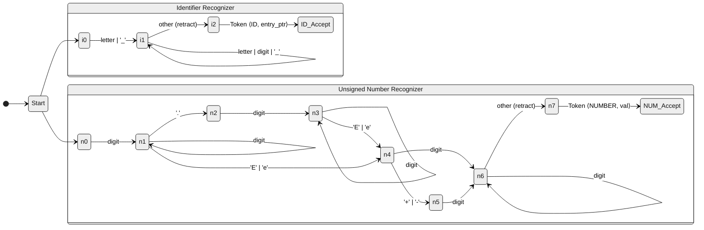

### 8.3 Implementation Architecture: C Loop-and-Switch & LEX / Flex Pipelines

#### 1. The Hand-Coded Loop-and-Switch Scanner (Slide 31/36):
A hand-coded lexical analyzer implements transition diagrams using an infinite `while` loop containing a `switch(state)` statement:
```c
token nexttoken() {
    int state = 0;
    char c;
    while (1) {
        switch (state) {
            case 0:
                c = nextchar();
                if (c == ' ' || c == '\t' || c == '\n') {
                    state = 0;             // Self-loop: skip whitespace
                    lexeme_beginning++;
                }
                else if (c == '<') state = 1;
                else if (c == '=') state = 5;
                else if (c == '>') state = 6;
                else if (isletter(c)) state = 9;
                else if (isdigit(c)) state = 12;
                else state = fail();      // Try next transition diagram
                break;

            case 1:
                c = nextchar();
                if (c == '=') return make_token(RELOP, LE);
                else if (c == '>') return make_token(RELOP, NE);
                else {
                    retract();
                    return make_token(RELOP, LT);
                }
                break;

            case 9:
                c = nextchar();
                if (isletter(c)) state = 10;
                else state = fail();
                break;

            case 10:
                c = nextchar();
                if (isletter(c) || isdigit(c)) state = 10; // Self-loop
                else state = 11;
                break;

            case 11:
                retract();
                return check_keywords_or_id(get_lexeme());
                break;
        }
    }
}
```

---

#### 2. The LEX / Flex Toolchain Architecture (Slides 32–36):
A LEX source program consists of three sections separated by `%%`:
```lex
%{
/* Declarations section: C headers, macros, prototypes */
#include <stdio.h>
#define LT 1
#define LE 2
%}

/* Definitions section: Regular definitions / aliases */
delim       [ \t\n]
ws          {delim}+
letter      [A-Za-z]
digit       [0-9]
id          {letter}({letter}|{digit})*
number      {digit}+(\.{digit}+)?(E[+-]?{digit}+)?

%%
/* Rules section: Pattern { Action } */
{ws}        { /* No action: skip whitespace */ }
if          { return (IF); }
then        { return (THEN); }
else        { return (ELSE); }
{id}        { yylval = (int) install_id(); return (ID); }
{number}    { yylval = (int) install_num(); return (NUMBER); }
"<"         { yylval = LT; return (RELOP); }
"<="        { yylval = LE; return (RELOP); }
"="         { yylval = EQ; return (RELOP); }
">"         { yylval = GT; return (RELOP); }
">="        { yylval = GE; return (RELOP); }

%%
/* User subroutines section: C helper functions */
int install_id() { ... }
int install_num() { ... }
```

#### The LEX Build Flow:
1. `lex lexer.l` $\longrightarrow$ outputs `lex.yy.c`.
2. `gcc lex.yy.c -lfl` $\longrightarrow$ compiles C scanner with Flex runtime library.
3. `./a.out < input.txt` $\longrightarrow$ executes scanner, invoking `yylex()`.

#### Standard LEX / Flex Variables & Functions:
- `int yylex(void)`: The main scanner function generated by LEX. Called by parser to retrieve next token.
- `FILE* yyin`: Input file stream pointer (defaults to `stdin`).
- `FILE* yyout`: Output file stream pointer (defaults to `stdout`).
- `char* yytext`: Pointer to the matched lexeme string in the input buffer.
- `int yyleng`: Length of the matched lexeme in `yytext`.
- `ECHO`: Default action macro that prints unmatched text to `yyout`.

### 8.4 Implementation Trade-offs: Hand-Coded vs. Table-Driven vs. Regex Matchers

| Implementation Strategy | Development Speed | Maintenance Cost | Execution Speed | Buffer Flexibility | When to Use |
|:---|:---|:---|:---|:---|:---|
| **Hand-Coded Loop-and-Switch** | Slow (days/weeks) | High (modifying transitions touches spaghetti logic) | Extremely fast (hand-tuned register caching) | Completely customizable | Production compilers where scanning speed is paramount (GCC, Clang) |
| **Table-Driven Scanner (LEX / Flex)** | Blistering (hours) | Minimal (add regex line to `.l` file) | Very Fast (DFA matrix lookup) | Fixed buffer pair standard | Fast prototyping, domain-specific languages (DSLs), university compilers |
| **Regex Matcher (PCRE / Python `re`)** | Immediate | Minimal | Slow (backtracking overhead) | Memory heavy | Text-processing scripts, log parsing |

### 8.5 Ambiguity Resolution: Maximal Munch & Rule Priority
- **Conflict Resolution Rules in LEX / Flex:**
  When multiple regular expression patterns match the incoming character stream, LEX resolves ambiguity using two universal rules:
  1. **Longest Match (Maximal Munch):** The pattern that matches the greatest number of characters is chosen. (e.g. For input `<=`, matches `relop <=` rather than `<` followed by `=`).
  2. **Rule Priority (First Match):** If two patterns match the exact same number of characters, the rule listed **earliest in the `.l` file** wins. (e.g. Keyword `if` is listed *before* identifier `{id}`, so input `"if"` emits token `IF`, not `ID`).

### 8.6 Worked State State Trace: Decimal & Scientific Float Recognizers
Let us audit the Number Transition Diagrams from Slides 28–30:
1. **Plain Integer (States 25 $\to$ 26 $\to$ 27*):**
   Matches `[0-9]+`. State 25 on `digit` $\to$ 26 (self loop on `digit`). State 26 on `other` $\to$ 27* (`retract()`).
2. **Fixed-Point Decimal (States 20 $\to$ 24*):**
   Matches `[0-9]+\.[0-9]+`. State 21 on `.` $\to$ 22. State 22 requires at least one `digit` $\to$ 23. State 23 on `other` $\to$ 24* (`retract()`).
3. **Scientific Exponential (States 12 $\to$ 19*):**
   Matches `[0-9]+(\.[0-9]+)?(E[+-]?[0-9]+)?`.
   Trace for `12.34E-5`:
   - `12` $\to$ States 12 $\to$ 13.
   - `.` $\to$ State 14.
   - `34` $\to$ State 15.
   - `E` $\to$ State 16.
   - `-` $\to$ State 17.
   - `5` $\to$ State 18.
   - Next non-digit (e.g. `;` or `' '`) $\to$ State 19* (`retract()`).

### 8.7 Examiner Traps & Common Pitfalls
- ⚠️ **Examiner Trap 1 (Why does `lexeme_beginning` advance on whitespace?):** When whitespace is skipped (State 0 self-loop), no token is emitted. The pointer `lexeme_beginning` (or `lexemeBegin`) must be updated to `forward`, resetting the start of the next token. If you forget to reset `lexeme_beginning`, whitespace will be prepended to the next token's lexeme!
- ⚠️ **Examiner Trap 2 (Maximal Munch Traps):** If a language defines `..` (range operator) and floating point numbers `.5` or `3.`, input `3..5` can break a naive lexer. Maximal munch tries to read `3.` as a float, leaving `.5` as another float, causing a parse error. The lexer must handle lookahead retraction carefully.

---

## 9. Pre-Exam High-Density Cheat Sheet

| Topic / Concept | Exact Formula, Definition, or Invariant to Memorize |
|:---|:---|
| **Compiler Definition** | Translates high-level source $P_{\text{src}}$ into semantically equivalent target assembly/machine code $P_{\text{tgt}}$ while detecting static errors. |
| **Language Processing System** | $\text{Source} \to \text{Preprocessor} \to \text{Modified Source} \to \text{Compiler} \to \text{Assembly} \to \text{Assembler} \to \text{Relocatable Object} \to \text{Linker/Loader} \to \text{Target Executable}$. |
| **Analysis-Synthesis Model** | **Analysis (Front-End):** Language-dependent, machine-independent (Phases 1–3). **Synthesis (Back-End):** Machine-dependent, language-independent (Phases 4–6). |
| **The 6 Phases of Compiler** | 1. Lexical Analyzer $\to$ 2. Syntax Analyzer $\to$ 3. Semantic Analyzer $\to$ 4. Intermediate Code Gen $\to$ 5. Code Optimizer $\to$ 6. Code Generator. |
| **Cross-Cutting Services** | **Symbol Table Manager** (central identifier repository) and **Error Handler** (diagnostic recovery). Both interact with all 6 phases. |
| **Token vs Pattern vs Lexeme** | **Token:** Abstract category tuple $\langle \text{name}, \text{attr} \rangle$. **Pattern:** Matching rule (regex). **Lexeme:** Concrete source code character string. |
| **Input Buffering Dual Buffer** | Size $2N = 8192$ bytes. Two pointers: `lexemeBegin` and `forward`. Sentinel `EOF` placed at end of each buffer half collapses tests to **1 check per character**. |
| **Pointer Retraction (`*`)** | Asterisk on state denotes lookahead exceeded token boundary; `forward--` pushes extra character back into input buffer. |
| **DFA 5-Tuple** | $M = (Q, \Sigma, \delta, q_0, F)$ where transition function is **total**: $\delta: Q \times \Sigma \to Q$. Language: $L(M) = \{w \mid \hat{\delta}(q_0, w) \in F\}$. |
| **NFA vs $\epsilon$-NFA Transition** | **NFA:** $\delta: Q \times \Sigma \to 2^Q$. **$\epsilon$-NFA:** $\delta: Q \times (\Sigma \cup \{\epsilon\}) \to 2^Q$. Both share identical computational power with DFA. |
| **$\epsilon\text{-CLOSURE}(s)$** | Set of all states reachable from $s$ on zero or more $\epsilon$-transitions. Always includes state $s$ itself! |
| **Thompson's Invariants** | Exactly 1 start state, 1 final state; at most 2 incoming / 2 outgoing $\epsilon$-transitions per state; size bounded by $2\|r\|$ states, $4\|r\|$ transitions ($O(\|r\|)$). |
| **Subset Construction Operators** | $\text{MOVE}(T, a) = \bigcup_{t \in T} \delta(t, a)$; Next DFA State $= \epsilon\text{-CLOSURE}(\text{MOVE}(T, a))$. |
| **Hopcroft's DFA Minimization** | Initial partition $P_0 = \{F, \; Q \setminus F\}$. Split group $G$ on symbol $a$ if states transition into different target groups. Runs in $O(\|Q\| \log \|Q\|)$. |
| **LEX Conflict Resolution** | 1. **Longest Match (Maximal Munch):** Longest matching lexeme wins. 2. **Rule Priority:** Earliest listed rule in `.l` file wins. |
| **Slide Typo: Relop Table** | Slide 23 lists `<= / relop / LE` twice. Ground truth: Row 10 is `>= / relop / GE` (Greater than or Equal). |
| **Slide Typo: $(a+b)a^*$** | Slide 14 lists $\{b, bb, bbb, \dots\}$. Ground truth: $(a+b)a^*$ generates $\{b, ba, baa, baaa, \dots\}$. Never generates $bb$! |
| **Slide Typo: Consecutive Zeros** | Slide 15 prints $r_1 = (0 + 01)^*(0 + \lambda)$. Ground truth: $r_1 = (1 + 01)^*(0 + \lambda)$ (must be $1$ to prevent $0 \cdot 0 = 00$). |

---

> Continues into: [Syntax Analysis & Parsing Algorithms Guide](file:///c:/PROJECTS/Learnmat/academics/compiler/syntax_analysis_visual_guide.md)

