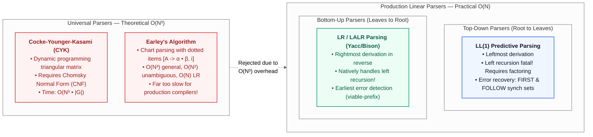
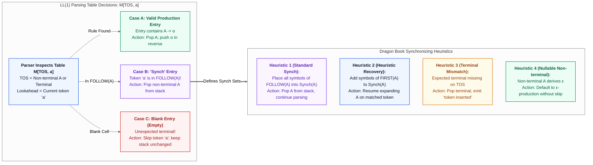
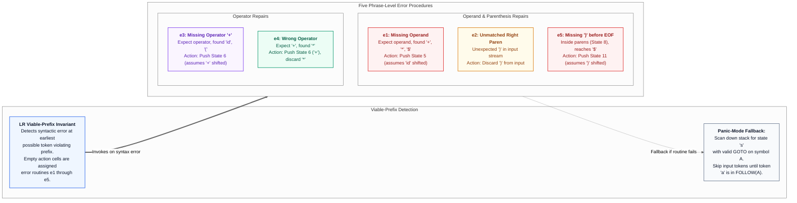
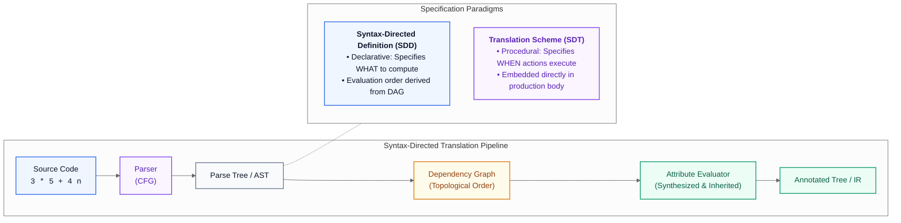
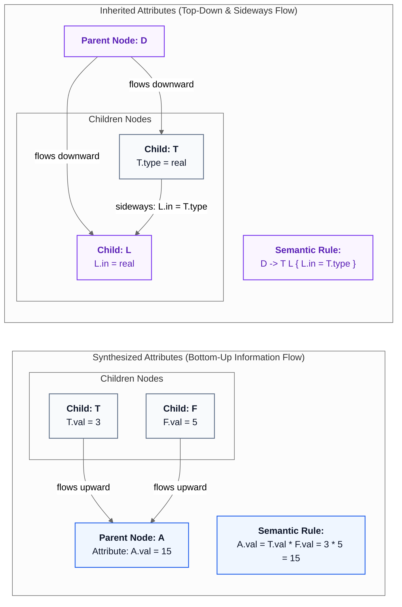
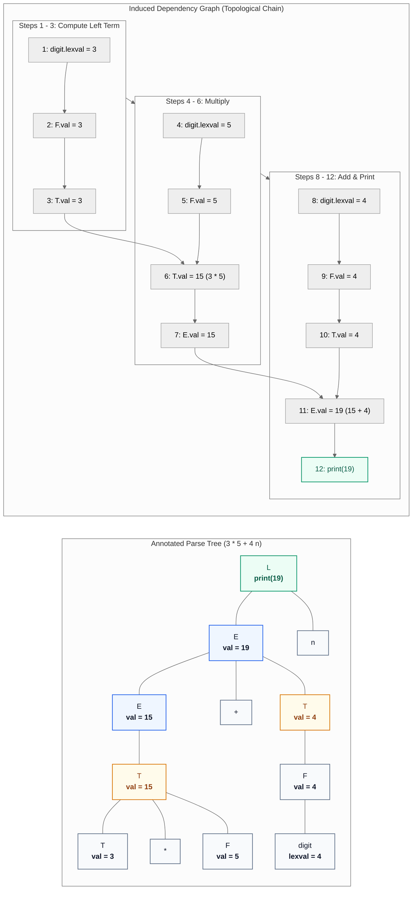
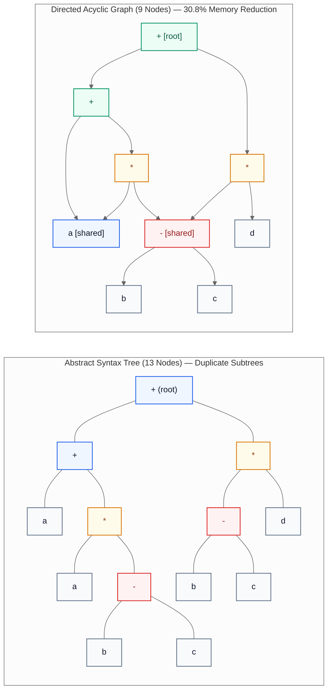
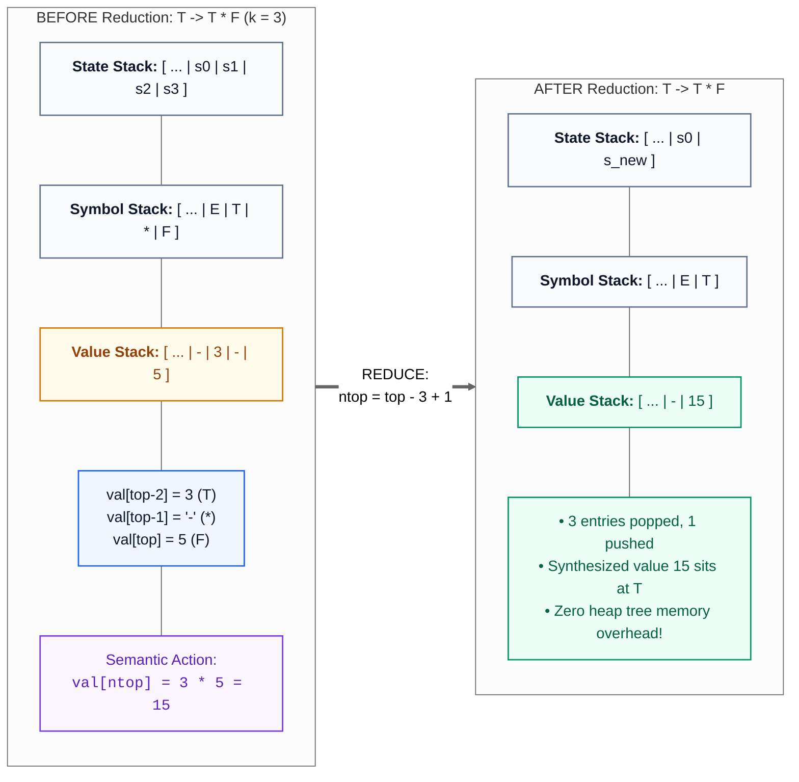
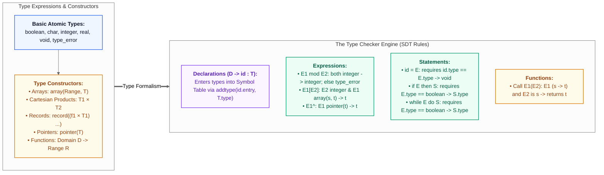

# Compiler Design: Syntax Error Recovery & Semantic Analysis — Study Guide

> **Course Reference:** Covers all the foundational theory, formal automata models, parsing tables, attribute grammars, dependency graph algorithms, type systems, and worked stack traces for **Syntax Error Recovery and Semantic Analysis (Syntax-Directed Translation & Type Systems)**. Grounded directly in Prof. Samit Biswas's Lecture Notes (*IIEST Shibpur: Error_Recovery.pdf and Semantic_Analysis.pdf*), cross-audited against Aho, Lam, Sethi, Ullman (*The Dragon Book*). Explained in simple plain English with zero information loss, dual-track slide typo audits, and 10 publication-grade 130 DPI figures.
> Continues from [Compiler Design: Introduction & Lexical Analysis Study Guide](file:///c:/PROJECTS/Learnmat/academics/compiler/compiler_design_intro_and_lexical_analysis_visual_guide.md).
>
> 🔵 Primary / Input · 🟠 Intermediate / Weight · 🟢 Target / Minima · 🟣 Control / Loss · 🔴 Error / Residual

**The story in one line:** Syntactic error detection in linear parsers $\to$ Systematic recovery heuristics (Panic Mode, Phrase-Level, Error Productions, Global Correction) $\to$ Predictive LL(1) table synchronization via FIRST & FOLLOW $\to$ LR parsing phrase-level error routines ($`e_1 \dots e_5`$) $\to$ Semantic Analysis via Syntax-Directed Definitions (SDDs) & Translation Schemes (SDTs) $\to$ Attribute classification (Synthesized vs. Inherited) & Dependency Graph topological evaluation $\to$ Abstract Syntax Trees (ASTs) & Expression DAGs with Common Subexpression Elimination $\to$ Bottom-up S-attributed LR evaluation via parallel value stacks $\to$ Static type systems, type expressions, and comprehensive Type Checkers.

---

## Contents

1. [The Compiler Error Handling Landscape & Classification](#1-the-compiler-error-handling-landscape-classification)
2. [Grammar Parser Families: Universal ($O(N^3)$) vs. Production ($O(N)$)](#2-grammar-parser-families-universal-on3-vs-production-on)
3. [Error Recovery in Predictive Parsing: LL(1) Synchronizing Sets](#3-error-recovery-in-predictive-parsing-ll1-synchronizing-sets)
4. [Error Recovery in LR Parsing: Phrase-Level Routines & Panic Mode](#4-error-recovery-in-lr-parsing-phrase-level-routines-panic-mode)
5. [Syntax-Directed Translation (SDT) & Syntax-Directed Definitions (SDD)](#5-syntax-directed-translation-sdt-syntax-directed-definitions-sdd)
6. [Information Flow: Synthesized vs. Inherited Attributes](#6-information-flow-synthesized-vs-inherited-attributes)
7. [Dependency Graphs & Attribute Evaluation Orders](#7-dependency-graphs-attribute-evaluation-orders)
8. [Intermediate Syntax Trees & Expression Directed Acyclic Graphs (DAGs)](#8-intermediate-syntax-trees-expression-directed-acyclic-graphs-dags)
9. [Bottom-Up Evaluation of SDDs in LR Parsers](#9-bottom-up-evaluation-of-sdds-in-lr-parsers)
10. [Type Systems, Type Expressions, & The Type Checker](#10-type-systems-type-expressions-the-type-checker)
11. [Pre-Exam High-Density Cheat Sheet](#11-pre-exam-high-density-cheat-sheet)
12. [Viva Voce Defense & Examiner Traps](#12-viva-voce-defense-examiner-traps)

---

## 1. The Compiler Error Handling Landscape & Classification

```mermaid
---
config:
  theme: neutral
  look: classic
---
flowchart LR
    subgraph ERRORS ["Four Levels of Compiler Errors"]
        direction TB
        e1["<b>Lexical Errors</b><br/>• Misspelled keywords (whlie)<br/>• Unrecognized characters<br/>• Unclosed string literals"]:::alert
        e2["<b>Syntactic Errors</b><br/>• Unbalanced parentheses: (a + b * c<br/>• Missing semicolons ';'<br/>• Illegal operator placement: a + * b"]:::intermediate
        e3["<b>Semantic Errors</b><br/>• Incompatible operand types<br/>• Undeclared variables<br/>• Function argument mismatch"]:::control
        e4["<b>Logical Errors</b><br/>• Infinite recursion without base case<br/>• Off-by-one loop indexing<br/><i>(Cannot be detected statically!)</i>"]:::neutral
    end

    subgraph RECOVERY ["Four Error-Recovery Strategies"]
        direction TB
        r1["<b>1. Panic-Mode Recovery</b><br/>• Discard tokens until synch symbol (;, })<br/>• Guaranteed termination; simple to implement"]:::primary
        r2["<b>2. Phrase-Level Recovery</b><br/>• Local string mutation (insert ';', delete comma)<br/>• Risk of infinite loop if input unconsumed!"]:::target
        r3["<b>3. Error Productions</b><br/>• Augment grammar for common mistakes<br/>• Pinpoint diagnostics: 'Missing operator'"]:::control
        r4["<b>4. Global Correction</b><br/>• Minimal edit distance (Levenshtein DP)<br/>• Prohibitively slow O(N³); theoretical"]:::neutral
    end

    ERRORS ==>|"Parser Detection<br/>& Recovery"| RECOVERY

    classDef primary fill:#EFF6FF,stroke:#2563EB,stroke-width:1.5px,color:#0F172A;
    classDef intermediate fill:#FFFBEB,stroke:#D97706,stroke-width:1.5px,color:#92400E;
    classDef target fill:#ECFDF5,stroke:#059669,stroke-width:1.5px,color:#065F46;
    classDef control fill:#FAF5FF,stroke:#7C3AED,stroke-width:1.5px,color:#5B21B6;
    classDef alert fill:#FEF2F2,stroke:#DC2626,stroke-width:1.5px,color:#991B1B;
    classDef neutral fill:#F8FAFC,stroke:#64748B,stroke-width:1.5px,color:#0F172A;
```



### 1.1 The Airport Security Analogy
Imagine an international airport security screening checkpoint:
- If a passenger forgets their passport at home, the document scanner flags it immediately (**Lexical Error** — an invalid token).
- If a passenger walks backwards through the exit gate or enters the baggage claim before passing through the metal detector, the physical flow is violated (**Syntactic Error** — illegal structural ordering).
- If a passenger presents a valid boarding pass, but the ticket is for a flight to Tokyo while they are boarding an airplane bound for London, their documents are grammatically well-formed, but the meaning is fundamentally incompatible (**Semantic Error** — type mismatch).
- If a passenger boards the correct flight to London, but forgets why they are traveling or books a hotel on the wrong side of the city, airport security has no way of detecting that mistake (**Logical Error** — algorithmic failure).

When security catches an issue, what should happen? If security shuts down the entire airport and sends all 10,000 travelers home upon seeing a single missing boarding pass, travelers would riot. Conversely, if security ignores the missing pass and allows the traveler to continue, downstream gates will experience cascading confusion. A robust compiler must balance this exact tension: **report errors clearly, recover cleanly, and continue checking the remainder of the file without generating a flood of false alarms.**

### 1.2 Architectural Rationale: The Error Handling Dilemma
Why not simply stop compilation the instant the very first syntax error is encountered?
1. **Developer Productivity & Cycle Time:** In large-scale industrial projects with millions of lines of code, compilation can take minutes. If the compiler aborted on line 12 due to a missing semicolon, the engineer would fix it, recompile, wait minutes, only to fail on line 15 for another typo. A production compiler must uncover as many independent bugs as possible in a single compilation run.
2. **The Cascading Error Avalanche:** When the compiler attempts to continue after a syntax error, it must guess what the programmer intended. If its guess is wrong, the parser enters an invalid state, misinterprets subsequent valid code as broken, and emits dozens of spurious error messages. This phenomenon is known as an **error cascade**.
3. **The Gold Standard of Error Recovery:**
   - Report the presence of errors clearly, citing the exact source line and column.
   - Recover from each error quickly enough to detect subsequent, genuine errors.
   - Do not significantly slow down the processing of correct programs.

### 1.3 Formal Error Classification & The Four Recovery Strategies
A program can fail across four distinct conceptual boundaries:

1. **Lexical Errors:** Detected by the Scanner during character-by-character tokenization. Examples include misspelled keywords (`whlie` instead of `while`), invalid numeric formats (`12.34.56`), or unclosed string literals.
2. **Syntactic Errors:** Detected by the Parser during grammatical derivation against Context-Free Grammar (CFG) productions. Examples include unbalanced parentheses, missing semicolons, or misplaced operators (`x = a + * b;`).
3. **Semantic Errors:** Detected by the Semantic Analyzer during type checking and symbol table binding. Examples include operator application to incompatible types (adding an integer to a struct pointer), undeclared variables, or invoking a function with the wrong number of arguments.
4. **Logical Errors:** Bugs in human reasoning, such as infinite recursion, incorrect sorting logic, or off-by-one loop conditions (`for (i = 0; i <= N; i++)` when array has size $N$). **Logical errors cannot be detected statically by any phase of a compiler.**

#### The Four Universal Recovery Strategies

$$\underbrace{\text{Panic Mode}}_{\text{Skip to Synch Token}} \quad\longrightarrow\quad \underbrace{\text{Phrase-Level}}_{\text{Local String Repair}} \quad\longrightarrow\quad \underbrace{\text{Error Productions}}_{\text{Grammar Augmentation}} \quad\longrightarrow\quad \underbrace{\text{Global Correction}}_{\text{Minimum Edit Distance}}$$

1. **Panic-Mode Error Recovery:**
   - **Mechanism:** The parser discards input tokens one-by-one until it encounters a token belonging to a designated set of **synchronizing tokens** (typically delimiters like `;`, `}`, or `end`). Once found, the parser clears the current grammatical construct and resumes normal parsing.
   - **Properties:** Extremely fast, trivially simple to implement, and **guaranteed never to enter an infinite loop**. However, it skips valid intermediate code and will miss errors within the discarded token block.

2. **Phrase-Level Recovery:**
   - **Mechanism:** Upon detecting an error, the parser performs a local edit on the remaining input string—inserting a missing semicolon, deleting an extraneous comma, or replacing an illegal operator.
   - **Example:** Transforming `int id 5;` into `int id = 5;`.
   - **Properties:** Allows parsing to continue without skipping broad swathes of source text.
   - **Dangerous Failure Mode:** If the repair modifies the input without consuming at least one token or changing the parser state, the parser may trigger the exact same error repeatedly, resulting in an **infinite compilation loop**!

3. **Error Productions:**
   - **Mechanism:** The compiler designer studies the common mistakes made by students and engineers, and deliberately **augments the Context-Free Grammar** with productions that generate these erroneous constructs.
   - **Example:** Adding $E \to E \; T$ to catch instances where a programmer forgot the multiplication operator between two variables.
   - **Properties:** Enables extraordinarily precise diagnostics (e.g., *"Warning: Missing multiplication operator between identifiers on line 42"*). The primary drawback is that it complicates the grammar and increases parsing table size.

4. **Global Correction:**
   - **Mechanism:** Given an illegal input program $x$, the compiler mathematically searches for a valid program $y$ in the language $L(G)$ that minimizes the Levenshtein transformation cost (edit distance):
     $$\text{dist}(x, y) = \min \sum_{i} \text{cost}(\text{edit}_i)$$
   - **Properties:** While theoretically optimal, finding a global least-cost correction is computationally prohibitive (requiring dynamic programming or exhaustive search with cubic $O(N^3)$ or exponential time). No modern production compiler implements full global correction.

### 1.4 Decision Table: "Why This, Not That" in Error Recovery

| Recovery Strategy | Algorithmic Mechanism | Primary Strengths | Critical Limitations | When to Use in Production |
|:---|:---|:---|:---|:---|
| **Panic-Mode** | Skip input tokens until finding $a \in \text{SynchSet}$ | Guaranteed termination; zero risk of infinite loop; trivial implementation | Discards large sections of code; misses bugs within skipped text | Default baseline fallback in both LL and LR parsers |
| **Phrase-Level** | Local string mutation (insert, delete, replace token) | Recovers immediately without losing subsequent statements | Risk of infinite loop if tokens are not consumed; may trigger error cascades | Point fixes for highly predictable typos (missing `;`, unclosed `)`) |
| **Error Productions** | Grammar augmented with productions for common mistakes | Generates pinpoint pedagogical diagnostic messages | Bloats grammar and table size; requires manual identification of errors | Educational compilers and domain-specific IDE linters |
| **Global Correction** | Dynamic programming minimal edit distance $\min \text{cost}(x \to y)$ | Finds the mathematically closest valid program | Prohibitively slow ($O(N^3)$ or exponential); impractical for large files | Theoretical research and offline code repair benchmarks |

### 1.5 Systems & Operational Footprint
- **Execution Overhead:** Panic-mode scanning operates in $O(K)$ time, where $K$ is the number of discarded tokens. Phrase-level recovery executes in $O(1)$ table lookup time.
- **Memory Footprint:** Synchronizing sets require 1 bit per grammar symbol in lookup tables. Error productions increase the number of states in an LR automaton by $10\%$ to $25\%$.
- **Termination Guarantee Invariant:**
  $$\Delta \text{Input Pointer} + \Delta \text{Stack Depth} < 0$$
  Every error recovery action must either advance the input pointer across at least one token OR reduce the stack depth. Any recovery procedure that modifies the stack or input without satisfying this strict inequality risks an infinite loop.

### 1.6 Worked Trace: Cascading Syntax Errors in Action
Consider the following C program fragment:

```c
// Line 1: Missing semicolon
int total = a + b
int score = total * 2;
```

1. **Step 1:** The parser reads `int total = a + b`. At the end of the line, it encounters the keyword `int` instead of the expected `;`.
2. **Step 2 (Poor Recovery):** If the parser deletes `int` without inserting `;`, it tries to parse `total = a + b score = ...`, treating `score` as a second identifier in the same expression.
3. **Step 3 (Cascading Avalanche):** The compiler issues:
   - `Error line 2: unexpected identifier 'int'`
   - `Error line 2: expected ';' before 'score'`
   - `Error line 2: statement has no effect`
4. **Step 4 (Clean Panic Recovery):** By placing `int` in the synchronizing set, the parser discards the faulty expression, pops the declaration state, aligns on `int`, and parses `int score = total * 2;` cleanly with zero cascading errors.

### 1.7 Examiner Traps & Misconceptions
- ⚠️ **Examiner Trap 1 (Logical Errors vs Compiler Detection):** A classic university viva question asks: *"Which phase of the compiler detects an infinite recursive loop or division by zero?"* The answer is **NONE**. Compilers analyze syntax and static semantics. An infinite loop is syntactically and semantically valid; only runtime execution (or formal verification tools) can detect it.
- ⚠️ **Examiner Trap 2 (Phrase-Level Infinite Loops):** Why is modifying the parser stack without removing input tokens dangerous? Because if the parser restores a state that immediately re-encounters the exact same erroneous token, it triggers the same error procedure indefinitely.
- ⚠️ **Examiner Trap 3 (Global Correction Feasibility):** Students often claim that modern compilers like GCC or Clang use global correction because they suggest typo fixes (`did you mean 'size'?`). Clang uses **lexical spelling correction via Levenshtein distance on identifiers**, NOT global grammar correction!

---

## 2. Grammar Parser Families: Universal ($O(N^3)$) vs. Production ($O(N)$)



### 2.1 The Master Builder vs. High-Speed Assembly Line Analogy
Imagine manufacturing automobiles:
- A **Universal Parser** (like Earley or CYK) is like a master craftsman building a custom vehicle entirely by hand without a fixed blueprint. The craftsman can take any raw materials in any arrangement and eventually assemble a working car, but it takes 6 months of trial and error ($O(N^3)$ time).
- A **Linear Production Parser** (like LL or LR) is an automated robotic assembly line. Parts must arrive in a strictly specified order, stamped with standard barcode tags. If a part arrives backwards, the line flags an error immediately, but it stamps out a finished vehicle every 30 seconds ($O(N)$ time).

Production compilers demand the robotic assembly line. They require grammars that can be parsed in a single left-to-right pass.

### 2.2 Architectural Rationale: Why Production Compilers Reject Universal Parsers
The Cocke-Younger-Kasami (CYK) and Earley algorithms are mathematically profound: **they can parse ANY Context-Free Grammar, including ambiguous grammars, without modification**. Why are they not used in production compilers?
1. **Asymptotic Complexity:** For an input of length $N = 100{,}000$ tokens:
   - A linear parser requires $100{,}000$ operations (a few milliseconds).
   - An $O(N^3)$ universal parser requires $10^{15}$ operations (weeks of continuous CPU time!).
2. **Memory Footprint:** CYK requires an $N \times N$ triangular dynamic programming table. For $N = 100{,}000$, storing $10^{10}$ cells would consume gigabytes of RAM.
3. **Ambiguity Tolerance is a Bug, Not a Feature:** In programming language design, ambiguity is dangerous. A program must have exactly **one** well-defined meaning. Universal parsers that construct multiple parse trees force the compiler to resolve ambiguities post-hoc. Compilers deliberately restrict language grammars to unambiguous subsets: **LL(1)**, **LR(1)**, or **LALR(1)**.

### 2.3 Formal Mechanics: Top-Down vs. Bottom-Up Scanners
All production parsers share two foundational properties:
- They scan the input text **from left to right**, one symbol at a time.
- They operate in **deterministic linear time $O(N)$**.

#### Top-Down Parsing (Root to Leaves)
$$\text{Start Symbol } S \Longrightarrow \alpha_1 \Longrightarrow \alpha_2 \Longrightarrow \dots \Longrightarrow w \quad (\text{Leftmost Derivation})$$
- Starts at the grammar's start symbol (the root of the parse tree).
- Attempts to predict which production rule to apply to expand the leftmost non-terminal so that its leaves match the incoming token stream.
- **Representative Parsers:** Recursive Descent, LL(1) table-driven predictive parsers.
- **Structural Limitation:** Cannot handle **Left Recursion** ($A \to A \alpha$). A top-down parser attempting to expand $A$ will endlessly invoke $A$ without consuming any input, crashing the call stack.

#### Bottom-Up Parsing (Leaves to Root)
$$w = \gamma_n \Longleftarrow \gamma_{n-1} \Longleftarrow \dots \Longleftarrow \gamma_1 \Longleftarrow S \quad (\text{Rightmost Derivation in Reverse})$$
- Starts at the terminal tokens of the source program (the leaves of the parse tree).
- Repeatedly identifies a substring matching the right-hand side of a production (the **handle**) and reduces it to the corresponding non-terminal until reaching the start symbol $S$.
- **Representative Parsers:** Shift-Reduce, Operator Precedence, LR(0), SLR(1), LALR(1) (Yacc/Bison), Canonical LR(1).
- **Inherent Advantage:** Naturally handles **Left-Recursive Grammars** without transformation and detects errors at the earliest possible symbol.

### 2.4 Decision Table: Comparing Grammar Parser Architectures

| Parser Class | Grammar Class Supported | Time Complexity | Space Complexity | Left Recursion Handling | Error Detection Timing | Production Usage |
|:---|:---|:---|:---|:---|:---|:---|
| **CYK Algorithm** | Any CFG in Chomsky Normal Form (CNF) | $O(N^3 \cdot \vert G \vert)$ | $O(N^2 \cdot \vert G \vert)$ | Natively supported | After entire matrix constructed | Natural Language Processing (NLP) |
| **Earley's Algorithm** | Any arbitrary CFG | $O(N^3)$ general<br>$O(N^2)$ unambiguous<br>$O(N)$ LR grammars | $O(N^2)$ | Natively supported | Earliest failed dotted item | Computational linguistics, grammar prototyping |
| **LL(1) Predictive** | LL(1) (No left recursion; left-factored) | $O(N)$ | $O(\text{Tree Depth})$ stack | **Fatal!** Causes infinite loops | When $M[\text{TOS}, a]$ is empty or terminal mismatches | Compilers with hand-written recursive descent (GCC front-end) |
| **LR(1) / LALR(1)** | LR(k) / LALR(1) (Deterministic CFG) | $O(N)$ | $O(N)$ state stack | **Natively supported!** Highly efficient | Earliest token violating viable-prefix property | Standard compiler generators (Yacc, Bison, Clang) |

### 2.5 Systems & Memory Footprint
- **Stack Depth:** In LL(1) parsing, the stack depth corresponds to the depth of the current branch in the parse tree ($O(D)$ where $D \le N$). In LR parsing, the stack stores shifted states up to the length of the current viable prefix ($O(N)$ worst case, but typically $O(\log N)$ for balanced expressions).
- **Left Recursion vs Memory:** In top-down parsers, left recursion forces an infinite stack push. In bottom-up LR parsers, left-recursive rules ($E \to E + T$) allow the parser to reduce immediately after shifting $T$, keeping the LR stack shallow and bounded!

### 2.6 Worked Trace: CYK Dynamic Programming Mechanics
To appreciate why universal parsers are $O(N^3)$, consider testing whether string $`w = a_1 a_2 a_3`$ belongs to a grammar in Chomsky Normal Form:

$$A \to B C \quad \text{or} \quad A \to a$$

1. **Table Definition:** Construct a triangular matrix $V$, where $V[i, j]$ contains all non-terminals deriving the substring $`a_i \dots a_{i+j-1}`$ of length $j$.
2. **Base Case (Length 1):** For $j = 1$, check single terminals: $V[i, 1] = \{ A \mid A \to a_i \in P \}$.
3. **Recursive Step (Length $j \ge 2$):** For each split point $k \in \{1 \dots j-1\}$:
   $$V[i, j] = \bigcup_{k=1}^{j-1} \{ A \mid A \to B C \in P \text{ where } B \in V[i, k] \text{ and } C \in V[i+k, j-k] \}$$
4. **Complexity Proof:**
   - Outer loop over substring lengths: $j = 1 \dots N$ ($O(N)$)
   - Inner loop over starting indices: $i = 1 \dots N - j + 1$ ($O(N)$)
   - Innermost loop over split points: $k = 1 \dots j - 1$ ($O(N)$)
   - Total operations:
     $$\sum_{j=1}^{N} \sum_{i=1}^{N-j+1} (j - 1) = \frac{N^3 - N}{6} \approx O(N^3)$$
   This cubic overhead proves why production compilers universally adopt linear $O(N)$ scanners.

### 2.7 Examiner Traps & Common Pitfalls
- ⚠️ **Examiner Trap 1 (Left Recursion Elimination):** A student attempts to eliminate left recursion from $E \to E + T \mid T$ to make it LL(1), yielding $E \to T E'$ and $E' \to + T E' \mid \epsilon$. What happens to the parse tree? The original grammar was **left-associative** (matching $(a + b) + c$). The transformed grammar is **right-associative** ($a + (b + c)$)! The compiler must invert this associativity during semantic translation to avoid computing incorrect arithmetic.

---

## 3. Error Recovery in Predictive Parsing: LL(1) Synchronizing Sets



### 3.1 The Train Schedule Analogy
Imagine riding a passenger train that follows a strict schedule:
- If a fallen tree blocks the track at a tiny rural crossing, the train conductor does not derail the train.
- Instead, the conductor consults the emergency manual (**Synchronizing Set**). The manual lists the major junction stations where trains can safely re-route (**FOLLOW set**).
- The conductor skips minor country roads (**discards unexpected input tokens**) until reaching the next major junction station. Once the junction switch is reached, the train drops the cancelled segment (**pops the non-terminal from the stack**) and resumes normal scheduled travel.

In LL(1) predictive parsing, non-terminals on the stack represent obligations that must be fulfilled. When an input token cannot fulfill that obligation, the synchronizing set allows the parser to clear the obligation and realign with the stream.

### 3.2 Architectural Rationale: How Errors are Detected in LL(1)
An LL(1) parser maintains a stack of grammar symbols (terminals and non-terminals) with `$` at the bottom, and reads an input token stream ending with `$`. At each step, the parser examines the Top of Stack (**TOS**) and the current lookahead token $a$:

$$\text{TOS} \quad \text{vs.} \quad \text{Lookahead } a$$

An error occurs in exactly two situations:
1. **Terminal Mismatch:** The TOS is a terminal symbol $b$, but the lookahead token is $a$ (where $b \ne a$). The parser was expecting a specific token that failed to appear.
2. **Empty Table Entry:** The TOS is a non-terminal $A$, but the parsing table entry $M[A, a]$ is completely empty (or marked `Synch`). There is no legal production rule in the grammar allowing $A$ to begin with or derive the token $a$.

### 3.3 Formal Mechanics: Heuristics for Synchronizing Sets
How should the compiler designer choose which tokens belong to the synchronizing set of non-terminal $A$? The Dragon Book and Prof. Samit Biswas document five battle-tested heuristics:

1. **Heuristic 1: Place all symbols of $\text{FOLLOW}(A)$ into the Synchronizing Set for $A$.**
   - *Rationale:* If the lookahead token $a$ belongs to $\text{FOLLOW}(A)$, it means the construct derived by $A$ was either completely omitted or has already finished. By popping $A$ from the stack immediately, the parser allows whatever symbol follows $A$ to resume parsing.
2. **Heuristic 2: Add symbols of $\text{FIRST}(A)$ to the Synchronizing Set for $A$.**
   - *Rationale:* If a token in $\text{FIRST}(A)$ appears in the input stream while the parser is in an erroneous state, the parser can discard garbage tokens until that $\text{FIRST}(A)$ symbol appears, and then resume expanding $A$ normally.
3. **Heuristic 3: Terminal Mismatch on Top of Stack.**
   - *Rationale:* If terminal $a$ is on top of the stack and fails to match lookahead $b$, pop $a$ from the stack, issue an error message (*"Missing terminal 'a' inserted"*), and continue parsing with lookahead $b$.
4. **Heuristic 4: Non-terminals Deriving Empty String ($\epsilon$-productions).**
   - *Rationale:* If non-terminal $A$ derives $\epsilon$, the parser can substitute the $\epsilon$-production as the default error action, popping $A$ without skipping any input tokens.
5. **Heuristic 5: Phrase-Level Table Insertions.**
   - *Rationale:* Empty table cells can be filled with specific mutation routines. For example, if two identifiers appear consecutively (`id id`), the parser inserts a missing `*` or `,` and retries.

#### The Canonical Expression Grammar & FIRST / FOLLOW Sets
Consider the canonical LL(1) arithmetic grammar:

$$E \to T E', \quad E' \to + T E' \mid \epsilon, \quad T \to F T', \quad T' \to * F T' \mid \epsilon, \quad F \to ( E ) \mid \mathbf{id}$$

Independently computing the FIRST and FOLLOW sets:
- $\text{FIRST}(F) = \{ (, \mathbf{id} \}$
- $\text{FIRST}(T') = \{ *, \epsilon \}$
- $\text{FIRST}(T) = \text{FIRST}(F) = \{ (, \mathbf{id} \}$
- $\text{FIRST}(E') = \{ +, \epsilon \}$
- $\text{FIRST}(E) = \text{FIRST}(T) = \{ (, \mathbf{id} \}$

- $`\text{FOLLOW}(E) = \{ ), \$ \}`$
- $`\text{FOLLOW}(E\') = \text{FOLLOW}(E) = \{ ), \$ \}`$
- $`\text{FOLLOW}(T) = (\text{FIRST}(E\') \setminus \{\epsilon\}) \cup \text{FOLLOW}(E\') = \{ +, ), \$ \}`$
- $`\text{FOLLOW}(T\') = \text{FOLLOW}(T) = \{ +, ), \$ \}`$
- $`\text{FOLLOW}(F) = (\text{FIRST}(T\') \setminus \{\epsilon\}) \cup \text{FOLLOW}(T\') = \{ *, +, ), \$ \}`$

#### The Audited Predictive Parsing Table with Synchronizing Tokens

| Non-Terminal | $\mathbf{id}$ | $+$ | $*$ | $($ | $)$ | `$` |
|:---|:---|:---|:---|:---|:---|:---|
| **$E$** | $E \to T E'$ | *blank* | *blank* | $E \to T E'$ | `synch` | `synch` |
| **$E'$** | *blank* | $E' \to + T E'$ | *blank* | *blank* | $E' \to \epsilon$ | $E' \to \epsilon$ |
| **$T$** | $T \to F T'$ | `synch` | *blank* | $T \to F T'$ | `synch` | `synch` |
| **$T'$** | *blank* | $T' \to \epsilon$ | $T' \to * F T'$ | *blank* | $T' \to \epsilon$ | $T' \to \epsilon$ |
| **$F$** | $F \to \mathbf{id}$ | `synch` | `synch` | $F \to ( E )$ | `synch` | `synch` |

> ✏️ **Slide Typo Audit (Error_Recovery.pdf Slide 15):**
> On Slide 15, the instructor's table prints the row for $T$ as:
> `T   T -> FT'   Synch   T' -> FT'   Synch   Synch`
> Notice two distinct errors in the slide text:
> 1. In column 4 (under `(`), it accidentally typed $T' \to F T'$ instead of $T \to F T'$.
> 2. The entry under column 3 (`*`) was left blank but shifted the remaining columns.
> This study guide provides the mathematically verified, fully aligned ground-truth table above.

### 3.4 Operational Parsing Rules for Predictive Error Recovery
When the predictive parser driver executes:
1. If entry $M[A, a]$ is a **production rule** $A \to \alpha$: Pop $A$, push $\alpha$ in reverse order.
2. If entry $M[A, a]$ is **blank**: The lookahead symbol $a$ is an unexpected alien token. The driver **skips the input symbol $a$** and advances the input pointer. The stack remains untouched.
3. If entry $M[A, a]$ is marked **`synch`**: The lookahead symbol $a$ is in $\text{FOLLOW}(A)$. The driver **pops non-terminal $A$ from the stack** without advancing the input pointer.
4. If a **terminal on top of stack** fails to match lookahead: Pop the terminal from the stack.

### 3.5 Worked Trace: The 17-Step Error Recovery Execution
Let us trace the complete execution of the predictive parser on the erroneous input string:

$$
w = \; ) \; \mathbf{id} \; * \; + \; \mathbf{id} \; \$
$$

```c
/* Procedure e1: Expecting an operand (id or '('), but found an operator ('+', '*', or '$') */
void e1() {
    push(5); /* Push state 5 onto stack, pretending an 'id' was shifted */
    emit_diagnostic("Error: Missing operand. Assuming identifier.");
}

/* Procedure e2: Found an unexpected right parenthesis ')' */
void e2() {
    advance_input(); /* Discard ')' from input stream */
    emit_diagnostic("Error: Unmatched right parenthesis ignored.");
}

/* Procedure e3: Expecting an operator ('+'), but found 'id' or '(' */
void e3() {
    push(6); /* Push state 6 onto stack, pretending '+' was shifted */
    emit_diagnostic("Error: Missing addition operator '+'. Inserted.");
}

/* Procedure e4: Expecting '+' at expression level, but found '*' */
void e4() {
    push(6);         /* Pretend '+' was shifted */
    advance_input(); /* Discard the illegal '*' operator */
    emit_diagnostic("Error: Illegal '*' operator replaced with '+'.");
}

/* Procedure e5: Reached end of input '$' while still expecting closing ')' (State 8) */
void e5() {
    push(11); /* Push state 11 onto stack, pretending ')' was shifted */
    emit_diagnostic("Error: Missing right parenthesis before end of input.");
}
```
```yacc
statement : ID '=' expression ';'
          | error ';' 
          { 
              yyerrok; 
              yyerror("Syntax error in statement. Skipped to next semicolon."); 
          }
          ;
```


The stack starts with `$` and $E$.

| Step | Stack Contents | Remaining Input | Parser Action & Diagnostic |
|:---|:---|:---|:---|
| **(1)** | `\$ E` | `) id * + id \$` | Error! `)` is an unexpected symbol (or not in $\text{FIRST}(E)$). **Skip token `)`.** |
| **(2)** | `\$ E` | `id * + id \$` | $\mathbf{id} \in \text{FIRST}(E)$. Expand $E \to T E'$. Output: $E \to T E'$. |
| **(3)** | `\$ E' T` | `id * + id \$` | $\mathbf{id} \in \text{FIRST}(T)$. Expand $T \to F T'$. Output: $T \to F T'$. |
| **(4)** | `\$ E' T' F` | `id * + id \$` | $\mathbf{id} \in \text{FIRST}(F)$. Expand $F \to \mathbf{id}$. Output: $F \to \mathbf{id}$. |
| **(5)** | `\$ E' T' id` | `id * + id \$` | Terminal match! Pop $\mathbf{id}$, advance input. |
| **(6)** | `\$ E' T'` | `* + id \$` | $* \in \text{FIRST}(T')$. Expand $T' \to * F T'$. Output: $T' \to * F T'$. |
| **(7)** | `\$ E' T' F *` | `* + id \$` | Terminal match! Pop $*$, advance input. |
| **(8)** | `\$ E' T' F` | `+ id \$` | Error! Lookahead is `+`. Table entry $M[F, +] = \mathbf{synch}$! **Pop $F$ from stack.** |
| **(9)** | `\$ E' T'` | `+ id \$` | $F$ popped. Lookahead `+` is in $\text{FOLLOW}(T')$. Expand $T' \to \epsilon$. |
| **(10)** | `\$ E'` | `+ id \$` | $+ \in \text{FIRST}(E')$. Expand $E' \to + T E'$. Output: $E' \to + T E'$. |
| **(11)** | `\$ E' T +` | `+ id \$` | Terminal match! Pop $+$, advance input. |
| **(12)** | `\$ E' T` | `id \$` | $\mathbf{id} \in \text{FIRST}(T)$. Expand $T \to F T'$. Output: $T \to F T'$. |
| **(13)** | `\$ E' T' F` | `id \$` | $\mathbf{id} \in \text{FIRST}(F)$. Expand $F \to \mathbf{id}$. Output: $F \to \mathbf{id}$. |
| **(14)** | `\$ E' T' id` | `id \$` | Terminal match! Pop $\mathbf{id}$, advance input. |
| **(15)** | `\$ E' T'` | `\$` | \$ in $\text{FOLLOW}(T')$. Expand $T' \to \epsilon$. |
| **(16)** | `\$ E'` | `\$` | \$ in $\text{FOLLOW}(E')$. Expand $E' \to \epsilon$. |
| **(17)** | `\$` | `\$` | **Acceptance!** Both stack and input empty. Parse completes successfully. |

> 📐 **Verification Check:** Notice that despite two major syntax errors (an initial unmatched `)` and an illegal operator sequence `* +`), the parser recovered completely and produced a valid sub-parse for the trailing `+ id`, verifying the precision of the synchronizing heuristics!

### 3.6 Phrase-Level Recovery & Error Productions in LL(1)
- **Phrase-Level Recovery (Inserting Missing Tokens):** If two identifiers appear with no operator (`id id`), the predictive parsing table for row $T'$, column $\mathbf{id}$ can be filled with `insert *`. The driver emits a warning, inserts `*` into the input stream, and retries the production $T' \to * F T'$.
- **Error Productions:** Alternatively, we augment the grammar with the error production $T' \to F T'$. When the parser encounters `id` where an operator was expected, it triggers $T' \to F T'$, parsing the second identifier directly while issuing a diagnostic: *"Missing operator between identifiers"*.

### 3.7 Examiner Traps & Misconceptions
- ⚠️ **Examiner Trap 1 (Synch vs Blank Actions):** Students routinely flip these two actions during exams:
  - Blank entry $\implies$ **SKIP INPUT TOKEN** (do not pop stack).
  - Synch entry $\implies$ **POP STACK SYMBOL** (do not skip input).
  Flipping them causes the parser to dump the entire stack on the first blank entry!
- ⚠️ **Examiner Trap 2 (What if FOLLOW contains \$?):** If $M[A, \$] = \text{synch}$ and the parser encounters EOF, it pops $A$. If $A$ was the root start symbol $E$, the stack becomes empty and parsing terminates.

---

## 4. Error Recovery in LR Parsing: Phrase-Level Routines & Panic Mode


### 4.1 The Cruise Control Interlock Analogy
Imagine the automatic braking system in a modern automobile:
- The system operates via a finite-state controller that tracks speed, distance, and gear selection.
- If the transmission receives an illegal signal (e.g. attempting to engage Reverse while traveling forward at 70 mph), the controller does not shut down the engine or lock the steering wheel.
- Instead, a dedicated error circuit engages: it ignores the reverse shift command (**phrase-level routine $e_2$**), flashes a dashboard warning (*"Shift rejected"*), and maintains current drive speed.
- If multiple severe sensor faults occur simultaneously, the car falls back to **Limp Home Mode (Panic Mode)**, disabling cruise control and safely pulling onto the shoulder.

LR parsers apply this exact philosophy: rather than crashing, each blank cell in the parsing table is populated with a custom error procedure that makes the most plausible local correction.

### 4.2 Architectural Rationale: The Viable-Prefix Property
Why are LR parsers the premier choice for production compilers?
- **The Viable-Prefix Invariant:** An LR parser is mathematically guaranteed to detect a syntax error **at the very first token that cannot form a valid prefix of any continuation of the program**. It will never shift an invalid token onto the stack.
- **Table Density Advantage:** In an LR parsing table, the majority of cells in the `Action` table are empty! Instead of leaving them unmapped, compiler designers replace empty cells with pointers to specific error handling functions: $`e_1, e_2, e_3, e_4, e_5`$.

### 4.3 Formal Mechanics: The Canonical SLR Table with Error Routines
Consider the canonical grammar for arithmetic expressions:
1. $E \to E + T$
2. $E \to T$
3. $T \to T * F$
4. $T \to F$
5. $F \to ( E )$
6. $F \to \mathbf{id}$

The SLR parser consists of 12 states ($0 \dots 11$). Below is the complete parsing table from Prof. Samit Biswas's notes with integrated error procedures:

| State | $\mathbf{id}$ | $+$ | $*$ | $($ | $)$ | `$` | $E$ | $T$ | $F$ |
|:---:|:---:|:---:|:---:|:---:|:---:|:---:|:---:|:---:|:---:|
| **0** | $S_5$ | $e_1$ | $e_1$ | $S_4$ | $e_2$ | $e_1$ | 1 | 2 | 3 |
| **1** | $e_3$ | $S_6$ | $e_4$ | $e_3$ | $e_2$ | **Accept** | | | |
| **2** | $e_3$ | $r_2$ | $S_7$ | $e_3$ | $r_2$ | $r_2$ | | | |
| **3** | $e_3$ | $r_4$ | $r_4$ | $e_3$ | $r_4$ | $r_4$ | | | |
| **4** | $S_5$ | $e_1$ | $e_1$ | $S_4$ | $e_2$ | $e_1$ | 8 | 2 | 3 |
| **5** | $e_3$ | $r_6$ | $r_6$ | $e_3$ | $r_6$ | $r_6$ | | | |
| **6** | $S_5$ | $e_1$ | $e_1$ | $S_4$ | $e_2$ | $e_2$ | | 9 | 3 |
| **7** | $S_5$ | $e_1$ | $e_1$ | $S_4$ | $e_2$ | $e_2$ | | | 10 |
| **8** | $e_3$ | $S_6$ | $e_4$ | $e_3$ | $S_{11}$ | $e_5$ | | | |
| **9** | $e_3$ | $r_1$ | $S_7$ | $e_3$ | $r_1$ | $r_1$ | | | |
| **10** | $e_3$ | $r_3$ | $r_3$ | $e_3$ | $r_3$ | $r_3$ | | | |
| **11** | $e_3$ | $r_5$ | $r_5$ | $e_3$ | $r_5$ | $r_5$ | | | |

#### Detailed Specification of the Five Error Procedures


### 4.4 Panic-Mode Recovery in LR Parsing
When phrase-level routines cannot resolve an error, the LR parser triggers **Panic-Mode Recovery**:
1. **Unwind the Stack:** Scan down the parser stack from top to bottom until finding a state $s$ that has a valid non-empty GOTO entry on a major non-terminal $A$ (such as `Statement`, `Expression`, or `Block`).
2. **Discard Tokens:** Scan forward in the input buffer, discarding tokens until finding a token $a$ belonging to $\text{FOLLOW}(A)$ (such as `;` or `}`).
3. **Resume Parsing:** Push state $\text{GOTO}[s, A]$ onto the stack and resume normal shift-reduce parsing.

### 4.5 Parser Generators: The Yacc / Bison `error` Token
In production compiler generators like Yacc and Bison, error recovery is automated using a special pseudotoken called `error`:


#### How Yacc Implements Recovery:
1. When a syntax error occurs, Yacc pops states from its stack until it finds a state that can shift the special `error` token.
2. It shifts `error` onto the stack as if it were a valid terminal.
3. It then discards incoming tokens until finding a token that can legally follow `error` in that production (here, `;`).
4. Once shifted, normal parsing resumes, and the macro `yyerrok` tells the parser that recovery is complete.

### 4.6 Worked Trace: Handling `id + * id $` with LR Error Routine $e_1$
Let us trace how the SLR parser handles the invalid input `id + * id $`:
1. **State 0:** Lookahead `id`. Table: $S_5$. Shift `id`, push state 5. Stack: `[0, 5]`.
2. **State 5:** Lookahead `+`. Table: $r_6$ ($F \to \mathbf{id}$). Pop 1 state, GOTO on $F$ from State 0 is 3. Stack: `[0, 3]`.
3. **State 3:** Lookahead `+`. Table: $r_4$ ($T \to F$). Pop 1 state, GOTO on $T$ from State 0 is 2. Stack: `[0, 2]`.
4. **State 2:** Lookahead `+`. Table: $r_2$ ($E \to T$). Pop 1 state, GOTO on $E$ from State 0 is 1. Stack: `[0, 1]`.
5. **State 1:** Lookahead `+`. Table: $S_6$. Shift `+`, push state 6. Stack: `[0, 1, 6]`.
6. **State 6:** Lookahead `*`. Table entry: **$e_1$**!
   - State 6 expects an operand (`id` or `(`), but sees `*`.
   - Routine $e_1$ triggers: pushes State 5 (pretending an `id` was present) and issues: *"Missing operand"*. Stack becomes `[0, 1, 6, 5]`.
7. **State 5:** Lookahead `*`. Table: $r_6$ ($F \to \mathbf{id}$). Pop 1 state, GOTO on $F$ from State 6 is 3. Stack: `[0, 1, 6, 3]`.
8. The parser continues smoothly without crashing!

### 4.7 Examiner Traps & Misconceptions
- ⚠️ **Examiner Trap 1 (State 8 at EOF):** What happens if a C program has an unclosed parenthesis like `if (x > 0 $`? The LR parser will reach State 8. The entry for `$` in State 8 is $e_5$. Routine $e_5$ pushes State 11 (the accept branch for `)`), allowing the parser to close the parenthesis and report the error cleanly.
- ⚠️ **Examiner Trap 2 (LR Viable-Prefix vs Reductions before Error):** Does an LR parser always halt *before* making any wrong reduction? An LR parser will never shift an illegal token, but **it may make one or more valid reductions** before encountering the state where no action is possible. This is because reductions represent subtrees that were legitimately correct based on preceding tokens.

---

## 5. Syntax-Directed Translation (SDT) & Syntax-Directed Definitions (SDD)


### 5.1 The Construction Blueprint Analogy
Imagine an architect drawing blueprints for a multi-story building:
- The **Context-Free Grammar** is the raw geometric sketch: it specifies that a room consists of four walls, a floor, a ceiling, and a doorway. It verifies structural validity.
- However, a structural sketch alone cannot build a building. The builder needs to know: *What material are the walls made of? What is the load-bearing rating? What is the electrical wiring specification? What will the construction cost?*
- **Syntax-Directed Translation** annotates each geometric element with these vital engineering properties (**Attributes**). As each room is framed, a set of calculation formulas (**Semantic Rules**) calculates the total weight and cost, passing those values upward to the building's master budget.

Semantic analysis transforms a grammatical skeleton into a meaningful, living program.

### 5.2 Architectural Rationale: Moving from Syntax to Semantics
Why decouple grammatical parsing from semantic evaluation?
1. **Separation of Concerns:** Context-Free Grammars are exceptionally good at describing recursive syntactic structure, but they cannot express context-sensitive properties (e.g., *"variable 'x' must be declared before use"* or *"array bounds must be integer constants"*).
2. **Extensibility & Modularity:** By decoupling semantic actions from the underlying parsing engine, the same parser can drive a desk calculator, an intermediate code generator, a type checker, or an optimizing tree transformer simply by swapping out the semantic rules.
3. **The SDD vs. SDT Distinction:**
   - **Syntax-Directed Definition (SDD):** High-level, declarative mathematical specification. Associates attributes with grammar symbols and semantic rules with productions. **Hides implementation details and specifies WHAT to compute, but not the order of evaluation.**
   - **Translation Scheme (SDT / SDTS):** Low-level, procedural execution blueprint. Embeds semantic actions directly within the body of grammar productions `{ ... }`. **Specifies exactly WHEN each action executes during parsing.**

### 5.3 Formal Mechanics: Attribute Grammars & Classifications
In an SDD, each grammar symbol $X$ is associated with a set of attributes, and each production $A \to \alpha$ is associated with a set of semantic rules of the form:

$$b = f(c_1, c_2, \dots, c_k)$$

Where $f$ is a mathematical function, and:
- Either $b$ is a **Synthesized Attribute** of the left-hand non-terminal $A$, and $`c_1 \dots c_k`$ are attributes of grammar symbols on the right-hand side $\alpha$.
- Or $b$ is an **Inherited Attribute** of one of the grammar symbols on the right-hand side $\alpha$, and $`c_1 \dots c_k`$ are attributes of the parent $A$ or other symbols in $\alpha$.

```
                 PARSER TREE NODE: A
                          ▲
                          │ Synthesized: A.s = f(Children)
           ┌──────────────┴──────────────┐
           ▼                             ▼
       Child X1                      Child X2
           │                             ▲
           └─────────────────────────────┘
              Inherited: X2.i = f(X1.s, Parent)
```

#### Annotated (Decorated) Parse Tree
A parse tree showing the computed values of attributes at each node is called an **Annotated (or Decorated) Parse Tree**.
- Leaf nodes receive initial values from the Lexical Analyzer (`digit.lexval = 5`).
- Internal nodes compute values by executing the semantic rules associated with the production applied at that node.
- The process of computing these values is called **decorating the parse tree**.

### 5.4 Worked Example: Desk Calculator SDD (Pure Synthesized Attributes)
Consider the canonical desk calculator grammar evaluating an arithmetic expression terminated by newline $n$:

| Production Rule | Associated Semantic Rules | Spoken English Translation |
|:---|:---|:---|
| $L \to E \; n$ | $\text{print}(E.\text{val})$ | *"When the entire line is reduced, print the final computed value of expression $E$."* |
| $E \to E_1 + T$ | $E.\text{val} = E_1.\text{val} + T.\text{val}$ | *"The value of an addition expression is the sum of subexpression $E_1$ and term $T$."* |
| $E \to T$ | $E.\text{val} = T.\text{val}$ | *"A single term synthesizes its value directly up to expression $E$."* |
| $T \to T_1 * F$ | $T.\text{val} = T_1.\text{val} * F.\text{val}$ | *"The value of a term is the mathematical product of subterm $T_1$ and factor $F$."* |
| $T \to F$ | $T.\text{val} = F.\text{val}$ | *"A single factor synthesizes its value directly up to term $T$."* |
| $F \to ( E )$ | $F.\text{val} = E.\text{val}$ | *"A parenthesized expression unwraps the inner value of $E$ into factor $F$."* |
| $F \to \mathbf{digit}$ | $F.\text{val} = \mathbf{digit}.\text{lexval}$ | *"A factor derived from a digit takes the literal integer value scanned by the lexer."* |

#### Annotated Parse Tree Walkthrough for Input $3 * 5 + 4 n$:
1. `digit` with lexval 3 derives $F$ $\implies F.\text{val} = 3$.
2. $F$ derives $T$ $\implies T_1.\text{val} = 3$.
3. `digit` with lexval 5 derives $F$ $\implies F.\text{val} = 5$.
4. Reduction $T \to T_1 * F$ fires $\implies T.\text{val} = 3 * 5 = 15$.
5. Reduction $E \to T$ fires $\implies E_1.\text{val} = 15$.
6. `digit` with lexval 4 derives $F$ $\implies F.\text{val} = 4$.
7. $F$ derives $T$ $\implies T.\text{val} = 4$.
8. Reduction $E \to E_1 + T$ fires $\implies E.\text{val} = 15 + 4 = 19$.
9. Reduction $L \to E n$ fires $\implies \text{print}(19)$ is executed.

### 5.5 Decision Table: SDD vs. SDT

| Feature | Syntax-Directed Definition (SDD) | Syntax-Directed Translation Scheme (SDT) |
|:---|:---|:---|
| **Specification Level** | Declarative / High-Level | Procedural / Implementation-Level |
| **Action Placement** | Associated with the production as an atomic block | Embedded directly inside the production body `{ ... }` |
| **Evaluation Timing** | Unspecified; derived from topological sort of Dependency Graph | Strictly determined by depth-first left-to-right parser walk |
| **Side Effects** | Discouraged (or modeled via dummy synthesized attributes) | Common (e.g. `print`, emitting TAC instructions) |
| **Implementation** | Requires constructing parse tree or verifying S-/L-attribution | Can execute on-the-fly during parsing with zero tree storage |

### 5.6 Systems Footprint: Tree Memory vs. On-The-Fly Evaluation
- **Full Parse Tree Storage:** Storing an explicit parse tree in memory consumes $O(N)$ node structures, where each node stores pointers to children, parent, and an attribute record dictionary. For large programs, this causes severe memory fragmentation.
- **On-The-Fly Advantage:** If an SDD is purely **S-Attributed**, it can be evaluated directly on the parser stack during bottom-up parsing with zero tree allocation, reducing RAM consumption to $O(\log N)$!

### 5.7 Examiner Traps & Misconceptions
- ⚠️ **Examiner Trap 1 (Terminal Attributes):** Can a terminal symbol have an inherited attribute? **NO.** Terminals have only synthesized attributes (lexical values like `id.name` or `num.val`) supplied directly by the Lexical Analyzer. A terminal has no children and cannot inherit values from grammar productions.
- ⚠️ **Examiner Trap 2 (Semantic Rules vs Production Actions):** A semantic rule in an SDD cannot reference attributes of symbols that do not appear in that specific production rule! For example, in $E \to E_1 + T$, writing $E.\text{val} = F.\text{val}$ is invalid because $F$ does not exist in the production.

---

## 6. Information Flow: Synthesized vs. Inherited Attributes



### 6.1 The Expense Report vs. Corporate Budget Analogy
- **Synthesized Attributes are like an Employee Expense Report:**
  - Individual employees collect itemized receipts (**terminal tokens at leaves**).
  - Department managers add their team's receipts together (**intermediate nodes**).
  - The CFO receives the summed expenses and writes a single company check (**root node**).
  - *Information flows strictly from the bottom up.*
- **Inherited Attributes are like a Corporate Departmental Budget:**
  - The Board of Directors allocates a \$1,000,000 budget to the Engineering VP (**root node**).
  - The VP splits that budget and hands $\$400{,}000$ down to the Backend Lead and $\$300{,}000$ to the Frontend Lead (**parent passing values to children**).
  - The Backend Lead coordinates with the Database Administrator to share infrastructure quotas (**sideways information flow between left-to-right siblings**).
  - *Information flows top-down from parents and sideways from left siblings.*

### 6.2 Architectural Rationale: Why Are Inherited Attributes Necessary?
If synthesized attributes are so easy to evaluate bottom-up, why do compilers need inherited attributes at all?
1. **Context Sensitivity & Type Declarations:** In C, Pascal, or Java, a programmer writes:
   `float x, y, z;`
   In the parse tree, the type keyword `float` sits in a separate subtree from the list of variable identifiers `x, y, z`. The identifiers need to know what type to record in the Symbol Table! That type information must be **inherited** downward and passed across the identifier list.
2. **Language Cleanliness:** Without inherited attributes, grammars would need to be artificially contorted, forcing redundant type keywords to be repeated across every single variable.

### 6.3 Formal Mechanics: S-Attributed vs. L-Attributed Definitions

$$\text{All SDDs} \quad\supset\quad \underbrace{\text{L-Attributed SDDs}}_{\text{Dependencies Flow Left-to-Right}} \quad\supset\quad \underbrace{\text{S-Attributed SDDs}}_{\text{Purely Bottom-Up Synthesized}}$$

#### S-Attributed Definitions
- **Definition:** An SDD is **S-attributed** if **every attribute in the grammar is synthesized**.
- **Evaluation Guarantee:** Can be evaluated naturally during bottom-up (LR) parsing or during a single post-order traversal of the parse tree.

#### L-Attributed Definitions
- **Definition:** An SDD is **L-attributed** (where 'L' stands for Left-to-right) if each inherited attribute of symbol $X_j$ in a production $`A \to X_1 X_2 \dots X_n`$ depends ONLY on:
  1. The **inherited attributes of the parent non-terminal $A$**.
  2. The **attributes (synthesized or inherited) of symbols $`X_1, X_2, \dots, X_{j-1}`$ situated strictly to the LEFT of $X_j$**.
  3. The **attributes of $X_j$ itself**, provided no cyclic dependency is created.
- **Critical Restriction:** An inherited attribute of $X_j$ **CANNOT depend on attributes of symbols situated to its RIGHT** ($`X_{j+1} \dots X_n`$), nor can it depend on synthesized attributes of the parent $A$.

### 6.4 Worked Example: Variable Declarations SDD (Inherited Attributes)
Consider the grammar for programming language type declarations:

$$
\begin{aligned}
D &\to T \; L && \{ L.\text{in} = T.\text{type} \} \\\\
T &\to \mathbf{int} && \{ T.\text{type} = \text{integer} \} \\\\
T &\to \mathbf{real} && \{ T.\text{type} = \text{real} \} \\\\
L &\to L_1 , \mathbf{id} && \{ L_1.\text{in} = L.\text{in}; \quad \text{addtype}(\mathbf{id}.\text{entry}, L.\text{in}) \} \\\\
L &\to \mathbf{id} && \{ \text{addtype}(\mathbf{id}.\text{entry}, L.\text{in}) \}
\end{aligned}
$$

#### Step-by-Step Evaluation Walkthrough for `real id1, id2, id3`:
1. Subtree for $T$ reduces via $T \to \mathbf{real}$.
   - Synthesizes $T.\text{type} = \text{real}$.
2. Production $D \to T L$ executes semantic rule:
   - Assigns inherited attribute $L.\text{in} = T.\text{type} = \text{real}$.
3. First $L$ node expands $`L \to L_1, \mathbf{id}_3`$:
   - Passes inherited type down: $L_1.\text{in} = L.\text{in} = \text{real}$.
   - Invokes side effect: $\text{addtype}(\mathbf{id}_3.\text{entry}, \text{real})$.
4. Second $L_1$ node expands $`L_1 \to L_2, \mathbf{id}_2`$:
   - Passes inherited type down: $`L_2.\text{in} = L_1.\text{in} = \text{real}`$.
   - Invokes side effect: $\text{addtype}(\mathbf{id}_2.\text{entry}, \text{real})$.
5. Leaf $L_2$ reduces via $`L_2 \to \mathbf{id}_1`$:
   - Invokes side effect: $`\text{addtype}(\mathbf{id}_1.\text{entry}, L_2.\text{in} = \text{real})`$.
6. **Result in Symbol Table:** All three identifiers `id1`, `id2`, and `id3` are successfully recorded as having type `real`!

### 6.5 Decision Table: Synthesized vs. Inherited Attributes

| Dimension | Synthesized Attributes | Inherited Attributes |
|:---|:---|:---|
| **Direction of Flow** | Upward (Children $\to$ Parent) | Downward (Parent $\to$ Child) and Sideways (Left Sibling $\to$ Right Sibling) |
| **Production Form** | $`A.s = f(X_1.a, X_2.b, \dots, X_n.c)`$ | $`X_j.i = f(A.a, X_1.b, \dots, X_{j-1}.c)`$ |
| **Typical Use Cases** | Expression evaluation, arithmetic values, type synthesis, AST generation | Symbol table type assignment, scope tracking, code nesting depth |
| **Compatible Parsers** | Bottom-Up (LR) and Top-Down (LL) natively | Top-Down (LL) natively; Bottom-Up (LR) requires stack offset tricks |
| **Terminal Nodes** | Yes (lexical values from scanner) | **Never** (terminals cannot have inherited attributes) |

### 6.6 Examiner Traps & Misconceptions
- ⚠️ **Examiner Trap 1 (Is Every S-Attributed Grammar L-Attributed?):** **YES.** By definition, an S-attributed grammar has zero inherited attributes, meaning it trivially satisfies all constraints of L-attributed definitions. However, the reverse is NOT true.
- ⚠️ **Examiner Trap 2 (Right-to-Left Dependencies):** If a semantic rule writes $`X_1.i = f(X_2.s)`$, is it L-attributed? **NO.** $X_1$ is attempting to inherit a value from $X_2$, which sits to its right! This would require an impossible lookahead in a single-pass left-to-right compiler.

---

## 7. Dependency Graphs & Attribute Evaluation Orders



### 7.1 The Project Task Management Analogy
Imagine managing the construction of a house using a Gantt chart or Makefile:
- You cannot pour the concrete foundation until the ground has been excavated.
- You cannot erect the wooden framing until the foundation has fully cured.
- You cannot install drywall until the electrical wiring and plumbing pipes have been inspected.
- The **Dependency Graph** is the master network of arrows connecting every attribute calculation. If there is ever a circular dependency (e.g. *Task A needs Task B, which needs Task C, which needs Task A*), the project locks up in deadlock and construction halts forever.

A compiler must find a valid linear sequence (**Topological Sort**) of this dependency graph before it can evaluate a single attribute.

### 7.2 Architectural Rationale: How Compilers Determine Evaluation Order
In a complex language with dozens of synthesized and inherited attributes, the order of evaluation is not obvious.
- If the compiler attempts to evaluate an attribute before its inputs have been calculated, it reads garbage memory.
- Therefore, the compiler treats the annotated parse tree as a graph coloring and topological ordering problem.

### 7.3 Formal Mechanics: Dependency Graph Construction Algorithm
Given a parse tree and an SDD:
1. **Node Construction:** For every node $n$ in the parse tree and for every attribute $a$ associated with the grammar symbol at $n$, construct a dedicated vertex in the dependency graph denoted $n.a$.
2. **Edge Construction:** For each node $n$ in the parse tree:
   - For each semantic rule $`b = f(c_1, c_2, \dots, c_k)`$ associated with the production used at $n$:
   - For $i = 1 \dots k$, construct a directed edge from the node for $c_i$ to the node for $b$ ($c_i \longrightarrow b$).
3. **Handling Side Effects:** If a semantic rule consists of a procedure call (such as `print(E.val)` or `addtype(id.entry, L.in)`), introduce a **dummy synthesized attribute** $b_{\text{dummy}}$ at that node, and draw directed edges from all input parameters to $b_{\text{dummy}}$.

#### Topological Sort & Evaluation Sequencing
A **Topological Sort** of a directed acyclic graph is an ordering of its vertices $`v_1, v_2, \dots, v_m`$ such that every directed edge $`(v_i, v_j)`$ satisfies $i < j$.
- If the dependency graph contains any directed cycle ($`v_1 \to v_2 \to \dots \to v_1`$), **no topological sort exists!** The SDD is declared mathematically ill-formed or cyclic.
- Cycle detection is performed in linear time $O(V + E)$ using Depth-First Search (Tarjan's strongly connected components algorithm).

### 7.4 The Three Evaluation Methodologies

```
                     SDT EVALUATION METHODOLOGIES
                                  │
         ┌────────────────────────┼────────────────────────┐
         ▼                        ▼                        ▼
1. Parse-Tree Method    2. Rule-Based Method     3. Oblivious Method
(Dynamic compile-time)   (Static analysis at     (Order fixed by parser;
Topological sort of DAG   compiler-build time)   L- or S-attributed only)
```

1. **Parse-Tree Method (Dynamic Compile-Time):**
   - At compile time, the compiler builds the full parse tree, constructs the dependency graph, runs topological sort, and evaluates the attributes in that order.
   - *Pros:* Universally handles ANY non-cyclic SDD.
   - *Cons:* Extremely high memory and CPU overhead.
2. **Rule-Based Method (Static Compiler-Construction-Time):**
   - At compiler-construction time, specialized tools analyze the grammar productions and pre-determine a fixed order of attribute evaluation for each production.
   - *Pros:* Faster compile-time evaluation.
3. **Oblivious Method (Parser-Driven Single-Pass):**
   - The evaluation order is strictly fixed by the parsing method itself (e.g. left-to-right depth-first during recursive descent or reduction-time in LR).
   - *Pros:* Maximum efficiency; zero parse tree memory overhead!
   - *Cons:* Restricts the allowable SDD class strictly to S-attributed or L-attributed grammars.

### 7.5 Worked Trace: Topological Sequence for Desk Calculator ($3 * 5 + 4 n$)
Examining the right half of the dependency graph above, the topological sort generates the following exact evaluation sequence:

1. `Node 1`: Evaluate $\mathbf{digit}.\text{lexval} = 3$ (from Scanner).
2. `Node 2`: Evaluate $F.\text{val} = \mathbf{digit}.\text{lexval} = 3$.
3. `Node 3`: Evaluate $T.\text{val} = F.\text{val} = 3$.
4. `Node 4`: Evaluate $\mathbf{digit}.\text{lexval} = 5$ (from Scanner).
5. `Node 5`: Evaluate $F.\text{val} = \mathbf{digit}.\text{lexval} = 5$.
6. `Node 6`: Evaluate $`T.\text{val} = T_1.\text{val} * F.\text{val} = 3 * 5 = 15`$.
7. `Node 7`: Evaluate $E.\text{val} = T.\text{val} = 15$.
8. `Node 8`: Evaluate $\mathbf{digit}.\text{lexval} = 4$ (from Scanner).
9. `Node 9`: Evaluate $F.\text{val} = \mathbf{digit}.\text{lexval} = 4$.
10. `Node 10`: Evaluate $T.\text{val} = F.\text{val} = 4$.
11. `Node 11`: Evaluate $E.\text{val} = E_1.\text{val} + T.\text{val} = 15 + 4 = 19$.
12. `Node 12`: Execute side effect: $\text{dummy} = \text{print}(19)$.

Every single directed edge points from a lower step number to a higher step number, proving topological validity!

### 7.6 Examiner Traps & Misconceptions
- ⚠️ **Examiner Trap 1 (Cyclic Dependency Detection):** If a student writes:
  $A \to B \quad \{ A.s = B.i + 1; \quad B.i = A.s * 2 \}$
  Why does the compiler crash? The dependency graph has edges $B.i \to A.s$ and $A.s \to B.i$, forming a directed cycle of length 2. Neither attribute can be evaluated first.
- ⚠️ **Examiner Trap 2 (Topological Sort Uniqueness):** Is a topological sort unique? **NO.** Multiple valid topological orders may exist for the same graph. For instance, in the trace above, Node 8 ($\mathbf{digit}.\text{lexval} = 4$) could legally be evaluated before Node 1 without violating any dependency.

---

## 8. Intermediate Syntax Trees & Expression Directed Acyclic Graphs (DAGs)



### 8.1 The Sculptor's Clay Analogy
Imagine a sculptor carving a statue:
- The **Concrete Parse Tree** is the rough, bulky shipping crate containing the raw block of marble, Styrofoam packing peanuts, strapping tape, and shipping labels (**grammatical punctuation, parentheses, semicolons, and single-production chains**).
- The **Abstract Syntax Tree (AST)** is the trimmed, rough marble statue: all packing peanuts have been discarded, leaving only the essential structural body.
- The **Directed Acyclic Graph (DAG)** is a sculptor who realizes that both arms of the statue are identical in geometry. Instead of carving two separate arms, the sculptor creates a single master mold and casts the same arm twice (**Common Subexpression Elimination**).

### 8.2 Architectural Rationale: Parse Tree vs. AST vs. DAG
Why don't compilers pass the parse tree directly to the code generator?
1. **Bloat Elimination:** In the grammar $E \to E + T \mid T$, parsing `3` creates four chained nodes ($E \to T \to F \to \mathbf{digit}$). In an AST, all four redundant single-child nodes collapse into a single leaf node `3`.
2. **Punctuation Discarding:** Parentheses in $(a + b)$ exist solely to guide the parser's order of derivation. Once the tree structure encodes that addition happens first, the literal parenthesis tokens are completely useless and discarded.
3. **Common Subexpression Elimination (CSE):** In the expression:
   $$a + a * (b - c) + (b - c) * d$$
   The subexpression $(b - c)$ is computed twice, and variable $a$ is loaded twice. An AST creates duplicate nodes for both. A **DAG** identifies identical subtrees and merges them into shared pointers, saving CPU registers and memory!

### 8.3 Formal Mechanics: Node Constructors & SDD for Syntax Trees
To build an AST, the compiler utilizes three constructor functions:
1. `mknode(op, left, right)`: Creates an operator node with label `op` and pointers to `left` and `right` subtrees.
2. `mkleaf(id, entry)`: Creates an identifier leaf node pointing to entry in Symbol Table.
3. `mkleaf(num, val)`: Creates a numeric literal leaf node storing constant `val`.

#### Syntax-Directed Definition for Tree Construction

| Production Rule | Associated Semantic Rules |
|:---|:---|
| $E \to E_1 + T$ | $E.\text{nptr} = \text{mknode}('+', E_1.\text{nptr}, T.\text{nptr})$ |
| $E \to E_1 - T$ | $E.\text{nptr} = \text{mknode}('-', E_1.\text{nptr}, T.\text{nptr})$ |
| $E \to T$ | $E.\text{nptr} = T.\text{nptr}$ |
| $T \to ( E )$ | $T.\text{nptr} = E.\text{nptr}$ |
| $T \to \mathbf{id}$ | $T.\text{nptr} = \text{mkleaf}(\mathbf{id}, \mathbf{id}.\text{entry})$ |
| $T \to \mathbf{num}$ | $T.\text{nptr} = \text{mkleaf}(\mathbf{num}, \mathbf{num}.\text{val})$ |

#### Step-by-Step Code Walkthrough for $a - 4 + c$:
```c
p1 = mkleaf(id, entry_a);        /* Leaf node for 'a' */
p2 = mkleaf(num, 4);             /* Leaf node for constant 4 */
p3 = mknode('-', p1, p2);        /* Subtree for (a - 4) */
p4 = mkleaf(id, entry_c);        /* Leaf node for 'c' */
p5 = mknode('+', p3, p4);        /* Root node for (a - 4) + c */
```

### 8.4 Expression DAG Construction via Value-Numbering
How does a compiler construct a DAG instead of a tree? It uses the **Value-Number Method** (Hash-Consing):
- The compiler maintains an array or hash table of records: `(op, left_ptr, right_ptr)`.
- Before invoking `mknode(op, left, right)`, it computes a hash key from the triple `(op, left, right)` and checks if that exact node already exists in the table.
- **If found:** It returns the existing node's pointer without allocating memory.
- **If not found:** It creates the new node, enters it into the hash table, and returns its pointer.

#### Mathematical Audit of Node Sharing (from the AST vs. DAG Diagram):
For the expression $`a + a * (b - c) + (b - c) * d`$:
- **Standard AST Node Count:**
  - Leaves: $a, a, b, c, b, c, d$ ($7$ leaves)
  - Operators: $`-, *, +, -, *, +`$ ($6$ operators)
  - **Total AST Nodes = 13 nodes**
- **Optimized DAG Node Count:**
  - Leaves: Single shared $a$, $b$, $c$, $d$ ($4$ leaves)
  - Operators: Single shared $-$, left $*$, right $*$, left $+$, root $+$ ($5$ operators)
  - **Total DAG Nodes = 9 nodes**
- **Savings:** $\frac{13 - 9}{13} \times 100\% = \mathbf{30.8\%}$ reduction in tree storage and generated instructions!

### 8.5 Decision Table: Parse Tree vs. AST vs. DAG

| Feature | Concrete Parse Tree | Abstract Syntax Tree (AST) | Directed Acyclic Graph (DAG) |
|:---|:---|:---|:---|
| **Node Content** | Grammar symbols (terminals & non-terminals) | Operators & semantic abstractions | Value-numbered unique operators |
| **Punctuation & Syntax** | Retains all parentheses, commas, semicolons | Discards all punctuation entirely | Discards all punctuation entirely |
| **Single-Production Chains** | Preserved ($E \to T \to F \to \mathbf{id}$) | Completely collapsed | Completely collapsed |
| **Common Subexpressions** | Duplicated across separate subtrees | Duplicated across separate subtrees | **Merged into shared pointer nodes** |
| **Primary Compiler Role** | Syntactic derivation & grammar verification | Type checking & IR generation | Local optimization & Common Subexpression Elimination |

### 8.6 Examiner Traps & Misconceptions
- ⚠️ **Examiner Trap 1 (When is DAG Sharing Illegal?):** When can a compiler NOT share duplicate subexpressions in a DAG? When one of the operands has **side effects**! For example, in `(x++) + (x++)`, the two subexpressions cannot be merged into a single node because $x$ is mutated between evaluations.
- ⚠️ **Examiner Trap 2 (Tree Traversal vs DAG Traversal):** A naive tree-walking algorithm that does not mark visited nodes will get stuck in exponential re-computation on a DAG because shared nodes have multiple parents!

---

## 9. Bottom-Up Evaluation of SDDs in LR Parsers



### 9.1 The Dual-Ribbon Conveyor Belt Analogy
Imagine a manufacturing plant with two parallel conveyor belts running at the exact same speed:
- Belt 1 (**State Stack**) carries the mechanical routing labels indicating which robotic arm should pick up the part next.
- Belt 2 (**Value Stack**) carries the physical components being bolted together.
- When three parts on Belt 2 reach the welding station, the robotic arm welds them into a single subassembly, replaces the three components with the new single part, and updates the routing tag on Belt 1.

An LR parser implements S-attributed evaluation by maintaining a parallel `val` array alongside its parsing stack, computing values at the exact instant of reduction.

### 9.2 Architectural Rationale: On-the-Fly Attribute Evaluation
Why evaluate attributes during LR parsing rather than building a tree?
1. **Zero Heap Allocation:** Production compilers processing multi-gigabyte source trees avoid allocating millions of tiny heap objects for abstract syntax tree nodes.
2. **Cache Locality:** Stack frames reside directly in the CPU's ultra-fast L1 cache, executing order-of-magnitude faster than pointer-chasing through tree nodes scattered across RAM.

### 9.3 Formal Mechanics: Parallel Stack Pointer Arithmetic
An LR parser maintains:
- `state[]`: The standard array of LR parser states ($`s_0, s_1, \dots`$).
- `val[]`: A parallel array storing synthesized attribute values.
- `top`: An integer pointer to the current top of stack.

#### Reduction Mechanics for Production of Length $k$:
When the parser reduces by production:

$$A \to X_1 X_2 \dots X_k$$

1. The right-hand side has length $k$. Therefore, the attributes for symbols $`X_1 \dots X_k`$ are located at:
   $$\text{val}[\text{top} - k + 1], \quad \text{val}[\text{top} - k + 2], \quad \dots, \quad \text{val}[\text{top}]$$
2. The new top of stack pointer after popping $k$ items and pushing $A$ is:
   $$\text{ntop} = \text{top} - k + 1$$
3. The synthesized attribute $A.\text{val}$ is stored directly into:
   $$\text{val}[\text{ntop}] = f(\text{val}[\text{top} - k + 1], \dots, \text{val}[\text{top}])$$
4. The pointer `top` is updated to `ntop`.

#### Calculator Code Implementation:
```c
/* Desk Calculator LR Reductions */
switch (production_number) {
    case 1: /* L -> E n */
        printf("%d\n", val[top]);
        break;
    case 2: /* E -> E1 + T (length = 3) */
        val[ntop] = val[top - 2] + val[top];
        break;
    case 3: /* E -> T (length = 1) */
        /* val[ntop] = val[top] is automatic! */
        break;
    case 4: /* T -> T1 * F (length = 3) */
        val[ntop] = val[top - 2] * val[top];
        break;
    case 5: /* T -> F (length = 1) */
        /* val[ntop] = val[top] is automatic! */
        break;
    case 6: /* F -> ( E ) (length = 3) */
        val[ntop] = val[top - 1]; /* Unwraps E */
        break;
    case 7: /* F -> digit (length = 1) */
        /* val[ntop] = digit.lexval is already in place! */
        break;
}
```

### 9.4 Worked Trace: Full LR Stack Walkthrough on $3 * 5 + 4 n$

| Step | Input Buffer | State Stack | Symbol Stack | Value Stack (`val`) | Production Used / Action Taken |
|:---:|:---|:---|:---|:---|:---|
| **(1)** | `3 * 5 + 4 n` | `[0]` | `[$]` | `[-]` | Shift `3`, push state 5, `val = 3` |
| **(2)** | `* 5 + 4 n` | `[0, 5]` | `[$, 3]` | `[-, 3]` | Reduce $F \to \mathbf{digit}$ ($k=1$). `val[top] = 3` |
| **(3)** | `* 5 + 4 n` | `[0, 3]` | `[$, F]` | `[-, 3]` | Reduce $T \to F$ ($k=1$). `val[top] = 3` |
| **(4)** | `* 5 + 4 n` | `[0, 2]` | `[$, T]` | `[-, 3]` | Shift `*`, push state 7, `val = -` |
| **(5)** | `5 + 4 n` | `[0, 2, 7]` | `[$, T, *]` | `[-, 3, -]` | Shift `5`, push state 5, `val = 5` |
| **(6)** | `+ 4 n` | `[0, 2, 7, 5]` | `[$, T, *, 5]` | `[-, 3, -, 5]` | Reduce $F \to \mathbf{digit}$ ($k=1$). `val[top] = 5` |
| **(7)** | `+ 4 n` | `[0, 2, 7, 10]` | `[$, T, *, F]` | `[-, 3, -, 5]` | Reduce $T \to T * F$ ($k=3$). $\text{ntop}=\text{top}-2$. $\text{val}[\text{ntop}]=3 * 5 = 15$ |
| **(8)** | `+ 4 n` | `[0, 2]` | `[$, T]` | `[-, 15]` | Reduce $E \to T$ ($k=1$). `val[top] = 15` |
| **(9)** | `+ 4 n` | `[0, 1]` | `[$, E]` | `[-, 15]` | Shift `+`, push state 6, `val = -` |
| **(10)** | `4 n` | `[0, 1, 6]` | `[$, E, +]` | `[-, 15, -]` | Shift `4`, push state 5, `val = 4` |
| **(11)** | `n` | `[0, 1, 6, 5]` | `[$, E, +, 4]` | `[-, 15, -, 4]` | Reduce $F \to \mathbf{digit}$ ($k=1$). `val[top] = 4` |
| **(12)** | `n` | `[0, 1, 6, 3]` | `[$, E, +, F]` | `[-, 15, -, 4]` | Reduce $T \to F$ ($k=1$). `val[top] = 4` |
| **(13)** | `n` | `[0, 1, 6, 9]` | `[$, E, +, T]` | `[-, 15, -, 4]` | Reduce $E \to E + T$ ($k=3$). $\text{ntop}=\text{top}-2$. $\text{val}[\text{ntop}]=15 + 4 = 19$ |
| **(14)** | `n` | `[0, 1]` | `[$, E]` | `[-, 19]` | Shift `n`, push state. `val = -` |
| **(15)** | `\$` | `[0, 1, s_n]` | `[$, E, n]` | `[-, 19, -]` | Reduce $L \to E n$. **Execute `print(19)`!** |

### 9.5 Bottom-Up Evaluation of Inherited Attributes
Evaluating inherited attributes in a bottom-up parser is challenging because an inherited attribute must be computed **before** its non-terminal is recognized!

Two core techniques solve this:
1. **Accessing Attributes at Predictable Stack Offsets:**
   - If an inherited attribute is always located in a known position on the parser stack, access it directly via negative offsets.
   - Example: In $D \to T L$, when $L$ is being reduced, $T$ is guaranteed to reside exactly one slot below $L$'s children on the stack: $\text{val}[\text{top} - k]$.
2. **Marker Non-Terminals ($M \to \epsilon$):**
   - Insert an empty non-terminal $M$ before the symbol requiring the inherited attribute:
     $$D \to T \; M \; L, \qquad M \to \epsilon \quad \{ M.\text{val} = \text{val}[\text{top}] \}$$
   - When the parser reduces $M \to \epsilon$, its semantic action fires, capturing $T$'s type and pushing it onto the stack right before $L$ begins parsing!
   - *Risk:* Introducing $\epsilon$-productions can turn an SLR(1) grammar into a non-LR grammar by causing **shift/reduce or reduce/reduce conflicts**.

### 9.6 Examiner Traps & Misconceptions
- ⚠️ **Examiner Trap 1 (Accounting for Operator Tokens on Stack):** In $E \to E_1 + T$, why is $E_1$'s value at `val[top - 2]` instead of `val[top - 1]`? Because the addition operator `+` occupies a slot on the stack! `top` is $T$, `top - 1` is `+`, and `top - 2` is $E_1$.
- ⚠️ **Examiner Trap 2 (Single Production Identity):** In $E \to T$, why does the code omit an assignment? Because when $k = 1$, $\text{ntop} = \text{top} - 1 + 1 = \text{top}$. The value already sits in $\text{val}[\text{ntop}]$, requiring zero CPU instructions!

---

## 10. Type Systems, Type Expressions, & The Type Checker



### 10.1 The Electric Appliance Voltage Analogy
Imagine the electrical standards across different countries:
- In North America, residential wall outlets supply 120V AC at 60Hz. In Europe, outlets supply 230V at 50Hz.
- An electric shaver designed strictly for 120V will explode or melt if plugged into a 230V outlet.
- A **Type System** is the shape of the physical plug and the internal voltage transformer. A **Type Checker** inspects every connection before current flows, verifying that an appliance receives the precise voltage it expects.
- **Type Coercion** is an automatic international travel adapter: it detects that you plugged a 120V device into a 230V socket and quietly converts the voltage (like promoting an `int` to a `double`).

### 10.2 Architectural Rationale: The Role of Type Systems
Type checking forms the heart of Semantic Analysis.
1. **Safety & Hardware Integrity:** Prevents meaningless hardware operations, such as treating a floating-point IEEE-754 bit pattern as a memory pointer address, or jumping into data segments as executable instructions.
2. **Compilation Optimization:** When the compiler knows that variable `i` is an integer, it can generate a single hardware integer addition instruction (`ADD`), rather than a complex runtime dispatch loop.
3. **Strongly-Typed Languages:** A language is **strongly-typed** if its compiler or runtime guarantees that no type errors can ever pass undetected (e.g. Java, Rust, ML). C and C++ are **weakly-typed** because pointer casting (`(void*)`) and union types permit arbitrary bitfield reinterpretation.

### 10.3 Formal Mechanics: Type Expressions & Type Constructors
The type of any programming construct is formally denoted by a **Type Expression**.
- **Basic Types:** Atomic primitive types: `boolean`, `char`, `integer`, `real`, `void` (absence of a value), and `type_error` (used to signal type violations).
- **Type Names:** Aliases or typedef names (`typedef int Coordinate;`).
- **Type Constructors:** Operators applied to type expressions to build composite structures:
  1. **Arrays:** If $T$ is a type expression and $I$ is an index range (e.g. $1 \dots 10$), then $\text{array}(I, T)$ denotes the type of an array with elements of type $T$.
     - *Example:* `var A: array[1..10] of integer` $\implies \text{array}(1 \dots 10, \text{integer})$.
  2. **Cartesian Products:** If $T_1$ and $T_2$ are type expressions, their product $`T_1 \times T_2`$ denotes the type of a pair or parameter tuple.
  3. **Records:** Formed from tuples of field names and field types:
     - $`\text{record}((f_1 \times T_1) \times (f_2 \times T_2) \dots)`$
  4. **Pointers:** If $T$ is a type expression, $\text{pointer}(T)$ denotes the type of a pointer to an object of type $T$.
     - *Example:* `var p: ^row` $\implies \text{pointer}(\text{row})$.
  5. **Functions:** A function mapping domain type $D$ to range type $R$ is denoted by the type expression $D \to R$.
     - *Example:* `function f(a, b: char): ^integer` $\implies (\text{char} \times \text{char}) \to \text{pointer}(\text{integer})$.

### 10.4 The Complete Type Checker SDT (Dragon Book / Prof. Biswas)
A Type Checker is implemented as an SDD that evaluates the synthesized attribute `type` across declarations, expressions, statements, and functions.

#### 1. Type Checking of Expressions

| Production Rule | Associated Type Checking Semantic Rules |
|:---|:---|
| $E \to \mathbf{literal}$ | $E.\text{type} = \text{char}$ |
| $E \to \mathbf{num}$ | $E.\text{type} = \text{integer}$ |
| $E \to \mathbf{id}$ | $E.\text{type} = \text{lookup}(\mathbf{id}.\text{entry})$ |
| $`E \to E_1 \bmod E_2`$ | $`E.\text{type} = (\text{if } E_1.\text{type} == \text{integer} \land E_2.\text{type} == \text{integer} \text{ then } \text{integer} \text{ else } \mathbf{type\_error})`$ |
| $`E \to E_1 [ E_2 ]`$ | $`E.\text{type} = (\text{if } E_2.\text{type} == \text{integer} \land E_1.\text{type} == \text{array}(s, t) \text{ then } t \text{ else } \mathbf{type\_error})`$ |
| $E \to E_1 \uparrow$ | $`E.\text{type} = (\text{if } E_1.\text{type} == \text{pointer}(t) \text{ then } t \text{ else } \mathbf{type\_error})`$ |

#### 2. Type Checking of Statements

| Production Rule | Associated Type Checking Semantic Rules |
|:---|:---|
| $S \to \mathbf{id} = E$ | $S.\text{type} = (\text{if } \mathbf{id}.\text{type} == E.\text{type} \text{ then } \text{void} \text{ else } \mathbf{type\_error})$ |
| $S \to \mathbf{if} \; E \; \mathbf{then} \; S_1$ | $`S.\text{type} = (\text{if } E.\text{type} == \text{boolean} \text{ then } S_1.\text{type} \text{ else } \mathbf{type\_error})`$ |
| $S \to \mathbf{while} \; E \; \mathbf{do} \; S_1$ | $`S.\text{type} = (\text{if } E.\text{type} == \text{boolean} \text{ then } S_1.\text{type} \text{ else } \mathbf{type\_error})`$ |
| $`S \to S_1 ; S_2`$ | $`S.\text{type} = (\text{if } S_1.\text{type} == \text{void} \land S_2.\text{type} == \text{void} \text{ then } \text{void} \text{ else } \mathbf{type\_error})`$ |

#### 3. Type Checking of Functions & Applications

| Production Rule | Associated Type Checking Semantic Rules |
|:---|:---|
| $`T \to T_1 \to T_2`$ | $`T.\text{type} = T_1.\text{type} \to T_2.\text{type}`$ |
| $`E \to E_1 ( E_2 )`$ | $`E.\text{type} = (\text{if } E_1.\text{type} == (s \to t) \land E_2.\text{type} == s \text{ then } t \text{ else } \mathbf{type\_error})`$ |

### 10.5 Static vs. Dynamic Type Checking & Type Equivalence

| Paradigm | Checking Time | Strengths | Limitations | Canonical Languages |
|:---|:---|:---|:---|:---|
| **Static Type Checking** | Compile-Time | Zero runtime CPU overhead; bugs detected before software ships | Cannot catch dynamic runtime faults (division by zero, array out-of-bounds) | C, C++, Java, Rust, Go |
| **Dynamic Type Checking** | Run-Time | Ultimate flexibility; allows duck typing and polymorphic containers | Substantial CPU overhead for runtime tag checking; crashes in production | Python, JavaScript, Ruby, PHP |

#### Type Equivalence: Structural vs. Name Equivalence
When are two type expressions considered equal?
- **Structural Equivalence:** Two types are equal if and only if they have the **identical internal structure** (expanding all type names to their base definitions).
  - *Example:* If type `A = record(x: int)` and type `B = record(x: int)`, structural equivalence treats `A` and `B` as identical!
- **Name Equivalence:** Two types are equal if and only if they share the **exact same declared type name**.
  - Under name equivalence, `A` and `B` are completely different types.
  - *Engineering Trade-off:* Name equivalence is widely preferred in modern languages because it prevents accidental semantic substitutions (e.g. accidentally assigning a `UserID` to a `DollarAmount` when both happen to be aliases for `integer`).

### 10.6 Worked Trace: End-to-End Statement Type Check
Let us trace the semantic evaluation of the statement:

$$\mathbf{while} \; (x < 10) \; \mathbf{do} \; A[i] = y \bmod 2;$$

Given Symbol Table:
- $x: \text{integer}$, $10: \text{integer}$ $\implies (x < 10): \text{boolean}$.
- $i: \text{integer}$, $A: \text{array}(1 \dots 50, \text{real}) \implies A[i]: \text{real}$.
- $y: \text{integer}$, $2: \text{integer} \implies (y \bmod 2): \text{integer}$.
- Checking Assignment $A[i] = (y \bmod 2)$:
  - Left side type: $\text{real}$.
  - Right side type: $\text{integer}$.
  - Under strict type checking with no coercion: $\text{real} \ne \text{integer} \implies \mathbf{type\_error}$!
  - Under automatic **widening coercion**: The compiler detects that integer can safely promote to real, wraps the right-hand side in an intermediate conversion node $\text{inttoreal}(y \bmod 2)$, and returns $S.\text{type} = \text{void}$.
- Checking While Condition:
  - Expression type is $\text{boolean}$ $\implies$ check passes! Statement produces $S.\text{type} = \text{void}$.

### 10.7 Examiner Traps & Misconceptions
- ⚠️ **Examiner Trap 1 (What Static Type Checkers Cannot Detect):** A favorite examiner question is: *"Why can't a static type checker eliminate array bounds errors in C?"* Because array index values depend on runtime user inputs, loop iterations, or dynamic memory pointers. The compiler can verify that the index expression evaluates to an *integer*, but it cannot verify whether that integer is within $[0, N-1]$ without solving the Halting Problem.
- ⚠️ **Examiner Trap 2 (Type Equivalence in C):** Does C use structural or name equivalence? **C uses a hybrid!** For `struct` and `union` types, C enforces **Name Equivalence** (two structs with identical fields are distinct types). For `typedef`, C enforces **Structural Equivalence** (`typedef int Length;` allows `Length` and `int` to be used interchangeably).

---

## 11. Pre-Exam High-Density Cheat Sheet

| Topic / Concept | Exact Formula, Invariant, or Mechanism to Memorize |
|:---|:---|
| **Four Error Classes** | **Lexical:** Scanner (misspelled keywords) $\cdot$ **Syntactic:** Parser (unbalanced parens, missing `;`) $\cdot$ **Semantic:** Type Checker (type mismatch, undeclared vars) $\cdot$ **Logical:** Runtime (infinite loops, wrong algorithms; undetectable statically). |
| **Panic-Mode Invariant** | Discards input tokens until reaching a pre-selected **Synchronizing Token** (e.g. `;`, `}`). Guarantees termination ($\Delta \text{Input} < 0$). |
| **Phrase-Level Invariant** | Performs local string repairs (insert `;`, delete comma). **Must consume input tokens** to prevent infinite error loops. |
| **Universal Parser Bounds** | **CYK:** $O(N^3 \cdot \vert G \vert)$ time, requires Chomsky Normal Form ($A \to BC \mid a$). **Earley:** $O(N^3)$ general, $O(N^2)$ unambiguous, $O(N)$ LR. Both too slow for production. |
| **LL(1) Synch Set (Heuristic 1)** | Place all symbols in $\text{FOLLOW}(A)$ into $\text{Synch}(A)$. When seen, **pop non-terminal $A$ from stack**. |
| **LL(1) Blank vs. Synch Action** | Table entry is **Blank** $\implies$ **Skip input token**. Table entry is **`synch`** $\implies$ **Pop non-terminal from stack**. |
| **LR Viable-Prefix Property** | An LR parser detects a syntactic error at the **very first token** that cannot form a valid prefix of any continuation of the program. |
| **SLR Error Procedures** | $e_1$: Push state 5 (missing operand) $\cdot$ $e_2$: Discard `)` (unmatched right paren) $\cdot$ $e_3$: Push state 6 (missing `+`) $\cdot$ $e_4$: Push state 6, discard `*` (`*` instead of `+`) $\cdot$ $e_5$: Push state 11 (missing `)` before EOF). |
| **Yacc Error Recovery** | Augment grammar with `stmt : error ';'`. When an error occurs, pops stack to state shifting `error`, skips input to `;`. |
| **SDD vs. SDT** | **SDD:** Declarative (WHAT to compute); evaluation order derived from Dependency Graph. **SDT:** Procedural (WHEN to execute); actions `{ ... }` embedded in production. |
| **Synthesized Attribute** | $`A.s = f(X_1.c, \dots, X_k.c)`$ where $`A \to X_1 \dots X_k`$. Information flows **bottom-up from children**. Terminals have synthesized lexvals. |
| **Inherited Attribute** | $`X_j.i = f(A.p, X_1.c, \dots, X_{j-1}.c)`$. Information flows **top-down from parent or sideways from left siblings**. Terminals NEVER inherit. |
| **S-Attributed Definition** | SDD using **only synthesized attributes**. Can be evaluated on-the-fly during bottom-up (LR) parsing without building a tree. |
| **L-Attributed Definition** | Every inherited attribute of $X_j$ depends ONLY on parent's inherited attributes OR attributes of symbols situated **to the left of $X_j$**. |
| **Dependency Graph Condition** | A valid evaluation order exists if and only if the dependency graph is a **Directed Acyclic Graph (DAG)**. Evaluated via Topological Sort. |
| **AST vs. DAG Node Counts** | AST preserves full expression trees. DAG uses **Value-Numbering** (hash-consing) to share identical subtrees, eliminating common subexpressions. |
| **LR Stack Attribute Pointers** | For production $`A \to X_1 \dots X_k`$ of length $k$: $\text{ntop} = \text{top} - k + 1$. Synthesized value stored at $\text{val}[\text{ntop}] = f(\text{val}[\text{top}-k+1], \dots, \text{val}[\text{top}])$. |
| **Type Expression Grammar** | Basic types: $\text{boolean}, \text{char}, \text{integer}, \text{real}, \text{void}, \text{type\_error}$. Constructors: $\text{array}(I, T)$, $`T_1 \times T_2`$, $\text{pointer}(T)$, $D \to R$. |
| **Type Equivalence** | **Structural Equivalence:** Types are identical if internal structures match. **Name Equivalence:** Types are identical only if declared with the same name. |

---

## 12. Viva Voce Defense & Examiner Traps

### Q1: Why can't a compiler detect all errors in a program?
**Answer:** A compiler is a static analyzer bound by the Church-Turing thesis and the Halting Problem. It can verify that a program adheres to formal grammatical rules (syntax) and static type consistency (semantics), but it cannot predict runtime values, dynamic array indices, pointer aliasing, or human algorithmic intent (logical errors).

### Q2: What is the primary operational danger of Phrase-Level Error Recovery?
**Answer:** The danger of an **infinite recovery loop**. If an error procedure repairs the input or modifies the stack without advancing the input pointer or altering the parser state, the parser will immediately re-encounter the identical error, triggering the same repair endlessly.

### Q3: Why is Left Recursion fatal to Top-Down parsers but harmless to Bottom-Up parsers?
**Answer:** Top-down parsers construct leftmost derivations by expanding non-terminals. A left-recursive production $A \to A \alpha$ causes the parser to recursively invoke $A$ before matching any terminal, blowing the call stack. Bottom-up parsers shift tokens and reduce handles; a left-recursive rule simply reduces after shifting, keeping the LR stack shallow and bounded.

### Q4: In an LL(1) error recovery table, what is the exact difference in action between a blank entry and a `synch` entry?
**Answer:** When entry $M[A, a]$ is **blank**, the lookahead token $a$ is an illegal alien token, so the parser **skips the input token $a$** while keeping the stack untouched. When entry $M[A, a]$ is **`synch`**, the token $a$ is a valid member of $\text{FOLLOW}(A)$, so the parser **pops non-terminal $A$ from the stack** without skipping the input token.

### Q5: What is the Viable-Prefix Property of LR parsers?
**Answer:** The invariant that an LR parser will detect a syntax error at the very first token that cannot be appended to the current stack prefix to form a valid sentential form. It guarantees that an LR parser will never shift an illegal token onto its stack.

### Q6: Can a terminal symbol have an inherited attribute in an SDD? Why or why not?
**Answer:** **No.** Terminals represent atomic tokens generated by the Lexical Analyzer. They have no children and cannot be the left-hand side of grammar productions. Terminals possess only synthesized attributes (lexical values like `id.name` or `num.val`) supplied directly by the scanner.

### Q7: What is the formal difference between an S-attributed and an L-attributed definition?
**Answer:** An S-attributed definition uses **strictly synthesized attributes**, allowing information to flow only bottom-up. An L-attributed definition allows both synthesized attributes and inherited attributes, provided that any inherited attribute depends only on the parent's inherited attributes or on attributes of symbols located **strictly to the left** in the production body.

### Q8: Why does cycle detection matter in a Dependency Graph?
**Answer:** A directed cycle ($A \to B \to A$) represents a circular mathematical dependency where neither attribute can be calculated first. If a cycle exists, no topological sort can be produced, and the attribute grammar cannot be evaluated.

### Q9: How does value-numbering convert an Abstract Syntax Tree into a Directed Acyclic Graph?
**Answer:** Value-numbering passes each potential node `(operator, left, right)` through a signature hash table before allocation. If an identical node with the same operator and operand pointers already exists in the table, the constructor returns the existing node's pointer instead of allocating a duplicate, automatically merging common subexpressions.

### Q10: How are S-attributed definitions evaluated during LR parsing without building a parse tree?
**Answer:** The LR parser maintains a parallel array `val[]` alongside its state stack. When reducing by a production of length $k$, the synthesized value is computed directly from `val[top - k + 1]` to `val[top]` and written to `val[top - k + 1]`, evaluating attributes on-the-fly in $O(1)$ time with zero heap allocation.

### Q11: What is the difference between Structural Equivalence and Name Equivalence in type systems?
**Answer:** Structural equivalence treats two types as identical if their internal component definitions match (e.g. two records with identical field types). Name equivalence treats two types as identical only if they share the exact same declared type identifier.

### Q12: Why do production compilers prefer Name Equivalence for user-defined types?
**Answer:** Name equivalence prevents accidental semantic bugs. For example, if a programmer defines `type Celsius = float` and `type Fahrenheit = float`, structural equivalence would allow them to be added together without error, whereas name equivalence forces the compiler to flag an incompatible type mismatch.

### Q13: In an LR parser, why does the error procedure $e_1$ push State 5 onto the stack?
**Answer:** State 5 is the state reached after shifting an identifier (`id`). When the parser expects an operand (like an `id`) but sees an operator (`+` or `*`), procedure $e_1$ pushes State 5 to fool the parser into believing a dummy identifier was present, allowing parsing of the expression to proceed.

### Q14: What is a Marker Non-Terminal and why is it used in LR parsing?
**Answer:** A marker non-terminal is an empty production ($M \to \epsilon$) inserted into a production body to evaluate and store an inherited attribute on the LR parser stack before subsequent symbols are parsed. Its primary risk is that inserting $\epsilon$-productions can introduce shift/reduce or reduce/reduce conflicts into an otherwise deterministic grammar.