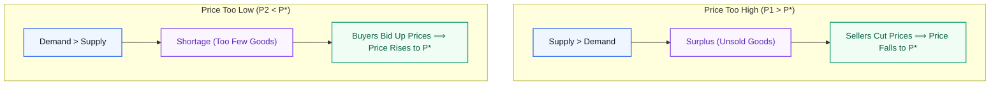

# Finance, Economics and Management for Engineers (HU-4101) — 7th Semester Distinct PYQ Solutions

> **Academic Context:** B.Tech / B.Arch 7th Semester Examination | IIEST Shibpur | Course: `HU-4101`  
> **Source Mode:** **Strict Notes-Bound Mode & Deduplicated Edition**  
> **Authorized Reference Note:** [[Finance_Economics_and_Management_Midterm_Study_Guide|`Finance_Economics_and_Management_Midterm_Study_Guide.md`]]  
> **Verification Status:** All calculations independently audited and verified via Python; strictly filtered to 7th Semester (`HU-4101`); redundant repeated questions/sub-questions from previous exam sessions omitted with cross-references; unreferenced/out-of-syllabus questions collected at the end unattempted.

---

## Table of Contents

- [1. Comprehensive Question Audit & Coverage Matrix (7th Semester)](#1-comprehensive-question-audit-coverage-matrix-7th-semester)
- [2. 2025 7th Semester Examination Solutions](#2-2025-7th-semester-examination-solutions)
  - [7th Semester Mid-Semester Examination (September 2025) · HU-4101](#7th-semester-mid-semester-examination-september-2025-hu-4101)
  - [7th Semester End-Semester Examination (November 2025) · HU-4101](#7th-semester-end-semester-examination-november-2025-hu-4101)
- [3. 2024 7th Semester Examination Solutions](#3-2024-7th-semester-examination-solutions)
  - [7th Semester Mid-Semester Examination (September 2024) · HU-4101](#7th-semester-mid-semester-examination-september-2024-hu-4101)
  - [7th Semester End-Semester Examination (November 2024) · HU-4101](#7th-semester-end-semester-examination-november-2024-hu-4101)
- [4. 2023 7th Semester Examination Solutions](#4-2023-7th-semester-examination-solutions)
  - [7th Semester Mid-Semester Examination (September 2023) · HU-4101](#7th-semester-mid-semester-examination-september-2023-hu-4101)
  - [7th Semester End-Semester Examination (November 2023) · HU-4101](#7th-semester-end-semester-examination-november-2023-hu-4101)
- [5. Master Quick-Recall Formula & Concept Sheet](#5-master-quick-recall-formula-concept-sheet)
- [6. Exam Hall Fatal Traps & Pitfalls Catalog](#6-exam-hall-fatal-traps-pitfalls-catalog)
- [7. Unanswered / Uncovered Questions (7th Semester Out-of-Syllabus Archive)](#7-unanswered-uncovered-questions-7th-semester-out-of-syllabus-archive)

---

## 1. Comprehensive Question Audit & Coverage Matrix (7th Semester)

| Paper / Session | Q# | Topic / Concept | Marks | Status | Study Guide Direct Link / Deduplication Ref |
|:---|:---|:---|:---:|:---:|:---|
| **2025 7th Mid** | Mod I Q1 | Master Cost Statement Prescribed Format | 4M | **Answered (Distinct)** | [[Finance_Economics_and_Management_Midterm_Study_Guide#5.2 The Master Cost Sheet Architecture & Stock Adjustment Stages|Section 5.2: Cost Sheet Architecture]] |
| **2025 7th Mid** | Mod I Q2 | Short Notes: Fixed Assets, Internal Liab., Process Costing, Elements, Measurement | 6M | **Answered (Distinct)** | [[Finance_Economics_and_Management_Midterm_Study_Guide#4.1 The AAA Framework & Stakeholder Information Asymmetry|Section 4.1, 4.2 & 5.1]] |
| **2025 7th Mid** | Mod II Q1 | Circular Flow Constant Money Flow & NI = NE | 3M | **Answered (Distinct)** | [[Finance_Economics_and_Management_Midterm_Study_Guide#2.1 The Circular Flow of Income & National Income Accounting Identity|Section 2.1: Circular Flow Identity]] |
| **2025 7th Mid** | Mod II Q2 | Keynesian Cross Stability & Expansionary Fiscal Policy | 3M | **Answered (Distinct)** | [[Finance_Economics_and_Management_Midterm_Study_Guide#2.3 The Keynesian Cross Model, Inventory Adjustment & Multiplier Derivations|Section 2.3: Keynesian Cross Model]] |
| **2025 7th Mid** | Mod II Q3 | Functions of Money; Inflation Definition & Causes | 4M | **Answered (Distinct)** | [[Finance_Economics_and_Management_Midterm_Study_Guide#2.4 Money, Banking Architecture, and Macroeconomic Stabilization Policies|Section 2.4: Money Functions & Policies]] |
| **2025 7th Mid** | Mod II Q4 | Law of Demand & Market Equilibrium Price | 4M | **Answered (Distinct)** | [[Finance_Economics_and_Management_Midterm_Study_Guide#1.2 Price Determination: Demand, Supply, and Elasticity Dynamics|Section 1.2 & 1.3: Demand & Equilibrium]] |
| **2025 7th Mid** | Mod III Case | Infosys Leadership Evolution (Autocratic vs Democratic) | 10M | **Answered (Distinct)** | [[Finance_Economics_and_Management_Midterm_Study_Guide#3.2 Leadership Styles & Organizational Case Studies|Section 3.2: Leadership Styles]] |
| **2025 7th End** | Mod I Q1 | Equipment A vs B NPV Analysis (11% Discount Rate) | 12M | **Answered (Distinct)** | [[Finance_Economics_and_Management_Midterm_Study_Guide#6.2 Time Value of Money (TVM) & Discounted Capital Budgeting Methods|Section 6.2: Discounted Capital Budgeting]] |
| **2025 7th End** | Mod I Q1 (OR) | ABC Ltd Capital Structure EBIT-EPS Analysis | 12M | *Uncovered* | End-Sem Topic (Not in Midterm Guide) |
| **2025 7th End** | Mod I Q2 | Notes: Cost, Cost of Capital, PBP, Debt Capital | 4M | **Answered (Distinct)** | [[Finance_Economics_and_Management_Midterm_Study_Guide#6.1 Asset-Liability Matching, Capital Structures & Cost of Capital ($K$)|Section 5.1, 6.1 & 6.2]] |
| **2025 7th End** | Mod II Q1(a) | Numerical Calculation of GDP and GNP at Market Prices | 4M | **Answered (Distinct)** | [[Finance_Economics_and_Management_Midterm_Study_Guide#2.2 GDP Mechanics: Mathematical Valuation, Nominal vs Real, and National Aggregates|Section 2.2: GDP Mechanics & NFIA]] |
| **2025 7th End** | Mod II Q1(b) | Real GDP, Advantages over Nominal, Welfare Flaws | 3M | **Answered (Distinct)** | [[Finance_Economics_and_Management_Midterm_Study_Guide#Nominal GDP vs. Real GDP|Section 2.2: Nominal vs Real GDP]] |
| **2025 7th End** | Mod II Q2 | Marginal Utility Maximization & Lagrangian $U = x^{1/2}y^{1/2}$ | 3M | *Uncovered* | End-Sem Topic (Not in Midterm Guide) |
| **2025 7th End** | Mod II Q3 | Short-Run vs Long-Run Production, TP Inflexion Point | 3M | *Uncovered* | End-Sem Topic (Not in Midterm Guide) |
| **2025 7th End** | Mod II Q4 | Phillips Curve Short-Run Inflation-Unemployment | 3M | *Uncovered* | End-Sem Topic (Not in Midterm Guide) |
| **2025 7th End** | Mod III Case 1 | Nokia Corporate Reinvention (Turnaround/Renewal) | 10M | *Uncovered* | End-Sem Topic (Not in Midterm Guide) |
| **2025 7th End** | Mod III Case 2 | Reliance Industries Ansoff Matrix Diversification | 10M | *Uncovered* | End-Sem Topic (Not in Midterm Guide) |
| **2025 7th End** | Mod III Part B | Strategic Choices: Stability, Retrenchment, Integration | 6M | *Uncovered* | End-Sem Topic (Not in Midterm Guide) |
| **2024 7th Mid** | Mod I Q1 | Four Major Long-Term Sources of Corporate Finance | 4M | **Answered (Distinct)** | [[Finance_Economics_and_Management_Midterm_Study_Guide#6.1 Asset-Liability Matching, Capital Structures & Cost of Capital ($K$)|Section 6.1: Long-Term Financing]] |
| **2024 7th Mid** | Mod I Q2a | Cost Definition & Functional Classification | 6M | **Answered (Distinct)** | [[Finance_Economics_and_Management_Midterm_Study_Guide#5.1 Cost Concepts, Scarcity Optimization & Multi-Dimensional Classifications|Section 5.1: Functional Cost Classification]] |
| **2024 7th Mid** | Mod I Q2b (OR) | Numerical Calculation: Administrative Overheads Only | 6M | **Answered (Distinct)** | [[Finance_Economics_and_Management_Midterm_Study_Guide#Step 4: Cost of Production (COP)|Section 5.2 & 5.3: Admin Overheads]] |
| **2024 7th Mid** | Mod II Q1(a-d) | GDP Fundamentals, Prev-Year Exclusion, GNP>GDP, Welfare | 5M | **Answered (Distinct)** | [[Finance_Economics_and_Management_Midterm_Study_Guide#2.2 GDP Mechanics: Mathematical Valuation, Nominal vs Real, and National Aggregates|Section 2.2: GDP Mechanics]] |
| **2024 7th Mid** | Mod II Q2(a) | Monetary Policy Reserve Cut & Money Multiplier | 3M | **Answered (Distinct)** | [[Finance_Economics_and_Management_Midterm_Study_Guide#2.4 Money, Banking Architecture, and Macroeconomic Stabilization Policies|Section 2.4: Money Functions & Banking]] |
| **2024 7th Mid** | Mod II Q2(b) | Functions of Money (Medium, Unit, Store) | 2M | *Omitted (Repeated)* | See [[#Question 3: Functions of Money & Inflation [2 + 2 = 4 Marks]|2025 7th Mid Mod II Q3]] |
| **2024 7th Mid** | Mod III Q2 (OR) | Google Project Aristotle Psychological Safety; Science vs Art | 10M | **Answered (Distinct)** | [[Finance_Economics_and_Management_Midterm_Study_Guide#3.2 Leadership Styles & Organizational Case Studies|Section 3.1 & 3.2: Project Aristotle]] |
| **2024 7th End** | Mod I Q1 | Classification of 10 Overhead Items (Functional) | 7M | **Answered (Distinct)** | [[Finance_Economics_and_Management_Midterm_Study_Guide#5.1 Cost Concepts, Scarcity Optimization & Multi-Dimensional Classifications|Section 5.1: Functional Classification]] |
| **2024 7th End** | Mod I Q2 | Operating, Financial, and Combined Leverage | 10M | *Uncovered* | End-Sem Topic (Not in Midterm Guide) |
| **2024 7th End** | Mod I Q2 (OR) | Machine A vs Machine B NPV Evaluation (10% Rate) | 10M | **Answered (Distinct)** | [[Finance_Economics_and_Management_Midterm_Study_Guide#Net Present Value (NPV) Decision Rule|Section 6.2: NPV Decision Rule]] |
| **2024 7th End** | Mod II Q1 | Law of Demand Statement | 1M | *Omitted (Repeated)* | See [[#Question 4 (OR): Law of Demand & Market Price Determination [1 + 3 = 4 Marks]|2025 7th Mid Mod II Q4]] |
| **2024 7th End** | Mod II Q2 | Consumer Rationality, Indifference Curves Convexity | 3M | *Uncovered* | End-Sem Topic (Not in Midterm Guide) |
| **2024 7th End** | Mod II Q3 | Inflation: Demand-Pull vs Cost-Push Differences | 3M | *Uncovered* | End-Sem Topic (Not in Midterm Guide) |
| **2024 7th End** | Mod II Q4 | Purpose of Fixing Base Year for GDP | 2M | **Answered (Distinct)** | [[Finance_Economics_and_Management_Midterm_Study_Guide#Nominal GDP vs. Real GDP|Section 2.2: Nominal vs Real GDP]] |
| **2024 7th End** | Mod II Q5 | Lagrangian Multiplier Utility Maximization | 6M | *Uncovered* | End-Sem Topic (Not in Midterm Guide) |
| **2024 7th End** | Mod II Q6 (OR) | Autonomous Govt Spending Impact vs Tax Hike in Keynesian Cross | 6M | **Answered (Distinct)** | [[Finance_Economics_and_Management_Midterm_Study_Guide#Formal Mathematical Derivations of Multipliers|Section 2.3: Multiplier Derivations]] |
| **2024 7th End** | Mod III Case 1 | Eco Gear Marketing Mix (4Ps) & Channels | 8M | *Uncovered* | End-Sem Topic (Not in Midterm Guide) |
| **2024 7th End** | Mod III Case 3 | Manufacturing Plant Leadership Styles (Autocratic vs Democratic) | 8M | **Answered (Distinct)** | [[Finance_Economics_and_Management_Midterm_Study_Guide#Decision Matrix: Leadership & Management Styles|Section 3.2: Leadership Styles Decision Matrix]] |
| **2024 7th End** | Mod III Case 4 | Sun Pharma Transnational Strategy | 8M | *Uncovered* | End-Sem Topic (Not in Midterm Guide) |
| **2023 7th Mid** | Mod I Q1 | Define Cost, Costing, Methods of Costing & Need | 10M | **Answered (Distinct)** | [[Finance_Economics_and_Management_Midterm_Study_Guide#Cost Units & Costing Methods|Section 5.1: Cost Concepts & Methods]] |
| **2023 7th Mid** | Mod I Q2 (OR) | Traceability Classification & Selling/Dist Overheads Calculation | 10M | **Answered (Distinct)** | [[Finance_Economics_and_Management_Midterm_Study_Guide#Step 6: Cost of Sales & Selling Price|Section 5.1 & 5.2: Traceability & S&D Calculation]] |
| **2023 7th Mid** | Mod II Part A Q1 | GDP/GNP Differences, Used Mobile Phone Resale | 3M | **Answered (Distinct)** | [[Finance_Economics_and_Management_Midterm_Study_Guide#Formal Definition of GDP|Section 2.2: GDP Mechanics & Boundary]] |
| **2023 7th Mid** | Mod II Part A Q2 | Circular Flow MCQ (Households & Constant Flow) | 2M | **Answered (Distinct)** | [[Finance_Economics_and_Management_Midterm_Study_Guide#The Simplified Two-Sector Circular Flow Model|Section 2.1: Simplified Circular Flow Model]] |
| **2023 7th Mid** | Mod II Part A Q3 | GDP Deflator Calculation (Apples & Oranges) | 2M | **Answered (Distinct)** | [[Finance_Economics_and_Management_Midterm_Study_Guide#Audited Numerical Masterclass: Country X (Base Year 2020 vs. 2025)|Section 2.2: Audited Masterclass Country X]] |
| **2023 7th Mid** | Mod II Part A Q4 | Calculate GDP, GNP, and GNP at Factor Cost | 3M | **Answered (Distinct)** | [[Finance_Economics_and_Management_Midterm_Study_Guide#The National Income Aggregates Hierarchy|Section 2.2: National Income Aggregates Hierarchy]] |
| **2023 7th Mid** | Mod II Part B Q5 | Functions of Money (Cash, Bitcoin, Property) | 4M | **Answered (Distinct Application)** | [[Finance_Economics_and_Management_Midterm_Study_Guide#The 3 Core Functions of Money|Section 2.4: The 3 Core Functions of Money]] |
| **2023 7th Mid** | Mod II Part B Q6 | Commercial vs Central Bank & Money Creation | 6M | **Answered (Distinct)** | [[Finance_Economics_and_Management_Midterm_Study_Guide#Central Banks vs. Commercial Banks|Section 2.4: Central vs Commercial Banks]] |
| **2023 7th Mid** | Mod III Q1 | Blake & Mouton Managerial Grid Diagram & Styles | 5M | *Uncovered* | End-Sem / Out of Syllabus Topic |
| **2023 7th Mid** | Mod III Q2 | Hawthorne Studies (Elton Mayo) | 5M | *Uncovered* | End-Sem / Out of Syllabus Topic |
| **2023 7th Mid** | Mod III Q3 | Different Types of Managerial Functions | 5M | **Answered (Distinct)** | [[Finance_Economics_and_Management_Midterm_Study_Guide#Henri Fayol's 5 Classical Functions of Management|Section 3.1: Henri Fayol's 5 Classical Functions]] |
| **2023 7th Mid** | Mod III Q4 | Transactional vs Transformational Leadership | 5M | *Uncovered* | End-Sem / Out of Syllabus Topic |
| **2023 7th End** | Mod I Q1 | Element-Wise OR Behaviour-Wise Cost Classification | 6M | **Answered (Distinct)** | [[Finance_Economics_and_Management_Midterm_Study_Guide#Multi-Dimensional Classifications of Cost|Section 5.1: Multi-Dimensional Classifications]] |
| **2023 7th End** | Mod I Q2 | Long-Term Sources of Finance | 4M | *Omitted (Repeated)* | See [[#Question 1: Four Major Long-Term Sources of Corporate Finance [4 Marks]|2024 7th Mid Mod I Q1]] |
| **2023 7th End** | Mod I Q3 | Project A vs Project B NPV Evaluation (Given Factors) | 6M | **Answered (Distinct)** | [[Finance_Economics_and_Management_Midterm_Study_Guide#Audited Numerical Masterclass: Project A vs. Project B|Section 6.2: Discounted Capital Budgeting]] |
| **2023 7th End** | Mod I Q4 | Strategic Management Phases & Porters Five Forces | 8M | *Uncovered* | End-Sem Topic (Not in Midterm Guide) |
| **2023 7th End** | Mod I Q5 | Ansoff Matrix Diagram & Cost Leadership | 8M | *Uncovered* | End-Sem Topic (Not in Midterm Guide) |
| **2023 7th End** | Mod I Q6 | Linear Models of Communication (Shannon-Weaver, Lasswell) | 8M | *Uncovered* | End-Sem Topic (Not in Midterm Guide) |
| **2023 7th End** | Mod II Q7 | Simple Keynesian Model Graph & Multiplier Dynamics | 6M | **Answered (Distinct)** | [[Finance_Economics_and_Management_Midterm_Study_Guide#2.3 The Keynesian Cross Model, Inventory Adjustment & Multiplier Derivations|Section 2.3: Keynesian Cross Equilibrium]] |
| **2023 7th End** | Mod II Q8 | Law of Demand & Demand Curve Shift with Rising Income | 5M | **Answered (Distinct Shift)** | [[Finance_Economics_and_Management_Midterm_Study_Guide#Shifts vs. Movements Along the Demand Curve|Section 1.2 & 1.3: Demand Shift & Shocks]] |
| **2023 7th End** | Mod II Q9 | Diminishing Marginal Utility & Demand Curve Derivation | 5M | *Uncovered* | End-Sem Topic (Not in Midterm Guide) |
| **2023 7th End** | Mod II Q10 (OR) | Step-by-Step Calculation of GNP from Data Table | 2M | **Answered (Distinct Calc)** | [[Finance_Economics_and_Management_Midterm_Study_Guide#The National Income Aggregates Hierarchy|Section 2.2: National Income Aggregates Hierarchy]] |

---

## 2. 2025 7th Semester Examination Solutions

### 7th Semester Mid-Semester Examination (September 2025) · HU-4101

#### Module I · Finance

##### Question 1: Master Cost Statement Format [4 Marks]
🔗 **Study Guide:** [[Finance_Economics_and_Management_Midterm_Study_Guide#5.2 The Master Cost Sheet Architecture & Stock Adjustment Stages|Section 5.2: The Master Cost Sheet Architecture & Stock Adjustment Stages]]

> **Question Statement:**  
> *Prepare a Cost Statement in prescribed Format showing each stage with imaginary items. [4]*

**Direct Solution & Prescribed Format:**

| Stage / Particulars | Detailed Components (Imaginary Items) | Inner Amount (₹) | Outer Amount (₹) |
|:---|:---|---:|---:|
| **Stage 1: Raw Materials Consumed** | Opening Stock of Raw Materials | $50,000$ | |
| | *Add:* Purchase of Raw Materials | $1,20,000$ | |
| | *Add:* Carriage Inwards (Freight to bring materials in) | $4,000$ | |
| | *Less:* Purchase Returns (Defective items sent back) | $(2,000)$ | |
| | *Less:* Closing Stock of Raw Materials | $(32,000)$ | $\mathbf{1,40,000}$ |
| | *Add:* Direct Wages (Paid to factory workers making the product) | | $60,000$ |
| | *Add:* Direct Expenses (Special tools hired for the job) | | $10,000$ |
| **Stage 2: PRIME COST** | *(Total Direct Costs: Material + Labour + Expenses)* | | $\mathbf{2,10,000}$ |
| | *Add: Factory / Works Overheads (Indirect factory costs):* | | |
| | - Factory Rent and Rates | $25,000$ | |
| | - Power and Fuel for Machines | $15,000$ | |
| | - Factory Supervisor Salaries | $12,000$ | |
| | - Depreciation on Factory Machinery | $18,000$ | $70,000$ |
| **Gross Factory Cost** | *(Prime Cost + Factory Overheads)* | | $\mathbf{2,80,000}$ |
| | *Add:* Opening Stock of Work-in-Progress (WIP) | $15,000$ | |
| | *Less:* Closing Stock of Work-in-Progress (WIP) | $(10,000)$ | $+5,000$ |
| **Stage 3: WORKS COST (Adjusted Factory Cost)** | *(Gross Factory Cost $\pm$ WIP Adjustment)* | | $\mathbf{2,85,000}$ |
| | *Add: Office & Administrative Overheads (Head office costs):* | | |
| | - Office Salaries & Legal Audit Fees | $20,000$ | |
| | - Office Rent, Lighting & Stationery | $10,000$ | $30,000$ |
| **Stage 4: COST OF PRODUCTION (COP)** | *(Works Cost + Office & Admin Overheads)* | | $\mathbf{3,15,000}$ |
| | *Add:* Opening Stock of Finished Goods | $25,000$ | |
| | *Less:* Closing Stock of Finished Goods | $(15,000)$ | $+10,000$ |
| **Stage 5: COST OF GOODS SOLD (COGS)** | *(Cost of Production $\pm$ Finished Goods Adjustment)* | | $\mathbf{3,25,000}$ |
| | *Add: Selling & Distribution Overheads (Sales costs):* | | |
| | - Advertising & Product Promotion | $15,000$ | |
| | - Salesmen Salaries & Showroom Rent | $12,000$ | |
| | - Carriage Outwards (Freight to deliver goods to customers) | $8,000$ | $35,000$ |
| **Stage 6: TOTAL COST (Cost of Sales)** | *(COGS + Selling & Distribution Overheads)* | | $\mathbf{3,60,000}$ |
| | *Add:* **Profit Margin (Balancing Figure)** | | $\mathbf{40,000}$ |
| **STAGE 7: TOTAL SALES REVENUE** | *(Total Cost + Profit)* | | $\mathbf{4,00,000}$ |

> [!danger] ⚠️ **Exam Hall Trap Alert:**
> Never include **interest on loans/debentures, dividend payments, income tax, or balance sheet items (debtors and creditors)** in a Cost Sheet. These are financial expenses and balance sheet items, not costs of making products.

---

##### Question 2: Short Notes on Cost & Accounting Concepts [2 × 3 = 6 Marks]
🔗 **Study Guide:** [[Finance_Economics_and_Management_Midterm_Study_Guide#4.1 The AAA Framework & Stakeholder Information Asymmetry|Section 4.1: The AAA Framework]], [[Finance_Economics_and_Management_Midterm_Study_Guide#4.2 Financial Position: Assets, Liabilities & Balance Sheet Classification|Section 4.2: Assets & Liabilities]], and [[Finance_Economics_and_Management_Midterm_Study_Guide#5.1 Cost Concepts, Scarcity Optimization & Multi-Dimensional Classifications|Section 5.1: Cost Concepts]]

> **Question Statement:**  
> *Write notes (any two): (i) Fixed assets, (ii) Internal Liabilities, (iii) Process Costing, (iv) Elementwise classification of Cost, (v) Measurement in Accounting. [2 × 3 = 6]*

*(All 5 concepts provided below; write any two in the exam)*

**1. (i) Fixed Assets:**
- **Definition:** Long-term assets bought for running the business and producing goods, with a useful life of more than 1 year. They are not intended for immediate resale.
- **Value Reduction:** 
  - Physical assets (like machinery) lose value over time due to wear and tear (**Depreciation**).
  - Non-physical assets (like software licenses and patents) are written off over time (**Amortization**).
- **Financing Rule:** Because they last many years, they should be bought using long-term money (equity shares or long-term loans), never short-term loans.
- **Examples:** Factory land, buildings, CNC machines, and transport trucks.

**2. (ii) Internal Liabilities:**
- **Definition:** The money that a business legally owes back to its own owners and shareholders.
- **Main Items:** Equity share capital, preference share capital, reserves, and retained profits.
- **Key Difference from External Debt:** 
  - Internal liabilities do not have to be repaid during the normal life of the company (they are returned only if the company closes down).
  - The company is not legally forced to pay a fixed interest; dividends are paid only if the company earns a profit.

**3. (iii) Process Costing:**
- **Definition:** A costing method used when identical, standardized products are made through a continuous, non-stop series of stages (called processes).
- **How it Works:** The finished product of Process 1 immediately becomes the raw material for Process 2, until the final product is completed.
- **Unit Cost Formula:**
  $$\text{Cost per Unit} = \frac{\text{Total Process Cost in Period}}{\text{Total Units Produced in Period}}$$
- **Common Industries:** Oil refineries, chemical factories, sugar mills, and paper plants.

**4. (iv) Elementwise Classification of Cost:**
Costs are divided into three basic elements:
1. **Materials:** Cost of physical substances used to make the product.
   - *Direct Material:* Main material in the final product (e.g., steel for a car, wood for a desk).
   - *Indirect Material:* Small helping items (e.g., machine oil, cleaning rags).
2. **Labour:** Wages paid to workers.
   - *Direct Labour:* Workers directly making the good (e.g., lathe operator, carpenter).
   - *Indirect Labour:* Supporting staff (e.g., factory security guard, cleaner).
3. **Expenses:** All other business costs besides materials and labour.
   - *Direct Expenses:* Special costs for one specific job (e.g., hiring a special tool for one project).
   - *Indirect Expenses:* General factory bills (e.g., factory rent, electric power bill).

**5. (v) Measurement in Accounting:**
- **Definition:** The process of putting a clear monetary value (in Rupees or Dollars) on business transactions so they can be recorded.
- **Money Measurement Rule:** Accounting records only those events that can be measured reliably in money.
- **Important Limitation:** Many valuable things cannot be measured in money—such as an engineer's talent, worker honesty, or high team morale—so they cannot appear on a formal balance sheet.

---

#### Module II · Economics

##### Question 1: Circular Flow of Income & National Accounting Identity [1 + 2 = 3 Marks]
🔗 **Study Guide:** [[Finance_Economics_and_Management_Midterm_Study_Guide#2.1 The Circular Flow of Income & National Income Accounting Identity|Section 2.1: The Circular Flow of Income & National Income Accounting Identity]]

> **Question Statement:**  
> *Why is the magnitude of money flow constant in a circular flow of income model? Why do you think national income and national expenditure are identical in that model? [1 + 2 = 3]*

**Direct Solution:**
1. **Why Money Flow is Constant [1M]:**  
   In a simple two-sector economy with only **households** and **firms**:
   - **No Leakages or Injections:** People do not save money ($S = 0$), pay taxes ($T = 0$), or buy imported goods ($M = 0$).
   - **Complete Spending Loop:** Households spend all the wages they earn to buy goods from firms. Firms pay out all the sales money they receive back to households as wages, rent, and profit.
   - Because no money leaves the loop and no new money is added, the total amount of money circulating stays constant.

2. **Why National Income and National Expenditure are Identical [2M]:**  
   Every rupee spent by a buyer becomes a rupee of income for the seller:
   - **Step 1:** Firms produce goods and sell them to households. The total sales value is **Total Expenditure**.
   - **Step 2:** Firms use all that sales revenue to pay households for their work and land (wages, rent, interest, profit). This is **Total Income**.
   - **Step 3:** Households use all this income to buy goods from firms in the next round.
   
   Therefore, National Income, National Production, and National Expenditure are always equal:
   $$\mathbf{\text{National Income (NI)} \equiv \text{National Production (NP)} \equiv \text{National Expenditure (NE)}}$$

---

##### Question 2: Keynesian Cross Stability & Expansionary Fiscal Policy [1 + 2 = 3 Marks]
🔗 **Study Guide:** [[Finance_Economics_and_Management_Midterm_Study_Guide#2.3 The Keynesian Cross Model, Inventory Adjustment & Multiplier Derivations|Section 2.3: The Keynesian Cross Model & Inventory Adjustment]] and [[Finance_Economics_and_Management_Midterm_Study_Guide#Fiscal vs. Monetary Policy Comparison|Section 2.4: Fiscal vs. Monetary Policy Comparison]]

> **Question Statement:**  
> *Why do you think the Keynesian cross is a stable equilibrium, if at all? What is an expansionary fiscal policy? [1 + 2 = 3]*

**Direct Solution:**
1. **Why the Keynesian Cross is a Stable Equilibrium [1.5M]:**  
   The economy naturally pulls itself back to balance through **automatic inventory adjustments**:
   - **When Output is Below Balance ($Y_1 < Y^{\ast}$):** Buyers want to buy more than what is being made ($PE > AE$). Goods in stores run out faster than planned (inventory drops). To restock shelves, firms hire more workers and raise production, pushing income $Y$ up to $Y^{\ast}$.
   - **When Output is Above Balance ($Y_2 > Y^{\ast}$):** Factories produce more than people buy ($AE > PE$). Unsold goods pile up in warehouses. Firms cut back on production and shifts, bringing output $Y$ back down to $Y^{\ast}$.

2. **What is Expansionary Fiscal Policy? [1.5M]:**  
   A policy used by the government during recessions to create jobs and boost demand:
   - **Increasing Government Spending ($\Delta G > 0$):** Spending money on roads, bridges, and public projects creates direct jobs and orders for goods.
   - **Cutting Taxes ($\Delta T < 0$):** Lower taxes leave people with more take-home pay, encouraging them to spend more on goods and services.
   
   Through the multiplier effect, national income grows by more than the initial government spending:
   $$\Delta Y = \frac{\Delta G}{1 - b}$$

---

##### Question 3: Functions of Money & Inflation [2 + 2 = 4 Marks]
🔗 **Study Guide:** [[Finance_Economics_and_Management_Midterm_Study_Guide#The 3 Core Functions of Money|Section 2.4: The 3 Core Functions of Money]] and [[Finance_Economics_and_Management_Midterm_Study_Guide#Exogenous Market Shocks|Section 1.3: Exogenous Market Shocks]]

> **Question Statement:**  
> *State the functions of money. Define inflation and state its causes. [2 + 2 = 4]*

**Direct Solution:**
1. **The Three Core Functions of Money [2M]:**
   - **Medium of Exchange:** Money is accepted by everyone for buying and selling. It solves the barter problem where two people had to want exactly what the other had ("double coincidence of wants").
   - **Unit of Account:** Money gives a single measuring tape to price goods and keep business records (for example, quoting a book at ₹300 rather than 5 kg of wheat).
   - **Store of Value:** People can save money today and spend it in the future without it spoiling (unlike physical goods like milk or vegetables), though inflation can reduce its buying power.

2. **Definition & Causes of Inflation [2M]:**
   - **Definition:** A continuous, general rise in the price level of goods and services over time, which reduces what your money can buy.
   - **Two Main Causes:**
     1. **Demand-Pull Inflation:** Buyers want more goods than the economy can produce ("too much money chasing too few goods").
     2. **Cost-Push Inflation:** The cost of making goods rises (due to jumps in oil prices, raw material costs, or worker wages), forcing firms to raise prices.

---

##### Question 4 (OR): Law of Demand & Market Price Determination [1 + 3 = 4 Marks]
🔗 **Study Guide:** [[Finance_Economics_and_Management_Midterm_Study_Guide#The Law of Demand|Section 1.2: The Law of Demand]] and [[Finance_Economics_and_Management_Midterm_Study_Guide#Market Clearing Mechanics|Section 1.3: Market Clearing Mechanics]]

> **Question Statement:**  
> *What is the law of demand? Show how equilibrium price is determined in a market using demand and supply curves. [1 + 3 = 4]*

**Direct Solution:**
1. **The Law of Demand [1M]:**  
   When the price of a good rises, people buy less of it; when the price falls, people buy more—provided other factors like income and preferences stay unchanged (*ceteris paribus*):
   $$P_x \uparrow \;\implies\; q_x^d \downarrow \quad \text{and} \quad P_x \downarrow \;\implies\; q_x^d \uparrow$$

2. **Equilibrium Price Determination [3M]:**  
   The market price settles at the point where the **Demand Curve** crosses the **Supply Curve** (where quantity demanded equals quantity supplied: $q_x^d = q_x^s$):

- **Surplus at $P_1 > P^{\ast}$:** Sellers bring more goods to market than buyers want ($q^s > q^d$). Unsold stock forces competing sellers to lower their prices until the market price falls back to $P^{\ast}$.
- **Shortage at $P_2 < P^{\ast}$:** Buyers want more goods than sellers have provided ($q^d > q^s$). Buyers compete and bid prices up until the price rises back to $P^{\ast}$.

---

#### Module III · Management

##### Case Study: Infosys Leadership Evolution [10 Marks]
🔗 **Study Guide:** [[Finance_Economics_and_Management_Midterm_Study_Guide#Decision Matrix: Leadership & Management Styles|Section 3.2: Decision Matrix: Leadership & Management Styles]] and [[Finance_Economics_and_Management_Midterm_Study_Guide#Vertical Management Hierarchy|Section 3.1: Vertical Management Hierarchy]]

> **Case Scenario:**  
> *In its early years, Infosys operated with a relatively autocratic management style. Decisions were centralized among the founders, which helped the company maintain strict control, speed in execution, and consistent quality during its growth phase. However, as the company expanded globally, this rigid style began to show limitations—employee morale and innovation suffered because decision-making was too top-heavy. In response, Infosys gradually adopted a democratic and participative style of management. Leaders began to involve employees more in project-level decisions, encouraged feedback sessions, and introduced open-door policies. At the same time, leaders like Narayana Murthy displayed transformational leadership—emphasizing values, ethics, and a vision of creating a globally respected Indian IT company.*  
>  
> *Attempt any two questions:*  
> *1. Why was an autocratic management style useful in the early stages of Infosys, and why did it become a limitation later?*  
> *2. As a manager, how would you balance democratic participation with the need for quick decision-making in a fast-paced IT environment?*  
> *3. Do you think transformational leadership is more sustainable than autocratic leadership in knowledge-based industries like IT? Why or why not?*

*(All three sub-questions answered below)*

**1. Sub-question 1: Early Utility vs. Later Limitations of Autocratic Management [5M]:**
- **Why it worked in the Early Stage:**  
  When Infosys was a small startup, money was tight and survival was critical. Having the founders make all decisions ensured quick action without long debates, kept costs very low, and maintained strict software quality to win the trust of global clients.
- **Why it failed as Infosys Grew:**  
  When Infosys grew into a global company with thousands of skilled engineers, top-down control caused major problems:
  1. *Decision Bottlenecks:* A few top executives could not make daily decisions for hundreds of client projects around the world.
  2. *Low Morale & Resignations:* Talented software engineers felt micromanaged and ignored when they had no say, leading to frustration, less creativity, and high employee turnover.

**2. Sub-question 2: Balancing Democratic Participation with Quick Decisions [5M]:**
As an engineering manager, use a three-level framework based on the situation:
1. **Technical Architecture & Code Design (Democratic):** Involve developers and architects in system design discussions and code reviews. This catches bugs early and builds team ownership.
2. **Sprint Deadlines & Project Milestones (Time-Boxed Consultation):** Give the team a set time window (e.g., 24 hours) to share opinions. If the team cannot agree, the Project Manager makes the final decision so the project stays on schedule.
3. **Emergencies & Security Breaches (Directive/Quick):** During live server crashes or security leaks, take direct command immediately. Fix the issue first, and hold team reviews after systems are safe.

**3. Sub-question 3: Transformational vs. Autocratic Leadership in Knowledge Industries [5M]:**
**Transformational leadership is far more sustainable in the IT industry.**
- **Creative Work Cannot Be Forced:** Writing high-quality software requires creativity and problem-solving. Engineers cannot be forced into great ideas through fear or strict commands.
- **Inspiring Vision:** Leaders like Narayana Murthy gave engineers a bigger purpose—building a globally respected Indian tech company and sharing company wealth through employee stock options (ESOPs).
- **Psychological Safety:** When team members feel safe to share bold ideas and admit mistakes without fear of blame, teams solve harder problems and stay with the company longer.

---

### 7th Semester End-Semester Examination (November 2025) · HU-4101

#### 1st Half · Module I: Finance

##### Question 1: Equipment A vs. Equipment B NPV Evaluation [12 Marks]
🔗 **Study Guide:** [[Finance_Economics_and_Management_Midterm_Study_Guide#Net Present Value (NPV) Decision Rule|Section 6.2: Net Present Value (NPV) Decision Rule]] and [[Finance_Economics_and_Management_Midterm_Study_Guide#Audited Numerical Masterclass: Project A vs. Project B|Audited Masterclass: Project A vs. Project B]]

> **Question Statement:**  
> *Equipment A costs ₹75,000 and Equipment B costs ₹50,000. Their net cash inflows over the estimated five-year life are given below. The required return for both is 11%. Calculate NPV for both projects and comment on acceptability. [12]*  
>  
> | Year | Equipment A net cash inflow | Equipment B net cash inflow |  
> | :---: | :---: | :---: |  
> | 1 | ₹20,000 | ₹14,000 |  
> | 2 | ₹18,000 | ₹18,000 |  
> | 3 | ₹22,000 | ₹12,000 |  
> | 4 | ₹25,000 | ₹13,000 |  
> | 5 | ₹23,000 | ₹11,000 |

**1. Mathematical Formula:**
$$\text{PV Factor} = \frac{1}{(1 + r)^t} = (1.11)^{-t}$$
$$\text{NPV} = \sum_{t=1}^5 \frac{\text{Cash Inflow}_t}{(1.11)^t} - \text{Initial Cost } (I_0)$$

**2. Step-by-Step Calculation Table:**

| Year ($t$) | PV Factor ($11\%$) | Equipment A Inflow (₹) | Equipment A PV (₹) | Equipment B Inflow (₹) | Equipment B PV (₹) |
|:---:|:---:|---:|---:|---:|---:|
| 1 | $0.9009$ | $20,000$ | $18,018.02$ | $14,000$ | $12,612.61$ |
| 2 | $0.8116$ | $18,000$ | $14,609.20$ | $18,000$ | $14,609.20$ |
| 3 | $0.7312$ | $22,000$ | $16,086.21$ | $12,000$ | $8,774.30$ |
| 4 | $0.6587$ | $25,000$ | $16,468.27$ | $13,000$ | $8,563.50$ |
| 5 | $0.5935$ | $23,000$ | $13,649.38$ | $11,000$ | $6,527.96$ |
| **Total PV of Inflows** | | | $\mathbf{78,831.09}$ | | $\mathbf{51,087.58}$ |
| *Less:* Initial Cost ($I_0$) | | | $(75,000.00)$ | | $(50,000.00)$ |
| **NET PRESENT VALUE (NPV)** | | | **+ \text{Rs. } 3,831.09** | | **+ \text{Rs. } 1,087.58** |

**3. Managerial Decision on Acceptability:**
- **If Projects are Independent:** Both Equipment A ($\text{NPV} = + \text{Rs. } 3,831.09 > 0$) and Equipment B ($\text{NPV} = + \text{Rs. } 1,087.58 > 0$) earn more than the $11\%$ required rate of return. Both projects are financially acceptable on their own.
- **If Mutually Exclusive (Can choose only one):** Choose **Equipment A** because it delivers a higher Net Present Value (**₹3,831.09 > ₹1,087.58**), creating more net wealth for the company.

---

##### Question 2: Short Notes on Financial Concepts [4 Marks]
🔗 **Study Guide:** [[Finance_Economics_and_Management_Midterm_Study_Guide#5.1 Cost Concepts, Scarcity Optimization & Multi-Dimensional Classifications|Section 5.1: Cost Concepts]], [[Finance_Economics_and_Management_Midterm_Study_Guide#6.1 Asset-Liability Matching, Capital Structures & Cost of Capital ($K$)|Section 6.1: Cost of Capital & Debt]], and [[Finance_Economics_and_Management_Midterm_Study_Guide#Alternative Capital Budgeting Methodologies|Section 6.2: Alternative Methodologies]]

> **Question Statement:**  
> *Write notes (any one): (a) Cost, (b) Cost of Capital, (c) PBP, (d) Debt Capital. [4]*

*(Write any one in exam; all four explained below)*

- **(a) Cost:** The total money spent on resources (materials, worker wages, electricity, machine time) to make a product or deliver a service.
- **(b) Cost of Capital ($K$):** The minimum percentage return that a company must earn on its investments so that lenders and shareholders are satisfied with their risk.
- **(c) Payback Period (PBP):** The time (in years or months) required for a project's cash earnings to fully recover the initial money invested.
  > ⚠️ *Main Drawback:* It completely ignores the time value of money, and it ignores all profits earned after the payback year.
- **(d) Debt Capital:** Long-term borrowed funds (such as bank loans or debentures). The company must pay regular interest and repay the loan amount when it matures. *Big Advantage:* Interest paid on debt is tax-deductible, which saves the company money on taxes.

---

#### 2nd Half · Module II: Economics

##### Question 1(a): Numerical Calculation of GDP and GNP [2 + 2 = 4 Marks]
🔗 **Study Guide:** [[Finance_Economics_and_Management_Midterm_Study_Guide#The 4 Components of Aggregate Expenditure|Section 2.2: The 4 Components of Aggregate Expenditure]] and [[Finance_Economics_and_Management_Midterm_Study_Guide#The National Income Aggregates Hierarchy|The National Income Aggregates Hierarchy]]

> **Question Statement:**  
> *Calculate GDP and GNP at market prices from the following data: [2 + 2 = 4]*  
>  
> | Expenditure / income item | Amount (crore) |  
> | :--- | :---: |  
> | Consumption | 800 |  
> | Investment | 500 |  
> | Factor payments to abroad | 200 |  
> | Factor income from abroad | 50 |  
> | Government expenditure | 10 |  
> | Exports | 200 |  
> | Imports | 100 |

**Direct Solution:**
1. **Calculation of GDP at Market Prices ($\text{GDP}_{\text{MP}}$):**
   $$\text{GDP}_{\text{MP}} = C + I + G + (X - M)$$
   $$\text{GDP}_{\text{MP}} = 800 + 500 + 10 + (200 - 100) = 1,310 + 100 = \mathbf{1,410\text{ crore}}$$

2. **Calculation of Net Factor Income from Abroad (NFIA):**
   $$\text{NFIA} = \text{Factor income from abroad} - \text{Factor payments to abroad}$$
   $$\text{NFIA} = 50 - 200 = \mathbf{-150\text{ crore}}$$

3. **Calculation of GNP at Market Prices ($\text{GNP}_{\text{MP}}$):**
   $$\text{GNP}_{\text{MP}} = \text{GDP}_{\text{MP}} + \text{NFIA}$$
   $$\text{GNP}_{\text{MP}} = 1,410 + (-150) = \mathbf{1,260\text{ crore}}$$

---

##### Question 1(b): Real GDP vs. Nominal GDP & Welfare Flaw [3 Marks]
🔗 **Study Guide:** [[Finance_Economics_and_Management_Midterm_Study_Guide#Nominal GDP vs. Real GDP|Section 2.2: Nominal GDP vs. Real GDP]] and [[Finance_Economics_and_Management_Midterm_Study_Guide#2.2 GDP Mechanics: Mathematical Valuation, Nominal vs Real, and National Aggregates|Feminist Economics Critique]]

> **Question Statement:**  
> *What do you understand by real GDP? What advantages does it have over nominal GDP? Mention one flaw of using GDP as a measure of welfare. [3]*

**Direct Solution:**
- **Real GDP Definition:** The total value of all final goods and services produced in a country, calculated using **constant, fixed base-year prices** ($\text{GDP}_R = \sum P_{\text{base}} \cdot q_t$).
- **Advantages over Nominal GDP:** Nominal GDP can increase simply because market prices rose (inflation), even if factories made zero extra goods. Real GDP removes the effect of inflation and measures true growth in physical output.
- **One Major Flaw as a Welfare Measure:** GDP counts only paid market transactions. It completely ignores **unpaid housework and caregiving** (like cooking, cleaning, child care), ignores environmental destruction (pollution), and ignores whether wealth is shared fairly among citizens.

---

---

## 3. 2024 7th Semester Examination Solutions

### 7th Semester Mid-Semester Examination (September 2024) · HU-4101

#### Module I · Finance

##### Question 1: Four Major Long-Term Sources of Corporate Finance [4 Marks]
🔗 **Study Guide:** [[Finance_Economics_and_Management_Midterm_Study_Guide#Equity Capital vs. Borrowed Debt Capital|Section 6.1: Equity Capital vs. Borrowed Debt Capital]]

> **Question Statement:**  
> *Discuss four major Long term Sources of Corporate Finance. [4]*

**Direct Solution:**
1. **Equity Share Capital:**
   - The primary ownership money of the company.
   - It is permanent and never repaid during the company's normal life (repaid only if the company closes down).
   - Shareholders get voting rights to elect the board of directors, but dividends are paid only when there is profit.
2. **Retained Earnings (Internal Profits):**
   - Company profits kept aside and reinvested into business expansion rather than paid out as dividends.
   - It has no interest burden, requires no collateral, and avoids the fees of issuing new shares.
3. **Debentures / Corporate Bonds:**
   - Long-term loans taken from the public.
   - The company must pay a fixed interest rate every year and repay the borrowed principal on a set maturity date.
   - *Advantage:* Interest paid is tax-deductible, which lowers the company's tax bill.
4. **Preference Share Capital:**
   - Hybrid securities that pay a fixed dividend percentage before any dividend can be paid to common equity shareholders.
   - Preference shareholders usually do not have voting rights.

---

##### Question 2a: Cost Definition & Functional Classification [6 Marks]
🔗 **Study Guide:** [[Finance_Economics_and_Management_Midterm_Study_Guide#5.1 Cost Concepts, Scarcity Optimization & Multi-Dimensional Classifications|Section 5.1: Functional Cost Classification]]

> **Question Statement:**  
> *a. What is Cost? Explain the Functional Classification of Cost with an example. [6]*

> [!note] Cost Definition Cross-Reference
> **Cost:** Defined previously in [[#Question 2: Short Notes on Financial Concepts [4 Marks]|2025 7th End Examination · Module I Question 2(a)]] as the monetary valuation of economic resources sacrificed or foregone to achieve a specific business objective. The functional classification of costs is detailed in full below.

**Direct Solution:**

**Functional Classification of Cost:**
Costs are classified according to the major operational department or business function for which the expense was incurred:
1. **Production / Factory Cost:**
   - Expenses incurred directly inside the factory gates to transform raw materials into finished goods.
   - *Example:* Direct raw materials, factory wages, electricity to run production lathes, plant supervisor salary.
2. **Administration Cost:**
   - Expenses incurred to formulate corporate policy, direct overall operations, and manage corporate headquarters.
   - *Example:* Managing director's salary, head office rent, legal audit fees, office stationery.
3. **Selling Cost:**
   - Expenses incurred to stimulate demand, secure customer orders, and promote sales.
   - *Example:* Television advertising, sales representative commission, showroom rent, product catalogs.
4. **Distribution Cost:**
   - Expenses incurred from the time the product is finished until it is delivered to the customer's hands.
   - *Example:* Delivery van fuel and driver wages, warehousing costs for finished stock, protective packing crates.

---

##### Question 2b (OR): Numerical Calculation of Administrative Overheads [6 Marks]
🔗 **Study Guide:** [[Finance_Economics_and_Management_Midterm_Study_Guide#Step 4: Cost of Production (COP)|Section 5.2: Step 4: Cost of Production (COP)]] and [[Finance_Economics_and_Management_Midterm_Study_Guide#5.3 Audited Numerical Masterclasses: Complete Worked Cost Statements|Section 5.3: Masterclasses]]

> **Question Statement:**  
> *From the following information calculate the Administrative Overheads only: [6]*  
>  
> | Items | Amount (₹) |  
> | :--- | :---: |  
> | Packing Charges | 50,000 |  
> | Clerk's Salary | 1,80,000 |  
> | Postage | 5,000 |  
> | Sales | 90,00,000 |  
> | Stationery | 80,000 |  
> | Indirect wages | 50,000 |  
> | Meeting Expenses | 50,000 |  
> | Direct Wages | 8,00,000 |  
> | Accounting Charges | 2,50,000 |  
> | Direct Expenses | 2,00,000 |  
> | Audit Fees | 1,60,000 |  
> | Advertisements | 1,00,000 |  
> | Office Rent | 1,50,000 |  
> | Depreciation of Photo Copier | 50,000 |  
> | Direct Materials | 10,00,000 |  
> | Electricity (50% for Factory) | 1,00,000 |  
> | Telephone charges | 70,000 |

**Direct Solution:**

| Item | Reason for Inclusion | Amount (₹) |
|:---|:---|---:|
| Clerk's Salary | Salary of office administrative staff | $1,80,000$ |
| Postage | Office communication expense | $5,000$ |
| Stationery | General office supplies and paperwork | $80,000$ |
| Meeting Expenses | Cost of executive and board meetings | $50,000$ |
| Accounting Charges | Bookkeeping and financial record fees | $2,50,000$ |
| Audit Fees | Statutory compliance and legal audit | $1,60,000$ |
| Office Rent | Rent paid for head office premises | $1,50,000$ |
| Depreciation of Photo Copier | Wear-and-tear of office copying machine | $50,000$ |
| Electricity (50% for Office) | Total ₹1,00,000 - 50% Factory (₹50,000) | 50,000 |
| Telephone Charges | Administrative telephone lines | $70,000$ |
| **TOTAL ADMINISTRATIVE OVERHEADS** | | **₹10,45,000** |

*Items Excluded (Belonging to other stages):*
- *Prime Cost:* Direct Materials (₹10,00,000), Direct Wages (₹8,00,000), Direct Expenses (₹2,00,000).
- *Factory Overheads:* Indirect Wages (₹50,000), Factory Electricity 50% (₹50,000).
- *Selling & Distribution Overheads:* Packing Charges (₹50,000), Advertisements (₹1,00,000).
- *Revenue:* Sales (₹90,00,000).

---

#### Module II · Economics

##### Question 1(a-d): GDP Fundamentals & Accounting Boundary [1 + 1 + 1 + 2 = 5 Marks]
🔗 **Study Guide:** [[Finance_Economics_and_Management_Midterm_Study_Guide#Formal Definition of GDP|Section 2.2: Formal Definition of GDP]] and [[Finance_Economics_and_Management_Midterm_Study_Guide#The National Income Aggregates Hierarchy|The National Income Aggregates Hierarchy]]

> **Question Statement:**  
> *1. (a) What is GDP of a country? [1]*  
> *(b) Goods and services produced in the previous year will not be included in calculating the current year's GDP. Explain. [1]*  
> *(c) What can you infer about the nature of a country if its GDP is very low compared to its GNP? [1]*  
> *(d) How does inflation affect the calculation of an economy's real GDP? [2]*

**Direct Solution:**
- **(a) What is GDP? [1M]:** The total market value of all final goods and services produced within the geographic borders of a country during one year.
- **(b) Why Previous Year Goods are Excluded [1M]:** GDP measures only **current year production**. Goods made in earlier years were already counted in the year they were manufactured. Counting them again when resold would be double counting.
- **(c) What it means if GDP is much lower than GNP [1M]:**  
  Since $\text{GNP} = \text{GDP} + \text{NFIA}$, if $\text{GDP} < \text{GNP}$, then Net Factor Income from Abroad ($\text{NFIA}$) is positive and large. This means the country's citizens and companies earn substantial money overseas (like citizens working abroad sending remittances home, or foreign investments) that is much greater than what foreign entities earn inside this country.
- **(d) How Inflation Affects Real GDP [2M]:** Inflation pushes up prices ($P$), making nominal GDP look larger even if factories produced no extra physical goods. Real GDP corrects for inflation by valuing current output at fixed base-year prices:
  $$\text{Real GDP} = \frac{\text{Nominal GDP}}{\text{GDP Deflator}} \times 100$$

---

##### Question 2(a): Money Multiplier & Monetary Policy Reserve Cut [3 Marks]
🔗 **Study Guide:** [[Finance_Economics_and_Management_Midterm_Study_Guide#Central Banks vs. Commercial Banks|Central Banks vs. Commercial Banks]]

> **Question Statement:**  
> *2. (a) When the monetary authority of a country decides to increase the money supply in an economy, reserve requirement rates are cut. Explain the (in)validity of the previous statement using the money multiplier mechanism. [3]*  
> *(b) State and explain the functions of money. [2]* *(Omitted — already answered in 2025 7th Mid Examination)*

**Direct Solution:**
- **(a) Reserve Requirement Cut & Money Supply [3M]:**  
  The statement is **valid**. Commercial banks create money by lending out deposits. The credit multiplier formula is:
  $$m = \frac{1}{\text{CRR}}$$
  When the Central Bank cuts the Cash Reserve Ratio ($\text{CRR}$), commercial banks need to keep less cash idle in vaults. This leaves banks with more money to lend out to businesses and consumers, expanding the overall money supply ($M_3$) in the economy.

> [!note] Sub-Question 2(b) Omitted (Repeated)
> **Question Statement:** *(b) State and explain the functions of money. [2]*  
> **Status:** Omitted to prevent redundancy. Already fully answered with primary and secondary functions in [[#Question 3: Functions of Money & Inflation [2 + 2 = 4 Marks]|2025 7th Mid-Semester Examination · Module II Question 3]].

---

#### Module III · Management

##### Question 2 (OR): Google Project Aristotle & Science vs. Art [5 + 5 = 10 Marks]
🔗 **Study Guide:** [[Finance_Economics_and_Management_Midterm_Study_Guide#The 10 Inherent Characteristics of Management|Section 3.1: Both Science and Art]] and [[Finance_Economics_and_Management_Midterm_Study_Guide#Landmark Organizational Case Studies|Section 3.2: Google's Project Aristotle]]

> **Question Statement:**  
> *(a) Google's Project Aristotle was a research initiative aimed at understanding what makes teams successful. What is the relevance of management in making successful teams? [5]*  
> *(b) Consider the various functions of management, such as planning, organizing, etc. In your opinion, how do these functions require both systematic, evidence-based approaches and intuitive, creative thinking? Can you identify areas where management relies more heavily on one over the other? Support your arguments with real-world examples. [5]*

**Direct Solution:**
1. **(a) Relevance of Management in Making Successful Teams (Project Aristotle) [5M]:**
   - Google studied 180 engineering teams to find what made teams effective. They found that individual intelligence, coding skills, and elite degrees did not predict team success.
   - The #1 factor was **Psychological Safety**—a team culture where members feel safe to take risks, ask questions, and propose unusual ideas without fear of being laughed at or blamed.
   - Management's role is to build this culture by ensuring everyone gets equal speaking time in meetings, listening actively, and treating mistakes as learning opportunities.

2. **(b) Management as Both Systematic Science and Intuitive Art [5M]:**
   - **Management as a Science (Data & Formulas):** Functions like project scheduling (Critical Path Method), inventory formulas (EOQ), quality control charts (Six Sigma), and capital budgeting (NPV) rely strictly on quantitative data and mathematical rules.
   - **Management as an Art (People & Intuition):** Functions like motivating burned-out developers, resolving personality clashes, negotiating client conflicts, and leading during a crisis depend on personal empathy, communication, and leadership judgment.

---

### 7th Semester End-Semester Examination (November 2024) · HU-4101

#### 1st Half · Module I: Finance

##### Question 1: Classification of Overheads by Function [7 Marks]
🔗 **Study Guide:** [[Finance_Economics_and_Management_Midterm_Study_Guide#5.1 Cost Concepts, Scarcity Optimization & Multi-Dimensional Classifications|Section 5.1: Functional Classification]]

> **Question Statement:**  
> *According to Functional classification, indicate what type of Overheads are the following items (any Seven): [7]*  
> *a. Lubricants, b. Advertisement, c. Carriage outwards, d. Meeting Expenses, e. Depreciation of Delivery Van, f. Stationery, g. Power and Fuel, h. Cotton Waste, i. Director's Fees, j. General Expenses.*

*(All 10 items classified below; write any seven in exam)*

1. **Lubricants:** Factory / Works Overhead (machine maintenance consumable).
2. **Advertisement:** Selling & Distribution Overhead (marketing to attract buyers).
3. **Carriage Outwards:** Selling & Distribution Overhead (freight paid to ship goods to clients).
4. **Meeting Expenses:** Office & Administrative Overhead (board and management meetings).
5. **Depreciation of Delivery Van:** Selling & Distribution Overhead (wear-and-tear of delivery vehicle).
6. **Stationery:** Office & Administrative Overhead (office paper and desk supplies).
7. **Power and Fuel:** Factory / Works Overhead (electricity and fuel to run factory machines).
8. **Cotton Waste:** Factory / Works Overhead (cloth used to clean factory equipment).
9. **Director's Fees:** Office & Administrative Overhead (compensation for company directors).
10. **General Expenses:** Office & Administrative Overhead (miscellaneous office running costs).

---

##### Question 2 (OR): Machine A vs. Machine B NPV Evaluation [10 Marks]
🔗 **Study Guide:** [[Finance_Economics_and_Management_Midterm_Study_Guide#Net Present Value (NPV) Decision Rule|Section 6.2: Net Present Value (NPV) Decision Rule]]

> **Question Statement:**  
> *A company is considering whether to purchase a new machine. Machines A and B are available for Rs. 80,000 each. Earnings after taxation are given below:*  
>  
> | Year | Machine A (Rs) | Machine B (Rs) |  
> | :---: | :---: | :---: |  
> | 1 | 24,000 | 8,000 |  
> | 2 | 32,000 | 24,000 |  
> | 3 | 40,000 | 32,000 |  
> | 4 | 24,000 | 48,000 |  
> | 5 | 16,000 | 32,000 |  
>  
> *Required: Evaluate the two alternatives using the Net Present Value Method. You should use a discount rate of 10%. [10]*

**Direct Solution:**

| Year ($t$) | Discount Factor ($10\%$) | Machine A Inflow (₹) | Machine A PV (₹) | Machine B Inflow (₹) | Machine B PV (₹) |
|:---:|:---:|---:|---:|---:|---:|
| 1 | $0.9091$ | $24,000$ | $21,818.18$ | $8,000$ | $7,272.73$ |
| 2 | $0.8264$ | $32,000$ | $26,446.28$ | $24,000$ | $19,834.71$ |
| 3 | $0.7513$ | $40,000$ | $30,052.59$ | $32,000$ | $24,042.07$ |
| 4 | $0.6830$ | $24,000$ | $16,392.32$ | $48,000$ | $32,784.65$ |
| 5 | $0.6209$ | $16,000$ | $9,934.74$ | $32,000$ | $19,869.48$ |
| **Total PV of Inflows** | | | $\mathbf{1,04,644.12}$ | | $\mathbf{1,03,803.64}$ |
| *Less:* Initial Cost | | | $(80,000.00)$ | | $(80,000.00)$ |
| **NET PRESENT VALUE (NPV)** | | | **+ \text{Rs. } 24,644.12** | | **+ \text{Rs. } 23,803.64** |

**Decision & Recommendation:**  
Both machines have positive NPVs ($> 0$), meaning both earn more than the 10% cost of capital. When choosing between the two machines, **Machine A is selected** because its NPV is higher (**₹24,644.12 > ₹23,803.64**), adding more wealth to the firm.

#### 1st Half · Module II: Economics

##### Question 1: Law of Demand [1 Mark] — Omitted (Repeated)
🔗 **Study Guide:** [[Finance_Economics_and_Management_Midterm_Study_Guide#The Law of Demand|Section 1.2: The Law of Demand]]

> **Question Statement:**  
> *State the law of demand. [1]*

> [!note] Omitted to Prevent Redundancy
> **Status:** Omitted (Repeated Question). The definition, formal conditions (*ceteris paribus*), inverse relationship ($P \uparrow \implies Q^d \downarrow$), and mathematical representation are already fully detailed in [[#Question 4 (OR): Law of Demand & Market Price Determination [1 + 3 = 4 Marks]|2025 7th Mid-Semester Examination · Module II Question 4]].

---

##### Question 4: Purpose of Fixing a Base Year for GDP [2 Marks]
🔗 **Study Guide:** [[Finance_Economics_and_Management_Midterm_Study_Guide#Nominal GDP vs. Real GDP|Section 2.2: Nominal GDP vs. Real GDP]]

> **Question Statement:**  
> *What is the purpose of fixing a base year for calculating the GDP of a country? [2]*

**Direct Solution:**  
The purpose of fixing a base year is to keep prices constant at a fixed benchmark ($P_{\text{base}}$). This removes the artificial effect of inflation, ensuring that any increase in Real GDP shows only a genuine increase in the physical volume of goods and services produced.

---

##### Question 6 (OR): Autonomous Government Spending vs. Taxes in Keynesian Cross [4 + 2 = 6 Marks]
🔗 **Study Guide:** [[Finance_Economics_and_Management_Midterm_Study_Guide#Formal Mathematical Derivations of Multipliers|Section 2.3: Formal Mathematical Derivations of Multipliers]]

> **Question Statement:**  
> *Explain in graphically how, in a Keynesian framework, an autonomous increase in government expenditure influences the equilibrium income in the economy. Does an increase in taxes have the same impact on equilibrium income? Explain. [4 + 2 = 6]*

**Direct Solution:**
1. **Effect of Autonomous Government Expenditure ($\Delta G > 0$) [4M]:**
   - Planned spending in the economy is $PE = a + \bar{I} + G + bY$.
   - When government spending rises by $\Delta G$, the entire planned expenditure line shifts straight up by $\Delta G$.
   - At the old income level $Y_1^{\ast}$, demand is now higher than production ($PE > AE$). Goods in stores run out faster than planned (inventory drops).
   - In response, firms hire more workers and produce more goods along the $45^\circ$ line until the new balance $Y_2^{\ast}$ is reached.
   - Because of the multiplier effect, total income expands by more than the initial spending:
     $$\frac{dY}{dG} = \frac{1}{1 - b} \implies \Delta Y = \frac{\Delta G}{1 - b} > \Delta G$$

2. **Does a Tax Increase Have the Same Impact? [2M]:**
   - **No. The tax impact is smaller in size and opposite in direction.**
   - When taxes increase by $\Delta T$, household take-home income drops. But people do not cut their spending by the full tax amount; they absorb part of it by cutting their savings.
   - Therefore, initial spending falls by only $b \cdot \Delta T$.
   - The tax multiplier formula is:
     $$\frac{dY}{dT} = -\frac{b}{1 - b}$$
   - Comparing the two:
     $$\left|\frac{-b}{1 - b}\right| < \frac{1}{1 - b}$$
   - For example, if MPC $b = 0.8$, the spending multiplier is $\frac{1}{0.2} = 5$, while the tax multiplier is $-\frac{0.8}{0.2} = -4$. A ₹100 crore tax increase slows the economy less than a ₹100 crore spending cut would.

---

#### 2nd Half · Module III: Management

##### Case Study 3: Manufacturing Leadership Styles [8 Marks]
🔗 **Study Guide:** [[Finance_Economics_and_Management_Midterm_Study_Guide#Decision Matrix: Leadership & Management Styles|Section 3.2: Decision Matrix: Leadership & Management Styles]]

> **Case Scenario:**  
> *A production manager in a structured Indian manufacturing plant follows an autocratic style (independently making decisions, setting tight deadlines, expecting strict obedience). This meets deadlines, but employees feel unmotivated, turnover is above industry standards, and work quality shows inconsistency.*  
>  
> *Questions:*  
> *i. The impact of autocratic management on employee motivation and retention. [2]*  
> *ii. How involving employees in decision-making could influence productivity. [2]*  
> *iii. The suitability of different management styles for a manufacturing setup from an engineering perspective. [4]*

**Direct Solution:**
- **i. Impact on Motivation and Retention [2M]:** Strict top-down orders treat skilled technicians and engineers like machines. Workers feel undervalued, which leads to mental burnout, frequent absenteeism, and high employee turnover.
- **ii. How Employee Involvement Improves Productivity [2M]:** Shop-floor technicians work with the machines every day and know practical problems best. Involving them in discussions gives them pride in their work, prevents machine breakdowns, and helps catch product defects early.
- **iii. Suitability of Styles in Manufacturing [4M]:**
  - **Autocratic (Strict Control):** Essential during plant emergencies, safety violations, hazardous chemical handling, or fires, where instant decisions save lives.
  - **Democratic / Participative (Team Collaboration):** Best for everyday operations, reducing machine bottlenecks, assembly line balancing, and continuous quality improvement (**Kaizen**).
  - **Laissez-Faire (Hands-off):** Not suitable on a dangerous factory floor, but excellent for a separate plant R&D department designing new engineering prototypes.

---

---

## 4. 2023 7th Semester Examination Solutions

### 7th Semester Mid-Semester Examination (September 2023) · HU-4101

#### Module I · Finance

##### Question 1: Costing Definitions & Costing Methods [2 + 1 + 5 + 2 = 10 Marks]
🔗 **Study Guide:** [[Finance_Economics_and_Management_Midterm_Study_Guide#Cost Units & Costing Methods|Section 5.1: Cost Units & Costing Methods]]

> **Question Statement:**  
> *(a) Define cost. (b) What is costing? (c) Briefly explain the methods of costing. (d) Why are different methods of costing needed? [2 + 1 + 5 + 2 = 10]*

> [!note] Cost Definition Cross-Reference
> **Cost [2M]:** Defined previously in [[#Question 2: Short Notes on Financial Concepts [4 Marks]|2025 7th End Examination · Module I Question 2(a)]] as the monetary valuation of economic resources sacrificed or foregone to achieve a specific business objective. Sub-questions (b), (c), and (d) are solved in full below.

**Direct Solution:**

- **(b) What is Costing? [1 Mark]:**
  - **Costing** is the formal technique and systematic process of determining the total expenditure incurred to manufacture a product, execute a contract, or render a service.
- **(c) Methods of Costing [5 Marks]:**
  1. **Job Costing:** Used when goods are made to specific customer orders and specifications (e.g., custom machinery fabrication, interior design). Costs are tracked per unique job.
  2. **Batch Costing:** Used when similar products are produced in distinct batches or lots (e.g., pharmaceutical pills, footwear, bakeries). Cost per unit is found by dividing total batch cost by total batch quantity.
  3. **Contract Costing:** Applied to large-scale, long-duration engineering and construction projects executed on-site (e.g., bridge construction, dam building, shipbuilding).
  4. **Process Costing:** Used in continuous, assembly-line industries where raw materials undergo sequential processing into standardized end products (e.g., oil refineries, chemical plants, sugar mills).
  5. **Operating (Service) Costing:** Applied by organizations providing intangible services rather than tangible goods (e.g., passenger transport measured in passenger-km, electricity distribution in kilowatt-hours).
- **(d) Why Different Methods of Costing Are Needed [2 Marks]:**
  - Every industry has fundamentally different manufacturing workflows, output characteristics, and time spans.
  - A pharmaceutical firm making identical tablets in batches cannot use the job costing system of a customized shipbuilder; nor can a power utility measure its operations like a car assembly line.
  - Specialized costing methods ensure accurate product pricing, prevent cost misallocation, and allow effective managerial cost control.

---

##### Question 2 (OR): Numerical Calculation of Selling & Distribution Overheads [2 + 8 = 10 Marks]
🔗 **Study Guide:** [[Finance_Economics_and_Management_Midterm_Study_Guide#Step 6: Cost of Sales & Selling Price|Section 5.1 & 5.2: Step 6: Cost of Sales & Selling Price]]

> **Question Statement:**  
> *(a) Explain cost classifications based on traceability, with examples. (b) Calculate selling and distribution overheads from the following items: [2 + 8 = 10]*  
>  
> | Item | Amount (₹) |  
> | :--- | :---: |  
> | Power & Fuel | 10,000 |  
> | Advertisement | 1,80,000 |  
> | Meeting expenses | 54,000 |  
> | Salesmen's Salaries & Commissions | 1,00,000 |  
> | Packing Charges | 56,000 |  
> | Debtors | 1,34,000 |  
> | Creditors | 32,000 |  
> | Carriage outwards | 67,000 |  
> | Showroom Rent | 70,000 |  
> | Office Rent | 95,000 |  
> | Showroom Lighting | 58,000 |  
> | Sales | 5,32,000 |  
> | Stores Manager Salary | 80,000 |

**Direct Solution:**

**1. (a) Cost Classification Based on Traceability [2 Marks]:**
Traceability refers to whether a cost can be directly connected to a specific product or cost center:
- **Direct Costs:** Expenses that can be easily, cleanly, and completely traced to a single product or job.
  - *Example:* Fabric and zippers used to make a jacket, or wages paid to the tailor sewing that specific jacket.
- **Indirect Costs (Overheads):** Shared operating expenses that benefit the entire business and cannot be directly traced to any single item.
  - *Example:* Factory building rent, factory lighting, and the salary of the overall security guard.

---

**2. (b) Calculation of Selling & Distribution Overheads [8 Marks]:**
- **Rule:** **Selling Overheads** are costs incurred to promote goods and win customer orders. **Distribution Overheads** are costs incurred to pack, warehouse, and deliver finished goods to customers.
- Items related to the factory, general office administration, balance sheet, or revenues must be strictly excluded.

| Item | Category / Reason | Amount (₹) |
|:---|:---|---:|
| Advertisement | Marketing and brand promotion to attract buyers | 1,80,000 |
| Salesmen's Salaries & Commissions | Direct pay and incentive commission given to sales team | 1,00,000 |
| Packing Charges | Packaging finished goods safely for dispatch to customers | 56,000 |
| Carriage Outwards | Delivery freight paid to transport goods to buyers | 67,000 |
| Showroom Rent | Rent paid for retail display and sales showroom premises | 70,000 |
| Showroom Lighting | Electricity and lighting for the customer sales showroom | 58,000 |
| **TOTAL SELLING & DISTRIBUTION OVERHEADS** | | **₹5,31,000** |

**Items Excluded with Clear Examination Reasons:**
1. **Power & Fuel (₹10,000):** Factory Overhead (used to run plant machinery).
2. **Stores Manager Salary (₹80,000):** Factory Overhead (manages raw material warehouse inside plant).
3. **Meeting Expenses (₹54,000):** Administrative Overhead (general executive management meetings).
4. **Office Rent (₹95,000):** Administrative Overhead (headquarters office facility cost).
5. **Debtors (₹1,34,000):** Current Asset on the Balance Sheet (money owed by customers, not an expense).
6. **Creditors (₹32,000):** Current Liability on the Balance Sheet (money owed to suppliers).
7. **Sales (₹5,32,000):** Revenue / Turnover (money earned from sales, not a cost).

---

#### Module II · Economics (Part A)

##### Question 1: GDP vs. GNP & Resale of Used Mobile Phone [2 + 1 = 3 Marks]
🔗 **Study Guide:** [[Finance_Economics_and_Management_Midterm_Study_Guide#Formal Definition of GDP|Section 2.2: Formal Definition of GDP]] and [[Finance_Economics_and_Management_Midterm_Study_Guide#The National Income Aggregates Hierarchy|The National Income Aggregates Hierarchy]]

> **Question Statement:**  
> *(a) Define GDP and state the differences between GDP and GNP. (b) Suppose you sell your three-year-old mobile phone to your friend. Will the income earned by you be counted in the current year's GDP? Explain. [2 + 1 = 3]*

**Direct Solution:**

**1. (a) GDP vs. GNP [2 Marks]:**
- **Gross Domestic Product (GDP):** The total market value of all final goods and services produced **within the geographic boundaries** of a country during a financial year. It depends strictly on **where** the production happens.
  $$\text{GDP} = C + I + G + (X - M)$$
- **Gross National Product (GNP):** The total market value of all final goods and services produced by the **citizens and businesses of a country**, regardless of where they are located in the world. It depends strictly on **who** owns the production.
  $$\text{GNP} = \text{GDP} + \text{Net Factor Income from Abroad (NFIA)}$$

| Comparison Feature | Gross Domestic Product (GDP) | Gross National Product (GNP) |
|:---|:---|:---|
| **Core Meaning** | Location-based (inside geographic borders). | Ownership-based (produced by normal residents). |
| **Foreigners Working Inside India** | **Included** in India's GDP. | **Excluded** from India's GNP. |
| **Indians Working Abroad** | **Excluded** from India's GDP. | **Included** in India's GNP. |

---

**2. (b) Reselling a Three-Year-Old Mobile Phone [1 Mark]:**
- **Answer:** **No, it is NOT counted in the current year's GDP.**
- **Reason:**
  - GDP only counts the production of **brand new goods** produced in the current accounting year.
  - The mobile phone was already manufactured and counted 3 years ago in that year's GDP.
  - Selling a used phone to a friend is merely a **transfer of ownership of an existing asset**. No new physical good was manufactured, and no new value was added to the economy.

---

##### Question 2: Circular Flow Multiple-Choice Questions [1 + 1 = 2 Marks]
🔗 **Study Guide:** [[Finance_Economics_and_Management_Midterm_Study_Guide#The Simplified Two-Sector Circular Flow Model|Section 2.1: The Simplified Two-Sector Circular Flow Model]]

> **Question Statement:**  
> *Complete the statements by choosing the correct option: [1 + 1 = 2]*  
> *(a) In the circular-flow-of-income model, factor payments/wages are made to: (i) Firms, (ii) Households, (iii) Foreign Firms, (iv) all of the above.*  
> *(b) In the circular-flow-of-income model, without leakages and injections, the magnitude of income flowing in the system remains: (i) constant, (ii) increases as time passes, (iii) undecided, (iv) doubles as time passes.*

**Direct Solution:**
- **(a) Factor payments/wages are made to:** **(ii) Households**.  
  *(Reason: Households own the factors of production—labor, land, capital—and supply them to firms, receiving wages, rent, and interest in return).*
- **(b) Without leakages and injections, the magnitude of income flowing in the system remains:** **(i) constant**.  
  *(Reason: In a closed system with no leakages like savings or imports and no injections like investment or government spending, every rupee spent by households returns as income to firms, keeping circulating money constant).*

---

##### Question 3: GDP Deflator Calculation (Apples & Oranges) [1 + 1 = 2 Marks]
🔗 **Study Guide:** [[Finance_Economics_and_Management_Midterm_Study_Guide#Audited Numerical Masterclass: Country X (Base Year 2020 vs. 2025)|Section 2.2: Audited Numerical Masterclass: Country X]]

> **Question Statement:**  
> *Assume a country named “X” produces only two goods, apples and oranges. Use the data below to calculate nominal GDP for 2023 and real GDP for 2023 at base-year 2020 prices. Define GDP deflator. [1 + 1 = 2]*  
>  
> | Good | 2023 price per kg | 2023 production | 2020 price per kg |  
> | :--- | :---: | :---: | :---: |  
> | Apples | ₹20 | 100 kg | ₹5 |  
> | Oranges | ₹12 | 150 kg | ₹8 |

**Direct Solution:**

**1. Calculate Nominal GDP for 2023 [Current Year Quantities $\times$ Current Year Prices]:**
$$\text{Nominal GDP}_{2023} = (P_{\text{apples}}^{2023} \times Q_{\text{apples}}^{2023}) + (P_{\text{oranges}}^{2023} \times Q_{\text{oranges}}^{2023})$$
$$\text{Nominal GDP}_{2023} = (20 \times 100) + (12 \times 150) = 2,000 + 1,800 = \mathbf{\text{Rs. } 3,800}$$

**2. Calculate Real GDP for 2023 [Current Year Quantities $\times$ Base Year 2020 Prices]:**
$$\text{Real GDP}_{2023} = (P_{\text{apples}}^{2020} \times Q_{\text{apples}}^{2023}) + (P_{\text{oranges}}^{2020} \times Q_{\text{oranges}}^{2023})$$
$$\text{Real GDP}_{2023} = (5 \times 100) + (8 \times 150) = 500 + 1,200 = \mathbf{\text{Rs. } 1,700}$$

**3. Define and Calculate GDP Deflator:**
- **Definition:** The **GDP Deflator** is an economic index that measures the overall level of price inflation in an economy across all domestically produced goods. It tells us how much of the increase in GDP is due to rising prices rather than actual increases in output.
- **Formula & Calculation:**
  $$\text{GDP Deflator} = \frac{\text{Nominal GDP}}{\text{Real GDP}} \times 100 = \frac{3,800}{1,700} \times 100 = \mathbf{223.53\%}$$
- *Interpretation:* Overall prices in Country X have risen by $123.53\%$ since the base year 2020.

---

##### Question 4: Calculation of GDP, GNP & GNP at Factor Cost [3 Marks]
🔗 **Study Guide:** [[Finance_Economics_and_Management_Midterm_Study_Guide#The National Income Aggregates Hierarchy|Section 2.2: The National Income Aggregates Hierarchy]]

> **Question Statement:**  
> *Calculate GDP and GNP, and also GNP at factor cost, from the following data: [3]*  
>  
> | Particular | Amount (₹) |  
> | :--- | :---: |  
> | Final consumption expenditure | 300 |  
> | Domestic capital formation (investment) | 80 |  
> | Exports | 250 |  
> | Imports | 550 |  
> | Government expenditure | 200 |  
> | Payments to factors abroad | 100 |  
> | Income from abroad | 500 |  
> | Net indirect tax | 100 |  
> | Debt interest income | 20 |  
> | Depreciation | 25 |

**Direct Solution:**

**Step 1: Calculate Gross Domestic Product at Market Price ($\text{GDP}_{\text{MP}}$)**
Using the expenditure method:
$$\text{GDP}_{\text{MP}} = C + I + G + (X - M)$$
$$\text{GDP}_{\text{MP}} = 300 + 80 + 200 + (250 - 550) = 580 - 300 = \mathbf{\text{Rs. } 280}$$

**Step 2: Calculate Net Factor Income from Abroad (NFIA)**
$$\text{NFIA} = \text{Income earned from abroad} - \text{Payments made to abroad}$$
$$\text{NFIA} = 500 - 100 = \mathbf{+ \text{Rs. } 400}$$

**Step 3: Calculate Gross National Product at Market Price ($\text{GNP}_{\text{MP}}$)**
$$\text{GNP}_{\text{MP}} = \text{GDP}_{\text{MP}} + \text{NFIA} = 280 + 400 = \mathbf{\text{Rs. } 680}$$

**Step 4: Calculate Gross National Product at Factor Cost ($\text{GNP}_{\text{FC}}$)**
To find cost at the factory gate, remove net indirect taxes (indirect taxes minus subsidies):
$$\text{GNP}_{\text{FC}} = \text{GNP}_{\text{MP}} - \text{Net Indirect Taxes} = 680 - 100 = \mathbf{\text{Rs. } 580}$$

*(Note: Debt interest income and depreciation are extra distractors not needed for these three aggregates).*

---

#### Module II · Economics (Part B - OR)

##### Question 5 & 6: Money Functions Applied & Banking Architecture [4 + 6 = 10 Marks]
🔗 **Study Guide:** [[Finance_Economics_and_Management_Midterm_Study_Guide#The 3 Core Functions of Money|Section 2.4: The 3 Core Functions of Money]] and [[Finance_Economics_and_Management_Midterm_Study_Guide#Central Banks vs. Commercial Banks|Central Banks vs. Commercial Banks]]

> **Question Statement:**  
> *5. State the functions of money. State which functions of money the following items satisfy: (a) cash money, (b) Bitcoin, (c) real-estate property. [1 + 3 = 4]*  
> *6. State the differences between a Commercial Bank and a Central Bank of a country. Explain how commercial banks create money supply. [2 + 4 = 6]*

> [!note] General Money Functions Definition Cross-Reference
> **Status:** The formal definitions of the 3 functions of money are detailed in [[#Question 3: Functions of Money & Inflation [2 + 2 = 4 Marks]|2025 7th Mid Examination · Module II Question 3]]. The specific evaluation of cash, Bitcoin, and real-estate property is solved in full below.

**Direct Solution:**

**1. Money Functions Satisfied by Specific Assets [3 Marks]:**
- **(a) Cash Money (Paper Currency & Coins):**
  - Satisfies **all three functions**: It is the ultimate legal tender *Medium of Exchange* (accepted everywhere), the standard *Unit of Account* (all prices are quoted in it), and a *Store of Value* (though eroded over time by inflation).
- **(b) Bitcoin (Cryptocurrency):**
  - Satisfies a **limited Store of Value** (many hold it expecting appreciation, though highly volatile) and a **very weak Medium of Exchange** (only accepted by niche merchants, slow confirmation times). It **fails completely as a Unit of Account** because prices of goods are not quoted in Satoshis due to wild price fluctuations.
- **(c) Real-Estate Property (Land & Buildings):**
  - Functions primarily as a **Store of Value** (illiquid asset that hedges against inflation and can appreciate). It **fails as a Medium of Exchange** (you cannot buy groceries with a piece of land) and **fails as a Unit of Account** (prices of daily items are never measured in fractions of a house).

---

**2. Differences Between Commercial Bank and Central Bank [2 Marks]:**

| Dimension | Central Bank (e.g., Reserve Bank of India) | Commercial Banks (e.g., SBI, HDFC) |
|:---|:---|:---|
| **Primary Objective** | Public welfare, monetary stability & inflation control. | Profit maximization through interest spreads. |
| **Currency Issuance** | **Sole monopoly** to print currency notes and mint coins. | **No authority** to issue legal currency notes. |
| **Public Dealing** | Does **not** accept deposits from or lend to general citizens. | Directly serves households and commercial businesses. |
| **Regulation** | Governs, inspects, and sets reserve ratios for all banks. | Regulated entity subject to Central Bank mandates. |

---

**3. Credit Creation Mechanism by Commercial Banks [4 Marks]:**
Commercial banks create money through the **Fractional Reserve Banking System**:
1. **Primary Deposit:** Suppose a customer deposits ₹10,000 in cash into Bank A.
2. **Reserve Requirement:** The Central Bank mandates a Cash Reserve Ratio ($\text{CRR} = 10\\%$). Bank A must lock away ₹1,000 as cash reserves.
3. **Lending the Excess:** Bank A lends out the remaining ₹9,000 to Borrower 1.
4. **Secondary Deposit:** Borrower 1 pays a vendor, who deposits that ₹9,000 into Bank B.
5. **Chain Continues:** Bank B holds $10\\%$ (₹900) and lends out ₹8,100.
6. **Total Money Created:**
   $$\text{Total Money Created} = \text{Initial Deposit} \times \frac{1}{\text{CRR}} = 10,000 \times \frac{1}{0.10} = \mathbf{₹1,00,000}$$
Through multiple rounds of lending, an initial deposit of ₹10,000 created ₹90,000 of new credit money in the banking system!

---

#### Module III · Management

##### Question 3: Different Types of Managerial Functions [5 Marks]
🔗 **Study Guide:** [[Finance_Economics_and_Management_Midterm_Study_Guide#Henri Fayol's 5 Classical Functions of Management|Section 3.1: Henri Fayol's 5 Classical Functions of Management]]

> **Question Statement:**  
> *What are the different types of managerial functions? [5]*

**Direct Solution:**
As first classified by Henri Fayol, management involves five continuous, interrelated core functions:

1. **1. Planning:**
   - Deciding in advance **what to do, how to do it, when to do it, and who will do it**.
   - It bridges the gap between where the organization is today and where it wants to be in the future by setting clear targets and action steps.
   - *Example:* A software project manager setting sprint milestones and delivery dates for an application launch.

2. **2. Organizing:**
   - Grouping activities, assembling physical and financial resources, and assigning specific responsibilities to team members.
   - It creates the organizational structure and decides who reports to whom.
   - *Example:* Assigning backend development to one team, UI/UX design to another, and giving each team its budget and servers.

3. **3. Commanding (Leading / Directing):**
   - Guiding, supervising, motivating, and communicating with employees to help them perform at their highest capability.
   - Good leadership inspires trust and resolves day-to-day work obstacles.
   - *Example:* A team lead conducting daily stand-up meetings to remove blockers and keep developers motivated.

4. **4. Coordinating:**
   - Connecting and harmonizing the efforts of different departments so they work smoothly together without friction or duplication of effort.
   - *Example:* Making sure the marketing team launches advertising on the exact day that manufacturing finishes packaging the goods.

5. **5. Controlling:**
   - Measuring actual work performance against the original targets planned in Step 1.
   - If actual performance falls behind, the manager investigates the causes and takes corrective action immediately.
   - *Example:* Checking if weekly defect rates exceed target tolerances and assigning extra testing if bugs are too high.

---

### 7th Semester End-Semester Examination (November 2023) · HU-4101

#### 1st Half · Finance Module

##### Question 1: Behaviour-Wise Cost Classification [6 Marks]
🔗 **Study Guide:** [[Finance_Economics_and_Management_Midterm_Study_Guide#Multi-Dimensional Classifications of Cost|Section 5.1: Multi-Dimensional Classifications of Cost]]

> **Question Statement:**  
> *1. Explain with an example element-wise OR behaviour-wise cost classification. [6]*  
> *(Element-wise classification was already covered in 2025 7th Mid Question 2; Behaviour-wise classification is fully detailed below)*  
> *2. Explain briefly the long-term sources of finance. [4]* *(Omitted — already answered in 2024 7th Mid Question 1)*

**Direct Solution:**

**Behaviour-Wise Cost Classification [6 Marks]:**
Costs are classified by how their total expenditure responds to changes in production volume:
- **1. Fixed Costs:**
  - Expenses that remain constant in total amount regardless of increases or decreases in production volume (within the relevant range of capacity).
  - *Per-Unit Behavior:* Fixed cost per unit decreases as output expands ($\text{AFC} = \text{TFC} / Q$).
  - *Example:* Factory building rent, annual insurance premium, permanent managerial salaries, and straight-line equipment depreciation.
- **2. Variable Costs:**
  - Expenses that change in direct proportion to the volume of production. If production doubles, total variable cost doubles; if production is zero, variable cost is zero.
  - *Per-Unit Behavior:* Variable cost per unit remains constant.
  - *Example:* Direct raw materials like steel in car manufacturing or leather in shoes.
- **3. Semi-Variable Costs (Mixed Costs):**
  - Expenses that contain both a fixed minimum baseline charge plus a variable charge that depends on usage.
  - *Example:* Factory electricity bill (fixed meter connection charge + variable charge per kilowatt-hour of power used) or a telephone plan.

---

> [!note] Question 2: Long-Term Sources of Finance [4 Marks] — Omitted (Repeated)
> **Question Statement:** *2. Explain briefly the long-term sources of finance. [4]*  
> **Status:** Omitted to prevent redundancy. The four primary sources (Equity Share Capital, Preference Share Capital, Debentures/Debt, and Retained Earnings) are already fully detailed with characteristics and advantages in [[#Question 1: Four Major Long-Term Sources of Corporate Finance [4 Marks]|2024 7th Mid-Semester Examination · Module I Question 1]].

---

##### Question 3: Project A vs. Project B NPV Evaluation (Given Factors) [2 + 4 = 6 Marks]
🔗 **Study Guide:** [[Finance_Economics_and_Management_Midterm_Study_Guide#Net Present Value (NPV) Decision Rule|Section 6.2: Net Present Value (NPV) Decision Rule]]

> **Question Statement:**  
> *What is NPV? Using the following information, recommend which project should be selected, assuming a discount rate of 10%: [2 + 4 = 6]*  
>  
> | Particular | Project A | Project B |  
> | :--- | :---: | :---: |  
> | Life | 4 years | 5 years |  
> | Investment | ₹2 lakhs | ₹0.5 lakhs |  
> | Year 1 cash inflow | ₹50,000 | ₹35,000 |  
> | Year 2 cash inflow | ₹56,000 | ₹66,000 |  
> | Year 3 cash inflow | ₹61,000 | ₹64,000 |  
> | Year 4 cash inflow | ₹72,000 | ₹68,000 |  
> | Year 5 cash inflow | Nil | ₹23,000 |  
>  
> *(PV factors at 10% for years 1–5: 0.909, 0.826, 0.751, 0.683, 0.621)*

**Direct Solution:**

**1. What is Net Present Value (NPV)? [2 Marks]**
- **Definition:** **NPV** is the difference between the present value (PV) of all expected future cash inflows and the initial cash outlay (investment) of a project.
  $$\text{NPV} = \sum_{t=1}^n \frac{\text{CF}_t}{(1 + r)^t} - I_0$$
- **Core Principle:** A rupee received in the future is worth less than a rupee received today due to inflation, risk, and opportunity cost. NPV converts all future money into today's purchasing power using a discount rate.
- **Decision Rule:**
  - If $\text{NPV} > 0$: Accept (adds wealth to the business).
  - If $\text{NPV} < 0$: Reject (destroys wealth).

---

**2. Step-by-Step Discounted Cash Flow Table [4 Marks]:**

| Year ($t$) | Discount Factor ($10\%$) | Project A Inflow (₹) | Project A PV (₹) | Project B Inflow (₹) | Project B PV (₹) |
|:---:|:---:|---:|---:|---:|---:|
| 1 | $0.909$ | $50,000$ | $45,450$ | $35,000$ | $31,815$ |
| 2 | $0.826$ | $56,000$ | $46,256$ | $66,000$ | $54,516$ |
| 3 | $0.751$ | $61,000$ | $45,811$ | $64,000$ | $48,064$ |
| 4 | $0.683$ | $72,000$ | $49,176$ | $68,000$ | $46,444$ |
| 5 | $0.621$ | $\text{Nil}$ | $0$ | $23,000$ | $14,283$ |
| **Total Present Value of Inflows** | | | $\mathbf{1,86,693}$ | | $\mathbf{1,95,122}$ |
| *Less:* Initial Investment Outlay | | | $(2,00,000)$ | | $(50,000)$ |
| **NET PRESENT VALUE (NPV)** | | | **- \text{Rs. } 13,307** | | **+ \text{Rs. } 1,45,122** |

**3. Clear Recommendation:**
- **Reject Project A:** Its $\text{NPV} = - \text{Rs. } 13,307$. Because NPV is negative, it fails to recover the company's $10\%$ cost of capital and would destroy ₹13,307 of shareholder value.
- **Select Project B:** Its $\text{NPV} = + \text{Rs. } 1,45,122$. It requires a much smaller initial investment (₹50,000 vs. ₹2,00,000) and creates a massive net surplus of ₹1,45,122 above the required return.

---

#### 2nd Half · Economics Module

##### Question 7: Simple Keynesian Model & Multiplier Dynamics [3 + 1 + 2 = 6 Marks]
🔗 **Study Guide:** [[Finance_Economics_and_Management_Midterm_Study_Guide#The Keynesian Cross Equilibrium|Section 2.3: The Keynesian Cross Equilibrium]] and [[Finance_Economics_and_Management_Midterm_Study_Guide#Formal Mathematical Derivations of Multipliers|Multiplier Derivations]]

> **Question Statement:**  
> *Explain the simple Keynesian model of income determination graphically. Explain the concept of the investment multiplier. If the marginal propensity to consume rises, what happens to the magnitude of the investment multiplier? [3 + 1 + 2 = 6]*

**Direct Solution:**

**1. Graphical Explanation of Keynesian Model [3 Marks]:**
- In the simple Keynesian model, equilibrium national income is determined where **Planned Aggregate Expenditure ($PE$)** equals total actual output/income ($Y$).
- **The $45^\circ$ Reference Line:** Represents all points where spending equals output ($Y = PE$).
- **Aggregate Expenditure Line ($PE$):**
  $$PE = C + \bar{I} + \bar{G} = (a + bY) + \bar{I} + \bar{G} = (a + \bar{I} + \bar{G}) + bY$$
  - Here, $(a + \bar{I} + \bar{G})$ is autonomous spending (vertical intercept), and $b$ (Marginal Propensity to Consume) is the slope of the line ($0 < b < 1$).
- **Equilibrium Point ($E^{\ast}$):**
  - The economy reaches equilibrium where the upward-sloping $PE$ line intersects the $45^\circ$ line. At this point, $Y^{\ast} = \frac{a + \bar{I} + \bar{G}}{1 - b}$.
  - **Self-Correcting Adjustment:**
    - If output is above equilibrium ($Y > Y^{\ast}$), businesses produce more than people buy, unsold inventory piles up, and firms cut production back to $Y^{\ast}$.
    - If output is below equilibrium ($Y < Y^{\ast}$), spending exceeds output, inventories fall unexpectedly, and firms hire workers and increase production to meet demand.

---

**2. Concept of the Investment Multiplier [1 Mark]:**
- **Definition:** The **Investment Multiplier ($k$)** measures how many times national income ($Y$) expands when there is a one-rupee increase in autonomous investment ($\bar{I}$).
- **Formula:**
  $$k = \frac{\Delta Y}{\Delta I} = \frac{1}{1 - \text{MPC}} = \frac{1}{\text{MPS}}$$
- It works because one person's spending becomes another person's income, triggering consecutive waves of spending throughout the economy.

---

**3. What Happens when Marginal Propensity to Consume (MPC) Rises? [2 Marks]:**
- When MPC ($b$) rises, people spend a larger percentage of every extra rupee they earn rather than saving it.
- In the multiplier formula $k = \frac{1}{1 - b}$:
  - A higher $b$ makes the denominator $(1 - b)$ **smaller**.
  - Dividing $1$ by a smaller fraction results in a **larger number**.
- **Conclusion:** **The magnitude of the investment multiplier increases.**
  - *Example:* If $\text{MPC} = 0.5$, $k = \frac{1}{1 - 0.5} = 2$. But if $\text{MPC}$ rises to $0.8$, $k = \frac{1}{1 - 0.8} = 5$. Higher consumption habits create much larger economic expansion.

---

##### Question 8: Law of Demand & Demand Curve Shift with Rising Income [1 + 4 = 5 Marks]
🔗 **Study Guide:** [[Finance_Economics_and_Management_Midterm_Study_Guide#Shifts vs. Movements Along the Demand Curve|Section 1.2: Shifts vs. Movements Along the Demand Curve]] and [[Finance_Economics_and_Management_Midterm_Study_Guide#Exogenous Market Shocks|Section 1.3: Exogenous Market Shocks]]

> **Question Statement:**  
> *State the law of demand. Keeping in mind that price is determined at the point of interaction of supply and demand curves, consider a rise in an individual's income. What happens to the equilibrium price? Explain using demand and supply curves. [1 + 4 = 5]*

> [!note] Part 1: Law of Demand [1 Mark] — Omitted (Repeated)
> **Status:** Definition of the Law of Demand ($P_x \uparrow \implies Q_x^d \downarrow$ *ceteris paribus*) is omitted here as it was already answered in [[#Question 4 (OR): Law of Demand & Market Price Determination [1 + 3 = 4 Marks]|2025 7th Mid-Semester Examination · Module II Question 4]]. Part 2 (Demand shift and equilibrium price determination) is solved in full below.

**Direct Solution:**

**Impact of Rising Income on Equilibrium Price [4 Marks]:**
- **Step 1: Initial Equilibrium:** The market price $P_1^{\ast}$ and quantity $Q_1^{\ast}$ are initially set where the downward-sloping demand curve ($D_1$) intersects the upward-sloping supply curve ($S_1$).
- **Step 2: Increase in Income (Shift in Demand):**
  - Income is a non-price factor. For a normal good, when consumers earn higher incomes, their purchasing power increases.
  - At every possible price level, people now want to buy more of the good.
  - This causes the **entire demand curve to shift to the right**, from $D_1$ to $D_2$, while the supply curve ($S_1$) remains unchanged.
- **Step 3: Market Shortage & Price Adjustment:**
  - At the original market price $P_1^{\ast}$, quantity demanded now exceeds quantity supplied, creating an **excess demand (shortage)**.
  - Eager buyers compete for the limited stock, bidding the price upward.
  - As the price rises, suppliers are motivated to produce more (movement up along the supply curve) until a new equilibrium is reached.
- **Conclusion:**
  - The new equilibrium occurs at a **higher equilibrium price ($P_2^{\ast} > P_1^{\ast}$)** and a **higher equilibrium quantity ($Q_2^{\ast} > Q_1^{\ast}$)**.

---

##### Question 10 (OR): Numerical Calculation of GNP from Data Table [2 Marks]
🔗 **Study Guide:** [[Finance_Economics_and_Management_Midterm_Study_Guide#The National Income Aggregates Hierarchy|Section 2.2: The National Income Aggregates Hierarchy]]

> **Question Statement:**  
> *Define GDP. Refer to the table below and calculate GNP. The statement “Rich countries have high GDP. Hence, high GDP of a country ensures greater welfare of the people” is given; what is the problem with this statement? [1 + 2 + 2 = 5]*  
>  
> | Particulars | Dollars ($) |  
> | :--- | :---: |  
> | Final consumption expenditure | 450 |  
> | Investment | 700 |  
> | Exports | 1,000 |  
> | Imports | 550 |  
> | Expenditure of the government | 300 |  
> | Payments to factors abroad | 200 |  
> | Income from abroad | 500 |  
> | Net indirect tax | 100 |  
> | Debt interest income | 20 |  
> | Depreciation | 25 |

> [!note] Repeated Sub-Questions Omitted
> - **Define GDP [1 Mark]:** Omitted; already defined in [[#Question 1(a-d): GDP Fundamentals & Accounting Boundary [1 + 1 + 1 + 2 = 5 Marks]|2024 7th Mid Examination · Module II Question 1(a)]].
> - **Flaw in "High GDP Ensures Greater Welfare" [2 Marks]:** Omitted; already detailed (inequality, environmental externalities, unpaid care work) in [[#Question 1(b): Real GDP vs. Nominal GDP & Welfare Flaw [3 Marks]|2025 7th End Examination · Module II Question 1(b)]] and [[#Question 1(a-d): GDP Fundamentals & Accounting Boundary [1 + 1 + 1 + 2 = 5 Marks]|2024 7th Mid Examination · Module II Question 1(d)]].
> - The distinct numerical calculation of GNP is solved in full below.

**Direct Solution:**

**Step-by-Step Calculation of GNP [2 Marks]:**

- **Step A: Calculate GDP using the expenditure method:**
  $$\text{GDP} = C + I + G + (X - M)$$
  $$\text{GDP} = 450 + 700 + 300 + (1,000 - 550) = 1,450 + 450 = \mathbf{1,900 \text{ Dollars}}$$

- **Step B: Calculate Net Factor Income from Abroad (NFIA):**
  $$\text{NFIA} = \text{Factor income received from abroad} - \text{Factor payments made abroad}$$
  $$\text{NFIA} = 500 - 200 = \mathbf{+300 \text{ Dollars}}$$

- **Step C: Calculate GNP:**
  $$\text{GNP} = \text{GDP} + \text{NFIA} = 1,900 + 300 = \mathbf{2,200 \text{ Dollars}}$$

---

## 5. Master Quick-Recall Formula & Concept Sheet

| Topic / Domain | Mathematical Formula / Standard Rule | Simple Exam-Hall Memory Tip |
|:---|:---|:---|
| **Law of Demand** | $q_x^d \propto \frac{1}{P_x}$ (*ceteris paribus*) | Price changes cause **movement along the curve**; income or taste changes **shift the entire curve**. |
| **GDP Expenditure Identity** | $\text{GDP}_{\text{MP}} = C + I + G + (X - M)$ | Count only brand new, final goods; exclude transfer payments, second-hand resales, and intermediate inputs. |
| **GNP & Net Foreign Income** | $\text{GNP}_{\text{MP}} = \text{GDP}_{\text{MP}} + \text{NFIA}$ | $\text{NFIA} = \text{Income earned by our citizens abroad} - \text{Income earned by foreigners inside our country}$. |
| **Factor Cost vs. Market Price** | $\text{GNP}_{\text{FC}} = \text{GNP}_{\text{MP}} - \text{Net Indirect Taxes}$ | To get factory gate cost, subtract indirect taxes and add government subsidies ($\text{NIT} = \text{Taxes} - \text{Subsidies}$). |
| **National Income (Formal NNP)**| $\text{National Income} \equiv \text{NNP}_{\text{FC}} = \text{GNP}_{\text{FC}} - \text{Depreciation}$ | Deduct both indirect taxes and the physical wear-and-tear of machines (depreciation). |
| **GDP Deflator** | $\text{GDP Deflator} = \frac{\text{Nominal GDP}}{\text{Real GDP}} \times 100$ | Measures overall inflation across all goods produced; removes price distortions from output. |
| **Keynesian Consumption** | $C = a + bY \quad (a > 0,\, 0 < b < 1)$ | $a =$ minimum survival spending (autonomous); $b = \text{MPC} =$ fraction of extra income spent on consumption. |
| **Govt Expenditure Multiplier** | $\frac{dY}{dG} = \frac{1}{1 - b}$ | Always $> 1$; higher MPC makes the economy expand more with government spending. |
| **Lump-Sum Tax Multiplier** | $\frac{dY}{dT} = -\frac{b}{1 - b}$ | Strictly smaller in impact than spending multiplier because households absorb part of any tax cut as savings. |
| **Investment Multiplier** | $k = \frac{\Delta Y}{\Delta I} = \frac{1}{1 - \text{MPC}} = \frac{1}{\text{MPS}}$ | E.g., if $k = 5$, then $\text{MPC} = 0.8$ ($80\%$ of extra income is spent). |
| **RBI Money Aggregates** | $M_1 = CC + DD$, $M_3 = M_1 + \text{Bank Fixed Deposits}$ | Liquidity order: $M_1 > M_2 > M_3 > M_4$. $M_1$ is Narrow Money; $M_3$ is Broad Money. |
| **Raw Material Consumed** | $\text{Op RM} + \text{Purchases} + \text{Carriage Inwards} - \text{Returns Outward} - \text{Cl RM}$ | Excludes sales returns; includes freight paid on bringing raw materials into the factory. |
| **Prime Cost** | $\text{Raw Materials Consumed} + \text{Direct Labor} + \text{Direct Expenses}$ | Sum of all direct, traceable production expenses. |
| **Adjusted Factory Cost** | $\text{Prime Cost} + \text{Factory Overheads} + \text{Op WIP} - \text{Cl WIP}$ | Work-in-Progress (partially finished goods) is adjusted only inside the Factory stage. |
| **Cost of Production (COP)** | $\text{Adjusted Factory Cost} + \text{Office \& Administrative Overheads}$ | Factory cost plus headquarters management expenses. |
| **Cost of Goods Sold (COGS)**| $\text{COP} + \text{Opening Finished Goods} - \text{Closing Finished Goods}$ | Finished Goods inventory is adjusted only after finding Cost of Production. |
| **Cost of Sales (Total Cost)**| $\text{COGS} + \text{Selling \& Distribution Overheads}$ | Total operating cost before adding profit margin to set the selling price. |
| **Cost Sheet Pure Exclusions** | Exclude Interest on Loans/Debentures, Income Tax, Dividends, Debtors, Creditors | Financing charges, tax/dividend appropriations, and balance sheet assets/liabilities are NEVER included. |
| **Net Present Value (NPV)** | $\text{NPV} = \sum_{t=1}^n \frac{\text{CF}_t}{(1 + r)^t} - I_0$ | Accept if $\text{NPV} > 0$; when choosing between two projects, pick the one with higher positive NPV. |
| **Cost of Capital Hierarchy** | $K_d < K_p < K_r < K_e$ | Debt ($K_d$) is cheapest due to tax deduction; Equity ($K_e$) is dearest because owners take the highest risk. |

---

## 6. Exam Hall Fatal Traps & Pitfalls Catalog

> [!danger] ⚠️ **Trap 1: Putting Inventories at the Wrong Cost Sheet Stages**
> Mixing up inventory stages is the single most common mistake students make in cost accounting:
> - **Raw Materials Inventory:** Must be adjusted *before* Prime Cost (Opening RM + Purchases - Closing RM).
> - **Work-in-Progress (WIP) Inventory:** Must be adjusted *inside* Factory Cost (Gross Factory Cost + Opening WIP - Closing WIP = Adjusted Factory Cost).
> - **Finished Goods (FG) Inventory:** Must be adjusted *after* Cost of Production (COP + Opening FG - Closing FG = Cost of Goods Sold).
> - *Memory Rule:* Adjust materials in order of manufacturing: raw inputs first $\to$ semi-finished goods in factory $\to$ completed products ready for sale!

> [!danger] ⚠️ **Trap 2: Accidentally Including Pure Financial Items in Cost Sheets**
> Examiners deliberately add items like **"Interest on debentures ₹15,000"**, **"Debtors ₹1,34,000"**, or **"Provision for Income Tax ₹20,000"** to test your knowledge:
> - Interest is a financing charge (not a manufacturing cost).
> - Income tax and dividends are appropriations of profit (decided after profit is earned).
> - Debtors and creditors are balance sheet assets and liabilities (not expenses).
> - **None of these ever belong in a Cost Sheet!** Always write a short note listing them as excluded.

> [!danger] ⚠️ **Trap 3: Confusing Carriage Inwards with Carriage Outwards**
> - **Carriage Inwards (Freight on Raw Purchases):** The shipping cost to bring raw materials into your factory $\implies$ **Add to Raw Material Purchases** before Prime Cost.
> - **Carriage Outwards (Freight on Finished Sales):** The shipping cost to deliver finished products to customers $\implies$ **Add to Selling & Distribution Overheads**.

> [!danger] ⚠️ **Trap 4: Treating the Tax Multiplier as Equal to the Government Spending Multiplier**
> - Government Spending Multiplier: $\frac{dY}{dG} = \frac{1}{1-b}$ (Positive and larger).
> - Lump-Sum Tax Multiplier: $\frac{dY}{dT} = -\frac{b}{1-b}$ (Negative and smaller).
> - *Why are they different?* When government spends ₹100, the full ₹100 directly boosts aggregate demand. But when government cuts taxes by ₹100, households save a portion $(1-b)$ and only spend $b \times 100$. Thus, tax cuts have a smaller impact on GDP than direct government spending!

---

## 7. Unanswered / Uncovered Questions (7th Semester Out-of-Syllabus Archive)

Per the strict notes-bound protocol, the following questions from 7th Semester examination papers cover curriculum topics that are **not present or touched in the authorized study guide** ([[Finance_Economics_and_Management_Midterm_Study_Guide|`Finance_Economics_and_Management_Midterm_Study_Guide.md`]]). They are collected here unattempted to avoid unverified assumptions.

---

### Uncovered from 2025 7th Semester End-Semester (November 2025)

> [!warning] ⚠️ **Out of Syllabus / Uncovered in Reference Notes**  
> *These questions belong to End-Semester topics (EBIT-EPS Analysis, Consumer Utility Maximization, Production Functions, Phillips Curve, and Strategic Corporate Restructuring) which are not covered in the midterm study guide.*

1. **Module I · Finance — Question 1 (OR) [12M]:**
   - *Question:* ABC Ltd. expects EBIT of ₹1,50,000 per annum on an investment of ₹5,00,000 and is considering four capital-structure options (Option 1: 100% Equity; Option 2: 50% Equity, 50% Debt; Option 3: 75% Equity, 25% Debt; Option 4: 25% Equity, 75% Debt). Assuming a 50% tax bracket, calculate EPS under all four options.
2. **Module II · Economics — Question 2 [3M]:**
   - *Question:* Explain the concept of marginal utility. Given the law of diminishing marginal utility and the first-order condition of utility maximisation, how much of a good X will the consumer consume if provided X free of cost? Explain in detail with the help of a utility diagram.  
   *OR*  
   Obtain the utility-maximising quantities of commodities $x$ and $y$ for utility function $U = x^{1/2} y^{1/2}$ and budget constraint $2x + 3y = 10$.
3. **Module II · Economics — Question 3 [3M]:**
   - *Question:* What is the difference between short-run and long-run production function? In drawing a Total Product (TP) curve, what is the significance of the inflexion point or the point at which the TP curve changes curvature? What law governs the shape of the TP curve?
4. **Module II · Economics — Question 4 [3M]:**
   - *Question:* In what way are inflation and unemployment related in the short-run? Do episodes of high inflation and high unemployment negate the validity of the Phillips curve? Explain.
5. **Module III · Management — Part A (Case Studies) [10M]:**
   - *Question (Case 1):* The Strategic Reinvention of Nokia — Evaluate Nokia's transformation using retrenchment, turnaround, and renewal strategies; suggest strategic combination approach for 5G/AI.  
   *OR*  
   *Question (Case 2):* Reliance Industries — Analyze diversification using Ansoff's Product-Market Growth Matrix; assess selective divestment in fossil fuels.
6. **Module III · Management — Part B [6M]:**
   - *Question 1:* Strategic choice under market saturation as a stability strategy.
   - *Question 2:* Automobile manufacturer closing underperforming plant while investing in EV production as a simultaneous retrenchment and growth strategy.
   - *Question 3:* Vertical vs. horizontal integration under competitive pressure.

---

### Uncovered from 2024 7th Semester End-Semester (November 2024)

> [!warning] ⚠️ **Out of Syllabus / Uncovered in Reference Notes**  
> *These questions belong to Financial Leverage formulas, Cardinal/Ordinal Indifference Curve Analysis, Lagrangian Multipliers, Marketing Mix (4Ps), and Transnational Corporate Strategy.*

1. **Module I · Finance — Question 2 [10M]:**
   - *Question:* Explain the concept of Operating Leverage, Financial Leverage and Combined Leverage. *(Formulas for DOL, DFL, and DCL are not in the reference guide).*
2. **Module II · Economics — Question 1 (Part b) [2M]:**
   - *Question:* What assumption in the cardinal utility analysis ensures the slope of the demand to be the way it is?
3. **Module II · Economics — Question 2 [3M]:**
   - *Question:* What do you understand by rationality of a consumer? If the axiom "averages are preferred to extremes" holds, what can you infer about the shape of the Indifference curve? Is the axiom relevant for L-shaped Indifference curves?
4. **Module II · Economics — Question 3 [3M]:**
   - *Question:* State the differences between cost-push and demand-pull inflation.
5. **Module II · Economics — Question 5 [6M]:**
   - *Question:* Using the Lagrangian multiplier method, determine the number of books and movie tickets a student should purchase to maximize utility $u(\text{books}, \text{movies}) = \sqrt{\text{books} \times \text{movies}}$ subject to a budget constraint of 40 rupees ($P_b = 20, P_m = 10$).
6. **Module III · Management — Case Study 1 [8M]:**
   - *Question:* Eco Gear marketing mix (4Ps: Product, Price, Place, Promotion), target market segments, and distribution channels.
7. **Module III · Management — Case Study 4 [8M]:**
   - *Question:* International strategies of Indian MNCs: Sun Pharmaceuticals' transnational strategy balancing standardization and local responsiveness.

---

### Uncovered from 2023 7th Semester Mid-Semester (September 2023)

> [!warning] ⚠️ **Out of Syllabus / Uncovered in Reference Notes**

1. **Module III · Management — Question 1 [5M]:**
   - *Question:* Illustrate diagrammatically and define the different types of managerial styles as prescribed by the Managerial Grid (Blake & Mouton).
2. **Module III · Management — Question 2 [5M]:**
   - *Question:* Write a brief note on the Hawthorne studies (Elton Mayo).
3. **Module III · Management — Question 4 [5M]:**
   - *Question:* Differentiate between transactional and transformational leadership styles.

---

### Uncovered from 2023 7th Semester End-Semester (November 2023)

> [!warning] ⚠️ **Out of Syllabus / Uncovered in Reference Notes**

1. **1st Half · Management Module — Question 4 [8M]:**
   - *Question:* Four phases of strategic-management process; Porter's Five Forces threat of new entrants.
2. **1st Half · Management Module — Question 5 [8M]:**
   - *Question:* Illustrate diagrammatically the Ansoff matrix; how a company achieves cost leadership.
3. **1st Half · Management Module — Question 6 [8M]:**
   - *Question:* Detailed explanation of the different linear models of communication (Shannon-Weaver, Lasswell, Berlo).
4. **2nd Half · Economics Module — Question 9 [5M]:**
   - *Question:* Law of diminishing marginal utility and derivation of the demand curve using diminishing marginal utility.

---

