# HSS-III: Finance, Economics, and Management — Mid-Term Comprehensive Study Guide

> **Course Reference:** Undergraduate / Engineering Core Curriculum (`HSS-III`) covering all foundational theory, principles, equations, cost statements, and worked problems from the classroom lecture notes ([`IMG_3892.pdf`](file:///c:/PROJECTS/Learnmat/academics/finance/IMG_3892.pdf) and [`IMG_3914.pdf`](file:///c:/PROJECTS/Learnmat/academics/finance/IMG_3914.pdf)).
> Every numerical calculation, cost sheet apportionment, Keynesian multiplier, and discounted cash flow has been independently audited and verified.
>
> 🔵 Primary / Input · 🟠 Intermediate / Processing · 🟢 Target / Equilibrium · 🟣 Control / Policy · 🔴 Friction / Trap

**The story in one line:**
$$\text{Scarcity \& Market Forces} \xrightarrow{\text{Allocation}} \text{Macroeconomic Stability \& Income} \xrightarrow{\text{Execution}} \text{Organizational Management} \xrightarrow{\text{Measurement}} \text{Cost Accounting Statements} \xrightarrow{\text{Optimization}} \text{Capital Budgeting \& Corporate Valuation}$$

---

## Contents

1. [Module 1: Foundations of Business & Microeconomic Theory](#1-module-1-foundations-of-business--microeconomic-theory)
   - 1.1 [Business Forms, Surplus Motive, and The Economic Problem](#11-business-forms-surplus-motive-and-the-economic-problem)
   - 1.2 [Price Determination: Demand, Supply, and Elasticity Dynamics](#12-price-determination-demand-supply-and-elasticity-dynamics)
   - 1.3 [Market Equilibrium, Excess Conditions, and Exogenous Shocks](#13-market-equilibrium-excess-conditions-and-exogenous-shocks)
2. [Module 2: Macroeconomics, National Income & The Keynesian Cross](#2-module-2-macroeconomics-national-income--the-keynesian-cross)
   - 2.1 [The Circular Flow of Income & National Income Accounting Identity](#21-the-circular-flow-of-income--national-income-accounting-identity)
   - 2.2 [GDP Mechanics: Mathematical Valuation, Nominal vs Real, and National Aggregates](#22-gdp-mechanics-mathematical-valuation-nominal-vs-real-and-national-aggregates)
   - 2.3 [The Keynesian Cross Model, Inventory Adjustment & Multiplier Derivations](#23-the-keynesian-cross-model-inventory-adjustment--multiplier-derivations)
   - 2.4 [Money, Banking Architecture, and Macroeconomic Stabilization Policies](#24-money-banking-architecture-and-macroeconomic-stabilization-policies)
3. [Module 3: Principles of Management & Organizational Behaviour](#3-module-3-principles-of-management--organizational-behaviour)
   - 3.1 [The Nature of Management, Vertical Hierarchy & The 5 Classical Functions](#31-the-nature-of-management-vertical-hierarchy--the-5-classical-functions)
   - 3.2 [Leadership Styles & Organizational Case Studies](#32-leadership-styles--organizational-case-studies)
4. [Module 4: Financial Accounting Architecture & Stakeholder Theory](#4-module-4-financial-accounting-architecture--stakeholder-theory)
   - 4.1 [The AAA Framework & Stakeholder Information Asymmetry](#41-the-aaa-framework--stakeholder-information-asymmetry)
   - 4.2 [Financial Position: Assets, Liabilities & Balance Sheet Classification](#42-financial-position-assets-liabilities--balance-sheet-classification)
5. [Module 5: Cost Accounting & The Master Cost Sheet](#5-module-5-cost-accounting--the-master-cost-sheet)
   - 5.1 [Cost Concepts, Scarcity Optimization & Multi-Dimensional Classifications](#51-cost-concepts-scarcity-optimization--multi-dimensional-classifications)
   - 5.2 [The Master Cost Sheet Architecture & Stock Adjustment Stages](#52-the-master-cost-sheet-architecture--stock-adjustment-stages)
   - 5.3 [Audited Numerical Masterclasses: Complete Worked Cost Statements](#53-audited-numerical-masterclasses-complete-worked-cost-statements)
6. [Module 6: Corporate Financing Decisions & Capital Budgeting](#6-module-6-corporate-financing-decisions--capital-budgeting)
   - 6.1 [Asset-Liability Matching, Capital Structures & Cost of Capital ($K$)](#61-asset-liability-matching-capital-structures--cost-of-capital-k)
   - 6.2 [Time Value of Money (TVM) & Discounted Capital Budgeting Methods](#62-time-value-of-money-tvm--discounted-capital-budgeting-methods)
   - 6.3 [Decision Making Under Uncertainty: Expected Value & Dispersion Measures](#63-decision-making-under-uncertainty-expected-value--dispersion-measures)
7. [Pre-Exam High-Density Cheat Sheet & Formula Registry](#7-pre-exam-high-density-cheat-sheet--formula-registry)
8. [Examiner Traps & Common Pitfalls Catalog](#8-examiner-traps--common-pitfalls-catalog)

---

## 1. Module 1: Foundations of Business & Microeconomic Theory

### 1.1 Business Forms, Surplus Motive, and The Economic Problem

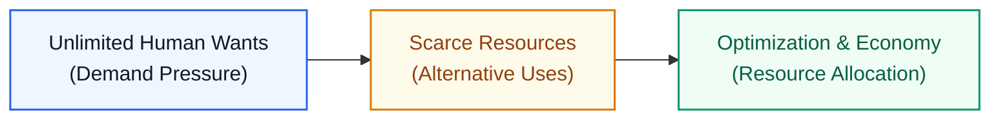

#### Core Intuition & The Fundamental Economic Problem
Every society operates under one foundational reality: **human desires and demands are infinite, but physical resources (land, labour, raw materials, capital, time) are strictly finite and scarce**.
- **Scarcity:** A resource is scarce when the quantity demanded at zero price exceeds the available supply. Food grains are produced in millions of tons yet remain scarce because societal demand is immense; conversely, rotten eggs are physically few in number but are *not* scarce because demand is zero.
- **Resource Allocation:** Because resources have *alternative uses* (e.g., steel can build hospital beds or artillery tanks), society requires an allocating mechanism. The economy guides how inputs are deployed to maximize societal and organizational utility.

#### Business Purpose & Surplus Motivation
A business exists to generate an economic **surplus (profit)**. No business can survive continuously in a state of loss:
$$\text{Profit} = \text{Total Income (Revenue / Selling Price)} - \text{Total Expenses (Cost Price)}$$
- If $\text{Revenue} > \text{Expenses} \implies \text{Surplus (Profit)}$.
- If $\text{Revenue} < \text{Expenses} \implies \text{Loss}$ (leads to eventual liquidation).

#### Structural Classification of Business Organizations
1. **By Ownership Structure:**
   - **Proprietary Business (Sole Proprietorship):** Owned, managed, and controlled by a single individual who bears all financial risk and reaps all surplus.
   - **Partnership Business:** Owned by a small group of individuals (few partners) governed by an agreement sharing capital, management, profits, and joint liability.
   - **Corporate Enterprise (Company):** Separate legal entity owned by numerous public/private shareholders with divided share capital and limited liability.
2. **By Economic Sector:**
   - **Public Sector:** Owned and managed by the Government (state/central) focused on public welfare, infrastructure, and strategic sovereignty.
   - **Private Sector:** Owned by private individuals/investors driven primarily by profit maximization and capital return.

#### Microeconomics vs. Macroeconomics
- **Microeconomics:** The science of individual decision-making. It examines how individual consumers choose baskets of goods, how individual firms set output and prices, and how prices clear in individual markets.
- **Macroeconomics:** The study of aggregate economic behavior. It examines economy-wide metrics: Gross Domestic Product (GDP), national income, general price levels (inflation), overall employment/unemployment rates, and systemic growth cycles.

---

### 1.2 Price Determination: Demand, Supply, and Elasticity Dynamics

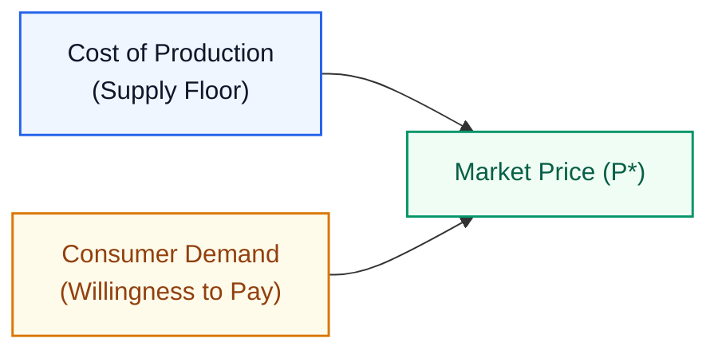

#### Dual Drivers of Price Determination
Price is not dictated by cost alone. It is determined by the mutual interaction of:
1. **Cost of Production:** Sets the minimum price (floor) below which a supplier cannot sustain long-term operations.
2. **Market Demand:** Determines the maximum price (ceiling) consumers are willing to pay based on perceived utility and urgency.
> **Note Example:** Coca-Cola has a very low unit production cost (sugar, water, carbonation, bottle), yet maintains a high retail price due to immense brand demand and willingness to pay. Conversely, a product with high production cost will crash in price or fail if consumer demand is non-existent.

#### Desire vs. Economic Demand
- **Desire:** A psychological wish or preference to possess a commodity (e.g., wishing to own a luxury yacht).
- **Economic Demand:** A desire **backed by the ability and willingness to pay (purchasing capacity)**. Only demand with purchasing power enters economic calculations.

#### Primary Drivers of Demand
The quantity demanded of a commodity $x$ ($q_x^d$) is a multi-variable function:
$$q_x^d = f\left(P_x,\, M,\, P_y,\, \text{Tastes \& Preferences}\right)$$
- $P_x$: Own price of the commodity ($q_x^d \propto \frac{1}{P_x}$).
- $M$: Consumer disposable income.
- $P_y$: Price of related commodities (substitutes such as tea vs. coffee, or complements).
- $\text{Tastes \& Preferences}$: Cultural trends, advertising, seasonality, and social perceptions.
- **The Bandwagon Effect** *(recorded as "Bang Valen effect" in student notes)*: A behavioral phenomenon where consumer demand increases primarily because others are purchasing the item (buying due to social trend/fad rather than intrinsic functional need).

#### The Law of Demand
> **Law of Demand:** The quantity demanded of a product is inversely related to its unit price, *ceteris paribus* (all other determining factors held strictly constant):
> $$q_x^d \propto \frac{1}{P_x} \quad \Longleftrightarrow \quad P_x \uparrow \;\implies\; q_x^d \downarrow, \quad P_x \downarrow \;\implies\; q_x^d \uparrow$$

#### Shifts vs. Movements Along the Demand Curve
- **Movement Along the Curve:** Caused **strictly by a change in the commodity's own price ($P_x$)**. Represents a change in *quantity demanded*.
- **Shift of the Demand Curve (Change in Demand):** Caused by changes in **non-price factors** ($M$, $P_y$, Tastes):
  - **Income Increase ($M \uparrow$):** Consumer can afford more units at the *same* price level $\implies$ **Rightward parallel shift** of the demand curve ($d \to d'$).
  - **Income Decrease ($M \downarrow$):** Purchasing power falls $\implies$ **Leftward parallel shift** of the demand curve.

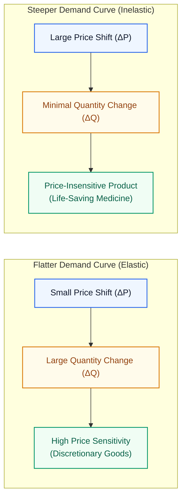

#### Price Sensitivity & Curve Elasticity
The slope of the demand curve reflects consumer price sensitivity:
- **Flat Curve (High Price Elasticity):** Consumers are extremely sensitive. A minute percentage increase in price causes a sharp drop in demand.
- **Steep Curve (Low Elasticity / Price Insensitive):** Essential, non-substitutable goods where quantity demanded barely moves even with steep price hikes (e.g., life-saving medical drugs; notes highlight regional health affordability contrasts such as Norway vs. Kenya).

#### The Supply Function
The quantity supplied of a commodity $x$ ($q_x^s$) represents the supplier's willingness to produce and sell:
$$q_x^s = f(P_x,\, \text{Technology},\, \gamma), \quad \text{where } q_x^s \propto P_x$$
Suppliers are motivated by profit; higher market prices incentivize higher production output, yielding an upward-sloping supply curve.

---

### 1.3 Market Equilibrium, Excess Conditions, and Exogenous Shocks

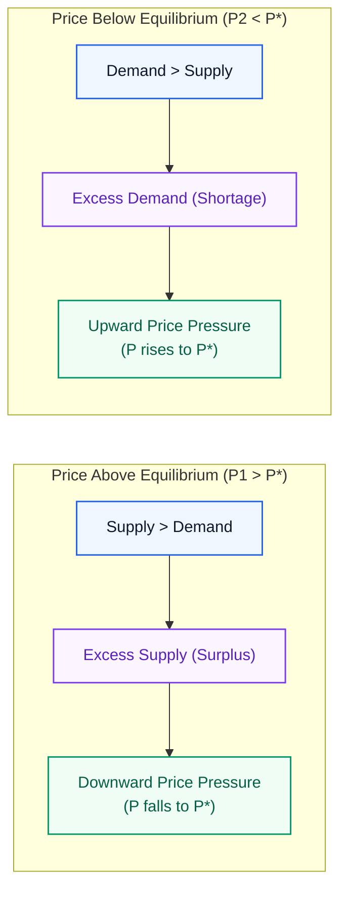

#### Market Clearing Mechanics
Market equilibrium occurs at the intersection point $e(P^*, q^*)$ where the quantity demanded exactly balances the quantity supplied ($q_x^d = q_x^s$):
1. **Condition at $P_1 > P^*$ (Excess Supply / Glut):**
   - Producers produce more than consumers want to buy ($q_s > q_d$).
   - Unsold inventories accumulate. To clear stock, sellers compete by cutting prices. Prices fall until $P^*$ is restored.
2. **Condition at $P_2 < P^*$ (Excess Demand / Shortage):**
   - Consumers demand more than producers supply ($q_d > q_s$).
   - Shortages arise. Consumers bid up prices; producers increase supply. Prices rise until $P^*$ is restored.

#### Exogenous Market Shocks
- **Demand Shock (Favorable Shift in Tastes & Preferences):**
  - Popularity increases $\implies$ Demand curve shifts rightward ($d \to d'$).
  - At the original price $P^*$, a sudden **excess demand** arises.
  - Shortage forces market price upward ($P^* \to P_1^*$), prompting producers to increase output along the supply curve to $q_1^*$.
- **Supply Shock (Adverse Disruption, e.g., War / Sanctions):**
  - Manufacturing capacity or supply routes collapse $\implies$ Supply curve shifts leftward ($s \to s'$).
  - At the existing price, demand exceeds the reduced supply $\implies$ **Excess demand**.
  - Market price surges ($P^* \to P'$), forcing rationed consumption and driving inflation.

---

## 2. Module 2: Macroeconomics, National Income & The Keynesian Cross

### 2.1 The Circular Flow of Income & National Income Accounting Identity

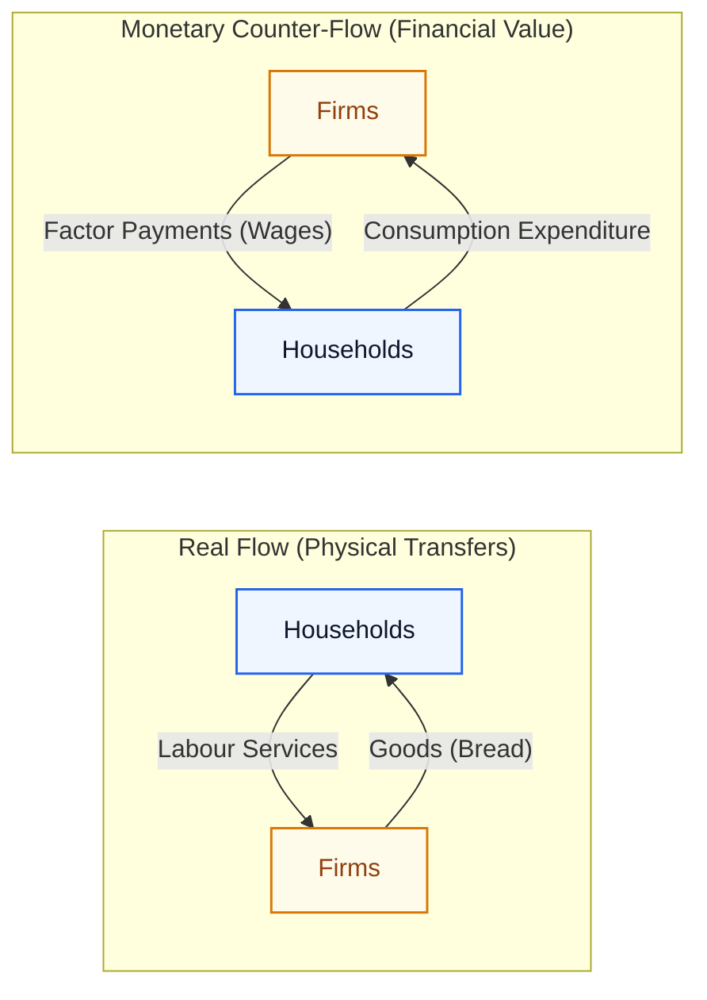

#### The National Income Identity
In an entire macroeconomy, every monetary expenditure by a buyer is received as monetary income by a seller, which in turn equals the value of physical output produced. Hence, the three macroeconomic measurements are identically equal:
$$\text{National Income (NI)} \equiv \text{National Production (NP)} \equiv \text{National Expenditure (NE)} \equiv \text{GDP}$$

#### The Simplified Two-Sector Circular Flow Model
To understand this equivalence, economic theory constructs a closed, simplified two-sector economy (Households and Firms) under four foundational assumptions:
1. **Two Sectors Only:** Only **Households** (consumers and owners of production factors) and **Firms** (producers). No government, no foreign trade.
2. **Single Product:** The economy produces only one homogeneous consumer good: **bread**.
3. **Single Factor of Production:** Only one input factor is utilized: **labour**.
4. **Zero Leakages and Injections:** Households do not save ($\text{Savings} = 0$), and there are no external borrowings or investment injections.

**Dual Circular Loops:**
- **The Real Flow:** Households supply labour services to firms; firms return manufactured goods (bread) to households.
- **The Monetary Counter-Flow:** Firms pay households wages (factor payments) for their labour; households spend this entire wage income buying bread from firms (consumption expenditure).
$$\therefore \text{Total Factor Income} = \text{Total Consumption Expenditure} = \text{Total Market Value of Bread Produced}$$

#### Physical Perception: Goods vs. Services
- **Goods:** Physically perceptible, tangible commodities (e.g., bread, laptops, textiles).
- **Services:** Non-physically perceptible, intangible economic activities (e.g., teaching, software consulting, healthcare, transport).

---

### 2.2 GDP Mechanics: Mathematical Valuation, Nominal vs Real, and National Aggregates

#### Formal Definition of GDP
> **Gross Domestic Product (GDP):** The total market value of all **final goods and services** produced within the **specified geographical/political boundaries** of an economy within a **specified period of time** (typically one fiscal year).

Key boundary terms:
- **Market Value:** Quantities are evaluated at current or constant prevailing market prices ($\text{Value} = P \times Q$).
- **Final Goods:** Purchased for final consumption or capital formation; intermediate goods are excluded to avoid double-counting.
- **Geographical Boundary:** Produced strictly *within* the physical territory of the nation, irrespective of whether produced by domestic citizens or foreign multinational corporations.

#### Mathematical Formulation
For an economy producing $n$ distinct goods and services:
$$\text{GDP} = \sum_{i=1}^n P_i \cdot q_i = P_1 q_1 + P_2 q_2 + \dots + P_n q_n$$
Where $P_i$ is the unit price of the $i$-th good and $q_i$ is the physical output volume of that good.

**How can GDP increase?**
1. Increase in unit prices ($P \uparrow$) $\implies$ Pure inflation, provides zero extra physical welfare (most unethical/illusory path).
2. Increase in physical production quantities ($q \uparrow$) $\implies$ Genuine economic expansion.
3. Simultaneous increase in $P$ and $q$ where output growth dominates.
4. Diversification / Product Innovation ($n \uparrow$) $\implies$ Launching entirely new industries and services.

> [!NOTE] **Feminist Economics Critique**
> Standard GDP accounting records only market transactions where money exchanges hands. It completely excludes **unpaid domestic labour, caretaking, and household production** disproportionately performed by women. As recognized in feminist economic analysis, if this vital economic activity were properly imputed and accounted for, official GDP figures would rise substantially.

#### Nominal GDP vs. Real GDP
- **Nominal GDP ($\text{GDP}_N$):** Evaluates current-year production at **current-year prevailing market prices**.
- **Real GDP ($\text{GDP}_R$):** Evaluates current-year production at **fixed base-year constant prices**, isolating true physical volume expansion from price inflation.

$$\text{GDP}_N = \sum P_{t} \cdot q_{t}, \qquad \text{GDP}_R = \sum P_{\text{base}} \cdot q_{t}$$

---

#### Audited Numerical Masterclass: Country X (Base Year 2020 vs. 2025)
*(Directly audited from the classroom calculation on Page 9 of `IMG_3892.pdf`)*

**Baseline Data:**
- **Year 2020 (Base Year):**
  - Good $A$: Price $P_{a,20} = ₹20/\text{unit}$, Quantity $q_{a,20} = 30\text{ units}$
  - Good $B$: Price $P_{b,20} = ₹10/\text{unit}$, Quantity $q_{b,20} = 20\text{ units}$
- **Year 2025 (Current Year):**
  - Good $A$: Price $P_{a,25} = ₹30/\text{unit}$, Quantity $q_{a,25} = 40\text{ units}$
  - Good $B$: Price $P_{b,25} = ₹25/\text{unit}$, Quantity $q_{b,25} = 20\text{ units}$

```python
# Verification script for Country X National Output
gdp_2020 = (20 * 30) + (10 * 20)  # 600 + 200 = ₹800
gdp_nom_2025 = (30 * 40) + (25 * 20)  # 1200 + 500 = ₹1700
gdp_real_2025 = (20 * 40) + (10 * 20)  # 800 + 200 = ₹1000

pct_nom_growth = ((1700 - 800) / 800) * 100  # 112.5%
pct_real_growth = ((1000 - 800) / 800) * 100  # 25.0%
```

**Step-by-Step Computational Audit:**
1. **Nominal GDP (2020):**
   $$\text{GDP}_{N,2020} = (20 \times 30) + (10 \times 20) = 600 + 200 = ₹800$$
2. **Nominal GDP (2025):**
   $$\text{GDP}_{N,2025} = (30 \times 40) + (25 \times 20) = 1,200 + 500 = ₹1,700$$
   Apparent nominal expansion: $\frac{1,700 - 800}{800} \times 100\% = +112.5\%$.
3. **Real GDP (2025 at 2020 Base Prices):**
   $$\text{GDP}_{R,2025} = (P_{a,2020} \times q_{a,2025}) + (P_{b,2020} \times q_{b,2025}) = (20 \times 40) + (10 \times 20) = 800 + 200 = ₹1,000$$
4. **True Physical Output Growth:**
   $$\text{Real Growth} = \frac{\text{GDP}_{R,2025} - \text{GDP}_{N,2020}}{\text{GDP}_{N,2020}} \times 100\% = \frac{1,000 - 800}{800} \times 100\% = \mathbf{+25.0\%}$$

> ✏️ **Slide Audit Insight:** While nominal GDP shot up by $112.5\%$ (more than doubling), actual economic goods produced only grew by $25\%$. The remaining $87.5\%$ was purely inflationary price distortion!

---

#### The 4 Components of Aggregate Expenditure
$$\text{GDP} = \text{National Expenditure} = C + I + G + NX$$
1. **Consumption Expenditure ($C$):** Spending by households on:
   - *Durable Goods:* Significant lifespan $> 3$ years (automobiles, refrigerators).
   - *Non-Durable Goods:* Short lifespan consumed rapidly (food, toiletries).
   - *Services:* Intangible purchases (legal advice, medical care, haircuts).
2. **Investment Expenditure ($I$):** Creation of physical productive capital stock:
   - *Business Fixed Investment:* Machinery, commercial structures, blast furnaces in steel manufacturing.
   - *Inventory Investment:* Unsold finished goods, raw materials, and work-in-progress held by firms to buffer fluctuating demand.
   - *Residential Investment:* Construction of new homes and residential apartments.
   - *Disinvestment:* Negative investment; drawing down capital or selling off inventory.
3. **Government Purchases ($G$):** Spending by government bodies on infrastructure, defence, administrative salaries, and public schools (excludes transfer payments like pensions).
4. **Net Exports ($NX$):** $\text{Exports } (X) - \text{Imports } (M)$.

---

#### The National Income Aggregates Hierarchy

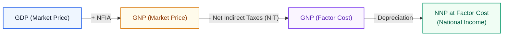

1. **Domestic vs. National (The NFIA Bridge):**
   - **GDP:** Territorial production. What was made *inside* India? (e.g., Nvidia's Bengaluru office output is part of India's GDP, even though profits belong to US owners. Conversely, TCS operations in San Francisco do *not* count in India's GDP).
   - **GNP (Gross National Product):** Citizen ownership production. What was earned by *citizens* of India anywhere in the world?
   $$\text{GNP} = \text{GDP} + \text{Net Factor Income from Abroad (NFIA)}$$
   $$\text{NFIA} = \text{Factor Income earned by Indian residents abroad} - \text{Factor Payments to foreign residents inside India}$$
   - **Global Empirical Contrasts:**
     - **India:** $\text{GDP} > \text{GNP}$ ($\text{NFIA} < 0$, because dividend/royalty/profit payments to foreign corporations exceed inward factor earnings).
     - **Pakistan:** $\text{GNP} > \text{GDP}$ ($\text{NFIA} > 0$, driven by heavy foreign worker remittances sent back home).
     - **China:** $\text{GDP} > \text{GNP}$ (dominant domestic global manufacturing hub).

2. **Market Price vs. Factor Cost (The Tax & Subsidy Bridge):**
   - **Factor Cost (FC):** True production cost paid to production factors (land, labour, capital, entrepreneurship including normal profit).
   - **Market Price (MP):** Final price paid by consumers on the shelf, distorted by government fiscal actions:
   $$\text{Net Indirect Taxes (NIT)} = \text{Indirect Taxes} - \text{Subsidies}$$
   $$\text{GDP}_{\text{FC}} = \text{GDP}_{\text{MP}} - \text{NIT} = \text{GDP}_{\text{MP}} - \text{Indirect Taxes} + \text{Subsidies}$$
   $$\text{GNP}_{\text{FC}} = \text{GNP}_{\text{MP}} - \text{NIT}$$

3. **Gross vs. Net (The Depreciation Bridge):**
   - **Depreciation (Consumption of Fixed Capital):** The ongoing loss in value and physical wear-and-tear of machinery and capital equipment over time (funds required for repair, maintenance, and replacement to sustain working order).
   $$\text{NDP} = \text{GDP} - \text{Depreciation}$$
   $$\mathbf{\text{National Income}} \equiv \mathbf{\text{NNP}_{\text{FC}}} = \text{GNP}_{\text{FC}} - \text{Depreciation}$$

---

### 2.3 The Keynesian Cross Model, Inventory Adjustment & Multiplier Derivations

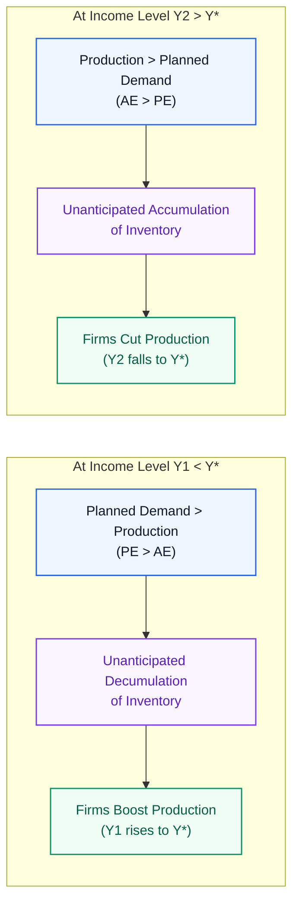

#### Historical Motivation: The Great Depression of 1930
Prior to the 1930s, Classical Economics championed **Laissez-faire ("Hands-off")**: the belief that the market possesses an "invisible hand" that automatically self-corrects all recessions and eliminates unemployment without government intervention.
- The Great Depression shattered this assumption: GDP collapsed globally, and mass unemployment persisted for a decade.
- British economist John Maynard Keynes refuted classical complacency:
  > *"In the long run, we will be dead."*
- Keynes established that an economy can get trapped in a long-term under-employment equilibrium due to deficient aggregate demand. The state must intervene through fiscal expenditure to revive demand.

#### The Consumption Function
Keynes modeled consumption as an affine function of national income ($Y$):
$$C = a + bY$$
- $a > 0$: **Subsistence / Autonomous Consumption**. The minimal expenditure required for survival even if national income is zero ($Y = 0$). Funded by past savings or borrowing.
- $b \in [0, 1]$: **Marginal Propensity to Consume (MPC)**. The fraction of every additional unit of income that households spend on consumption:
  $$b = \frac{dC}{dY}, \quad 0 < b < 1$$

#### The Keynesian Cross Equilibrium
- **Planned Expenditure ($PE$):** Aggregate desired spending by households, businesses, and government:
  $$PE = C + \bar{I} + \bar{G} = (a + bY) + \bar{I} + \bar{G} = (a + \bar{I} + \bar{G}) + bY$$
  *(Where $\bar{I}$ and $\bar{G}$ are autonomous investment and government purchases, treated as fixed constants).*
- **Actual Expenditure ($AE$):** Equal to actual national output/income ($AE = Y$).
- **Equilibrium Condition:** The economy reaches macroeconomic equilibrium where actual output matches planned expenditure:
  $$AE = PE \quad \Longleftrightarrow \quad Y = (a + \bar{I} + \bar{G}) + bY$$
  Graphically, this is the intersection of the planned expenditure line with the $45^\circ$ reference line ($AE = Y$).

#### The Inventory Adjustment Mechanism
Point $e(Y^*)$ is a **stable equilibrium**. If the economy deviates, market forces automatically drive output back to $Y^*$:
1. **If Output is Below Equilibrium ($Y_1 < Y^*$):**
   $$PE(Y_1) > AE(Y_1) \implies \text{Total Demand} > \text{Total Production}$$
   Consumers buy more goods than firms produced. Firms experience an **unanticipated decumulation (depletion) of inventories**. To replenish inventory, firms hire workers and expand production $\implies Y$ expands from $Y_1 \to Y^*$.
2. **If Output is Above Equilibrium ($Y_2 > Y^*$):**
   $$PE(Y_2) < AE(Y_2) \implies \text{Total Production} > \text{Total Demand}$$
   Firms produce more than the market buys. Unsold goods pile up in warehouses as an **unanticipated accumulation of inventory**. Firms cut output and lay off workers $\implies Y$ contracts from $Y_2 \to Y^*$.

---

#### Formal Mathematical Derivations of Multipliers


##### 1. Government Expenditure Multiplier ($\frac{dY}{dG}$)
How does a permanent rightward shift in government spending affect national income?
Starting from equilibrium:
$$Y = a + bY + \bar{I} + G$$
Collect all $Y$ terms on the left:
$$Y - bY = a + \bar{I} + G \implies Y(1 - b) = a + \bar{I} + G$$
$$Y^* = \frac{a}{1 - b} + \frac{\bar{I}}{1 - b} + \frac{G}{1 - b}$$
Differentiate national income $Y$ with respect to government expenditure $G$:
$$\mathbf{\frac{dY}{dG} = \frac{1}{1 - b}} \quad \Longleftrightarrow \quad \mathbf{\Delta Y = \frac{\Delta G}{1 - b}}$$
- Because $b \in (0, 1)$, the denominator $(1 - b)$ is a decimal $< 1$.
- Consequently, the multiplier **$\frac{1}{1 - b} > 1$**, ensuring **$\Delta Y > \Delta G$**.
- *Example:* If $\text{MPC} = b = 0.8$, the multiplier is $\frac{1}{1 - 0.8} = \frac{1}{0.2} = 5.0$. A $₹100\text{ crore}$ government expenditure injects $₹500\text{ crore}$ into national income through rounds of respending!

##### 2. Lump-Sum Tax Multiplier ($\frac{dY}{dT}$)
*(Audited from homework assignment on Page 16 of `IMG_3892.pdf`)*
When the government levies a lump-sum tax $T$, disposable income becomes $(Y - T)$, altering consumption to $C = a + b(Y - T)$:
$$Y = a + b(Y - T) + \bar{I} + \bar{G} = a + bY - bT + \bar{I} + \bar{G}$$
$$Y(1 - b) = a - bT + \bar{I} + \bar{G}$$
$$Y^* = \frac{a + \bar{I} + \bar{G}}{1 - b} - \frac{b}{1 - b}T$$
Differentiating with respect to tax $T$:
$$\mathbf{\frac{dY}{dT} = -\frac{b}{1 - b}}$$
> ⚠️ **Examiner Note:** The tax multiplier is negative (tax hikes contract the economy) and its absolute magnitude $\left|\frac{-b}{1-b}\right|$ is **strictly less** than the government expenditure multiplier $\frac{1}{1-b}$ by exactly $1.0$. This is because government spending enters aggregate demand directly, whereas taxes first pass through households who cushion the impact by reducing savings!

##### 3. Autonomous Investment Multiplier ($\frac{dY}{dI}$)
Similarly, if private business investment expands by $\Delta I$:
$$\mathbf{\frac{dY}{dI} = \frac{1}{1 - b}}$$

---

### 2.4 Money, Banking Architecture, and Macroeconomic Stabilization Policies

#### Evolution of the Monetary System
1. **The Barter System & Its Inherent Frictions:**
   - *Absence of Double Coincidence of Wants:* Trade requires that Party A wants exactly what Party B produces, and vice versa.
   - *Valuation Difficulty:* Without a common denominator, every good must be priced in terms of every other good ($n(n-1)/2$ relative prices).
   - *Impossibility of Value Storage:* Perishable physical goods rot, degrade, or cost immense fees to warehouse.
2. **Commodity Money:** Perishable shells (*kaudis*), livestock, salt.
3. **Metallic Standard:** Gold and silver coins—durable, divisible, intrinsically valuable, and difficult to counterfeit.
4. **Paper Currency & Fiat Money:** Initially issued as paper promissory notes/receipts backed 100% by physical gold reserves in state vaults. Over time, currency was delinked from gold to form modern **fiat money** (circulating solely by government decree and public legal trust).

#### The 3 Core Functions of Money
1. **Universal Medium of Exchange:** Solves the barter problem by acting as the generalized intermediary for all transactions.
2. **Common Unit of Account:** Standard yardstick for quoting prices, measuring GDP, keeping corporate accounts, and recording debt.
3. **Store of Value:** Enables individuals to transfer purchasing power from the present into the future (imperfect due to inflation).

---

#### Reserve Bank of India (RBI) Money Supply Aggregates

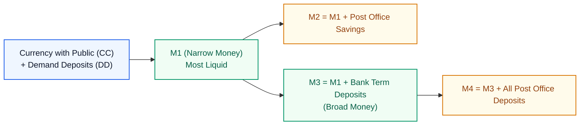

The Central Bank categorizes domestic money stock into 4 standard measures:
- **$M_1$ (Narrow Money):**
  $$M_1 = \text{Currency in Circulation with Public } (CC) + \text{Demand Deposits in Commercial Banks } (DD)$$
- **$M_2$:**
  $$M_2 = M_1 + \text{Savings Deposits with Post Office Savings Banks}$$
- **$M_3$ (Broad Money):**
  $$M_3 = M_1 + \text{Time / Term Deposits (Fixed Deposits) with Commercial Banks}$$
- **$M_4$:**
  $$M_4 = M_3 + \text{All Deposits with Post Office Savings Banks } (\text{excluding National Savings Certificates})$$

> **The Liquidity Order Invariant:**
> $$\mathbf{M_1 > M_2 > M_3 > M_4} \quad (\text{Decreasing Liquidity})$$
> $M_1$ is instantaneously spendable cash; $M_4$ includes locked, long-duration savings instruments.

#### Keynes's 3 Motives for Holding Cash
Why do rational agents hold non-interest-bearing cash instead of purchasing bonds?
1. **Transaction Motive:** To bridge the time gap between receiving income and incurring day-to-day living expenditures.
2. **Precautionary Motive:** As a safety buffer against unexpected emergencies, illnesses, or sudden accidents.
3. **Speculative Motive:** Holding cash when bond prices are anticipated to drop (interest rates anticipated to rise), avoiding capital loss on financial assets.

#### Fiscal vs. Monetary Policy Comparison

| Dimension | Fiscal Policy | Monetary Policy |
|:---|:---|:---|
| **Controlling Authority** | Ministry of Finance / Government | Central Bank (e.g., Reserve Bank of India) |
| **Primary Levers** | Government Expenditure ($G$) and Taxes ($T$) | Money Supply, Cash Reserve Ratio (CRR), Repo Rate, Open Market Operations |
| **Expansionary Mode** | Increase $G$, reduce taxes ($T \downarrow$) | Lower interest rates, purchase government bonds, expand liquidity |
| **Contractionary Mode**| Cut $G$, raise taxes ($T \uparrow$) | Hike interest rates, sell government securities, suck out liquidity |
| **Primary Target** | Direct aggregate demand injection | Inflation management, credit availability, exchange rate stability |

#### Central Banks vs. Commercial Banks
- **Central Bank (RBI):**
  - Apex regulatory authority and **"Banker of Banks"**.
  - **"Lender of Last Resort"** to prevent systemic banking collapse.
  - Maintains price stability, protects currency value, and issues legal tender.
  - *Public Access:* The general public **cannot** open savings/checking accounts in the Central Bank.
- **Commercial Banks (SBI, HDFC, PNB):**
  - Profit-oriented retail/corporate financial institutions.
  - Accept public demand/term deposits and extend loans to businesses and consumers.

---

## 3. Module 3: Principles of Management & Organizational Behaviour

### 3.1 The Nature of Management, Vertical Hierarchy & The 5 Classical Functions


#### Definition and Purpose of Management
> **Management:** The distinct art and science of **getting things done through and with other people** to achieve organizational goals **efficiently and effectively**.
- **Efficiency (Cost Minimizing):** Doing things right; using the minimal quantum of scarce resources (capital, labour, materials) to produce a given output.
- **Effectiveness (Output Maximizing):** Doing the right things; achieving the desired organizational milestone, deadline, or quality standard.

#### Henri Fayol's 5 Classical Functions of Management
1. **Planning:** Looking into the future, anticipating market conditions, setting targets, and establishing a roadmap of actions.
2. **Organizing:** Structuring tasks, grouping workflows, allocating equipment/funds, and defining responsibility relationships.
3. **Commanding (Leading / Directing):** Giving clear operational instructions, mentoring subordinates, and inspiring team output.
4. **Coordinating:** Harmonizing disparate departments, resolving interpersonal friction, and ensuring all divisions move in synergy.
5. **Controlling:** Measuring actual operational output against planned targets, identifying variance gaps, and taking corrective actions.

#### The 10 Inherent Characteristics of Management
1. **Goal-Oriented:** Exists strictly to realize defined institutional objectives.
2. **Universal Activity:** Applies to commercial corporations, non-profits, military, hospitals, and universities alike.
3. **Continuous Process:** Never ceases; planning feeds into control which triggers new planning loops.
4. **Dynamic Activity:** Must continuously adapt strategies to shifting socio-economic, political, and competitive landscapes.
5. **Group Activity:** Concerned with collective human efforts rather than solitary individual action.
6. **Distinct Process:** Distinct from the physical ownership of capital assets.
7. **Professionalized Discipline:** Governed by an established body of knowledge, rigorous training, and professional ethics.
8. **Multi-Disciplinary:** Borrows principles from economics, psychology, statistics, sociology, and engineering.
9. **Both Science and Art:**
   - *Science:* Grounded in reproducible principles, empirical cause-and-effect relations, and quantitative methods.
   - *Art:* Demands personal creativity, intuition, situational empathy, and emotional intelligence.
10. **Intangible Force:** Cannot be physically touched, but its presence is evidenced by order, profitability, and employee morale.

---

#### Vertical Management Hierarchy

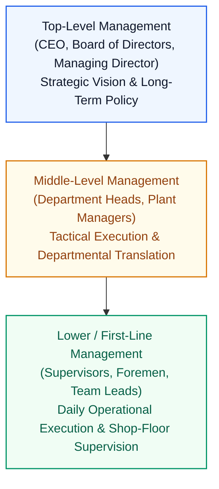

- **Top Level:** Focuses on corporate survival, broad vision, long-term capital allocation, and external stakeholders.
- **Middle Level:** Acts as the communication bridge, translating top-tier strategy into departmental budgets and targets.
- **Lower Level:** Interacts directly with the non-managerial workforce, ensuring quality, safety, and daily shift targets.

#### Team Dynamics & The 4 Quadrants of Workforce Performance
A successful team requires **motivation** (driven by fair incentives, mutual respect, professional autonomy, and authentic praise):

| | **High Motivation** | **Low Motivation** |
|:---|:---|:---|
| **High Efficiency** | **Star Performers / Champions:** High output, high energy, self-directed. | **Underutilized / Burned Out:** Capable of immense output but mechanically disengaged. Needs recognition and incentives. |
| **Low Efficiency** | **Enthusiastic Apprentices:** Highly eager but lacking technical skill. Needs training, mentorship, and supervision. | **Systemic Liabilities:** Neither skilled nor interested. Requires structural intervention or re-allocation. |

---

### 3.2 Leadership Styles & Organizational Case Studies

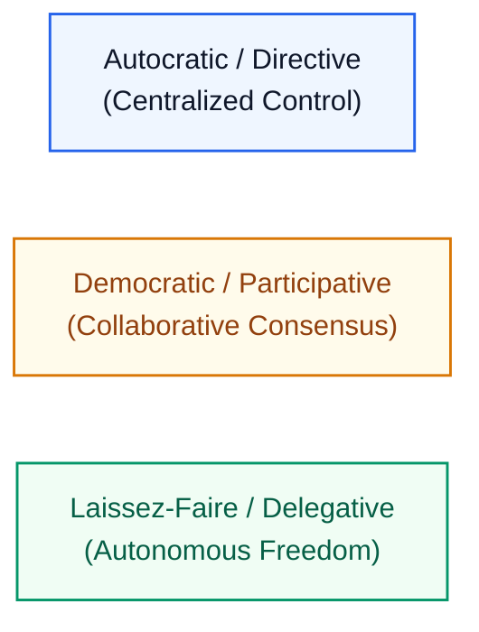

#### Decision Matrix: Leadership & Management Styles

| Style | Authority & Decision-Making | Communication Flow | Key Strengths | Critical Limitations | Optimal Operational Scenario |
|:---|:---|:---|:---|:---|:---|
| **Autocratic / Directive** | Centralized strictly in the leader; zero subordinate input. | One-way (Top-down directives). | Swift decision-making; crystal-clear command chain. | Kills employee initiative; creates resentment and dependency. | Military operations, crisis turnaround, urgent safety hazards. |
| **Democratic / Participative** | Shared collaboratively between leaders and team members. | Two-way (Open consultation). | High team buy-in, creative problem solving, employee empowerment. | Slower decision velocity; risk of endless consensus-seeking. | Product design teams, strategic planning, university faculties. |
| **Laissez-Faire / Delegative** | Dispersed to subordinates; leader provides minimal oversight. | Horizontal / Peer-to-peer. | Maximizes individual creativity and intellectual independence. | High risk of chaos and lack of coordination if members slack. | Elite R&D laboratories, senior software engineering teams. |

---

#### Landmark Organizational Case Studies
1. **Google's Project Aristotle:**
   - *Research Scope:* An exhaustive multi-year study across **180 Google engineering and product teams** to isolate why some teams flourished while others collapsed.
   - *Core Finding:* The presence of "star performers", high IQs, or elite university pedigrees had virtually **no statistical correlation** with team success.
   - *The Decisive Invariant:* **Psychological Safety** was the #1 critical predictor. High-performing teams operated in an environment where members felt completely safe to propose unconventional ideas, take interpersonal risks, and admit mistakes without fear of being ridiculed or judged.
2. **Southwest Airlines Management Philosophy:**
   - *Core Finding:* Uncompromising commitment to **frontline employee empowerment**.
   - *Mechanism:* Flight attendants and gate agents were given autonomous authority to improvise customer service solutions on the spot without waiting for bureaucratic permission from hierarchical managers.
   - *Impact:* High workforce morale directly translated into exceptional customer loyalty and industry-leading turnaround times.
3. **Toyota Production System (TPS) / Lean Manufacturing:**
   - Focused on the relentless elimination of *Muda* (waste) and employee-driven continuous improvement (*Kaizen*).

---

## 4. Module 4: Financial Accounting Architecture & Stakeholder Theory

### 4.1 The AAA Framework & Stakeholder Information Asymmetry

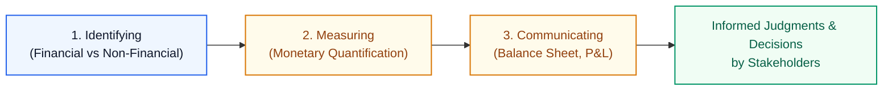

#### The Relationship Between Accounting and Finance
- **Accounting:** The measurement and reporting system. It systematically tracks historical business transactions and translates raw data into structured financial statements.
- **Finance:** The forward-looking decision-making discipline. It utilizes the information provided by accounting to make capital raising, investment, and operational resource decisions.

#### The American Accounting Association (AAA) Definition
> **AAA Definition:** *"Accounting is the process of identifying, measuring, and communicating economic information to permit informed judgments and decision making by the users of information."*

#### Comprehensive Keyword Deconstruction
1. **Process:** Accounting is not a disconnected event; it is a systematic, continuous sequence of chronological recording, classification, summarization, and auditing.
2. **Identifying:** Screening business events to select only those that have a **financial character** and directly affect the balance sheet.
   - *Recorded:* Paying factory rent, purchasing raw steel, selling finished goods.
   - *Ignored:* Hiring a brilliant new software architect, executive morale, verbal negotiations.
3. **Measuring:** Quantifying identified transactions in terms of a stable **monetary unit** (INR, USD).
4. **Communicating:** Synthesizing quantified data into formal **financial statements** (Balance Sheet, Profit & Loss Statement, Cash Flow Statement) shared with internal and external parties.
5. **Economic Information:** Reliable intelligence concerning the allocation, utilization, cash flows, and obligations of scarce economic resources.
6. **Informed Judgments by Users:** Equipping decision-makers with verified metrics rather than guesswork.

---

#### Stakeholder Information Matrix: Who Needs What?
A **Stakeholder** is any entity that has economic **value at risk** tied to the enterprise:

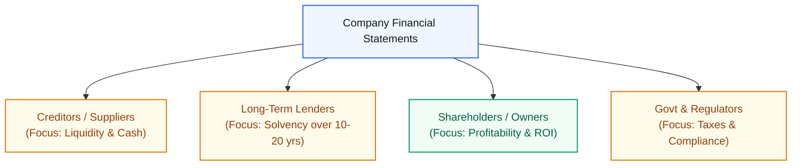

| Stakeholder Category | Economic Stake (Value at Risk) | Critical Information Required | Primary Decision Governed |
|:---|:---|:---|:---|
| **Short-Term Creditors / Raw Material Suppliers** | Unpaid invoices for materials delivered on credit. | **Liquidity:** Immediate cash balances, quick ratio, short-term debt repayment ability. | Whether to extend credit terms or demand immediate cash upon delivery. |
| **Long-Term Debt Holders / Lenders (Banks)** | Principal loans outstanding over a 10–20 year horizon. | **Solvency & Long-Term Viability:** Sustained profitability, interest coverage, asset collateral. | Whether to approve long-term term loans; setting interest rate margins. |
| **Shareholders / Equity Investors** | Equity ownership capital and retained earnings. | **Profitability & Growth:** Net profit margins, Return on Equity (ROE), dividend yields. | Whether to buy, hold, or divest equity shares. |
| **Internal Management** | Professional performance and executive compensation. | **Operational Efficiency:** Unit costs, variance from budget, departmental margins. | Pricing adjustments, cost-cutting initiatives, capital expansions. |
| **Employees & Labour Unions** | Livelihoods, fair compensation, and pension claims. | **Organizational Stability:** Fair operating profits, cash reserves. | Wage bargaining, assessing job security. |
| **Government & Tax Authorities** | Public tax revenues (Direct & Indirect taxes). | **Compliance & Taxable Base:** Audited revenue, allowable depreciation, taxable net profit. | Assessing corporate tax liabilities; ensuring statutory compliance. |
| **Society at Large** | Environmental impacts, local employment, ethics. | **Corporate Social Responsibility (CSR):** Sustainable manufacturing, fair practices. | Granting social license to operate; consumer brand loyalty. |

---

### 4.2 Financial Position: Assets, Liabilities & Balance Sheet Classification

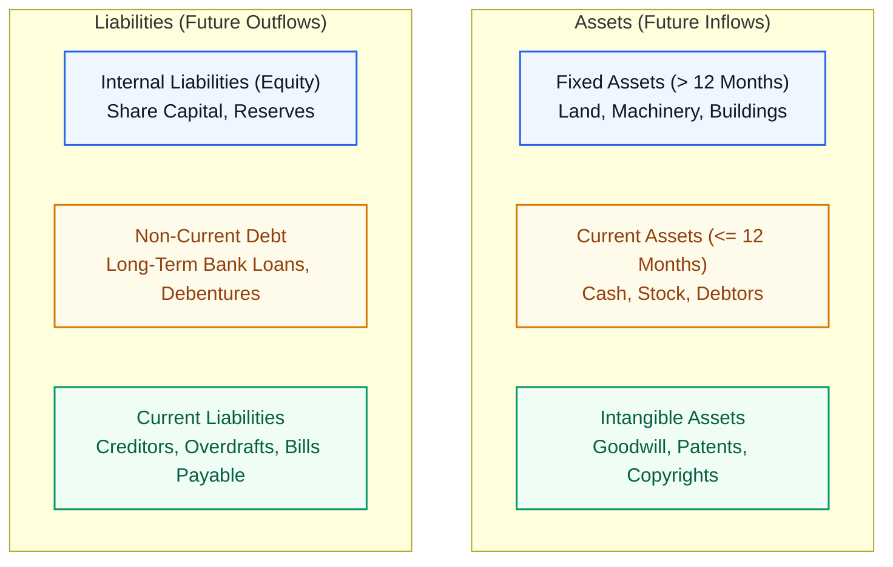

#### The Time Dimension Criterion
- **Asset:** A resource controlled by the enterprise as a result of past events from which **future economic benefits are expected to be received**.
- **Liability:** A present obligation of the enterprise arising from past events, the settlement of which is expected to result in an **outflow of resources (future sacrifice to be provided)**.
- **Period Expenditure:** If an outflow has **no future economic dimension** beyond the current accounting period (fully consumed today), it cannot be capitalized as an asset; it is recorded as an operating expense in the Profit & Loss statement.

#### Classification of Assets
1. **By Operating Horizon:**
   - **Fixed / Non-Current Assets ($> 12\text{ Months}$):** Acquired for long-term productive use, not for immediate resale (e.g., land, plant, industrial blast furnaces, company motor cars).
   - **Current Assets ($\le 12\text{ Months}$):** Cash or assets expected to be converted into cash within one normal operating cycle / 12 months (e.g., raw material stock, sundry debtors, bills receivable, bank balances).
2. **By Physical Substance:**
   - **Tangible Assets:** Possess physical mass and can be seen/touched (e.g., machinery, buildings, raw materials).
   - **Intangible Assets:** Non-monetary assets without physical substance, representing legally enforceable rights or market goodwill:
     - *Goodwill:* Brand reputation, customer retention, and superior earning power over competitors.
     - *Intellectual Property Rights (IPR):* Registered patents, trademarks, and copyrights.
3. **Real vs. Fictitious Assets:**
   - **Real Assets:** Tangible or intangible resources possessing intrinsic or realizable monetary value.
   - **Fictitious / Imaginary Assets:** Not true assets at all; accounting entries representing accumulated debit losses (P&L debit balance) or preliminary company formation expenses not yet written off.

#### Classification of Liabilities
1. **By Maturity:**
   - **Long-Term Liabilities:** Obligations maturing beyond 12 months (e.g., 10-year bank term loans, corporate bonds/debentures).
   - **Short-Term / Current Liabilities:** Obligations due within 12 months (e.g., sundry creditors for raw materials, bills payable, bank overdrafts, outstanding unpaid expenses).
2. **By Source:**
   - **Internal Liabilities (Owners' Equity):** Funds owed by the corporate legal entity back to its owners/shareholders (Share Capital, Reserves & Surplus, Retained Earnings).
   - **External Liabilities:** Claims held by outside third-party financiers, banks, and suppliers.

---

## 5. Module 5: Cost Accounting & The Master Cost Sheet

### 5.1 Cost Concepts, Scarcity Optimization & Multi-Dimensional Classifications

#### The Strategic Purpose of Cost Accounting
In a competitive free-market economy, a firm is a **price taker**: market price is dictated by the intersection of aggregate demand and supply curves. A firm cannot arbitrarily raise selling prices without losing customer volume.
$$\text{Profit} = \text{Sales Revenue} - \text{Total Cost}$$
Therefore, the only sustainable mechanism to maximize profit is **rigorous cost control and cost reduction** (eliminating wastage without compromising physical product quality).

#### Formal Definition of Cost
> **Cost:** The total quantum of **scarce resources sacrificed** to achieve a specific business objective.

#### Multi-Dimensional Classifications of Cost

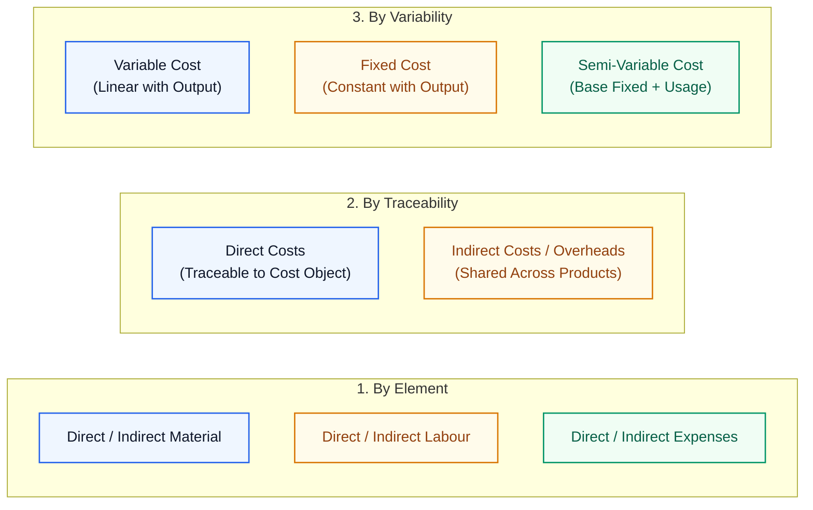

1. **Element-Wise Classification:**
   - **Material Cost:** Cost of physical substances entering production (e.g., fabric in garment manufacturing).
   - **Labour Cost:** Wages and salaries paid to the operational and managerial workforce.
   - **Expenses:** All non-material, non-labour operational costs (e.g., factory rent, machine power, patent royalties).
2. **Traceability-Wise Classification:**
   - **Direct Costs:** Costs that can be easily, economically, and specifically traced to a single cost object/product (e.g., wages of a machine operator machining a specific engine block; leather in shoes).
   - **Indirect Costs (Overheads):** Costs incurred for common organizational operations that benefit multiple products simultaneously and cannot be traced directly to one unit (e.g., helper/janitor wages, factory lighting, plant security).
3. **Variability-Wise Classification:**
   - **Variable Cost:** Changes in direct linear proportion to production volume (e.g., direct raw materials; producing 100 units requires $10\times$ the raw materials of producing 10 units).
   - **Fixed Cost:** Remains strictly constant regardless of output volume within the relevant capacity range (e.g., factory building rent, supervisor fixed monthly salaries).
   - **Semi-Variable / Semi-Fixed (Step-Up) Cost:** Contains a fixed baseline cost plus a variable surcharge that expands with usage (e.g., telephone/electricity bills with fixed line-rental plus per-unit metered tariffs).
4. **Functional Classification:**
   - **Manufacturing / Works Cost:** Incurred inside the factory walls to convert raw inputs into finished goods.
   - **Administrative Cost:** Management, policy formulation, board direction, accounting, and legal compliance.
   - **Selling & Distribution Cost:** Marketing, advertising, salesmen commissions, logistics, and delivery.
   - **Research & Development (R&D) Cost:** Developing new products or refining engineering processes.
5. **Amortization vs. Depreciation:**
   - **Depreciation:** Allocating the depreciable cost of **tangible physical fixed assets** (plant, buildings, machinery) across their productive lifespan.
   - **Amortization:** Spreading the capitalized cost of **intangible assets** (patents, software licenses, goodwill) or long-term financial liabilities/loans over time.

#### Cost Units & Costing Methods
- **Cost Unit:** A standard unit of quantity of product, service, or time in relation to which costs may be ascertained (e.g., quoting "$100 for chairs" is meaningless without defining whether it covers 1 chair or 100 chairs; passenger transport uses a composite unit: **cost per passenger-km**; freight uses **cost per ton-km**).
- **Costing Methods:**
  - *Job Costing:* Customized, unique jobs executed to customer specifications (printing presses, repair shops).
  - *Batch Costing:* Identical goods produced in batches (pharmaceutical tablets, garments).
  - *Contract Costing:* Large-scale, multi-year construction projects (bridges, highways, shipyards).
  - *Process Costing:* Continuous, indistinguishable automated flow through progressive chemical stages (oil refineries, chemical plants, paper mills).
  - *Operating / Service Costing:* Companies rendering services (bus fleets, hotels, hospitals).

---

### 5.2 The Master Cost Sheet Architecture & Stock Adjustment Stages


#### Why Prepare a Cost Sheet?
1. **Determines Unit Cost at Every Intermediate Production Phase:** Identifies whether cost surges stem from raw material inflation, factory inefficiency, or marketing bloat.
2. **Enables Price Quotations & Tenders:** Provides historical overhead percentage ratios to accurately quote for competitive contract bids.
3. **Facilitates Period Comparison:** Reveals deviations from past fiscal performance and industrial benchmarks.

#### The 5 Milestone Equations & Invariant Stock Adjustments

##### Step 1: Raw Material Consumed
$$\mathbf{\text{Raw Material Consumed}} = \text{Opening Stock of RM} + \text{Purchases of RM} + \text{Carriage Inwards (Freight on Purchases)} - \text{Purchase Returns} - \text{Closing Stock of RM}$$
*(Carriage Inward represents freight paid to bring raw inputs into the factory and is capitalized into material cost).*

##### Step 2: Prime Cost
$$\mathbf{\text{Prime Cost}} = \text{Raw Material Consumed} + \text{Direct Wages} + \text{Direct Expenses}$$

##### Step 3: Factory / Works Cost (Gross & Adjusted)
$$\text{Gross Factory Cost} = \text{Prime Cost} + \text{Factory Overheads}$$
$$\mathbf{\text{Adjusted Factory Cost}} = \text{Gross Factory Cost} + \text{Opening Work-in-Progress (WIP)} - \text{Closing Work-in-Progress (WIP)}$$
*(Factory Overheads include: factory rent, indirect labour, supervision, coal/fuel, repairs to plant, and plant depreciation).*

##### Step 4: Cost of Production (COP)
$$\mathbf{\text{Cost of Production}} = \text{Adjusted Factory Cost} + \text{Office \& Administrative Overheads}$$
*(Administrative Overheads include: office salaries, office rent, stationery, and executive building maintenance).*

##### Step 5: Cost of Goods Sold (COGS)
$$\mathbf{\text{Cost of Goods Sold}} = \text{Cost of Production} + \text{Opening Stock of Finished Goods} + \text{Purchases of Finished Goods} - \text{Closing Stock of Finished Goods}$$

##### Step 6: Cost of Sales & Selling Price
$$\mathbf{\text{Cost of Sales (Total Cost)}} = \text{COGS} + \text{Selling \& Distribution Overheads}$$
$$\mathbf{\text{Sales Revenue}} = \text{Cost of Sales} + \text{Net Profit} \quad (\text{or } - \text{Net Loss})$$
*(Selling Overheads include: salesmen salaries/commissions, carriage outwards, advertising, travelling, and product delivery).*

> 🔴 **STRICT INVARIANT: Items Excluded from the Cost Sheet!**
> Students frequently fall into examiner traps by erroneously including balance sheet accounts, financing costs, or profit appropriations in the cost sheet. **The following items must NEVER appear in a Cost Sheet:**
> 1. **Pure Financing Charges:** Interest on loans/borrowed funds, discount on debentures, share issue expenses.
> 2. **Balance Sheet Asset/Liability Balances:** Sundry Debtors, Sundry Creditors, Share Capital, Cash/Bank balances.
> 3. **Appropriations of Profit:** Corporate income taxes, dividends paid, transfers to general reserves.
> 4. **Revenue Offsets:** Sales returns and customer rebates (these are deducted from Gross Sales to find Net Sales; they are not costs of production).

---

### 5.3 Audited Numerical Masterclasses: Complete Worked Cost Statements

---

#### Numerical Masterclass 1: Cost Statement for September 2014 & Tender Pricing
*(Directly audited from Pages 16–17 of `IMG_3914.pdf`)*

| Particulars | Inner Amount ($₹$) | Outer Amount ($₹$) |
|:---|---:|---:|
| **Opening Stock of Raw Materials** | $75,000$ | |
| *Add:* Purchases of Raw Materials | $66,000$ | |
| *Add:* Expenses on Purchases (Carriage Inward) | $1,500$ | |
| *Subtotal* | $1,42,500$ | |
| *Less:* Closing Stock of Raw Materials | $(91,500)$ | |
| **Raw Material Consumed** | | $\mathbf{51,000}$ |
| *Add:* Direct Wages | | $52,500$ |
| **PRIME COST** | | $\mathbf{1,03,500}$ |
| *Add: Factory Overheads:* | | |
| - Factory Rent, Rates, and Power | $15,000$ | |
| - Depreciation on Plant & Machinery | $3,500$ | |
| - Indirect Wages | $2,750$ | $21,250$ |
| **Factory Cost (Gross)** | | $\mathbf{1,24,750}$ |
| *Add:* Opening Stock of Work-in-Progress (WIP) | $28,000$ | |
| *Less:* Closing Stock of Work-in-Progress (WIP) | $(35,000)$ | $(7,000)$ |
| **Adjusted Factory Cost (Works Cost)** | | $\mathbf{1,17,750}$ |
| *Add:* Administrative Cost | | $2,500$ |
| **COST OF PRODUCTION (COP)** | | $\mathbf{1,20,250}$ |
| *Add:* Opening Stock of Finished Goods | $54,000$ | |
| *Less:* Closing Stock of Finished Goods | $(31,000)$ | $23,000$ |
| **COST OF GOODS SOLD (COGS)** | | $\mathbf{1,43,250}$ |
| *Add: Selling & Distribution Overheads:* | | |
| - Carriage Outwards | $2,500$ | |
| - Advertising | $3,500$ | |
| - Traveller's Wages & Commission | $6,500$ | $12,500$ |
| **COST OF SALES (TOTAL COST)** | | $\mathbf{1,55,750}$ |
| *Add:* **Net Profit (Balancing Figure)** | | $\mathbf{55,250}$ |
| **SALES (Given)** | | $\mathbf{2,11,000}$ |

**Tender Quotation Principle:**
When preparing bids for future work, overheads are applied as percentages derived from this master statement:
$$\text{Factory Overhead \% of Prime Cost} = \frac{\text{Factory OH}}{\text{Prime Cost}} \times 100\% = \frac{21,250}{1,03,500} \times 100\% \approx \mathbf{20.53\%}$$
$$\text{Administrative Overhead \% of Factory Cost} = \frac{\text{Admin OH}}{\text{Adjusted Factory Cost}} \times 100\% = \frac{2,500}{1,17,750} \times 100\% \approx \mathbf{2.12\%}$$

---

#### Numerical Masterclass 2: Cost Sheet of Rivatex Ltd (Year Ended 31st Dec 2010)
*(Directly audited from Page 19 of `IMG_3914.pdf`)*

> ⚠️ **Examiner Alert:** The student notes note that **Creditors, Capital, and Debtors** appeared in the problem statement. As established in the exclusion invariant, these are Balance Sheet items and are strictly omitted from the statement.

| Particulars | Inner Amount ($₹$) | Outer Amount ($₹$) |
|:---|---:|---:|
| Opening Stock of Raw Materials | $300$ | |
| *Add:* Purchase of Raw Materials | $8,726$ | |
| *Add:* Carriage Inwards | $391$ | |
| *Less:* Closing Stock of Raw Materials | $(200)$ | |
| **Raw Material Consumed** | | $\mathbf{9,217}$ |
| *Add:* Direct Wages (Manufacturing Wages & Salaries) | | $11,029$ |
| **PRIME COST** | | $\mathbf{20,246}$ |
| *Add: Factory Overheads:* | | |
| - Depreciation on Plant | $1,300$ | |
| - Repairs to Plant | $250$ | |
| - Factory Rent & Rates | $2,271$ | |
| - Coal | $579$ | $4,400$ |
| **FACTORY COST** | | $\mathbf{24,646}$ |
| *Add: Administrative Overheads:* | | |
| - Office Salaries | $940$ | |
| - Office Rent & Rates | $650$ | |
| - Printing & Stationery | $93$ | |
| - General Expenses | $317$ | $2,000$ |
| **COST OF PRODUCTION** | | $\mathbf{26,646}$ |
| *Add:* Opening Stock of Manufactured Goods | $974$ | |
| *Add:* Purchase of Manufactured Goods | $1,274$ | |
| *Less:* Closing Stock of Manufactured Goods | $(2,794)$ | $(546)$ |
| **COST OF GOODS SOLD** | | $\mathbf{26,100}$ |
| *Add: Selling & Distribution Overheads:* | | |
| - Carriage Outwards | $233$ | |
| - Travelling Expenses | $279$ | |
| - Discount Allowed | $374$ | $886$ |
| **COST OF SALES** | | $\mathbf{26,986}$ |
| *Add:* **Profit (Balancing Figure)** | | $\mathbf{2,956}$ |
| **SALES (Given)** | | $\mathbf{29,942}$ |

---

#### Numerical Masterclass 3: Gogetter Company — Multi-Department Apportionment
*(Directly audited from Pages 20–22 of `IMG_3914.pdf`)*

**Underlying Allocation Keys Given in Notes:**
- **Heat, Light & Power ($₹65,000$ Total):** Apportioned Factory : Office : Sales $= 8 : 1 : 1$  
  $\implies \text{Factory} = ₹52,000$; $\text{Office} = ₹6,500$; $\text{Sales} = ₹6,500$.
- **Rates & Taxes ($₹6,300$ Total):** Apportioned Factory : Office $= \frac{2}{3} : \frac{1}{3}$  
  $\implies \text{Factory} = ₹4,200$; $\text{Office} = ₹2,100$.
- **Building Depreciation ($4\%$ on $₹2,00,000 = ₹8,000$ Total):** Apportioned Factory : Office : Sales $= 8 : 1 : 1$  
  $\implies \text{Factory} = ₹6,400$; $\text{Office} = ₹800$; $\text{Sales} = ₹800$.
- **Plant & Machinery Depreciation:** $10\%$ on $₹4,60,500 = ₹46,050$ (Charged 100% to Factory).
- **Office Appliances Depreciation:** $5\%$ on $₹17,400 = ₹870$ (Charged 100% to Office).
- **Exclusions:** Interest on borrowed funds (pure financing charge) and sales returns & rebates (sales deduction) are strictly excluded from costs!

```python
# Verification of Gogetter Company Cost Flow
rm_consumed = 140000 + 320000 + 16000 - 4800 - 180000  # 291,200
prime_cost = rm_consumed + 118000 + 8000  # 417,200

factory_oh = (
    18000
    + 1200
    + 10000
    + 14000
    + 52000
    + 4200
    + 18700
    + 46050
    + 6400
)  # 170,550
gross_factory = prime_cost + factory_oh  # 587,750
adj_factory = gross_factory + 200000 - 192000  # 595,750

admin_oh = 8600 + 870 + 6500 + 2100 + 800  # 18,870
cop = adj_factory + admin_oh  # 614,620
cogs = cop + 80000 - 115000  # 579,620

selling_oh = 33600 + 11000 + 22500 + 18000 + 800 + 6500  # 92,400
cost_of_sales = cogs + selling_oh  # 672,020
```

| Cost Stage | Itemized Components & Calculations | Amount ($₹$) |
|:---|:---|---:|
| **1. Raw Materials Consumed** | Opening Stock ($1,40,000$) + Purchases ($3,20,000$) + Freight ($16,000$) - Returns ($4,800$) - Closing Stock ($1,80,000$) | $\mathbf{2,91,200}$ |
| **2. Prime Cost** | RM Consumed ($2,91,200$) + Direct Labour ($1,18,000$) + Direct Labour Expenses ($8,000$) | $\mathbf{4,17,200}$ |
| **3. Factory Overheads** | Indirect Labour ($18,000$) + Exp on Indirect Labour ($1,200$) + Supervision ($10,000$) + Repairs ($14,000$) + Power ($52,000$) + Rates ($4,200$) + Misc Factory Exp ($18,700$) + Plant Depr ($46,050$) + Building Depr ($6,400$) | $+1,70,550$ |
| **Gross Factory Cost** | Prime Cost ($4,17,200$) + Factory Overheads ($1,70,550$) | $\mathbf{5,87,750}$ |
| *WIP Adjustments* | Add: Opening WIP ($2,00,000$) Less: Closing WIP ($1,92,000$) | $+8,000$ |
| **Adjusted Factory Cost** | Gross Factory Cost ($5,87,750$) + Net WIP Movement ($8,000$) | $\mathbf{5,95,750}$ |
| **4. Administrative Overheads** | Office Salaries & Exp ($8,600$) + Appliance Depr ($870$) + Office Power ($6,500$) + Office Rates ($2,100$) + Building Depr ($800$) | $+18,870$ |
| **Cost of Production (COP)** | Adjusted Factory Cost ($5,95,750$) + Admin Overheads ($18,870$) | $\mathbf{6,14,620}$ |
| *Finished Goods Adjustments*| Add: Opening FG ($80,000$) Less: Closing FG ($1,15,000$) | $-35,000$ |
| **Cost of Goods Sold (COGS)** | COP ($6,14,620$) - Net Inventory Addition ($35,000$) | $\mathbf{5,79,620}$ |
| **5. Selling & Dist. Overheads**| Sales Commission ($33,600$) + Travelling ($11,000$) + Promotion ($22,500$) + Salaries ($18,000$) + Building Depr ($800$) + Sales Power ($6,500$) | $+92,400$ |
| **COST OF SALES (TOTAL COST)** | COGS ($5,79,620$) + Selling & Distribution Overheads ($92,400$) | $\mathbf{6,72,020}$ |

---

## 6. Module 6: Corporate Financing Decisions & Capital Budgeting

### 6.1 Asset-Liability Matching, Capital Structures & Cost of Capital ($K$)

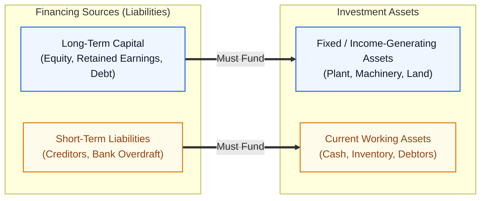

#### The Golden Rule of Asset-Liability Maturity Matching
Long-term, income-generating fixed assets (land, machinery, infrastructure) must be funded through **long-term capital** (equity, debentures, term loans). Funding long-term illiquid assets with volatile, short-term debt (bank overdrafts, 30-day supplier credit) creates an asset-liability mismatch that leads directly to liquidity crises and insolvency!

#### Equity Capital vs. Borrowed Debt Capital
When a financier injects capital into an enterprise, three fundamental questions arise:
1. **Terms of Repayment:** When will the principal be repaid?
2. **Return on Investment:** Why should the investor risk capital (what interest/dividend will be earned)?
3. **Security / Collateral:** What collateral asset guarantees principal recovery if the firm defaults?

| Dimension | Equity Share Capital | Debt Capital (Bonds / Loans) |
|:---|:---|:---|
| **Compulsory vs. Optional** | **Compulsory:** A firm cannot exist without equity ownership capital. | **Optional:** A firm may choose whether or not to leverage debt. |
| **Tenure & Refundability** | **Irrefundable:** Capital is locked in for the corporate lifespan; returned only upon legal liquidation. | **Refundable:** Principal must be fully redeemed at a specified maturity date. |
| **Return Obligation** | **Discretionary Dividends:** Paid only if profits exist and the Board declares them. | **Mandatory Contractual Interest:** Must be paid on schedule regardless of whether the firm makes a profit or loss. |
| **Loss Cushion Role** | Acts as the **equity buffer**; absorbs operating losses to protect firm solvency. | Holds prior legal claims over assets; does not absorb equity losses. |
| **Collateral Security** | No security; residual claim on liquidation assets. | Secured against fixed assets via mortgages/debentures. |

#### Cumulative Preference Shares & Arrear Dividends
Preference shares occupy a hybrid middle tier between debt and common equity:
- They carry a fixed dividend rate that takes legal precedence over ordinary equity dividends.
- **Cumulative Clause:** If the company suffers losses in year 1 and cannot pay the preference dividend, the unpaid dividend accumulates as **arrears**. In year 2, all accumulated past arrears must be paid in full to preference shareholders *before* common equity holders receive a single rupee.

---

#### The Cost of Capital ($K$) & Risk-Return Hierarchy
> **Cost of Capital ($K$):** The minimum rate of return demanded by providers of capital to compensate them for their perceived investment risk.

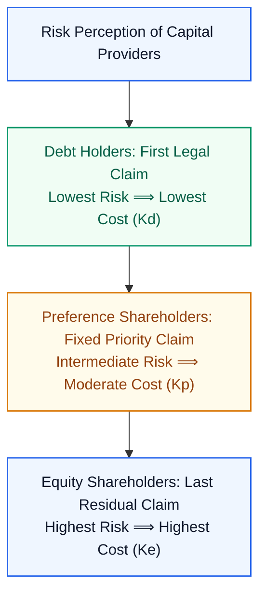

$$\mathbf{K_d < K_p < K_r < K_e}$$
- **Debt Holders ($K_d$):** Enjoy contractually guaranteed interest and first liquidation rights. Lowest risk $\implies$ accept the lowest interest yield.
- **Equity Holders ($K_e$):** Bear the ultimate risk of business failure; receiving dividends only if surplus remains after all expenses, interest, and taxes are settled. Highest risk $\implies$ demand the highest expected return ($K_e$).

#### The Debt Tax Shield vs. Financial Distress Trade-off
Why not fund 100% of the firm with equity?
- **The Tax Advantage of Debt:** Contractual interest on debt is classified as an operational business expense and is **deducted from gross income before calculating corporate income tax**:
  $$\text{Effective After-Tax Cost of Debt} = K_d(1 - t)$$
  *(Where $t$ is the marginal corporate tax rate).*
- **Equity Disadvantage:** Equity dividends are **not** tax-deductible; they are paid entirely out of post-tax net profit.
- **The Critical Trade-Off (Financial Distress):** Excessive debt increases fixed committed interest obligations. If revenue dips, the firm cannot cut interest payments, triggering technical default, debt covenants, and potential bankruptcy.

---

### 6.2 Time Value of Money (TVM) & Discounted Capital Budgeting Methods

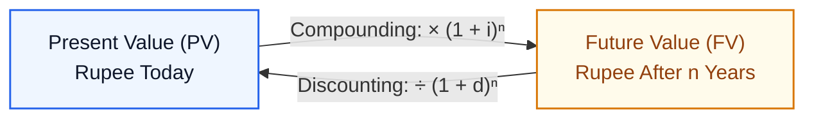

#### Why a Rupee Today $\neq$ a Rupee Tomorrow
Cash flows occurring at different points in time are **not directly addable**! An investor cannot simply add $₹10,000$ received today to $₹10,000$ received three years later due to three fundamental economic frictions:
1. **Purchasing Power Inflation:** General price levels rise over time, eroding the real volume of physical goods a given sum can buy.
2. **Earning / Opportunity Capacity:** Money received today can be immediately invested to yield compounding returns or interest.
3. **Future Uncertainty & Default Risk:** Future cash receipts carry the risk of commercial default, macro shocks, or business failure.

#### Mathematical Conversion Mechanics
- **Compounding (Moving Forward):** Converts Present Value ($PV$) into Future Value ($FV$):
  $$FV = PV \cdot (1 + i)^n$$
- **Discounting (Moving Backward):** Converts Future Value ($FV$) back into Present Value equivalent ($PV$):
  $$PV = \frac{FV}{(1 + d)^n} = FV \cdot (1 + d)^{-n}$$
  *(Where $d$ is the project hurdle rate / cost of capital discounting rate).*

---

#### Net Present Value (NPV) Decision Rule
> **Net Present Value (NPV):** The difference between the aggregate present value of all future cash inflows and the initial capital outlay:
> $$\mathbf{\text{NPV} = \sum_{t=1}^n \frac{\text{Cash Inflow}_t}{(1 + d)^t} - \text{Initial Capital Outlay } (I_0)}$$

**The NPV Decision Criteria:**
- If $\text{NPV} > 0 \implies \mathbf{\text{Accept}}$ (Project earns more than the hurdle rate; expands shareholder wealth).
- If $\text{NPV} < 0 \implies \mathbf{\text{Reject}}$ (Project fails to earn the cost of capital; erodes shareholder wealth).
- If $\text{NPV} = 0 \implies$ Indifferent (Breaks even on cost of capital).
- **Mutually Exclusive Projects:** Choose the project with the **highest positive NPV**.

---

#### Audited Numerical Masterclass: Project A vs. Project B
*(Directly audited from Pages 27–28 of `IMG_3914.pdf`)*

**Parameters:**
- **Initial Capital Outlay ($I_0$):** $₹50,000$ for each project.
- **Hurdle / Discounting Rate ($d$):** $10\% = 0.10$.
- **Project Life:** $3\text{ Years}$.
- **Discount Factor Table ($10\%$):**
  - Year 1: $(1.10)^{-1} \approx 0.9091$
  - Year 2: $(1.10)^{-2} \approx 0.8264$
  - Year 3: $(1.10)^{-3} \approx 0.7513$

```python
# Verification of Project A and B Capital Budgeting
df = [0.9091, 0.8264, 0.7513]
inflows_A = [10000, 20000, 55000]
inflows_B = [12000, 25000, 52000]

pv_A = [cf * f for cf, f in zip(inflows_A, df)]  # [9091.0, 16528.0, 41321.5]
pv_B = [cf * f for cf, f in zip(inflows_B, df)]  # [10909.2, 20660.0, 39067.6]

total_pv_A = sum(pv_A)  # 66,940.5
total_pv_B = sum(pv_B)  # 70,636.8

npv_A = total_pv_A - 50000  # ₹16,940.5
npv_B = total_pv_B - 50000  # ₹20,636.8
```

| Timeline | Discount Factor ($10\%$) | **Project A Inflow ($₹$)** | **Project A PV ($₹$)** | **Project B Inflow ($₹$)** | **Project B PV ($₹$)** |
|:---|:---:|---:|---:|---:|---:|
| **Year 1** | $0.9091$ | $10,000$ | $9,091.0$ | $12,000$ | $10,909.2$ |
| **Year 2** | $0.8264$ | $20,000$ | $16,528.0$ | $25,000$ | $20,660.0$ |
| **Year 3** | $0.7513$ | $55,000$ | $41,321.5$ | $52,000$ | $39,067.6$ |
| **Gross PV of Cash Inflows** | | | $\mathbf{66,940.5}$ | | $\mathbf{70,636.8}$ |
| *Less:* Initial Capital Outlay | | | $(50,000.0)$ | | $(50,000.0)$ |
| **NET PRESENT VALUE (NPV)** | | | $\mathbf{+16,940.5}$ | | $\mathbf{+20,636.8}$ |

> 📐 **Audit & Decision Result:**
> - Both projects have positive NPV ($>0$), meaning both are intrinsically profitable.
> - For mutually exclusive execution: **Project B is Accepted** because $\mathbf{\text{NPV}_B (₹20,636.8) > \text{NPV}_A (₹16,940.5)}$.
> - *Note on Instructor Rounding:* The classroom notes truncated the cents to record $\text{NPV}_A = ₹16,940$ and $\text{NPV}_B = ₹20,636.8$. True infinite-precision compounding yields $\text{NPV}_A = ₹16,942.15$ and $\text{NPV}_B = ₹20,638.62$.

---

#### Alternative Capital Budgeting Methodologies

```mermaid
flowchart LR
    classDef primary fill:#EFF6FF,stroke:#2563EB,stroke-width:1.5px,color:#0F172A;
    classDef intermediate fill:#FFFBEB,stroke:#D97706,stroke-width:1.5px,color:#92400E;
    classDef success fill:#F0FDF4,stroke:#059669,stroke-width:1.5px,color:#065F46;

    NPV_M["NPV: Net Present Value<br/>(Measures Wealth Creation)"]:::success
    IRR_M["IRR: Internal Rate of Return<br/>(Rate where NPV = 0)"]:::intermediate
    PBP_M["PBP: Payback Period<br/>(Time to Recover Outlay)"]:::primary
```

1. **Internal Rate of Return (IRR):**
   - The unique internal discounting rate ($r$) that drives the project's $\text{NPV}$ to exactly zero:
     $$\sum_{t=1}^n \frac{\text{Cash Inflow}_t}{(1 + \text{IRR})^t} - I_0 = 0$$
   - *Decision Rule:* Accept if $\text{IRR} > \text{Hurdle Rate / Cost of Capital } (K)$.
2. **Payback Period (PBP):**
   - The exact number of years required for cumulative unadjusted nominal cash inflows to fully recover the initial capital outlay ($I_0$).
   - *Decision Rule:* Shorter payback period $\implies$ superior project (reduces liquidity risk).
   - *Critical Flaw:* Completely ignores the **Time Value of Money** and ignores **all cash flows received after the payback threshold**.
3. **Discounted Payback Period (DPBP):**
   - Evaluates the time required for cumulative **discounted present value cash inflows** to recover initial investment. Reconciles liquidity monitoring with TVM principles.

---

### 6.3 Decision Making Under Uncertainty: Expected Value & Dispersion Measures

When future cash flows cannot be known with certainty, firms apply probability distributions:

#### Expected Value ($E[V]$)
The weighted average payoff, where weights equal the respective probabilities of occurrence ($P_i$):
$$\mathbf{E[V] = \sum_{i=1}^k X_i \cdot P_i}, \quad \text{where } \sum P_i = 1.0$$
*(Where $X_i$ is the cash payoff in scenario $i$, and $P_i$ is the probability of scenario $i$).*

#### Measures of Central Tendency vs. Dispersion (Risk)
- **Central Tendency (Expected Baseline Payoff):**
  - **Mean:** Arithmetic Mean ($\text{AM}$), Geometric Mean ($\text{GM}$ for growth rates), Harmonic Mean ($\text{HM}$).
  - **Median:** 50th percentile midpoint payoff.
  - **Mode:** The most frequent payoff outcome.
- **Dispersion / Spread (The Definition of Financial Risk):**
  - While central tendency reveals the expected average return, **dispersion measures how far actual cash flows deviate from that mean**.
  - **Variance ($\sigma^2$) and Standard Deviation ($\sigma$):**
    $$\sigma = \sqrt{\sum_{i=1}^k P_i \cdot (X_i - E[V])^2}$$
  - A higher standard deviation signifies wider dispersion, higher volatility, and consequently **greater financial risk**.

---

## 7. Pre-Exam High-Density Cheat Sheet & Formula Registry

| Core Concept / Metric | Exact Mathematical Formula / Operational Invariant | Exam Application Notes |
|:---|:---|:---|
| **Law of Demand** | $q_x^d \propto \frac{1}{P_x} \quad (\text{ceteris paribus})$ | Inverse price-demand relation; downward sloping. |
| **Demand Function** | $q_x^d = f(P_x,\, M,\, P_y,\, \text{Tastes})$ | $M \uparrow \implies$ Right shift; $P_x$ changes move along curve. |
| **Market Equilibrium** | $q_x^d = q_x^s \quad \text{at } (P^*, q^*)$ | $P > P^* \implies \text{Surplus}$; $P < P^* \implies \text{Shortage}$. |
| **GDP Valuation** | $\text{GDP} = \sum_{i=1}^n P_i \cdot q_i$ | Evaluates final goods inside domestic borders. |
| **Real GDP** | $\text{GDP}_R = \sum P_{\text{base}} \cdot q_{\text{current}}$ | Isolates physical volume from price inflation. |
| **GNP & NFIA** | $\text{GNP} = \text{GDP} + \text{NFIA}$ | $\text{NFIA} = \text{Factor Income from Abroad} - \text{Payments to Abroad}$. |
| **Factor Cost vs Market Price** | $\text{GDP}_{\text{FC}} = \text{GDP}_{\text{MP}} - \text{Net Indirect Taxes}$ | $\text{NIT} = \text{Indirect Taxes} - \text{Subsidies}$. |
| **National Income (Formal)** | $\text{National Income} \equiv \text{NNP}_{\text{FC}} = \text{GNP}_{\text{FC}} - \text{Depreciation}$ | Deducts both taxes and wear-and-tear. |
| **Consumption Function** | $C = a + bY \quad (a > 0,\, 0 \le b \le 1)$ | $a =$ subsistence level; $b = \text{MPC} = \frac{dC}{dY}$. |
| **Keynesian Equilibrium** | $Y = PE = C + \bar{I} + \bar{G}$ | Stable intersection on the $45^\circ$ reference line. |
| **Govt Expenditure Multiplier** | $\frac{dY}{dG} = \frac{1}{1 - b}$ | Because $b < 1$, multiplier $> 1$; output expands by $\Delta G / (1-b)$. |
| **Lump-Sum Tax Multiplier** | $\frac{dY}{dT} = -\frac{b}{1 - b}$ | Negative impact; strictly smaller in magnitude than expenditure multiplier. |
| **Narrow Money ($M_1$)** | $M_1 = \text{Currency } (CC) + \text{Demand Deposits } (DD)$ | Most liquid money supply aggregate. |
| **Broad Money ($M_3$)** | $M_3 = M_1 + \text{Bank Time / Term Deposits}$ | Standard measure for systemic monetary liquidity. |
| **Liquidity Ordering** | $M_1 > M_2 > M_3 > M_4$ | Instant currency $\to$ locked postal instruments. |
| **AAA Accounting Definition** | Identifying $\to$ Measuring $\to$ Communicating | Systematic process for informed stakeholder decisions. |
| **Raw Material Consumed** | $\text{Op RM} + \text{Purchases} + \text{Carriage In} - \text{Returns} - \text{Cl RM}$ | Excludes sales returns; includes freight on material. |
| **Prime Cost** | $\text{RM Consumed} + \text{Direct Wages} + \text{Direct Expenses}$ | All direct manufacturing cost elements. |
| **Adjusted Factory Cost** | $\text{Prime Cost} + \text{Factory OH} + \text{Op WIP} - \text{Cl WIP}$ | Work-in-progress adjusted at factory stage. |
| **Cost of Production (COP)** | $\text{Adjusted Factory Cost} + \text{Admin / Office Overheads}$ | Total manufacturing plus administrative burden. |
| **Cost of Goods Sold (COGS)** | $\text{COP} + \text{Op FG} + \text{Purchases FG} - \text{Cl FG}$ | Finished goods inventory movements adjusted here. |
| **Cost of Sales (Total Cost)** | $\text{COGS} + \text{Selling \& Distribution Overheads}$ | Total operating cost basis before profit markup. |
| **Selling Price** | $\text{Cost of Sales} + \text{Profit}$ | Alternatively: $\text{Cost of Sales} - \text{Loss}$. |
| **Cost Sheet Exclusions** | Exclude Loan Interest, Debtor/Creditor, Dividends | Non-operational and financing accounts omitted. |
| **Cost of Capital Hierarchy** | $K_d < K_p < K_r < K_e$ | Reflects legal repayment priority and risk burden. |
| **After-Tax Debt Cost** | $K_d(\text{net}) = K_d(1 - t)$ | Interest is tax-deductible; creates debt tax shield. |
| **Compounding vs Discounting** | $FV = PV(1 + i)^n \quad \Longleftrightarrow \quad PV = \frac{FV}{(1 + d)^n}$ | Overcomes non-addability of cash across time. |
| **Net Present Value (NPV)** | $\text{NPV} = \sum_{t=1}^n \frac{\text{Cash Inflow}_t}{(1 + d)^t} - I_0$ | $\text{NPV} > 0 \implies \text{Accept}$; choose highest $\text{NPV}$. |
| **Internal Rate of Return** | Discount rate $r$ where $\text{NPV} = 0$ | Accept if $\text{IRR} > \text{Cost of Capital } (K)$. |
| **Expected Value** | $E[V] = \sum X_i \cdot P_i$ | Weighted average return across risk scenarios. |
| **Financial Risk Metric** | Standard Deviation: $\sigma = \sqrt{\sum P_i (X_i - E[V])^2}$ | Quantifies dispersion away from expected payoff. |

---

## 8. Examiner Traps & Common Pitfalls Catalog

> ⚠️ **Examiner Trap 1: The Cost Sheet Inventory Placement Error**
> Students frequently adjust Work-in-Progress (WIP) and Finished Goods (FG) in the wrong positions:
> - **Raw Materials Inventory** is adjusted *strictly before* Prime Cost.
> - **Work-in-Progress (WIP)** is adjusted *strictly inside* the Factory stage (Factory Cost Gross $+$ Op WIP $-$ Cl WIP $=$ Adjusted Factory Cost).
> - **Finished Goods (FG)** is adjusted *strictly after* Cost of Production (COP $+$ Op FG $-$ Cl FG $=$ Cost of Goods Sold).

> ⚠️ **Examiner Trap 2: Contaminating the Cost Sheet with Financing Charges**
> Exam questions regularly slip in items like **"Interest on borrowed debentures: $₹15,000$"** or **"Preliminary formation expenses written off: $₹4,000$"**.
> - *The Pitfall:* Adding them to Administrative or Factory overheads.
> - *The Rule:* Interest is a financial management financing charge, NOT an operating cost of production. **Exclude it completely from the Cost Sheet!**

> ⚠️ **Examiner Trap 3: Freight Classification (Inwards vs. Outwards)**
> - **Carriage Inwards (Freight on Purchases):** Transport paid to bring raw inputs *into* the facility. Added directly to **Raw Material Purchases**.
> - **Carriage Outwards (Freight on Sales):** Transport paid to deliver manufactured finished goods *to* clients. Added to **Selling & Distribution Overheads**.

> ⚠️ **Examiner Trap 4: Confusing GDP with GNP**
> - **GDP** is territorial (produced *inside* geographical borders). Foreign MNC profits generated inside domestic territory count in domestic GDP!
> - **GNP** is national (earned by domestic citizens). Deducts foreign MNC repatriated earnings and adds citizen remittances from overseas.
> - In India: $\text{GDP} > \text{GNP}$ because foreign factor outflows exceed inward remittances.

> ⚠️ **Examiner Trap 5: The Tax Multiplier Sign & Magnitude**
> - The Government Expenditure Multiplier is **positive** and equals $\frac{1}{1-b}$.
> - The Lump-Sum Tax Multiplier is **negative** and equals $-\frac{b}{1-b}$.
> - Never set them equal in magnitude: $\left|\frac{-b}{1-b}\right| = \frac{1}{1-b} - 1$. An expenditure injection always expands output more than a tax cut of equal size!

> ⚠️ **Examiner Trap 6: Bandwagon Effect Terminology**
> - Student handwritten notes transcribe this phonetically as *"Bang Valen effect"*.
> - On written university answer sheets, always provide the formal economic term: **The Bandwagon Effect** (demand driven by social conformity and viral consumption trends).

> ⚠️ **Examiner Trap 7: Payback Period TVM Blind Spot**
> - Simple Payback Period calculates nominal recovery time and **ignores the Time Value of Money completely**.
> - If an exam question asks which metric measures total lifecycle project profitability, **never pick Payback Period**; choose **Net Present Value (NPV)**.
