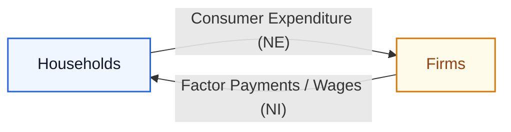
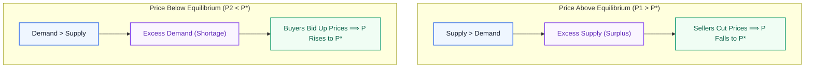

# Finance, Economics and Management for Engineers (HU-4101 / HU-4201) — Master PYQ Solutions

> **Academic Context:** B.Tech / B.Arch 7th & 8th Semester Examination | IIEST Shibpur | Courses: `HU-4101` / `HU-4201`  
> **Source Mode:** **Strict Notes-Bound Mode**  
> **Authorized Reference Note:** [[Finance_Economics_and_Management_Midterm_Study_Guide|`Finance_Economics_and_Management_Midterm_Study_Guide.md`]]  
> **Verification Status:** All calculations independently audited and verified via Python; accounting classifications strictly reconciled with lecture note frameworks; unreferenced/out-of-syllabus questions collected at the end unattempted.

---

## Table of Contents

- [1. Comprehensive Question Audit & Coverage Matrix](#1-comprehensive-question-audit--coverage-matrix)
- [2. 2025 Examination Solutions](#2-2025-examination-solutions)
  - [7th Semester Mid-Semester (September 2025) · HU-4101](#7th-semester-mid-semester-september-2025--hu-4101)
  - [7th Semester End-Semester (November 2025) · HU-4101](#7th-semester-end-semester-november-2025--hu-4101)
  - [8th Semester Mid-Semester (February 2025) · HU-4201](#8th-semester-mid-semester-february-2025--hu-4201)
- [3. 2024 Examination Solutions](#3-2024-examination-solutions)
  - [7th Semester Mid-Semester (September 2024) · HU-4101](#7th-semester-mid-semester-september-2024--hu-4101)
  - [7th Semester End-Semester (November 2024) · HU-4101](#7th-semester-end-semester-november-2024--hu-4101)
  - [8th Semester Mid-Semester (February 2024) · HU-4201](#8th-semester-mid-semester-february-2024--hu-4201)
  - [8th Semester End-Semester (April 2024) · HU-4201](#8th-semester-end-semester-april-2024--hu-4201)
- [4. 2023 Examination Solutions](#4-2023-examination-solutions)
  - [7th Semester Mid-Semester (September 2023) · HU-4101](#7th-semester-mid-semester-september-2023--hu-4101)
  - [7th Semester End-Semester (November 2023) · HU-4101](#7th-semester-end-semester-november-2023--hu-4101)
  - [8th Semester Final Examination (May 2023) · HU-4201](#8th-semester-final-examination-may-2023--hu-4201)
- [5. Master Quick-Recall Formula & Concept Sheet](#5-master-quick-recall-formula--concept-sheet)
- [6. Exam Hall Fatal Traps & Pitfalls Catalog](#6-exam-hall-fatal-traps--pitfalls-catalog)
- [7. Unanswered / Uncovered Questions (Not in Reference Study Guide)](#7-unanswered--uncovered-questions-not-in-reference-study-guide)

---

## 1. Comprehensive Question Audit & Coverage Matrix

| Paper / Session | Q# | Topic / Concept | Marks | Status | Study Guide Direct Link |
|:---|:---|:---|:---:|:---:|:---|
| **2025 7th Mid** | Mod I Q1 | Master Cost Statement Prescribed Format | 4M | **Answered** | [[Finance_Economics_and_Management_Midterm_Study_Guide#5.2 The Master Cost Sheet Architecture & Stock Adjustment Stages|Section 5.2: Cost Sheet Architecture]] |
| **2025 7th Mid** | Mod I Q2 | Short Notes: Fixed Assets, Internal Liab., Process Costing, Elements, Measurement | 6M | **Answered** | [[Finance_Economics_and_Management_Midterm_Study_Guide#4.1 The AAA Framework & Stakeholder Information Asymmetry|Section 4.1, 4.2 & 5.1]] |
| **2025 7th Mid** | Mod II Q1 | Circular Flow Constant Money Flow & NI = NE | 3M | **Answered** | [[Finance_Economics_and_Management_Midterm_Study_Guide#2.1 The Circular Flow of Income & National Income Accounting Identity|Section 2.1: Circular Flow Identity]] |
| **2025 7th Mid** | Mod II Q2 | Keynesian Cross Stability & Expansionary Fiscal Policy | 3M | **Answered** | [[Finance_Economics_and_Management_Midterm_Study_Guide#2.3 The Keynesian Cross Model, Inventory Adjustment & Multiplier Derivations|Section 2.3: Keynesian Cross Model]] |
| **2025 7th Mid** | Mod II Q3 | Functions of Money; Inflation Definition & Causes | 4M | **Answered** | [[Finance_Economics_and_Management_Midterm_Study_Guide#2.4 Money, Banking Architecture, and Macroeconomic Stabilization Policies|Section 2.4: Money Functions & Policies]] |
| **2025 7th Mid** | Mod II Q4 | Law of Demand & Market Equilibrium Price | 4M | **Answered** | [[Finance_Economics_and_Management_Midterm_Study_Guide#1.2 Price Determination: Demand, Supply, and Elasticity Dynamics|Section 1.2 & 1.3: Demand & Equilibrium]] |
| **2025 7th Mid** | Mod III Case | Infosys Leadership Evolution (Autocratic vs Democratic) | 10M | **Answered** | [[Finance_Economics_and_Management_Midterm_Study_Guide#3.2 Leadership Styles & Organizational Case Studies|Section 3.2: Leadership Styles]] |
| **2025 7th End** | Mod I Q1 | Equipment A vs B NPV Analysis (11% Discount Rate) | 12M | **Answered** | [[Finance_Economics_and_Management_Midterm_Study_Guide#6.2 Time Value of Money (TVM) & Discounted Capital Budgeting Methods|Section 6.2: Discounted Capital Budgeting]] |
| **2025 7th End** | Mod I Q1 (OR) | ABC Ltd Capital Structure EBIT-EPS Analysis | 12M | *Uncovered* | End-Sem Topic (Not in Midterm Guide) |
| **2025 7th End** | Mod I Q2 | Notes: Cost, Cost of Capital, PBP, Debt Capital | 4M | **Answered** | [[Finance_Economics_and_Management_Midterm_Study_Guide#6.1 Asset-Liability Matching, Capital Structures & Cost of Capital ($K$)|Section 5.1, 6.1 & 6.2]] |
| **2025 7th End** | Mod II Q1(a) | Numerical Calculation of GDP and GNP at Market Prices | 4M | **Answered** | [[Finance_Economics_and_Management_Midterm_Study_Guide#2.2 GDP Mechanics: Mathematical Valuation, Nominal vs Real, and National Aggregates|Section 2.2: GDP Mechanics & NFIA]] |
| **2025 7th End** | Mod II Q1(b) | Real GDP, Advantages over Nominal, Welfare Flaws | 3M | **Answered** | [[Finance_Economics_and_Management_Midterm_Study_Guide#Nominal GDP vs. Real GDP|Section 2.2: Nominal vs Real GDP]] |
| **2025 7th End** | Mod II Q2 | Marginal Utility Maximization & Lagrangian $U = x^{1/2}y^{1/2}$ | 3M | *Uncovered* | End-Sem Topic (Not in Midterm Guide) |
| **2025 7th End** | Mod II Q3 | Short-Run vs Long-Run Production, TP Inflexion Point | 3M | *Uncovered* | End-Sem Topic (Not in Midterm Guide) |
| **2025 7th End** | Mod II Q4 | Phillips Curve Short-Run Inflation-Unemployment | 3M | *Uncovered* | End-Sem Topic (Not in Midterm Guide) |
| **2025 7th End** | Mod III Case 1 | Nokia Corporate Reinvention (Turnaround/Renewal) | 10M | *Uncovered* | End-Sem Topic (Not in Midterm Guide) |
| **2025 7th End** | Mod III Case 2 | Reliance Industries Ansoff Matrix Diversification | 10M | *Uncovered* | End-Sem Topic (Not in Midterm Guide) |
| **2025 7th End** | Mod III Part B | Strategic Choices: Stability, Retrenchment, Integration | 6M | *Uncovered* | End-Sem Topic (Not in Midterm Guide) |
| **2025 8th Mid** | Mod I Q1 | AAA Definition of Accounting Keyword Breakdown | 5M | **Answered** | [[Finance_Economics_and_Management_Midterm_Study_Guide#4.1 The AAA Framework & Stakeholder Information Asymmetry|Section 4.1: AAA Framework]] |
| **2025 8th Mid** | Mod I Q2 | Short Notes: Contract Costing, Process Costing | 5M | **Answered** | [[Finance_Economics_and_Management_Midterm_Study_Guide#Cost Units & Costing Methods|Section 5.1: Cost Units & Methods]] |
| **2025 8th Mid** | Mod I Q3 | Numerical Calculation: Raw Material Consumed | 5M | **Answered** | [[Finance_Economics_and_Management_Midterm_Study_Guide#Step 1: Raw Material Consumed|Section 5.2: Step 1 RM Consumed]] |
| **2025 8th Mid** | Mod II Q4 | GDP Definition & Circular Flow Factor Income Equivalence | 5M | **Answered** | [[Finance_Economics_and_Management_Midterm_Study_Guide#2.1 The Circular Flow of Income & National Income Accounting Identity|Section 2.1 & 2.2: Circular Flow & GDP]] |
| **2025 8th Mid** | Mod II Q5 | MPC, Investment Multiplier Significance & Keynesian Stability | 5M | **Answered** | [[Finance_Economics_and_Management_Midterm_Study_Guide#2.3 The Keynesian Cross Model, Inventory Adjustment & Multiplier Derivations|Section 2.3: Keynesian Cross & Multipliers]] |
| **2025 8th Mid** | Mod III Sec A | Short Questions: CSR, Science/Art, Fayol Functions | 10M | **Answered** | [[Finance_Economics_and_Management_Midterm_Study_Guide#3.1 The Nature of Management, Vertical Hierarchy & The 5 Classical Functions|Section 3.1: Classical Functions]] |
| **2025 8th Mid** | Mod III Sec B | SwiftTech Case: Fayol Principles & Toyota Lean Kaizen | 10M | **Answered** | [[Finance_Economics_and_Management_Midterm_Study_Guide#3.2 Leadership Styles & Organizational Case Studies|Section 3.1 & 3.2: Lean & Hierarchy]] |
| **2024 7th Mid** | Mod I Q1 | Four Major Long-Term Sources of Corporate Finance | 4M | **Answered** | [[Finance_Economics_and_Management_Midterm_Study_Guide#6.1 Asset-Liability Matching, Capital Structures & Cost of Capital ($K$)|Section 6.1: Long-Term Financing]] |
| **2024 7th Mid** | Mod I Q2a | Cost Definition & Functional Classification | 6M | **Answered** | [[Finance_Economics_and_Management_Midterm_Study_Guide#5.1 Cost Concepts, Scarcity Optimization & Multi-Dimensional Classifications|Section 5.1: Functional Cost Classification]] |
| **2024 7th Mid** | Mod I Q2b (OR) | Numerical Calculation: Administrative Overheads Only | 6M | **Answered** | [[Finance_Economics_and_Management_Midterm_Study_Guide#Step 4: Cost of Production (COP)|Section 5.2 & 5.3: Admin Overheads]] |
| **2024 7th Mid** | Mod II Q1(a-d) | GDP Concept, Used Goods Exclusion, GNP>GDP, Inflation | 5M | **Answered** | [[Finance_Economics_and_Management_Midterm_Study_Guide#2.2 GDP Mechanics: Mathematical Valuation, Nominal vs Real, and National Aggregates|Section 2.2: GDP Mechanics]] |
| **2024 7th Mid** | Mod II Q2(a,b) | Monetary Policy Reserve Cut & Money Multiplier; Functions | 5M | **Answered** | [[Finance_Economics_and_Management_Midterm_Study_Guide#2.4 Money, Banking Architecture, and Macroeconomic Stabilization Policies|Section 2.4: Money Functions & Banking]] |
| **2024 7th Mid** | Mod III Q1 | Functions of Management, Challenges, Hierarchy, CSR | 10M | **Answered** | [[Finance_Economics_and_Management_Midterm_Study_Guide#3.1 The Nature of Management, Vertical Hierarchy & The 5 Classical Functions|Section 3.1 & 4.1: Management & CSR]] |
| **2024 7th Mid** | Mod III Q2 (OR) | Google Project Aristotle Psychological Safety; Science vs Art | 10M | **Answered** | [[Finance_Economics_and_Management_Midterm_Study_Guide#3.2 Leadership Styles & Organizational Case Studies|Section 3.1 & 3.2: Project Aristotle]] |
| **2024 7th End** | Mod I Q1 | Classification of 10 Overhead Items (Functional) | 7M | **Answered** | [[Finance_Economics_and_Management_Midterm_Study_Guide#5.1 Cost Concepts, Scarcity Optimization & Multi-Dimensional Classifications|Section 5.1: Functional Classification]] |
| **2024 7th End** | Mod I Q2 | Operating, Financial, and Combined Leverage | 10M | *Uncovered* | End-Sem Topic (Not in Midterm Guide) |
| **2024 7th End** | Mod I Q2 (OR) | Machine A vs Machine B NPV Evaluation (10% Rate) | 10M | **Answered** | [[Finance_Economics_and_Management_Midterm_Study_Guide#Net Present Value (NPV) Decision Rule|Section 6.2: NPV Decision Rule]] |
| **2024 7th End** | Mod II Q1 | Law of Demand | 1M | **Answered** | [[Finance_Economics_and_Management_Midterm_Study_Guide#The Law of Demand|Section 1.2: Law of Demand]] |
| **2024 7th End** | Mod II Q2 | Consumer Rationality, Indifference Curves Convexity | 3M | *Uncovered* | End-Sem Topic (Not in Midterm Guide) |
| **2024 7th End** | Mod II Q3 | Inflation: Demand-Pull vs Cost-Push Differences | 3M | *Uncovered* | End-Sem Topic (Not in Midterm Guide) |
| **2024 7th End** | Mod II Q4 | Purpose of Fixing Base Year for GDP | 2M | **Answered** | [[Finance_Economics_and_Management_Midterm_Study_Guide#Nominal GDP vs. Real GDP|Section 2.2: Nominal vs Real GDP]] |
| **2024 7th End** | Mod II Q5 | Lagrangian Multiplier Utility Maximization | 6M | *Uncovered* | End-Sem Topic (Not in Midterm Guide) |
| **2024 7th End** | Mod II Q6 (OR) | Autonomous Govt Spending Impact vs Tax Hike in Keynesian Cross | 6M | **Answered** | [[Finance_Economics_and_Management_Midterm_Study_Guide#Formal Mathematical Derivations of Multipliers|Section 2.3: Multiplier Derivations]] |
| **2024 7th End** | Mod III Case 3 | Manufacturing Plant Leadership Styles (Autocratic vs Democratic) | 8M | **Answered** | [[Finance_Economics_and_Management_Midterm_Study_Guide#Decision Matrix: Leadership & Management Styles|Section 3.2: Leadership Styles Decision Matrix]] |
| **2024 8th Mid** | Mod I A | Cost Definition OR Traceability Classification | 4M | **Answered** | [[Finance_Economics_and_Management_Midterm_Study_Guide#5.1 Cost Concepts, Scarcity Optimization & Multi-Dimensional Classifications|Section 5.1: Cost Concepts & Traceability]] |
| **2024 8th Mid** | Mod I B | Numerical Calculation: Works Overheads Only | 6M | **Answered** | [[Finance_Economics_and_Management_Midterm_Study_Guide#Step 3: Factory / Works Cost (Gross & Adjusted)|Section 5.2: Step 3 Works Cost]] |
| **2024 8th Mid** | Mod II Q1 | Nominal vs Real GDP, GDP Deflator, Inflation Distortion | 7M | **Answered** | [[Finance_Economics_and_Management_Midterm_Study_Guide#Audited Numerical Masterclass: Country X (Base Year 2020 vs. 2025)|Section 2.2: Audited Masterclass Country X]] |
| **2024 8th Mid** | Mod II Q2 | Keynesian Recession Remedy & MPC from Multiplier (k=5) | 3M | **Answered** | [[Finance_Economics_and_Management_Midterm_Study_Guide#2.3 The Keynesian Cross Model, Inventory Adjustment & Multiplier Derivations|Section 2.3: Keynesian Cross & Multiplier]] |
| **2024 8th Mid** | Mod II Q2 (OR) | Functions of Money & Broad Money ($M_3$) | 3M | **Answered** | [[Finance_Economics_and_Management_Midterm_Study_Guide#Reserve Bank of India (RBI) Money Supply Aggregates|Section 2.4: Money Functions & RBI Aggregates]] |
| **2024 8th Mid** | Mod III Q1 | Contributions of Henri Fayol in Modern Management | 5M | **Answered** | [[Finance_Economics_and_Management_Midterm_Study_Guide#Henri Fayol's 5 Classical Functions of Management|Section 3.1: Fayol's 5 Classical Functions]] |
| **2024 8th End** | Mod I Q1 | Short Notes: Functional Cost, PBP, IRR, Long-Term Finance | 8M | **Answered** | [[Finance_Economics_and_Management_Midterm_Study_Guide#6.2 Time Value of Money (TVM) & Discounted Capital Budgeting Methods|Section 5.1, 6.1 & 6.2]] |
| **2024 8th End** | Mod I Q2 | Degree of Operating and Financial Leverage Calculation | 8M | *Uncovered* | End-Sem Topic (Not in Midterm Guide) |
| **2024 8th End** | Mod I Q4 | Three Types of Management Styles | 8M | **Answered** | [[Finance_Economics_and_Management_Midterm_Study_Guide#Decision Matrix: Leadership & Management Styles|Section 3.2: Leadership Styles Decision Matrix]] |
| **2024 8th End** | Mod I Q5 | Managerial Success (Efficiency vs Effectiveness) & Need | 8M | **Answered** | [[Finance_Economics_and_Management_Midterm_Study_Guide#Definition and Purpose of Management|Section 3.1: Nature of Management]] |
| **2024 8th End** | Mod II Q3(a) | Fractional Reserve Banking & Money Creation | 3M | **Answered** | [[Finance_Economics_and_Management_Midterm_Study_Guide#Central Banks vs. Commercial Banks|Section 2.4: Central vs Commercial Banks]] |
| **2024 8th End** | Mod II Q4 (OR) | Autonomous Govt Spending Impact in Keynesian Economy | 5M | **Answered** | [[Finance_Economics_and_Management_Midterm_Study_Guide#The Keynesian Cross Equilibrium|Section 2.3: Keynesian Cross Equilibrium]] |
| **2023 7th Mid** | Mod I Q1 | Define Cost, Costing, Methods of Costing & Need | 10M | **Answered** | [[Finance_Economics_and_Management_Midterm_Study_Guide#Cost Units & Costing Methods|Section 5.1: Cost Concepts & Methods]] |
| **2023 7th Mid** | Mod I Q2 (OR) | Traceability Classification & Selling/Dist Overheads Calculation | 10M | **Answered** | [[Finance_Economics_and_Management_Midterm_Study_Guide#Step 6: Cost of Sales & Selling Price|Section 5.1 & 5.2: Traceability & S&D Calculation]] |
| **2023 7th Mid** | Mod II Part A Q1 | GDP/GNP Differences, Used Mobile Phone Resale | 3M | **Answered** | [[Finance_Economics_and_Management_Midterm_Study_Guide#Formal Definition of GDP|Section 2.2: GDP Mechanics & Boundary]] |
| **2023 7th Mid** | Mod II Part A Q2 | Circular Flow MCQ (Households & Constant Flow) | 2M | **Answered** | [[Finance_Economics_and_Management_Midterm_Study_Guide#The Simplified Two-Sector Circular Flow Model|Section 2.1: Simplified Circular Flow Model]] |
| **2023 7th Mid** | Mod II Part A Q3 | GDP Deflator Calculation (Apples & Oranges) | 2M | **Answered** | [[Finance_Economics_and_Management_Midterm_Study_Guide#Audited Numerical Masterclass: Country X (Base Year 2020 vs. 2025)|Section 2.2: Audited Masterclass Country X]] |
| **2023 7th Mid** | Mod II Part A Q4 | Calculate GDP, GNP, and GNP at Factor Cost | 3M | **Answered** | [[Finance_Economics_and_Management_Midterm_Study_Guide#The National Income Aggregates Hierarchy|Section 2.2: National Income Aggregates Hierarchy]] |
| **2023 7th Mid** | Mod II Part B Q5 | Functions of Money (Cash, Bitcoin, Property) | 4M | **Answered** | [[Finance_Economics_and_Management_Midterm_Study_Guide#The 3 Core Functions of Money|Section 2.4: The 3 Core Functions of Money]] |
| **2023 7th Mid** | Mod II Part B Q6 | Commercial vs Central Bank & Money Creation | 6M | **Answered** | [[Finance_Economics_and_Management_Midterm_Study_Guide#Central Banks vs. Commercial Banks|Section 2.4: Central vs Commercial Banks]] |
| **2023 7th Mid** | Mod III Q3 | Different Types of Managerial Functions | 5M | **Answered** | [[Finance_Economics_and_Management_Midterm_Study_Guide#Henri Fayol's 5 Classical Functions of Management|Section 3.1: Henri Fayol's 5 Classical Functions]] |
| **2023 7th End** | Mod I Q1 | Element-Wise OR Behaviour-Wise Cost Classification | 6M | **Answered** | [[Finance_Economics_and_Management_Midterm_Study_Guide#Multi-Dimensional Classifications of Cost|Section 5.1: Multi-Dimensional Classifications]] |
| **2023 7th End** | Mod I Q2 | Long-Term Sources of Finance | 4M | **Answered** | [[Finance_Economics_and_Management_Midterm_Study_Guide#Equity Capital vs. Borrowed Debt Capital|Section 6.1: Long-Term Financing]] |
| **2023 7th End** | Mod I Q3 | Project A vs Project B NPV Evaluation (Given Factors) | 6M | **Answered** | [[Finance_Economics_and_Management_Midterm_Study_Guide#Audited Numerical Masterclass: Project A vs. Project B|Section 6.2: Discounted Capital Budgeting]] |
| **2023 7th End** | Mod II Q7 | Keynesian Model Graph & Multiplier Dynamics | 6M | **Answered** | [[Finance_Economics_and_Management_Midterm_Study_Guide#2.3 The Keynesian Cross Model, Inventory Adjustment & Multiplier Derivations|Section 2.3: Keynesian Cross Equilibrium]] |
| **2023 7th End** | Mod II Q8 | Law of Demand & Demand Curve Shift with Rising Income | 5M | **Answered** | [[Finance_Economics_and_Management_Midterm_Study_Guide#Shifts vs. Movements Along the Demand Curve|Section 1.2 & 1.3: Demand Shift & Shocks]] |
| **2023 7th End** | Mod II Q10 (OR) | GDP/GNP Calculation & Welfare Flaw | 5M | **Answered** | [[Finance_Economics_and_Management_Midterm_Study_Guide#2.2 GDP Mechanics: Mathematical Valuation, Nominal vs Real, and National Aggregates|Section 2.2: GDP Mechanics & Welfare Critiques]] |
| **2023 8th Final** | Mod I B(i) | Explain NPV Or PBP Or IRR | 2M | **Answered** | [[Finance_Economics_and_Management_Midterm_Study_Guide#Alternative Capital Budgeting Methodologies|Section 6.2: Alternative Capital Budgeting Methodologies]] |
| **2023 8th Final** | Mod I B(ii) | Project A vs Project B NPV Acceptability | 6M | **Answered** | [[Finance_Economics_and_Management_Midterm_Study_Guide#Net Present Value (NPV) Decision Rule|Section 6.2: Net Present Value Decision Rule]] |
| **2023 8th Final** | Mod II Q4 | Investment Multiplier Concept | 2.5M | **Answered** | [[Finance_Economics_and_Management_Midterm_Study_Guide#3. Autonomous Investment Multiplier ($\\frac{dY}{dI}$)|Section 2.3: Multiplier Derivations]] |

---

## 2. 2025 Examination Solutions

### 7th Semester Mid-Semester Examination (September 2025) · HU-4101

#### Module I · Finance

##### Question 1: Master Cost Statement Format [4 Marks]
🔗 **Study Guide:** [[Finance_Economics_and_Management_Midterm_Study_Guide#5.2 The Master Cost Sheet Architecture & Stock Adjustment Stages|Section 5.2: The Master Cost Sheet Architecture & Stock Adjustment Stages]]

> **Question Statement:**  
> *Prepare a Cost Statement in prescribed Format showing each stage with imaginary items. [4]*

**Direct Solution & Prescribed Format:**

| Stage / Particulars | Detailed Components (Imaginary Items) | Inner Amount (₹) | Outer Amount (₹) |
|:---|:---|---:|---:|
| **Stage 1: Raw Materials Consumed** | Opening Stock of Raw Materials | $50,000$ | |
| | *Add:* Purchase of Raw Materials | $1,20,000$ | |
| | *Add:* Carriage Inwards (Freight on Purchases) | $4,000$ | |
| | *Less:* Purchase Returns (Returns to Suppliers) | $(2,000)$ | |
| | *Less:* Closing Stock of Raw Materials | $(32,000)$ | $\mathbf{1,40,000}$ |
| | *Add:* Direct Wages / Productive Labour | | $60,000$ |
| | *Add:* Direct Expenses (Chargeable Expenses / Tooling) | | $10,000$ |
| **Stage 2: PRIME COST** | *(Sum of all Direct Elements)* | | $\mathbf{2,10,000}$ |
| | *Add: Factory / Works Overheads:* | | |
| | - Factory Rent & Workshop Rates | $25,000$ | |
| | - Motive Power & Fuel | $15,000$ | |
| | - Indirect Wages & Supervision | $12,000$ | |
| | - Depreciation on Plant & Machinery | $18,000$ | $70,000$ |
| **Gross Factory Cost** | *(Prime Cost + Factory Overheads)* | | $\mathbf{2,80,000}$ |
| | *Add:* Opening Stock of Work-in-Progress (WIP) | $15,000$ | |
| | *Less:* Closing Stock of Work-in-Progress (WIP) | $(10,000)$ | $+5,000$ |
| **Stage 3: ADJUSTED FACTORY COST (Works Cost)** | *(Gross Factory Cost $\pm$ WIP Adjustment)* | | $\mathbf{2,85,000}$ |
| | *Add: Office & Administrative Overheads:* | | |
| | - Office Salaries & Legal Audit Fees | $20,000$ | |
| | - Office Rent, Lighting & Stationery | $10,000$ | $30,000$ |
| **Stage 4: COST OF PRODUCTION (COP)** | *(Adjusted Factory Cost + Admin Overheads)* | | $\mathbf{3,15,000}$ |
| | *Add:* Opening Stock of Finished Goods (FG) | $25,000$ | |
| | *Less:* Closing Stock of Finished Goods (FG) | $(15,000)$ | $+10,000$ |
| **Stage 5: COST OF GOODS SOLD (COGS)** | *(Cost of Production $\pm$ FG Adjustment)* | | $\mathbf{3,25,000}$ |
| | *Add: Selling & Distribution Overheads:* | | |
| | - Advertising & Product Promotion | $15,000$ | |
| | - Salesmen Salaries, Commissions & Showroom Expenses | $12,000$ | |
| | - Carriage Outwards (Freight on Sales) | $8,000$ | $35,000$ |
| **Stage 6: COST OF SALES (TOTAL COST)** | *(COGS + Selling & Distribution Overheads)* | | $\mathbf{3,60,000}$ |
| | *Add:* **Net Profit (Balancing Margin)** | | $\mathbf{40,000}$ |
| **STAGE 7: TOTAL SALES REVENUE** | *(Cost of Sales + Profit)* | | $\mathbf{4,00,000}$ |

> [!danger] ⚠️ **Exam Hall Trap Alert:**
> Never include **interest on debentures/loans, dividend payments, preliminary expenses, or balance sheet debtor/creditor balances** in this statement. They are financing and appropriation items, strictly excluded from the Cost Sheet.

---

##### Question 2: Short Notes on Cost & Accounting Concepts [2 × 3 = 6 Marks]
🔗 **Study Guide:** [[Finance_Economics_and_Management_Midterm_Study_Guide#4.1 The AAA Framework & Stakeholder Information Asymmetry|Section 4.1: The AAA Framework]], [[Finance_Economics_and_Management_Midterm_Study_Guide#4.2 Financial Position: Assets, Liabilities & Balance Sheet Classification|Section 4.2: Assets & Liabilities]], and [[Finance_Economics_and_Management_Midterm_Study_Guide#5.1 Cost Concepts, Scarcity Optimization & Multi-Dimensional Classifications|Section 5.1: Cost Concepts]]

> **Question Statement:**  
> *Write notes (any two): (i) Fixed assets, (ii) Internal Liabilities, (iii) Process Costing, (iv) Elementwise classification of Cost, (v) Measurement in Accounting. [2 × 3 = 6]*

*(All 5 concepts provided for comprehensive exam preparation; write any two in exam)*

**1. (i) Fixed Assets:**
- **Definition & Horizon:** Tangible or intangible resources controlled by an enterprise with an economic lifespan exceeding 12 months, held for generating goods/services and not intended for immediate trading or resale.
- **Key Characteristics:** Subject to wear-and-tear (depreciation for plant/machinery) or amortization (patents/goodwill).
- **Core Principle:** Funded strictly via long-term capital (equity, debt) to avoid asset-liability maturity mismatches. Examples include factory land, industrial blast furnaces, and specialized machine tooling.

**2. (ii) Internal Liabilities:**
- **Definition:** The financial claims and obligations that the legal corporate entity owes back to its primary owners and promoters.
- **Components:** Equity share capital, preference share capital, reserves & surplus, and retained earnings.
- **Distinction from External Liabilities:** Internal liabilities are permanent/irrefundable during the operating life of the firm (redeemed only on liquidation) and do not carry a legally enforceable fixed interest charge; dividends are paid at the board's discretion.

**3. (iii) Process Costing:**
- **Definition:** A method of operational costing applied when finished products result from a continuous, automated flow of standardized, indistinguishable units through a succession of stages (processes).
- **Mechanics:** The finished output of Process 1 immediately becomes the raw input of Process 2.
- **Applicable Industries:** Chemical processing, crude petroleum refineries, textile manufacturing, and paper mills.

**4. (iv) Elementwise Classification of Cost:**
- **Core Elements:**
  1. *Material Cost:* The expenditure on physical substances entering production (Direct Material e.g., raw steel; Indirect Material e.g., lubricating oil).
  2. *Labour Cost:* Remuneration paid to the workforce (Direct Labour e.g., assembly machinists; Indirect Labour e.g., factory sweepers and security guards).
  3. *Expenses:* All operational costs other than material and labour (Direct Expenses e.g., job-specific die-casting charges; Indirect Expenses e.g., factory lighting and plant rent).

**5. (v) Measurement in Accounting:**
- **Definition:** The second foundational pillar of the American Accounting Association (AAA) framework: assigning stable monetary numerical values (INR, USD) to identified business transactions.
- **Role & Boundary:** Financial accounting only records events that can be reliably quantified in monetary terms. Qualitative factors—such as an engineer's technical brilliance, brand goodwill without transaction, or worker morale—are omitted from formal balance sheets.

---

#### Module II · Economics

##### Question 1: Circular Flow of Income & National Accounting Identity [1 + 2 = 3 Marks]
🔗 **Study Guide:** [[Finance_Economics_and_Management_Midterm_Study_Guide#2.1 The Circular Flow of Income & National Income Accounting Identity|Section 2.1: The Circular Flow of Income & National Income Accounting Identity]]

> **Question Statement:**  
> *Why is the magnitude of money flow constant in a circular flow of income model? Why do you think national income and national expenditure are identical in that model? [1 + 2 = 3]*

**Direct Solution:**
1. **Why Money Flow is Constant [1M]:**  
   In the standard two-sector circular flow model, the economic system is closed and operates under the assumption of **zero leakages and zero injections** ($\text{Savings } S = 0$, $\text{Taxes } T = 0$, $\text{Imports } M = 0$). Because households spend their entire wage earnings on consumer goods and firms disburse all revenue received from sales back to households as factor wages, no financial purchasing power leaves or enters the system. The total quantum of circulating money remains invariant over successive cycles.

2. **Why National Income and National Expenditure are Identical [2M]:**  
   Every market transaction is a two-sided exchange:
   $$\text{Every Rupee of Buyer Expenditure} \equiv \text{A Rupee of Seller Factor Income}$$
   In the closed two-sector economy:
   - Firms utilize factor inputs (labour) to manufacture output (bread). The total market value of goods produced equals total sales receipts.
   - All revenue collected by firms is exhausted in compensating the factors of production as wages, rent, interest, and residual profit:
     $$\text{Total Factor Income} \equiv \text{Total Market Value of Production}$$
   - Households spend their entire earned income buying that physical output:
     $$\text{Total Factor Income (NI)} \equiv \text{Total Consumption Expenditure (NE)}$$
   Hence: $\mathbf{\text{National Income (NI)} \equiv \text{National Production (NP)} \equiv \text{National Expenditure (NE)}}$.

---

##### Question 2: Keynesian Cross Stability & Expansionary Fiscal Policy [1 + 2 = 3 Marks]
🔗 **Study Guide:** [[Finance_Economics_and_Management_Midterm_Study_Guide#2.3 The Keynesian Cross Model, Inventory Adjustment & Multiplier Derivations|Section 2.3: The Keynesian Cross Model & Inventory Adjustment]] and [[Finance_Economics_and_Management_Midterm_Study_Guide#Fiscal vs. Monetary Policy Comparison|Section 2.4: Fiscal vs. Monetary Policy Comparison]]

> **Question Statement:**  
> *Why do you think the Keynesian cross is a stable equilibrium, if at all? What is an expansionary fiscal policy? [1 + 2 = 3]*

**Direct Solution:**
1. **Stability of the Keynesian Cross [1.5M]:**  
   The equilibrium where Planned Expenditure ($PE = a + \bar{I} + \bar{G} + bY$) intersects Actual Output ($AE = Y$) is self-stabilizing due to the **unintended inventory adjustment mechanism**:
   - **If Output is Below Equilibrium ($Y_1 < Y^{\ast}$):** Planned spending exceeds current production ($PE > AE$). Firms witness an *unanticipated depletion (decumulation) of inventory*. To restore buffer stocks, firms recruit labour and expand production, driving $Y \uparrow$ back to $Y^{\ast}$.
   - **If Output is Above Equilibrium ($Y_2 > Y^{\ast}$):** Output exceeds market demand ($AE > PE$). Unsold goods pile up in warehouses as an *unanticipated accumulation of inventory*. Firms curtail manufacturing and reduce shifts, pushing $Y \downarrow$ back to $Y^{\ast}$.

2. **Expansionary Fiscal Policy [1.5M]:**  
   A macroeconomic stabilization policy deployed by the central government during recessions to stimulate aggregate demand through:
   - **Increasing Government Spending ($\Delta G > 0$):** Injects direct demand into infrastructure, public works, and procurement.
   - **Cutting Taxes ($\Delta T < 0$):** Increases household disposable income $(Y - T)$, boosting private consumption.
   Via the Keynesian multiplier ($\Delta Y = \frac{\Delta G}{1 - b}$), a rupee of government injection expands national income by more than one rupee.

---

##### Question 3: Functions of Money & Inflation [2 + 2 = 4 Marks]
🔗 **Study Guide:** [[Finance_Economics_and_Management_Midterm_Study_Guide#The 3 Core Functions of Money|Section 2.4: The 3 Core Functions of Money]] and [[Finance_Economics_and_Management_Midterm_Study_Guide#Exogenous Market Shocks|Section 1.3: Exogenous Market Shocks]]

> **Question Statement:**  
> *State the functions of money. Define inflation and state its causes. [2 + 2 = 4]*

**Direct Solution:**
1. **The Three Core Functions of Money [2M]:**
   - **Medium of Exchange:** Serves as a universally accepted intermediary in commercial transactions, overcoming the barter barrier of "double coincidence of wants".
   - **Unit of Account:** The common standard denominator used to quote market prices, record accounting transactions, and calculate GDP.
   - **Store of Value:** Enables individuals to transfer purchasing power from the present into the future in a liquid form (though subject to erosion by rising price levels).

2. **Definition & Causes of Inflation [2M]:**
   - **Definition:** A sustained, generalized increase in the overall price level of goods and services in an economy over time, which erodes the purchasing power of the domestic currency.
   - **Core Causes:**
     1. *Demand-Pull Pressure:* Aggregate spending exceeds the productive capacity of the economy ($\sum P \cdot q$ increases via excess money supply growth).
     2. *Cost-Push / Supply Disruption:* Exogenous supply shocks (e.g., fuel spikes, raw material shortages) shift the aggregate supply curve backward, driving equilibrium market prices upward.

---

##### Question 4 (OR): Law of Demand & Market Price Determination [1 + 3 = 4 Marks]
🔗 **Study Guide:** [[Finance_Economics_and_Management_Midterm_Study_Guide#The Law of Demand|Section 1.2: The Law of Demand]] and [[Finance_Economics_and_Management_Midterm_Study_Guide#Market Clearing Mechanics|Section 1.3: Market Clearing Mechanics]]

> **Question Statement:**  
> *What is the law of demand? Show how equilibrium price is determined in a market using demand and supply curves. [1 + 3 = 4]*

**Direct Solution:**
1. **The Law of Demand [1M]:**  
   The quantity demanded of a product is inversely related to its unit price, *ceteris paribus* (holding all other determinants such as income, prices of related goods, and consumer preferences constant):
   $$q_x^d \propto \frac{1}{P_x} \quad \Longleftrightarrow \quad P_x \uparrow \;\implies\; q_x^d \downarrow$$

2. **Equilibrium Price Determination [3M]:**  
   Market price is determined at the unique point of intersection $e(P^{\ast}, q^{\ast})$ where consumer demand balances supplier output ($q_x^d = q_x^s$):

- **Surplus at $P_1 > P^{\ast}$:** Quantity supplied exceeds quantity demanded ($q^s > q^d$). Unsold stock forces competing sellers to cut prices until $P^{\ast}$ is reached.
- **Shortage at $P_2 < P^{\ast}$:** Quantity demanded exceeds quantity supplied ($q^d > q^s$). Consumers bid prices up until market clears at $P^{\ast}$.

---

#### Module III · Management

##### Case Study: Infosys Leadership Evolution [10 Marks]
🔗 **Study Guide:** [[Finance_Economics_and_Management_Midterm_Study_Guide#Decision Matrix: Leadership & Management Styles|Section 3.2: Decision Matrix: Leadership & Management Styles]] and [[Finance_Economics_and_Management_Midterm_Study_Guide#Vertical Management Hierarchy|Section 3.1: Vertical Management Hierarchy]]

> **Case Scenario:**  
> *In its early years, Infosys operated with a relatively autocratic management style. Decisions were centralized among the founders, which helped the company maintain strict control, speed in execution, and consistent quality during its growth phase. However, as the company expanded globally, this rigid style began to show limitations—employee morale and innovation suffered because decision-making was too top-heavy. In response, Infosys gradually adopted a democratic and participative style of management. Leaders began to involve employees more in project-level decisions, encouraged feedback sessions, and introduced open-door policies. At the same time, leaders like Narayana Murthy displayed transformational leadership—emphasizing values, ethics, and a vision of creating a globally respected Indian IT company.*  
>  
> *Attempt any two questions:*  
> *1. Why was an autocratic management style useful in the early stages of Infosys, and why did it become a limitation later?*  
> *2. As a manager, how would you balance democratic participation with the need for quick decision-making in a fast-paced IT environment?*  
> *3. Do you think transformational leadership is more sustainable than autocratic leadership in knowledge-based industries like IT? Why or why not?*

*(All three sub-questions answered below)*

**1. Sub-question 1: Early Utility vs. Later Limitations of Autocratic Management [5M]:**
- **Early-Stage Utility:**  
  In the formative startup phase, resources were highly constrained, and market survival required rapid execution, strict quality enforcement, and absolute adherence to client commitments. Centralizing authority in the founding team eliminated deliberation lag, ensured rigorous cost minimization, and established a uniform corporate culture with zero role ambiguity.
- **Later Limitations (Growing Scale):**  
  As Infosys grew into a global IT enterprise employing tens of thousands of skilled knowledge workers, top-down autocratic management created severe operational bottlenecks:
  1. *Decision Congestion:* Top executives could not micro-manage hundreds of distributed client projects.
  2. *Employee Disengagement & Attrition:* Software engineers and project managers felt undervalued when denied autonomy, stifling innovation and critical thinking.

**2. Sub-question 2: Balancing Democratic Participation with Quick Decision-Making [5M]:**
- **Tiered Delegation Strategy:**  
  Adopt a hybrid framework where decision-making authority matches the hierarchical scope:
  1. *Project & Technical Architecture (Democratic/Participative):* Frontline engineers, architects, and UI leads collaboratively design solutions and evaluate peer code, ensuring technical buy-in and catching bugs early.
  2. *Operational Milestones (Time-Bounded Consensus):* Establish "time-boxed" consultative windows (e.g., 24-hour sprint reviews). If consensus is not reached, the Project Manager exercises directive authority to avoid project deadlock.
  3. *Crisis & Security Incident Management (Directive):* For cybersecurity breaches or critical production outages, the command structure shifts immediately to centralized directive management.

**3. Sub-question 3: Transformational vs. Autocratic Leadership in Knowledge Industries [5M]:**
- **Sustainability Rationale:**  
  Transformational leadership is vastly more sustainable in knowledge-based industries like IT.
- **Core Reasoning:**
  - *Intellectual Capital Motivation:* Knowledge workers cannot be coerced into creative problem-solving or architectural innovation through fear or rigid control.
  - *Value-Driven Alignment:* Leaders like Narayana Murthy articulated a higher purpose (global respect for Indian engineering, ethical governance, wealth sharing via ESOPs), creating emotional ownership.
  - *Psychological Safety:* As proven by Google's Project Aristotle, teams thrive when they feel psychologically safe to propose novel algorithms and voice dissenting technical opinions without fear of reprimand.

---

### 7th Semester End-Semester Examination (November 2025) · HU-4101

#### 1st Half · Module I: Finance

##### Question 1: Equipment A vs. Equipment B NPV Evaluation [12 Marks]
🔗 **Study Guide:** [[Finance_Economics_and_Management_Midterm_Study_Guide#Net Present Value (NPV) Decision Rule|Section 6.2: Net Present Value (NPV) Decision Rule]] and [[Finance_Economics_and_Management_Midterm_Study_Guide#Audited Numerical Masterclass: Project A vs. Project B|Audited Masterclass: Project A vs. Project B]]

> **Question Statement:**  
> *Equipment A costs ₹75,000 and Equipment B costs ₹50,000. Their net cash inflows over the estimated five-year life are given below. The required return for both is 11%. Calculate NPV for both projects and comment on acceptability. [12]*  
>  
> | Year | Equipment A net cash inflow | Equipment B net cash inflow |  
> | :---: | :---: | :---: |  
> | 1 | ₹20,000 | ₹14,000 |  
> | 2 | ₹18,000 | ₹18,000 |  
> | 3 | ₹22,000 | ₹12,000 |  
> | 4 | ₹25,000 | ₹13,000 |  
> | 5 | ₹23,000 | ₹11,000 |

**1. Mathematical Formulation:**
$$\text{PV Factor} = \frac{1}{(1 + r)^t} = (1.11)^{-t}$$
$$\text{NPV} = \sum_{t=1}^5 \frac{\text{Cash Inflow}_t}{(1.11)^t} - \text{Initial Investment } (I_0)$$

**2. Tabular Calculation of Present Values:**

| Year ($t$) | PV Factor ($11\%$) | Equipment A Cash Inflow (₹) | Equipment A PV (₹) | Equipment B Cash Inflow (₹) | Equipment B PV (₹) |
|:---:|:---:|---:|---:|---:|---:|
| 1 | $0.9009$ | $20,000$ | $18,018.02$ | $14,000$ | $12,612.61$ |
| 2 | $0.8116$ | $18,000$ | $14,609.20$ | $18,000$ | $14,609.20$ |
| 3 | $0.7312$ | $22,000$ | $16,086.21$ | $12,000$ | $8,774.30$ |
| 4 | $0.6587$ | $25,000$ | $16,468.27$ | $13,000$ | $8,563.50$ |
| 5 | $0.5935$ | $23,000$ | $13,649.38$ | $11,000$ | $6,527.96$ |
| **Gross PV of Inflows** | | | $\mathbf{78,831.09}$ | | $\mathbf{51,087.58}$ |
| *Less:* Initial Outlay ($I_0$) | | | $(75,000.00)$ | | $(50,000.00)$ |
| **NET PRESENT VALUE (NPV)** | | | **+ \text{Rs. } 3,831.09** | | **+ \text{Rs. } 1,087.58** |

**3. Managerial Comment on Acceptability:**
- **Independent Project Criteria:** Both Equipment A ($\text{NPV} = + \text{Rs. } 3,831.09 > 0$) and Equipment B ($\text{NPV} = + \text{Rs. } 1,087.58 > 0$) generate returns exceeding the $11\%$ required cost of capital. Both are financially acceptable on an individual basis.
- **Mutually Exclusive Selection:** If the firm can install only one machine, **Equipment A is recommended** because it yields a significantly higher Net Present Value (**₹3,831.09 > ₹1,087.58**), creating more absolute wealth for shareholders.

---

##### Question 2: Short Notes on Financial Concepts [4 Marks]
🔗 **Study Guide:** [[Finance_Economics_and_Management_Midterm_Study_Guide#5.1 Cost Concepts, Scarcity Optimization & Multi-Dimensional Classifications|Section 5.1: Cost Concepts]], [[Finance_Economics_and_Management_Midterm_Study_Guide#6.1 Asset-Liability Matching, Capital Structures & Cost of Capital ($K$)|Section 6.1: Cost of Capital & Debt]], and [[Finance_Economics_and_Management_Midterm_Study_Guide#Alternative Capital Budgeting Methodologies|Section 6.2: Alternative Methodologies]]

> **Question Statement:**  
> *Write notes (any one): (a) Cost, (b) Cost of Capital, (c) PBP, (d) Debt Capital. [4]*

*(Write any one in exam; all four provided below)*

- **(a) Cost:** The monetary measurement of the total quantum of scarce economic resources (materials, labour, machine time) sacrificed or foregone to accomplish a specific operational objective.
- **(b) Cost of Capital ($K$):** The minimum expected rate of return demanded by capital providers (debt holders, equity shareholders) to compensate them for the perceived investment risk and time value of their funds.
- **(c) Payback Period (PBP):** The exact operational time (in years/months) required for cumulative nominal cash inflows from an investment project to fully recover the initial capital outlay ($I_0$).
  > ⚠️ *Limitation:* It completely ignores the time value of money and ignores all cash flows received after the payback threshold.
- **(d) Debt Capital:** Long-term external borrowing (debentures, bank term loans) carrying a contractual, mandatory obligation to pay periodic interest and refund the principal upon maturity, enjoying a tax shield because interest is tax-deductible ($K_d(1-t)$).

---

#### 2nd Half · Module II: Economics

##### Question 1(a): Numerical Calculation of GDP and GNP [2 + 2 = 4 Marks]
🔗 **Study Guide:** [[Finance_Economics_and_Management_Midterm_Study_Guide#The 4 Components of Aggregate Expenditure|Section 2.2: The 4 Components of Aggregate Expenditure]] and [[Finance_Economics_and_Management_Midterm_Study_Guide#The National Income Aggregates Hierarchy|The National Income Aggregates Hierarchy]]

> **Question Statement:**  
> *Calculate GDP and GNP at market prices from the following data: [2 + 2 = 4]*  
>  
> | Expenditure / income item | Amount (crore) |  
> | :--- | :---: |  
> | Consumption | 800 |  
> | Investment | 500 |  
> | Factor payments to abroad | 200 |  
> | Factor income from abroad | 50 |  
> | Government expenditure | 10 |  
> | Exports | 200 |  
> | Imports | 100 |

**Direct Solution:**
1. **Calculation of GDP at Market Prices ($\text{GDP}_{\text{MP}}$):**
   $$\text{GDP}_{\text{MP}} = C + I + G + (X - M)$$
   $$\text{GDP}_{\text{MP}} = 800 + 500 + 10 + (200 - 100) = 1,310 + 100 = \mathbf{1,410\text{ crore}}$$

2. **Calculation of Net Factor Income from Abroad (NFIA):**
   $$\text{NFIA} = \text{Factor income from abroad} - \text{Factor payments to abroad}$$
   $$\text{NFIA} = 50 - 200 = \mathbf{-150\text{ crore}}$$

3. **Calculation of GNP at Market Prices ($\text{GNP}_{\text{MP}}$):**
   $$\text{GNP}_{\text{MP}} = \text{GDP}_{\text{MP}} + \text{NFIA}$$
   $$\text{GNP}_{\text{MP}} = 1,410 + (-150) = \mathbf{1,260\text{ crore}}$$

---

##### Question 1(b): Real GDP vs. Nominal GDP & Welfare Flaw [3 Marks]
🔗 **Study Guide:** [[Finance_Economics_and_Management_Midterm_Study_Guide#Nominal GDP vs. Real GDP|Section 2.2: Nominal GDP vs. Real GDP]] and [[Finance_Economics_and_Management_Midterm_Study_Guide#2.2 GDP Mechanics: Mathematical Valuation, Nominal vs Real, and National Aggregates|Feminist Economics Critique]]

> **Question Statement:**  
> *What do you understand by real GDP? What advantages does it have over nominal GDP? Mention one flaw of using GDP as a measure of welfare. [3]*

**Direct Solution:**
- **Real GDP Definition:** The total market value of all final goods and services produced within a nation evaluated at **constant, fixed base-year prices** ($\text{GDP}_R = \sum P_{\text{base}} \cdot q_t$).
- **Advantages over Nominal GDP:** Nominal GDP can increase purely due to price inflation without any expansion in physical output. Real GDP eliminates inflationary distortion, directly reflecting genuine changes in physical volume and productive capacity.
- **One Major Flaw as a Measure of Welfare:** GDP records only monetized market transactions and completely omits **unpaid domestic care work and household labour** (disproportionately performed by women), negative environmental externalities (pollution), and income inequality.

---

### 8th Semester Mid-Semester Examination (February 2025) · HU-4201

#### Module I: Finance

##### Question 1: AAA Definition of Accounting [5 Marks]
🔗 **Study Guide:** [[Finance_Economics_and_Management_Midterm_Study_Guide#The American Accounting Association (AAA) Definition|Section 4.1: The American Accounting Association (AAA) Definition]]

> **Question Statement:**  
> *Discuss AAA definition of Accounting. [5]*

**Direct Solution:**
1. **Verbatim AAA Definition:**  
   > *"Accounting is the process of identifying, measuring, and communicating economic information to permit informed judgments and decision making by the users of information."* — American Accounting Association (AAA)

2. **Keyword Deconstruction:**
   - **Process:** A continuous, chronological cycle of recording, classifying, summarizing, and reporting financial data.
   - **Identifying:** Filtering events to capture only those that have a **financial character** and alter asset/liability balances.
   - **Measuring:** Quantifying identified transactions in terms of a common, stable monetary standard (INR).
   - **Communicating:** Synthesizing quantified data into standardized financial statements (Balance Sheet, P&L Statement) shared with stakeholders.
   - **Informed Judgments by Users:** Equipping investors, creditors, and managers with verified metrics to allocate scarce capital effectively.

---

##### Question 2: Short Notes on Costing Methods [5 Marks]
🔗 **Study Guide:** [[Finance_Economics_and_Management_Midterm_Study_Guide#Cost Units & Costing Methods|Section 5.1: Cost Units & Costing Methods]]

> **Question Statement:**  
> *Write Short Notes on: (i) Contract Costing, (ii) Process Costing. [5]*

**Direct Solution:**
- **(i) Contract Costing:** A variation of job costing applied to large-scale, non-repetitive, multi-year engineering and construction projects (e.g., highway flyovers, maritime docks, high-rise buildings). Work is executed on-site according to client specifications, and profit is recognized progressively using the percentage-of-completion method.
- **(ii) Process Costing:** Applied where output results from a continuous, automated flow through a sequence of continuous chemical/physical processes (e.g., oil refining, chemical plants). Cost per unit is calculated as:
  $$\text{Unit Cost} = \frac{\text{Total Process Cost incurred in period}}{\text{Total Units produced in period}}$$

---

##### Question 3: Numerical Calculation of Raw Material Consumed [5 Marks]
🔗 **Study Guide:** [[Finance_Economics_and_Management_Midterm_Study_Guide#Step 1: Raw Material Consumed|Section 5.2: Step 1: Raw Material Consumed]] and [[Finance_Economics_and_Management_Midterm_Study_Guide#8. Examiner Traps & Common Pitfalls Catalog|Section 8: Trap 1]]

> **Question Statement:**  
> *From the following information calculate the Raw Material Consumed (in INR): [5]*  
>  
> | Particulars | Amount (₹) | Particulars | Amount (₹) |  
> | :--- | :---: | :--- | :---: |  
> | Op stock of Raw Materials | 1,25,000 | Carriage on Raw Materials purchased | 500 |  
> | Repairs to plant | 9,600 | Rent and rates of workshop | 42,500 |  
> | Raw Materials returned to suppliers | 32,000 | Non-productive Wages to workers | 22,000 |  
> | Fuel, gas, water etc. | 21,000 | Cl stock of Raw Materials | 10,800 |  
> | Productive Wages to workers | 10,000 | Depreciation on machinery | 41,400 |  
> | Office expenses | 41,500 | Direct chargeable expenses | 2,800 |  
> | Salaries paid to office staff | 45,000 | Purchase of Raw Materials | 1,70,000 |

**Direct Solution:**
1. **Governing Formula:**
   $$\mathbf{\text{Raw Material Consumed}} = \text{Opening Stock of RM} + \text{Purchases of RM} + \text{Carriage Inwards} - \text{Returns to Suppliers} - \text{Closing Stock of RM}$$

2. **Computational Table:**

| Particulars | Inner Amount (₹) | Outer Amount (₹) |
|:---|---:|---:|
| Opening Stock of Raw Materials | $1,25,000$ | |
| *Add:* Purchase of Raw Materials | $1,70,000$ | |
| *Add:* Carriage on Raw Materials purchased (Freight Inward) | $500$ | |
| *Subtotal* | $2,95,500$ | |
| *Less:* Raw Materials returned to suppliers | $(32,000)$ | |
| *Less:* Closing Stock of Raw Materials | $(10,800)$ | |
| **RAW MATERIAL CONSUMED** | | **₹2,52,700** |

3. **Explicit List of Excluded Items (Belonging to Later Stages):**
   - *Direct Charges / Prime Cost:* Productive Wages (₹10,000), Direct Chargeable Expenses (₹2,800).
   - *Factory Overheads:* Repairs to Plant (₹9,600), Workshop Rent (₹42,500), Non-productive Wages (₹22,000), Fuel/Gas/Water (₹21,000), Depreciation on Machinery (₹41,400).
   - *Administrative Overheads:* Office Expenses (₹41,500), Office Salaries (₹45,000).

---

#### Module II: Economics

##### Question 4: GDP Definition & Circular Flow Equivalence [2 + 3 = 5 Marks]
🔗 **Study Guide:** [[Finance_Economics_and_Management_Midterm_Study_Guide#The National Income Identity|Section 2.1: The National Income Identity]] and [[Finance_Economics_and_Management_Midterm_Study_Guide#Formal Definition of GDP|Section 2.2: Formal Definition of GDP]]

> **Question Statement:**  
> *Define GDP of an economy. With the help of the Circular flow of income model, explain why total factor income is equivalent to total expenditure. [2 + 3 = 5]*

**Direct Solution:**
1. **GDP Definition [2M]:**  
   The aggregate market value of all **final goods and services** produced within the **geographical boundaries** of an economy over a **specified period of time** (typically one fiscal year).

2. **Circular Flow Factor Income Equivalence [3M]:**  
   In the circular flow model:
   - Firms hire productive factors from households and disburse factor payments (wages, rent, interest, profit) equal to the net output value.
   - Households spend this factor income on the final output produced by firms.
   - Since one party's expenditure is strictly another party's income:
     $$\mathbf{\text{Total Factor Income Received} \equiv \text{Total Production Market Value} \equiv \text{Total Consumer Expenditure}}$$

---

##### Question 5: MPC, Multiplier & Keynesian Cross Stability [1 + 2 + 2 = 5 Marks]
🔗 **Study Guide:** [[Finance_Economics_and_Management_Midterm_Study_Guide#The Consumption Function|Section 2.3: The Consumption Function]] and [[Finance_Economics_and_Management_Midterm_Study_Guide#The Inventory Adjustment Mechanism|The Inventory Adjustment Mechanism]]

> **Question Statement:**  
> *What do you understand by the marginal propensity to consume (mpc)? Given the range of values mpc can take, state its significance for the investment multiplier. Why is Keynesian Cross stated to be a stable equilibrium? [1 + 2 + 2 = 5]*

**Direct Solution:**
1. **Marginal Propensity to Consume (MPC) [1M]:**  
   The fraction of an additional unit of disposable national income spent on consumption:
   $$\text{MPC} = b = \frac{dC}{dY}, \quad \text{where } 0 < b < 1$$
2. **Significance for the Investment Multiplier [2M]:**  
   The investment multiplier $k = \frac{1}{1 - b}$. As $b \to 1$, $(1 - b) \to 0$, causing $k \to \infty$. A higher MPC means households respend a larger fraction of injected income in subsequent cycles, amplifying the cumulative economic expansion from private investment.
3. **Why Keynesian Cross is a Stable Equilibrium [2M]:**  
   If the economy deviates from $Y^{\ast}$, unintended inventory fluctuations self-correct the gap:
   - At $Y < Y^{\ast}$, demand exceeds production ($PE > AE$), depleting inventory and prompting firms to raise output.
   - At $Y > Y^{\ast}$, production exceeds demand ($AE > PE$), unsold stocks pile up, and firms reduce production back to $Y^{\ast}$.

---

#### Module III: Management

##### Section A: Core Management Concepts [5 × 2 = 10 Marks]
🔗 **Study Guide:** [[Finance_Economics_and_Management_Midterm_Study_Guide#The 10 Inherent Characteristics of Management|Section 3.1: The 10 Inherent Characteristics of Management]] and [[Finance_Economics_and_Management_Midterm_Study_Guide#Stakeholder Information Matrix: Who Needs What?|Section 4.1: Stakeholder Information Matrix]]

> **Question Statement:**  
> *A. Answer the following questions in brief: [5 × 2 = 10]*  
> *i. Explain the role of corporate social responsibility (CSR). How can CSR activities address the SD goals?*  
> *ii. Do you consider management a “science,” “art,” or “profession”? Why?*  
> *iii. As an engineer, how should you systematically coordinate management functions?*  
> *iv. Develop a model to reduce employee attrition rate.*  
> *v. How can you reduce capacity leakage in an organization?*

**Direct Solution:**
- **i. Role of CSR & Sustainable Development Goals [2M]:** Corporate Social Responsibility ensures a company balances profit with societal well-being and ecological sustainability (reducing waste, promoting clean energy, fair wages), directly supporting UN Sustainable Development Goals (SDGs 8, 12, 13).
- **ii. Management: Science, Art, or Profession? [2M]:** Management is **both science and art**:
  - *Science:* Grounded in systematic principles, empirical evidence, and quantitative methods.
  - *Art:* Relies on intuition, personal leadership, emotional empathy, and situational flexibility. It is also an evolving *profession* governed by formal education and ethics.
- **iii. Coordinating Management Functions as an Engineer [2M]:** Systematically integrate Fayol's 5 classical functions: Plan project technical milestones $\to$ Organize equipment and team roles $\to$ Command daily engineering sprints $\to$ Coordinate across hardware/software interfaces $\to$ Control defect rates and budget variances.
- **iv. Model to Reduce Employee Attrition [2M]:** Apply the 4-quadrant workforce model by providing competitive fair compensation, transparent career progression, and psychological safety (Project Aristotle), transforming "burned-out" staff into engaged star performers.
- **v. Reducing Capacity Leakage [2M]:** Implement Toyota Lean principles (*Muda* elimination)—streamlining process workflows, eliminating idle machine waiting times, and automating routine reporting.

---

##### Section B (OR): Case Study: SwiftTech Restructuring [5 × 2 = 10 Marks]
🔗 **Study Guide:** [[Finance_Economics_and_Management_Midterm_Study_Guide#Landmark Organizational Case Studies|Section 3.1 & 3.2: Vertical Hierarchy, Leadership Styles & Toyota Lean Production System]]

> **Case Scenario:**  
> *SwiftTech, a fast-growing software company, has reached mid-sized status (500+ employees), but management practices have lagged: (a) Rigid Management Structure (top-heavy, middle management excluded), (b) Productivity Issues (lack of coordination, project delays), (c) Employee Morale & Retention (turnover up 20%), (d) Process Improvement Needs (no system for continuous improvement). CEO Mr. Arjun wants to restructure.*  
>  
> *Questions:*  
> *i. Identify the management challenges SwiftTech is facing. Which principles of management (as per Henri Fayol) are missing in SwiftTech’s approach?*  
> *ii. What type of leadership style should Mr. Arjun adopt to improve employee motivation? Explain with examples.*  
> *iii. Compare top-down decision-making with a participative management approach. Which would be more effective in this situation?*  
> *iv. How can SwiftTech use Toyota’s Lean Management principles to enhance efficiency and employee involvement?*  
> *v. Propose a new management structure that includes top, middle, and lower-level managers for better coordination and decision-making.*

**Direct Solution:**
- **i. Fayol Principles Missing [2M]:** *Unity of Direction* (lack of cross-team coordination), *Scalar Chain* (inflexible communication), and *Initiative* (middle/lower management have no voice).
- **ii. Leadership Style for Motivation [2M]:** Adopt a **Democratic/Participative style** combined with transformational elements. Involve project leads in roadmap discussions and conduct open technical retrospectives.
- **iii. Top-Down vs. Participative Approach [2M]:** Top-down is too rigid for 500+ tech employees. A participative approach improves ownership, boosts software code quality, and reduces developer burnout.
- **iv. Applying Toyota Lean Management [2M]:** Eliminate *Muda* (redundant meetings, duplicate code reviews) and institute *Kaizen* (continuous bottom-up employee feedback loops for operational efficiency).
- **v. Proposed Structure [2M]:**
  - *Top Management (CEO/CTO):* Strategic market roadmap and capital allocation.
  - *Middle Management (Engineering Managers):* Translate strategy into sprint deliverables and coordinate cross-functional teams.
  - *Lower Management (Scrum Leads/Supervisors):* Manage daily code deployments and mentor junior engineers.

---

## 3. 2024 Examination Solutions

### 7th Semester Mid-Semester Examination (September 2024) · HU-4101

#### Module I · Finance

##### Question 1: Four Major Long-Term Sources of Corporate Finance [4 Marks]
🔗 **Study Guide:** [[Finance_Economics_and_Management_Midterm_Study_Guide#Equity Capital vs. Borrowed Debt Capital|Section 6.1: Equity Capital vs. Borrowed Debt Capital]]

> **Question Statement:**  
> *Discuss four major Long term Sources of Corporate Finance. [4]*

**Direct Solution:**
1. **Equity Share Capital:** The primary risk-bearing ownership capital of a corporation. It is permanent/irrefundable (repaid only on liquidation), carries voting rights, and has no fixed dividend obligation, serving as the financial loss cushion.
2. **Retained Earnings (Internal Accruals):** Undistributed profits ploughed back into business expansion, carrying zero debt burden and avoiding share issuance costs.
3. **Debentures / Corporate Bonds:** Long-term debt instruments carrying a fixed contractual interest rate and specified maturity date. Interest is tax-deductible ($K_d(1-t)$), providing a debt tax shield.
4. **Preference Share Capital:** Hybrid securities carrying a fixed dividend rate that takes legal priority over common equity dividends, often cumulative in nature.

---

##### Question 2a: Cost Definition & Functional Classification [6 Marks]
🔗 **Study Guide:** [[Finance_Economics_and_Management_Midterm_Study_Guide#Formal Definition of Cost|Section 5.1: Formal Definition of Cost & Functional Classification]]

> **Question Statement:**  
> *a. What is Cost? Explain the Functional Classification of Cost with an example. [6]*

**Direct Solution:**
1. **Definition of Cost [2M]:**  
   The monetary value of scarce economic resources sacrificed to achieve a specific operational objective.
2. **Functional Classification with Examples [4M]:**
   - *Manufacturing / Factory Cost:* Incurred in converting raw materials into finished products (e.g., factory power, machine operator wages, plant depreciation).
   - *Administrative Cost:* Expenses incurred in general policy formulation, board direction, and legal compliance (e.g., office rent, audit fees, executive salaries).
   - *Selling & Distribution Cost:* Incurred in marketing, winning orders, and delivering finished goods to customers (e.g., advertising, carriage outwards, showroom lighting).
   - *Research & Development Cost:* Expenses incurred to formulate new products or optimize industrial engineering processes.

---

##### Question 2b (OR): Numerical Calculation of Administrative Overheads [6 Marks]
🔗 **Study Guide:** [[Finance_Economics_and_Management_Midterm_Study_Guide#Step 4: Cost of Production (COP)|Section 5.2: Step 4: Cost of Production (COP)]] and [[Finance_Economics_and_Management_Midterm_Study_Guide#5.3 Audited Numerical Masterclasses: Complete Worked Cost Statements|Section 5.3: Masterclasses]]

> **Question Statement:**  
> *From the following information calculate the Administrative Overheads only: [6]*  
>  
> | Items | Amount (₹) |  
> | :--- | :---: |  
> | Packing Charges | 50,000 |  
> | Clerk's Salary | 1,80,000 |  
> | Postage | 5,000 |  
> | Sales | 90,00,000 |  
> | Stationery | 80,000 |  
> | Indirect wages | 50,000 |  
> | Meeting Expenses | 50,000 |  
> | Direct Wages | 8,00,000 |  
> | Accounting Charges | 2,50,000 |  
> | Direct Expenses | 2,00,000 |  
> | Audit Fees | 1,60,000 |  
> | Advertisements | 1,00,000 |  
> | Office Rent | 1,50,000 |  
> | Depreciation of Photo Copier | 50,000 |  
> | Direct Materials | 10,00,000 |  
> | Electricity (50% for Factory) | 1,00,000 |  
> | Telephone charges | 70,000 |

**Direct Solution:**

| Item | Classification & Rationale | Amount (₹) |
|:---|:---|---:|
| Clerk's Salary | Office administrative staff salary | $1,80,000$ |
| Postage | Administrative communication expense | $5,000$ |
| Stationery | General office supply | $80,000$ |
| Meeting Expenses | Executive / administrative meeting cost | $50,000$ |
| Accounting Charges | Record-keeping and accounting fees | $2,50,000$ |
| Audit Fees | Statutory compliance and auditing | $1,60,000$ |
| Office Rent | Facility charge for executive office | $1,50,000$ |
| Depreciation of Photo Copier | Office appliance wear-and-tear | $50,000$ |
| Electricity (50% for Office) | Total ₹1,00,000 - 50% Factory (₹50,000) | 50,000 |
| Telephone Charges | Administrative telecommunication | $70,000$ |
| **TOTAL ADMINISTRATIVE OVERHEADS** | | **₹10,45,000** |

*Excluded Items & Respective Stages:*
- *Prime Cost:* Direct Materials (₹10,00,000), Direct Wages (₹8,00,000), Direct Expenses (₹2,00,000).
- *Factory Overheads:* Indirect Wages (₹50,000), Factory Electricity (₹50,000).
- *Selling & Distribution Overheads:* Packing Charges (₹50,000), Advertisements (₹1,00,000).
- *Revenue:* Sales (₹90,00,000).

---

#### Module II · Economics

##### Question 1(a-d): GDP Fundamentals & Accounting Boundary [1 + 1 + 1 + 2 = 5 Marks]
🔗 **Study Guide:** [[Finance_Economics_and_Management_Midterm_Study_Guide#Formal Definition of GDP|Section 2.2: Formal Definition of GDP]] and [[Finance_Economics_and_Management_Midterm_Study_Guide#The National Income Aggregates Hierarchy|The National Income Aggregates Hierarchy]]

> **Question Statement:**  
> *1. (a) What is GDP of a country? [1]*  
> *(b) Goods and services produced in the previous year will not be included in calculating the current year's GDP. Explain. [1]*  
> *(c) What can you infer about the nature of a country if its GDP is very low compared to its GNP? [1]*  
> *(d) How does inflation affect the calculation of an economy's real GDP? [2]*

**Direct Solution:**
- **(a) What is GDP? [1M]:** The total market value of all final goods and services produced within the geographical boundaries of a country during a specified time period.
- **(b) Previous Year Goods Excluded [1M]:** GDP measures **current productive output**. Goods produced in previous years were already counted in those respective years' GDP; including them again upon resale would constitute double counting.
- **(c) Inference if GDP is Much Lower than GNP [1M]:** Since $\text{GNP} = \text{GDP} + \text{NFIA}$, if $\text{GDP} < \text{GNP}$, then $\text{NFIA} > 0$. This indicates the country's citizens and corporations earn substantial factor income abroad (e.g., massive overseas worker remittances, overseas investments) that far exceed the factor payments remitted out to foreign entities operating domestically.
- **(d) How Inflation Affects Real GDP [2M]:** Inflation inflates nominal GDP by raising prices ($P \uparrow$) without increasing physical goods ($q$). Real GDP corrects for this by valuing current output at constant base-year prices:
  $$\text{Real GDP} = \frac{\text{Nominal GDP}}{\text{GDP Deflator}} \times 100$$

---

##### Question 2(a,b): Money Multiplier & Money Functions [3 + 2 = 5 Marks]
🔗 **Study Guide:** [[Finance_Economics_and_Management_Midterm_Study_Guide#Fiscal vs. Monetary Policy Comparison|Section 2.4: Fiscal vs. Monetary Policy Comparison]] and [[Finance_Economics_and_Management_Midterm_Study_Guide#The 3 Core Functions of Money|The 3 Core Functions of Money]]

> **Question Statement:**  
> *2. (a) When the monetary authority of a country decides to increase the money supply in an economy, reserve requirement rates are cut. Explain the (in)validity of the previous statement using the money multiplier mechanism. [3]*  
> *(b) State and explain the functions of money. [2]*

**Direct Solution:**
- **(a) Reserve Requirement Cut & Money Supply [3M]:** The statement is **valid**. Commercial banks create money through fractional-reserve lending. The theoretical credit multiplier is $m = \frac{1}{\text{CRR}}$. Cutting the Cash Reserve Ratio lowers the mandatory cash idle in bank vaults, freeing up excess reserves that banks lend out, expanding the broader money supply ($M_3$).
- **(b) Functions of Money [2M]:** (1) Universal Medium of Exchange, (2) Standard Unit of Account, (3) Store of Value.

---

#### Module III · Management

##### Question 2 (OR): Google Project Aristotle & Science vs. Art [5 + 5 = 10 Marks]
🔗 **Study Guide:** [[Finance_Economics_and_Management_Midterm_Study_Guide#The 10 Inherent Characteristics of Management|Section 3.1: Both Science and Art]] and [[Finance_Economics_and_Management_Midterm_Study_Guide#Landmark Organizational Case Studies|Section 3.2: Google's Project Aristotle]]

> **Question Statement:**  
> *(a) Google's Project Aristotle was a research initiative aimed at understanding what makes teams successful. What is the relevance of management in making successful teams? [5]*  
> *(b) Consider the various functions of management, such as planning, organizing, etc. In your opinion, how do these functions require both systematic, evidence-based approaches and intuitive, creative thinking? Can you identify areas where management relies more heavily on one over the other? Support your arguments with real-world examples. [5]*

**Direct Solution:**
1. **(a) Relevance of Management in Making Successful Teams (Project Aristotle) [5M]:**
   - Project Aristotle analyzed 180 Google teams and discovered that individual talent, IQ, and elite credentials did not correlate with team effectiveness.
   - The decisive factor was **Psychological Safety**—a managerial climate where team members feel safe taking risks, admitting errors, and pitching radical ideas without fear of embarrassment.
   - Management's role is establishing conversational turn-taking, empathetic listening, and structural clarity, transforming individual ability into collaborative synergy.

2. **(b) Management as Both Systematic Science and Intuitive Art [5M]:**
   - **Evidence-Based Science:** Functions like operational budgeting, statistical quality control (Six Sigma), critical path scheduling, and discounted cash flow analysis require quantitative, empirical algorithms.
   - **Intuitive Art:** Functions like resolving interpersonal conflict, motivating burned-out engineers, navigating unquantifiable geopolitical risk, and leading organizational turnaround depend on personal emotional intelligence, charisma, and intuition.

---

### 7th Semester End-Semester Examination (November 2024) · HU-4101

#### 1st Half · Module I: Finance

##### Question 1: Classification of Overheads by Function [7 Marks]
🔗 **Study Guide:** [[Finance_Economics_and_Management_Midterm_Study_Guide#5.1 Cost Concepts, Scarcity Optimization & Multi-Dimensional Classifications|Section 5.1: Functional Classification]]

> **Question Statement:**  
> *According to Functional classification, indicate what type of Overheads are the following items (any Seven): [7]*  
> *a. Lubricants, b. Advertisement, c. Carriage outwards, d. Meeting Expenses, e. Depreciation of Delivery Van, f. Stationery, g. Power and Fuel, h. Cotton Waste, i. Director's Fees, j. General Expenses.*

*(Classify any seven in exam; all 10 itemized below)*

1. **Lubricants:** Factory / Works Overhead (indirect material maintaining machinery).
2. **Advertisement:** Selling & Distribution Overhead (marketing to generate consumer demand).
3. **Carriage Outwards:** Selling & Distribution Overhead (freight paid to deliver finished goods).
4. **Meeting Expenses:** Office & Administrative Overhead (board/management meeting costs).
5. **Depreciation of Delivery Van:** Selling & Distribution Overhead (logistics equipment wear).
6. **Stationery:** Office & Administrative Overhead (general paperwork and office supplies).
7. **Power and Fuel:** Factory / Works Overhead (operating plant machinery).
8. **Cotton Waste:** Factory / Works Overhead (cleaning and machine maintenance).
9. **Director's Fees:** Office & Administrative Overhead (corporate governance compensation).
10. **General Expenses:** Office & Administrative Overhead (sundry administrative expenses).

---

##### Question 2 (OR): Machine A vs. Machine B NPV Evaluation [10 Marks]
🔗 **Study Guide:** [[Finance_Economics_and_Management_Midterm_Study_Guide#Net Present Value (NPV) Decision Rule|Section 6.2: Net Present Value (NPV) Decision Rule]]

> **Question Statement:**  
> *A company is considering whether to purchase a new machine. Machines A and B are available for Rs. 80,000 each. Earnings after taxation are given below:*  
>  
> | Year | Machine A (Rs) | Machine B (Rs) |  
> | :---: | :---: | :---: |  
> | 1 | 24,000 | 8,000 |  
> | 2 | 32,000 | 24,000 |  
> | 3 | 40,000 | 32,000 |  
> | 4 | 24,000 | 48,000 |  
> | 5 | 16,000 | 32,000 |  
>  
> *Required: Evaluate the two alternatives using the Net Present Value Method. You should use a discount rate of 10%. [10]*

**Direct Solution:**

| Year ($t$) | Discount Factor ($10\%$) | Machine A EAT (₹) | Machine A PV (₹) | Machine B EAT (₹) | Machine B PV (₹) |
|:---:|:---:|---:|---:|---:|---:|
| 1 | $0.9091$ | $24,000$ | $21,818.18$ | $8,000$ | $7,272.73$ |
| 2 | $0.8264$ | $32,000$ | $26,446.28$ | $24,000$ | $19,834.71$ |
| 3 | $0.7513$ | $40,000$ | $30,052.59$ | $32,000$ | $24,042.07$ |
| 4 | $0.6830$ | $24,000$ | $16,392.32$ | $48,000$ | $32,784.65$ |
| 5 | $0.6209$ | $16,000$ | $9,934.74$ | $32,000$ | $19,869.48$ |
| **Gross PV of Inflows** | | | $\mathbf{1,04,644.12}$ | | $\mathbf{1,03,803.64}$ |
| *Less:* Initial Outlay | | | $(80,000.00)$ | | $(80,000.00)$ |
| **NET PRESENT VALUE (NPV)** | | | **+ \text{Rs. } 24,644.12** | | **+ \text{Rs. } 23,803.64** |

**Decision Recommendation:**  
Both machines have substantial positive NPVs ($> 0$). Under mutually exclusive choice, **Machine A is selected** because its NPV (₹24,644.12) exceeds Machine B (₹23,803.64).

---

#### 1st Half · Module II: Economics

##### Question 1: Law of Demand [1 Mark]
🔗 **Study Guide:** [[Finance_Economics_and_Management_Midterm_Study_Guide#The Law of Demand|Section 1.2: The Law of Demand]]

> **Question Statement:**  
> *State the law of demand. [1]*

**Direct Solution:**  
The quantity demanded of a commodity is inversely related to its unit price, *ceteris paribus* (holding all other determinants like consumer income and tastes constant):
$$q_x^d \propto \frac{1}{P_x} \quad \Longleftrightarrow \quad P_x \uparrow \;\implies\; q_x^d \downarrow$$

---

##### Question 4: Purpose of Fixing a Base Year for GDP [2 Marks]
🔗 **Study Guide:** [[Finance_Economics_and_Management_Midterm_Study_Guide#Nominal GDP vs. Real GDP|Section 2.2: Nominal GDP vs. Real GDP]]

> **Question Statement:**  
> *What is the purpose of fixing a base year for calculating the GDP of a country? [2]*

**Direct Solution:**  
The purpose of fixing a base year is to establish an unchanging, constant price benchmark ($P_{\text{base}}$). This removes the distorting effects of price inflation from GDP calculations, ensuring that observed growth in Real GDP reflects only genuine increases in the physical volume of goods and services produced.

---

##### Question 6 (OR): Autonomous Government Spending vs. Taxes in Keynesian Cross [4 + 2 = 6 Marks]
🔗 **Study Guide:** [[Finance_Economics_and_Management_Midterm_Study_Guide#Formal Mathematical Derivations of Multipliers|Section 2.3: Formal Mathematical Derivations of Multipliers]]

> **Question Statement:**  
> *Explain in graphically how, in a Keynesian framework, an autonomous increase in government expenditure influences the equilibrium income in the economy. Does an increase in taxes have the same impact on equilibrium income? Explain. [4 + 2 = 6]*

**Direct Solution:**
1. **Graphical Effect of Autonomous Government Expenditure ($\Delta G > 0$):**
   - In the Keynesian Cross diagram, Planned Expenditure is $PE = (a + \bar{I} + G) + bY$.
   - An increase in government expenditure by $\Delta G$ shifts the entire planned expenditure line upward in parallel by $\Delta G$.
   - At the original output level $Y_1^{\ast}$, demand exceeds production, causing unanticipated inventory decumulation.
   - Firms expand production along the $45^\circ$ line until the new equilibrium $Y_2^{\ast}$ is established.
   - Through the multiplier process, the expansion in income is larger than the initial injection:
     $$\frac{dY}{dG} = \frac{1}{1 - b} \implies \Delta Y = \frac{\Delta G}{1 - b} > \Delta G$$

2. **Does a Tax Increase Have the Same Impact? [2M]:**
   - **No, the impact is strictly smaller in magnitude and opposite in sign.**
   - When taxes rise by $\Delta T$, disposable income falls, reducing consumption by $b \cdot \Delta T$ (since households cushion the loss by cutting savings).
   - The tax multiplier is:
     $$\frac{dY}{dT} = -\frac{b}{1 - b}$$
   - Comparing magnitudes:
     $$\left|\frac{-b}{1 - b}\right| = \frac{1}{1 - b} - 1 < \frac{1}{1 - b}$$
   - A ₹100 crore tax hike contracts national income by less than a ₹100 crore spending cut would.

---

#### 2nd Half · Module III: Management

##### Case Study 3: Manufacturing Leadership Styles [8 Marks]
🔗 **Study Guide:** [[Finance_Economics_and_Management_Midterm_Study_Guide#Decision Matrix: Leadership & Management Styles|Section 3.2: Decision Matrix: Leadership & Management Styles]]

> **Case Scenario:**  
> *A production manager in a structured Indian manufacturing plant follows an autocratic style (independently making decisions, setting tight deadlines, expecting strict obedience). This meets deadlines, but employees feel unmotivated, turnover is above industry standards, and work quality shows inconsistency.*  
>  
> *Questions:*  
> *i. The impact of autocratic management on employee motivation and retention. [2]*  
> *ii. How involving employees in decision-making could influence productivity. [2]*  
> *iii. The suitability of different management styles for a manufacturing setup from an engineering perspective. [4]*

**Direct Solution:**
- **i. Impact on Motivation & Retention [2M]:** One-way top-down communication treats engineers and technicians as mechanical cogs, causing burnout, absenteeism, and high turnover as skilled workers seek empowering environments.
- **ii. Impact of Employee Involvement [2M]:** Involving shop-floor workers via participative management taps tacit shop-floor knowledge, fosters psychological ownership, and enables proactive quality defect prevention.
- **iii. Engineering Suitability of Styles [4M]:**
  - *Autocratic:* Essential during emergency maintenance shutdowns, hazardous chemical handling, or critical safety violations.
  - *Democratic / Participative:* Highly effective for assembly line optimization, root-cause failure analysis (Kaizen), and tooling redesign.
  - *Laissez-Faire:* Generally unsuitable on a high-risk production shop-floor, but applicable to the plant's separate advanced process R&D cell.

---

### 8th Semester Mid-Semester Examination (February 2024) · HU-4201

#### Module I · Finance

##### Question A & B: Cost Concepts & Works Overheads Calculation [4 + 6 = 10 Marks]
🔗 **Study Guide:** [[Finance_Economics_and_Management_Midterm_Study_Guide#Multi-Dimensional Classifications of Cost|Section 5.1: Multi-Dimensional Classifications of Cost]] and [[Finance_Economics_and_Management_Midterm_Study_Guide#Step 3: Factory / Works Cost (Gross & Adjusted)|Section 5.2: Step 3 Works Cost]]

> **Question Statement:**  
> *A. What do you understand by Cost? Explain with example. [4] OR Discuss cost classifications according to Traceability. [4]*  
> *B. From the following Particulars calculate only Works Overheads: [6]*  
>  
> | Items | Amount (Rs) | Items | Amount (Rs) |  
> | :--- | :---: | :--- | :---: |  
> | Direct Materials | 10,00,000 | Lighting (50% for Factory) | 88,000 |  
> | Direct Wages | 2,00,000 | Power | 60,000 |  
> | Indirect Materials | 60,000 | Depreciation of Plant | 1,15,500 |  
> | Indirect Wages | 1,00,000 | Salary of Works Manager | 95,000 |  
> | Advertisement | 50,000 | Lubricant | 10,000 |  
> | Rent: Office | 1,15,000 | Factory Guards Salary | 30,000 |  
> | Rent: Factory | 75,000 | Salary of Administrative staff | 80,000 |  
> | | | Insurance of Plant | 25,000 |

**Direct Solution:**
1. **Part A: Cost Classifications According to Traceability [4M]:**
   - **Direct Costs:** Costs directly, easily, and economically traceable to a specific cost object (e.g., direct raw materials, assembly line direct labour).
   - **Indirect Costs (Overheads):** Shared operational expenses that benefit multiple operations and cannot be traced to a single unit (e.g., factory lighting, supervisory salaries, plant depreciation).

2. **Part B: Numerical Calculation of Works Overheads Only [6M]:**

| Item | Classification & Rationale | Amount (₹) |
|:---|:---|---:|
| Indirect Materials | Factory consumable materials | $60,000$ |
| Indirect Wages | Factory maintenance / helper wages | $1,00,000$ |
| Rent: Factory | Workshop rental | $75,000$ |
| Lighting (50% for Factory) | 50% of ₹88,000 | $44,000$ |
| Power | Motive power for plant machinery | $60,000$ |
| Depreciation of Plant | Machine capital wear-and-tear | $1,15,500$ |
| Salary of Works Manager | Factory production head salary | $95,000$ |
| Lubricant | Factory machine consumable | $10,000$ |
| Factory Guards Salary | Factory physical security | $30,000$ |
| Insurance of Plant | Production asset risk coverage | $25,000$ |
| **TOTAL WORKS OVERHEADS** | | **₹6,14,500** |

*Exclusions:* Direct Materials (₹10 L), Direct Wages (₹2 L) [Prime Cost]; Advertisement (₹50 k) [Selling OH]; Rent Office (₹1.15 L), Salary Admin Staff (₹80 k), Office Lighting (₹44 k) [Admin OH].

---

#### Module II · Economics

##### Question 1: Nominal vs. Real GDP, Deflator & Inflation Distortion [2 + 2 + 3 = 7 Marks]
🔗 **Study Guide:** [[Finance_Economics_and_Management_Midterm_Study_Guide#Audited Numerical Masterclass: Country X (Base Year 2020 vs. 2025)|Section 2.2: Audited Numerical Masterclass: Country X]]

> **Question Statement:**  
> *Read the paragraph and answer the questions that follow:*  
> *"If inflation were higher, critics would argue that nominal GDP growth is much higher because of inflation and that there was little underlying activity. MoSPI calculates quarterly GVA in real terms first, and then, using the deflator, nominal values are obtained..."*  
> *(a) What do you understand by the term nominal GDP? How is it different from real GDP? [2]*  
> *(b) Define GDP deflator. [2]*  
> *(c) Why do you think the critics in the above paragraph would argue that higher nominal GDP growth along with higher inflation cast doubt on the real underlying economic activity? [3]*

**Direct Solution:**
1. **Nominal vs. Real GDP [2M]:** Nominal GDP evaluates output at current market prices ($\sum P_t q_t$); Real GDP evaluates output at constant base-year prices ($\sum P_{\text{base}} q_t$).
2. **GDP Deflator Definition [2M]:** The price index measuring the overall price level of all domestically produced final goods and services:
   $$\text{GDP Deflator} = \frac{\text{Nominal GDP}}{\text{Real GDP}} \times 100$$
3. **Why Critics Question High Nominal Growth during Inflation [3M]:**  
   If nominal GDP expands rapidly while inflation is high, the apparent growth is driven by the price component ($P \uparrow$) rather than physical output ($q$). A country could have $100\%$ nominal GDP growth while actual physical production of food and machinery is completely stagnant or contracting, offering zero extra societal welfare.

---

##### Question 2: Keynesian Recession Remedy & MPC Calculation [1 + 2 = 3 Marks]
🔗 **Study Guide:** [[Finance_Economics_and_Management_Midterm_Study_Guide#Formal Mathematical Derivations of Multipliers|Section 2.3: Multiplier Derivations]]

> **Question Statement:**  
> *What was the Keynesian suggestion to uplift the economy from a period of sustained recession? If the investment multiplier has a value Five (5), calculate the value of marginal propensity to consume in the economy. [1 + 2 = 3]*

**Direct Solution:**
1. **Keynesian Suggestion for Sustained Recession [1M]:**  
   Aggressive government intervention through **expansionary fiscal policy** (autonomous public infrastructure spending $\Delta G$) to inject purchasing power and revive aggregate demand.
2. **Calculation of MPC from Multiplier ($k = 5$) [2M]:**
   $$k = \frac{1}{1 - \text{MPC}} \implies 5 = \frac{1}{1 - b}$$
   $$1 - b = \frac{1}{5} = 0.2 \implies b = 1 - 0.2 = \mathbf{0.8}$$
   $$\mathbf{\text{Marginal Propensity to Consume (MPC)}} = \mathbf{0.80}$$

---

##### Question 2 (OR): Functions of Money & Broad Money ($M_3$) [1 + 2 = 3 Marks]
🔗 **Study Guide:** [[Finance_Economics_and_Management_Midterm_Study_Guide#Reserve Bank of India (RBI) Money Supply Aggregates|Section 2.4: Reserve Bank of India (RBI) Money Supply Aggregates]]

> **Question Statement:**  
> *State the functions of money. What do you understand by the term Broad Money? [1 + 2 = 3]*

**Direct Solution:**
- **Functions of Money [1M]:** Medium of exchange, unit of account, store of value.
- **Broad Money ($M_3$) [2M]:** The standard measure of aggregate liquidity in the banking system:
  $$M_3 = M_1 + \text{Time Deposits (Fixed Deposits) with Commercial Banks}$$
  $$M_3 = \text{Currency with Public } (CC) + \text{Demand Deposits } (DD) + \text{Bank Time Deposits}$$

---

#### Module III · Management

##### Question 1 (Fayol component): Modern Management & Fayol's Functions [5 Marks]
🔗 **Study Guide:** [[Finance_Economics_and_Management_Midterm_Study_Guide#Henri Fayol's 5 Classical Functions of Management|Section 3.1: Henri Fayol's 5 Classical Functions of Management]]

> **Question Statement:**  
> *Discuss in detail contributions of Henry Fayol in Modern Management era for developing the Management subject. [5]*

**Direct Solution:**
Henri Fayol pioneered modern administrative management by conceptualizing management as a distinct, universal skill that can be taught. His core framework defines the **5 Classical Functions of Management**:
1. **Planning:** Anticipating future market trends, establishing institutional goals, and defining execution roadmaps.
2. **Organizing:** Grouping workflows, allocating machinery and capital, and defining authority relationships.
3. **Commanding (Leading):** Supervising staff, communicating directives, and inspiring team output.
4. **Coordinating:** Harmonizing disparate departments to ensure operational synergy and avoid duplicate effort.
5. **Controlling:** Comparing actual results against planned targets and implementing corrective actions.

---

### 8th Semester End-Semester Examination (April 2024) · HU-4201

#### 1st Half · Finance Module

##### Question 1: Short Notes on Capital Budgeting & Finance [4 × 2 = 8 Marks]
🔗 **Study Guide:** [[Finance_Economics_and_Management_Midterm_Study_Guide#5.1 Cost Concepts, Scarcity Optimization & Multi-Dimensional Classifications|Section 5.1: Functional Classification]], [[Finance_Economics_and_Management_Midterm_Study_Guide#Equity Capital vs. Borrowed Debt Capital|Section 6.1: Long-Term Capital]], and [[Finance_Economics_and_Management_Midterm_Study_Guide#Alternative Capital Budgeting Methodologies|Section 6.2: Alternative Capital Budgeting Methodologies]]

> **Question Statement:**  
> *Explain with Examples (any two): [4 × 2 = 8]*  
> *a. Functional classification of Cost*  
> *b. Pay Back Period*  
> *c. Internal Rate of Return*  
> *d. Long Term Sources of Corporate Finance*

*(Answer any two in exam; all four provided)*

- **a. Functional Classification of Cost:** Segregating operational expenditure by business department: Manufacturing Cost, Administrative Cost, Selling & Distribution Cost, and R&D Cost.
- **b. Payback Period (PBP):** The time required for nominal cash inflows to recover the initial capital outlay. Fast liquidity indicator, but flawed because it ignores TVM.
- **c. Internal Rate of Return (IRR):** The specific discount rate $r$ that equates the present value of future cash inflows to the initial capital outlay ($\text{NPV} = 0$). Project is accepted if $\text{IRR} > \text{Cost of Capital } (K)$.
- **d. Long-Term Sources of Corporate Finance:** Permanent and long-horizon funding structures: Equity shares, retained earnings, preference shares, and debentures/term loans.

---

#### 1st Half · Management Module

##### Question 4: Three Main Types of Management Styles [1 + 7 = 8 Marks]
🔗 **Study Guide:** [[Finance_Economics_and_Management_Midterm_Study_Guide#Decision Matrix: Leadership & Management Styles|Section 3.2: Decision Matrix: Leadership & Management Styles]]

> **Question Statement:**  
> *What are the main three types of management styles? Explain their characteristics with examples in brief. [1 + 7 = 8]*

**Direct Solution:**

| Style | Authority & Decision-Making | Communication | Core Strengths | Critical Weaknesses | Ideal Scenario |
|:---|:---|:---|:---|:---|:---|
| **Autocratic** | Centralized in leader; zero team input. | 1-way (Top-down directives). | Instant decisions, clear accountability. | Kills initiative, triggers high turnover. | Crisis turnaround, military, plant safety hazards. |
| **Democratic** | Shared collaboratively with team. | 2-way (Open consultation). | High team morale, creative problem solving. | Slower decisions; risk of consensus deadlock. | Software design, university faculty, R&D strategy. |
| **Laissez-Faire** | Subordinates operate with full autonomy. | Horizontal / Peer-to-peer. | Maximizes individual intellectual freedom. | Risk of drift, lack of coordination. | Advanced scientific labs, senior engineering teams. |

---

##### Question 5: Measuring Managerial Success & Need of Management [4 + 4 = 8 Marks]
🔗 **Study Guide:** [[Finance_Economics_and_Management_Midterm_Study_Guide#Definition and Purpose of Management|Section 3.1: Definition and Purpose of Management]]

> **Question Statement:**  
> *(a) How to measure managerial success? [4]*  
> *(b) What are the importance and needs of management? [4]*

**Direct Solution:**
- **(a) Measuring Managerial Success [4M]:** Evaluated through **Efficiency** (cost minimization: completing projects within budget with minimal resource waste) and **Effectiveness** (goal attainment: achieving planned milestones, technical quality, and customer satisfaction).
- **(b) Importance and Need of Management [4M]:** Management optimizes scarce resources, coordinates disparate human efforts, adapts the enterprise to dynamic technological changes, and balances shareholder return with corporate social responsibility.

---

#### 2nd Half · Economics Module

##### Question 3(a): Fractional Reserve Banking & Money Creation [3 Marks]
🔗 **Study Guide:** [[Finance_Economics_and_Management_Midterm_Study_Guide#Central Banks vs. Commercial Banks|Section 2.4: Central Banks vs. Commercial Banks]]

> **Question Statement:**  
> *Explain how fractional reserve banking creates money supply in an economy. [3]*

**Direct Solution:**
Under fractional-reserve banking, commercial banks are mandated by the central bank to hold only a fraction of public deposits in reserve ($\text{CRR}$). When a customer deposits ₹10,000 and $\text{CRR} = 0.10$ (10%), the bank reserves ₹1,000 and lends out ₹9,000. The borrower spends this loan, which is redeposited into the banking system, allowing another bank to lend 90% of that deposit (₹8,100). Through this successive lending multiplier ($m = \frac{1}{\text{CRR}} = 10$), an initial cash deposit of ₹10,000 creates up to ₹1,00,000 of total money supply in the economy.

---

##### Question 4 (OR): Autonomous Government Spending in Keynesian Economy [4 + 1 = 5 Marks]
🔗 **Study Guide:** [[Finance_Economics_and_Management_Midterm_Study_Guide#The Keynesian Cross Equilibrium|Section 2.3: The Keynesian Cross Equilibrium]]

> **Question Statement:**  
> *Explain diagrammatically how an autonomous increase in government expenditure affects equilibrium income in a Keynesian economy. State one important assumption of Keynes' model of income determination. [4 + 1 = 5]*

**Direct Solution:**
1. **Diagrammatic Mechanism [4M]:**  
   Planned Expenditure is $PE = a + bY + \bar{I} + G$. An autonomous increase in government spending by $\Delta G$ shifts the $PE$ curve vertically upward. At initial income $Y_1^{\ast}$, demand exceeds production ($PE > AE$), triggering an unintended decumulation of inventory. In response, firms expand employment and production along the $45^\circ$ line until actual output matches planned expenditure at the higher equilibrium $Y_2^{\ast}$. The output expansion is $\Delta Y = \frac{\Delta G}{1 - b}$.
2. **One Important Assumption of the Keynesian Model [1M]:**  
   Prices and wages are sticky/fixed in the short run; aggregate output responds strictly to shifts in aggregate demand, operating below full employment capacity.

---

## 4. 2023 Examination Solutions

### 7th Semester Mid-Semester Examination (September 2023) · HU-4101

#### Module I · Finance

##### Question 1: Costing Definitions & Costing Methods [2 + 1 + 5 + 2 = 10 Marks]
🔗 **Study Guide:** [[Finance_Economics_and_Management_Midterm_Study_Guide#Cost Units & Costing Methods|Section 5.1: Cost Units & Costing Methods]]

> **Question Statement:**  
> *(a) Define cost. (b) What is costing? (c) Briefly explain the methods of costing. (d) Why are different methods of costing needed? [2 + 1 + 5 + 2 = 10]*

**Direct Solution:**
1. **Define Cost [2M]:** The monetary sacrifice of scarce resources incurred to produce a good or service.
2. **What is Costing? [1M]:** The techniques and processes of ascertaining costs.
3. **Methods of Costing [5M]:**
   - *Job Costing:* Unique, custom orders executed to customer specifications (repair shops, print presses).
   - *Batch Costing:* Identical units produced in distinct lots (pharmaceutical pills).
   - *Contract Costing:* Long-duration construction projects (bridges, ships).
   - *Process Costing:* Continuous automated progression through successive chemical stages (chemical/refining).
   - *Operating / Service Costing:* Companies providing intangible services (transport passenger-km, hospitals).
4. **Why Different Methods are Needed [2M]:** Production processes differ fundamentally across industries (e.g., building a multi-year dam requires contract accounting, whereas refining identical barrels of petrol requires process accounting).

---

##### Question 2 (OR): Numerical Calculation of Selling & Distribution Overheads [2 + 8 = 10 Marks]
🔗 **Study Guide:** [[Finance_Economics_and_Management_Midterm_Study_Guide#Step 6: Cost of Sales & Selling Price|Section 5.1 & 5.2: Step 6: Cost of Sales & Selling Price]]

> **Question Statement:**  
> *(a) Explain cost classifications based on traceability, with examples. (b) Calculate selling and distribution overheads from the following items: [2 + 8 = 10]*  
>  
> | Item | Amount (₹) |  
> | :--- | :---: |  
> | Power & Fuel | 10,000 |  
> | Advertisement | 1,80,000 |  
> | Meeting expenses | 54,000 |  
> | Salesmen's Salaries & Commissions | 1,00,000 |  
> | Packing Charges | 56,000 |  
> | Debtors | 1,34,000 |  
> | Creditors | 32,000 |  
> | Carriage outwards | 67,000 |  
> | Showroom Rent | 70,000 |  
> | Office Rent | 95,000 |  
> | Showroom Lighting | 58,000 |  
> | Sales | 5,32,000 |  
> | Stores Manager Salary | 80,000 |

**Direct Solution:**
1. **(a) Traceability Classification [2M]:** Direct costs (traceable to cost unit) vs. Indirect costs (shared overheads).
2. **(b) Tabular Calculation of Selling & Distribution Overheads [8M]:**

| Item | Classification & Rationale | Amount (₹) |
|:---|:---|---:|
| Advertisement | Brand promotion and marketing | $1,80,000$ |
| Salesmen's Salaries & Commissions | Field salesforce remuneration | $1,00,000$ |
| Packing Charges | Finished goods distribution packaging | $56,000$ |
| Carriage Outwards | Freight paid on customer deliveries | $67,000$ |
| Showroom Rent | Retail showroom premises rent | $70,000$ |
| Showroom Lighting | Retail showroom illumination | $58,000$ |
| **TOTAL SELLING & DISTRIBUTION OVERHEADS** | | **₹5,31,000** |

*Exclusions:* Power & Fuel (₹10 k), Stores Manager Salary (₹80 k) [Factory OH]; Meeting Expenses (₹54 k), Office Rent (₹95 k) [Admin OH]; Debtors (₹1.34 L), Creditors (₹32 k) [Balance Sheet]; Sales (₹5.32 L) [Revenue].

---

#### Module II · Economics (Part A)

##### Question 1: GDP vs. GNP & Resale of Used Mobile Phone [2 + 1 = 3 Marks]
🔗 **Study Guide:** [[Finance_Economics_and_Management_Midterm_Study_Guide#Formal Definition of GDP|Section 2.2: Formal Definition of GDP]] and [[Finance_Economics_and_Management_Midterm_Study_Guide#The National Income Aggregates Hierarchy|The National Income Aggregates Hierarchy]]

> **Question Statement:**  
> *(a) Define GDP and state the differences between GDP and GNP. (b) Suppose you sell your three-year-old mobile phone to your friend. Will the income earned by you be counted in the current year's GDP? Explain. [2 + 1 = 3]*

**Direct Solution:**
- **(a) GDP vs. GNP [2M]:** GDP is territorial (produced *inside* domestic boundaries: $C + I + G + NX$). GNP is national (earned by domestic citizens: $\text{GNP} = \text{GDP} + \text{NFIA}$).
- **(b) Reselling a Three-Year-Old Mobile Phone [1M]:** **No**, the income is **not** counted in the current year's GDP. The phone was counted in the GDP of the year it was manufactured; resale is a secondary transfer of an existing asset without new physical production.

---

##### Question 2: Circular Flow Multiple-Choice Questions [1 + 1 = 2 Marks]
🔗 **Study Guide:** [[Finance_Economics_and_Management_Midterm_Study_Guide#The Simplified Two-Sector Circular Flow Model|Section 2.1: The Simplified Two-Sector Circular Flow Model]]

> **Question Statement:**  
> *Complete the statements by choosing the correct option: [1 + 1 = 2]*  
> *(a) In the circular-flow-of-income model, factor payments/wages are made to: (i) Firms, (ii) Households, (iii) Foreign Firms, (iv) all of the above.*  
> *(b) In the circular-flow-of-income model, without leakages and injections, the magnitude of income flowing in the system remains: (i) constant, (ii) increases as time passes, (iii) undecided, (iv) doubles as time passes.*

**Direct Solution:**
- **(a) Factor payments/wages are made to:** **(ii) Households**.
- **(b) Without leakages and injections, the magnitude of flowing income remains:** **(i) constant**.

---

##### Question 3: GDP Deflator Calculation (Apples & Oranges) [1 + 1 = 2 Marks]
🔗 **Study Guide:** [[Finance_Economics_and_Management_Midterm_Study_Guide#Audited Numerical Masterclass: Country X (Base Year 2020 vs. 2025)|Section 2.2: Audited Numerical Masterclass: Country X]]

> **Question Statement:**  
> *Assume a country named “X” produces only two goods, apples and oranges. Use the data below to calculate nominal GDP for 2023 and real GDP for 2023 at base-year 2020 prices. Define GDP deflator. [1 + 1 = 2]*  
>  
> | Good | 2023 price per kg | 2023 production | 2020 price per kg |  
> | :--- | :---: | :---: | :---: |  
> | Apples | ₹20 | 100 kg | ₹5 |  
> | Oranges | ₹12 | 150 kg | ₹8 |

**Direct Solution:**
- **Nominal GDP 2023:** $(20 \times 100) + (12 \times 150) = 2,000 + 1,800 = \mathbf{\text{Rs. } 3,800}$.
- **Real GDP 2023 (at 2020 Base Prices):** $(5 \times 100) + (8 \times 150) = 500 + 1,200 = \mathbf{\text{Rs. } 1,700}$.
- **GDP Deflator:**
  $$\text{GDP Deflator} = \frac{\text{Nominal GDP}}{\text{Real GDP}} \times 100 = \frac{3,800}{1,700} \times 100 = \mathbf{223.53\%}$$

---

##### Question 4: Calculation of GDP, GNP & GNP at Factor Cost [3 Marks]
🔗 **Study Guide:** [[Finance_Economics_and_Management_Midterm_Study_Guide#The National Income Aggregates Hierarchy|Section 2.2: The National Income Aggregates Hierarchy]]

> **Question Statement:**  
> *Calculate GDP and GNP, and also GNP at factor cost, from the following data: [3]*  
>  
> | Particular | Amount (₹) |  
> | :--- | :---: |  
> | Final consumption expenditure | 300 |  
> | Domestic capital formation (investment) | 80 |  
> | Exports | 250 |  
> | Imports | 550 |  
> | Government expenditure | 200 |  
> | Payments to factors abroad | 100 |  
> | Income from abroad | 500 |  
> | Net indirect tax | 100 |  
> | Debt interest income | 20 |  
> | Depreciation | 25 |

**Direct Solution:**
1. **Gross Domestic Product at Market Price ($\text{GDP}_{\text{MP}}$):**
   $$\text{GDP}_{\text{MP}} = C + I + G + (X - M) = 300 + 80 + 200 + (250 - 550) = 580 - 300 = \mathbf{\text{Rs. } 280}$$
2. **Net Factor Income from Abroad (NFIA):**
   $$\text{NFIA} = \text{Income from abroad} (500) - \text{Payments to abroad} (100) = \mathbf{+ \text{Rs. } 400}$$
3. **Gross National Product at Market Price ($\text{GNP}_{\text{MP}}$):**
   $$\text{GNP}_{\text{MP}} = \text{GDP}_{\text{MP}} + \text{NFIA} = 280 + 400 = \mathbf{\text{Rs. } 680}$$
4. **Gross National Product at Factor Cost ($\text{GNP}_{\text{FC}}$):**
   $$\text{GNP}_{\text{FC}} = \text{GNP}_{\text{MP}} - \text{Net Indirect Taxes} = 680 - 100 = \mathbf{\text{Rs. } 580}$$

---

#### Module II · Economics (Part B - OR)

##### Question 5 & 6: Money Functions & Banking Architecture [4 + 6 = 10 Marks]
🔗 **Study Guide:** [[Finance_Economics_and_Management_Midterm_Study_Guide#The 3 Core Functions of Money|Section 2.4: The 3 Core Functions of Money]] and [[Finance_Economics_and_Management_Midterm_Study_Guide#Central Banks vs. Commercial Banks|Central Banks vs. Commercial Banks]]

> **Question Statement:**  
> *5. State the functions of money. State which functions of money the following items satisfy: (a) cash money, (b) Bitcoin, (c) real-estate property. [1 + 3 = 4]*  
> *6. State the differences between a Commercial Bank and a Central Bank of a country. Explain how commercial banks create money supply. [2 + 4 = 6]*

**Direct Solution:**
- **Q5. Item Money Functions Evaluation [4M]:**
  - *(a) Cash Money:* Satisfies all three functions: Medium of exchange, unit of account, and store of value.
  - *(b) Bitcoin:* Functions imperfectly as an alternative medium of exchange and speculative store of value; fails as a standard unit of account due to extreme price volatility.
  - *(c) Real-Estate Property:* Strong store of value; fails as a medium of exchange (completely illiquid) and fails as a unit of account.
- **Q6. Commercial Bank vs. Central Bank & Money Creation [6M]:**
  - *Differences:* Central Bank is the apex regulator, banker of banks, and currency issuer; general public cannot open accounts. Commercial banks are profit-driven retail institutions accepting public deposits and advancing loans.
  - *Credit Creation Mechanics:* When a customer deposits cash, the bank retains a fraction as mandatory Cash Reserve Ratio (CRR) and lends out the remainder. Borrowers spend the loan, which is redeposited in the banking system, initiating rounds of deposit creation:
    $$\text{Total Money Created} = \text{Initial Deposit} \times \frac{1}{\text{CRR}}$$

---

#### Module III · Management

##### Question 3: Different Types of Managerial Functions [5 Marks]
🔗 **Study Guide:** [[Finance_Economics_and_Management_Midterm_Study_Guide#Henri Fayol's 5 Classical Functions of Management|Section 3.1: Henri Fayol's 5 Classical Functions of Management]]

> **Question Statement:**  
> *What are the different types of managerial functions? [5]*

**Direct Solution:**
As codified by Henri Fayol, managerial functions comprise five interdependent activities:
1. **Planning:** Looking ahead, establishing vision and setting quantifiable targets.
2. **Organizing:** Defining roles, assembling capital, tools, and labor.
3. **Commanding (Leading):** Guiding and mentoring the workforce to execute operations.
4. **Coordinating:** Harmonizing multi-departmental workflows into a unified stream.
5. **Controlling:** Comparing output metrics against initial plans and implementing feedback corrections.

---

### 7th Semester End-Semester Examination (November 2023) · HU-4101

#### 1st Half · Finance Module

##### Question 1 & 2: Cost Classifications & Long-Term Finance [6 + 4 = 10 Marks]
🔗 **Study Guide:** [[Finance_Economics_and_Management_Midterm_Study_Guide#Multi-Dimensional Classifications of Cost|Section 5.1: Multi-Dimensional Classifications of Cost]] and [[Finance_Economics_and_Management_Midterm_Study_Guide#Equity Capital vs. Borrowed Debt Capital|Section 6.1: Equity Capital vs. Borrowed Debt Capital]]

> **Question Statement:**  
> *1. Explain with an example element-wise OR behaviour-wise cost classification. [6]*  
> *2. Explain briefly the long-term sources of finance. [4]*

**Direct Solution:**
- **Q1. Behaviour-Wise Cost Classification [6M]:** Fixed costs (remain constant regardless of output within capacity, e.g., plant rent), Variable costs (vary directly with production volume, e.g., raw steel), and Semi-Variable costs (contain fixed baseline charge plus usage surcharge, e.g., telephone bill).
- **Q2. Long-Term Sources of Corporate Finance [4M]:** Equity shares (ownership buffer), preference shares (fixed dividend priority), debentures/bonds (tax-deductible debt), and retained earnings (internal reinvestment).

---

##### Question 3: Project A vs. Project B NPV Evaluation (Given Factors) [2 + 4 = 6 Marks]
🔗 **Study Guide:** [[Finance_Economics_and_Management_Midterm_Study_Guide#Net Present Value (NPV) Decision Rule|Section 6.2: Net Present Value (NPV) Decision Rule]]

> **Question Statement:**  
> *What is NPV? Using the following information, recommend which project should be selected, assuming a discount rate of 10%: [2 + 4 = 6]*  
>  
> | Particular | Project A | Project B |  
> | :--- | :---: | :---: |  
> | Life | 4 years | 5 years |  
> | Investment | ₹2 lakhs | ₹0.5 lakhs |  
> | Year 1 cash inflow | ₹50,000 | ₹35,000 |  
> | Year 2 cash inflow | ₹56,000 | ₹66,000 |  
> | Year 3 cash inflow | ₹61,000 | ₹64,000 |  
> | Year 4 cash inflow | ₹72,000 | ₹68,000 |  
> | Year 5 cash inflow | Nil | ₹23,000 |  
>  
> *(PV factors at 10% for years 1–5: 0.909, 0.826, 0.751, 0.683, 0.621)*

**Direct Solution:**

| Year ($t$) | PV Factor ($10\%$) | Project A Inflow (₹) | Project A PV (₹) | Project B Inflow (₹) | Project B PV (₹) |
|:---:|:---:|---:|---:|---:|---:|
| 1 | $0.909$ | $50,000$ | $45,450$ | $35,000$ | $31,815$ |
| 2 | $0.826$ | $56,000$ | $46,256$ | $66,000$ | $54,516$ |
| 3 | $0.751$ | $61,000$ | $45,811$ | $64,000$ | $48,064$ |
| 4 | $0.683$ | $72,000$ | $49,176$ | $68,000$ | $46,444$ |
| 5 | $0.621$ | $\text{Nil}$ | $0$ | $23,000$ | $14,283$ |
| **Gross PV of Inflows** | | | $\mathbf{1,86,693}$ | | $\mathbf{1,95,122}$ |
| *Less:* Initial Outlay | | | $(2,00,000)$ | | $(50,000)$ |
| **NET PRESENT VALUE (NPV)** | | | **- \text{Rs. } 13,307** | | **+ \text{Rs. } 1,45,122** |

**Recommendation:**  
**Project A is rejected** because its $\text{NPV} < 0$, which would erode ₹13,307 of shareholder capital. **Project B is strongly recommended** because it yields an enormous positive $\text{NPV} = + \text{Rs. } 1,45,122$.

---

#### 2nd Half · Economics Module

##### Question 7: Simple Keynesian Model & Multiplier Dynamics [3 + 1 + 2 = 6 Marks]
🔗 **Study Guide:** [[Finance_Economics_and_Management_Midterm_Study_Guide#The Keynesian Cross Equilibrium|Section 2.3: The Keynesian Cross Equilibrium]] and [[Finance_Economics_and_Management_Midterm_Study_Guide#Formal Mathematical Derivations of Multipliers|Multiplier Derivations]]

> **Question Statement:**  
> *Explain the simple Keynesian model of income determination graphically. Explain the concept of the investment multiplier. If the marginal propensity to consume rises, what happens to the magnitude of the investment multiplier? [3 + 1 + 2 = 6]*

**Direct Solution:**
- **Keynesian Model Equilibrium [3M]:** Output clears where planned spending equals actual output ($Y = PE = a + bY + \bar{I} + \bar{G}$).
- **Investment Multiplier Concept [1M]:** Measures the ratio of change in national income resulting from a change in autonomous investment: $k = \frac{\Delta Y}{\Delta I} = \frac{1}{1 - b}$.
- **Effect of Rise in MPC [2M]:** When MPC ($b$) rises, $(1 - b)$ contracts, causing the investment multiplier $\frac{1}{1 - b}$ to **increase in magnitude**.

---

##### Question 8: Law of Demand & Demand Curve Shift with Rising Income [1 + 4 = 5 Marks]
🔗 **Study Guide:** [[Finance_Economics_and_Management_Midterm_Study_Guide#Shifts vs. Movements Along the Demand Curve|Section 1.2: Shifts vs. Movements Along the Demand Curve]] and [[Finance_Economics_and_Management_Midterm_Study_Guide#Exogenous Market Shocks|Section 1.3: Exogenous Market Shocks]]

> **Question Statement:**  
> *State the law of demand. Keeping in mind that price is determined at the point of interaction of supply and demand curves, consider a rise in an individual's income. What happens to the equilibrium price? Explain using demand and supply curves. [1 + 4 = 5]*

**Direct Solution:**
- **Law of Demand [1M]:** Inverse relationship between unit price and quantity demanded, *ceteris paribus*.
- **Impact of Rising Income on Equilibrium Price [4M]:**
  - Income is a non-price demand determinant ($M \uparrow$).
  - For a normal good, higher income causes a **rightward shift of the entire demand curve** from $D_1 \to D_2$.
  - At the prevailing market price $P_1^{\ast}$, demand now exceeds supply, generating **excess demand (shortage)**.
  - Competing consumers bid up the price until a new market equilibrium is established at a **higher price ($P_2^{\ast} > P_1^{\ast}$)** and higher cleared volume ($q_2^{\ast} > q_1^{\ast}$).

---

##### Question 10 (OR): GDP/GNP Calculation & Welfare Flaw [1 + 2 + 2 = 5 Marks]
🔗 **Study Guide:** [[Finance_Economics_and_Management_Midterm_Study_Guide#The National Income Aggregates Hierarchy|Section 2.2: The National Income Aggregates Hierarchy]] and [[Finance_Economics_and_Management_Midterm_Study_Guide#2.2 GDP Mechanics: Mathematical Valuation, Nominal vs Real, and National Aggregates|Feminist Economics Critique]]

> **Question Statement:**  
> *Define GDP. Refer to the table below and calculate GNP. The statement “Rich countries have high GDP. Hence, high GDP of a country ensures greater welfare of the people” is given; what is the problem with this statement? [1 + 2 + 2 = 5]*  
>  
> | Particulars | Dollars ($) |  
> | :--- | :---: |  
> | Final consumption expenditure | 450 |  
> | Investment | 700 |  
> | Exports | 1,000 |  
> | Imports | 550 |  
> | Expenditure of the government | 300 |  
> | Payments to factors abroad | 200 |  
> | Income from abroad | 500 |  
> | Net indirect tax | 100 |  
> | Debt interest income | 20 |  
> | Depreciation | 25 |

**Direct Solution:**
1. **Define GDP [1M]:** Aggregate market value of all final goods and services produced within national territorial borders in a year.
2. **Calculation of GNP [2M]:**
   $\text{GDP} = C + I + G + (X - M) = 450 + 700 + 300 + (1,000 - 550) = 1,450 + 450 = \mathbf{1,900 \text{ Dollars}}$
   $$\text{NFIA} = \text{Income from abroad } (500) - \text{Payments to abroad } (200) = \mathbf{+300 \text{ Dollars}}$$
   $\text{GNP} = \text{GDP} + \text{NFIA} = 1,900 + 300 = \mathbf{2,200 \text{ Dollars}}$
3. **Flaw in "High GDP Ensures Greater Welfare" [2M]:** High GDP does not guarantee fair income distribution; a tiny elite may capture all national surplus while the majority lives in poverty. Furthermore, it completely ignores environmental degradation, mental health, and unpaid domestic caregiving.

---

### 8th Semester Final Examination (May 2023) · HU-4201

#### 1st Half · Module I: Finance

##### Question B: Capital Budgeting Concepts & Project A vs. B NPV [2 + 6 = 8 Marks]
🔗 **Study Guide:** [[Finance_Economics_and_Management_Midterm_Study_Guide#Alternative Capital Budgeting Methodologies|Section 6.2: Alternative Capital Budgeting Methodologies]] and [[Finance_Economics_and_Management_Midterm_Study_Guide#Net Present Value (NPV) Decision Rule|Net Present Value (NPV) Decision Rule]]

> **Question Statement:**  
> *(i) Explain what is NPV Or PBP Or IRR. [2]*  
> *(ii) Give your opinion based on NPV regarding the acceptability of the following Two projects with reason: [6]*  
>  
> | Particulars | Project A | Project B |  
> | :--- | :---: | :---: |  
> | Initial Outlay | Rs 1,00,000 | Rs 1,00,000 |  
> | Cost of Capital | 10% | 10% |  
> | Estimated Inflows Year 1 | Rs 10,000 | 18,000 |  
> | Year 2 | 25,000 | 27,000 |  
> | Year 3 | 35,000 | 36,000 |  
> | Year 4 | 47,000 | 49,000 |  
> | Year 5 | 10,000 | 2,000 |  
>  
> *(PV factors at 10%: Year 1 = 0.909, Year 2 = 0.826, Year 3 = 0.751, Year 4 = 0.683, Year 5 = 0.621)*

**Direct Solution:**
1. **Definitions (Explain any one in exam) [2M]:**
   - *NPV:* Present value of future cash inflows minus initial capital outlay.
   - *PBP:* Time required for undiscounted cash flows to recover initial investment.
   - *IRR:* Discount rate at which project $\text{NPV} = 0$.

2. **Evaluation of Project A vs. Project B (Outlay: Rs 1,00,000 each; Rate: 10%) [6M]:**

| Year ($t$) | PV Factor ($10\%$) | Project A Inflows (₹) | Project A PV (₹) | Project B Inflows (₹) | Project B PV (₹) |
|:---:|:---:|---:|---:|---:|---:|
| 1 | $0.909$ | $10,000$ | $9,090$ | $18,000$ | $16,362$ |
| 2 | $0.826$ | $25,000$ | $20,650$ | $27,000$ | $22,302$ |
| 3 | $0.751$ | $35,000$ | $26,285$ | $36,000$ | $27,036$ |
| 4 | $0.683$ | $47,000$ | $32,101$ | $49,000$ | $33,467$ |
| 5 | $0.621$ | $10,000$ | $6,210$ | $2,000$ | $1,242$ |
| **Gross PV of Inflows** | | | $\mathbf{94,336}$ | | $\mathbf{1,00,409}$ |
| *Less:* Initial Outlay | | | $(1,00,000)$ | | $(1,00,000)$ |
| **NET PRESENT VALUE (NPV)** | | | **- \text{Rs. } 5,664** | | **+ \text{Rs. } 409** |

**3. Opinion & Acceptability:**  
- **Project A must be Rejected:** Its $\text{NPV} = - \text{Rs. } 5,664 < 0$, which would destroy firm value.
- **Project B is Acceptable:** Its $\text{NPV} = + \text{Rs. } 409 > 0$, covering the required $10\%$ cost of capital with a modest surplus.

---

#### 1st Half · Module II: Economics

##### Question 4: Investment Multiplier Concept [2.5 Marks]
🔗 **Study Guide:** [[Finance_Economics_and_Management_Midterm_Study_Guide#3. Autonomous Investment Multiplier ($\\frac{dY}{dI}$)|Section 2.3: Multiplier Derivations]]

> **Question Statement:**  
> *What is Investment Multiplier? [2.5]*

**Direct Solution:**  
The Investment Multiplier measures the factor by which total national income ($Y$) expands in response to an initial change in autonomous investment spending ($\bar{I}$):
$$k = \frac{\Delta Y}{\Delta I} = \frac{1}{1 - \text{MPC}} = \frac{1}{1 - b}$$
Because the Marginal Propensity to Consume $b \in (0, 1)$, the denominator $(1 - b)$ is a fraction $< 1$, making $k > 1$. Every rupee invested generates successive rounds of worker income and consumer spending throughout the economy.

---

## 5. Master Quick-Recall Formula & Concept Sheet

| Topic / Domain | Mathematical Formula / Standard Rule | Exam Hall Notes |
|:---|:---|:---|
| **Law of Demand** | $q_x^d \propto \frac{1}{P_x}$ (*ceteris paribus*) | Movement along curve is price-driven; shifts are income/taste-driven. |
| **GDP Expenditure Identity** | $\text{GDP}_{\text{MP}} = C + I + G + (X - M)$ | Final goods only; excludes transfer payments and used asset resales. |
| **GNP & Net Foreign Income** | $\text{GNP}_{\text{MP}} = \text{GDP}_{\text{MP}} + \text{NFIA}$ | $\text{NFIA} = \text{Income from Abroad} - \text{Payments to Abroad}$. |
| **Factor Cost vs Market Price** | $\text{GNP}_{\text{FC}} = \text{GNP}_{\text{MP}} - \text{Net Indirect Taxes}$ | $\text{NIT} = \text{Indirect Taxes} - \text{Subsidies}$. |
| **National Income (Formal)** | $\text{National Income} \equiv \text{NNP}_{\text{FC}} = \text{GNP}_{\text{FC}} - \text{Depreciation}$ | Deducts both net taxes and physical capital consumption. |
| **GDP Deflator** | $\text{Deflator} = \frac{\text{Nominal GDP}}{\text{Real GDP}} \times 100$ | Measures economy-wide inflation; eliminates price distortions. |
| **Keynesian Consumption** | $C = a + bY \quad (a > 0,\, 0 < b < 1)$ | $a = \text{autonomous consumption}$; $b = \text{MPC} = \frac{dC}{dY}$. |
| **Govt Expenditure Multiplier** | $\frac{dY}{dG} = \frac{1}{1 - b}$ | Always $> 1$; higher MPC amplifies expansion. |
| **Lump-Sum Tax Multiplier** | $\frac{dY}{dT} = -\frac{b}{1 - b}$ | Strictly smaller in magnitude than expenditure multiplier: $\left\|\frac{-b}{1-b}\right\| = \frac{1}{1-b} - 1$. |
| **Investment Multiplier** | $k = \frac{\Delta Y}{\Delta I} = \frac{1}{1 - \text{MPC}}$ | E.g., if $k = 5 \implies \text{MPC} = 0.8$. |
| **RBI Money Aggregates** | $M_1 = CC + DD$, $M_3 = M_1 + \text{Bank Time Deposits}$ | Liquidity ranking: $M_1 > M_2 > M_3 > M_4$. |
| **Raw Material Consumed** | $\text{Op RM} + \text{Purchases} + \text{Carriage In} - \text{Returns} - \text{Cl RM}$ | Excludes sales returns; includes freight on raw inputs. |
| **Prime Cost** | $\text{RM Consumed} + \text{Direct Wages} + \text{Direct Expenses}$ | Sum of direct production elements. |
| **Adjusted Factory Cost** | $\text{Prime Cost} + \text{Factory OH} + \text{Op WIP} - \text{Cl WIP}$ | Work-in-Progress adjusted inside Factory stage. |
| **Cost of Production (COP)** | $\text{Adjusted Factory Cost} + \text{Office \& Admin OH}$ | Factory cost plus administrative burden. |
| **Cost of Goods Sold (COGS)**| $\text{COP} + \text{Op FG} - \text{Cl FG}$ | Finished Goods inventory adjusted here. |
| **Cost of Sales (Total Cost)**| $\text{COGS} + \text{Selling \& Distribution OH}$ | Total operational cost before profit margin. |
| **Cost Sheet Exclusions** | Exclude Interest on Debentures, Debtors, Creditors, Dividends | Pure financing, balance sheet assets, and profit appropriations omitted. |
| **Net Present Value (NPV)** | $\text{NPV} = \sum_{t=1}^n \frac{CF_t}{(1 + r)^t} - I_0$ | Accept if $\text{NPV} > 0$; select project with maximum NPV. |
| **Cost of Capital Hierarchy** | $K_d < K_p < K_r < K_e$ | Debt holders face lowest risk; equity holders demand highest return. |

---

## 6. Exam Hall Fatal Traps & Pitfalls Catalog

> [!danger] ⚠️ **Trap 1: The Cost Sheet Inventory Stage Placement Error**
> Adjusting inventory at the wrong stages is the #1 reason students lose marks in cost accounting:
> - **Raw Materials** must be adjusted *before* Prime Cost.
> - **Work-in-Progress (WIP)** must be adjusted *inside* Factory Cost (Gross Factory Cost + Op WIP - Cl WIP = Adjusted Factory Cost).
> - **Finished Goods (FG)** must be adjusted *after* Cost of Production (COP + Op FG - Cl FG = Cost of Goods Sold).

> [!danger] ⚠️ **Trap 2: Financing Charges Slipped into Cost Statements**
> Examiners deliberately include items like **"Interest on debentures ₹15,000"** or **"Debtors ₹1,34,000"**.
> - Interest is a financing charge and debtors are balance sheet assets. **Neither ever appears in a Cost Sheet!**

> [!danger] ⚠️ **Trap 3: Freight Inward vs. Freight Outward Misclassification**
> - **Carriage Inwards (Freight on Purchases):** Transport to bring raw inputs into the factory $\implies$ Add to **Raw Material Purchases**.
> - **Carriage Outwards (Freight on Sales):** Transport to deliver finished products to clients $\implies$ Add to **Selling & Distribution Overheads**.

> [!danger] ⚠️ **Trap 4: Setting the Tax Multiplier Equal to the Spending Multiplier**
> - Expenditure Multiplier: $\frac{dY}{dG} = \frac{1}{1-b}$ (Positive and larger).
> - Tax Multiplier: $\frac{dY}{dT} = -\frac{b}{1-b}$ (Negative and smaller).
> - Taxes first pass through household savings; spending directly impacts aggregate demand.

---

## 7. Unanswered / Uncovered Questions (Not in Reference Study Guide)

Per the strict notes-bound protocol, the following questions from [`academics/pyq/Finance Economics and Management.md`](file:///c:/PROJECTS/Learnmat/academics/pyq/Finance%20Economics%20and%20Management.md) cover curriculum topics that are **not present or touched in the authorized study guide** ([[Finance_Economics_and_Management_Midterm_Study_Guide|`Finance_Economics_and_Management_Midterm_Study_Guide.md`]]). They are placed here unattempted to avoid unverified assumptions.

---

### Uncovered from 2025 7th Semester End-Semester (November 2025)

> [!warning] ⚠️ **Out of Syllabus / Uncovered in Reference Notes**  
> *These questions belong to End-Semester topics (EBIT-EPS Analysis, Consumer Utility Maximization, Production Functions, Phillips Curve, and Strategic Corporate Restructuring) which are not covered in the midterm study guide.*

1. **Module I · Finance — Question 1 (OR) [12M]:**
   - *Question:* ABC Ltd. expects EBIT of ₹1,50,000 per annum on an investment of ₹5,00,000 and is considering four capital-structure options (Option 1: 100% Equity; Option 2: 50% Equity, 50% Debt; Option 3: 75% Equity, 25% Debt; Option 4: 25% Equity, 75% Debt). Assuming a 50% tax bracket, calculate EPS under all four options.
2. **Module II · Economics — Question 2 [3M]:**
   - *Question:* Explain the concept of marginal utility. Given the law of diminishing marginal utility and the first-order condition of utility maximisation, how much of a good X will the consumer consume if provided X free of cost? Explain in detail with the help of a utility diagram.  
   *OR*  
   Obtain the utility-maximising quantities of commodities $x$ and $y$ for utility function $U = x^{1/2} y^{1/2}$ and budget constraint $2x + 3y = 10$.
3. **Module II · Economics — Question 3 [3M]:**
   - *Question:* What is the difference between short-run and long-run production function? In drawing a Total Product (TP) curve, what is the significance of the inflexion point or the point at which the TP curve changes curvature? What law governs the shape of the TP curve?
4. **Module II · Economics — Question 4 [3M]:**
   - *Question:* In what way are inflation and unemployment related in the short-run? Do episodes of high inflation and high unemployment negate the validity of the Phillips curve? Explain.
5. **Module III · Management — Part A (Case Studies) [10M]:**
   - *Question (Case 1):* The Strategic Reinvention of Nokia — Evaluate Nokia's transformation using retrenchment, turnaround, and renewal strategies; suggest strategic combination approach for 5G/AI.  
   *OR*  
   *Question (Case 2):* Reliance Industries — Analyze diversification using Ansoff's Product-Market Growth Matrix; assess selective divestment in fossil fuels.
6. **Module III · Management — Part B [6M]:**
   - *Question 1:* Strategic choice under market saturation as a stability strategy.
   - *Question 2:* Automobile manufacturer closing underperforming plant while investing in EV production as a simultaneous retrenchment and growth strategy.
   - *Question 3:* Vertical vs. horizontal integration under competitive pressure.

---

### Uncovered from 2024 7th Semester End-Semester (November 2024)

> [!warning] ⚠️ **Out of Syllabus / Uncovered in Reference Notes**  
> *These questions belong to Financial Leverage formulas, Cardinal/Ordinal Indifference Curve Analysis, Lagrangian Multipliers, Marketing Mix (4Ps), and Transnational Corporate Strategy.*

1. **Module I · Finance — Question 2 [10M]:**
   - *Question:* Explain the concept of Operating Leverage, Financial Leverage and Combined Leverage. *(Formulas for DOL, DFL, and DCL are not in the reference guide).*
2. **Module II · Economics — Question 1 (Part b) [2M]:**
   - *Question:* What assumption in the cardinal utility analysis ensures the slope of the demand to be the way it is?
3. **Module II · Economics — Question 2 [3M]:**
   - *Question:* What do you understand by rationality of a consumer? If the axiom "averages are preferred to extremes" holds, what can you infer about the shape of the Indifference curve? Is the axiom relevant for L-shaped Indifference curves?
4. **Module II · Economics — Question 3 [3M]:**
   - *Question:* State the differences between cost-push and demand-pull inflation.
5. **Module II · Economics — Question 5 [6M]:**
   - *Question:* Using the Lagrangian multiplier method, determine the number of books and movie tickets a student should purchase to maximize utility $u(\text{books}, \text{movies}) = \sqrt{\text{books} \times \text{movies}}$ subject to a budget constraint of 40 rupees ($P_b = 20, P_m = 10$).
6. **Module III · Management — Case Study 1 [8M]:**
   - *Question:* Eco Gear marketing mix (4Ps: Product, Price, Place, Promotion), target market segments, and distribution channels.
7. **Module III · Management — Case Study 4 [8M]:**
   - *Question:* International strategies of Indian MNCs: Sun Pharmaceuticals' transnational strategy balancing standardization and local responsiveness.

---

### Uncovered from 2024 8th Semester Mid-Semester (February 2024)

> [!warning] ⚠️ **Out of Syllabus / Uncovered in Reference Notes**

1. **Module III · Management — Question 1 (Taylor Component) [5M]:**
   - *Question:* Discuss in detail contributions of F.W. Taylor in the Scientific Management era (time-motion studies, differential piece-rate system). *(Note: Fayol's modern management portion of this question was answered; Taylor is omitted from the reference guide).*

---

### Uncovered from 2024 8th Semester End-Semester (April 2024)

> [!warning] ⚠️ **Out of Syllabus / Uncovered in Reference Notes**

1. **1st Half · Finance Module — Question 2 [8M]:**
   - *Question:* From given table calculate Degree of Operating Leverage and Financial Leverage and comment.
2. **1st Half · Management Module — Question 3 [8M]:**
   - *Question:* Differences between strategies of business level and corporate level; explain cost leadership strategy with an example.
3. **1st Half · Management Module — Question 6 [8M]:**
   - *Question:* Discuss different types of functional strategies; importance of communication in an organization.
4. **2nd Half · Economics Module — Question 1 & 2 [11M]:**
   - *Question 1:* Utility maximization for $U = x^{1/2} y^{1/2}$ subject to $10x + 20y = 200$.
   - *Question 2:* Consumer rationality and voting for Party A vs. Party B as a violation of Axioms of Choice.
5. **2nd Half · Economics Module — Question 3(b) [2M]:**
   - *Question:* Fill in the value of $x$ and $y$ in the production schedule table for Total Product, Marginal Product, and Average Product.

---

### Uncovered from 2023 7th Semester Mid-Semester (September 2023)

> [!warning] ⚠️ **Out of Syllabus / Uncovered in Reference Notes**

1. **Module III · Management — Question 1 [5M]:**
   - *Question:* Illustrate diagrammatically and define the different types of managerial styles as prescribed by the Managerial Grid (Blake & Mouton).
2. **Module III · Management — Question 2 [5M]:**
   - *Question:* Write a brief note on the Hawthorne studies (Elton Mayo).
3. **Module III · Management — Question 4 [5M]:**
   - *Question:* Differentiate between transactional and transformational leadership styles.

---

### Uncovered from 2023 7th Semester End-Semester (November 2023)

> [!warning] ⚠️ **Out of Syllabus / Uncovered in Reference Notes**

1. **1st Half · Management Module — Question 4 [8M]:**
   - *Question:* Four phases of strategic-management process; Porter's Five Forces threat of new entrants.
2. **1st Half · Management Module — Question 5 [8M]:**
   - *Question:* Illustrate diagrammatically the Ansoff matrix; how a company achieves cost leadership.
3. **1st Half · Management Module — Question 6 [8M]:**
   - *Question:* Detailed explanation of the different linear models of communication (Shannon-Weaver, Lasswell, Berlo).
4. **2nd Half · Economics Module — Question 9 [5M]:**
   - *Question:* Law of diminishing marginal utility and derivation of the demand curve using diminishing marginal utility.

---

### Uncovered from 2023 8th Semester Final Examination (May 2023)

> [!warning] ⚠️ **Out of Syllabus / Uncovered in Reference Notes**

1. **1st Half · Module I: Finance — Question A [8M]:**
   - *Question:* Explain with an imaginary example Operating Leverage, Financial Leverage, and Combined Leverage.
2. **1st Half · Module II: Economics — Question 1 [4M]:**
   - *Question:* Short-run cost table for Apples (fill Fixed Costs, Variable Costs, Total Costs at quantities 0 to 8).
3. **1st Half · Module II: Economics — Question 2 [7M]:**
   - *Question 2a:* Firm operating at a loss of Rs 2000 (P=5, ATC=7, FC=4, VC=3 for 1000 units); whether firm should continue production in the short run (shutdown rule).  
   - *Question 2b:* What is a planning curve (Long-run average cost envelope curve)?
4. **1st Half · Module II: Economics — Question 3 [5M]:**
   - *Question:* How to determine National Income by the Income Method (Compensation of employees, operating surplus, mixed income).
5. **1st Half · Module II: Economics — Question 4 (Part b) [2.5M]:**
   - *Question:* Why the theory of multiplier does not generally apply to Less Developed Countries (LDCs).
6. **2nd Half · Module III: Management — Questions 1, 2, 3 [16M]:**
   - *Question 1:* Strategic vs. operational planning; differentiation strategy.
   - *Question 2:* Conditions encouraging stability strategies; different types of expansion strategies.
   - *Question 3:* Advantages of the managerial grid; advantages/disadvantages of different communication channels.
