# Principles of Management & Leadership Styles: Streamlined Learning Guide

> **Source Material:** [`1 & 2 - MGT CONCEPT.pptx`](file:///c:/PROJECTS/Learnmat/academics/finance/1%20&%202%20-%20MGT%20CONCEPT.pptx) and [`3 - MGT STYLES [Autosaved].pptx`](file:///c:/PROJECTS/Learnmat/academics/finance/3%20-%20MGT%20STYLES%20[Autosaved].pptx)  
> **Pedagogical Structure:** Problem & Intuition $\to$ Technical Mechanism & Theory $\to$ Visual Anchors $\to$ Trade-offs & Summaries. Written in simple, clear English without unnecessary filler.

---

## Table of Contents

- [Part 1: Core Management Concepts & Principles](#part-1-core-management-concepts--principles)
  - [1. What is Management? Intuition & Core Definitions](#1-what-is-management-intuition--core-definitions)
  - [2. Universal Characteristics of Management](#2-universal-characteristics-of-management)
  - [3. Management as Both Science and Art](#3-management-as-both-science-and-art)
  - [4. The Three Levels of Management & Authority Flow](#4-the-three-levels-of-management--authority-flow)
  - [5. Scope & Functional Areas of Management](#5-scope--functional-areas-of-management)
  - [6. Henri Fayol's 14 Principles of Management](#6-henri-fayols-14-principles-of-management)
  - [7. Real-World Case Studies in Management Practice](#7-real-world-case-studies-in-management-practice)
- [Part 2: Management Styles & Leadership Theories](#part-2-management-styles--leadership-theories)
  - [8. Leadership vs. Management: The Crucial Difference](#8-leadership-vs-management-the-crucial-difference)
  - [9. The Three Classical Management Styles](#9-the-three-classical-management-styles)
  - [10. Trait Theories of Leadership & Charisma](#10-trait-theories-of-leadership--charisma)
  - [11. Behavioral Theories: Ohio State & Michigan Studies](#11-behavioral-theories-ohio-state--michigan-studies)
  - [12. The Blake-Mouton Managerial Grid](#12-the-blake-mouton-managerial-grid)
  - [13. Situational Leadership Theory (Hersey & Blanchard)](#13-situational-leadership-theory-hersey--blanchard)
  - [14. Contingency & Relational Theories: Path-Goal & LMX](#14-contingency--relational-theories-path-goal--lmx)
  - [15. Transactional vs. Transformational Leadership](#15-transactional-vs-transformational-leadership)

---

# Part 1: Core Management Concepts & Principles

## 1. What is Management? Intuition & Core Definitions

### 1. The Problem & Intuition
When people work together without coordination, effort gets wasted, goals conflict, and resources run out. A business cannot survive without a central guiding hand. Management exists to direct human and physical resources toward a shared goal in the most efficient and orderly way possible.

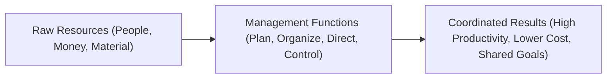
```mermaid
flowchart LR
    A["Raw Resources (People, Money, Material)"] --> B["Management Functions (Plan, Organize, Direct, Control)"]
    B --> C["Coordinated Results (High Productivity, Lower Cost, Shared Goals)"]
```

### 2. Technical Mechanism & Definitions
In management literature, classical scholars describe management from different angles:

1. **Mary Parker Follett:**  
   > *"Management is the art of getting things done through other people."*  
   *Core focus:* Human relations and delegation.
2. **Henri Fayol (Administrative View):**  
   > *"To manage is to forecast and to plan, to organise, to command, to co-ordinate and to control."*  
   *Core focus:* The 5 continuous functional tasks of an administrator.
3. **James L. Lundy:**  
   > *"Management is principally the task of planning, coordinating, motivating and controlling the efforts of others towards a specific objective."*  
   *Core focus:* Goal-directed motivation and control.
4. **Peter F. Drucker:**  
   > *"Management is a multi-purpose organ that manages a business and manages managers and manages worker and work."*  
   *Core focus:* Managing three distinct dimensions—business operations, leadership tiers, and day-to-day work execution.

### 3. Visual Anchors

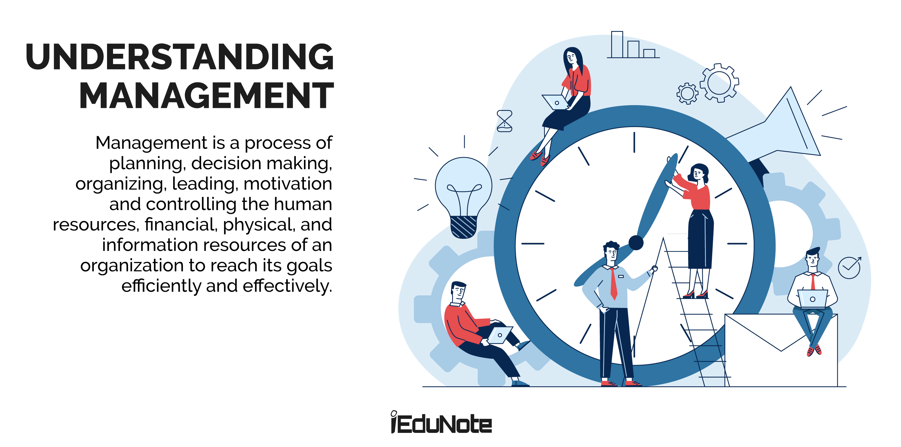

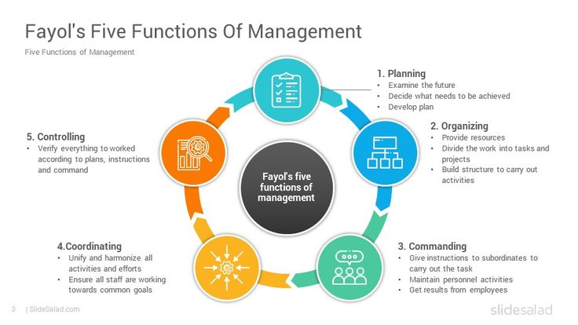

### 4. Summary: The 5 Core Functions of Management
| Function | What the Manager Does | Objective |
|:---|:---|:---|
| **Planning** | Looks ahead, sets targets, and chooses the best course of action. | Reduces uncertainty. |
| **Organizing** | Gathers resources, assigns tasks, and builds department structures. | Prevents role confusion. |
| **Staffing / Commanding** | Recruits, trains, and instructs team members on their duties. | Puts the right people in place. |
| **Coordinating** | Harmonizes different departments and ensures goal alignment. | Eliminates friction between teams. |
| **Controlling** | Measures actual performance against plans and takes corrective steps. | Keeps work on schedule. |

---

## 2. Universal Characteristics of Management

### 1. The Problem & Intuition
Is management just common sense, or is it a distinct discipline? An organization needs to know whether management rules change randomly or if stable, reliable patterns govern all group activities.

### 2. Technical Mechanism & Characteristics
The lecture identifies 10 universal features that define modern management:

1. **Goal-Oriented:** Every managerial action is purposeful. It exists only to achieve pre-determined objectives (e.g., growing retail market share by 15%).
2. **Universal Activity:** Management is needed everywhere—in business, government, education, hospitals, and the military across the globe.
3. **Continuous Process:** Management is not a one-time event. It is an ongoing cycle of planning, executing, reviewing, and adjusting.
4. **Dynamic (Not Static):** Management principles are not rigid dogmas. They must adapt to changing markets, consumer habits, and new technologies.
5. **Interdisciplinary:** It integrates concepts from economics, sociology, psychology, engineering, and mathematics.
6. **A Distinct Profession:** It relies on systematic knowledge, formal training, ethical conduct, and professional certifications (e.g., PMP, CPA).
7. **System of Authority:** Management creates rules, procedures, and an official chain of command where leaders have the authority to direct work.
8. **Centers on Decision-Making:** Choosing the right alternative under uncertainty determines whether a company succeeds or fails.
9. **Implies Good Leadership:** Strong managers influence and motivate people to achieve goals willingly rather than by mere force.
10. **Intangible:** Management cannot be touched or seen directly. You observe it through order, high team morale, productivity, and profitability.

### 3. Visual Anchors

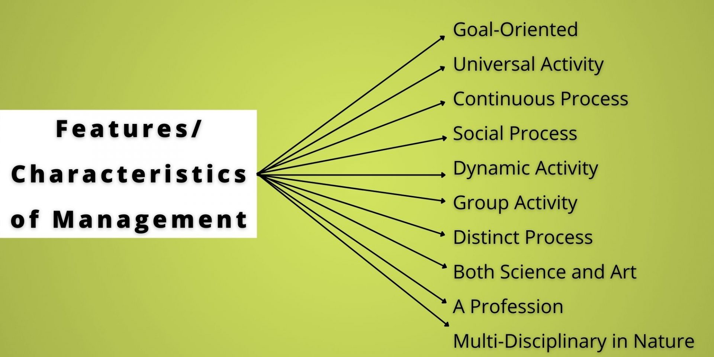

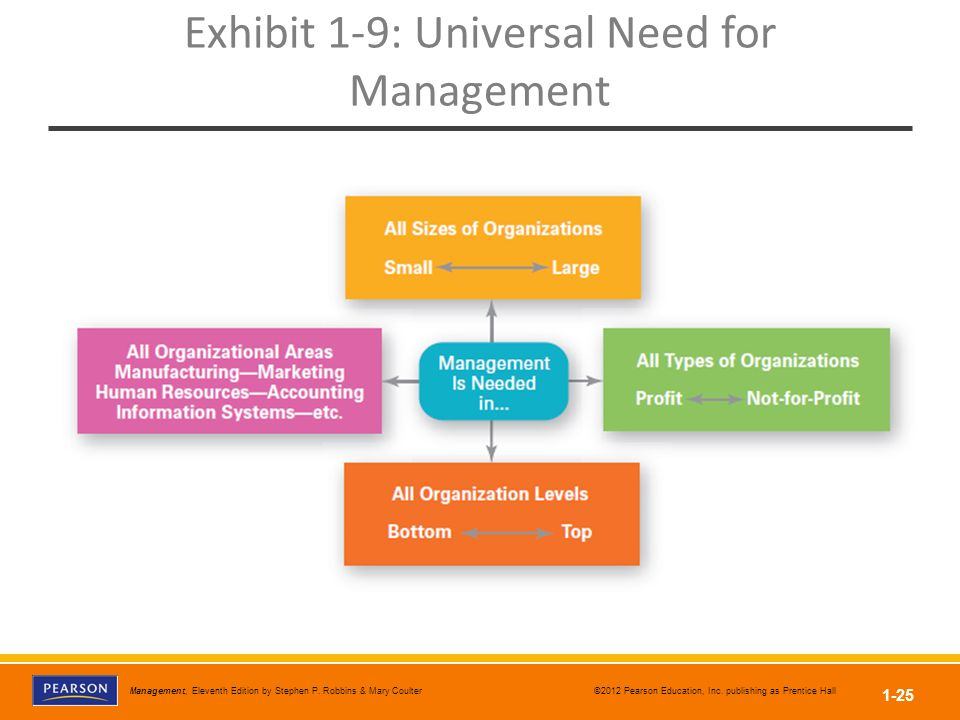

---

## 3. Management as Both Science and Art

### 1. The Problem & Intuition
Can you run an organization purely with math and data? Or do you run it entirely by gut instinct and charisma? Relying only on numbers ignores human emotion, while relying only on gut feeling leads to chaotic mistakes.

### 2. Technical Mechanism: The Dual Nature

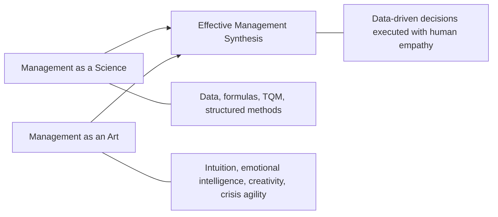
```mermaid
flowchart LR
    A["Management as a Science"] --> C["Effective Management Synthesis"]
    B["Management as an Art"] --> C
    A --- D["Data, formulas, TQM, structured methods"]
    B --- E["Intuition, emotional intelligence, creativity, crisis agility"]
    C --- F["Data-driven decisions executed with human empathy"]
```

- **Management as a Science:**  
  Management uses organized knowledge, verifiable theories, statistical tools, and cause-and-effect principles.  
  *Slide Example:* Implementing **Total Quality Management (TQM)** using statistical process control and standard quality metrics.
- **Management as an Art:**  
  Management requires personal talent, practical judgment, creativity, and communication skills to handle unpredictable human problems.  
  *Slide Example:* Navigating an unexpected **supply chain breakdown** by thinking outside the box, negotiating with alternative suppliers, and calming worried employees.
- **The Synthesis:**  
  Professional managers use scientific analytics to make sound plans, and artistic leadership to motivate people to carry them out.

### 3. Visual Anchor

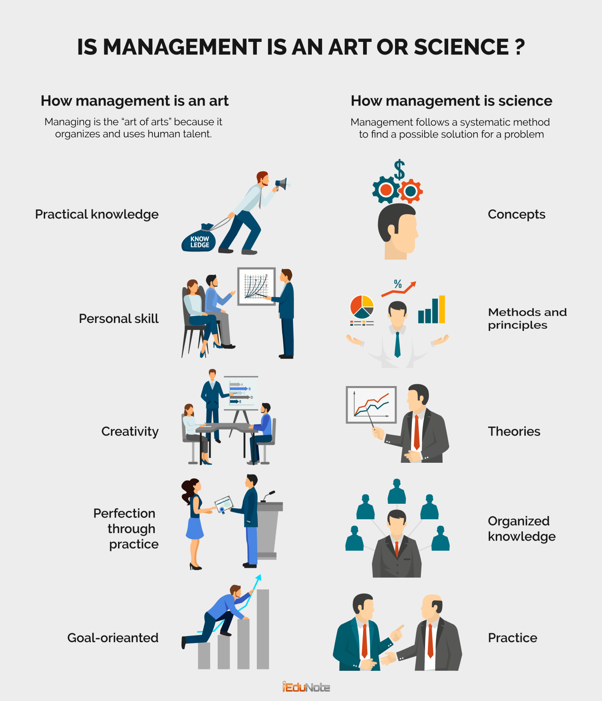

---

## 4. The Three Levels of Management & Authority Flow

### 1. The Problem & Intuition
If every employee reported directly to the CEO, the CEO would drown in minor daily issues. Conversely, if no one held authority, workers would lack direction. Organizations solve this by creating vertical hierarchy.

### 2. Technical Mechanism & Roles

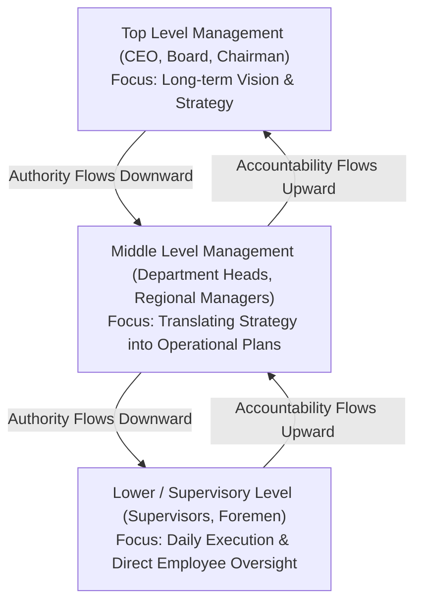
```mermaid
flowchart TD
    Top["Top Level Management (CEO, Board, Chairman)<br>Focus: Long-term Vision & Strategy"]
    Mid["Middle Level Management (Department Heads, Regional Managers)<br>Focus: Translating Strategy into Operational Plans"]
    Low["Lower / Supervisory Level (Supervisors, Foremen)<br>Focus: Daily Execution & Direct Employee Oversight"]

    Top -->|"Authority Flows Downward"| Mid
    Mid -->|"Authority Flows Downward"| Low
    Low -->|"Accountability Flows Upward"| Mid
    Mid -->|"Accountability Flows Upward"| Top
```

1. **Top-Level Management (Strategic Tier):**
   - *Key Titles:* Chief Executive Officer (CEO), Board of Directors, Managing Director, Chairman, President.
   - *Core Responsibilities:* Formulates company-wide policies, sets long-term goals, represents the firm to investors and external stakeholders.
2. **Middle-Level Management (Tactical Tier):**
   - *Key Titles:* Regional Managers, Department Heads (Marketing Manager, Finance Manager, Purchase Manager).
   - *Core Responsibilities:* Translates top-level strategies into actionable plans, coordinates inter-departmental workflows, and guides supervisors.
3. **Lower-Level / Supervisory Management (Operational Tier):**
   - *Key Titles:* Foremen, Supervisors, Section Officers, Team Leads.
   - *Core Responsibilities:* Manages day-to-day shop-floor work, assigns individual tasks, gives direct feedback to workers, and reports results upward.

### 3. Directional Law of Management
- **Authority flows downward:** Power to direct and make decisions travels from Top $\to$ Middle $\to$ Lower tiers.
- **Accountability flows upward:** Responsibility to report results and answer for outcomes travels from Lower $\to$ Middle $\to$ Top tiers.

### 4. Visual Anchors

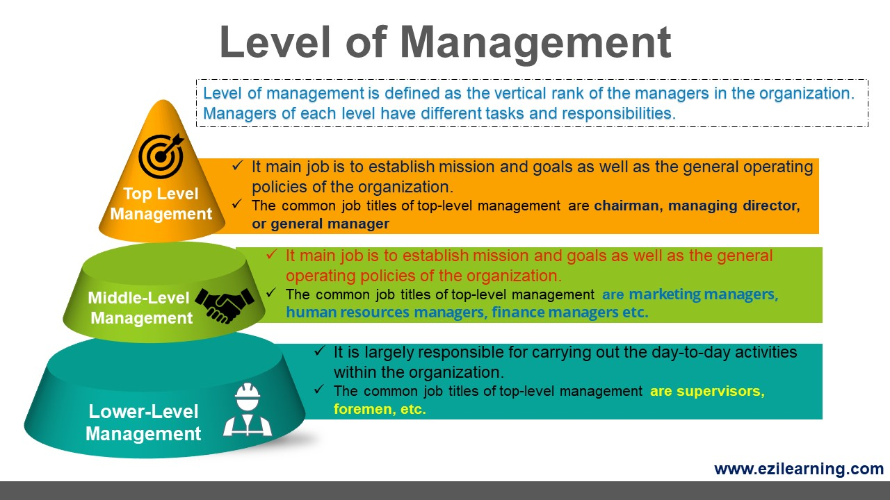

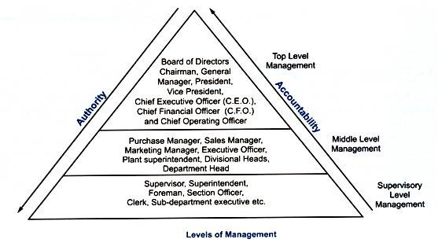

---

## 5. Scope & Functional Areas of Management

### 1. The Problem & Intuition
A business must perform many specialized activities—managing money, making products, hiring people, and selling goods. Management groups these tasks into distinct functional departments so each operates efficiently.

### 2. Functional Domains
The source slides outline 8 key functional areas:

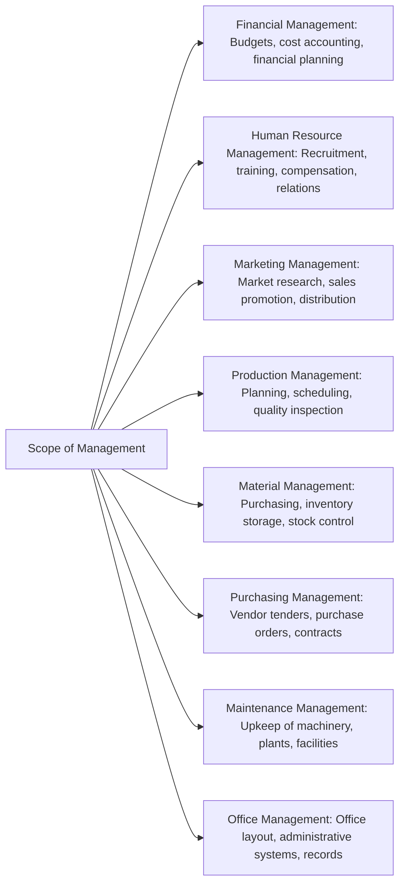
```mermaid
flowchart LR
    MGT["Scope of Management"]
    MGT --> F1["Financial Management: Budgets, cost accounting, financial planning"]
    MGT --> F2["Human Resource Management: Recruitment, training, compensation, relations"]
    MGT --> F3["Marketing Management: Market research, sales promotion, distribution"]
    MGT --> F4["Production Management: Planning, scheduling, quality inspection"]
    MGT --> F5["Material Management: Purchasing, inventory storage, stock control"]
    MGT --> F6["Purchasing Management: Vendor tenders, purchase orders, contracts"]
    MGT --> F7["Maintenance Management: Upkeep of machinery, plants, facilities"]
    MGT --> F8["Office Management: Office layout, administrative systems, records"]
```

- **Need & Importance:** Management ensures optimal use of scarce resources, lowers production costs, builds organizational stability, supports national economic growth, and fosters healthy labor relations.

---

## 6. Henri Fayol's 14 Principles of Management

### 1. The Problem & Intuition
During early industrialization, factories suffered from disorder, conflicting orders, and unfair labor practices. Henri Fayol formulated 14 universal principles of **Administrative Management Theory** to give organizations clear operating guidelines.

### 2. Technical Mechanism: The 14 Principles

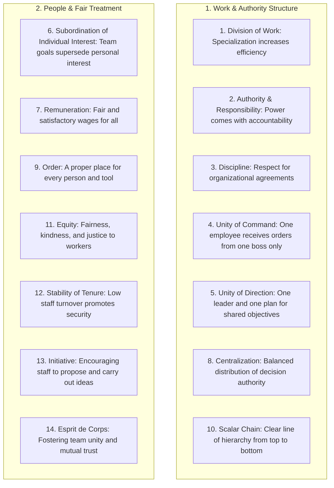
```mermaid
flowchart TD
    subgraph Structure ["1. Work & Authority Structure"]
        P1["1. Division of Work: Specialization increases efficiency"]
        P2["2. Authority & Responsibility: Power comes with accountability"]
        P3["3. Discipline: Respect for organizational agreements"]
        P4["4. Unity of Command: One employee receives orders from one boss only"]
        P5["5. Unity of Direction: One leader and one plan for shared objectives"]
        P8["8. Centralization: Balanced distribution of decision authority"]
        P10["10. Scalar Chain: Clear line of hierarchy from top to bottom"]
    end
    subgraph Human ["2. People & Fair Treatment"]
        P6["6. Subordination of Individual Interest: Team goals supersede personal interest"]
        P7["7. Remuneration: Fair and satisfactory wages for all"]
        P9["9. Order: A proper place for every person and tool"]
        P11["11. Equity: Fairness, kindness, and justice to workers"]
        P12["12. Stability of Tenure: Low staff turnover promotes security"]
        P13["13. Initiative: Encouraging staff to propose and carry out ideas"]
        P14["14. Esprit de Corps: Fostering team unity and mutual trust"]
    end
```

1. **Division of Work:** Specializing workers in specific tasks increases speed and output quality.
2. **Authority and Responsibility:** Managers must have the authority to issue orders, but they remain strictly responsible for outcomes.
3. **Discipline:** Workers and managers must obey clear company rules and work agreements.
4. **Unity of Command:** An employee must receive orders from **one direct supervisor only** to prevent conflicting instructions.
5. **Unity of Direction:** Operations with the same objective must be directed by one manager using one single plan.
6. **Subordination of Individual Interest:** The organization’s overall goals always take precedence over any individual employee's personal interests.
7. **Remuneration of Personnel:** Wages and compensation must be fair, rewarding, and satisfactory to both employer and employee.
8. **Centralization:** Organizations should find the right balance between central decision-making and delegating authority to subordinates.
9. **Scalar Chain:** A clear, unbroken chain of authority runs from top to bottom (with a direct "gang-plank" shortcut permitted during urgent operational needs).
10. **Order:** Social and physical order—the right person and right tool in the right place at the right time.
11. **Equity:** Managers must treat subordinates with kindness, fairness, and impartiality.
12. **Stability of Tenure of Personnel:** High turnover hurts organizational performance. Employees need reasonable job security to become proficient.
13. **Initiative:** Subordinates should be given freedom to propose, plan, and carry out ideas, boosting enthusiasm.
14. **Esprit de Corps:** Management must build team harmony, unity, and mutual respect rather than dividing people.

### 3. Visual Anchor

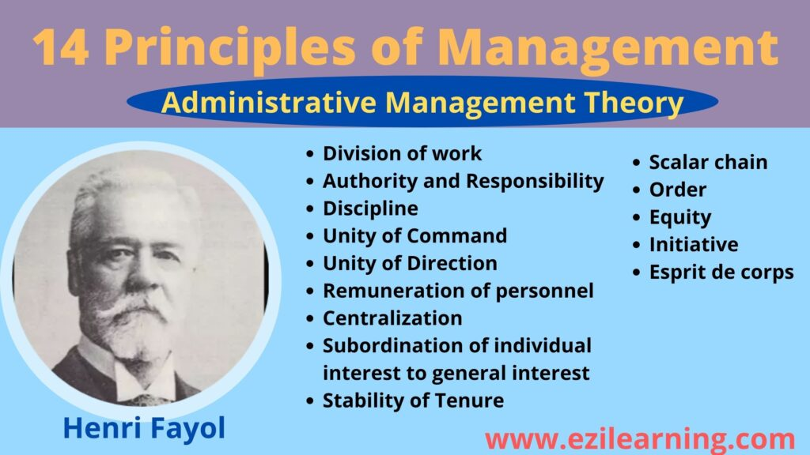

---

## 7. Real-World Case Studies in Management Practice

The course presentations highlight 4 real-world organizational case studies:

1. **Google’s Project Aristotle (Psychological Safety):**
   - *Research Finding:* High-performing teams were not those with the smartest individual star performers.
   - *Key Takeaway:* Teams succeeded most when members felt **psychological safety**—feeling safe to voice ideas, take risks, and be vulnerable without fear of ridicule.
2. **Southwest Airlines (Employee Empowerment):**
   - *Approach:* "Hire for attitude, train for skills."
   - *Key Takeaway:* Frontline workers are given autonomy to make decisions on the spot to delight customers, resulting in high morale and strong operational loyalty.
3. **Toyota Production System / TPS (Lean Continuous Improvement):**
   - *Approach:* Continuous incremental improvement (*Kaizen*) by involving every factory-floor worker in identifying defects and proposing fixes.
   - *Key Takeaway:* Management succeeds when it taps into the collective problem-solving power of the entire team.
4. **Dynamic Tech Startup Management:**
   - *Approach:* Navigating sudden technology shifts by blending **scientific processes** (Agile sprints, data metrics) with **artistic agility** (creative problem solving, visionary leadership).

---

# Part 2: Management Styles & Leadership Theories

## 8. Leadership vs. Management: The Crucial Difference

### 1. The Problem & Intuition
Are "manager" and "leader" the exact same role? You can be an exceptional manager who keeps systems running smoothly while failing to inspire people, or a charismatic leader who inspires people but struggles with operational planning.

### 2. Technical Comparison

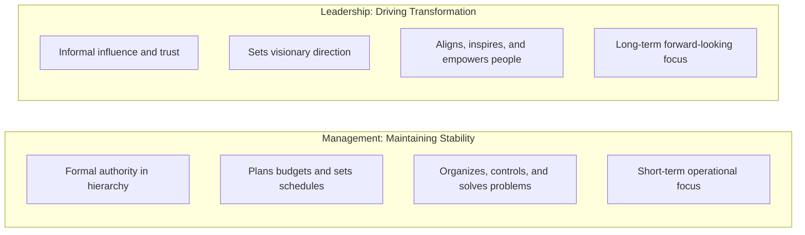
```mermaid
flowchart LR
    subgraph Management ["Management: Maintaining Stability"]
        M1["Formal authority in hierarchy"]
        M2["Plans budgets and sets schedules"]
        M3["Organizes, controls, and solves problems"]
        M4["Short-term operational focus"]
    end
    subgraph Leadership ["Leadership: Driving Transformation"]
        L1["Informal influence and trust"]
        L2["Sets visionary direction"]
        L3["Aligns, inspires, and empowers people"]
        L4["Long-term forward-looking focus"]
    end
```

| Dimension | Management | Leadership |
|:---|:---|:---|
| **Primary Goal** | Brings order, consistency, and efficiency to existing systems. | Sets a new vision and spearheads change. |
| **Source of Power** | Formal authority derived from title and hierarchy. | Personal influence, trust, and interpersonal respect. |
| **Focus of Effort** | Process execution, resource allocation, and task tracking. | People motivation, values, and organizational alignment. |
| **Response to Change** | Reactive; preserves stability within established standards. | Proactive; acts as a catalyst for innovation and disruption. |
| **Time Horizon** | Short-term (day-to-day, quarterly milestones). | Long-term (strategic vision and organizational future). |

---

## 9. The Three Classical Management Styles

### 1. The Problem & Intuition
How much say should team members have when decisions are made? A manager's style defines how power and decision-making are shared.

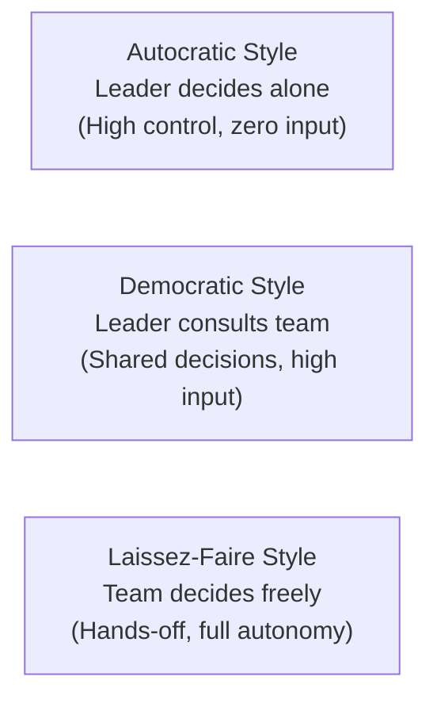
```mermaid
flowchart LR
    Auto["Autocratic Style<br>Leader decides alone<br>(High control, zero input)"]
    Demo["Democratic Style<br>Leader consults team<br>(Shared decisions, high input)"]
    Laissez["Laissez-Faire Style<br>Team decides freely<br>(Hands-off, full autonomy)"]
```

### 2. Characteristics & Application Scenarios

1. **Autocratic Management (Authoritarian / Directive):**
   - *Mechanism:* Decision-making is centralized in the manager alone. Communication flows strictly top-down. Subordinates receive precise orders without input.
   - *Best Used:* In emergencies, crisis turnarounds, tight deadlines, or with unskilled workers requiring close direction.
   - *Drawback:* Stifles creativity, reduces morale, and creates employee dependence on the boss.
2. **Democratic Management (Participative / Inclusive):**
   - *Mechanism:* Decision-making is shared. The leader solicits feedback and ideas from team members before making the final call.
   - *Best Used:* For complex engineering projects, software teams, and knowledge workers where creative input improves the final decision.
   - *Drawback:* Decision-making takes longer due to discussions and consensus building.
3. **Laissez-Faire Management (Hands-Off / Delegative):**
   - *Mechanism:* Leaders provide resources and high-level goals, but offer minimal day-to-day oversight. Team members have full autonomy to plan and execute.
   - *Best Used:* With highly skilled, disciplined experts, specialized designers, or R&D scientists who thrive on autonomy.
   - *Drawback:* If team members lack experience or discipline, projects can drift without coordination or clear direction.

---

## 10. Trait Theories of Leadership & Charisma

### 1. The Problem & Intuition
Are leaders born or made? Early 20th-century researchers attempted to isolate specific biological, psychological, or intellectual traits that separate leaders from non-leaders.

### 2. Technical Mechanism & The Charisma Trait
- **Core Premise:** Individuals with certain personal qualities (intelligence, height, extraversion, charisma) naturally emerge as leaders.
- **Charismatic Leadership Traits:**
  - Visionary outlook
  - Unshakable self-confidence
  - Persuasive, expressive communication
  - Personal warmth and empathy
- *Slide Example:* **Steve Jobs** used magnetic charisma and an inspiring vision to rally Apple engineers toward groundbreaking products.
- **Critical Limitation of Trait Theory:**  
  Trait theory oversimplifies reality. It ignores situational context, team dynamics, and follower needs. Having charismatic traits does not guarantee effective leadership in every situation.

---

## 11. Behavioral Theories: Ohio State & Michigan Studies

### 1. The Problem & Intuition
Because trait theories failed to identify a single universal "leader personality," researchers shifted focus from *who leaders are* to *what leaders actually do*. This proved that leadership behaviors can be taught and developed.

### 2. The Two Seminal Behavioral Studies

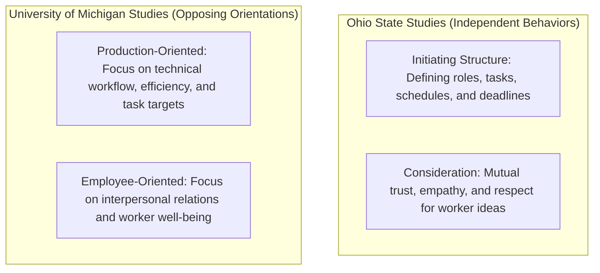
```mermaid
flowchart TD
    subgraph Ohio ["Ohio State Studies (Independent Behaviors)"]
        OS1["Initiating Structure: Defining roles, tasks, schedules, and deadlines"]
        OS2["Consideration: Mutual trust, empathy, and respect for worker ideas"]
    end
    subgraph Michigan ["University of Michigan Studies (Opposing Orientations)"]
        UM1["Production-Oriented: Focus on technical workflow, efficiency, and task targets"]
        UM2["Employee-Oriented: Focus on interpersonal relations and worker well-being"]
    end
```

1. **Ohio State Studies (Two Independent Dimensions):**
   - **Initiating Structure (Task Dimension):** The extent to which a leader defines and organizes roles, sets deadlines, gives detailed directions, and enforces standard procedures.
   - **Consideration (People Dimension):** The extent to which a leader fosters mutual trust, respects subordinates' feelings, and creates an approachable, warm environment.
   - *Key Finding:* These two dimensions are independent. A manager can be high on both, low on both, or high on one and low on the other.
2. **University of Michigan Studies (Two Behavioral Orientations):**
   - **Employee-Oriented Leader:** Prioritizes human relations, individual worker needs, and team cohesion.
   - **Production-Oriented Leader:** Focuses strictly on the technical and task aspects of the job, treating workers primarily as instruments to meet production targets.

---

## 12. The Blake-Mouton Managerial Grid

### 1. The Problem & Intuition
Robert Blake and Jane Mouton (1960s) developed a graphic framework to help managers evaluate how they balance two often-competing priorities: completing work versus supporting people.

### 2. Technical Mechanism: The $9 \times 9$ Matrix
The grid maps leader behavior across 2 axes on a 1-to-9 rating scale, creating **81 potential leadership styles**:
- **Horizontal Axis ($X$):** *Concern for Production* (1 = Low, 9 = High)
- **Vertical Axis ($Y$):** *Concern for People* (1 = Low, 9 = High)

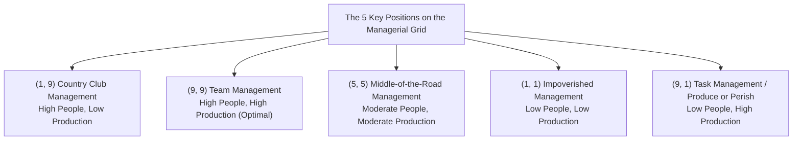
```mermaid
flowchart TD
    Grid["The 5 Key Positions on the Managerial Grid"]
    Grid --> P19["(1, 9) Country Club Management<br>High People, Low Production"]
    Grid --> P99["(9, 9) Team Management<br>High People, High Production (Optimal)"]
    Grid --> P55["(5, 5) Middle-of-the-Road Management<br>Moderate People, Moderate Production"]
    Grid --> P11["(1, 1) Impoverished Management<br>Low People, Low Production"]
    Grid --> P91["(9, 1) Task Management / Produce or Perish<br>Low People, High Production"]
```

### 3. Detailed Profile of the 5 Anchor Styles
1. **Impoverished Management $(1, 1)$:**
   - *Profile:* Minimal effort across both people and production.
   - *Outcome:* The leader is essentially checked out, resulting in low employee morale and poor productivity.
2. **Task Management / Produce-or-Perish $(9, 1)$:**
   - *Profile:* Dictatorial style with maximum focus on production and minimum concern for human needs.
   - *Outcome:* High short-term output, but breeds burnout, resentment, and high turnover.
3. **Country Club Management $(1, 9)$:**
   - *Profile:* High attention to employee comfort and friendly relations, but low focus on production.
   - *Outcome:* A relaxed, friendly environment where production targets and deadlines suffer.
4. **Middle-of-the-Road Management $(5, 5)$:**
   - *Profile:* Balances operational goals against people's needs through compromise.
   - *Outcome:* Adequate but unremarkable performance. Does not push boundaries for excellence.
5. **Team Management $(9, 9)$ — The Most Effective Style:**
   - *Profile:* High concern for both people and production. Grounded in **Douglas McGregor's Theory Y** (the belief that workers are naturally motivated and take pride in their work).
   - *Outcome:* Trust, empowerment, and mutual commitment yield peak employee satisfaction and high productivity.

### 4. Visual Anchor

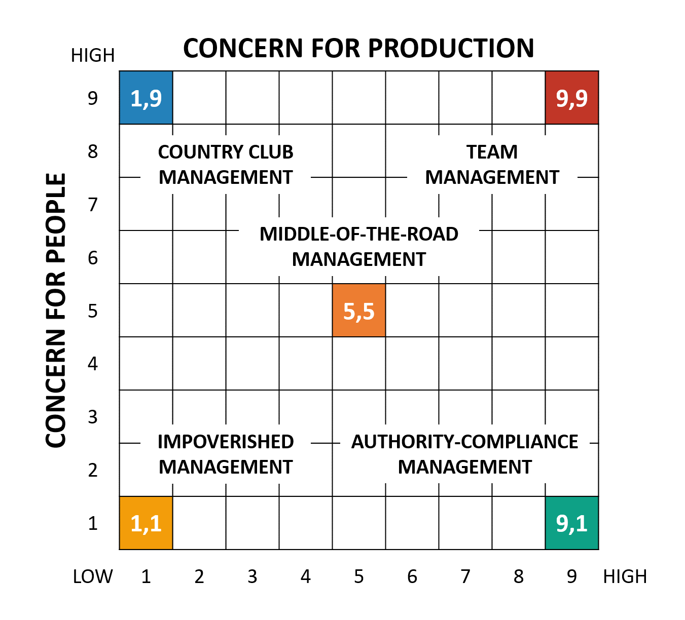

---

## 13. Situational Leadership Theory (Hersey & Blanchard)

### 1. The Problem & Intuition
No single leadership style works on every employee. Giving detailed instructions to a 10-year veteran feels insulting (micromanagement), while giving complete autonomy to a brand-new hire creates anxiety and mistakes. Paul Hersey and Ken Blanchard realized that **leadership must adapt to the follower’s readiness level**.

### 2. Follower Readiness ($R$)
Readiness is defined as the extent to which followers have the **Ability** (skills, knowledge) and **Willingness** (confidence, motivation) to accomplish a specific task.

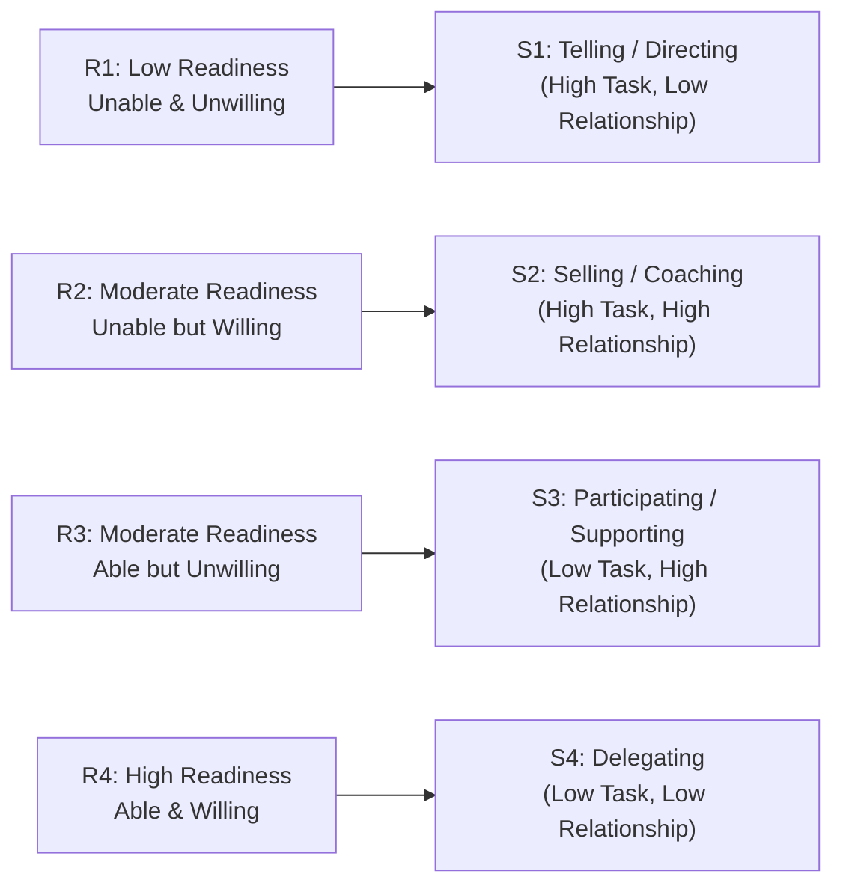
```mermaid
flowchart LR
    R1["R1: Low Readiness<br>Unable & Unwilling"] --> S1["S1: Telling / Directing<br>(High Task, Low Relationship)"]
    R2["R2: Moderate Readiness<br>Unable but Willing"] --> S2["S2: Selling / Coaching<br>(High Task, High Relationship)"]
    R3["R3: Moderate Readiness<br>Able but Unwilling"] --> S3["S3: Participating / Supporting<br>(Low Task, High Relationship)"]
    R4["R4: High Readiness<br>Able & Willing"] --> S4["S4: Delegating<br>(Low Task, Low Relationship)"]
```

### 3. The 4 Contingent Leadership Behaviors
1. **Telling / Directing ($S1$ — High Task, Low Relationship):**
   - *Target:* Followers are **Unable and Unwilling** ($R1$).
   - *Leader Action:* Gives specific, step-by-step instructions and closely monitors task completion.
2. **Selling / Coaching ($S2$ — High Task, High Relationship):**
   - *Target:* Followers are **Unable but Willing** ($R2$, motivated but lacking skills).
   - *Leader Action:* Explains decisions, provides structured task guidance, and uses supportive communication to build skills and buy-in.
3. **Participating / Supporting ($S3$ — Low Task, High Relationship):**
   - *Target:* Followers are **Able but Unwilling / Insecure** ($R3$, skilled but lacking confidence or motivation).
   - *Leader Action:* Acts as a facilitator. Involves the follower in decision-making and offers praise and support to restore enthusiasm.
4. **Delegating ($S4$ — Low Task, Low Relationship):**
   - *Target:* Followers are **Able and Willing** ($R4$, skilled and self-motivated).
   - *Leader Action:* Steps back, turning over day-to-day decisions and execution to the capable team.

### 4. Visual Anchor

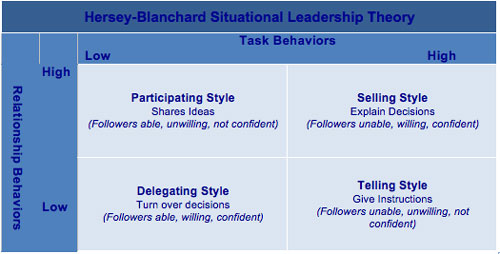

---

## 14. Contingency & Relational Theories: Path-Goal & LMX

### 1. Path-Goal Theory (Robert House)
- **Core Concept:** A leader’s job is to assist followers in reaching their personal and professional goals, clearing obstacles along their path, and ensuring these goals support organizational objectives.
- **Mechanism:** The leader provides the specific direction, resources, and emotional support followers need to see a direct link between effort, performance, and rewarding outcomes.

### 2. Leader-Member Exchange (LMX) Theory
- **The Core Reality:** Leaders do not treat every subordinate identically. Instead, they form distinct, individualized one-on-one relationships (*dyadic exchanges*) with different team members.

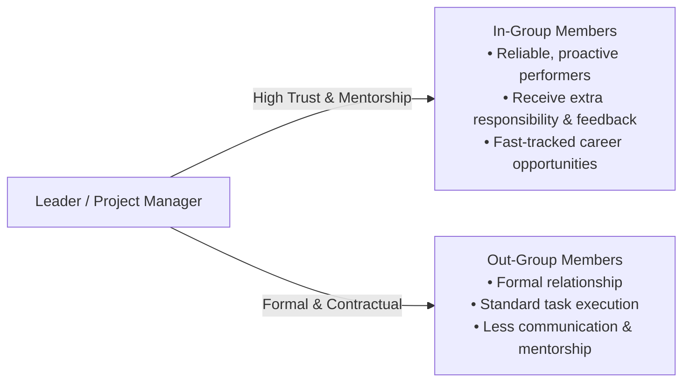
```mermaid
flowchart LR
    Leader["Leader / Project Manager"]
    Leader -->|"High Trust & Mentorship"| In["In-Group Members<br>• Reliable, proactive performers<br>• Receive extra responsibility & feedback<br>• Fast-tracked career opportunities"]
    Leader -->|"Formal & Contractual"| Out["Out-Group Members<br>• Formal relationship<br>• Standard task execution<br>• Less communication & mentorship"]
```

- **In-Group:** Members who consistently deliver high quality, take initiative, and demonstrate loyalty earn the leader’s trust. They receive greater autonomy, open communication, and career mentoring.
- **Out-Group:** Members who perform strictly to rule or struggle with deadlines receive a formal, contractual relationship with standard supervision and fewer developmental opportunities.

---

## 15. Transactional vs. Transformational Leadership

### 1. The Problem & Intuition
Some managers motivate employees through routine agreements: "Do this job, and you will get this bonus." Other leaders inspire employees to believe in a higher mission and achieve outcomes they never thought possible.

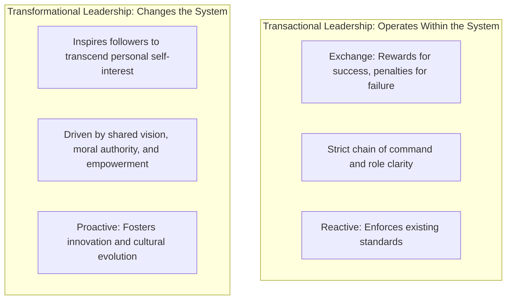
```mermaid
flowchart TD
    subgraph Transactional ["Transactional Leadership: Operates Within the System"]
        T1["Exchange: Rewards for success, penalties for failure"]
        T2["Strict chain of command and role clarity"]
        T3["Reactive: Enforces existing standards"]
    end
    subgraph Transformational ["Transformational Leadership: Changes the System"]
        TR1["Inspires followers to transcend personal self-interest"]
        TR2["Driven by shared vision, moral authority, and empowerment"]
        TR3["Proactive: Fosters innovation and cultural evolution"]
    end
```

### 2. The 4 I's of Transformational Leadership
Transformational leaders create lasting change through four behavioral dimensions:

1. **Idealized Influence (Role Model):** The leader demonstrates high moral standards, walks the talk, and earns deep trust and respect.
2. **Inspirational Motivation (Inspiring Vision):** The leader articulates an appealing, optimistic future vision that energizes the team.
3. **Individualized Consideration (Personal Mentoring):** The leader acts as a supportive coach, listening to each follower’s personal needs and helping them grow.
4. **Intellectual Stimulation (Encouraging Innovation):** The leader challenges old assumptions and empowers employees to rethink problems creatively.

*Historical Case Study:* **Mahatma Gandhi** inspired millions of ordinary citizens to look beyond individual self-interest and unite behind nonviolent civil disobedience, transforming Indian society and securing independence in 1947.

### 3. Visual Anchors

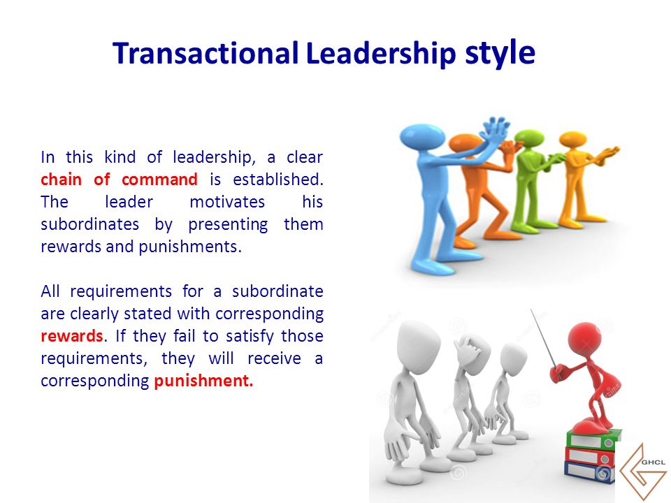

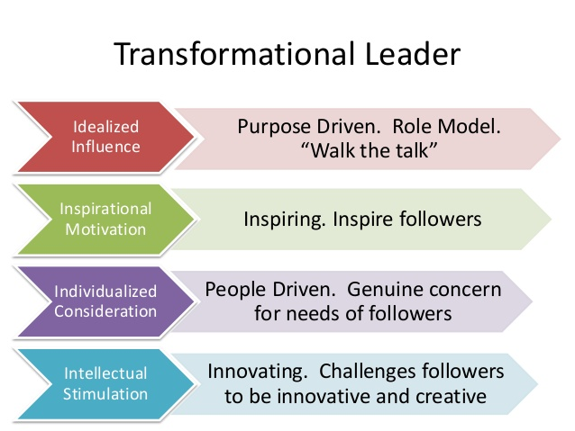

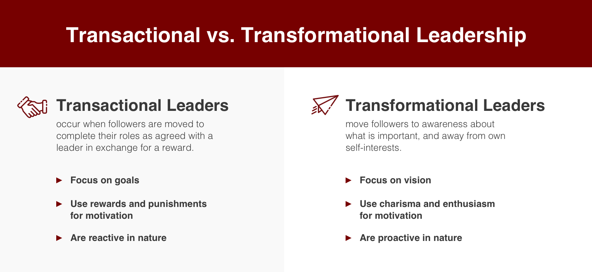

### 4. Direct Comparison Matrix
| Dimension | Transactional Leadership | Transformational Leadership |
|:---|:---|:---|
| **Underlying Approach** | Works *within* existing systems. | Works to *change* and evolve systems. |
| **Primary Motivation** | Extrinsic exchange (salary, bonuses, penalties). | Intrinsic motivation (shared values, purpose, growth). |
| **Problem-Solving** | Follows established procedures: *"Where is the manual?"* | Re-evaluates procedures: *"What needs to change?"* |
| **Organizational Impact** | Minimizes performance variation; sustains standards. | Maximizes team potential; delivers breakthrough innovation. |
| **Nature of Action** | Reactive; corrects errors as they occur. | Proactive; anticipates opportunities and leads change. |
