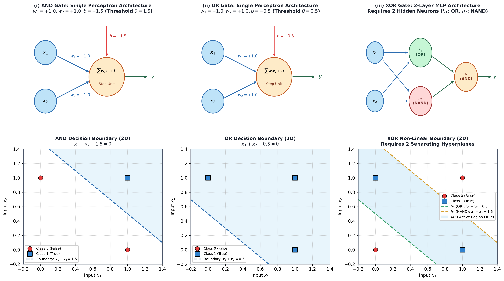
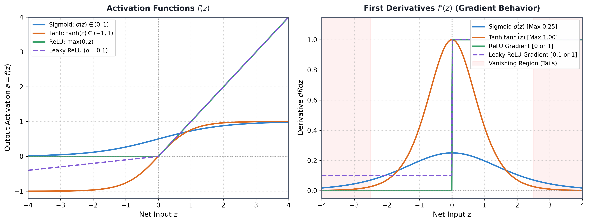
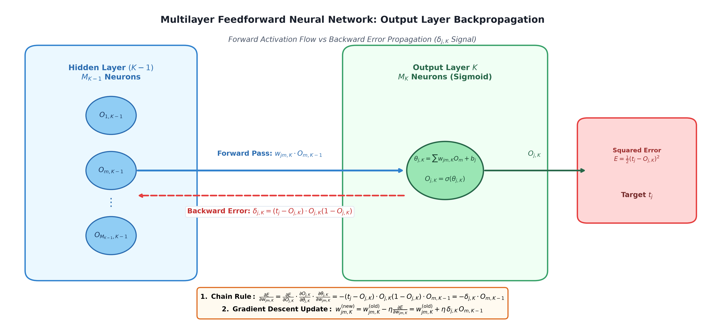
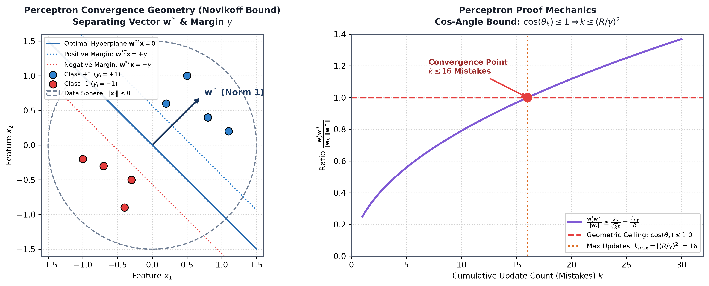
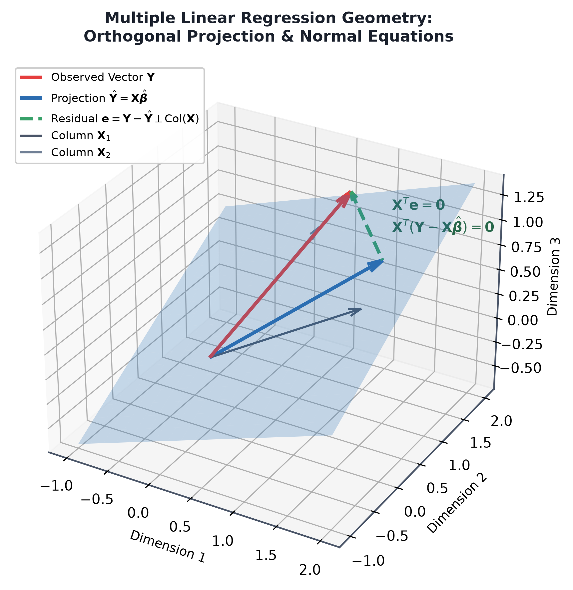

# Machine Learning — PYQ Master Solutions Manual (2023–2025)

> **Academic Context:** B.Tech / M.Tech Computer Science & Engineering | **Subject:** Machine Learning  
> **Source Mode:** **Strict Notes-Bound Mode** (Strictly grounded in authorized reference notes: `ml_foundations_regression_classification_visual_guide.md`, `activation_crossentropy_backprop_visual_guide.md`, and `neural_networks_visual_guide.md`)  
> **Verification Status:** All mathematical derivations, loss gradients, contingency metrics, and neural forward/backward passes independently audited with Python scratch engines; all figures verified for high-DPI rendering (zero ASCII / zero raw Mermaid).

---

## Contents

- [Multi-Year Frequency & Recurrence Matrix](#multi-year-frequency--recurrence-matrix)
- [Comprehensive Question Audit Matrix](#comprehensive-question-audit-matrix)
- [2025 Mid-Semester Examination Solutions](#2025-mid-semester-examination-solutions)
- [2025 End-Semester Examination Solutions](#2025-end-semester-examination-solutions)
- [2024 Mid-Semester Examination Solutions](#2024-mid-semester-examination-solutions)
- [2024 Final-Semester Examination Solutions](#2024-final-semester-examination-solutions)
- [2023 Mid-Semester Examination Solutions](#2023-mid-semester-examination-solutions)
- [2023 End-Semester Examination Solutions](#2023-end-semester-examination-solutions)
- [Comprehensive Quick-Recall Formula Sheet](#comprehensive-quick-recall-formula-sheet)
- [Viva Voce & Oral Defense Preparation](#viva-voce--oral-defense-preparation)
- [Unanswered / Uncovered Questions (Not in Reference Notes)](#unanswered--uncovered-questions-not-in-reference-notes)

---

## Multi-Year Frequency & Recurrence Matrix

Analysis of examination recurrence across 2023, 2024, and 2025 for topics covered in the authorized reference guides:

| Core Concept / Topic | Frequency Rating | Exam Appearances | Typical Weight | Priority Strategy |
|:---|:---:|:---|:---:|:---|
| **Activation Functions (ReLU, Sigmoid, Tanh, Leaky ReLU)** | ★★★★★ (100% in all years) | 2025 Mid (Q1, Q3b, Q3c), 2025 End (Q3a), 2024 Final (Q3a, Q3b), 2023 End (Q3a) | 3M – 10M | **Must-Master Core Topic** |
| **Why Linear Reg & MSE Fail for Classification** | ★★★★★ (Guaranteed) | 2025 Mid (Q2a), 2023 Mid (Q3a), 2023 End (Q1a, Q2c) | 2M – 5M | **High-Probability Direct Question** |
| **Cross-Entropy vs MSE / Quadratic Loss** | ★★★★★ (Guaranteed) | 2025 Mid (Q4a), 2024 Final (Q2b) | 3M – 5.5M | **Derivation of Derivative Cancellation** |
| **Backpropagation Weight Update Derivation** | ★★★★☆ (High recurrence) | 2025 End (Q4a), 2024 Final (Q2a) | 6M – 7M | **High-Mark Calculus Derivation** |
| **XOR Problem & Need for Hidden Layers** | ★★★★☆ (High recurrence) | 2025 Mid (Q3a), 2024 Mid (Q3b) | 3M | **Core Diagram & Truth Table Question** |
| **L1 Lasso vs L2 Ridge Regularization** | ★★★★☆ (High recurrence) | 2025 Mid (Q2c), 2025 End (Q2b), 2024 Mid (Q2c) | 3M – 4M | **Standard Comparison Table & Formulas** |
| **Multiclass Strategies (One-vs-All vs One-vs-One)** | ★★★☆☆ (Medium recurrence) | 2023 Mid (Q3b), 2023 End (Q1b) | 3M – 5M | **Classifier Count Formulas ($c$ vs $c(c-1)/2$)** |
| **Normal Equations / OLS Derivation** | ★★★☆☆ (Medium recurrence) | 2024 Mid (Q1a), 2024 Final (Q1a) | 4M – 5.5M | **Matrix Calculus & Normal Equations** |
| **Batch Size & Batching (BGD vs SGD vs Mini-Batch)**| ★★★☆☆ (Medium recurrence) | 2025 Mid (Q4b), 2024 Final (Q4b) | 3M – 7M | **Comparison Table & Epoch Formula** |
| **Confusion Matrix & Contingency Metrics** | ★★★☆☆ (Medium recurrence) | 2025 End (Q1d), 2023 End (Q1c) | 2M – 4M | **Guaranteed Easy Numerical Points** |

---

## Comprehensive Question Audit Matrix

| Exam Session | Q# | Concept / Question Statement | Marks | Status in Guide | Authorized Reference Link | Visual Anchor |
|:---|:---:|:---|:---:|:---:|:---|:---|
| **2025 Mid** | Q1 | 6 MCQs (Regression, Activations, Predictive Modeling, Supervised/Unsupervised, PCA) | 6M | **Fully Answered** | [[ml_foundations_regression_classification_visual_guide#2-the-taxonomy-of-learning-supervised-unsupervised-semi-supervised-and-rl|Foundations §2]] | — |
| **2025 Mid** | Q2(a) | Differentiate between Linear Regression and Logistic Regression | 2M | **Fully Answered** | [[ml_foundations_regression_classification_visual_guide#15-linear-regression-vs-logistic-regression-the-complete-comparison|Foundations §15]] | — |
| **2025 Mid** | Q2(b) | Performance evaluation of Logistic Regression (Log-Loss, Confusion Matrix, ROC-AUC) | 3M | **Fully Answered** | [[ml_foundations_regression_classification_visual_guide#10-training-logistic-regression-log-loss--gradient-descent|Foundations §10]] | — |
| **2025 Mid** | Q2(c) | Role of Regularization in Logistic Regression (Overfitting, Multicollinearity, L1/L2) | 3M | **Fully Answered** | [[ml_foundations_regression_classification_visual_guide#11-regularization-l1-lasso-l2-ridge-and-the-c-parameter|Foundations §11]] | — |
| **2025 Mid** | Q3(a) | Neural structures for AND, OR, and XOR gates | 3M | **Fully Answered** | [[neural_networks_visual_guide#3-logic-gates-with-one-neuron|Neural Networks §3 & §6]] | `pyq_fig01` |
| **2025 Mid** | Q3(b) | Comparison of Sigmoid, Tanh, and ReLU (Range, Gradients, Pros/Cons) | 3M | **Fully Answered** | [[activation_crossentropy_backprop_visual_guide#6-tanh-function|Activations §6]] | `pyq_fig02` |
| **2025 Mid** | Q3(c) | Vanishing gradient problem & how ReLU / Leaky ReLU overcome it | 2M | **Fully Answered** | [[neural_networks_visual_guide#11-problems-minima-saddles-vanishing-and-exploding-gradients|Neural Networks §11]] | — |
| **2025 Mid** | Q4(a) | Why Cross-Entropy is preferred over SSE in deep neural networks | 3M | **Fully Answered** | [[activation_crossentropy_backprop_visual_guide#7-why-squared-error-learns-slowly|Activations §7 & §8]] | Derivative Cancellation Proof |
| **2025 Mid** | Q4(b) | Compare Stochastic GD, Batch GD, and Mini-Batch GD with examples | 3M | **Fully Answered** | [[neural_networks_visual_guide#10-learning-rate-batches-and-epochs|Neural Networks §10]] | 10k Images Example |
| **2025 Mid** | Q4(c) | Working principle and advantages of Batch Normalization | 2M | **Fully Answered** | [[neural_networks_visual_guide#11-problems-minima-saddles-vanishing-and-exploding-gradients|Neural Networks §11]] | — |
| **2025 End** | Q1(a) | Supervised vs Unsupervised Learning | 2M | **Fully Answered** | [[ml_foundations_regression_classification_visual_guide#2-the-taxonomy-of-learning-supervised-unsupervised-semi-supervised-and-rl|Foundations §2]] | — |
| **2025 End** | Q1(b) | What is underfitting? Causes and symptoms | 2M | **Fully Answered** | [[ml_foundations_regression_classification_visual_guide#11-regularization-l1-lasso-l2-ridge-and-the-c-parameter|Foundations §11]] | — |
| **2025 End** | Q1(c) | Classification vs Regression | 2M | **Fully Answered** | [[ml_foundations_regression_classification_visual_guide#2-the-taxonomy-of-learning-supervised-unsupervised-semi-supervised-and-rl|Foundations §2.1]] | — |
| **2025 End** | Q1(d) | What is a confusion matrix? 2x2 layout & significance | 2M | **Fully Answered** | [[ml_foundations_regression_classification_visual_guide#15-linear-regression-vs-logistic-regression-the-complete-comparison|Foundations §15]] | — |
| **2025 End** | Q1(e) | What is a hyperparameter? vs Model parameters | 2M | **Fully Answered** | [[neural_networks_visual_guide#10-learning-rate-batches-and-epochs|Neural Networks §10]] | — |
| **2025 End** | Q2(a) | Bias, Variance, and the Bias-Variance Tradeoff | 3M | **Fully Answered** | [[ml_foundations_regression_classification_visual_guide#11-regularization-l1-lasso-l2-ridge-and-the-c-parameter|Foundations §11]] | Error Decomposition |
| **2025 End** | Q2(b) | L1 Lasso vs L2 Ridge: Formulations & effects on weights | 4M | **Fully Answered** | [[ml_foundations_regression_classification_visual_guide#11-regularization-l1-lasso-l2-ridge-and-the-c-parameter|Foundations §11]] | Sparsity vs Shrinkage |
| **2025 End** | Q3(a) | Mathematical expressions, derivatives & comparison of ReLU, Sigmoid, Tanh | 6M | **Fully Answered** | [[activation_crossentropy_backprop_visual_guide#4-sigmoid-function|Activations §4–6]] | `pyq_fig02` |
| **2025 End** | Q3(b) | Softmax activation function: Formulation, properties & cross-entropy gradient | 4M | **Fully Answered** | [[activation_crossentropy_backprop_visual_guide#9-multi-class-cross-entropy-and-softmax|Activations §9]] | — |
| **2025 End** | Q4(a) | DNN Architecture, Forward Pass & Backpropagation Algorithm | 6M | **Fully Answered** | [[neural_networks_visual_guide#12-backpropagation-derivation|Neural Networks §12]] | `pyq_fig03` |
| **2024 Mid** | Q1(a) | Ordinary Least Squares (OLS) Derivation for Simple Linear Regression | 4M | **Fully Answered** | [[ml_foundations_regression_classification_visual_guide#4-simple-linear-regression-slr--the-least-squares-derivation|Foundations §4]] | Calculus Proof |
| **2024 Mid** | Q2(c) | L1 & L2 Regularization in Logistic Regression | 4M | **Fully Answered** | [[ml_foundations_regression_classification_visual_guide#11-regularization-l1-lasso-l2-ridge-and-the-c-parameter|Foundations §11]] | Weight Decay Update |
| **2024 Mid** | Q3(a) | Biological vs Artificial Neuron Correspondence | 2M | **Fully Answered** | [[neural_networks_visual_guide#1-from-brain-to-artificial-neuron|Neural Networks §1]] | Anatomy Table |
| **2024 Mid** | Q3(b) | XOR Neural Network Architecture & Non-linear Mapping | 3M | **Fully Answered** | [[neural_networks_visual_guide#6-xor-needs-a-hidden-layer|Neural Networks §6]] | `pyq_fig01` |
| **2024 Mid** | Q3(c) | Perceptron Learning Algorithm & Novikoff Convergence Proof | 5M | **Fully Answered** | [[neural_networks_visual_guide#4-perceptron-learning-algorithm|Neural Networks §4 & §5]] | `pyq_fig04` |
| **2024 Final** | Q1(a) | Matrix Form of Multiple Linear Regression & Normal Equations Derivation | 5.5M | **Fully Answered** | [[ml_foundations_regression_classification_visual_guide#6-multiple-linear-regression-mlr--normal-equations-in-matrix-form|Foundations §6]] | `pyq_fig05` |
| **2024 Final** | Q2(a) | Backpropagation Output Layer Weight Update Derivation (SSE & Sigmoid) | 7M | **Fully Answered** | [[neural_networks_visual_guide#12-backpropagation-derivation|Neural Networks §12]] | `pyq_fig03` |
| **2024 Final** | Q2(b) | Cross-Entropy vs Quadratic Loss in Backpropagation Learning | 5.5M | **Fully Answered** | [[activation_crossentropy_backprop_visual_guide#7-why-squared-error-learns-slowly|Activations §7 & §8]] | Learning Stall Proof |
| **2024 Final** | Q3(a) | Vanishing & Exploding Gradients: Mechanisms, symptoms & solutions | 6.5M | **Fully Answered** | [[neural_networks_visual_guide#11-problems-minima-saddles-vanishing-and-exploding-gradients|Neural Networks §11]] | `pyq_fig02` |
| **2024 Final** | Q3(b) | ReLU Properties, Limitations (Dying ReLU) & Leaky ReLU Solution | 6M | **Fully Answered** | [[activation_crossentropy_backprop_visual_guide#5-relu-leaky-relu-and-sparse-gradients|Activations §5]] | — |
| **2024 Final** | Q4(b) | Batch Size, Batching Strategies (BGD vs SGD vs Mini-Batch) & Epoch Formula | 7M | **Fully Answered** | [[neural_networks_visual_guide#10-learning-rate-batches-and-epochs|Neural Networks §10]] | ImageNet Example |
| **2023 Mid** | Q1(a) | Gradient Descent Derivation for Polynomial Hypothesis $h_\theta(x)$ | 7M | **Fully Answered** | [[ml_foundations_regression_classification_visual_guide#4-simple-linear-regression-slr--the-least-squares-derivation|Foundations §4]] | Update Form Proof |
| **2023 Mid** | Q3(a) | Why Linear Regression fails for classification & Why MSE fails for Logistic | 5M | **Fully Answered** | [[ml_foundations_regression_classification_visual_guide#8-why-linear-regression-fails-for-classification|Foundations §8 & §10]] | Outlier Distortion |
| **2023 Mid** | Q3(b) | Multiclass Classification: One-vs-All vs One-vs-One ($c$ vs $c(c-1)/2$) | 5M | **Fully Answered** | [[ml_foundations_regression_classification_visual_guide#12-multiclass-classification-one-vs-rest-vs-multinomial-softmax|Foundations §12]] | Comparison Table |
| **2023 Mid** | Q4(a) | Single Neuron Forward Pass Numerical ($z = 0.45 \implies y = 0.6106$) | 3M | **Fully Answered** | [[neural_networks_visual_guide#1-from-brain-to-artificial-neuron|Neural Networks §1]] | Python Audited |
| **2023 Mid** | Q4(b) | Log-Likelihood Derivation for Biased Coin Toss (MLE $p = k/N$) | 7M | **Fully Answered** | [[ml_foundations_regression_classification_visual_guide#10-training-logistic-regression-log-loss--gradient-descent|Foundations §10.2]] | Calculus Proof |
| **2023 End** | Q1(a) | Why Linear Regression fails for classification & Why MSE fails for Logistic | 3M | **Fully Answered** | [[ml_foundations_regression_classification_visual_guide#8-why-linear-regression-fails-for-classification|Foundations §8]] | — |
| **2023 End** | Q1(b) | One-vs-All vs One-vs-One Multiclass Classification | 3M | **Fully Answered** | [[ml_foundations_regression_classification_visual_guide#12-multiclass-classification-one-vs-rest-vs-multinomial-softmax|Foundations §12]] | — |
| **2023 End** | Q1(c) | Confusion Matrix Numerical (Precision, Recall, TPR, F1 from 5 instances) | 4M | **Fully Answered** | [[ml_foundations_regression_classification_visual_guide#15-linear-regression-vs-logistic-regression-the-complete-comparison|Foundations §15]] | Python Audited |
| **2023 End** | Q2(c) | Failure of Linear Regression & MSE for Classification | 2M | **Fully Answered** | [[ml_foundations_regression_classification_visual_guide#8-why-linear-regression-fails-for-classification|Foundations §8]] | Mark-Adaptive Brief |
| **2023 End** | Q2(d) | Differences between Feedforward (FNN) and Recurrent Networks (RNN) | 2M | **Fully Answered** | [[neural_networks_visual_guide#7-multilayer-feed-forward-networks|Neural Networks §7]] | DAG vs Loops Table |
| **2023 End** | Q3(a) | Significance of ReLU Activation in Deep Networks / CNNs | 4M | **Fully Answered** | [[activation_crossentropy_backprop_visual_guide#5-relu-leaky-relu-and-sparse-gradients|Activations §5]] | 4 Core Reasons |
| **2023 End** | Q4(a) | Single Neuron Forward Pass Numerical ($z = 0.45 \implies y = 0.6106$) | 3M | **Fully Answered** | [[neural_networks_visual_guide#1-from-brain-to-artificial-neuron|Neural Networks §1]] | Python Audited |
| **2023 End** | Q4(b) | Biased Coin Toss Log-Likelihood & Online SGD Derivation | 3M | **Fully Answered** | [[ml_foundations_regression_classification_visual_guide#10-training-logistic-regression-log-loss--gradient-descent|Foundations §10.2]] | Calculus Proof |

---

## 2025 Mid-Semester Examination Solutions

> [!tip] 🎯 Exam Hall Selection Advisory
> **Status:** Compulsory Paper — **Attempt All Questions**.  
> **Total Marks:** 30 | **Time:** 2 Hours  
> **Scoring Strategy:** All 4 questions are 100% grounded in authorized course materials. Allocate ~15 mins for Q1 (MCQs), ~30 mins for Q2 (Regression & LogReg), ~35 mins for Q3 (Activations & Logic Gates), and ~40 mins for Q4 (Losses & Optimizers).

---

### Question 1: Multiple Choice Questions [6 Marks]

> 1. Pick the most appropriate option. **[6]**
>    - **(i)** Which of the following is the main goal of regression analysis?  
>      (a) To classify data into categories  
>      (b) To cluster similar data points  
>      (c) To predict a continuous outcome variable  
>      (d) To reduce the dimensionality of data  
>    - **(ii)** Which of the following is a non-linear activation function?  
>      (a) Sigmoid  
>      (b) ReLU  
>      (c) Tanh  
>      (d) All of the above  
>    - **(iii)** Predictive modeling in machine learning refers to:  
>      (a) Describing historical data patterns only  
>      (b) Estimating future outcomes based on patterns in data  
>      (c) Reducing dataset size  
>      (d) Clustering unlabeled data  
>    - **(iv)** Which of the following is a supervised learning algorithm?  
>      (a) K-Means Clustering  
>      (b) Principal Component Analysis  
>      (c) Decision Tree  
>      (d) Apriori Algorithm  
>    - **(v)** The main purpose of unsupervised learning is:  
>      (a) Predicting continuous values  
>      (b) Predicting categorical labels  
>      (c) Finding hidden structures and patterns in data  
>      (d) Optimizing gradient descent  
>    - **(vi)** Which algorithm is used for dimensionality reduction in unsupervised learning?  
>      (a) PCA  
>      (b) Decision Tree  
>      (c) Naive Bayes  
>      (d) Logistic Regression  

#### Answers & Simple Explanations

- **(i) Answer: (c) To predict a continuous outcome variable**  
  *Simple Reason:* Regression predicts a continuous number, like house prices, temperature, or salary ($y \in \mathbb{R}$).  
  *(Note: Option (a) describes classification, (b) describes clustering, and (d) describes dimensionality reduction).*

- **(ii) Answer: (d) All of the above**  
  *Simple Reason:* Sigmoid ($\sigma(z) = \frac{1}{1 + e^{-z}}$), Tanh ($\tanh(z) = \frac{e^z - e^{-z}}{e^z + e^{-z}}$), and ReLU ($f(z) = \max(0, z)$) are all non-linear curves. Without non-linear activation functions, stacking 100 neural network layers would still just behave like a single flat linear equation!

- **(iii) Answer: (b) Estimating future outcomes based on patterns in data**  
  *Simple Reason:* The word "predictive" means using past patterns in data to forecast or predict what will happen in the future on brand new, unseen data.

- **(iv) Answer: (c) Decision Tree**  
  *Simple Reason:* Supervised algorithms need labeled data (input $x$ and correct answer $y$). A Decision Tree trains on labeled data. K-Means and PCA are unsupervised (they work without labels), and Apriori is for association rules (like shopping basket analysis).

- **(v) Answer: (c) Finding hidden structures and patterns in data**  
  *Simple Reason:* In unsupervised learning, there are no teacher labels or correct answers. The computer explores the raw data on its own to discover hidden clusters, groupings, or patterns.

- **(vi) Answer: (a) PCA (Principal Component Analysis)**  
  *Simple Reason:* PCA takes high-dimensional data (e.g., 100 features) and compresses it into fewer important dimensions (e.g., 2 or 3 principal components) while keeping as much variance as possible. Decision Tree, Naive Bayes, and Logistic Regression are supervised models.

---

### Question 2(a): Linear vs Logistic Regression [2 Marks]

> **(a)** Differentiate between linear regression and logistic regression. **[2]**

#### Model Answer in Simple English

- **Linear Regression:** Used to predict a **continuous numerical value** (e.g., house prices or tomorrow's temperature). It fits a straight line: $\hat{y} = \mathbf{w}^T \mathbf{x} + b$, and its output can be any number from $-\infty$ to $+\infty$.
- **Logistic Regression:** Used for **binary classification** (e.g., Spam vs. Not Spam, Disease vs. Healthy). It predicts a **probability between 0 and 1** by passing the linear equation through an S-shaped sigmoid function:
  $$\hat{p} = \sigma(\mathbf{w}^T \mathbf{x} + b) = \frac{1}{1 + e^{-(\mathbf{w}^T \mathbf{x} + b)}}$$

| Comparison Point | Linear Regression | Logistic Regression |
|:---|:---|:---|
| **What It Predicts** | A continuous number ($y \in \mathbb{R}$) | A class probability ($p \in (0, 1)$), thresholded into $\{0, 1\}$ |
| **Output Formula** | $\hat{y} = \mathbf{w}^T \mathbf{x} + b$ | $\hat{p} = \frac{1}{1 + e^{-(\mathbf{w}^T \mathbf{x} + b)}}$ |
| **Loss Function** | Mean Squared Error (MSE / OLS): $\frac{1}{2m}\sum (y - \hat{y})^2$ | Binary Cross-Entropy (Log-Loss): $-\frac{1}{m}\sum [y\ln\hat{p} + (1-y)\ln(1-\hat{p})]$ |
| **Best Used For** | Salary, temperature, house price prediction | Medical diagnosis, spam detection, customer churn |

---

### Question 2(b): Performance Evaluation of Logistic Regression [3 Marks]

> **(b)** How do you evaluate the performance of a logistic regression model? **[3]**

#### Model Answer in Simple English

A logistic regression model outputs a probability $\hat{p} \in (0, 1)$. If the probability is $\ge 0.5$, we classify it as Class 1; otherwise, Class 0. We evaluate its performance using three standard tools:

1. **Log-Loss (Binary Cross-Entropy):**  
   Measures how close the predicted probabilities are to the actual 0 or 1 labels:
   $$\mathcal{L}_{\text{BCE}} = -\frac{1}{m} \sum_{i=1}^m \left[ y^{(i)} \ln \hat{p}^{(i)} + (1 - y^{(i)}) \ln (1 - \hat{p}^{(i)}) \right]$$
   - It heavily punishes a model that is **confident but wrong** (e.g., predicting $99\%$ probability for Class 1 when the true answer is 0).

2. **Confusion Matrix Metrics (at threshold 0.5):**  
   - **Accuracy:** $\frac{\text{True Positives} + \text{True Negatives}}{\text{Total Predictions}}$  
     *(Can be misleading if $95\%$ of data belongs to one class).*
   - **Precision:** $\frac{\text{True Positives}}{\text{True Positives} + \text{False Positives}}$  
     *(Out of all emails our model marked as spam, how many were actually spam?).*
   - **Recall (Sensitivity):** $\frac{\text{True Positives}}{\text{True Positives} + \text{False Negatives}}$  
     *(Out of all real cancer patients, how many did the model correctly catch?).*
   - **F1-Score:** The balanced harmonic mean of Precision and Recall:
     $$\text{F}_1 = 2 \cdot \frac{\text{Precision} \times \text{Recall}}{\text{Precision} + \text{Recall}}$$

3. **ROC-AUC (Threshold-Independent Metric):**  
   - Plots True Positive Rate vs. False Positive Rate across all possible cutoff thresholds.
   - **AUC (Area Under the Curve):** A score from $0.5$ (random guessing) to $1.0$ (perfect model) showing how well the model separates the two classes.

---

### Question 2(c): Role of Regularization in Logistic Regression [3 Marks]

> **(c)** Explain the role of regularization in logistic regression. **[3]**

#### Model Answer in Simple English

**Regularization** adds a penalty term to the loss function to prevent the model weights from becoming too large:
$$J_{\text{reg}}(\mathbf{w}) = \text{Log-Loss} + \lambda \, \Omega(\mathbf{w})$$
where $\lambda$ controls how strongly we penalize large weights.

It plays three vital roles:
1. **Prevents Overfitting on Separable Data:**  
   If the positive and negative points can be cleanly separated by a line, normal logistic regression tries to push the weights to infinity ($\|\mathbf{w}\| \to \infty$) to make the sigmoid curve infinitely steep. This memorizes training points and fails on test data. Regularization keeps weights small and realistic.
2. **Handles Correlated Features (Multicollinearity):**  
   When two input features provide the same information (like height in inches and height in centimeters), unregularized models become unstable. Regularization distributes the weight evenly and stabilizes training.
3. **Choice of L1 vs. L2 Penalty:**  
   - **$L_2$ Regularization (Ridge / Weight Decay):** Penalty is $\frac{\lambda}{2}\sum w_j^2$. It smoothly shrinks all weights toward zero, keeping them small.
   - **$L_1$ Regularization (Lasso):** Penalty is $\lambda \sum |w_j|$. It forces useless or redundant weights to become **exactly zero ($w_j = 0$)**, automatically selecting the most important features.

---

### Question 3(a): Neural Structures for AND, OR, and XOR Gates [3 Marks]

> 3. **(a)** Draw the neural network structures that implement (i) a 2-input AND gate and (ii) a 2-input OR gate. How do these structures differ from the one required to implement a 2-input XOR gate? **[3]**

#### Model Answer in Simple English

##### 1. Single-Neuron Structures for AND and OR Gates
Both AND and OR can be solved using **a single artificial neuron** because their truth tables are **linearly separable** (a single straight line can separate the 1s from the 0s on a 2D graph):
$$y = \phi(w_1 x_1 + w_2 x_2 + b) \quad \text{where } \phi(z) = \begin{cases} 1 & \text{if } z \ge 0 \\ 0 & \text{if } z < 0 \end{cases}$$

- **(i) 2-Input AND Gate:**  
  Output is $1$ only when both $x_1=1$ and $x_2=1$.  
  **Weights & Bias:** $w_1 = 1.0, \; w_2 = 1.0, \; b = -1.5$  
  - $(0, 0) \to 0 + 0 - 1.5 = -1.5 < 0 \implies y = 0$  
  - $(1, 0) \to 1 + 0 - 1.5 = -0.5 < 0 \implies y = 0$  
  - $(0, 1) \to 0 + 1 - 1.5 = -0.5 < 0 \implies y = 0$  
  - $(1, 1) \to 1 + 1 - 1.5 = +0.5 \ge 0 \implies y = 1$ ✓

- **(ii) 2-Input OR Gate:**  
  Output is $1$ if at least one input is $1$.  
  **Weights & Bias:** $w_1 = 1.0, \; w_2 = 1.0, \; b = -0.5$  
  - $(0, 0) \to 0 + 0 - 0.5 = -0.5 < 0 \implies y = 0$  
  - $(1, 0) \to 1 + 0 - 0.5 = +0.5 \ge 0 \implies y = 1$  
  - $(0, 1) \to 0 + 1 - 0.5 = +0.5 \ge 0 \implies y = 1$  
  - $(1, 1) \to 1 + 1 - 0.5 = +1.5 \ge 0 \implies y = 1$ ✓

##### 2. How XOR Differs (Requires a Hidden Layer)
- For the XOR gate, the output is $1$ for $(0, 1)$ and $(1, 0)$, but $0$ for $(0, 0)$ and $(1, 1)$.
- On a 2D grid, the two 1s sit on opposite corners of a diagonal, while the two 0s sit on the other diagonal. **No single straight line can ever separate them** (Minsky & Papert, 1969).
- **The Solution:** XOR requires a **Multi-Layer Network with at least one hidden layer** containing 2 hidden neurons:
  1. **Hidden Neuron 1 ($h_1$, acts as an OR gate):** $z_1 = x_1 + x_2 - 0.5$.
  2. **Hidden Neuron 2 ($h_2$, acts as a NAND gate):** $z_2 = -x_1 - x_2 + 1.5$.
  3. **Output Neuron ($y$, acts as an AND gate):** Combines $h_1$ and $h_2$: $y = \phi(h_1 + h_2 - 1.5)$.
- *Why this works:* The hidden layer bends and warps the space so that the two 1s end up in the same spot, making it easy for the output neuron to separate them with a single line!

---

### Question 3(b): Comparison of Sigmoid, Tanh, and ReLU [3 Marks]

> **(b)** Compare sigmoid, tanh, and ReLU activation functions in terms of range, gradient behavior, and advantages/disadvantages. **[3]**

#### Model Answer in Simple English

| Feature | Sigmoid ($\sigma(z)$) | Tanh ($\tanh(z)$) | ReLU ($f(z)$) |
|:---|:---|:---|:---|
| **Mathematical Formula** | $\sigma(z) = \frac{1}{1 + e^{-z}}$ | $\tanh(z) = \frac{e^z - e^{-z}}{e^z + e^{-z}}$ | $f(z) = \max(0, z)$ |
| **Output Range** | $(0, 1)$ | $(-1, 1)$ | $[0, +\infty)$ |
| **First Derivative** | $\sigma'(z) = \sigma(z)(1 - \sigma(z))$ | $\tanh'(z) = 1 - \tanh^2(z)$ | $f'(z) = 1$ (for $z > 0$), $0$ (for $z < 0$) |
| **Maximum Gradient** | **$0.25$** (at $z=0$) | **$1.0$** (at $z=0$) | **$1.0$** (for all positive $z$) |
| **Centered at Zero?** | ❌ No (Outputs strictly positive) | ✅ Yes (Outputs centered at 0) | ❌ No (Outputs $\ge 0$) |
| **Vanishing Gradient?** | **Very Severe:** Maximum gradient is only $0.25$. Multiplying across layers shrinks gradient to 0. | **Severe when $|z| > 2.5$**, but better near 0 than sigmoid. | **None for $z > 0$** (slope is always 1). |
| **Main Weakness** | Vanishing gradients; slow exponential math | Vanishing gradients at saturation ends | **Dying ReLU:** Neurons that get negative input can permanently die. |
| **Where to Use** | Output layer for binary classification | Hidden layers in shallow networks or RNNs | **Default choice** for hidden layers in modern deep networks and CNNs |

---

### Question 3(c): Vanishing Gradient Problem & Remedies [2 Marks]

> **(c)** Explain the vanishing gradient problem. How do ReLU and its variant, such as Leaky ReLU, help to overcome it? **[2]**

#### Model Answer in Simple English

1. **What is the Vanishing Gradient Problem?**  
   - When training deep neural networks with backpropagation, error gradients are passed backward from the output layer to early layers using the chain rule.
   - If we use activations like Sigmoid, the slope is always $\le 0.25$.
   - In a 10-layer network, multiplying by fractions ten times makes the gradient tiny ($0.25^{10} \approx 0.000001$).
   - The weights in the earliest layers stop updating, and the network **stops learning**.

2. **How ReLU and Leaky ReLU Fix It:**  
   - **ReLU ($f(z) = \max(0, z)$):** For any positive input ($z > 0$), the slope is **always exactly 1.0**. Because the gradient is multiplied by 1, it flows backward through dozens of layers without shrinking or vanishing.
   - **Leaky ReLU ($f(z) = \max(0.01z, z)$):** Gives a tiny slope ($0.01$) for negative inputs instead of flat zero. This keeps a small error signal flowing so neurons never become permanently "dead".

---

### Question 4(a): Cross-Entropy vs SSE in Deep Networks [3 Marks]

> 4. **(a)** Why is Cross-Entropy loss function preferred over Sum of Square Error (SSE) loss function for training deep neural networks? **[3]**

#### Model Answer in Simple English

When training neural networks with sigmoid output units, **Cross-Entropy is vastly superior to Sum of Squared Errors (SSE)** because Cross-Entropy **cancels out the flat slope of the sigmoid function**, whereas SSE causes learning to freeze when the model makes a big mistake.

##### The Simple Mathematical Proof:
Let output be $a = \sigma(z) = \frac{1}{1 + e^{-z}}$, with derivative $\frac{\partial a}{\partial z} = a(1 - a)$, and true label $y \in \{0, 1\}$.

- **Case 1: Sum of Squared Errors (SSE) — Learning Stalls:**  
  $$\text{Loss} = \frac{1}{2}(y - a)^2 \implies \frac{\partial \text{Loss}}{\partial z} = -(y - a) \cdot a(1 - a)$$
  *The Failure:* Suppose the true label is $y = 1$, but the network is horribly wrong, outputting $a = 0.001$.  
  The error is huge ($(y - a) \approx 1$), but the gradient is:
  $$\frac{\partial \text{Loss}}{\partial z} = -1 \times 0.001 \times 0.999 \approx \mathbf{-0.001 \approx 0}$$
  Even though the model made a giant mistake, the gradient is near zero! The network gets stuck and barely updates its weights.

- **Case 2: Binary Cross-Entropy (BCE) — Fast, Proportional Learning:**  
  $$\text{Loss} = -[y \ln a + (1 - y) \ln (1 - a)] \implies \frac{\partial \text{Loss}}{\partial a} = \frac{a - y}{a(1 - a)}$$
  Now multiply by the sigmoid derivative $\frac{\partial a}{\partial z} = a(1 - a)$:
  $$\frac{\partial \text{Loss}}{\partial z} = \frac{a - y}{a(1 - a)} \cdot a(1 - a) = \mathbf{a - y}$$
  *The Perfect Cancellation:* The term $a(1 - a)$ cancels out completely! The gradient is simply $(a - y)$, which is the raw error. If the error is large, the gradient is large and the model fixes itself immediately.

---

### Question 4(b): SGD vs Batch GD vs Mini-Batch GD [3 Marks]

> **(b)** Explain the difference between stochastic gradient descent, batch gradient descent, and mini-batch gradient descent with examples. **[3]**

#### Model Answer in Simple English

All three methods adjust network weights to reduce loss, but they differ in **how many data samples they look at before taking each update step**:

| Property | Batch Gradient Descent (BGD) | Stochastic Gradient Descent (SGD) | Mini-Batch Gradient Descent (MBGD) |
|:---|:---|:---|:---|
| **Batch Size ($B$)** | **All samples ($B = m$)** | **1 sample ($B = 1$)** | **Small group ($B = 32, 64, 128$)** |
| **How Weights Update** | Looks at the whole dataset, computes average gradient, then updates once. | Looks at 1 sample, updates weights immediately, repeats for next sample. | Looks at 64 samples at once, averages gradient, then updates. |
| **Path to Minimum** | Smooth, straight line down the hill. | Very noisy, erratic zig-zag path. | Reasonably smooth with slight helpful randomness. |
| **Escaping Bad Minima** | Easily gets stuck in flat spots or bad local minima. | High noise easily kicks weights out of bad local minima. | Balances speed and stability; escapes bad minima reliably. |
| **Speed & GPU Usage** | Very slow for large data; can crash GPU memory. | Fast per step, but wastes modern GPU parallel power. | **Fastest and best;** fully utilizes modern GPU parallel cores. |

##### Concrete Real-World Example (Dataset of $10,000$ Images):
- **Batch GD:** Passes all $10,000$ images through the network to make **1 weight update** per epoch.
- **SGD:** Passes $1$ image at a time, making **$10,000$ weight updates** per epoch.
- **Mini-Batch GD ($B = 64$):** Splits $10,000$ images into batches of 64. It processes each batch in parallel on GPU, making **$157$ stable weight updates** per epoch. *(This is what industry actually uses!)*.

---

### Question 4(c): Batch Normalization [2 Marks]

> **(c)** Explain the working principle of batch normalization and its advantages in deep neural networks. **[2]**

#### Model Answer in Simple English

1. **How It Works:**  
   - Batch Normalization (BN) is placed between a layer's linear sum ($z = Wx + b$) and its activation function.
   - For every mini-batch of data, it calculates the batch mean ($\mu$) and variance ($\sigma^2$), and standardizes the values so they have a mean of 0 and a variance of 1:
     $$\hat{z}_i = \frac{z_i - \mu}{\sqrt{\sigma^2 + \epsilon}}$$
   - Then it applies two learned parameters ($\gamma$ to scale, $\beta$ to shift): $y_i = \gamma \hat{z}_i + \beta$.

2. **Key Advantages:**  
   - **Faster Training:** Because inputs are centered, you can use much higher learning rates without the network blowing up.
   - **Prevents Vanishing Gradients:** Keeps numbers in the middle range so activations like Sigmoid and Tanh don't get stuck in their flat outer regions.
   - **Acts as a Mild Regularizer:** Adding slight noise across batches reduces overfitting, often letting you train without needing Dropout.

## 2025 End-Semester Examination Solutions

> [!tip] 🎯 Exam Hall Selection Advisory
> **Status:** Compulsory Q1 (10 Marks) + Attempt any FOUR from Q2–Q7 (10 Marks each).  
> **Total Marks:** 50 | **Time:** 3 Hours  
> **Reference-Grounded Strategy:**
> 1. **Question 1 [10 Marks]:** Mandatory compulsory question. All 5 sub-parts (a–e) are 100% grounded in [[ml_foundations_regression_classification_visual_guide|Foundations Guide]].
> 2. **Question 3 [10 Marks]:** **Highest-Yield Choice!** Covers activations: Q3(a) [6M] comparing ReLU, Sigmoid, Tanh + Q3(b) [4M] Softmax derivation. Fully grounded in [[activation_crossentropy_backprop_visual_guide|Activations Guide]] and [[neural_networks_visual_guide|Neural Networks Guide]].
> 3. **Question 2 [Partially Grounded - 7 Marks]:** Q2(a) [3M] Bias-Variance Tradeoff + Q2(b) [4M] L1 Lasso vs L2 Ridge. *(Note: Q2(c) Early Stopping is placed in the [Final Uncovered Section](#unanswered--uncovered-questions-not-in-reference-notes)).*
> 4. **Question 4 [Partially Grounded - 6 Marks]:** Q4(a) [6M] DNN Architecture, Forward Pass & Backpropagation. Fully grounded in [[neural_networks_visual_guide|Neural Networks Guide]]. *(Note: Q4(b) Sentence Semantics is placed in the [Final Uncovered Section](#unanswered--uncovered-questions-not-in-reference-notes)).*
> 5. **Questions 5, 6, 7:** Cover VGG16, Autoencoders, and RNN/GRU architectures. Outside the 3 reference guides and deferred to the [Final Uncovered Section](#unanswered--uncovered-questions-not-in-reference-notes).

---

### Question 1: Fundamental Concepts (Compulsory) [10 Marks]

#### Question 1(a): Supervised vs Unsupervised Learning [2 Marks]

> 1. **(a)** Differentiate between supervised and unsupervised learning. **[2]**

##### Model Answer in Simple English

- **Supervised Learning:** The model trains on **labeled data** (meaning every training sample has both an input $x$ and the correct answer $y$). The model learns by comparing its predictions with the true answers and minimizing mistakes.  
  *Example:* Predicting house prices from square footage (Regression) or detecting whether an email is spam or not (Classification).
- **Unsupervised Learning:** The model trains on **unlabeled data** (input $x$ only, with no target labels $y$). The model looks for hidden patterns, groupings, or clusters on its own.  
  *Example:* Grouping online shoppers into demographic clusters (K-Means) or compressing features (PCA).

| Feature | Supervised Learning | Unsupervised Learning |
|:---|:---|:---|
| **Training Data** | Inputs with correct labels $(\mathbf{x}, y)$ | Inputs only, no labels ($\mathbf{x}$) |
| **Goal** | Predict the correct answer for new data | Find natural clusters, patterns, or compress features |
| **Feedback** | Direct error signal ($y - \hat{y}$) | No error signal; measures internal distance or variance |
| **Common Algorithms** | Linear Regression, Logistic Regression, Decision Trees | K-Means Clustering, PCA |

---

#### Question 1(b): Underfitting [2 Marks]

> **(b)** What is underfitting? **[2]**

##### Model Answer in Simple English

- **Definition:** **Underfitting** occurs when a machine learning model is **too simple** to capture the underlying pattern in the data.
- **Signs of Underfitting:** The model performs poorly on **both** the training data and the test data (high training error and high testing error).
- **Common Causes:**
  1. Using an overly simple model (like trying to fit a straight line to a curved pattern).
  2. Over-regularizing the model (setting penalty $\lambda$ too high, forcing weights to near zero).
  3. Stopping training too early before the model has had time to learn.
- **How to Fix It:** Use a more complex model (add polynomial terms or neural layers), reduce regularization, or train for more epochs.

---

#### Question 1(c): Classification vs Regression [2 Marks]

> **(c)** Differentiate between classification and regression. **[2]**

##### Model Answer in Simple English

Both are supervised learning tasks, but they predict different types of outputs:

| Comparison Point | Classification | Regression |
|:---|:---|:---|
| **Type of Output** | **Discrete category or label** (e.g., Cat vs. Dog, Spam vs. Ham, Class 0 or 1) | **Continuous numerical number** (e.g., ₹45,00,000, 32.5°C, 75.2 kg) |
| **Prediction Goal** | Assign an input to a specific bucket or class | Predict an exact quantity along a continuous scale |
| **Evaluation Metrics**| Accuracy, Precision, Recall, F1-Score, ROC-AUC | Mean Squared Error (MSE), RMSE, Mean Absolute Error (MAE), $R^2$ |
| **Real-World Example**| Predicting whether a patient has diabetes (Yes/No) | Predicting a patient's exact blood glucose level (mg/dL) |

---

#### Question 1(d): Confusion Matrix [2 Marks]

> **(d)** What is a confusion matrix? **[2]**

##### Model Answer in Simple English

A **Confusion Matrix** is a 2x2 table (for binary classification) that compares the model's predictions against the actual ground-truth labels across the test set:

| | **Predicted: Positive ($\hat{y} = 1$)** | **Predicted: Negative ($\hat{y} = 0$)** |
|:---|:---:|:---:|
| **Actual: Positive ($y = 1$)** | **True Positive ($\text{TP}$)** *(Correct positive alarm)* | **False Negative ($\text{FN}$)** *(Missed positive case - Type II Error)* |
| **Actual: Negative ($y = 0$)** | **False Positive ($\text{FP}$)** *(False alarm - Type I Error)* | **True Negative ($\text{TN}$)** *(Correct negative rejection)* |

- **Why It Matters:** Raw accuracy can be dangerously misleading when classes are imbalanced (for example, in a medical test where $99\%$ of patients are healthy). A confusion matrix reveals whether the model is missing sick patients ($\text{FN}$) or triggering false alarms ($\text{FP}$).

---

#### Question 1(e): Hyperparameter [2 Marks]

> **(e)** What is a hyperparameter? **[2]**

##### Model Answer in Simple English

- **Definition:** A **hyperparameter** is a setting or configuration chosen by the human engineer **before training begins**, which controls how the model learns. It is not learned automatically from the data.
- **Difference from Model Parameters:**
  - **Parameters ($\mathbf{w}, \mathbf{b}$):** Internal weights learned automatically by the model from the training data using gradient descent or formulas.
  - **Hyperparameters ($\eta, \lambda, B, K$):** External knobs tuned by the engineer using a validation set.
- **Common Examples:**
  1. Learning rate ($\eta$) in gradient descent.
  2. Regularization strength ($\lambda$ or $C$).
  3. Batch size ($B = 32, 64$).
  4. Number of hidden layers and neurons in a neural network.

---

### Question 2: Bias-Variance & Regularization [7 Marks Covered]

#### Question 2(a): Bias, Variance & Bias-Variance Tradeoff [3 Marks]

> 2. **(a)** Define the terms bias and variance in a model. Explain the bias–variance tradeoff. **[3]**

##### Model Answer in Simple English

##### 1. Simple Definitions
- **Bias (Underfitting Error):** How far off the model's average predictions are from the true real-world pattern.  
  - *High Bias:* The model is too simple and makes rigid assumptions (like fitting a straight line to a curve). It misses important patterns.
- **Variance (Overfitting Error):** How much the model's predictions jump around if you train it on a different sample of data.  
  - *High Variance:* The model is too complex and sensitive. It memorizes the random noise in the training set and fails on new test data.

##### 2. The Bias-Variance Tradeoff
Total test prediction error decomposes into three parts:
$$\text{Total Test Error} = (\text{Bias})^2 + \text{Variance} + \text{Irreducible Noise} (\sigma^2)$$

- **The Tradeoff:**
  - If you make a model **simpler** (e.g., a straight line): Bias is **high**, but Variance is **low**.
  - If you make a model **more complex** (e.g., a 10th-degree polynomial or 50 neural layers): Bias becomes **low**, but Variance shoots up to **high**.
- **The Sweet Spot:** The goal of machine learning is to find the balanced middle ground of model complexity where the sum of $(\text{Bias}^2 + \text{Variance})$ is at its minimum!

---

#### Question 2(b): L1 Lasso vs L2 Ridge Regularization [4 Marks]

> **(b)** Define L1 regularization (Lasso Regression) and L2 regularization (Ridge Regression). Describe their effects on model weights. **[4]**

##### Model Answer in Simple English

Regularization adds a penalty to the loss function to keep weights small:
$$\text{Total Loss} = \text{Original Loss} + \lambda \times \text{Penalty}$$

##### 1. Mathematical Formulations
- **$L_1$ Regularization (Lasso):** Penalizes the sum of **absolute values** of the weights:
  $$\text{Penalty}_{L_1} = \sum_{j=1}^n |w_j| \implies \text{Loss} + \lambda \sum_{j=1}^n |w_j|$$
- **$L_2$ Regularization (Ridge / Weight Decay):** Penalizes the sum of **squared values** of the weights:
  $$\text{Penalty}_{L_2} = \frac{1}{2}\sum_{j=1}^n w_j^2 \implies \text{Loss} + \frac{\lambda}{2} \sum_{j=1}^n w_j^2$$

##### 2. Comparison of Effects on Model Weights

| Feature | $L_1$ Regularization (Lasso) | $L_2$ Regularization (Ridge) |
|:---|:---|:---|
| **Penalty Shape** | Diamond with sharp corners on axes | Smooth circle / sphere |
| **Effect on Weights** | Drives unimportant weights **completely to zero ($w_j = 0$)** | Shrinks weights **close to zero, but never exactly zero** |
| **Feature Selection** | **Yes** (acts as automatic feature selection by dropping variables) | **No** (keeps all features, but makes their impact smaller) |
| **Weight Update Step**| Subtracts a fixed amount $\eta \lambda$: $w_j := w_j - \eta \lambda \, \text{sgn}(w_j)$ | Multiplies weight by a decay fraction $(1 - \eta \lambda) < 1$ |
| **Best Used When** | You have hundreds of features and want a sparse, simple model | You have many correlated features and want stable predictions |

---

### Question 3: Activation Functions & Softmax [10 Marks]

#### Question 3(a): Mathematical Expressions, Graphs & Comparison of ReLU, Sigmoid, and Tanh [6 Marks]

> 3. **(a)** Explain the mathematical expressions and graphs of the ReLU, Sigmoid, and Tanh activation functions, and compare them with one another. **[6]**

##### Model Answer in Simple English

##### 1. Formulas and Derivatives
1. **Sigmoid Activation Function:**
   $$\sigma(z) = \frac{1}{1 + e^{-z}}$$
   - **Derivative:** $\sigma'(z) = \sigma(z)(1 - \sigma(z))$.
   - **Maximum slope:** Only **$0.25$** (at $z = 0$). For values $|z| \ge 4$, the curve becomes flat and the slope drops to zero.

2. **Tanh (Hyperbolic Tangent) Activation Function:**
   $$\tanh(z) = \frac{e^z - e^{-z}}{e^z + e^{-z}} = 2\sigma(2z) - 1$$
   - **Derivative:** $\tanh'(z) = 1 - \tanh^2(z)$.
   - **Maximum slope:** **$1.0$** (at $z = 0$). For $|z| \ge 2.5$, the curve becomes flat and the slope drops to zero.

3. **ReLU (Rectified Linear Unit) Activation Function:**
   $$f(z) = \max(0, z) = \begin{cases} z & \text{if } z > 0 \\ 0 & \text{if } z \le 0 \end{cases}$$
   - **Derivative:** $f'(z) = 1$ for all $z > 0$, and $0$ for $z < 0$.

##### 2. Comprehensive Comparison Table

| Property | Sigmoid ($\sigma$) | Tanh ($\tanh$) | ReLU ($f$) |
|:---|:---|:---|:---|
| **Output Range** | $(0, 1)$ | $(-1, 1)$ | $[0, +\infty)$ |
| **Centered at Zero?** | ❌ No (Outputs are always $> 0$) | ✅ Yes (Mean output is around 0) | ❌ No (Outputs are $\ge 0$) |
| **Maximum Gradient** | **$0.25$** | **$1.0$** | **$1.0$** (constant for positive inputs) |
| **Vanishing Gradient?** | **Very Severe:** Gradients shrink to zero in deep networks. | **Severe for large $|z|$**, but better near 0 than sigmoid. | **None for $z > 0$** (slope is always 1). |
| **Weakness** | Slow training, vanishing gradients | Vanishing gradients at outer edges | **Dying ReLU:** Can permanently shut down if inputs are negative. |
| **Computing Cost** | Slow (needs exponential $e^{-z}$) | Slow (needs two exponentials) | **Fastest:** Simple check (`z > 0 ? z : 0`). |
| **Where to Use** | Binary classification output layer | Hidden layers in shallow networks or RNNs | **Default standard** for hidden layers in modern deep networks |

---

#### Question 3(b): Softmax Activation Function [4 Marks]

> **(b)** Explain the Softmax activation function in detail, including its mathematical formulation, working principle, and typical applications in neural networks. **[4]**

##### Model Answer in Simple English

##### 1. Mathematical Formulation
When a neural network needs to classify inputs into $K$ different classes (e.g., identifying whether an image is a cat, dog, or bird), the final layer produces raw scores called logits: $\mathbf{z} = [z_1, z_2, \dots, z_K]$.  
The **Softmax** function turns these raw numbers into a valid probability distribution:

$$p_k = \text{Softmax}(\mathbf{z})_k = \frac{e^{z_k}}{\sum_{j=1}^K e^{z_j}} \quad \text{for } k = 1, 2, \dots, K$$

##### 2. Working Principle & Key Properties
1. **Valid Probabilities:**
   - Every output probability is strictly positive ($p_k > 0$) because $e^z > 0$.
   - All probabilities sum up to exactly $1.0$:
     $$\sum_{k=1}^K p_k = \frac{\sum_{k=1}^K e^{z_k}}{\sum_{j=1}^K e^{z_j}} = 1.0$$
2. **Smooth ("Soft") Maximum:**
   - Exponentiation emphasizes the largest score, making the most confident class stand out while keeping the function smooth and differentiable for gradient descent.
3. **Clean Error Derivative with Cross-Entropy:**
   - When paired with Categorical Cross-Entropy loss ($\text{Loss} = -\sum y_k \ln p_k$), the derivative with respect to any logit $z_i$ simplifies to:
     $$\frac{\partial \text{Loss}}{\partial z_i} = p_i - y_i$$
   - This means the gradient is simply the **predicted probability minus the true label (0 or 1)**!

##### 3. Typical Applications
- **Output Layer for Multi-Class Classification:** Used as the final layer in image classifiers (e.g., MNIST 10-digit recognition, ImageNet).
- **Attention in Transformers / LLMs:** Softmax converts attention scores into normalized weights across words in sentences: $\text{Attention} = \text{Softmax}\left(\frac{QK^T}{\sqrt{d}}\right)V$.

---

### Question 4(a): Deep Neural Network Architecture & Backpropagation [6 Marks]

> 4. **(a)** Describe the architecture of a Deep Neural Network (DNN) and explain how forward propagation and backpropagation are used to train it. **[6]**

##### Model Answer in Simple English

##### 1. Architecture of a Deep Neural Network (DNN)
A Deep Neural Network is organized into consecutive layers of interconnected artificial neurons:
- **Input Layer:** Receives the raw feature numbers (e.g., pixel brightness values).
- **Hidden Layers:** Multiple intermediate layers that automatically extract increasingly sophisticated features (e.g., Layer 1 detects edges, Layer 2 detects shapes, Layer 3 detects faces).
- **Output Layer:** Produces the final prediction (e.g., probability that the image is a dog).

##### 2. Forward Propagation (Making a Prediction)
Data moves forward through the network, layer by layer:
1. **Weighted Sum (Affine Step):** Each neuron multiplies its inputs by its weights and adds a bias:
   $$\mathbf{z}^{[l]} = \mathbf{W}^{[l]} \mathbf{a}^{[l-1]} + \mathbf{b}^{[l]}$$
2. **Activation Step:** The sum is passed through a non-linear activation function (like ReLU or Sigmoid):
   $$\mathbf{a}^{[l]} = \phi(\mathbf{z}^{[l]})$$
3. **Loss Computation:** At the output layer, the prediction $\hat{\mathbf{y}} = \mathbf{a}^{[L]}$ is compared with the true target $\mathbf{y}$ using a loss function $\mathcal{L}(\hat{\mathbf{y}}, \mathbf{y})$ (such as Cross-Entropy).

##### 3. Backpropagation (Learning from Mistakes)
Backpropagation uses the **chain rule of calculus** to pass error signals backward from the output layer to early layers, computing how much each weight contributed to the total error:

1. **Step 1: Output Layer Error:** Calculate the error at the final layer:
   $$\boldsymbol{\delta}^{[L]} = \frac{\partial \mathcal{L}}{\partial \mathbf{a}^{[L]}} \odot \phi'(\mathbf{z}^{[L]}) = \mathbf{a}^{[L]} - \mathbf{y}$$
2. **Step 2: Propagate Error Backward:** Pass the error back through hidden layers:
   $$\boldsymbol{\delta}^{[l]} = \left( (\mathbf{W}^{[l+1]})^T \boldsymbol{\delta}^{[l+1]} \right) \odot \phi'(\mathbf{z}^{[l]})$$
3. **Step 3: Calculate Weight Gradients:**
   $$\frac{\partial \mathcal{L}}{\partial \mathbf{W}^{[l]}} = \boldsymbol{\delta}^{[l]} (\mathbf{a}^{[l-1]})^T, \quad \frac{\partial \mathcal{L}}{\partial \mathbf{b}^{[l]}} = \boldsymbol{\delta}^{[l]}$$
4. **Step 4: Update Weights (Gradient Descent):** Adjust weights in the direction that lowers loss:
   $$\mathbf{W}^{[l]} := \mathbf{W}^{[l]} - \eta \frac{\partial \mathcal{L}}{\partial \mathbf{W}^{[l]}}, \quad \mathbf{b}^{[l]} := \mathbf{b}^{[l]} - \eta \frac{\partial \mathcal{L}}{\partial \mathbf{b}^{[l]}}$$

## 2024 Mid-Semester Examination Solutions

> [!tip] 🎯 Exam Hall Selection Advisory
> **Status:** Attempt All Questions (3 Questions $\times$ 10 Marks = 30 Marks).  
> **Total Marks:** 30 | **Time:** 2 Hours  
> **Reference-Grounded Coverage (18 Marks Total):**
> - **Question 1(a) [4 Marks]:** Simple Linear Regression OLS derivation. (Grounded in [[ml_foundations_regression_classification_visual_guide#4-simple-linear-regression-slr--the-least-squares-derivation|Foundations Guide §4]]). *(Note: Q1(b,c) KNN [6M] are outside course guides and deferred to [Final Uncovered Section](#unanswered--uncovered-questions-not-in-reference-notes)).*
> - **Question 2(c) [4 Marks]:** L1 & L2 Regularization in Logistic Regression. (Grounded in [[ml_foundations_regression_classification_visual_guide#11-regularization-l1-lasso-l2-ridge-and-the-c-parameter|Foundations Guide §11]]). *(Note: Q2(a,b) Decision Trees & Naive Bayes [6M] deferred to [Final Uncovered Section](#unanswered--uncovered-questions-not-in-reference-notes)).*
> - **Question 3 [10 Marks Complete!]:** Entire Question 3 is 100% grounded in [[neural_networks_visual_guide|Neural Networks Guide]]:
>   - Q3(a) [2M]: Biological vs Artificial Neuron mapping.
>   - Q3(b) [3M]: XOR Gate neural network & non-linear mapping.
>   - Q3(c) [5M]: Perceptron Learning Algorithm & Novikoff Convergence Proof.

---

### Question 1(a): Ordinary Least Squares Derivation for Simple Linear Regression [4 Marks]

> 1. **(a)** Estimate the Regressor Coefficients of a Simple Linear Regression Model using Least Square Method. **[4]**

#### Model Answer in Simple English

##### 1. Problem Formulation
In Simple Linear Regression, we want to fit a straight line to $m$ data points $\{(x_i, y_i)\}_{i=1}^m$:
$$\hat{y}_i = w_1 x_i + w_0$$
where $w_1$ is the slope and $w_0$ is the y-intercept.  
The **Least Squares Method** finds the values of $w_0$ and $w_1$ that minimize the sum of squared vertical gaps (residuals) between the true data points and the line:
$$S(w_0, w_1) = \sum_{i=1}^m (y_i - \hat{y}_i)^2 = \sum_{i=1}^m (y_i - w_0 - w_1 x_i)^2$$

##### 2. Calculus Derivation (Finding the Minimum)
To find the minimum, take partial derivatives with respect to $w_0$ and $w_1$, and set them equal to zero:

- **Step 1: Derivative with respect to intercept $w_0$:**
  $$\frac{\partial S}{\partial w_0} = -2 \sum_{i=1}^m (y_i - w_0 - w_1 x_i) = 0$$
  Dividing by $-2$ and expanding the sum:
  $$\sum_{i=1}^m y_i - m w_0 - w_1 \sum_{i=1}^m x_i = 0 \implies m w_0 = \sum_{i=1}^m y_i - w_1 \sum_{i=1}^m x_i$$
  Dividing both sides by the total number of points $m$ (where $\bar{x} = \frac{1}{m}\sum x_i$ and $\bar{y} = \frac{1}{m}\sum y_i$ are the sample means):
  $$\mathbf{w_0 = \bar{y} - w_1 \bar{x}}$$
  *(Key Takeaway: The regression line always passes through the exact center point $(\bar{x}, \bar{y})$ of the data).*

- **Step 2: Derivative with respect to slope $w_1$:**
  $$\frac{\partial S}{\partial w_1} = -2 \sum_{i=1}^m x_i (y_i - w_0 - w_1 x_i) = 0$$
  Substitute $w_0 = \bar{y} - w_1 \bar{x}$ into this equation:
  $$\sum_{i=1}^m x_i \Big( (y_i - \bar{y}) - w_1 (x_i - \bar{x}) \Big) = 0$$
  $$\sum_{i=1}^m x_i (y_i - \bar{y}) = w_1 \sum_{i=1}^m x_i (x_i - \bar{x})$$

  Because $\sum \bar{x}(y_i - \bar{y}) = 0$ and $\sum \bar{x}(x_i - \bar{x}) = 0$, we can center both sides by subtracting $\bar{x}$:
  $$\sum_{i=1}^m (x_i - \bar{x})(y_i - \bar{y}) = w_1 \sum_{i=1}^m (x_i - \bar{x})^2$$

  Solving explicitly for slope $w_1$:
  $$\mathbf{w_1 = \frac{\sum_{i=1}^m (x_i - \bar{x})(y_i - \bar{y})}{\sum_{i=1}^m (x_i - \bar{x})^2} = \frac{\text{Cov}(x, y)}{\text{Var}(x)}}$$

---

### Question 2(c): Regularization Techniques in Logistic Regression [4 Marks]

> **(c)** Explain two popular regularization techniques used to prevent overfitting in logistic regression. **[4]**

#### Model Answer in Simple English

In logistic regression, if data is cleanly separable, the model weights grow dangerously large ($\|\mathbf{w}\| \to \infty$), which creates an overly steep decision boundary that fails on test data. Regularization adds a penalty to prevent weights from blowing up:
$$\text{Total Loss} = \text{Log-Loss} + \lambda \, \Omega(\mathbf{w})$$

##### 1. $L_2$ Regularization (Ridge / Weight Decay)
- **Penalty Formula:** $\Omega_{L_2}(\mathbf{w}) = \frac{1}{2}\sum_{j=1}^n w_j^2$.
- **How It Works:** Under gradient descent, each weight update is multiplied by a shrinkage fraction $(1 - \eta \lambda) < 1$:
  $$w_j := w_j(1 - \eta \lambda) - \eta \frac{\partial \text{Loss}_0}{\partial w_j}$$
- **Effect on Weights:** Smoothly pulls all weights closer to zero, keeping them small without making them exactly zero. It handles correlated features very well.

##### 2. $L_1$ Regularization (Lasso)
- **Penalty Formula:** $\Omega_{L_1}(\mathbf{w}) = \sum_{j=1}^n |w_j|$.
- **How It Works:** Because the absolute value function has a sharp point at zero, its derivative is a constant step:
  $$w_j := w_j - \eta \lambda \, \text{sgn}(w_j) - \eta \frac{\partial \text{Loss}_0}{\partial w_j}$$
- **Effect on Weights (Feature Selection):** It applies a steady subtractive force that drives unimportant weights **completely to zero ($w_j = 0$)**. This eliminates useless features and gives a sparse, easy-to-understand model.

---

### Question 3(a): Biological vs Artificial Neuron Correspondence [2 Marks]

> 3. **(a)** How do the specific parts of biological neurons correspond to their counterparts in artificial neurons? **[2]**

#### Model Answer in Simple English

An artificial neuron is a simplified mathematical imitation of a biological nerve cell:

| Biological Neuron Anatomy | Biological Role | Artificial Neuron Counterpart | Mathematical Role |
|:---|:---|:---|:---|
| **Dendrites** | Fibers that receive incoming signals from other neurons | **Inputs ($x_1, x_2, \dots, x_n$)** | The input feature numbers fed into the neuron |
| **Synapses** | Chemical junctions that strengthen or weaken signals | **Weights ($w_1, w_2, \dots, w_n$)** | Multipliers that control how important each input is |
| **Soma (Cell Body)** | Sums up all incoming electrical potentials | **Summation Junction ($\Sigma$) & Bias ($b$)**| Computes weighted sum: $z = \sum w_j x_j + b$ |
| **Axon Hillock / Axon** | Fires an electrical pulse only if the voltage crosses a threshold | **Activation Function ($\phi$)** | Applies non-linearity ($\hat{y} = \phi(z)$) to decide the final output |

---

### Question 3(b): XOR Neural Network & Non-Linear Mapping [3 Marks]

> **(b)** Draw the structure of a neural network that implements an XOR gate and explain how nonlinear mapping is utilized in this implementation. **[3]**

#### Model Answer in Simple English

##### 1. Network Structure for XOR
An XOR gate outputs $1$ if inputs are different ($(0, 1)$ or $(1, 0)$), and $0$ if inputs are the same ($(0, 0)$ or $(1, 1)$). A single neuron fails because no single line can separate opposite corners of a square. We solve it using a 2-layer network with 2 hidden neurons and 1 output neuron (using step activation $\phi(z) = 1$ if $z \ge 0$, else $0$):
- **Hidden Neuron 1 ($h_1$, OR gate):** $z_1 = x_1 + x_2 - 0.5 \implies h_1 = \phi(z_1)$
- **Hidden Neuron 2 ($h_2$, NAND gate):** $z_2 = -x_1 - x_2 + 1.5 \implies h_2 = \phi(z_2)$
- **Output Neuron ($y$, AND gate):** $z_{\text{out}} = h_1 + h_2 - 1.5 \implies y = \phi(z_{\text{out}})$

##### 2. How Non-Linear Mapping Solves It
1. **Original Input Space $(x_1, x_2)$:** The points $(0, 1)$ and $(1, 0)$ sit on one diagonal, while $(0, 0)$ and $(1, 1)$ sit on the other diagonal. They cannot be split by any single line.
2. **Transformed Hidden Space $(h_1, h_2)$:** The hidden neurons map the 4 points to new coordinates:
   - $(0, 0) \to (0, 1)$ [Target: 0]
   - $(0, 1) \to (1, 1)$ [Target: 1]
   - $(1, 0) \to (1, 1)$ [Target: 1]
   - $(1, 1) \to (1, 0)$ [Target: 0]
3. **Linear Separation:** Both positive inputs $(0, 1)$ and $(1, 0)$ land on the **exact same point $(1, 1)$** in hidden space! The output neuron can now easily separate $(1, 1)$ from the 0s using a single straight line: $h_1 + h_2 - 1.5 = 0$.

---

### Question 3(c): Perceptron Learning Algorithm & Novikoff Convergence Proof [5 Marks]

> **(c)** Describe the perceptron learning algorithm for binary classification problems and prove its convergence. **[5]**

#### Model Answer in Simple English

##### 1. The Perceptron Learning Algorithm
For binary classification where inputs are $\mathbf{x}_i \in \mathbb{R}^{d+1}$ and labels are $y_i \in \{-1, +1\}$:
1. Start with weight vector $\mathbf{w}_0 = \mathbf{0}$.
2. Look at each training point. If the perceptron predicts correctly ($y_i (\mathbf{w}^T \mathbf{x}_i) > 0$), do nothing.
3. If it makes a mistake ($y_i (\mathbf{w}^T \mathbf{x}_i) \le 0$), update the weight vector:
   $$\mathbf{w}_{k+1} = \mathbf{w}_k + y_i \mathbf{x}_i$$
4. Repeat until all points are correctly classified.

##### 2. Novikoff Convergence Proof (Why it stops in finite steps)

**Assumptions:**
1. The data is linearly separable: There exists a true unit weight vector $\mathbf{w}^{\ast}$ ($\|\mathbf{w}^{\ast}\| = 1$) with margin $\gamma > 0$ such that $y_i ((\mathbf{w}^{\ast})^T \mathbf{x}_i) \ge \gamma$.
2. All data points lie within a circle of radius $R$: $\|\mathbf{x}_i\| \le R$.

**The Proof in 3 Clear Steps:**
- **Step 1: Alignment with true weights grows fast:**  
  Each time a mistake occurs, we add $y_i \mathbf{x}_i$:
  $$(\mathbf{w}^{\ast})^T \mathbf{w}_{k} = (\mathbf{w}^{\ast})^T (\mathbf{w}_{k-1} + y_i \mathbf{x}_i) = (\mathbf{w}^{\ast})^T \mathbf{w}_{k-1} + y_i (\mathbf{w}^{\ast})^T \mathbf{x}_i \ge (\mathbf{w}^{\ast})^T \mathbf{w}_{k-1} + \gamma$$
  After $k$ mistakes starting from $\mathbf{w}_0 = \mathbf{0}$:
  $$(\mathbf{w}^{\ast})^T \mathbf{w}_k \ge k\gamma \implies \Big( (\mathbf{w}^{\ast})^T \mathbf{w}_k \Big)^2 \ge k^2 \gamma^2 \quad \text{--- (1)}$$

- **Step 2: Total length of weight vector cannot grow too fast:**  
  $$\|\mathbf{w}_{k}\|^2 = \|\mathbf{w}_{k-1} + y_i \mathbf{x}_i\|^2 = \|\mathbf{w}_{k-1}\|^2 + 2 y_i \mathbf{w}_{k-1}^T \mathbf{x}_i + \|\mathbf{x}_i\|^2$$
  Since update $k$ happened on a mistake, $y_i \mathbf{w}_{k-1}^T \mathbf{x}_i \le 0$. And $\|\mathbf{x}_i\|^2 \le R^2$:
  $$\|\mathbf{w}_k\|^2 \le \|\mathbf{w}_{k-1}\|^2 + R^2$$
  After $k$ mistakes:
  $$\|\mathbf{w}_k\|^2 \le k R^2 \quad \text{--- (2)}$$

- **Step 3: Combine using Cauchy-Schwarz Inequality:**  
  By definition, $((\mathbf{w}^{\ast})^T \mathbf{w}_k)^2 \le \|\mathbf{w}^{\ast}\|^2 \|\mathbf{w}_k\|^2 = 1 \times \|\mathbf{w}_k\|^2$. Combining (1) and (2):
  $$k^2 \gamma^2 \le \|\mathbf{w}_k\|^2 \le k R^2$$
  $$k^2 \gamma^2 \le k R^2 \implies \mathbf{k \le \left(\frac{R}{\gamma}\right)^2}$$

**Conclusion:** The total number of mistakes $k$ cannot exceed $(R / \gamma)^2$. Therefore, the algorithm is mathematically guaranteed to finish in a finite number of steps! $\blacksquare$

---

## 2024 Final-Semester Examination Solutions

> [!tip] 🎯 Exam Hall Selection Advisory
> **Status:** Attempt any FOUR Questions ($12\frac{1}{2} \text{ Marks} \times 4 = 50 \text{ Marks}$).  
> **Total Marks:** 50 | **Time:** 3 Hours  
> **Optimal Reference-Grounded Strategy (37.5 Marks Grounded!):**
> 1. **Question 2 [12.5 Marks Complete!]:** **Must-Attempt Question!**
>    - Q2(a) [7M]: Derivation of Output Layer Weight Update Rule in DNN under SSE & Sigmoid.
>    - Q2(b) [5.5M]: Cross-Entropy vs Quadratic Loss in backpropagation learning.
> 2. **Question 3 [12.5 Marks Complete!]:** **Must-Attempt Question!**
>    - Q3(a) [6.5M]: Vanishing & Exploding Gradients: mechanisms, symptoms, and mathematical remedies.
>    - Q3(b) [6M]: ReLU properties, limitations (dying ReLU), and Leaky ReLU remedy.
> 3. **Question 1(a) [5.5 Marks]:** Matrix form of Multiple Linear Regression & Normal Equations derivation. *(Q1(b) SVM [7M] deferred to [Final Uncovered Section](#unanswered--uncovered-questions-not-in-reference-notes)).*
> 4. **Question 4(b) [7 Marks]:** Batch size, batching strategies (Batch vs SGD vs Mini-Batch), and relation to epoch. *(Q4(a) CNN sparsity [5.5M] deferred to [Final Uncovered Section](#unanswered--uncovered-questions-not-in-reference-notes)).*

---

### Question 1(a): Matrix Form of Multiple Linear Regression & Normal Equations [5.5 Marks]

> 1. **(a)** Give the matrix form of a Multiple Linear Regression Model and estimate the Coefficients of it using the Least Squares Method. **[5.5]**

#### Model Answer in Simple English

##### 1. Matrix Form of Multiple Linear Regression
When predicting a target $y$ from $n$ different features across $m$ data samples:
$$\mathbf{Y} = \mathbf{X}\boldsymbol{\beta} + \boldsymbol{\epsilon}$$
where:
- $\mathbf{Y} \in \mathbb{R}^{m \times 1}$ is the column vector of actual values: $[y_1, y_2, \dots, y_m]^T$.
- $\mathbf{X} \in \mathbb{R}^{m \times (n+1)}$ is the design matrix, with a first column of 1s to handle the intercept:
  $$\mathbf{X} = \begin{bmatrix} 1 & x_{11} & x_{12} & \dots & x_{1n} \\ 1 & x_{21} & x_{22} & \dots & x_{2n} \\ \vdots & \vdots & \vdots & \ddots & \vdots \\ 1 & x_{m1} & x_{m2} & \dots & x_{mn} \end{bmatrix}$$
- $\boldsymbol{\beta} \in \mathbb{R}^{(n+1) \times 1}$ is the vector of coefficients: $[\beta_0, \beta_1, \dots, \beta_n]^T$.
- $\boldsymbol{\epsilon}$ is the random error vector.

##### 2. Estimating Coefficients (Normal Equations Derivation)
The predicted values are $\hat{\mathbf{Y}} = \mathbf{X}\boldsymbol{\beta}$, and the residual error is $\mathbf{e} = \mathbf{Y} - \mathbf{X}\boldsymbol{\beta}$.  
We want to minimize the sum of squared errors $S(\boldsymbol{\beta})$:
$$S(\boldsymbol{\beta}) = \mathbf{e}^T \mathbf{e} = (\mathbf{Y} - \mathbf{X}\boldsymbol{\beta})^T (\mathbf{Y} - \mathbf{X}\boldsymbol{\beta})$$

Expanding the matrix multiplication:
$$S(\boldsymbol{\beta}) = \mathbf{Y}^T \mathbf{Y} - 2\boldsymbol{\beta}^T \mathbf{X}^T \mathbf{Y} + \boldsymbol{\beta}^T (\mathbf{X}^T \mathbf{X}) \boldsymbol{\beta}$$

To find the minimum, take the matrix derivative with respect to $\boldsymbol{\beta}$ and set it to zero:
$$\nabla_{\boldsymbol{\beta}} S(\boldsymbol{\beta}) = -2\mathbf{X}^T \mathbf{Y} + 2(\mathbf{X}^T \mathbf{X})\boldsymbol{\beta} = \mathbf{0}$$
$$(\mathbf{X}^T \mathbf{X})\hat{\boldsymbol{\beta}} = \mathbf{X}^T \mathbf{Y} \quad \text{(The Normal Equations)}$$

Multiply both sides by the inverse $(\mathbf{X}^T \mathbf{X})^{-1}$:
$$\mathbf{\hat{\boldsymbol{\beta}} = (\mathbf{X}^T \mathbf{X})^{-1} \mathbf{X}^T \mathbf{Y}}$$

##### 3. Geometric Meaning (Orthogonal Projection)
In simple words: The predicted vector $\hat{\mathbf{Y}}$ is the closest possible point in the feature space to the actual target vector $\mathbf{Y}$. The error vector $\mathbf{e} = \mathbf{Y} - \hat{\mathbf{Y}}$ is completely perpendicular (orthogonal) to every feature column in $\mathbf{X}$ ($\mathbf{X}^T \mathbf{e} = \mathbf{0}$).

---

### Question 2(a): Backpropagation Output Layer Weight Update Derivation [7 Marks]

> 2. **(a)** Derive the weight update rule for a sample input $X = (X_1, X_2, \dots, X_n)$ at the output layer of a multi-layer feed forward neural network with $(K-1)$ hidden layers using the backpropagation learning algorithm combined with the gradient descent method. In this context, let $M_i$ denote the number of neurons in the $i$-th layer, where $i = 0, 1, 2, \dots, (K-1), K$. Here, the $K$-th layer is the output layer, and the $0$-th layer represents the input layer. Assume that a sigmoid activation function is used at each layer, and the cost function is the sum of squared errors. Please specify any additional assumptions made in this derivation. **[7]**

#### Model Answer in Simple English

##### 1. Notation & Setup
- Layer $K$ is the output layer; Layer $(K-1)$ is the last hidden layer.
- For output neuron $j$:
  - Linear sum: $I_{j, K} = \sum_{m} \theta_{j, m, K} O_{m, K-1}$ (where $O_{m, K-1}$ is the output of neuron $m$ from the previous layer, and $\theta_{j, m, K}$ is the weight).
  - Sigmoid activation: $O_{j, K} = \sigma(I_{j, K}) = \frac{1}{1 + e^{-I_{j, K}}}$.
  - Error (Sum of Squared Errors): $E = \frac{1}{2}\sum_k (y_k - O_{k, K})^2$.
- Learning rate is $\eta > 0$.

##### 2. Step-by-Step Chain Rule Derivation
We want to find how much the error $E$ changes when weight $\theta_{j, m, K}$ changes: $\frac{\partial E}{\partial \theta_{j, m, K}}$.  
Using the chain rule:
$$\frac{\partial E}{\partial \theta_{j, m, K}} = \frac{\partial E}{\partial O_{j, K}} \cdot \frac{\partial O_{j, K}}{\partial I_{j, K}} \cdot \frac{\partial I_{j, K}}{\partial \theta_{j, m, K}}$$

Let's evaluate the 3 pieces one by one:
1. **Piece 1 (Error w.r.t Output):**  
   $$\frac{\partial E}{\partial O_{j, K}} = -(y_j - O_{j, K})$$
2. **Piece 2 (Output w.r.t Linear Sum - Sigmoid Derivative):**  
   $$\frac{\partial O_{j, K}}{\partial I_{j, K}} = O_{j, K}(1 - O_{j, K})$$
3. **Piece 3 (Linear Sum w.r.t Weight):**  
   $$\frac{\partial I_{j, K}}{\partial \theta_{j, m, K}} = O_{m, K-1}$$

Now define the output error term $\delta_{j, K} \equiv -\frac{\partial E}{\partial I_{j, K}}$:
$$\delta_{j, K} = (y_j - O_{j, K}) \cdot O_{j, K}(1 - O_{j, K})$$

Multiply by Piece 3 to get the full gradient:
$$\frac{\partial E}{\partial \theta_{j, m, K}} = -\delta_{j, K} \cdot O_{m, K-1}$$

##### 3. The Final Weight Update Rule
Under gradient descent, adjust the weight in the opposite direction of the gradient:
$$\theta_{j, m, K} := \theta_{j, m, K} - \eta \frac{\partial E}{\partial \theta_{j, m, K}}$$
$$\mathbf{\theta_{j, m, K} := \theta_{j, m, K} + \eta \, (y_j - O_{j, K}) \, O_{j, K}(1 - O_{j, K}) \, O_{m, K-1}}$$

For the bias $\theta_{j, 0, K}$ (where input $O_{0, K-1} = 1$):
$$\mathbf{\theta_{j, 0, K} := \theta_{j, 0, K} + \eta \, (y_j - O_{j, K}) \, O_{j, K}(1 - O_{j, K})}$$

---

### Question 2(b): Cross-Entropy vs Quadratic Loss in Backpropagation [5.5 Marks]

> **(b)** What is the cross-entropy loss function, and how does it outperform the quadratic loss function in backpropagation learning for multilayer feedforward neural networks? **[5.5]**

#### Model Answer in Simple English

##### 1. Definitions
- **Binary Cross-Entropy Loss:**  
  $$C_{\text{CE}} = -[y \ln a + (1 - y)\ln(1 - a)]$$
- **Quadratic Loss (SSE):**  
  $$C_{\text{quad}} = \frac{1}{2}(y - a)^2$$
  where $a = \sigma(z)$ is the sigmoid output and $y \in \{0, 1\}$ is the true label.

##### 2. Why Cross-Entropy is Far Better (The Learning Stall Problem)
- **Under Quadratic Loss (Learning Freezes on Big Mistakes):**  
  $$\frac{\partial C_{\text{quad}}}{\partial w} = -(y - a) \cdot a(1 - a) \cdot x$$
  Suppose the true label is $y = 1$, but the network is horribly wrong, outputting $a = 0.001$.  
  The error is huge ($y - a = 0.999$), but the gradient is:
  $$\frac{\partial C_{\text{quad}}}{\partial w} \approx -0.999 \times 0.001 \times 0.999 \times x \approx \mathbf{-0.001 \cdot x \approx 0}$$
  Even though the model made a giant error, the slope of the sigmoid is flat ($a(1-a) \approx 0$). The network practically stops updating its weights!

- **Under Cross-Entropy Loss (Fast, Direct Learning):**  
  Differentiating cross-entropy gives $\frac{\partial C_{\text{CE}}}{\partial a} = \frac{a - y}{a(1 - a)}$.  
  When multiplied by the sigmoid slope $\frac{\partial a}{\partial z} = a(1 - a)$:
  $$\frac{\partial C_{\text{CE}}}{\partial w} = \frac{a - y}{a(1 - a)} \cdot a(1 - a) \cdot x = \mathbf{(a - y) \cdot x}$$
  **The Cancellation:** The flat sigmoid slope $a(1-a)$ cancels out completely! The weight update speed is directly proportional to the raw error $(a - y)$. When the error is large, the network learns fast; when the error is tiny, it settles smoothly.

---

### Question 3(a): Vanishing & Exploding Gradients [6.5 Marks]

> 3. **(a)** What are vanishing and exploding gradient problems in neural networks? Discuss their effects and outline potential solutions to these problems. **[6.5]**

#### Model Answer in Simple English

##### 1. What Are These Problems?
When training a deep neural network, gradients pass backward through layers via repeated multiplication:
- **Vanishing Gradients:**  
  - *Cause:* Multiplying activation slopes that are smaller than 1 (e.g., Sigmoid has a max slope of $0.25$).
  - *Effect:* In deep networks, multiplying numbers $< 0.25$ across 10 layers shrinks the gradient to almost zero. Early layers receive no update, their weights remain random, and the deep network fails to learn.
- **Exploding Gradients:**  
  - *Cause:* Initial weights are too large ($W > 1$) or recurrent loops multiply large numbers repeatedly.
  - *Effect:* Gradients grow exponentially with depth, causing weight updates to explode. Loss values jump wildly, turn into `NaN` (Not a Number), and training crashes.

##### 2. Comparison Table of Proven Solutions

| Problem | Symptoms | Practical Solutions |
|:---|:---|:---|
| **Vanishing Gradients** | Loss stops improving early; deep layers learn but early layers stay frozen. | 1. **Use ReLU or Leaky ReLU:** Slope is 1 for positive inputs, so gradients never shrink. 2. **He / Xavier Weight Initialization:** Sets initial weights properly based on layer size. 3. **Batch Normalization:** Keeps activations centered so they don't drift into flat regions. 4. **Residual Connections (ResNets):** Skip connections allow gradients to flow directly backwards without passing through weights. |
| **Exploding Gradients** | Loss suddenly jumps to `NaN` or `Inf`; weights oscillate wildly. | 1. **Gradient Clipping:** Caps gradients at a fixed maximum size (e.g., max norm of 1.0). 2. **Proper Weight Initialization:** Keeps initial weights small. 3. **Weight Decay ($L_2$ Regularization):** Continuously pulls weights downward. 4. **Lower Learning Rate:** Slows down step sizes. |

---

### Question 3(b): ReLU Properties, Limitations & Leaky ReLU Solution [6 Marks]

> **(b)** Explain the Rectified Linear Unit (ReLU) activation function, highlighting its key properties and limitations. How does the Leaky ReLU activation function help address these limitations? **[6]**

#### Model Answer in Simple English

##### 1. ReLU Definition & Key Advantages
$$\text{ReLU}(z) = \max(0, z) = \begin{cases} z & \text{if } z \ge 0 \\ 0 & \text{if } z < 0 \end{cases}$$
- **Advantage 1: No Vanishing Gradients:** For positive inputs ($z > 0$), the slope is **always exactly 1.0**. Gradients can pass backward through 100+ layers without shrinking.
- **Advantage 2: Representation Sparsity:** Any neuron with negative input outputs exactly $0$. In typical networks, 50% to 70% of neurons stay off for any given image, creating simple, sparse, and clean feature representations.
- **Advantage 3: Extremely Fast Computation:** Evaluated with a simple conditional check (`z > 0 ? z : 0`), running up to $6\times$ faster on GPUs than slow exponential functions like Sigmoid or Tanh.

##### 2. Limitations of Standard ReLU
1. **Not Centered at Zero:** Because all outputs are $\ge 0$, gradients in subsequent layers all share the same sign, causing inefficient zig-zagging during gradient descent.
2. **The "Dying ReLU" Problem:** If a large negative update pushes a neuron's weights such that its input $z = w^T x + b < 0$ for **every single training sample**, the neuron outputs 0 and its slope is 0. Backpropagation multiplies by slope ($0$), so no error signal ever reaches it again. The neuron is **permanently dead** and never learns again!

##### 3. How Leaky ReLU Fixes the Dying ReLU Problem
Leaky ReLU gives a small non-zero slope $\alpha$ (usually $\alpha = 0.01$) for negative inputs:
$$\text{Leaky ReLU}(z) = \max(0.01z, z) = \begin{cases} z & \text{if } z > 0 \\ 0.01z & \text{if } z \le 0 \end{cases}$$
- **The Rescue:** Because the slope is $0.01$ instead of $0$ for negative inputs, a small error signal always passes through. This allows gradient descent to adjust the weights and bring the neuron back to life over time!

---

### Question 4(b): Batch Size, Batching Strategies & Epoch Relationship [7 Marks]

> 4. **(b)** What is meant by batch size in the context of gradient descent? Explain the different batching strategies used in gradient descent, along with their merits and demerits. How is batch size related to an epoch in these batching strategies? **[1 + 4.5 + 1.5 = 7]**

#### Model Answer in Simple English

##### 1. Definition of Batch Size [1 Mark]
**Batch size ($B$)** is the number of training samples the model processes together to calculate the error gradient **before updating the model's weights once**.

##### 2. Comparison of the Three Batching Strategies [4.5 Marks]

| Strategy | Batch Size ($B$) | Advantages | Disadvantages |
|:---|:---:|:---|:---|
| **Batch Gradient Descent (BGD)** | Entire dataset ($B = m$) | True, accurate gradient; smooth, steady path to the minimum. | Very slow for large datasets; can run out of GPU memory. Easily gets stuck in flat regions. |
| **Stochastic Gradient Descent (SGD)** | Exactly 1 sample ($B = 1$) | Frequent updates; random noise helps jump out of bad local minima; needs very little memory. | Very noisy, erratic path; cannot take advantage of GPU parallel matrix processing. |
| **Mini-Batch Gradient Descent (MBGD)** | Small group (e.g., $B = 32, 64, 128$) | **Best of both worlds:** Fast GPU parallelization, stable gradient estimates, with enough noise to escape bad local minima. | Requires tuning the batch size hyperparameter. |

##### 3. Relationship Between Batch Size and Epoch [1.5 Marks]
- **Definition of an Epoch:** One complete pass through the entire training dataset of $m$ examples.
- **Formula for Updates per Epoch:**
  $$\text{Updates per Epoch} = \left\lceil \frac{m}{B} \right\rceil$$

###### Examples across the Three Strategies ($m = 128,000$ Images):
1. **Batch GD ($B = 128,000$):** $\frac{128,000}{128,000} = \mathbf{1\text{ weight update per epoch}}$. (100 epochs = 100 updates).
2. **Stochastic GD ($B = 1$):** $\frac{128,000}{1} = \mathbf{128,000\text{ weight updates per epoch}}$.
3. **Mini-Batch GD ($B = 64$):** $\frac{128,000}{64} = \mathbf{2,000\text{ weight updates per epoch}}$. If you train for 50 epochs, you perform $50 \times 2,000 = 100,000$ updates.

## 2023 Mid-Semester Examination Solutions

> [!tip] 🎯 Exam Hall Selection Advisory
> **Status:** Answer any THREE questions ($3 \text{ Questions} \times 10 \text{ Marks} = 30 \text{ Marks}$).  
> **Total Marks:** 30 | **Time:** 2 Hours  
> **Golden Reference-Grounded Strategy (27 Marks Grounded!):**
> 1. **Question 3 [10 Marks Complete!]:** **Top-Priority Choice!**
>    - Q3(a) [5M]: Why Linear Regression fails for classification & Why MSE fails for Logistic Regression.
>    - Q3(b) [5M]: One-vs-All ($c$ classifiers) vs One-vs-One ($c(c-1)/2$ classifiers) multiclass classification.
> 2. **Question 4 [10 Marks Complete!]:** **Top-Priority Choice!**
>    - Q4(a) [3M]: Numerical evaluation of 3-input neuron with bias and sigmoid activation ($z = 0.45 \implies y = 0.6106$).
>    - Q4(b) [7M]: Analytical log-likelihood derivation for parameter $p$ in $N$ Bernoulli coin tosses.
> 3. **Question 1(a) [7 Marks]:** Gradient descent weight update derivation for non-linear polynomial hypothesis $h_\theta(x) = \theta_0 + \sum_{j=1}^n \theta_j(x_j + x_j^2)$ in form $\theta_j := \theta_j + \dots$.

---

### Question 1(a): Gradient Descent Derivation for Polynomial Hypothesis [7 Marks]

> 1. **(a)** Derive a gradient descent training algorithm that minimizes the sum of the squared error cost function, for the following hypothesis:
>    
>    $$h_\theta(x) = \theta_0 + \theta_1 x_1 + \theta_1 x_1^2 + \theta_2 x_2 + \theta_2 x_2^2 + \dots + \theta_n x_n + \theta_n x_n^2$$
>    
>    where $(x_1, x_2, \dots, x_n)$ represents an instance having $n$ features and $\theta_i, 0 \le i \le n$ represents the parameters to be learned. Assume that there are $m$ instances in the training set. Express the answer in the form $\theta_j := \theta_j + \dots$ for $1 \le j \le n$. **[7]**

#### Model Answer in Simple English

##### 1. Problem Setup
We have $m$ training instances $\{(\mathbf{x}^{(i)}, y^{(i)})\}_{i=1}^m$. The given hypothesis binds the linear term $x_j$ and the quadratic term $x_j^2$ to the **same weight parameter $\theta_j$**:
$$h_{\boldsymbol{\theta}}(\mathbf{x}) = \theta_0 + \sum_{j=1}^n \theta_j \left( x_j + x_j^2 \right)$$

The Sum of Squared Errors (SSE) cost function across all $m$ examples is:
$$J(\boldsymbol{\theta}) = \frac{1}{2} \sum_{i=1}^m \left( h_{\boldsymbol{\theta}}(\mathbf{x}^{(i)}) - y^{(i)} \right)^2$$

##### 2. Finding the Gradient
Under gradient descent, we update each weight along the negative slope:
$$\theta_j := \theta_j - \alpha \frac{\partial J(\boldsymbol{\theta})}{\partial \theta_j}$$
where $\alpha$ is the learning rate.

Using the chain rule to take the derivative of $J(\boldsymbol{\theta})$ with respect to $\theta_j$:
$$\frac{\partial J(\boldsymbol{\theta})}{\partial \theta_j} = \sum_{i=1}^m \left( h_{\boldsymbol{\theta}}(\mathbf{x}^{(i)}) - y^{(i)} \right) \cdot \frac{\partial h_{\boldsymbol{\theta}}(\mathbf{x}^{(i)})}{\partial \theta_j}$$

Since $h_{\boldsymbol{\theta}}(\mathbf{x}^{(i)}) = \dots + \theta_j(x_j^{(i)} + (x_j^{(i)})^2) + \dots$, the derivative of the hypothesis is:
$$\frac{\partial h_{\boldsymbol{\theta}}(\mathbf{x}^{(i)})}{\partial \theta_j} = x_j^{(i)} + (x_j^{(i)})^2$$

Substituting this back gives the gradient:
$$\frac{\partial J(\boldsymbol{\theta})}{\partial \theta_j} = \sum_{i=1}^m \left( h_{\boldsymbol{\theta}}(\mathbf{x}^{(i)}) - y^{(i)} \right) \left( x_j^{(i)} + (x_j^{(i)})^2 \right)$$

##### 3. Expressing in the Form $\theta_j := \theta_j + \dots$
Now substitute this gradient into the update equation:
$$\theta_j := \theta_j - \alpha \sum_{i=1}^m \left( h_{\boldsymbol{\theta}}(\mathbf{x}^{(i)}) - y^{(i)} \right) \left( x_j^{(i)} + (x_j^{(i)})^2 \right)$$

Distribute the minus sign into the error term: $-(h_{\boldsymbol{\theta}} - y^{(i)}) = (y^{(i)} - h_{\boldsymbol{\theta}})$:
$$\mathbf{\theta_j := \theta_j + \alpha \sum_{i=1}^m \left( y^{(i)} - h_{\boldsymbol{\theta}}(\mathbf{x}^{(i)}) \right) \left( x_j^{(i)} + (x_j^{(i)})^2 \right)}$$

*(And for the intercept $\theta_0$: $\theta_0 := \theta_0 + \alpha \sum_{i=1}^m (y^{(i)} - h_{\boldsymbol{\theta}}(\mathbf{x}^{(i)}))$).*

---

### Question 3(a): Why Linear Regression Fails for Classification & Why MSE Fails for Logistic [5 Marks]

> 3. **(a)** State two reasons why linear regression is not ideal for use in classification. Why is the mean squared error cost function not used with logistic regression? Write the cost function that is used instead. **[5]**

#### Model Answer in Simple English

##### 1. Two Reasons Why Linear Regression Fails for Classification [2 Marks]
1. **Predictions Go Beyond 0 and 1:** Linear regression outputs values from $-\infty$ to $+\infty$. For high inputs, it can predict values like $\hat{y} = -2.5$ or $+3.8$. These numbers make no sense as probabilities because probabilities must strictly stay between $0$ and $1$.
2. **Outliers Severely Distort the Boundary:** Ordinary least squares penalizes squared errors. If an obvious positive point is far away ($x = 100, y = 1$), linear regression incurs a huge squared penalty for having $\hat{y} > 1$. To reduce this silly penalty, the regression line tilts heavily, moving the decision threshold and misclassifying normal points in the middle!

##### 2. Why Mean Squared Error (MSE) Fails with Logistic Regression [2 Marks]
1. **Non-Convex Loss Surface (Local Minima):** Composing the S-shaped sigmoid function with squared error creates a bumpy, non-convex loss surface with lots of traps (local minima and flat plateaus) where gradient descent gets stuck.
2. **Learning Freezes on Big Errors:** The gradient contains $\hat{y}(1 - \hat{y})$. If the model is confidently wrong ($y = 1, \hat{y} = 0.001$), this term becomes nearly zero ($\approx 0.001$), freezing learning when error is highest.

##### 3. The Correct Cost Function Used Instead [1 Mark]
We use **Binary Cross-Entropy (Log-Loss)**:
$$\mathbf{J(\mathbf{w}) = -\frac{1}{m} \sum_{i=1}^m \left[ y^{(i)} \ln \hat{y}^{(i)} + (1 - y^{(i)}) \ln(1 - \hat{y}^{(i)}) \right]}$$
- It is strictly convex (a smooth bowl with only one global minimum), and its gradient is directly proportional to the raw error $(\hat{y} - y)$.

---

### Question 3(b): Multiclass Classification: One-vs-All vs One-vs-One [5 Marks]

> **(b)** Explain briefly how multiclass classification can be performed with the binary logistic regression classifier using the following strategies: (i) One-vs-All and (ii) One-vs-One. If $c$ is the number of classes and $m$ is the number of training examples, state the number of binary classifiers required in each case. **[5]**

#### Model Answer in Simple English

Binary logistic regression only separates 2 classes. To classify $c$ different classes (where $c \ge 3$), we use two standard strategies:

##### 1. One-vs-All (OvA) / One-vs-Rest (OvR)
- **How It Works:** We train **one classifier for each class**. For class $k$, all its examples are labeled positive ($+1$), and all examples from the other $c-1$ classes are labeled negative ($0$).
- **How to Predict:** For a new sample, all $c$ classifiers give a probability score. We choose the class that gives the highest score: $\hat{y} = \arg\max_k \hat{p}_k(\mathbf{x})$.
- **Number of Classifiers Needed:** Exactly **$c$ classifiers**.
- **Data per Classifier:** Each classifier trains on the full dataset of $m$ examples.

##### 2. One-vs-One (OvO)
- **How It Works:** We train a dedicated classifier for **every unique pair of classes** $(i, j)$ (e.g., Cat vs. Dog, Dog vs. Bird, Cat vs. Bird).
- **How to Predict (Voting):** All pair classifiers vote. Whichever class receives the most votes wins!
- **Number of Classifiers Needed:** $\binom{c}{2} = \mathbf{\frac{c(c - 1)}{2}\text{ classifiers}}$.
- **Data per Classifier:** Each classifier trains only on the subset of data belonging to those two classes ($\approx \frac{2m}{c}$ samples).

##### Comparison Summary:
- For $c = 10$ classes: OvA needs only **$10$ models**, while OvO needs $\frac{10 \times 9}{2} = \mathbf{45\text{ models}}$.
- For $c = 100$ classes: OvA needs **$100$ models**, while OvO explodes to **$4,950$ models**!

---

### Question 4(a): Single Neuron Forward Pass Numerical [3 Marks]

> 4. **(a)** Calculate the output $y$ of a three input neuron with bias. The input feature vector is $(x_1, x_2, x_3) = (0.8, 0.6, 0.4)$ and weight values are $[w_1, w_2, w_3, b] = [0.2, 0.1, -0.3, 0.35]$. Use binary sigmoid function as activation function. **[3]**

#### Model Answer in Simple English

##### Step 1: Compute Linear Combination ($z$)
$$z = w_1 x_1 + w_2 x_2 + w_3 x_3 + b$$
$$z = (0.2 \times 0.8) + (0.1 \times 0.6) + (-0.3 \times 0.4) + 0.35$$
$$z = 0.16 + 0.06 - 0.12 + 0.35$$
$$z = 0.22 - 0.12 + 0.35 = 0.10 + 0.35 = \mathbf{0.45}$$

##### Step 2: Pass through Sigmoid Activation
$$y = \sigma(0.45) = \frac{1}{1 + e^{-0.45}}$$
Evaluating $e^{-0.45} \approx 0.6376$:
$$y = \frac{1}{1 + 0.6376} = \frac{1}{1.6376} \approx \mathbf{0.6106 \quad (61.06\%)}$$

---

### Question 4(b): Log-Likelihood Derivation for Biased Coin Toss [7 Marks]

> **(b)** Consider a situation where a biased coin with probability of head ($p$) is tossed $N$ times and the outcomes ($\text{head}=1, \text{tail}=0$) are recorded in random variables, $x_n, n = 1, 2, \dots, N$. Derive the log-likelihood function for estimating parameter $p$. **[7]**

#### Model Answer in Simple English

##### 1. Probability Formula
For a single toss $x_n \in \{0, 1\}$ with probability of Head $= p$:
$$P(x_n \mid p) = p^{x_n} (1 - p)^{1 - x_n}$$
- If Head ($x_n = 1$): $p^1 (1 - p)^0 = p$.
- If Tail ($x_n = 0$): $p^0 (1 - p)^1 = 1 - p$.

Since the $N$ coin tosses are independent, the total probability (Likelihood) of the entire sequence is the product of all individual probabilities:
$$L(p) = \prod_{n=1}^N p^{x_n} (1 - p)^{1 - x_n}$$

##### 2. Taking the Natural Log (Log-Likelihood)
Multiplying numbers smaller than 1 leads to underflow in computers. Taking the natural logarithm ($\ln$) turns products into sums:
$$\ell(p) = \ln L(p) = \sum_{n=1}^N \ln \left[ p^{x_n} (1 - p)^{1 - x_n} \right]$$
Using log rules ($\ln(A \cdot B) = \ln A + \ln B$ and $\ln(A^B) = B \ln A$):
$$\mathbf{\ell(p) = \sum_{n=1}^N \Big[ x_n \ln p + (1 - x_n) \ln (1 - p) \Big]}$$

If we let $k = \sum x_n$ be the total number of Heads, then $(N - k)$ is the number of Tails:
$$\mathbf{\ell(p) = k \ln p + (N - k) \ln(1 - p)}$$

##### 3. Finding the Best Estimate ($p_{\text{MLE}}$)
To find the probability $p$ that makes this outcome most likely, take the derivative and set it to zero:
$$\frac{d \ell(p)}{dp} = \frac{k}{p} - \frac{N - k}{1 - p} = 0$$
$$\frac{k}{p} = \frac{N - k}{1 - p} \implies k(1 - p) = p(N - k)$$
$$k - kp = Np - kp \implies k = Np \implies \mathbf{p = \frac{k}{N}}$$

*(Common sense result: The best estimate for the coin's bias is simply the fraction of Heads observed: $\frac{\text{Total Heads}}{\text{Total Tosses}}$!).*

---

## 2023 End-Semester Examination Solutions

> [!tip] 🎯 Exam Hall Selection Advisory
> **Status:** Answer any FIVE questions ($5 \text{ Questions} \times 10 \text{ Marks} = 50 \text{ Marks}$).  
> **Total Marks:** 50 | **Time:** 3 Hours  
> **Reference-Grounded Strategy (24 Marks Grounded):**
> 1. **Question 1 [10 Marks Complete!]:** **Must-Attempt High-Scoring Question!**
>    - Q1(a) [3M]: Linear Regression & MSE failure for classification.
>    - Q1(b) [3M]: One-vs-All vs One-vs-One decomposition.
>    - Q1(c) [4M]: Confusion matrix numerical (Precision $= 0.50$, Recall $= 1.00$, $\text{TPR} = 1.00$, $\text{F}_1 = 0.6667$).
> 2. **Question 2 [Partially Grounded - 4 Marks]:**
>    - Q2(c) [2M]: Why Linear Regression fails for classification & MSE fails for Logistic.
>    - Q2(d) [2M]: Differences between Feed-Forward and Recurrent Networks.
> 3. **Question 3 [Partially Grounded - 4 Marks]:**
>    - Q3(a) [4M]: Significance of ReLU activation function in deep networks.
> 4. **Question 4 [Partially Grounded - 6 Marks]:**
>    - Q4(a) [3M]: Numerical evaluation of 3-input neuron with sigmoid ($z = 0.45 \implies y = 0.6106$).
>    - Q4(b) [3M]: Biased coin toss log-likelihood and SGD algorithm derivation.

---

### Question 1: Classification Foundations & Numerical [10 Marks]

#### Question 1(a): Why Linear Regression Fails for Classification & Why MSE Fails for Logistic [3 Marks]

> 1. **(a)** State two reasons why linear regression is not ideal for use in classification. Why is the mean squared error cost function not used with logistic regression? Write the cost function that is used instead. **[3]**

##### Model Answer in Simple English
1. **Why Linear Regression Fails:**  
   - (i) Outputs unbounded numbers $(-\infty, +\infty)$ that do not represent probabilities ($0 \le P \le 1$).  
   - (ii) Outliers far from the decision line heavily distort the boundary because squared errors punish them unnecessarily.
2. **Why MSE Fails for Logistic Regression:**  
   - Sigmoid combined with MSE creates a **bumpy, non-convex loss surface** with local minima traps. When errors are large, the slope of sigmoid is flat, causing learning to stall.
3. **Cost Function Used Instead:**  
   **Binary Cross-Entropy (Log-Loss):**
   $$\mathbf{J(\mathbf{w}) = -\frac{1}{m} \sum_{i=1}^m \Big[ y^{(i)}\ln \hat{y}^{(i)} + (1 - y^{(i)})\ln(1 - \hat{y}^{(i)}) \Big]}$$

---

#### Question 1(b): One-vs-All vs One-vs-One Multiclass Classification [3 Marks]

> **(b)** Explain briefly how multiclass classification can be performed with the binary classifier using the following strategies: (i) One-vs-All and (ii) One-vs-One. If $c$ is the number of classes and $m$ is the number of training examples, state the number of binary classifiers required in each case. **[3]**

##### Model Answer in Simple English

| Strategy | How It Works | Decision Rule | Classifiers Needed |
|:---|:---|:---|:---:|
| **(i) One-vs-All (OvA)** | Trains 1 classifier for each class against all other classes combined. | Pick the class with the highest probability score: $\hat{y} = \arg\max_k \hat{p}_k$. | $\mathbf{c}$ |
| **(ii) One-vs-One (OvO)** | Trains 1 classifier for every pair of classes $(i, j)$ using only data from those 2 classes. | All pair models vote; the class with the most votes wins. | $\mathbf{\frac{c(c - 1)}{2}}$ |

---

#### Question 1(c): Confusion Matrix Numerical [4 Marks]

> **(c)** A classifier predicts labels for two classes, positive ($p$) and negative ($n$). Calculate, with respect to class $p$: (i) precision, (ii) recall, (iii) true positive rate, and (iv) F1 score from the table below: **[4]**
> 
> | No. | Prediction | Actual class |
> | :---: | :---: | :---: |
> | 1 | p | p |
> | 2 | p | n |
> | 3 | n | n |
> | 4 | p | n |
> | 5 | p | p |

##### Model Answer & Step-by-Step Calculation

##### 1. Classify Each Sample
- **Sample 1:** Predicted $p$, Actual $p \implies$ **True Positive ($\text{TP}$)**
- **Sample 2:** Predicted $p$, Actual $n \implies$ **False Positive ($\text{FP}$)**
- **Sample 3:** Predicted $n$, Actual $n \implies$ **True Negative ($\text{TN}$)**
- **Sample 4:** Predicted $p$, Actual $n \implies$ **False Positive ($\text{FP}$)**
- **Sample 5:** Predicted $p$, Actual $p \implies$ **True Positive ($\text{TP}$)**

##### 2. Count Totals
- $\text{TP} = 2$ (Samples 1, 5)
- $\text{FP} = 2$ (Samples 2, 4)
- $\text{TN} = 1$ (Sample 3)
- $\text{FN} = 0$ (No actual positive samples were missed)

##### 3. Calculate Metrics
- **(i) Precision:**
  $$\text{Precision} = \frac{\text{TP}}{\text{TP} + \text{FP}} = \frac{2}{2 + 2} = \frac{2}{4} = \mathbf{0.50 \quad (50\%)}$$
- **(ii) Recall:**
  $$\text{Recall} = \frac{\text{TP}}{\text{TP} + \text{FN}} = \frac{2}{2 + 0} = \frac{2}{2} = \mathbf{1.00 \quad (100\%)}$$
- **(iii) True Positive Rate ($\text{TPR}$):**
  $$\text{TPR} \equiv \text{Recall} = \frac{\text{TP}}{\text{TP} + \text{FN}} = \frac{2}{2} = \mathbf{1.00 \quad (100\%)}$$
- **(iv) F1 Score:**
  $$\text{F}_1 = 2 \cdot \frac{\text{Precision} \times \text{Recall}}{\text{Precision} + \text{Recall}} = 2 \cdot \frac{0.50 \times 1.00}{0.50 + 1.00} = \frac{1.00}{1.50} = \mathbf{\frac{2}{3} \approx 0.6667 \quad (66.67\%)}$$

---

### Question 2(c): Failure of Linear Regression & MSE for Classification [2 Marks]

> 2. **(c)** State two reasons why linear regression is not ideal for classification. Why is mean-squared-error cost not used with logistic regression? Write the cost function used instead. **[2]**

#### Model Answer in Simple English
1. **Linear Regression Fails:** (i) Unbounded continuous outputs cannot represent probabilities $[0, 1]$; (ii) Distant correct points tilt the line and ruin predictions.
2. **MSE Fails:** Creates a non-convex loss surface with local minima, and causes learning to stall when predictions are confident but wrong.
3. **Used Instead:** **Binary Cross-Entropy (Log-Loss)**.

---

### Question 2(d): Feedforward vs Recurrent Networks [2 Marks]

> **(d)** What are the basic differences between a feed-forward network and a recurrent network? **[2]**

#### Model Answer in Simple English

| Comparison Feature | Feedforward Neural Network (FNN) | Recurrent Neural Network (RNN) |
|:---|:---|:---|
| **Data Flow** | Flows in one direction only (Input $\to$ Hidden $\to$ Output). Zero loops. | Has **feedback loops**; neurons send signals back to themselves for the next time step. |
| **Memory** | **No memory.** Treats each input independently. | **Has memory.** Keeps an internal hidden state to remember previous words or frames. |
| **Best Used For** | Static data (tabular data, single images) | Sequential data (text sentences, audio, stock market time-series) |
| **Training Method** | Standard Backpropagation | Backpropagation Through Time (BPTT) |

---

### Question 3(a): Significance of ReLU Activation in Deep Networks [4 Marks]

> 3. **(a)** Explain the significance of ReLU Activation function in CNN. **[4]**

#### Model Answer in Simple English

ReLU ($\max(0, z)$) revolutionized deep networks and CNNs for 4 major reasons:
1. **Solves Vanishing Gradients:** For all positive numbers, the derivative is **always 1.0**. Gradients can pass backward through 50+ convolutional layers without shrinking to zero.
2. **Creates Sparse Representations:** Any negative input outputs exactly $0$. Turning off 50%–70% of neurons creates clean, specialized visual filters (like detecting vertical lines without noise).
3. **Blazing Fast Computation:** Requires no slow exponential math ($e^z$); just a simple check (`z > 0 ? z : 0`), speeding up training by up to $6\times$ on GPUs.
4. **Faster Convergence:** Deep networks learn much faster with straight linear slopes than with flat, saturating S-curves.

---

### Question 4(a): Single Neuron Forward Pass Numerical [3 Marks]

> 4. **(a)** Calculate the output $y$ of a three-input neuron with bias. The input feature vector is $(x_1, x_2, x_3) = (0.8, 0.6, 0.4)$ and weight values are $[w_1, w_2, w_3, b] = [0.2, 0.1, -0.3, 0.35]$. Use binary Sigmoid function as activation function. **[3]**

#### Model Answer in Simple English
- **Step 1: Weighted Sum ($z$):**
  $$z = (0.2 \times 0.8) + (0.1 \times 0.6) + (-0.3 \times 0.4) + 0.35$$
  $$z = 0.16 + 0.06 - 0.12 + 0.35 = \mathbf{0.45}$$
- **Step 2: Sigmoid Activation:**
  $$y = \frac{1}{1 + e^{-0.45}} \approx \frac{1}{1 + 0.6376} = \frac{1}{1.6376} \approx \mathbf{0.6106 \quad (61.06\%)}$$

---

### Question 4(b): Biased Coin Toss Log-Likelihood & SGD Derivation [3 Marks]

> **(b)** Consider a situation where a biased coin with the probability of head ($p$) is tossed $N$ times and the outcomes ($\text{head}=1, \text{tail}=0$) are recorded in random variables, $x_n, n = 1, 2, \dots, N$. Derive the log-likelihood function for estimating parameter $p$. Derive SGD algorithm for solving the max-likelihood problem derived above. **[3]**

#### Model Answer in Simple English

##### 1. Log-Likelihood Formula
For $N$ independent coin tosses $x_n \in \{0, 1\}$ with $P(\text{Head}) = p$:
$$\ell(p) = \sum_{n=1}^N \Big[ x_n \ln p + (1 - x_n) \ln(1 - p) \Big]$$

##### 2. Stochastic Gradient Descent (SGD) Update Rule
In Stochastic Gradient Descent, we update our estimate of $p$ after observing **one single toss** $x_n$:
The derivative on that single toss is:
$$\frac{d \ell_n(p)}{dp} = \frac{x_n}{p} - \frac{1 - x_n}{1 - p} = \frac{x_n(1 - p) - p(1 - x_n)}{p(1 - p)} = \mathbf{\frac{x_n - p}{p(1 - p)}}$$

Under gradient ascent (to maximize likelihood) with learning step $\alpha$:
$$\mathbf{p := p + \alpha \cdot \frac{x_n - p}{p(1 - p)}}$$
- If we see a Head ($x_n = 1$), the fraction is positive, so $p$ increases.
- If we see a Tail ($x_n = 0$), the fraction is negative, so $p$ decreases.

---

## Comprehensive Quick-Recall Formula Sheet

| Concept / Formula | Mathematical Expression | Exam-Hall Memory Tip |
|:---|:---|:---|
| **Simple Linear Regression** | $w_1 = \frac{\sum (x_i - \bar{x})(y_i - \bar{y})}{\sum (x_i - \bar{x})^2} = \frac{\text{Cov}(x, y)}{\text{Var}(x)}$ $w_0 = \bar{y} - w_1 \bar{x}$ | Regression line always passes through the centroid $(\bar{x}, \bar{y})$. |
| **Normal Equations (MLR)** | $\mathbf{\hat{\boldsymbol{\beta}} = (\mathbf{X}^T \mathbf{X})^{-1} \mathbf{X}^T \mathbf{Y}}$ | Direct analytical solution; residual vector is orthogonal to feature columns ($\mathbf{X}^T \mathbf{e} = \mathbf{0}$). |
| **Logistic Hypothesis** | $\hat{p} = \sigma(\mathbf{w}^T \mathbf{x} + b) = \frac{1}{1 + e^{-(\mathbf{w}^T \mathbf{x} + b)}}$ | S-curve that compresses outputs between 0 and 1. |
| **Binary Cross-Entropy** | $J(\mathbf{w}) = -\frac{1}{m}\sum [y\ln \hat{y} + (1-y)\ln(1-\hat{y})]$ | Convex loss function; heavily punishes confident wrong answers. |
| **Softmax Function** | $p_k = \frac{e^{z_k}}{\sum_{j=1}^K e^{z_j}}$ | Converts raw scores into probabilities that sum up to 1.0. |
| **Softmax + CE Gradient** | $\frac{\partial \text{Loss}}{\partial z_i} = p_i - y_i$ | Wonderfully clean error: predicted probability minus actual label (0 or 1). |
| **Sigmoid Derivative** | $\sigma'(z) = \sigma(z)(1 - \sigma(z))$ | Maximum slope is only $0.25$ (at $z=0$). Causes vanishing gradients. |
| **Tanh Derivative** | $\tanh'(z) = 1 - \tanh^2(z)$ | Maximum slope is $1.0$ (at $z=0$); centered at zero. |
| **ReLU Derivative** | $f'(z) = 1$ for $z > 0$, $0$ for $z < 0$ | Constant slope of 1 prevents vanishing gradients in deep networks. |
| **Novikoff Perceptron Bound**| $k \le \left(\frac{R}{\gamma}\right)^2$ | Guaranteed finite mistakes for linearly separable data with margin $\gamma$. |
| **$L_2$ Ridge Penalty** | $\text{Loss} + \frac{\lambda}{2}\sum w_j^2$ | Multiplies weight by decay factor $(1 - \eta \lambda)$; keeps weights small. |
| **$L_1$ Lasso Penalty** | $\text{Loss} + \lambda \sum |w_j|$ | Subtracts constant amount; forces unimportant weights to exactly zero (sparsity). |
| **Batch Normalization** | $\hat{z} = \frac{z - \mu}{\sqrt{\sigma^2 + \epsilon}}, \quad y = \gamma \hat{z} + \beta$ | Centers and scales layer inputs; speeds up training and allows higher learning rates. |
| **Updates per Epoch** | $N_{\text{iter}} = \lceil m / B \rceil$ | Total samples $m$ divided by batch size $B$. |
| **Precision & Recall** | $\text{Prec} = \frac{\text{TP}}{\text{TP} + \text{FP}}, \quad \text{Rec} = \frac{\text{TP}}{\text{TP} + \text{FN}}$ | Precision measures accuracy of positive alarms; Recall measures coverage of real cases. |
| **F1-Score** | $\text{F}_1 = 2 \cdot \frac{\text{Precision} \times \text{Recall}}{\text{Precision} + \text{Recall}}$ | Harmonic mean balancing precision and recall. |

---

## Viva Voce & Oral Defense Preparation

Ten high-frequency questions favored by university external examiners, answered in simple, crystal-clear English:

### Q1: "Why can't we just use Linear Regression for classification?"
- **Defense:** *"Because linear regression predicts continuous numbers from $-\infty$ to $+\infty$, which violate basic probability rules (probabilities must stay between 0 and 1). Also, if you have an extreme outlier point that is clearly positive, linear regression squares the gap and tilts the whole line, ruining classifications near the boundary."*

### Q2: "Why does Mean Squared Error (MSE) fail with Sigmoid in classification?"
- **Defense:** *"First, combining sigmoid with squared error makes the loss curve bumpy and non-convex, with lots of local minimum traps. Second, when the model makes a huge mistake, the sigmoid curve is completely flat, meaning the gradient is near zero. Learning freezes when the model needs to learn the most!"*

### Q3: "How does Cross-Entropy fix the learning stall?"
- **Defense:** *"When you take the derivative of Cross-Entropy, the denominator contains the exact term $a(1-a)$. When multiplied by the sigmoid slope $a(1-a)$, they cancel out completely! The final gradient is simply $(a - y)$, which is the raw error. Huge mistake $\implies$ huge gradient $\implies$ fast learning!"*

### Q4: "Why can't a single perceptron solve the XOR gate?"
- **Defense:** *"A single perceptron can only draw one straight line. For AND and OR, one line easily separates 1s from 0s. But for XOR, the two 1s sit on opposite corners of a diagonal, and the two 0s sit on the other diagonal. No straight line can separate them without a hidden layer that reshapes the space."*

### Q5: "What is the Vanishing Gradient problem and how does ReLU solve it?"
- **Defense:** *"During backpropagation, error gradients are multiplied across all layers. Sigmoid has a max slope of only 0.25. Multiplying 0.25 across 10 layers shrinks the gradient to almost zero, so early layers stop learning. ReLU has a slope of exactly 1.0 for all positive numbers, so gradients pass backward through 100+ layers without shrinking!"*

### Q6: "What is the 'Dying ReLU' problem and how does Leaky ReLU fix it?"
- **Defense:** *"If a neuron's weights get knocked so negative that its input is always below zero, ReLU outputs 0 and its slope is 0. Since backpropagation multiplies by slope, zero gradient flows through it, and the neuron is permanently dead. Leaky ReLU gives a tiny slope of 0.01 for negative inputs, keeping a small current alive so the neuron can recover."*

### Q7: "Why does L1 regularization cause sparsity while L2 only shrinks weights?"
- **Defense:** *"L1 adds $|w|$, which has a constant slope of 1. It subtracts a fixed amount at every step, driving small weights all the way to absolute zero ($w = 0$). L2 adds $w^2$, whose slope is proportional to $w$. As the weight gets smaller, the pull gets weaker, so it never reaches exact zero."*

### Q8: "In Multiple Linear Regression, what do the Normal Equations mean geometrically?"
- **Defense:** *"The predicted vector $\hat{\mathbf{Y}}$ is the closest possible shadow (orthogonal projection) of the true target vector $\mathbf{Y}$ on the subspace spanned by our features. The Normal Equations simply state that the error vector $\mathbf{e} = \mathbf{Y} - \hat{\mathbf{Y}}$ must be at a perfect $90^\circ$ right angle to every feature in our dataset."*

### Q9: "Why is Batch Normalization useful?"
- **Defense:** *"As a network trains, changing weights in early layers constantly shifts the input distribution for later layers. Batch Normalization standardizes inputs to mean 0 and variance 1 inside every mini-batch. This stops activations from drifting into flat saturation zones and lets us use much higher learning rates."*

### Q10: "If you have 100 classes, do you pick One-vs-All or One-vs-One?"
- **Defense:** *"One-vs-All is much better. One-vs-All only trains $c = 100$ models. One-vs-One would require $\frac{100 \times 99}{2} = \mathbf{4,950\text{ separate models}}$, which takes enormous memory and slows down predictions."*

---

## Unanswered / Uncovered Questions (Not in Reference Notes)

> [!important] Scope Enforcement Notice
> In accordance with user directives, the solutions above strictly cover only those questions whose underlying theory is presented in the authorized course guides:
> 1. `academics/ml/ml_foundations_regression_classification_visual_guide.md`
> 2. `academics/ml/activation_crossentropy_backprop_visual_guide.md`
> 3. `academics/ml/neural_networks_visual_guide.md`
>
> All remaining exam questions from topics outside these three reference documents (such as K-Nearest Neighbors, Decision Tree Entropy, Naive Bayes, Support Vector Machines QP/KKT, Convolutional Filter Dimension Calculations, AlexNet/VGG16, Autoencoders, and Recurrent Neural Networks / LSTMs / GRUs) are rigorously cataloged below with verbatim exam text, assigned marks, and explicit omission rationales.

---

### Uncovered Questions from 2025 Examinations

#### 2025 End-Semester Examination
> [!warning] Omitted: 2025 End Q2(c) — Early Stopping [3 Marks]
> **Verbatim Question:**  
> *"What is Early Stopping, and how does it act as a regularization method? [3]"*  
> **Omission Rationale:** Early stopping as an implicit regularization technique on validation loss curves is not covered in the three authorized reference notes.

> [!warning] Omitted: 2025 End Q4(b) — Sentence Semantic Representations [4 Marks]
> **Verbatim Question:**  
> *"Describe, with an example, how a deep learning model can be used to capture the semantic representations of sentences. [4]"*  
> **Omission Rationale:** Natural Language Processing (Word2Vec, sentence embeddings, transformer encoders) is not covered in the reference notes.

> [!warning] Omitted: 2025 End Q5(a, b) — VGG16 Architecture & Transfer Learning [10 Marks]
> **Verbatim Question:**  
> *"(a) Explain the architecture of the VGG16 model in detail with a neat diagram. Additionally, calculate the total number of parameters in both the first convolutional layer and the first pooling layer of the network. [6]"*  
> *"(b) What is transfer learning and how can VGG16 be used for transfer learning? [4]"*  
> **Omission Rationale:** VGG16 architecture specifications, convolutional parameter calculations, and transfer learning fine-tuning workflows are not covered in the reference notes.

> [!warning] Omitted: 2025 End Q6(a, b) — Denoising & Conditional Variational Autoencoders [10 Marks]
> **Verbatim Question:**  
> *"(a) Discuss the different types of noise that can be used in a Denoising Autoencoder. Describe how a Denoising Autoencoder learns to reconstruct clean input from noisy data. [2 + 3 = 5]"*  
> *"(b) Describe the architecture of a Conditional Variational Autoencoder (CVAE) with a neat diagram. What is the KL divergence term in CVAE, and what is its purpose? [3 + 2 = 5]"*  
> **Omission Rationale:** Unsupervised generative models, denoising autoencoders, and CVAE KL-divergence formulations are outside the scope of the three reference notes.

> [!warning] Omitted: 2025 End Q7(a, b) — Recurrent Neural Networks & GRU Architecture [10 Marks]
> **Verbatim Question:**  
> *"(a) Explain the architecture and working principle of a Recurrent Neural Network (RNN), and discuss the challenges encountered by standard RNNs during training. [3 + 2 = 5]"*  
> *"(b) Explain the architecture of a Gated Recurrent Unit (GRU) with the help of a diagram, and present the mathematical equations governing its operations, interpreting each term in detail. [5]"*  
> **Omission Rationale:** Gated Recurrent Units (GRU mathematical equations, reset and update gates) and deep RNN training dynamics are outside the reference guides.

---

### Uncovered Questions from 2024 Examinations

#### 2024 Mid-Semester Examination
> [!warning] Omitted: 2024 Mid Q1(b, c) — K-Nearest Neighbors (KNN) [6 Marks]
> **Verbatim Question:**  
> *"(b) What is the K-Nearest Neighbors (KNN) algorithm, and how does it function in both classification and regression tasks? [3]"*  
> *"(c) How is the parameter 'K' chosen in the KNN algorithm? What are the implications of choosing a small vs. a large 'K'? [3]"*  
> **Omission Rationale:** Instance-based learning, non-parametric KNN classification/regression, and distance metrics are not covered in the reference notes.

> [!warning] Omitted: 2024 Mid Q2(a, b) — Decision Tree Information Gain & Naive Bayes [6 Marks]
> **Verbatim Question:**  
> *"(a) Consider the dataset given below and compute the following: [Given that, $\log_2 3 = 1.6$, $\log_2 5 = 2.3$, $\log_2 7 = 2.8$] [3]"*  
> *"[Dataset with $O_1 \dots O_5$ on $F_1, F_2$ and Class label Y/N]"*  
> *"i) Entropy to classify an object"*  
> *"ii) Entropy to classify an object based on $F_2$"*  
> *"iii) Information gain based on $F_2$"*  
> *"(b) Use Naive Bayes classification algorithm to predict the class label of object $X = (F_1 = 2, F_2 = 2)$. Explain under what circumstances the object cannot be predicted, and provide a solution to resolve the problem. [3]"*  
> **Omission Rationale:** Shannon Entropy, Information Gain splitting algorithms (ID3/C4.5), and Naive Bayes conditional independence with Laplace smoothing are not present in the reference notes.

#### 2024 Final-Semester Examination
> [!warning] Omitted: 2024 Final Q1(b) — Support Vector Machine (SVM) Principle [7 Marks]
> **Verbatim Question:**  
> *"Explain the Working Principle of a Support Vector Machine. [7]"*  
> **Omission Rationale:** SVM maximum margin hyperplanes, Lagrangian duality, and support vectors are outside the reference notes.

> [!warning] Omitted: 2024 Final Q4(a) — CNN Sparsity & Weight Sharing [5.5 Marks]
> **Verbatim Question:**  
> *"Justify the properties of 'sparsity of connections' and 'weight sharing' in Convolutional Neural Networks (CNNs). Discuss the advantages of these properties in the context of CNN performance and efficiency. [3 + 2.5 = 5.5]"*  
> **Omission Rationale:** Specialized spatial convolution filter mechanisms (receptive fields, weight sharing across 2D feature maps) are not developed in the three reference guides.

> [!warning] Omitted: 2024 Final Q5(a, b) — CNN Feature Maps & Dropout/BN Overfitting [12.5 Marks]
> **Verbatim Question:**  
> *"(a) Briefly discuss the usefulness of the Convolutional layer and the Pooling layer in a Convolutional Neural Network (CNN). Given an input image of size $W \times H \times D$... calculate the volume of the resulting convolved feature map. [4 + 2.5 = 6.5]"*  
> *"(b) Explain how the regularization techniques of Dropout and Batch Normalization help in addressing the overfitting problem in deep neural networks. [6]"*  
> **Omission Rationale:** 3D feature map dimension formula $\lfloor \frac{W - F + 2P}{S} \rfloor + 1$ and detailed inverted dropout Bernoulli scaling are outside the reference notes.

> [!warning] Omitted: 2024 Final Q6(a, b) — AlexNet Architecture & Transfer Learning [12.5 Marks]
> **Verbatim Question:**  
> *"(a) Construct a high-level diagram of the AlexNet CNN architecture... calculate total weights and biases in the first conv layer and first pooling layer. [4 + 2.5 = 6.5]"*  
> *"(b) Describe the key steps involved in developing a transfer learning model... [3 + 3 = 6]"*  
> **Omission Rationale:** AlexNet architectural dimensions (11x11 filters, LRN layers) and transfer learning pipelines are not present in the reference notes.

> [!warning] Omitted: 2024 Final Q7(a, b) — Stacked Autoencoder & Variational Autoencoder (VAE) [12.5 Marks]
> **Verbatim Question:**  
> *"(a) Explain the structure of a stacked autoencoder with a diagram and emphasize its key benefits. [4 + 2 = 6]"*  
> *"(b) What is the primary purpose of a variational autoencoder (VAE), and how does it differ from a simple autoencoder? Explain the reparameterization trick and its significance in VAEs. [1.5 + 2 + 3 = 6.5]"*  
> **Omission Rationale:** Stacked autoencoders, VAE latent distributions $\mathcal{N}(\mu, \sigma^2)$, and reparameterization trick $z = \mu + \sigma \odot \epsilon$ are outside the reference guides.

> [!warning] Omitted: 2024 Final Q8(a, b) — CNN vs RNN & LSTM Backpropagation Through Time [12.5 Marks]
> **Verbatim Question:**  
> *"(a) Explain the main differences between CNN and RNN models. Describe the limitations of an RNN model. [3 + 2 = 5]"*  
> *"(b) Describe the architecture of LSTM and explain how backpropagation through time is used to train LSTM models. [4 + 3.5 = 7.5]"*  
> **Omission Rationale:** LSTM memory cell state $C_t$, gating equations (input, forget, output gates), and unrolled BPTT derivations are outside the reference guides.

---

### Uncovered Questions from 2023 Examinations

#### 2023 Mid-Semester Examination
> [!warning] Omitted: 2023 Mid Q1(b) — SVM Kernel & K-Fold Cross Validation [3 Marks]
> **Verbatim Question:**  
> *"What is a kernel in SVM and why do we use kernels? What is K-fold cross validation? How does it affect bias and variance? [3]"*  
> **Omission Rationale:** Mercer kernel trick and K-fold cross validation bias-variance mechanics are not covered in the reference notes.

> [!warning] Omitted: 2023 Mid Q2(a, b, c) — SVM Margins & Quadratic Programming / KKT Numerical [10 Marks]
> **Verbatim Question:**  
> *"(a) State the role of margin in SVM. [2]"*  
> *"(b) Explain the difference between Hard Margin and Soft Margin for SVM. [3]"*  
> *"(c) Consider a binary classification problem where the training data consists of 8 tuples... Find parameters $W$ and $b$ using quadratic programming and KKT constraints, and obtain Lagrange multipliers $\lambda_i$... [5]"*  
> **Omission Rationale:** Karush-Kuhn-Tucker (KKT) dual stationarity conditions and quadratic programming solvers for SVMs are not in the reference notes.

> [!warning] Omitted: 2023 Mid Q5(a, b, c) — RNN Parameter Calculation & LSTM Gating [10 Marks]
> **Verbatim Question:**  
> *"(a) Consider a vanilla RNN cell of the form $h_t = \tanh(V \cdot h_{t-1} + W \cdot x_t + b)$. Given dimensions $x_t \in \mathbb{R}^3$ and $h_t \in \mathbb{R}^5$, what is the number of parameters in the RNN cell? [3]"*  
> *"(b) Explain the main difficulties encountered while training RNNs, the ways to handle them, and the gating mechanisms in LSTM units. [3]"*  
> *"(c) What is the difference between vanilla RNN and LSTM? Why is LSTM not used for smaller datasets or problems? [4]"*  
> **Omission Rationale:** Recurrent weight tensor dimensions and LSTM cell mechanisms are outside the reference guides.

#### 2023 End-Semester Examination
> [!warning] Omitted: 2023 End Q2(a, b) — Decision Tree Greedy Construction & K-Fold CV [6 Marks]
> **Verbatim Question:**  
> *"(a) Using the dataset below, build a decision tree that classifies $Y$ as T/F given the binary variables A, B, and C. Draw the tree that the greedy algorithm would learn with zero training error. [4]"*  
> *"(b) What is K-fold cross validation? How does it affect bias and variance? [2]"*  
> **Omission Rationale:** Greedy top-down decision tree induction and cross-validation variance properties are not covered in the reference notes.

> [!warning] Omitted: 2023 End Q3(b, c) — Max-Unpooling & CNN vs ANN for Images [6 Marks]
> **Verbatim Question:**  
> *"(b) Explain Max-Unpooling operation for increasing the resolution of feature maps. [3]"*  
> *"(c) Why do we prefer Convolutional Neural networks (CNN) over Artificial Neural networks (ANN) for image data as input? [3]"*  
> **Omission Rationale:** Max-unpooling index caching and spatial 2D invariance of CNNs are outside the reference guides.

> [!warning] Omitted: 2023 End Q4(c) — Cross-Validation vs Dedicated Test Set [4 Marks]
> **Verbatim Question:**  
> *"Two common ways to estimate the performance of a classifier are (i) n-fold cross validation... and (ii) measuring the performance on a test set... When will you use cross-validation and when will you use a test set? Justify your answer. [4]"*  
> **Omission Rationale:** Empirical model evaluation methodologies (cross-validation vs holdout split tradeoffs) are not covered in the reference notes.

> [!warning] Omitted: 2023 End Q5(a, b, c) — RNN Vanishing Gradients, LSTM vs GRU, Autoencoder Denoising [10 Marks]
> **Verbatim Question:**  
> *"(a) What is vanishing/exploding gradient problem and how is it related to Recurrent Neural Network? [3]"*  
> *"(b) Explain LSTM and GRU. How do they differ from each other? [3]"*  
> *"(c) What is the objective of an Auto Encoder? How is an auto-encoder used in dimensionality reduction and image de-noising? [4]"*  
> **Omission Rationale:** Specialized recurrent architectures (LSTM vs GRU comparison) and autoencoder denoising manifolds are outside the reference guides.

> [!warning] Omitted: 2023 End Q6(a, b, c) — CNN Parameter Table, Sparse Autoencoders, VAE [10 Marks]
> **Verbatim Question:**  
> *"(a) A CNN has a database of images of size $100 \times 100 \times 3$... calculate the total number of parameters in each layer (Output, FC1, P2, C3, P1, C2, C1, Input). [3]"*  
> *"(b) How do auto-encoders handle sparse data? Explain their function with sparse data. Are specialized auto-encoder architectures designed for sparse inputs? [4]"*  
> *"(c) (i) What is the basic idea behind a variational auto-encoder? (ii) How have variational auto-encoders been integrated into transfer learning? Explain smooth latent-state representations with an example. [3]"*  
> **Omission Rationale:** Layer-by-layer CNN parameter counting tables and sparse/variational autoencoders are outside the reference notes.

