# Non-linearity, Activations, Cross-Entropy and a Backprop Example: A Short Visual Guide

> Covers the theory and derivations from **ML_Lec_7_nonlinear_mapping**, **ML_Lec_10_ANN_crossEntropy_training** and **ML_Lec_11_ANN_Example**, in simple English with real plots. Every number in this guide was computed.
> Continues from the [Neural Networks guide](neural_networks_visual_guide.md).
>
> 🟠 orange = class C2 / output 0 · 🔵 blue = class C1 / output 1

**The story in one line:** a linear classifier can solve a curved problem if you first bend the space → activation functions are the tools that bend it → but squared error makes sigmoid networks learn painfully slowly → cross-entropy fixes that by cancelling the sigmoid's slope out of the gradient.

## Contents

1. [Linear vs non-linear problems](#1-linear-vs-non-linear-problems)
2. [Non-linear mapping: the circle example](#2-non-linear-mapping-the-circle-example)
3. [Threshold function](#3-threshold-function)
4. [Sigmoid function](#4-sigmoid-function)
5. [ReLU, Leaky ReLU and sparse gradients](#5-relu-leaky-relu-and-sparse-gradients)
6. [tanh function](#6-tanh-function)
7. [Why squared error learns slowly](#7-why-squared-error-learns-slowly)
8. [Binary cross-entropy and its gradient](#8-binary-cross-entropy-and-its-gradient)
9. [Multi-class cross-entropy and softmax](#9-multi-class-cross-entropy-and-softmax)
10. [Hidden layers and the latent space](#10-hidden-layers-and-the-latent-space)
11. [Worked backprop example from Lecture 11](#11-worked-backprop-example-from-lecture-11)
12. [Batch training and parallel processing](#12-batch-training-and-parallel-processing)
13. [Cheat sheet](#13-cheat-sheet)
14. [Viva questions](#14-viva-questions)

---

## 1. Linear vs non-linear problems

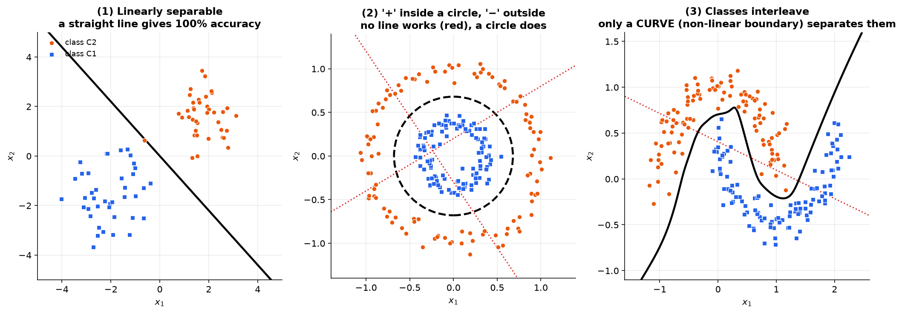

1. **Linearly separable.** A straight line (a plane in 3-D, a hyperplane in more dimensions) separates the classes with **100% accuracy**.
2. **Not linearly separable.** '+' samples sit inside a circle and '−' samples outside (in 3-D: inside vs outside a sphere). Any linear classifier **must** make mistakes.
3. **Only a curve works.** When the classes interleave, you need a non-linear boundary.

**Big question of Lecture 7:** can we still use a *linear* classifier on such data? **Yes, by mapping the data into a higher dimension.**

---

## 2. Non-linear mapping: the circle example

```math
\varphi: \mathbb{R}^2 \rightarrow \mathbb{R}^3, \qquad \varphi(X) = \big\langle \varphi_1(X),\ \varphi_2(X),\ \varphi_3(X) \big\rangle
```

**Step 1: describe the circle.** For the circle $x_1^2 + x_2^2 = R^2$:

- inside: $x_1^2 + x_2^2 < R^2$ (class C1);
- outside: $x_1^2 + x_2^2 > R^2$ (class C2).

**Step 2: use that quantity as a new third feature.**

```math
\varphi_1 = x_1,\quad \varphi_2 = x_2,\quad \varphi_3 = x_1^2 + x_2^2
```

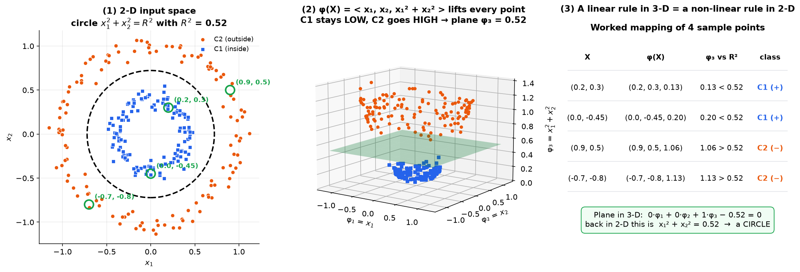

**Step 3: see what happened.** C1 points stay **low** and C2 points go **high**, so a flat plane separates them. Here $R^2 = 0.52$:

| $X$ | $\varphi_3$ | Class |
|:---|:---:|:---|
| (0.2, 0.3) | 0.13 < 0.52 | C1 |
| (0.9, 0.5) | 1.06 > 0.52 | C2 |

**Step 4: the plane.** A general plane in the new space is:

```math
w_1\varphi_1 + w_2\varphi_2 + w_3\varphi_3 + w_0 = 0 \;\Rightarrow\; w_1x_1 + w_2x_2 + w_3(x_1^2+x_2^2) + w_0 = 0
```

With $w_1 = w_2 = 0$, $w_3 = 1$, $w_0 = -R^2$ it is the circle $x_1^2 + x_2^2 = R^2$.

**Read that last line again — it is the whole point of the lecture.** The equation $w_1\varphi_1 + w_2\varphi_2 + w_3\varphi_3 + w_0 = 0$ is a perfectly **flat plane** in the 3-D space. Substitute what the $\varphi$'s actually are, and the same equation describes a **circle** back in 2-D. One object, two spaces, two different shapes.

**Key ideas:**

- **A linear rule in a higher dimension is a non-linear rule in the original space.** Nothing about the classifier changed; only the space it lives in did.
- In theory, mapping to enough (even **infinite**) dimensions turns **any** non-linear problem into a linear one, no matter how complicated the boundary. (This is exactly the idea behind kernel methods in SVMs.)
- In practice, designing such a mapping by hand is hard — the circle example only worked because we already knew the answer was a circle. What we need instead is a way to **learn** the mapping, and for that we need non-linear building blocks. In neural networks those blocks are the **activation functions** (sections 3–6), and the network learns the mapping for us (section 10).

---

## 3. Threshold function

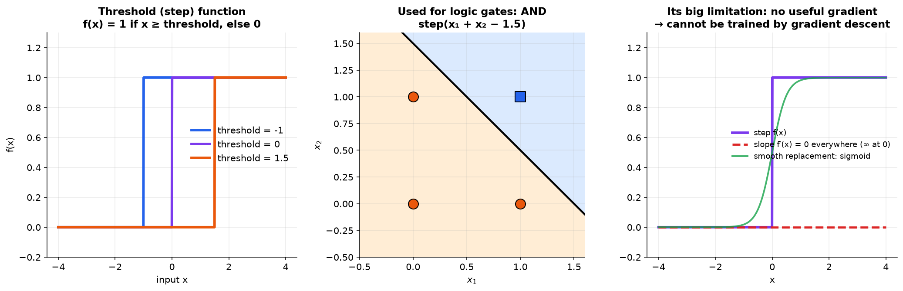

```math
f(x) = \begin{cases} 1 & x \ge \text{threshold} \\ 0 & x < \text{threshold} \end{cases}
```

- It is the **simplest** non-linear activation, and we used it for logic gates (for example AND = step($x_1 + x_2 - 1.5$)).
- **Limitation:** its slope is 0 everywhere (undefined at the jump), so it **cannot be trained with gradient descent**.
- Sigmoid, ReLU and tanh replaced it, but it is the foundation they grew from.

---

## 4. Sigmoid function

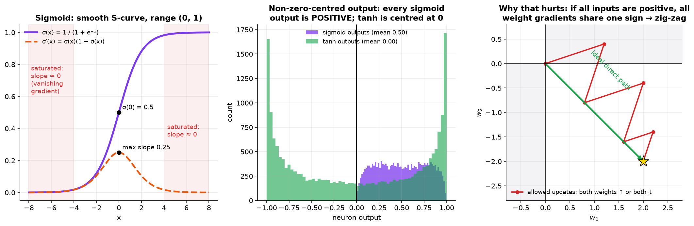

```math
\sigma(x) = \frac{1}{1+e^{-x}}
```

**Properties:**

- **Range (0, 1)**, so it squashes any real number into a value that can be read as a probability;
- **Shape:** a smooth S-curve, continuous and differentiable **everywhere** — which is exactly what the step function was not, and why gradient-based training became possible;
- **Centering:** $\sigma(0) = 0.5$, and the curve is symmetric about that point — but note it is symmetric about **0.5, not 0**, so it is *not* zero-centred;
- **Used for** binary classification outputs, and in logistic regression (same function, same reason).

**Derivative — worth deriving once, because the result is unusually clean:**

```math
\sigma'(x)
= \frac{d}{dx}(1+e^{-x})^{-1}
= \frac{e^{-x}}{(1+e^{-x})^2}
= \underbrace{\frac{1}{1+e^{-x}}}_{\sigma(x)}\cdot\underbrace{\frac{e^{-x}}{1+e^{-x}}}_{\;=\;1-\sigma(x)}
= \sigma(x)\big(1-\sigma(x)\big)
```

The last step uses $\dfrac{e^{-x}}{1+e^{-x}} = \dfrac{(1+e^{-x}) - 1}{1+e^{-x}} = 1 - \sigma(x)$.

So the slope can be computed from the **output alone** — no exponentials needed a second time. The maximum slope is $0.5 \times 0.5 = \mathbf{0.25}$, at $x = 0$.

**Limitations:**

1. **Vanishing gradient.** For large $\lvert x\rvert$ the curve is flat (saturated), so the slope is about 0 and learning stalls.
2. **Not zero-centred.** Every output is positive (middle panel: mean 0.50).
   - A weight's gradient is (delta × its input). If all inputs are positive, all of a neuron's weight gradients share the same sign.
   - The weights can then only move "all up" or "all down", so training **zig-zags** and converges slowly (right panel).

**Alternatives:** ReLU for hidden layers, tanh for zero-centred outputs.

---

## 5. ReLU, Leaky ReLU and sparse gradients

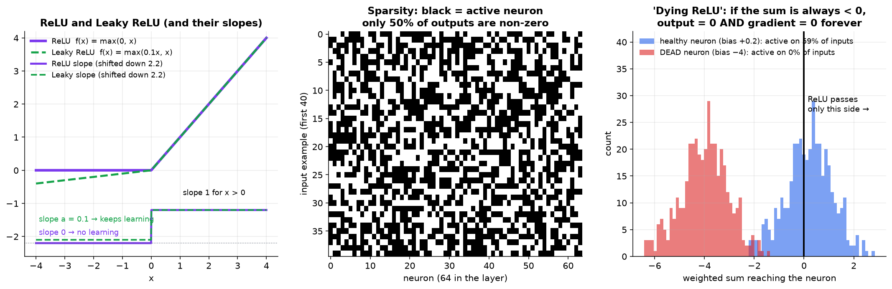

```math
\text{ReLU: } f(x) = \max(0, x) \qquad\qquad \text{Leaky ReLU: } f(x) = \max(ax,\ x)
```

**ReLU key features:**

- **Non-linear**, despite being made of two straight pieces.
- **Sparse activation:** many outputs are exactly 0. In a real layer only **50%** were non-zero (middle panel).
- **Cheap to compute:** a single comparison.
- **Slope of 1** for positive inputs, so no vanishing gradient there.

**Why sparsity is useful:** with roughly half the neurons silent for any given input, the network computes less, and each input activates only the subset of neurons that are relevant to it. That specialization can also reduce overfitting.

**Dying ReLU:** if a neuron's weighted sum is **always negative** across the whole dataset, its output is 0, so its gradient is 0, so its weights never change, so its sum stays negative — permanently. The neuron is dead: it contributes nothing and can never recover (right panel).

**Leaky ReLU fixes this:**

```math
f(x) = \max(ax,\ x) = \begin{cases} x & x > 0 \\ ax & x \le 0\end{cases} \qquad (a \text{ small, e.g. } 0.01\text{–}0.1)
```

- it gives a small **non-zero** slope $a$ for negative inputs, so the gradient is never exactly 0 and a neuron can always climb back;
- $a$ is a **hyperparameter fixed before training** — it is *not* learned;
- it is popular in tasks that suffer from sparse gradients, notably training **GANs**.
- **ELU** is another variant with the same aim (a smooth non-zero response for negative inputs).

**Sparse gradients** means many gradient values are zero or tiny.

| | Details |
|:---|:---|
| Sources | ReLU (zero for negative inputs), L1 regularization or feature selection, SGD batches |
| Advantages | efficient computation; learning focuses on fewer parameters, which can reduce overfitting |
| Disadvantages | slow or poor learning if too little information flows; noisy, unstable optimization |

---

## 6. tanh function

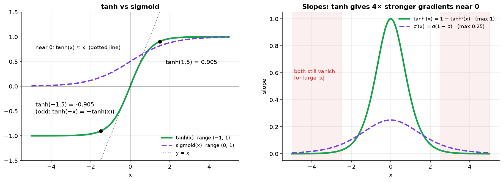

```math
\tanh(x) = \frac{e^{x} - e^{-x}}{e^{x} + e^{-x}} = \frac{2}{1+e^{-2x}} - 1
```

**Why the two forms are equal:**

```math
\frac{2}{1+e^{-2x}} - 1 = \frac{1 - e^{-2x}}{1 + e^{-2x}} = \frac{e^{x} - e^{-x}}{e^{x} + e^{-x}} \qquad (\text{multiply top and bottom by } e^{x})
```

**Derivative:** $\tanh'(x) = 1 - \tanh^2(x)$, with maximum **1** at 0. That is 4× the sigmoid's maximum slope.

| Property | Meaning |
|:---|:---|
| Range | (−1, 1), **zero-centred**, so gradient steps are balanced |
| Odd function | $\tanh(-x) = -\tanh(x)$ |
| Behaviour | near 0, $\tanh(x) \approx x$; large $x$ → 1; very negative $x$ → −1 |
| Advantage | less saturation around 0 than the sigmoid |
| Disadvantage | still vanishes for large $\lvert x\rvert$; costlier than ReLU |
| Used in | hidden layers, RNNs, LSTMs, GRUs |

**Why tanh suits RNNs:** a recurrent net multiplies gradients across many **time steps**, so zero-centred activations and a maximum slope of 1 (instead of 0.25) keep the signal alive much longer than a sigmoid would.

### Which one should you use?

| If you need… | Use | Because |
|:---|:---|:---|
| A hidden layer in a normal deep net | **ReLU** | slope exactly 1 for positives → no vanishing; cheapest to compute |
| A hidden layer where neurons keep dying | **Leaky ReLU** (or ELU) | gradient is never exactly 0 |
| A hidden layer in an RNN / LSTM / GRU | **tanh** | zero-centred, slope up to 1, bounded output keeps the state stable |
| A **binary** classification output | **sigmoid** | one number in (0, 1) reads directly as $P(\text{class}=1)$ |
| A **multi-class** output | **softmax** | outputs are positive and sum to 1 → a real probability distribution |
| A hidden layer, in general | ❌ **not** sigmoid | slope ≤ 0.25 and not zero-centred → slow, zig-zagging training |
| Anything trained by gradient descent | ❌ **not** step | slope is 0 or undefined → no learning signal at all |

---

## 7. Why squared error learns slowly

With sigmoid outputs and squared error, the output-layer update is:

```math
W_{ij}^K \leftarrow W_{ij}^K - \eta\,\delta_j^K o_i^{K-1}, \qquad \delta_j^K = (o_j^K - t_j)\,o_j^K(1-o_j^K)
```

- When a sigmoid output is near 0 or 1, the factor $o(1-o)$ is about 0.
- So the update almost **vanishes**, even when the network is **completely wrong**.
- Learning becomes very slow or **stops**. This is the main problem with squared (quadratic) error.

**See it in numbers.** Take a neuron whose target is $t = 0$:

| Output $o$ | Error $(o - t)$ | Slope $o(1-o)$ | $\delta = (o-t)\,o(1-o)$ |
|:---:|:---:|:---:|:---:|
| 0.5 | 0.50 (half wrong) | 0.2500 | **0.1250** |
| 0.9 | 0.90 (badly wrong) | 0.0900 | 0.0810 |
| 0.99 | 0.99 (confidently wrong) | 0.0099 | **0.0098** |
| 0.999 | 1.00 (as wrong as possible) | 0.0010 | **0.0010** |

The behaviour is backwards. The neuron that is **most** wrong gets the **smallest** correction — 125× smaller than the one that is only half wrong. The error term $(o-t)$ grows towards 1, but the slope $o(1-o)$ collapses towards 0 faster, and the product dies with it.

**Where this comes from:** the $o(1-o)$ factor entered the gradient purely as $\partial o/\partial\theta$, the sigmoid's derivative. Fixing this means finding a loss function whose own derivative **cancels it out** — which is exactly what cross-entropy does.

---

## 8. Binary cross-entropy and its gradient

**From likelihood** (a single sigmoid neuron, $\hat{y} = \sigma(W^TX_i)$, classes 0 and 1). The derivation has four moves:

**1. Interpret the output as a likelihood.** $\hat{y}$ is the likelihood that the true class is 1, so $1 - \hat{y}$ is the likelihood that it is 0.

**2. Write both cases as one expression.**

```math
L = \hat{y}^{\,y}\,(1-\hat{y})^{\,1-y}
```

This is a trick worth understanding: the exponents act as **switches**. If $y = 1$ it reads $\hat{y}^1(1-\hat{y})^0 = \hat{y}$; if $y = 0$ it reads $\hat{y}^0(1-\hat{y})^1 = 1-\hat{y}$. One formula, both cases.

**3. Take the log**, which turns the product into a sum (and makes the maths and the numerics far easier):

```math
\log L = y\log\hat{y} + (1-y)\log(1-\hat{y})
```

**4. Average over the $N$ samples and negate.** We want to *maximize* likelihood, and optimizers *minimize*, so flipping the sign turns it into a loss:

```math
C = -\frac{1}{N}\sum_{X_i}\big[\,y\log\hat{y} + (1-y)\log(1-\hat{y})\,\big]
```

This is the **binary cross-entropy** loss — "binary" because there are exactly two classes.

**Gradient by the chain rule** ($\hat{y} = \sigma(\theta)$, $\theta = W^TX_i$). Three factors again:

```math
\frac{\partial C}{\partial \hat{y}} = -\frac{1}{N}\sum\Big(\frac{y}{\hat{y}} - \frac{1-y}{1-\hat{y}}\Big) = -\frac{1}{N}\sum\frac{y - \hat{y}}{\hat{y}(1-\hat{y})},
\qquad \frac{\partial \hat{y}}{\partial \theta} = \hat{y}(1-\hat{y}),
\qquad \frac{\partial \theta}{\partial W} = X_i
```

*(The middle step just puts the two fractions over the common denominator $\hat{y}(1-\hat{y})$: the numerator becomes $y(1-\hat{y}) - (1-y)\hat{y} = y - \hat{y}$.)*

**Multiply — and watch the sigmoid slope cancel.** The $\hat{y}(1-\hat{y})$ that the loss put in the **denominator** is exactly the $\hat{y}(1-\hat{y})$ the sigmoid puts in the **numerator**:

```math
\frac{\partial C}{\partial W}
= -\frac{1}{N}\sum \frac{y - \hat{y}}{\underbrace{\hat{y}(1-\hat{y})}_{\text{denominator}}}\cdot\underbrace{\hat{y}(1-\hat{y})}_{\text{numerator}}\cdot X_i
= -\frac{1}{N}\sum (y - \hat{y})X_i
= \frac{1}{N}\sum_{X_i} X_i(\hat{y} - y)
```

```math
\boxed{\;W \leftarrow W - \eta\,\frac{1}{N}\sum_{X_i} X_i(\hat{y} - y)\;}
```

This cancellation *is* the reason cross-entropy exists. Compare it with the squared-error update: identical, except the poisonous $\hat{y}(1-\hat{y})$ factor is gone.

**What the update does:**

- class 1 misclassified ($\hat{y}$ near 0): the weight **increases**;
- class 0 misclassified ($\hat{y}$ near 1): the weight **decreases**.

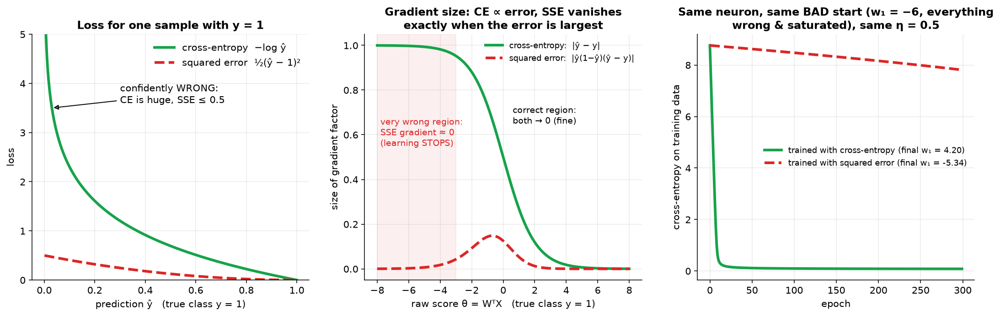

| Loss | Update depends on | When very wrong |
|:---|:---|:---|
| Squared error | $(\hat{y}-y) \hat{y}(1-\hat{y})$ | about 0, learning stalls |
| Cross-entropy | $(\hat{y}-y)$ only | large, learns fast |

**Real test (right panel):** same neuron, same bad start ($w_1 = -6$), same $\eta = 0.5$.

- **Cross-entropy:** reached loss 0.08 and **96%** accuracy.
- **Squared error:** stayed stuck at **4%**.

**Rule of thumb:** with cross-entropy the rate of learning is proportional to the error.

---

## 9. Multi-class cross-entropy and softmax

**Setup:** the outputs must behave like **probabilities**, so the output layer uses **softmax**. Here $t_j$ is 1 for the true class and 0 for the others.

**Loss** for one output node → all nodes → all samples:

```math
-\big[t_j\log o_j^K + (1-t_j)\log(1-o_j^K)\big]
\;\rightarrow\;
C = -\frac{1}{N}\sum_{X}\sum_{j=1}^{M_K}\big[t_j\log o_j^K + (1-t_j)\log(1-o_j^K)\big]
```

Read the formula from the inside out: the bracket is the **binary** cross-entropy for **one** output node $j$; summing over $j$ covers **all $M_K$ nodes**; summing over $X$ and dividing by $N$ averages over **all samples**.

**Gradient** ($o_j^K = \sigma(\theta_j^K)$, $\theta_j^K = \sum_i W_{ij}^K o_i^{K-1}$). Exactly the same cancellation as in section 8, node by node:

```math
\frac{\partial C}{\partial W_{ij}^K} = -\frac{1}{N}\sum_X\Big(\frac{t_j}{o_j^K} - \frac{1-t_j}{1-o_j^K}\Big)o_j^K(1-o_j^K)\,o_i^{K-1} = \frac{1}{N}\sum_X (o_j^K - t_j)\,o_i^{K-1}
```

```math
W_{ij}^K \leftarrow W_{ij}^K - \eta\,\frac{1}{N}\sum_X (o_j^K - t_j)\,o_i^{K-1}
```

**Bigger error → bigger step**, with no slope factor to sabotage it. Remember: cross-entropy needs **softmax (probabilistic) outputs**.

### Softmax

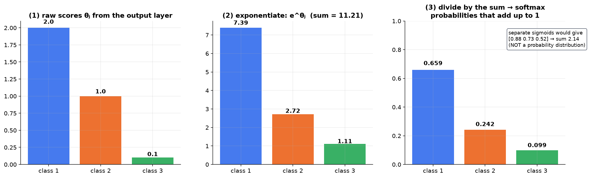

```math
o_j = \frac{e^{\theta_j}}{\sum_k e^{\theta_k}}: \quad [2.0,\ 1.0,\ 0.1] \rightarrow [7.389,\ 2.718,\ 1.105]\ (\text{sum } 11.213) \rightarrow [0.659,\ 0.242,\ 0.099]
```

**What each stage buys you:**

1. **Exponentiate.** $e^{\theta}$ is always positive, so negative scores cannot produce negative "probabilities". It also **exaggerates differences**: a gap of 1.0 in the scores becomes a factor of $e \approx 2.72$ in the outputs.
2. **Divide by the total.** Now the numbers are guaranteed to **sum to exactly 1**.

The result is a genuine probability distribution over the classes, and $o_j$ is read as $P(X \text{ belongs to class } j)$.

**Why not just use $M$ independent sigmoids?** They would give [0.88, 0.73, 0.52], which sums to **2.14**. Each number is in (0,1), but together they are not a distribution — three classes each "80% likely" is meaningless. Cross-entropy's derivation assumed the outputs were a normalized probability, so feeding it un-normalized sigmoids breaks the assumption it was built on.

---

## 10. Hidden layers and the latent space

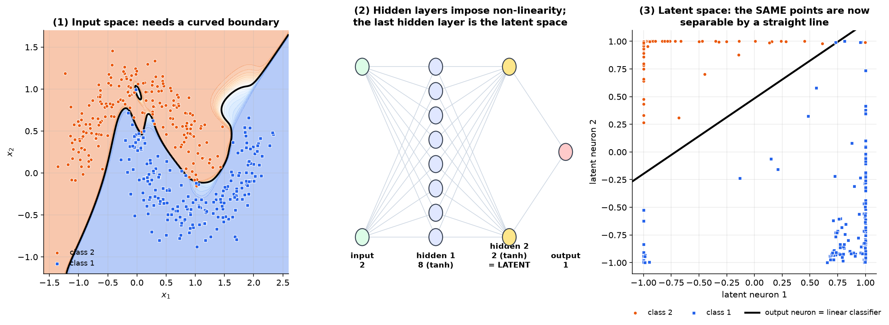

- **Hidden nodes impose non-linearity.** More hidden layers can capture more complex patterns.
- Real data is usually **not** linearly separable (left panel).
- Hidden layers map it into a **latent space** where it **is** separable (right panel: one straight line; this network reached 99.5% accuracy).
- At the **output layer**, a **linear classifier** is enough.

This is the non-linear mapping idea from section 2, except that the network **learns** the mapping.

---

## 11. Worked backprop example from Lecture 11

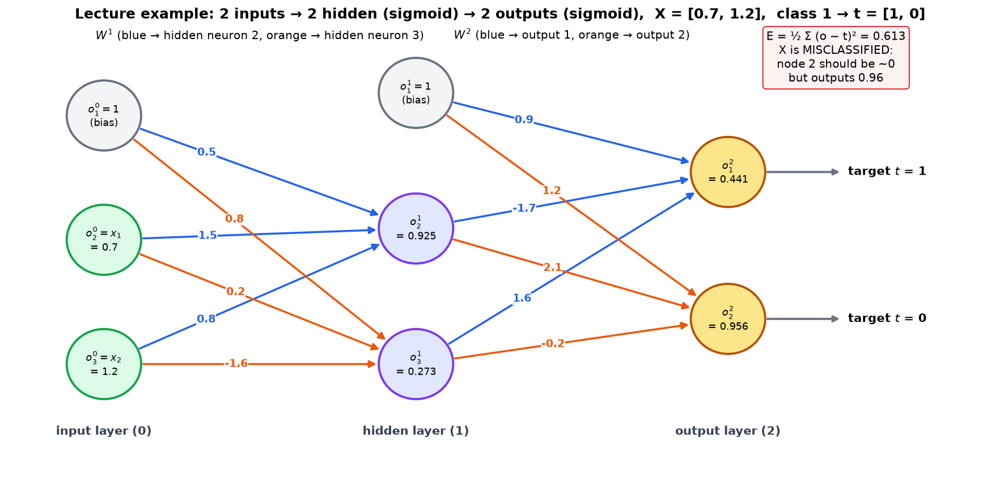

**Setup:**

- $X = [0.7, 1.2]$ belongs to **class 1**, so the targets are $t = [1, 0]$.
- One hidden layer ($K = 2$), sigmoid everywhere, squared error. The first column of each weight matrix is the bias.
- The slides give no learning rate; $\eta = 0.5$ is used here.

```math
W^1 = \begin{bmatrix} 0.5 & 1.5 & 0.8 \\ 0.8 & 0.2 & -1.6 \end{bmatrix}, \qquad W^2 = \begin{bmatrix} 0.9 & -1.7 & 1.6 \\ 1.2 & 2.1 & -0.2 \end{bmatrix}, \qquad O^0 = [1,\ 0.7,\ 1.2]^T
```

### Step 1: forward pass

```math
\theta^1 = W^1O^0 = [0.5+1.05+0.96,\;\; 0.8+0.14-1.92] = [2.51,\ -0.98] \;\Rightarrow\; O^1 = [1,\ 0.925,\ 0.273]
```

> ✏️ **Slide typo.** The slide shows −9.8 for the second value. That is a typo for −0.98: $0.8 + 0.2(0.7) - 1.6(1.2) = 0.8 + 0.14 - 1.92 = -0.98$, and only −0.98 gives the slide's own next value, $\sigma(-0.98) = 0.27$.
>
> 📐 **Rounding, and a second slide slip.** The slide carries $O^1$ rounded to 2 decimals, $[1,\ 0.92,\ 0.27]$, and prints $\theta^2 = [-0.232,\ 3.057]$. The first entry checks out, but its own rounded numbers give $1.2 + 2.1(0.92) - 0.2(0.27) = \mathbf{3.078}$, not 3.057. This guide keeps full precision throughout — $O^1 = [1,\ 0.925,\ 0.273] \Rightarrow \theta^2 = [-0.236,\ 3.088]$ — so small last-digit differences from the slide are expected and harmless.

```math
\theta^2 = W^2O^1 = [-0.236,\ 3.088] \;\Rightarrow\; O^2 = [0.441,\ 0.956], \qquad E = \tfrac{1}{2}\big[(0.441-1)^2 + 0.956^2\big] = 0.613
```

**X is misclassified:** node 2 should be near 0 but outputs 0.956.

### Step 2: output-layer update (matrix form)

```math
W^2 \leftarrow W^2 - \eta\,\delta^2 (O^1)^T, \qquad \delta_j^2 = (o_j^2 - t_j)\,o_j^2(1-o_j^2)
```

```math
\delta^2 = [(0.441-1)(0.441)(0.559),\;\; (0.956)(0.956)(0.044)] = [-0.1377,\ 0.0399]
```

```math
W^2_{new} = W^2 - 0.5\begin{bmatrix} -0.1377 & -0.1274 & -0.0376 \\ 0.0399 & 0.0369 & 0.0109 \end{bmatrix} = \begin{bmatrix} 0.9689 & -1.6363 & 1.6188 \\ 1.1801 & 2.0815 & -0.2054 \end{bmatrix}
```

Node 2's delta is small (0.0399) even though its error is huge. That is the sigmoid saturation problem from section 7.

### Step 3: hidden-layer update

Two rules that trip everyone up here:

- Use the **old** $W^2$, not the one you just computed. The deltas describe the network as it was during the forward pass.
- **Skip the bias column.** The bias unit $o_1^1 = 1$ is a constant; it has no incoming weights and receives no delta, so the sum runs only over the real hidden neurons ($i = 2, 3$).

```math
\delta_i^1 = o_i^1(1-o_i^1)\sum_j \delta_j^2 W_{ij}^2
```

```math
\delta_2^1 = 0.0695\,\big[(-0.1377)(-1.7) + (0.0399)(2.1)\big] = 0.0221, \qquad \delta_3^1 = 0.1984\,\big[(-0.1377)(1.6) + (0.0399)(-0.2)\big] = -0.0453
```

```math
W^1_{new} = W^1 - 0.5\,\delta^1(O^0)^T = \begin{bmatrix} 0.4889 & 1.4923 & 0.7867 \\ 0.8227 & 0.2159 & -1.5728 \end{bmatrix}
```

**One iteration is complete.** The error falls from 0.613 to 0.590.

### Step 4: repeat until the output is right

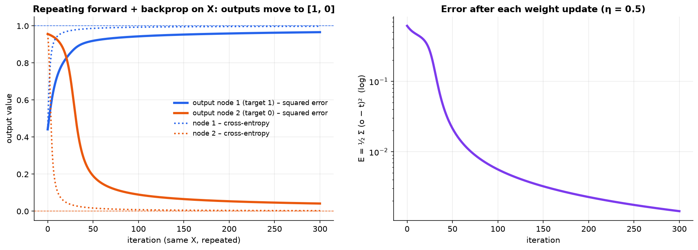

Repeat on the same $X$ until node 1 is near 1 and node 2 is near 0.

| Iteration | 0 | 20 | 50 | 300 |
|:---|:---:|:---:|:---:|:---:|
| $O^2$ | [0.441, 0.956] | [0.823, 0.838] | [0.919, 0.191] | [0.966, 0.041] |
| $E$ | 0.613 | 0.367 | 0.021 | 0.001 |

With **cross-entropy** ($\delta = o - t$), node 2 is already down to **0.048 after 20 iterations** (dotted lines).

---

## 12. Batch training and parallel processing

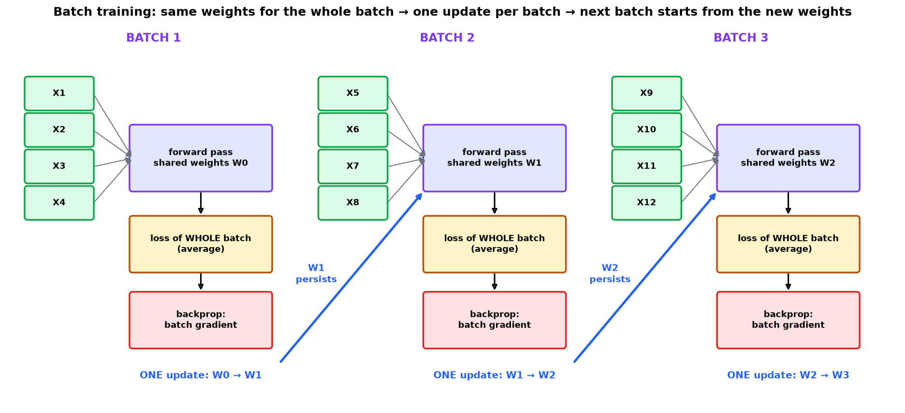

**Inside one batch:**

1. All samples use the **same shared weights** (initialized randomly, or with Xavier or He initialization).
2. Forward pass for the whole batch.
3. Loss over the **whole batch**.
4. Backprop on the cumulative batch loss.
5. **One** weight update.

**Across batches:** the updated weights **persist** and are used by the next batch. This repeats through all epochs.

| Parallel technique | Idea |
|:---|:---|
| Batch processing | the batch is one matrix, so a GPU or TPU computes every row at once |
| Data parallelism | every device has a full model copy and a different slice of the data; gradients are combined |
| Model parallelism | the model is too big, so its parts live on different devices |
| Asynchronous updates | several workers update the weights without waiting for each other |

---

## 13. Cheat sheet

| Topic | Formula or fact |
|:---|:---|
| Circle mapping | $\varphi(X) = \langle x_1, x_2, x_1^2 + x_2^2\rangle$; plane $\varphi_3 = R^2$ ⇔ circle of radius $R$ |
| Threshold / step | 1 if $x \ge \theta$ else 0; slope 0 → untrainable by gradient |
| Sigmoid | $1/(1+e^{-x})$, slope $\sigma(1-\sigma) \le 0.25$, not zero-centred |
| tanh | range (−1, 1), zero-centred, slope $1 - \tanh^2 \le 1$ |
| ReLU / Leaky | $\max(0, x)$ / $\max(ax, x)$; $a$ fixed before training |
| Dying ReLU | always-negative sum → output 0 → gradient 0 → never recovers |
| Squared-error delta | $(o-t) o(1-o)$ |
| Cross-entropy delta | $(o-t)$ |
| Binary cross-entropy | $-\frac{1}{N}\sum[y\log\hat{y} + (1-y)\log(1-\hat{y})]$ |
| Softmax | $e^{\theta_j}/\sum_k e^{\theta_k}$ |
| Output update | $W^K \leftarrow W^K - \eta \delta^K (O^{K-1})^T$ |
| Hidden delta | $o(1-o)\sum_j \delta_j W_{ij}$ |

---

## 14. Viva questions

**Q1. How can a linear classifier solve a non-linear problem?**
Map the data with a non-linear function into a higher dimension where it is linearly separable, then use a plane there.

**Q2. What mapping separates points inside and outside a circle?**
$\varphi(X) = \langle x_1, x_2, x_1^2 + x_2^2\rangle$, with the plane $\varphi_3 = R^2$.

**Q3. Why is the sigmoid's non-zero-centred output a problem?**
All of a neuron's weight gradients share one sign, so updates zig-zag and training converges slowly.

**Q4. What is dying ReLU, and how does Leaky ReLU fix it?**
A neuron whose input is always negative has output 0 and gradient 0 forever. Leaky ReLU keeps a small slope $a$ for negative inputs.

**Q5. Why is cross-entropy better than squared error?**
Its update is proportional to $(\hat{y} - y)$. The squared-error update is multiplied by $\hat{y}(1-\hat{y})$, which is about 0 exactly when the network is confidently wrong.

**Q6. Derive the binary cross-entropy gradient.**
$\partial C/\partial\hat{y}$ has $\hat{y}(1-\hat{y})$ in its denominator, which cancels the sigmoid slope. The result is $\frac{1}{N}\sum X_i(\hat{y} - y)$.

**Q7. Why does multi-class cross-entropy need softmax?**
The loss treats outputs as probabilities, and softmax makes them positive and sum to 1.

**Q8. What is the latent space?**
The representation made by the hidden layers, in which the classes become linearly separable.

**Q9. In the Lecture 11 example, why is δ₂² small even though node 2 is very wrong?**
$0.956 \times (1-0.956)$ is tiny, so the sigmoid slope shrinks the correction. Cross-entropy would give 0.956.

**Q10. What persists between batches?**
The weights updated after each batch become the starting weights for the next batch.

**Q11. Why are the exponents in $\hat{y}^{\,y}(1-\hat{y})^{\,1-y}$ there?**
They act as switches. With $y = 1$ the expression collapses to $\hat{y}$; with $y = 0$ it collapses to $1-\hat{y}$. It packs both cases into one differentiable formula.

**Q12. Exactly where does the sigmoid slope cancel in the cross-entropy gradient?**
$\partial C/\partial\hat{y}$ carries $\hat{y}(1-\hat{y})$ in its **denominator**, and $\partial\hat{y}/\partial\theta$ is $\hat{y}(1-\hat{y})$ in the **numerator**. Their product is 1, leaving only $(\hat{y}-y)X_i$.

**Q13. Why can't you just use several sigmoids for a multi-class output?**
Each output would be in (0,1), but they would not sum to 1 (the worked example gives 2.14). Cross-entropy's derivation assumes a normalized probability distribution, which only softmax guarantees.

**Q14. What does exponentiating do inside softmax?**
It forces every value positive (so negative scores can't give negative probabilities) and it exaggerates gaps — a score difference of 1 becomes a ratio of $e \approx 2.72$.

**Q15. Why is the sigmoid a bad choice for hidden layers but fine for a binary output?**
In a hidden layer its ≤ 0.25 slope compounds across depth (vanishing gradients) and its all-positive output makes updates zig-zag. At a single binary output there is no depth below it to compound through, and its (0,1) range is exactly what a probability needs.

**Q16. In the Lecture 11 example, why does the bias column get skipped when back-propagating?**
The bias unit is a constant 1. It has no incoming weights to update and no error to receive, so it contributes no term to $\sum_j \delta_j^K W_{ij}^K$.
