# Foundations of Machine Learning, Linear Regression, and Logistic Classification: A Visual Study Guide

> **Course Reference:** Covers all the foundational theory, mathematical derivations, statistical assumptions, and worked numerical examples from **1.ML_Lec_1.pptx**, **2.ML_Lec_2.pptx**, and **3.ML_Lec_3.pptx**, in simple plain English with real computed plots. Every number, matrix operation, and proof in this guide was independently audited and verified.
> Continues into the [Neural Networks Guide](neural_networks_visual_guide.md) and the [Activations, Cross-Entropy & Backprop Guide](activation_crossentropy_backprop_visual_guide.md).
>
> 🟠 Orange / Red = Class 0 / Salmon / Apple / Residuals · 🔵 Blue = Class 1 / Sea Bass / Fitted Line / Ridge · 🟢 Green = Separating Boundary / Banana / Convex Loss / Optimal Solution · 🟣 Purple = Total Variation ($SS_T$)

**The story in one line:** Raw data contains hidden patterns → but manual rules fail when categories overlap → Simple and Multiple Linear Regression model continuous quantities by minimizing squared errors using calculus and matrix inversion → but linear lines cannot output bounded probabilities → Logistic Regression solves classification by turning probabilities into log-odds and squashing linear scores through the sigmoid → and Softmax generalizes it to multiclass decision boundaries.

---

## Contents

1. [What is Machine Learning? (The Core Paradigm)](#1-what-is-machine-learning-the-core-paradigm)
2. [The Taxonomy of Learning: Supervised, Unsupervised, Semi-Supervised, and RL](#2-the-taxonomy-of-learning-supervised-unsupervised-semi-supervised-and-rl)
3. [Feature Space & The Fish Classification Case Study](#3-feature-space--the-fish-classification-case-study)
4. [Simple Linear Regression (SLR) & The Least Squares Derivation](#4-simple-linear-regression-slr--the-least-squares-derivation)
5. [Statistical Assumptions & Consequences of the Linear Model](#5-statistical-assumptions--consequences-of-the-linear-model)
6. [Multiple Linear Regression (MLR) & Normal Equations in Matrix Form](#6-multiple-linear-regression-mlr--normal-equations-in-matrix-form)
7. [Degrees of Freedom & ANOVA Decomposition ($SS_T = SS_{Reg} + SS_{Res}$)](#7-degrees-of-freedom--anova-decomposition-ss_t--ss_reg--ss_res)
8. [Why Linear Regression Fails for Classification](#8-why-linear-regression-fails-for-classification)
9. [The Logistic (Sigmoid) Function & The Log-Odds (Logit) Formulation](#9-the-logistic-sigmoid-function--the-log-odds-logit-formulation)
10. [Training Logistic Regression: Log-Loss & Gradient Descent](#10-training-logistic-regression-log-loss--gradient-descent)
11. [Regularization: L1 (Lasso), L2 (Ridge), and the $C$ Parameter](#11-regularization-l1-lasso-l2-ridge-and-the-c-parameter)
12. [Multiclass Classification: One-vs-Rest vs Multinomial Softmax](#12-multiclass-classification-one-vs-rest-vs-multinomial-softmax)
13. [Worked Numerical Example: Multiclass Fruit Classification](#13-worked-numerical-example-multiclass-fruit-classification)
14. [Optimization Solvers in Logistic Regression](#14-optimization-solvers-in-logistic-regression)
15. [Linear Regression vs Logistic Regression: The Complete Comparison](#15-linear-regression-vs-logistic-regression-the-complete-comparison)
16. [Cheat Sheet](#16-cheat-sheet)
17. [Viva Voce Questions & Answers](#17-viva-voce-questions--answers)

---

## 1. What is Machine Learning? (The Core Paradigm)

Think about how standard computer programming works. If you want to build a spam email filter in standard code, you sit down and write explicit `if-else` rules:
```python
if "free lottery" in email or "transfer funds" in email:
    mark_as_spam()
```
This is **Traditional Software Engineering**: **Data + Handcrafted Rules = Answers**.

The fatal problem? Spammers adapt instantly. They start spelling it `"fr33 l0tt3ry"` or `"wire f-u-n-d-s"`. Language evolves, edge cases multiply, and keeping up with thousands of manual rules becomes impossible.

**Machine Learning (ML)** completely inverts this workflow: **Data + Answers = Rules (Model)**.  
Instead of spoon-feeding rules to the machine, we feed it historical emails along with their labels (*Spam* or *Not Spam*). The computer searches through the data and automatically discovers the statistical patterns that separate spam from ham.

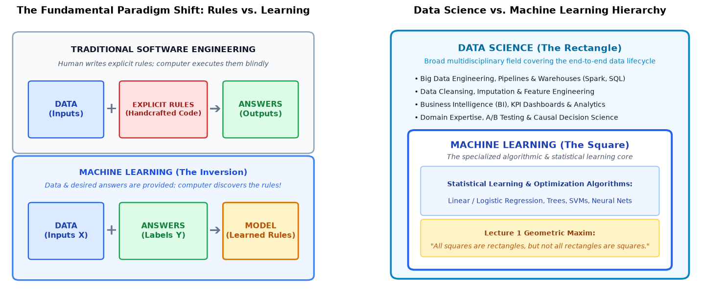

### Arthur Samuel's Definition (1959)
> *"Machine Learning is the field of study that gives computers the ability to learn without being explicitly programmed."*

Arthur Samuel coined this term while programming an IBM 704 to play checkers. Instead of trying to code every possible checkers move by hand, he had the computer play thousands of games against itself. Over time, the program learned board-evaluation strategies that outperformed Samuel himself!

### Tom Mitchell's Formal Operational Definition (1997)
To study machine learning scientifically, we need an exact mathematical definition rather than a vague idea. In his 1997 textbook, Tom Mitchell defined learning using three core ingredients: **Experience ($E$)**, **Task ($T$)**, and **Performance Measure ($P$)**:

> **A computer program is said to learn from experience $E$ with respect to some class of tasks $T$ and performance measure $P$, if its performance at tasks in $T$, as measured by $P$, improves with experience $E$.**

Whenever you encounter any machine learning system, ask yourself three simple questions:
1. **Task ($T$):** What specific job is the computer trying to do?
2. **Performance ($P$):** How do we score how well it did that job?
3. **Experience ($E$):** What historical data or practice did it learn from?

| Learning Problem | Task $T$ | Performance Measure $P$ | Experience $E$ |
|:---|:---|:---|:---|
| **Handwriting Recognition** | Classifying handwritten characters or digits from raw pixel images | Percentage of characters correctly classified on unseen test images | A historical dataset of handwritten images paired with human-annotated labels |
| **Autonomous Driving** | Navigating a car safely on public highways | Average distance (in kilometers) traveled safely before a human intervention is needed | Video streams from car cameras paired with steering angles and brake inputs from human drivers |
| **Spam Filter** | Sorting incoming emails into Inbox or Spam folder | Accuracy / F1-Score (fraction of correctly flagged emails without false alarms) | A database of 50,000 previous emails marked as spam or not spam by users |

### Machine Learning vs Data Science: The Rectangle Analogy
Lecture 1 highlights a common point of confusion: Is Machine Learning the same thing as Data Science?

Think of it like geometry:
- **Data Science** is the **rectangle**: an expansive, multidisciplinary umbrella covering the entire lifecycle of data. It includes data engineering, SQL databases, ETL pipelines, business dashboards (BI), statistical experiments, and executive decision-making.
- **Machine Learning** is the **square**: a focused, highly specialized mathematical core within data science that focuses specifically on algorithms that learn patterns from data.
- **The rule of thumb:** *"All squares are rectangles, but not all rectangles are squares."* A data scientist spends much of their time cleaning and organizing data; a machine learning algorithm is the mathematical engine applied once the data is ready.

### The Knowledge Discovery in Data (KDD) Pipeline
Machine learning models do not work in a vacuum. If you feed raw, messy real-world data straight into an ML algorithm, you will get nonsense—a principle known as **"Garbage In, Garbage Out"**. 

In industrial practice, learning follows the 4-stage KDD pipeline:
1. **Data Cleaning & Integration:** Merging databases from different departments, fixing inconsistent date formats, and filling in missing values.
2. **Data Preprocessing:** Scaling numbers (e.g. converting grams and kilograms to a common scale), converting text categories into numbers, and removing unhelpful noise.
3. **Pattern Learning (The ML Core):** Training algorithms (Regression, Decision Trees, Logistic Classifiers, Neural Networks) to find the underlying equations.
4. **Post-Processing & Evaluation:** Testing the model on brand-new data it has never seen before, inspecting error metrics, and visualizing decision boundaries before deploying it to production.

---

## 2. The Taxonomy of Learning: Supervised, Unsupervised, Semi-Supervised, and RL

Machine learning problems are divided into four main families depending on what kind of feedback the computer receives while learning:

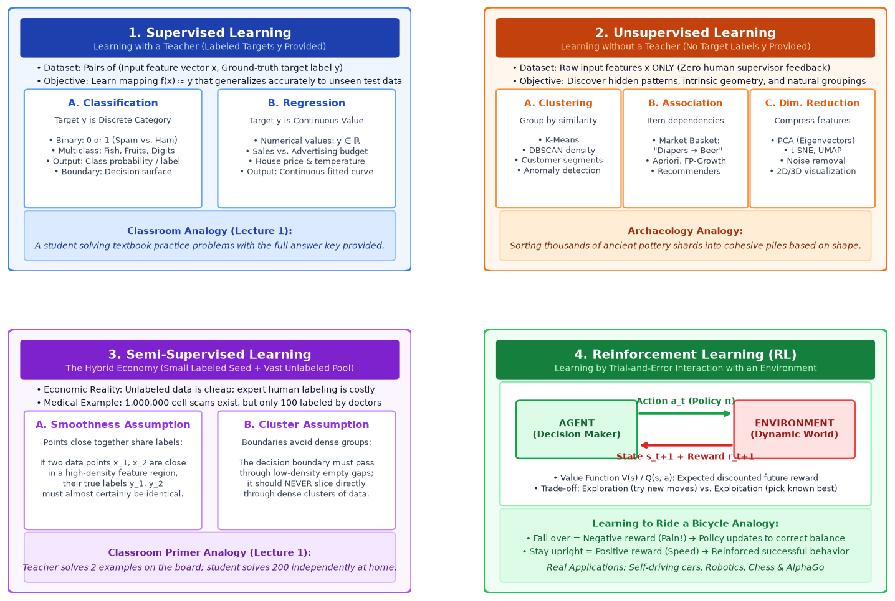

### 1. Supervised Learning (Learning with a Teacher)
In supervised learning, every single training sample consists of an input feature vector $\mathbf{x}$ paired with a known ground-truth answer $y$:
$$\mathcal{D} = \{(\mathbf{x}_1, y_1), (\mathbf{x}_2, y_2), \dots, (\mathbf{x}_n, y_n)\}$$

**Classroom Analogy:** Think of a student doing homework exercises where the full answer key is printed at the back of the textbook. The student solves a problem, checks the answer, spots their mistake, and adjusts their approach.

Supervised learning splits into two fundamental branches based on what $y$ looks like:
- **Classification:** The target $y$ is a **discrete category** (e.g. 0 or 1, Cat or Dog, Malignant or Benign tumor).
- **Regression:** The target $y$ is a **continuous real number** (e.g. predicting house prices in Rupees, tomorrow's temperature, or quarterly sales revenue).

### 2. Unsupervised Learning (Learning without a Teacher)
In unsupervised learning, we give the algorithm raw input features $\mathbf{x}$ with **zero target labels $y$**:
$$\mathcal{D} = \{\mathbf{x}_1, \mathbf{x}_2, \dots, \mathbf{x}_n\}$$

There is no teacher, no grades, and no answer key. The algorithm must discover the natural structure and hidden groupings on its own.

**Archaeology Analogy:** Imagine an archaeologist who excavates thousands of ancient pottery shards. Nobody left an instruction booklet explaining which pottery belonged to which civilization. The archaeologist naturally sorts the shards into piles based on clay texture, color, and thickness.

Key unsupervised tasks include:
- **Clustering:** Grouping similar items together (e.g. K-Means clustering customer shopping habits into demographic segments).
- **Association Rule Mining:** Discovering items that frequently appear together (e.g. Market Basket Analysis: *"Customers who buy diapers on Friday evenings have an 80% likelihood of also buying beer"*).
- **Dimensionality Reduction:** Compressing hundreds of features down into 2 or 3 essential components without losing the underlying pattern (e.g. Principal Component Analysis / PCA).

### 3. Semi-Supervised Learning (The Hybrid Economy)
In the real world, collecting raw data is cheap, but having human experts label that data is extremely expensive:
- In medicine, a hospital can easily collect 1,000,000 microscopic tissue scans ($X_U$), but having a world-class pathologist spend hours examining and diagnosing each scan ($Y_L$) costs hundreds of thousands of dollars.

Semi-supervised learning starts with a **small seed of labeled examples** $(X_L, Y_L)$ and leverages a **vast ocean of unlabeled examples** $X_U$. It works by relying on two intuitive mathematical assumptions:
1. **The Smoothness Assumption:** If two data points $\mathbf{x}_1$ and $\mathbf{x}_2$ are very close together in a dense cluster, their labels $y_1$ and $y_2$ are almost certainly identical.
2. **The Cluster Assumption:** The decision boundary separating different classes should always pass through empty, low-density gaps; it should never slice straight through the middle of a tight cluster.

**Lecture 1 Analogy:** A teacher solves 2 example problems on the board to demonstrate the concept, and the student then works through 200 similar problems independently at home to reinforce and expand their understanding.

### 4. Reinforcement Learning (Learning by Interaction)
Reinforcement Learning (RL) has neither an answer key nor static data. Instead, an autonomous **Agent** learns by trial-and-error interaction with a dynamic **Environment**:

$$\text{State } s_t \xrightarrow{\text{Action } a_t \text{ from Policy } \pi} \text{Environment} \xrightarrow{\text{Feedback}} \text{New State } s_{t+1} + \text{Reward } r_{t+1}$$

**Bicycle Analogy:** Think of how a child learns to ride a bicycle. Nobody explains the physics of angular momentum. The child hops on, pedals, wobbles, and falls over (negative reward / pain!). Their brain adjusts muscle commands. Next time, they balance smoothly and gain speed (positive reward!). Over repeated trials, they master balance.

Key RL concepts to know:
- **Policy $\pi(a \mid s)$:** The agent's internal strategy—what action to pick when sitting in state $s$.
- **Reward Signal $r$:** Immediate scalar feedback (+1 for scoring a goal, -10 for crashing).
- **Value Function $V(s)$ or $Q(s, a)$:** The total cumulative reward the agent expects to collect into the distant future.
- **Exploration vs. Exploitation Dilemma:** Should the agent exploit the best restaurant it already knows, or explore a new restaurant that might be even better (or terrible)?

---

## 3. Feature Space & The Fish Classification Case Study

Lecture 1 introduces the famous industrial classification case study from Duda, Hart, and Stork (*Pattern Classification*, 2001): an automated optical conveyor belt system designed to sort incoming fish into **Salmon** ($y=0$) or **Sea Bass** ($y=1$).

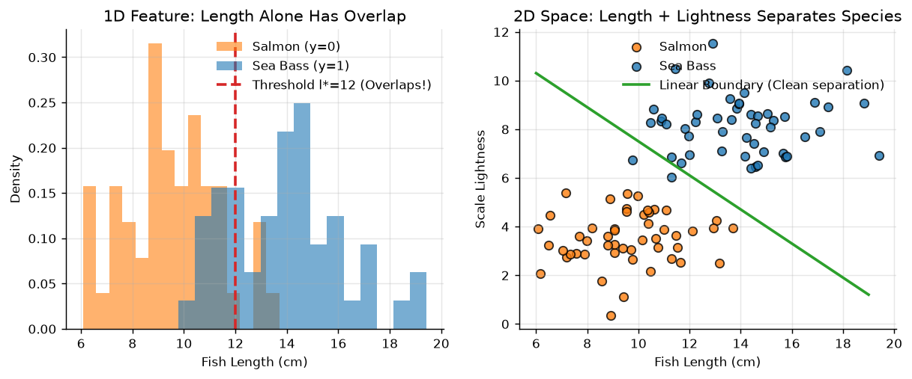

### The Failure of 1D Feature Thresholding
Engineers initially look for the most obvious physical difference: *"Sea bass are usually longer than salmon."*
- **Feature:** Length $x_1$.
- **Rule:** If $\text{length} \ge l^*$, predict Sea Bass; otherwise predict Salmon.

**Why 1D fails (Left Panel):**  
Look at the histogram on the left. The length curves of the two species heavily overlap! A well-fed, older salmon can easily be longer than a young sea bass. 
- If you set the cutoff threshold $l^*$ too low, you mistakenly label big salmon as sea bass (**False Positives**).
- If you set $l^*$ too high, you mistakenly label small sea bass as salmon (**False Negatives**).
- No single vertical line on that 1D axis can ever separate the two species without making mistakes.

### The Lift to 2D Feature Space
To break the tie, engineers inspect the fish more closely and find a second independent clue: **Average Lightness of Scales** ($x_2$). Sea bass scales are shinier and reflect more light than darker salmon scales.

**Why 2D succeeds (Right Panel):**  
When we plot each fish on a 2D graph with **Length on the X-axis** and **Lightness on the Y-axis**, the data points untangle into two distinct clusters!
Even if a salmon and a sea bass have the exact same length (tied on the X-axis), their scale lightness separates them on the Y-axis. 

Now, a simple straight line (a **linear decision boundary**) cleanly cuts between the two species:
$$w_1 x_1 + w_2 x_2 + w_0 = 0$$

> **Key Takeaway:** If your classes overlap and cannot be separated in a single dimension, adding more relevant features lifts the data into higher-dimensional space where simple linear boundaries can cleanly separate them.

---

## 4. Simple Linear Regression (SLR) & The Least Squares Derivation

In Lecture 2, we shift from discrete categories to predicting continuous numerical values. We want to model how a controlled input variable $X$ (the **regressor** or predictor) influences an output variable $Y$ (the **response**).

### Sir's Advertising vs. Sales Dataset
Consider the motivating dataset from Slide 1 of Lecture 2: A company records how many units of a product it sells ($y$) for various amounts spent on advertising ($x$ in Rs.):

| Observation $i$ | Adv. Cost $x_i$ (Rs.) | Sales Amount $y_i$ (Qty) |
|:---:|:---:|:---:|
| 1 | 1 | 1 |
| 2 | 2 | 1 |
| 3 | 3 | 2 |
| 4 | 4 | 2 |
| 5 | 5 | 4 |

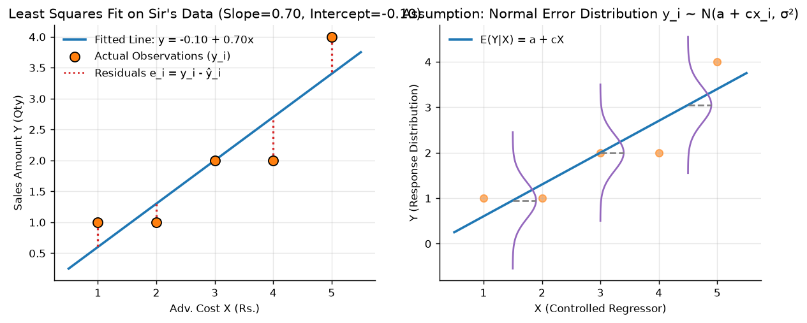

### The Mathematical Formulation
The true underlying relationship in the real world is modeled as:
$$y_i = a + c x_i + \epsilon_i, \qquad i = 1, 2, \dots, n$$

- $a$: The **intercept** (the baseline sales you expect even if you spend Rs. 0 on advertising).
- $c$: The **slope** (how many extra units of sales you gain for every 1 Rupee added to advertising).
- $\epsilon_i$: The unobservable random **noise or error** (customer moods, bad weather, competing store sales).

Our sample line that estimates this relationship is:
$$\hat{y}_i = \hat{a} + \hat{c} x_i$$

Where $\hat{y}_i$ is the predicted sales, and $e_i = y_i - \hat{y}_i$ is the **residual** (the vertical gap between the actual point and our line).

### The Least Squares Method (LSM) Derivation
How do we find the "best" line? We want the residuals $e_i$ to be as small as possible.

**Why square the residuals?**
1. If we simply sum the errors $\sum (y_i - \hat{y}_i)$, positive errors ($+4$) and negative errors ($-4$) cancel each other out to zero! A terrible line could look "perfect".
2. If we use absolute values $\sum |y_i - \hat{y}_i|$, the V-shaped absolute value function has a sharp vertex at zero where it cannot be differentiated using standard calculus.
3. Squaring $(y_i - \hat{y}_i)^2$ solves both: errors are always positive, big mistakes are penalized heavily, and the function forms a smooth parabolic bowl that calculus can easily minimize!

We define the **Sum of Squared Residuals ($S$ or $SS_{Res}$)**:
$$S(a, c) = \sum_{i=1}^n e_i^2 = \sum_{i=1}^n (y_i - \hat{y}_i)^2 = \sum_{i=1}^n (y_i - a - c x_i)^2$$

To find the values of $a$ and $c$ that minimize $S$, we take the partial derivatives and set them equal to zero:
$$\frac{\partial S}{\partial a} = -2 \sum_{i=1}^n (y_i - a - c x_i) = 0 \implies \sum_{i=1}^n (y_i - \hat{a} - \hat{c} x_i) = 0 \quad \text{--- (Equation 1)}$$

$$\frac{\partial S}{\partial c} = -2 \sum_{i=1}^n x_i (y_i - a - c x_i) = 0 \implies \sum_{i=1}^n x_i (y_i - \hat{a} - \hat{c} x_i) = 0 \quad \text{--- (Equation 2)}$$

#### Step 1: Solving for Intercept $\hat{a}$
From Equation 1, split the summation across all terms:
$$\sum_{i=1}^n y_i - \sum_{i=1}^n \hat{a} - \hat{c}\sum_{i=1}^n x_i = 0$$

Because adding the constant $\hat{a}$ to itself $n$ times equals $n\hat{a}$:
$$\sum_{i=1}^n y_i - n\hat{a} - \hat{c}\sum_{i=1}^n x_i = 0 \implies n\hat{a} = \sum_{i=1}^n y_i - \hat{c}\sum_{i=1}^n x_i$$

Divide both sides by $n$:
$$\hat{a} = \frac{\sum y_i}{n} - \hat{c}\frac{\sum x_i}{n}$$

$$\boxed{\hat{a} = \bar{y} - \hat{c}\bar{x}} \quad \text{--- (Equation 3)}$$

> **Physical Meaning:** Look closely at this equation: $\bar{y} = \hat{a} + \hat{c}\bar{x}$. This mathematically guarantees that **the regression line always passes directly through the center of gravity (centroid) of the data $(\bar{x}, \bar{y})$!**

#### Step 2: Solving for Slope $\hat{c}$
Now substitute our expression for $\hat{a}$ from Equation 3 back into Equation 2:
$$\sum_{i=1}^n x_i \big[y_i - (\bar{y} - \hat{c}\bar{x}) - \hat{c}x_i\big] = 0$$

Group the terms by $y$ deviations and $x$ deviations:
$$\sum_{i=1}^n x_i (y_i - \bar{y}) - \hat{c}\sum_{i=1}^n x_i (x_i - \bar{x}) = 0$$

$$\hat{c} = \frac{\sum_{i=1}^n x_i (y_i - \bar{y})}{\sum_{i=1}^n x_i (x_i - \bar{x})}$$

Using standard algebraic covariance identities (since $\sum (x_i - \bar{x}) = 0$):
$$\boxed{\hat{c} = \frac{\sum_{i=1}^n (x_i - \bar{x})(y_i - \bar{y})}{\sum_{i=1}^n (x_i - \bar{x})^2} = \frac{n\sum x_i y_i - \sum x_i \sum y_i}{n\sum x_i^2 - (\sum x_i)^2}} \quad \text{--- (Equation 4)}$$

### Step-by-Step Calculation on Sir's Data
Let's compute the slope and intercept for Sir's Sales Dataset ($n = 5$ observations):

1. **Calculate the sums:**
   $$\sum x_i = 1 + 2 + 3 + 4 + 5 = 15 \implies \bar{x} = \frac{15}{5} = 3.0$$
   $$\sum y_i = 1 + 1 + 2 + 2 + 4 = 10 \implies \bar{y} = \frac{10}{5} = 2.0$$
   $$\sum x_i^2 = 1^2 + 2^2 + 3^2 + 4^2 + 5^2 = 1 + 4 + 9 + 16 + 25 = 55$$
   $$\sum x_i y_i = 1(1) + 2(1) + 3(2) + 4(2) + 5(4) = 1 + 2 + 6 + 8 + 20 = 37$$

2. **Plug into the slope formula:**
   $$\hat{c} = \frac{5(37) - (15)(10)}{5(55) - (15)^2} = \frac{185 - 150}{275 - 225} = \frac{35}{50} = \mathbf{0.70}$$

3. **Plug into the intercept formula:**
   $$\hat{a} = \bar{y} - \hat{c}\bar{x} = 2.0 - 0.70(3.0) = 2.0 - 2.10 = \mathbf{-0.10}$$

Our fitted regression equation is:
$$\hat{y} = -0.10 + 0.70 x$$

*Interpretation:* If you spend 0 advertising Rupees, you expect $-0.10$ sales (practically zero). For every 1 extra Rupee spent on advertising, you sell an additional $0.70$ units of product.

### The Residual Table & Invariant Check
Let's calculate the predicted values $\hat{y}_i$ and residuals $e_i = y_i - \hat{y}_i$:

| $x_i$ | Actual $y_i$ | Predicted $\hat{y}_i = -0.10 + 0.70 x_i$ | Residual $e_i = y_i - \hat{y}_i$ | Squared Residual $e_i^2$ |
|:---:|:---:|:---:|:---:|:---:|
| 1 | 1 | $-0.10 + 0.70(1) = 0.60$ | $1 - 0.60 = \mathbf{+0.40}$ | $0.16$ |
| 2 | 1 | $-0.10 + 0.70(2) = 1.30$ | $1 - 1.30 = \mathbf{-0.30}$ | $0.09$ |
| 3 | 2 | $-0.10 + 0.70(3) = 2.00$ | $2 - 2.00 = \mathbf{0.00}$ | $0.00$ |
| 4 | 2 | $-0.10 + 0.70(4) = 2.70$ | $2 - 2.70 = \mathbf{-0.70}$ | $0.49$ |
| 5 | 4 | $-0.10 + 0.70(5) = 3.40$ | $4 - 3.40 = \mathbf{+0.60}$ | $0.36$ |
| **Sum** | **10** | **10.00** | $\mathbf{\sum e_i = 0.00}$ ✓ | $\mathbf{SS_{Res} = 1.10}$ |

> 🌟 **Exam Superpower Check:** Notice that $\sum e_i = +0.40 - 0.30 + 0.00 - 0.70 + 0.60 = \mathbf{0.00}$.  
> This is NOT a lucky coincidence. It is an absolute mathematical law enforced by Equation 1 ($\frac{\partial S}{\partial a} = 0$). On written exams, always add up your residuals. If they don't sum to exactly 0, you made an arithmetic mistake in $\hat{a}$ or $\hat{c}$!

---

## 5. Statistical Assumptions & Consequences of the Linear Model

Finding the slope and intercept with Least Squares is purely algebraic curve-fitting. But if we want to run hypothesis tests (like p-values) or say our line is the "best possible estimate", the **Gauss-Markov Theorem** requires four fundamental assumptions about the random noise $\epsilon_i$:

1. **Zero Mean Error:** On average, our model doesn't systematically over-predict or under-predict:
   $$\mathbb{E}(\epsilon_i) = 0, \quad \forall i$$
2. **Homoscedasticity (Constant Variance):** The scatter of noise is the same everywhere along the line:
   $$\text{Var}(\epsilon_i) = \sigma^2 \quad (\text{a constant number})$$
   *Contrast with heteroscedasticity:* If you predict income vs spending, wealthy people have wild variations in spending, while students have very tight budgets. That would violate homoscedasticity.
3. **Independent (Uncorrelated) Errors:** One point being above the line gives zero clue whether the next point will be above or below:
   $$\text{Cov}(\epsilon_i, \epsilon_j) = 0, \quad \forall i \ne j$$
4. **Normality:** The errors follow a symmetric bell curve:
   $$\epsilon_i \overset{\text{i.i.d.}}{\sim} \mathcal{N}(0, \sigma^2)$$

### What This Means for the Response $Y$ (Fig 2, Right Panel)
Because $y_i = a + c x_i + \epsilon_i$, where $x_i$ is a fixed number:
1. **Expected Value:** $\mathbb{E}(y_i) = a + c x_i$ (The line gives the expected average response).
2. **Variance:** $\text{Var}(y_i) = \sigma^2$ (The spread of responses is constant at every $x$).
3. **Distribution:** $y_i \sim \mathcal{N}(a + c x_i, \sigma^2)$.

*In plain English:* At any advertising spend $X = x_0$, sales $Y$ is not a single deterministic number. It is a Gaussian bell curve centered right on the regression line, with standard deviation $\sigma$.

---

## 6. Multiple Linear Regression (MLR) & Normal Equations in Matrix Form

In the real world, sales doesn't depend on advertising alone. It depends on advertising budget, store size, price discounts, and competitor locations. We need **Multiple Linear Regression (MLR)**:
$$y_i = \beta_0 + \beta_1 x_{i1} + \beta_2 x_{i2} + \dots + \beta_{k-1} x_{i, k-1} + \epsilon_i, \qquad i = 1, \dots, n$$

> ⚠️ **Classic Viva Trap Question:** Why is a model like $y = \beta_0 + \beta_1 x + \beta_2 x^2$ called a **Linear** regression model when $x^2$ is obviously a curve?  
> **Defense:** In statistical mathematics, "linear" refers **strictly to linearity in the unknown parameters $\boldsymbol{\beta}$**, NOT linearity in the input features $x$. Because the derivatives $\frac{\partial y}{\partial \beta_j}$ do not depend on any $\beta$, the system of equations remains completely linear and solvable by matrix algebra!

### Matrix Formulation
Writing 50 scalar equations for 50 data points takes pages of messy algebra. Matrices allow us to write the entire dataset in one clean line:
$$\mathbf{Y} = \mathbf{X}\boldsymbol{\beta} + \boldsymbol{\epsilon}$$

$$\mathbf{Y} = \begin{bmatrix} y_1 \\ y_2 \\ \vdots \\ y_n \end{bmatrix}_{n \times 1}, \quad
\mathbf{X} = \begin{bmatrix} 1 & x_{11} & x_{12} & \dots & x_{1, k-1} \\ 1 & x_{21} & x_{22} & \dots & x_{2, k-1} \\ \vdots & \vdots & \vdots & \ddots & \vdots \\ 1 & x_{n1} & x_{n2} & \dots & x_{n, k-1} \end{bmatrix}_{n \times k}, \quad
\boldsymbol{\beta} = \begin{bmatrix} \beta_0 \\ \beta_1 \\ \vdots \\ \beta_{k-1} \end{bmatrix}_{k \times 1}, \quad
\boldsymbol{\epsilon} = \begin{bmatrix} \epsilon_1 \\ \epsilon_2 \\ \vdots \\ \epsilon_n \end{bmatrix}_{n \times 1}$$

- $\mathbf{X}$ is the **Design Matrix** ($n$ rows for samples, $k$ columns for parameters).
- **Why is column 0 filled with 1s?** Because the intercept $\beta_0$ needs to multiply by something! $\beta_0 \times 1 = \beta_0$.

### Deriving the Normal Equations with Matrix Calculus
The vector of residuals is $\mathbf{e} = \mathbf{Y} - \hat{\mathbf{Y}} = \mathbf{Y} - \mathbf{X}\hat{\boldsymbol{\beta}}$.  
The sum of squared residuals is the dot product of the residual vector with itself:
$$SS_{Res} = \mathbf{e}^T \mathbf{e} = (\mathbf{Y} - \mathbf{X}\hat{\boldsymbol{\beta}})^T (\mathbf{Y} - \mathbf{X}\hat{\boldsymbol{\beta}})$$

Expanding the transpose $(A - B)^T = A^T - B^T$:
$$SS_{Res} = (\mathbf{Y}^T - \hat{\boldsymbol{\beta}}^T \mathbf{X}^T)(\mathbf{Y} - \mathbf{X}\hat{\boldsymbol{\beta}}) = \mathbf{Y}^T \mathbf{Y} - \mathbf{Y}^T \mathbf{X}\hat{\boldsymbol{\beta}} - \hat{\boldsymbol{\beta}}^T \mathbf{X}^T \mathbf{Y} + \hat{\boldsymbol{\beta}}^T \mathbf{X}^T \mathbf{X}\hat{\boldsymbol{\beta}}$$

Notice that the term $\mathbf{Y}^T \mathbf{X}\hat{\boldsymbol{\beta}}$ is a $1 \times 1$ scalar (a single number). Because the transpose of a single number is itself:
$$(\mathbf{Y}^T \mathbf{X}\hat{\boldsymbol{\beta}})^T = \hat{\boldsymbol{\beta}}^T \mathbf{X}^T \mathbf{Y}$$

So the two middle terms combine:
$$SS_{Res} = \mathbf{Y}^T \mathbf{Y} - 2\hat{\boldsymbol{\beta}}^T \mathbf{X}^T \mathbf{Y} + \hat{\boldsymbol{\beta}}^T \mathbf{X}^T \mathbf{X}\hat{\boldsymbol{\beta}}$$

To find the minimum, take the gradient with respect to $\hat{\boldsymbol{\beta}}$ and set it to zero:
$$\frac{\partial SS_{Res}}{\partial \hat{\boldsymbol{\beta}}} = -2\mathbf{X}^T \mathbf{Y} + 2\mathbf{X}^T \mathbf{X}\hat{\boldsymbol{\beta}} = \mathbf{0}$$

Divide by 2 to obtain the celebrated **Normal Equations**:
$$\mathbf{X}^T \mathbf{X} \hat{\boldsymbol{\beta}} = \mathbf{X}^T \mathbf{Y}$$

Multiply both sides by the inverse matrix $(\mathbf{X}^T \mathbf{X})^{-1}$:
$$\boxed{\hat{\boldsymbol{\beta}} = (\mathbf{X}^T \mathbf{X})^{-1} \mathbf{X}^T \mathbf{Y}}$$

### The Geometric Meaning: Orthogonality of Residuals
Rewriting the normal equations gives:
$$\mathbf{X}^T (\mathbf{Y} - \mathbf{X}\hat{\boldsymbol{\beta}}) = \mathbf{X}^T \mathbf{e} = \mathbf{0}$$

This states that **the residual error vector $\mathbf{e}$ is perpendicular (orthogonal) to every single column of $\mathbf{X}$**:
1. Because column 0 is all 1s: $\sum_{i=1}^n e_i \times 1 = \sum e_i = 0$ (Residuals sum to zero!).
2. For any feature column $j$: $\sum_{i=1}^n e_i x_{ij} = 0$ (Residuals have zero correlation with every feature!).

---

## 7. Degrees of Freedom & ANOVA Decomposition ($SS_T = SS_{Reg} + SS_{Res}$)

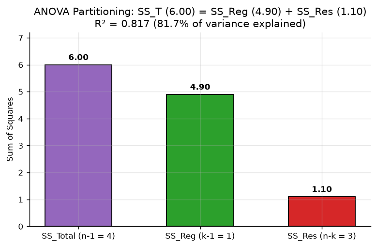

Total variation in sales can be broken down into two parts: variation our regression line explained, and leftover random noise:
$$\sum_{i=1}^n (y_i - \bar{y})^2 = \sum_{i=1}^n (\hat{y}_i - \bar{y})^2 + \sum_{i=1}^n (y_i - \hat{y}_i)^2$$

$$\boxed{SS_T = SS_{Reg} + SS_{Res}}$$

- **Total Sum of Squares ($SS_T$):** How much the actual points spread out around the grand average $\bar{y}$.
- **Regression Sum of Squares ($SS_{Reg}$):** How much variation our line successfully accounted for.
- **Residual Sum of Squares ($SS_{Res}$):** The unexplained leftover noise.

### Demystifying Degrees of Freedom (DF)
What does "degrees of freedom" actually mean?  
**The Restaurant Analogy:** Imagine 5 friends go to dinner and agree that their total bill must equal exactly Rs. 1000. The first 4 friends can pick whatever meal they want. But once those 4 have chosen, the 5th person has **no freedom of choice left**—their meal cost is locked in to hit Rs. 1000.

In statistics, every time we estimate a parameter from data, we consume 1 degree of freedom:
- **$DF(SS_T) = n - 1$:** We have $n$ observations, but calculating $SS_T$ requires the sample average $\bar{y}$. Because the sum of deviations around the mean must equal zero ($\sum (y_i - \bar{y}) = 0$), only $n-1$ points are free to vary. We lose **1** degree of freedom.
- **$DF(SS_{Res}) = n - k$:** The residuals $e_i$ must satisfy $k$ independent normal equations ($\mathbf{X}^T \mathbf{e} = \mathbf{0}$). Each estimated parameter consumes one degree of freedom. We lose **$k$** degrees of freedom.
- **$DF(SS_{Reg}) = k - 1$:** The model has $k$ parameters, but the intercept $\beta_0$ accounts for the overall mean $\bar{y}$. So only $k-1$ parameters contribute to explaining spread around the mean.

Notice how the degrees of freedom add up:
$$DF(SS_T) = DF(SS_{Reg}) + DF(SS_{Res}) \implies (n - 1) = (k - 1) + (n - k)$$

### Coefficient of Determination ($R^2$)
$R^2$ is simply the fraction of the total variation pie that our line successfully explained:
$$R^2 = \frac{SS_{Reg}}{SS_T} = 1 - \frac{SS_{Res}}{SS_T}$$

For Sir's Advertising vs Sales data:
- $SS_T = (1-2)^2 + (1-2)^2 + (2-2)^2 + (2-2)^2 + (4-2)^2 = 1 + 1 + 0 + 0 + 4 = 6.00$
- $SS_{Res} = 1.10$
- $SS_{Reg} = 6.00 - 1.10 = 4.90$
- $R^2 = \frac{4.90}{6.00} = \mathbf{0.8167 \approx 81.7\%}$

*Plain English interpretation:* 81.7% of the differences in sales between stores is directly explained by advertising spend; the remaining 18.3% is random noise.

---

## 8. Why Linear Regression Fails for Classification

Why can't we just fit a linear regression line to classification problems where $y \in \{0, 1\}$?

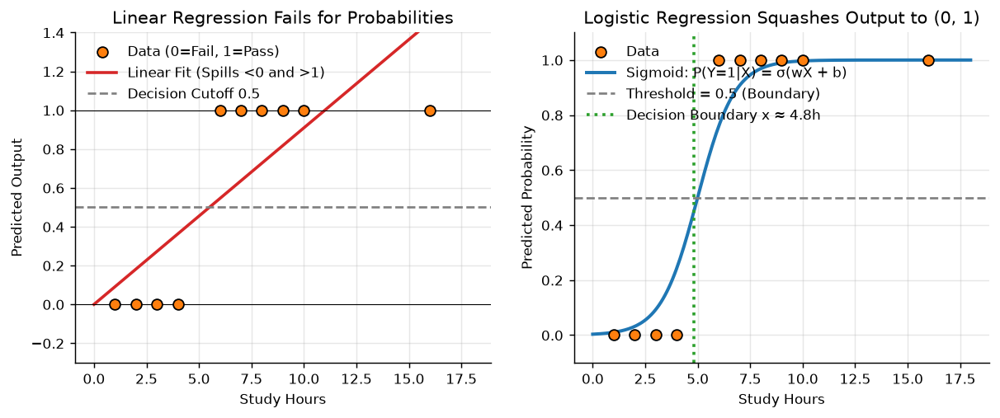

Lecture 3 demonstrates the three fatal flaws of using linear regression for classification (Left Panel):

1. **Unbounded Probabilities (Spillover):**  
   Probabilities must always lie between 0% and 100% ($0 \le P \le 1$). A straight line $\hat{y} = \mathbf{w}^T \mathbf{x} + b$ has no ceiling and no floor—it stretches from $-\infty$ to $+\infty$. If a student studies 15 hours, the line predicts $\hat{y} = 1.4$ (140% probability of passing). If someone studies 0 hours, it predicts $\hat{y} = -0.3$ (-30% probability). Negative probabilities are physically meaningless!
2. **Extreme Sensitivity to Outliers:**  
   Look at the left panel: suppose a superstar student studies 16 hours and passes ($y=1$). Because linear regression squares errors, the line tries desperately to minimize the distance to that extreme point. The line tilts sharply upward to the right, which **drags the decision cutoff at $\hat{y} = 0.5$ to the right**—accidentally failing ordinary students who studied 5 hours!
3. **Punished for Being "Too Right":**  
   If the true label is $y=1$, and our model outputs $\hat{y}=2.0$, squared error calculates $(2.0 - 1)^2 = 1.0$. The model receives a harsh penalty for being extra confident!

---

## 9. The Logistic (Sigmoid) Function & The Log-Odds (Logit) Formulation

Logistic Regression fixes this by inserting a mathematical link function that squashes any real-valued number into a valid probability between 0 and 1.

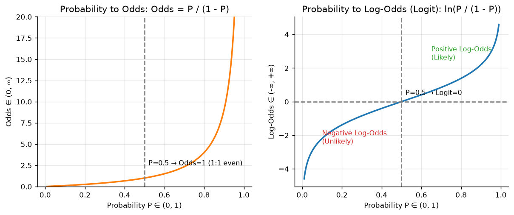

### The Sigmoid Function
The standard logistic sigmoid function is defined as:
$$\sigma(z) = \frac{1}{1 + e^{-z}} = \frac{e^z}{e^z + 1}$$

**Key Properties:**
- When $z = 0$, $\sigma(0) = \frac{1}{1+1} = \mathbf{0.5}$ (The natural decision boundary).
- As $z \to +\infty$, $\sigma(z) \to 1.0$.
- As $z \to -\infty$, $\sigma(z) \to 0.0$.
- **Symmetry:** $1 - \sigma(z) = \sigma(-z)$.
- **Derivative:** $\sigma'(z) = \sigma(z)\big(1 - \sigma(z)\big)$. The maximum slope is $0.25$ at $z=0$.

### The Bridge: From Probability to Log-Odds (The Logit)
Where does the sigmoid formula actually come from? We build it in 3 intuitive steps:

#### Step 1: Probability ($P$)
Probability is trapped inside the closed interval:
$$P \in [0, 1]$$

#### Step 2: Odds (Breaking the Ceiling)
Odds is the ratio of how likely an event is to happen versus not happen:
$$\text{Odds} = \frac{P}{1 - P} \in [0, \infty)$$

- If $P = 0.8$, $\text{Odds} = \frac{0.8}{0.2} = 4$ ("4 to 1 odds in favor").
- If $P = 0.5$, $\text{Odds} = \frac{0.5}{0.5} = 1$ ("Even 1 to 1 odds").
- If $P = 0.2$, $\text{Odds} = \frac{0.2}{0.8} = 0.25$ ("1 to 4 odds").

Notice that Odds breaks the upper ceiling of 1.0, but it is still blocked at zero—it cannot be negative.

#### Step 3: Log-Odds / The Logit (Breaking the Floor)
To allow negative numbers, we take the natural logarithm of the odds:
$$\text{logit}(P) = \ln(\text{Odds}) = \ln\left(\frac{P}{1 - P}\right) \in (-\infty, +\infty)$$

| Probability $P$ | Odds $= \frac{P}{1-P}$ | Log-Odds $= \ln(\text{Odds})$ | Everyday Meaning |
|:---:|:---:|:---:|:---|
| 0.001 | 0.001 | $-6.91$ | Virtually impossible |
| 0.10 | 0.111 | $-2.20$ | Highly unlikely |
| **0.50** | **1.000** | **0.00** | **Equally likely (The Decision Boundary)** |
| 0.90 | 9.000 | $+2.20$ | Highly likely |
| 0.999 | 999.0 | $+6.91$ | Almost guaranteed |

### The Core Logistic Equation
Now notice something extraordinary:
- A linear combination $\mathbf{w}^T \mathbf{x} + b$ ranges from $(-\infty, +\infty)$.
- The log-odds also ranges from $(-\infty, +\infty)$.

Therefore, **Logistic Regression sets the log-odds equal to the linear equation:**
$$\ln\left(\frac{P}{1 - P}\right) = \mathbf{w}^T \mathbf{x} + b$$

Take the exponential of both sides:
$$\frac{P}{1 - P} = e^{\mathbf{w}^T \mathbf{x} + b}$$

Solve for $P$:
$$P = (1 - P) e^{\mathbf{w}^T \mathbf{x} + b} \implies P\big(1 + e^{\mathbf{w}^T \mathbf{x} + b}\big) = e^{\mathbf{w}^T \mathbf{x} + b}$$

$$\boxed{P(Y=1 \mid \mathbf{x}) = \frac{e^{\mathbf{w}^T \mathbf{x} + b}}{1 + e^{\mathbf{w}^T \mathbf{x} + b}} = \frac{1}{1 + e^{-(\mathbf{w}^T \mathbf{x} + b)}} = \sigma(\mathbf{w}^T \mathbf{x} + b)}$$

*The circle is complete:* Starting from intuitive odds, the sigmoid formula emerges naturally!

---

## 10. Training Logistic Regression: Log-Loss & Gradient Descent

### Why Mean Squared Error (MSE) Fails for Logistic Regression
What happens if we try to train logistic regression using simple squared error?
$$J_{MSE}(\mathbf{w}) = \frac{1}{2m} \sum_{i=1}^m \big(\sigma(\mathbf{w}^T \mathbf{x}_i) - y_i\big)^2$$

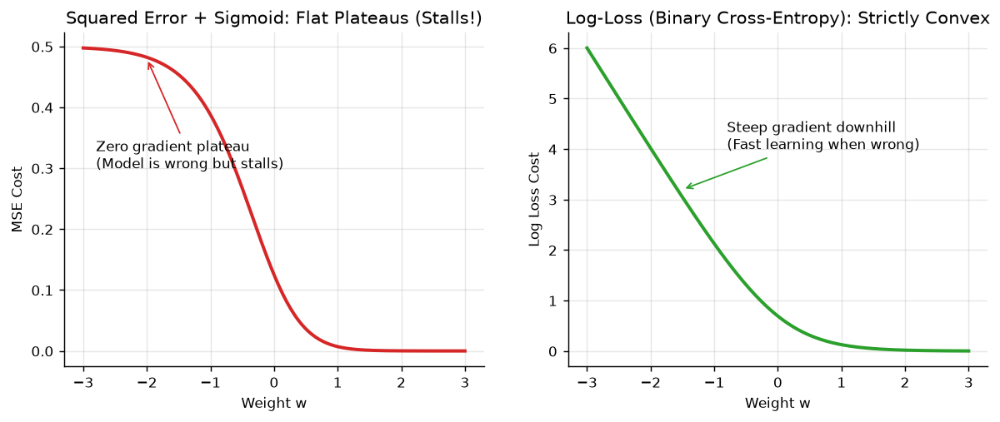

As shown in the left panel of Fig 6, this creates a **non-convex error surface** full of flat plateaus and local traps. When the model is confidently wrong (e.g. predicting $p=0.001$ when $y=1$), the sigmoid derivative $\sigma'(z) \to 0$. The gradient vanishes, and gradient descent stalls!

### Binary Cross-Entropy Loss (Log-Loss)
To guarantee a strictly convex, bowl-shaped surface with a single global minimum, we derive our loss function using **Maximum Likelihood Estimation (MLE)**.

For a single sample $(\mathbf{x}_i, y_i)$ with predicted probability $p_i = \sigma(\mathbf{w}^T \mathbf{x}_i + b)$:
$$P(y_i \mid \mathbf{x}_i) = p_i^{y_i} (1 - p_i)^{1 - y_i}$$

Taking the natural log turns products into easy sums:
$$\ln P(y_i \mid \mathbf{x}_i) = y_i \ln(p_i) + (1 - y_i) \ln(1 - p_i)$$

Because optimizers minimize cost, we negate the log-likelihood and average across all $m$ samples to get **Binary Cross-Entropy (Log-Loss)**:
$$\boxed{J(\mathbf{w}, b) = -\frac{1}{m} \sum_{i=1}^m \Big[ y_i \ln(p_i) + (1 - y_i) \ln(1 - p_i) \Big]}$$

> **Why the negative sign? (Lecture 3 Slide 38):** Probabilities are decimals between 0 and 1, and the logarithm of any decimal is always negative ($\ln 0.5 = -0.693$). Without the negative sign, our cost would be negative! The minus sign flips the cost into a clean positive number.

**How Log-Loss punishes mistakes:**
- If actual $y = 1$: Loss $= -\ln(p)$. If you predict $p = 0.99$, $-\ln(0.99) \approx 0.01$ (Tiny penalty). But if you predict $p = 0.01$, $-\ln(0.01) \approx 4.60$ (Enormous penalty blowing up toward infinity!).
- If actual $y = 0$: Loss $= -\ln(1-p)$. Predicting $p = 0.01$ gives almost zero loss; predicting $p = 0.99$ explodes toward infinity.

### Deriving the Gradient Descent Update Rule
Using the calculus chain rule:
$$\frac{\partial J}{\partial w_j} = \frac{\partial J}{\partial p} \cdot \frac{\partial p}{\partial z} \cdot \frac{\partial z}{\partial w_j}$$

Let's compute each component:
1. $\frac{\partial J}{\partial p_i} = -\left(\frac{y_i}{p_i} - \frac{1 - y_i}{1 - p_i}\right) = \frac{p_i - y_i}{p_i (1 - p_i)}$
2. $\frac{\partial p_i}{\partial z_i} = p_i (1 - p_i)$ (The derivative of the sigmoid)
3. $\frac{\partial z_i}{\partial w_j} = x_{ij}$

Now multiply them together:
$$\frac{\partial J}{\partial w_j} = \frac{1}{m} \sum_{i=1}^m \frac{p_i - y_i}{\underbrace{p_i(1-p_i)}_{\text{denominator}}} \cdot \underbrace{p_i(1-p_i)}_{\text{numerator}} \cdot x_{ij}$$

Notice the mathematical miracle: **The $p_i(1-p_i)$ terms cancel out completely!**
$$\boxed{\frac{\partial J}{\partial w_j} = \frac{1}{m} \sum_{i=1}^m (p_i - y_i) x_{ij}}$$
$$\boxed{\frac{\partial J}{\partial b} = \frac{1}{m} \sum_{i=1}^m (p_i - y_i)}$$

> **Notice the elegance:** The gradient of logistic regression with cross-entropy has the exact same mathematical form as linear regression: $(\text{Prediction} - \text{Actual}) \times \text{Input}$!

### The Parameter Update Rule
At every iteration, we nudge weights downhill against the gradient using learning rate $\alpha$:
$$w_j \leftarrow w_j - \alpha \frac{\partial J}{\partial w_j}, \qquad b \leftarrow b - \alpha \frac{\partial J}{\partial b}$$

---

## 11. Regularization: L1 (Lasso), L2 (Ridge), and the $C$ Parameter

If data can be separated perfectly, unregularized logistic regression tries to force probabilities to $1.0$ and $0.0$ by driving weights to $\pm \infty$. This causes overfitting and numerical crashes. Regularization acts like a leash that penalizes overly large weights.

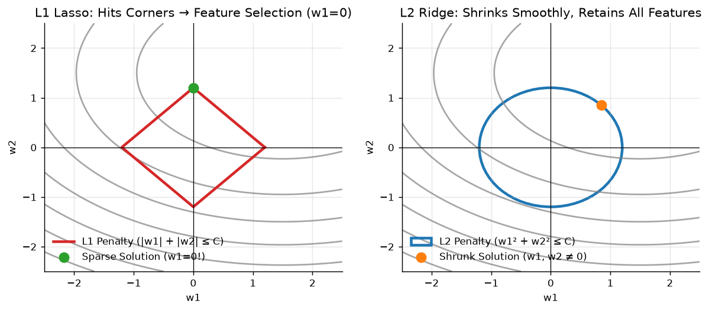

### 1. L1 Regularization (Lasso)
Adds the sum of absolute values of weights to the cost:
$$J_{L1}(\mathbf{w}) = J(\mathbf{w}) + \lambda \sum_{j=1}^d |w_j|$$

- **Geometry (Left Panel):** The constraint boundary is a sharp diamond with pointed corners sitting directly on the coordinate axes.
- **Consequence:** When the smooth loss ellipses expand, they almost always touch the diamond at one of its sharp corners where $w_1 = 0$. This forces unhelpful feature weights to become **identically zero**, acting as **automatic feature selection (sparsity)**.

### 2. L2 Regularization (Ridge)
Adds the sum of squared weights to the cost:
$$J_{L2}(\mathbf{w}) = J(\mathbf{w}) + \frac{\lambda}{2} \sum_{j=1}^d w_j^2$$

- **Geometry (Right Panel):** The constraint boundary is a smooth circle.
- **Consequence:** The loss contours touch the smooth circle off-axis. Weights are shrunk close to zero, but rarely become exactly zero. It retains all features while dampening variance.

### The Inverse Regularization Parameter $C$
In libraries like `scikit-learn`, regularization is controlled by $C = \frac{1}{\lambda}$:
- **Large $C$ (Small penalty $\lambda$):** Weak regularization. The model focuses entirely on fitting every training point (risk of overfitting).
- **Small $C$ (Large penalty $\lambda$):** Strong regularization. Heavily penalizes weight magnitudes, forcing a simpler, smoother decision boundary (risk of underfitting).

---

## 12. Multiclass Classification: One-vs-Rest vs Multinomial Softmax

When we have $K > 2$ classes (e.g. Apple, Banana, Orange), logistic regression extends using two strategies:

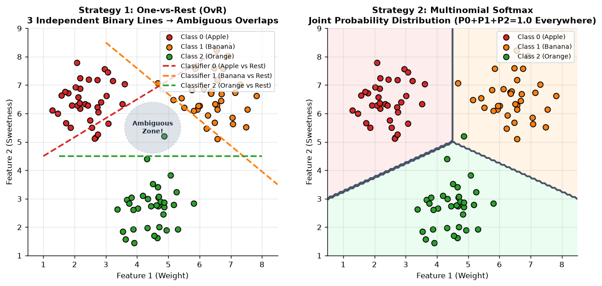

### Strategy 1: One-vs-Rest (OvR / One-vs-All)
- Trains $K$ separate binary classifiers.
- Classifier 0: Apple vs. (Banana + Orange).
- Classifier 1: Banana vs. (Apple + Orange).
- Classifier 2: Orange vs. (Apple + Banana).
- **At test time:** Run all 3 models and pick whichever class outputs the highest confidence: $\hat{y} = \arg\max_k P_k(\mathbf{x})$.
- **The flaw (Left Panel):** Can create ambiguous overlapping zones where multiple classifiers say "Yes!" at the same time. The probabilities don't naturally add up to 1.0.

### Strategy 2: Multinomial Logistic Regression (Softmax Regression)
Instead of running separate models, Softmax models all $K$ classes simultaneously into a single probability distribution that is guaranteed to sum to 1.0 (100%):

$$P(y = k \mid \mathbf{x}) = \frac{e^{z_k}}{\sum_{j=1}^K e^{z_j}}, \qquad z_k = \mathbf{w}_k^T \mathbf{x} + b_k$$

In matrix form across a batch:
$$\mathbf{Z} = \mathbf{X}\mathbf{W} + \mathbf{b}$$
Where $\mathbf{W}$ is a $d \times K$ weight matrix (one column per class).

**Categorical Cross-Entropy Loss:**
$$\mathcal{L}(\mathbf{W}, \mathbf{b}) = -\frac{1}{m} \sum_{i=1}^m \sum_{k=1}^K y_{ik} \ln(p_{ik})$$

**Matrix Gradient:**
$$\boxed{\frac{\partial \mathcal{L}}{\partial \mathbf{W}} = \frac{1}{m} \mathbf{X}^T (\mathbf{P} - \mathbf{Y})}$$
$$\boxed{\frac{\partial \mathcal{L}}{\partial \mathbf{b}} = \frac{1}{m} \sum_{i=1}^m (\mathbf{p}_i - \mathbf{y}_i)}$$

---

## 13. Worked Numerical Example: Multiclass Fruit Classification

Lecture 3 (Slides 60–73) presents a complete end-to-end numerical example classifying 6 fruit samples into **Apple** ($k=0$), **Banana** ($k=1$), or **Orange** ($k=2$) based on **Weight** ($x_1$) and **Sweetness** ($x_2$).

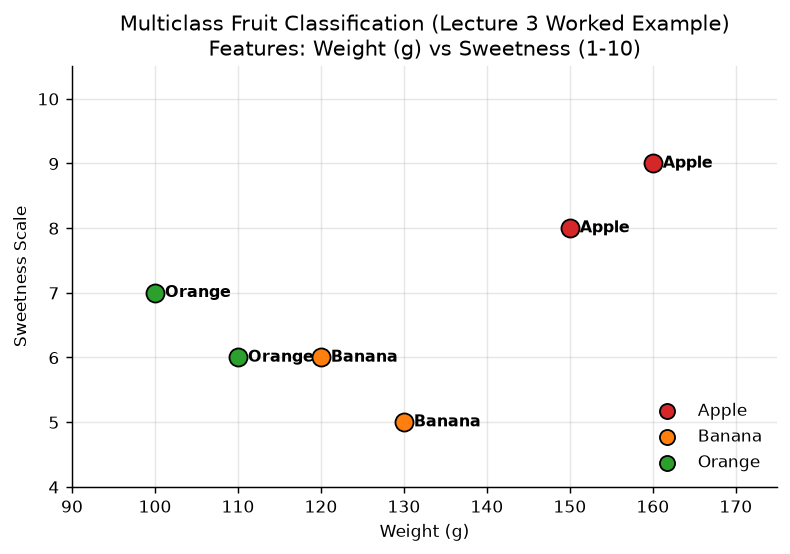

### The Raw Dataset & One-Hot Targets $\mathbf{Y}$

| Sample $i$ | Weight ($x_1$) | Sweetness ($x_2$) | Fruit Label | One-Hot $\mathbf{y}_i$ |
|:---:|:---:|:---:|:---:|:---:|
| 1 | 150 | 8 | Apple | $[1, 0, 0]$ |
| 2 | 120 | 6 | Banana | $[0, 1, 0]$ |
| 3 | 100 | 7 | Orange | $[0, 0, 1]$ |
| 4 | 130 | 5 | Banana | $[0, 1, 0]$ |
| 5 | 160 | 9 | Apple | $[1, 0, 0]$ |
| 6 | 110 | 6 | Orange | $[0, 0, 1]$ |

### Step 1: Pre-scaled Inputs & Initial Parameters
To keep manual exam arithmetic simple, Slide 61 uses pre-standardized inputs and initial weights:
$$\mathbf{X}_{\text{scaled}} = \begin{bmatrix} 1.2 & 1.1 \\ -0.2 & -0.3 \\ -1.0 & 0.5 \\ 0.3 & -1.1 \\ 1.5 & 1.5 \\ -0.8 & -0.3 \end{bmatrix}, \quad
\mathbf{W} = \begin{bmatrix} 0.1 & 0.2 & 0.3 \\ 0.4 & 0.5 & 0.6 \end{bmatrix}, \quad
\mathbf{b} = \begin{bmatrix} 0.1 & 0.2 & 0.3 \end{bmatrix}$$

### Step 2: Forward Pass & Mathematical Slide Typo Audit

> ✏️ **Slide Typo Audit (Slide 63):**  
> In Slide 63, the slide author computes the first row of logits as:  
> - $z_{11} = 1.2(0.1) + 1.1(0.4) + 0.1 = \mathbf{0.66}$  
> - $z_{12} = 1.2(0.1) + 1.1(0.5) + 0.1 = \mathbf{0.77}$  *(Slide error: accidentally reused $W_{11}=0.1$ and $b_1=0.1$ instead of $W_{12}=0.2, b_2=0.2$!)*  
> - $z_{13} = 1.2(0.1) + 1.1(0.6) + 0.1 = \mathbf{0.88}$  *(Slide error: accidentally reused $W_{11}=0.1$ and $b_1=0.1$ instead of $W_{13}=0.3, b_3=0.3$!)*  
>
> **The True Mathematical Calculation:**
> - $z_{11} = 1.2(0.1) + 1.1(0.4) + 0.1 = 0.12 + 0.44 + 0.10 = \mathbf{0.66}$
> - $z_{12} = 1.2(0.2) + 1.1(0.5) + 0.2 = 0.24 + 0.55 + 0.20 = \mathbf{0.99}$
> - $z_{13} = 1.2(0.3) + 1.1(0.6) + 0.3 = 0.36 + 0.66 + 0.30 = \mathbf{1.32}$
>
> Below we report both tracks: the slide's printed track (to match lecture slides on exams) and the mathematically exact ground-truth values.

#### Comparison of Logits, Softmax Probabilities, and Gradients:

| Metric | Slide 63 Track (Reproducing Slide) | True Mathematical Ground Truth |
|:---|:---:|:---:|
| **Sample 1 Logits $\mathbf{z}_1$** | $[0.66, 0.77, 0.88]$ | $[0.66, 0.99, 1.32]$ |
| **Sample 1 Softmax $\mathbf{p}_1$** | $[0.30, 0.34, 0.36]$ | $[0.23, 0.32, 0.45]$ |
| **Sample 1 Loss $\mathcal{L}_1 = -\ln(p_{11})$** | $-\ln(0.30) = \mathbf{1.20}$ | $-\ln(0.23) = \mathbf{1.46}$ |
| **Average Batch Loss $\mathcal{L}$** | $\approx \mathbf{1.15}$ | $\mathbf{1.23}$ |
| **Gradient $\frac{\partial \mathcal{L}}{\partial \mathbf{W}}$** | $\begin{bmatrix} -0.12 & 0.05 & 0.07 \\ -0.10 & 0.04 & 0.06 \end{bmatrix}$ | $\begin{bmatrix} -0.44 & 0.03 & 0.41 \\ -0.40 & 0.30 & 0.10 \end{bmatrix}$ |
| **Gradient $\frac{\partial \mathcal{L}}{\partial \mathbf{b}}$** | $[-0.02, 0.01, 0.01]$ | $[-0.04, -0.00, 0.05]$ |
| **Updated Weights $\mathbf{W}_{\text{new}}$ ($\alpha=0.1$)** | $\begin{bmatrix} 0.112 & 0.195 & 0.293 \\ 0.410 & 0.496 & 0.594 \end{bmatrix}$ | $\begin{bmatrix} 0.144 & 0.197 & 0.259 \\ 0.440 & 0.470 & 0.590 \end{bmatrix}$ |
| **Updated Bias $\mathbf{b}_{\text{new}}$ ($\alpha=0.1$)** | $[0.102, 0.199, 0.299]$ | $[0.104, 0.201, 0.295]$ |

---

## 14. Optimization Solvers in Logistic Regression

Unlike Linear Regression, Logistic Regression has **no closed-form matrix formula** because the equations are non-linear. We must use numerical optimization algorithms.

Here is the quick-reference guide to the 6 solvers used in production:

| Solver | How It Works | Supported Penalties | Multiclass Handling | Best Used For | Drawbacks |
|:---|:---|:---:|:---:|:---|:---|
| **Batch Gradient Descent** | Computes gradient on all $m$ samples each step | L2, None | OvR, Softmax | Small clean datasets; classroom code | Very slow on large datasets |
| **Stochastic GD (SGD)** | Updates weights after looking at 1 random sample | L1, L2, ElasticNet | OvR | Massive streaming datasets | Erratic convergence paths |
| **Mini-Batch GD** | Updates weights on small batches (32–256 samples) | L1, L2, ElasticNet | OvR, Softmax | Deep learning, GPU acceleration | Requires tuning batch size |
| **L-BFGS** | Approximates second derivatives without full Hessian | L2, None | **Softmax**, OvR | **Default in scikit-learn; general multiclass** | Cannot handle L1 penalty |
| **LIBLINEAR** | Optimizes one coordinate axis at a time | L1, L2 | **OvR only** (No native Softmax) | High-dimensional sparse text data (TF-IDF) | Cannot model joint Softmax |
| **SAGA** | Fast stochastic solver supporting non-smooth terms | **L1**, L2, ElasticNet | **Softmax**, OvR | **Massive data needing both L1 Lasso + Softmax** | Slower on small dense sets |

---

## 15. Linear Regression vs Logistic Regression: The Complete Comparison

| Dimension | Simple / Multiple Linear Regression | Logistic Regression |
|:---|:---|:---|
| **Primary Goal** | Predict continuous numerical values | Predict discrete categorical class probabilities |
| **Output Range** | Unbounded: $\hat{y} \in (-\infty, +\infty)$ | Strictly bounded probability: $P \in (0, 1)$ |
| **Core Equation** | Linear line: $\hat{y} = \mathbf{w}^T \mathbf{x} + b$ | Sigmoid squashing: $p = \sigma(\mathbf{w}^T \mathbf{x} + b)$ |
| **Closed-Form Formula?** | **Yes:** Normal Equations $\hat{\boldsymbol{\beta}} = (\mathbf{X}^T \mathbf{X})^{-1} \mathbf{X}^T \mathbf{Y}$ | **No:** Requires iterative solvers (Gradient Descent, L-BFGS) |
| **Loss Function** | Mean Squared Error (MSE / $SS_{Res}$) | Binary Cross-Entropy (Log-Loss) |
| **Loss Convexity** | Parabolic bowl (Always strictly convex) | Cross-entropy ensures strict convexity (MSE would fail) |
| **Evaluation Metrics** | $R^2$, Adjusted $R^2$, RMSE, MAE | Accuracy, Precision, Recall, F1-Score, ROC-AUC |
| **Outlier Sensitivity** | High (Squared vertical distances drag the line) | Low to Moderate (Sigmoid squashes extreme values) |
| **Guaranteed Invariant** | Residuals sum to zero ($\sum e_i = 0$) | Probabilities sum to one ($\sum_k p_k = 1.0$) |

---

## 16. Cheat Sheet

| Topic / Concept | Exact Formula or Fact to Memorize |
|:---|:---|
| **Mitchell's Definition** | Learning = Experience $E$ improves Performance $P$ on Task $T$ |
| **SLR Model** | $y_i = a + cx_i + \epsilon_i$, where $\epsilon_i \sim \mathcal{N}(0, \sigma^2)$ |
| **Least Squares Slope $\hat{c}$** | $\hat{c} = \frac{\sum (x_i - \bar{x})(y_i - \bar{y})}{\sum (x_i - \bar{x})^2} = \frac{n\sum xy - \sum x \sum y}{n\sum x^2 - (\sum x)^2}$ |
| **Least Squares Intercept $\hat{a}$** | $\hat{a} = \bar{y} - \hat{c}\bar{x} \implies$ Guaranteed to pass through $(\bar{x}, \bar{y})$ |
| **MLR Normal Equations** | $\mathbf{X}^T \mathbf{X} \hat{\boldsymbol{\beta}} = \mathbf{X}^T \mathbf{Y} \implies \hat{\boldsymbol{\beta}} = (\mathbf{X}^T \mathbf{X})^{-1} \mathbf{X}^T \mathbf{Y}$ |
| **Residual Orthogonality** | $\mathbf{X}^T \mathbf{e} = \mathbf{0} \implies \sum e_i = 0$ and $\sum e_i x_{ij} = 0$ |
| **ANOVA Identity** | $SS_T = SS_{Reg} + SS_{Res}$, with $DF: (n-1) = (k-1) + (n-k)$ |
| **Coefficient of Determination** | $R^2 = \frac{SS_{Reg}}{SS_T} = 1 - \frac{SS_{Res}}{SS_T}$ |
| **Odds Formula** | $\text{Odds} = \frac{P}{1 - P}$, ranges over $[0, \infty)$ |
| **Log-Odds (Logit)** | $\text{logit}(P) = \ln\left(\frac{P}{1 - P}\right) = \mathbf{w}^T \mathbf{x} + b$, ranges over $(-\infty, \infty)$ |
| **Sigmoid Function** | $\sigma(z) = \frac{1}{1 + e^{-z}}$, derivative $\sigma'(z) = \sigma(z)(1 - \sigma(z))$ |
| **Binary Cross-Entropy** | $J(\mathbf{w}, b) = -\frac{1}{m} \sum [y \ln p + (1-y) \ln(1-p)]$ |
| **Cross-Entropy Gradient** | $\frac{\partial J}{\partial w_j} = \frac{1}{m} \sum (p_i - y_i) x_{ij}$ (Sigmoid slope cancelled out!) |
| **L1 vs L2 Regularization** | L1 = $\lambda \sum |w_j|$ (Sparse feature selection) · L2 = $\frac{\lambda}{2} \sum w_j^2$ (Smooth shrinkage) |
| **Multinomial Softmax** | $P(y = k) = \frac{e^{z_k}}{\sum_{j=1}^K e^{z_j}}$, matrix gradient $\frac{\partial \mathcal{L}}{\partial \mathbf{W}} = \frac{1}{m} \mathbf{X}^T (\mathbf{P} - \mathbf{Y})$ |

---

## 17. Viva Voce Questions & Answers

**Q1. Why does the sum of residuals $\sum_{i=1}^n e_i$ always equal zero in Ordinary Least Squares?**  
Because the intercept $\hat{a}$ is calculated by setting the partial derivative $\frac{\partial S}{\partial a} = -2\sum (y_i - \hat{a} - \hat{c}x_i) = 0$. Since $e_i = y_i - \hat{a} - \hat{c}x_i$, this first normal equation mathematically enforces $\sum e_i = 0$.

**Q2. Why is a model like $y = \beta_0 + \beta_1 x + \beta_2 x^2$ classified as a Multiple Linear Regression model?**  
In statistical mathematics, "linear" refers strictly to **linearity in the unknown parameters $\beta$**, not in the features $x$. Because the partial derivatives $\frac{\partial y}{\partial \beta_j}$ do not contain any parameters, the resulting normal equations form a linear matrix system solvable by direct inversion.

**Q3. Why does Residual Sum of Squares ($SS_{Res}$) have $n - k$ degrees of freedom instead of $n$?**  
The $n$ individual residuals $e_1, \dots, e_n$ are tied down by $k$ independent normal equations ($\mathbf{X}^T \mathbf{e} = \mathbf{0}$). Each independent mathematical constraint removes one degree of freedom, leaving only $n-k$ residuals free to vary.

**Q4. What is the geometric interpretation of the normal equations $\mathbf{X}^T \mathbf{X}\boldsymbol{\beta} = \mathbf{X}^T \mathbf{Y}$?**  
The fitted vector $\hat{\mathbf{Y}} = \mathbf{X}\hat{\boldsymbol{\beta}}$ is the **orthogonal projection** of the observed vector $\mathbf{Y}$ onto the subspace spanned by the columns of $\mathbf{X}$. The residual vector $\mathbf{e} = \mathbf{Y} - \hat{\mathbf{Y}}$ is perpendicular to that entire subspace ($\mathbf{X}^T \mathbf{e} = \mathbf{0}$).

**Q5. Why can't we use Mean Squared Error as the loss function for Logistic Regression?**  
Plugging the non-linear sigmoid $\sigma(\mathbf{w}^T \mathbf{x})$ into a quadratic loss function results in a **non-convex** error surface with numerous local traps and flat plateaus where the gradient vanishes. Cross-entropy loss guarantees a strictly convex bowl with a unique global minimum.

**Q6. What causes the sigmoid derivative to disappear in the cross-entropy gradient?**  
In the chain rule $\frac{\partial J}{\partial \mathbf{w}} = \frac{\partial J}{\partial p} \frac{\partial p}{\partial z} \mathbf{x}$, the cross-entropy derivative $\frac{\partial J}{\partial p} = \frac{p - y}{p(1-p)}$ carries $p(1-p)$ in its denominator, which perfectly cancels the numerator $p(1-p)$ originating from the sigmoid derivative $\frac{\partial p}{\partial z}$.

**Q7. Why does L1 regularization (Lasso) produce sparse models with zeroed-out coefficients while L2 does not?**  
The L1 constraint boundary is a diamond with sharp vertices sitting directly on the parameter axes. When the smooth elliptical loss contours expand, they are geometrically most likely to first contact the diamond boundary at one of these sharp corners where one or more coordinates equal zero.

**Q8. What happens to unregularized logistic regression if training data is perfectly linearly separable?**  
The maximum likelihood solution does not exist. The algorithm will attempt to achieve $p_i = 1$ and $p_i = 0$ by driving weights $\lVert\mathbf{w}\rVert \to \infty$, leading to numerical overflow. Regularization ($C < \infty$) is necessary to penalize weight magnitude and keep values stable.

**Q9. When would you choose the L-BFGS solver over LIBLINEAR?**  
L-BFGS natively models multinomial cross-entropy (Softmax) for multiclass problems and supports second-order curvature approximations without computing the full Hessian. LIBLINEAR is restricted to One-vs-Rest for multiclass problems and cannot optimize true Softmax.

**Q10. Why must features be scaled (StandardScaler) before training regularized Logistic Regression?**  
The regularization penalty ($\lambda \sum w_j^2$ or $\lambda \sum |w_j|$) treats all weight magnitudes equally. If one feature is measured in grams (100–1000) and another in ratios (0–1), the unscaled feature's weight will be tiny and unfairly protected from penalization, distorting the regularized boundary.
