# Neural Networks: A Short Visual Guide

> Covers all the theory and derivations from **Neural_network_1**, **Neural_Network_2** and **Neural_Network_3**, in simple English with real plots and diagrams. Every number in this guide was computed.
> Continues into the [Activations, Cross-Entropy and Backprop guide](activation_crossentropy_backprop_visual_guide.md), which covers Lectures 7, 10 and 11.
>
> 🟠 orange circle = output 0 · 🔵 blue square = output 1

**The story in one line:** a neuron is a weighted sum plus a decision → one neuron only draws straight lines → stack them with non-linear activations to draw curves → train the stack by pushing the output error backwards with the chain rule.

## Contents

1. [From brain to artificial neuron](#1-from-brain-to-artificial-neuron)
2. [McCulloch-Pitts neuron and the perceptron](#2-mcculloch-pitts-neuron-and-the-perceptron)
3. [Logic gates with one neuron](#3-logic-gates-with-one-neuron)
4. [Perceptron learning algorithm](#4-perceptron-learning-algorithm)
5. [Convergence proof](#5-convergence-proof)
6. [XOR needs a hidden layer](#6-xor-needs-a-hidden-layer)
7. [Multilayer feed-forward networks](#7-multilayer-feed-forward-networks)
8. [Activation functions](#8-activation-functions)
9. [Gradient descent and the delta rule](#9-gradient-descent-and-the-delta-rule)
10. [Learning rate, batches and epochs](#10-learning-rate-batches-and-epochs)
11. [Problems: minima, saddles, vanishing and exploding gradients](#11-problems-minima-saddles-vanishing-and-exploding-gradients)
12. [Backpropagation derivation](#12-backpropagation-derivation)
13. [Worked backpropagation example](#13-worked-backpropagation-example)
14. [Cheat sheet](#14-cheat-sheet)
15. [Viva questions](#15-viva-questions)

---

## 1. From brain to artificial neuron

**The biological neuron:**

- The brain has about $10^{11}$ neurons that talk using electrical impulses.
- **Dendrites** receive signals, and the **soma** (cell body) adds them up.
- If the total crosses a **threshold**, the neuron fires. The signal travels along the **axon** and reaches other neurons through **synapses**.

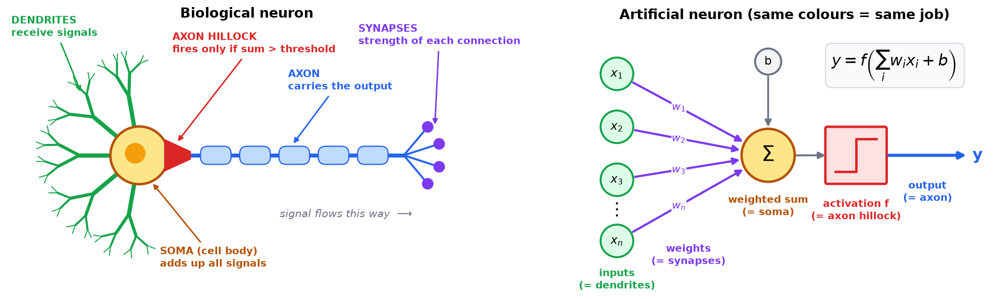

| Biological part | Artificial counterpart | Shared job |
|:---|:---|:---|
| Dendrites | Inputs $x_i$ | receive signals |
| Synapses | Weights $w_i$ | set the strength of each signal |
| Soma | Weighted sum | add the inputs up |
| Axon hillock | Activation threshold | decide whether to fire |
| Axon | Output $y$ | send the result on |
| Neurotransmitters | Weights and bias | excite or inhibit |
| Synaptic plasticity | Weight updates | this is how learning happens |
| Membrane potential | Sum before activation | the neuron's "readiness" |
| Refractory period | (roughly) dropout | switch neurons off for a while |

```math
y = f\Big(\sum_i w_i x_i + b\Big)
```

---

## 2. McCulloch-Pitts neuron and the perceptron

### McCulloch-Pitts (M-P) neuron

- Inputs are 0 or 1, and there are **no weights**.
- It fires when the sum reaches the threshold $\theta$:

```math
y = 1 \text{ if } \sum_i x_i \ge \theta, \text{ otherwise } 0
```

- **AND** of $n$ inputs uses $\theta = n$. **OR** uses $\theta = 1$.
- An **inhibitory** input forces the output to 0, whatever the other inputs add up to.

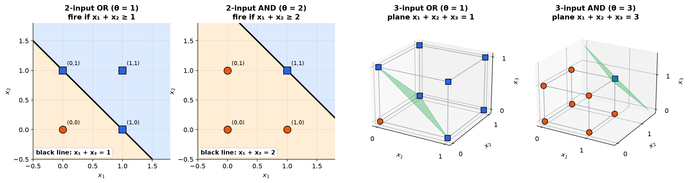

**Geometry:** the boundary $x_1 + x_2 = \theta$ is a **line** in 2-D, a **plane** in 3-D, and a hyperplane in higher dimensions. So one neuron can only compute **linearly separable** functions.

**Reading the pictures:** the neuron fires for every input point on the *upper-right* side of the boundary line. For OR ($\theta=1$) that region contains three of the four corners; for AND ($\theta=2$) it contains only $(1,1)$. Changing $\theta$ just slides the same line back and forth — which is exactly why a bias is useful.

### Inhibitory inputs: NOT, NOR and "AND NOT"

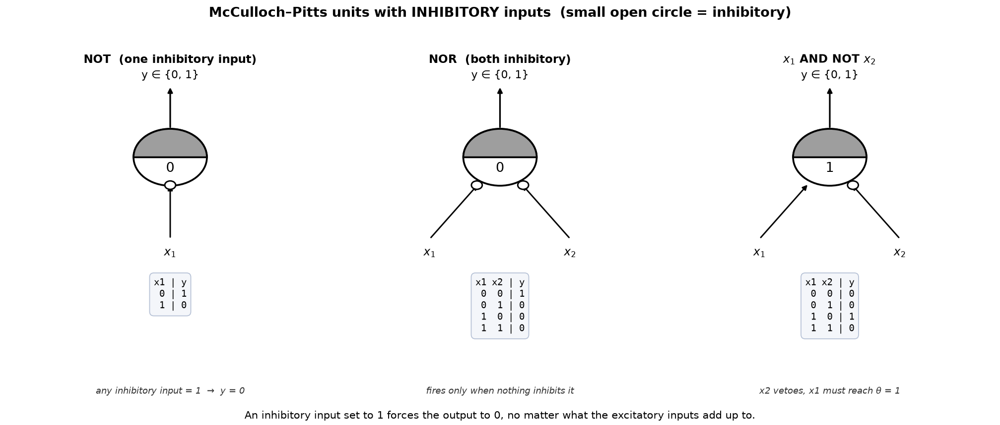

An **inhibitory** input (drawn as a small open circle where it meets the neuron) acts as a **veto**: if it is 1 the output is 0 regardless of the sum. That single extra idea lets the weightless M-P unit compute gates that pure summation cannot:

| Gate | Inputs | θ | Rule |
|:---|:---|:---:|:---|
| NOT | $x_1$ inhibitory | 0 | fires unless $x_1$ vetoes |
| NOR | both inhibitory | 0 | fires only when nothing vetoes |
| $x_1$ AND NOT $x_2$ | $x_1$ excitatory, $x_2$ inhibitory | 1 | $x_1$ must reach the threshold **and** $x_2$ must stay quiet |

**What the M-P neuron still cannot do** — and this is why the perceptron was invented:

1. inputs must be **boolean** (0/1), so real-valued features are out;
2. there are **no weights**, so every input counts equally;
3. the threshold $\theta$ must be **chosen by hand** — there is no learning;
4. even with a hand-picked $\theta$, only **linearly separable** functions are reachable.

### The perceptron

The perceptron adds **real-valued inputs**, **weights** and **learning**.

**The bias trick:** rewrite $\sum w_i x_i \ge \theta$ as $\sum w_i x_i - \theta \ge 0$, then add a constant input $x_0 = 1$ with weight $w_0 = -\theta$:

```math
y = 1 \iff \sum_{i=0}^{n} w_i x_i = \mathbf{w}^T\mathbf{x} \ge 0
```

Now the threshold is just another weight, called the **bias**. It shifts the boundary so it doesn't have to pass through the origin.

> **Don't confuse** this with bias vs variance. **High bias** means a large training error (underfitting). **High variance** means a large validation error (overfitting).

---

## 3. Logic gates with one neuron

**Learning a gate means searching for weights with zero error.** For OR with $w_0 = -1$:

| Weights $(w_0, w_1, w_2)$ | Mistakes out of 4 |
|:---|:---:|
| $(-1, -1, -1)$ | 3 |
| $(-1, 1.5, 0)$ | 1 |
| $(-1, 2, 2)$ | **0** ✓ |

### Why guessing is not a strategy: the error surface

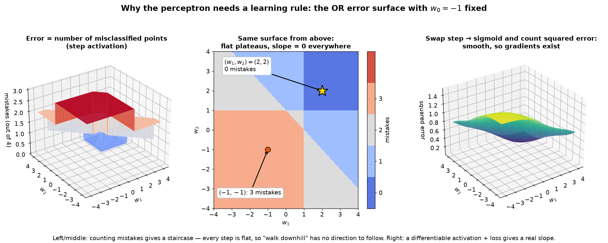

Fix $w_0 = -1$ and plot the error — *the number of misclassified patterns* — for every $(w_1, w_2)$:

- The surface is a **staircase**. It can only take the values 0, 1, 2, 3 or 4, so it is made of **flat plateaus** with vertical cliffs between them.
- On a plateau the slope is **exactly 0**; on a cliff it is **undefined**. "Walk downhill" therefore has no direction to follow — gradient descent is useless here.
- The middle panel confirms both hand-checked values: $(-1,-1)$ sits in the 3-mistake region and $(2,2)$ in the 0-mistake region.

Two different escape routes come out of this one picture, and the rest of the guide is built on them:

1. **Keep the step function, drop the gradient.** Use a rule that only reacts to *which* points are wrong, not to how wrong they are — the **perceptron learning algorithm** (section 4).
2. **Keep the gradient, drop the step function.** Replace the step with a smooth activation and count *squared error* instead of mistakes (right panel). Now the surface is differentiable, so **gradient descent** works (section 9) — and this is the route that scales to deep networks.

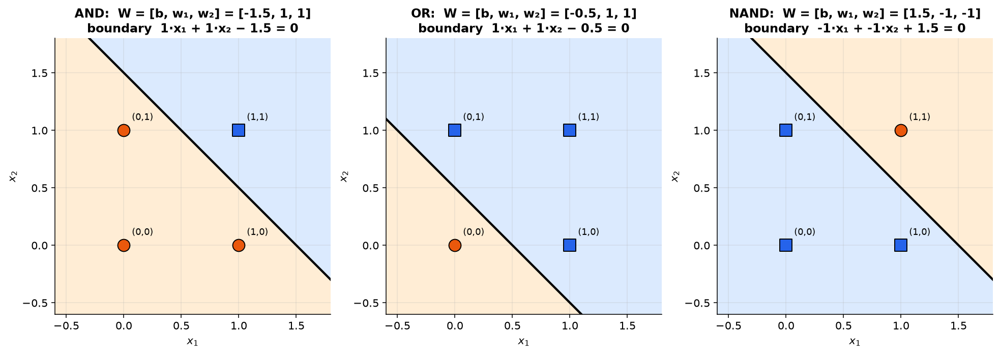

**Weights that work** (with the step function):

- AND: $[-1.5, 1, 1]$
- OR: $[-0.5, 1, 1]$
- NAND: $[1.5, -1, -1]$

**Matrix form.** Put the four input patterns in the columns of $X$, with the bias row on top:

```math
X = \begin{bmatrix} 1 & 1 & 1 & 1 \\ 0 & 0 & 1 & 1 \\ 0 & 1 & 0 & 1 \end{bmatrix}
```

```math
\text{AND: } [-1.5,\ 1,\ 1]\,X = [-1.5,\ -0.5,\ -0.5,\ 0.5] \xrightarrow{\text{step}} [0,\ 0,\ 0,\ 1]
```

```math
\text{OR: } [-0.5,\ 1,\ 1]\,X = [-0.5,\ 0.5,\ 0.5,\ 1.5] \xrightarrow{\text{step}} [0,\ 1,\ 1,\ 1]
```

This one-layer, forward-only network is called a **Single Layer Feed-Forward Neural Network (SLFFNN)**. For $m$ classes it has $m$ output neurons, each trained separately.

---

## 4. Perceptron learning algorithm

```text
P = inputs with label 1,  N = inputs with label 0
initialize w randomly
while not converged:
    pick a random x
    if x in P and w.x < 0:  w = w + x
    if x in N and w.x >= 0: w = w - x
```

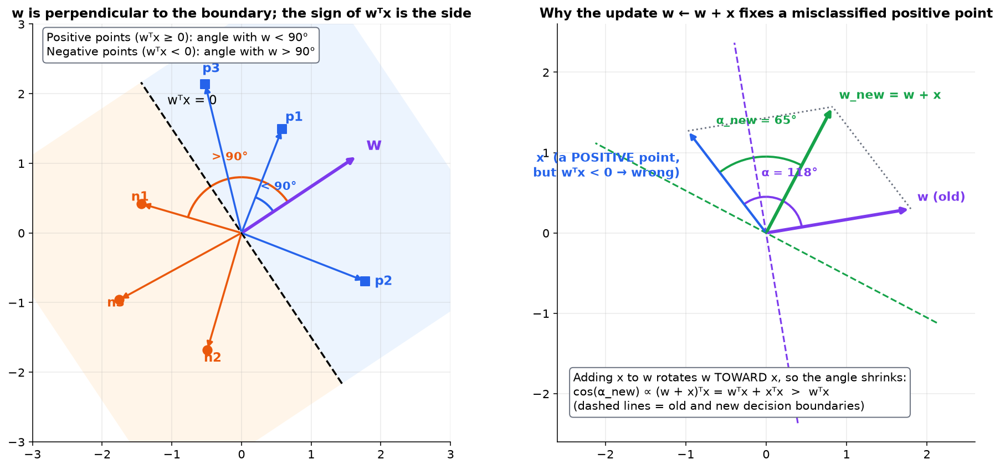

**Why the update works:**

- Since $\mathbf{w}^T\mathbf{x} = \lVert\mathbf{w}\rVert\lVert\mathbf{x}\rVert\cos\alpha$, the **sign of $\mathbf{w}^T\mathbf{x}$ is the sign of $\cos\alpha$**. Positive points need an angle below 90°, negative points above 90°.
- **Missed positive point:**

```math
(\mathbf{w}+\mathbf{x})^T\mathbf{x} = \mathbf{w}^T\mathbf{x} + \lVert\mathbf{x}\rVert^2 > \mathbf{w}^T\mathbf{x} \;\Rightarrow\; \cos\alpha \text{ grows} \;\Rightarrow\; \alpha \text{ shrinks}
```

  So $\mathbf{w}$ rotates **toward** $\mathbf{x}$ (in the picture, 118° becomes 65°).
- **Missed negative point:** subtracting $\mathbf{x}$ does the opposite and increases the angle.

---

## 5. Convergence proof

**Claim:** if the data is linearly separable, the algorithm stops after a finite number of corrections.

**Setup:**

1. Replace every negative point by $-\mathbf{x}$. Now the goal is simply $\mathbf{w}^T\mathbf{p} \ge 0$ for all points $\mathbf{p}$.
2. Normalize every point so $\lVert\mathbf{p}\rVert = 1$.
3. Let $\mathbf{w}^{\ast}$ be a solution with $\lVert\mathbf{w}^{\ast}\rVert = 1$, and let $\delta = \min_{\mathbf{p}} \mathbf{w}^{\ast T}\mathbf{p} > 0$ be the smallest margin.
4. After $k$ corrections, look at the angle $\beta$ between the current $\mathbf{w}$ and $\mathbf{w}^{\ast}$:

```math
\cos\beta = \frac{\mathbf{w}^{*T}\mathbf{w}_{t+1}}{\lVert\mathbf{w}_{t+1}\rVert}
```

**The numerator grows at least linearly** (each correction adds at least $\delta$):

```math
\mathbf{w}^{*T}\mathbf{w}_{t+1} = \mathbf{w}^{*T}\mathbf{w}_t + \mathbf{w}^{*T}\mathbf{p}_i \ge \mathbf{w}^{*T}\mathbf{w}_t + \delta \ge \dots \ge \mathbf{w}^{*T}\mathbf{w}_0 + k\delta
```

**The denominator grows at most like a square root** (the middle term is negative because it was a mistake):

```math
\lVert\mathbf{w}_{t+1}\rVert^2 = \lVert\mathbf{w}_t\rVert^2 + 2\mathbf{w}_t^T\mathbf{p}_i + \lVert\mathbf{p}_i\rVert^2 \le \lVert\mathbf{w}_t\rVert^2 + 1 \le \dots \le \lVert\mathbf{w}_0\rVert^2 + k
```

**Combine them:**

```math
\cos\beta \ge \frac{\mathbf{w}^{*T}\mathbf{w}_0 + k\delta}{\sqrt{\lVert\mathbf{w}_0\rVert^2 + k}}
```

- The bound grows like $\sqrt{k}$, but a cosine can never exceed 1, so **k must be finite**. ∎
- Starting from $\mathbf{w}_0 = 0$ gives $\sqrt{k}\delta \le 1$, so **k ≤ 1/δ²**.

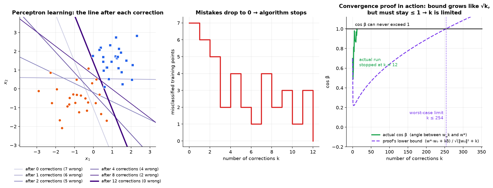

**Real run:** on 50 separable points the smallest margin was $\delta = 0.0627$, so the proof guarantees at most $1/\delta^2 = 254$ corrections. The algorithm actually stopped after **12** (starting from 7 misclassified points). The bound is a worst case, not the typical case — it is about 20× pessimistic here.

---

## 6. XOR needs a hidden layer

| $x_1$ | $x_2$ | OR = $h_1$ | NAND = $h_2$ | AND($h_1$, $h_2$) = XOR |
|:---:|:---:|:---:|:---:|:---:|
| 0 | 0 | 0 | 1 | **0** |
| 0 | 1 | 1 | 1 | **1** |
| 1 | 0 | 1 | 1 | **1** |
| 1 | 1 | 1 | 0 | **0** |

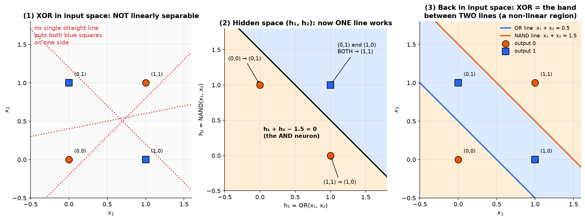

1. **Input space:** no single line separates XOR's classes.
2. **Hidden space:** OR and NAND map the inputs to a new space $(h_1, h_2)$, where the classes **are** linearly separable.
3. **Back in input space:** the "1" region is a band between **two** lines.

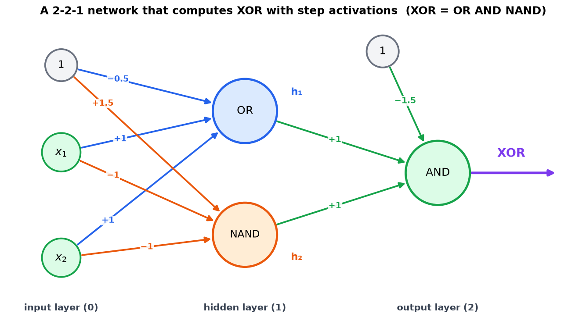

**Hidden layer** (row 1 = OR, row 2 = NAND):

```math
\begin{bmatrix} -0.5 & 1 & 1 \\ 1.5 & -1 & -1 \end{bmatrix} X = \begin{bmatrix} -0.5 & 0.5 & 0.5 & 1.5 \\ 1.5 & 0.5 & 0.5 & -0.5 \end{bmatrix} \xrightarrow{\text{step}} h = \begin{bmatrix} 0 & 1 & 1 & 1 \\ 1 & 1 & 1 & 0 \end{bmatrix}
```

**Output layer** (AND with weights $[-1.5, 1, 1]$ on $[1, h_1, h_2]$):

```math
[-0.5,\ 0.5,\ 0.5,\ -0.5] \xrightarrow{\text{step}} [0,\ 1,\ 1,\ 0] = \text{XOR}
```

So XOR needs **3 neurons**: 2 hidden and 1 output. This is a **Multi-Layer Feed-Forward Neural Network (MLFFNN)**.

**Training XOR** (lecture suggestion):

- 2 inputs → 2 hidden neurons (sigmoid or ReLU) → 1 sigmoid output
- binary cross-entropy loss, SGD optimizer, many epochs

---

## 7. Multilayer feed-forward networks

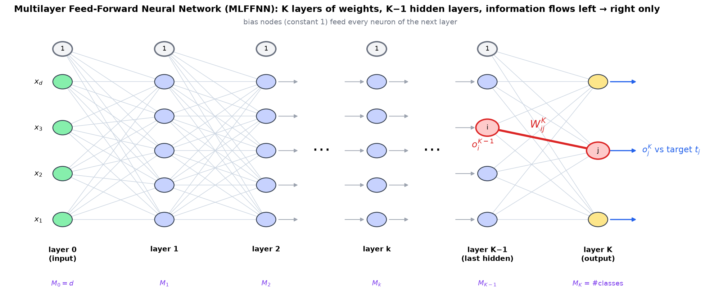

**Layers:**

- **Layer 0** is the input layer. It just passes the input on ($y = x$).
- **Layers 1 to K−1** are hidden layers with non-linear activations.
- **Layer K** is the output layer, with one neuron per class.
- Layers are **fully connected**, and information flows **forward only**.
- A network with many layers is a **deep** neural network.

| Symbol | Meaning |
|:---|:---|
| $M_k$ | number of neurons in layer $k$ |
| $W_{ij}^k$ | weight from neuron $i$ in layer $k-1$ to neuron $j$ in layer $k$ |
| $\theta_j^k = \sum_i W_{ij}^k o_i^{k-1}$ | weighted sum arriving at neuron $j$ |
| $o_j^k = \sigma(\theta_j^k)$ | output of neuron $j$ |
| $t_j$ | target value for output neuron $j$ |

**A network is a chain of non-linear functions.** Each layer re-maps its input, until the last representation is linearly separable:

```math
\hat{y} = f^{(K)}\big(\cdots f^{(2)}(f^{(1)}(X))\big)
```

**Hidden layers must be non-linear.** Otherwise $W_2(W_1X) = (W_2W_1)X$, and the whole network collapses into one linear layer.

**Network types:**

- **feed-forward** (information flows one way);
- **CNN** (for images);
- **RNN** (has feedback loops; for sequences).

---

## 8. Activation functions

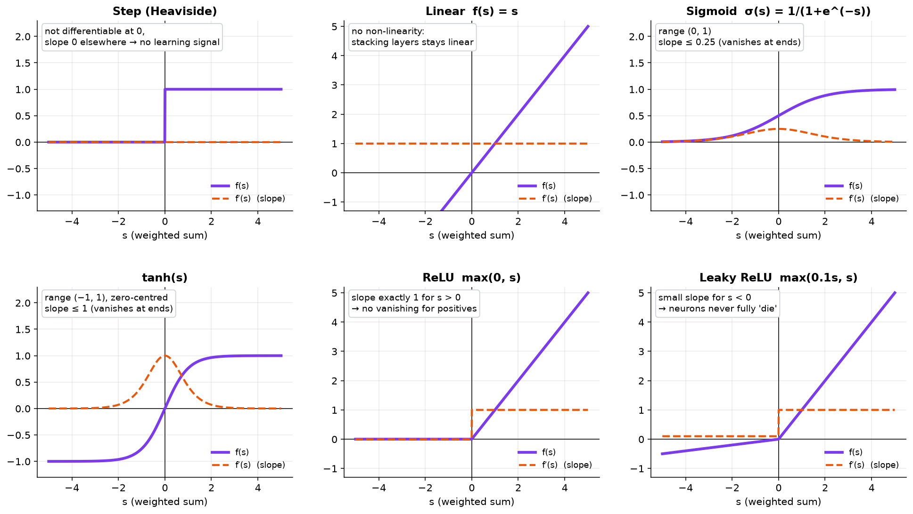

| Function | Formula | Range | Slope |
|:---|:---|:---|:---|
| Step | 1 if $s \ge 0$, else 0 | {0, 1} | 0, so it cannot learn by gradient |
| Sigmoid | $1/(1+e^{-s})$ | (0, 1) | $\sigma(1-\sigma)$, at most 0.25 |
| tanh | $(e^s - e^{-s})/(e^s + e^{-s})$ | (−1, 1) | $1 - \tanh^2 s$, at most 1 |
| ReLU | $\max(0, s)$ | [0, ∞) | 1 if $s > 0$, else 0 |
| Leaky ReLU | $\max(as, s)$ | (−∞, ∞) | 1 or $a$ |
| Softmax | $e^{s_j} / \sum_k e^{s_k}$ | (0, 1), sums to 1 | used at the output for many classes |

**Sigmoid derivative:**

```math
\sigma'(s) = \frac{e^{-s}}{(1+e^{-s})^2} = \frac{1}{1+e^{-s}}\cdot\frac{e^{-s}}{1+e^{-s}} = \sigma(s)\big(1-\sigma(s)\big)
```

**Iris example (lecture code):** 4 inputs → 10 ReLU → 3 softmax, Adam optimizer, categorical cross-entropy loss, 100 epochs, batch size 8.

```python
model = Sequential()
model.add(Dense(10, input_dim=4, activation='relu'))   # hidden layer
model.add(Dense(3, activation='softmax'))              # 3 classes
model.compile(optimizer='adam', loss='categorical_crossentropy', metrics=['accuracy'])
model.fit(X_train, y_train, epochs=100, batch_size=8, verbose=0)   # features standardized, labels one-hot
```

**Result:** the same network (run with scikit-learn) reached **96.7% test accuracy** (29 of 30 flowers). Its only mistake was a versicolor predicted as virginica.

---

## 9. Gradient descent and the delta rule

**Optimization** means minimizing an objective. In machine learning that objective is the **cost (error) function**, and the knobs are the model's weights and biases. Gradient descent is the standard way to turn those knobs.

**What a gradient actually is:** the partial derivative of the cost with respect to each parameter, collected into a vector. It points in the direction of **steepest increase**, and its length says how steep that is. So $-\nabla E$ points the steepest way **down**, and a bigger gradient means a steeper slope and faster learning. If the gradient is zero, the model stops learning.

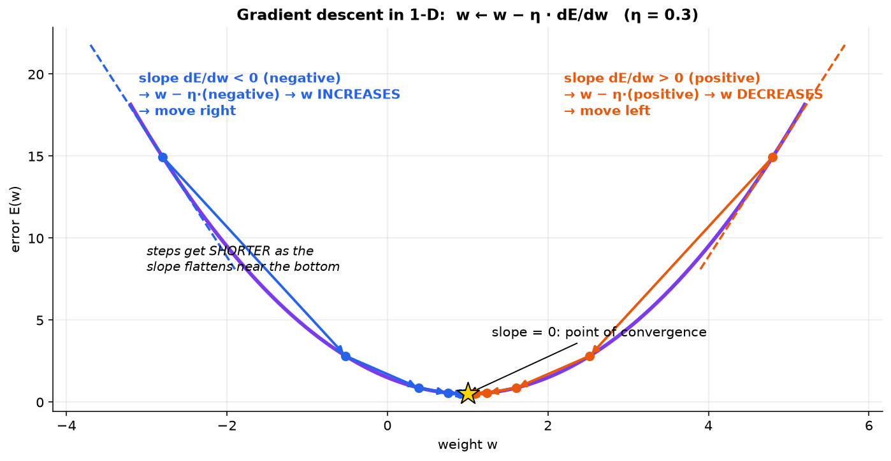

```math
\mathbf{w} \leftarrow \mathbf{w} - \eta\,\nabla E(\mathbf{w})
\qquad\text{(the lecture writes it as } b = a - \eta\,\nabla f(a) \text{)}
```

Here $a$ is where the hiker stands now, $b$ is the next position, the minus sign is what makes it a *descent*, and $\eta$ is the learning rate.

**Which way does the weight move?**

| Where you are | Slope | Effect of the update |
|:---|:---|:---|
| left of the minimum | negative | $w - \eta(\text{negative})$ → $w$ **increases** (moves right) |
| right of the minimum | positive | $w - \eta(\text{positive})$ → $w$ **decreases** (moves left) |
| at the minimum | zero | nothing changes: the **point of convergence** |

Either way the step is **towards** the minimum. That is the whole trick.

**Blindfolded-hiker picture:** a blindfolded man wants to reach the bottom of a valley. He feels which way the ground falls most steeply, takes a step that way, and repeats. High on the slope the ground is steep, so his strides are long; near the bottom it flattens, so his strides shorten automatically and he does not overshoot. The gradient gives him **both** the direction *and* the length of the step — he never has to be told to slow down.

### The same thing with two parameters

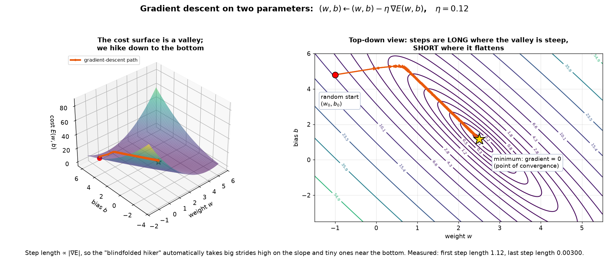

With a weight $w$ and a bias $b$ the cost $E(w, b)$ is a **surface**: the two horizontal axes are the parameters, the vertical axis is the cost. Training starts at a random $(w_0, b_0)$ somewhere up the wall of the valley and walks down until $\nabla E \approx 0$.

The measured run above shows the step-size effect exactly: the **first** step is 1.12 long, the **last** is 0.003 — a 370× slowdown that nobody had to schedule. It is purely $\lVert\text{step}\rVert = \eta\lVert\nabla E\rVert$ shrinking as the valley flattens.

### Delta rule derivation

Take a linear neuron $\hat{y}_i = \mathbf{W}^T X_i$ (activation $f(x) = x$, i.e. no non-linearity yet) with squared error over $N$ samples:

```math
E(\mathbf{W}) = \frac{1}{2}\sum_{i=1}^{N}(\hat{y}_i - y_i)^2
```

Differentiate term by term. The $\tfrac12$ is there precisely so the 2 from the square cancels:

```math
\frac{\partial E}{\partial \mathbf{W}}
= \sum_{i=1}^{N} \underbrace{(\hat{y}_i - y_i)}_{\partial E/\partial \hat{y}_i}\cdot\underbrace{\frac{\partial \hat{y}_i}{\partial \mathbf{W}}}_{=\,X_i\ \text{since}\ \hat{y}_i=\mathbf{W}^TX_i}
= \sum_{i=1}^{N}(\hat{y}_i - y_i)X_i
```

```math
\boxed{\;\mathbf{W} \leftarrow \mathbf{W} - \eta\sum_{i=1}^{N}(\hat{y}_i - y_i)X_i\;}
```

In words: **new weight = old weight − learning rate × (prediction − truth) × input.** This is the **delta rule**, also called the weight-updation rule.

**Sanity check on the signs** (2-class problem, $y \in \{0, 1\}$, stochastic version with one sample):

- $y_i = 1$ but predicted low → $(\hat{y}_i - y_i) < 0$ → we **add** a fraction of $X_i$ to $\mathbf{W}$, pushing $\mathbf{W}^TX_i$ up.
- $y_i = 0$ but predicted high → $(\hat{y}_i - y_i) > 0$ → we **subtract** a fraction of $X_i$, pushing $\mathbf{W}^TX_i$ down.
- Correctly predicted → the difference is ≈ 0 → almost no update.

That is the perceptron rule of section 4 all over again, except now it falls out of calculus instead of geometry.

---

## 10. Learning rate, batches and epochs

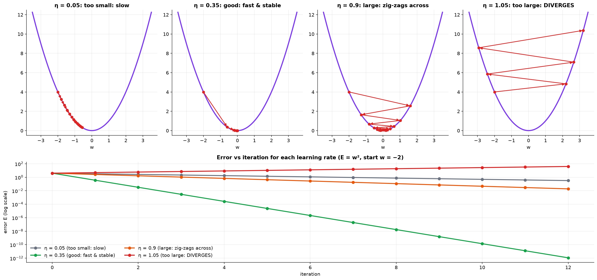

**The learning rate η is the step size.** For $E = w^2$, each step multiplies $w$ by $(1 - 2\eta)$:

- $\eta = 0.05$: slow.
- $\eta = 0.35$: fast and stable.
- $\eta = 0.9$: zig-zags across the minimum.
- $\eta = 1.05$: **diverges**.

**Too high** → larger steps, but it **overshoots** the minimum and can bounce across it forever without converging. **Too low** → precise but painfully slow, and more likely to settle into a local minimum on the way.

**Choosing it:**

- **Trial and error** first: start around 0.01 or 0.001;
- if the loss jumps around or **rises**, **decrease** it;
- if the loss falls very slowly, **increase** it;
- **adaptive optimizers** (**Adam, RMSprop, AdaGrad**) tune it per-parameter during training;
- a **learning-rate schedule** decays η as training progresses, so early epochs move fast and late epochs fine-tune.

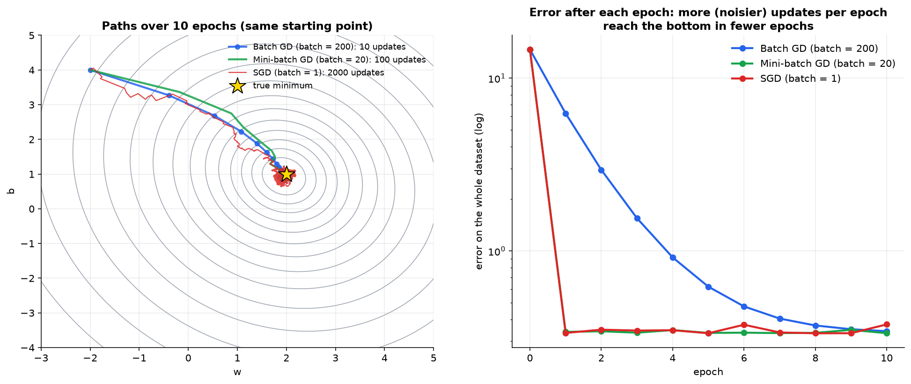

| | Batch GD | SGD | Mini-batch GD |
|:---|:---|:---|:---|
| Samples per update | all | 1 | small batch (32, 64, …) |
| Path | smooth | noisy | mostly smooth |
| Speed and memory | slow, heavy | fast, light | balanced |
| Special feature | stable | noise can escape local minima | **most used in practice** |

**Choosing the batch size:**

- **Hardware first.** The batch has to fit in GPU memory. Common sizes are 32, 64, 128, 256.
- **Interaction with η.** A **larger batch** gives a more accurate gradient estimate, so it can tolerate (and usually wants) a **higher learning rate**. A **small batch** gives a noisy estimate, so it needs a **smaller** η to stay stable.
- **Problem-specific.** For time-series or sequence data, batch size interacts with the dependencies inside the data and can change results a lot.

**Iteration vs epoch:**

- **Iteration** = one weight update, using one batch.
- **Epoch** = one pass over the whole dataset, made of many iterations.

```math
\text{iterations per epoch} = \frac{\text{dataset size}}{\text{batch size}} \qquad (\text{e.g. } 1000/100 = 10)
```

**What one iteration actually does** — memorize this four-step loop, everything else is detail:

1. **Forward pass** — push the batch through the network and get predictions.
2. **Loss calculation** — measure how far those predictions are from the targets.
3. **Backward pass** — compute the gradient of the loss with respect to every parameter (this is backpropagation, section 12).
4. **Update** — apply $W \leftarrow W - \eta\,\nabla E$ once.

Repeat for every batch → one epoch. Repeat for every epoch → training.

**Making batches each epoch:**

- **sequential:** fixed order, no randomness — examples 1–100, then 101–200, …;
- **random:** shuffle the whole dataset at the start of every epoch, then cut it into batches. This is the usual choice, because it stops the model from memorizing the data order and improves generalization;
- **stratified:** each batch keeps the class proportions of the full dataset — important for **imbalanced** data, so every batch still carries a signal for the rare classes.

---

## 11. Problems: minima, saddles, vanishing and exploding gradients

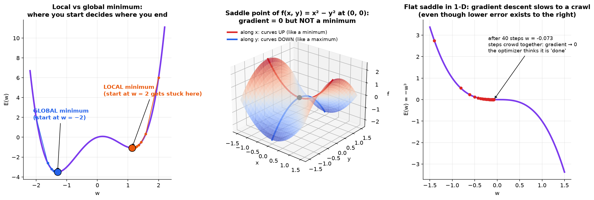

**Where gradient descent can get stuck.** Whenever the slope is zero or near zero, the update $-\eta\nabla E$ is ≈ 0 and the model stops learning. Three different places have that property:

| | Shape | Is it what we want? |
|:---|:---|:---|
| **Global minimum** | lowest point over the **entire** domain | yes — this is the goal |
| **Local minimum** | lowest point only in its **neighbourhood**; the cost rises in every direction | no, but the model cannot tell the difference. Where you **start** decides where you end |
| **Saddle point** | **mixed curvature**: behaves like a minimum along some directions and a maximum along others | no — not optimal at all, just flat |

For **convex** problems there is only one minimum and gradient descent always finds it. Real neural networks are **non-convex**, so the other two cases are live risks.

**Saddle point, concretely.** Take $f(x,y) = x^2 - y^2$ at the origin:

- along the $x$-axis (with $y=0$) it is $x^2$, an upward parabola → looks like a **minimum**;
- along the $y$-axis (with $x=0$) it is $-y^2$, a downward parabola → looks like a **maximum**;
- the gradient is $(2x, -2y) = (0,0)$ there, so descent has nothing to follow.

The shape is a horse saddle (a hyperbolic paraboloid). In the high-dimensional spaces neural networks live in, saddles are **far more common than local minima**, and they are the main reason plain gradient descent stalls — the algorithm "thinks" it has arrived because the gradient vanished.

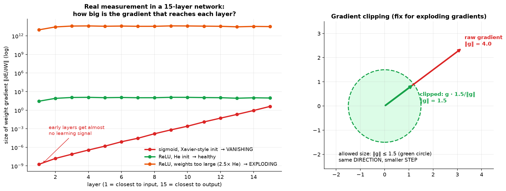

**The mechanism.** Backpropagation applies the chain rule layer by layer, and at each layer the gradient gets **multiplied by the derivative of that layer's activation** (and by its weights). Multiplying $L$ numbers together is an exponential process:

- every factor **< 1** (sigmoid slope ≤ 0.25, tanh ≤ 1) → the product decays towards 0 → **vanishing**;
- every factor **> 1** (large weights) → the product blows up → **exploding**.

Either way the *early* layers are hit hardest, because their gradients pass through the most factors. Measured in a 15-layer network:

| Setup | Gradient at layer 15 | Gradient at layer 1 |
|:---|:---:|:---:|
| sigmoid | 4.05 | **1.8 × 10⁻⁹** (vanishing) |
| ReLU, He initialization | 91 | 27.5 (healthy) |
| ReLU, weights too large | 3.1 × 10¹³ | **9.2 × 10¹²** (exploding) |

| | Vanishing | Exploding |
|:---|:---|:---|
| Cause | small activation slopes (sigmoid ≤ 0.25, tanh), many layers | large weights, many layers or time steps, high learning rate |
| Effect | early layers barely learn | unstable training, divergence, overflow (NaN) |
| Symptoms | early layers learn far slower than late ones; poor feature extraction; in the worst case training simply stops | loss fluctuates or increases instead of falling; the model diverges; weights overflow to NaN |
| Fixes | ReLU / Leaky ReLU, batch norm, ResNet skip connections, Xavier or He initialization, gradient clipping | **gradient clipping**, L2 regularization, careful initialization, smaller η, batch norm, ResNets |

**Why each fix works:**

| Fix | Mechanism |
|:---|:---|
| **ReLU / Leaky ReLU** | slope is exactly **1** for positive inputs, so the chain-rule product stops shrinking |
| **Batch normalization** | renormalizes each layer's inputs, keeping activations (and so gradients) out of the saturated tails. Placement: **Linear $(WX+b)$ → BatchNorm → Activation** |
| **ResNet skip connections** | add a shortcut path so the gradient can reach early layers **without** passing through every factor |
| **Xavier / He initialization** | scales the initial weights so the signal variance neither grows nor shrinks layer to layer at the start |
| **Gradient clipping** | if $\lVert\mathbf{g}\rVert$ exceeds a threshold, rescale $\mathbf{g} \leftarrow \mathbf{g}\cdot\text{threshold}/\lVert\mathbf{g}\rVert$ — **same direction, smaller step** |
| **L2 regularization** | penalizes large weights, which are what make the gradient factors exceed 1 |
| **Smaller η** | does not fix a large gradient, but stops it from producing a catastrophic weight change |

---

## 12. Backpropagation derivation

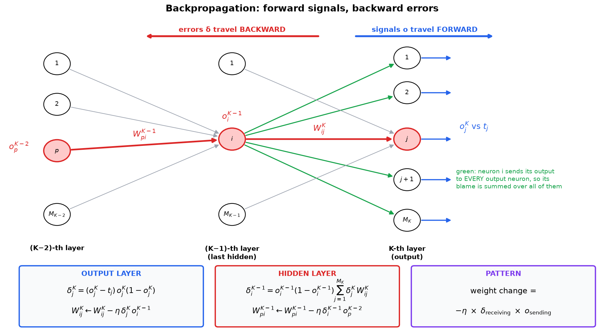

**Why it is needed:** every neuron does the same two jobs — (i) take the weighted sum of its inputs, (ii) apply an activation to it. At the **output layer** we know the true answers $t_j$, so we can compute the error directly and update those weights immediately. But for a **hidden** neuron nobody ever tells us what its output "should" have been, so there is no error to differentiate. The fix is to send the output error **backward** through the chain rule and ask: *how much did this hidden neuron contribute to the error we can see?*

The derivation is built up in four steps, each adding one complication.

### Step 1: single sigmoid neuron (stochastic, one sample)

The step function is not differentiable, so we use the **sigmoid** instead: it is smooth, ranges over (0, 1), and has the very convenient derivative $\sigma' = \sigma(1-\sigma)$.

With $s = \mathbf{W}^TX_i$, $\hat{y}_i = \sigma(s)$ and $E = \frac{1}{2}(\hat{y}_i - y_i)^2$, the chain rule gives three factors:

```math
\nabla_{\mathbf{W}}E = \underbrace{(\hat{y}_i - y_i)}_{\partial E/\partial \hat{y}}\;\underbrace{\hat{y}_i(1-\hat{y}_i)}_{\partial \hat{y}/\partial s}\;\underbrace{X_i}_{\partial s/\partial \mathbf{W}}
\;\Rightarrow\;
\mathbf{W} \leftarrow \mathbf{W} - \eta\,(\hat{y}_i - y_i)\,\hat{y}_i(1-\hat{y}_i)\,X_i
```

**Linear vs non-linear, side by side** — the *only* difference is the middle factor:

| Activation | Prediction | Update rule |
|:---|:---|:---|
| Linear, $f(x)=x$ | $\hat{y}_i = \mathbf{W}^TX_i$ | $\mathbf{W} \leftarrow \mathbf{W} - \eta(\hat{y}_i - y_i)X_i$ |
| Sigmoid | $\hat{y}_i = \sigma(\mathbf{W}^TX_i)$ | $\mathbf{W} \leftarrow \mathbf{W} - \eta(\hat{y}_i - y_i)\,\hat{y}_i(1-\hat{y}_i)\,X_i$ |

Both are weight-updation rules for a single-layer perceptron on a two-class problem. Reading the sigmoid one:

- true class $y=1$ but $\hat{y}$ came out low (say 0.1) → $(\hat{y}-y) < 0$ → we **add** a fraction of $X_i$;
- true class $y=0$ but $\hat{y}$ came out high (say 0.7) → $(\hat{y}-y) > 0$ → we **subtract** a fraction of $X_i$, i.e. add a fraction of $-X_i$;
- predicted correctly → the difference is small → almost no update.

That is the **perceptron rule** again, now derived from gradient descent.

> ⚠️ Notice the factor $\hat{y}(1-\hat{y})$. It is ≈ 0 whenever $\hat{y}$ is near 0 or 1 — including when the network is **confidently wrong**. This is the single biggest weakness of squared error, and the whole reason cross-entropy exists. See §7–8 of the [companion guide](activation_crossentropy_backprop_visual_guide.md).

### Step 1b: one layer, many outputs

For an $M$-class problem the output layer has $M$ neurons and the weights become a **matrix** $W = (W_{ij})_{D \times M}$, where $D$ is the input dimension (= number of input-layer neurons). Nothing new is needed: each output neuron $j$ has its own target $t_j$ and its own error term, and the same rule is applied to every entry:

```math
W_{ij} \leftarrow W_{ij} - \eta\,\underbrace{(o_j - t_j)\,o_j(1-o_j)}_{\delta_j}\;x_i
\qquad \text{for all } i = 1\ldots D,\; j = 1\ldots M
```

Computing this for every $(i, j)$ updates the entire weight matrix in one pass.

### Step 2: output layer K

Output neuron $j$ computes $\theta_j^K = \sum_i W_{ij}^K o_i^{K-1}$ and $o_j^K = \sigma(\theta_j^K)$. Summing over the $M_K$ output neurons, the error is $E = \frac{1}{2}\sum_{j=1}^{M_K} (o_j^K - t_j)^2$.

We want $\partial E / \partial W_{ij}^K$, but $E$ does not mention $W_{ij}^K$ directly — it reaches it through $o_j^K$, which reaches it through $\theta_j^K$. So chain three links together:

```math
\frac{\partial E}{\partial W_{ij}^K}
= \frac{\partial E}{\partial o_j^K}\cdot\frac{\partial o_j^K}{\partial \theta_j^K}\cdot\frac{\partial \theta_j^K}{\partial W_{ij}^K}
= \underbrace{(o_j^K - t_j)}_{\text{from }\tfrac12(o-t)^2}\;\underbrace{o_j^K(1-o_j^K)}_{\text{sigmoid derivative}}\;\underbrace{o_i^{K-1}}_{\text{since }\theta_j^K=\sum_i W_{ij}^Ko_i^{K-1}}
```

The last factor deserves a second look: $\theta_j^K$ is a plain sum of $W_{ij}^K o_i^{K-1}$ terms, so differentiating with respect to one particular $W_{ij}^K$ leaves just its partner $o_i^{K-1}$ — **the output of the neuron that sends the signal**.

```math
\delta_j^K = (o_j^K - t_j)\,o_j^K(1-o_j^K), \qquad W_{ij}^K \leftarrow W_{ij}^K - \eta\,\delta_j^K\,o_i^{K-1}
```

### Step 3: hidden layer K−1

Take weight $W_{pi}^{K-1}$, from neuron $p$ (layer K−2) to neuron $i$ (layer K−1).

**One path**, through output neuron $j$, has five chain-rule factors:

```math
\frac{\partial E^j}{\partial W_{pi}^{K-1}} = \underbrace{(o_j^K - t_j)\,o_j^K(1-o_j^K)}_{\delta_j^K}\cdot\underbrace{W_{ij}^K}_{\partial \theta_j/\partial o_i}\cdot\underbrace{o_i^{K-1}(1-o_i^{K-1})}_{\partial o_i/\partial \theta_i}\cdot\underbrace{o_p^{K-2}}_{\partial \theta_i/\partial W}
```

**All paths:** neuron $i$ feeds **every** output neuron, so sum over $j$:

```math
\delta_i^{K-1} = o_i^{K-1}(1-o_i^{K-1})\sum_{j=1}^{M_K}\delta_j^K W_{ij}^K, \qquad W_{pi}^{K-1} \leftarrow W_{pi}^{K-1} - \eta\,\delta_i^{K-1}\,o_p^{K-2}
```

**Any hidden layer $k$** follows the same pattern:

```math
\delta_j^k = o_j^k(1-o_j^k)\sum_t \delta_t^{k+1}W_{jt}^{k+1}, \qquad W_{ij}^k \leftarrow W_{ij}^k - \eta\,\delta_j^k\,o_i^{k-1}
```

**Pattern to remember:** weight change = −η × (delta of the **receiving** neuron) × (output of the **sending** neuron). Compute all deltas with the **old** weights, then update.

### The order it all happens in

Backpropagation is strictly **backwards**, one layer at a time, because each layer's delta is built from the layer *after* it:

```text
update W between (K-1) and K      ← uses the real error, computed directly
then   W between (K-2) and (K-1)  ← uses δ^K
then   W between (K-3) and (K-2)  ← uses δ^(K-1)
 ...
then   W between  0    and  1     ← uses δ^2
```

At the very last step the "sending" layer is the **input layer**, whose neurons just pass their input through ($y = x$), so $o_t^0 = x_t$ — the raw feature value.

### The whole derivation on one line each

| Step | Setting | Delta | Update |
|:---|:---|:---|:---|
| 0 | one linear neuron | $(\hat{y}-y)$ | $\mathbf{W} \leftarrow \mathbf{W} - \eta(\hat{y}-y)X$ |
| 1 | one sigmoid neuron | $(\hat{y}-y)\hat{y}(1-\hat{y})$ | $\mathbf{W} \leftarrow \mathbf{W} - \eta\,\delta\,X$ |
| 1b | one layer, $M$ outputs | $\delta_j = (o_j-t_j)o_j(1-o_j)$ | $W_{ij} \leftarrow W_{ij} - \eta\,\delta_j x_i$ |
| 2 | output layer of a deep net | $\delta_j^K = (o_j^K-t_j)o_j^K(1-o_j^K)$ | $W_{ij}^K \leftarrow W_{ij}^K - \eta\,\delta_j^K o_i^{K-1}$ |
| 3 | any hidden layer $k$ | $\delta_j^k = o_j^k(1-o_j^k)\sum_t \delta_t^{k+1}W_{jt}^{k+1}$ | $W_{ij}^k \leftarrow W_{ij}^k - \eta\,\delta_j^k o_i^{k-1}$ |

Every row is the *same* rule. Only the recipe for δ changes: at the output it comes from the true target, in a hidden layer it comes from the deltas above it.

---

## 13. Worked backpropagation example

**Setup:** a 2-2-1 network with sigmoid activations, squared error and $\eta = 0.5$. The first column of each weight matrix is the bias.

- Input $x = (0.6, 0.2)$, target $t = 1$.
- Weights:

```math
W^1 = \begin{bmatrix} 0.1 & 0.5 & -0.4 \\ -0.2 & 0.3 & 0.8 \end{bmatrix}, \qquad W^2 = [0.2,\ 0.7,\ -0.5]
```

**Forward pass:**

```math
\theta^1 = [0.1+0.30-0.08,\;\; -0.2+0.18+0.16] = [0.32,\; 0.14] \;\Rightarrow\; o^1 = [0.5793,\; 0.5349]
```

```math
\theta^2 = 0.2 + 0.7(0.5793) - 0.5(0.5349) = 0.3381 \;\Rightarrow\; o^2 = 0.5837,\quad E = \tfrac{1}{2}(0.5837-1)^2 = 0.0866
```

**Deltas** (using the old weights):

```math
\delta^2 = (0.5837-1)(0.5837)(0.4163) = -0.10115
```

```math
\delta_1^1 = 0.5793(0.4207)(-0.10115)(0.7) = -0.01726, \qquad \delta_2^1 = 0.5349(0.4651)(-0.10115)(-0.5) = +0.01258
```

**Updates** (gradient = δ × [1, inputs]):

```math
W^2_{new} = [0.2,\ 0.7,\ -0.5] - 0.5\,(-0.10115)[1,\ 0.5793,\ 0.5349] = [0.2506,\ 0.7293,\ -0.4729]
```

```math
W^1_{new} = \begin{bmatrix} 0.1086 & 0.5052 & -0.3983 \\ -0.2063 & 0.2962 & 0.7987 \end{bmatrix}
```

**Check:** the output rises 0.5837 → 0.6043 and the error falls 0.0866 → 0.0783 ✓. A numerical gradient check agrees to within $2 \times 10^{-11}$.

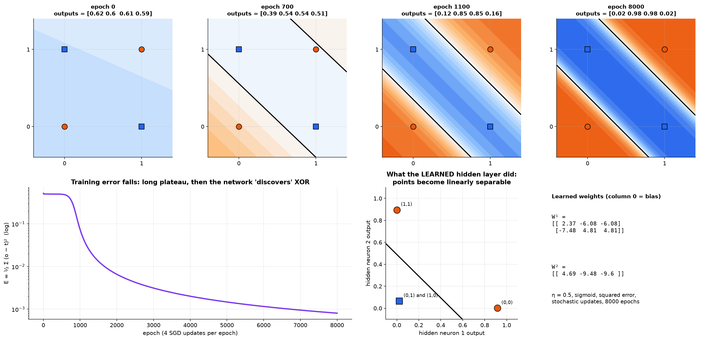

**XOR learned from random weights** with these same rules:

- After a long plateau, the outputs become **[0.02, 0.98, 0.98, 0.02]**.
- The hidden layer learned **NOR** and **AND**, a different but equally valid solution to OR/NAND.

---

## 14. Cheat sheet

| Topic | Key formula or fact |
|:---|:---|
| Neuron | $y = f(\sum w_ix_i + b)$ |
| M-P neuron | no weights; fire if $\sum x_i \ge \theta$; AND uses $\theta=n$, OR uses $\theta=1$ |
| Inhibitory input | if it is 1, output is forced to 0 (gives NOT, NOR, $x_1$ AND NOT $x_2$) |
| Bias trick | $x_0 = 1$, $w_0 = -\theta$, so $y=1 \iff \mathbf{w}^T\mathbf{x} \ge 0$ |
| Perceptron rule | missed positive: $\mathbf{w} + \mathbf{x}$ · missed negative: $\mathbf{w} - \mathbf{x}$ |
| Convergence | $k \le 1/\delta^2$ |
| Gates | AND $[-1.5,1,1]$ · OR $[-0.5,1,1]$ · NAND $[1.5,-1,-1]$ |
| XOR | OR and NAND in the hidden layer, then AND |
| Sigmoid slope | $\sigma(1-\sigma) \le 0.25$ |
| Gradient descent | $\mathbf{w} \leftarrow \mathbf{w} - \eta\nabla E$ |
| Delta rule (linear) | $\mathbf{W} \leftarrow \mathbf{W} - \eta(\hat{y}-y)X$ |
| Delta rule (sigmoid) | $\mathbf{W} \leftarrow \mathbf{W} - \eta(\hat{y}-y)\hat{y}(1-\hat{y})X$ |
| Iterations per epoch | dataset size / batch size |
| Batch ↔ η | bigger batch → less noisy gradient → can use a bigger η |
| Output delta | $\delta_j^K = (o_j^K - t_j)o_j^K(1-o_j^K)$ |
| Hidden delta | $\delta_j^k = o_j^k(1-o_j^k)\sum_t \delta_t^{k+1}W_{jt}^{k+1}$ |
| Weight update | $W_{ij} \leftarrow W_{ij} - \eta \delta_j o_i$ |
| Vanishing fixes | ReLU, batch norm, ResNet, He/Xavier init |
| Exploding fixes | gradient clipping, L2, smaller η |

---

## 15. Viva questions

**Q1. Why can't one perceptron do XOR?**
XOR is not linearly separable. A hidden layer (OR and NAND) maps the inputs to a space where one line (AND) can separate them.

**Q2. Why add x₀ = 1 with w₀ = −θ?**
It turns the threshold into an ordinary weight (the bias), so it can be learned like any other weight.

**Q3. Why does w ← w + x fix a missed positive point?**
$(\mathbf{w}+\mathbf{x})^T\mathbf{x} = \mathbf{w}^T\mathbf{x} + \lVert\mathbf{x}\rVert^2$ increases, so $\mathbf{w}$ rotates toward $\mathbf{x}$.

**Q4. Summarize the convergence proof.**
The numerator of $\cos\beta$ grows at least like $k\delta$ and the denominator at most like $\sqrt{k}$. Since $\cos\beta \le 1$, $k$ is bounded ($k \le 1/\delta^2$).

**Q5. Why must hidden activations be non-linear?**
Stacked linear layers collapse into a single linear layer.

**Q6. Why was the step function replaced by the sigmoid?**
The step function has zero slope (and is undefined at 0), so gradient descent gets no information.

**Q7. 1000 samples, batch size 50, 20 epochs. How many iterations?**
1000/50 = 20 per epoch, × 20 epochs = **400** updates.

**Q8. What is a saddle point?**
A point with zero gradient that is a minimum along one direction and a maximum along another, like $x^2 - y^2$ at the origin.

**Q9. What causes vanishing gradients, and what fixes them?**
Backprop multiplies small activation slopes across many layers. Fixes: ReLU, batch norm, skip connections, good initialization.

**Q10. Why is there a sum in the hidden-layer delta?**
A hidden neuron feeds every neuron in the next layer, so its share of the error arrives along all those paths and must be added up.

**Q11. What is an inhibitory input, and what can it build?**
An input that forces the output to 0 whenever it is 1, regardless of the sum. With it a weightless M-P unit can compute NOT, NOR and $x_1$ AND NOT $x_2$.

**Q12. Why can't we train a perceptron by counting misclassifications?**
That error function is a staircase: flat plateaus (slope 0) separated by cliffs (slope undefined). Gradient descent gets no direction from it. We either use the perceptron rule, or swap in a smooth activation and a smooth loss.

**Q13. What is the difference between a local minimum and a saddle point?**
At a local minimum the cost rises in *every* direction. At a saddle point the curvature is mixed — up in some directions, down in others — so it is not optimal at all, just flat. Saddles dominate in high dimensions.

**Q14. How does the batch size interact with the learning rate?**
A larger batch averages more samples, so its gradient estimate is less noisy and tolerates a larger η. A small batch gives a noisy gradient and needs a smaller η to stay stable.

**Q15. In backprop, why must the deltas be computed with the old weights?**
Every delta in layer $k$ is defined in terms of the layer-$(k{+}1)$ weights *at the time the forward pass ran*. Updating those weights first would mean differentiating a network that no longer exists, giving the wrong gradient.

**Q16. Where does batch normalization go, and why there?**
Between the linear step and the activation: $WX+b$ → BatchNorm → activation. It keeps the activation's input away from the saturated tails, so the slope stays healthy and the gradient neither vanishes nor explodes.
