# Mobile Computing: Radio Foundations, Cellular Engineering, and Digital Standards — Learning Guide

> **Syllabus & Course Reference:** Strictly derived from Prof. Sipra Das Bit (SDB), *Mobile Computing*, Chapters 1–3 (Scans 1–30 / Book pp. 1–59).  
> This guide provides a comprehensive, mathematically audited, zero-information-loss synthesis of radio transmission fundamentals, cellular network planning, traffic engineering, mobility management, and 2G digital standards (GSM & CDMA IS-95).

---

## Table of Contents

1. [Historical Evolution & Generational Roadmap](#1-historical-evolution--generational-roadmap)
2. [Radio Waves, Spectrum, and Transmission Physics](#2-radio-waves-spectrum-and-transmission-physics)
3. [Signal Quality, Noise, and Duplexing Architectures](#3-signal-quality-noise-and-duplexing-architectures)
4. [Radio System Operational Pipeline & Modulation Schemes](#4-radio-system-operational-pipeline--modulation-schemes)
5. [The Cellular Paradigm & Network Architecture](#5-the-cellular-paradigm--network-architecture)
6. [Call Setup Protocols: Origination and Paging Workflows](#6-call-setup-protocols-origination-and-paging-workflows)
7. [Frequency Reuse Geometry & Cluster Sizing](#7-frequency-reuse-geometry--cluster-sizing)
8. [Cell Design & Total System Capacity](#8-cell-design--total-system-capacity)
9. [Interference Analysis & Signal-to-Interference Ratio ($S/I$)](#9-interference-analysis--signal-to-interference-ratio-si)
10. [Channel Assignment Strategies](#10-channel-assignment-strategies)
11. [Handoff Mechanics, Strategies & Practical Constraints](#11-handoff-mechanics-strategies--practical-constraints)
12. [Mobility & Location Management](#12-mobility--location-management)
13. [Traffic Engineering, Trunking Theory & Grade of Service (GOS)](#13-traffic-engineering-trunking-theory--grade-of-service-gos)
14. [Capacity Expansion Techniques: Splitting & Sectoring](#14-capacity-expansion-techniques-splitting--sectoring)
15. [User Validation & Cryptographic Authentication in AMPS](#15-user-validation--cryptographic-authentication-in-amps)
16. [Multiple Access Technologies: FDMA, TDMA, and CDMA](#16-multiple-access-technologies-fdma-tdma-and-cdma)
17. [Spread Spectrum Engineering & CDMA Mathematics](#17-spread-spectrum-engineering--cdma-mathematics)
18. [GSM Architecture, Subsystems, and Protocols](#18-gsm-architecture-subsystems-and-protocols)

---

## 1. Historical Evolution & Generational Roadmap

### 1.1 The Engineering Problem & Intuition
Before modern cellular networks, early mobile telephony relied on the **trunking principle** using a single high-power transmitter mounted on a tall central tower (e.g., Chicago, 1983). Operating across $150\text{--}450\text{ MHz}$, this high-power transmitter blanketed an entire metropolitan zone spanning a $50\text{ km}$ radius.

This monolithic approach suffered from severe physical bottlenecks:
- **Severe Spectral Bottleneck:** The finite frequency spectrum permitted only a few dozen discrete channels. Because high-power signals travelled dozens of kilometers, those frequencies could not be reused anywhere within the region.
- **Extreme Call Blocking:** Even to terminate an incoming call, mobile terminals had to aggressively compete for a free channel; call blocking probability was exceptionally high.
- **Hardware Bulk:** Mobile receivers required heavy, high-power transceivers that could only be mounted inside automobile trunks, precluding portable hand-held usage.

To overcome these constraints, engineers at Bell Laboratories pioneered the **cellular concept** in the 1960s: replacing one high-power transmitter with many low-power transmitters distributed across small contiguous geographic areas (cells), enabling the **spatial reuse of frequencies**.

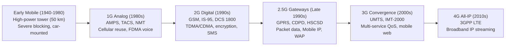
```mermaid
flowchart LR
    A["Early Mobile (1940-1980)<br/>High-power tower (50 km)<br/>Severe blocking, car-mounted"] --> B["1G Analog (1980s)<br/>AMPS, TACS, NMT<br/>Cellular reuse, FDMA voice"]
    B --> C["2G Digital (1990s)<br/>GSM, IS-95, DCS 1800<br/>TDMA/CDMA, encryption, SMS"]
    C --> D["2.5G Gateways (Late 1990s)<br/>GPRS, CDPD, HSCSD<br/>Packet data, Mobile IP, WAP"]
    D --> E["3G Convergence (2000s)<br/>UMTS, IMT-2000<br/>Multi-service QoS, mobile web"]
    E --> F["4G All-IP (2010s)<br/>3GPP LTE<br/>Broadband IP streaming"]
```

### 1.2 Technical Mechanism & Architecture
The evolution of mobile communication progressed across distinct generational leaps:

1. **First Generation (1G):** Analog frequency modulation (FM) for voice, Frequency Division Multiple Access (FDMA), and Frequency Division Duplexing (FDD). Advanced Mobile Phone System (AMPS) launched commercially in 1983 in North America.
2. **Second Generation (2G):** Digital cellular systems introduced circuit-switched digital voice, digital encryption, and short messaging service (SMS). Prominent standards:
   - **GSM (Global System for Mobile Communications):** Operating at $900\text{ MHz}$ (uplink $890\text{--}915\text{ MHz}$, downlink $935\text{--}960\text{ MHz}$) and **DCS 1800** ($1800\text{ MHz}$).
   - **IS-95 (cdmaOne):** North American CDMA standard.
   - **DECT (Digital European Cordless Telephone)** and **PDC (Personal Digital Cellular)** in Japan.
3. **2.5 Generation (2.5G):** Added packet-switched data capabilities over existing 2G circuit-switched radio infrastructure:
   - **GPRS (General Packet Radio Service):** Packet data overlay for GSM.
   - **CDPD (Cellular Digital Packet Data)** and **HSCSD (High-Speed Circuit-Switched Data)**.
   - **Application Protocols:** **Mobile IP** (conceived 1992, standardized 1996 for seamless node mobility across IP subnets) and **WAP (Wireless Application Protocol)** (introduced 1997, deployed 2000 for mobile web browsing).
   - *Limitations of 2G/2.5G:* Lack of cross-system interoperability (cellular, cordless, satellite, WLAN), inability to guarantee end-to-end Quality of Service (QoS) for mixed multimedia, and lack of unified global roaming.
4. **Third Generation (3G):** Standardized by the International Telecommunication Union (ITU) under **IMT-2000** and developed as **UMTS (Universal Mobile Telecommunications System)** by ETSI/3GPP. Implemented global roaming and classified traffic into four distinct QoS classes: Conversational (voice), Streaming (video), Interactive (web browsing), and Background (email).
5. **Fourth Generation (4G):** Unified All-IP packet-switched network architecture realized via **3GPP LTE (Long-Term Evolution)**, delivering multi-megabit broadband data and voice-over-IP (VoLTE).

### 1.3 Visual Anchor
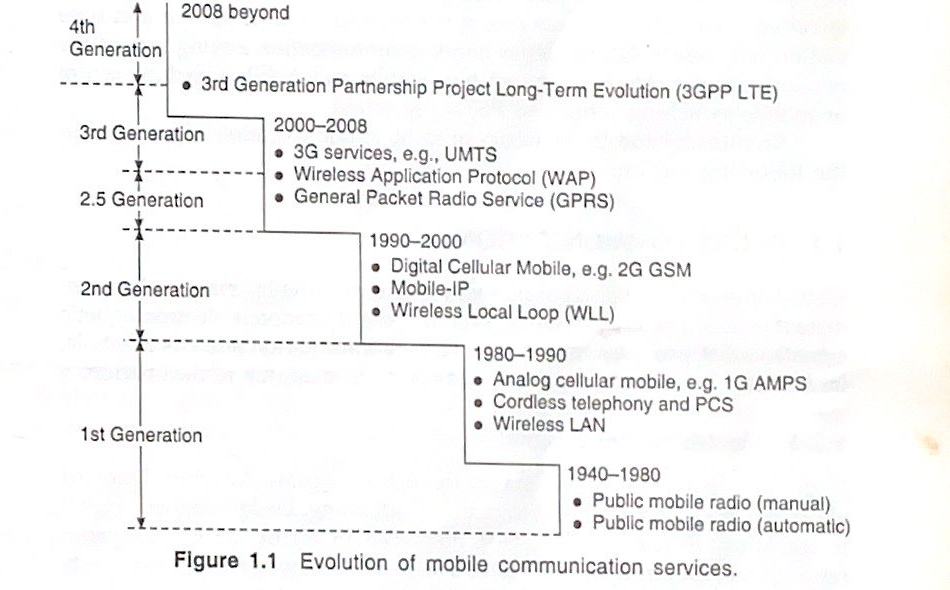

### 1.4 Trade-offs & Comparisons

| Generation | Core Technology | Primary Services | Switching Paradigm | Key Limitation |
|:---|:---|:---|:---|:---|
| **1G** | Analog FM / FDMA | Voice only | Circuit-switched | Zero security, prone to cloning, poor spectral efficiency |
| **2G** | Digital TDMA / CDMA | Voice, SMS, low-rate data ($9.6\text{ kbps}$) | Circuit-switched | Low data throughput, fragmented global roaming |
| **2.5G** | GPRS / EDGE / CDPD | Packet data, mobile web ($< 171\text{ kbps}$) | Hybrid (Circuit voice + Packet data) | Variable latency, limited QoS guarantees |
| **3G** | W-CDMA / UMTS | High-speed data ($384\text{ kbps}\text{--}2\text{ Mbps}$), multimedia | Packet-switched data core | High infrastructure cost, spectrum licensing fees |
| **4G** | OFDMA / SC-FDMA (LTE) | All-IP broadband ($100+\text{ Mbps}$), VoLTE | 100% Packet-switched | Complex multi-antenna RF design (MIMO) |

---

## 2. Radio Waves, Spectrum, and Transmission Physics

### 2.1 The Engineering Problem & Intuition
Wireless communication uses electromagnetic waves propagating through free space. Because electromagnetic signals are oscillatory disturbances, their propagation physics depend directly on their frequency and wavelength. Lower frequencies behave like sound echoing around hills—they diffract around terrain and bounce off the upper atmosphere. Higher frequencies behave like beams of light—they travel strictly in line-of-sight paths and are easily blocked by walls and rain. Engineers must therefore match the application requirements (coverage distance vs. data bandwidth) to the appropriate spectral band.

### 2.2 Technical Mechanism & Architecture
An electromagnetic wave consists of time-varying electric and magnetic fields traveling at the velocity of light ($v = c \approx 3 \times 10^8\text{ m/s}$ in vacuum).

- **Wavelength ($\lambda$):** The spatial distance between two successive wave crests.
- **Frequency ($f$):** The number of complete wave oscillations per second, measured in Hertz ($\text{Hz}$, where $1\text{ MHz} = 10^6\text{ Hz}$ and $1\text{ GHz} = 10^9\text{ Hz}$).
- **Period ($T$):** The duration of one oscillation cycle:
  $$f = \frac{1}{T}, \quad f = \frac{v}{\lambda}$$
  As frequency increases, wavelength shrinks proportionally.

#### Signal Nature & Bandwidth
- **Analog Signal:** Intensity varies smoothly and continuously over time.
- **Digital Signal:** Intensity maintains discrete, constant voltage levels for fixed time intervals before transitioning.
- **Absolute Bandwidth:** If a signal spectrum extends from frequency $f_1$ to $f_2$, absolute bandwidth is $B_{\text{abs}} = f_2 - f_1$. For example, a spectrum spanning $f$ to $3f$ has an absolute bandwidth of $3f - f = 2f$.
- **Effective Bandwidth:** The narrow frequency band containing the vast majority of the signal energy.

#### Propagation Characteristics by Spectral Band
The radio spectrum is partitioned into standard ITU nomenclature:

| Band | Frequency Range | Typical Radiation | Primary Propagation Mechanism & Physical Behavior |
|:---|:---|:---|:---|
| **VLF** (Very Low Frequency) | $< 30\text{ kHz}$ | Long radio wave | Surface ground waves; penetrates sea water (submarine comms) |
| **LF** (Low Frequency) | $30\text{--}300\text{ kHz}$ | Long radio wave | Ground wave; long-distance navigational beacons |
| **MF** (Medium Frequency) | $300\text{ kHz}\text{--}3\text{ MHz}$ | Long radio wave | Ground wave / night-time ionospheric reflection (AM radio broadcast) |
| **HF** (High Frequency) | $3\text{--}30\text{ MHz}$ | Short radio wave | **Ionospheric bounce:** Bounces between ionosphere and Earth surface; worldwide broadcast; penetrates buildings |
| **VHF** (Very High Frequency) | $30\text{--}300\text{ MHz}$ | Short radio wave | Line-of-sight (LOS); FM radio broadcast, television, air traffic control |
| **UHF** (Ultra High Frequency) | $300\text{ MHz}\text{--}3\text{ GHz}$ | Short radio wave | **Primary cellular mobile band:** Penetrates urban clutter; requires moderate antenna heights ($\lambda \approx 10\text{--}100\text{ cm}$) |
| **SHF** (Super High Frequency) | $3\text{--}30\text{ GHz}$ | Microwave | Strict Line-of-Sight (LOS); blocked by buildings and metal; satellite links and terrestrial microwave repeaters |
| **EHF** (Extremely High Frequency) | $30\text{--}300\text{ GHz}$ | Millimeter wave | Line-of-sight; severe atmospheric oxygen/water absorption; short-range links |

### 2.3 Visual Anchors
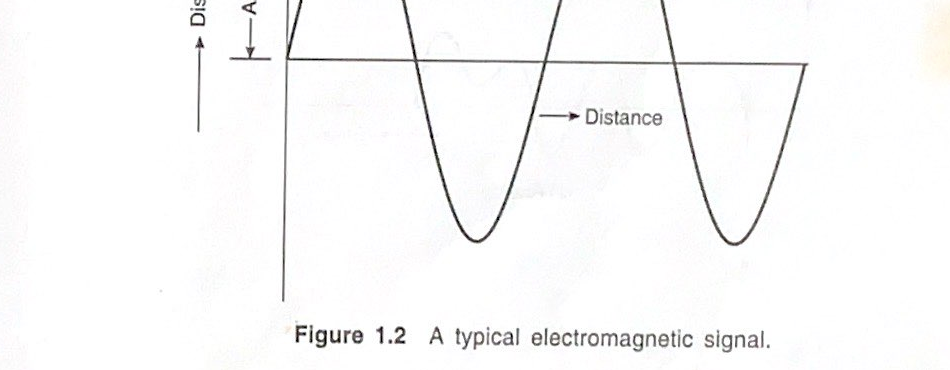

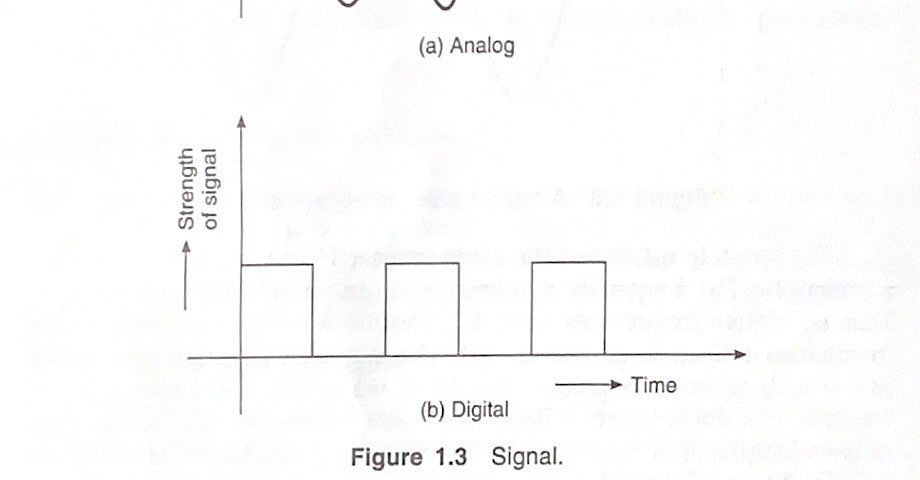

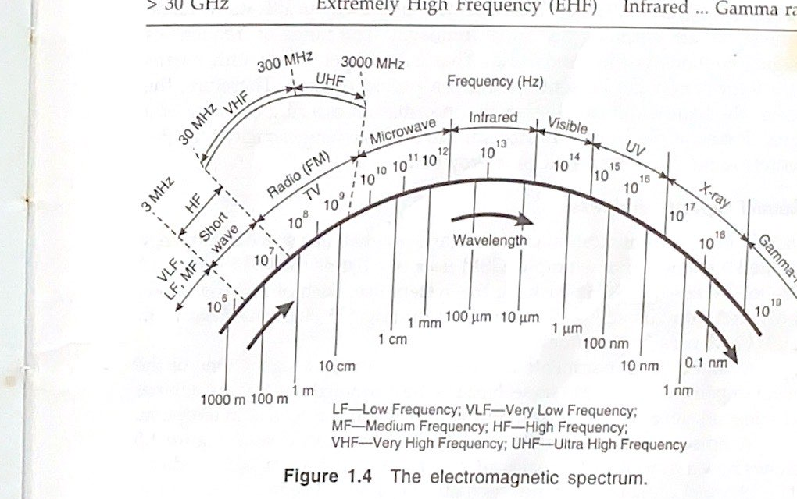

### 2.4 Verified Formulas & Calculations
- **Antenna Dimension Constraint:** Efficient radio radiation requires antenna length on the order of $\lambda / 4$ or $\lambda / 2$.
  - At $f = 1\text{ MHz}$ (MF band):
    $$\lambda = \frac{3 \times 10^8\text{ m/s}}{1 \times 10^6\text{ s}^{-1}} = 300\text{ m}$$
    An antenna would require a physical height of $75\text{--}150\text{ meters}$, which is impossible for mobile handsets.
  - At $f = 900\text{ MHz}$ (GSM UHF band):
    $$\lambda = \frac{3 \times 10^8\text{ m/s}}{900 \times 10^6\text{ s}^{-1}} \approx 0.333\text{ m} = 33.3\text{ cm}$$
    A quarter-wave antenna is only $\approx 8.3\text{ cm}$, fitting comfortably inside a compact handheld device.

---

## 3. Signal Quality, Noise, and Duplexing Architectures

### 3.1 The Engineering Problem & Intuition
During propagation through the physical medium, radio waves attenuate with distance (path loss) and collect unwanted electrical noise from atmospheric disturbances, thermal agitation, and adjacent electronics. The receiver must be able to distinguish the intended signal from background noise. Furthermore, practical voice communication requires simultaneous two-way dialogue without users speaking over one another or drowning out their own receivers.

### 3.2 Technical Mechanism & Architecture
- **Noise:** Any unwanted signal combining with the transmitted waveform, corrupting amplitude and phase.
- **Channel Capacity:** The theoretical maximum rate at which information can be reliably transmitted over a communication channel without error under given noise constraints.
- **Signal-to-Noise Ratio (SNR):** The ratio of received signal power ($P_{\text{signal}}$) to noise power ($P_{\text{noise}}$):
  $$\text{SNR} = \frac{P_{\text{signal}}}{P_{\text{noise}}} = \frac{A_{\text{signal}}^2}{A_{\text{noise}}^2}$$
  Expressed logarithmically in decibels ($\text{dB}$):
  $$\text{SNR}_{\text{dB}} = 10 \log_{10} \left( \frac{P_{\text{signal}}}{P_{\text{noise}}} \right)$$

#### Directionality Modes in Radio Communication
1. **Simplex:** One-way communication only. Example: Pagers (receives messages but cannot transmit acknowledgments).
2. **Half-Duplex:** Two-way communication over a shared channel, but only one party can transmit at any given instant. Example: Walkie-talkies (press-to-talk).
3. **Full-Duplex:** Simultaneous bidirectional transmission and reception. Example: Telephones and cellular networks.

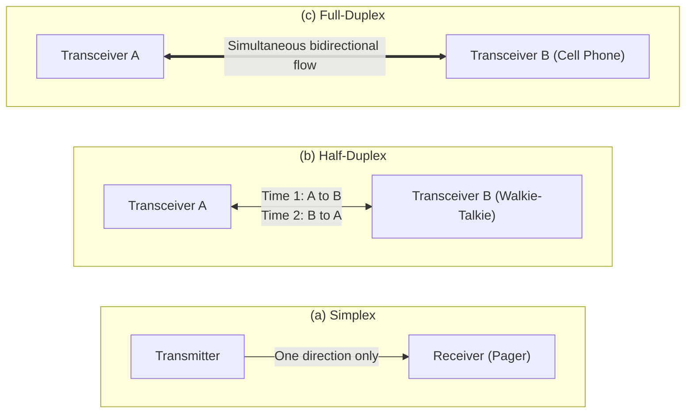
```mermaid
flowchart LR
    subgraph Simplex["(a) Simplex"]
        direction LR
        S1["Transmitter"] -->|"One direction only"| S2["Receiver (Pager)"]
    end
    subgraph HalfDuplex["(b) Half-Duplex"]
        direction LR
        H1["Transceiver A"] <-->|"Time 1: A to B<br/>Time 2: B to A"| H2["Transceiver B (Walkie-Talkie)"]
    end
    subgraph FullDuplex["(c) Full-Duplex"]
        direction LR
        F1["Transceiver A"] <===>|"Simultaneous bidirectional flow"| F2["Transceiver B (Cell Phone)"]
    end
```

#### Duplexing Implementation Schemes
- **Frequency Division Duplexing (FDD):** Assigns two separate, distinct frequency bands separated by a fixed frequency split (e.g., $45\text{ MHz}$ in GSM 900). A physical filter known as a **duplexer** isolates the high-power transmitter from the sensitive receiver on the same antenna. Best suited for wide-area cellular networks (WAN) and Wireless Local Loops (WLL).
- **Time Division Duplexing (TDD):** Uses a single frequency band, alternating between uplink and downlink in rapidly repeating time slots. Because transmission is not continuous, duplexers are omitted, reducing cost and device thickness. Best suited for short-range, low-power systems (e.g., cordless DECT).

### 3.3 Visual Anchors
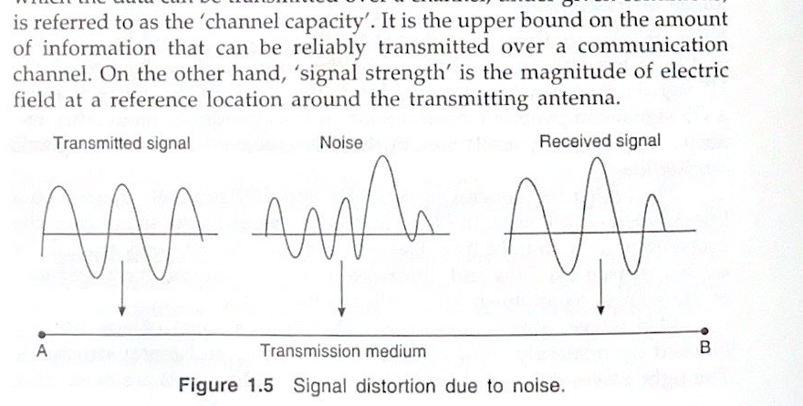

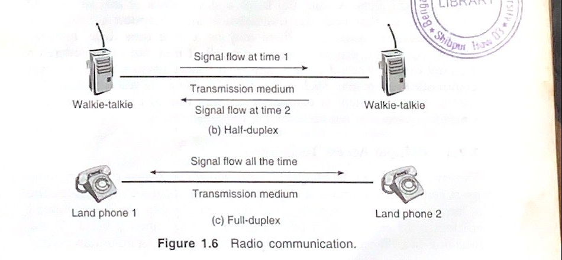

### 3.4 Verified Calculations
- **Textbook Example Audit (Scan 05):** Given a cellular channel with linear power ratio $P_{\text{signal}} / P_{\text{noise}} = 96.2$:
  $$\text{SNR}_{\text{dB}} = 10 \log_{10}(96.2) \approx 10 \times 1.983175 = 19.83\text{ dB} \approx 20\text{ dB}$$
  *Verification:* Confirms the textbook statement that a power ratio of $\approx 96.2$ corresponds to an SNR of $20\text{ dB}$. High SNR guarantees high voice clarity and low bit error rates (BER).

---

## 4. Radio System Operational Pipeline & Modulation Schemes

### 4.1 The Engineering Problem & Intuition
A user speaks into a microphone, producing an analog baseband voice signal concentrated below $4\text{ kHz}$. This low-frequency signal cannot be radiated into free space directly due to the massive physical antenna sizes required ($> 18\text{ km}$!) and immediate path loss. Furthermore, physical channels suffer from multipath fading, where reflections from buildings cause signals to cancel out in deep fades. The system must digitize the voice, strip out redundant bits to conserve bandwidth, inject controlled error-correcting codes, scramble bits to protect against burst errors, and shift the signal up to radio frequencies.

### 4.2 Technical Mechanism & Architecture
The end-to-end radio transmission and reception pipeline operates through four discrete processing stages:

```mermaid
flowchart LR
    subgraph TX["Transmitter Pipeline"]
        direction LR
        A["Source Coder<br/>(A-to-D, strip redundancy)"] --> B["Channel Coder<br/>(Error correction, parity)"]
        B --> C["Interleaver<br/>(Scramble block errors)"]
        C --> D["Modulator<br/>(Baseband to RF bandpass)"]
    end
    TX -->|"Electromagnetic Radio Path"| RX
    subgraph RX["Receiver Pipeline"]
        direction LR
        E["Demodulator<br/>(RF to baseband pulses)"] --> F["Deinterleaver<br/>(Descramble bit order)"]
        F --> G["Channel Decoder<br/>(Correct transmission errors)"]
        G --> H["Source Decoder<br/>(D-to-A speech synthesis)"]
    end
```

1. **Source Coding:** Converts the continuous analog waveform (voice) into digital bits and strips out redundant acoustic information to minimize required bit rate (e.g., speech vocoders).
2. **Channel Coding:** Adds controlled mathematical redundancy (e.g., block codes, convolutional codes, parity checks) so the receiver can detect and correct bit errors caused by channel noise and Doppler shifts.
3. **Interleaving:** When a mobile device moves through an urban multipath null (deep fade), signal loss alters consecutive sequences of bits, producing a **block error**. Standard channel coders can correct isolated bit errors but fail on large burst errors. The interleaver scrambles the sequential bit ordering over multiple transmission frames. At the receiver, deinterleaving restores the original order, scattering the burst of errors into isolated, single-bit errors that the channel coder easily corrects.
   - *Design Trade-off:* Interleaving introduces processing and buffer latency; for real-time conversational voice, this delay must be strictly bounded ($< 20\text{--}40\text{ ms}$).
4. **Modulation:** Maps the digital baseband pulses onto a high-frequency sinusoidal radio carrier ($f_c \gg f_m$) to generate a bandpass signal suitable for antenna radiation.

#### Analog vs. Digital Modulation Techniques
- **Amplitude Modulation (AM) vs. Amplitude Shift Keying (ASK):** Varies carrier amplitude proportional to the modulating signal. Highly susceptible to noise and multipath fading; discarded in modern cellular mobile radios.
- **Frequency Modulation (FM) vs. Frequency Shift Keying (FSK):** Varies carrier frequency proportional to the modulating signal while maintaining constant amplitude. Constant envelope transmission allows high-efficiency non-linear RF power amplifiers and provides strong noise immunity.
- **Phase Modulation (PM) vs. Phase Shift Keying (PSK / BPSK):** In Binary PSK (BPSK), a logic `0` to `1` transition shifts the carrier phase by $180^\circ$ ($\pi$ radians) while amplitude and frequency remain constant. Highly resistant to amplitude distortions and noise; widely adopted in digital standards.

### 4.3 Visual Anchors

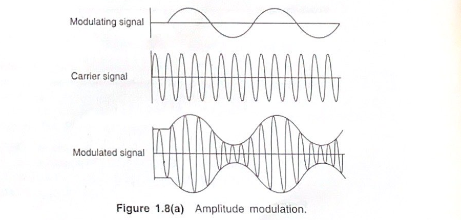
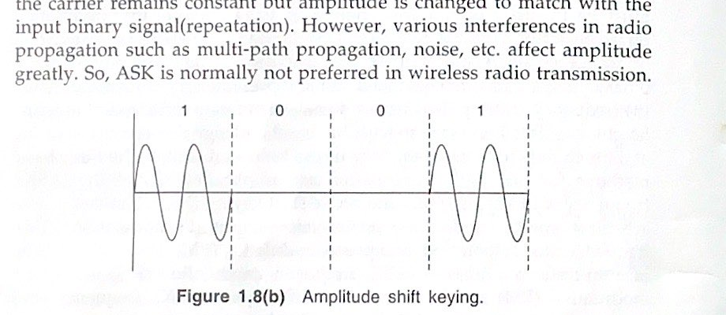

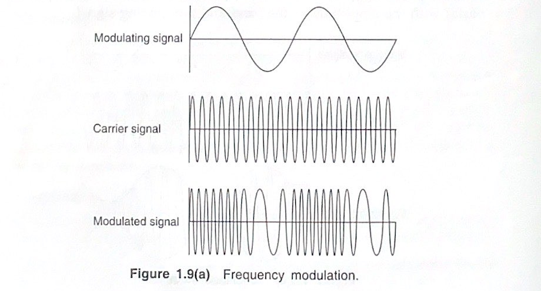
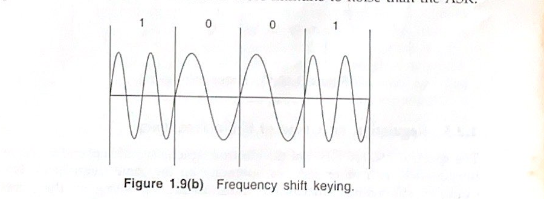

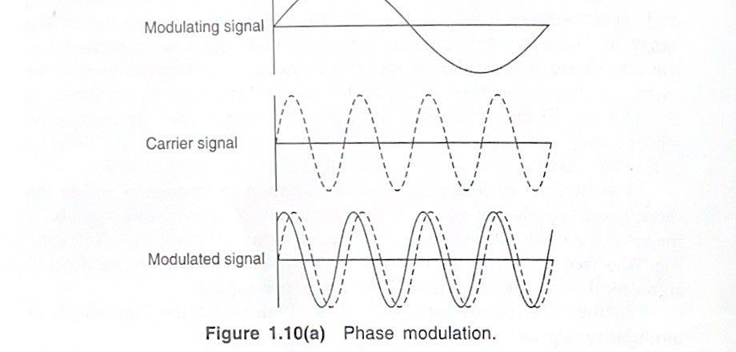
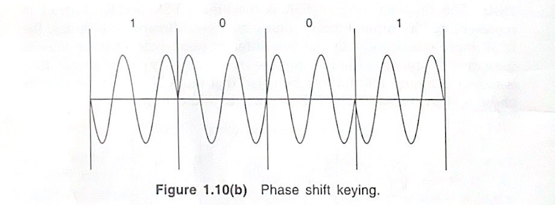

### 4.4 Verified Calculations
- **FM Frequency Deviation Audit (Scan 08):**
  - Carrier frequency $f_c = 1000\text{ MHz}$. Modulating signal amplitude $A_m = 20$. Frequency deviation sensitivity $k_f = 40\text{ kHz/unit amplitude}$.
  - Peak frequency deviation:
    $$\Delta f = A_m \times k_f = 20 \times 40\text{ kHz} = 800\text{ kHz} = 0.8\text{ MHz}$$
  - Modulated signal swings between:
    $$f_{\text{min}} = 1000\text{ MHz} - 0.8\text{ MHz} = 999.2\text{ MHz}$$
    $$f_{\text{max}} = 1000\text{ MHz} + 0.8\text{ MHz} = 1000.8\text{ MHz}$$
  - If modulating frequency $f_m = 2\text{ kHz}$, this frequency swing repeats $2000$ times per second. Carson's rule confirms FM bandwidth is roughly an order of magnitude larger than baseband voice ($B_{\text{FM}} \approx 10 \times B_{\text{mod}}$).

---

## 5. The Cellular Paradigm & Network Architecture

### 5.1 The Engineering Problem & Intuition
If an entire city is served by a single base station, all users in that city must share that single pool of frequencies. Once 50 people are on the phone, the 51st caller is blocked. To provide service to millions of subscribers within a fixed spectral allocation, the coverage region must be divided into small cells, each powered by a low-power base station. Because the radio power drops rapidly with distance, two cells located sufficiently far apart can use the **exact same frequencies simultaneously** without causing interference.

### 5.2 Technical Mechanism & Architecture
A cellular network consists of three fundamental entities:
1. **Mobile Station (MS):** The subscriber terminal (handheld phone or vehicle transceiver) containing radio transceiver, antenna, and control logic.
2. **Base Station (BS):** A fixed transceiver site located at the cell center (or cell edge) equipped with transmitter, receiver, and directional/omnidirectional antenna arrays. It allocates radio channels to MS units.
3. **Mobile Switching Centre (MSC):** The central coordinating exchange connecting multiple base stations to the wireline Public Switched Telephone Network (PSTN). The MSC coordinates call setup, routing, billing, and mobility management.

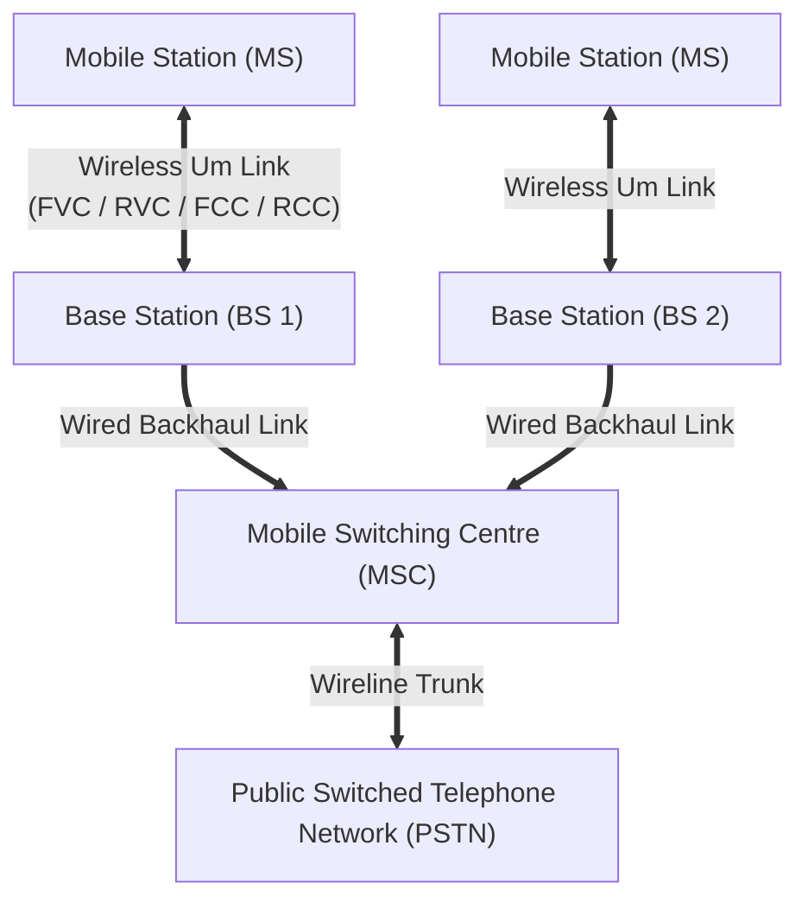
```mermaid
flowchart TD
    MS1["Mobile Station (MS)"] <==>|"Wireless Um Link<br/>(FVC / RVC / FCC / RCC)"| BS1["Base Station (BS 1)"]
    MS2["Mobile Station (MS)"] <==>|"Wireless Um Link"| BS2["Base Station (BS 2)"]
    BS1 ==>|"Wired Backhaul Link"| MSC["Mobile Switching Centre (MSC)"]
    BS2 ==>|"Wired Backhaul Link"| MSC
    MSC <==>|"Wireline Trunk"| PSTN["Public Switched Telephone Network (PSTN)"]
```

#### Logical Channel Classification
In a cellular network, channels are partitioned into voice and control channels:
- **Forward Voice Channel (FVC):** Downlink voice transmission from BS to MS.
- **Reverse Voice Channel (RVC):** Uplink voice transmission from MS to BS.
- **Forward Control Channel (FCC):** Downlink control/setup channel continuously broadcasting system parameters, paging requests, and channel assignments (acts as a network beacon).
- **Reverse Control Channel (RCC):** Uplink control channel used by the MS to request call origination, acknowledge pages, or initiate registration.
- *System Allocation:* In commercial systems, approximately **5% of total channels** are dedicated setup/control channels (FCC/RCC), while the remaining 95% carry user voice traffic (FVC/RVC).

#### Why Hexagonal Cells?
Real-world radio coverage (**the footprint**) is amorphous and irregular due to terrain. For systematic mathematical planning, designers model cells as regular geometric tessellations. Candidate shapes include circles, squares, equilateral triangles, and regular hexagons:
- **Circles:** Match the ideal omnidirectional antenna radiation pattern, but circular shapes cannot tile an area without leaving uncovered dead zones or overlapping regions.
- **Squares & Triangles:** Tile without gaps, but distance from the center to corners varies significantly, resulting in uneven signal strength along boundaries.
- **Hexagons:** Tile an entire geographic area without gaps or overlaps, ensure all adjacent cell centers are equidistant, approximate circular radiation closely, and provide the **largest coverage area for a given circumradius $R$** among all regular tessellating polygons.

*Causes of Real-World Deviations:* Exact hexagons cannot be physically implemented due to real-world terrain obstructions, foliage, high-rise buildings creating shadows, base station siting limitations (land acquisition disputes), and antenna directional biases.

### 5.3 Visual Anchor
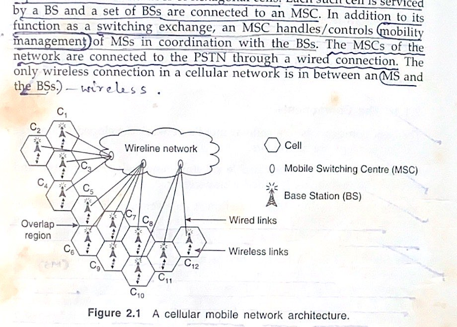

---

## 6. Call Setup Protocols: Origination and Paging Workflows

### 6.1 The Engineering Problem & Intuition
When an MS is powered on, how does the network know it exists? When an MS dials a number, how do radio channels get assigned without human operator intervention? Conversely, when a landline caller dials a mobile phone, how does the system locate that specific moving handset across thousands of square miles?

### 6.2 Technical Mechanism & Architecture

#### Initial Power-On Routine
1. The MS automatically scans all pre-programmed Forward Control Channels (FCCs) to detect the strongest base station beacon.
2. The MS locks onto the strongest BS (which becomes its serving BS).
3. The MS continuously monitors this FCC to ensure signal strength remains above the minimum usable receiver threshold.

#### Workflow 1: Call Origination by a Mobile Station (MS)
1. **Origination Request:** MS transmits a call request on the Reverse Control Channel (RCC) to the serving BS. The burst contains its Mobile Identification Number (MIN), Electronic Serial Number (ESN), and the dialed destination digits.
2. **BS Relay:** Serving BS intercepts the RCC burst and forwards it to the controlling MSC over the wireline backhaul.
3. **MSC Validation:** MSC validates subscriber authenticity and account standing.
4. **Voice Channel Allocation:** MSC commands the BS to allocate an unused pair of Forward and Reverse Voice Channels (FVC/RVC). The BS signals this channel assignment to the MS over the FCC. Both MS and BS retune transceivers to the assigned voice frequencies.
5. **Connecting Called Party:**
   - *If Called Party is a Landline:* MSC routes call to PSTN.
   - *If Called Party is another MS:* MSC dispatches a paging request containing the destination MIN across all BSs in its service area. All BSs broadcast the MIN on their FCCs. The called MS detects its MIN, responds on the RCC, the serving BS alerts the MSC, and the MSC commands voice channel assignment.
6. **Alert & Conversation:** Serving BS transmits an alert message instructing the called terminal to ring. Upon answering, bidirectional voice conversation begins on FVC/RVC.

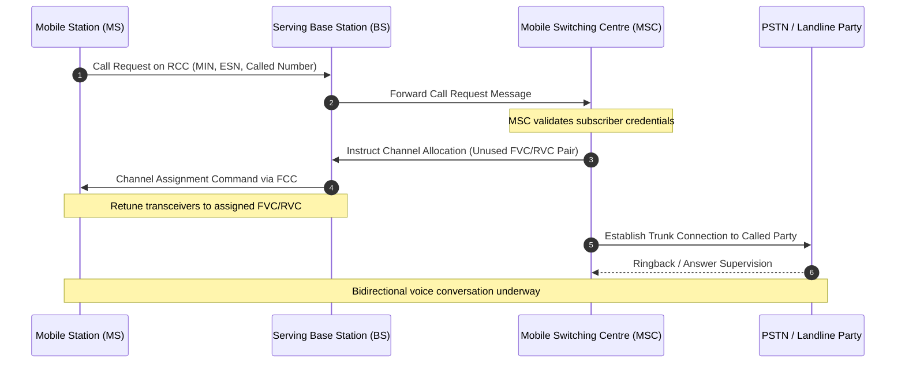
```mermaid
sequenceDiagram
    autonumber
    participant MS as Mobile Station (MS)
    participant BS as Serving Base Station (BS)
    participant MSC as Mobile Switching Centre (MSC)
    participant PSTN as PSTN / Landline Party

    MS->>BS: Call Request on RCC (MIN, ESN, Called Number)
    BS->>MSC: Forward Call Request Message
    Note over MSC: MSC validates subscriber credentials
    MSC->>BS: Instruct Channel Allocation (Unused FVC/RVC Pair)
    BS->>MS: Channel Assignment Command via FCC
    Note over MS,BS: Retune transceivers to assigned FVC/RVC
    MSC->>PSTN: Establish Trunk Connection to Called Party
    PSTN-->>MSC: Ringback / Answer Supervision
    Note over MS,PSTN: Bidirectional voice conversation underway
```

#### Workflow 2: Call Origination by a Landline Phone to an MS
1. A landline caller dials the MS directory number; the PSTN routes the call to the local MSC.
2. The MSC receives the call request and dispatches a **paging broadcast** containing the called MS's MIN across all BSs in the network.
3. All BSs broadcast the MIN on their respective FCCs.
4. The target MS hears its MIN on the FCC and transmits an acknowledgment on the RCC of its nearest BS.
5. That BS notifies the MSC that the target MS has been located within its cell.
6. The MSC assigns an unused FVC/RVC channel pair to that BS, which commands the MS to tune to the voice frequencies.
7. An alert ring signal is sent; once answered, voice transmission begins.

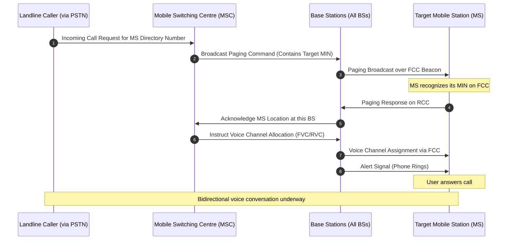
```mermaid
sequenceDiagram
    autonumber
    participant PSTN as Landline Caller (via PSTN)
    participant MSC as Mobile Switching Centre (MSC)
    participant BS as Base Stations (All BSs)
    participant MS as Target Mobile Station (MS)

    PSTN->>MSC: Incoming Call Request for MS Directory Number
    MSC->>BS: Broadcast Paging Command (Contains Target MIN)
    BS->>MS: Paging Broadcast over FCC Beacon
    Note over MS: MS recognizes its MIN on FCC
    MS->>BS: Paging Response on RCC
    BS->>MSC: Acknowledge MS Location at this BS
    MSC->>BS: Instruct Voice Channel Allocation (FVC/RVC)
    BS->>MS: Voice Channel Assignment via FCC
    BS->>MS: Alert Signal (Phone Rings)
    Note over MS: User answers call
    Note over PSTN,MS: Bidirectional voice conversation underway
```

---

## 7. Frequency Reuse Geometry & Cluster Sizing

### 7.1 The Engineering Problem & Intuition
To maximize capacity, we want to reuse frequencies as often as possible. But if two base stations using Channel 1 are placed too close together, their radio waves collide, producing destructive **co-channel interference**. The central geometric design problem is: *How do we group cells into clusters so that every cell in a cluster gets a unique frequency, while identical frequencies are spaced far enough apart to keep interference within acceptable limits?*

### 7.2 Technical Mechanism & Architecture
- **Cluster (Compact Pattern):** A group of $N$ adjacent cells that collectively uses the complete set of radio frequencies allocated to the cellular system. Within a single cluster, no frequency is ever reused.
- **Co-Channel Cells:** Cells in different clusters that are assigned the exact same set of frequencies.
- **Tier Structure:** Due to hexagonal tessellation, any given cell is surrounded by symmetric rings of co-channel cells:
  - **Tier 1 ($T = 1$):** Contains exactly **6 co-channel cells** located at minimum reuse distance $D$, forming a regular outer hexagon.
  - **Tier 2 ($T = 2$):** Contains $6 \times 2 = 12$ co-channel cells.
  - *General Tier Rule:* Tier $T$ contains $6T$ interfering co-channel cells.

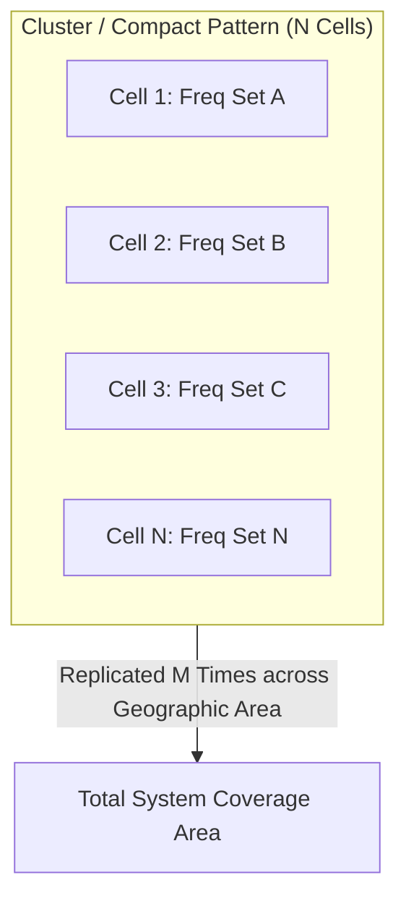
```mermaid
flowchart TD
    subgraph Cluster["Cluster / Compact Pattern (N Cells)"]
        direction LR
        C1["Cell 1: Freq Set A"]
        C2["Cell 2: Freq Set B"]
        C3["Cell 3: Freq Set C"]
        C7["Cell N: Freq Set N"]
    end
    Cluster -->|"Replicated M Times across Geographic Area"| System["Total System Coverage Area"]
```

#### The Cluster Sizing Formula
To tile a continuous two-dimensional plane without seams, the number of cells per cluster $N$ must satisfy:
$$N = i^2 + ij + j^2$$
where $i$ and $j$ are non-negative integers representing hexagonal coordinate shifts.

#### Algorithm to Locate Nearest Co-Channel Cells
To find the Tier-1 co-channel cells for any reference cell $X$:
1. Start at cell center $X$.
2. Move $i$ cells along any chain of hexagon faces.
3. Turn **$60^\circ$ counter-clockwise**.
4. Move $j$ cells in the new direction.
5. The destination cell is a nearest co-channel cell using the identical frequency set. Repeating this in all 6 directions maps the 6 Tier-1 co-channel cells.

### 7.3 Visual Anchors
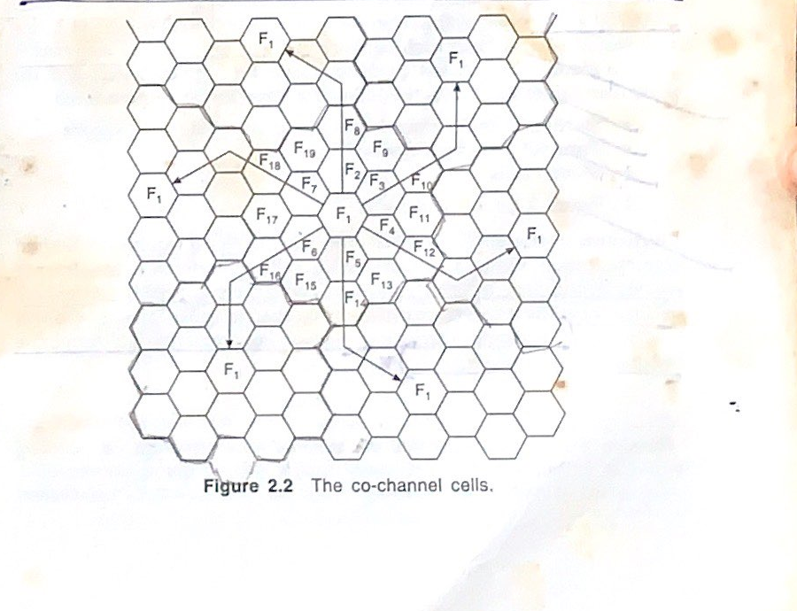

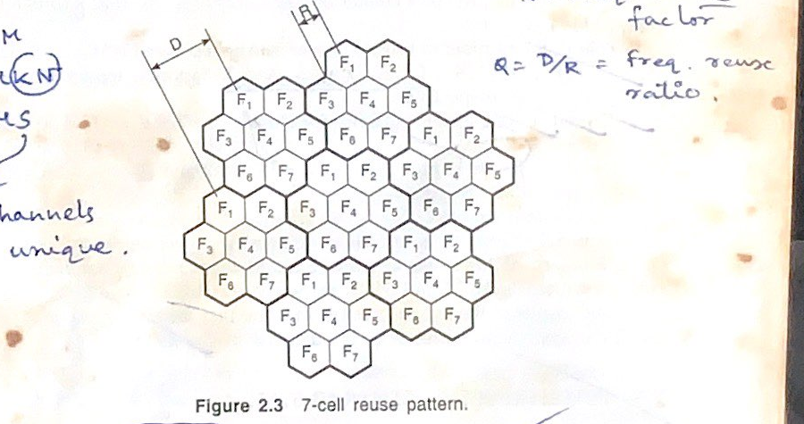

### 7.4 Verified Calculations
- **Allowed Cluster Sizes ($N$):**
  - $i=1, j=1 \implies N = 1^2 + (1)(1) + 1^2 = 3$
  - $i=2, j=0 \implies N = 2^2 + 0 + 0 = 4$
  - $i=2, j=1 \implies N = 2^2 + (2)(1) + 1^2 = 7$
  - $i=3, j=0 \implies N = 3^2 + 0 + 0 = 9$
  - $i=2, j=2 \implies N = 2^2 + (2)(2) + 2^2 = 12$
  - $i=3, j=2 \implies N = 3^2 + (3)(2) + 2^2 = 9 + 6 + 4 = 19$ (Illustrated in source Fig. 2.2).
- **Textbook Example 2.1 Audit (Scan 14):**
  - Total allocated system bandwidth $= 33\text{ MHz} = 33,000\text{ kHz}$.
  - Channel bandwidth per full-duplex voice/control pair $= 50\text{ kHz}$.
  - Total channels available per cluster:
    $$S = \frac{33,000\text{ kHz}}{50\text{ kHz}} = 660\text{ duplex channels}$$
  - If cluster size $N = 12$ ($i=2, j=2$):
    $$K = \frac{S}{N} = \frac{660}{12} = 55\text{ channels per cell}$$
  *Verification:* Confirms the exact numbers derived on slide/page 26.

---

## 8. Cell Design & Total System Capacity

### 8.1 The Engineering Problem & Intuition
The ultimate objective of a cellular service provider is to support the maximum number of simultaneous active calls ($C$) within a licensed geographic territory. However, if the operator attempts to maximize capacity by shrinking cluster size $N$ to the absolute minimum ($N=3$), the co-channel cells are pulled closer together, degrading signal quality. The operator must balance cluster replication ($M$) against co-channel separation distance ($D$).

### 8.2 Technical Mechanism & Architecture
- Let $S$ be the total number of duplex channels allocated to the entire cellular system.
- If a cluster contains $N$ cells, and each cell receives $K$ channels, then:
  $$S = K \cdot N$$
- If this basic cluster pattern is replicated $M$ times across the metropolitan service area, the **total system capacity ($C$)**—the maximum number of simultaneous calls supported—is:
  $$C = M \cdot K \cdot N = M \cdot S$$
- **Direct Proportionality:** System capacity $C$ is strictly proportional to the replication factor $M$. To expand capacity without requiring new spectrum, the operator must replicate the cluster more times by reducing the individual cell radius $R$.

#### Co-Channel Reuse Ratio ($Q$)
From regular hexagonal geometry, the relationship between co-channel separation distance ($D$), cell radius ($R$, circumradius to hexagon vertex), and cluster size ($N$) is given by:
$$Q = \frac{D}{R} = \sqrt{3N}$$

- **Trade-off:**
  - A **small cluster size $N$** maximizes capacity $C$ (since $M = \text{Area}_{\text{total}} / (N \cdot \text{Area}_{\text{cell}})$ is large), but results in a small $Q$ and small $D$, leading to severe co-channel interference.
  - A **large cluster size $N$** isolates co-channel cells with large $D$, minimizing interference, but slashes total system capacity.

### 8.3 Verified Calculations
- **Textbook Example 2.2 Audit (Scan 15):**
  - Total system channels $S = 1596$. Total service area $= 2310\text{ km}^2$. Single cell area $= 6\text{ km}^2$.
  - Recomputed across cluster sizes $N \in \{7, 12, 19\}$:

| Metric | Formula | Cluster $N = 7$ | Cluster $N = 12$ | Cluster $N = 19$ |
|:---|:---|:---|:---|:---|
| **Channels per Cell ($K$)** | $S / N$ | $1596 / 7 = 228$ | $1596 / 12 = 133$ | $1596 / 19 = 84$ |
| **Cluster Area ($\text{Area}_{\text{clust}}$)** | $N \times 6\text{ km}^2$ | $7 \times 6 = 42\text{ km}^2$ | $12 \times 6 = 72\text{ km}^2$ | $19 \times 6 = 114\text{ km}^2$ |
| **Replication Factor ($M$)** | $\lfloor 2310 / \text{Area}_{\text{clust}} \rfloor$ | $2310 / 42 = \mathbf{55}$ | $2310 / 72 \approx \mathbf{32.08} \to 32$ | $2310 / 114 \approx \mathbf{20.26} \to 20$ |
| **System Capacity ($C$)** | $M \times S$ | $55 \times 1596 = \mathbf{87,780}$ | $32 \times 1596 = \mathbf{51,072}$ | $20 \times 1596 = \mathbf{31,920}$ |

*Finding:* Shrinking the cluster size from $N=19$ down to $N=7$ boosts simultaneous network capacity by $175\%$ (from $31,920$ to $87,780$ concurrent users).

---

## 9. Interference Analysis & Signal-to-Interference Ratio ($S/I$)

### 9.1 The Engineering Problem & Intuition
In a cellular network, thermal noise is rarely the limiting factor. The dominant impairment is **interference** generated by other mobile devices operating on the same frequency (co-channel) or adjacent frequencies. If the serving signal power $S$ does not exceed the sum of all interferers $I$ by a sufficient margin, the call experiences audible cross-talk, high bit error rates, and dropped calls.

### 9.2 Technical Mechanism & Architecture
- **Co-Channel Interference:** Caused by cells using the same frequency set. Cannot be eliminated by RF bandpass filtering; controlled purely through spatial separation ($D$).
- **Adjacent Channel Interference:** Caused by signals in frequencies immediately adjacent to the desired channel leaking through imperfect receiver bandpass filters.
- **The Near-Far Problem:** Occurs when an MS close to the BS transmits on a channel adjacent to a distant MS. The high power from the nearby MS bleeds into the adjacent channel, swamping the weak signal received from the distant MS at the BS.
  - *Mitigation:* Proper frequency assignment (adjacent channels are never assigned to the same cell) and **dynamic reverse-link power control** (BS constantly adjusts each MS transmit power so all signals arrive at the BS receiver with equal power).

#### Derivation of Signal-to-Interference Ratio ($S/I$)
The power received from a transmitter at distance $d$ follows the power-law path loss relationship:
$$P_r \propto d^{-k}$$
where $k$ is the path loss exponent (typically $2 \le k \le 5$, with $k=4$ in urban clutter).

Let $S$ be desired signal power from the serving BS at distance $r$, and $I_i$ be interference power from the $i$-th co-channel cell at distance $D_i$:
$$\frac{S}{I} = \frac{S}{\sum_{i=1}^{C_{\text{inter}}} I_i} = \frac{r^{-k}}{\sum_{i=1}^{C_{\text{inter}}} D_i^{-k}}$$
Considering the worst-case scenario where the MS is located at the cell boundary ($r = R$) and assuming all $C = 6$ Tier-1 co-channel cells are located at equal co-channel distance $D_i = D$:
$$\frac{S}{I} = \frac{R^{-k}}{\sum_{i=1}^6 D^{-k}} = \frac{R^{-k}}{6 D^{-k}} = \frac{1}{6} \left( \frac{D}{R} \right)^k = \frac{Q^k}{6}$$
Substituting $Q = \sqrt{3N}$:
$$\frac{S}{I} = \frac{(\sqrt{3N})^k}{6}$$

### 9.3 Computational Audit & Discrepancy Note
- **Textbook Example 2.3 Audit (Scan 16):**
  - Given: GSM TDMA requirement $S/I \ge 15\text{ dB}$, path loss exponent $k = 3$.
  - *Linear Conversion:*
    $$(S/I)_{\text{lin}} = 10^{15 / 10} = 10^{1.5} \approx 31.6228$$
  - *Theoretical Derivation using Eq. (2.4):*
    $$Q^3 = 6 \times (S/I) = 6 \times 31.6228 = 189.7367$$
    $$Q = (189.7367)^{1/3} \approx 5.746$$
    $$N = \frac{Q^2}{3} = \frac{(5.746)^2}{3} = \frac{33.016}{3} \approx 11.005 \implies N = 12$$
  - *Textbook Discrepancy Note:* On page 30, the source text prints:
    $$Q = (6 \times 10^{1.5})^{1/3} = 3.13 \implies N = \frac{Q^2}{3} = \frac{3.13^2}{3} = 3.26 \approx 3$$
    *Audit Assessment:* A numerical audit confirms that $3.13^3 \approx 30.66 \approx 10^{1.5}$. The original textbook calculation omitted the factor of 6 inside the cube root ($10^{1.5/3} = \sqrt{10} \approx 3.162$), arriving at $Q \approx 3.13$ and concluding that $N=3$ suffices. In actual cellular engineering with omnidirectional antennas, $N=7$ or $N=12$ is required to satisfy $15\text{--}18\text{ dB}$ $S/I$.

---

## 10. Channel Assignment Strategies

### 10.1 The Engineering Problem & Intuition
Radio spectrum is fixed and expensive. In any city, traffic demand is never uniform—business districts peak at midday, entertainment centers peak at night, and unexpected traffic jams create sudden localized surges. How should channels be allocated across cells to minimize call blocking without violating co-channel reuse distance constraints?

### 10.2 Technical Mechanism & Architecture

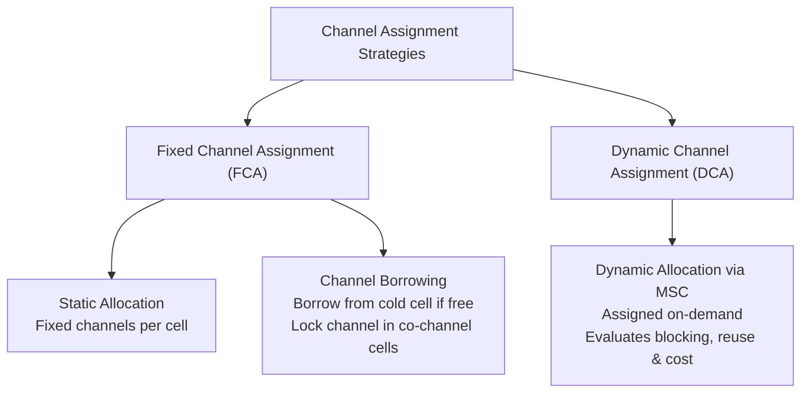
```mermaid
flowchart TD
    A["Channel Assignment Strategies"] --> B["Fixed Channel Assignment (FCA)"]
    A --> C["Dynamic Channel Assignment (DCA)"]
    B --> B1["Static Allocation<br/>Fixed channels per cell"]
    B --> B2["Channel Borrowing<br/>Borrow from cold cell if free<br/>Lock channel in co-channel cells"]
    C --> C1["Dynamic Allocation via MSC<br/>Assigned on-demand<br/>Evaluates blocking, reuse & cost"]
```

#### Fixed Channel Assignment (FCA)
- Each cell is pre-allocated a predetermined, static set of voice channels.
- An incoming call can only be served if an unused channel exists within that cell's pre-allocated pool; if all channels are busy, the call is blocked.
- **Channel Borrowing Variant:** When a congested cell exhausts its channels, it borrows an idle channel from an adjacent cell under MSC supervision.
  - *Strict Borrowing Invariant:* To prevent destructive interference, a borrowed channel must **not be in use by any co-channel cell of the lending cell**. Once borrowed, that channel is locked in all co-channel cells for the duration of the call.

#### Dynamic Channel Assignment (DCA)
- Channels are not permanently assigned to specific cells. All channels are retained in a central pool managed by the MSC.
- When an MS initiates a call, the serving BS requests a channel from the MSC in real time.
- The MSC allocates a channel dynamically based on an optimization cost function evaluating:
  1. Likelihood of future blocking within the cell.
  2. Co-channel reuse distance ($D$).
  3. Frequency separation constraints with adjacent channels.
- *Advantage:* Adapts dynamically to traffic hotspots and non-uniform loads; reduces call blocking at the cost of centralized computational overhead at the MSC.

---

## 11. Handoff Mechanics, Strategies & Practical Constraints

### 11.1 The Engineering Problem & Intuition
When a user on an active phone call drives across a cell boundary, the received signal from the serving base station weakens while the signal from the approaching base station strengthens. If the call does not switch to the new base station seamlessly, it will drop. However, if the handoff threshold is set too high, the network triggers unnecessary handoffs, overwhelming the MSC. If set too low, the call drops before the handoff handshake completes.

### 11.2 Technical Mechanism & Architecture
The handoff decision hinges on defining a threshold signal level ($P_{r\text{threshold}}$):
$$P_{r\text{threshold}} = P_{r\text{minimum}} + \Delta$$
where $P_{r\text{minimum}}$ is the minimum usable signal for acceptable voice quality at the receiver, and $\Delta$ is a safety operating margin.

- **If $\Delta$ is too large:** Unnecessary, premature handoffs occur, loading the MSC switching fabric.
- **If $\Delta$ is too small:** The call drops before the new channel can be allocated as the vehicle travels away from the serving BS.
- **Filtering Transient Fading:** The BS monitors received signal strength over a moving time window to ensure the power drop is caused by vehicle motion rather than momentary Rayleigh fading or shadow dips. A steep signal slope indicates a high-speed vehicle requiring immediate handoff.

#### Generational Handoff Strategies

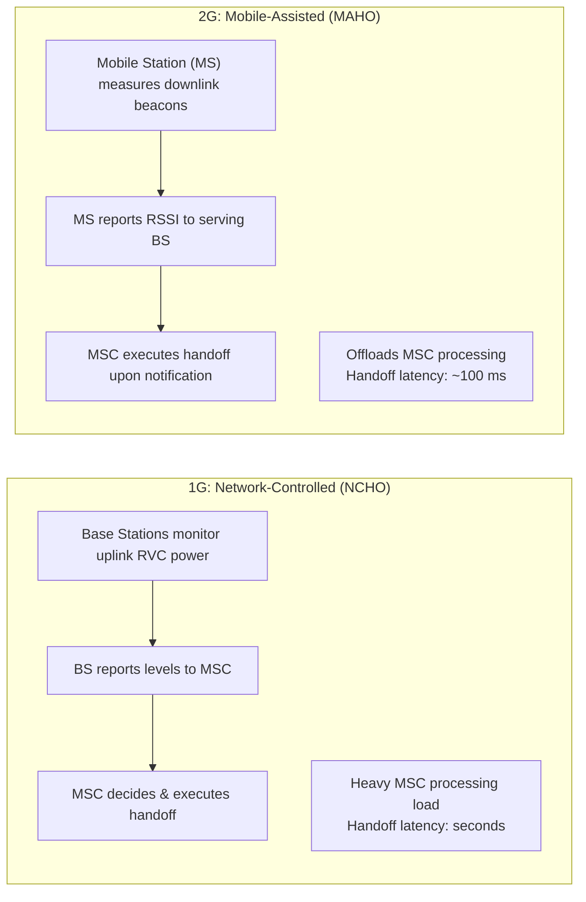
```mermaid
flowchart LR
    subgraph NCHO["1G: Network-Controlled (NCHO)"]
        direction TB
        N1["Base Stations monitor uplink RVC power"] --> N2["BS reports levels to MSC"]
        N2 --> N3["MSC decides & executes handoff"]
        Note1["Heavy MSC processing load<br/>Handoff latency: seconds"]
    end
    subgraph MAHO["2G: Mobile-Assisted (MAHO)"]
        direction TB
        M1["Mobile Station (MS) measures downlink beacons"] --> M2["MS reports RSSI to serving BS"]
        M2 --> M3["MSC executes handoff upon notification"]
        Note2["Offloads MSC processing<br/>Handoff latency: ~100 ms"]
    end
```

- **Network-Controlled Handoff (NCHO - 1G Analog):** The serving BS measures uplink signal strength on the RVC and coordinates with neighboring BSs to measure the MS signal. Measurements are forwarded to the MSC, which decides and executes the handoff. Slow handoff latency ($> 1\text{--}2\text{ seconds}$).
- **Mobile-Assisted Handoff (MAHO - 2G Digital / GSM):** The MS measures received signal strength indicator (RSSI) from its serving BS and periodic beacon signals from surrounding BSs. The MS continually feeds these measurements back to the serving BS over the slow associated control channel. Handoff decisions are much faster ($< 100\text{ ms}$), making MAHO well-suited for small microcells.

#### Hard Handoff vs. Soft Handoff
- **Hard Handoff ("Break-before-Make"):** Employed in FDMA and TDMA systems ($N > 1$). The MS terminates its connection with the existing BS before establishing the radio link on a new frequency with the target BS. The MS communicates with only one BS at any given moment.
- **Soft Handoff ("Make-before-Break"):** Employed in CDMA systems ($N = 1$). Because all cells share the same carrier frequency, an MS entering the boundary region communicates with **two or more base stations simultaneously**. Signals from both base stations are combined at the receiver (diversity combining) until one base station clearly dominates.

#### Handoff Prioritization Strategies
From a user experience standpoint, an abrupt drop of an ongoing conversation is significantly more frustrating than a new call attempt being blocked. Networks prioritize handoffs using two techniques:
1. **Guard Channel Concept:** A fraction of channels in each cell is reserved exclusively for handoff requests from ongoing calls.
   - *Trade-off:* Eliminates dropped calls, but lowers total carried traffic and increases the blocking probability of new calls.
2. **Queuing of Handoffs:** Handoff requests are placed in a FIFO queue when no channel is immediately available, exploiting the safety margin $\Delta$ before the signal degrades below $P_{r\text{minimum}}$.
   - *Trade-off:* Prevents call drops without permanently reserving idle channels, but increases call setup blocking during peak periods.

#### Practical Handoff Anomalies
- **Accommodating Users with Different Speeds:**
  - Fast-moving vehicles in microcells cross boundaries every few seconds, generating a **handoff storm** that overwhelms network signaling.
  - *The Umbrella Cell Solution:* A large macrocell BS with high antenna height and high transmit power overlays several small microcells. Low-speed pedestrian users are assigned to microcells; high-speed vehicles are assigned to the macrocell.
  - In GSM, vehicular speed is detected via the **Timing Advance ($T_A$)** parameter, which measures round-trip propagation time and is updated in the Base Station Controller (BSC) every $480\text{ ms}$. If an MS approaches a base station with rapidly decreasing speed, it is handed off from the macrocell down to a co-located microcell without MSC intervention.
- **Cell Dragging:** In urban street canyons, line-of-sight (LOS) propagation can maintain a very strong signal from a slow-moving pedestrian MS long after it has traveled far beyond the designated geographic boundary of its cell. Because signal strength remains above threshold, no handoff triggers. The MS drags the connection deep into adjacent cells, generating severe co-channel interference.
- **Roaming (Intersystem Handoff):** When an MS travels outside the geographic territory governed by its current MSC into an area controlled by a different MSC or service provider.

### 11.3 Visual Anchors
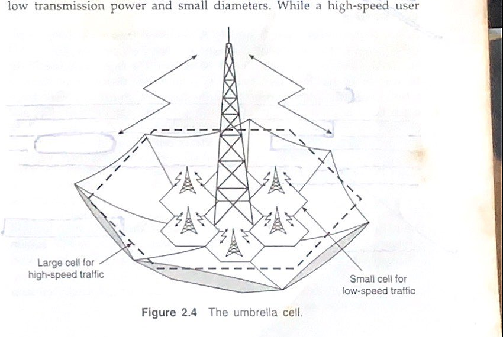

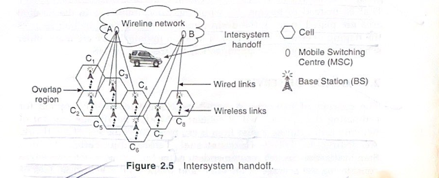

---

## 12. Mobility & Location Management

### 12.1 The Engineering Problem & Intuition
In a wireline telephone network, a telephone number is hardwired to a physical copper pair terminated in a building wall jack. In a cellular network, the phone is in an automobile traveling hundreds of kilometers. When someone dials the user's number, how does the network know which base station should transmit the radio page without broadcasting across every tower on the continent?

### 12.2 Technical Mechanism & Architecture
Mobility management maintains continuous connectivity across two functional planes:
1. **Handoff Management:** Maintains active voice/data sessions across cell boundaries during motion.
2. **Location Management:** Tracks the location of idle mobile devices so incoming calls can be routed efficiently.

```mermaid
flowchart LR
    MS["Roaming Mobile Station"] -->|"Enters Foreign Cell"| VBS["Visiting Base Station"]
    VBS -->|"Registration Request"| VLR["Visitor Location Register (VLR)"]
    VLR <==>|"Signaling System 7 (SS7)"| HLR["Home Location Register (HLR)"]
    HLR -->|"Authentication & Profile Copy"| VLR
```

#### Core Location Registers
- **Home Location Register (HLR):** A permanent central database maintained by the subscriber's home operator. It stores the permanent user profile, service subscriptions, and the **current pointer to the VLR** where the handset is operating.
- **Visitor Location Register (VLR):** A local temporary database maintained by the serving MSC. When a visiting MS enters its coverage area, the VLR caches the subscriber's identity and location coordinates after authenticating with the home HLR.

#### Location Update vs. Paging Overhead Trade-off
- **Paging the Entire Network:** If the MS never reports its location while idle, the MSC must transmit a paging message across every base station in the network to locate it. This generates massive radio signaling traffic that exhausts downlink control channels (FCCs).
- **Paging by Location Area (LA):** The network groups adjacent cells into a **Location Area (LA)**. The MS only transmits a location update when it crosses an LA boundary. When a call arrives, the MSC pages only the base stations within that specific LA, significantly reducing radio overhead.

---

## 13. Traffic Engineering, Trunking Theory & Grade of Service (GOS)

### 13.1 The Engineering Problem & Intuition
It is economically impossible to provide a dedicated radio channel for every cellular subscriber. Cellular systems exploit the statistical principle of **trunking**: because subscribers only use their phones for a small fraction of the day, a small pool of shared channels can support a large user population. How do engineers mathematically determine the minimum number of channels required to guarantee that only a negligible fraction of calls are blocked during the busiest hour?

### 13.2 Technical Mechanism & Architecture
Trunking theory was developed by Danish mathematician A.K. Erlang.

- **Traffic Intensity ($A$):** Measured in dimensionless units called **Erlangs**. One Erlang represents the continuous traffic load of a single channel occupied 100% of the time:
  $$A = \lambda \cdot h$$
  where $\lambda$ is the mean call arrival rate (calls/hour), and $h$ is the mean call holding duration (hours).
- **Per-User Traffic Intensity ($A_{\text{pu}}$):** For $n$ active subscribers:
  $$A_{\text{pu}} = \lambda_{\text{user}} \cdot h, \quad A = n \cdot A_{\text{pu}}$$
- **Grade of Service (GOS):** A benchmark of network congestion during the busy hour, defined as the probability of call blocking ($P_b$). A $\text{GOS} = 0.01$ means that, on average, 1 out of 100 call attempts will be blocked during the busy hour.

#### Trunking Models: LCC vs. LCD
1. **Lost Calls Cleared (LCC / Blocked Calls Cleared):** If a user attempts a call when all channels are busy, the call is immediately blocked and cleared from the system. Cellular networks implement LCC via the **Erlang B formula**.
2. **Lost Calls Delayed (LCD / Blocked Calls Delayed):** If all channels are busy, call attempts are placed in a queue until a channel becomes free. Modeled via the **Erlang C formula**.

#### Erlang B Model Assumptions
- Fixed Poisson arrival rate (memoryless inter-arrival times).
- Exponentially distributed call holding times.
- Finite pool of $C$ trunked channels.
- Infinite user population (requests from blocked users do not diminish traffic load).

$$\text{GOS} = P_b = \frac{\frac{A^C}{C!}}{\sum_{k=0}^C \frac{A^k}{k!}}$$

#### Erlang B Capacity Table (Source Table 2.1)

| Number of Channels ($C$) | Offered Load ($A$, Erlangs) at $\text{GOS} = 0.001$ | Offered Load ($A$) at $\text{GOS} = 0.002$ | Offered Load ($A$) at $\text{GOS} = 0.005$ | Offered Load ($A$) at $\text{GOS} = 0.01$ | Offered Load ($A$) at $\text{GOS} = 0.02$ |
|:---:|:---:|:---:|:---:|:---:|:---:|
| **10** | $3.09$ | $3.43$ | $3.96$ | $4.46$ | $5.08$ |
| **20** | $9.41$ | $10.07$ | $11.10$ | $12.03$ | $13.18$ |
| **30** | $16.68$ | $17.61$ | $19.03$ | $20.34$ | $21.93$ |
| **40** | $24.44$ | $25.60$ | $27.38$ | $29.01$ | $30.99$ |
| **50** | $32.51$ | $33.88$ | $35.98$ | $37.90$ | $40.25$ |
| **60** | $40.79$ | $42.35$ | $44.76$ | $46.95$ | $49.64$ |
| **70** | $49.24$ | $50.98$ | $53.66$ | $56.11$ | $59.13$ |
| **80** | $57.81$ | $59.72$ | $62.67$ | $65.36$ | $68.69$ |
| **90** | $66.48$ | $68.56$ | $71.75$ | $74.68$ | $78.30$ |
| **100** | $75.24$ | $77.47$ | $80.91$ | $84.06$ | $87.97$ |

### 13.3 Verified Calculations
- **Textbook Example 2.4 Audit (Scan 21):**
  - Channels per cell $C = 20$. Target blocking probability $\text{GOS} = 0.01$ ($1\%$).
  - Per-user calling profile: $\lambda_{\text{user}} = 3\text{ calls/hour}$, average call duration $h = 2\text{ minutes} = 2/60 = 1/30\text{ hours}$.
  - Per-user traffic intensity:
    $$A_{\text{pu}} = \lambda_{\text{user}} \times h = 3 \times \frac{2}{60} = 0.1\text{ Erlangs}$$
  - From Table 2.1, for $C = 20$ channels and $\text{GOS} = 0.01$, total supported traffic load $A = 12.03\text{ Erlangs}$.
  - Maximum admissible user population per cell:
    $$n = \frac{A}{A_{\text{pu}}} = \frac{12.03}{0.1} = 120.3 \approx \mathbf{120\text{ users}}$$
  *Verification:* Independently confirmed via computational Erlang B recursive audit ($P_b(12.03, 20) = 0.009996 \approx 1.0\%$).
- **Textbook Example 2.5 Audit (Scan 21):**
  - Given $C = 120$ trunked channels, channel utilization $= 2/3$.
  - Carried traffic intensity:
    $$A = \frac{2}{3} \times 120 = \mathbf{80\text{ Erlangs}}$$

---

## 14. Capacity Expansion Techniques: Splitting & Sectoring

### 14.1 The Engineering Problem & Intuition
When a city's cellular subscriber base grows by $300\%$, the operator cannot acquire three times as much radio spectrum. The network must expand its capacity within the existing allocated spectrum. Two engineering techniques accomplish this without requiring new spectrum: **cell splitting** and **cell sectoring**.

### 14.2 Technical Mechanism & Architecture

#### Cell Splitting
Cell splitting replaces congested cells with smaller microcells, each equipped with its own base station:
- Macrocell radius $R$ is scaled down to microcell radius $R' = R/2$ (or smaller).
- Because cell area is proportional to $R^2$, reducing radius by half yields **four times as many cells** over the same physical territory.
- **Power Scaling:** Base station transmitter power and antenna heights must be reduced to scale down the coverage footprint without causing co-channel interference.
- **Frequency Reuse Invariant:** Cells are split while keeping the **frequency reuse ratio ($Q = D/R$) constant**.
- *System Trade-offs:* Multiplies handoffs across microcell boundaries (requiring umbrella macrocells to handle fast vehicular traffic) and increases backhaul and site leasing costs.

#### Cell Sectoring
Instead of using an omnidirectional antenna that radiates $360^\circ$, cell sectoring installs directional antennas at the base station to partition the cell into angular sectors:
- **Three-Sector Design ($120^\circ$):** Uses 3 directional antennas per tower.
- **Six-Sector Design ($60^\circ$):** Uses 6 directional antennas per tower.
- **Interference Reduction:** Cell radius $R$ remains unchanged, but a mobile station in one sector only receives interference from co-channel base station antennas pointing directly into its sector, rather than from all directions.
  - In a 7-cell reuse system ($N=7$), an omnidirectional cell receives interference from all 6 Tier-1 co-channel cells.
  - With $120^\circ$ sectoring, interference drops from 6 interferers to **only 2 interferers**.
  - With $60^\circ$ sectoring, interference drops to **only 1 interferer**.
- **Net Gain:** Because $S/I$ increases significantly, the operator can reduce the cluster size $N$, allowing frequencies to be reused more frequently and increasing overall system capacity.
- *System Trade-offs:*
  1. Handoffs occur when an MS crosses sector boundaries within the same cell.
  2. Channel pools are partitioned into smaller groups per sector, **reducing trunking efficiency**.

### 14.3 Visual Anchors
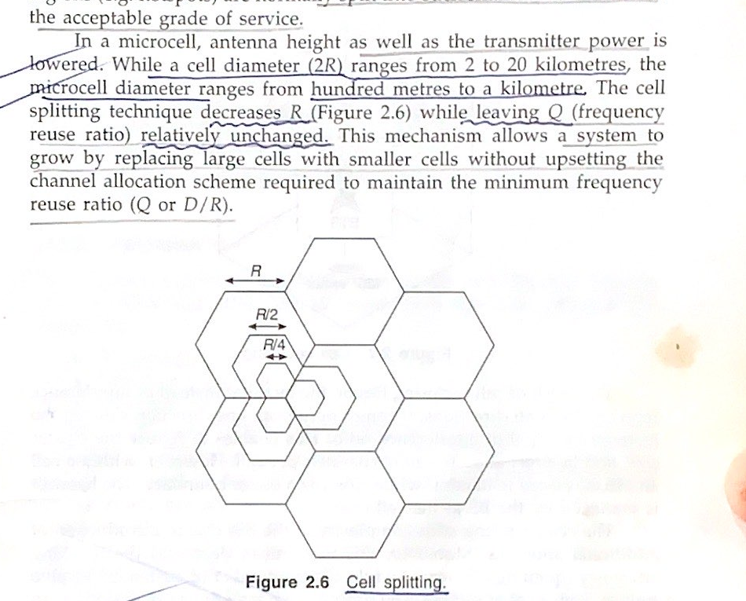

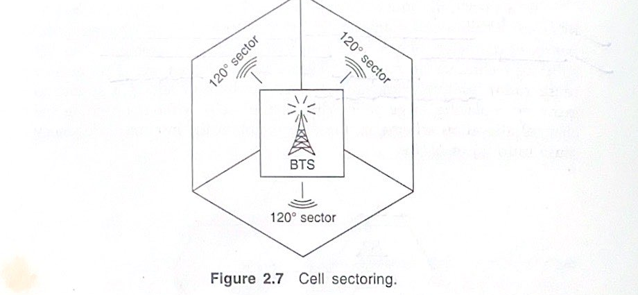

---

## 15. User Validation & Cryptographic Authentication in AMPS

### 15.1 The Engineering Problem & Intuition
Early analog cellular systems were vulnerable to fraud. In early AMPS, a handset transmitted its serial number and phone number unencrypted over the air during registration. Fraudsters used radio scanners to intercept these identifiers and cloned them into counterfeit phones, charging thousands of dollars in international calls to legitimate users. The network needed a secure authentication mechanism that validates a handset without ever transmitting the secret key over the air.

### 15.2 Technical Mechanism & Architecture

#### Identification Numbers in AMPS
- **Electronic Serial Number (ESN):** A 32-bit hardware identifier permanently etched into the phone's EEPROM (contains an 8-bit manufacturer code + 24-bit unique handset ID).
- **Mobile Identification Number (MIN):** A 34-bit digital representation of the subscriber's 10-digit telephone directory number.

#### The Challenge-Response Authentication Protocol
To prevent cloning, advanced AMPS introduced a cryptographic challenge-response mechanism using a 64-bit secret **Authentication Key (A-key)**:
1. The A-key is provisioned securely to the handset's internal storage and stored in the network operator's authentication center. The A-key is **never transmitted over the radio air interface**.
2. **Deriving Shared Secret Data (SSD):** The mobile station combines its internal A-key with its hardware ESN to generate a secondary key called the **Shared Secret Data (SSD)**.
3. **Challenge Execution:** The mobile terminal runs an authentication algorithm (CAVE) taking SSD as input to compute a cryptographic response: **MS-AUTHR**.
4. **Transmission:** The MS transmits its calculated `MS-AUTHR` along with its plaintext `MIN` and `ESN` over the radio link to the network.
5. **Network Verification:**
   - The serving network retrieves the subscriber's stored A-key from its secure database.
   - Using the received ESN, the network independently computes the exact same SSD.
   - The network executes the authentication algorithm on this SSD to generate **NT-AUTHR**.
6. **Decision:** The network compares `MS-AUTHR` against `NT-AUTHR`:
   - $\text{MS-AUTHR} == \text{NT-AUTHR} \implies$ **Authentication Success.** Call proceeds.
   - $\text{MS-AUTHR} \ne \text{NT-AUTHR} \implies$ **Authentication Failure.** Fraud detected; call terminated.

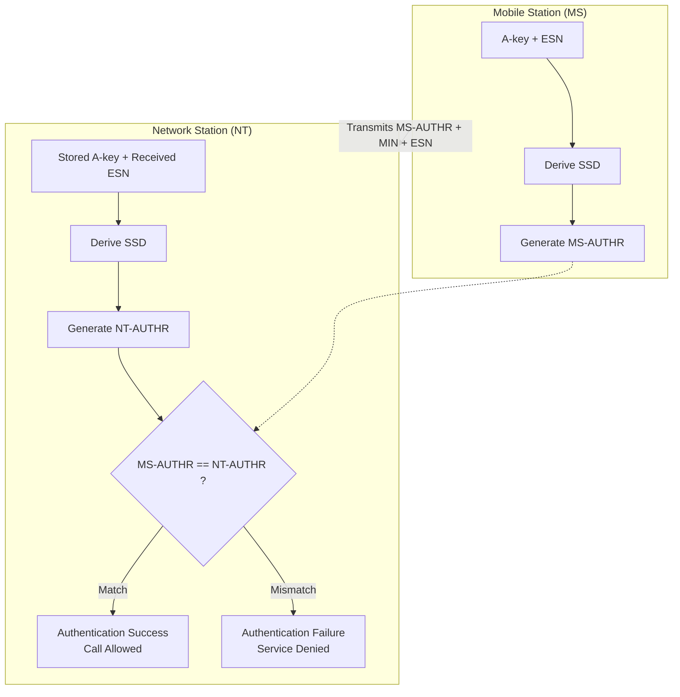
```mermaid
flowchart TD
    subgraph MS["Mobile Station (MS)"]
        A1["A-key + ESN"] --> A2["Derive SSD"]
        A2 --> A3["Generate MS-AUTHR"]
    end
    MS -->|"Transmits MS-AUTHR + MIN + ESN"| NT
    subgraph NT["Network Station (NT)"]
        B1["Stored A-key + Received ESN"] --> B2["Derive SSD"]
        B2 --> B3["Generate NT-AUTHR"]
        B4{"MS-AUTHR == NT-AUTHR ?"}
        B3 --> B4
        A3 -.-> B4
        B4 -->|"Match"| OK["Authentication Success<br/>Call Allowed"]
        B4 -->|"Mismatch"| FAIL["Authentication Failure<br/>Service Denied"]
    end
```

### 15.3 Visual Anchor
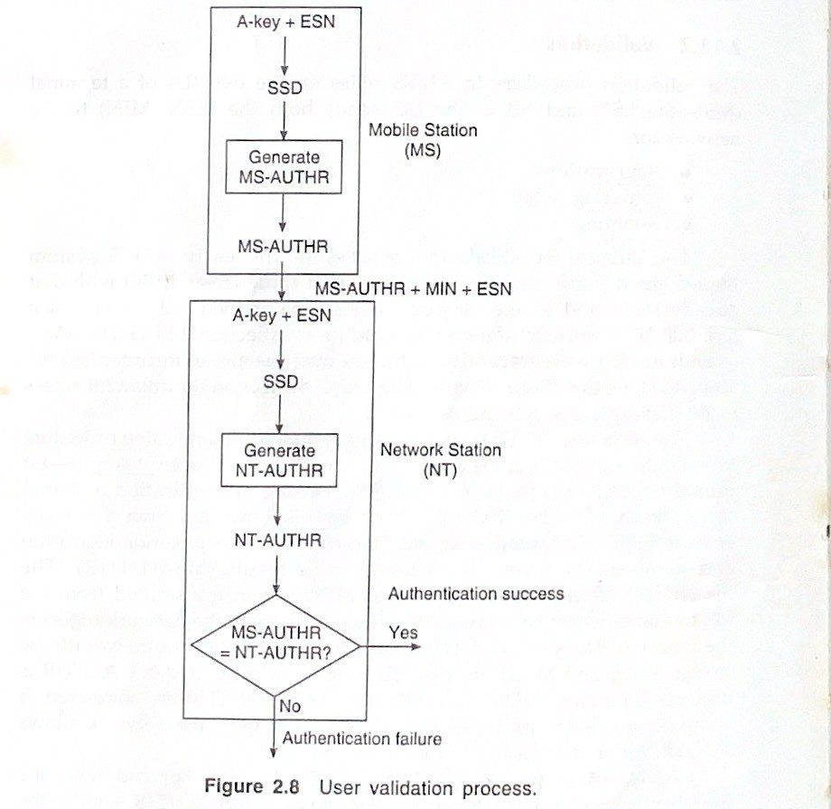

---

## 16. Multiple Access Technologies: FDMA, TDMA, and CDMA

### 16.1 The Engineering Problem & Intuition
In a cellular network, the base station is a single central node that broadcasts information to all users in the downlink (forward link). In the reverse link (uplink), however, hundreds of mobile handsets attempt to transmit data back to the base station simultaneously. Without coordination, their radio waves collide into unintelligible noise. Multiple access schemes provide the mathematical mechanisms to separate simultaneous transmissions at the base station receiver.

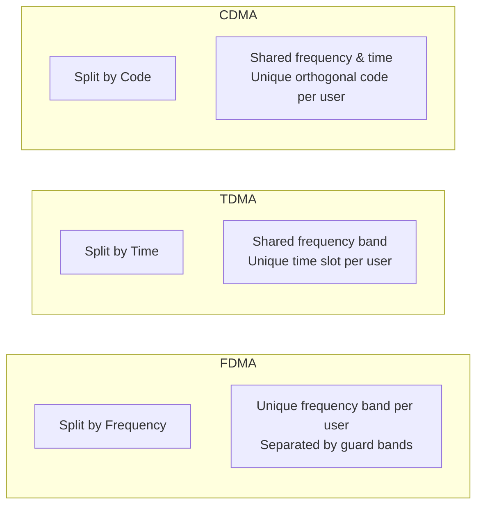
```mermaid
flowchart LR
    subgraph FDMA["FDMA"]
        direction TB
        F1["Split by Frequency"]
        F2["Unique frequency band per user<br/>Separated by guard bands"]
    end
    subgraph TDMA["TDMA"]
        direction TB
        T1["Split by Time"]
        T2["Shared frequency band<br/>Unique time slot per user"]
    end
    subgraph CDMA["CDMA"]
        direction TB
        C1["Split by Code"]
        C2["Shared frequency & time<br/>Unique orthogonal code per user"]
    end
```

### 16.2 Technical Mechanism & Architecture

#### Frequency Division Multiple Access (FDMA)
- Divides the total available frequency bandwidth into non-overlapping channels. Each user is assigned a dedicated frequency channel for the duration of the call.
- **Guard Bands:** Channels must be separated by narrow guard bands to prevent adjacent channel filter leakage.
- *Slide Example:* If a $500\text{ MHz}$ allocation is split into 12 channels of $40\text{ MHz}$ each, each channel includes a $4\text{ MHz}$ guard band, leaving $36\text{ MHz}$ effective usable bandwidth.
- *Characteristics:* Continuous transmission; simple hardware; zero slot synchronization overhead. However, unused channels remain idle and cannot be shared, wasting capacity.

#### Time Division Multiple Access (TDMA)
- Divides each radio frequency channel into repeating frames containing multiple discrete **time slots**.
- A user is assigned a specific time slot within the frequency channel. Transmission occurs in high-speed digital bursts during that assigned slot, remaining completely silent for the remainder of the frame.
- *Slide Example:* 4 radio channels subdivided into 3 time slots each support $4 \times 3 = 12$ simultaneous users, compared to only 4 users in FDMA across the identical spectrum.
- *Characteristics:* Pulsed transmission significantly reduces power consumption, extending handset battery life. Allows dynamic bandwidth allocation (assigning multiple slots to high-priority data users). Requires tight slot synchronization guard times.

#### Code Division Multiple Access (CDMA)
- All users transmit simultaneously across the entire allocated radio spectrum.
- Users are separated in **mathematical code space**: each user is assigned a unique, mutually orthogonal pseudo-random code sequence. The receiver isolates the desired transmission by correlating the received signal with that user's specific code.

### 16.3 Visual Anchors
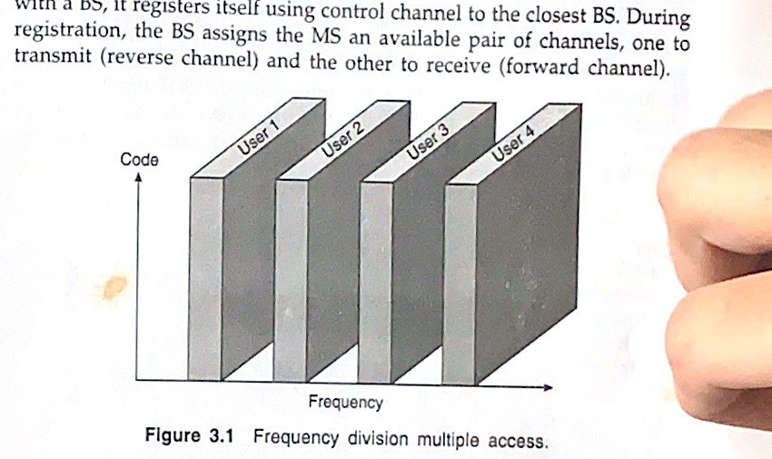

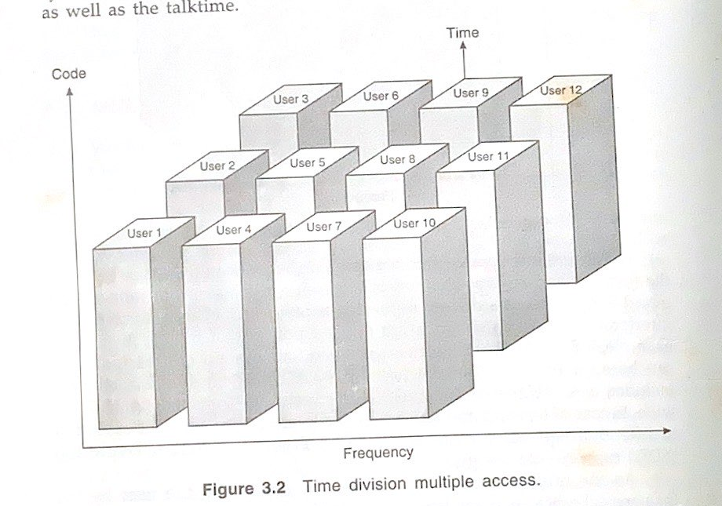

### 16.4 Architectural Trade-offs Matrix

| Feature | FDMA | TDMA | CDMA |
|:---|:---|:---|:---|
| **Separation Dimension** | Frequency space | Time space (within frequency) | Mathematical code space |
| **Transmission Nature** | Continuous analog/digital | Pulsed bursts in assigned slots | Continuous wideband spread spectrum |
| **Carrier Frequency** | Unique per user | Shared across $N_{\text{slot}}$ users | Shared across all users in cell ($N=1$) |
| **Synchronization** | Low overhead | High (requires guard times & timing advance) | Extremely high (chip-level PN synchronization) |
| **Frequency Planning** | Complex & rigid | Complex & rigid | **Simplified** (all cells use same carrier) |
| **Power Control** | Moderate | Moderate | **Critical & continuous** (combats Near-Far problem) |
| **Capacity Limit** | Hard capacity ceiling | Hard capacity ceiling | **Soft capacity limit** (noise floor rises gracefully) |
| **Spectrum Efficiency** | Baseline ($1\times$) | $3\times\text{--}4\times$ analog | $8\times\text{--}10\times$ analog ($4\times\text{--}5\times$ TDMA) |

---

## 17. Spread Spectrum Engineering & CDMA Mathematics

### 17.1 The Engineering Problem & Intuition
How can multiple users transmit simultaneously on the exact same radio frequency without destroying one another's signals?

The intuitive mental model is the **cocktail party analogy**: imagine a large room filled with dozens of people talking simultaneously. If everyone speaks English at the same volume, the room turns into cacophony. But if Pair A speaks English, Pair B speaks French, Pair C speaks Japanese, and Pair D speaks German, each listener can easily track their conversation partner by focusing purely on their unique language, treating all other languages as background noise—provided no single speaker shouts loudly. In CDMA, these distinct "languages" are orthogonal spreading codes, and the requirement not to shout is enforced by fast **transmission power control**.

### 17.2 Technical Mechanism & Architecture
CDMA relies on **Direct Sequence Spread Spectrum (DSSS)**:
1. Low-rate information data bits with bit duration $T_b$ (data rate $R_b = 1/T_b$) are multiplied by a high-rate pseudo-random sequence of **chips** with chip duration $T_c \ll T_b$ (chip rate $R_c = 1/T_c$).
2. **Spreading Factor (Processing Gain):**
   $$\text{Spreading Factor} = \frac{T_b}{T_c} = \frac{R_c}{R_b}$$
   *Slide Example:* Spreading a $1\text{ MHz}$ data signal with an 11-chip code spreads the signal bandwidth out to $11\text{ MHz}$.

#### Code Classification & Dual Spreading in IS-95
- **Walsh Codes:** Mathematically orthogonal code sequences generated via Hadamard matrices. In the forward link (BS to MS), transmission originates from a single synchronized antenna, preserving code orthogonality. Cross-correlation between any two Walsh codes is exactly zero.
- **Pseudonoise (PN) Codes:** Binary sequences that appear random but are deterministically reproducible. In the reverse link (MS to BS), arbitrary mobile locations and multipath delays destroy Walsh orthogonality, so PN codes are used instead.
- **Multiple Spreading (IS-95):** User data is first spread with an orthogonal Walsh code for intra-cell user isolation, then spread with a PN sequence for inter-cell cluster isolation.

### 17.3 Visual Anchors
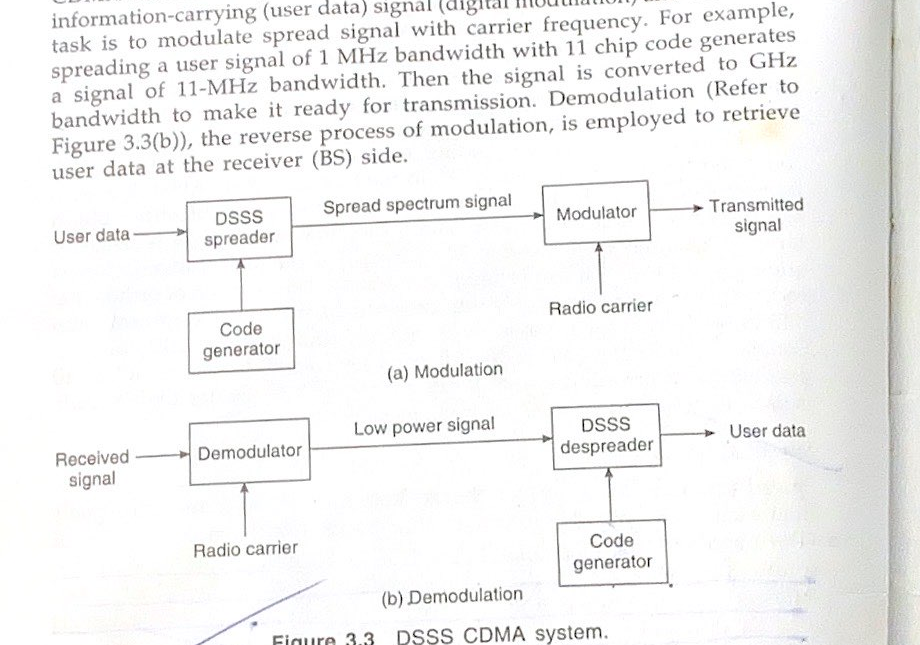

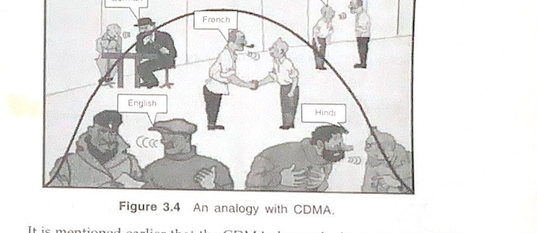

### 17.4 Fully Audited CDMA Mathematical Trace
Let binary `0` be mapped to $-1$ and binary `1` be mapped to $+1$.

#### Step 1: Code and Data Definitions
- **User A ($\text{MS}_a$):**
  - Data bits: $d_a = (1, 0) \implies (+1, -1)$.
  - Spreading code: $c_a = (0, 1, 0, 1) \implies (-1, +1, -1, +1)$.
- **User B ($\text{MS}_b$):**
  - Data bits: $d_b = (1, 1) \implies (+1, +1)$.
  - Spreading code: $c_b = (0, 1, 1, 0) \implies (-1, +1, +1, -1)$.

#### Step 2: Verification of Code Orthogonality
The inner product of code vectors $c_a$ and $c_b$ over one 4-chip period is:
$$c_a \cdot c_b = (-1)(-1) + (+1)(+1) + (-1)(+1) + (+1)(-1) = 1 + 1 - 1 - 1 = \mathbf{0}$$
The cross-correlation is zero; the codes are mathematically orthogonal.

#### Step 3: Baseband Chip Modulation (Spreading)
- $\text{Signal}_a = d_a \otimes c_a$:
  - Bit 1 ($+1$): $(+1) \times (-1, +1, -1, +1) = (-1, +1, -1, +1)$
  - Bit 2 ($-1$): $(-1) \times (-1, +1, -1, +1) = (+1, -1, +1, -1)$
  $$\mathbf{s}_a = (-1, +1, -1, +1, +1, -1, +1, -1)$$
- $\text{Signal}_b = d_b \otimes c_b$:
  - Bit 1 ($+1$): $(+1) \times (-1, +1, +1, -1) = (-1, +1, +1, -1)$
  - Bit 2 ($+1$): $(+1) \times (-1, +1, +1, -1) = (-1, +1, +1, -1)$
  $$\mathbf{s}_b = (-1, +1, +1, -1, -1, +1, +1, -1)$$

#### Step 4: Linear Channel Superposition at the Base Station
Assuming both signals arrive with equal power, the combined received signal vector is:
$$\mathbf{s}_{\text{rx}} = \mathbf{s}_a + \mathbf{s}_b$$
$$\mathbf{s}_{\text{rx}} = (-1-1, \; 1+1, \; -1+1, \; 1-1, \; 1-1, \; -1+1, \; 1+1, \; -1-1)$$
$$\mathbf{s}_{\text{rx}} = (-2, \; +2, \; 0, \; 0, \; 0, \; 0, \; +2, \; -2)$$

#### Step 5: Correlation Decoding at the Base Station
- **Extracting Data for User A ($\text{MS}_a$):**
  - Symbol 1 (first 4 chips):
    $$\mathbf{s}_{\text{rx}}[0:4] \cdot c_a = (-2)(-1) + (2)(1) + (0)(-1) + (0)(1) = 2 + 2 + 0 + 0 = \mathbf{+4} > 0 \implies \mathbf{Bit \; 1}$$
  - Symbol 2 (next 4 chips):
    $$\mathbf{s}_{\text{rx}}[4:8] \cdot c_a = (0)(-1) + (0)(1) + (2)(-1) + (-2)(1) = 0 + 0 - 2 - 2 = \mathbf{-4} < 0 \implies \mathbf{Bit \; 0}$$
  *Recovered User A Data:* $(1, 0)$ (Identical to transmitted $d_a$).
- **Extracting Data for User B ($\text{MS}_b$):**
  - Symbol 1 (first 4 chips):
    $$\mathbf{s}_{\text{rx}}[0:4] \cdot c_b = (-2)(-1) + (2)(1) + (0)(1) + (0)(-1) = 2 + 2 + 0 + 0 = \mathbf{+4} > 0 \implies \mathbf{Bit \; 1}$$
  - Symbol 2 (next 4 chips):
    $$\mathbf{s}_{\text{rx}}[4:8] \cdot c_b = (0)(-1) + (0)(1) + (2)(1) + (-2)(-1) = 0 + 0 + 2 + 2 = \mathbf{+4} > 0 \implies \mathbf{Bit \; 1}$$
  *Recovered User B Data:* $(1, 1)$ (Identical to transmitted $d_b$).

---

## 18. GSM Architecture, Subsystems, and Protocols

### 18.1 The Engineering Problem & Intuition
When digital cellular was standardized in the 1990s, Europe suffered from fragmented, incompatible analog standards (TACS in the UK, NMT in Scandinavia, C-Netz in Germany). A mobile phone purchased in London could not make calls in Paris. The Global System for Mobile Communications (GSM) was designed to establish a single, pan-European digital cellular standard providing seamless international roaming and integration with wireline ISDN networks.

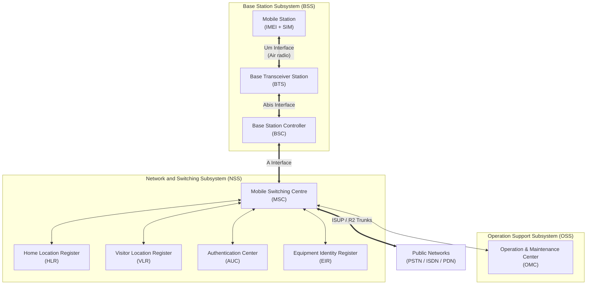
```mermaid
flowchart TD
    subgraph BSS["Base Station Subsystem (BSS)"]
        direction LR
        MS["Mobile Station<br/>(IMEI + SIM)"] <==>|"Um Interface<br/>(Air radio)"| BTS["Base Transceiver Station<br/>(BTS)"]
        BTS <==>|"Abis Interface"| BSC["Base Station Controller<br/>(BSC)"]
    end
    BSC <==>|"A Interface"| MSC
    subgraph NSS["Network and Switching Subsystem (NSS)"]
        direction TB
        MSC["Mobile Switching Centre<br/>(MSC)"] <--> HLR["Home Location Register<br/>(HLR)"]
        MSC <--> VLR["Visitor Location Register<br/>(VLR)"]
        MSC <--> AUC["Authentication Center<br/>(AUC)"]
        MSC <--> EIR["Equipment Identity Register<br/>(EIR)"]
    end
    subgraph OSS["Operation Support Subsystem (OSS)"]
        OMC["Operation & Maintenance Center<br/>(OMC)"]
    end
    MSC <--> OMC
    MSC <==>|"ISUP / R2 Trunks"| ExtNet["Public Networks<br/>(PSTN / ISDN / PDN)"]
```

### 18.2 Technical Mechanism & Architecture
A GSM network is organized into three interconnected subsystems:

#### 1. Base Station Subsystem (BSS)
Coordinates radio frequency transmission and radio resource allocation across the cell footprint:
- **Mobile Station (MS):** Comprises the hardware transceiver identified by its **IMEI (International Mobile Equipment Identity)** and subscriber credentials stored on the detachable **SIM (Subscriber Identity Module)** card.
  - *SIM Data:* Securely stores the **IMSI (International Mobile Subscriber Identity)**, personal PIN/PUK codes, subscriber authentication key ($K_i$), and encryption algorithms (A3/A8).
  - *MS States:* Operates in either **Idle Mode** (monitoring BCCH/PCH, using zero dedicated channels) or **Dedicated Mode** (active traffic/signaling channel assigned).
- **Base Transceiver Station (BTS):** Contains the physical radio transmitters, receivers, and antennas for a single cell. Performs RF modulation, demodulation, and signal level monitoring.
- **Base Station Controller (BSC):** Controls a cluster of BTS units. Manages radio channel assignment, frequency hopping, intra-BSS handovers, and computes the user's **Timing Advance ($T_A$)**.

#### 2. Network and Switching Subsystem (NSS)
Manages call switching, connection routing, and subscriber mobility:
- **Mobile Switching Centre (MSC):** The primary telephone switching exchange coordinating call setup, routing, and inter-system connections to the PSTN, ISDN, and public data networks.
- **Home Location Register (HLR):** Central database storing permanent subscriber profiles and current location pointers.
- **Visitor Location Register (VLR):** Dynamic local database associated with the MSC, caching temporary records for visiting mobile stations currently located within its service territory.
- **Authentication Center (AUC):** Protected database associated with the HLR. Generates cryptographic authentication triplets (RAND challenge, SRES response, and $K_c$ cipher key) using the secret $K_i$ key.
- **Equipment Identity Register (EIR):** Database maintaining equipment validity lists based on the handset's 15-digit IMEI:
  - *White List:* Certified, valid mobile devices.
  - *Gray List:* Devices under observation for technical malfunctions.
  - *Black List:* Stolen or unauthorized terminals blocked from network access.

#### 3. Operation Support Subsystem (OSS)
Monitors network performance, coordinates system configuration, handles traffic accounting, and maintains hardware via the Operation and Maintenance Center (OMC).

#### Open Standard GSM Interfaces
- **$U_m$ Interface (Air Interface):** Connects MS to BTS using TDMA/FDMA over the radio link.
- **$A_{\text{bis}}$ Interface:** Connects BTS to BSC over dedicated pulse-code modulation (PCM) digital links.
- **$A$ Interface:** Connects BSC to MSC, carrying signaling (SS7) and $64\text{ kbps}$ voice trunks.

### 18.3 Visual Anchor
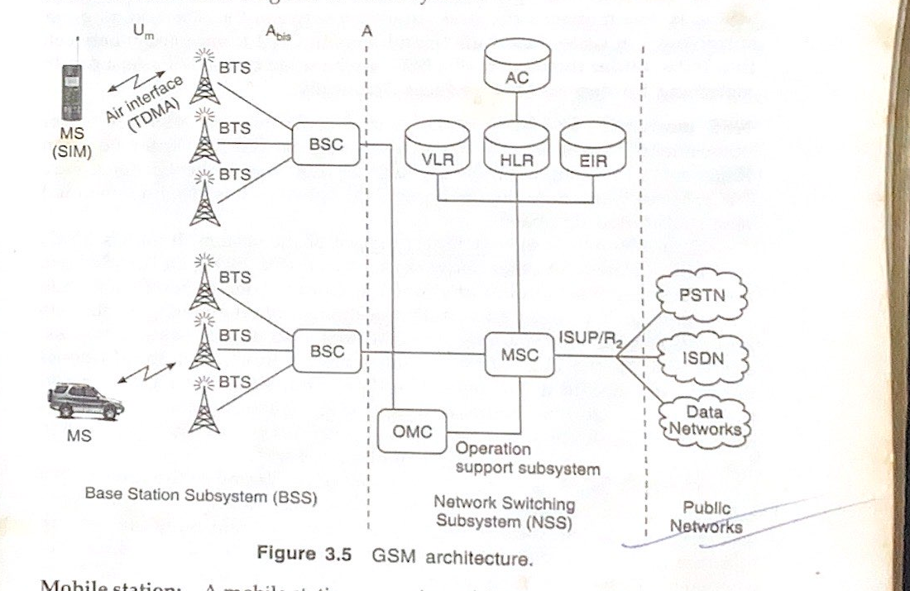

---

## Technical Summary of Core Formulas & Parameters

$$\begin{array}{lll}
\hline
\textbf{Parameter / Equation} & \textbf{Mathematical Formulation} & \textbf{Physical Meaning / Role} \\
\hline
\text{Frequency-Wavelength Relation} & f = \frac{v}{\lambda} = \frac{c}{\lambda} & \text{Inversely links carrier frequency to required physical antenna dimension} \\
\text{Signal-to-Noise Ratio (dB)} & \text{SNR}_{\text{dB}} = 10 \log_{10}\left(\frac{P_s}{P_n}\right) & \text{Measures received signal quality relative to background thermal noise} \\
\text{Cluster Sizing Formula} & N = i^2 + ij + j^2 & \text{Permissible cell cluster sizes tiling a 2D plane without seams } (i,j \ge 0) \\
\text{Frequency Reuse Ratio} & Q = \frac{D}{R} = \sqrt{3N} & \text{Separation factor between co-channel cells relative to cell radius } R \\
\text{Total System Capacity} & C = M \cdot K \cdot N = M \cdot S & \text{Maximum concurrent active calls across system replicated } M \text{ times} \\
\text{Signal-to-Interference Ratio} & \frac{S}{I} = \frac{Q^k}{6} = \frac{(\sqrt{3N})^k}{6} & \text{First-tier worst-case co-channel carrier-to-interference ratio with path loss } k \\
\text{Handoff Safety Margin} & P_{r\text{threshold}} = P_{r\text{minimum}} + \Delta & \text{Trigger boundary initiating handoff before call drops into unusable range} \\
\text{Traffic Intensity (Erlangs)} & A = \lambda \cdot h & \text{Total offered network load (call arrival rate } \lambda \times \text{ holding time } h\text{)} \\
\text{Erlang B Blocking Formula} & P_b = \frac{A^C / C!}{\sum_{k=0}^C A^k / k!} & \text{Grade of Service (GOS) probability of call blocking under LCC model} \\
\text{CDMA Spreading Factor} & \text{SF} = \frac{T_b}{T_c} = \frac{R_{\text{chip}}}{R_{\text{data}}} & \text{Processing gain expanding narrowband data into wideband spread spectrum} \\
\hline
\end{array}$$
