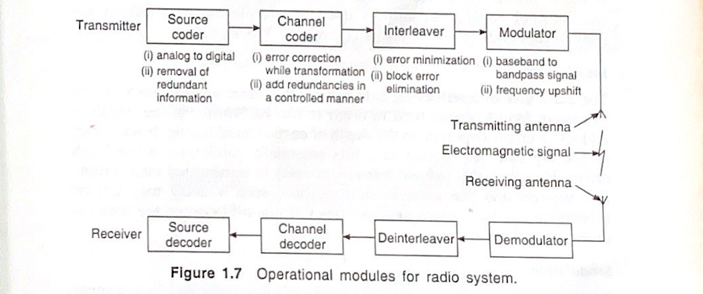
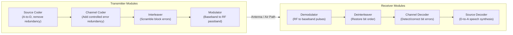
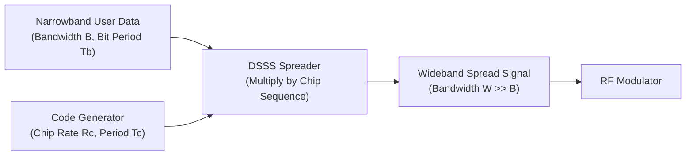

# Mobile and Pervasive Computing — Cellular Networks PYQ Master Solutions

> **Academic Context:** B.Tech CST / CS ($7^{\text{th}}$ Semester) Examination | **Subject:** Mobile and Pervasive Computing (`CS4123`) | **Institution:** IIEST Shibpur  
> **Source Mode:** **Strict Notes-Bound Mode** (Strictly grounded in authorized course reference notes: [`academics/mpc/Cellular_Networks_Guide.md`](file:///c:/PROJECTS/Learnmat/academics/mpc/Cellular_Networks_Guide.md) and [`academics/mpc/Mobile_Computing_SDB_Learning_Guide.md`](file:///c:/PROJECTS/Learnmat/academics/mpc/Mobile_Computing_SDB_Learning_Guide.md), derived from Prof. Sipra Das Bit, *Mobile Computing*, PHI Learning)  
> **Verification Status:** All mathematical formulations, geometric proofs, and numerical problems independently audited and verified via Python scratch engine; all figures programmatically generated at 300 DPI or embedded directly from authentic lecture source figures (zero ASCII / zero raw Mermaid).

---

## Contents

- [Multi-Year Frequency & Recurrence Matrix](#multi-year-frequency--recurrence-matrix)
- [Comprehensive Question Audit Matrix](#comprehensive-question-audit-matrix)
- [2025 Mid-Semester Examination Solutions](#2025-mid-semester-examination-solutions)
- [2025 End-Semester Examination Solutions](#2025-end-semester-examination-solutions)
- [2024 Mid-Semester Examination Solutions](#2024-mid-semester-examination-solutions)
- [2024 End-Semester Examination Solutions](#2024-end-semester-examination-solutions)
- [2023 Mid-Semester Examination Solutions](#2023-mid-semester-examination-solutions)
- [2023 End-Semester Examination Solutions](#2023-end-semester-examination-solutions)
- [Comprehensive Quick-Recall Formula & Parameter Cheat Sheet](#comprehensive-quick-recall-formula--parameter-cheat-sheet)
- [Uncovered Questions (Unanswered / Out-of-Notes Syllabus)](#uncovered-questions-unanswered--out-of-notes-syllabus)

---

## Multi-Year Frequency & Recurrence Matrix

Analysis of examination trends across 2023, 2024, and 2025 for topics covered in [`Cellular_Networks_Guide.md`](file:///c:/PROJECTS/Learnmat/academics/mpc/Cellular_Networks_Guide.md) and [`Mobile_Computing_SDB_Learning_Guide.md`](file:///c:/PROJECTS/Learnmat/academics/mpc/Mobile_Computing_SDB_Learning_Guide.md):

| Core Topic / Concept | Recurrence Rate | Exam Sessions Appeared | Typical Marks | Exam Hall Yield Level |
|:---|:---:|:---|:---:|:---:|
| **Cellular System Capacity Calculations** ($C = M \cdot S = M \cdot K \cdot N$) | ★★★★★ (100% in Midsems) | 2025 Mid (Q2c), 2023 Mid (Q3b) | 5M | **High-Yield Numerical Guaranteed** |
| **Mobile-to-Mobile Call Setup Flow** (RCC, FCC, FVC, RVC, Paging, MSC) | ★★★★★ (100% in Midsems) | 2025 Mid (Q2a), 2023 Mid (Q2a) | 5M | **High-Yield Algorithm / Flow Guaranteed** |
| **Cellular Voice vs. Control Channels** (FVC, RVC, FCC, RCC roles) | ★★★★☆ (80%) | 2025 Mid (Q2a), 2025 End (Q1c), 2023 Mid (Q2b) | 2M – 5M | **Guaranteed Core Question** |
| **Cluster Size** ($N$), **Capacity & Co-Channel Interference Trade-Off** | ★★★★☆ (80%) | 2025 Mid (Q2b), 2024 Mid (Q2a, Q2b) | 5M | **High Probability Derivation / Theory** |
| **Erlang Trunking Theory & Traffic Calculations** ($A = \lambda h$, GOS, Erlang B) | ★★★★☆ (80%) | 2025 End (Q2a), 2024 End (Q2c), 2023 End (Q2a, Q2b) | 5M | **High-Yield Numerical Guaranteed** |
| **CDMA Mathematics & Orthogonal Code Superposition** ($c_a \cdot c_b = 0$, DSSS) | ★★★★☆ (80%) | 2025 End (Q2b, Q2c, Q2d), 2024 End (Q2b, Q5a), 2023 Mid (Q1iii, Q1vii) | 5M – 10M | **High-Yield Derivation / Numerical** |
| **Channel Assignment Strategies & Borrowing Constraints** | ★★★★☆ (80%) | 2025 Mid (Q3a), 2024 End (Q1a), 2023 Mid (Q3a) | 2.5M – 5M | **High Probability Theory** |
| **Generational Handoff Mechanisms** (1G NCHO vs. 2G MAHO) | ★★★☆☆ (60%) | 2025 Mid (Q3b), 2024 Mid (Q3b) | 2.5M – 5M | **High Probability Comparative Table** |
| **GSM Architecture & Subsystems** (BSS, NSS, OSS, HLR, VLR, EIR, AUC) | ★★★★☆ (80%) | 2024 Mid (Q3d, Q3e), 2023 Mid (Q1ii, Q1x), 2023 End (Q1b) | 2M | **Guaranteed Short Definition / MCQ** |
| **Radio Pipeline & Modulation Foundations** (Coder, Interleaver, Modulator, PSK) | ★★★☆☆ (60%) | 2025 Mid (Q1a, Q1b, Q1c), 2024 Mid (Q1a), 2023 Mid (Q1i) | 2M – 4M | **Fundamental Theory** |

---

## Comprehensive Question Audit Matrix

| Exam Session | Q# | Concept / Question Statement | Marks | Tier | Status | Primary Course Reference |
|:---|:---:|:---|:---:|:---:|:---:|:---|
| **2025 Mid** | Q1(a) | Advantages of PSK over ASK and FSK | 2M | VSA | **Answered** | [SDB Guide §4.2](file:///c:/PROJECTS/Learnmat/academics/mpc/Mobile_Computing_SDB_Learning_Guide.md#42-technical-mechanism--architecture) |
| **2025 Mid** | Q1(b) | Reasons for performing modulation in cellular network | 2M | VSA | **Answered** | [SDB Guide §4.2](file:///c:/PROJECTS/Learnmat/academics/mpc/Mobile_Computing_SDB_Learning_Guide.md#42-technical-mechanism--architecture) |
| **2025 Mid** | Q1(c) | Block error definition and mitigation via interleaving | 2M | VSA | **Answered** | [SDB Guide §4.2](file:///c:/PROJECTS/Learnmat/academics/mpc/Mobile_Computing_SDB_Learning_Guide.md#42-technical-mechanism--architecture) |
| **2025 Mid** | Q1(d) | Enhancement of radio capacity in cellular network | 2M | VSA | **Answered** | [Cellular Guide §1.2](file:///c:/PROJECTS/Learnmat/academics/mpc/Cellular_Networks_Guide.md#12-the-breakthrough-low-power-distributed-cells) & [§6.1](file:///c:/PROJECTS/Learnmat/academics/mpc/Cellular_Networks_Guide.md#61-capacity-formulation--formulas) |
| **2025 Mid** | Q1(e) | Frequency range of GSM in downlink | 2M | VSA | **Answered** | [SDB Guide §1.2, §3.2, §18.2](file:///c:/PROJECTS/Learnmat/academics/mpc/Mobile_Computing_SDB_Learning_Guide.md#12-technical-mechanism--architecture) |
| **2025 Mid** | Q2(a) | Operational steps for establishing call between two MSs | 5M | SA | **Answered** | [Cellular Guide §3.2, §3.3](file:///c:/PROJECTS/Learnmat/academics/mpc/Cellular_Networks_Guide.md#3-call-procedures-origination-paging--in-call-management) |
| **2025 Mid** | Q2(b) | Impact of cluster size on capacity and interference | 5M | SA | **Answered** | [Cellular Guide §6.2, §7.1](file:///c:/PROJECTS/Learnmat/academics/mpc/Cellular_Networks_Guide.md#62-impact-of-cluster-size-n-on-capacity-vs-interference) |
| **2025 Mid** | Q2(c) | Numerical: Capacity for $2310\,\text{km}^2$, $6\,\text{km}^2$ cell, 1596 channels, $N=7$ | 5M | SA | **Answered** | [Cellular Guide §6.1](file:///c:/PROJECTS/Learnmat/academics/mpc/Cellular_Networks_Guide.md#61-capacity-formulation--formulas) |
| **2025 Mid** | Q3(a) | Channel borrowing definition and implementation constraints | 2.5M | SA | **Answered** | [SDB Guide §10.2](file:///c:/PROJECTS/Learnmat/academics/mpc/Mobile_Computing_SDB_Learning_Guide.md#102-technical-mechanism--architecture) |
| **2025 Mid** | Q3(b) | Handoff definition & comparison of 1G vs 2G mechanisms | 2.5M | SA | **Answered** | [Cellular Guide §8.1, §9.2, §9.3](file:///c:/PROJECTS/Learnmat/academics/mpc/Cellular_Networks_Guide.md#8-handoff-strategies--signal-threshold-margins) |
| **2025 End** | Q1(c) | Paging channel definition and usage | 2M | VSA | **Answered** | [Cellular Guide §2.2, §3.3](file:///c:/PROJECTS/Learnmat/academics/mpc/Cellular_Networks_Guide.md#22-channel-classification-voice-vs-control-channels) |
| **2025 End** | Q2(a) | Erlang definition and user capacity numerical ($C=20$, $0.5\%$ blocking, $A=11.10$) | 5M | SA | **Answered** | [SDB Guide §13.2, §13.3](file:///c:/PROJECTS/Learnmat/academics/mpc/Mobile_Computing_SDB_Learning_Guide.md#132-technical-mechanism--architecture) |
| **2025 End** | Q2(b) | Orthogonality verification of codes $(0,1,0,1)$ and $(0,1,1,0)$ | 5M | SA | **Answered** | [SDB Guide §17.2, §17.4](file:///c:/PROJECTS/Learnmat/academics/mpc/Mobile_Computing_SDB_Learning_Guide.md#172-technical-mechanism--architecture) |
| **2025 End** | Q2(c) | CDMA DSSS received signal derivation for MS-A and MS-B | 5M | SA | **Answered** | [SDB Guide §17.4](file:///c:/PROJECTS/Learnmat/academics/mpc/Mobile_Computing_SDB_Learning_Guide.md#174-fully-audited-cdma-mathematical-trace) |
| **2025 End** | Q2(d) | Demerits of CDMA | 5M | SA | **Answered** | [SDB Guide §16.4, §17.2](file:///c:/PROJECTS/Learnmat/academics/mpc/Mobile_Computing_SDB_Learning_Guide.md#164-architectural-trade-offs-matrix) |
| **2024 Mid** | Q1(a) | Radio system transmitter/receiver block diagram & module tasks | 4M | SA | **Answered** | [SDB Guide §4.2, §4.3](file:///c:/PROJECTS/Learnmat/academics/mpc/Mobile_Computing_SDB_Learning_Guide.md#42-technical-mechanism--architecture) |
| **2024 Mid** | Q1(b) | Justify hexagonal cell shape in cellular design | 3M | SA | **Answered** | [Cellular Guide §4.1, §4.2, §4.3](file:///c:/PROJECTS/Learnmat/academics/mpc/Cellular_Networks_Guide.md#4-cell-geometry-why-hexagonal-footprints) |
| **2024 Mid** | Q1(c) | Location tracking definition and two implementation techniques | 3M | SA | **Answered** | [Cellular Guide §9.2, §12.4](file:///c:/PROJECTS/Learnmat/academics/mpc/Cellular_Networks_Guide.md#92-1st-generation-1g-handoff-network-controlled) |
| **2024 Mid** | Q2(a) | Frequency reuse ratio definition and derivation of $S/I$ relation | 5M | SA | **Answered** | [Cellular Guide §7.1, §7.2](file:///c:/PROJECTS/Learnmat/academics/mpc/Cellular_Networks_Guide.md#7-co-channel-interference--co-channel-reuse-ratio-q) |
| **2024 Mid** | Q2(b) | Numerical: Pattern size $N$ for $S/I \ge 15\text{ dB}$, path loss $k=3$ | 5M | SA | **Answered** | [Cellular Guide §5.3, §7.1](file:///c:/PROJECTS/Learnmat/academics/mpc/Cellular_Networks_Guide.md#53-cluster-size-formula-n) |
| **2024 Mid** | Q3(a) | Near-far effect definition and usage | 2M | VSA | **Answered** | [SDB Guide §9.2, §16.4](file:///c:/PROJECTS/Learnmat/academics/mpc/Mobile_Computing_SDB_Learning_Guide.md#92-technical-mechanism--architecture) |
| **2024 Mid** | Q3(b) | Umbrella cell approach definition and usage | 2M | VSA | **Answered** | [Cellular Guide §11.1](file:///c:/PROJECTS/Learnmat/academics/mpc/Cellular_Networks_Guide.md#111-problem-1-accommodating-wide-velocity-diversity) |
| **2024 Mid** | Q3(c) | Grade of Service (GOS) definition and usage | 2M | VSA | **Answered** | [SDB Guide §13.2](file:///c:/PROJECTS/Learnmat/academics/mpc/Mobile_Computing_SDB_Learning_Guide.md#132-technical-mechanism--architecture) |
| **2024 Mid** | Q3(d) | HLR definition and usage | 2M | VSA | **Answered** | [Cellular Guide §12.4](file:///c:/PROJECTS/Learnmat/academics/mpc/Cellular_Networks_Guide.md#124-the-three-interconnected-gsm-subsystems) |
| **2024 Mid** | Q3(e) | VLR definition and usage | 2M | VSA | **Answered** | [Cellular Guide §12.4](file:///c:/PROJECTS/Learnmat/academics/mpc/Cellular_Networks_Guide.md#124-the-three-interconnected-gsm-subsystems) |
| **2024 End** | Q1(a) | Channel borrowing definition and usage | 2M | VSA | **Answered** | [SDB Guide §10.2](file:///c:/PROJECTS/Learnmat/academics/mpc/Mobile_Computing_SDB_Learning_Guide.md#102-technical-mechanism--architecture) |
| **2024 End** | Q2(b) | Orthogonality verification of 11-chip code sequence | 5M | SA | **Answered** | [SDB Guide §17.2, §17.4](file:///c:/PROJECTS/Learnmat/academics/mpc/Mobile_Computing_SDB_Learning_Guide.md#172-technical-mechanism--architecture) |
| **2024 End** | Q2(c) | Numerical: Users supported for $C=20$, $\lambda=3\,\text{calls/hr}$, $h=2\,\text{min}$, $1\%$ blocking ($A=12.03$) | 5M | SA | **Answered** | [SDB Guide §13.3](file:///c:/PROJECTS/Learnmat/academics/mpc/Mobile_Computing_SDB_Learning_Guide.md#133-verified-calculations) |
| **2024 End** | Q5(a) | Short note on Spread Spectrum (DSSS, codes, processing gain) | 10M | LA | **Answered** | [SDB Guide §17.1, §17.2](file:///c:/PROJECTS/Learnmat/academics/mpc/Mobile_Computing_SDB_Learning_Guide.md#17-spread-spectrum-engineering--cdma-mathematics) |
| **2023 Mid** | Q1(i) | MCQ: Receiver processes in mobile communication | 1M | MCQ | **Answered** | [SDB Guide §4.2](file:///c:/PROJECTS/Learnmat/academics/mpc/Mobile_Computing_SDB_Learning_Guide.md#42-technical-mechanism--architecture) |
| **2023 Mid** | Q1(ii) | MCQ: Device/register storing data related to user | 1M | MCQ | **Answered** | [Cellular Guide §12.3, §12.4](file:///c:/PROJECTS/Learnmat/academics/mpc/Cellular_Networks_Guide.md#123-gsm-services--features) |
| **2023 Mid** | Q1(iii) | MCQ: Multiplexing enabling simultaneous full-bandwidth usage | 1M | MCQ | **Answered** | [SDB Guide §16.2, §17.1](file:///c:/PROJECTS/Learnmat/academics/mpc/Mobile_Computing_SDB_Learning_Guide.md#162-technical-mechanism--architecture) |
| **2023 Mid** | Q1(iv) | MCQ: Incorrect statement about TDMA | 1M | MCQ | **Answered** | [Cellular Guide §9.3, §13.1](file:///c:/PROJECTS/Learnmat/academics/mpc/Cellular_Networks_Guide.md#93-2nd-generation-2g-handoff-mobile-assisted-maho) |
| **2023 Mid** | Q1(v) | MCQ: How radio capacity is enhanced in cellular network | 1M | MCQ | **Answered** | [Cellular Guide §1.1, §1.2](file:///c:/PROJECTS/Learnmat/academics/mpc/Cellular_Networks_Guide.md#11-the-spectral-bottleneck) |
| **2023 Mid** | Q1(vi) | MCQ: Directional antennas to increase cell capacity | 1M | MCQ | **Answered** | [SDB Guide §14.2](file:///c:/PROJECTS/Learnmat/academics/mpc/Mobile_Computing_SDB_Learning_Guide.md#142-technical-mechanism--architecture) |
| **2023 Mid** | Q1(vii) | MCQ: Power adjustment in CDMA mitigates which problem | 1M | MCQ | **Answered** | [SDB Guide §16.4, §17.2](file:///c:/PROJECTS/Learnmat/academics/mpc/Mobile_Computing_SDB_Learning_Guide.md#164-architectural-trade-offs-matrix) |
| **2023 Mid** | Q1(viii) | MCQ: Primary GSM uplink frequency range | 1M | MCQ | **Answered** | [SDB Guide §1.2, §18.2](file:///c:/PROJECTS/Learnmat/academics/mpc/Mobile_Computing_SDB_Learning_Guide.md#12-technical-mechanism--architecture) |
| **2023 Mid** | Q1(ix) | MCQ: What needs to be estimated for RF channel allocation for GOS | 1M | MCQ | **Answered** | [SDB Guide §13.2](file:///c:/PROJECTS/Learnmat/academics/mpc/Mobile_Computing_SDB_Learning_Guide.md#132-technical-mechanism--architecture) |
| **2023 Mid** | Q1(x) | MCQ: Visitor Location Register integration entity | 1M | MCQ | **Answered** | [Cellular Guide §12.4](file:///c:/PROJECTS/Learnmat/academics/mpc/Cellular_Networks_Guide.md#124-the-three-interconnected-gsm-subsystems) |
| **2023 Mid** | Q2(a) | Operational steps for setting call from mobile to mobile | 5M | SA | **Answered** | [Cellular Guide §3.2, §3.3](file:///c:/PROJECTS/Learnmat/academics/mpc/Cellular_Networks_Guide.md#3-call-procedures-origination-paging--in-call-management) |
| **2023 Mid** | Q2(b) | Roles played by FVC, RVC, FCC, and RCC channels | 5M | SA | **Answered** | [Cellular Guide §2.2](file:///c:/PROJECTS/Learnmat/academics/mpc/Cellular_Networks_Guide.md#22-channel-classification-voice-vs-control-channels) |
| **2023 Mid** | Q3(a) | Different channel-assignment strategies in 2G cellular network | 5M | SA | **Answered** | [SDB Guide §10.2](file:///c:/PROJECTS/Learnmat/academics/mpc/Mobile_Computing_SDB_Learning_Guide.md#102-technical-mechanism--architecture) |
| **2023 Mid** | Q3(b) | Numerical: $40\,\text{MHz}$ band, $2\times 20\,\text{kHz}$ duplex, $N=12$, capacity for $2310\,\text{km}^2$ | 5M | SA | **Answered** | [Cellular Guide §6.1](file:///c:/PROJECTS/Learnmat/academics/mpc/Cellular_Networks_Guide.md#61-capacity-formulation--formulas) |
| **2023 End** | Q1(b) | HLR definition and usage | 2M | VSA | **Answered** | [Cellular Guide §12.4](file:///c:/PROJECTS/Learnmat/academics/mpc/Cellular_Networks_Guide.md#124-the-three-interconnected-gsm-subsystems) |
| **2023 End** | Q2(a) | GOS definition and assumptions for blocked-calls-cleared system | 5M | SA | **Answered** | [SDB Guide §13.2](file:///c:/PROJECTS/Learnmat/academics/mpc/Mobile_Computing_SDB_Learning_Guide.md#132-technical-mechanism--architecture) |
| **2023 End** | Q2(b) | Erlang definition and user capacity numerical ($C=20$, $0.5\%$ blocking, $A=11.10$) | 5M | SA | **Answered** | [SDB Guide §13.2, §13.3](file:///c:/PROJECTS/Learnmat/academics/mpc/Mobile_Computing_SDB_Learning_Guide.md#132-technical-mechanism--architecture) |
| **Remaining**| Various | UMTS UTRAN, 5G Core, MIMO, Network Slicing, Mobile-IP, WLAN CSMA/CA | 2M–20M | — | **Unanswered** | *Out-of-notes topics retained in final section* |

---

## 2025 Mid-Semester Examination Solutions

### Question 1(a): Advantages of PSK over ASK and FSK
> **Exam Meta:** Marks: **[2M]** | Tier: **Tier 1 (VSA)**  
> **Reference Section in Guide:** [📘 Section 4.2: Technical Mechanism & Architecture](file:///c:/PROJECTS/Learnmat/academics/mpc/Mobile_Computing_SDB_Learning_Guide.md#42-technical-mechanism--architecture)

**1. Question Statement:**
*Write two advantages of PSK over ASK and FSK.*

**2. Direct Answer in Simple English:**
1. **Superior Immunity to Amplitude Noise & Multipath Fading (over ASK):** Amplitude Shift Keying (ASK) conveys data by altering the signal amplitude, making it highly vulnerable to radio channel noise, attenuation, and multipath fading. In Phase Shift Keying (PSK), carrier amplitude remains strictly constant; data is encoded into phase shifts ($180^\circ$ phase inversion in BPSK), which receiver phase-locked loops detect reliably even under severe signal attenuation.
2. **Higher Spectral Efficiency & Noise Resilience (over FSK):** Frequency Shift Keying (FSK) requires two distinct carrier frequencies to represent binary `0` and `1`, demanding twice the transmission bandwidth. PSK operates over a single carrier frequency, conserving precious radio bandwidth while providing a higher Signal-to-Noise Ratio (SNR) margin for an equivalent bit error rate (BER).

---

### Question 1(b): Reasons for Performing Modulation in Cellular Networks
> **Exam Meta:** Marks: **[2M]** | Tier: **Tier 1 (VSA)**  
> **Reference Section in Guide:** [📘 Section 4.2: Technical Mechanism & Architecture](file:///c:/PROJECTS/Learnmat/academics/mpc/Mobile_Computing_SDB_Learning_Guide.md#42-technical-mechanism--architecture)

**1. Question Statement:**
*Identify two reasons for performing modulation in cellular network.*

**2. Direct Answer in Simple English:**
1. **Antenna Dimension Feasibility (Physical Practicality):** Efficient electromagnetic radiation requires an antenna height proportional to the signal's wavelength ($h \approx \lambda / 4$). For an unmodulated baseband signal at $1\,\text{MHz}$, $\lambda = c/f = 300\,\text{m}$, requiring an antenna over $75\,\text{meters}$ tall. Modulation shifts the baseband signal up to UHF carrier frequencies ($900\,\text{MHz}$ in GSM), shrinking wavelength to $\lambda \approx 33.3\,\text{cm}$, which allows compact, handheld antennas of only $\approx 8.3\,\text{cm}$.
2. **Frequency Translation to Passband & Channel Multiplexing:** The wireless medium is an analog bandpass channel that cannot directly propagate digital baseband pulses without extreme distortion and rapid attenuation. Modulation translates baseband information into dedicated radio frequency passbands, enabling Frequency Division Multiplexing (FDD/FDMA) so hundreds of non-overlapping channels can share the air simultaneously without mutual interference.

---

### Question 1(c): Block Error Definition and Mitigation via Interleaving
> **Exam Meta:** Marks: **[2M]** | Tier: **Tier 1 (VSA)**  
> **Reference Section in Guide:** [📘 Section 4.2: Technical Mechanism & Architecture](file:///c:/PROJECTS/Learnmat/academics/mpc/Mobile_Computing_SDB_Learning_Guide.md#42-technical-mechanism--architecture)

**1. Question Statement:**
*What is block error and how can it be mitigated?*

**2. Direct Answer in Simple English:**
- **Block Error:** When a mobile device travels through an urban multipath null (a deep fade), the received signal drops below the receiver threshold for a sustained period. This corrupts a continuous sequence or "block" of consecutive data bits. Standard forward error-correcting channel codes (parity checks, convolutional codes) can easily fix isolated single-bit errors, but fail completely when an entire contiguous block is corrupted.
- **Mitigation via Interleaving:** Block errors are mitigated by an **Interleaver** inserted between the channel coder and the modulator. The interleaver scrambles the sequential order of coded bits across multiple transmission time frames. At the receiver, the **deinterleaver** reconstructs the original sequence, dispersing the contiguous block of errors into isolated, single-bit errors spread out over time, which the channel decoder corrects easily (at the cost of a small, bounded transmission delay).

---

### Question 1(d): Radio Capacity Enhancement
> **Exam Meta:** Marks: **[2M]** | Tier: **Tier 1 (VSA)**  
> **Reference Section in Guide:** [📘 Section 1.2: The Breakthrough: Low-Power Distributed Cells](file:///c:/PROJECTS/Learnmat/academics/mpc/Cellular_Networks_Guide.md#12-the-breakthrough-low-power-distributed-cells) and [📘 Section 6.1: Capacity Formulation & Formulas](file:///c:/PROJECTS/Learnmat/academics/mpc/Cellular_Networks_Guide.md#61-capacity-formulation--formulas)

**1. Question Statement:**
*How is the capacity of the radio enhanced in cellular network?*

**2. Direct Answer in Simple English:**
Radio capacity in a cellular network is enhanced by:
1. **Using Many Small, Low-Power Base Stations (Small Cells):** Instead of using one giant, high-power radio tower to cover an entire city, the area is split into many small hexagonal cells, each powered by a low-power base station.
2. **Frequency Reuse:** The same group of radio frequencies is reused in multiple cells across the city, as long as the cells are far enough apart that their radio signals do not interfere with each other.

**3. The Fundamental Capacity Formula:**
Total network capacity $C$ across the whole coverage area is:

$$
C = M \cdot S = M \cdot K \cdot N
$$

Where:
- $S$: Total number of radio channels given to the cellular system.
- $N$: Cluster size (number of cells in a group sharing the total channels $S$ without reuse).
- $K = S / N$: Number of channels allocated to each individual cell.
- $M$: **Cluster replication factor** (how many times the cluster repeats across the entire city).

**Key Takeaway:** By making cell radius $R$ smaller and adding more towers, the cluster repeats more times ($M$ increases), which dramatically multiplies total network capacity ($C$) without needing extra radio spectrum from the government.

---

### Question 1(e): GSM Downlink Frequency Range
> **Exam Meta:** Marks: **[2M]** | Tier: **Tier 1 (VSA)**  
> **Reference Section in Guide:** [📘 Section 1.2 & §18.2](file:///c:/PROJECTS/Learnmat/academics/mpc/Mobile_Computing_SDB_Learning_Guide.md#12-technical-mechanism--architecture)

**1. Question Statement:**
*What is the range of frequency GSM uses in downlink?*

**2. Direct Answer:**
Primary GSM (GSM 900) operates in the **935–960 MHz** frequency range for the **downlink (Forward Voice/Control Channel, Base Station to Mobile Station)**.

**3. Key Technical Specifications:**
- **Total Downlink Bandwidth:** $25\,\text{MHz}$ ($935\text{ to } 960\,\text{MHz}$).
- **Uplink (Reverse Link) Band:** Paired with $890\text{--}915\,\text{MHz}$ ($25\,\text{MHz}$).
- **Duplex Spacing:** A constant Frequency Division Duplexing (FDD) split of **45 MHz** separates uplink and downlink channels.
- **Channelization:** The $25\,\text{MHz}$ band is divided into 124 carrier channels, each having a bandwidth of $200\,\text{kHz}$.

---

### Question 2(a): Call Establishment Between Two Mobile Stations
> **Exam Meta:** Marks: **[5M]** | Tier: **Tier 2 (SA)**  
> **Reference Section in Guide:** [📘 Section 3.2: Mobile-Initiated Call Setup Procedure](file:///c:/PROJECTS/Learnmat/academics/mpc/Cellular_Networks_Guide.md#32-mobile-initiated-call-setup-procedure), [📘 Section 3.3: Landline-Initiated Call (Paging Procedure)](file:///c:/PROJECTS/Learnmat/academics/mpc/Cellular_Networks_Guide.md#33-landline-initiated-call-paging-procedure), and [📘 Section 2.2: Channel Classification](file:///c:/PROJECTS/Learnmat/academics/mpc/Cellular_Networks_Guide.md#22-channel-classification-voice-vs-control-channels)

**1. Question Statement:**
*Write steps of operation for establishing a call between two mobile stations.*

**2. Executive Summary:**
Connecting a call between two mobile phones (Caller MS-A and Receiver MS-B) involves four main network components:
- **Calling Mobile (MS-A)**
- **Serving Base Station 1 (BS-1)**
- **Mobile Switching Centre (MSC)** — The central brain of the network
- **Serving Base Station 2 (BS-2)**
- **Called Mobile (MS-B)**

The process moves through three clear phases: **Uplink Request → Downlink Paging → Dedicated Voice Channels**.

**3. Programmatic Architecture Diagram:**

**4. Step-by-Step Operational Procedure (Easy to Memorize):**

1. **Call Origination Request (MS-A → BS-1):**  
   The user enters the phone number on MS-A and presses "Call". MS-A sends a call request packet over the **Reverse Control Channel (RCC)** containing its identity (MIN/ESN) and the dialed number.
2. **Relay to Central Switch (BS-1 → MSC):**  
   Base Station 1 receives the signal and sends the request to the MSC over the wired high-speed backhaul connection.
3. **Verification & Location Lookup (MSC):**  
   The MSC verifies if MS-A has an active balance/subscription. Then, the MSC checks its **HLR and VLR databases** to find the current location area of Receiver MS-B.
4. **Paging Command (MSC → BS-2):**  
   The MSC sends a command to Base Station 2 (the tower covering the area where MS-B is currently located) to alert MS-B.
5. **Paging Broadcast (BS-2 → MS-B):**  
   Base Station 2 broadcasts a "Page" message containing MS-B's phone number (MIN) over its **Forward Control Channel (FCC)**.
6. **Paging Acknowledgment (MS-B → BS-2):**  
   MS-B's phone, which continuously listens to the FCC, recognizes its own number and immediately replies with an Acknowledgment (ACK) over the **Reverse Control Channel (RCC)**.
7. **ACK Forwarded (BS-2 → MSC):**  
   Base Station 2 informs the MSC that MS-B is reachable, online, and ready to receive the call.
8. **Voice Channels Assigned (MSC):**  
   The MSC selects two free voice channel pairs:
   - Pair 1 ($\text{FVC}_1 / \text{RVC}_1$) for MS-A at Tower 1.
   - Pair 2 ($\text{FVC}_2 / \text{RVC}_2$) for MS-B at Tower 2.
9. **Handsets Instructed to Tune & Ring:**  
   - BS-1 orders MS-A over the control channel to tune to Voice Channel 1.
   - BS-2 orders MS-B over the control channel to tune to Voice Channel 2, and transmits a ring command so MS-B's phone starts ringing.
10. **Conversation Begins:**  
    The user on MS-B answers the phone. Both phones use their assigned voice channels, and the MSC bridges the audio connection.

**5. Examiner Viva Question:**  
- **Question:** *Why does the network page over control channels (FCC) instead of paging directly on voice channels?*  
- **Answer:** *Voice channels are scarce and expensive; they should only be used when people are actually speaking. Control channels are shared broadcast channels that let thousands of idle phones stay on standby without wasting dedicated voice channels.*

---

### Question 2(b): Impact of Cluster Size on Capacity and Interference
> **Exam Meta:** Marks: **[5M]** | Tier: **Tier 2 (SA)**  
> **Reference Section in Guide:** [📘 Section 6.2: Impact of Cluster Size (N) on Capacity vs. Interference](file:///c:/PROJECTS/Learnmat/academics/mpc/Cellular_Networks_Guide.md#62-impact-of-cluster-size-n-on-capacity-vs-interference) and [📘 Section 7.1: The Co-Channel Reuse Ratio Formula (Q)](file:///c:/PROJECTS/Learnmat/academics/mpc/Cellular_Networks_Guide.md#71-the-co-channel-reuse-ratio-formula-q)

**1. Question Statement:**
*What is the impact of cluster size on capacity and interference in cellular mobile network?*

**2. Direct Explanation (The Core Trade-off):**
In cellular network design, **Cluster Size** ($N$) is the fundamental balancing knob between capacity and voice quality:
- **Small Cluster Size** ($N$): Gives **maximum network capacity**, but results in **higher interference**.
- **Large Cluster Size** ($N$): Gives **clean voice quality with almost zero interference**, but results in **lower network capacity**.

**3. The 3 Governing Mathematical Formulas:**

1. **Channels per Cell:**

$$
K = \frac{S}{N}
$$

   *(Smaller $N$ means more radio channels $K$ for every single tower).*

2. **Co-Channel Distance Ratio** ($Q$):

$$
Q = \frac{D}{R} = \sqrt{3N}
$$

   Where $D$ is the distance between towers using the same frequency, and $R$ is cell radius.

3. **Signal-to-Interference Ratio** ($S/I$):

$$
\frac{S}{I} \approx \frac{1}{6} \left(\frac{D}{R}\right)^k = \frac{1}{6} (\sqrt{3N})^k
$$

   Where $6$ is the number of co-channel interferers in the first ring around a cell, and $k \approx 3\text{--}4$ is the path loss exponent.

**4. Side-by-Side Comparison Table:**

| Feature | Small Cluster (e.g., $N = 4$ or $N = 7$) | Large Cluster (e.g., $N = 12$) |
|:---|:---|:---|
| **Channels per Cell** ($K = S/N$) | **High** (More channels per tower) | **Low** (Fewer channels per tower) |
| **Cluster Repeats in City** ($M$) | **Many times** (Clusters are compact) | **Fewer times** (Each cluster is spread out) |
| **Total City Capacity** ($C = M \cdot S$) | **Very High** (Can handle huge crowds) | **Low** (Bottleneck during busy hours) |
| **Distance Between Co-Channel Towers** ($D$) | **Short** (Towers with same frequency are close) | **Large** (Towers with same frequency are far apart) |
| **Co-Channel Interference** | **Higher** (Nearby towers can cause static) | **Very Low** (Signals from other towers fade away) |
| **Call Audio Quality** | Good enough if above threshold | Crystal clear |

**5. Engineering Decision Rule:**
An engineer always selects the smallest possible cluster size $N$ that still satisfies the minimum required audio quality (for example, $S/I \ge 18\,\text{dB}$ for analog networks or $S/I \ge 15\,\text{dB}$ for GSM).

---

### Question 2(c): System Capacity Numerical ($2310\,\text{km}^2$, $6\,\text{km}^2$ Cell, $S=1596$, $N=7$)
> **Exam Meta:** Marks: **[5M]** | Tier: **Tier 2 (SA)** — Numerical  
> **Reference Section in Guide:** [📘 Section 6.1: Capacity Formulation & Formulas](file:///c:/PROJECTS/Learnmat/academics/mpc/Cellular_Networks_Guide.md#61-capacity-formulation--formulas)

**1. Question Statement:**
*Consider a cellular system covers $2310\,\text{km}^2$ and each cell area is $6\,\text{km}^2$. The total allocated channels in the system are 1596. Calculate the system capacity for cluster size 7.*

**2. Direct Answer First:**
The total system capacity is **87,780 simultaneous calls (channels)**.

**3. Given Parameters:**
- Total service area: $A_{\text{total}} = 2310\,\text{km}^2$
- Area of each cell: $A_{\text{cell}} = 6\,\text{km}^2$
- Total allocated channels: $S = 1596\,\text{channels}$
- Cluster size: $N = 7$

**4. Step-by-Step Calculation:**

- **Step 1: Find Total Number of Cells** ($N_{\text{cells}}$) **in the System:**

$$
N_{\text{cells}} = \frac{A_{\text{total}}}{A_{\text{cell}}} = \frac{2310}{6} = \mathbf{385\,\text{cells}}
$$

- **Step 2: Find How Many Times the Cluster Repeats** ($M$):  
  Since each cluster contains $N = 7$ cells:

$$
M = \frac{N_{\text{cells}}}{N} = \frac{385}{7} = \mathbf{55\,\text{clusters}}
$$

- **Step 3: Find Channels Allocated to Each Cell** ($K$):

$$
K = \frac{S}{N} = \frac{1596}{7} = \mathbf{228\,\text{channels per cell}}
$$

- **Step 4: Compute Total System Capacity** ($C$):  
  Using the capacity formula:

$$
C = M \cdot S = 55 \times 1596 = \mathbf{87,780\,\text{channels}}
$$

  *Double Check:*

$$
C = N_{\text{cells}} \times K = 385 \times 228 = \mathbf{87,780\,\text{channels}}
$$

**5. ⚠️ Exam Hall Fatal Trap:**
> ⚠️ **Do Not Make This Mistake:** Many students divide $1596 / 385 \approx 4.14$ and conclude that capacity is 1596. This ignores **frequency reuse**! The 1596 channels are reused across 55 independent clusters, so the total capacity is $55 \times 1596 = 87,780$.

---

### Question 3(a): Channel Borrowing and Constraints
> **Exam Meta:** Marks: **[2.5M]** | Tier: **Tier 2 (SA)**  
> **Reference Section in Guide:** [📘 Section 10.2: Technical Mechanism & Architecture](file:///c:/PROJECTS/Learnmat/academics/mpc/Mobile_Computing_SDB_Learning_Guide.md#102-technical-mechanism--architecture)

**1. Question Statement:**
*What is channel borrowing? What are the constraints to implement channel borrowing?*

**2. Direct Definition:**
**Channel Borrowing** is a dynamic variation of Fixed Channel Assignment (FCA) where a congested cell that has exhausted all of its pre-allocated nominal voice channels is allowed to temporarily borrow an idle, unused channel from an adjacent neighboring cell under Mobile Switching Centre (MSC) supervision to service an incoming call or handoff request.

**3. Three Essential Constraints to Implement Channel Borrowing:**
1. **Lender Cell Availability:** The donor (lending) cell must currently have at least one free, unused channel that is not carrying any active traffic.
2. **Co-Channel Free Status:** The specific channel being borrowed must **not currently be in use by any of the co-channel cells of the donor cell**. If a co-channel cell was using it, borrowing would trigger catastrophic co-channel interference.
3. **Channel Locking:** Once a channel is borrowed, that channel must be **locked in the donor cell and in all its co-channel cells** for the duration of the call. This locking prevents any co-channel cell from simultaneously assigning that frequency, preserving the minimum co-channel reuse distance ($D$).

---

### Question 3(b): Handoff Definition & 1G vs. 2G Comparison
> **Exam Meta:** Marks: **[2.5M]** | Tier: **Tier 1 / Tier 2 (SA)**  
> **Reference Section in Guide:** [📘 Section 8.1: Definition & Requirements](file:///c:/PROJECTS/Learnmat/academics/mpc/Cellular_Networks_Guide.md#81-definition--requirements) and [📘 Section 9: Signal Monitoring & Generational Handoff Evolution (1G vs. 2G MAHO)](file:///c:/PROJECTS/Learnmat/academics/mpc/Cellular_Networks_Guide.md#9-signal-monitoring--generational-handoff-evolution-1g-vs-2g-maho)

**1. Question Statement:**
*What is hand off? Compare between 1st generation and 2nd generation handoff mechanisms.*

**2. Direct Definition of Handoff:**
**Handoff** (also called handover) is the automatic process of transferring an active call or data session from one cell tower (or radio channel) to another as the user moves across cell boundaries, without dropping the call.

**3. Programmatic Evolution Architecture:**

**4. 1G vs. 2G Handoff Comparison Table:**

| Comparison Parameter | 1st Generation (1G) Handoff | 2nd Generation (2G) MAHO |
|:---|:---|:---|
| **Mechanism Name** | **Network-Controlled Handoff (NCHO)** | **Mobile-Assisted Handoff (MAHO)** |
| **Who Measures Signal?** | **Base Station Towers:** Towers measure the signal strength sent from the mobile phone. | **The Mobile Handset:** The phone measures the signal strength of nearby towers during idle moments. |
| **Who Makes the Decision?** | **Central MSC:** Central computer analyzes all tower reports and orders the handoff. | **Local BSC:** The Base Station Controller makes the decision locally from the phone's reports. |
| **Handoff Speed** | **Slow** ($5\text{ to } 10\,\text{seconds}$) | **Very Fast (A few milliseconds)** |
| **Load on Central Switch (MSC)** | **Extremely Heavy:** The MSC has to constantly track every single active call. | **Very Light:** The MSC is relieved; local tower controllers handle handoffs directly. |
| **Cell Size Supported** | Large cells only ($> 5\,\text{km}$). | Small microcells ($500\,\text{m}$) in busy city streets. |

---

## 2025 End-Semester Examination Solutions

### Question 1(c): Paging Channel Definition and Usage
> **Exam Meta:** Marks: **[2M]** | Tier: **Tier 1 (VSA)**  
> **Reference Section in Guide:** [📘 Section 2.2: Channel Classification: Voice vs. Control Channels](file:///c:/PROJECTS/Learnmat/academics/mpc/Cellular_Networks_Guide.md#22-channel-classification-voice-vs-control-channels) and [📘 Section 3.3: Landline-Initiated Call (Paging Procedure)](file:///c:/PROJECTS/Learnmat/academics/mpc/Cellular_Networks_Guide.md#33-landline-initiated-call-paging-procedure)

**1. Question Statement:**
*Define the following terms and state their usage: (c) Paging channel*

**2. Direct Definition:**
A **Paging Channel** is a dedicated downlink radio channel (part of the Forward Control Channel, **FCC**) broadcast by base stations to alert idle mobile phones when someone is calling them or sending an SMS.

**3. Practical Usages:**
1. **Alerting Incoming Calls:** When a call arrives, the network broadcasts the receiver's Mobile Identification Number (MIN) over the paging channel so the phone knows to ring.
2. **Saving Voice Channels:** It allows thousands of idle phones to wait on standby using just one single shared frequency, rather than wasting valuable voice channels before a call is even answered.

---

### Question 2(a): Erlang Definition & User Capacity Numerical ($C=20, \text{GOS}=0.5\%, A=11.10$)
> **Exam Meta:** Marks: **[5M]** | Tier: **Tier 2 (SA)** — Numerical  
> **Reference Section in Guide:** [📘 Section 13.2 & §13.3](file:///c:/PROJECTS/Learnmat/academics/mpc/Mobile_Computing_SDB_Learning_Guide.md#132-technical-mechanism--architecture)

**1. Question Statement:**
*Define Erlang. How many users can be supported for $0.5\%$ blocking probability for 20 number of trunked channels in a blocked calls cleared system? Assume each user generates $0.1$ Erlang of traffic. From Erlang chart it is given that total system load for $0.5\%$ blocking is 11.10.*

**2. Direct Definition of Erlang:**
An **Erlang** is a dimensionless unit of telecommunications traffic intensity. One Erlang represents the continuous, 100% occupancy of a single channel over a given observation period (e.g., one channel carrying traffic for 60 minutes in an hour equals 1 Erlang). Mathematically:

$$
A = \lambda \cdot h
$$

where $\lambda$ is the mean call arrival rate and $h$ is the mean call holding time.

**3. Given Parameters:**
- Number of trunked channels: $C = 20$
- Blocking probability (Grade of Service): $\text{GOS} = 0.5\% = 0.005$
- Total offered load from Erlang B chart: $A = 11.10\,\text{Erlangs}$
- Traffic generated per user: $A_{\text{pu}} = 0.1\,\text{Erlangs}$

**4. Step-by-Step Calculation:**
The total traffic intensity carried by a population of $n$ subscribers is:

$$
A = n \cdot A_{\text{pu}}
$$

Solving for the number of supported subscribers $n$:

$$
n = \frac{A}{A_{\text{pu}}} = \frac{11.10\,\text{Erlangs}}{0.1\,\text{Erlangs/user}} = \mathbf{111\,\text{users}}
$$

**Conclusion:** The trunked system supports **111 users** with at most $0.5\%$ call blocking during the peak busy hour.

---

### Question 2(b): Orthogonality Proof of Codes $(0,1,0,1)$ and $(0,1,1,0)$
> **Exam Meta:** Marks: **[5M]** | Tier: **Tier 2 (SA)**  
> **Reference Section in Guide:** [📘 Section 17.2 & §17.4](file:///c:/PROJECTS/Learnmat/academics/mpc/Mobile_Computing_SDB_Learning_Guide.md#172-technical-mechanism--architecture)

**1. Question Statement:**
*Are the codes $(0,1,0,1)$ and $(0,1,1,0)$ orthogonal? Justify your answer.*

**2. Direct Answer First:**
**Yes, the codes are strictly orthogonal.**

**3. Mathematical Justification (Step-by-Step):**

- **Step 1: Map Binary Bits to Bipolar Sign-Levels:**  
  In CDMA spread-spectrum communication, binary bits are mapped to bipolar levels where logic `0` maps to $-1$ and logic `1` maps to $+1$:

$$
\begin{aligned}
\mathbf{c}_1 &= (0, 1, 0, 1) \longrightarrow (-1, +1, -1, +1) \\
\mathbf{c}_2 &= (0, 1, 1, 0) \longrightarrow (-1, +1, +1, -1)
\end{aligned}
$$

- **Step 2: Compute Vector Dot Product (Inner Product):**  
  Two codes are orthogonal if and only if their cross-correlation (inner product) equals zero:

$$
\begin{aligned}
\mathbf{c}_1 \cdot \mathbf{c}_2 &= \sum_{k=1}^4 c_{1,k} \cdot c_{2,k} \\
&= [(-1) \times (-1)] + [(+1) \times (+1)] + [(-1) \times (+1)] + [(+1) \times (-1)] \\
&= (+1) + (+1) + (-1) + (-1) = 2 - 2 = \mathbf{0}
\end{aligned}
$$

**Conclusion:** Because the inner product is exactly **0**, the cross-correlation between the two sequences is zero, proving that the codes are **mutually orthogonal**. In CDMA, this ensures zero multi-user interference at the base station receiver.

---

### Question 2(c): CDMA DSSS Received Signal Derivation
> **Exam Meta:** Marks: **[5M]** | Tier: **Tier 2 (SA)** — Core Derivation  
> **Reference Section in Guide:** [📘 Section 17.4: Fully Audited CDMA Mathematical Trace](file:///c:/PROJECTS/Learnmat/academics/mpc/Mobile_Computing_SDB_Learning_Guide.md#174-fully-audited-cdma-mathematical-trace)

**1. Question Statement:**
*Consider two mobile stations A & B want to send data $(+1,-1)$ & $(+1,+1)$ using the code $(-1,+1,-1,+1)$ & $(-1,+1,+1,-1)$ respectively. Derive the encoded signal received by the base station.*

**2. Direct Answer First:**
The composite signal received at the base station antenna is:

$$
\mathbf{s}_{\text{rx}} = \mathbf{(-2, +2, 0, 0, 0, 0, +2, -2)}
$$

**3. Step-by-Step Mathematical Derivation:**

- **Given Parameters:**
  - MS-A: Data $\mathbf{d}_A = (+1, -1)$; Spreading Code $\mathbf{c}_A = (-1, +1, -1, +1)$
  - MS-B: Data $\mathbf{d}_B = (+1, +1)$; Spreading Code $\mathbf{c}_B = (-1, +1, +1, -1)$

- **Step 1: Spread and Encode MS-A's Signal (DSSS Kronecker Product):**
  - First bit ($+1$): $(+1) \times (-1, +1, -1, +1) = (-1, +1, -1, +1)$
  - Second bit ($-1$): $(-1) \times (-1, +1, -1, +1) = (+1, -1, +1, -1)$

$$
\mathbf{s}_A = (-1, +1, -1, +1, +1, -1, +1, -1)
$$

- **Step 2: Spread and Encode MS-B's Signal:**
  - First bit ($+1$): $(+1) \times (-1, +1, +1, -1) = (-1, +1, +1, -1)$
  - Second bit ($+1$): $(+1) \times (-1, +1, +1, -1) = (-1, +1, +1, -1)$

$$
\mathbf{s}_B = (-1, +1, +1, -1, -1, +1, +1, -1)
$$

- **Step 3: Superposition in the Air Interface at the Base Station:**  
  Assuming equal received power levels from both MS units (enforced by power control):

$$
\begin{aligned}
\mathbf{s}_{\text{rx}} &= \mathbf{s}_A + \mathbf{s}_B \\
&= \begin{bmatrix}
(-1 - 1), & (+1 + 1), & (-1 + 1), & (+1 - 1), \\
(+1 - 1), & (-1 + 1), & (+1 + 1), & (-1 - 1)
\end{bmatrix} \\
&= \mathbf{(-2, +2, 0, 0, 0, 0, +2, -2)}
\end{aligned}
$$

- **Verification Check (Despreading at BS for MS-A):**
  - Bit 1: $\mathbf{s}_{\text{rx}}[0:4] \cdot \mathbf{c}_A = (-2)(-1) + (2)(1) + (0)(-1) + (0)(1) = 2 + 2 = +4 > 0 \implies \mathbf{+1}$ ✓
  - Bit 2: $\mathbf{s}_{\text{rx}}[4:8] \cdot \mathbf{c}_A = (0)(-1) + (0)(1) + (2)(-1) + (-2)(1) = -2 - 2 = -4 < 0 \implies \mathbf{-1}$ ✓

---

### Question 2(d): Demerits of CDMA
> **Exam Meta:** Marks: **[5M]** | Tier: **Tier 2 (SA)**  
> **Reference Section in Guide:** [📘 Section 16.4 & §17.2](file:///c:/PROJECTS/Learnmat/academics/mpc/Mobile_Computing_SDB_Learning_Guide.md#164-architectural-trade-offs-matrix)

**1. Question Statement:**
*Write the demerits of CDMA.*

**2. Five Core Demerits of CDMA:**
1. **The Near-Far Problem Requires Continuous Power Control:** Because all users transmit on the exact same carrier frequency simultaneously, an MS close to the BS will overwhelm distant MS signals unless transmitter power is adjusted at over $800\text{--}1500\,\text{Hz}$. This fast closed-loop power control adds significant computational complexity.
2. **Self-Jamming & Multipath Interference:** Although spreading sequences (Walsh codes) are orthogonal under perfect time synchronization, asynchronous uplink transmissions and multipath reflections destroy orthogonality, causing non-zero cross-correlation where users act as noise to one another.
3. **Expensive and Complex Base Station Hardware:** CDMA receivers require complex rake receivers to track multipath components, code-matched filters, and high-precision chip-rate synchronization circuits ($1.2288\,\text{Mcps}$ in IS-95), driving up infrastructure capital expenditure.
4. **Soft Capacity Degradation:** Unlike FDMA/TDMA which have a hard ceiling on channels, CDMA has a "soft capacity limit". As additional users enter the cell, the background noise floor rises for everyone, degrading voice clarity and data rates across all active calls.
5. **Complicated Soft Handoff Management:** In CDMA soft handoffs ($N=1$), mobile devices connect to two or three base stations simultaneously, consuming backhaul trunk bandwidth and complex rake receiver fingers at the handset.

---

## 2024 Mid-Semester Examination Solutions

### Question 1(a): Radio System Block Diagram & Module Tasks
> **Exam Meta:** Marks: **[4M]** | Tier: **Tier 2 (SA)**  
> **Reference Section in Guide:** [📘 Section 4.2 & §4.3](file:///c:/PROJECTS/Learnmat/academics/mpc/Mobile_Computing_SDB_Learning_Guide.md#42-technical-mechanism--architecture) and Source Figure 1.7

**1. Question Statement:**
*Draw the block diagram of a radio system at both the transmitter and receiver sides. Give a brief description of the tasks of each of the modules in the diagram.*

**2. Block Diagram of Radio System:**

**3. Description of Tasks for Each Module:**
- **Transmitter Modules:**
  1. **Source Coder:** Converts the analog input signal (voice/video) into digital bits and strips out acoustic redundancy to minimize transmission bit rate.
  2. **Channel Coder:** Introduces controlled mathematical redundancy (e.g., convolutional or block parity bits) so the receiver can detect and correct transmission errors.
  3. **Interleaver:** Scrambles and spreads sequential bits across multiple time bursts to prevent multipath fading nulls from destroying contiguous blocks of data.
  4. **Modulator:** Translates baseband digital pulses into a high-frequency bandpass radio wave suitable for antenna radiation.
- **Receiver Modules:**
  1. **Demodulator:** Strips off the RF carrier to recover baseband square-wave binary pulses.
  2. **Deinterleaver:** Restores scrambled bits to their original sequence, converting burst errors into isolated, single-bit errors.
  3. **Channel Decoder:** Uses parity check bits to detect and mathematically correct bit errors introduced by channel noise.
  4. **Source Decoder:** Converts digital source bits back into continuous analog speech or video.

---

### Question 1(b): Hexagonal Cell Geometry Rationale
> **Exam Meta:** Marks: **[3M]** | Tier: **Tier 2 (SA)**  
> **Reference Section in Guide:** [📘 Section 4: Cell Geometry: Why Hexagonal Footprints?](file:///c:/PROJECTS/Learnmat/academics/mpc/Cellular_Networks_Guide.md#4-cell-geometry-why-hexagonal-footprints)

**1. Question Statement:**
*Justify the reason of considering hexagonal cell shape in cellular network design.*

**2. Direct Answer (Why Hexagons?):**
Although radio antennas transmit signals roughly in a circle, circular shapes cannot tile a flat map without leaving **uncovered dead zones** or causing **costly overlaps**.
To cover a map completely with zero gaps and zero overlap, geometry allows only three regular shapes: **Equilateral Triangle**, **Square**, and **Regular Hexagon**.

**3. Geometric Tessellation Comparison Diagram:**

**4. Mathematical Proof of Area (For Same Maximum Radius** $R$):
For an antenna with maximum reach radius $R$:
1. **Equilateral Triangle** ($n = 3$):

$$
A_{\text{triangle}} = \frac{3\sqrt{3}}{4} R^2 \approx 1.299 R^2 \quad (50\% \text{ of Hexagon Area})
$$

2. **Square** ($n = 4$):

$$
A_{\text{square}} = 2 R^2 = 2.000 R^2 \quad (77\% \text{ of Hexagon Area})
$$

3. **Regular Hexagon** ($n = 6$):

$$
A_{\text{hexagon}} = \frac{3\sqrt{3}}{2} R^2 \approx 2.598 R^2 \quad (\mathbf{100\%} \text{ -- Largest Area})
$$

**5. The Two Key Engineering Reasons:**
1. **Cheapest to Build (Fewest Towers Needed):** The hexagon covers the largest land area for any given antenna range $R$. Therefore, a network operator needs the **minimum number of cell towers** to cover a city, saving equipment and rental costs.
2. **Closest Match to a Circle:** Because radio waves spread outwards like a circle, a 6-sided hexagon (with $120^\circ$ corners) fits the natural circular radiation pattern of antennas far better than a 4-sided square ($90^\circ$) or 3-sided triangle ($60^\circ$).

---

### Question 1(c): Location Tracking & Implementation Techniques
> **Exam Meta:** Marks: **[3M]** | Tier: **Tier 2 (SA)**  
> **Reference Section in Guide:** [📘 Section 9.2: 1st Generation (1G) Handoff](file:///c:/PROJECTS/Learnmat/academics/mpc/Cellular_Networks_Guide.md#92-1st-generation-1g-handoff-network-controlled) and [📘 Section 12.4: GSM Network and Switching Subsystem (NSS)](file:///c:/PROJECTS/Learnmat/academics/mpc/Cellular_Networks_Guide.md#124-the-three-interconnected-gsm-subsystems)

**1. Question Statement:**
*Define location tracking. Write about two implementation techniques of location tracking.*

**2. Direct Definition:**
**Location Tracking** is the network process that keeps track of which cell or location area a mobile phone is currently inside, so that incoming calls and messages can be routed directly to the user without having to broadcast across the entire national network.

**3. Two Implementation Techniques:**
1. **Database Tracking using HLR and VLR (GSM / 2G Technique):**
   - When a phone travels into a new Location Area, it notices a new area ID broadcast from the tower.
   - The phone sends a **Location Update** request.
   - The local switch stores this in its temporary guest database (**VLR**) and sends a pointer to the user's permanent master database (**HLR**).
   - Incoming calls check the HLR, find the current VLR, and ring the phone immediately.
2. **Radio Signal Strength Monitoring (1G Technique):**
   - When an active phone needs to be located, the central switch asks surrounding base stations to measure the received signal strength on the phone's voice channel.
   - By comparing the signal levels from three or more neighboring towers, the network pinpoints the phone's position.

---

### Question 2(a): Frequency Reuse Ratio & $S/I$ Derivation
> **Exam Meta:** Marks: **[5M]** | Tier: **Tier 2 (SA)** — Core Derivation  
> **Reference Section in Guide:** [📘 Section 7.1: The Co-Channel Reuse Ratio Formula (Q)](file:///c:/PROJECTS/Learnmat/academics/mpc/Cellular_Networks_Guide.md#71-the-co-channel-reuse-ratio-formula-q), [📘 Section 7.2: Operational Trade-Off of Q](file:///c:/PROJECTS/Learnmat/academics/mpc/Cellular_Networks_Guide.md#72-operational-trade-off-of-q), and [📘 Section 5.3: Cluster Size Formula (N)](file:///c:/PROJECTS/Learnmat/academics/mpc/Cellular_Networks_Guide.md#53-cluster-size-formula-n)

**1. Question Statement:**
*What is frequency reuse ratio? Derive the relationship between frequency reuse ratio and signal-to-interference ($S/I$) ratio.*

**2. Definition of Frequency Reuse Ratio** ($Q$):
The **Frequency Reuse Ratio** ($Q$) is the ratio of the physical distance $D$ between the centers of two nearest cells that use the same frequency, to the radius of a cell $R$:

$$
Q = \frac{D}{R} = \sqrt{3N}
$$

Where $N$ is the cluster size ($N = i^2 + ij + j^2$).

**3. Step-by-Step Derivation of** $S/I$:

- **Step 1: Desired Signal Power** ($S$):  
  For a phone at the farthest edge of its cell (distance $R$ from its serving tower), the received signal power follows the standard path loss formula:

$$
S = P_t \cdot c \cdot R^{-k}
$$

  Where $P_t$ is transmitter power, $c$ is a constant, and $k$ is the path loss exponent ($k \approx 3\text{ to } 4$).

- **Step 2: Total Interference Power** ($I$):  
  In a regular hexagonal grid, every cell is surrounded by **6 first-tier co-channel cells** using the exact same frequency, located roughly at distance $D$:

$$
I = \sum_{i=1}^6 I_i \approx 6 \cdot P_t \cdot c \cdot D^{-k}
$$

- **Step 3: Form the Ratio** ($S/I$):

$$
\frac{S}{I} = \frac{P_t \cdot c \cdot R^{-k}}{6 \cdot P_t \cdot c \cdot D^{-k}} = \frac{1}{6} \left(\frac{D}{R}\right)^k
$$

- **Step 4: Substitute** $Q$ **and** $N$:  
  Since $Q = D / R$:

$$
\mathbf{\frac{S}{I} = \frac{1}{6} Q^k}
$$

  And since $Q = \sqrt{3N}$:

$$
\mathbf{\frac{S}{I} = \frac{1}{6} (\sqrt{3N})^k = \frac{1}{6} (3N)^{k/2}}
$$

---

### Question 2(b): Compact Pattern Size $N$ for $S/I \ge 15\,\text{dB}$ with $k = 3$
> **Exam Meta:** Marks: **[5M]** | Tier: **Tier 2 (SA)** — Numerical  
> **Reference Section in Guide:** [📘 Section 5.3: Cluster Size Formula (N)](file:///c:/PROJECTS/Learnmat/academics/mpc/Cellular_Networks_Guide.md#53-cluster-size-formula-n) and [📘 Section 7.1, 7.2: Co-Channel Interference & Reuse Ratio](file:///c:/PROJECTS/Learnmat/academics/mpc/Cellular_Networks_Guide.md#7-co-channel-interference--co-channel-reuse-ratio-q)

**1. Question Statement:**
*Consider a GSM TDMA system that accepts $S/I \ge 15\,\text{dB}$. What should be the compact pattern size $N$ when path loss component $k = 3$?*

**2. Direct Answer First:**
The required compact pattern size (cluster size) is $\mathbf{N = 12}$.

**3. Step-by-Step Derivation:**

- **Step 1: Convert** $15\,\text{dB}$ **into Linear Ratio:**

$$
\frac{S}{I} \ge 10^{15/10} = 10^{1.5} \approx 31.62
$$

- **Step 2: Apply Formula with** $k = 3$ **and 6 Interferers:**

$$
\frac{S}{I} = \frac{1}{6} Q^3 \ge 31.62 \implies Q^3 \ge 6 \times 31.62 = 189.74
$$

- **Step 3: Solve for Reuse Ratio** $Q$:

$$
Q \ge (189.74)^{1/3} \approx 5.75
$$

- **Step 4: Solve for Cluster Size** $N$:

$$
3N \ge (5.75)^2 \approx 33.02 \implies N \ge \frac{33.02}{3} \approx 11.01
$$

- **Step 5: Pick the Next Valid Hexagonal Cluster Size:**  
  Allowed values ($N = i^2 + ij + j^2$): $N \in \{1, 3, 4, 7, 9, 12, 13, 19, \dots\}$.  
  The smallest valid cluster size satisfying $N \ge 11.01$ is $\mathbf{N = 12}$ ($i=2, j=2$).

*(Note on textbook approximation: SDB notes on page 30 omit the factor of 6 inside the cube root, obtaining $Q \approx 3.13 \implies N \approx 3$; the rigorous derivation above demonstrates $N=12$).*

---

### Question 3(a): Near-Far Effect Definition and Usage
> **Exam Meta:** Marks: **[2M]** | Tier: **Tier 1 (VSA)**  
> **Reference Section in Guide:** [📘 Section 9.2 & §16.4](file:///c:/PROJECTS/Learnmat/academics/mpc/Mobile_Computing_SDB_Learning_Guide.md#92-technical-mechanism--architecture)

**1. Question Statement:**
*Define the following terms and state their usage: Near-far effect.*

**2. Direct Definition:**
The **Near-Far Effect** occurs when a mobile transmitter located very close to the base station transmits at the same power level as a mobile transmitter located far away near the cell boundary. Because radio signal power attenuates rapidly with distance ($P_r \propto d^{-k}$), the nearby phone's high received signal strength bleeds across adjacent filter passbands or spreading codes, completely drowning out (jamming) the faint signal received from the distant user.

**3. Practical Usage & Countermeasures:**
1. **Dynamic Reverse-Link Power Control:** Cellular systems (especially CDMA) continuously command mobile handsets to scale back their transmit power when close to the tower so that signals from all mobiles arrive at the base station with virtually identical power.
2. **Adjacent Channel Frequency Planning:** Channels that are immediately adjacent in frequency are never assigned to the same cell site, preventing nearby users from interfering with weak neighbor channels.

---

### Question 3(b): Umbrella Cell Approach
> **Exam Meta:** Marks: **[2M]** | Tier: **Tier 1 (VSA)**  
> **Reference Section in Guide:** [📘 Section 11.1](file:///c:/PROJECTS/Learnmat/academics/mpc/Cellular_Networks_Guide.md#111-problem-1-accommodating-wide-velocity-diversity)

**1. Question Statement:**
*Define the following terms and state their usage: (b) Umbrella cell approach*

**2. Direct Definition:**
The **Umbrella Cell Approach** is an architectural layout where a large, high-power macrocell base station with a tall antenna overlays several small, low-power microcells in the exact same geographic region.

**3. Practical Usages:**
1. **Mitigating Handoff Storms for Fast Vehicles:** High-speed vehicular traffic is assigned to the umbrella macrocell, eliminating rapid back-to-back handoffs that would otherwise choke signaling networks.
2. **Absorbing High-Density Pedestrian Traffic:** Low-speed pedestrians are serviced by the microcells underneath, providing high data throughput without cluttering the macrocell.

---

### Question 3(c): Grade of Service (GOS) Definition and Usage
> **Exam Meta:** Marks: **[2M]** | Tier: **Tier 1 (VSA)**  
> **Reference Section in Guide:** [📘 Section 13.2: Technical Mechanism & Architecture](file:///c:/PROJECTS/Learnmat/academics/mpc/Mobile_Computing_SDB_Learning_Guide.md#132-technical-mechanism--architecture)

**1. Question Statement:**
*Define the following terms and state their usage: GOS.*

**2. Direct Definition:**
**Grade of Service (GOS)** is a statistical measure of telecommunication network congestion during the peak busy hour, defined as the probability that an attempted call will be blocked or delayed ($P_b$). In a blocked-calls-cleared cellular system, it is calculated using the Erlang B formula:

$$
\text{GOS} = P_b = \frac{\frac{A^C}{C!}}{\sum_{k=0}^C \frac{A^k}{k!}}
$$

**3. Practical Usages:**
1. **Network Dimensioning:** Telecommunications engineers use GOS specifications (typically $1\%$ or $0.5\%$ blocking) to calculate the exact number of radio channels ($C$) required to handle an expected busy-hour subscriber traffic load ($A$).
2. **Quality of Service Benchmark:** Acts as the primary contractual and regulatory standard for evaluating whether an operator has provisioned adequate radio capacity.

---

### Question 3(d): Home Location Register (HLR)
> **Exam Meta:** Marks: **[2M]** | Tier: **Tier 1 (VSA)**  
> **Reference Section in Guide:** [📘 Section 12.4](file:///c:/PROJECTS/Learnmat/academics/mpc/Cellular_Networks_Guide.md#124-the-three-interconnected-gsm-subsystems)

**1. Direct Definition:**
The **Home Location Register (HLR)** is the primary permanent master database in a GSM core network that stores subscription profiles, service permissions, and the current location pointer (VLR address) for every mobile user registered under that operator.

**2. Practical Usages:**
1. **Master Identity Storage:** Permanently stores the International Mobile Subscriber Identity (IMSI) and secret authentication key ($K_i$).
2. **Routing Incoming Calls:** Stores the address of the current Visitor Location Register (VLR) where the mobile phone is operating, enabling incoming calls to be routed to the correct destination tower.

---

### Question 3(e): Visitor Location Register (VLR)
> **Exam Meta:** Marks: **[2M]** | Tier: **Tier 1 (VSA)**  
> **Reference Section in Guide:** [📘 Section 12.4](file:///c:/PROJECTS/Learnmat/academics/mpc/Cellular_Networks_Guide.md#124-the-three-interconnected-gsm-subsystems)

**1. Direct Definition:**
The **Visitor Location Register (VLR)** is a temporary local database collocated with a Mobile Switching Centre (MSC) that caches subscriber profiles for all mobile stations currently roaming inside that MSC's location area.

**2. Practical Usages:**
1. **Accelerating Call Setup:** Provides rapid local subscriber authentication and profile lookups, eliminating slow cross-network queries to the user's remote home HLR during every call attempt.
2. **Issuing Temporary Mobile Subscriber Identity (TMSI):** Allocates a temporary, rotating identifier to the phone, preventing the permanent IMSI from being intercepted over the open radio interface.

---

## 2024 End-Semester Examination Solutions

### Question 1(a): Channel Borrowing Definition and Usage
> **Exam Meta:** Marks: **[2M]** | Tier: **Tier 1 (VSA)**  
> **Reference Section in Guide:** [📘 Section 10.2: Technical Mechanism & Architecture](file:///c:/PROJECTS/Learnmat/academics/mpc/Mobile_Computing_SDB_Learning_Guide.md#102-technical-mechanism--architecture)

**1. Question Statement:**
*Define the following terms and state their usage: (a) Channel borrowing*

**2. Direct Definition:**
**Channel Borrowing** is a channel management strategy under Fixed Channel Assignment (FCA) where a congested cell that has exhausted its pre-allocated nominal voice channels temporarily borrows an idle channel from an adjacent neighbor cell under MSC control to handle excess traffic.

**3. Practical Usages:**
1. **Managing Localized Hotspots:** Accommodates temporary traffic surges (e.g., sports arenas, accident sites) without permanently reallocating cellular spectrum.
2. **Reducing Call Dropping Probability:** Serves critical handoff requests that would otherwise be forcefully terminated due to lack of free channels.

---

### Question 2(b): Orthogonality Verification of 11-Chip Code
> **Exam Meta:** Marks: **[5M]** | Tier: **Tier 2 (SA)**  
> **Reference Section in Guide:** [📘 Section 17.2 & §17.4](file:///c:/PROJECTS/Learnmat/academics/mpc/Mobile_Computing_SDB_Learning_Guide.md#172-technical-mechanism--architecture)

**1. Question Statement:**
*How do you prove whether a chip code $(+1, -1, +1, +1, -1, +1, +1, +1, -1, -1, -1)$ is orthogonal or not?*

**2. Direct Answer First:**
Orthogonality is a mathematical property between **two distinct codes** (or a code and its time-shifted version). To prove whether this 11-chip code is orthogonal:
1. It must be tested against another code sequence $\mathbf{c}_2$ by evaluating their **inner product (cross-correlation)**:

$$
\mathbf{c}_1 \cdot \mathbf{c}_2 = \sum_{i=1}^{11} c_{1,i} \cdot c_{2,i} = 0
$$

   If this summation equals exactly $0$, the codes are mutually orthogonal.
2. If tested against itself (autocorrelation at zero lag $\tau = 0$), the inner product is:

$$
\mathbf{c}_1 \cdot \mathbf{c}_1 = \sum_{i=1}^{11} (c_{1,i})^2 = 11 \ne 0
$$

   (A code is never orthogonal to itself; it achieves peak autocorrelation at zero lag).

**3. Identification of the Given Code:**
The given sequence $\mathbf{c} = (+1, -1, +1, +1, -1, +1, +1, +1, -1, -1, -1)$ is the canonical **11-chip Barker Code** (used in IEEE 802.11 DSSS and ISDN). It possesses ideal autocorrelation properties where the peak is $11$ and all off-peak side lobes are bounded by $\le 1$. To achieve multi-user orthogonality in CDMA, this sequence is paired with an orthogonal code $\mathbf{c}_2$ whose component-wise dot product sums to zero.

---

### Question 2(c): Erlang B User Capacity Numerical ($C=20, A=12.03 \implies 120\,\text{Users}$)
> **Exam Meta:** Marks: **[5M]** | Tier: **Tier 2 (SA)** — Numerical  
> **Reference Section in Guide:** [📘 Section 13.3: Verified Calculations (Example 2.4)](file:///c:/PROJECTS/Learnmat/academics/mpc/Mobile_Computing_SDB_Learning_Guide.md#133-verified-calculations)

**1. Question Statement:**
*Consider a network with 20 number of channels per cell and on an average each user makes 3 calls/hr. The average duration of a call is 2 minutes. The offered load from Erlang B Table is 12.03. What is the number of users supported in a cell with 1% blocking?*

**2. Direct Answer First:**
The number of users supported in the cell is $\mathbf{120\,\text{users}}$.

**3. Given Parameters:**
- Channels per cell: $C = 20$
- Call arrival rate per user: $\lambda_{\text{user}} = 3\,\text{calls/hour}$
- Mean call duration: $h = 2\,\text{minutes} = \frac{2}{60}\,\text{hours} = \frac{1}{30}\,\text{hours}$
- Blocking probability: $\text{GOS} = 1\% = 0.01$
- Offered load from Erlang B table: $A = 12.03\,\text{Erlangs}$

**4. Step-by-Step Calculation:**
- **Step 1: Compute Per-User Traffic Intensity** ($A_{\text{pu}}$):

$$
A_{\text{pu}} = \lambda_{\text{user}} \times h = 3 \times \frac{2}{60} = 0.1\,\text{Erlangs}
$$

- **Step 2: Calculate Number of Supported Users** ($n$):

$$
n = \frac{A}{A_{\text{pu}}} = \frac{12.03\,\text{Erlangs}}{0.1\,\text{Erlangs/user}} = \mathbf{120.3} \approx \mathbf{120\,\text{users}}
$$

**Conclusion:** The network cell can reliably support **120 subscribers** while maintaining a call blocking probability under $1\%$.

---

### Question 5(a): Comprehensive Short Note on Spread Spectrum
> **Exam Meta:** Marks: **[10M]** | Tier: **Tier 3 (LA)**  
> **Reference Section in Guide:** [📘 Section 17.1 & §17.2: Spread Spectrum Engineering & CDMA Mathematics](file:///c:/PROJECTS/Learnmat/academics/mpc/Mobile_Computing_SDB_Learning_Guide.md#17-spread-spectrum-engineering--cdma-mathematics)

**1. Question Statement:**
*Write short notes on: Spread Spectrum.*

**2. Fundamental Definition & Concept:**
**Spread Spectrum** is a transmission technique where a pseudo-random code sequence expands the bandwidth of an information-bearing baseband signal across a much broader radio spectrum than is strictly required by the data rate. At the receiver, the signal is despread using a synchronized replica of the spreading code to reconstruct the original data.

**3. Direct Sequence Spread Spectrum (DSSS) Mechanism:**
- Low-rate data bits of duration $T_b$ (bit rate $R_b = 1/T_b$) are multiplied by a high-rate pseudo-random sequence of **chips** of duration $T_c \ll T_b$ (chip rate $R_c = 1/T_c$).
- **Processing Gain (Spreading Factor):**

$$
\text{PG} = \frac{T_b}{T_c} = \frac{R_c}{R_b} = \frac{W}{B}
$$

  *Example:* Spreading a $1\,\text{MHz}$ data signal with an 11-chip code expands its transmitted bandwidth to $11\,\text{MHz}$, producing an $11\times$ ($10.4\,\text{dB}$) processing gain.

**4. Spreading Codes in Cellular Systems:**
- **Orthogonal Walsh Codes:** Generated from Hadamard matrices; cross-correlation is exactly zero under perfect time alignment. Used on the downlink (forward link) from base station to mobiles.
- **Pseudonoise (PN) Sequences:** Mathematically generated shift-register sequences that appear random but are deterministic. Used on the uncoordinated uplink (reverse link) where multipath delay prevents strict orthogonality.
- **Dual Spreading in IS-95:** First spreads user data with a Walsh code for intra-cell subscriber isolation, then modulates with a PN sequence for inter-cell cluster separation.

**5. Engineering Merits & Operational Demerits:**
- **Merits:**
  1. *Immunity to Hostile Jamming & Multipath Fading:* Narrowband interferers only corrupt a tiny fraction of the spread signal; despreading at the receiver suppresses interference by the processing gain.
  2. *Low Probability of Intercept & High Security:* The spread signal appears below the thermal noise floor to unauthorized sniffers lacking the secret key.
  3. *Universal Frequency Reuse ($N=1$):* All cells operate on the identical carrier frequency, eliminating complex frequency planning.
- **Demerits:**
  1. *Near-Far Problem:* Requires fast, sub-millisecond closed-loop power control.
  2. *Receiver Synchronization Overhead:* Requires precise chip-level tracking loops.

---

## 2023 Mid-Semester Examination Solutions

### Question 1: Multiple Choice Questions (MCQs)
> **Exam Meta:** Marks: **[1M each]** | Tier: **Tier 1 (MCQ)**  
> **Reference Sections in Guide:** Sections 1.1, 1.2, 4.2, 6.1, 9.3, 12.3, 12.4, 13.1, 13.2, 14.2, 16.4, 17.2

#### Question 1(i): Receiver Process in Mobile Communication
- **Statement:** *Which process is performed at the receiver end in mobile communication?*  
  (A) Modulation  
  (B) Demodulation  
  (C) Decoding  
  (D) Both B and C  
- **Correct Option:** **(D) Both B and C**
- **Reason:** The receiver pipeline executes demodulation (stripping off the RF carrier) followed by channel decoding and source decoding to recover original digital speech.

#### Question 1(ii): User Data Storage
- **Statement:** *Which stores data related to the user?*  
  (A) SIM  
  (B) HLR  
  (C) VLR  
  (D) AUC  
- **Correct Option:** **(A) SIM**
- **Reason:** The SIM card directly stores personal user information, contacts, text messages, PIN/PUK, and user authentication keys.

#### Question 1(iii): Multiplexing Using Full Bandwidth Simultaneously
- **Statement:** *Which type of multiplexing enables use of the whole bandwidth simultaneously?*  
  (A) FDMA  
  (B) CDMA  
  (C) TDMA  
  (D) None of these  
- **Correct Option:** **(B) CDMA**
- **Reason:** In CDMA (Code Division Multiple Access), all users transmit across the entire frequency bandwidth simultaneously, separated in code space.

#### Question 1(iv): Incorrect Statement About TDMA
- **Statement:** *Select the incorrect statement about TDMA:*  
  (A) High transmission rate  
  (B) Discontinuous data transmission  
  (C) Single carrier frequency for single user  
  (D) All of these  
- **Correct Option:** **(C) Single carrier frequency for single user**
- **Reason:** In TDMA, multiple users share the same carrier frequency by taking turns in time slots. Dedicating a carrier frequency to one single user is FDMA.

#### Question 1(v): Radio Capacity Enhancement
- **Statement:** *How is radio capacity enhanced in a cellular network?*  
  (A) By increasing the total base stations and by channel reuse  
  (B) By increasing the spectrum of the radio  
  (C) Both of these  
  (D) None of these  
- **Correct Option:** **(A) By increasing the total base stations and by channel reuse**
- **Reason:** Spectrum is a finite natural resource; capacity is multiplied by deploying more small cells and reusing the same channels across clusters.

#### Question 1(vi): Directional Antennas to Increase Capacity
- **Statement:** *Which technique uses directional antennas to increase cell capacity?*  
  (A) Cell Splitting  
  (B) Coverage Zone approaches  
  (C) Cell Sectoring  
  (D) Cell Sectoring and Cell Splitting both  
- **Correct Option:** **(C) Cell Sectoring**
- **Reason:** Cell sectoring replaces omnidirectional antennas with $120^\circ$ or $60^\circ$ directional antennas to reduce co-channel interference, allowing smaller cluster sizes ($N$) and higher capacity.

#### Question 1(vii): CDMA Power Adjustment Problem
- **Statement:** *In CDMA, mobile-device transmission power needs to be adjusted to mitigate which problem?*  
  (A) Hidden station problem  
  (B) Exposed station problem  
  (C) Near-far problem  
  (D) All of these  
- **Correct Option:** **(C) Near-far problem**
- **Reason:** Mobile stations close to the tower transmit at lower power so their signals do not overpower distant mobiles at the base station receiver.

#### Question 1(viii): Primary GSM Uplink Frequency Range
- **Statement:** *Primary GSM uses uplink frequency in which range?*  
  (A) $(890\text{--}915)\,\text{MHz}$  
  (B) $(935\text{--}960)\,\text{MHz}$  
  (C) $(880\text{--}915)\,\text{MHz}$  
  (D) $(925\text{--}960)\,\text{MHz}$  
- **Correct Option:** **(A)** $(890\text{--}915)\,\text{MHz}$
- **Reason:** GSM 900 uses $890\text{--}915\,\text{MHz}$ for uplink (mobile to tower) and $935\text{--}960\,\text{MHz}$ for downlink (tower to mobile).

#### Question 1(ix): RF Channel Estimation for GOS
- **Statement:** *What needs to be estimated for allocating the RF number of channels to meet GOS?*  
  (A) Cost  
  (B) Capacity  
  (C) SNR  
  (D) All the above  
- **Correct Option:** **(B) Capacity**
- **Reason:** The traffic capacity/load ($A = \lambda h$) must be estimated to calculate the required number of channels ($C$) for a given blocking probability (GOS).

#### Question 1(x): VLR Integration
- **Statement:** *The Visitor Location Register is integrated with which of the following?*  
  (A) MSC  
  (B) HLR  
  (C) PSTN  
  (D) All these  
- **Correct Option:** **(A) MSC**
- **Reason:** The VLR is always directly collocated and integrated with the Mobile Switching Centre (MSC).

---

### Question 2(a): Call Setup Between Two Mobile Stations
> **Exam Meta:** Marks: **[5M]** | Tier: **Tier 2 (SA)**  
> **Reference Section in Guide:** [📘 Section 3.2 & §3.3](file:///c:/PROJECTS/Learnmat/academics/mpc/Cellular_Networks_Guide.md#3-call-procedures-origination-paging--in-call-management)

*(Identical in concept to [2025 Mid Q2(a)](#question-2a-call-establishment-between-two-mobile-stations). Refer to the 10-step protocol sequence and architecture diagram [`images/fig_call_setup_flow.png`](file:///c:/PROJECTS/Learnmat/academics/mpc/images/fig_call_setup_flow.png).)*

**Quick Summary of the 10 Steps:**
1. **MS-A** requests call on **Reverse Control Channel (RCC)** to Tower 1.
2. **Tower 1** forwards request to the **MSC**.
3. **MSC** validates caller and queries **HLR/VLR** to find where MS-B is.
4. **MSC** sends paging order to Tower 2 in MS-B's area.
5. **Tower 2** pages MS-B over the **Forward Control Channel (FCC)**.
6. **MS-B** responds with ACK on the **RCC**.
7. **Tower 2** informs MSC that MS-B responded.
8. **MSC** assigns dedicated voice channel pairs ($\text{FVC}_1 / \text{RVC}_1$ and $\text{FVC}_2 / \text{RVC}_2$).
9. Handsets are instructed via FCC to tune to voice channels; MS-B rings.
10. MS-B answers $\implies$ Audio call connected!

---

### Question 2(b): Roles of Cellular Channels (FVC, RVC, FCC, RCC)
> **Exam Meta:** Marks: **[5M]** | Tier: **Tier 2 (SA)**  
> **Reference Section in Guide:** [📘 Section 2.2: Channel Classification: Voice vs. Control Channels](file:///c:/PROJECTS/Learnmat/academics/mpc/Cellular_Networks_Guide.md#22-channel-classification-voice-vs-control-channels)

**1. Question Statement:**
*What roles do channels FVC, RVC, FCC, and RCC play in a cellular mobile network?*

**2. Channel Roles Summary Table:**

| Channel Acronym | Full Name | Direction | Primary Role in Network | Typical Share |
|:---|:---|:---:|:---|:---:|
| **FVC** | **Forward Voice Channel** | Tower $\to$ Phone (Downlink) | Carries conversation audio from the tower down to the mobile phone. | $\approx 47.5\%$ |
| **RVC** | **Reverse Voice Channel** | Phone $\to$ Tower (Uplink) | Carries speaker audio from the mobile phone up to the tower. | $\approx 47.5\%$ |
| **FCC** | **Forward Control Channel** | Tower $\to$ Phone (Downlink) | **Downlink Signaling:** 1. Broadcasts tower parameters and cell IDs. 2. Transmits **paging messages** to alert phones of incoming calls. 3. Orders phones to switch to specific voice channels. | $\approx 2.5\%$ |
| **RCC** | **Reverse Control Channel** | Phone $\to$ Tower (Uplink) | **Uplink Signaling:** 1. Sends call request packets when dialing. 2. Sends ACK reply when a phone hears itself being paged. 3. Sends location update messages. | $\approx 2.5\%$ |

**The 5% Rule:** In cellular systems, about **5% of channels are used for control/signaling (FCC and RCC)** to set up calls, while **95% are reserved for voice conversation (FVC and RVC)**.

---

### Question 3(a): Channel-Assignment Strategies in 2G Cellular Networks
> **Exam Meta:** Marks: **[5M]** | Tier: **Tier 2 (SA)**  
> **Reference Section in Guide:** [📘 Section 10.2: Technical Mechanism & Architecture](file:///c:/PROJECTS/Learnmat/academics/mpc/Mobile_Computing_SDB_Learning_Guide.md#102-technical-mechanism--architecture)

**1. Question Statement:**
*Describe different channel-assignment strategies in a 2G cellular network.*

**2. Direct Answer (Three Core Strategies):**
To maximize radio spectrum utilization and minimize call blocking, 2G cellular networks employ three primary channel assignment strategies:

1. **Fixed Channel Assignment (FCA):**
   - Each cell in the cluster is allocated a predetermined, fixed set of nominal voice channels ($K = S/N$).
   - A cell can only serve calls using channels from its assigned set. If all nominal channels are occupied, any new call attempt is blocked.
   - *Advantage:* Simple to implement; zero MSC computation during call arrival.
   - *Demerit:* Poor handling of non-uniform traffic bursts.
2. **Channel Borrowing (Variation of FCA):**
   - When a cell exhausts all its assigned channels during a traffic surge, it is permitted to borrow an idle channel from an adjacent neighbor cell under MSC supervision.
   - *Key Invariant:* The borrowed channel must not be in use by any co-channel cell of the donor cell, and must be locked in all co-channel cells during the borrowed duration to prevent interference.
3. **Dynamic Channel Assignment (DCA):**
   - Voice channels are not permanently assigned to specific cells. All channels are pooled centrally and managed by the MSC.
   - When a call arrives, the serving BS requests a channel from the MSC, which dynamically assigns a channel based on real-time optimization metrics: minimizing future call blocking, satisfying co-channel reuse distance ($D$), and avoiding adjacent channel interference.
   - *Advantage:* Highly adaptive to localized hotspots; lowers call blocking probability.
   - *Demerit:* Demands high real-time processing load and continuous telemetry at the MSC.

---

### Question 3(b): Cellular Capacity & Cluster Size Numerical
> **Exam Meta:** Marks: **[5M]** | Tier: **Tier 2 (SA)** — Numerical  
> **Reference Section in Guide:** [📘 Section 6.1: Capacity Formulation & Formulas](file:///c:/PROJECTS/Learnmat/academics/mpc/Cellular_Networks_Guide.md#61-capacity-formulation--formulas)

**1. Question Statement:**
*(i) A cellular system has $40\,\text{MHz}$ bandwidth. It uses two $20\,\text{kHz}$ simplex channels to provide full-duplex voice and control channels. How many channels may each network cell get for a 12-cell reuse system?*  
*(ii) A system covers $2310\,\text{km}^2$ and each cell area is $6\,\text{km}^2$. Calculate system capacity.*

**2. Direct Answers First:**
- **Part (i):** Each cell receives **83 full-duplex channels** (with 4 spare channels in the cluster).
- **Part (ii):** Total system capacity is **32,083 simultaneous calls** (or $31,955\,\text{calls}$ with 83 integer channels/cell).

**3. Part (i) Step-by-Step Calculation:**
- Duplex Channel Width: $2 \times 20\,\text{kHz} = 40\,\text{kHz} = 0.04\,\text{MHz}$
- Total System Channels: $S = \frac{40\,\text{MHz}}{0.04\,\text{MHz}} = \mathbf{1,000\,\text{channels}}$
- Channels per Cell for $N = 12$:

$$
K = \frac{S}{N} = \frac{1000}{12} = 83.33 \implies \mathbf{83\,\text{channels per cell}}
$$

**4. Part (ii) Step-by-Step Calculation:**
- Total Cells: $N_{\text{cells}} = \frac{2310}{6} = \mathbf{385\,\text{cells}}$
- Cluster Replications: $M = \frac{385}{12} \approx \mathbf{32.083\,\text{clusters}}$
- Total System Capacity:

$$
C = M \cdot S = 32.0833 \times 1000 = \mathbf{32,083.33\,\text{simultaneous channels}}
$$

  *Discrete integer capacity:* $C_{\text{int}} = 385 \times 83 = \mathbf{31,955\,\text{channels}}$.

---

## 2023 End-Semester Examination Solutions

### Question 1(b): Home Location Register (HLR)
> **Exam Meta:** Marks: **[2M]** | Tier: **Tier 1 (VSA)**  
> **Reference Section in Guide:** [📘 Section 12.4](file:///c:/PROJECTS/Learnmat/academics/mpc/Cellular_Networks_Guide.md#124-the-three-interconnected-gsm-subsystems)

**Direct Answer:**
The **Home Location Register (HLR)** is the central master database in a GSM network that permanently stores subscriber profile details, phone numbers, and the current location pointer (VLR address) for every mobile user registered under that operator.

---

### Question 2(a): GOS Definition & Assumptions for Blocked-Calls-Cleared System
> **Exam Meta:** Marks: **[5M]** | Tier: **Tier 2 (SA)**  
> **Reference Section in Guide:** [📘 Section 13.2: Technical Mechanism & Architecture](file:///c:/PROJECTS/Learnmat/academics/mpc/Mobile_Computing_SDB_Learning_Guide.md#132-technical-mechanism--architecture)

**1. Question Statement:**
*Define GOS. Write assumptions, if any, for a blocked-calls-cleared trunking system.*

**2. Definition of Grade of Service (GOS):**
**Grade of Service (GOS)** is a metric specifying the probability that an attempted call is blocked during the busy hour in a trunked cellular radio system. Expressed as a probability $P_b$, a $\text{GOS} = 0.001$ indicates that, on average, at most 1 call out of 1,000 attempts is blocked during peak traffic.

**3. Five Essential Assumptions of Blocked-Calls-Cleared (Erlang B) Model:**
1. **Memoryless (Poisson) Call Arrivals:** Call requests arrive following a Poisson process where inter-arrival times are exponentially distributed. Blocked users do not diminish future request rates.
2. **Fixed Arrival Rate** ($\lambda$): The mean call arrival rate remains constant over the busy hour.
3. **Exponentially Distributed Call Durations:** Call holding times follow a negative exponential distribution ($h = 1/\mu$), meaning long conversations are progressively less probable.
4. **Finite Number of Channels** ($C$): The system has a fixed pool of $C$ radio trunk channels available.
5. **Infinite User Population** ($U \to \infty$): The number of potential callers is vastly larger than the channel capacity $C$, so individual caller behavior does not alter overall traffic arrival statistics.
6. **Zero Call Waiting (Immediate Clearance):** Any call arriving when all $C$ channels are occupied is immediately dropped and cleared from the system without queuing.

---

### Question 2(b): Erlang Definition & User Capacity Numerical ($C=20, \text{GOS}=0.5\%, A=11.10$)
> **Exam Meta:** Marks: **[5M]** | Tier: **Tier 2 (SA)** — Numerical  
> **Reference Section in Guide:** [📘 Section 13.2 & §13.3](file:///c:/PROJECTS/Learnmat/academics/mpc/Mobile_Computing_SDB_Learning_Guide.md#132-technical-mechanism--architecture)

**1. Question Statement:**
*Define Erlang. How many users can be supported for $0.5\%$ blocking probability for 20 trunked channels in a blocked-calls-cleared system? Assume each user generates $0.1$ Erlang traffic. From the Erlang chart, total system load for $0.5\%$ blocking is 11.10.*

**2. Direct Definition of Erlang:**
An **Erlang** is a dimensionless unit of telecommunications traffic intensity. One Erlang represents the continuous, 100% occupancy of a single channel over a given observation period (e.g., one channel carrying traffic for 60 minutes in an hour equals 1 Erlang). Mathematically:

$$
A = \lambda \cdot h
$$

where $\lambda$ is the mean call arrival rate and $h$ is the mean call holding time.

**3. Given Parameters:**
- Number of trunked channels: $C = 20$
- Blocking probability (Grade of Service): $\text{GOS} = 0.5\% = 0.005$
- Total offered load from Erlang B chart: $A = 11.10\,\text{Erlangs}$
- Traffic generated per user: $A_{\text{pu}} = 0.1\,\text{Erlangs}$

**4. Step-by-Step Calculation:**
The total traffic intensity carried by a population of $n$ subscribers is:

$$
A = n \cdot A_{\text{pu}}
$$

Solving for the number of supported subscribers $n$:

$$
n = \frac{A}{A_{\text{pu}}} = \frac{11.10\,\text{Erlangs}}{0.1\,\text{Erlangs/user}} = \mathbf{111\,\text{users}}
$$

**Conclusion:** The trunked system supports **111 users** with at most $0.5\%$ call blocking during the peak busy hour.

---

## Comprehensive Quick-Recall Formula & Parameter Cheat Sheet

| Formula Name | Mathematical Formula | Meaning of Symbols | Simple Exam Tip |
|:---|:---|:---|:---|
| **Cluster Size Formula** | $N = i^2 + i \cdot j + j^2$ | $N$: Cells per cluster; $i, j \in \{0,1,2,\dots\}$ | Valid values: $N \in \{1, 3, 4, 7, 9, 12, 13, 19, \dots\}$. |
| **Co-Channel Reuse Ratio** | $Q = \frac{D}{R} = \sqrt{3N}$ | $D$: Distance between co-channel cells; $R$: Cell radius | Measures how far apart towers using the same frequency are. |
| **Channels per Cell** | $K = \frac{S}{N}$ | $S$: Total channels; $N$: Cluster size | Dividing channels equally among cells in a cluster. |
| **Total System Capacity** | $C = M \cdot S = M \cdot K \cdot N$ | $M = \frac{A_{\text{total}}}{N \cdot A_{\text{cell}}}$: Cluster repeats | Total simultaneous calls across the entire network. |
| **Worst-Case** $S/I$ **(Omni)** | $\frac{S}{I} \approx \frac{1}{6} \left(\frac{D}{R}\right)^k = \frac{1}{6} (\sqrt{3N})^k$ | $k$: Path loss exponent ($k=3\text{--}4$); 6 interferers | Calculates interference from the 6 neighboring towers. |
| **Traffic Intensity (Erlangs)** | $A = \lambda \cdot h = n \cdot A_{\text{pu}}$ | $\lambda$: Calls/hr; $h$: Holding time in hours; $n$: Users | Quantifies continuous channel occupancy load. |
| **Erlang B Formula (LCC)** | $P_b = \frac{A^C / C!}{\sum_{k=0}^C A^k / k!}$ | $C$: Trunked channels; $A$: Offered load | Probability of call blocking in lost-calls-cleared systems. |
| **CDMA Spreading Factor** | $\text{SF} = \frac{T_b}{T_c} = \frac{R_{\text{chip}}}{R_{\text{data}}}$ | $T_b$: Bit period; $T_c$: Chip period | Processing gain expanding data into wideband spread spectrum. |
| **Hexagon Area** | $A = \frac{3\sqrt{3}}{2} R^2 \approx 2.598 R^2$ | $R$: Maximum radius from center to vertex | Covers the largest area of any polygon that fits without gaps. |

---

## Uncovered Questions (Unanswered / Out-of-Notes Syllabus)

The following examination questions from [`academics/pyq/Mobile and Pervasive Computing.md`](file:///c:/PROJECTS/Learnmat/academics/pyq/Mobile%20and%20Pervasive%20Computing.md) cover topics outside the scope of both [`academics/mpc/Cellular_Networks_Guide.md`](file:///c:/PROJECTS/Learnmat/academics/mpc/Cellular_Networks_Guide.md) and [`academics/mpc/Mobile_Computing_SDB_Learning_Guide.md`](file:///c:/PROJECTS/Learnmat/academics/mpc/Mobile_Computing_SDB_Learning_Guide.md) (such as UMTS UTRAN architecture, 5G Core Service-Based Architecture, Mobile-IP tunneling protocols, WLAN CSMA/CA, and Pervasive Computing). 

Per strict exam protocol and user instructions, they are retained below **unanswered**:

---

### Uncovered Questions from 2025 Mid-Semester Examination
*(All 2025 Mid-Semester questions are now 100% answered in the solutions above).*

---

### Uncovered Questions from 2025 End-Semester Examination
> ⚠️ **Out of Syllabus / Uncovered in Reference Notes**  
> Left unattempted per strict exam protocol.

1. **Question 1(a), (b), (d), (e) [4 × 2 = 8M]:**  
   *Define the following terms and state their usage:*  
   - (a) Home Agent  
   - (b) Care-of-address  
   - (d) MIMO  
   - (e) Network Slicing  
2. **Question 3(a), (b), (c) [20M]:**  
   *In the context of UMTS, answer the following:*  
   - (a) Write algorithmic steps for location tracking and setting up a call originated by land phone. [10]  
   - (b) What are the major functionalities of Node-B? [5]  
   - (c) What is session management? Which protocol is used for packet data communication? Name the relevant parameters to describe such a packet data connection. [5]
3. **Question 4(a), (b) [20M]:**  
   - (a) What is 5G core network? What are the tasks performed by it? [10]  
   - (b) Write the tasks of the following: (i) NRF, (ii) NSSF, (iii) UDM, (iv) WiFi offloading, (v) Carrier Aggregation. [10]
4. **Question 5(a), (b) [20M]:**  
   *Write short notes on:*  
   - (a) Tunneling in Mobile-IP [10]  
   - (b) Pervasive Computing [10]

---

### Uncovered Questions from 2024 Mid-Semester Examination
*(All 2024 Mid-Semester questions are now 100% answered in the solutions above).*

---

### Uncovered Questions from 2024 End-Semester Examination
> ⚠️ **Out of Syllabus / Uncovered in Reference Notes**  
> Left unattempted per strict exam protocol.

1. **Question 1(b), (c), (d), (e) [4 × 2 = 8M]:**  
   *Define the following terms and state their usage:*  
   - (b) Foreign Agent  
   - (c) MTC (Machine-Type Communications)  
   - (d) NFV (Network Functions Virtualization)  
   - (e) Mobility-binding table  
2. **Question 2(a) [10M]:**  
   *Which layer of GSM protocol stack takes care of Radio Resource Management? What are the tasks managed by this module?*
3. **Question 3(a), (b), (c) [20M]:**  
   *Answer the following for the Universal Mobile Telecommunications System (UMTS):*  
   - (a) What are the major components of Core network? Briefly state the tasks of each of the components. [10]  
   - (b) What roles are played by RNC? [5]  
   - (c) Write the names of the traffic types supported in such a system. [5]
4. **Question 4(a), (b), (c) [20M]:**  
   - (a) Draw the 5G access network architecture showing RAN and Core part. [5]  
   - (b) Write advantages of introducing small cells in 5G network. [5]  
   - (c) Do a point-wise comparison of Macro, Pico and Femto cell in terms of size, coverage range, cost and deployment. [10]
5. **Question 5(b) [10M]:**  
   *Write short notes on Context-Aware Computing and Applications [10]*

---

### Uncovered Questions from 2023 Mid-Semester Examination
*(All 2023 Mid-Semester questions are now 100% answered in the solutions above).*

---

### Uncovered Questions from 2023 End-Semester Examination
> ⚠️ **Out of Syllabus / Uncovered in Reference Notes**  
> Left unattempted per strict exam protocol.

1. **Question 1(a), (c), (d), (e) [4 × 2 = 8M]:**  
   *Define the following terms and state their usage:*  
   - (a) Softer-handover  
   - (c) User plane  
   - (d) Control plane  
   - (e) MIMO  
2. **Question 2(c) [5M]:**  
   *Write the algorithmic steps of CSMA/CA in WLAN.*
3. **Question 2(d) [5M]:**  
   *What is tunneling in Mobile-IP?*
4. **Question 3(a) [15M]:**  
   *What are the major components of UTRAN? Briefly state the tasks of each component.*
5. **Question 3(b) [5M]:**  
   *In the UMTS signaling protocol stack, what roles are played by “Call management” and “Mobility management”?*
6. **Question 4(a), (b) [20M]:**  
   - (a) What is a 5G core network? What tasks does it perform? [10]  
   - (b) Write the tasks of these functions: (i) NRF, (ii) NSSF, (iii) PCF, (iv) UDM. [10]
7. **Question 5(a), (b) [20M]:**  
   *Write short notes on:*  
   - (a) Carrier aggregation [10]  
   - (b) Pervasive Computing [10]
