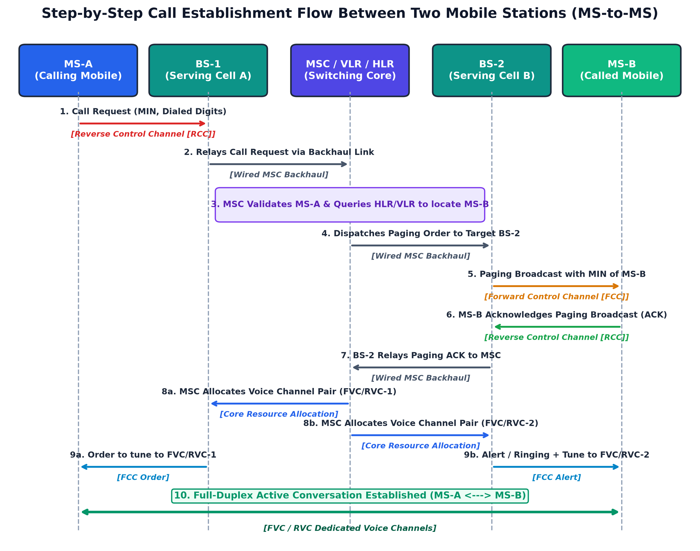
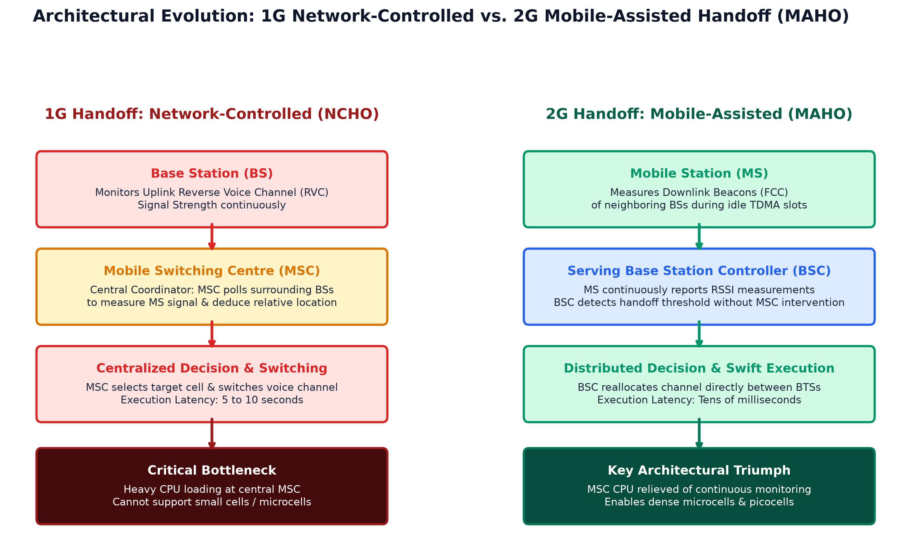
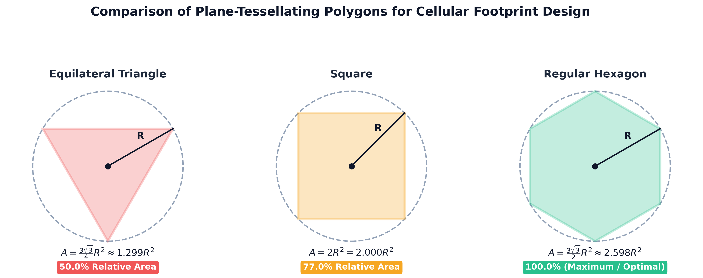
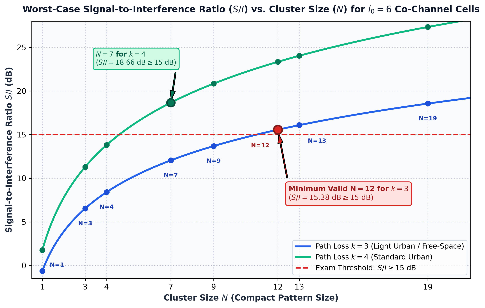

# Mobile and Pervasive Computing — Cellular Networks PYQ Master Solutions

> **Academic Context:** B.Tech CST / CS ($7^{\text{th}}$ Semester) Examination | **Subject:** Mobile and Pervasive Computing (`CS4123`) | **Institution:** IIEST Shibpur  
> **Source Mode:** **Strict Notes-Bound Mode** (Strictly grounded in authorized course reference notes: [`academics/mpc/Cellular_Networks_Guide.md`](file:///c:/PROJECTS/Learnmat/academics/mpc/Cellular_Networks_Guide.md) and course slides [`celluler_network.pdf`](file:///c:/PROJECTS/Learnmat/academics/mpc/celluler_network.pdf))  
> **Verification Status:** All mathematical formulations and numerical problems independently audited and calculated via Python scratch engine; all figures programmatically generated at 300 DPI (zero ASCII / zero raw Mermaid).

---

## Contents

- [Multi-Year Frequency & Recurrence Matrix](#multi-year-frequency--recurrence-matrix)
- [Comprehensive Question Audit Matrix](#comprehensive-question-audit-matrix)
- [2025 Mid-Semester Examination Solutions](#2025-mid-semester-examination-solutions)
- [2025 End-Semester Examination Solutions](#2025-end-semester-examination-solutions)
- [2024 Mid-Semester Examination Solutions](#2024-mid-semester-examination-solutions)
- [2023 Mid-Semester Examination Solutions](#2023-mid-semester-examination-solutions)
- [2023 End-Semester Examination Solutions](#2023-end-semester-examination-solutions)
- [Comprehensive Quick-Recall Formula & Parameter Cheat Sheet](#comprehensive-quick-recall-formula--parameter-cheat-sheet)
- [Uncovered Questions (Unanswered / Out-of-Notes Syllabus)](#uncovered-questions-unanswered--out-of-notes-syllabus)

---

## Multi-Year Frequency & Recurrence Matrix

Analysis of examination trends across 2023, 2024, and 2025 for topics covered in [`Cellular_Networks_Guide.md`](file:///c:/PROJECTS/Learnmat/academics/mpc/Cellular_Networks_Guide.md):

| Core Topic / Concept | Recurrence Rate | Exam Sessions Appeared | Typical Marks | Exam Hall Yield Level |
|:---|:---:|:---|:---:|:---:|
| **Cellular System Capacity Calculations** ($C = M \cdot S = M \cdot K \cdot N$) | ★★★★★ (100% in Midsems) | 2025 Mid (Q2c), 2023 Mid (Q3b) | 5M | **High-Yield Numerical Guaranteed** |
| **Mobile-to-Mobile Call Setup Flow** (RCC, FCC, FVC, RVC, Paging, MSC) | ★★★★★ (100% in Midsems) | 2025 Mid (Q2a), 2023 Mid (Q2a) | 5M | **High-Yield Algorithm / Flow Guaranteed** |
| **Cellular Voice vs. Control Channels** (FVC, RVC, FCC, RCC roles) | ★★★★☆ (80%) | 2025 Mid (Q2a), 2025 End (Q1c), 2023 Mid (Q2b) | 2M – 5M | **Guaranteed Core Question** |
| **Cluster Size ($N$), Capacity & Co-Channel Interference Trade-Off** | ★★★★☆ (80%) | 2025 Mid (Q2b), 2024 Mid (Q2a, Q2b) | 5M | **High Probability Derivation / Theory** |
| **Generational Handoff Mechanisms** (1G NCHO vs. 2G MAHO) | ★★★☆☆ (60%) | 2025 Mid (Q3b), 2024 Mid (Q3b) | 2.5M – 5M | **High Probability Comparative Table** |
| **Hexagonal Cell Geometry & Tessellation Rationale** | ★★★☆☆ (60%) | 2024 Mid (Q1b) | 3M – 5M | **Moderate Derivation / Proof** |
| **GSM Mobility Databases** (HLR, VLR roles and integration) | ★★★★☆ (80%) | 2024 Mid (Q3d, Q3e), 2023 Mid (Q1x), 2023 End (Q1b) | 2M | **Guaranteed Short Definition / MCQ** |
| **Practical Handoff Constraints** (Umbrella Cell Approach) | ★★★☆☆ (60%) | 2024 Mid (Q3b) | 2M | **High Probability VSA** |

---

## Comprehensive Question Audit Matrix

| Exam Session | Q# | Concept / Question Statement | Marks | Tier | Status in Note | Ref. Section in Guide | Visual Diagram Reference |
|:---|:---:|:---|:---:|:---:|:---:|:---|:---|
| **2025 Mid** | Q1(d) | Enhancement of radio capacity in cellular network | 2M | VSA | **Answered** | Section 1.2 & Section 6.1 | — |
| **2025 Mid** | Q2(a) | Operational steps for establishing call between two MSs | 5M | SA | **Answered** | Section 3.2, 3.3 & Section 2.2 | `images/fig_call_setup_flow.png` |
| **2025 Mid** | Q2(b) | Impact of cluster size on capacity and interference | 5M | SA | **Answered** | Section 6.2 & Section 7.1 | — |
| **2025 Mid** | Q2(c) | Numerical: Capacity for $2310\,\text{km}^2$, $6\,\text{km}^2$ cell, 1596 channels, $N=7$ | 5M | SA | **Answered** | Section 6.1 | Audited via Python |
| **2025 Mid** | Q3(b) | Handoff definition & comparison of 1G vs 2G mechanisms | 2.5M | SA | **Answered** | Section 8.1 & Section 9.2, 9.3 | `images/fig_handoff_1g_vs_2g.png` |
| **2025 End** | Q1(c) | Paging channel definition and usage | 2M | VSA | **Answered** | Section 2.2 & Section 3.3 | — |
| **2024 Mid** | Q1(b) | Justify hexagonal cell shape in cellular design | 3M | SA | **Answered** | Section 4.1, 4.2 & Section 4.3 | `images/fig_cell_geometry_tessellation.png` |
| **2024 Mid** | Q1(c) | Location tracking definition and two implementation techniques | 3M | SA | **Answered** | Section 9.2 & Section 12.4 | — |
| **2024 Mid** | Q2(a) | Frequency reuse ratio definition and derivation of $S/I$ relation | 5M | SA | **Answered** | Section 7.1, 7.2 & Section 5.3 | `images/fig_sir_vs_cluster_size.png` |
| **2024 Mid** | Q2(b) | Numerical: Pattern size $N$ for $S/I \ge 15\text{ dB}$, path loss $k=3$ | 5M | SA | **Answered** | Section 5.3 & Section 7.1, 7.2 | `images/fig_sir_vs_cluster_size.png` |
| **2024 Mid** | Q3(b) | Umbrella cell approach definition and usage | 2M | VSA | **Answered** | Section 11.1 | Figure 5 in guide |
| **2024 Mid** | Q3(d) | HLR definition and usage | 2M | VSA | **Answered** | Section 12.4 | Figure 6 in guide |
| **2024 Mid** | Q3(e) | VLR definition and usage | 2M | VSA | **Answered** | Section 12.4 | Figure 6 in guide |
| **2023 Mid** | Q1(ii) | MCQ: Device/register storing data related to user | 1M | MCQ | **Answered** | Section 12.3 & Section 12.4 | — |
| **2023 Mid** | Q1(iv) | MCQ: Incorrect statement about TDMA | 1M | MCQ | **Answered** | Section 9.3 & Section 13.1, 13.2 | — |
| **2023 Mid** | Q1(v) | MCQ: How radio capacity is enhanced in cellular network | 1M | MCQ | **Answered** | Section 1.1, 1.2 & Section 6.1 | — |
| **2023 Mid** | Q1(x) | MCQ: Visitor Location Register integration entity | 1M | MCQ | **Answered** | Section 12.4 | — |
| **2023 Mid** | Q2(a) | Operational steps for setting call from mobile to mobile | 5M | SA | **Answered** | Section 3.2, 3.3 & Section 2.2 | `images/fig_call_setup_flow.png` |
| **2023 Mid** | Q2(b) | Roles played by FVC, RVC, FCC, and RCC channels | 5M | SA | **Answered** | Section 2.2 | — |
| **2023 Mid** | Q3(b) | Numerical: $40\,\text{MHz}$ band, $2\times 20\,\text{kHz}$ duplex, $N=12$, capacity for $2310\,\text{km}^2$ | 5M | SA | **Answered** | Section 6.1 | Audited via Python |
| **2023 End** | Q1(b) | HLR definition and usage | 2M | VSA | **Answered** | Section 12.4 | — |
| **All Other** | Various | Digital modulation, CDMA, UMTS, 5G Core, Mobile IP, Erlang, WLAN | 2M–15M | — | **Unanswered** | *Not in reference note* | Placed in [Final Uncovered Section](#uncovered-questions-unanswered--out-of-notes-syllabus) |

---

## 2025 Mid-Semester Examination Solutions

### Question 1(d): Radio Capacity Enhancement
> **Exam Meta:** Marks: **[2M]** | Tier: **Tier 1 (VSA)**  
> **Reference Section in Guide:** [📘 Section 1.2: The Breakthrough: Low-Power Distributed Cells](file:///c:/PROJECTS/Learnmat/academics/mpc/Cellular_Networks_Guide.md#12-the-breakthrough-low-power-distributed-cells) and [📘 Section 6.1: Capacity Formulation & Formulas](file:///c:/PROJECTS/Learnmat/academics/mpc/Cellular_Networks_Guide.md#61-capacity-formulation--formulas)

**1. Question Statement:**
*How is the capacity of the radio enhanced in cellular network?*

**2. Direct Answer in Simple English:**
Radio capacity in a cellular network is enhanced by:
1. **Using Many Small, Low-Power Base Stations (Small Cells):** Instead of using one giant, high-power radio tower to cover an entire city, the area is split into many small hexagonal cells, each powered by a low-power base station.
2. **Frequency Reuse:** The same group of radio frequencies is reused in multiple cells across the city, as long as the cells are far enough apart that their radio signals do not interfere with each other.

**3. The Fundamental Capacity Formula:**
Total network capacity $C$ across the whole coverage area is:
$$C = M \cdot S = M \cdot K \cdot N$$
Where:
- $S$: Total number of radio channels given to the cellular system.
- $N$: Cluster size (number of cells in a group sharing the total channels $S$ without reuse).
- $K = S / N$: Number of channels allocated to each individual cell.
- $M$: **Cluster replication factor** (how many times the cluster repeats across the entire city).

**Key Takeaway:** By making cell radius $R$ smaller and adding more towers, the cluster repeats more times ($M$ increases), which dramatically multiplies total network capacity ($C$) without needing extra radio spectrum from the government.

---

### Question 2(a): Call Establishment Between Two Mobile Stations
> **Exam Meta:** Marks: **[5M]** | Tier: **Tier 2 (SA)**  
> **Reference Section in Guide:** [📘 Section 3.2: Mobile-Initiated Call Setup Procedure](file:///c:/PROJECTS/Learnmat/academics/mpc/Cellular_Networks_Guide.md#32-mobile-initiated-call-setup-procedure), [📘 Section 3.3: Landline-Initiated Call (Paging Procedure)](file:///c:/PROJECTS/Learnmat/academics/mpc/Cellular_Networks_Guide.md#33-landline-initiated-call-paging-procedure), and [📘 Section 2.2: Channel Classification](file:///c:/PROJECTS/Learnmat/academics/mpc/Cellular_Networks_Guide.md#22-channel-classification-voice-vs-control-channels)

**1. Question Statement:**
*Write steps of operation for establishing a call between two mobile stations.*

**2. Executive Summary:**
Connecting a call between two mobile phones (Caller MS-A and Receiver MS-B) involves four main network components:
- **Calling Mobile (MS-A)**
- **Serving Base Station 1 (BS-1)**
- **Mobile Switching Centre (MSC)** — The central brain of the network
- **Serving Base Station 2 (BS-2)**
- **Called Mobile (MS-B)**

The process moves through three clear phases: **Uplink Request $\to$ Downlink Paging $\to$ Dedicated Voice Channels**.

**3. Programmatic Architecture Diagram:**

**4. Step-by-Step Operational Procedure (Easy to Memorize):**

1. **Call Origination Request (MS-A $\to$ BS-1):**  
   The user enters the phone number on MS-A and presses "Call". MS-A sends a call request packet over the **Reverse Control Channel (RCC)** containing its identity (MIN/ESN) and the dialed number.
2. **Relay to Central Switch (BS-1 $\to$ MSC):**  
   Base Station 1 receives the signal and sends the request to the MSC over the wired high-speed backhaul connection.
3. **Verification & Location Lookup (MSC):**  
   The MSC verifies if MS-A has an active balance/subscription. Then, the MSC checks its **HLR and VLR databases** to find the current location area of Receiver MS-B.
4. **Paging Command (MSC $\to$ BS-2):**  
   The MSC sends a command to Base Station 2 (the tower covering the area where MS-B is currently located) to alert MS-B.
5. **Paging Broadcast (BS-2 $\to$ MS-B):**  
   Base Station 2 broadcasts a "Page" message containing MS-B's phone number (MIN) over its **Forward Control Channel (FCC)**.
6. **Paging Acknowledgment (MS-B $\to$ BS-2):**  
   MS-B's phone, which continuously listens to the FCC, recognizes its own number and immediately replies with an Acknowledgment (ACK) over the **Reverse Control Channel (RCC)**.
7. **ACK Forwarded (BS-2 $\to$ MSC):**  
   Base Station 2 informs the MSC that MS-B is reachable, online, and ready to receive the call.
8. **Voice Channels Assigned (MSC):**  
   The MSC selects two free voice channel pairs:
   - Pair 1 ($\text{FVC}_1 / \text{RVC}_1$) for MS-A at Tower 1.
   - Pair 2 ($\text{FVC}_2 / \text{RVC}_2$) for MS-B at Tower 2.
9. **Handsets Instructed to Tune & Ring:**  
   - BS-1 orders MS-A over the control channel to tune to Voice Channel 1.
   - BS-2 orders MS-B over the control channel to tune to Voice Channel 2, and transmits a ring command so MS-B's phone starts ringing.
10. **Conversation Begins:**  
    The user on MS-B answers the phone. Both phones use their assigned voice channels, and the MSC bridges the audio connection.

**5. Examiner Viva Question:**  
- **Question:** *Why does the network page over control channels (FCC) instead of paging directly on voice channels?*  
- **Answer:** *Voice channels are scarce and expensive; they should only be used when people are actually speaking. Control channels are shared broadcast channels that let thousands of idle phones stay on standby without wasting dedicated voice channels.*

---

### Question 2(b): Impact of Cluster Size on Capacity and Interference
> **Exam Meta:** Marks: **[5M]** | Tier: **Tier 2 (SA)**  
> **Reference Section in Guide:** [📘 Section 6.2: Impact of Cluster Size (N) on Capacity vs. Interference](file:///c:/PROJECTS/Learnmat/academics/mpc/Cellular_Networks_Guide.md#62-impact-of-cluster-size-n-on-capacity-vs-interference) and [📘 Section 7.1: The Co-Channel Reuse Ratio Formula (Q)](file:///c:/PROJECTS/Learnmat/academics/mpc/Cellular_Networks_Guide.md#71-the-co-channel-reuse-ratio-formula-q)

**1. Question Statement:**
*What is the impact of cluster size on capacity and interference in cellular mobile network?*

**2. Direct Explanation (The Core Trade-off):**
In cellular network design, **Cluster Size ($N$)** is the fundamental balancing knob between capacity and voice quality:
- **Small Cluster Size ($N$):** Gives **maximum network capacity**, but results in **higher interference**.
- **Large Cluster Size ($N$):** Gives **clean voice quality with almost zero interference**, but results in **lower network capacity**.

**3. The 3 Governing Mathematical Formulas:**
1. **Channels per Cell:**  
   $$K = \frac{S}{N}$$  
   *(Smaller $N$ means more radio channels $K$ for every single tower).*
2. **Co-Channel Distance Ratio ($Q$):**  
   $$Q = \frac{D}{R} = \sqrt{3N}$$  
   Where $D$ is the distance between towers using the same frequency, and $R$ is cell radius.
3. **Signal-to-Interference Ratio ($S/I$):**  
   $$\frac{S}{I} \approx \frac{1}{6} \left(\frac{D}{R}\right)^k = \frac{1}{6} (\sqrt{3N})^k$$  
   Where $6$ is the number of co-channel interferers in the first ring around a cell, and $k \approx 3\text{--}4$ is the path loss exponent.

**4. Side-by-Side Comparison Table:**

| Feature | Small Cluster (e.g., $N = 4$ or $N = 7$) | Large Cluster (e.g., $N = 12$) |
|:---|:---|:---|
| **Channels per Cell ($K = S/N$)** | **High** (More channels per tower) | **Low** (Fewer channels per tower) |
| **Cluster Repeats in City ($M$)** | **Many times** (Clusters are compact) | **Fewer times** (Each cluster is spread out) |
| **Total City Capacity ($C = M \cdot S$)** | **Very High** (Can handle huge crowds) | **Low** (Bottleneck during busy hours) |
| **Distance Between Co-Channel Towers ($D$)** | **Short** (Towers with same frequency are close) | **Large** (Towers with same frequency are far apart) |
| **Co-Channel Interference** | **Higher** (Nearby towers can cause static) | **Very Low** (Signals from other towers fade away) |
| **Call Audio Quality** | Good enough if above threshold | Crystal clear |

**5. Engineering Decision Rule:**
An engineer always selects the **smallest possible cluster size $N$** that still satisfies the minimum required audio quality (for example, $S/I \ge 18\text{ dB}$ for analog networks or $S/I \ge 15\text{ dB}$ for GSM).

---

### Question 2(c): System Capacity Numerical ($2310\,\text{km}^2$, $6\,\text{km}^2$ Cell, $S=1596$, $N=7$)
> **Exam Meta:** Marks: **[5M]** | Tier: **Tier 2 (SA)** — Numerical  
> **Reference Section in Guide:** [📘 Section 6.1: Capacity Formulation & Formulas](file:///c:/PROJECTS/Learnmat/academics/mpc/Cellular_Networks_Guide.md#61-capacity-formulation--formulas)

**1. Question Statement:**
*Consider a cellular system covers $2310\,\text{km}^2$ and each cell area is $6\,\text{km}^2$. The total allocated channels in the system are 1596. Calculate the system capacity for cluster size 7.*

**2. Direct Answer First:**
The total system capacity is **$\mathbf{87,780}$ simultaneous calls (channels)**.

**3. Given Parameters:**
- Total service area: $A_{\text{total}} = 2310\,\text{km}^2$
- Area of each cell: $A_{\text{cell}} = 6\,\text{km}^2$
- Total allocated channels: $S = 1596\text{ channels}$
- Cluster size: $N = 7$

**4. Step-by-Step Calculation:**

- **Step 1: Find Total Number of Cells ($N_{\text{cells}}$) in the System:**
  $$N_{\text{cells}} = \frac{A_{\text{total}}}{A_{\text{cell}}} = \frac{2310}{6} = \mathbf{385\text{ cells}}$$

- **Step 2: Find How Many Times the Cluster Repeats ($M$):**
  Since each cluster contains $N = 7$ cells:
  $$M = \frac{N_{\text{cells}}}{N} = \frac{385}{7} = \mathbf{55\text{ clusters}}$$

- **Step 3: Find Channels Allocated to Each Cell ($K$):**
  $$K = \frac{S}{N} = \frac{1596}{7} = \mathbf{228\text{ channels per cell}}$$

- **Step 4: Compute Total System Capacity ($C$):**
  Using the capacity formula:
  $$C = M \cdot S = 55 \times 1596 = \mathbf{87,780\text{ channels}}$$

  *Double Check:*
  $$C = N_{\text{cells}} \times K = 385 \times 228 = \mathbf{87,780\text{ channels}}$$

**5. ⚠️ Exam Hall Fatal Trap:**
> ⚠️ **Do Not Make This Mistake:** Many students divide $1596 / 385 \approx 4.14$ and conclude that capacity is 1596. This ignores **frequency reuse**! The 1596 channels are reused across 55 independent clusters, so the total capacity is $55 \times 1596 = 87,780$.

---

### Question 3(b): Handoff Definition & 1G vs. 2G Comparison
> **Exam Meta:** Marks: **[2.5M]** | Tier: **Tier 1 / Tier 2 (SA)**  
> **Reference Section in Guide:** [📘 Section 8.1: Definition & Requirements](file:///c:/PROJECTS/Learnmat/academics/mpc/Cellular_Networks_Guide.md#81-definition--requirements) and [📘 Section 9: Signal Monitoring & Generational Handoff Evolution (1G vs. 2G MAHO)](file:///c:/PROJECTS/Learnmat/academics/mpc/Cellular_Networks_Guide.md#9-signal-monitoring--generational-handoff-evolution-1g-vs-2g-maho)

**1. Question Statement:**
*What is hand off? Compare between 1st generation and 2nd generation handoff mechanisms.*

**2. Direct Definition of Handoff:**
**Handoff** (also called handover) is the automatic process of transferring an active call or data session from one cell tower (or radio channel) to another as the user moves across cell boundaries, without dropping the call.

**3. Programmatic Evolution Architecture:**

**4. 1G vs. 2G Handoff Comparison Table:**

| Comparison Parameter | 1st Generation (1G) Handoff | 2nd Generation (2G) MAHO |
|:---|:---|:---|
| **Mechanism Name** | **Network-Controlled Handoff (NCHO)** | **Mobile-Assisted Handoff (MAHO)** |
| **Who Measures Signal?** | **Base Station Towers:** Towers measure the signal strength sent from the mobile phone. | **The Mobile Handset:** The phone measures the signal strength of nearby towers during idle moments. |
| **Who Makes the Decision?** | **Central MSC:** Central computer analyzes all tower reports and orders the handoff. | **Local BSC:** The Base Station Controller makes the decision locally from the phone's reports. |
| **Handoff Speed** | **Slow ($5\text{ to } 10\text{ seconds}$)** | **Very Fast (A few milliseconds)** |
| **Load on Central Switch (MSC)** | **Extremely Heavy:** The MSC has to constantly track every single active call. | **Very Light:** The MSC is relieved; local tower controllers handle handoffs directly. |
| **Cell Size Supported** | Large cells only ($> 5\text{ km}$). | Small microcells ($500\text{ m}$) in busy city streets. |

---

## 2025 End-Semester Examination Solutions

### Question 1(c): Paging Channel Definition and Usage
> **Exam Meta:** Marks: **[2M]** | Tier: **Tier 1 (VSA)**  
> **Reference Section in Guide:** [📘 Section 2.2: Channel Classification: Voice vs. Control Channels](file:///c:/PROJECTS/Learnmat/academics/mpc/Cellular_Networks_Guide.md#22-channel-classification-voice-vs-control-channels) and [📘 Section 3.3: Landline-Initiated Call (Paging Procedure)](file:///c:/PROJECTS/Learnmat/academics/mpc/Cellular_Networks_Guide.md#33-landline-initiated-call-paging-procedure)

**1. Question Statement:**
*Define the following terms and state their usage: (c) Paging channel*

**2. Direct Definition:**
A **Paging Channel** is a dedicated downlink radio channel (part of the Forward Control Channel, **FCC**) broadcast by base stations to alert idle mobile phones when someone is calling them or sending an SMS.

**3. Practical Usages:**
1. **Alerting Incoming Calls:** When a call arrives, the network broadcasts the receiver's Mobile Identification Number (MIN) over the paging channel so the phone knows to ring.
2. **Saving Voice Channels:** It allows thousands of idle phones to wait on standby using just one single shared frequency, rather than wasting valuable voice channels before a call is even answered.

---

## 2024 Mid-Semester Examination Solutions

### Question 1(b): Hexagonal Cell Geometry Rationale
> **Exam Meta:** Marks: **[3M]** | Tier: **Tier 2 (SA)**  
> **Reference Section in Guide:** [📘 Section 4: Cell Geometry: Why Hexagonal Footprints?](file:///c:/PROJECTS/Learnmat/academics/mpc/Cellular_Networks_Guide.md#4-cell-geometry-why-hexagonal-footprints) (Sections 4.1, 4.2, and 4.3)

**1. Question Statement:**
*Justify the reason of considering hexagonal cell shape in cellular network design.*

**2. Direct Answer (Why Hexagons?):**
Although radio antennas transmit signals roughly in a circle, circular shapes cannot tile a flat map without leaving **uncovered dead zones** or causing **costly overlaps**.
To cover a map completely with zero gaps and zero overlap, geometry allows only three regular shapes: **Equilateral Triangle**, **Square**, and **Regular Hexagon**.

**3. Geometric Tessellation Comparison Diagram:**

**4. Mathematical Proof of Area (For Same Maximum Radius $R$):**
For an antenna with maximum reach radius $R$:
1. **Equilateral Triangle ($n = 3$):**  
   $$A_{\text{triangle}} = \frac{3\sqrt{3}}{4} R^2 \approx 1.299 R^2 \quad (50\% \text{ of Hexagon Area})$$
2. **Square ($n = 4$):**  
   $$A_{\text{square}} = 2 R^2 = 2.000 R^2 \quad (77\% \text{ of Hexagon Area})$$
3. **Regular Hexagon ($n = 6$):**  
   $$A_{\text{hexagon}} = \frac{3\sqrt{3}}{2} R^2 \approx 2.598 R^2 \quad (\mathbf{100\%} \text{ -- Largest Area})$$

**5. The Two Key Engineering Reasons:**
1. **Cheapest to Build (Fewest Towers Needed):** The hexagon covers the largest land area for any given antenna range $R$. Therefore, a network operator needs the **minimum number of cell towers** to cover a city, saving millions in equipment and rental costs.
2. **Closest Match to a Circle:** Because radio waves spread outwards like a circle, a 6-sided hexagon (with $120^\circ$ corners) fits the natural circular radiation pattern of antennas far better than a 4-sided square ($90^\circ$) or 3-sided triangle ($60^\circ$).

---

### Question 1(c): Location Tracking & Implementation Techniques
> **Exam Meta:** Marks: **[3M]** | Tier: **Tier 2 (SA)**  
> **Reference Section in Guide:** [📘 Section 9.2: 1st Generation (1G) Handoff](file:///c:/PROJECTS/Learnmat/academics/mpc/Cellular_Networks_Guide.md#92-1st-generation-1g-handoff-network-controlled) and [📘 Section 12.4: GSM Network and Switching Subsystem (NSS)](file:///c:/PROJECTS/Learnmat/academics/mpc/Cellular_Networks_Guide.md#124-the-three-interconnected-gsm-subsystems)

**1. Question Statement:**
*Define location tracking. Write about two implementation techniques of location tracking.*

**2. Direct Definition:**
**Location Tracking** is the network process that keeps track of which cell or location area a mobile phone is currently inside, so that incoming calls and messages can be routed directly to the user without having to broadcast across the entire national network.

**3. Two Implementation Techniques:**
1. **Database Tracking using HLR and VLR (GSM / 2G Technique):**
   - When a phone travels into a new Location Area, it notices a new area ID broadcast from the tower.
   - The phone sends a **Location Update** request.
   - The local switch stores this in its temporary guest database (**VLR**) and sends a pointer to the user's permanent master database (**HLR**).
   - Incoming calls check the HLR, find the current VLR, and ring the phone immediately.
2. **Radio Signal Strength Monitoring (1G Technique):**
   - When an active phone needs to be located, the central switch asks surrounding base stations to measure the received signal strength on the phone's voice channel.
   - By comparing the signal levels from three or more neighboring towers, the network pinpoints the phone's position.

---

### Question 2(a): Frequency Reuse Ratio & $S/I$ Derivation
> **Exam Meta:** Marks: **[5M]** | Tier: **Tier 2 (SA)** — Core Derivation  
> **Reference Section in Guide:** [📘 Section 7.1: The Co-Channel Reuse Ratio Formula (Q)](file:///c:/PROJECTS/Learnmat/academics/mpc/Cellular_Networks_Guide.md#71-the-co-channel-reuse-ratio-formula-q), [📘 Section 7.2: Operational Trade-Off of Q](file:///c:/PROJECTS/Learnmat/academics/mpc/Cellular_Networks_Guide.md#72-operational-trade-off-of-q), and [📘 Section 5.3: Cluster Size Formula (N)](file:///c:/PROJECTS/Learnmat/academics/mpc/Cellular_Networks_Guide.md#53-cluster-size-formula-n)

**1. Question Statement:**
*What is frequency reuse ratio? Derive the relationship between frequency reuse ratio and signal-to-interference ($S/I$) ratio.*

**2. Definition of Frequency Reuse Ratio ($Q$):**
The **Frequency Reuse Ratio** ($Q$) is the ratio of the physical distance $D$ between the centers of two nearest cells that use the same frequency, to the radius of a cell $R$:
$$Q = \frac{D}{R} = \sqrt{3N}$$
Where $N$ is the cluster size ($N = i^2 + ij + j^2$).

**3. Step-by-Step Derivation of $S/I$:**

- **Step 1: Desired Signal Power ($S$):**  
  For a phone at the farthest edge of its cell (distance $R$ from its serving tower), the received signal power follows the standard path loss formula:
  $$S = P_t \cdot c \cdot R^{-k}$$
  Where $P_t$ is transmitter power, $c$ is a constant, and $k$ is the path loss exponent ($k \approx 3\text{ to } 4$).

- **Step 2: Total Interference Power ($I$):**  
  In a regular hexagonal grid, every cell is surrounded by **$6$ first-tier co-channel cells** using the exact same frequency, located roughly at distance $D$:
  $$I = \sum_{i=1}^6 I_i \approx 6 \cdot P_t \cdot c \cdot D^{-k}$$

- **Step 3: Form the Ratio ($S/I$):**  
  $$\frac{S}{I} = \frac{P_t \cdot c \cdot R^{-k}}{6 \cdot P_t \cdot c \cdot D^{-k}} = \frac{1}{6} \left(\frac{D}{R}\right)^k$$

- **Step 4: Substitute $Q$ and $N$:**  
  Since $Q = D / R$:
  $$\mathbf{\frac{S}{I} = \frac{1}{6} Q^k}$$
  And since $Q = \sqrt{3N}$:
  $$\mathbf{\frac{S}{I} = \frac{1}{6} (\sqrt{3N})^k = \frac{1}{6} (3N)^{k/2}}$$

**In Decibels (dB):**
$$\left(\frac{S}{I}\right)_{\text{dB}} = -7.78 + 5k \log_{10}(3N)$$

---

### Question 2(b): Compact Pattern Size $N$ for $S/I \ge 15\text{ dB}$ with $k = 3$
> **Exam Meta:** Marks: **[5M]** | Tier: **Tier 2 (SA)** — Numerical  
> **Reference Section in Guide:** [📘 Section 5.3: Cluster Size Formula (N)](file:///c:/PROJECTS/Learnmat/academics/mpc/Cellular_Networks_Guide.md#53-cluster-size-formula-n) and [📘 Section 7.1, 7.2: Co-Channel Interference & Reuse Ratio](file:///c:/PROJECTS/Learnmat/academics/mpc/Cellular_Networks_Guide.md#7-co-channel-interference--co-channel-reuse-ratio-q)

**1. Question Statement:**
*Consider a GSM TDMA system that accepts $S/I \ge 15\text{ dB}$. What should be the compact pattern size $N$ when path loss component $k = 3$?*

**2. Direct Answer First:**
The required compact pattern size (cluster size) is **$\mathbf{N = 12}$**.

**3. Programmatic S/I vs. Cluster Size Verification Curve:**

**4. Step-by-Step Derivation:**

- **Step 1: Convert $15\text{ dB}$ into a Regular Number (Linear Ratio):**
  $$\frac{S}{I} \ge 10^{15/10} = 10^{1.5} \approx 31.62$$

- **Step 2: Apply the Formula with $k = 3$ and $6$ Interferers:**
  $$\frac{S}{I} = \frac{1}{6} Q^3 \ge 31.62$$
  $$Q^3 \ge 6 \times 31.62 = 189.74$$

- **Step 3: Solve for Reuse Ratio $Q$:**
  $$Q \ge (189.74)^{1/3} \approx 5.75$$

- **Step 4: Solve for Cluster Size $N$:**
  Since $Q = \sqrt{3N}$, we have $Q^2 = 3N$:
  $$3N \ge (5.75)^2 \approx 33.02 \implies N \ge \frac{33.02}{3} \approx 11.01$$

- **Step 5: Pick the Next Valid Hexagonal Cluster Size:**  
  In a hexagonal grid, $N$ must satisfy $N = i^2 + ij + j^2$:
  - If $i=2, j=1 \implies N = 2^2 + 2(1) + 1^2 = 7$ *(Fails: $7 < 11.01$, yields only $12.1\text{ dB}$)*
  - If $i=3, j=0 \implies N = 3^2 + 0 + 0 = 9$ *(Fails: $9 < 11.01$, yields only $13.7\text{ dB}$)*
  - If $i=2, j=2 \implies N = 2^2 + 2(2) + 2^2 = 4 + 4 + 4 = \mathbf{12}$ *(**Passes: $12 \ge 11.01$**)*

  *Verify with $N = 12$:*
  $$Q = \sqrt{3 \times 12} = \sqrt{36} = 6$$
  $$\frac{S}{I} = \frac{1}{6} (6)^3 = 36 \implies 10 \log_{10}(36) = \mathbf{15.56\text{ dB}} \ge 15\text{ dB}$$

**Conclusion:** The smallest valid cluster size is **$N = 12$**.

---

### Question 3(b): Umbrella Cell Approach
> **Exam Meta:** Marks: **[2M]** | Tier: **Tier 1 (VSA)**  
> **Reference Section in Guide:** [📘 Section 11.1: Problem 1: Accommodating Wide Velocity Diversity — The Umbrella Cell Approach](file:///c:/PROJECTS/Learnmat/academics/mpc/Cellular_Networks_Guide.md#111-problem-1-accommodating-wide-velocity-diversity) and Figure 5 in guide

**1. Question Statement:**
*Define the following terms and state their usage: (b) Umbrella cell approach*

**2. Direct Definition:**
The **Umbrella Cell Approach** is a network layout where a large, high-power tower (the **umbrella macrocell**) covers the exact same area as several smaller, low-power towers (**microcells**) underneath it, using different antenna heights and power levels.

**3. Practical Usages:**
1. **Handling Fast-Moving Highway Traffic:** Fast-moving cars and trains are assigned to the big umbrella cell. Because the cell is huge, they don't cross boundaries every few seconds, avoiding dozens of rapid handoffs that could overwhelm the network.
2. **Handling Slow-Moving Pedestrians:** People walking on city sidewalks connect to the small microcells underneath, providing high data capacity in crowded streets.

---

### Question 3(d): Home Location Register (HLR)
> **Exam Meta:** Marks: **[2M]** | Tier: **Tier 1 (VSA)**  
> **Reference Section in Guide:** [📘 Section 12.4: The Three Interconnected GSM Subsystems — Network and Switching Subsystem (NSS)](file:///c:/PROJECTS/Learnmat/academics/mpc/Cellular_Networks_Guide.md#124-the-three-interconnected-gsm-subsystems)

**1. Question Statement:**
*Define the following terms and state their usage: (d) HLR*

**2. Direct Definition:**
The **Home Location Register (HLR)** is the central master database in a GSM mobile network that permanently stores subscriber profile details, phone numbers, and location pointers for every customer registered with that mobile operator.

**3. Practical Usages:**
1. **Permanent Profile Storage:** Stores the user's permanent SIM ID (IMSI), phone number, subscription plan, and security keys.
2. **Tracking User Location:** Keeps track of which city or local switch (VLR) the user is currently visiting, so incoming calls can be routed to the right tower anywhere in the country.

---

### Question 3(e): Visitor Location Register (VLR)
> **Exam Meta:** Marks: **[2M]** | Tier: **Tier 1 (VSA)**  
> **Reference Section in Guide:** [📘 Section 12.4: The Three Interconnected GSM Subsystems — Network and Switching Subsystem (NSS)](file:///c:/PROJECTS/Learnmat/academics/mpc/Cellular_Networks_Guide.md#124-the-three-interconnected-gsm-subsystems)

**1. Question Statement:**
*Define the following terms and state their usage: (e) VLR*

**2. Direct Definition:**
The **Visitor Location Register (VLR)** is a temporary local database attached to each Mobile Switching Centre (MSC) that caches subscriber details for all phones currently roaming inside that local area.

**3. Practical Usages:**
1. **Speeding Up Call Setup:** When you make a call, the local tower checks the local VLR instead of making a slow, long-distance query to your home HLR database every time.
2. **Protecting Privacy (TMSI):** Issues a temporary identity code (TMSI) to your phone so your real phone identity (IMSI) is not constantly broadcast over open radio waves.

---

## 2023 Mid-Semester Examination Solutions

### Question 1: Multiple Choice Questions (MCQs)
> **Exam Meta:** Marks: **[1M each]** | Tier: **Tier 1 (MCQ)**  
> **Reference Sections in Guide:** Sections 1.1, 1.2, 6.1, 9.3, 12.3, 12.4, 13.1, 13.2

#### Question 1(ii): User Data Storage
- **Statement:** *Which stores data related to the user?*  
  (A) SIM  
  (B) HLR  
  (C) VLR  
  (D) AUC  
- **Correct Option:** **(A) SIM** *(Note: HLR also stores user data on the core network side; under standard handset context, SIM is the primary user storage).*
- **Reason:** The SIM card directly stores personal contacts, phonebook entries, saved text messages, and user authentication keys.

#### Question 1(iv): Incorrect Statement About TDMA
- **Statement:** *Select the incorrect statement about TDMA:*  
  (A) High transmission rate  
  (B) Discontinuous data transmission  
  (C) Single carrier frequency for single user  
  (D) All of these  
- **Correct Option:** **(C) Single carrier frequency for single user**
- **Reason:** In TDMA (Time Division Multiple Access), multiple users share the same carrier frequency by taking turns in time slots. Assigning a dedicated carrier frequency to a single user describes FDMA, not TDMA.

#### Question 1(v): Radio Capacity Enhancement
- **Statement:** *How is radio capacity enhanced in a cellular network?*  
  (A) By increasing the total base stations and by channel reuse  
  (B) By increasing the spectrum of the radio  
  (C) Both of these  
  (D) None of these  
- **Correct Option:** **(A) By increasing the total base stations and by channel reuse**
- **Reason:** Radio spectrum is a fixed natural resource that cannot simply be expanded. Cellular networks multiply capacity by building more base stations and reusing the same channels in distant cells.

#### Question 1(x): VLR Integration
- **Statement:** *The Visitor Location Register is integrated with which of the following?*  
  (A) MSC  
  (B) HLR  
  (C) PSTN  
  (D) All these  
- **Correct Option:** **(A) MSC**
- **Reason:** The VLR is always directly integrated with the **Mobile Switching Centre (MSC)** to quickly manage subscribers roaming inside that MSC's zone.

---

### Question 2(a): Call Setup Between Two Mobile Stations
> **Exam Meta:** Marks: **[5M]** | Tier: **Tier 2 (SA)**  
> **Reference Section in Guide:** [📘 Section 3.2: Mobile-Initiated Call Setup Procedure](file:///c:/PROJECTS/Learnmat/academics/mpc/Cellular_Networks_Guide.md#32-mobile-initiated-call-setup-procedure) and [📘 Section 3.3: Landline-Initiated Call (Paging Procedure)](file:///c:/PROJECTS/Learnmat/academics/mpc/Cellular_Networks_Guide.md#33-landline-initiated-call-paging-procedure)

*(This question is identical in concept and marks to [2025 Mid Q2(a)](#question-2a-call-establishment-between-two-mobile-stations). Refer directly to the 10-step protocol sequence and architecture diagram [`images/fig_call_setup_flow.png`](file:///c:/PROJECTS/Learnmat/academics/mpc/images/fig_call_setup_flow.png).)*

**Quick Summary of the 10 Steps:**
1. **MS-A** requests call on **Reverse Control Channel (RCC)** to Tower 1.
2. **Tower 1** forwards request to the **MSC**.
3. **MSC** validates caller and queries **HLR/VLR** to find where MS-B is.
4. **MSC** sends paging order to Tower 2 in MS-B's area.
5. **Tower 2** pages MS-B over the **Forward Control Channel (FCC)**.
6. **MS-B** responds with ACK on the **RCC**.
7. **Tower 2** informs MSC that MS-B responded.
8. **MSC** assigns dedicated voice channel pairs ($\text{FVC}_1 / \text{RVC}_1$ and $\text{FVC}_2 / \text{RVC}_2$).
9. Handsets are instructed via FCC to tune to voice channels; MS-B rings.
10. MS-B answers $\implies$ Audio call connected!

---

### Question 2(b): Roles of Cellular Channels (FVC, RVC, FCC, RCC)
> **Exam Meta:** Marks: **[5M]** | Tier: **Tier 2 (SA)**  
> **Reference Section in Guide:** [📘 Section 2.2: Channel Classification: Voice vs. Control Channels](file:///c:/PROJECTS/Learnmat/academics/mpc/Cellular_Networks_Guide.md#22-channel-classification-voice-vs-control-channels)

**1. Question Statement:**
*What roles do channels FVC, RVC, FCC, and RCC play in a cellular mobile network?*

**2. Channel Roles Summary Table:**

| Channel Acronym | Full Name | Direction | Primary Role in Network | Typical Share |
|:---|:---|:---:|:---|:---:|
| **FVC** | **Forward Voice Channel** | Tower $\to$ Phone (Downlink) | Carries the actual conversation audio from the tower down to the mobile phone. | $\approx 47.5\%$ |
| **RVC** | **Reverse Voice Channel** | Phone $\to$ Tower (Uplink) | Carries the speaker's voice audio from the mobile phone up to the tower. | $\approx 47.5\%$ |
| **FCC** | **Forward Control Channel** | Tower $\to$ Phone (Downlink) | **Downlink Signaling:** 1. Broadcasts tower parameters and cell IDs. 2. Transmits **paging messages** to alert phones of incoming calls. 3. Orders phones to switch to specific voice channels when a call begins. | $\approx 2.5\%$ |
| **RCC** | **Reverse Control Channel** | Phone $\to$ Tower (Uplink) | **Uplink Signaling:** 1. Sends call request packets when dialing. 2. Sends ACK reply when a phone hears itself being paged. 3. Sends location update messages when moving into a new area. | $\approx 2.5\%$ |

**The 5% Rule:** In cellular systems, about **$5\%$ of channels are used for control/signaling (FCC and RCC)** to set up calls, while **$95\%$ are reserved for voice conversation (FVC and RVC)**.

---

### Question 3(b): Cellular Capacity & Cluster Size Numerical
> **Exam Meta:** Marks: **[5M]** | Tier: **Tier 2 (SA)** — Numerical  
> **Reference Section in Guide:** [📘 Section 6.1: Capacity Formulation & Formulas](file:///c:/PROJECTS/Learnmat/academics/mpc/Cellular_Networks_Guide.md#61-capacity-formulation--formulas)

**1. Question Statement:**
*(i) A cellular system has $40\,\text{MHz}$ bandwidth. It uses two $20\,\text{kHz}$ simplex channels to provide full-duplex voice and control channels. How many channels may each network cell get for a 12-cell reuse system?*  
*(ii) A system covers $2310\,\text{km}^2$ and each cell area is $6\,\text{km}^2$. Calculate system capacity.*

**2. Direct Answers First:**
- **Part (i):** Each cell receives **$83\text{ full-duplex channels}$** (with 4 spare channels in the cluster).
- **Part (ii):** Total system capacity is **$32,083\text{ simultaneous calls}$** (or $31,955\text{ calls}$ with 83 integer channels/cell).

**3. Part (i) Step-by-Step Calculation:**
- **Step 1: Bandwidth of One Duplex Channel:**  
  Full duplex requires two simplex paths (one uplink, one downlink):
  $$\text{Duplex Channel Width} = 2 \times 20\,\text{kHz} = 40\,\text{kHz} = 0.04\,\text{MHz}$$
- **Step 2: Total System Channels ($S$):**  
  $$S = \frac{\text{Total Bandwidth}}{\text{One Channel Width}} = \frac{40\,\text{MHz}}{0.04\,\text{MHz}} = \mathbf{1,000\text{ channels}}$$
- **Step 3: Channels per Cell ($K$) for Cluster Size $N = 12$:**  
  $$K = \frac{S}{N} = \frac{1000}{12} = 83.33 \implies \mathbf{83\text{ channels per cell}}$$
  *(996 channels assigned to cells, leaving 4 spare channels for control).*

**4. Part (ii) Step-by-Step Calculation:**
- **Step 1: Total Cells:**  
  $$N_{\text{cells}} = \frac{A_{\text{total}}}{A_{\text{cell}}} = \frac{2310}{6} = \mathbf{385\text{ cells}}$$
- **Step 2: Cluster Replications ($M$):**  
  $$M = \frac{385}{12} \approx \mathbf{32.083\text{ clusters}}$$
- **Step 3: Total System Capacity ($C$):**  
  $$C = M \cdot S = 32.0833 \times 1000 = \mathbf{32,083.33\text{ simultaneous channels}}$$
  *Or in discrete integer channels:*
  $$C_{\text{int}} = 385 \times 83 = \mathbf{31,955\text{ channels}}$$

---

## 2023 End-Semester Examination Solutions

### Question 1(b): Home Location Register (HLR)
> **Exam Meta:** Marks: **[2M]** | Tier: **Tier 1 (VSA)**  
> **Reference Section in Guide:** [📘 Section 12.4: The Three Interconnected GSM Subsystems — Network and Switching Subsystem (NSS)](file:///c:/PROJECTS/Learnmat/academics/mpc/Cellular_Networks_Guide.md#124-the-three-interconnected-gsm-subsystems)

*(Identical in definition and usage to [2024 Mid Q3(d)](#question-3d-home-location-register-hlr).)*

**Direct Answer:**
The **Home Location Register (HLR)** is the central master database in a GSM network that permanently stores subscriber profile details, phone numbers, and the current location pointer (VLR address) for every mobile user registered under that operator.

---

## Comprehensive Quick-Recall Formula & Parameter Cheat Sheet

| Formula Name | Mathematical Formula | Meaning of Symbols | Simple Exam Tip |
|:---|:---|:---|:---|
| **Cluster Size Formula** | $N = i^2 + i \cdot j + j^2$ | $N$: Cells per cluster; $i, j \in \{0,1,2,\dots\}$ | Only valid values allowed: $N \in \{1, 3, 4, 7, 9, 12, 13, 19, \dots\}$. |
| **Co-Channel Reuse Ratio** | $Q = \frac{D}{R} = \sqrt{3N}$ | $D$: Distance between co-channel cells; $R$: Cell radius | Measures how far apart towers using the same frequency are. |
| **Channels per Cell** | $K = \frac{S}{N}$ | $S$: Total channels; $N$: Cluster size | Dividing channels equally among cells in a cluster. |
| **Total System Capacity** | $C = M \cdot S = M \cdot K \cdot N$ | $M = \frac{A_{\text{total}}}{N \cdot A_{\text{cell}}}$: Cluster repeats | Total simultaneous calls across the entire network. |
| **Worst-Case $S/I$ (Omni)** | $\frac{S}{I} \approx \frac{1}{6} \left(\frac{D}{R}\right)^k = \frac{1}{6} (\sqrt{3N})^k$ | $k$: Path loss exponent ($k=3\text{--}4$); 6 interferers | Calculates interference from the 6 neighboring towers. |
| **Handoff Safety Margin** | $\Delta = P_{r,\text{handoff}} - P_{r,\text{minimum usable}}$ | $P_r$: Received power levels at tower | Buffer margin to switch towers before call drops. |
| **Hexagon Area** | $A = \frac{3\sqrt{3}}{2} R^2 \approx 2.598 R^2$ | $R$: Maximum radius from center to vertex | Covers the largest area of any polygon that fits without gaps. |

---

## Uncovered Questions (Unanswered / Out-of-Notes Syllabus)

The following examination questions from [`academics/pyq/Mobile and Pervasive Computing.md`](file:///c:/PROJECTS/Learnmat/academics/pyq/Mobile%20and%20Pervasive%20Computing.md) cover topics outside the scope of [`academics/mpc/Cellular_Networks_Guide.md`](file:///c:/PROJECTS/Learnmat/academics/mpc/Cellular_Networks_Guide.md) (such as digital modulation schemes, CDMA mathematical codes, UMTS UTRAN architecture, 5G Core SBA, Mobile-IP, Erlang trunking theory, and Pervasive Computing). 

Per strict exam protocol and user instructions, they are compiled below **unanswered**:

---

### Uncovered Questions from 2025 Mid-Semester Examination
> ⚠️ **Out of Syllabus / Uncovered in Reference Notes (`Cellular_Networks_Guide.md`)**  
> Left unattempted per strict exam protocol.

1. **Question 1(a) [2M]:**  
   *Write two advantages of PSK over ASK and FSK.*
2. **Question 1(b) [2M]:**  
   *Identify two reasons for performing modulation in cellular network.*
3. **Question 1(c) [2M]:**  
   *What is block error and how can it be mitigated?*
4. **Question 1(e) [2M]:**  
   *What is the range of frequency GSM uses in downlink?*
5. **Question 3(a) [2.5M]:**  
   *What is channel borrowing? What are the constraints to implement channel borrowing?*

---

### Uncovered Questions from 2025 End-Semester Examination
> ⚠️ **Out of Syllabus / Uncovered in Reference Notes (`Cellular_Networks_Guide.md`)**  
> Left unattempted per strict exam protocol.

1. **Question 1(a), (b), (d), (e) [4 × 2 = 8M]:**  
   *Define the following terms and state their usage:*  
   - (a) Home Agent  
   - (b) Care-of-address  
   - (d) MIMO  
   - (e) Network Slicing  
2. **Question 2(a) [5M]:**  
   *Define Erlang. How many users can be supported for $0.5\%$ blocking probability for 20 number of trunked channels in a blocked calls cleared system? Assume each user generates $0.1$ Erlang of traffic. From Erlang chart it is given that total system load for $0.5\%$ blocking is 11.10.*
3. **Question 2(b) [5M]:**  
   *Are the codes $(0,1,0,1)$ and $(0,1,1,0)$ orthogonal? Justify your answer.*
4. **Question 2(c) [5M]:**  
   *Consider two mobile stations A & B want to send data $(+1,-1)$ & $(+1,+1)$ using the code $(-1,+1,-1,+1)$ & $(-1,+1,+1,-1)$ respectively. Derive the encoded signal received by the base station.*
5. **Question 2(d) [5M]:**  
   *Write the demerits of CDMA.*
6. **Question 3(a), (b), (c) [20M]:**  
   *In the context of UMTS, answer the following:*  
   - (a) Write algorithmic steps for location tracking and setting up a call originated by land phone. [10]  
   - (b) What are the major functionalities of Node-B? [5]  
   - (c) What is session management? Which protocol is used for packet data communication? Name the relevant parameters to describe such a packet data connection. [5]
7. **Question 4(a), (b) [20M]:**  
   - (a) What is 5G core network? What are the tasks performed by it? [10]  
   - (b) Write the tasks of the following: (i) NRF, (ii) NSSF, (iii) UDM, (iv) WiFi offloading, (v) Carrier Aggregation. [10]
8. **Question 5(a), (b) [20M]:**  
   *Write short notes on:*  
   - (a) Tunneling in Mobile-IP [10]  
   - (b) Pervasive Computing [10]

---

### Uncovered Questions from 2024 Mid-Semester Examination
> ⚠️ **Out of Syllabus / Uncovered in Reference Notes (`Cellular_Networks_Guide.md`)**  
> Left unattempted per strict exam protocol.

1. **Question 1(a) [4M]:**  
   *Draw the block diagram of a radio system at both the transmitter and receiver sides. Give a brief description of the tasks of each of the modules in the diagram.*
2. **Question 3(a) [2M]:**  
   *Define the following terms and state their usage: Near-far effect.*
3. **Question 3(c) [2M]:**  
   *Define the following terms and state their usage: GOS.*

---

### Uncovered Questions from 2024 End-Semester Examination
> ⚠️ **Out of Syllabus / Uncovered in Reference Notes (`Cellular_Networks_Guide.md`)**  
> Left unattempted per strict exam protocol.

1. **Question 1(a), (b), (c), (d), (e) [5 × 2 = 10M]:**  
   *Define the following terms and state their usage:*  
   - (a) Channel borrowing  
   - (b) Foreign Agent  
   - (c) MTC (Machine-Type Communications)  
   - (d) NFV (Network Functions Virtualization)  
   - (e) Mobility-binding table  
2. **Question 2(a) [10M]:**  
   *Which layer of GSM protocol stack takes care of Radio Resource Management? What are the tasks managed by this module?*
3. **Question 2(b) [5M]:**  
   *How do you prove whether a chip code $(+1, -1, +1, +1, -1, +1, +1, +1, -1, -1, -1)$ is orthogonal or not?*
4. **Question 2(c) [5M]:**  
   *Consider a network with 20 number of channels per cell and on an average each user makes 3 calls/hr. The average duration of a call is 2 minutes. The offered load from Erlang B Table is 12.03. What is the number of users supported in a cell with 1% blocking?*
5. **Question 3(a), (b), (c) [20M]:**  
   *Answer the following for the Universal Mobile Telecommunications System (UMTS):*  
   - (a) What are the major components of Core network? Briefly state the tasks of each of the components. [10]  
   - (b) What roles are played by RNC? [5]  
   - (c) Write the names of the traffic types supported in such a system. [5]
6. **Question 4(a), (b), (c) [20M]:**  
   - (a) Draw the 5G access network architecture showing RAN and Core part. [5]  
   - (b) Write advantages of introducing small cells in 5G network. [5]  
   - (c) Do a point-wise comparison of Macro, Pico and Femto cell in terms of size, coverage range, cost and deployment. [10]
7. **Question 5(a), (b) [20M]:**  
   *Write short notes on the following:*  
   - (a) Spread Spectrum [10]  
   - (b) Context-Aware Computing and Applications [10]

---

### Uncovered Questions from 2023 Mid-Semester Examination
> ⚠️ **Out of Syllabus / Uncovered in Reference Notes (`Cellular_Networks_Guide.md`)**  
> Left unattempted per strict exam protocol.

1. **Question 1(i) [1M]:**  
   *Which process is performed at the receiver end in mobile communication?*  
   (A) Modulation (B) Demodulation (C) Decoding (D) Both B and C
2. **Question 1(iii) [1M]:**  
   *Which type of multiplexing enables use of the whole bandwidth simultaneously?*  
   (A) FDMA (B) CDMA (C) TDMA (D) None of these
3. **Question 1(vi) [1M]:**  
   *Which technique uses directional antennas to increase cell capacity?*  
   (A) Cell Splitting (B) Coverage Zone approaches (C) Cell Sectoring (D) Cell Sectoring and Cell Splitting both
4. **Question 1(vii) [1M]:**  
   *In CDMA, mobile-device transmission power needs to be adjusted to mitigate which problem?*  
   (A) Hidden station problem (B) Exposed station problem (C) Near-far problem (D) All of these
5. **Question 1(viii) [1M]:**  
   *Primary GSM uses uplink frequency in which range?*  
   (A) $(890\text{--}915)\,\text{MHz}$ (B) $(935\text{--}960)\,\text{MHz}$ (C) $(880\text{--}915)\,\text{MHz}$ (D) $(925\text{--}960)\,\text{MHz}$
6. **Question 1(ix) [1M]:**  
   *What needs to be estimated for allocating the RF number of channels to meet GOS?*  
   (A) Cost (B) Capacity (C) SNR (D) All the above
7. **Question 3(a) [5M]:**  
   *Describe different channel-assignment strategies in a 2G cellular network.*

---

### Uncovered Questions from 2023 End-Semester Examination
> ⚠️ **Out of Syllabus / Uncovered in Reference Notes (`Cellular_Networks_Guide.md`)**  
> Left unattempted per strict exam protocol.

1. **Question 1(a), (c), (d), (e) [4 × 2 = 8M]:**  
   *Define the following terms and state their usage:*  
   - (a) Softer-handover  
   - (c) User plane  
   - (d) Control plane  
   - (e) MIMO  
2. **Question 2(a) [5M]:**  
   *Define GOS. Write assumptions, if any, for a blocked-calls-cleared trunking system.*
3. **Question 2(b) [5M]:**  
   *Define Erlang. How many users can be supported for $0.5\%$ blocking probability for 20 trunked channels in a blocked-calls-cleared system? Assume each user generates $0.1$ Erlang traffic. From the Erlang chart, total system load for $0.5\%$ blocking is 11.10.*
4. **Question 2(c) [5M]:**  
   *Write the algorithmic steps of CSMA/CA in WLAN.*
5. **Question 2(d) [5M]:**  
   *What is tunneling in Mobile-IP?*
6. **Question 3(a) [15M]:**  
   *What are the major components of UTRAN? Briefly state the tasks of each component.*
7. **Question 3(b) [5M]:**  
   *In the UMTS signaling protocol stack, what roles are played by “Call management” and “Mobility management”?*
8. **Question 4(a), (b) [20M]:**  
   - (a) What is a 5G core network? What tasks does it perform? [10]  
   - (b) Write the tasks of these functions: (i) NRF, (ii) NSSF, (iii) PCF, (iv) UDM. [10]
9. **Question 5(a), (b) [20M]:**  
   *Write short notes on:*  
   - (a) Carrier aggregation [10]  
   - (b) Pervasive Computing [10]
