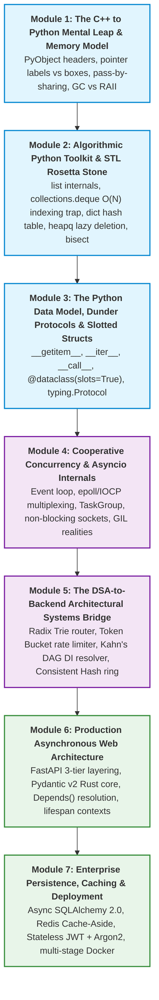

# Python Mastery for C++ Engineers: DSA & Production Backend Systems

> [!abstract] Course Overview & Operating Philosophy
> This living study guide and workout track bridges the gap between **C++ systems thinking** (cache locality, explicit pointers, RAII, deterministic memory, static compilation) and **idiomatic, high-throughput Python** (dynamic dispatch, call-by-sharing, cyclic GC, dunder protocols, asynchronous cooperative I/O).
>
> Every concept is taught from **first principles** and paired immediately with an **interactive coding challenge** that models real-world Data Structures, Algorithms, or Backend Infrastructure components.

---

## 1. The 7-Module Master Roadmap



---

## 2. C++ to Python Mental Model Mapping

### 2.1 The Memory Layout & Pointer Indirection Reality

In C++, memory layout is explicit, deterministic, and cache-aligned:
```cpp
// C++: Stack-allocated contiguous memory (12 bytes total, zero heap overhead)
struct Point { int x; int y; int z; }; 
Point pt = {1, 2, 3}; 
```

In CPython (standard 64-bit implementation):
- Variables are **never storage boxes**; they are pointers (`PyObject*`) to heap allocations.
- A standard integer `0` or `1` is a `PyLongObject` taking **28 bytes** (8B refcount + 8B type pointer + 8B `ob_size` + 4B digit array).
- Small integers in the range `[-5, 256]` are interned singletons. All other numbers allocate separate heap objects.

```
CPython Memory Layout for Container Objects (list, dict, custom classes):
+-------------------------------------------------------+
| PyGC_Head (16 bytes) [Only for cyclic GC containers]  |
| - gc_next: 8 bytes                                    |
| - gc_prev / gc_refs: 8 bytes                          |
+-------------------------------------------------------+
| PyObject Header (16 bytes)                            |
| - ob_refcnt: 8 bytes (reference counter)              |
| - ob_type:   8 bytes (pointer to PyTypeObject)        |
+-------------------------------------------------------+
| Type-specific Fields / Pointers                       |
| e.g. for PyListObject:                                |
| - ob_size:      8 bytes                               |
| - ob_item:      8 bytes (pointer to contiguous array  |
|                          of PyObject* pointers)       |
| - allocated:    8 bytes                               |
+-------------------------------------------------------+
```

> [!warning] Cache Locality Difference: C++ `std::vector<int>` vs Python `list[int]`
> - **C++ `std::vector<int>` (1M ints):** Exactly 4 MB in one contiguous buffer. Sequential iteration triggers CPU hardware prefetchers, yielding near 100% L1/L2 cache hit rates.
> - **Python `list[int]` (1M ints):** Contiguous array of 8 MB pointers pointing to 28 MB of heap-allocated `PyLongObject`s scattered across virtual memory. Iteration incurs 1M pointer dereferences and cache misses.
> - **Python Contiguous Alternatives:** When true contiguous primitive memory is needed, use `array.array('i')` from the standard library or `numpy.ndarray`.

---

### 2.2 Call-by-Sharing (Pass-by-Object-Reference)

In C++, passing semantics are chosen explicitly at the function declaration:
- `void f(vector<int> v)`: Pass-by-value (deep copy via copy constructor).
- `void f(vector<int>& v)`: Pass-by-reference (lvalue alias).
- `void f(const vector<int>& v)`: Pass-by-const-reference (read-only alias).
- `void f(vector<int>&& v)`: Pass-by-rvalue-reference (move semantics).

In Python, the evaluation strategy is strictly **Call-by-Sharing**:
1. Function arguments are passed by assigning the caller's object pointer to a local variable name in the function's stack frame.
2. **Rebinding (`=`)** changes only the local pointer; the caller's variable continues pointing to the original object:
   ```python
   def rebind(data: list[int]) -> None:
       data = [100, 200]  # Local name 'data' points to new list; caller sees NO change.
   ```
3. **In-place mutation (`.append()`, `[0] = ...`)** follows the pointer to the heap object and mutates it in place; the caller observes the change:
   ```python
   def mutate(data: list[int]) -> None:
       data.append(999)   # Modifies shared heap object; caller sees change!
   ```
4. **Slice Assignment (`[:]`)** mutates the existing buffer in-place without rebinding:
   ```python
   def replace_contents(data: list[int]) -> None:
       data[:] = [1, 2, 3] # In-place replacement of existing list items
   ```

---

### 2.3 Reference Counting & Generational GC vs C++ RAII

| Mechanism | C++ (RAII) | Python (CPython) |
|---|---|---|
| **Primary Deallocation** | Scope exit deterministically triggers destructor `~T()` | Reference counter `ob_refcnt` hits 0 |
| **Deterministic Timing** | Guaranteed at stack unwind | Guaranteed **only** if no reference cycles exist |
| **Cycle Resolution** | Developer responsibility (`std::weak_ptr`) | Tracing Generational Cyclic Garbage Collector (Gen 0, 1, 2) |
| **Destructor Safety** | Clean, predictable stack destruction | `__del__()` is non-deterministic; can break GC cycles |
| **Resource Acquisition** | Class constructor + destructor | **Context Managers (`with` / `__enter__` / `__exit__`)** |

> [!important] Never Use `__del__()` as a C++ Destructor
> If an object is involved in a cycle or an unhandled exception occurs, `__del__()` may run arbitrarily late or fail to run. In Python, **Context Managers (`with` statements)** are the canonical equivalent of RAII for files, sockets, locks, and database transactions.

---

### 2.4 The Concurrency Model: GIL, Asyncio, and Free-Threading

1. **The Global Interpreter Lock (GIL):**
   - Standard CPython uses a process-level mutex ensuring only one OS thread executes Python bytecode at any moment.
   - For CPU-bound tasks, multithreading on multiple cores is *slower* than single-threading due to lock contention. CPU parallelism requires `multiprocessing` or native C/C++/Rust extensions releasing the GIL.
   - **Python 3.13 / 3.14 Free-Threading (PEP 703):** Optional build configuration (`python3.14t`) eliminating the GIL using biased reference counting and mimalloc.
2. **I/O-Bound Concurrency & Asyncio:**
   - Rather than 10,000 OS threads consuming gigabytes of stack memory, Python backend servers use **cooperative single-threaded multiplexing** via `asyncio` over OS kernel event mechanisms (`epoll` on Linux, `kqueue` on macOS, `IOCP` on Windows).
   - In production (FastAPI / Uvicorn), high throughput is achieved using a **hybrid architecture**: a multi-process pre-fork cluster (e.g. 4–8 Uvicorn worker processes, one per CPU core), where each worker runs an event loop (`uvloop`) managing thousands of concurrent asynchronous network connections.

---

## 3. C++ STL to Python Standard Library Rosetta Stone

| C++ STL Container / Algorithm | Python Standard Library | Time Complexity | CPython Mechanics, Gotchas & Critical C++ Divergences |
|---|---|---|---|
| `std::vector<T>` | `list` | Access: $O(1)$<br>Append: Amortized $O(1)$<br>Insert/Delete: $O(N)$ | Array of pointers. Over-allocation growth factor $\approx 12.5\%$ (vs C++ 1.5x/2.0x). Slicing `a[i:j]` makes a shallow copy ($O(K)$); use `itertools.islice` for zero-copy views. |
| *Contiguous primitive buffer* | `array.array('i')` / `numpy.ndarray` | Access: $O(1)$ | Direct contiguous C memory buffer of raw values (e.g., 4-byte integers), zero `PyObject*` indirection overhead. |
| `std::deque<T>` | `collections.deque` | Push/Pop ends: $O(1)$<br>**Random access: $O(N)$** | Doubly-linked list of 64-item blocks (`BLOCKLEN = 64`). **DANGER FOR C++ DEVS:** C++ `std::deque` provides $O(1)$ random indexing. In Python, `d[i]` walks block pointers taking $O(N)$ time! Supports `maxlen` for circular ring buffers. |
| `std::unordered_map<K, V>` | `dict` | Avg: $O(1)$<br>Worst: $O(N)$ | Compact hash table: sparse hash index table + dense array of `(hash, key, value)` preserving insertion order. Missing key raises `KeyError` (unlike C++ `operator[]` auto-insertion). Keys must be hashable (`__hash__` and `__eq__`). |
| `std::unordered_map` with default | `collections.defaultdict` | Avg: $O(1)$ | Emulates C++ `operator[]` auto-vivification via a callable factory (e.g. `defaultdict(list)`, `defaultdict(int)`). |
| *Multi-set frequency map* | `collections.Counter` | Avg: $O(1)$ | Specialized dict subclass for multiset operations, frequencies, `most_common(k)`, and arithmetic set operations (`+`, `-`, `&`, `\|`). |
| `std::unordered_set<T>` | `set`, `frozenset` | Avg: $O(1)$<br>Worst: $O(N)$ | Open-addressing hash set with perturbation probing. `set` is mutable (unhashable); `frozenset` is immutable and can be used as a dict key or inside another set. |
| `std::map<K, V>` (Red-Black BST) | *No stdlib balanced BST*<br>(Use `bisect` on sorted `list` or `sortedcontainers`) | Lookup: $O(\log N)$<br>Insert: $O(N)$ in stdlib | Python intentionally does not include a balanced BST in stdlib. For competitive programming: maintain sorted `list` via `bisect.insort` ($O(N)$ shift) or use two heaps. In backend production: `pip install sortedcontainers`. |
| `std::priority_queue<T>` | `heapq` module | Heapify: $O(N)$<br>Push/Pop: $O(\log N)$ | **TRAP: Min-heap by default!** (C++ is Max-heap). Operates directly on standard `list`. To implement Max-heap, invert values (`-val`). For graph algorithms without `decrease_key`, use **Lazy Deletion** or **Entry Finder** pattern. |
| `std::lower_bound` | `bisect.bisect_left` | $O(\log N)$ | Finds first insertion index where item $\ge x$. Supports `key=` transformation callable since Python 3.10. |
| `std::upper_bound` | `bisect.bisect_right` | $O(\log N)$ | Finds first insertion index where item $> x$. |
| `std::pair` / `std::tuple` | `tuple`, `namedtuple`, `@dataclass(slots=True)` | $O(1)$ | Standard `tuple` is immutable. `namedtuple` adds named field access. `@dataclass(slots=True)` eliminates `__dict__` ($56 \text{ bytes}$ for 3 fields vs $344 \text{ bytes}$). |
| `std::string` | `str` | Concat: $O(N)$ | Strings are strictly **immutable**. C++ `s += c` modifies in-place. In Python, repeatedly doing `s += c` creates new strings ($O(N^2)$ time). Idiomatic Python: accumulate in a `list` and call `"".join(lst)`. |

---

## 4. The DSA to Backend Architectural Systems Bridge

Here is the exact code mapping showing how classic computer science algorithms power core backend components:

### 4.1 HTTP URL Router via Radix / Prefix Trie
Modern routers match URL segments using a Trie rather than evaluating hundreds of sequential regular expressions:

```python
class TrieNode:
    def __init__(self):
        self.children: dict[str, TrieNode] = {}
        self.param_child: tuple[str, TrieNode] | None = None  # (param_name, node)
        self.handler: str | None = None

class RadixURLRouter:
    def __init__(self):
        self.root = TrieNode()

    def add_route(self, path: str, handler: str) -> None:
        segments = [s for s in path.strip("/").split("/") if s]
        curr = self.root
        for seg in segments:
            if seg.startswith("{") and seg.endswith("}"):
                param_name = seg[1:-1]
                if not curr.param_child:
                    curr.param_child = (param_name, TrieNode())
                curr = curr.param_child[1]
            else:
                curr = curr.children.setdefault(seg, TrieNode())
        curr.handler = handler

    def resolve(self, path: str) -> tuple[str | None, dict[str, str]]:
        segments = [s for s in path.strip("/").split("/") if s]
        curr = self.root
        params: dict[str, str] = {}

        for seg in segments:
            if seg in curr.children:
                curr = curr.children[seg]
            elif curr.param_child:
                param_name, next_node = curr.param_child
                params[param_name] = seg
                curr = next_node
            else:
                return None, {}
        return curr.handler, params
```

### 4.2 API Rate Limiting: Token Bucket Algorithm
Provides $O(1)$ space and $O(1)$ time per client, smoothly allowing bursts while enforcing steady replenishment:

```python
import time

class TokenBucketRateLimiter:
    def __init__(self, capacity: float, refill_rate_per_sec: float):
        self.capacity = float(capacity)
        self.refill_rate = float(refill_rate_per_sec)
        self.buckets: dict[str, tuple[float, float]] = {}  # client_id -> (tokens, last_refill)

    def allow_request(self, client_id: str, tokens_needed: float = 1.0, current_time: float | None = None) -> bool:
        now = current_time if current_time is not None else time.time()
        
        if client_id not in self.buckets:
            self.buckets[client_id] = (self.capacity, now)

        tokens, last_refill = self.buckets[client_id]
        elapsed = max(0.0, now - last_refill)
        tokens = min(self.capacity, tokens + elapsed * self.refill_rate)

        if tokens >= tokens_needed:
            self.buckets[client_id] = (tokens - tokens_needed, now)
            return True
        else:
            self.buckets[client_id] = (tokens, now)
            return False
```

### 4.3 Dependency Injection Resolution via DAG & Kahn's Topological Sort
FastAPI's `Depends()` resolver analyzes the dependency graph between functions and models, computes the topological execution order, and detects circular dependency deadlocks:

```python
from collections import defaultdict, deque

def resolve_di_execution_order(dependency_graph: dict[str, list[str]]) -> list[str]:
    """
    dependency_graph: mapping from node -> list of dependencies required by node.
    Returns: Valid topological execution sequence (dependencies executed before dependents).
    Raises: ValueError on circular dependency.
    """
    in_degree = {node: 0 for node in dependency_graph}
    reverse_adj = defaultdict(list)

    for node, deps in dependency_graph.items():
        in_degree[node] = len(deps)
        for dep in deps:
            if dep not in in_degree:
                in_degree[dep] = 0
            reverse_adj[dep].append(node)

    queue = deque([node for node, deg in in_degree.items() if deg == 0])
    execution_order: list[str] = []

    while queue:
        curr = queue.popleft()
        execution_order.append(curr)
        for dependent in reverse_adj[curr]:
            in_degree[dependent] -= 1
            if in_degree[dependent] == 0:
                queue.append(dependent)

    if len(execution_order) != len(in_degree):
        raise ValueError("Circular dependency detected in Dependency Injection graph!")

    return execution_order
```

### 4.4 Distributed Cache Sharding via Consistent Hash Ring (`bisect`)
Prevents catastrophic cache invalidation when scaling Redis or Memcached clusters:

```python
import bisect
import hashlib

class ConsistentHashRing:
    def __init__(self, replicas: int = 100):
        self.replicas = replicas
        self.ring: list[int] = []
        self.node_map: dict[int, str] = {}

    def _hash(self, key: str) -> int:
        return int(hashlib.md5(key.encode("utf-8")).hexdigest(), 16)

    def add_node(self, physical_node: str) -> None:
        for i in range(self.replicas):
            vnode_key = f"{physical_node}#vnode{i}"
            h = self._hash(vnode_key)
            bisect.insort(self.ring, h)
            self.node_map[h] = physical_node

    def get_node(self, key: str) -> str:
        if not self.ring:
            raise ValueError("No cache nodes registered on ring")
        h = self._hash(key)
        idx = bisect.bisect_right(self.ring, h)
        if idx == len(self.ring):
            idx = 0
        return self.node_map[self.ring[idx]]
```

---

## 5. Production Asynchronous Backend Architecture

```
HTTP Client (Browser / Mobile / Microservice)
             │
             ▼ JSON / HTTP
┌─────────────────────────────────────────────────────────────┐
│ 1. TRANSPORT LAYER (Routers & Controllers)                 │
│    - FastAPI APIRouters                                     │
│    - Request / Response validation via Pydantic v2 Schemas  │
│    - Cookie / Bearer Token extraction & Dependency Injection │
└────────────────────────────┬────────────────────────────────┘
                             │ Domain DTOs
                             ▼
┌─────────────────────────────────────────────────────────────┐
│ 2. DOMAIN / SERVICE LAYER (Business Logic)                  │
│    - Pure Python domain rules & state transitions           │
│    - Transaction orchestration (Unit of Work)               │
│    - Completely decoupled from HTTP frameworks & SQL        │
└────────────────────────────┬────────────────────────────────┘
                             │ Domain Entities
                             ▼
┌─────────────────────────────────────────────────────────────┐
│ 3. DATA ACCESS LAYER (Persistence & Caching)               │
│    - SQLAlchemy 2.0 AsyncSession + asyncpg                  │
│    - Asynchronous Redis Client (Cache-Aside Pattern)        │
│    - Encapsulated database queries & connection pooling     │
└─────────────────────────────────────────────────────────────┘
```

---

## 6. The 2-Minute Bite-Sized Practice Gym (26 Discrete Mechanics)

> [!abstract] How to Use This Gym
> Each practice puzzle isolates a single language mechanic or backend pattern.
> 1. Read the **First-Principles Concept** and the **C++ Mental Model Bridge**.
> 2. Copy the **Clean Starter Code** into your Python REPL or script.
> 3. Implement the `# TODO` comment (usually 1 to 4 lines of code).
> 4. Run the embedded **Verification Test Suite** (`assert ...`). If all assertions pass, you have mastered the mechanic!
> 5. Expand the collapsible solution to read the **Architectural Insight**.

---

### Track A: Production Backend Engineering Paradigms (Paradigms 1–12)

#### Paradigm 1: Asynchronous Route Guard Decorator (`functools.wraps`)
- **First Principles:** In modern Python backends, route handlers are asynchronous coroutines (`async def`). Middleware decorators wrap these handlers to enforce RBAC permissions, timing, or distributed tracing. The inner wrapper must be `async def` and `await` the wrapped coroutine while `functools.wraps` copies `__name__`, `__doc__`, and `__annotations__` to preserve framework introspection.
- **C++ Mental Bridge:** In C++, function wrapping requires templates or `std::function` composition. In Python, `@decorator` is syntactic sugar for `f = decorator(f)` evaluated at module import.

```python
# --- STARTER CODE ---
import asyncio
from functools import wraps

def require_role(expected_role: str):
    def decorator(func):
        @wraps(func)
        async def wrapper(user: dict, *args, **kwargs):
            # TODO: Inspect user.get("role"). If it does not match expected_role,
            # raise PermissionError("Forbidden: Insufficient privileges").
            # Otherwise, await and return func(user, *args, **kwargs).
            raise NotImplementedError("Implement require_role wrapper")
        return wrapper
    return decorator

# --- VERIFICATION TEST SUITE ---
@require_role("admin")
async def purge_cache_endpoint(user: dict, partition: str) -> str:
    await asyncio.sleep(0.001)  # Simulate non-blocking I/O
    return f"Purged {partition} by {user['name']}"

async def run_tests():
    admin = {"name": "Alice", "role": "admin"}
    viewer = {"name": "Bob", "role": "viewer"}
    
    res = await purge_cache_endpoint(admin, "shard_1")
    assert res == "Purged shard_1 by Alice", f"Unexpected result: {res}"
    
    try:
        await purge_cache_endpoint(viewer, "shard_1")
        assert False, "Should have raised PermissionError for viewer!"
    except PermissionError as err:
        assert "Forbidden" in str(err)
    print("✓ Paradigm 1 Passed: Async Route Guard Decorator")

asyncio.run(run_tests())
```

<details>
<summary><b>Click for Reference Solution & Architectural Insight</b></summary>

```python
def require_role(expected_role: str):
    def decorator(func):
        @wraps(func)
        async def wrapper(user: dict, *args, **kwargs):
            if user.get("role") != expected_role:
                raise PermissionError("Forbidden: Insufficient privileges")
            return await func(user, *args, **kwargs)
        return wrapper
    return decorator
```
*Architectural Insight:* If `wrapper` were defined as synchronous `def`, calling `purge_cache_endpoint` would return an unawaited coroutine object to the HTTP server, bypassing authentication completely and causing downstream serialization crashes.
</details>

---

#### Paradigm 2: Database Cursor & Chunk Streaming (`yield` and `yield from`)
- **First Principles:** When exporting 500,000 records from PostgreSQL, materializing the entire list into memory causes Out-Of-Memory (OOM) crashes. Python generators maintain execution state on the heap with $O(1)$ memory, yielding records in batches. `yield from` transparently delegates iteration to an inner sub-generator.
- **C++ Mental Bridge:** Equivalent to C++20 `std::generator<T>` or forward stream iterators. Calling `yield` suspends the activation frame without destroying local variables.

```python
# --- STARTER CODE ---
def fetch_paged_data(pages: list[list[str]]):
    """Simulates fetching pages from a remote cursor and flattening them."""
    # TODO: Using `yield from`, iterate over `pages` and delegate yielding 
    # of individual items from each page in O(1) auxiliary memory.
    raise NotImplementedError("Implement fetch_paged_data using yield from")

# --- VERIFICATION TEST SUITE ---
db_pages = [["user_1", "user_2"], ["user_3", "user_4"], ["user_5"]]
stream = fetch_paged_data(db_pages)
assert next(stream) == "user_1"
assert list(stream) == ["user_2", "user_3", "user_4", "user_5"]
print("✓ Paradigm 2 Passed: Database Cursor Streaming with yield from")
```

<details>
<summary><b>Click for Reference Solution & Architectural Insight</b></summary>

```python
def fetch_paged_data(pages: list[list[str]]):
    for page in pages:
        yield from page
```
*Architectural Insight:* `yield from iterable` is not just syntactic sugar for `for item in iterable: yield item`; it sets up a transparent bidirectional communication channel, passing values, exceptions (`.throw()`), and return values directly between the caller and the sub-generator.
</details>

---

#### Paradigm 3: Server-Sent Events (SSE) via Async Generators (`async for`)
- **First Principles:** Real-time push protocols (SSE, WebSocket broadcasts, LLM token streaming) use asynchronous generators (`async def` with `yield`). This yields HTTP response chunks without holding an OS thread or blocking the event loop.
- **C++ Mental Bridge:** Asynchronous coroutine generator yielding frames over an event-driven socket (`epoll` / `IOCP`).

```python
# --- STARTER CODE ---
import asyncio

async def sse_event_stream(events: list[dict]):
    """
    Format each event dictionary as a standard SSE chunk:
    "event: <type>\ndata: <payload>\n\n"
    """
    # TODO: Asynchronously loop over `events`.
    # Await asyncio.sleep(0.001) to simulate async I/O.
    # Yield formatted SSE string.
    raise NotImplementedError("Implement sse_event_stream")

# --- VERIFICATION TEST SUITE ---
async def test_sse():
    payloads = [
        {"type": "status", "payload": "healthy"},
        {"type": "telemetry", "payload": "cpu=45%"}
    ]
    chunks = [chunk async for chunk in sse_event_stream(payloads)]
    assert chunks[0] == "event: status\ndata: healthy\n\n"
    assert chunks[1] == "event: telemetry\ndata: cpu=45%\n\n"
    print("✓ Paradigm 3 Passed: SSE Streaming via Async Generators")

asyncio.run(test_sse())
```

<details>
<summary><b>Click for Reference Solution & Architectural Insight</b></summary>

```python
async def sse_event_stream(events: list[dict]):
    for ev in events:
        await asyncio.sleep(0.001)
        yield f"event: {ev['type']}\ndata: {ev['payload']}\n\n"
```
*Architectural Insight:* In FastAPI, returning `StreamingResponse(sse_event_stream(...), media_type="text/event-stream")` consumes this async generator chunk-by-chunk using HTTP/1.1 chunked transfer encoding.
</details>

---

#### Paradigm 4: Transactional Unit of Work via Class Context Manager (`__enter__` / `__exit__`)
- **First Principles:** The Python Data Model implements deterministic resource lifecycles through `with` statements. `__enter__` acquires resources (opens connection, begins transaction); `__exit__` receives any unhandled exception `(exc_type, exc_val, exc_tb)`. If `exc_type` is not `None`, it rolls back; otherwise, it commits.
- **C++ Mental Bridge:** Python's explicit implementation of **RAII**. In C++, destructors run at stack unwinding. In Python, `__del__` is non-deterministic; `with` blocks are the only guaranteed boundary for deterministic finalization.

```python
# --- STARTER CODE ---
class MockSession:
    def __init__(self):
        self.state = "idle"

class TransactionManager:
    def __init__(self, session: MockSession):
        self.session = session

    def __enter__(self):
        self.session.state = "in_transaction"
        return self.session

    def __exit__(self, exc_type, exc_val, exc_tb):
        # TODO: If an exception occurred (exc_type is not None):
        #   Set self.session.state = "rolled_back"
        #   Return False (do NOT suppress the exception; let it bubble up!)
        # Otherwise:
        #   Set self.session.state = "committed"
        #   Return True
        raise NotImplementedError("Implement __exit__ transaction logic")

# --- VERIFICATION TEST SUITE ---
sess1 = MockSession()
with TransactionManager(sess1):
    assert sess1.state == "in_transaction"
assert sess1.state == "committed"

sess2 = MockSession()
try:
    with TransactionManager(sess2):
        raise ValueError("Simulated DB conflict")
except ValueError:
    pass
assert sess2.state == "rolled_back"
print("✓ Paradigm 4 Passed: Class-based Context Manager RAII")
```

<details>
<summary><b>Click for Reference Solution & Architectural Insight</b></summary>

```python
class TransactionManager:
    def __init__(self, session: MockSession):
        self.session = session

    def __enter__(self):
        self.session.state = "in_transaction"
        return self.session

    def __exit__(self, exc_type, exc_val, exc_tb):
        if exc_type is not None:
            self.session.state = "rolled_back"
            return False  # Propagate exception
        self.session.state = "committed"
        return True
```
*Architectural Insight:* Returning `True` from `__exit__` suppresses the exception. In transactional systems, you must return `False` (or `None`) so HTTP controllers can catch the error and translate it to an HTTP 409 Conflict or 500 Internal Error.
</details>

---

#### Paradigm 5: Asynchronous Context Managers (`__aenter__` / `__aexit__`)
- **First Principles:** In asynchronous frameworks (SQLAlchemy async, Redis `aioredis`, `asyncpg`), acquiring a pooled socket connection and releasing it back to the pool are asynchronous operations. Synchronous `__enter__` cannot `await`; `__aenter__` and `__aexit__` allow non-blocking resource acquisition and release via `async with`.
- **C++ Mental Bridge:** Asynchronous RAII lock/lease acquisition where both constructor acquisition and destructor release require awaiting OS completion handles.

```python
# --- STARTER CODE ---
import asyncio

class AsyncDistributedLock:
    def __init__(self, resource_id: str):
        self.resource_id = resource_id
        self.locked = False

    async def __aenter__(self):
        await asyncio.sleep(0.001)  # Simulate network call to Redis SETNX
        self.locked = True
        return self

    async def __aexit__(self, exc_type, exc_val, exc_tb):
        # TODO: Await asyncio.sleep(0.001) (Simulate Redis DEL)
        # Set self.locked = False
        raise NotImplementedError("Implement __aexit__")

# --- VERIFICATION TEST SUITE ---
async def test_lock():
    lock = AsyncDistributedLock("order_99")
    async with lock as active_lock:
        assert active_lock.locked is True
    assert lock.locked is False
    print("✓ Paradigm 5 Passed: Asynchronous Context Manager")

asyncio.run(test_lock())
```

<details>
<summary><b>Click for Reference Solution & Architectural Insight</b></summary>

```python
    async def __aexit__(self, exc_type, exc_val, exc_tb):
        await asyncio.sleep(0.001)
        self.locked = False
```
*Architectural Insight:* This is identical to how `async with async_session_factory() as session:` manages database transactions in modern production backends.
</details>

---

#### Paradigm 6: Signature Boundaries (`/`, `*`, `*args`, `**kwargs`)
- **First Principles:** Backend libraries require strict API stability. Python provides:
  - Positional-only parameters (`/`): Arguments before `/` cannot be called via keywords (preventing caller coupling to internal parameter names).
  - Keyword-only parameters (`*`): Arguments after `*` must be passed as explicit keywords (preventing boolean flag confusion like `update(1, True, False, True)`).
- **C++ Mental Bridge:** In C++, function signatures strictly enforce argument positions; named arguments do not exist. Python's `/` and `*` allow library authors to achieve both C-style positional rigidity and explicit keyword clarity.

```python
# --- STARTER CODE ---
def execute_rpc(endpoint: str, /, timeout_ms: int = 1000, *, secure: bool = True, **metadata) -> dict:
    """
    Requirements:
    - `endpoint` MUST be positional-only (cannot be passed as endpoint='/api')
    - `timeout_ms` can be positional or keyword
    - `secure` MUST be keyword-only
    - `metadata` captures any extra keyword attributes
    """
    # TODO: Return a dictionary with keys: 'endpoint', 'timeout_ms', 'secure', 'meta'
    raise NotImplementedError("Implement execute_rpc")

# --- VERIFICATION TEST SUITE ---
res = execute_rpc("/v1/charge", 500, secure=True, idempotency_key="abc")
assert res == {"endpoint": "/v1/charge", "timeout_ms": 500, "secure": True, "meta": {"idempotency_key": "abc"}}

# Verify Positional-Only constraint
try:
    execute_rpc(endpoint="/v1/charge")
    assert False, "endpoint must not be passed by keyword!"
except TypeError:
    pass

# Verify Keyword-Only constraint
try:
    execute_rpc("/v1/charge", 500, True)
    assert False, "secure must be passed by keyword!"
except TypeError:
    pass
print("✓ Paradigm 6 Passed: Positional-Only and Keyword-Only Signatures")
```

<details>
<summary><b>Click for Reference Solution & Architectural Insight</b></summary>

```python
def execute_rpc(endpoint: str, /, timeout_ms: int = 1000, *, secure: bool = True, **metadata) -> dict:
    return {
        "endpoint": endpoint,
        "timeout_ms": timeout_ms,
        "secure": secure,
        "meta": metadata
    }
```
*Architectural Insight:* In production libraries (like FastAPI or SQLAlchemy), positional-only parameters allow developers to rename internal argument names in future releases without breaking clients.
</details>

---

#### Paradigm 7: State Encapsulation via Closures & `nonlocal`
- **First Principles:** A closure is a function that remembers values from its enclosing lexical scope even after the outer function has returned. When mutating an immutable primitive (like an integer counter) in the outer scope, `nonlocal` binds the name to the outer activation record rather than creating a local variable.
- **C++ Mental Bridge:** Direct equivalent of a C++ lambda capturing variables by reference `[&counter]() { ... }`.

```python
# --- STARTER CODE ---
def make_quota_guard(max_requests: int):
    used = 0
    # TODO: Define and return an inner function `consume(cost: int = 1) -> bool`.
    # It checks if (used + cost) <= max_requests.
    # If yes, it increments `used` by `cost` and returns True.
    # If no, it returns False without mutating `used`.
    # Hint: Use `nonlocal used`!
    raise NotImplementedError("Implement make_quota_guard")

# --- VERIFICATION TEST SUITE ---
guard = make_quota_guard(5)
assert guard(2) is True   # used = 2
assert guard(2) is True   # used = 4
assert guard(2) is False  # rejected: 4 + 2 > 5
assert guard(1) is True   # used = 5
assert guard(1) is False  # rejected
print("✓ Paradigm 7 Passed: Lexical Scope & nonlocal Closures")
```

<details>
<summary><b>Click for Reference Solution & Architectural Insight</b></summary>

```python
def make_quota_guard(max_requests: int):
    used = 0
    def consume(cost: int = 1) -> bool:
        nonlocal used
        if used + cost <= max_requests:
            used += cost
            return True
        return False
    return consume
```
*Architectural Insight:* Closures avoid the overhead of defining a full Python class with `__init__` and instance dictionary (`__dict__`) when you only need a lightweight stateful callable.
</details>

---

#### Paradigm 8: Pre-Bound Task Payloads (`functools.partial`)
- **First Principles:** In distributed task queues (Celery, RQ, AWS SQS workers), worker functions are often configured in advance with environment dependencies (e.g. `db_uri`, `region`, `retry_limit`) before being serialized or queued. `functools.partial` freezes a subset of arguments and returns a new callable.
- **C++ Mental Bridge:** Direct equivalent of C++20 `std::bind_front` or `std::bind`.

```python
# --- STARTER CODE ---
from functools import partial

def dispatch_notification(service: str, region: str, user_id: str, message: str) -> str:
    return f"[{service}:{region}] Sent to {user_id}: {message}"

# TODO: Using `partial`, construct `eu_email_dispatcher` which pre-binds:
# service = "EmailService"
# region = "eu-central-1"
# It should accept (user_id, message) as arguments.
eu_email_dispatcher = None

# --- VERIFICATION TEST SUITE ---
assert eu_email_dispatcher is not None, "eu_email_dispatcher must be instantiated"
res = eu_email_dispatcher("usr_42", "Welcome to the platform!")
assert res == "[EmailService:eu-central-1] Sent to usr_42: Welcome to the platform!"
print("✓ Paradigm 8 Passed: Currying with functools.partial")
```

<details>
<summary><b>Click for Reference Solution & Architectural Insight</b></summary>

```python
eu_email_dispatcher = partial(dispatch_notification, "EmailService", "eu-central-1")
```
*Architectural Insight:* `partial` objects are written in C inside CPython (`functoolsmodule.c`). They execute faster and consume less memory than defining an equivalent Python wrapper function.
</details>

---

#### Paradigm 9: Type-Based Polymorphic Dispatch (`functools.singledispatch`)
- **First Principles:** C++ developers frequently use function overloading (`void process(int)`, `void process(std::string)`). In Python, defining two functions with the same name simply overwrites the first. Python's standard library solution for polymorphic dispatch based on the type of the first argument is `@functools.singledispatch`.
- **C++ Mental Bridge:** Python's standard library answer to **C++ Function Overloading / Static Polymorphism**.

```python
# --- STARTER CODE ---
from functools import singledispatch

@singledispatch
def serialize_event_payload(payload) -> str:
    """Base generic fallback."""
    raise TypeError(f"Cannot serialize payload of type: {type(payload)}")

# TODO:
# 1. Register a handler for `dict` that returns f"JSON_DICT: {len(payload)} keys"
# 2. Register a handler for `str` that returns f"RAW_TEXT: {payload.strip()}"
# 3. Register a handler for `int` that returns f"METRIC_CODE: {payload:04d}"

# --- VERIFICATION TEST SUITE ---
assert serialize_event_payload({"a": 1, "b": 2}) == "JSON_DICT: 2 keys"
assert serialize_event_payload("  login_success  ") == "RAW_TEXT: login_success"
assert serialize_event_payload(7) == "METRIC_CODE: 0007"
try:
    serialize_event_payload([1, 2, 3])
    assert False, "Should raise TypeError for unsupported list"
except TypeError:
    pass
print("✓ Paradigm 9 Passed: Polymorphic Dispatch via singledispatch")
```

<details>
<summary><b>Click for Reference Solution & Architectural Insight</b></summary>

```python
@serialize_event_payload.register(dict)
def _(payload: dict) -> str:
    return f"JSON_DICT: {len(payload)} keys"

@serialize_event_payload.register(str)
def _(payload: str) -> str:
    return f"RAW_TEXT: {payload.strip()}"

@serialize_event_payload.register(int)
def _(payload: int) -> str:
    return f"METRIC_CODE: {payload:04d}"
```
*Architectural Insight:* `@singledispatch` maintains an internal dictionary mapping types to functions, supporting inheritance hierarchies (subclasses automatically resolve to the parent class's handler unless explicitly overridden).
</details>

---

#### Paradigm 10: In-Memory Idempotency & Lookups (`functools.lru_cache`)
- **First Principles:** Heavy database queries for static data (tax rates, tenant permission masks, geo-ip blocks) can bottleneck an API. `@functools.lru_cache` wraps a pure function with a thread-safe Least-Recently-Used hash table cache. All arguments must be hashable.
- **C++ Mental Bridge:** Equivalent to an `std::unordered_map` memoization table wrapped with a doubly-linked eviction list.

```python
# --- STARTER CODE ---
from functools import lru_cache

fetch_count = 0

# TODO: Decorate `load_tenant_config` with `@lru_cache(maxsize=32)`
def load_tenant_config(tenant_id: str, environment: str) -> dict:
    global fetch_count
    fetch_count += 1
    # Simulated expensive remote query
    return {"tenant": tenant_id, "env": environment, "max_connections": 100}

# --- VERIFICATION TEST SUITE ---
# First call: computes and increments fetch_count
res1 = load_tenant_config("acme", "prod")
assert fetch_count == 1

# Second call with identical arguments: returns cached reference!
res2 = load_tenant_config("acme", "prod")
assert fetch_count == 1
assert res1 is res2, "Should return cached reference"

# Different argument: computes
load_tenant_config("acme", "staging")
assert fetch_count == 2
print("✓ Paradigm 10 Passed: In-Memory Caching via lru_cache")
```

<details>
<summary><b>Click for Reference Solution & Architectural Insight</b></summary>

```python
@lru_cache(maxsize=32)
def load_tenant_config(tenant_id: str, environment: str) -> dict:
    global fetch_count
    fetch_count += 1
    return {"tenant": tenant_id, "env": environment, "max_connections": 100}
```
*Architectural Insight:* In Python 3.9+, if you do not need size-bounded eviction, `@functools.cache` is an unbounded, faster alias for `lru_cache(maxsize=None)`.
</details>

---

#### Paradigm 11: Dependency Injection Teardown with Exception Unwinding (`gen.throw`)
- **First Principles:** In frameworks like FastAPI (`Depends(get_db)`), a dependency function yields a resource (e.g. database transaction). The framework pauses the generator, passes the resource to the route, and later resumes the generator. **Crucial Mechanism:** If the route handler throws an exception, the injector MUST inject that exception back into the generator via `gen.throw(exc)` to trigger the generator's `except Exception:` rollback logic!
- **C++ Mental Bridge:** Inverting control across coroutine boundaries while guaranteeing that C++ stack unwinding / catch blocks fire properly.

```python
# --- STARTER CODE ---
def get_db_session():
    """Dependency generator that provides a DB session and guarantees rollback on error."""
    session = {"status": "open", "rolled_back": False, "committed": False}
    try:
        yield session
        session["committed"] = True
    except Exception:
        session["rolled_back"] = True
        raise
    finally:
        session["status"] = "closed"

def execute_with_di(dep_generator_fn, route_handler):
    """
    Executes route_handler with the resource yielded by dep_generator_fn.
    Requirements:
    1. Advance generator to extract yielded resource.
    2. Try to execute route_handler(resource) and advance generator to completion.
    3. If route_handler raises an exception:
       Inject the exception into the generator using `gen.throw(exc)`.
       Then re-raise the exception!
    """
    gen = dep_generator_fn()
    resource = next(gen)
    # TODO: Implement try...except unwinding using gen.throw()
    raise NotImplementedError("Implement execute_with_di")

# --- VERIFICATION TEST SUITE ---
# Test 1: Successful Route
def route_ok(db):
    assert db["status"] == "open"
    return "ok"

sess = None
def intercepting_dep():
    global sess
    gen = get_db_session()
    sess = next(gen)
    try:
        yield sess
    finally:
        pass

res = execute_with_di(get_db_session, route_ok)
assert res == "ok"

# Test 2: Failing Route triggering Rollback
def route_crashed(db):
    raise RuntimeError("Query timed out!")

try:
    execute_with_di(get_db_session, route_crashed)
    assert False, "Should have propagated RuntimeError"
except RuntimeError:
    pass
print("✓ Paradigm 11 Passed: Dependency Injection Engine with gen.throw")
```

<details>
<summary><b>Click for Reference Solution & Architectural Insight</b></summary>

```python
def execute_with_di(dep_generator_fn, route_handler):
    gen = dep_generator_fn()
    resource = next(gen)
    try:
        result = route_handler(resource)
        # Success path: advance generator to completion
        next(gen, None)
        return result
    except Exception as exc:
        # Failure path: inject exception back into generator stack frame!
        try:
            gen.throw(exc)
        except StopIteration:
            pass
        raise
```
*Architectural Insight:* Without `gen.throw(exc)`, Python generators cannot detect that a caller raised an error, causing database rollbacks and cleanup handlers inside dependency generators to be silently bypassed.
</details>

---

#### Paradigm 12: Structured Concurrency & Thread Offloading (`TaskGroup` & `to_thread`)
- **First Principles:**
  1. `asyncio.TaskGroup` (Python 3.11+): Guarantees structured concurrency. If one concurrent task fails, all other sibling tasks in the group are immediately cancelled, preventing dangling orphan tasks.
  2. `asyncio.to_thread`: Executes synchronous, CPU-bound, or blocking C++ routines in Python's default `ThreadPoolExecutor` without freezing the async event loop.
- **C++ Mental Bridge:** `TaskGroup` corresponds to structured task scopes (like C++ `std::experimental::task_group`), and `to_thread` corresponds to dispatching work onto a thread pool via `std::async(std::launch::async, ...)`.

```python
# --- STARTER CODE ---
import asyncio
import time

def sync_cpu_heavy_hash(data: str) -> str:
    """Simulates CPU-heavy password hashing (e.g. bcrypt/argon2)."""
    time.sleep(0.005)
    return f"HASH_{data}"

async def fetch_profile(user_id: str) -> dict:
    await asyncio.sleep(0.001)
    return {"id": user_id, "name": "Alice"}

async def aggregate_user_data(user_id: str, raw_pwd: str) -> dict:
    """
    Requirements:
    1. Use `asyncio.TaskGroup()` to concurrently:
       - Run fetch_profile(user_id)
       - Run sync_cpu_heavy_hash(raw_pwd) offloaded via `asyncio.to_thread()`
    2. Await both to finish and return dict: {"profile": ..., "pwd_hash": ...}
    """
    # TODO: Implement TaskGroup and asyncio.to_thread
    raise NotImplementedError("Implement aggregate_user_data")

# --- VERIFICATION TEST SUITE ---
async def test_concurrency():
    res = await aggregate_user_data("usr_101", "my_secret_password")
    assert res["profile"] == {"id": "usr_101", "name": "Alice"}
    assert res["pwd_hash"] == "HASH_my_secret_password"
    print("✓ Paradigm 12 Passed: Structured Concurrency & Thread Offloading")

asyncio.run(test_concurrency())
```

<details>
<summary><b>Click for Reference Solution & Architectural Insight</b></summary>

```python
async def aggregate_user_data(user_id: str, raw_pwd: str) -> dict:
    async with asyncio.TaskGroup() as tg:
        task1 = tg.create_task(fetch_profile(user_id))
        task2 = tg.create_task(asyncio.to_thread(sync_cpu_heavy_hash, raw_pwd))
    
    return {
        "profile": task1.result(),
        "pwd_hash": task2.result()
    }
```
*Architectural Insight:* Never call synchronous blocking I/O or heavy CPU functions directly inside an `async def` route handler without `to_thread`. If you do, the single-threaded event loop pauses for every connected client.
</details>

---

### Track B: Core Idiomatic Language & Algorithmic Mechanics (Mechanics 1–14)

#### Mechanic 1: Extended Structural Unpacking & Dictionary Merging
- **First Principles:** Starred unpacking (`*rest`) captures arbitrary elements in an iterable into a list. Double-starred unpacking (`**dict`) unpacks key-value pairs into a new dictionary mapping.
- **C++ Bridge:** Replaces C++ structured bindings `auto [a, b, c] = tuple` and eliminates manual vector slicing or map merging loops.

```python
# --- STARTER CODE ---
def parse_http_header(header_tokens: list[str], default_headers: dict) -> tuple[str, list[str], dict]:
    """
    `header_tokens` has format: [METHOD, PATH, *FLAGS, PROTOCOL]
    e.g., ["GET", "/api/v1", "secure", "gzip", "HTTP/1.1"]
    
    Requirements:
    1. Unpack `header_tokens` so:
       - `method` receives the first item
       - `path` receives the second item
       - `flags` receives a list of all middle items
       - `proto` receives the last item
    2. Build `effective_headers` by merging `default_headers` with {"proto": proto, "method": method}
       using dict unpacking (**).
    3. Return (method, flags, effective_headers)
    """
    # TODO: Implement in 2-3 lines
    raise NotImplementedError("Implement parse_http_header")

# --- VERIFICATION TEST SUITE ---
tokens = ["POST", "/orders", "auth_bearer", "compressed", "HTTP/2.0"]
defaults = {"keep-alive": "true", "proto": "HTTP/1.1"}

method, flags, headers = parse_http_header(tokens, defaults)
assert method == "POST"
assert flags == ["auth_bearer", "compressed"]
assert headers == {"keep-alive": "true", "proto": "HTTP/2.0", "method": "POST"}
print("✓ Mechanic 1 Passed: Extended Unpacking & Merging")
```

<details>
<summary><b>Click for Reference Solution & Architectural Insight</b></summary>

```python
def parse_http_header(header_tokens: list[str], default_headers: dict) -> tuple[str, list[str], dict]:
    method, path, *flags, proto = header_tokens
    effective_headers = {**default_headers, "proto": proto, "method": method}
    return method, flags, effective_headers
```
</details>

---

#### Mechanic 2: In-Place Slice Mutation vs. Shallow Copying
- **First Principles:** Slicing on the right-hand side (`b = a[:]`) creates a new list object (shallow copy). Slicing on the left-hand side (`a[1:3] = [99, 88]`) modifies the existing array buffer **in-place** without changing the pointer identity (`id(a)`).
- **C++ Bridge:** In C++, `std::vector` requires `.erase()` followed by `.insert()`. In Python, slice assignment can shrink, grow, or replace any subarray in place with a single bytecode instruction.

```python
# --- STARTER CODE ---
def splice_buffer_inplace(buffer: list[int], start: int, end: int, replacements: list[int]) -> None:
    """
    Replaces the slice buffer[start:end] with `replacements` IN-PLACE.
    Must not re-allocate or re-bind the `buffer` variable.
    """
    # TODO: One-line slice assignment
    raise NotImplementedError("Implement in-place slice mutation")

# --- VERIFICATION TEST SUITE ---
buf = [10, 20, 30, 40, 50]
orig_id = id(buf)
splice_buffer_inplace(buf, 1, 4, [999, 888])  # replaces [20, 30, 40] with [999, 888]

assert buf == [10, 999, 888, 50], f"Got: {buf}"
assert id(buf) == orig_id, "Buffer identity must not change!"
print("✓ Mechanic 2 Passed: In-Place Slice Mutation")
```

<details>
<summary><b>Click for Reference Solution & Architectural Insight</b></summary>

```python
def splice_buffer_inplace(buffer: list[int], start: int, end: int, replacements: list[int]) -> None:
    buffer[start:end] = replacements
```
</details>

---

#### Mechanic 3: Comprehensions vs. Lazy Generator Expressions
- **First Principles:** List comprehensions `[x for x in seq]` allocate a complete list in memory immediately. Generator expressions `(x for x in seq)` return a lazy iterator with $O(1)$ memory overhead, computing items only when requested.
- **C++ Bridge:** Generator expressions are equivalent to C++20 views (`std::views::transform` / `std::views::filter`).

```python
# --- STARTER CODE ---
import sys

def get_lazy_squared_evens(limit: int):
    """
    Return a generator expression (NOT a list!) yielding squares of even numbers up to limit.
    Memory consumption must remain O(1) regardless of limit size!
    """
    # TODO: Return a generator expression
    raise NotImplementedError("Implement get_lazy_squared_evens")

# --- VERIFICATION TEST SUITE ---
gen = get_lazy_squared_evens(1_000_000)
assert not isinstance(gen, list), "Must return a generator, not a materialized list!"
assert next(gen) == 0   # 0^2
assert next(gen) == 4   # 2^2
assert next(gen) == 16  # 4^2
assert sys.getsizeof(gen) < 256, "Generator must consume minimal memory"
print("✓ Mechanic 3 Passed: Lazy Generator Expressions")
```

<details>
<summary><b>Click for Reference Solution & Architectural Insight</b></summary>

```python
def get_lazy_squared_evens(limit: int):
    return (x * x for x in range(limit) if x % 2 == 0)
```
</details>

---

#### Mechanic 4: The Walrus Operator (`:=`) in Pipeline Filters
- **First Principles:** The walrus operator (`:=`) allows variable assignment within an expression. It prevents calling expensive parsers, regex matches, or database functions twice inside a comprehension or `while` loop.
- **C++ Bridge:** Equivalent to C++17 `if (auto val = parse(); val != nullptr)`.

```python
# --- STARTER CODE ---
def extract_valid_emails(raw_inputs: list[str]) -> list[str]:
    def clean_and_validate(raw: str) -> str | None:
        s = raw.strip().lower()
        return s if "@" in s and s.endswith(".com") else None

    # TODO: Using a list comprehension and the walrus operator (:=),
    # process `raw_inputs` so that `clean_and_validate` is called EXACTLY ONCE
    # per string, keeping only non-None results.
    raise NotImplementedError("Implement using walrus operator")

# --- VERIFICATION TEST SUITE ---
inputs = ["  ALICE@DOMAIN.COM  ", "invalid-email", "bob@test.com", " "]
valid = extract_valid_emails(inputs)
assert valid == ["alice@domain.com", "bob@test.com"]
print("✓ Mechanic 4 Passed: Walrus Operator in Filtering")
```

<details>
<summary><b>Click for Reference Solution & Architectural Insight</b></summary>

```python
def extract_valid_emails(raw_inputs: list[str]) -> list[str]:
    def clean_and_validate(raw: str) -> str | None:
        s = raw.strip().lower()
        return s if "@" in s and s.endswith(".com") else None

    return [email for item in raw_inputs if (email := clean_and_validate(item)) is not None]
```
</details>

---

#### Mechanic 5: Short-Circuiting Aggregations (`any()` & `all()`)
- **First Principles:** `any()` halts at the first truthy value ($O(1)$ best-case); `all()` halts at the first falsy value. **TRAP:** Passing a list comprehension `any([x > 0 for x in big_list])` allocates the whole list and destroys short-circuiting! Passing a generator expression `any(x > 0 for x in big_list)` preserves short-circuit evaluation.
- **C++ Bridge:** `std::any_of` and `std::all_of`.

```python
# --- STARTER CODE ---
def validate_security_matrix(user_roles: set[str], required_roles: list[str], banned_roles: list[str]) -> bool:
    """
    Requirements:
    1. Returns True if ALL required_roles are present in user_roles.
    2. AND NO banned_roles are present in user_roles.
    Must short-circuit lazily!
    """
    # TODO: Combine all() and any() with generator expressions
    raise NotImplementedError("Implement validate_security_matrix")

# --- VERIFICATION TEST SUITE ---
roles = {"user", "editor", "moderator"}
assert validate_security_matrix(roles, ["user", "editor"], ["admin", "root"]) is True
assert validate_security_matrix(roles, ["user", "billing"], ["admin"]) is False
assert validate_security_matrix(roles, ["user"], ["moderator"]) is False
print("✓ Mechanic 5 Passed: Short-Circuiting any / all")
```

<details>
<summary><b>Click for Reference Solution & Architectural Insight</b></summary>

```python
def validate_security_matrix(user_roles: set[str], required_roles: list[str], banned_roles: list[str]) -> bool:
    has_all_required = all(role in user_roles for role in required_roles)
    has_no_banned = not any(role in user_roles for role in banned_roles)
    return has_all_required and has_no_banned
```
</details>

---

#### Mechanic 6: Strict Zipping (`zip(strict=True)`)
- **First Principles:** `zip(*iterables)` terminates when the shortest iterable ends. This causes silent data corruption in backend ingestion if column headers and row values have mismatched lengths. Python 3.10+ added `strict=True`, raising `ValueError` on length mismatch.
- **C++ Bridge:** Parallel iteration over multiple `std::vector`s with strict runtime bounds check.

```python
# --- STARTER CODE ---
def create_record_dict(keys: list[str], values: list[object]) -> dict | None:
    """
    Constructs a dictionary from parallel lists of keys and values.
    If the lengths do not match, zip(..., strict=True) raises ValueError;
    catch it and return None.
    """
    # TODO: Implement strict zipping with exception handling
    raise NotImplementedError("Implement create_record_dict")

# --- VERIFICATION TEST SUITE ---
assert create_record_dict(["id", "name"], [1, "Alice"]) == {"id": 1, "name": "Alice"}
assert create_record_dict(["id", "name"], [1]) is None  # Mismatched length
print("✓ Mechanic 6 Passed: zip(strict=True)")
```

<details>
<summary><b>Click for Reference Solution & Architectural Insight</b></summary>

```python
def create_record_dict(keys: list[str], values: list[object]) -> dict | None:
    try:
        return dict(zip(keys, values, strict=True))
    except ValueError:
        return None
```
</details>

---

#### Mechanic 7: Custom Offsets with `enumerate(start=N)`
- **First Principles:** `enumerate(iterable, start=N)` yields pairs `(index, item)` starting from `N` instead of `0`. Eliminates manual counter variables `i += 1` in paginated displays and file line indexing.

```python
# --- STARTER CODE ---
def format_paginated_lines(items: list[str], page_num: int, page_size: int) -> list[str]:
    """
    Format items as: "<Line Number>. <Item>"
    Where line numbers start at ((page_num - 1) * page_size + 1).
    """
    # TODO: One-line list comprehension using enumerate(items, start=...)
    raise NotImplementedError("Implement format_paginated_lines")

# --- VERIFICATION TEST SUITE ---
lines = ["Order A", "Order B"]
# Page 3 with page size 10 starts at line (2 * 10 + 1) = 21
assert format_paginated_lines(lines, page_num=3, page_size=10) == ["21. Order A", "22. Order B"]
print("✓ Mechanic 7 Passed: enumerate(start=N)")
```

<details>
<summary><b>Click for Reference Solution & Architectural Insight</b></summary>

```python
def format_paginated_lines(items: list[str], page_num: int, page_size: int) -> list[str]:
    start_offset = (page_num - 1) * page_size + 1
    return [f"{idx}. {item}" for idx, line in enumerate(items, start=start_offset)]
```
</details>

---

#### Mechanic 8: Multi-Key Compound Sorting with `sorted(key=lambda ...)`
- **First Principles:** Python's Timsort algorithm is stable and allows compound sorting using tuples in `key`. Tuples compare lexicographically item by item. To sort one field ascending and a numeric field descending, negate the numeric field (`-x.score`).
- **C++ Bridge:** Replaces C++ custom comparison operator `bool operator<(...) { if (a.p != b.p) return a.p > b.p; return a.t < b.t; }`.

```python
# --- STARTER CODE ---
def sort_service_jobs(jobs: list[dict]) -> list[str]:
    """
    `jobs` has items like: {"id": "j1", "priority": 2, "latency": 150}
    Sort rules:
    1. Primary: Priority DESCENDING (highest priority first).
    2. Secondary: Latency ASCENDING (lowest latency first).
    Returns list of job IDs in sorted order.
    """
    # TODO: Use sorted(jobs, key=lambda j: (...))
    raise NotImplementedError("Implement sort_service_jobs")

# --- VERIFICATION TEST SUITE ---
test_jobs = [
    {"id": "j1", "priority": 1, "latency": 50},
    {"id": "j2", "priority": 2, "latency": 200},
    {"id": "j3", "priority": 2, "latency": 100},
]
# Priority 2 comes before 1. For priority 2, latency 100 comes before 200.
assert sort_service_jobs(test_jobs) == ["j3", "j2", "j1"]
print("✓ Mechanic 8 Passed: Multi-Key Compound Sorting")
```

<details>
<summary><b>Click for Reference Solution & Architectural Insight</b></summary>

```python
def sort_service_jobs(jobs: list[dict]) -> list[str]:
    sorted_items = sorted(jobs, key=lambda j: (-j["priority"], j["latency"]))
    return [j["id"] for j in sorted_items]
```
</details>

---

#### Mechanic 9: Reflection & Dynamic Inspection (`getattr`, `setattr`, `hasattr`)
- **First Principles:** Python is dynamically introspectable. Frameworks like SQLAlchemy ORM and Pydantic use `getattr`, `setattr`, and `hasattr` to map database columns and query parameters to object attributes at runtime without hardcoded code generation.
- **C++ Bridge:** C++ lacks native runtime reflection; it requires template metaprogramming or external code generators.

```python
# --- STARTER CODE ---
class ServiceConfig:
    host: str = "127.0.0.1"
    port: int = 8080
    workers: int = 4

def patch_configuration(config_obj: object, updates: dict[str, object]) -> list[str]:
    """
    For each key-value in `updates`:
    - If `config_obj` already has the attribute, update it using `setattr`.
    - If it does not, ignore it.
    Returns list of updated attribute names.
    """
    # TODO: Implement using hasattr and setattr
    raise NotImplementedError("Implement patch_configuration")

# --- VERIFICATION TEST SUITE ---
cfg = ServiceConfig()
applied = patch_configuration(cfg, {"port": 9000, "malicious_key": "injected"})
assert cfg.port == 9000
assert not hasattr(cfg, "malicious_key")
assert applied == ["port"]
print("✓ Mechanic 9 Passed: Reflection (getattr/setattr/hasattr)")
```

<details>
<summary><b>Click for Reference Solution & Architectural Insight</b></summary>

```python
def patch_configuration(config_obj: object, updates: dict[str, object]) -> list[str]:
    applied = []
    for k, v in updates.items():
        if hasattr(config_obj, k):
            setattr(config_obj, k, v)
            applied.append(k)
    return applied
```
</details>

---

#### Mechanic 10: Two-Argument Sentinel Iteration (`iter(callable, sentinel)`)
- **First Principles:** The built-in `iter()` has a rarely taught two-argument signature: `iter(callable, sentinel)`. It invokes `callable` on every iteration until the returned value equals `sentinel`, at which point iteration halts. This is the canonical Python idiom for reading chunks from network sockets, subprocesses, or files.
- **C++ Bridge:** Equivalent to a `while ((bytes_read = read(fd, buf, size)) > 0)` loop.

```python
# --- STARTER CODE ---
import io

def read_socket_chunks(stream: io.BytesIO, chunk_size: int = 4) -> list[bytes]:
    """
    Use the 2-argument `iter(callable, sentinel)` to read `stream` in chunks 
    of `chunk_size` until the stream returns empty bytes `b""`.
    """
    # TODO: One-line `list(iter(...))`
    raise NotImplementedError("Implement read_socket_chunks")

# --- VERIFICATION TEST SUITE ---
data_stream = io.BytesIO(b"ABCDEFGH123")
chunks = read_socket_chunks(data_stream, chunk_size=4)
assert chunks == [b"ABCD", b"EFGH", b"123"], f"Got: {chunks}"
print("✓ Mechanic 10 Passed: Two-Argument Sentinel iter()")
```

<details>
<summary><b>Click for Reference Solution & Architectural Insight</b></summary>

```python
def read_socket_chunks(stream: io.BytesIO, chunk_size: int = 4) -> list[bytes]:
    return list(iter(lambda: stream.read(chunk_size), b""))
```
</details>

---

#### Mechanic 11: High-Performance Containers: `deque` & `ChainMap`
- **First Principles:**
  - `collections.deque`: Doubly-linked blocks of 64 items. Push and pop from ends are $O(1)$ and thread-safe. `maxlen=N` enforces automatic circular ring buffer behavior. *(Warning: random indexing `dq[i]` is $O(N)$!)*
  - `collections.ChainMap`: Groups multiple dictionaries into a single view without copying. Lookups search underlying dicts in order (CLI args > Env vars > Default configs).

```python
# --- STARTER CODE ---
from collections import deque, ChainMap

def build_hierarchical_config(cli_args: dict, env_vars: dict, defaults: dict) -> ChainMap:
    """Return a ChainMap prioritizing CLI args over Env vars over Defaults."""
    # TODO: Return ChainMap
    raise NotImplementedError("Implement ChainMap")

class RingBufferTelemetry:
    def __init__(self, capacity: int):
        # TODO: Initialize self.buffer as deque with maxlen=capacity
        raise NotImplementedError("Implement RingBufferTelemetry")

    def record(self, metric: float) -> None:
        self.buffer.append(metric)

# --- VERIFICATION TEST SUITE ---
cfg = build_hierarchical_config({"port": 80}, {"port": 8080, "db": "pg"}, {"port": 3000, "db": "sqlite"})
assert cfg["port"] == 80  # CLI overrides
assert cfg["db"] == "pg"  # Env overrides default

telemetry = RingBufferTelemetry(2)
telemetry.record(1.0)
telemetry.record(2.0)
telemetry.record(3.0)  # Evicts 1.0
assert list(telemetry.buffer) == [2.0, 3.0]
print("✓ Mechanic 11 Passed: deque & ChainMap")
```

<details>
<summary><b>Click for Reference Solution & Architectural Insight</b></summary>

```python
def build_hierarchical_config(cli_args: dict, env_vars: dict, defaults: dict) -> ChainMap:
    return ChainMap(cli_args, env_vars, defaults)

class RingBufferTelemetry:
    def __init__(self, capacity: int):
        self.buffer = deque(maxlen=capacity)

    def record(self, metric: float) -> None:
        self.buffer.append(metric)
```
</details>

---

#### Mechanic 12: Consecutive Grouping Trap (`itertools.groupby`)
- **First Principles:** `itertools.groupby` groups consecutive items with matching keys. **THE TRAP:** Unlike SQL `GROUP BY`, Python's `groupby` does NOT group non-adjacent matching keys! You **MUST sort the iterable by the key first** to avoid fragmented groups.
- **C++ Bridge:** Equivalent to `std::unique` in C++ STL, which also requires pre-sorted input.

```python
# --- STARTER CODE ---
import itertools
from operator import itemgetter

def group_audit_logs_by_service(logs: list[dict]) -> dict[str, list[str]]:
    """
    `logs` has entries like: {"service": "auth", "msg": "login"}
    Requirements:
    1. Sort logs by 'service' key.
    2. Use `itertools.groupby` to group messages into a dictionary:
       {"service_name": [msg1, msg2, ...]}
    """
    # TODO: Sort, then group with itertools.groupby
    raise NotImplementedError("Implement group_audit_logs_by_service")

# --- VERIFICATION TEST SUITE ---
raw_logs = [
    {"service": "auth", "msg": "m1"},
    {"service": "billing", "msg": "m2"},
    {"service": "auth", "msg": "m3"},  # Non-consecutive!
]
grouped = group_audit_logs_by_service(raw_logs)
assert grouped == {"auth": ["m1", "m3"], "billing": ["m2"]}
print("✓ Mechanic 12 Passed: itertools.groupby (The Sorting Invariant)")
```

<details>
<summary><b>Click for Reference Solution & Architectural Insight</b></summary>

```python
def group_audit_logs_by_service(logs: list[dict]) -> dict[str, list[str]]:
    sorted_logs = sorted(logs, key=itemgetter("service"))
    return {
        key: [item["msg"] for item in group]
        for key, group in itertools.groupby(sorted_logs, key=itemgetter("service"))
    }
```
</details>

---

#### Mechanic 13: Modern Structural Pattern Matching (`match / case`)
- **First Principles:** Python 3.10+ introduced full pattern matching. It is not a C-style integer `switch`; it matches structural patterns (sequences, dictionaries, object shapes) and binds sub-variables with optional `if` guard expressions.
- **C++ Bridge:** Equivalent to modern C++ pattern matching proposals or Rust `match`.

```python
# --- STARTER CODE ---
def parse_api_event(event: dict) -> str:
    """
    Match event:
    1. Dict with {'action': 'transfer', 'amount': amt} IF amt > 10000 -> return "FLAG_HIGH_VALUE"
    2. Dict with {'action': 'transfer', 'amount': amt} -> return f"NORMAL_TRANSFER: {amt}"
    3. Dict with {'action': 'alert', 'errors': [first_err, *_]} -> return f"ALERT: {first_err}"
    4. Anything else -> return "UNKNOWN"
    """
    # TODO: Implement match/case
    raise NotImplementedError("Implement parse_api_event")

# --- VERIFICATION TEST SUITE ---
assert parse_api_event({"action": "transfer", "amount": 50000}) == "FLAG_HIGH_VALUE"
assert parse_api_event({"action": "transfer", "amount": 100}) == "NORMAL_TRANSFER: 100"
assert parse_api_event({"action": "alert", "errors": ["E101", "E102"]}) == "ALERT: E101"
assert parse_api_event({"action": "ping"}) == "UNKNOWN"
print("✓ Mechanic 13 Passed: match / case Pattern Matching")
```

<details>
<summary><b>Click for Reference Solution & Architectural Insight</b></summary>

```python
def parse_api_event(event: dict) -> str:
    match event:
        case {"action": "transfer", "amount": amt} if amt > 10000:
            return "FLAG_HIGH_VALUE"
        case {"action": "transfer", "amount": amt}:
            return f"NORMAL_TRANSFER: {amt}"
        case {"action": "alert", "errors": [first_err, *_]}:
            return f"ALERT: {first_err}"
        case _:
            return "UNKNOWN"
```
</details>

---

#### Mechanic 14: Exception Chaining (`raise ... from ...`) & Domain Error Hierarchies
- **First Principles:** In layered backend architectures, the Data Access layer must not leak raw low-level database errors (`psycopg2.OperationalError`) directly to HTTP controllers. Catch the lower error and raise a domain exception (`EntityNotFoundError`) using `raise NewError(...) from original_error`. This links `__cause__` to preserve the original traceback for Sentry/Datadog debugging while presenting clean domain errors.
- **C++ Bridge:** Replaces manual nested exception wrapping or custom exception pointers (`std::throw_with_nested`).

```python
# --- STARTER CODE ---
class DomainServiceError(Exception):
    def __init__(self, message: str, status_code: int = 500):
        super().__init__(message)
        self.status_code = status_code

class RecordNotFoundError(DomainServiceError):
    def __init__(self, resource: str, res_id: int):
        super().__init__(f"{resource} with ID {res_id} not found", status_code=404)

def fetch_user_record(raw_db: dict, user_id: int):
    # TODO: Try looking up user_id in raw_db.
    # If KeyError is caught, raise RecordNotFoundError("User", user_id) FROM the KeyError!
    raise NotImplementedError("Implement fetch_user_record")

# --- VERIFICATION TEST SUITE ---
try:
    fetch_user_record({1: "Alice"}, 99)
    assert False, "Should raise RecordNotFoundError"
except RecordNotFoundError as exc:
    assert exc.status_code == 404
    assert str(exc) == "User with ID 99 not found"
    assert isinstance(exc.__cause__, KeyError), "Exception must be chained with 'from'!"
print("✓ Mechanic 14 Passed: Exception Chaining (raise ... from ...)")
```

<details>
<summary><b>Click for Reference Solution & Architectural Insight</b></summary>

```python
def fetch_user_record(raw_db: dict, user_id: int):
    try:
        return raw_db[user_id]
    except KeyError as err:
        raise RecordNotFoundError("User", user_id) from err
```
</details>

---

## 7. Master Rosetta Stone: C++ Systems vs Python Backend & DSA Standard Library

| C++ Systems / STL Concept | Python Standard Library Equivalent | Time / Memory Complexity | Production Backend Use Case |
|---|---|---|---|
| `std::vector<T>` | `list` | Access: $O(1)$, Append: amortized $O(1)$ | General arrays. Pointer overhead: 8 bytes per item. |
| `std::deque<T>` | `collections.deque` | Push/Pop ends: $O(1)$. **Random access: $O(N)$!** | Sliding window rate limiters, circular metric ring buffers (`maxlen=N`). |
| `std::unordered_map<K, V>` | `dict` | Avg: $O(1)$, Worst: $O(N)$ | Compact hash table preserving insertion order. Fast lookups, JSON serialization. |
| `std::unordered_map` with default | `collections.defaultdict` | Avg: $O(1)$ | Grouping relational rows by foreign key without checking `if k not in d:`. |
| Cascading Map Scopes | `collections.ChainMap` | Lookup: $O(\text{layers})$ | Hierarchical configurations: CLI overrides > Env vars > Config files. |
| `std::priority_queue<T>` | `heapq` module | Heapify: $O(N)$, Push/Pop: $O(\log N)$ | **Min-heap by default!** Job scheduling, Dijkstra, Top-K aggregation. |
| `std::lower_bound` | `bisect.bisect_left` | $O(\log N)$ | Binary search on sorted lists, consistent hash ring node lookup. |
| RAII Guard (`std::lock_guard`) | Context Manager (`with` statement) | Deterministic entry/exit | Database transactions, Redis locks, opening files. |
| Async RAII | Async Context Manager (`async with`) | Deterministic async entry/exit | `asyncpg` connection pools, HTTP client sessions (`httpx`). |
| Coroutine Generator (`std::generator`) | Generator (`yield` / `yield from`) | Space: $O(1)$ | Streaming 1M database rows, chunked file parsing. |
| Function Overloading | `@functools.singledispatch` | Dispatch: $O(1)$ amortized | Polymorphic event handlers, domain message routing. |
| Variadic Templates (`Args&&...`) | `*args, **kwargs` | Dynamic tuple/dict packing | Middleware wrappers, proxy clients, audit decorators. |
| Structured Binding (`auto [a, b]`) | Extended Unpacking (`a, *b, c = seq`) | Bytecode unpack | Splitting headers, token parsing, CSV ingest. |
| Fast Struct POD (`struct Point { ... }`) | `@dataclass(slots=True)` | Direct struct offset access | Eliminates `__dict__`, saves 60% RAM on high-throughput DTOs. |
| Interface / Abstract Class | `typing.Protocol` | Compile-time / runtime check | Duck typing contracts (C++20 Concepts equivalent). |

---

## 8. Capstone Synthesis Challenges

Once you have mastered the discrete 2-minute mechanics in Section 6, tackle these end-to-end synthesis challenges.

### Challenge 8.1: RequestCache & Pointer Isolation

> [!question] Challenge Prompt
> A backend developer with a C++ background wrote the following `RequestCache` class for an API service. However, it contains **3 mutable default argument leaks** and an **external list aliasing bug** where cache mutations inadvertently alter the caller's seed data.
>
> Refactor the code to eliminate all mutable defaults using the Sentinel Pattern (`None`), defensively copy external lists, and pass all verification tests.

```python
# --- BROKEN STARTER CODE ---
class CacheEntry:
    def __init__(self, key: str, value: str, tags: list[str] = []):
        self.key = key
        self.value = value
        self.tags = tags

class RequestCache:
    def __init__(self, default_entries: list[CacheEntry] = []):
        self.entries = default_entries
        self.lookup = {}
        for entry in self.entries:
            self.lookup[entry.key] = entry

    def add(self, key: str, value: str, tags: list[str] = []) -> CacheEntry:
        entry = CacheEntry(key, value, tags)
        self.entries.append(entry)
        self.lookup[key] = entry
        return entry

    def get_by_tag(self, tag: str) -> list[str]:
        return [e.value for e in self.entries if tag in e.tags]
```

<details>
<summary><b>Click for Verification Tests & Capstone Solution</b></summary>

```python
# --- VERIFICATION TEST SUITE ---
def test_cache_isolation():
    # Test 1: Mutable default isolation in CacheEntry
    e1 = CacheEntry("k1", "v1")
    e1.tags.append("admin")
    e2 = CacheEntry("k2", "v2")
    assert "admin" not in e2.tags, "CacheEntry default tags leaked across instances!"

    # Test 2: External list isolation in RequestCache
    seed = [CacheEntry("init", "val")]
    cache = RequestCache(seed)
    cache.add("new", "val2")
    assert len(seed) == 1, "RequestCache mutated the caller's external seed list!"
    print("✓ Capstone 8.1 Passed: RequestCache & Pointer Isolation")

# --- CORRECTED IMPLEMENTATION ---
class CacheEntry:
    def __init__(self, key: str, value: str, tags: list[str] | None = None):
        self.key = key
        self.value = value
        self.tags = list(tags) if tags is not None else []

class RequestCache:
    def __init__(self, default_entries: list[CacheEntry] | None = None):
        self.entries = list(default_entries) if default_entries is not None else []
        self.lookup = {entry.key: entry for entry in self.entries}

    def add(self, key: str, value: str, tags: list[str] | None = None) -> CacheEntry:
        entry = CacheEntry(key, value, tags)
        self.entries.append(entry)
        self.lookup[key] = entry
        return entry

    def get_by_tag(self, tag: str) -> list[str]:
        return [e.value for e in self.entries if tag in e.tags]

test_cache_isolation()
```
</details>
